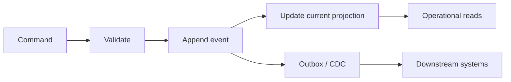
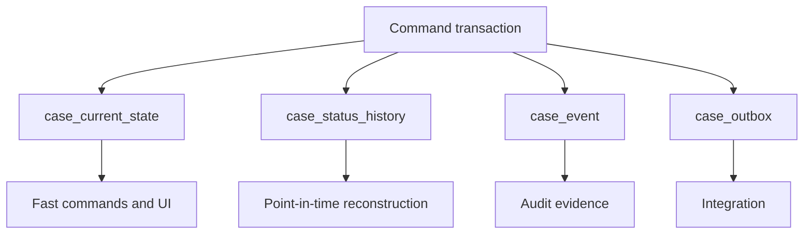

# Part 023 — Temporal SQL, History, and Auditability

## 1. Why This Part Exists

Most application bugs are not only about wrong values.

In serious systems, the harder question is usually:

> What was true, when was it true, when did we know it, who changed it, and can we prove it later?

A simple row like this is operationally convenient:

```sql
CREATE TABLE cases (
  case_id bigint PRIMARY KEY,
  status text NOT NULL,
  assigned_to bigint,
  risk_score numeric(8, 4),
  updated_at timestamptz NOT NULL DEFAULT now()
);
```

But it cannot answer defensible questions:

- What was the case status on 2026-04-10 at 09:00?
- Who changed the risk score?
- Did the assigned reviewer change before or after the escalation deadline?
- Was the customer address valid at the time the notice was sent?
- Did we know the evidence was invalid when the enforcement decision was approved?
- Was a later correction backdated, or was it known at the time?
- Can we reproduce the report that management saw last quarter?

A top-level SQL engineer must treat time as a first-class dimension of truth.

Temporal modelling is not just storing `created_at` and `updated_at`. It is the discipline of preserving enough history to reconstruct facts under specific time semantics.

---

## 2. Kaufman Framing: The Sub-Skill We Are Training

The sub-skill is:

> Given a business fact that changes over time, choose the correct temporal representation so the system can answer operational, analytical, and audit questions without corrupting current-state performance.

You are training to:

- distinguish current state from historical fact,
- separate event time, valid time, system time, and observed time,
- design append-only history tables,
- model effective date ranges safely,
- detect gaps and overlaps,
- reconstruct point-in-time state,
- support late-arriving corrections,
- design audit trails that are evidence, not decoration,
- avoid soft-delete-as-history anti-patterns,
- decide when to use vendor temporal-table features,
- keep temporal queries indexable and explainable.

Kaufman-style practice loop:

1. Pick one mutable field.
2. Ask which time dimension matters.
3. Choose current-only, event log, valid-time, system-time, or bitemporal modelling.
4. Write the DDL.
5. Write the as-of query.
6. Write the overlap/gap assertion.
7. Write the correction workflow.
8. Test with late-arriving data.

---

## 3. Mental Model: Time Is Not One Thing

Many systems collapse all time into one timestamp.

That is almost always wrong.

| Time concept | Question it answers | Example column |
|---|---|---|
| Event time | When did the business event happen? | `occurred_at` |
| Valid time | When was the fact true in the real/business world? | `valid_from`, `valid_to` |
| System time / transaction time | When did the database know this row version? | `recorded_from`, `recorded_to` |
| Processing time | When did our pipeline process it? | `processed_at` |
| Decision time | When did a person/system make a decision? | `decided_at` |
| Publication time | When was it visible to a downstream consumer? | `published_at` |
| Load time | When was the data loaded into storage? | `loaded_at` |

The key discipline:

> Never use one timestamp to answer multiple temporal questions unless the business has explicitly proven they are the same.

Example:

```sql
-- Ambiguous: does this mean happened, recorded, processed, or effective?
updated_at timestamptz NOT NULL
```

Better:

```sql
occurred_at     timestamptz NOT NULL,
recorded_at     timestamptz NOT NULL DEFAULT now(),
effective_from  timestamptz NOT NULL,
processed_at    timestamptz
```

---

## 4. The Four Common Temporal Shapes

### 4.1 Current-State Table

Use when only the latest value is needed.

```sql
CREATE TABLE case_current_state (
  case_id bigint PRIMARY KEY,
  status text NOT NULL,
  assigned_to_user_id bigint,
  risk_score numeric(8, 4),
  version bigint NOT NULL DEFAULT 0,
  updated_at timestamptz NOT NULL DEFAULT now()
);
```

Good for:

- fast operational reads,
- command validation,
- UI screens,
- queue filtering,
- cache-friendly APIs.

Bad for:

- audit reconstruction,
- point-in-time reporting,
- late-arriving corrections,
- legal evidence,
- explaining why a value changed.

A current-state table is not wrong. It is incomplete if used as the only source of truth.

---

### 4.2 Append-Only Event Table

Use when you need evidence of what happened.

```sql
CREATE TABLE case_event (
  event_id uuid PRIMARY KEY,
  case_id bigint NOT NULL,
  event_type text NOT NULL,
  occurred_at timestamptz NOT NULL,
  recorded_at timestamptz NOT NULL DEFAULT now(),
  actor_type text NOT NULL,
  actor_id text NOT NULL,
  source_system text NOT NULL,
  command_id uuid,
  payload jsonb NOT NULL,
  previous_hash bytea,
  row_hash bytea,

  CONSTRAINT case_event_type_not_blank CHECK (event_type <> ''),
  CONSTRAINT case_event_actor_type_check CHECK (actor_type IN ('user', 'system', 'integration'))
);

CREATE INDEX idx_case_event_case_recorded
  ON case_event (case_id, recorded_at, event_id);

CREATE INDEX idx_case_event_type_recorded
  ON case_event (event_type, recorded_at);
```

Good for:

- immutable history,
- audit trail,
- replay/projection,
- root-cause analysis,
- outbox/CDC integration,
- explaining command side effects.

Bad for:

- fast current-state reads unless projected,
- simple ad hoc reporting,
- enforcing complex temporal invariants directly,
- queries that need latest value per attribute without projection.

Pattern:



---

### 4.3 Valid-Time History Table

Use when a fact is true over a business-effective interval.

Example: assignment history.

```sql
CREATE TABLE case_assignment_history (
  assignment_id bigint GENERATED ALWAYS AS IDENTITY PRIMARY KEY,
  case_id bigint NOT NULL,
  assigned_to_user_id bigint NOT NULL,
  valid_from timestamptz NOT NULL,
  valid_to timestamptz,
  assigned_by_user_id bigint NOT NULL,
  reason_code text NOT NULL,
  recorded_at timestamptz NOT NULL DEFAULT now(),

  CONSTRAINT assignment_positive_interval CHECK (
    valid_to IS NULL OR valid_to > valid_from
  )
);

CREATE INDEX idx_assignment_case_valid_from
  ON case_assignment_history (case_id, valid_from DESC);

CREATE INDEX idx_assignment_case_open
  ON case_assignment_history (case_id)
  WHERE valid_to IS NULL;
```

Common query:

```sql
SELECT *
FROM case_assignment_history h
WHERE h.case_id = :case_id
  AND h.valid_from <= :as_of
  AND (h.valid_to > :as_of OR h.valid_to IS NULL);
```

This answers:

> Who was assigned at business time `:as_of`?

---

### 4.4 Bitemporal Table

Use when you must distinguish:

1. when a fact was valid in the business world, and
2. when the system knew or recorded that fact.

Example:

```sql
CREATE TABLE customer_address_bitemporal (
  address_version_id bigint GENERATED ALWAYS AS IDENTITY PRIMARY KEY,
  customer_id bigint NOT NULL,
  address_line_1 text NOT NULL,
  city text NOT NULL,
  country_code char(2) NOT NULL,

  valid_from timestamptz NOT NULL,
  valid_to timestamptz,

  recorded_from timestamptz NOT NULL DEFAULT now(),
  recorded_to timestamptz,

  correction_reason text,
  source_document_id bigint,

  CONSTRAINT address_valid_interval CHECK (
    valid_to IS NULL OR valid_to > valid_from
  ),
  CONSTRAINT address_recorded_interval CHECK (
    recorded_to IS NULL OR recorded_to > recorded_from
  )
);

CREATE INDEX idx_address_bitemporal_lookup
  ON customer_address_bitemporal (
    customer_id,
    valid_from,
    recorded_from
  );
```

Bitemporal question:

> As of 2026-06-01, what did the system believe was the customer address valid on 2026-03-15?

```sql
SELECT *
FROM customer_address_bitemporal a
WHERE a.customer_id = :customer_id
  AND a.valid_from <= :business_as_of
  AND (a.valid_to > :business_as_of OR a.valid_to IS NULL)
  AND a.recorded_from <= :knowledge_as_of
  AND (a.recorded_to > :knowledge_as_of OR a.recorded_to IS NULL);
```

This is a different question from:

> What is the corrected address for 2026-03-15 according to what we know now?

For that, use `knowledge_as_of = now()`.

---

## 5. Temporal Design Decision Matrix

| Need | Recommended shape |
|---|---|
| Fast latest value only | Current-state table |
| Explain every change | Append-only event table |
| Query who/what was valid at a business time | Valid-time history table |
| Reconstruct what the system believed at a past time | System-time or bitemporal table |
| Late-arriving correction matters | Bitemporal table |
| Legal/audit evidence required | Append-only event + immutable metadata |
| Operational dashboard needs current row | Current projection from events/history |
| Analytical timeline needed | Event/history table with time indexes |
| Need vendor-managed row version history | System-versioned temporal table, where supported |

Rule of thumb:

> If a fact can be corrected retroactively, valid time alone is not enough.

---

## 6. Current State Plus History: The Workhorse Pattern

Most production systems use both current state and history.



Example DDL:

```sql
CREATE TABLE case_current_state (
  case_id bigint PRIMARY KEY,
  status text NOT NULL,
  status_changed_at timestamptz NOT NULL,
  assigned_to_user_id bigint,
  version bigint NOT NULL DEFAULT 0,
  updated_at timestamptz NOT NULL DEFAULT now()
);

CREATE TABLE case_status_history (
  status_history_id bigint GENERATED ALWAYS AS IDENTITY PRIMARY KEY,
  case_id bigint NOT NULL,
  status text NOT NULL,
  valid_from timestamptz NOT NULL,
  valid_to timestamptz,
  changed_by_user_id bigint,
  transition_reason text NOT NULL,
  command_id uuid NOT NULL,
  recorded_at timestamptz NOT NULL DEFAULT now(),

  CONSTRAINT status_history_interval CHECK (
    valid_to IS NULL OR valid_to > valid_from
  )
);

CREATE UNIQUE INDEX uq_case_status_open
  ON case_status_history (case_id)
  WHERE valid_to IS NULL;

CREATE INDEX idx_case_status_history_lookup
  ON case_status_history (case_id, valid_from DESC);
```

Transition transaction:

```sql
BEGIN;

-- 1. Guard current state.
UPDATE case_current_state
SET status = :new_status,
    status_changed_at = :changed_at,
    version = version + 1,
    updated_at = now()
WHERE case_id = :case_id
  AND status = :expected_old_status
  AND version = :expected_version;

-- Application must check affected row count = 1.

-- 2. Close previous open history interval.
UPDATE case_status_history
SET valid_to = :changed_at
WHERE case_id = :case_id
  AND valid_to IS NULL;

-- 3. Insert new open interval.
INSERT INTO case_status_history (
  case_id,
  status,
  valid_from,
  valid_to,
  changed_by_user_id,
  transition_reason,
  command_id
)
VALUES (
  :case_id,
  :new_status,
  :changed_at,
  NULL,
  :actor_user_id,
  :reason,
  :command_id
);

-- 4. Append audit event.
INSERT INTO case_event (
  event_id,
  case_id,
  event_type,
  occurred_at,
  actor_type,
  actor_id,
  source_system,
  command_id,
  payload
)
VALUES (
  gen_random_uuid(),
  :case_id,
  'CASE_STATUS_CHANGED',
  :changed_at,
  'user',
  :actor_user_id::text,
  'case-service',
  :command_id,
  jsonb_build_object(
    'oldStatus', :expected_old_status,
    'newStatus', :new_status,
    'reason', :reason
  )
);

COMMIT;
```

This is more verbose than updating one `status` column.

It is also far more defensible.

---

## 7. Point-in-Time Reconstruction

### 7.1 Latest Current State

```sql
SELECT *
FROM case_current_state
WHERE case_id = :case_id;
```

### 7.2 Status As of Business Time

```sql
SELECT status
FROM case_status_history
WHERE case_id = :case_id
  AND valid_from <= :as_of
  AND (valid_to > :as_of OR valid_to IS NULL);
```

### 7.3 Full Case Timeline

```sql
SELECT
  valid_from,
  valid_to,
  status,
  changed_by_user_id,
  transition_reason,
  recorded_at
FROM case_status_history
WHERE case_id = :case_id
ORDER BY valid_from, status_history_id;
```

### 7.4 Operational Dashboard As of Date

```sql
SELECT status, count(*) AS case_count
FROM case_status_history
WHERE valid_from <= :as_of
  AND (valid_to > :as_of OR valid_to IS NULL)
GROUP BY status
ORDER BY status;
```

This query is often required for management reports and audit reports.

Be careful: if `valid_from` is backdated later, this query answers corrected business truth, not what the system believed on that reporting date. For that, you need system time or bitemporal modelling.

---

## 8. Gaps and Overlaps Are Temporal Data Bugs

A valid-time history table should normally have one active row per entity at any point in time.

Bad timeline:

```text
case_id = 10

OPEN       [2026-01-01, 2026-02-01)
REVIEW     [2026-01-20, 2026-03-01)  -- overlap
APPROVED   [2026-03-10, infinity)    -- gap from 2026-03-01 to 2026-03-10
```

### 8.1 Detect Overlaps

Portable SQL pattern:

```sql
SELECT a.case_id, a.status_history_id AS row_a, b.status_history_id AS row_b
FROM case_status_history a
JOIN case_status_history b
  ON b.case_id = a.case_id
 AND b.status_history_id > a.status_history_id
 AND a.valid_from < COALESCE(b.valid_to, 'infinity'::timestamptz)
 AND b.valid_from < COALESCE(a.valid_to, 'infinity'::timestamptz);
```

Interval overlap rule:

```text
A overlaps B if:
A.start < B.end AND B.start < A.end
```

Use half-open intervals: `[valid_from, valid_to)`.

They make boundary semantics clean.

If one row ends exactly when another starts, they do not overlap.

### 8.2 Detect Gaps

```sql
WITH ordered AS (
  SELECT
    case_id,
    status_history_id,
    status,
    valid_from,
    valid_to,
    lead(valid_from) OVER (
      PARTITION BY case_id
      ORDER BY valid_from, status_history_id
    ) AS next_valid_from
  FROM case_status_history
)
SELECT *
FROM ordered
WHERE valid_to IS NOT NULL
  AND next_valid_from IS NOT NULL
  AND valid_to <> next_valid_from;
```

Not every model requires gap-free history.

But if your business says an entity must always be in one status after creation, gaps are defects.

---

## 9. PostgreSQL Range Types for Temporal Invariants

PostgreSQL range types can model intervals directly.

Example:

```sql
CREATE EXTENSION IF NOT EXISTS btree_gist;

CREATE TABLE case_assignment_period (
  assignment_id bigint GENERATED ALWAYS AS IDENTITY PRIMARY KEY,
  case_id bigint NOT NULL,
  assigned_to_user_id bigint NOT NULL,
  valid_period tstzrange NOT NULL,
  assigned_by_user_id bigint NOT NULL,

  CONSTRAINT assignment_non_empty_period CHECK (NOT isempty(valid_period)),
  CONSTRAINT assignment_no_overlap EXCLUDE USING gist (
    case_id WITH =,
    valid_period WITH &&
  )
);
```

The exclusion constraint prevents overlapping assignment intervals per case.

As-of query:

```sql
SELECT *
FROM case_assignment_period
WHERE case_id = :case_id
  AND valid_period @> :as_of::timestamptz;
```

Index support:

```sql
CREATE INDEX idx_assignment_period_gist
  ON case_assignment_period
  USING gist (case_id, valid_period);
```

Range types are powerful, but they reduce portability. Use them when your engine supports them and temporal correctness is important enough to justify dialect-specific modelling.

---

## 10. System-Versioned Temporal Tables

Some engines can maintain system-time history automatically.

SQL Server supports system-versioned temporal tables where the database maintains current and history rows for point-in-time analysis.

Conceptually:

```sql
CREATE TABLE dbo.CaseState (
  CaseId bigint NOT NULL PRIMARY KEY,
  Status nvarchar(50) NOT NULL,
  AssignedToUserId bigint NULL,
  ValidFrom datetime2 GENERATED ALWAYS AS ROW START NOT NULL,
  ValidTo datetime2 GENERATED ALWAYS AS ROW END NOT NULL,
  PERIOD FOR SYSTEM_TIME (ValidFrom, ValidTo)
)
WITH (SYSTEM_VERSIONING = ON (HISTORY_TABLE = dbo.CaseStateHistory));
```

Query as of system time:

```sql
SELECT *
FROM dbo.CaseState
FOR SYSTEM_TIME AS OF '2026-05-01T10:00:00'
WHERE CaseId = 123;
```

Strengths:

- automatic row-version history,
- good for “what did the database row look like then?” questions,
- less custom history DML,
- useful for auditing accidental changes.

Limitations:

- system time is not the same as business valid time,
- it does not automatically explain why a change occurred,
- it may not capture actor, command, rule version, or source document,
- retention/storage must be managed,
- application-level event evidence may still be required.

A system-versioned table is not a full audit strategy by itself.

---

## 11. Audit Log Is Not the Same as History

History tells you values over time.

Audit tells you evidence about actions.

| Feature | History table | Audit/event table |
|---|---|---|
| Main question | What was the value? | Who did what, why, from where? |
| Shape | Attribute/state intervals | Append-only events |
| Typical key | entity + period | event id / command id |
| Mutability | Usually append/close interval | Ideally append-only |
| Payload | Structured columns | Structured columns + contextual JSON |
| Query | As-of state | Investigation trail |

Bad audit table:

```sql
CREATE TABLE audit_log (
  id bigint PRIMARY KEY,
  table_name text,
  row_id text,
  changed_at timestamptz,
  old_value text,
  new_value text
);
```

Why weak:

- no actor model,
- no source system,
- no command/request correlation,
- no reason code,
- no immutable hash/checksum,
- no business semantics,
- difficult to reconstruct multi-row transaction intent,
- often captures low-level database mutation but not decision context.

Better:

```sql
CREATE TABLE audit_event (
  audit_event_id uuid PRIMARY KEY,
  aggregate_type text NOT NULL,
  aggregate_id text NOT NULL,
  event_type text NOT NULL,
  occurred_at timestamptz NOT NULL,
  recorded_at timestamptz NOT NULL DEFAULT now(),
  actor_type text NOT NULL,
  actor_id text NOT NULL,
  source_ip inet,
  user_agent text,
  source_system text NOT NULL,
  request_id text,
  command_id uuid,
  rule_version text,
  reason_code text,
  evidence_document_id bigint,
  payload jsonb NOT NULL,
  previous_event_hash bytea,
  event_hash bytea,

  CONSTRAINT audit_actor_type_check CHECK (
    actor_type IN ('user', 'system', 'integration', 'migration')
  )
);

CREATE INDEX idx_audit_aggregate_time
  ON audit_event (aggregate_type, aggregate_id, recorded_at, audit_event_id);

CREATE INDEX idx_audit_command
  ON audit_event (command_id)
  WHERE command_id IS NOT NULL;
```

---

## 12. Designing for Corrections

Temporal systems need correction semantics.

There are at least four different correction types:

| Correction type | Meaning | Example |
|---|---|---|
| Prospective change | New value from now onward | Assign case to new officer today |
| Retroactive correction | Past valid-time fact was wrong | Address effective last month was wrong |
| System correction | Data entry was wrong but business fact unchanged | Typo fix |
| Reclassification | Interpretation changed because rule changed | Risk category recalculated under rule v2 |

Do not handle all of these with one `UPDATE`.

### 12.1 Prospective Change

Close current interval and open a new interval.

```sql
UPDATE case_assignment_history
SET valid_to = :effective_at
WHERE case_id = :case_id
  AND valid_to IS NULL;

INSERT INTO case_assignment_history (
  case_id,
  assigned_to_user_id,
  valid_from,
  valid_to,
  assigned_by_user_id,
  reason_code
)
VALUES (
  :case_id,
  :new_user_id,
  :effective_at,
  NULL,
  :actor_user_id,
  'REASSIGNMENT'
);
```

### 12.2 Retroactive Correction

You may need to split intervals.

Existing:

```text
A: [2026-01-01, 2026-04-01)
B: [2026-04-01, infinity)
```

Correction:

```text
A was true only until 2026-02-15
C was true from 2026-02-15 to 2026-04-01
B remains true from 2026-04-01
```

This requires:

1. close/split affected intervals,
2. insert corrected interval,
3. record correction event,
4. preserve who made correction and when,
5. ensure reports know whether they use corrected truth or historically-known truth.

### 12.3 Correction Event

```sql
INSERT INTO audit_event (
  audit_event_id,
  aggregate_type,
  aggregate_id,
  event_type,
  occurred_at,
  actor_type,
  actor_id,
  source_system,
  command_id,
  reason_code,
  payload
)
VALUES (
  gen_random_uuid(),
  'case',
  :case_id::text,
  'TEMPORAL_CORRECTION_APPLIED',
  now(),
  'user',
  :actor_user_id::text,
  'case-service',
  :command_id,
  :reason_code,
  jsonb_build_object(
    'correctedTable', 'case_assignment_history',
    'businessEffectiveFrom', :effective_from,
    'businessEffectiveTo', :effective_to,
    'oldAssignedTo', :old_user_id,
    'newAssignedTo', :new_user_id,
    'sourceDocumentId', :source_document_id
  )
);
```

---

## 13. Soft Delete Is Not Auditability

A common pattern:

```sql
ALTER TABLE cases ADD COLUMN deleted_at timestamptz;
```

This is useful for operational deletion semantics.

It is not a complete history model.

Soft delete can answer:

- is this row currently deleted?
- when was it marked deleted?

It cannot fully answer:

- what values changed before deletion?
- who deleted it and under what authority?
- was deletion reversed?
- was the row visible to user X at time Y?
- what report included it last quarter?

Better:

```sql
ALTER TABLE cases
ADD COLUMN deleted_at timestamptz,
ADD COLUMN deleted_by_user_id bigint,
ADD COLUMN delete_reason text;

INSERT INTO case_event (... event_type, payload ...)
VALUES (... 'CASE_DELETED', jsonb_build_object('reason', :reason));
```

For legally sensitive data, soft delete may conflict with privacy deletion requirements. In those cases, separate deletion marker, redaction record, retention policy, and audit evidence may be required.

---

## 14. Temporal Query Patterns

### 14.1 Latest Row Per Entity

```sql
SELECT *
FROM (
  SELECT
    h.*,
    row_number() OVER (
      PARTITION BY case_id
      ORDER BY valid_from DESC, status_history_id DESC
    ) AS rn
  FROM case_status_history h
) x
WHERE rn = 1;
```

Use only when `valid_to IS NULL` cannot be trusted or when you need “latest by timestamp”.

If your model has exactly one open row, prefer:

```sql
SELECT *
FROM case_status_history
WHERE valid_to IS NULL;
```

Back it with a partial unique index.

### 14.2 Duration in Each Status

```sql
SELECT
  status,
  sum(
    extract(epoch FROM (COALESCE(valid_to, now()) - valid_from))
  ) / 3600.0 AS hours_in_status
FROM case_status_history
WHERE case_id = :case_id
GROUP BY status
ORDER BY hours_in_status DESC;
```

### 14.3 SLA Breach Over Time

```sql
SELECT
  c.case_id,
  c.status,
  c.valid_from,
  c.valid_to,
  d.deadline_at,
  CASE
    WHEN COALESCE(c.valid_to, now()) > d.deadline_at THEN true
    ELSE false
  END AS breached
FROM case_status_history c
JOIN case_deadline d
  ON d.case_id = c.case_id
 AND d.deadline_type = 'INITIAL_REVIEW'
WHERE c.status = 'AWAITING_REVIEW';
```

### 14.4 Reconstruct Report Snapshot

Corrected business truth as of date:

```sql
SELECT status, count(*)
FROM case_status_history
WHERE valid_from <= :report_as_of
  AND (valid_to > :report_as_of OR valid_to IS NULL)
GROUP BY status;
```

Historically-known truth as of report generation time requires bitemporal data:

```sql
SELECT status, count(*)
FROM case_status_bitemporal
WHERE valid_from <= :business_as_of
  AND (valid_to > :business_as_of OR valid_to IS NULL)
  AND recorded_from <= :knowledge_as_of
  AND (recorded_to > :knowledge_as_of OR recorded_to IS NULL)
GROUP BY status;
```

---

## 15. Indexing Temporal Data

Temporal tables usually need indexes for three query families.

### 15.1 Current/Open Row Query

```sql
CREATE INDEX idx_status_open_case
  ON case_status_history (case_id)
  WHERE valid_to IS NULL;
```

### 15.2 Entity Timeline Query

```sql
CREATE INDEX idx_status_case_timeline
  ON case_status_history (case_id, valid_from, status_history_id);
```

### 15.3 Global As-of Query

```sql
CREATE INDEX idx_status_asof
  ON case_status_history (valid_from, valid_to, status);
```

But be careful: global as-of queries over large tables can still be expensive.

For high-volume reporting, consider:

- partitioning by `valid_from` or `recorded_at`,
- materialized daily snapshots,
- summary tables,
- OLAP warehouse models,
- columnar storage for temporal analytics,
- precomputed lifecycle durations.

Temporal correctness and temporal analytics are related but not identical workloads.

---

## 16. Partitioning and Retention

Temporal tables grow continuously.

Design retention early.

| Data | Typical retention strategy |
|---|---|
| Current state | Keep forever while entity exists |
| Event/audit log | Retain according to legal/compliance policy |
| Outbox | Short retention after successful publication |
| Operational history | Retain while needed for support/reporting |
| Legal evidence | Retain immutable or archived form |
| PII-heavy payload | Redact/tokenize according to privacy policy |

Partition candidates:

```sql
recorded_at
occurred_at
valid_from
tenant_id + recorded_at
```

Partitioning by `recorded_at` is often operationally simpler because records are appended in roughly increasing order.

Partitioning by `valid_from` may be useful for business-effective analytics but can be awkward with retroactive corrections.

---

## 17. Temporal Anti-Patterns

### 17.1 Only `updated_at`

```sql
status text NOT NULL,
updated_at timestamptz NOT NULL
```

This loses previous state.

### 17.2 Mutable Audit Rows

```sql
UPDATE audit_event
SET payload = :new_payload
WHERE audit_event_id = :id;
```

If you must correct audit data, append a correction event.

### 17.3 `valid_to = '9999-12-31'` Everywhere

Some systems use sentinel dates.

This may be needed for engine compatibility, but it causes subtle bugs:

- date overflow,
- ugly predicates,
- inconsistent sentinel values,
- business confusion,
- hard-coded application assumptions.

Prefer `NULL` for open-ended intervals if your query discipline is strong, or use engine-native infinity/range types where appropriate.

### 17.4 Inclusive End Dates

```sql
valid_from <= :as_of AND valid_to >= :as_of
```

Inclusive end boundaries create ambiguity at exact transition times.

Prefer half-open intervals:

```sql
valid_from <= :as_of AND (valid_to > :as_of OR valid_to IS NULL)
```

### 17.5 Trigger-Only Audit Without Business Meaning

Database triggers can capture row changes, but they often miss business intent.

A trigger may know:

```text
status changed from REVIEW to APPROVED
```

It may not know:

```text
approved after senior review under policy version ENF-2026.4 using evidence bundle 8841
```

Use triggers carefully. They are useful for technical audit, not always sufficient for business audit.

### 17.6 Reporting from Mutable Current Tables

A report run from current tables cannot be reproduced later unless the data has not changed.

For management, finance, regulatory, or enforcement reports, snapshot or temporal reconstruction must be explicit.

---

## 18. Temporal Modelling for Regulatory Defensibility

A defensible temporal model should preserve:

- the fact,
- the effective period,
- the actor,
- the authority/rule used,
- the source evidence,
- the command/request correlation,
- the original observation time,
- the system recording time,
- correction lineage,
- export/report snapshot identity,
- retention/redaction state.

Example decision record:

```sql
CREATE TABLE enforcement_decision (
  decision_id bigint GENERATED ALWAYS AS IDENTITY PRIMARY KEY,
  case_id bigint NOT NULL,
  decision_type text NOT NULL,
  decision_status text NOT NULL,
  decided_at timestamptz NOT NULL,
  decided_by_user_id bigint NOT NULL,
  policy_version text NOT NULL,
  evidence_bundle_id bigint NOT NULL,
  rationale text NOT NULL,
  recorded_at timestamptz NOT NULL DEFAULT now(),
  superseded_by_decision_id bigint,

  CONSTRAINT decision_status_check CHECK (
    decision_status IN ('draft', 'approved', 'rejected', 'superseded', 'withdrawn')
  )
);
```

Do not overwrite approved decisions casually.

Append superseding decisions.

```sql
UPDATE enforcement_decision
SET decision_status = 'superseded',
    superseded_by_decision_id = :new_decision_id
WHERE decision_id = :old_decision_id
  AND decision_status = 'approved';
```

Then append an audit event explaining the supersession.

---

## 19. Temporal Data and Application Architecture

### 19.1 Transaction Script Style

The service explicitly writes current state, history, event, and outbox in one transaction.

Pros:

- very explicit,
- easy to reason about,
- application controls business meaning,
- works across engines.

Cons:

- more boilerplate,
- needs disciplined transaction boundaries,
- easy to forget one table without tests.

### 19.2 Trigger-Based History

Database trigger captures old/new row versions.

Pros:

- centralized,
- hard to bypass if all writes go through table,
- useful for technical audit.

Cons:

- hidden behavior,
- harder to test at application layer,
- may lack business context,
- can surprise bulk loads/migrations,
- portability issues.

### 19.3 Event-Sourced Projection

Events are source of truth; current tables are projections.

Pros:

- full event history,
- replayable,
- natural audit trail,
- good integration story.

Cons:

- harder ad hoc SQL,
- projection lag/repair complexity,
- event schema evolution is hard,
- not every business domain needs full event sourcing.

The pragmatic enterprise pattern is often:

> current table + history table + audit/event table + outbox.

---

## 20. Testing Temporal Models

Minimum test cases:

1. Create entity.
2. Change state prospectively.
3. Query current state.
4. Query state before transition.
5. Query state exactly at transition timestamp.
6. Query state after transition.
7. Apply late correction.
8. Verify corrected business truth.
9. Verify historically-known truth, if bitemporal.
10. Detect gaps and overlaps.
11. Attempt duplicate open interval.
12. Attempt overlapping interval.
13. Verify audit event exists.
14. Verify actor/source/reason fields are populated.
15. Verify report snapshot can be reproduced.

Boundary test:

```sql
-- If A ends at 10:00 and B starts at 10:00,
-- as_of 10:00 should return B, not A.
```

This is why half-open intervals matter.

---

## 21. Practice Lab: Case Status Timeline

Create these tables:

- `case_current_state`,
- `case_status_history`,
- `case_event`.

Implement commands:

1. create case,
2. submit case,
3. assign case,
4. escalate case,
5. approve case,
6. close case,
7. reopen case.

For each command:

- update current state,
- close/open history interval,
- append audit event,
- use command id for idempotency,
- enforce expected current state.

Then write queries:

```sql
-- Current case state
-- Case timeline
-- Status as of timestamp
-- Cases in each status as of timestamp
-- Cases that breached SLA while in review
-- Invalid timeline gaps
-- Invalid timeline overlaps
-- Audit trail by command id
```

The goal is not just to write SQL.

The goal is to make temporal truth inspectable.

---

## 22. Production Checklist

Before approving a temporal model, ask:

- What temporal question does each timestamp answer?
- Is current state separate from history?
- Can we reconstruct as-of business time?
- Can we reconstruct what the system knew at a past time?
- Are intervals half-open?
- Are gaps allowed?
- Are overlaps allowed?
- Is there exactly one open row per entity when required?
- Are late corrections supported?
- Is actor/source/reason captured?
- Is rule/policy version captured where decisions matter?
- Are audit records append-only?
- Are history writes in the same transaction as current-state writes?
- Are temporal assertions tested?
- Are as-of queries indexed?
- Is retention/redaction policy explicit?
- Can reports be reproduced?

---

## 23. Common Interview-Level Traps

### Trap 1: “Just Add `created_at` and `updated_at`”

That gives lifecycle metadata, not history.

### Trap 2: “Use Soft Delete for Audit”

Soft delete is visibility control, not evidence.

### Trap 3: “Use Events Only”

Events are excellent evidence, but operational SQL often needs projections.

### Trap 4: “Temporal Tables Solve Everything”

System-versioning records row versions, not always actor, command intent, rule version, source document, or business valid time.

### Trap 5: “Backdated Data Is Fine”

Backdated data changes past business truth. You must decide whether old reports are corrected or preserved as originally known.

---

## 24. References

- PostgreSQL Documentation — Range Types and Exclusion Constraints: `https://www.postgresql.org/docs/current/rangetypes.html`
- PostgreSQL Documentation — Constraints: `https://www.postgresql.org/docs/current/ddl-constraints.html`
- PostgreSQL Documentation — Date/Time Types: `https://www.postgresql.org/docs/current/datatype-datetime.html`
- SQL Server Documentation — Temporal Tables: `https://learn.microsoft.com/en-us/sql/relational-databases/tables/temporal-tables`
- SQL Server Documentation — Get Started with System-Versioned Temporal Tables: `https://learn.microsoft.com/en-us/sql/relational-databases/tables/getting-started-with-system-versioned-temporal-tables`
- Martin Fowler — Temporal Patterns and Enterprise Application Architecture concepts: `https://martinfowler.com/`

---

## 25. What You Should Be Able to Do Now

You should now be able to:

- explain why `updated_at` is not history,
- distinguish valid time from system time,
- design current + history + audit tables,
- write as-of queries,
- detect temporal gaps and overlaps,
- model late-arriving corrections,
- choose when bitemporal modelling is required,
- reason about vendor-managed temporal tables,
- design audit evidence for regulatory reconstruction.

The next part moves into semi-structured data and JSON.

The key question becomes:

> When should data remain relational, when should it become JSON, and how do we avoid turning SQL into an ungoverned document graveyard?
