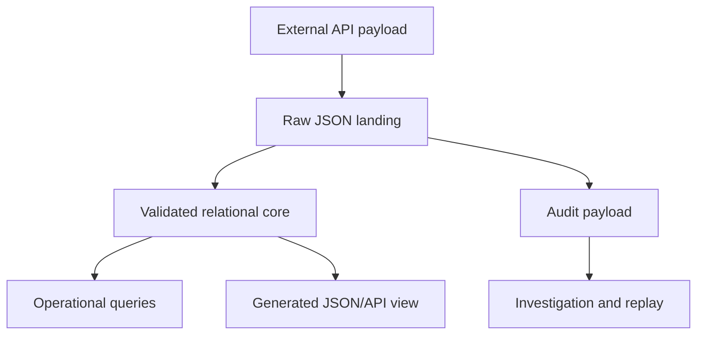
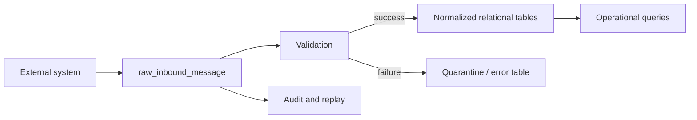
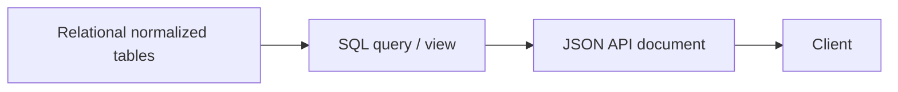

# Part 024 — JSON, Semi-Structured, and Hybrid Relational Design

## 1. Why This Part Exists

JSON in SQL databases is powerful.

It is also one of the easiest ways to destroy data quality.

A column like this looks harmless:

```sql
metadata jsonb NOT NULL
```

But after two years it often contains:

```json
{
  "priority": "high",
  "sla": "48h",
  "reviewer": { "id": 123, "name": "Ari" },
  "riskScore": "0.87",
  "risk_score": 0.91,
  "isEscalated": true,
  "escalated": "yes",
  "documents": [
    { "id": 1, "type": "pdf" },
    { "documentId": 2, "kind": "evidence" }
  ]
}
```

Now the database cannot reliably answer:

- which cases are escalated?
- what is the risk score type?
- who owns the reviewer relationship?
- which fields are PII?
- which JSON shape is current?
- how do we index this?
- how do we enforce required keys?
- what breaks if the application changes field names?

JSON should be a deliberate design boundary, not a shortcut around modelling.

---

## 2. Kaufman Framing: The Sub-Skill We Are Training

The sub-skill is:

> Given semi-structured or evolving data, decide which parts belong in relational columns, which parts can live in JSON, how to validate/index/query them, and when to promote JSON fields into first-class schema.

You are training to:

- separate core relational truth from flexible payload,
- identify JSON-safe and JSON-dangerous fields,
- design hybrid relational/document models,
- query JSON without destroying performance,
- index JSON intentionally,
- validate JSON shape at boundaries,
- avoid EAV and JSON blob anti-patterns,
- version JSON payloads,
- preserve audit payloads without making them operational source of truth,
- migrate frequently used JSON attributes into columns.

Kaufman-style drills:

1. Take a JSON payload.
2. Classify each field: identity, relationship, invariant, search key, display-only, audit context, extension.
3. Promote core fields to columns.
4. Keep volatile/extensible fields in JSON.
5. Add validation.
6. Add indexes only for proven access paths.
7. Write extraction queries.
8. Write migration path from JSON to relational columns.

---

## 3. Mental Model: JSON Is a Boundary, Not a Data Model Escape Hatch

Think of JSON in SQL as one of these boundaries:



Use JSON when:

- input shape varies by source system,
- payload is mostly audit/evidence,
- fields are sparse and rarely queried,
- extension fields are tenant-specific,
- data is stored for replay/debugging,
- document representation is an API contract,
- schema changes faster than relational migrations can safely follow.

Avoid JSON when:

- field participates in joins,
- field is required for integrity,
- field drives workflow state,
- field is frequently filtered/sorted/grouped,
- field needs foreign key enforcement,
- field is part of uniqueness,
- field contains high-value business facts,
- field is used by many services,
- field must be governed as PII or regulated attribute.

Rule:

> If the business depends on it as truth, it probably deserves schema.

---

## 4. Relational vs JSON Decision Matrix

| Field type | Prefer relational column/table | JSON acceptable? |
|---|---:|---:|
| Primary identity | Yes | No |
| Foreign key relationship | Yes | No |
| Workflow status | Yes | No |
| Monetary amount | Yes | Rarely |
| Risk score used in decisions | Yes | Rarely |
| Search/filter key | Yes | Sometimes, with expression/generated index |
| Display-only metadata | Optional | Yes |
| Inbound raw API payload | No | Yes |
| Audit event context | Optional core columns + JSON | Yes |
| Tenant-specific extension | Sometimes extension table | Yes, with governance |
| Feature flags/config | Sometimes normalized | Yes, with versioning |
| Sparse optional attributes | Sometimes | Yes |
| Repeated child entities | Usually child table | Avoid JSON if queryable |

---

## 5. The Hybrid Relational Pattern

A robust pattern:

```sql
CREATE TABLE case_intake (
  intake_id bigint GENERATED ALWAYS AS IDENTITY PRIMARY KEY,
  external_reference text NOT NULL,
  source_system text NOT NULL,
  received_at timestamptz NOT NULL DEFAULT now(),

  -- Relational core extracted from payload
  subject_customer_id bigint,
  intake_type text NOT NULL,
  priority text NOT NULL,
  occurred_at timestamptz,

  -- Raw and semi-structured data
  payload jsonb NOT NULL,
  payload_schema_version int NOT NULL,

  -- Processing state
  normalization_status text NOT NULL DEFAULT 'pending',
  normalization_error text,

  CONSTRAINT intake_priority_check CHECK (priority IN ('low', 'normal', 'high', 'critical')),
  CONSTRAINT intake_normalization_status_check CHECK (
    normalization_status IN ('pending', 'normalized', 'failed', 'ignored')
  )
);

CREATE UNIQUE INDEX uq_intake_source_external_ref
  ON case_intake (source_system, external_reference);

CREATE INDEX idx_intake_priority_received
  ON case_intake (priority, received_at DESC);
```

This gives you:

- stable relational fields for operations,
- raw payload for investigation,
- schema versioning,
- source idempotency,
- processing lifecycle,
- indexable operational queries.

Bad alternative:

```sql
CREATE TABLE case_intake (
  id bigint PRIMARY KEY,
  payload jsonb NOT NULL
);
```

This is easy on day one and expensive on day 300.

---

## 6. PostgreSQL JSON vs JSONB Mental Model

PostgreSQL has both `json` and `jsonb`.

Practical distinction:

| Type | Mental model | Common use |
|---|---|---|
| `json` | Stores textual JSON representation | Preserve exact input formatting/order if needed |
| `jsonb` | Stores decomposed binary representation | Querying, indexing, containment, operational usage |

Typical production default in PostgreSQL:

```sql
payload jsonb NOT NULL
```

But do not confuse `jsonb` with full schema governance.

`jsonb` improves query/index capability; it does not magically enforce domain correctness.

---

## 7. Basic JSON Query Patterns

Assume:

```sql
CREATE TABLE case_event (
  event_id uuid PRIMARY KEY,
  event_type text NOT NULL,
  occurred_at timestamptz NOT NULL,
  payload jsonb NOT NULL
);
```

### 7.1 Extract JSON Object Field

```sql
SELECT payload -> 'risk' AS risk_object
FROM case_event;
```

### 7.2 Extract JSON Text Field

```sql
SELECT payload ->> 'riskScore' AS risk_score_text
FROM case_event;
```

### 7.3 Cast Extracted Value

```sql
SELECT (payload ->> 'riskScore')::numeric(8, 4) AS risk_score
FROM case_event
WHERE event_type = 'RISK_ASSESSED';
```

Be careful: bad payload values can fail casts.

Safer pattern:

```sql
SELECT
  event_id,
  CASE
    WHEN payload ->> 'riskScore' ~ '^[0-9]+(\.[0-9]+)?$'
      THEN (payload ->> 'riskScore')::numeric(8, 4)
    ELSE NULL
  END AS risk_score
FROM case_event;
```

### 7.4 JSON Containment

```sql
SELECT *
FROM case_event
WHERE payload @> '{"escalated": true}'::jsonb;
```

### 7.5 JSON Path-Like Predicate

```sql
SELECT *
FROM case_event
WHERE payload -> 'risk' ->> 'category' = 'high';
```

---

## 8. JSON Arrays: Powerful but Dangerous

Example payload:

```json
{
  "documents": [
    { "documentId": 101, "type": "evidence" },
    { "documentId": 102, "type": "notice" }
  ]
}
```

Query:

```sql
SELECT
  e.event_id,
  d.doc ->> 'documentId' AS document_id,
  d.doc ->> 'type' AS document_type
FROM case_event e
CROSS JOIN LATERAL jsonb_array_elements(e.payload -> 'documents') AS d(doc)
WHERE e.event_type = 'EVIDENCE_ATTACHED';
```

This is acceptable for investigation and low-volume extraction.

But if documents are first-class business entities, model them relationally:

```sql
CREATE TABLE case_document (
  case_document_id bigint GENERATED ALWAYS AS IDENTITY PRIMARY KEY,
  case_id bigint NOT NULL,
  document_id bigint NOT NULL,
  document_type text NOT NULL,
  attached_at timestamptz NOT NULL,
  attached_by_user_id bigint NOT NULL,

  UNIQUE (case_id, document_id)
);
```

JSON arrays are especially risky when:

- they need uniqueness,
- they are joined to other tables,
- they are updated independently,
- they contain lifecycle state,
- they grow without bound,
- they are frequently filtered.

---

## 9. JSON Validation in SQL

SQL databases usually do not validate full JSON Schema natively across all engines.

But you can enforce important invariants.

### 9.1 Required Key

```sql
ALTER TABLE case_event
ADD CONSTRAINT event_payload_has_case_id CHECK (payload ? 'caseId');
```

### 9.2 Type Check

```sql
ALTER TABLE case_event
ADD CONSTRAINT event_payload_case_id_is_string CHECK (
  jsonb_typeof(payload -> 'caseId') = 'string'
);
```

### 9.3 Event-Type-Specific Constraint

```sql
ALTER TABLE case_event
ADD CONSTRAINT risk_event_has_score CHECK (
  event_type <> 'RISK_ASSESSED'
  OR (
    payload ? 'riskScore'
    AND jsonb_typeof(payload -> 'riskScore') IN ('number', 'string')
  )
);
```

### 9.4 Generated Column for Typed Access

Depending on engine support, use generated/computed columns for frequently queried JSON values.

Example conceptual pattern:

```sql
ALTER TABLE case_intake
ADD COLUMN external_case_type text
GENERATED ALWAYS AS ((payload ->> 'caseType')) STORED;

CREATE INDEX idx_case_intake_external_case_type
  ON case_intake (external_case_type);
```

Generated columns make JSON-derived fields more visible to the optimizer and easier to query consistently.

---

## 10. Indexing JSON

### 10.1 Expression Index

Use when one JSON field is frequently filtered.

```sql
CREATE INDEX idx_case_event_payload_risk_category
  ON case_event ((payload -> 'risk' ->> 'category'));
```

Query must match expression shape closely:

```sql
SELECT *
FROM case_event
WHERE payload -> 'risk' ->> 'category' = 'high';
```

### 10.2 Partial Expression Index

Use when only one event type has the field.

```sql
CREATE INDEX idx_risk_assessed_score
  ON case_event (((payload ->> 'riskScore')::numeric))
  WHERE event_type = 'RISK_ASSESSED';
```

Query:

```sql
SELECT *
FROM case_event
WHERE event_type = 'RISK_ASSESSED'
  AND (payload ->> 'riskScore')::numeric >= 0.8;
```

### 10.3 GIN Index for Containment

```sql
CREATE INDEX idx_case_event_payload_gin
  ON case_event
  USING gin (payload);
```

Useful for containment-style predicates:

```sql
SELECT *
FROM case_event
WHERE payload @> '{"escalated": true}'::jsonb;
```

### 10.4 Do Not Index JSON Blindly

A broad GIN index can be large and expensive to maintain.

Before adding a JSON index, ask:

- Which query will use it?
- Is the predicate stable?
- Is the field type consistent?
- Is the field selective?
- Is the write overhead acceptable?
- Would a relational column be better?

If a JSON key becomes important enough to need a carefully tuned index, it may be important enough to become a column.

---

## 11. JSON and Sargability

Bad:

```sql
WHERE lower(payload ->> 'customerEmail') = lower(:email)
```

This is hard to optimize unless an exact expression index exists.

Better:

```sql
customer_email_normalized text GENERATED ALWAYS AS (
  lower(payload ->> 'customerEmail')
) STORED
```

Then:

```sql
CREATE INDEX idx_intake_customer_email_normalized
  ON case_intake (customer_email_normalized);

SELECT *
FROM case_intake
WHERE customer_email_normalized = lower(:email);
```

Best if the field is core:

```sql
customer_email_normalized text NOT NULL
```

and validate/populate it during ingestion.

---

## 12. Versioning JSON Payloads

Never assume all rows have the same JSON shape.

Add a schema version:

```sql
CREATE TABLE integration_message (
  message_id uuid PRIMARY KEY,
  source_system text NOT NULL,
  message_type text NOT NULL,
  schema_version int NOT NULL,
  received_at timestamptz NOT NULL DEFAULT now(),
  payload jsonb NOT NULL,

  UNIQUE (source_system, message_type, message_id)
);
```

Version-aware extraction:

```sql
SELECT
  message_id,
  CASE schema_version
    WHEN 1 THEN payload ->> 'risk_score'
    WHEN 2 THEN payload -> 'risk' ->> 'score'
    ELSE NULL
  END AS risk_score_text
FROM integration_message
WHERE message_type = 'RiskAssessed';
```

Better: normalize into a stable projection.

```sql
CREATE TABLE risk_assessment (
  risk_assessment_id bigint GENERATED ALWAYS AS IDENTITY PRIMARY KEY,
  source_message_id uuid NOT NULL UNIQUE,
  case_id bigint NOT NULL,
  risk_score numeric(8, 4) NOT NULL,
  risk_category text NOT NULL,
  assessed_at timestamptz NOT NULL,
  model_version text NOT NULL
);
```

Raw JSON is preserved; operational truth is normalized.

---

## 13. Raw Landing + Normalized Projection

This is the most reliable pattern for integrations.



DDL:

```sql
CREATE TABLE raw_inbound_message (
  raw_message_id uuid PRIMARY KEY,
  source_system text NOT NULL,
  external_message_id text NOT NULL,
  message_type text NOT NULL,
  schema_version int NOT NULL,
  received_at timestamptz NOT NULL DEFAULT now(),
  payload jsonb NOT NULL,
  processing_status text NOT NULL DEFAULT 'pending',
  processing_error text,

  UNIQUE (source_system, external_message_id),

  CONSTRAINT raw_message_status_check CHECK (
    processing_status IN ('pending', 'processed', 'failed', 'ignored')
  )
);

CREATE TABLE normalized_case_signal (
  case_signal_id bigint GENERATED ALWAYS AS IDENTITY PRIMARY KEY,
  raw_message_id uuid NOT NULL UNIQUE,
  case_id bigint NOT NULL,
  signal_type text NOT NULL,
  signal_strength numeric(8, 4),
  occurred_at timestamptz NOT NULL,
  source_system text NOT NULL
);
```

Processing transaction:

```sql
BEGIN;

INSERT INTO normalized_case_signal (
  raw_message_id,
  case_id,
  signal_type,
  signal_strength,
  occurred_at,
  source_system
)
SELECT
  raw_message_id,
  (payload ->> 'caseId')::bigint,
  payload ->> 'signalType',
  (payload ->> 'strength')::numeric(8, 4),
  (payload ->> 'occurredAt')::timestamptz,
  source_system
FROM raw_inbound_message
WHERE raw_message_id = :raw_message_id
  AND processing_status = 'pending';

UPDATE raw_inbound_message
SET processing_status = 'processed'
WHERE raw_message_id = :raw_message_id
  AND processing_status = 'pending';

COMMIT;
```

If normalization fails, mark it explicitly:

```sql
UPDATE raw_inbound_message
SET processing_status = 'failed',
    processing_error = :error_message
WHERE raw_message_id = :raw_message_id;
```

---

## 14. JSON as Audit Payload

Audit/event payload is one of the best uses of JSON.

Example:

```sql
INSERT INTO case_event (
  event_id,
  event_type,
  occurred_at,
  payload
)
VALUES (
  gen_random_uuid(),
  'CASE_ESCALATED',
  now(),
  jsonb_build_object(
    'caseId', :case_id,
    'oldPriority', :old_priority,
    'newPriority', :new_priority,
    'reasonCode', :reason_code,
    'ruleVersion', :rule_version,
    'evidenceIds', :evidence_ids
  )
);
```

Why JSON fits:

- event types have different shapes,
- payload is contextual,
- many fields are not queried often,
- preserving evidence matters,
- schema can evolve by event type.

But do not hide core event identity in JSON only.

Better:

```sql
CREATE TABLE case_event (
  event_id uuid PRIMARY KEY,
  case_id bigint NOT NULL,
  event_type text NOT NULL,
  occurred_at timestamptz NOT NULL,
  actor_id text NOT NULL,
  payload jsonb NOT NULL
);
```

Core searchable fields are columns; contextual fields are JSON.

---

## 15. JSON as Extension Attributes

Sometimes different tenants or products need optional fields.

Pattern:

```sql
CREATE TABLE case_extension_attribute (
  case_id bigint NOT NULL,
  namespace text NOT NULL,
  attributes jsonb NOT NULL,
  schema_version int NOT NULL,
  updated_at timestamptz NOT NULL DEFAULT now(),

  PRIMARY KEY (case_id, namespace)
);
```

This is acceptable when:

- extension attributes are not core workflow state,
- each namespace has ownership,
- schema version is documented,
- reporting expectations are controlled,
- validation exists outside or inside the database,
- extension data has governance.

If tenants start demanding cross-tenant reports on extension fields, JSON stops being cheap.

---

## 16. JSON vs EAV

EAV means entity-attribute-value:

```sql
CREATE TABLE case_attribute (
  case_id bigint NOT NULL,
  attribute_name text NOT NULL,
  attribute_value text,
  PRIMARY KEY (case_id, attribute_name)
);
```

EAV is flexible but often terrible for correctness.

Problems:

- values lose type,
- constraints become application-only,
- joins explode,
- indexing is awkward,
- query readability collapses,
- required fields are hard to enforce,
- schema governance disappears.

JSON has similar risks but can preserve nested structure and typed primitives.

Decision:

| Need | Prefer |
|---|---|
| Sparse display metadata | JSON |
| Dynamic searchable attributes | Carefully governed extension table or typed attribute tables |
| High-integrity core fields | Relational columns |
| Audit context | JSON payload |
| User-defined form responses | Dedicated response model, sometimes JSON plus extracted indexes |

For form systems, a good compromise:

```sql
CREATE TABLE form_submission (
  submission_id bigint GENERATED ALWAYS AS IDENTITY PRIMARY KEY,
  form_id bigint NOT NULL,
  form_version int NOT NULL,
  submitted_by_user_id bigint NOT NULL,
  submitted_at timestamptz NOT NULL,
  answers jsonb NOT NULL
);

CREATE TABLE form_answer_index (
  submission_id bigint NOT NULL,
  question_key text NOT NULL,
  answer_text text,
  answer_number numeric,
  answer_date date,
  PRIMARY KEY (submission_id, question_key)
);
```

Raw answers are preserved; common query dimensions are indexed.

---

## 17. Migrating Out of JSON Blob

When a JSON field becomes important, promote it.

Example starting point:

```sql
CREATE TABLE case_intake (
  intake_id bigint PRIMARY KEY,
  payload jsonb NOT NULL
);
```

Application often queries:

```sql
WHERE payload ->> 'priority' = 'critical'
```

Migration plan:

### Step 1: Add Nullable Column

```sql
ALTER TABLE case_intake
ADD COLUMN priority text;
```

### Step 2: Backfill

```sql
UPDATE case_intake
SET priority = payload ->> 'priority'
WHERE priority IS NULL
  AND payload ? 'priority';
```

### Step 3: Add Check Constraint as Not Valid Where Supported

```sql
ALTER TABLE case_intake
ADD CONSTRAINT case_intake_priority_check
CHECK (priority IN ('low', 'normal', 'high', 'critical'));
```

For very large tables, use engine-specific online validation if supported.

### Step 4: Dual Write

Application writes both JSON and column during transition.

### Step 5: Read from Column

Update application queries:

```sql
WHERE priority = 'critical'
```

### Step 6: Add Index

```sql
CREATE INDEX idx_case_intake_priority
  ON case_intake (priority);
```

### Step 7: Enforce Not Null if Required

```sql
ALTER TABLE case_intake
ALTER COLUMN priority SET NOT NULL;
```

### Step 8: Decide Whether to Keep JSON Copy

Options:

- keep for raw audit,
- remove redundant key from new payloads,
- keep but treat relational column as source of truth,
- add assertion to detect drift.

Drift assertion:

```sql
SELECT intake_id
FROM case_intake
WHERE payload ? 'priority'
  AND payload ->> 'priority' IS DISTINCT FROM priority;
```

---

## 18. JSON and Data Quality

Run assertions.

### 18.1 Missing Required Key

```sql
SELECT event_id
FROM case_event
WHERE event_type = 'CASE_ESCALATED'
  AND NOT (payload ? 'reasonCode');
```

### 18.2 Inconsistent Type

```sql
SELECT event_id, payload -> 'riskScore' AS bad_value
FROM case_event
WHERE event_type = 'RISK_ASSESSED'
  AND jsonb_typeof(payload -> 'riskScore') NOT IN ('number', 'string');
```

### 18.3 Unknown Schema Version

```sql
SELECT schema_version, count(*)
FROM raw_inbound_message
GROUP BY schema_version
HAVING schema_version NOT IN (1, 2, 3);
```

### 18.4 Field Name Drift

```sql
SELECT
  count(*) FILTER (WHERE payload ? 'riskScore') AS camel_case,
  count(*) FILTER (WHERE payload ? 'risk_score') AS snake_case
FROM case_event
WHERE event_type = 'RISK_ASSESSED';
```

Field-name drift is a real production smell.

---

## 19. JSON Security and Governance

JSON payloads often become a hiding place for sensitive data.

Governance questions:

- Does the JSON contain PII?
- Are sensitive keys documented?
- Are keys encrypted, tokenized, masked, or redacted?
- Can access control inspect JSON fields?
- Are logs accidentally emitting payloads?
- Are payloads copied to analytics systems?
- Are retention policies different for JSON payload and relational columns?
- Are downstream consumers depending on undocumented keys?

Bad:

```json
{
  "customerName": "...",
  "nationalId": "...",
  "address": "...",
  "debug": "full request body including secrets"
}
```

Better:

- store sensitive identifiers in governed columns,
- tokenize where possible,
- redact raw payloads after normalization when allowed,
- classify payload keys,
- separate operational payload from secure evidence storage,
- avoid dumping full JSON into logs.

JSON does not bypass data governance obligations.

It increases the need for them.

---

## 20. JSON and API Design

Sometimes relational storage should produce JSON output.

That does not mean JSON must be the storage model.

Pattern:



Example:

```sql
SELECT jsonb_build_object(
  'caseId', c.case_id,
  'status', c.status,
  'assignedTo', jsonb_build_object(
    'userId', u.user_id,
    'displayName', u.display_name
  ),
  'deadlines', jsonb_agg(
    jsonb_build_object(
      'type', d.deadline_type,
      'dueAt', d.deadline_at
    )
    ORDER BY d.deadline_at
  )
) AS case_document
FROM case_current_state c
JOIN app_user u ON u.user_id = c.assigned_to_user_id
LEFT JOIN case_deadline d ON d.case_id = c.case_id
WHERE c.case_id = :case_id
GROUP BY c.case_id, c.status, u.user_id, u.display_name;
```

This is often better than storing the entire API document as source of truth.

Storage model and API model do not have to be identical.

---

## 21. JSON-Relational Duality

Modern database vendors increasingly support ways to expose relational data as JSON documents while keeping relational integrity underneath.

The architectural idea is powerful:

```text
One logical business object can be accessed as a document,
while being stored and constrained relationally.
```

This matters because many teams wrongly frame the choice as:

```text
relational database OR document database
```

A better framing:

```text
relational integrity for source of truth,
document shape for API and aggregate access.
```

Even where vendor-specific duality features are unavailable, you can implement the same principle using:

- normalized tables,
- views,
- SQL JSON construction functions,
- materialized views,
- API-level assemblers,
- CDC-fed document projections.

Do not abandon relational correctness just because clients prefer JSON.

---

## 22. Performance Failure Modes

### 22.1 JSON Field Used in Every Query

Symptom:

```sql
WHERE payload ->> 'status' = 'open'
```

Fix:

```sql
status text NOT NULL
```

### 22.2 JSON Cast in Predicate

Symptom:

```sql
WHERE (payload ->> 'riskScore')::numeric > 0.8
```

Issues:

- cast can fail,
- expression index required,
- statistics may be weak,
- values may be inconsistent.

Fix:

```sql
risk_score numeric(8, 4)
```

### 22.3 Huge Payload Read Amplification

If each row contains a large JSON document, even simple queries may read too much data.

Fix options:

- split large payload into side table,
- store only normalized fields in hot table,
- archive raw payload,
- use projection tables,
- avoid selecting payload unless needed.

### 22.4 GIN Index Write Overhead

Broad inverted indexes can be expensive on write-heavy event tables.

Fix options:

- partial GIN index by event type,
- expression indexes for specific fields,
- move hot fields to columns,
- partition event table,
- query from projection table.

---

## 23. Production Design Review Checklist

Before approving a JSON column, ask:

- Why is this not a relational column/table?
- Which fields are source-of-truth?
- Which fields are required?
- Which fields are indexed?
- Which fields are joined?
- Which fields contain PII or regulated data?
- Is there a schema version?
- Is there a validation strategy?
- Is there an ownership model for keys?
- How will field-name drift be detected?
- How will frequently queried fields be promoted?
- What is the retention/redaction policy?
- Are raw payload and normalized projection separated?
- Can we reproduce the original inbound message?
- Can we query operational state without parsing JSON?
- Are JSON indexes justified by actual query plans?

---

## 24. Practice Lab: Intake Payload to Relational Truth

Start with a raw payload:

```json
{
  "externalReference": "SRC-991",
  "caseType": "complaint",
  "priority": "critical",
  "occurredAt": "2026-06-15T09:30:00Z",
  "customer": {
    "externalId": "C-123",
    "name": "Example Customer"
  },
  "risk": {
    "score": 0.91,
    "category": "high",
    "modelVersion": "risk-v4"
  },
  "evidence": [
    { "documentId": 501, "type": "pdf" },
    { "documentId": 502, "type": "image" }
  ]
}
```

Tasks:

1. Create `raw_inbound_message`.
2. Create `case_intake` with relational core fields.
3. Preserve raw JSON.
4. Normalize customer reference.
5. Normalize risk assessment.
6. Normalize evidence documents.
7. Add schema version.
8. Add unique source idempotency key.
9. Add validation checks for required keys.
10. Add indexes for priority and received time.
11. Write query for critical intakes.
12. Write query for high-risk intakes.
13. Write query extracting evidence from raw JSON for investigation.
14. Write drift query comparing normalized risk score to payload risk score.
15. Promote one more field from JSON to a relational column.

Success criterion:

> Operational queries should not depend on deep JSON parsing, while raw payload remains available for audit and replay.

---

## 25. Common Interview-Level Traps

### Trap 1: “JSON Means No Schema”

Wrong.

JSON has a schema. The only question is whether the schema is explicit, tested, versioned, and enforced.

### Trap 2: “JSON Is Faster Because No Joins”

Sometimes.

But large JSON documents can cause read amplification, weak statistics, expensive parsing, and difficult indexes.

### Trap 3: “Put All Optional Fields in JSON”

Optional does not mean unimportant.

An optional field can still be governed, indexed, or legally sensitive.

### Trap 4: “Audit Payload Can Be the Operational Model”

Audit payload is evidence.

Operational model needs constraints, indexes, and stable semantics.

### Trap 5: “We Can Normalize Later Easily”

You can normalize later only if you preserved schema version, data quality, and migration path.

Without that, JSON becomes archaeological work.

---

## 26. References

- PostgreSQL Documentation — JSON Types: `https://www.postgresql.org/docs/current/datatype-json.html`
- PostgreSQL Documentation — JSON Functions and Operators: `https://www.postgresql.org/docs/current/functions-json.html`
- PostgreSQL Documentation — GIN Indexes: `https://www.postgresql.org/docs/current/gin.html`
- PostgreSQL Documentation — Indexes on Expressions: `https://www.postgresql.org/docs/current/indexes-expressional.html`
- PostgreSQL Documentation — Partial Indexes: `https://www.postgresql.org/docs/current/indexes-partial.html`
- Oracle Documentation — JSON-Relational Duality Views: `https://docs.oracle.com/en/database/oracle/oracle-database/23/jsnvu/`
- Oracle Documentation — JSON in Oracle Database: `https://docs.oracle.com/en/database/oracle/oracle-database/26/adjsn/json-oracle-ai-database.html`

---

## 27. What You Should Be Able to Do Now

You should now be able to:

- decide when JSON is appropriate,
- separate raw payload from relational truth,
- design hybrid relational/JSON tables,
- query JSON safely,
- avoid JSON array modelling traps,
- add targeted JSON indexes,
- validate required JSON shape,
- version JSON payloads,
- migrate important JSON fields into columns,
- govern sensitive JSON content.

The next part moves into partitioning, sharding, and large-table strategy.

The key question becomes:

> How do we keep relational models operational when tables become too large for naive scanning, maintenance, and retention?
