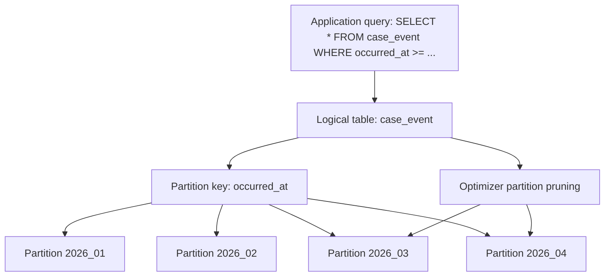
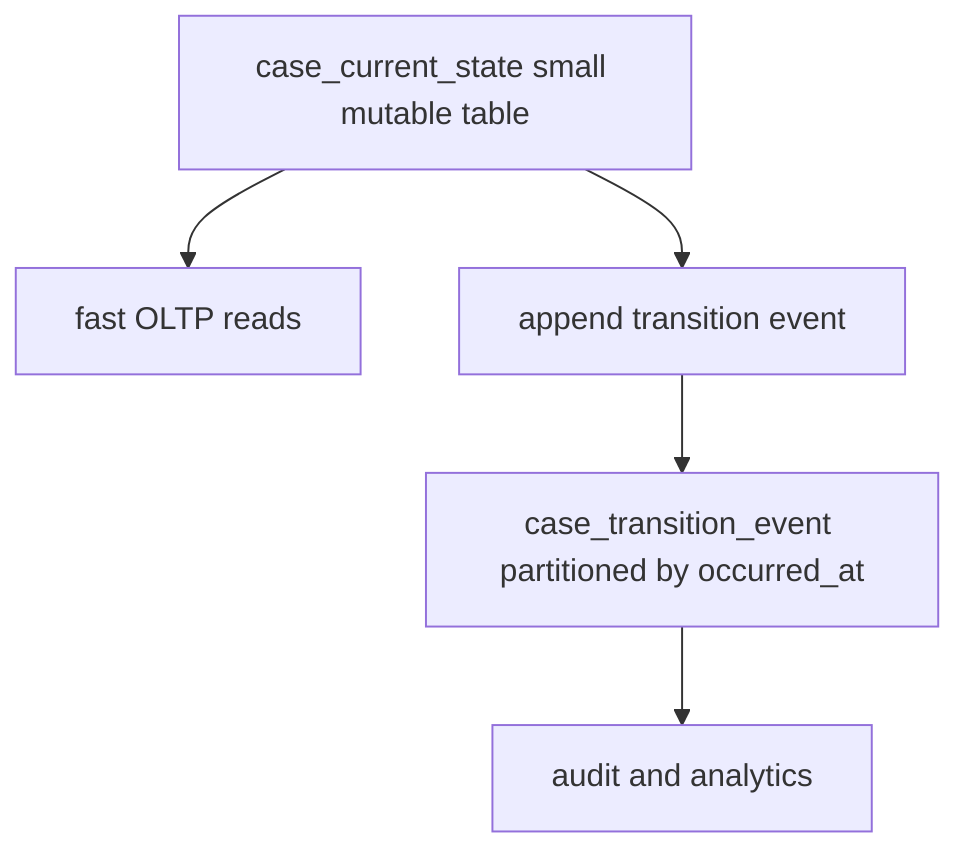
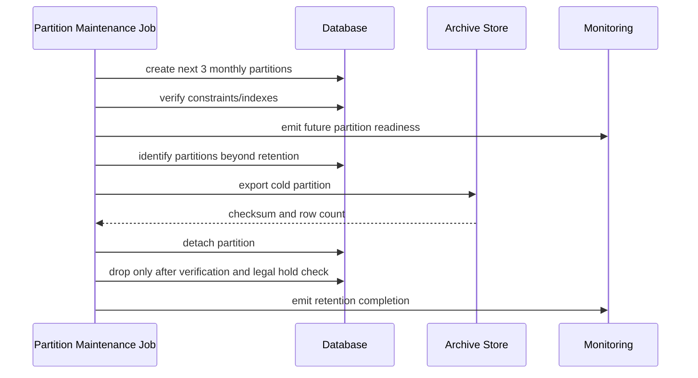
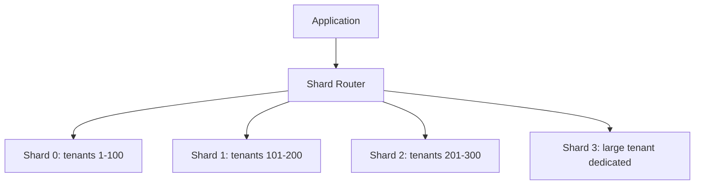
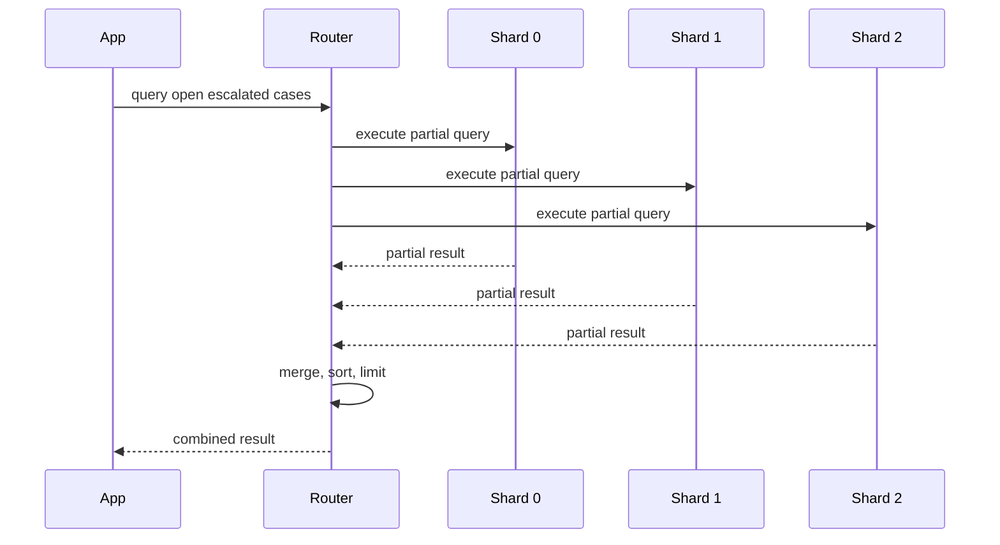
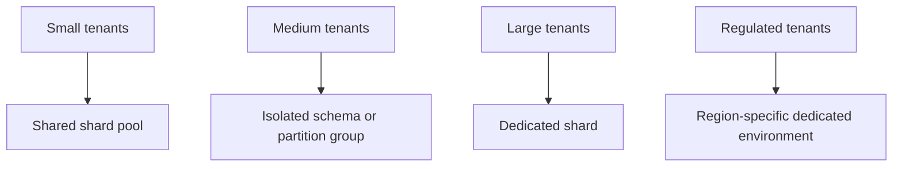
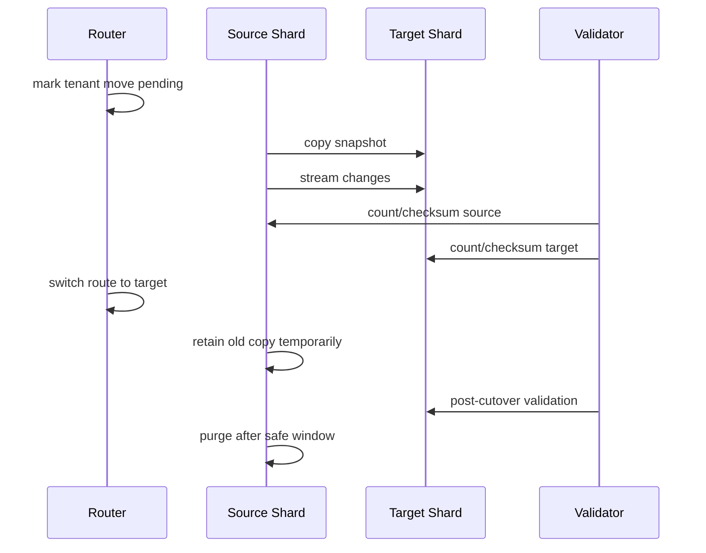
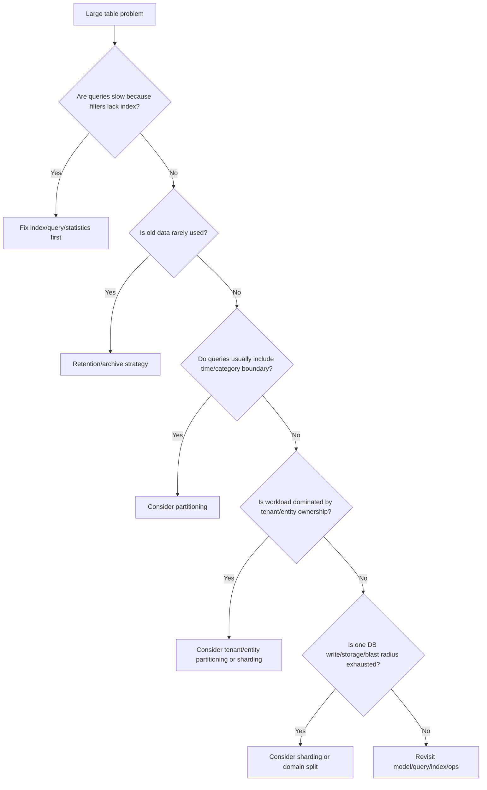

# Part 025 — Partitioning, Sharding, and Large Table Strategy

## 1. Why This Part Exists

Large tables are not a moral failure.

They are a normal consequence of successful systems.

The failure is treating a large table as if the only options are:

- add another index,
- buy a bigger machine,
- archive manually once a year,
- shard everything,
- move to NoSQL,
- or hope the optimizer keeps saving us.

A table becomes operationally dangerous when size starts affecting more than query latency:

- index creation takes hours,
- vacuum or cleanup cannot keep up,
- backup and restore windows become unacceptable,
- batch jobs scan too much data,
- DDL becomes risky,
- retention deletion blocks production,
- hot tenants dominate shared resources,
- replicas lag,
- query plans become unstable,
- operational mistakes affect too much data at once.

Partitioning and sharding are not syntax tricks. They are blast-radius management tools.

The core question is not:

> How do I split the table?

The better question is:

> Which physical boundary matches the system's access pattern, lifecycle, retention model, ownership model, and failure domain?

That is the mental model of this part.

---

## 2. Kaufman Framing: The Sub-Skill We Are Training

The sub-skill is:

> Given a growing table, determine whether it needs indexing, partitioning, archival, vertical split, tenant isolation, or sharding; then design the boundary so queries, writes, migrations, and operations remain correct.

This is a decision skill, not a memorization skill.

You are training to:

- diagnose whether the problem is logical, indexing, statistics, retention, concurrency, or physical layout,
- choose a partition key that aligns with real access paths,
- understand partition pruning,
- design partition lifecycle management,
- distinguish partitioning from sharding,
- avoid sharding too early,
- plan tenant growth and tenant isolation,
- keep global invariants realistic,
- preserve query correctness across partitions or shards,
- reason about backup, restore, migration, and archival blast radius.

Kaufman-style drills:

1. Pick one large table.
2. Identify its grain.
3. Identify its dominant filters.
4. Identify retention boundary.
5. Identify hot-write pattern.
6. Identify tenant distribution.
7. Decide: no split, index, partition, archive, vertical split, or shard.
8. Prove the decision with query plans and operational scenarios.

---

## 3. Mental Model: Logical Table, Physical Segments

A partitioned table usually presents one logical table to the application while storing rows in multiple physical child segments.



The application thinks in terms of domain truth:

```sql
select *
from case_event
where occurred_at >= timestamp '2026-03-01'
  and occurred_at <  timestamp '2026-05-01';
```

The engine tries to execute only relevant partitions.

That optimization is called partition pruning in many engines.

But pruning only works when the query predicate gives the optimizer enough information to exclude partitions.

Bad partitioning creates more objects without reducing work.

Good partitioning creates physical boundaries that the optimizer and operators can exploit.

---

## 4. Partitioning Is Not Sharding

These terms are often mixed together.

They should not be.

| Concept | Meaning | Usually Transparent to Query? | Primary Goal |
|---|---|---:|---|
| Partitioning | Split one logical table into physical pieces inside one database system | Often yes | Manage large table access and lifecycle |
| Sharding | Split data across multiple database instances/nodes | Usually no, unless middleware hides it | Scale ownership, writes, storage, or blast radius horizontally |
| Archiving | Move old data out of hot operational path | Sometimes | Reduce hot working set and retention cost |
| Vertical split | Move rarely used columns to another table | Yes, via join if needed | Reduce row width and hot-table IO |
| Read replica | Copy whole database for read workload | Yes to caller if routed | Scale reads, not writes |

Partitioning is a physical layout strategy.

Sharding is a distributed systems strategy.

A partitioned table still usually has one transaction manager, one catalog, one optimizer, and one operational failure domain.

A sharded system introduces cross-node identity, routing, rebalancing, partial failure, cross-shard query, and distributed consistency problems.

Do not shard because a table is large.

Shard when a single database boundary is no longer the right ownership, scaling, or isolation boundary.

---

## 5. When a Table Is Actually “Large”

A table is not large because it has many rows.

A table is large when its size causes a constraint violation in the engineering system.

Examples:

| Symptom | Likely Constraint |
|---|---|
| Single query scans too much historical data | Access path / pruning problem |
| Retention delete blocks or bloats table | Lifecycle problem |
| Index rebuild takes too long | Maintenance window problem |
| Vacuum/cleanup cannot keep up | Churn problem |
| Replicas lag after batch updates | Write amplification problem |
| Backup/restore exceeds RTO/RPO | Recovery problem |
| One tenant causes most load | Isolation/fairness problem |
| Query plans vary wildly by date range | Statistics/skew problem |
| DDL is too risky | Operational blast radius problem |

Do not partition just because the table has 100 million rows.

A narrow append-only event table with good time predicates can survive at huge scale.

A 10 million row mutable workflow table with bad joins, hot rows, and wide JSON blobs can already be painful.

---

## 6. Partitioning Methods

Most relational systems support some combination of:

- range partitioning,
- list partitioning,
- hash partitioning,
- composite partitioning,
- engine-specific partitioning methods.

### 6.1 Range Partitioning

Range partitioning divides rows by ordered value intervals.

Typical keys:

- `created_at`,
- `occurred_at`,
- `business_date`,
- `effective_from`,
- `tenant_id` ranges,
- numeric sequence ranges.

Example:

```sql
create table case_event (
  case_event_id bigint generated always as identity,
  case_id bigint not null,
  event_type text not null,
  occurred_at timestamp not null,
  payload jsonb not null,
  primary key (case_event_id, occurred_at)
) partition by range (occurred_at);

create table case_event_2026_01
partition of case_event
for values from ('2026-01-01') to ('2026-02-01');

create table case_event_2026_02
partition of case_event
for values from ('2026-02-01') to ('2026-03-01');
```

Range partitioning fits:

- retention by time,
- audit/event tables,
- logs,
- invoices by accounting period,
- workflow history,
- compliance reports by period,
- large append-mostly datasets.

It fails when:

- queries rarely filter by the range key,
- almost all writes target one current partition and create a hot partition,
- historical correction updates many partitions,
- partition count becomes excessive,
- boundary management is not automated.

### 6.2 List Partitioning

List partitioning divides rows by discrete values.

Typical keys:

- country,
- region,
- product line,
- case type,
- jurisdiction,
- tenant tier,
- source system.

Example:

```sql
create table enforcement_case (
  case_id bigint not null,
  jurisdiction_code text not null,
  case_number text not null,
  opened_at timestamp not null,
  status text not null,
  primary key (case_id, jurisdiction_code)
) partition by list (jurisdiction_code);

create table enforcement_case_id
partition of enforcement_case
for values in ('ID');

create table enforcement_case_sg
partition of enforcement_case
for values in ('SG');
```

List partitioning fits:

- strong regional data boundaries,
- operational teams split by jurisdiction,
- archiving by business domain,
- isolated backup/restore by category,
- common predicates by category.

It fails when:

- one list value dominates all data,
- new values appear frequently without partition automation,
- queries usually span all categories,
- global uniqueness is required but engine support is limited.

### 6.3 Hash Partitioning

Hash partitioning distributes rows by a hash of key values.

Typical keys:

- `tenant_id`,
- `account_id`,
- `customer_id`,
- `case_id`,
- `device_id`.

Example:

```sql
create table case_note (
  case_note_id bigint generated always as identity,
  case_id bigint not null,
  author_user_id bigint not null,
  body text not null,
  created_at timestamp not null,
  primary key (case_note_id, case_id)
) partition by hash (case_id);

create table case_note_p0 partition of case_note
for values with (modulus 8, remainder 0);

create table case_note_p1 partition of case_note
for values with (modulus 8, remainder 1);
```

Hash partitioning fits:

- spreading write load,
- avoiding one giant index,
- equality access by key,
- reducing index depth per partition,
- distributing tenants or entities somewhat evenly.

It fails when:

- retention is time-based,
- queries often need recent data across all hash partitions,
- you frequently add partitions and need rebalancing,
- operational lifecycle needs calendar boundaries,
- tenant size is heavily skewed.

### 6.4 Composite Partitioning

Composite partitioning combines dimensions, such as:

- range by month, then hash by tenant,
- list by region, then range by date,
- range by date, then list by source system.

Example conceptually:

```text
case_event
├── 2026_01
│   ├── hash bucket 0
│   ├── hash bucket 1
│   └── hash bucket 2
└── 2026_02
    ├── hash bucket 0
    ├── hash bucket 1
    └── hash bucket 2
```

Composite partitioning should be used cautiously.

It multiplies object count.

It can help when both lifecycle and write distribution matter, but it increases:

- partition creation complexity,
- index management,
- statistics management,
- query planning overhead,
- operational burden,
- migration complexity.

Use composite partitioning only when a single boundary cannot satisfy lifecycle and load constraints.

---

## 7. Partition Key Selection

The partition key is the physical boundary of the table.

A good partition key has at least one of these properties:

- appears in most large-table queries,
- aligns with retention and archival,
- aligns with operational ownership,
- distributes write/load acceptably,
- limits blast radius for maintenance,
- supports pruning,
- is stable after insert.

A bad partition key:

- is rarely filtered,
- changes often,
- has severe skew,
- creates too many small partitions,
- makes uniqueness hard,
- conflicts with primary access patterns,
- is chosen because it “looks natural” but is not operationally useful.

### 7.1 Partition Key Decision Matrix

| Candidate Key | Good For | Risk |
|---|---|---|
| `created_at` | append-only data, retention, recent queries | hot current partition |
| `occurred_at` | event time analysis, audit timeline | late-arriving events |
| `tenant_id` | tenant isolation, fairness | large tenant skew |
| `jurisdiction_code` | regional ownership | uneven partitions |
| `case_id` hash | entity-local access | cross-case reporting scans all partitions |
| `status` | usually bad | status changes move rows and partitions become skewed |
| `priority` | usually bad | low cardinality and volatile |
| `source_system` | ingestion ownership | one dominant source may overwhelm |

A common mistake is partitioning operational tables by `status`.

That looks intuitive:

```text
open cases
in review cases
closed cases
```

But status is usually mutable. Moving a row between partitions on every state transition is rarely worth it.

For workflow systems, time-based partitioning is usually better for append-only history tables, while current-state tables often need indexing rather than partitioning.

---

## 8. Partition Pruning

Partition pruning is the optimizer's ability to skip partitions that cannot contain matching rows.

Good:

```sql
select *
from case_event
where occurred_at >= timestamp '2026-01-01'
  and occurred_at <  timestamp '2026-02-01';
```

The predicate matches the partition key and uses clear boundaries.

Bad:

```sql
select *
from case_event
where date(occurred_at) = date '2026-01-15';
```

Depending on the engine, applying a function to the partition key can make pruning harder or impossible.

Better:

```sql
select *
from case_event
where occurred_at >= timestamp '2026-01-15 00:00:00'
  and occurred_at <  timestamp '2026-01-16 00:00:00';
```

Bad:

```sql
select *
from case_event
where occurred_at between timestamp '2026-01-01'
                      and timestamp '2026-01-31 23:59:59';
```

This looks okay, but inclusive upper bounds are fragile with subsecond precision.

Better:

```sql
where occurred_at >= timestamp '2026-01-01'
  and occurred_at <  timestamp '2026-02-01'
```

Pruning is not guaranteed just because a table is partitioned.

The query must expose the boundary.

---

## 9. Local Indexes, Global Indexes, and Uniqueness

Partitioning complicates indexing.

A normal table has one index structure per index.

A partitioned table may have one index per partition, a partitioned index, or engine-specific global index behavior.

The difficult question is uniqueness.

Suppose you want:

```sql
unique (case_number)
```

But the table is partitioned by `jurisdiction_code`.

If the engine enforces uniqueness only inside each partition unless the partition key is included, then this may not be valid as a global invariant.

You may need:

```sql
unique (jurisdiction_code, case_number)
```

That is not merely a syntax concession. It changes the domain invariant.

It says:

> case number is unique within jurisdiction, not globally.

If the business requires global uniqueness, you may need:

- a separate registry table,
- globally generated IDs,
- application-level reservation with transaction,
- a non-partitioned lookup table,
- engine-specific global indexes,
- or a different partition key.

### 9.1 Registry Table Pattern

```sql
create table case_number_registry (
  case_number text primary key,
  case_id bigint not null unique,
  created_at timestamp not null default current_timestamp
);
```

Reservation flow:

```sql
begin;

insert into case_number_registry (case_number, case_id)
values (:case_number, :case_id);

insert into enforcement_case (
  case_id,
  jurisdiction_code,
  case_number,
  opened_at,
  status
) values (
  :case_id,
  :jurisdiction_code,
  :case_number,
  current_timestamp,
  'OPEN'
);

commit;
```

This is not free. The registry can become a hot point.

But it makes the invariant explicit.

---

## 10. Retention and Archival as First-Class Design

Many systems discover partitioning after retention becomes painful.

The better approach is to design retention before the table is huge.

For append-only event data, partitioning by month or day enables partition-level lifecycle operations.

Conceptual lifecycle:


Example retention policy:

| Data Age | Storage | Access Expectation | Operation |
|---|---|---|---|
| 0–90 days | hot DB | frequent query | indexed and monitored |
| 90–365 days | warm DB | occasional query | fewer indexes |
| 1–7 years | archive | audit/investigation | object storage or cold DB |
| > 7 years | deleted if legally allowed | none | verified deletion |

Partitioning lets you move or drop old data in larger chunks.

But legal and compliance rules matter.

Do not implement retention with:

```sql
delete from case_event
where occurred_at < current_date - interval '7 years';
```

without thinking about:

- transaction size,
- WAL/redo volume,
- replication lag,
- index bloat,
- lock footprint,
- audit requirements,
- restore requirements,
- legal hold exceptions.

A partition-level detach/archive/drop operation can be far safer than deleting millions of rows.

---

## 11. Hot Partition Problem

Time-range partitioning commonly creates a hot current partition.

All new writes go here:

```text
case_event_2026_07  <-- all current inserts
case_event_2026_06
case_event_2026_05
case_event_2026_04
```

This may be acceptable if writes are append-only and indexes are designed well.

It becomes a problem when:

- the current partition has too many secondary indexes,
- many workers update the same rows,
- recent data scans dominate,
- current partition autovacuum/cleanup lags,
- one tenant dominates current writes,
- queries constantly sort current data.

Solutions:

- reduce indexes on hot partitions,
- split current partition by hash subpartition,
- isolate large tenants,
- batch writes by entity,
- use append-only plus asynchronous summary,
- avoid high-churn updates in event tables,
- separate current state from history.

A common good pattern:



The mutable table is optimized for current state.

The partitioned table is optimized for history.

---

## 12. Current State vs History Table Split

Do not put every concern into one large table.

Poor design:

```sql
create table enforcement_case (
  case_id bigint primary key,
  status text not null,
  assigned_user_id bigint,
  opened_at timestamp not null,
  closed_at timestamp,
  last_transition_at timestamp,
  transition_history jsonb not null,
  audit_payload jsonb not null,
  last_comment text,
  last_document_payload jsonb
);
```

This table mixes:

- current state,
- history,
- comments,
- documents,
- audit payload,
- denormalized last-event information.

Better:

```sql
create table enforcement_case (
  case_id bigint primary key,
  jurisdiction_code text not null,
  current_status text not null,
  assigned_user_id bigint,
  opened_at timestamp not null,
  closed_at timestamp,
  row_version bigint not null default 0
);

create table case_transition_event (
  event_id bigint generated always as identity,
  case_id bigint not null,
  from_status text,
  to_status text not null,
  occurred_at timestamp not null,
  actor_user_id bigint not null,
  reason_code text,
  payload jsonb not null,
  primary key (event_id, occurred_at)
) partition by range (occurred_at);
```

Now:

- current state remains small and mutable,
- history grows append-only,
- partitioning applies where it helps,
- audit reconstruction is possible,
- OLTP queries avoid scanning history.

---

## 13. Partition Count: Too Few vs Too Many

Partitioning creates database objects.

Each partition can have:

- table metadata,
- indexes,
- statistics,
- constraints,
- privileges,
- storage files,
- maintenance jobs,
- backup footprint.

Too few partitions:

- pruning is coarse,
- retention detach/drop still affects huge chunks,
- index maintenance remains heavy,
- hot/cold data mixed together.

Too many partitions:

- planning overhead rises,
- catalog becomes noisy,
- operations become complex,
- mistakes become easier,
- monitoring becomes harder,
- DDL touches many objects.

Heuristic:

| Data Pattern | Candidate Partition Size |
|---|---|
| high-volume event/log | daily or weekly |
| medium-volume business event | monthly |
| financial period records | month/quarter/accounting period |
| low-volume audit trail | quarterly/yearly |
| tenant isolation | tenant-specific only for very large tenants |

Do not choose daily partitions because “daily sounds clean”.

Choose daily partitions if daily lifecycle, daily pruning, or daily maintenance boundaries are useful.

---

## 14. Partition Automation

Manual partition management fails eventually.

A production design should answer:

- Who creates future partitions?
- How far ahead?
- What happens if an insert arrives for a missing partition?
- Are default/catch-all partitions allowed?
- Who verifies constraints?
- Who detaches old partitions?
- How is archive integrity checked?
- How are indexes applied consistently?
- How are privileges propagated?

A safe monthly partition workflow:



Automation must be idempotent.

Running it twice should not create duplicate objects or drop the wrong partition.

---

## 15. Default Partitions and Late Data

Late-arriving data is common.

Examples:

- external source sends delayed event,
- mobile device syncs late,
- case was backfilled,
- regulatory report is corrected,
- clock skew occurred,
- source system uses business date instead of ingestion date.

If an event arrives for a partition that does not exist, the insert may fail.

A default partition can catch unmatched rows.

But default partitions are dangerous if ignored.

They become silent junk drawers.

If you use a default partition:

- monitor row count,
- alert on growth,
- regularly move rows to proper partitions,
- investigate unexpected partition key values,
- treat it as an exception queue, not storage.

Example exception query:

```sql
select
  count(*) as default_partition_rows,
  min(occurred_at) as min_occurred_at,
  max(occurred_at) as max_occurred_at
from case_event_default;
```

---

## 16. Partitioning and Query Design

Partitioning does not rescue bad query design.

Bad:

```sql
select *
from case_event
where event_type = 'STATUS_CHANGED';
```

If the table is partitioned by `occurred_at`, this may scan all partitions.

Better if business allows a time window:

```sql
select *
from case_event
where occurred_at >= :from_ts
  and occurred_at <  :to_ts
  and event_type = 'STATUS_CHANGED';
```

Better index inside each relevant partition:

```sql
create index case_event_2026_07_type_time_idx
on case_event_2026_07 (event_type, occurred_at);
```

But do not blindly create every index on every partition.

Older partitions may need different indexes than hot partitions.

For example:

| Partition Age | Index Strategy |
|---|---|
| current month | write-light indexes only |
| last 3 months | operational query indexes |
| 3–12 months | reporting indexes |
| older archive | minimal or external search |

---

## 17. Partitioning and Statistics

Each partition may have its own statistics.

This can help when distributions differ by partition.

Example:

- current month has mostly `OPEN` cases,
- old months have mostly `CLOSED` cases,
- a global estimate might be misleading.

But partitioned stats can also complicate planning.

The optimizer must reason about:

- parent table statistics,
- child partition statistics,
- partition pruning,
- cross-partition aggregation,
- partition-wise join support,
- parameterized predicates.

Operational rule:

> After bulk loading or attaching a partition, update statistics before relying on plan quality.

Example:

```sql
analyze case_event_2026_07;
analyze case_event;
```

Exact syntax and behavior vary by engine.

The important habit is the same: partition maintenance and statistics maintenance must be coupled.

---

## 18. Sharding: When One Database Boundary Is Not Enough

Sharding splits data across database instances or nodes.

Example:



Reasons to shard:

- write throughput exceeds one primary database,
- storage exceeds practical single-node limits,
- tenant isolation is required,
- regulatory region isolation is required,
- backup/restore blast radius must be reduced,
- one or more tenants need dedicated capacity,
- operational ownership differs by domain.

Bad reasons to shard:

- one query is slow,
- indexes are poor,
- old data was never archived,
- schema is badly normalized,
- caching was not considered,
- read replicas were not used,
- batch jobs are poorly bounded,
- the team wants a “scalable architecture” on paper.

Sharding is often the point where SQL design becomes distributed systems design.

---

## 19. Shard Key Selection

A shard key determines routing.

Good shard key properties:

- almost every request includes it,
- data ownership is naturally local to it,
- transactions mostly stay within it,
- volume is reasonably distributed,
- key is stable,
- rebalancing is possible,
- security boundary is clear.

Common shard keys:

| Shard Key | Good For | Risk |
|---|---|---|
| `tenant_id` | SaaS applications | large tenant skew |
| `account_id` | financial/account systems | cross-account workflows |
| `customer_id` | customer-centric systems | enterprise customers may dominate |
| `region` | data residency | uneven regional volume |
| hash of entity ID | distribution | hard range operations |

A bad shard key creates cross-shard transactions everywhere.

Example smell:

```sql
select *
from enforcement_case
where assigned_user_id = :user_id
  and status = 'OPEN';
```

If data is sharded by `tenant_id`, but the application often needs user work queues across tenants, this query becomes cross-shard.

Possible solutions:

- require tenant context for operational queue,
- maintain a global assignment index,
- route users to tenant-specific queues,
- use search/analytics projection,
- change ownership model,
- isolate multi-tenant staff views into a read model.

---

## 20. Reference Data in Sharded Systems

Sharded systems need reference data strategy.

Examples:

- status codes,
- jurisdiction codes,
- product catalog,
- permission templates,
- workflow definitions,
- regulatory rule versions.

Options:

| Strategy | Benefit | Risk |
|---|---|---|
| replicate to all shards | local joins | drift |
| central reference DB | single truth | cross-db dependency |
| embed versioned snapshot | auditability | update complexity |
| application cache | low latency | invalidation |

For regulatory workflow systems, versioned reference data is often essential.

A case should usually remember which rule version was applied.

```sql
create table case_rule_evaluation (
  case_id bigint not null,
  rule_code text not null,
  rule_version int not null,
  evaluated_at timestamp not null,
  outcome text not null,
  evidence jsonb not null,
  primary key (case_id, rule_code, rule_version)
);
```

This avoids rewriting historical truth when rules change.

---

## 21. Cross-Shard Queries

Cross-shard queries are expensive because they require scatter-gather.



Problems:

- global `ORDER BY` is expensive,
- global pagination is hard,
- partial failures occur,
- latency is bounded by slowest shard,
- result limits are tricky,
- consistency across shards is not automatic,
- transactions across shards are complex.

For analytics, prefer CDC/read models/warehouse.

For operations, keep workflows local to shard key whenever possible.

---

## 22. The Large Tenant Problem

Hashing tenants works until one tenant becomes huge.

```text
Shard 0: 100 small tenants
Shard 1: 98 small tenants + 1 giant tenant
Shard 2: 110 small tenants
```

The giant tenant dominates shard 1.

Strategies:

1. Dedicated shard for large tenant.
2. Split tenant internally by entity or region.
3. Move heavy workflows to dedicated tables.
4. Use per-tenant throttling.
5. Use read replicas for tenant-specific reporting.
6. Isolate archival/history tables.
7. Use tiered tenancy architecture.

Tiered model:



This is often better than pretending all tenants are equal.

---

## 23. Rebalancing and Resharding

Sharding is easy to draw and hard to change.

A production design must answer:

- How do we move a tenant?
- Can writes continue during move?
- How do we verify row counts and checksums?
- How do we handle references?
- How do we update routing atomically?
- How do we roll back?
- How do we prevent dual writes from diverging?
- How do we freeze or drain tenant activity?

Tenant move flow:



This is an engineering project, not a DDL command.

---

## 24. Partitioning vs Archival vs Sharding Decision Tree



Important:

- partitioning is not a substitute for indexing,
- sharding is not a substitute for modelling,
- archiving is not a substitute for legal retention,
- read replicas are not a substitute for write scalability,
- caching is not a substitute for correctness.

---

## 25. Case Study: Partitioning Workflow Events

Domain:

- regulatory case management,
- each case has current state,
- every transition must be auditable,
- reports commonly filter by quarter,
- retention is 7 years,
- operational UI mostly reads current state.

Design:

```sql
create table enforcement_case (
  case_id bigint primary key,
  jurisdiction_code text not null,
  current_status text not null,
  priority text not null,
  assigned_user_id bigint,
  opened_at timestamp not null,
  closed_at timestamp,
  row_version bigint not null default 0
);

create table case_transition_event (
  event_id bigint generated always as identity,
  case_id bigint not null,
  jurisdiction_code text not null,
  from_status text,
  to_status text not null,
  occurred_at timestamp not null,
  actor_user_id bigint not null,
  command_id uuid not null,
  evidence jsonb not null,
  primary key (event_id, occurred_at),
  unique (case_id, command_id, occurred_at)
) partition by range (occurred_at);
```

Monthly partitions:

```sql
create table case_transition_event_2026_07
partition of case_transition_event
for values from ('2026-07-01') to ('2026-08-01');

create index case_transition_event_2026_07_case_time_idx
on case_transition_event_2026_07 (case_id, occurred_at desc);

create index case_transition_event_2026_07_jurisdiction_time_idx
on case_transition_event_2026_07 (jurisdiction_code, occurred_at desc);
```

Operational query:

```sql
select *
from enforcement_case
where assigned_user_id = :user_id
  and current_status in ('OPEN', 'UNDER_REVIEW')
order by priority, opened_at;
```

Audit query:

```sql
select *
from case_transition_event
where case_id = :case_id
order by occurred_at, event_id;
```

Quarterly report:

```sql
select jurisdiction_code, to_status, count(*)
from case_transition_event
where occurred_at >= timestamp '2026-04-01'
  and occurred_at <  timestamp '2026-07-01'
group by jurisdiction_code, to_status;
```

The design avoids forcing all workloads into one physical shape.

Current-state OLTP and historical audit have different tables, different indexes, different lifecycle, and different operational risk.

---

## 26. Case Study: Why Not Partition the Current Case Table by Status?

Temptation:

```sql
partition by list (current_status)
```

Reason it looks attractive:

- UI filters by status,
- reports group by status,
- queues are status-based.

Problem:

- status changes frequently,
- rows move between partitions,
- open status partition is hot,
- closed partition dominates storage,
- many queries still need tenant/user/date filters,
- status cardinality is low,
- business adds statuses over time,
- partitioning by status does not solve assignment queue indexes.

Better:

```sql
create index enforcement_case_queue_idx
on enforcement_case (assigned_user_id, current_status, priority, opened_at)
where current_status in ('OPEN', 'UNDER_REVIEW');
```

Use partitioning for history, not necessarily current state.

---

## 27. Operational Checklist for Partitioned Tables

Before creating a partitioned table, answer:

### 27.1 Logical Design

- What is the grain of the table?
- Is the partition key part of the row identity?
- Does uniqueness require global enforcement?
- Are foreign keys affected?
- Does the partition key ever change?
- Is the table append-only, append-mostly, or mutable?

### 27.2 Query Design

- Do dominant queries filter by partition key?
- Are predicates pruning-friendly?
- Are date ranges half-open?
- Do prepared statements obscure pruning?
- Are cross-partition sorts acceptable?
- Are cross-partition joins acceptable?

### 27.3 Index Design

- Which indexes exist on hot partitions?
- Which indexes exist on cold partitions?
- Are indexes created automatically on new partitions?
- Is uniqueness local or global?
- Are per-partition stats maintained?

### 27.4 Operations

- How are future partitions created?
- Is there a default partition?
- How is default partition monitored?
- How are old partitions archived?
- How are legal holds handled?
- How are backups/restores tested?
- What is the maximum acceptable partition count?

### 27.5 Failure Handling

- What happens if partition creation job fails?
- What happens if late data arrives?
- What happens if archive export fails halfway?
- Can detach/drop be rolled back?
- Can a partition be restored independently?
- Are row counts/checksums captured?

---

## 28. Common Anti-Patterns

### 28.1 Partitioning Without Query Predicates

```sql
select *
from huge_table
where customer_email = :email;
```

If the table is partitioned by `created_at`, this may still scan all partitions.

Partitioning did not solve the access path.

### 28.2 Partitioning by Low-Cardinality Mutable State

```sql
partition by list (status)
```

Often creates skew and row movement.

Use indexes for mutable operational filters.

### 28.3 Too Many Tiny Partitions

Daily partitions for low-volume data create metadata overhead without benefit.

### 28.4 No Future Partition Automation

Everything works until midnight/month-end when inserts fail.

### 28.5 Default Partition as Trash Can

A default partition without monitoring hides data-quality failure.

### 28.6 Sharding Before Archiving

If 80% of the data is old and rarely used, archive before distributing pain across multiple databases.

### 28.7 Cross-Shard Workflows Everywhere

If every user action touches multiple shards, the shard key is wrong or the workflow boundary is wrong.

---

## 29. Performance Testing Partitioning

A partitioning design should be tested with production-shaped data.

Minimum tests:

1. Single-partition point lookup.
2. Multi-partition range scan.
3. Query without partition key.
4. Insert into hot partition.
5. Bulk load into old partition.
6. Attach/detach partition.
7. Create index on new partition.
8. Update statistics.
9. Retention archive flow.
10. Backup/restore scenario.

Example plan check:

```sql
explain analyze
select count(*)
from case_transition_event
where occurred_at >= timestamp '2026-07-01'
  and occurred_at <  timestamp '2026-08-01'
  and jurisdiction_code = 'ID';
```

Look for:

- partitions scanned,
- actual rows vs estimated rows,
- scan type per partition,
- sort/hash memory,
- parallelism,
- execution time variance,
- planning time.

Partitioning can reduce execution time while increasing planning time.

Both matter.

---

## 30. Practice Lab

### Lab 1: Diagnose a Large Table

Given:

```sql
create table api_request_log (
  request_id bigint primary key,
  tenant_id bigint not null,
  endpoint text not null,
  status_code int not null,
  started_at timestamp not null,
  duration_ms int not null,
  request_body jsonb,
  response_body jsonb
);
```

Tasks:

1. Identify table grain.
2. Identify likely hot queries.
3. Identify retention need.
4. Propose indexes first.
5. Decide whether partitioning is needed.
6. Choose partition key.
7. Decide partition size.
8. Define archive policy.
9. Define monitoring queries.
10. Identify fields that should move out of this table.

### Lab 2: Rewrite Pruning-Unfriendly Queries

Rewrite:

```sql
where date(started_at) = current_date
```

into half-open range form.

Rewrite:

```sql
where extract(year from started_at) = 2026
```

into partition-friendly range form.

### Lab 3: Tenant Sharding Design

Given:

- 10,000 tenants,
- 5 very large tenants,
- 70% of queries are tenant-scoped,
- staff dashboards can span tenants,
- reporting is daily, not real-time.

Design:

- shard key,
- large tenant isolation strategy,
- global dashboard strategy,
- tenant move plan,
- failure model.

---

## 31. What Good Looks Like

A good large table strategy has these properties:

- logical model remains clear,
- partition key matches access/lifecycle,
- query predicates enable pruning,
- indexes are partition-aware,
- uniqueness semantics are explicit,
- current state and history are separated when needed,
- retention is automated and tested,
- late data is handled intentionally,
- partition count is controlled,
- statistics are maintained,
- backup/restore impact is understood,
- sharding is delayed until it solves the right problem,
- cross-shard workflows are minimized,
- operational blast radius is smaller after the design, not larger.

Partitioning is successful when the system becomes easier to operate.

If it only makes schema diagrams look more advanced, it failed.

---

## 32. References

- PostgreSQL Documentation — Table Partitioning: https://www.postgresql.org/docs/current/ddl-partitioning.html
- MySQL 8.4 Reference Manual — Partitioning Overview: https://dev.mysql.com/doc/refman/8.4/en/partitioning-overview.html
- MySQL 8.4 Reference Manual — Partitioning Types: https://dev.mysql.com/doc/refman/8.4/en/partitioning-types.html
- MySQL 8.4 Reference Manual — Partition Pruning: https://dev.mysql.com/doc/refman/8.4/en/partitioning-pruning.html
- SQL Server Documentation — Partitioned Tables and Indexes: https://learn.microsoft.com/en-us/sql/relational-databases/partitions/partitioned-tables-and-indexes
- PostgreSQL Documentation — Planner Statistics: https://www.postgresql.org/docs/current/planner-stats.html
- PostgreSQL Documentation — Indexes: https://www.postgresql.org/docs/current/indexes.html
