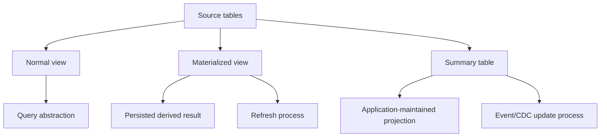
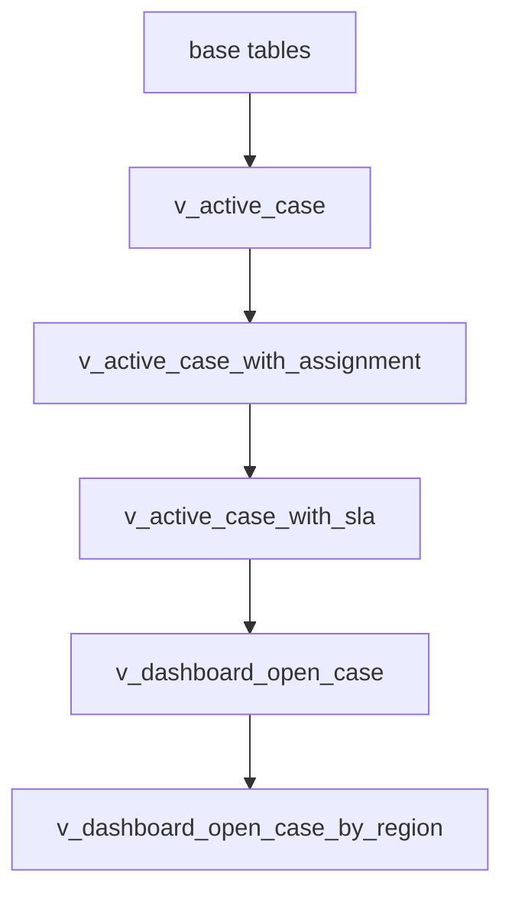
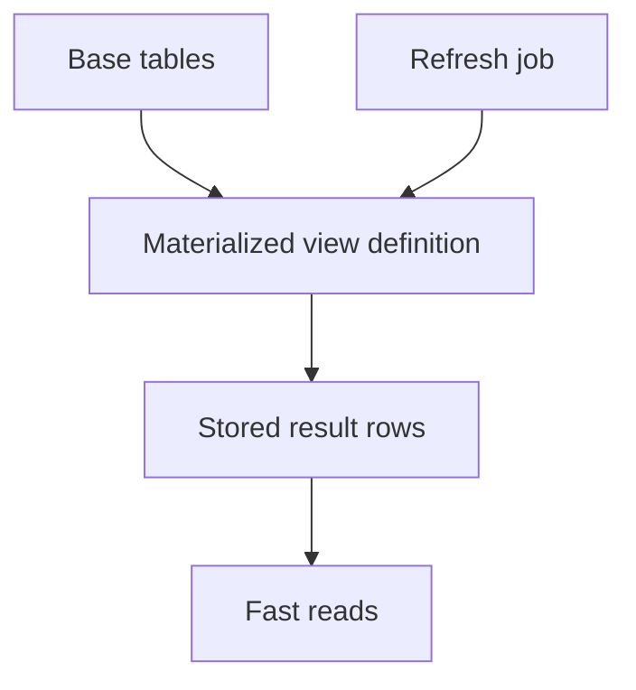
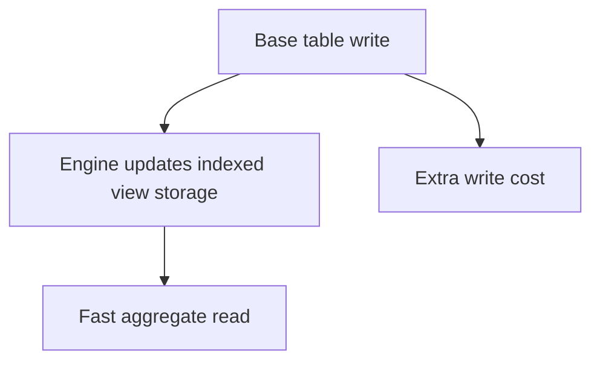
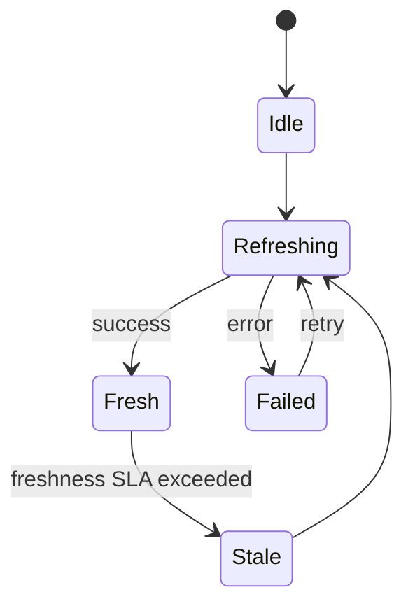
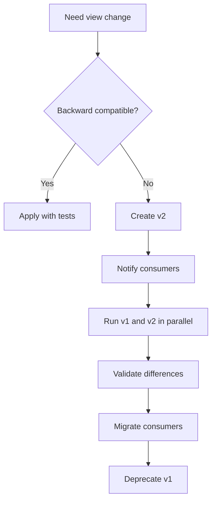

# Part 026 — Views, Materialized Views, and Derived Truth

## 1. Why This Part Exists

Views look simple.

```sql
create view active_cases as
select *
from enforcement_case
where current_status <> 'CLOSED';
```

Materialized views also look simple.

```sql
create materialized view monthly_case_counts as
select date_trunc('month', opened_at) as month, count(*) as case_count
from enforcement_case
group by date_trunc('month', opened_at);
```

But in production, these questions quickly appear:

- Is the view an abstraction or a security boundary?
- Is the view part of the public contract?
- Can application code depend on it?
- Can it be changed safely?
- Does the optimizer inline it?
- Is it hiding expensive joins?
- Is the materialized view fresh enough?
- Who refreshes it?
- What happens during refresh?
- Can readers see stale data?
- Can the derived result be audited?
- What is the source of truth?
- What happens when base schema changes?

The danger is treating derived data as if it has the same semantics as source data.

A view is not automatically a good abstraction.

A materialized view is not automatically a cache.

A derived table is not automatically safe just because SQL produced it.

This part teaches how to use views and materialized views as deliberate boundaries.

---

## 2. Kaufman Framing: The Sub-Skill We Are Training

The sub-skill is:

> Given repeated SQL logic or expensive derived data, decide whether to use a view, materialized view, indexed view, summary table, cache, or application query; then define ownership, freshness, dependency, and correctness rules.

You are training to:

- distinguish source truth from derived truth,
- use views to reduce duplication without hiding complexity,
- use security views intentionally,
- understand materialized view freshness,
- design refresh strategies,
- reason about stale reads,
- maintain dependency boundaries,
- avoid view stacks that become unreadable,
- avoid materialized views that silently lie,
- choose between materialized view and summary table,
- validate derived results with reconciliation queries.

Kaufman-style drills:

1. Find a repeated query.
2. Identify whether it is business definition, security boundary, or performance workaround.
3. Decide if a view is appropriate.
4. Decide if the result must be persisted.
5. Define freshness SLA.
6. Define refresh mechanism.
7. Define invalidation/failure behavior.
8. Write reconciliation query against source tables.

---

## 3. Mental Model: Source Truth vs Derived Truth

The core model:



Source truth is the minimal set of data that defines the domain facts.

Derived truth is computed from source truth.

Examples:

| Data | Source or Derived? |
|---|---|
| `case_transition_event` | source truth for transition history |
| `enforcement_case.current_status` | source or projection, depending on design |
| `active_cases_view` | derived truth |
| `monthly_case_counts_mv` | derived truth |
| `case_search_document` | derived projection |
| `dashboard_cache` | derived projection |

The most important rule:

> Every derived object must have a declared source, freshness contract, and repair path.

Without those, derived data becomes a second uncontrolled source of truth.

---

## 4. Normal Views

A normal view is a stored query definition.

It usually does not store result rows by itself.

Example:

```sql
create view active_enforcement_case as
select
  case_id,
  jurisdiction_code,
  current_status,
  priority,
  assigned_user_id,
  opened_at
from enforcement_case
where current_status in ('OPEN', 'UNDER_REVIEW', 'ESCALATED');
```

A view can be useful for:

- naming a business concept,
- centralizing repeated query logic,
- hiding irrelevant columns,
- enforcing row/column access boundaries,
- exposing stable contract to reporting users,
- simplifying application queries,
- composing analytics.

A view can be harmful when it:

- hides expensive joins,
- hides `DISTINCT` used to mask fan-out,
- hides tenant filtering inconsistently,
- creates dependency chains,
- becomes an unofficial API without versioning,
- prevents developers from understanding the base model,
- is used to avoid fixing schema design.

---

## 5. Views as Named Business Definitions

Good view:

```sql
create view open_case as
select
  case_id,
  jurisdiction_code,
  current_status,
  priority,
  assigned_user_id,
  opened_at
from enforcement_case
where current_status in ('OPEN', 'UNDER_REVIEW', 'ESCALATED');
```

This view names a business concept.

It answers:

> What counts as open?

The value is not performance. The value is semantic reuse.

If different services write their own definition:

```sql
where current_status <> 'CLOSED'
```

and:

```sql
where closed_at is null
```

and:

```sql
where current_status in ('OPEN', 'UNDER_REVIEW')
```

then metrics and behavior diverge.

A view can centralize the definition.

But the view should be documented as a contract.

Add a comment if the engine supports it:

```sql
comment on view open_case is
'Business definition of cases considered operationally open. Excludes CLOSED, REJECTED, and ARCHIVED.';
```

---

## 6. Views as Security Boundaries

A view can expose only allowed columns.

```sql
create view case_public_summary as
select
  case_id,
  jurisdiction_code,
  current_status,
  opened_at
from enforcement_case;
```

Sensitive columns are omitted:

- investigator notes,
- PII,
- evidence payload,
- internal risk score,
- legal hold flag,
- security classification.

A security view must be designed more strictly than convenience views.

Rules:

- do not expose `select *`,
- explicitly list columns,
- avoid leaking sensitive data through computed fields,
- ensure tenant/row filter is correct,
- control direct table grants,
- test with unauthorized users,
- document purpose.

Bad:

```sql
create view tenant_case as
select *
from enforcement_case;
```

This is not a security boundary.

Better:

```sql
create view tenant_case_summary as
select
  case_id,
  tenant_id,
  case_number,
  current_status,
  opened_at
from enforcement_case
where tenant_id = current_setting('app.tenant_id')::bigint;
```

Exact session setting and row-level security mechanisms vary by engine.

The design principle is stable: security views must not be bypassable by direct table access.

---

## 7. Views as API Contracts

Views can act as internal database APIs.

Example:

```sql
create view reporting.v_case_lifecycle as
select
  c.case_id,
  c.jurisdiction_code,
  c.opened_at,
  c.closed_at,
  c.current_status,
  count(e.event_id) as transition_count,
  max(e.occurred_at) as last_transition_at
from enforcement_case c
left join case_transition_event e
  on e.case_id = c.case_id
group by
  c.case_id,
  c.jurisdiction_code,
  c.opened_at,
  c.closed_at,
  c.current_status;
```

This can be useful for BI/reporting consumers.

But once external consumers depend on a view, changing it is a breaking change.

Treat it like an API:

- version it,
- document columns,
- avoid reusing names with changed meaning,
- add columns safely,
- remove columns through deprecation,
- avoid changing grain silently,
- publish freshness/quality expectations.

Versioning pattern:

```text
reporting.v_case_lifecycle_v1
reporting.v_case_lifecycle_v2
```

Do not pretend SQL consumers are not clients.

They are.

---

## 8. View Composition and View Stacks

Views compose easily.

Too easily.



This becomes a view stack.

Problems:

- debugging becomes hard,
- hidden joins multiply,
- predicates may not push down as expected,
- dependencies become fragile,
- small base changes break many views,
- plans become harder to read,
- developers stop knowing source grain.

Rule of thumb:

- one layer of semantic view can be good,
- two layers may be acceptable,
- three or more layers require review,
- deeply nested views should be flattened or replaced with explicit query modules.

A view should reduce cognitive load.

If it hides essential reasoning, it is debt.

---

## 9. Updatable Views

Some engines support updates through simple views.

Example:

```sql
create view open_case_edit as
select
  case_id,
  priority,
  assigned_user_id
from enforcement_case
where current_status in ('OPEN', 'UNDER_REVIEW');
```

In some systems, this may allow:

```sql
update open_case_edit
set assigned_user_id = :new_user_id
where case_id = :case_id;
```

But updatable views are easy to misuse.

Questions:

- Does the update affect exactly one base table?
- Are computed columns involved?
- Are joins involved?
- Does the view predicate still hold after update?
- Are constraints enforced as expected?
- Are triggers involved?
- Does the application understand the real source table?

For critical state transitions, prefer explicit commands against source tables or stored procedures/functions with clear invariants.

Do not hide workflow transitions behind a generic updatable view.

---

## 10. Materialized Views

A materialized view stores query results physically.

It is derived data.

Concept:



Example:

```sql
create materialized view monthly_case_status_summary as
select
  date_trunc('month', opened_at) as month,
  jurisdiction_code,
  current_status,
  count(*) as case_count
from enforcement_case
group by
  date_trunc('month', opened_at),
  jurisdiction_code,
  current_status;
```

Materialized views are useful when:

- computation is expensive,
- result changes less frequently than it is read,
- stale data is acceptable,
- query is deterministic enough,
- refresh cost is manageable,
- consumers need simple fast reads,
- source tables are too large for repeated aggregation.

They are dangerous when:

- consumers assume real-time truth,
- refresh is unreliable,
- base data changes frequently,
- derived result is not validated,
- dependency is undocumented,
- refresh locks readers or writers unexpectedly,
- query grain is misunderstood.

---

## 11. Freshness Contract

Every materialized view needs a freshness contract.

Examples:

| Use Case | Freshness Requirement |
|---|---|
| operational queue | seconds or real-time; materialized view may be wrong tool |
| executive dashboard | 15 minutes to 24 hours |
| regulatory monthly report | controlled snapshot after period close |
| fraud/risk signal | near real-time or event-driven projection |
| audit reconstruction | must be exact, not approximate cache |

A materialized view without freshness metadata is a bug waiting to happen.

Add metadata:

```sql
create table derived_object_refresh_log (
  object_name text primary key,
  refreshed_at timestamp not null,
  source_min_watermark timestamp,
  source_max_watermark timestamp,
  row_count bigint not null,
  checksum text,
  status text not null,
  error_message text
);
```

Consumers can check:

```sql
select *
from derived_object_refresh_log
where object_name = 'monthly_case_status_summary';
```

A dashboard should display stale-state rather than silently presenting old numbers as current.

---

## 12. Refresh Strategies

### 12.1 Full Refresh

Full refresh recomputes the entire result.

Pros:

- simple,
- easy to reason about,
- good for small/medium derived results,
- less risk of incremental drift.

Cons:

- expensive,
- may lock or block depending on engine and mode,
- can generate high IO/WAL/redo,
- may be too slow for frequent refresh.

Example:

```sql
refresh materialized view monthly_case_status_summary;
```

### 12.2 Concurrent / Non-Blocking Refresh

Some engines support refresh modes that allow reads during refresh.

The exact semantics vary.

In PostgreSQL, `REFRESH MATERIALIZED VIEW CONCURRENTLY` allows concurrent selects but has requirements such as a suitable unique index and only one refresh at a time per materialized view.

Example:

```sql
create unique index monthly_case_status_summary_key
on monthly_case_status_summary (month, jurisdiction_code, current_status);

refresh materialized view concurrently monthly_case_status_summary;
```

This improves reader availability but does not make refresh free.

It may do more work than a non-concurrent refresh.

### 12.3 Incremental Refresh

Incremental refresh updates only changed portions.

Implementation options:

- engine-native materialized view maintenance,
- trigger-maintained summary table,
- CDC-driven projection,
- batch by watermark,
- event-sourced projection.

Example summary table:

```sql
create table daily_case_open_count (
  business_date date not null,
  jurisdiction_code text not null,
  opened_count bigint not null,
  last_event_id bigint not null,
  refreshed_at timestamp not null,
  primary key (business_date, jurisdiction_code)
);
```

Incremental maintenance is faster when done correctly, but correctness is harder.

Risks:

- missed events,
- double-counted events,
- out-of-order events,
- correction events,
- replay behavior,
- idempotency failure,
- watermark bug,
- schema drift.

### 12.4 Snapshot Refresh

For regulatory reporting, sometimes the right model is not a live materialized view but a controlled snapshot.

```sql
create table case_report_snapshot (
  snapshot_id uuid not null,
  report_period date not null,
  generated_at timestamp not null,
  generated_by text not null,
  case_id bigint not null,
  jurisdiction_code text not null,
  status_at_period_end text not null,
  evidence_hash text not null,
  primary key (snapshot_id, case_id)
);
```

This is derived data, but it is also an auditable artifact.

You do not casually refresh it.

You version it.

---

## 13. Materialized View vs Summary Table vs Cache

| Option | Best For | Ownership | Risk |
|---|---|---|---|
| Normal view | reusable query definition | database schema | hidden complexity |
| Materialized view | persisted derived SQL result | database refresh process | stale data |
| Indexed view | engine-maintained persisted view | database engine | write overhead/restrictions |
| Summary table | custom projection | application/job/CDC | drift if maintenance is wrong |
| Cache | low-latency ephemeral read | application/infrastructure | invalidation and consistency |
| Report snapshot | auditable point-in-time result | reporting process | version/control complexity |

Decision rule:

- use a normal view for semantic reuse,
- use a materialized view when expensive SQL can be periodically recomputed,
- use indexed/materialized engine-maintained view when the engine supports the exact workload safely,
- use summary table when refresh logic is domain-specific,
- use cache when latency is the primary concern and source remains authoritative,
- use snapshot when the output is a record, not merely a faster query.

---

## 14. Indexed Views and Engine-Maintained Derived Data

In SQL Server, an indexed view materializes view results by creating a unique clustered index on the view.

This can significantly accelerate some aggregate or join-heavy workloads.

But it comes with rules, restrictions, and write overhead.

Concept:



Indexed/materialized engine-maintained views are not magic.

They trade write cost for read speed.

They are most attractive when:

- reads are frequent,
- aggregation is expensive,
- base data changes moderately,
- view definition is stable,
- engine restrictions are acceptable,
- write overhead is measured.

They are poor when:

- base tables are write-heavy,
- view definition changes often,
- many indexed views overlap,
- workload is unpredictable,
- storage overhead is ignored.

---

## 15. Staleness and User Experience

Stale data is not always bad.

Unacknowledged stale data is bad.

Example dashboard label:

```text
Case dashboard — refreshed at 2026-07-01 09:15:03 UTC
```

Example API response metadata:

```json
{
  "data": [...],
  "freshness": {
    "refreshedAt": "2026-07-01T09:15:03Z",
    "sourceMaxWatermark": "2026-07-01T09:14:40Z",
    "status": "FRESH"
  }
}
```

Staleness policy:

| Status | Condition | Behavior |
|---|---|---|
| fresh | within SLA | show normally |
| stale | outside SLA but usable | show warning |
| expired | too old to trust | block or degrade |
| failed | refresh failed | show last known data with error or fallback |
| rebuilding | refresh in progress | show previous version or loading state |

This belongs in product and engineering design, not only database design.

---

## 16. Refresh Failure Model

A materialized view pipeline should be designed as a job with failure states.



A robust refresh job records:

- start time,
- end time,
- source watermark,
- target row count,
- checksum if practical,
- status,
- error message,
- retry count,
- refresh duration,
- lock/wait observations,
- job version.

Pseudo-flow:

```sql
begin;

insert into refresh_run_log (
  run_id,
  object_name,
  started_at,
  status
) values (
  :run_id,
  'monthly_case_status_summary',
  current_timestamp,
  'RUNNING'
);

commit;

-- refresh outside the metadata transaction if needed
refresh materialized view concurrently monthly_case_status_summary;

begin;

update refresh_run_log
set finished_at = current_timestamp,
    status = 'SUCCEEDED'
where run_id = :run_id;

update derived_object_refresh_log
set refreshed_at = current_timestamp,
    row_count = (select count(*) from monthly_case_status_summary),
    status = 'FRESH'
where object_name = 'monthly_case_status_summary';

commit;
```

The exact implementation varies. The principle does not: refresh status must be observable.

---

## 17. Dependency Management

Views and materialized views create schema dependencies.

Changing a base table can break derived objects.

Examples:

- column removed,
- column type changed,
- status value renamed,
- grain changed,
- join path changed,
- table split,
- security rule changed,
- NULL behavior changed.

Dependency review checklist:

- Which views depend on this table?
- Which materialized views depend on this table?
- Which dashboards depend on those views?
- Which services query them?
- Which permissions expose them?
- Which refresh jobs depend on them?
- Which tests validate them?
- Which consumers assume exact freshness?

For high-value views, maintain a catalog:

```sql
create table data_contract_object (
  object_name text primary key,
  object_type text not null,
  owner_team text not null,
  source_description text not null,
  freshness_sla text,
  consumer_description text,
  breaking_change_policy text not null
);
```

Views are not harmless because they are “just SQL”.

They are dependencies.

---

## 18. View Grain Contract

Every view has a grain.

Bad view documentation:

```text
case dashboard view
```

Good view documentation:

```text
One row per case. Includes latest assignment and current SLA state. Excludes closed cases older than 90 days.
```

Grain is critical because joins can silently duplicate rows.

Bad:

```sql
create view case_with_documents as
select
  c.case_id,
  c.current_status,
  d.document_id,
  d.document_type
from enforcement_case c
left join case_document d
  on d.case_id = c.case_id;
```

This view is not one row per case.

It is one row per case-document combination.

If a consumer does:

```sql
select current_status, count(*)
from case_with_documents
group by current_status;
```

they count documents, not cases.

Fix by naming the grain:

```sql
create view case_document_line as
...
```

Or aggregate intentionally:

```sql
create view case_document_summary as
select
  c.case_id,
  c.current_status,
  count(d.document_id) as document_count
from enforcement_case c
left join case_document d
  on d.case_id = c.case_id
group by c.case_id, c.current_status;
```

The name should not lie about the grain.

---

## 19. Materialized View Grain Contract

Materialized views must also declare grain.

Example:

```sql
create materialized view case_status_daily_summary as
select
  date(opened_at) as opened_date,
  jurisdiction_code,
  current_status,
  count(*) as case_count
from enforcement_case
group by
  date(opened_at),
  jurisdiction_code,
  current_status;
```

Grain:

```text
One row per opened_date + jurisdiction_code + current_status at refresh time.
```

This is not a historical status-at-date view.

It is current status grouped by opened date.

A subtle but important distinction:

- `opened_date` is historical,
- `current_status` is current at refresh time.

That can be misleading.

Better name:

```text
case_opened_date_current_status_summary
```

Better if the business needs historical status:

```sql
select
  date(occurred_at) as transition_date,
  jurisdiction_code,
  to_status,
  count(*)
from case_transition_event
group by date(occurred_at), jurisdiction_code, to_status;
```

Materialized views should not blur time semantics.

---

## 20. Derived Truth in Workflow Systems

Workflow systems commonly maintain derived fields:

- current status from transition events,
- current assignee from assignment history,
- current SLA state from deadline rules,
- last activity timestamp from events,
- open task count from task table,
- risk level from rule evaluations.

Design choices:

### Option A: Store Current State as Source

```sql
create table enforcement_case (
  case_id bigint primary key,
  current_status text not null,
  assigned_user_id bigint,
  sla_due_at timestamp,
  last_activity_at timestamp not null
);
```

Transition event is audit.

Current table is source of operational truth.

### Option B: Store Events as Source, Current State as Projection

```sql
create table case_transition_event (...);
create table enforcement_case_projection (...);
```

Events are source truth.

Projection is derived but operational.

### Option C: Compute Current State in a View

```sql
create view current_case_status as
select distinct on (case_id)
  case_id,
  to_status as current_status,
  occurred_at
from case_transition_event
order by case_id, occurred_at desc, event_id desc;
```

This may be correct but expensive at scale.

A materialized view or projection table may be needed.

The right choice depends on:

- write rate,
- read rate,
- audit requirements,
- correction model,
- consistency requirement,
- transition complexity,
- recovery strategy.

---

## 21. Reconciliation Queries

Derived data must be testable.

Suppose current status is stored in `enforcement_case`, and transition history is source for audit.

Find mismatches:

```sql
with latest_transition as (
  select
    case_id,
    to_status,
    row_number() over (
      partition by case_id
      order by occurred_at desc, event_id desc
    ) as rn
  from case_transition_event
)
select
  c.case_id,
  c.current_status,
  lt.to_status as latest_transition_status
from enforcement_case c
join latest_transition lt
  on lt.case_id = c.case_id
 and lt.rn = 1
where c.current_status <> lt.to_status;
```

If this returns rows, either:

- current state is wrong,
- event history is incomplete,
- correction logic exists but is not represented,
- transition ordering is ambiguous,
- the domain allows divergence but it is undocumented.

Every important derived object needs reconciliation.

---

## 22. Example: Materialized SLA Dashboard

Base tables:

```sql
create table enforcement_case (
  case_id bigint primary key,
  jurisdiction_code text not null,
  current_status text not null,
  assigned_user_id bigint,
  opened_at timestamp not null,
  closed_at timestamp
);

create table case_deadline (
  case_id bigint not null,
  deadline_type text not null,
  due_at timestamp not null,
  completed_at timestamp,
  primary key (case_id, deadline_type)
);
```

Materialized view:

```sql
create materialized view team_sla_dashboard as
select
  c.jurisdiction_code,
  c.assigned_user_id,
  count(*) filter (where d.completed_at is null and d.due_at < current_timestamp) as overdue_count,
  count(*) filter (where d.completed_at is null and d.due_at >= current_timestamp) as pending_count,
  min(d.due_at) filter (where d.completed_at is null) as next_due_at
from enforcement_case c
join case_deadline d
  on d.case_id = c.case_id
where c.current_status not in ('CLOSED', 'ARCHIVED')
group by c.jurisdiction_code, c.assigned_user_id;
```

Problem:

`current_timestamp` makes the result time-relative.

A refresh at 09:00 and a refresh at 09:15 produce different results even without base table changes.

Better:

- pass a controlled snapshot time,
- store `computed_at`,
- or compute volatile deadline status at query time if freshness is strict.

Snapshot table approach:

```sql
create table team_sla_dashboard_snapshot (
  snapshot_at timestamp not null,
  jurisdiction_code text not null,
  assigned_user_id bigint,
  overdue_count bigint not null,
  pending_count bigint not null,
  next_due_at timestamp,
  primary key (snapshot_at, jurisdiction_code, assigned_user_id)
);
```

This makes time semantics explicit.

---

## 23. Avoiding `SELECT *` in Views

Never use `select *` in long-lived views.

Bad:

```sql
create view case_export as
select *
from enforcement_case;
```

Problems:

- new sensitive column may leak,
- column order may surprise consumers,
- schema changes become accidental API changes,
- consumer dependency is unclear,
- reviews miss exposure impact.

Good:

```sql
create view case_export_v1 as
select
  case_id,
  jurisdiction_code,
  case_number,
  current_status,
  opened_at,
  closed_at
from enforcement_case;
```

Explicit columns are part of the contract.

---

## 24. Materialized View Indexing

Materialized views are physically stored results, so they often need indexes.

Example:

```sql
create index team_sla_dashboard_assignee_idx
on team_sla_dashboard (assigned_user_id, jurisdiction_code);
```

But index maintenance matters.

A materialized view with many indexes may refresh slower.

Index only for real access paths.

Questions:

- How do consumers filter it?
- How do consumers sort it?
- Is there a unique key?
- Is concurrent refresh dependent on a unique index?
- Are indexes recreated or maintained during refresh?
- Is refresh time acceptable with indexes?

Materialized views have the same index trade-off as tables: faster reads, more storage, more maintenance.

---

## 25. Security and Materialized Views

Materialized views can leak data if used carelessly.

Example:

```sql
create materialized view case_dashboard_all_tenants as
select tenant_id, current_status, count(*)
from enforcement_case
group by tenant_id, current_status;
```

If users can query this without tenant restrictions, they may see tenant counts.

Even aggregate data can be sensitive.

Security checklist:

- Does the materialized view include tenant identifiers?
- Can users infer sensitive facts from counts?
- Are row filters applied before materialization?
- Are privileges granted directly on the materialized view?
- Is refresh run with elevated privileges?
- Does the view bypass row-level security?
- Are sensitive columns omitted or masked?

Derived data must follow the same access-control model as source data, sometimes stricter.

---

## 26. Change Management

Changing a view can break consumers.

Safe changes:

- add nullable column at end,
- improve performance without changing semantics,
- clarify documentation,
- create new version.

Risky changes:

- remove column,
- rename column,
- change type,
- change grain,
- change filter semantics,
- change time semantics,
- change tenant/security behavior,
- replace inner join with outer join or vice versa,
- add `distinct`,
- change aggregation denominator.

Breaking change workflow:



This is API versioning applied to SQL.

---

## 27. Testing Derived Objects

Minimum tests for a view/materialized view:

### 27.1 Grain Test

```sql
select case_id, count(*)
from case_summary_view
group by case_id
having count(*) > 1;
```

If the view promises one row per case, this must return zero rows.

### 27.2 Source Reconciliation

```sql
select
  (select count(*) from open_case) as view_count,
  (select count(*)
   from enforcement_case
   where current_status in ('OPEN', 'UNDER_REVIEW', 'ESCALATED')) as source_count;
```

### 27.3 Null Contract

```sql
select count(*)
from case_export_v1
where case_number is null;
```

### 27.4 Freshness Test

```sql
select *
from derived_object_refresh_log
where object_name = 'team_sla_dashboard'
  and refreshed_at < current_timestamp - interval '15 minutes';
```

### 27.5 Security Test

Run queries as restricted roles and verify forbidden columns/rows are absent.

---

## 28. Observability

Track derived object health:

- refresh duration,
- refresh success/failure,
- freshness lag,
- row count,
- checksum or aggregate hash,
- source watermark,
- query latency against derived object,
- lock/wait during refresh,
- storage size,
- index size,
- consumer error rate,
- difference from source sample.

Example status view:

```sql
create view derived_object_health as
select
  object_name,
  refreshed_at,
  current_timestamp - refreshed_at as freshness_lag,
  row_count,
  status,
  error_message
from derived_object_refresh_log;
```

Derived data is production infrastructure.

Monitor it accordingly.

---

## 29. Common Anti-Patterns

### 29.1 View Hides Broken Join

```sql
create view case_clean as
select distinct ...
```

`DISTINCT` hides duplicate explosion.

Fix the join grain.

### 29.2 View Stack as Architecture

Twenty views layered on top of each other are not a data platform.

They are often an untestable dependency chain.

### 29.3 Materialized View Without Freshness Metadata

A dashboard that is 36 hours stale but looks current is worse than a slow dashboard.

### 29.4 Materialized View as Source of Truth

If source and materialized view disagree, which one wins?

If the team cannot answer, the design is unsafe.

### 29.5 Refresh Inside User Request

Refreshing expensive derived data synchronously during a user request couples latency and availability to batch computation.

### 29.6 Security View with Direct Table Grants

If users can query the base table, the security view does not secure anything.

### 29.7 `SELECT *` in Public Views

This creates accidental API and security exposure.

---

## 30. Practice Lab

### Lab 1: Convert Repeated Query into View

Given repeated query:

```sql
select
  case_id,
  jurisdiction_code,
  current_status,
  assigned_user_id,
  opened_at
from enforcement_case
where current_status in ('OPEN', 'UNDER_REVIEW', 'ESCALATED');
```

Tasks:

1. Create a view.
2. Document grain.
3. Define ownership.
4. Add a test to ensure no closed cases appear.
5. Decide if this is semantic, security, or performance view.

### Lab 2: Design a Materialized View

Given dashboard requirement:

> Show daily count of opened, closed, and escalated cases by jurisdiction for last 12 months. Data may be up to 1 hour stale.

Tasks:

1. Define source tables.
2. Define materialized view query.
3. Define unique index.
4. Define refresh schedule.
5. Define freshness log.
6. Define reconciliation query.
7. Define stale dashboard behavior.

### Lab 3: Detect Grain Bug

Given view:

```sql
create view case_with_task as
select
  c.case_id,
  c.current_status,
  t.task_id,
  t.task_status
from enforcement_case c
left join case_task t
  on t.case_id = c.case_id;
```

Question:

Why is this unsafe for counting cases by status?

Fix it by creating either:

- a line-grain view with honest naming,
- or a case-grain summary view.

---

## 31. What Good Looks Like

Good view/materialized view design has these properties:

- source truth is explicit,
- derived truth is labelled as derived,
- grain is documented,
- columns are explicit,
- security behavior is intentional,
- freshness contract exists,
- refresh process is observable,
- failure behavior is defined,
- consumers know whether stale data is possible,
- dependency chain is manageable,
- reconciliation query exists,
- versioning strategy exists for breaking changes,
- performance benefit is measured,
- write overhead is understood,
- materialized result can be rebuilt from source.

Views and materialized views are powerful because they let you name and persist meaning.

They are dangerous for the same reason.

If you name the wrong thing, or persist the wrong thing, the system will confidently serve incorrect truth.

---

## 32. References

- PostgreSQL Documentation — Views and the Rule System: https://www.postgresql.org/docs/current/rules-views.html
- PostgreSQL Documentation — Materialized Views: https://www.postgresql.org/docs/current/rules-materializedviews.html
- PostgreSQL Documentation — CREATE MATERIALIZED VIEW: https://www.postgresql.org/docs/current/sql-creatematerializedview.html
- PostgreSQL Documentation — REFRESH MATERIALIZED VIEW: https://www.postgresql.org/docs/current/sql-refreshmaterializedview.html
- SQL Server Documentation — Views: https://learn.microsoft.com/en-us/sql/relational-databases/views/views
- SQL Server Documentation — Create Indexed Views: https://learn.microsoft.com/en-us/sql/relational-databases/views/create-indexed-views
- Oracle Database Documentation — Materialized Views Concepts: https://docs.oracle.com/en/database/
