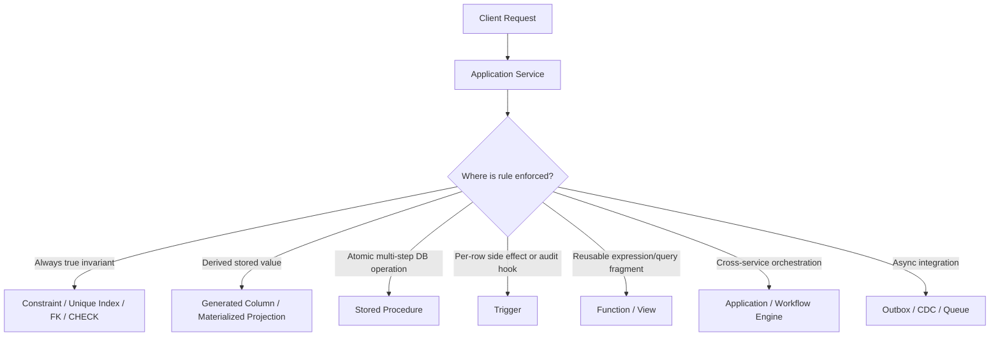
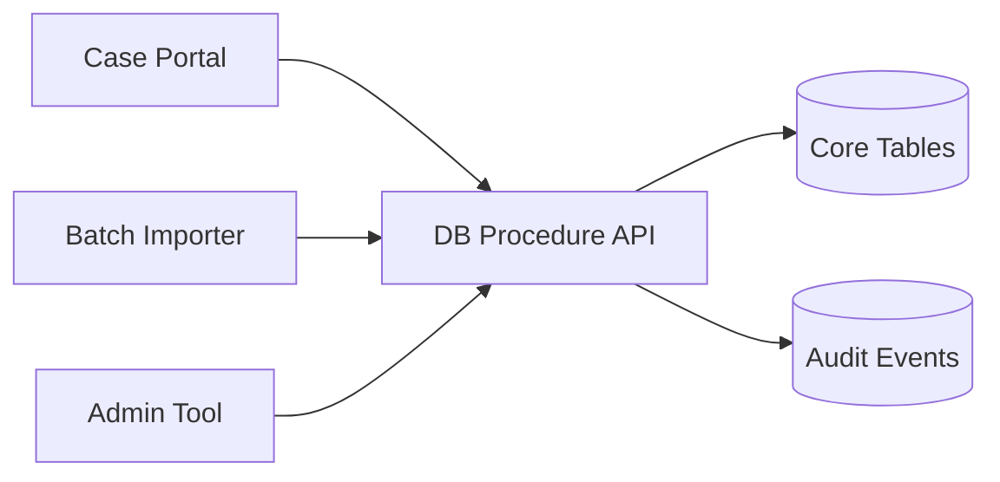
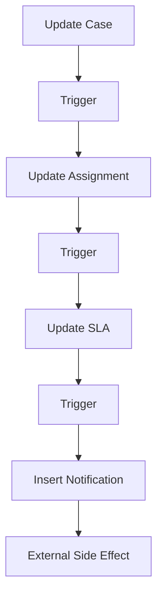
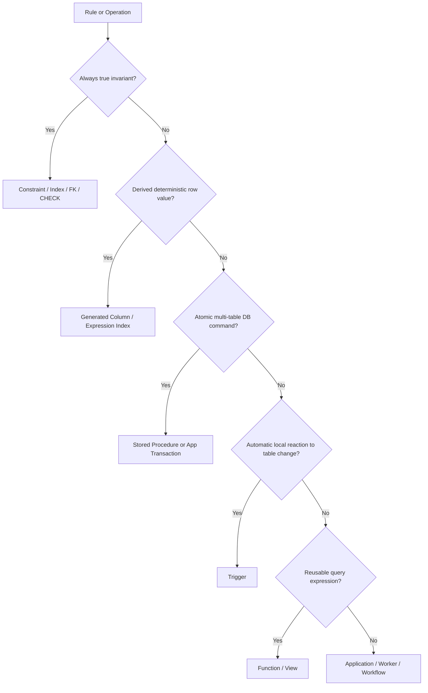

# Part 027 — Stored Procedures, Functions, and Database Boundaries

## 1. Why This Part Exists

At some point every serious SQL-backed system faces this question:

> Should this logic live in the database or in the application?

The answer is not ideological.

Bad application code can corrupt data.
Bad stored procedures can hide business logic.
Bad triggers can make writes impossible to reason about.
Bad functions can destroy query performance.
Bad migrations can strand database code that no deployed service understands.

Database executable logic is powerful because it runs close to the data, inside the same transactional boundary, with direct access to constraints, indexes, locks, and row visibility.

It is dangerous for the same reason.

This part teaches how to design database logic as an explicit boundary, not as a dumping ground for logic that was inconvenient to put elsewhere.

We will cover:

- scalar functions,
- table-valued functions,
- stored procedures,
- triggers,
- generated columns,
- constraints versus executable logic,
- transaction ownership,
- side effects,
- performance cost,
- security context,
- testability,
- portability,
- Java/service integration,
- and production review heuristics.

The goal is not to make you “pro-stored-procedure” or “anti-stored-procedure”.

The goal is to give you a decision model.

---

## 2. Kaufman Framing: The Sub-Skill We Are Training

The sub-skill is:

> Given a piece of business, validation, transformation, or workflow logic, decide whether it belongs in a constraint, index, generated column, trigger, function, stored procedure, application service, batch job, stream processor, or analytics layer.

You are training to answer five questions quickly:

1. **Invariant** — must this rule always be true regardless of caller?
2. **Transaction** — must this logic execute atomically with the data change?
3. **Visibility** — should callers see this logic explicitly or should it be hidden?
4. **Portability** — does this system need to move across engines?
5. **Operability** — can we test, deploy, monitor, roll back, and debug it safely?

Kaufman-style acquisition says we should deconstruct the skill and practice the smallest useful decisions.

For this topic, the smallest useful practice is not writing a stored procedure.

The smallest useful practice is classifying logic correctly.

---

## 3. Mental Model: Database Logic Is Code with Different Physics

Application code and database code are both code.

But their runtime physics differ.

| Dimension | Application code | Database executable logic |
|---|---|---|
| Runtime | App process, container, JVM, worker | Database backend/session/executor |
| Deployment | CI/CD artifact | DDL/migration artifact |
| Scaling | Horizontal service replicas | Database CPU/session capacity |
| Observability | Logs, tracing, metrics | Query stats, logs, wait events, audit tables |
| Failure | Exceptions, retries, circuit breakers | Transaction rollback, lock waits, statement abort |
| Versioning | App release version | Schema migration version |
| Transaction boundary | Usually controlled by app | May be inside or define transaction |
| Security | Service identity, app authz | Database role, definer/invoker rights |
| Portability | Language/runtime portability | SQL dialect/vendor-specific behavior |

A useful diagram:



The strongest production rule:

> Put invariants in the least magical, most declarative, most observable place that can enforce them.

That order is usually:

1. data type,
2. `NOT NULL`,
3. `CHECK`,
4. `UNIQUE`,
5. foreign key,
6. exclusion/range constraint where available,
7. generated column,
8. trigger,
9. procedure,
10. application logic.

Application logic is not last because it is bad.

It is last for invariants because every caller must remember to implement it correctly.

---

## 4. Taxonomy of Database Logic

### 4.1 Constraints

Constraints declare facts that must hold.

Examples:

```sql
create table enforcement_case (
    case_id        bigint generated always as identity primary key,
    case_number    text not null unique,
    status         text not null,
    severity       text not null,
    opened_at      timestamptz not null default current_timestamp,
    closed_at      timestamptz,
    check (status in ('OPEN', 'UNDER_REVIEW', 'ESCALATED', 'CLOSED')),
    check (severity in ('LOW', 'MEDIUM', 'HIGH', 'CRITICAL')),
    check (closed_at is null or status = 'CLOSED')
);
```

Use constraints when the rule is local, deterministic, and must always be true.

Constraints are better than triggers for simple invariants because:

- they are visible in schema,
- they are understood by tools,
- they can help the optimizer,
- they fail consistently,
- they are easier to reason about,
- and they are less likely to create hidden writes.

### 4.2 Generated Columns

A generated column stores or computes an expression derived from other columns.

```sql
create table case_party (
    party_id bigint generated always as identity primary key,
    first_name text not null,
    last_name text not null,
    normalized_name text generated always as (
        lower(first_name || ' ' || last_name)
    ) stored
);
```

Use generated columns when:

- the derived value is deterministic,
- it belongs to the row,
- it should be indexed,
- and you want to avoid duplicated expression logic in every query.

Do not use generated columns for logic that requires other rows, external services, clocks with changing semantics, or mutable policy rules.

### 4.3 Functions

A function returns a value.

It can be scalar:

```sql
create function normalize_case_number(input text)
returns text
language sql
immutable
as $$
    select upper(regexp_replace(trim(input), '[^A-Za-z0-9]+', '', 'g'))
$$;
```

Or table-valued:

```sql
create function open_cases_for_assignee(p_assignee_id bigint)
returns table (
    case_id bigint,
    case_number text,
    status text,
    priority int
)
language sql
stable
as $$
    select c.case_id, c.case_number, c.status, c.priority
    from enforcement_case c
    where c.assignee_id = p_assignee_id
      and c.status <> 'CLOSED'
$$;
```

Use functions for reusable expressions or query fragments when the cost and semantics are clear.

Be careful: functions can hide expensive work from readers and sometimes from optimizers.

### 4.4 Stored Procedures

A procedure performs an operation.

```sql
create procedure assign_case(
    in p_case_id bigint,
    in p_assignee_id bigint,
    in p_actor_id bigint
)
language plpgsql
as $$
begin
    update enforcement_case
    set assignee_id = p_assignee_id,
        updated_at = current_timestamp
    where case_id = p_case_id
      and status <> 'CLOSED';

    if not found then
        raise exception 'case % cannot be assigned', p_case_id;
    end if;

    insert into case_event(case_id, event_type, actor_id, occurred_at)
    values (p_case_id, 'ASSIGNED', p_actor_id, current_timestamp);
end;
$$;
```

Use procedures for atomic multi-statement database operations that should be owned by the database boundary.

Procedures are not just “functions without return values”.

They communicate intent:

- this is a command,
- it may mutate data,
- it may own transaction behavior depending on engine and call context,
- it may represent a database API.

### 4.5 Triggers

A trigger automatically executes when a table event occurs.

```sql
create function audit_case_status_change()
returns trigger
language plpgsql
as $$
begin
    if old.status is distinct from new.status then
        insert into case_status_audit(
            case_id,
            old_status,
            new_status,
            changed_at
        ) values (
            new.case_id,
            old.status,
            new.status,
            current_timestamp
        );
    end if;

    return new;
end;
$$;

create trigger trg_audit_case_status_change
after update of status on enforcement_case
for each row
execute function audit_case_status_change();
```

Use triggers when logic must run regardless of caller and is directly caused by the row/table change.

Avoid triggers for broad business workflows that need explicit orchestration, observability, retries, external calls, or user-facing decision paths.

---

## 5. The Boundary Decision Matrix

Use this matrix during design reviews.

| Logic type | Best first home | Why |
|---|---|---|
| Column required | `NOT NULL` | Simple invariant |
| Value domain | `CHECK`, lookup FK, enum/domain | Declarative validity |
| Uniqueness | `UNIQUE` index/constraint | Race-safe invariant |
| Parent-child existence | Foreign key | Referential correctness |
| Derived deterministic field | Generated column | Removes expression duplication |
| Auditing local row mutation | Trigger | Runs for all writers |
| Multi-table atomic command | Procedure or app transaction | Depends on ownership and observability |
| Complex workflow transition | App/service + SQL constraints | Explicit orchestration with DB guardrails |
| Cross-service process | Workflow engine/app | DB cannot coordinate remote systems safely |
| External side effect | Outbox + worker | Avoid side effects inside DB transaction |
| Analytics transformation | View/materialized view/dbt/job | Separates source truth from derived truth |
| Security filtering | Row-level security/security view | Enforced close to data |
| API-level authorization | Application service | Needs identity/context/policy engine |

The decisive distinction:

> The database should own facts and invariants. The application should own user intent, orchestration, and external interaction.

---

## 6. Functions: Useful, Dangerous, and Often Misunderstood

### 6.1 Function Volatility

Many engines classify functions by stability or determinism.

PostgreSQL has volatility categories such as `IMMUTABLE`, `STABLE`, and `VOLATILE`.

The idea:

- `IMMUTABLE`: same input always returns same output.
- `STABLE`: same input returns same output within a statement.
- `VOLATILE`: result may change at any time or has side effects.

Why this matters:

- immutable expressions can be indexed,
- stable functions may be optimized differently,
- volatile functions restrict optimization,
- incorrect volatility declarations can return wrong results.

Example of good immutable function:

```sql
create function normalize_email(input text)
returns text
language sql
immutable
as $$
    select lower(trim(input))
$$;
```

Example of bad immutable function:

```sql
create function is_business_hours()
returns boolean
language sql
immutable
as $$
    select extract(hour from current_timestamp) between 9 and 17
$$;
```

This is wrong because the result changes over time.

### 6.2 Function in Predicate Trap

This query often looks clean:

```sql
select *
from customer
where normalize_email(email) = normalize_email('ALICE@example.com');
```

But unless there is an expression index, the engine may need to apply the function to many rows.

Better options:

```sql
alter table customer
add column normalized_email text generated always as (lower(trim(email))) stored;

create unique index ux_customer_normalized_email
on customer(normalized_email);
```

Then query:

```sql
select *
from customer
where normalized_email = lower(trim('ALICE@example.com'));
```

Or use an expression index if your engine supports it:

```sql
create unique index ux_customer_normalized_email_expr
on customer ((lower(trim(email))));
```

### 6.3 Table-Valued Functions as API

Table-valued functions can look like a clean database API:

```sql
select *
from open_cases_for_assignee(42);
```

They are useful when:

- repeated query logic is complex,
- the output contract is stable,
- callers should not know base table shape,
- access should be mediated through a function,
- the function has predictable cost.

They are dangerous when:

- the function hides joins over large tables,
- the optimizer cannot inline or estimate it well,
- callers compose it blindly,
- it becomes a versionless service API,
- it is changed without consumer impact analysis.

A function is not free abstraction.

It is a query boundary.

---

## 7. Stored Procedures as Command Boundaries

Stored procedures are most defensible when they represent database commands.

Example command:

> Approve a case escalation request if the request is pending, the case is still open, and the actor is authorized.

A procedure can enforce the atomic data mutation:

```sql
create procedure approve_escalation_request(
    in p_request_id bigint,
    in p_actor_id bigint
)
language plpgsql
as $$
declare
    v_case_id bigint;
begin
    update escalation_request
    set status = 'APPROVED',
        decided_by = p_actor_id,
        decided_at = current_timestamp
    where request_id = p_request_id
      and status = 'PENDING'
    returning case_id into v_case_id;

    if v_case_id is null then
        raise exception 'request % is not pending or does not exist', p_request_id;
    end if;

    update enforcement_case
    set status = 'ESCALATED',
        updated_at = current_timestamp
    where case_id = v_case_id
      and status in ('OPEN', 'UNDER_REVIEW');

    if not found then
        raise exception 'case % cannot be escalated', v_case_id;
    end if;

    insert into case_event(case_id, event_type, actor_id, occurred_at)
    values (v_case_id, 'ESCALATION_APPROVED', p_actor_id, current_timestamp);
end;
$$;
```

This is reasonable if:

- all consumers should use the same transition logic,
- the mutation must be atomic,
- the database is the system-of-record owner,
- the operation is not calling external systems,
- the team has migration/testing discipline for database code.

It is risky if:

- authorization logic depends on complex application context,
- the procedure grows into an entire workflow engine,
- each service calls it with different assumptions,
- versioning is unclear,
- tracing and debugging are weak.

### 7.1 Stored Procedure as Database API

A database API can be powerful in regulated or multi-application environments.

Instead of exposing base tables to many apps, expose procedures:



Benefits:

- one enforcement point,
- consistent audit trail,
- less duplicated DML,
- fewer partial writes,
- easier data access governance.

Costs:

- database becomes application platform,
- deployment coupling increases,
- vendor portability decreases,
- app tracing can become less transparent,
- database CPU becomes business logic CPU,
- unit testing and code review must include database code.

### 7.2 Procedure Granularity

Bad granularity:

```text
process_everything_for_case(case_id)
```

Better granularity:

```text
submit_case_for_review(case_id, actor_id)
approve_escalation_request(request_id, actor_id)
close_case(case_id, closure_reason, actor_id)
assign_case(case_id, assignee_id, actor_id)
```

A procedure should have a command name that maps to a business event.

If the name uses words like `process`, `sync`, `handle`, `do`, or `manage`, inspect it closely.

Those names often hide unclear boundaries.

---

## 8. Triggers: The Sharpest Tool in This Part

Triggers are powerful because callers cannot forget them.

That is also why they are dangerous.

### 8.1 Good Trigger Use Cases

Good candidates:

- immutable audit append for row changes,
- maintaining `updated_at`,
- enforcing a cross-row invariant not expressible declaratively,
- writing an outbox event after local transaction changes,
- maintaining a small derived table when materialized view is not enough,
- preventing forbidden mutation paths.

Example: `updated_at` trigger.

```sql
create function set_updated_at()
returns trigger
language plpgsql
as $$
begin
    new.updated_at = current_timestamp;
    return new;
end;
$$;

create trigger trg_case_set_updated_at
before update on enforcement_case
for each row
execute function set_updated_at();
```

This is defensible because it is local, simple, deterministic enough for the row, and obvious.

Example: audit event trigger.

```sql
create function audit_case_update()
returns trigger
language plpgsql
as $$
begin
    insert into case_audit(
        case_id,
        changed_at,
        old_row,
        new_row
    ) values (
        new.case_id,
        current_timestamp,
        to_jsonb(old),
        to_jsonb(new)
    );

    return new;
end;
$$;

create trigger trg_case_audit_update
after update on enforcement_case
for each row
execute function audit_case_update();
```

### 8.2 Bad Trigger Use Cases

Avoid triggers for:

- sending emails,
- calling HTTP APIs,
- publishing directly to Kafka,
- complex approval routing,
- multi-step business orchestration,
- modifying many unrelated tables,
- enforcing authorization based on application session state,
- logic with feature flags invisible to the database,
- logic that depends on external availability.

The anti-pattern:



This is operationally hostile.

The write path has hidden work, hidden locks, hidden failures, and hidden dependencies.

### 8.3 Trigger Recursion and Cascades

A trigger that updates the same table can recurse.

```sql
create function dangerous_trigger()
returns trigger
language plpgsql
as $$
begin
    update enforcement_case
    set updated_at = current_timestamp
    where case_id = new.case_id;

    return new;
end;
$$;
```

If attached to `enforcement_case` update, this can repeatedly fire depending on engine behavior and trigger configuration.

Use `BEFORE UPDATE` with `new.updated_at = ...` instead.

### 8.4 Trigger Ordering

When multiple triggers exist on a table, ordering rules are engine-specific.

Do not rely on informal execution order unless the engine provides explicit ordering and the team has documented it.

Prefer one small trigger per concern only when order does not matter.

If order matters, you probably have a workflow that should be explicit elsewhere.

---

## 9. Transaction Ownership

The most important stored procedure question:

> Who owns the transaction boundary?

Possible models:

### Model A — Application owns transaction

```text
app begins transaction
  call procedure A
  insert outbox event
  update app-owned table
app commits
```

Benefits:

- clearer orchestration,
- application tracing sees the whole operation,
- easier to coordinate local DB changes.

Risks:

- procedure may assume it owns commit/rollback,
- long app transaction can hold locks,
- nested behavior differs by engine.

### Model B — Procedure owns operation

```text
app calls procedure
procedure performs complete atomic command
procedure returns success/failure
```

Benefits:

- consistent command behavior,
- less app duplication,
- database API can protect invariants.

Risks:

- harder to compose safely,
- external workflow may be hidden,
- rollback semantics depend on call context.

### Model C — Application plus outbox

```text
app begins transaction
  update core tables
  insert outbox row
app commits
worker publishes side effect
```

Benefits:

- atomic local state change,
- external side effects are retried outside DB transaction,
- supports observability and replay.

Risks:

- eventual consistency,
- duplicate delivery handling required,
- outbox cleanup and monitoring required.

Production preference:

> Do not perform external side effects inside stored procedures or triggers. Persist intent inside the transaction, then let a worker perform side effects after commit.

---

## 10. Security Context: Definer, Invoker, and Privilege Boundary

Database functions and procedures often run with one of two models:

- invoker rights: execute with caller privileges,
- definer rights: execute with owner privileges.

Definer-rights logic can be useful for controlled access.

Example pattern:

```text
application role cannot update core table directly
application role can execute approve_escalation_request
procedure validates transition and writes audit
```

This creates a database command boundary.

But it also creates security responsibilities:

- limit procedure owner privileges,
- validate all inputs,
- avoid dynamic SQL unless necessary,
- set safe search path where relevant,
- prevent SQL injection in dynamic statements,
- audit executions,
- review grants during migrations.

A procedure with elevated privileges is privileged code.

Treat it like privileged code.

---

## 11. Performance Model

Database logic consumes database resources.

That sounds obvious, but teams forget it because database logic does not appear in application CPU dashboards.

### 11.1 UDF Cost

Functions inside row-by-row execution can be expensive.

```sql
select case_id
from enforcement_case
where is_case_visible_to_user(case_id, 42);
```

If `is_case_visible_to_user` runs for every row and performs subqueries, this is catastrophic at scale.

Better pattern:

```sql
select c.case_id
from enforcement_case c
join case_assignment a
  on a.case_id = c.case_id
 and a.user_id = 42
where c.status <> 'CLOSED';
```

Make relationships visible to the optimizer.

### 11.2 Procedural Loops vs Set-Based SQL

Bad:

```sql
declare
    r record;
begin
    for r in select case_id from enforcement_case where status = 'OPEN' loop
        update enforcement_case
        set priority = priority + 1
        where case_id = r.case_id;
    end loop;
end;
```

Better:

```sql
update enforcement_case
set priority = priority + 1
where status = 'OPEN';
```

Procedural code is sometimes necessary, but SQL engines are optimized for set-based operations.

A loop in a stored procedure is still row-by-row work.

### 11.3 Hidden Query Plans

Stored procedures can contain SQL statements with their own plans.

When debugging performance, inspect the statements inside procedures, not just the `CALL`.

Ask:

- which statement is slow?
- which statement blocks?
- which statement scans?
- which statement causes deadlock?
- which statement creates temp/sort/hash spill?
- which parameter values create bad plans?

Procedure-level timing is not enough.

---

## 12. Portability and Vendor Differences

SQL itself is standardized, but procedural SQL is heavily vendor-specific.

| Engine | Procedural features |
|---|---|
| PostgreSQL | PL/pgSQL, SQL functions, procedures, triggers, many extension languages |
| SQL Server | T-SQL stored procedures, scalar/table functions, triggers |
| Oracle | PL/SQL packages, procedures, functions, triggers |
| MySQL | stored procedures, functions, triggers, events |
| SQLite | triggers, user-defined functions via host language; no traditional stored procedure language |
| DuckDB | SQL macros and functions; different operational target |

Portability questions:

- Is the organization committed to one engine?
- Is this product deployed into customer-managed databases?
- Does the logic use dialect-specific types or syntax?
- Can migration tooling handle procedural objects?
- Are tests run against the same engine as production?

If portability matters, keep database executable logic small and well-isolated.

If correctness inside one engine matters more, use the engine deliberately.

---

## 13. Versioning Database Code

Database code must be versioned with migrations.

Bad:

```text
manually edit procedure in production console
```

Good:

```text
V202607011200__create_approve_escalation_request.sql
V202607021300__alter_approve_escalation_request_add_reason.sql
```

For repeatable objects like views/functions, teams often use repeatable migrations, but they must be deterministic and reviewable.

Critical rules:

- never patch database code manually without capturing it in source control,
- deploy database code before application code that depends on it,
- keep backward-compatible procedure signatures during rolling deployments,
- avoid dropping old functions until all callers are gone,
- include grants in migrations,
- test migration order from empty database and from production-like snapshot.

---

## 14. Java/Application Integration Notes

As a Java engineer, think in terms of boundary ownership.

### 14.1 Calling Procedures from Java

A procedure call through JDBC may look like this:

```java
try (CallableStatement stmt = connection.prepareCall("call approve_escalation_request(?, ?)")) {
    stmt.setLong(1, requestId);
    stmt.setLong(2, actorId);
    stmt.execute();
}
```

But the architectural questions are more important than the API:

- Does the app begin/commit the transaction?
- What SQL state/error code maps to domain error?
- Is the procedure idempotent?
- Can this call be retried safely?
- Does the call write an audit event?
- Is authorization checked in app, DB, or both?
- Can observability show which command ran?
- Is procedure version compatible with current app version?

### 14.2 ORM Boundary

If using JPA/Hibernate, stored procedures can bypass ORM assumptions.

Potential issues:

- persistence context may hold stale entities,
- optimistic lock version may not update unless procedure handles it,
- second-level cache may become stale,
- entity listeners may not fire,
- generated SQL and procedure SQL may conflict on invariants.

If database procedures mutate ORM-managed tables, define a clear rule:

> After calling database-side mutation logic, assume ORM-managed state may need refresh or transaction boundary reset.

---

## 15. Common Anti-Patterns

### 15.1 Logic Split-Brain

Some callers use procedure.
Some callers write tables directly.
The rules diverge.

Fix:

- revoke direct table write where possible,
- enforce invariant declaratively,
- centralize mutation path,
- add reconciliation queries.

### 15.2 Trigger Surprise

A simple insert triggers five hidden writes.

Fix:

- document trigger graph,
- expose audit/outbox writes explicitly in design docs,
- keep triggers local,
- monitor trigger execution cost.

### 15.3 Procedure God Object

One procedure handles dozens of operations.

Fix:

- split by command,
- name procedures by domain action,
- remove branch-heavy procedural workflow,
- move orchestration to application/workflow layer.

### 15.4 Function-Wrapped Predicates Everywhere

Queries look clean but cannot use indexes.

Fix:

- generated columns,
- expression indexes,
- normalized stored values,
- make joins/predicates visible.

### 15.5 External Calls from DB

Database code calls network services.

Fix:

- write outbox row in transaction,
- worker sends external request after commit,
- make delivery idempotent.

---

## 16. Design Review Checklist

Before adding a function, procedure, or trigger, answer:

1. What invariant or command does it protect?
2. Why is declarative constraint not enough?
3. Why is application logic not enough?
4. What tables can it read?
5. What tables can it write?
6. Can it call external systems? The default answer should be no.
7. Who owns transaction boundary?
8. Is the operation idempotent?
9. What happens on retry?
10. What locks can it take?
11. What indexes support its queries?
12. How is it versioned?
13. How is it tested?
14. How is it monitored?
15. What privileges does it require?
16. What consumers depend on its signature?
17. What is the rollback or roll-forward plan?
18. Does it hide business logic from application maintainers?
19. Does it create vendor lock-in that matters?
20. Can a new engineer understand the write path from schema alone?

---

## 17. Practice Lab

Use this simplified schema:

```sql
create table enforcement_case (
    case_id bigint generated always as identity primary key,
    case_number text not null unique,
    status text not null,
    assignee_id bigint,
    version int not null default 0,
    opened_at timestamptz not null default current_timestamp,
    updated_at timestamptz not null default current_timestamp,
    check (status in ('OPEN', 'UNDER_REVIEW', 'ESCALATED', 'CLOSED'))
);

create table case_event (
    event_id bigint generated always as identity primary key,
    case_id bigint not null references enforcement_case(case_id),
    event_type text not null,
    actor_id bigint not null,
    occurred_at timestamptz not null default current_timestamp
);
```

Exercises:

1. Add a trigger that updates `updated_at` on every case update.
2. Add a procedure `assign_case(case_id, assignee_id, actor_id)` that updates the case and writes a `case_event`.
3. Modify the procedure to reject closed cases.
4. Add optimistic concurrency using `version`.
5. Write a reconciliation query that finds assignment changes without a corresponding `case_event`.
6. Decide whether the reconciliation query should become a view, function, scheduled check, or dashboard query.
7. Write a review note explaining why the assignment logic is in a procedure instead of only application code.

---

## 18. Production Heuristics

Use database executable logic when:

- it protects a system-of-record invariant,
- it is atomic with local data mutation,
- it is simple enough to test and review,
- it reduces duplicated unsafe write paths,
- it does not perform remote side effects,
- it has clear ownership and versioning.

Avoid it when:

- it hides complex workflow,
- it requires external services,
- it needs rich application context,
- it becomes a generic service layer,
- it is not observable,
- it creates unacceptable vendor lock-in,
- it conflicts with ORM lifecycle assumptions.

The best database logic is boring.

It is small, local, explicit, tested, versioned, and backed by constraints.

---

## 19. Mental Model Summary



Key idea:

> Database code should make the data safer, not the system more mysterious.

---

## 20. References

- PostgreSQL Documentation — `CREATE FUNCTION`.
- PostgreSQL Documentation — `CREATE PROCEDURE`.
- PostgreSQL Documentation — `CREATE TRIGGER`.
- PostgreSQL Documentation — Trigger functions and privileges.
- SQL Server Documentation — stored procedures, functions, triggers, and execution plans.
- MySQL Documentation — stored programs and triggers.
- Martin Fowler — Domain Event and Transaction Script patterns.
- Flyway Documentation — versioned and repeatable migrations.

---

## 21. What Comes Next

Part 028 moves from executable database logic to schema evolution.

You will learn how to change databases safely while applications are running:

- expand-contract migrations,
- zero-downtime DDL,
- backfills,
- validation constraints,
- dual-write risks,
- rollback versus roll-forward,
- and release choreography.
