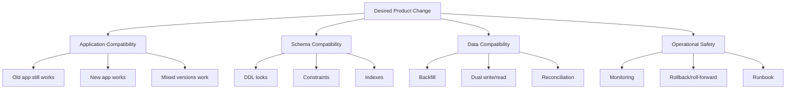
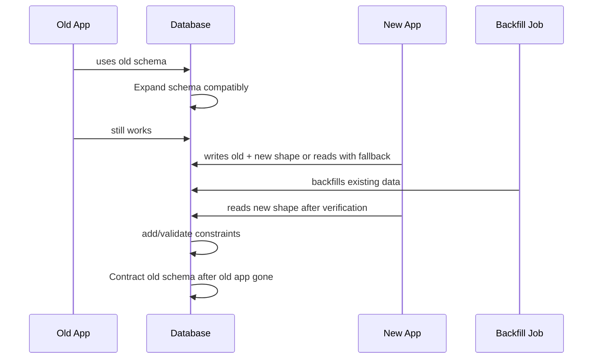
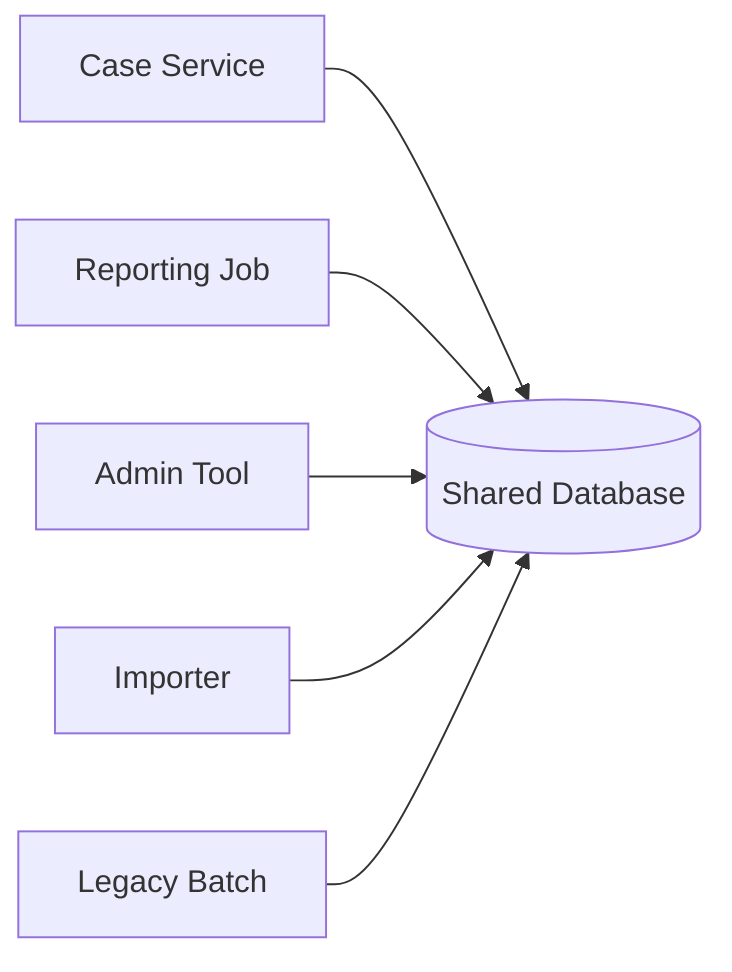
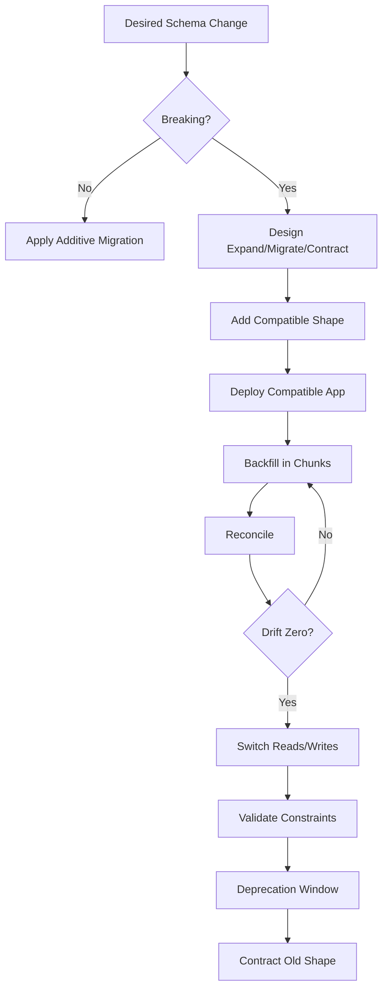

# Part 028 — Migrations, Schema Evolution, and Backward Compatibility

## 1. Why This Part Exists

A database schema is not static.

Production systems evolve:

- new columns,
- renamed concepts,
- larger identifiers,
- new constraints,
- new indexes,
- split tables,
- merged tables,
- new audit requirements,
- new workflow states,
- new data retention rules,
- new tenant isolation requirements,
- new reporting needs.

The naive view of migration is:

```text
change schema, deploy app, done
```

The production view is:

```text
change schema while old app still runs,
while new app gradually rolls out,
while traffic continues,
while replicas lag,
while background jobs run,
while rollback remains possible,
while data stays correct.
```

This part teaches schema evolution as compatibility engineering.

A migration is not just DDL.

A migration is a controlled transition between two valid system states.

---

## 2. Kaufman Framing: The Sub-Skill We Are Training

The sub-skill is:

> Given a desired schema change, design a safe migration plan that preserves correctness across old code, new code, live data, concurrent writes, rollback/roll-forward, and operational constraints.

You are training to identify:

1. whether the change is backward-compatible,
2. whether it blocks reads/writes,
3. whether it rewrites large tables,
4. whether old and new app versions can coexist,
5. whether data backfill is needed,
6. whether constraints can be validated later,
7. whether rollback means code rollback, schema rollback, or roll-forward fix,
8. whether observability can detect drift.

The fastest path to competence is learning migration shapes, not memorizing migration tool commands.

---

## 3. Migration Mental Model

A live migration has four planes:



A schema change fails when one plane is ignored.

Examples:

- App compatibility ignored: old app crashes because column was dropped.
- Schema compatibility ignored: `ALTER TABLE` blocks writes for minutes.
- Data compatibility ignored: new code reads nulls it did not expect.
- Operational safety ignored: backfill saturates IO and causes latency spikes.

---

## 4. The Core Rule: Expand, Migrate, Contract

Most safe migrations follow this shape:



The phases:

1. **Expand** — add new structures without breaking old code.
2. **Migrate** — write/read both or backfill until new structure is complete.
3. **Verify** — reconcile old and new shape.
4. **Switch** — make new code rely on new structure.
5. **Contract** — remove old structure only after no consumers remain.

This is the same mental model used in distributed systems compatibility.

A database migration is a protocol upgrade.

Old and new participants coexist.

---

## 5. Migration Categories

### 5.1 Metadata-Only Change

Example:

```sql
alter table enforcement_case
add column external_reference text;
```

Usually safe if:

- column is nullable or has safe default behavior,
- no table rewrite occurs for the engine/version,
- old code ignores it,
- new code handles null.

Still verify lock behavior for the specific engine.

### 5.2 Constraint Change

Example:

```sql
alter table enforcement_case
add constraint ck_case_status
check (status in ('OPEN', 'UNDER_REVIEW', 'ESCALATED', 'CLOSED'));
```

Risk:

- existing rows may violate it,
- validation may scan table,
- DDL may lock writes,
- app may still write invalid data.

Safer pattern in engines that support it:

```sql
alter table enforcement_case
add constraint ck_case_status
check (status in ('OPEN', 'UNDER_REVIEW', 'ESCALATED', 'CLOSED'))
not valid;

-- after fixing existing data
alter table enforcement_case
validate constraint ck_case_status;
```

### 5.3 Index Change

Example:

```sql
create index idx_case_status_assignee
on enforcement_case(status, assignee_id);
```

Risks:

- write amplification,
- build locks,
- long runtime,
- disk growth,
- replication lag,
- plan changes.

Safer PostgreSQL-style pattern:

```sql
create index concurrently idx_case_status_assignee
on enforcement_case(status, assignee_id);
```

Even concurrent index creation has operational constraints.

Do not treat it as free.

### 5.4 Data Backfill

Example:

```sql
update enforcement_case
set normalized_case_number = upper(case_number)
where normalized_case_number is null;
```

Risk:

- massive transaction,
- long locks,
- WAL/redo log growth,
- replication lag,
- cache churn,
- dead rows/bloat,
- contention with live writes.

Safer pattern:

```sql
update enforcement_case
set normalized_case_number = upper(case_number)
where normalized_case_number is null
  and case_id >= :lower_bound
  and case_id < :upper_bound;
```

Run in chunks with monitoring and pause/resume.

### 5.5 Semantic Change

Example:

```text
status = 'ESCALATED' is replaced by escalation_level > 0
```

This is not just schema change.

It changes business meaning.

It needs:

- compatibility mapping,
- dual-read or fallback read,
- event/audit interpretation,
- reports update,
- historical data policy,
- customer/API contract review,
- migration verification.

Semantic migrations are the most dangerous.

---

## 6. Backward and Forward Compatibility

Backward-compatible schema change:

> New database schema works with old application code.

Forward-compatible application change:

> New application code works before, during, and after schema transition.

Rolling deployments require both.

| Change | Old app safe? | New app safe? | Notes |
|---|---:|---:|---|
| Add nullable column | Usually yes | Yes if null-handled | Common expand step |
| Add column `NOT NULL` without default/backfill | No/Maybe | Maybe | Often unsafe on existing rows |
| Drop column | No | Yes only after all old consumers gone | Contract step only |
| Rename column | No | No unless compatibility layer exists | Treat as add-copy-switch-drop |
| Add table | Yes | Yes | Usually safe |
| Drop table | No if any old consumer | Yes only after cleanup | Contract step only |
| Add permissive index | Yes | Yes | Watch write overhead/plan change |
| Add strict constraint | Maybe | Maybe | Validate data and app writes first |
| Change data type | Maybe unsafe | Maybe unsafe | Requires compatibility plan |
| Split table | No if immediate | Yes with dual-write/backfill | Multi-phase |
| Change enum/status domain | Maybe | Maybe | Requires old/new value mapping |

A migration that only works when all app instances switch at the same instant is usually unsafe.

---

## 7. Safe Patterns

### 7.1 Add Nullable Column

Goal:

> Add `risk_score` to cases.

Migration:

```sql
alter table enforcement_case
add column risk_score numeric(6,2);
```

Application:

```text
old app: ignores risk_score
new app: writes risk_score when available, handles null
```

Later:

```sql
update enforcement_case
set risk_score = 0
where risk_score is null;

alter table enforcement_case
alter column risk_score set not null;
```

But only after verifying no writer can produce null.

### 7.2 Add Column with Default

Be cautious.

Some engines/versions can add a column with constant default efficiently.
Others may rewrite the table.

Safer universal pattern:

```sql
alter table enforcement_case
add column source_system text;

-- app begins writing source_system
-- backfill existing rows in chunks

update enforcement_case
set source_system = 'LEGACY'
where source_system is null
  and case_id between :start_id and :end_id;

-- after verification
alter table enforcement_case
alter column source_system set not null;
```

### 7.3 Rename Column Safely

Unsafe:

```sql
alter table enforcement_case
rename column owner_id to assignee_id;
```

This breaks old code immediately.

Safer:

1. Add new column.
2. New code writes both columns.
3. Backfill new column from old column.
4. Read from new column with fallback if needed.
5. Verify equality.
6. Stop reading old column.
7. Stop writing old column.
8. Drop old column later.

SQL shape:

```sql
alter table enforcement_case
add column assignee_id bigint;

update enforcement_case
set assignee_id = owner_id
where assignee_id is null;
```

Reconciliation:

```sql
select count(*) as drift_count
from enforcement_case
where assignee_id is distinct from owner_id;
```

Only contract after drift is zero and all consumers are migrated.

### 7.4 Add Foreign Key to Large Table

Unsafe on a large table if validation blocks too long:

```sql
alter table enforcement_case
add constraint fk_case_assignee
foreign key (assignee_id) references app_user(user_id);
```

Safer where supported:

```sql
alter table enforcement_case
add constraint fk_case_assignee
foreign key (assignee_id) references app_user(user_id)
not valid;
```

Then fix data:

```sql
select c.case_id, c.assignee_id
from enforcement_case c
left join app_user u on u.user_id = c.assignee_id
where c.assignee_id is not null
  and u.user_id is null;
```

Then validate:

```sql
alter table enforcement_case
validate constraint fk_case_assignee;
```

This separates enforcement for future writes from validation of existing rows in engines that support the pattern.

### 7.5 Add Unique Constraint Safely

Goal:

> `case_number` must be unique per tenant.

First detect duplicates:

```sql
select tenant_id, case_number, count(*)
from enforcement_case
group by tenant_id, case_number
having count(*) > 1;
```

Fix duplicates.

Create unique index with safe engine-specific method:

```sql
create unique index concurrently ux_case_tenant_case_number
on enforcement_case(tenant_id, case_number);
```

Attach as constraint where applicable:

```sql
alter table enforcement_case
add constraint uq_case_tenant_case_number
unique using index ux_case_tenant_case_number;
```

### 7.6 Change Data Type Safely

Goal:

> Convert integer IDs to bigint.

Naive:

```sql
alter table enforcement_case
alter column case_id type bigint;
```

This may rewrite large tables and cascade complexity to FKs.

Safer pattern for very large systems:

1. Add new bigint column.
2. Populate it from old column.
3. Add new FKs/indexes.
4. Update writers.
5. Migrate references.
6. Switch primary key or introduce surrogate mapping.
7. Contract old column.

This is expensive, but predictable.

Type migrations are often project-level work, not a one-line DDL.

### 7.7 Split Table

Before:

```text
enforcement_case(case_id, status, assignee_id, closure_reason, closed_at, ...)
```

After:

```text
enforcement_case(case_id, status, assignee_id, ...)
case_closure(case_id, closure_reason, closed_at, closed_by)
```

Safe plan:

1. Create `case_closure`.
2. New code writes closure info to both old columns and new table.
3. Backfill `case_closure` from existing closed cases.
4. Add reconciliation query.
5. Switch reads to new table with fallback.
6. Stop writing old columns.
7. Drop old columns after all consumers are gone.

Reconciliation:

```sql
select c.case_id
from enforcement_case c
left join case_closure cc on cc.case_id = c.case_id
where c.status = 'CLOSED'
  and cc.case_id is null;
```

---

## 8. Backfill Engineering

A backfill is production workload.

Treat it like a service.

### 8.1 Bad Backfill

```sql
update enforcement_case
set normalized_case_number = upper(case_number)
where normalized_case_number is null;
```

Problems:

- one huge transaction,
- long locks,
- huge WAL/redo,
- replication lag,
- hard rollback,
- no progress visibility,
- no pause/resume.

### 8.2 Better Backfill

Create progress table:

```sql
create table migration_progress (
    migration_name text primary key,
    last_processed_id bigint not null,
    updated_at timestamptz not null default current_timestamp
);
```

Chunk:

```sql
update enforcement_case
set normalized_case_number = upper(case_number)
where normalized_case_number is null
  and case_id > :last_id
  and case_id <= :next_id;
```

Track:

```sql
insert into migration_progress(migration_name, last_processed_id)
values ('backfill_normalized_case_number', :next_id)
on conflict (migration_name)
do update set
    last_processed_id = excluded.last_processed_id,
    updated_at = current_timestamp;
```

Monitor:

```sql
select count(*) as remaining
from enforcement_case
where normalized_case_number is null;
```

### 8.3 Backfill Control Knobs

Control:

- batch size,
- sleep between batches,
- max runtime window,
- lock timeout,
- statement timeout,
- replica lag threshold,
- error retry policy,
- progress checkpoint,
- abort switch.

A good backfill can be paused without data corruption.

---

## 9. Dual-Write and Dual-Read Risks

Dual-write means writing old and new shapes during transition.

Example:

```text
write owner_id and assignee_id
```

Risks:

- app writes one but not the other,
- procedure writes one but not the other,
- background job writes one but not the other,
- retry creates asymmetric state,
- rollback leaves new column stale,
- trigger-based sync hides failure.

Dual-read means reading from new shape with fallback:

```sql
select coalesce(assignee_id, owner_id) as effective_assignee_id
from enforcement_case;
```

Risks:

- fallback hides incomplete migration forever,
- metrics disagree with source truth,
- query performance changes,
- null semantics become ambiguous.

Use reconciliation queries aggressively.

```sql
select count(*) as mismatch_count
from enforcement_case
where assignee_id is distinct from owner_id;
```

No contract step should happen until mismatch is explained and accepted.

---

## 10. Rollback vs Roll-Forward

Teams often say “rollback” without specifying which layer.

There are several rollback types:

| Type | Meaning |
|---|---|
| App rollback | Deploy previous app version |
| Schema rollback | Undo DDL |
| Data rollback | Restore or transform data back |
| Config rollback | Disable feature flag |
| Traffic rollback | Route traffic away |
| Roll-forward | Apply corrective migration or hotfix |

In databases, schema rollback can be dangerous because data may have already changed.

Example:

```text
new app writes assignee_id
old app reads owner_id
```

If you drop `assignee_id` during rollback, you may lose data.

Production preference:

> Design migrations so application rollback is safe without immediately rolling back schema.

That means expand changes should be backward-compatible.

Contract changes should happen only after confidence is high and rollback window has passed.

---

## 11. Migration Tooling Mental Model

Migration tools do not make migrations safe automatically.

They provide ordering, history, repeatability, audit, and execution discipline.

### 11.1 Versioned Migrations

A versioned migration runs once in order.

Example naming:

```text
V202607011200__add_assignee_id_to_enforcement_case.sql
V202607011430__backfill_assignee_id.sql
V202607021000__add_fk_case_assignee_not_valid.sql
```

Use versioned migrations for:

- table creation,
- column changes,
- constraint changes,
- one-time data changes,
- index creation,
- grants.

### 11.2 Repeatable Migrations

Repeatable migrations are useful for objects that are replaced as code:

```text
R__view_open_cases.sql
R__function_normalize_case_number.sql
```

Risks:

- accidental object changes across environments,
- dependency order issues,
- function signature replacement problems,
- grants lost or not reapplied.

Repeatable migrations should be deterministic and reviewed like application code.

### 11.3 Changesets and Rollback

Changeset-based tools can attach rollback instructions.

But rollback SQL is not magic.

Dropping a column is syntactically easy.

Recovering lost semantic data is not.

Always ask:

- Is rollback destructive?
- Can rollback be tested?
- Does rollback work after new app has written data?
- Is roll-forward safer?
- Has the migration been rehearsed against production-like volume?

---

## 12. Zero-Downtime DDL Is Engine-Specific

Never assume DDL lock behavior from another database.

Questions to ask for every DDL:

1. Does it take an exclusive lock?
2. Does it block reads?
3. Does it block writes?
4. Does it scan the table?
5. Does it rewrite the table?
6. Can it run concurrently/online?
7. Can it be cancelled safely?
8. Does it replicate safely?
9. Does it increase disk usage temporarily?
10. Does it invalidate plans?

Examples:

- PostgreSQL supports `NOT VALID` constraints for certain constraint additions.
- PostgreSQL supports `CREATE INDEX CONCURRENTLY` with special caveats.
- MySQL has online DDL features depending on operation, storage engine, and version.
- SQL Server has online index operations in specific editions/features and specific operation constraints.
- SQLite often requires table rebuild patterns for schema changes.

The fact that syntax exists does not mean it is operationally safe at your data volume.

---

## 13. Compatibility Release Choreography

A robust migration is usually several releases.

### Release 1 — Expand

```sql
alter table enforcement_case
add column assignee_id bigint;
```

App still uses `owner_id`.

### Release 2 — Dual Write

New app writes both:

```text
owner_id = assigned user
assignee_id = assigned user
```

Old app still works.

### Release 3 — Backfill

```sql
update enforcement_case
set assignee_id = owner_id
where assignee_id is null;
```

Run in chunks.

### Release 4 — Verify

```sql
select count(*)
from enforcement_case
where assignee_id is distinct from owner_id;
```

### Release 5 — Switch Read

New app reads `assignee_id`, optionally fallback to `owner_id` during transition.

### Release 6 — Stop Old Write

App stops writing `owner_id`.

### Release 7 — Contract

```sql
alter table enforcement_case
drop column owner_id;
```

Only after old app and all jobs/reports are gone.

This looks slow.

It is faster than an outage.

---

## 14. Multi-Service Migration Problem

The hardest database migrations happen when many services share a database.



Dropping or renaming a column requires knowing every consumer.

Controls:

- database access inventory,
- query logging,
- ownership tags,
- views/procedures as compatibility layer,
- deprecation window,
- contract tests,
- read-only replica query audit,
- migration design review.

If consumer inventory is weak, prefer additive changes and long deprecation windows.

---

## 15. Migration Design Document Template

For non-trivial migrations, write a short design note.

```md
# Migration: Rename owner_id to assignee_id

## Goal
Clarify case ownership semantics by replacing owner_id with assignee_id.

## Current State
- enforcement_case.owner_id is used by app, reports, importer.
- owner_id is nullable.

## Target State
- enforcement_case.assignee_id stores current assignee.
- owner_id removed after deprecation.

## Compatibility Plan
1. Add nullable assignee_id.
2. Deploy app dual-write.
3. Backfill in chunks.
4. Verify no drift.
5. Switch reads.
6. Stop old writes.
7. Drop owner_id.

## Data Backfill
Chunk by case_id, 10k rows per batch, pause if replica lag > threshold.

## Verification Queries
- count null assignee_id where owner_id is not null
- count owner_id distinct from assignee_id

## Rollback
App rollback safe until contract phase.
Schema rollback not required during expand/migrate phases.

## Risks
- legacy importer may write owner_id only.
- reporting query may reference owner_id.

## Observability
- migration_progress row
- drift_count dashboard
- lock wait alerts
```

This prevents migrations from being tribal knowledge.

---

## 16. Dangerous Changes Catalogue

Treat these as high-risk:

- dropping a column,
- renaming a column,
- changing column type,
- adding `NOT NULL` to existing column,
- adding strict check constraint to dirty table,
- adding FK to huge dirty table,
- adding unique constraint without duplicate scan,
- building large index during peak traffic,
- backfilling whole table in one transaction,
- changing enum/domain values used by old app,
- changing meaning of status values,
- changing time zone semantics,
- changing primary key,
- repartitioning large tables,
- moving data across shards,
- replacing trigger/procedure signature used by old app,
- dropping compatibility view.

A dangerous change can still be done.

It just needs phases.

---

## 17. Testing Migrations

A migration is code.

Test it like code.

Minimum tests:

1. apply from empty schema,
2. apply from previous production-like schema,
3. apply with representative data volume,
4. apply with dirty data,
5. apply while old app queries still run,
6. apply while new app queries run,
7. test rollback or roll-forward,
8. test idempotency where applicable,
9. test read/write compatibility,
10. test performance and lock behavior.

Useful SQL assertions:

```sql
-- no missing assignee after backfill
select count(*)
from enforcement_case
where owner_id is not null
  and assignee_id is null;

-- no drift
select count(*)
from enforcement_case
where assignee_id is distinct from owner_id;

-- no invalid FK target
select count(*)
from enforcement_case c
left join app_user u on u.user_id = c.assignee_id
where c.assignee_id is not null
  and u.user_id is null;
```

Assertions should be stored with the migration, not only run manually.

---

## 18. Operational Runbook

Before running a large migration:

- confirm backup/restore posture,
- confirm replica lag monitoring,
- confirm lock monitoring,
- confirm disk headroom,
- confirm migration timeout settings,
- confirm cancellation behavior,
- confirm batch size,
- confirm owner/on-call,
- confirm pause/resume mechanism,
- confirm app compatibility release is deployed,
- confirm dashboard for verification queries.

During migration:

- watch lock waits,
- watch slow queries,
- watch CPU/IO,
- watch replication lag,
- watch error rates,
- watch migration progress,
- pause on threshold breach.

After migration:

- run reconciliation queries,
- check query plans for key paths,
- compare metrics before/after,
- document completion,
- schedule contract phase only after deprecation window.

---

## 19. Case Study: Adding Regulatory Case Deadlines

Goal:

> Add deadline tracking for enforcement cases. Existing cases need computed deadlines based on severity and opened date. New cases must always have a deadline.

### Step 1 — Expand

```sql
alter table enforcement_case
add column response_deadline_at timestamptz;
```

### Step 2 — New Code Writes Deadline

New app computes deadline when creating cases.

Old app still works because column is nullable.

### Step 3 — Backfill Existing Rows

```sql
update enforcement_case
set response_deadline_at = case
    when severity = 'CRITICAL' then opened_at + interval '24 hours'
    when severity = 'HIGH' then opened_at + interval '3 days'
    when severity = 'MEDIUM' then opened_at + interval '7 days'
    else opened_at + interval '14 days'
end
where response_deadline_at is null
  and case_id between :start_id and :end_id;
```

### Step 4 — Verify

```sql
select count(*)
from enforcement_case
where response_deadline_at is null;
```

### Step 5 — Add Constraint

```sql
alter table enforcement_case
add constraint ck_case_deadline_required
check (response_deadline_at is not null)
not valid;

alter table enforcement_case
validate constraint ck_case_deadline_required;
```

Or use `ALTER COLUMN SET NOT NULL` only after understanding lock/scan behavior in your engine.

### Step 6 — Index Query Path

```sql
create index concurrently idx_case_open_deadline
on enforcement_case(response_deadline_at, case_id)
where status <> 'CLOSED';
```

### Step 7 — Monitor

```sql
select count(*)
from enforcement_case
where status <> 'CLOSED'
  and response_deadline_at < current_timestamp;
```

This migration combines schema, data, constraint, index, and business semantics.

It is not one DDL statement.

---

## 20. Production Checklist

For every migration, classify:

- additive or destructive?
- backward-compatible or breaking?
- metadata-only or data-rewriting?
- small table or large table?
- online or blocking?
- app-only, DB-only, or coordinated?
- needs backfill?
- needs dual-write?
- needs reconciliation?
- needs feature flag?
- needs rollback plan?
- needs contract phase?

Then answer:

1. Can old app run after migration?
2. Can new app run before migration?
3. Can old and new app run together?
4. What happens if deployment stops halfway?
5. What happens if app rollback occurs?
6. What happens if backfill is partial?
7. What happens if migration is run twice?
8. What happens if a row changes while being backfilled?
9. What is the worst lock taken?
10. What is the largest transaction?
11. What is the largest temporary disk usage?
12. How do we verify correctness?
13. How do we know when contract is safe?

---

## 21. Practice Lab

Starting schema:

```sql
create table enforcement_case (
    case_id bigint generated always as identity primary key,
    case_number text not null,
    owner_id bigint,
    status text not null,
    severity text not null,
    opened_at timestamptz not null,
    closed_at timestamptz
);
```

Tasks:

1. Rename `owner_id` to `assignee_id` safely without using direct rename.
2. Add `response_deadline_at` and make it required safely.
3. Add uniqueness on `(case_number)` after discovering duplicates.
4. Split closure fields into `case_closure` table.
5. Add FK from `assignee_id` to `app_user(user_id)` on a large dirty table.
6. Write reconciliation queries for each migration.
7. Write a rollback/roll-forward note for each phase.
8. Identify which steps are safe during rolling deployment and which require contract window.

---

## 22. Mental Model Summary



Key idea:

> A safe migration keeps the system valid at every intermediate step, not only at the final schema.

---

## 23. References

- PostgreSQL Documentation — `ALTER TABLE`, including `NOT VALID` and `VALIDATE CONSTRAINT` behavior.
- PostgreSQL Documentation — `CREATE INDEX CONCURRENTLY` and index creation caveats.
- Redgate Flyway Documentation — versioned and repeatable migrations.
- Liquibase Documentation — changelogs, changesets, and rollback commands.
- MySQL Documentation — online DDL and InnoDB operational behavior.
- SQL Server Documentation — online index operations and schema modification locking.
- Martin Fowler — evolutionary database design and refactoring database concepts.

---

## 24. What Comes Next

Part 029 covers security, permissions, and data access control.

You will learn how to reason about:

- roles,
- privileges,
- grants,
- row-level security,
- tenant isolation,
- SQL injection,
- auditability,
- least privilege,
- and database access governance.
