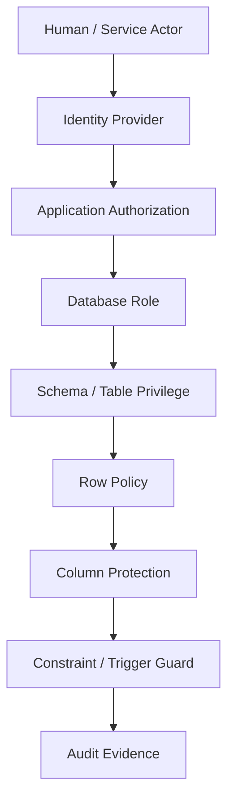

# Part 029 — Security, Permissions, and Data Access Control

## 1. Why This Part Exists

SQL security is often treated as an afterthought:

```text
create database user
put password in app config
give it access
ship it
```

That is not enough for serious systems.

A relational database is usually where the most valuable facts live:

- customer identities,
- payment data,
- workflow decisions,
- regulatory evidence,
- audit history,
- internal notes,
- enforcement outcomes,
- financial events,
- user permissions,
- operational metadata.

If database access is weak, the rest of the architecture becomes fragile.

The production view is:

```text
Every SQL access path is a security boundary.
Every privilege is an attack surface.
Every missing tenant predicate is a data breach candidate.
Every dynamic query is a potential injection vector.
Every overpowered application role turns one bug into system-wide damage.
```

This part teaches SQL security as **data access control engineering**, not merely `GRANT` syntax.

---

## 2. Kaufman Framing: The Sub-Skill We Are Training

The sub-skill is:

> Given a database-backed system, design and verify SQL access so that every actor can read or mutate only the data they are allowed to, every sensitive access is auditable, and application bugs have limited blast radius.

You are training to see SQL security through seven questions:

1. Who is the actor?
2. What data object is being accessed?
3. What operation is being performed?
4. What row subset is allowed?
5. What columns are sensitive?
6. What mutation invariants must be enforced?
7. What evidence proves the access was legitimate?

The fastest path to competence is not memorizing every permission command. It is learning to convert business access rules into enforceable database and application contracts.

---

## 3. Core Mental Model

SQL security has layers.



A secure design does not rely on one layer alone.

Application authorization answers:

```text
Should this user be allowed to request this operation?
```

Database authorization answers:

```text
Even if the application is wrong, what can this connection actually do?
```

Row-level security answers:

```text
Of the table this connection can access, which rows are visible or mutable?
```

Column-level protection answers:

```text
Of the row this actor can access, which attributes are safe to reveal?
```

Audit answers:

```text
Can we prove what happened later?
```

The deeper principle:

> Security is not a boolean property. It is a composition of identity, privilege, predicate, invariant, and evidence.

---

## 4. Security Vocabulary for SQL Engineers

### 4.1 Authentication

Authentication proves who is connecting.

Examples:

- database username/password,
- TLS client certificate,
- IAM-based authentication,
- Kerberos/SSPI,
- cloud identity integration,
- service account identity.

Authentication is not authorization.

A connection being valid does not mean it should have broad data access.

### 4.2 Authorization

Authorization determines what the authenticated principal can do.

In SQL this usually involves:

- roles,
- privileges,
- grants,
- ownership,
- schemas,
- row policies,
- views,
- stored procedures,
- application-level checks.

### 4.3 Privilege

A privilege is a permission to perform an operation on an object.

Examples:

- `SELECT` on table,
- `INSERT` on table,
- `UPDATE` on specific columns,
- `DELETE` on table,
- `USAGE` on schema or sequence,
- `EXECUTE` on function,
- `CREATE` in schema.

### 4.4 Role

A role groups privileges.

A role can represent:

- an application,
- a read-only reporter,
- a migration runner,
- an analyst,
- an operations tool,
- an admin,
- a background worker.

The important design question is not “what role name should we use?”

It is:

```text
What is the smallest capability this workload needs to perform its job?
```

### 4.5 Ownership

Ownership is not just metadata.

Owners often have special rights, including the ability to alter or drop objects. In some engines, object owner behavior interacts with row-level security and view execution semantics.

Do not run applications as object owners unless there is a strong reason.

### 4.6 Subject, Object, Action, Predicate

Most access rules can be shaped like this:

```text
subject can perform action on object where predicate holds
```

Example:

```text
case_worker can read case where case.assigned_team_id is in worker.allowed_team_ids
```

SQL security becomes much clearer when you model it this way.

---

## 5. Threat Model: What Can Go Wrong?

### 5.1 SQL Injection

SQL injection happens when untrusted input changes query structure.

Bad:

```java
String sql = "select * from users where email = '" + email + "'";
```

If `email` contains SQL syntax, the database may execute a query the developer did not intend.

Correct pattern:

```java
PreparedStatement ps = connection.prepareStatement(
    "select user_id, email from app_user where email = ?"
);
ps.setString(1, email);
```

Prepared statements separate SQL code from parameter values.

This is the baseline, not an advanced technique.

### 5.2 Overprivileged Application User

A common failure:

```sql
grant all privileges on all tables in schema public to app_user;
```

Then a single SQL injection or application bug can:

- read all data,
- update any table,
- delete records,
- bypass workflow state,
- alter audit tables,
- corrupt reference data.

Better:

```text
Split app roles by capability.
Grant each role only the operations it needs.
Protect sensitive mutation paths behind stored procedures or constrained APIs when useful.
```

### 5.3 Missing Tenant Predicate

Multi-tenant systems often fail through query omission:

```sql
select *
from case_file
where case_id = :case_id;
```

Expected:

```sql
select *
from case_file
where tenant_id = :tenant_id
  and case_id = :case_id;
```

The bug may pass tests if IDs are globally unique in fixtures. In production, it can expose cross-tenant data.

### 5.4 Insecure Dynamic SQL

Dynamic SQL is sometimes necessary for:

- optional filters,
- dynamic sort,
- generated reporting queries,
- partition maintenance,
- schema migration tools,
- internal admin tools.

But dynamic SQL must distinguish:

- values,
- identifiers,
- keywords,
- operators,
- fragments.

Values can be bound as parameters.

Identifiers usually cannot be parameter-bound in the same way. They need allowlists.

Bad:

```sql
order by ${request.sort_column}
```

Better:

```text
if sort = "created_at" -> ORDER BY created_at
if sort = "priority" -> ORDER BY priority
else reject
```

### 5.5 Report Export Leak

Reports often bypass normal UI access boundaries.

Risky pattern:

```text
Operational UI enforces team visibility.
CSV export runs a broad SQL query from an analyst role.
```

If report query does not encode the same row-level access, export becomes the breach path.

### 5.6 Debug Tool Leak

Internal tools frequently become high-risk because they are trusted too much.

Examples:

- “run arbitrary SQL” admin panel,
- search by any national ID,
- impersonation feature,
- bulk export,
- production data browser,
- support tooling with weak audit.

The fact that a tool is internal does not remove the need for access control.

### 5.7 Audit Tampering

If the same application role can modify business data and delete audit data, audit evidence is weak.

Audit tables need stricter privileges than normal tables.

A useful baseline:

```text
application can append audit events
application cannot update or delete audit events
human analyst can read audit events through restricted views
migration/admin role access is separate and heavily logged
```

---

## 6. Role Design: Capability-Based, Not Person-Based

Bad role design mirrors org charts too directly:

```text
alice_role
bob_role
finance_team_role
operations_team_role
```

Better database role design starts from capabilities:

```text
app_read_write
app_read_only
app_workflow_worker
app_outbox_publisher
migration_runner
analytics_reader
support_read_limited
audit_reader
security_admin
```

A human or service may be assigned one or more roles through an identity system, but the database role should still represent a stable capability.

## 6.1 Example Role Model

```sql
create role app_owner noinherit;
create role app_rw noinherit;
create role app_ro noinherit;
create role app_worker noinherit;
create role app_outbox_publisher noinherit;
create role analytics_ro noinherit;
create role migration_runner noinherit;
```

A possible capability split:

| Role | Capability | Should Not Do |
|---|---|---|
| `app_rw` | Normal OLTP reads/writes | DDL, audit deletion, broad export |
| `app_ro` | Health checks, safe reads | Mutations |
| `app_worker` | Claim jobs, update workflow progress | Arbitrary user/profile reads |
| `app_outbox_publisher` | Read/mark outbox rows | Modify business entities |
| `analytics_ro` | Read curated reporting views | Read raw secrets or mutate OLTP |
| `migration_runner` | DDL and controlled migration | Normal runtime access |
| `app_owner` | Own objects | Used by app traffic |

The key production rule:

> Separate runtime privileges from ownership and migration privileges.

---

## 7. Schema-Level and Object-Level Privileges

### 7.1 Schema Usage

A schema can be treated as a namespace and security boundary.

Example:

```sql
create schema core;
create schema audit;
create schema reporting;
create schema internal;
```

Grant only what is needed:

```sql
grant usage on schema core to app_rw;
grant usage on schema reporting to analytics_ro;
```

`USAGE` on a schema usually allows name resolution. It does not automatically grant access to every table.

### 7.2 Table Privileges

```sql
grant select, insert, update on core.case_file to app_rw;
grant select on reporting.case_summary to analytics_ro;
revoke delete on core.case_file from app_rw;
```

A strong default is:

```text
No DELETE privilege for normal application roles unless deletion is a real business operation.
```

Soft delete or lifecycle transition is often safer:

```sql
update core.case_file
set status = 'CLOSED', closed_at = now()
where case_id = :case_id
  and status = 'OPEN';
```

### 7.3 Column-Level Privileges

Some engines support column-level privileges.

Example shape:

```sql
grant select (case_id, status, created_at) on core.case_file to support_read_limited;
```

Column-level privileges help when:

- one table contains sensitive and non-sensitive attributes,
- support users need operational metadata but not personal data,
- analysts need metrics but not raw identifiers.

However, column privileges can become hard to manage at scale. Often a view is clearer.

### 7.4 Sequence Privileges

Do not forget sequences.

If a role inserts into a table using a sequence-backed identity/default, it may need sequence usage privileges depending on engine behavior.

Typical PostgreSQL-style shape:

```sql
grant usage, select on sequence core.case_file_case_id_seq to app_rw;
```

### 7.5 Function Execution Privileges

Stored functions/procedures can be security boundaries.

```sql
grant execute on function core.assign_case(bigint, bigint) to app_worker;
```

This lets you expose a controlled operation without granting broad table mutation.

But this only works if the function is carefully designed:

- parameterized,
- invariant-preserving,
- no unsafe dynamic SQL,
- minimal privileges,
- audited.

---

## 8. Least Privilege as Blast-Radius Control

Least privilege is often stated as moral advice. Treat it as failure containment.

Assume:

- a bug occurs,
- a parameter is wrong,
- a query is injected,
- a job runs twice,
- an internal user makes a mistake,
- a service account secret leaks.

Ask:

```text
How much damage can this role do before detection?
```

A role with `SELECT` on one reporting view has small blast radius.

A role with `SUPERUSER` or broad DDL can destroy the system.

## 8.1 Privilege Review Query Pattern

You should routinely inspect privileges.

Example review dimensions:

```text
who has table-level access?
who can write audit tables?
who can delete business rows?
who owns objects?
who can create functions?
who can bypass row policies?
which app users have DDL privileges?
which human users can access production data?
```

A privilege review is a security regression test.

## 8.2 Privilege Drift

Privilege drift happens when grants accumulate over time.

Common causes:

- emergency production fix,
- migration tool workaround,
- temporary analyst access,
- copied role from old app,
- broad grants during incident,
- inherited role not understood,
- new schema created without default privilege review.

Mitigation:

```text
Use infrastructure-as-code for grants.
Avoid manual production grants.
Review actual privileges regularly.
Test permissions in CI where possible.
```

---

## 9. Row-Level Security

Row-level security, often abbreviated RLS, lets the database apply row predicates automatically based on role/session context.

It is useful when missing predicates are high-risk.

Examples:

- multi-tenant isolation,
- team-based case visibility,
- region-based data restrictions,
- support-user limited access,
- delegated access.

## 9.1 RLS Mental Model

Without RLS:

```sql
select *
from case_file
where tenant_id = :tenant_id;
```

The application must remember the predicate every time.

With RLS:

```text
database automatically adds a policy predicate
```

Conceptually:

```sql
select *
from case_file
where <query predicate>
  and <row security predicate>;
```

## 9.2 Tenant RLS Example

A PostgreSQL-style example:

```sql
alter table core.case_file enable row level security;

create policy case_file_tenant_isolation
on core.case_file
using (tenant_id = current_setting('app.tenant_id')::uuid)
with check (tenant_id = current_setting('app.tenant_id')::uuid);
```

Then application code sets tenant context at transaction start:

```sql
set local app.tenant_id = '6c4a5f90-5f4a-4ee2-bef8-4df7e8e7c418';
```

Important distinction:

- `USING` controls visible rows.
- `WITH CHECK` controls rows that may be inserted or updated.

If you forget `WITH CHECK`, a role might update a row into another tenant or insert rows it should not own, depending on engine behavior and policy setup.

## 9.3 RLS is Not Magic

RLS helps, but it introduces operational questions:

1. Who can bypass it?
2. Does the table owner bypass it?
3. Are policies enabled on every tenant-scoped table?
4. Are views security-definer or security-invoker?
5. Does connection pooling preserve or leak session context?
6. Are background jobs using safe tenant context?
7. Can analytics queries intentionally cross tenants?
8. Are policies tested?

### Connection Pool Trap

If tenant context is stored in a session variable, connection pooling can leak context if not reset.

Safer pattern:

```sql
begin;
set local app.tenant_id = :tenant_id;
-- run tenant-scoped work
commit;
```

`SET LOCAL` scopes the setting to the transaction in PostgreSQL-style systems.

Do not use long-lived global session state without strict reset discipline.

## 9.4 RLS Testing

Test RLS directly.

Example:

```sql
begin;
set local role app_rw;
set local app.tenant_id = 'tenant-a';

select count(*)
from core.case_file
where tenant_id <> current_setting('app.tenant_id')::uuid;

rollback;
```

Expected result:

```text
0
```

Also test mutation:

```sql
begin;
set local role app_rw;
set local app.tenant_id = 'tenant-a';

insert into core.case_file (tenant_id, title, status)
values ('tenant-b', 'cross tenant insert', 'OPEN');

rollback;
```

Expected result:

```text
permission/policy violation
```

Security without tests is wishful thinking.

---

## 10. Views as Security Boundaries

Views can hide columns, filter rows, and expose stable contracts.

Example:

```sql
create view reporting.case_summary as
select
    c.case_id,
    c.tenant_id,
    c.status,
    c.priority,
    c.created_at,
    c.closed_at
from core.case_file c;
```

Grant:

```sql
grant select on reporting.case_summary to analytics_ro;
revoke all on core.case_file from analytics_ro;
```

Now analysts query a curated surface instead of raw tables.

## 10.1 Column Redaction View

```sql
create view support.case_lookup as
select
    case_id,
    tenant_id,
    status,
    priority,
    created_at,
    left(customer_email, 2) || '***' as masked_customer_email
from core.case_file;
```

This is useful when support needs correlation but not full PII.

## 10.2 View Security Trap

Views are not automatically safe.

Check:

- under whose privileges the view runs,
- whether RLS applies through the view,
- whether sensitive columns are derivable,
- whether joins reintroduce forbidden rows,
- whether the view permits updates,
- whether future schema changes expose more data.

A security view should have an explicit contract.

Document:

```text
This view is safe for support role X because it excludes columns A/B/C and filters rows by policy P.
```

---

## 11. Column Protection and Sensitive Data

### 11.1 Classify Data Before Protecting It

You cannot protect what you have not classified.

Common classes:

| Class | Examples | Controls |
|---|---|---|
| Public/internal metadata | case status, queue name | normal access |
| Personal data | name, email, phone | least privilege, masking, audit |
| Sensitive personal data | health, biometrics, minors | strict role isolation, encryption, legal basis |
| Secrets | tokens, credentials | avoid storing, encrypt, restrict strongly |
| Regulatory evidence | audit events, decisions | immutability, append-only, retention |
| Financial data | payments, invoices | access controls, reconciliation, audit |

### 11.2 Avoid Storing Secrets If Possible

A strong design principle:

```text
Do not store secrets in SQL unless the system must own them.
```

If you must store secrets:

- encrypt at application or database layer,
- isolate keys from database access,
- avoid logging raw values,
- restrict select privilege,
- rotate secrets,
- audit access.

### 11.3 Hashing vs Encryption

Hashing is one-way.

Encryption is reversible with a key.

Use hashing for password verification, not encryption.

Use encryption for values that must be recovered, such as external API credentials, but design key management carefully.

Do not invent cryptography.

### 11.4 Masking Is Not Authorization

Masking can reduce exposure, but it is not a substitute for proper access control.

Bad:

```text
Everyone can query raw table, app masks display.
```

Better:

```text
Only privileged roles can query raw column.
Normal roles query masked view.
Audit raw access.
```

---

## 12. SQL Injection Prevention Deep Dive

### 12.1 Parameterize Values

Correct:

```sql
select case_id, status
from case_file
where case_id = ?
  and tenant_id = ?;
```

Do not interpolate values into SQL strings.

### 12.2 Allowlist Identifiers

Parameters usually bind values, not SQL identifiers.

For dynamic sort:

```java
String sortColumn = switch (request.sort()) {
    case "createdAt" -> "created_at";
    case "priority" -> "priority";
    case "status" -> "status";
    default -> throw new IllegalArgumentException("unsupported sort");
};

String sql = "select case_id, status, priority, created_at "
    + "from case_file "
    + "where tenant_id = ? "
    + "order by " + sortColumn + " desc, case_id desc "
    + "fetch first ? rows only";
```

Only allow known identifiers controlled by code.

### 12.3 Allowlist Direction

```java
String direction = request.descending() ? "desc" : "asc";
```

Never accept raw `ASC; DROP TABLE...` style input as a SQL fragment.

### 12.4 Avoid Dynamic WHERE Fragment Injection

Bad:

```java
String sql = "select * from case_file where " + request.filter();
```

Better:

```text
Represent filters as typed objects.
Compile only known operators and known fields.
Bind all values.
Reject unsupported filters.
```

Example filter AST:

```text
field: status
operator: equals
value: OPEN
```

Compiled:

```sql
where status = ?
```

### 12.5 Stored Procedures Do Not Automatically Prevent Injection

A stored procedure can still be vulnerable if it builds unsafe dynamic SQL.

Bad shape:

```sql
-- conceptual example: user_input is concatenated into executable SQL text
execute dynamic_sql_text_built_from_user_input;
```

Better:

```text
Use parameterized dynamic execution or avoid dynamic SQL.
Allowlist identifiers when dynamic identifiers are required.
```

---

## 13. Multi-Tenant Access Control

Multi-tenancy is one of the most common SQL security stress tests.

### 13.1 Three Common Models

| Model | Description | Pros | Risks |
|---|---|---|---|
| Database per tenant | each tenant isolated physically/logically | strong isolation | operational overhead |
| Schema per tenant | separate schema per tenant | moderate isolation | migration complexity |
| Shared tables | `tenant_id` column | efficient at scale | predicate/RLS correctness critical |

There is no universal best model.

The important invariant is:

```text
No tenant can read or mutate another tenant's data unless explicitly permitted by a cross-tenant administrative workflow.
```

### 13.2 Shared Table Baseline

Every tenant-owned table should have:

```sql
tenant_id uuid not null
```

Prefer composite uniqueness where natural keys are tenant-scoped:

```sql
create unique index ux_case_tenant_external_ref
on core.case_file (tenant_id, external_ref);
```

Foreign keys should preserve tenant consistency.

A strong pattern:

```sql
create table core.case_file (
    tenant_id uuid not null,
    case_id bigint not null,
    title text not null,
    primary key (tenant_id, case_id)
);

create table core.case_note (
    tenant_id uuid not null,
    case_id bigint not null,
    note_id bigint not null,
    body text not null,
    primary key (tenant_id, note_id),
    foreign key (tenant_id, case_id)
        references core.case_file (tenant_id, case_id)
);
```

This prevents a note from tenant A referencing a case from tenant B.

### 13.3 Tenant Predicate as Invariant

Every tenant query should have tenant predicate near the root table:

```sql
select c.case_id, c.status, n.body
from core.case_file c
join core.case_note n
  on n.tenant_id = c.tenant_id
 and n.case_id = c.case_id
where c.tenant_id = :tenant_id
  and c.case_id = :case_id;
```

Notice the tenant predicate appears in join conditions too.

This is not just for security. It also helps optimizer access paths when indexes begin with `tenant_id`.

---

## 14. Regulatory-Style Access: Evidence and Defensibility

In regulated systems, the question is not only:

```text
Was access blocked or allowed?
```

It is:

```text
Can we later explain why access was allowed, who did it, under what authority, and what data changed?
```

### 14.1 Access Decision Evidence

For sensitive operations, record:

- actor ID,
- actor role/capability,
- tenant/context,
- target entity,
- action,
- reason code,
- request/correlation ID,
- timestamp,
- before/after state where appropriate,
- policy version if authorization rules evolve,
- approval reference if manual approval was required.

Example:

```sql
create table audit.access_event (
    access_event_id bigint generated always as identity primary key,
    occurred_at timestamptz not null default now(),
    actor_id uuid not null,
    actor_role text not null,
    tenant_id uuid,
    action text not null,
    object_type text not null,
    object_id text not null,
    decision text not null check (decision in ('ALLOW', 'DENY')),
    reason_code text,
    correlation_id uuid not null,
    policy_version text
);
```

### 14.2 Append-Only Audit

Normal app roles should not update or delete audit rows.

```sql
grant insert on audit.access_event to app_rw;
grant select on audit.access_event to audit_reader;
revoke update, delete on audit.access_event from app_rw;
```

For stricter systems, use additional controls:

- append-only table design,
- separate audit database,
- write-once storage,
- cryptographic digest chain,
- external log pipeline,
- privileged break-glass workflow.

### 14.3 Break-Glass Access

Break-glass access is emergency access outside normal rules.

It must be:

- rare,
- approved,
- time-limited,
- strongly authenticated,
- fully logged,
- reviewed after use.

Do not confuse break-glass with normal admin convenience.

---

## 15. Mutation Security: Protecting State Transitions

Read access is only half the problem.

Write access can violate business rules.

Example risk:

```sql
update case_file
set status = 'APPROVED'
where case_id = :case_id;
```

This bypasses:

- assignment rule,
- evidence completeness,
- approval limit,
- conflict-of-interest check,
- dual-control requirement,
- audit event append.

### 15.1 Guarded Mutation Pattern

```sql
update core.case_file
set status = 'APPROVED',
    approved_by = :actor_id,
    approved_at = now(),
    version = version + 1
where tenant_id = :tenant_id
  and case_id = :case_id
  and status = 'UNDER_REVIEW'
  and assigned_reviewer_id = :actor_id
  and version = :expected_version;
```

Then check affected rows.

```text
1 row affected = success
0 rows affected = forbidden, stale, or invalid state transition
```

### 15.2 Procedure as Mutation Boundary

For sensitive operations, expose a procedure:

```sql
call workflow.approve_case(
    p_tenant_id => :tenant_id,
    p_case_id => :case_id,
    p_actor_id => :actor_id,
    p_expected_version => :expected_version,
    p_reason => :reason
);
```

The procedure can:

- verify authorization,
- enforce transition rule,
- append audit event,
- update state,
- enqueue outbox event,
- fail atomically.

This is useful when the mutation needs to be guarded consistently across multiple applications.

But do not hide chaotic business logic in procedures without tests and ownership.

---

## 16. Access Control for Analytics

Analytics access is dangerous because it tends to be broad.

Analysts often need cross-entity visibility, but not necessarily raw sensitive columns.

### 16.1 Curated Analytics Schema

```text
core tables -> cleaned/reporting views -> analytics role
```

Example:

```sql
create schema mart;

create view mart.case_lifecycle_metrics as
select
    tenant_id,
    case_type,
    date_trunc('day', created_at) as created_day,
    status,
    count(*) as case_count
from core.case_file
group by tenant_id, case_type, date_trunc('day', created_at), status;
```

Grant only the mart:

```sql
grant usage on schema mart to analytics_ro;
grant select on all tables in schema mart to analytics_ro;
```

Avoid granting analysts raw OLTP tables by default.

### 16.2 De-Identification

Analytics often needs trends, not identities.

Techniques:

- aggregate before exposure,
- hash stable identifiers carefully,
- remove direct identifiers,
- bucket timestamps or ages,
- suppress small groups,
- mask free text,
- separate sensitive dimensions.

Free-text fields are especially risky because users may enter personal or confidential data unexpectedly.

---

## 17. Operational Security

### 17.1 Separate Environments

Production data should not freely move to lower environments.

If production copy is required:

- anonymize or synthesize sensitive data,
- restrict access,
- expire copies,
- audit exports,
- encrypt at rest and in transit.

### 17.2 Backup Security

Backups are data access paths.

A secure database with unprotected backups is not secure.

Check:

- backup encryption,
- backup restore permissions,
- retention policy,
- offsite storage access,
- backup testing,
- audit logs for restore/download.

### 17.3 Migration Security

Migration runners often have powerful permissions.

Controls:

- use a dedicated migration role,
- avoid app runtime DDL privileges,
- review migration scripts,
- apply migrations through pipeline,
- log execution,
- do not store migration credentials casually.

### 17.4 Observability Security

Logs can leak SQL parameters.

Risky logs:

```text
select * from customer where ssn = '...'
```

Prefer:

- parameter redaction,
- structured logs with safe fields,
- correlation ID,
- query fingerprint,
- avoid raw sensitive values.

---

## 18. Security Review Checklist

Use this as a production review checklist.

### Identity and Roles

- Are app runtime roles separate from object owner roles?
- Are migration roles separate from app roles?
- Are human roles separate from service roles?
- Are emergency/admin roles time-limited and audited?
- Are default/public privileges reviewed?

### Privileges

- Does each role have only required privileges?
- Can normal app role perform DDL?
- Can normal app role delete core business rows?
- Can normal app role update/delete audit rows?
- Are sequence/function/schema privileges correct?
- Are default privileges set for future objects?

### Row Access

- Is every tenant-scoped table protected by tenant predicate or RLS?
- Are join predicates tenant-safe?
- Are background jobs tenant-aware?
- Are exports subject to same access rules?
- Are RLS bypass roles controlled?

### Column Access

- Are sensitive columns classified?
- Are raw sensitive columns exposed to reporting?
- Are masking views used where appropriate?
- Are free-text fields treated as potentially sensitive?

### Injection

- Are all values parameterized?
- Are dynamic identifiers allowlisted?
- Are dynamic filter builders typed and constrained?
- Are admin/debug SQL tools restricted?
- Are stored procedures free of unsafe dynamic SQL?

### Audit

- Are sensitive reads/writes logged?
- Is audit append-only for normal roles?
- Are authorization decisions reconstructable?
- Are denied attempts logged where appropriate?
- Are break-glass accesses reviewed?

---

## 19. Failure Casebook

### Case 1: Report Bypasses Tenant Isolation

Symptom:

```text
A tenant receives a CSV containing another tenant's row.
```

Likely cause:

```text
Reporting query used broad analyst role and forgot tenant filter.
```

Prevention:

- curated tenant-safe views,
- RLS on raw tables,
- export tests,
- tenant-aware report parameters,
- deny raw table access.

### Case 2: Support Tool Exposes PII

Symptom:

```text
Support user can search all customers by email and view sensitive notes.
```

Likely cause:

```text
Internal tool treated as trusted and used app admin role.
```

Prevention:

- separate support role,
- masked view,
- reason-code requirement,
- access logging,
- restricted search scope.

### Case 3: Migration Role Used by Application

Symptom:

```text
Application bug drops or alters a table.
```

Likely cause:

```text
App connection uses migration/admin credentials.
```

Prevention:

- separate runtime and migration users,
- no DDL for runtime,
- secrets rotation,
- deployment validation.

### Case 4: SQL Injection Through ORDER BY

Symptom:

```text
Prepared statements used, but attack still succeeds through sort parameter.
```

Likely cause:

```text
Values were parameterized, identifiers were concatenated unsafely.
```

Prevention:

- allowlisted sort fields,
- allowlisted directions,
- typed query builder,
- security tests.

### Case 5: Audit Table Tampered

Symptom:

```text
Business state changed but no audit event exists.
```

Likely cause:

```text
Application role could update/delete audit rows, or audit write was not in same transaction.
```

Prevention:

- append-only audit privileges,
- atomic audit write,
- external immutable log for high-risk domains,
- reconciliation queries.

---

## 20. Practice Lab

### Lab 1 — Build Role Matrix

Given these workloads:

- web application,
- background workflow worker,
- analytics dashboard,
- migration pipeline,
- support tool,
- audit reviewer.

Create a role matrix:

| Role | Schema Usage | Table Access | Function Access | Forbidden |
|---|---|---|---|---|
| app_rw | | | | |
| app_worker | | | | |
| analytics_ro | | | | |
| migration_runner | | | | |
| support_limited | | | | |
| audit_reader | | | | |

The exercise is complete when every role has a clear reason to exist.

### Lab 2 — Tenant RLS Test

Create a shared-table multi-tenant schema:

```sql
create table case_file (
    tenant_id uuid not null,
    case_id bigint not null,
    title text not null,
    status text not null,
    primary key (tenant_id, case_id)
);
```

Add RLS policy.

Then test:

1. tenant A cannot read tenant B,
2. tenant A cannot insert tenant B row,
3. tenant A cannot update row into tenant B,
4. admin/reporting path is explicit and audited.

### Lab 3 — Dynamic Sort Safety

Implement a query endpoint that supports sorting by:

- `created_at`,
- `priority`,
- `status`.

Reject every other field.

Bind values.

Allowlist identifiers.

### Lab 4 — Audit Append-Only

Create an audit table where normal app role can insert but cannot update/delete.

Then prove it:

```sql
insert into audit.access_event (...);
update audit.access_event set actor_id = ...;
delete from audit.access_event;
```

The last two operations should fail for normal app role.

---

## 21. Production Heuristics

Use these heuristics when reviewing SQL security.

1. If a role can do everything, it will eventually do something unintended.
2. If tenant isolation depends only on developers remembering a predicate, expect a missing predicate eventually.
3. If analytics has raw table access, sensitive data will leak into exports.
4. If audit rows can be updated or deleted by normal app roles, audit is weak evidence.
5. If dynamic SQL accepts raw fragments from users, parameterization alone is not enough.
6. If migration credentials are available at runtime, the application has too much power.
7. If internal tools are unaudited, they are shadow production APIs.
8. If access rules are not tested, they are documentation, not enforcement.

---

## 22. Mental Model Recap

SQL security is not one feature.

It is a layered system:

```text
identity -> role -> privilege -> row predicate -> column exposure -> mutation invariant -> audit evidence
```

The strongest SQL engineers do not merely ask:

```text
Can the query run?
```

They ask:

```text
Should this actor be able to run this query, on these rows, with these columns, at this time, for this purpose, and can we prove it later?
```

That is the level of thinking required for production and regulatory-grade systems.

---

## 23. References

- PostgreSQL Documentation — Privileges: https://www.postgresql.org/docs/current/ddl-priv.html
- PostgreSQL Documentation — Row Security Policies: https://www.postgresql.org/docs/current/ddl-rowsecurity.html
- PostgreSQL Documentation — GRANT: https://www.postgresql.org/docs/current/sql-grant.html
- PostgreSQL Documentation — REVOKE: https://www.postgresql.org/docs/current/sql-revoke.html
- OWASP SQL Injection Prevention Cheat Sheet: https://cheatsheetseries.owasp.org/cheatsheets/SQL_Injection_Prevention_Cheat_Sheet.html
- OWASP Query Parameterization Cheat Sheet: https://cheatsheetseries.owasp.org/cheatsheets/Query_Parameterization_Cheat_Sheet.html
- Microsoft SQL Server Security Documentation: https://learn.microsoft.com/en-us/sql/relational-databases/security/security-center-for-sql-server-database-engine-and-azure-sql-database
- Oracle Database Security Guide: https://docs.oracle.com/en/database/oracle/oracle-database/
