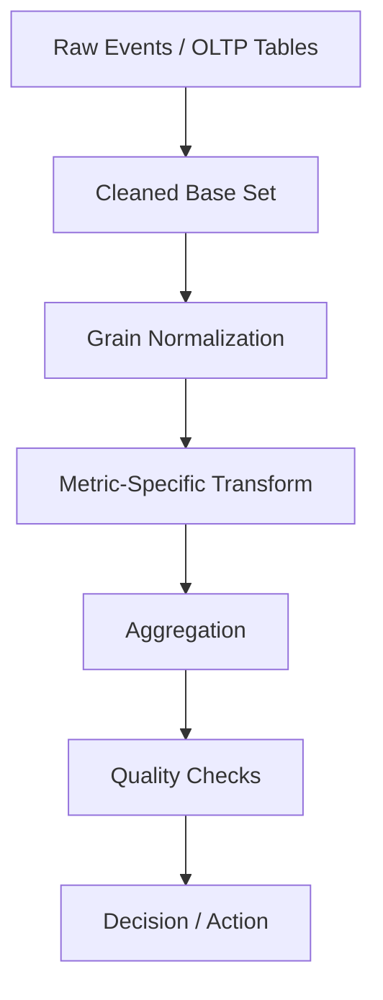

# Part 030 — Analytics SQL for Engineering Decisions

## 1. Why This Part Exists

SQL is not only for OLTP transactions.

In serious engineering organizations, SQL is also used to answer questions like:

- Are users completing the workflow?
- Where do cases get stuck?
- Which queue violates SLA most often?
- Did the last release increase latency?
- Is the new index actually improving p95?
- Which tenants are driving load?
- Which error class consumes the error budget?
- Are escalations increasing after a policy change?
- Did migration backfill corrupt counts?
- Which approval path creates most rework?

These are not “BI questions” detached from engineering.

They are production feedback loops.

The top-tier SQL skill is not only writing correct queries against tables. It is designing queries that produce **decision-grade evidence**.

This part teaches analytics SQL as an engineering instrument.

---

## 2. Kaufman Framing: The Sub-Skill We Are Training

The sub-skill is:

> Given event, workflow, and operational data, write SQL that produces trustworthy metrics for engineering decisions, while preserving grain, denominator correctness, time semantics, and explainability.

You are training to detect and prevent:

- wrong denominator,
- duplicate amplification,
- event-time vs processing-time confusion,
- inconsistent filters,
- p95 computed incorrectly,
- cohort leakage,
- retention overcounting,
- SLA start/end ambiguity,
- incident query bias,
- dashboard metric drift,
- stale or partial data.

The goal is not to become a dashboard author.

The goal is to become an engineer who can use SQL to reason accurately about system behavior.

---

## 3. Analytics SQL Mental Model

A metric is not just a number.

A production metric has a contract:

```text
metric = population + event + time window + grouping + aggregation + exclusions + freshness + owner
```

Example:

```text
case SLA breach rate =
  population: closed standard-priority cases
  event: time from assignment to closure
  time window: cases closed in calendar month
  grouping: tenant, case_type, assigned_team
  aggregation: breaches / closed cases
  exclusions: test tenants, reopened cases under appeal
  freshness: complete through previous day
  owner: workflow platform team
```

Without this contract, numbers become arguments.

## 3.1 Analytics Query Pipeline



A good analytics query usually has layers:

1. select the population,
2. normalize grain,
3. derive event or duration,
4. aggregate,
5. validate.

This is why CTEs are useful in analytics: not because they are always faster, but because they make grain and transformation stages explicit.

---

## 4. The Most Important Concept: Grain

Grain means:

```text
What does one row represent at this stage of the query?
```

Examples:

| Query Stage | Grain |
|---|---|
| `case_file` | one row per case |
| `case_event` | one row per event |
| `case_assignment` | one row per assignment interval |
| `case_daily_snapshot` | one row per case per day |
| `api_request_log` | one row per request |
| `case_sla_result` | one row per case SLA evaluation |
| final monthly metric | one row per month/team/case_type |

Most analytics bugs are grain bugs.

### 4.1 Grain Explosion Example

Suppose:

- one case has many notes,
- one case has many events.

Bad:

```sql
select
    c.case_type,
    count(*) as closed_cases
from case_file c
join case_note n on n.case_id = c.case_id
join case_event e on e.case_id = c.case_id
where c.status = 'CLOSED'
group by c.case_type;
```

This counts combinations of notes and events, not cases.

Better:

```sql
with closed_cases as (
    select case_id, case_type
    from case_file
    where status = 'CLOSED'
)
select
    case_type,
    count(*) as closed_cases
from closed_cases
group by case_type;
```

Only join detail tables after deciding whether they are part of the metric grain.

### 4.2 Grain Declaration Pattern

Use comments in complex SQL:

```sql
with base_cases as (
    -- grain: one row per case
    select case_id, tenant_id, case_type, created_at, closed_at
    from case_file
    where status = 'CLOSED'
),
case_sla as (
    -- grain: one row per case with SLA duration
    select
        case_id,
        tenant_id,
        case_type,
        extract(epoch from (closed_at - created_at)) / 3600 as hours_to_close
    from base_cases
)
select
    case_type,
    count(*) as cases_closed,
    avg(hours_to_close) as avg_hours_to_close
from case_sla
group by case_type;
```

This makes review easier.

---

## 5. Denominator Correctness

A rate is only as good as its denominator.

Bad metric:

```sql
select
    count(*) filter (where breached) * 1.0 / count(*) as breach_rate
from case_file;
```

This may include:

- open cases that cannot yet breach,
- test data,
- cancelled cases,
- cases missing SLA policy,
- cases from tenants outside scope,
- migrated historical rows with incomplete timestamps.

Better:

```sql
with eligible_cases as (
    select
        case_id,
        case_type,
        created_at,
        closed_at,
        sla_deadline_at,
        closed_at > sla_deadline_at as breached
    from case_file
    where status = 'CLOSED'
      and is_test = false
      and sla_deadline_at is not null
      and closed_at >= date '2026-06-01'
      and closed_at <  date '2026-07-01'
)
select
    count(*) filter (where breached) as breached_cases,
    count(*) as eligible_cases,
    count(*) filter (where breached) * 1.0 / nullif(count(*), 0) as breach_rate
from eligible_cases;
```

Metric contract:

```text
Breach rate is breaches among eligible closed cases in the reporting window.
```

## 5.1 Numerator/Denominator Checklist

Before trusting a rate, ask:

1. What is the numerator?
2. What is the denominator?
3. Are they at the same grain?
4. Are excluded cases explicit?
5. Is the time window applied to the right timestamp?
6. Are nulls handled intentionally?
7. Are duplicate rows possible?
8. Is the result stable under backfill?

---

## 6. Time Semantics

Analytics SQL lives or dies on time semantics.

### 6.1 Event Time vs Processing Time

Event time:

```text
When the business event actually happened.
```

Processing time:

```text
When the system ingested or processed it.
```

Example:

```sql
created_at          -- case created in source system
received_at         -- event received by platform
processed_at        -- worker processed event
loaded_at           -- analytics warehouse loaded row
```

Using the wrong timestamp can produce false conclusions.

### 6.2 Reporting Window Trap

Question:

```text
How many cases were closed in June?
```

Correct filter probably uses `closed_at`:

```sql
where closed_at >= timestamp '2026-06-01 00:00:00'
  and closed_at <  timestamp '2026-07-01 00:00:00'
```

Not:

```sql
where created_at between ...
```

### 6.3 Half-Open Time Intervals

Prefer half-open intervals:

```sql
created_at >= :start_at
and created_at < :end_at
```

Avoid:

```sql
created_at between :start_at and :end_at
```

For timestamp data, inclusive end boundaries cause edge-case bugs.

### 6.4 Time Zone Rule

Choose one internal convention.

Common pattern:

```text
store timestamps in UTC or timestamp-with-time-zone semantics
convert to local calendar only at reporting boundary
```

Be explicit about whether “day” means:

- UTC day,
- tenant local day,
- user local day,
- business jurisdiction day.

For regulatory/workflow metrics, local legal calendar may matter.

---

## 7. Funnel Analysis

A funnel measures progression through ordered steps.

Example workflow:

```text
case_created -> evidence_submitted -> reviewed -> approved -> closed
```

### 7.1 Event Table

```sql
create table case_event (
    event_id bigint generated always as identity primary key,
    case_id bigint not null,
    event_type text not null,
    occurred_at timestamptz not null
);
```

### 7.2 First Occurrence Per Step

```sql
with step_times as (
    select
        case_id,
        min(occurred_at) filter (where event_type = 'CASE_CREATED') as case_created_at,
        min(occurred_at) filter (where event_type = 'EVIDENCE_SUBMITTED') as evidence_submitted_at,
        min(occurred_at) filter (where event_type = 'REVIEWED') as reviewed_at,
        min(occurred_at) filter (where event_type = 'APPROVED') as approved_at,
        min(occurred_at) filter (where event_type = 'CLOSED') as closed_at
    from case_event
    group by case_id
)
select
    count(*) filter (where case_created_at is not null) as created,
    count(*) filter (where evidence_submitted_at is not null) as evidence_submitted,
    count(*) filter (where reviewed_at is not null) as reviewed,
    count(*) filter (where approved_at is not null) as approved,
    count(*) filter (where closed_at is not null) as closed
from step_times;
```

This counts cases reaching each step.

### 7.3 Funnel Drop-Off

```sql
with funnel as (
    select
        count(*) filter (where case_created_at is not null) as created,
        count(*) filter (where evidence_submitted_at is not null) as submitted,
        count(*) filter (where reviewed_at is not null) as reviewed,
        count(*) filter (where approved_at is not null) as approved,
        count(*) filter (where closed_at is not null) as closed
    from step_times
)
select
    submitted * 1.0 / nullif(created, 0) as submit_rate,
    reviewed * 1.0 / nullif(submitted, 0) as review_rate,
    approved * 1.0 / nullif(reviewed, 0) as approval_rate,
    closed * 1.0 / nullif(approved, 0) as closure_rate
from funnel;
```

### 7.4 Funnel Correctness Questions

- Can steps repeat?
- Should we use first occurrence or last occurrence?
- Are steps required to happen in order?
- Are reopened cases included?
- Are cancelled cases included?
- Is the cohort based on created time or closed time?
- Is a late-arriving event possible?

A funnel query without these answers is not decision-grade.

---

## 8. Cohort Analysis

A cohort groups entities by a starting event.

Examples:

- users by signup month,
- tenants by go-live quarter,
- cases by creation week,
- workflow items by assignment month,
- customers by first successful transaction.

### 8.1 Case Cohort Example

Question:

```text
Of cases created each week, how many were closed within 7 days?
```

```sql
with case_cohort as (
    -- grain: one row per case
    select
        case_id,
        date_trunc('week', created_at) as created_week,
        created_at,
        closed_at
    from case_file
    where created_at >= date '2026-01-01'
      and is_test = false
),
case_result as (
    select
        case_id,
        created_week,
        closed_at is not null
          and closed_at < created_at + interval '7 days' as closed_within_7d
    from case_cohort
)
select
    created_week,
    count(*) as cases_created,
    count(*) filter (where closed_within_7d) as closed_within_7d,
    count(*) filter (where closed_within_7d) * 1.0 / nullif(count(*), 0) as closed_within_7d_rate
from case_result
group by created_week
order by created_week;
```

### 8.2 Cohort Maturity Trap

Recent cohorts have had less time to complete.

If today is July 1, a cohort created June 30 has not had 7 days to close.

Exclude immature cohorts:

```sql
where created_at < now() - interval '7 days'
```

For retention metrics, cohort maturity is essential.

---

## 9. Retention Analysis

Retention asks:

```text
Does an entity come back or remain active after initial adoption?
```

For a user product, retention may mean login.

For an engineering platform, retention may mean:

- tenant still sends events,
- case workers still use workflow queue,
- integration still succeeds,
- API client still makes successful calls,
- scheduled job still produces data.

### 9.1 Monthly Tenant Activity Retention

```sql
with tenant_first_month as (
    select
        tenant_id,
        min(date_trunc('month', occurred_at)) as cohort_month
    from api_request_log
    where status_code between 200 and 299
    group by tenant_id
),
tenant_activity as (
    select distinct
        tenant_id,
        date_trunc('month', occurred_at) as activity_month
    from api_request_log
    where status_code between 200 and 299
),
retention as (
    select
        f.cohort_month,
        extract(year from age(a.activity_month, f.cohort_month)) * 12
          + extract(month from age(a.activity_month, f.cohort_month)) as month_number,
        count(*) as active_tenants
    from tenant_first_month f
    join tenant_activity a
      on a.tenant_id = f.tenant_id
     and a.activity_month >= f.cohort_month
    group by f.cohort_month, month_number
)
select *
from retention
order by cohort_month, month_number;
```

### 9.2 Retention Denominator

To get retention rate, join cohort size:

```sql
with cohort_size as (
    select cohort_month, count(*) as tenants
    from tenant_first_month
    group by cohort_month
)
select
    r.cohort_month,
    r.month_number,
    r.active_tenants,
    c.tenants as cohort_tenants,
    r.active_tenants * 1.0 / nullif(c.tenants, 0) as retention_rate
from retention r
join cohort_size c using (cohort_month)
order by r.cohort_month, r.month_number;
```

Correctness questions:

- What counts as active?
- Are failed requests activity?
- Are internal/test tenants excluded?
- Are tenant merges handled?
- Are deleted tenants included in denominator?
- Is activity based on event time or ingestion time?

---

## 10. SLA and SLO Analysis

SLA and SLO metrics are high-stakes because they drive customer commitments and engineering priorities.

### 10.1 Definitions

A Service Level Indicator, or SLI, is the measured signal.

Examples:

- request success ratio,
- latency under threshold,
- case closure within deadline,
- queue processing delay,
- event ingestion freshness.

A Service Level Objective, or SLO, is the target.

Examples:

```text
99.9% of API requests succeed over 30 days.
95% of standard cases close within 3 business days.
99% of events are processed within 5 minutes.
```

An error budget is the allowed miss rate.

### 10.2 Request Availability

```sql
with requests as (
    select
        request_id,
        occurred_at,
        status_code,
        case
            when status_code between 200 and 399 then true
            else false
        end as successful
    from api_request_log
    where occurred_at >= now() - interval '30 days'
      and route not like '/internal/%'
)
select
    count(*) as total_requests,
    count(*) filter (where successful) as successful_requests,
    count(*) filter (where not successful) as failed_requests,
    count(*) filter (where successful) * 1.0 / nullif(count(*), 0) as availability
from requests;
```

### 10.3 Latency SLO

Question:

```text
What percentage of requests completed under 300ms?
```

```sql
select
    count(*) filter (where duration_ms <= 300) as good_events,
    count(*) as total_events,
    count(*) filter (where duration_ms <= 300) * 1.0 / nullif(count(*), 0) as sli
from api_request_log
where occurred_at >= now() - interval '30 days'
  and route = '/cases/search'
  and status_code between 200 and 399;
```

This is often better for SLO than average latency.

Average latency can hide tail pain.

### 10.4 Error Budget Burn

Suppose target is 99.9% success.

Allowed error ratio:

```text
0.1% = 0.001
```

If current error ratio is 0.004, the system is burning budget 4x faster than allowed for that window.

```sql
with windowed as (
    select
        count(*) as total,
        count(*) filter (where status_code >= 500) as errors
    from api_request_log
    where occurred_at >= now() - interval '1 hour'
      and route not like '/internal/%'
),
budget as (
    select
        total,
        errors,
        0.001 as allowed_error_ratio
    from windowed
)
select
    total,
    errors,
    errors * 1.0 / nullif(total, 0) as actual_error_ratio,
    (errors * 1.0 / nullif(total, 0)) / allowed_error_ratio as burn_rate
from budget;
```

### 10.5 Workflow SLA

For case management:

```sql
with case_sla as (
    select
        case_id,
        tenant_id,
        case_type,
        assigned_team_id,
        assigned_at,
        closed_at,
        sla_deadline_at,
        closed_at <= sla_deadline_at as met_sla
    from case_file
    where status = 'CLOSED'
      and closed_at >= date '2026-06-01'
      and closed_at <  date '2026-07-01'
)
select
    assigned_team_id,
    case_type,
    count(*) as closed_cases,
    count(*) filter (where met_sla) as met_sla_cases,
    count(*) filter (where not met_sla) as breached_cases,
    count(*) filter (where met_sla) * 1.0 / nullif(count(*), 0) as sla_attainment
from case_sla
group by assigned_team_id, case_type
order by sla_attainment asc;
```

Review questions:

- Does SLA pause during customer waiting time?
- Are business hours used?
- Are holidays excluded?
- Does reassignment reset the clock?
- Are reopened cases counted once or multiple times?
- Is deadline stored or recomputed?
- Are historical policy changes respected?

For defensibility, store the SLA decision facts at the time they are computed.

---

## 11. Percentiles and Tail Latency

Averages are often misleading.

Example:

```text
99 requests take 50 ms
1 request takes 10,000 ms
average = about 149.5 ms
```

Average looks acceptable. One user had a terrible experience.

Percentiles help describe distribution.

### 11.1 PostgreSQL-Style Percentile Query

```sql
select
    percentile_cont(0.50) within group (order by duration_ms) as p50_ms,
    percentile_cont(0.90) within group (order by duration_ms) as p90_ms,
    percentile_cont(0.95) within group (order by duration_ms) as p95_ms,
    percentile_cont(0.99) within group (order by duration_ms) as p99_ms
from api_request_log
where occurred_at >= now() - interval '1 day'
  and route = '/cases/search'
  and status_code between 200 and 399;
```

### 11.2 Grouped Percentiles

```sql
select
    route,
    percentile_cont(0.95) within group (order by duration_ms) as p95_ms,
    count(*) as requests
from api_request_log
where occurred_at >= now() - interval '1 day'
group by route
having count(*) >= 100
order by p95_ms desc;
```

The `HAVING count(*) >= 100` avoids overreacting to tiny samples.

### 11.3 Percentile Pitfalls

- Percentiles are not additive.
- Average of p95s is usually misleading.
- Small sample sizes produce unstable percentiles.
- Filtering out failures can hide timeout pain.
- Client-observed latency and server duration may differ.
- Percentile implementation varies by engine.
- Approximate percentile functions may be used at large scale but need documented error bounds.

---

## 12. Incident Analysis with SQL

During or after an incident, SQL can answer:

- When did the issue start?
- Which tenants were affected?
- Which route/job/query regressed?
- Which release version correlates with errors?
- Which dependency caused failures?
- How many business operations were impacted?
- Did data corruption occur?

### 12.1 Error Spike by Time Bucket

```sql
select
    date_trunc('minute', occurred_at) as minute,
    count(*) as requests,
    count(*) filter (where status_code >= 500) as errors,
    count(*) filter (where status_code >= 500) * 1.0 / nullif(count(*), 0) as error_rate
from api_request_log
where occurred_at >= timestamp '2026-07-01 10:00:00'
  and occurred_at <  timestamp '2026-07-01 12:00:00'
group by date_trunc('minute', occurred_at)
order by minute;
```

### 12.2 Error by Release Version

```sql
select
    service_version,
    count(*) as requests,
    count(*) filter (where status_code >= 500) as errors,
    count(*) filter (where status_code >= 500) * 1.0 / nullif(count(*), 0) as error_rate
from api_request_log
where occurred_at >= timestamp '2026-07-01 10:00:00'
  and occurred_at <  timestamp '2026-07-01 12:00:00'
group by service_version
order by error_rate desc, requests desc;
```

### 12.3 Impacted Tenants

```sql
select
    tenant_id,
    count(*) filter (where status_code >= 500) as errors,
    count(*) as total_requests,
    min(occurred_at) filter (where status_code >= 500) as first_error_at,
    max(occurred_at) filter (where status_code >= 500) as last_error_at
from api_request_log
where occurred_at >= :incident_start
  and occurred_at <  :incident_end
group by tenant_id
having count(*) filter (where status_code >= 500) > 0
order by errors desc;
```

### 12.4 Business Impact

Infrastructure impact is not enough.

Ask:

```text
Which business operations failed?
```

Example:

```sql
select
    operation_type,
    count(*) as failed_operations,
    count(distinct tenant_id) as affected_tenants,
    count(distinct case_id) as affected_cases
from operation_attempt
where attempted_at >= :incident_start
  and attempted_at <  :incident_end
  and outcome = 'FAILED'
group by operation_type
order by failed_operations desc;
```

A good incident query connects technical symptoms to user/business consequences.

---

## 13. Anomaly Detection with SQL

SQL can support simple anomaly detection before specialized tooling is needed.

### 13.1 Compare Current Window to Baseline

```sql
with hourly_counts as (
    select
        date_trunc('hour', occurred_at) as hour,
        count(*) as requests
    from api_request_log
    where occurred_at >= now() - interval '14 days'
    group by date_trunc('hour', occurred_at)
),
baseline as (
    select
        extract(hour from hour) as hour_of_day,
        avg(requests) as avg_requests,
        stddev_samp(requests) as stddev_requests
    from hourly_counts
    where hour < date_trunc('hour', now())
    group by extract(hour from hour)
),
current_hour as (
    select
        extract(hour from date_trunc('hour', now())) as hour_of_day,
        count(*) as requests
    from api_request_log
    where occurred_at >= date_trunc('hour', now())
)
select
    c.requests,
    b.avg_requests,
    b.stddev_requests,
    (c.requests - b.avg_requests) / nullif(b.stddev_requests, 0) as z_score
from current_hour c
join baseline b using (hour_of_day);
```

This is not a complete anomaly platform.

But it is enough to reason about deviation.

### 13.2 Data Quality Anomaly

```sql
select
    date_trunc('day', created_at) as day,
    count(*) as cases_created,
    count(*) filter (where assigned_team_id is null) as unassigned_cases,
    count(*) filter (where assigned_team_id is null) * 1.0 / nullif(count(*), 0) as unassigned_rate
from case_file
where created_at >= now() - interval '30 days'
group by date_trunc('day', created_at)
order by day;
```

If unassigned rate jumps after a release, it may indicate workflow regression.

---

## 14. Experiment and Release Analysis

SQL often validates whether a change helped or harmed.

### 14.1 Before/After Query

```sql
with requests as (
    select
        case
            when occurred_at < timestamp '2026-06-15 10:00:00' then 'before'
            else 'after'
        end as period,
        duration_ms,
        status_code
    from api_request_log
    where occurred_at >= timestamp '2026-06-15 09:00:00'
      and occurred_at <  timestamp '2026-06-15 11:00:00'
      and route = '/cases/search'
)
select
    period,
    count(*) as requests,
    avg(duration_ms) as avg_ms,
    percentile_cont(0.95) within group (order by duration_ms) as p95_ms,
    count(*) filter (where status_code >= 500) as errors
from requests
group by period;
```

### 14.2 Beware Confounders

Before/after analysis can be misleading because:

- traffic mix changed,
- tenant mix changed,
- cache warmed up,
- batch job overlapped,
- dependency degraded,
- new version only served partial traffic,
- time-of-day changed.

Better analysis groups by dimensions:

```sql
select
    period,
    tenant_tier,
    route,
    count(*) as requests,
    percentile_cont(0.95) within group (order by duration_ms) as p95_ms
from requests
group by period, tenant_tier, route;
```

---

## 15. Queue and Workflow Analytics

For workflow systems, operational questions often center on queues.

### 15.1 Queue Age

```sql
select
    queue_name,
    count(*) as open_items,
    percentile_cont(0.50) within group (order by extract(epoch from (now() - created_at)) / 3600) as p50_age_hours,
    percentile_cont(0.95) within group (order by extract(epoch from (now() - created_at)) / 3600) as p95_age_hours,
    max(extract(epoch from (now() - created_at)) / 3600) as max_age_hours
from work_item
where status in ('READY', 'CLAIMED')
group by queue_name
order by p95_age_hours desc;
```

### 15.2 Stuck Work Items

```sql
select
    work_item_id,
    queue_name,
    status,
    assigned_to,
    created_at,
    claimed_at,
    now() - coalesce(claimed_at, created_at) as age
from work_item
where status in ('READY', 'CLAIMED')
  and coalesce(claimed_at, created_at) < now() - interval '4 hours'
order by age desc;
```

### 15.3 Rework Rate

```sql
with review_cycles as (
    select
        case_id,
        count(*) filter (where event_type = 'RETURNED_FOR_REWORK') as rework_count
    from case_event
    group by case_id
)
select
    count(*) filter (where rework_count > 0) as cases_with_rework,
    count(*) as total_cases,
    count(*) filter (where rework_count > 0) * 1.0 / nullif(count(*), 0) as rework_rate,
    avg(rework_count) as avg_rework_count
from review_cycles;
```

Rework is often a better workflow quality signal than raw completion volume.

---

## 16. Metric Reconciliation

Analytics numbers should be reconcilable.

If dashboard says 10,000 closed cases, but OLTP says 9,940, you need a method.

### 16.1 Reconcile Two Sources

```sql
with source_a as (
    select case_id
    from core.case_file
    where status = 'CLOSED'
      and closed_at >= date '2026-06-01'
      and closed_at <  date '2026-07-01'
),
source_b as (
    select case_id
    from mart.closed_case_fact
    where closed_month = date '2026-06-01'
)
select 'in_a_not_b' as diff_type, case_id from source_a
except
select 'in_a_not_b', case_id from source_b
union all
select 'in_b_not_a', case_id from source_b
except
select 'in_b_not_a', case_id from source_a;
```

### 16.2 Metric Assertion Table

Create stored assertions:

```sql
create table metric_assertion_result (
    assertion_id text not null,
    checked_at timestamptz not null default now(),
    status text not null check (status in ('PASS', 'FAIL')),
    observed_value numeric,
    threshold_value numeric,
    details text
);
```

Run checks:

```text
closed case count in mart must equal core count within freshness boundary
no negative durations
no duplicate fact rows
no impossible state transitions
no future event timestamps
```

---

## 17. Dashboard Query Design

A dashboard is a product surface.

A bad dashboard creates false confidence.

### 17.1 Dashboard Query Contract

Every dashboard metric should define:

- name,
- owner,
- business meaning,
- SQL source,
- grain,
- numerator,
- denominator,
- time window,
- refresh cadence,
- exclusions,
- known limitations,
- alert threshold if any.

### 17.2 Avoid Metric Drift

Metric drift happens when teams rewrite the same metric differently.

Example:

```text
Team A excludes cancelled cases.
Team B includes cancelled cases.
Team C filters by created_at.
Team D filters by closed_at.
```

Solution:

- shared metric views,
- semantic layer,
- tested SQL definitions,
- metric contracts,
- review ownership.

### 17.3 Dashboard Performance

Analytics SQL can harm OLTP if run carelessly.

Controls:

- read replicas,
- materialized views,
- summary tables,
- partition pruning,
- time-window limits,
- query timeouts,
- workload isolation,
- precomputed facts.

Never let ad-hoc dashboard queries become invisible production load.

---

## 18. SQL Patterns for Decision-Grade Metrics

### 18.1 Base Set CTE

```sql
with base as (
    select ...
    from ...
    where ... -- population definition
)
```

Use it to define population once.

### 18.2 Grain-Normalized CTE

```sql
case_level as (
    select case_id, max(...), min(...)
    from event_level
    group by case_id
)
```

Use it to avoid duplicate amplification.

### 18.3 Metric CTE

```sql
metric as (
    select group_key, numerator, denominator
    from case_level
)
```

Keep numerator and denominator visible.

### 18.4 Assertion CTE

```sql
quality_check as (
    select count(*) as bad_rows
    from case_level
    where duration_seconds < 0
)
```

Do not wait for a user to notice impossible values.

---

## 19. Production Analytics Anti-Patterns

### 19.1 `count(*)` After Many Joins

This often counts rows at the wrong grain.

Fix by declaring grain and aggregating detail tables before joining.

### 19.2 Average of Averages

Bad:

```sql
select avg(team_avg_latency)
from team_daily_latency;
```

If teams have different request counts, this is not global average.

Use weighted aggregation:

```sql
select sum(avg_latency * request_count) / nullif(sum(request_count), 0)
from team_daily_latency;
```

### 19.3 Filtering on Created Time for Closed Metric

Bad:

```sql
where created_at between report_start and report_end
```

for a metric named “closed this month”.

Use `closed_at`.

### 19.4 Ignoring Late-Arriving Data

If data arrives late, today’s metric may change tomorrow.

Define freshness:

```text
complete through T-1 day
```

or include late-arrival correction logic.

### 19.5 Hidden Test Data

Test tenants, internal users, load test clients, and sandbox events can pollute metrics.

Maintain an explicit exclusion dimension.

### 19.6 No Sample Size Guard

A p95 over 5 rows is not stable.

Use `HAVING count(*) >= threshold`.

### 19.7 Dashboard Without Owner

If no one owns the metric, no one fixes it when schema changes.

---

## 20. Case Study: Case Management Health Report

Suppose we need a weekly engineering report for a regulatory case workflow.

Questions:

1. How many cases were opened?
2. How many were closed?
3. What was p95 time-to-close?
4. Which queues have oldest open work?
5. What is SLA breach rate?
6. Which teams have highest rework rate?
7. Did the latest release affect API error rate?

### 20.1 Weekly Case Flow

```sql
with cases as (
    select
        case_id,
        case_type,
        assigned_team_id,
        created_at,
        closed_at,
        sla_deadline_at,
        status
    from case_file
    where is_test = false
),
opened as (
    select
        date_trunc('week', created_at) as week,
        case_type,
        count(*) as opened_cases
    from cases
    group by date_trunc('week', created_at), case_type
),
closed as (
    select
        date_trunc('week', closed_at) as week,
        case_type,
        count(*) as closed_cases,
        percentile_cont(0.95) within group (
            order by extract(epoch from (closed_at - created_at)) / 3600
        ) as p95_hours_to_close,
        count(*) filter (where closed_at > sla_deadline_at) as sla_breaches
    from cases
    where closed_at is not null
    group by date_trunc('week', closed_at), case_type
)
select
    coalesce(o.week, c.week) as week,
    coalesce(o.case_type, c.case_type) as case_type,
    coalesce(o.opened_cases, 0) as opened_cases,
    coalesce(c.closed_cases, 0) as closed_cases,
    c.p95_hours_to_close,
    c.sla_breaches,
    c.sla_breaches * 1.0 / nullif(c.closed_cases, 0) as sla_breach_rate
from opened o
full outer join closed c
  on c.week = o.week
 and c.case_type = o.case_type
order by week, case_type;
```

### 20.2 Queue Risk

```sql
select
    queue_name,
    count(*) as open_items,
    count(*) filter (where due_at < now()) as overdue_items,
    percentile_cont(0.95) within group (
        order by extract(epoch from (now() - created_at)) / 3600
    ) as p95_age_hours
from work_item
where status in ('READY', 'CLAIMED')
group by queue_name
order by overdue_items desc, p95_age_hours desc;
```

### 20.3 Rework by Team

```sql
with case_rework as (
    select
        c.case_id,
        c.assigned_team_id,
        count(e.*) filter (where e.event_type = 'RETURNED_FOR_REWORK') as rework_count
    from case_file c
    left join case_event e on e.case_id = c.case_id
    where c.created_at >= now() - interval '90 days'
    group by c.case_id, c.assigned_team_id
)
select
    assigned_team_id,
    count(*) as cases,
    count(*) filter (where rework_count > 0) as cases_with_rework,
    count(*) filter (where rework_count > 0) * 1.0 / nullif(count(*), 0) as rework_rate,
    avg(rework_count) as avg_rework_events
from case_rework
group by assigned_team_id
order by rework_rate desc;
```

This report is not just a set of numbers.

It gives engineering a queue of decisions:

- which workflow to inspect,
- which team needs tooling/process help,
- which SLA is at risk,
- which route or release needs investigation,
- which data quality issue blocks trust.

---

## 21. Performance Considerations for Analytics SQL

Analytics queries are often expensive.

### 21.1 OLTP vs Analytics Workload

OLTP queries:

- small row sets,
- point lookups,
- low latency,
- high concurrency,
- frequent writes.

Analytics queries:

- broad scans,
- grouping,
- sorting,
- joins across many rows,
- percentile calculations,
- lower concurrency but heavier memory/IO.

Running analytics directly on OLTP primary can hurt production.

### 21.2 Mitigation Patterns

- read replicas,
- separate warehouse/lakehouse,
- materialized views,
- summary tables,
- incremental aggregation,
- partitioned facts,
- bounded time filters,
- workload management,
- query timeouts.

### 21.3 Summary Table Example

```sql
create table mart.daily_route_metric (
    metric_day date not null,
    route text not null,
    requests bigint not null,
    errors bigint not null,
    p95_ms numeric,
    primary key (metric_day, route)
);
```

Refresh incrementally:

```sql
insert into mart.daily_route_metric (metric_day, route, requests, errors, p95_ms)
select
    occurred_at::date as metric_day,
    route,
    count(*) as requests,
    count(*) filter (where status_code >= 500) as errors,
    percentile_cont(0.95) within group (order by duration_ms) as p95_ms
from api_request_log
where occurred_at >= :day
  and occurred_at <  :day + interval '1 day'
group by occurred_at::date, route
on conflict (metric_day, route)
do update set
    requests = excluded.requests,
    errors = excluded.errors,
    p95_ms = excluded.p95_ms;
```

---

## 22. Analytics Query Review Checklist

### Metric Definition

- Is the metric name precise?
- Is the owner clear?
- Is population explicit?
- Is grain declared?
- Are numerator and denominator visible?
- Are exclusions documented?

### Time

- Is the correct timestamp used?
- Are intervals half-open?
- Is timezone/calendar semantics explicit?
- Are late-arriving events considered?
- Are cohorts mature enough?

### Correctness

- Can joins duplicate rows?
- Are nulls intentional?
- Is denominator zero protected?
- Are cancelled/test/internal rows handled?
- Are historical policy changes handled?
- Are reopened/retried events handled?

### Statistical Use

- Are percentiles computed at the right grain?
- Is sample size sufficient?
- Are averages weighted where needed?
- Are confidence/uncertainty limitations acknowledged?

### Operability

- Will the query hurt OLTP?
- Is there a freshness contract?
- Is the query tested or reconciled?
- Is the dashboard backed by curated views or repeated ad-hoc SQL?

---

## 23. Practice Lab

### Lab 1 — Funnel Correctness

Build a funnel for:

```text
created -> assigned -> reviewed -> approved -> closed
```

Requirements:

- one row per case,
- first timestamp per step,
- conversion rate between steps,
- median and p95 time between steps,
- exclude test tenants,
- document how reopened cases are handled.

### Lab 2 — SLA Breach Rate

Write a query for monthly SLA breach rate.

Requirements:

- denominator is eligible closed cases,
- numerator is cases closed after deadline,
- group by team and case type,
- exclude immature/open cases,
- use half-open time intervals,
- show denominator even when breach count is zero.

### Lab 3 — Incident Impact

Given request logs and operation attempts, answer:

- incident start/end,
- affected tenants,
- top failing routes,
- business operations failed,
- release version correlation,
- p95 latency before/during/after.

### Lab 4 — Metric Reconciliation

Compare OLTP closed cases to warehouse fact table.

Return:

- rows in OLTP not in warehouse,
- rows in warehouse not in OLTP,
- duplicate warehouse fact rows,
- count difference by day.

---

## 24. Mental Model Recap

Analytics SQL for engineering decisions is not about producing pretty charts.

It is about producing trustworthy evidence.

The core invariants are:

```text
grain before aggregation
population before metric
denominator before rate
time semantics before trend
sample size before percentile
reconciliation before trust
decision before dashboard
```

A top-tier engineer can use SQL to move from vague claims:

```text
The system feels slower.
The workflow is blocked.
The release caused issues.
SLA is getting worse.
```

to decision-grade evidence:

```text
p95 for /cases/search increased from 180ms to 780ms for enterprise tenants after version 2026.06.15, error rate remained flat, and query plan changed from index seek to sequential scan due to parameter distribution.
```

That is SQL in action.

---

## 25. References

- PostgreSQL Documentation — Aggregate Functions: https://www.postgresql.org/docs/current/functions-aggregate.html
- PostgreSQL Documentation — Window Functions Tutorial: https://www.postgresql.org/docs/current/tutorial-window.html
- PostgreSQL Documentation — Date/Time Functions and Operators: https://www.postgresql.org/docs/current/functions-datetime.html
- Google SRE Workbook — Implementing SLOs: https://sre.google/workbook/implementing-slos/
- Google SRE Book — Service Level Objectives: https://sre.google/sre-book/service-level-objectives/
- Martin Fowler — Event Sourcing: https://martinfowler.com/eaaDev/EventSourcing.html
- Martin Fowler — Observability Guide: https://martinfowler.com/articles/domain-oriented-observability.html
