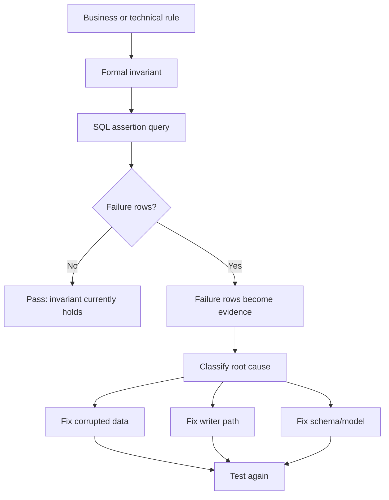
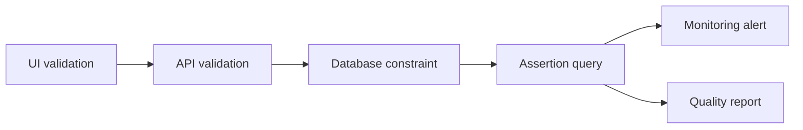
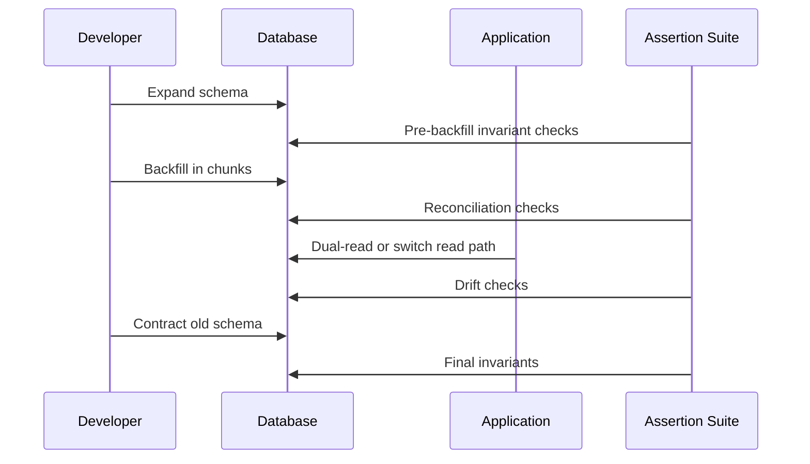

# Part 031 — Data Quality, Testing, and SQL as Assertion Language

## 1. Why This Part Exists

Most engineers learn SQL as a data retrieval language.

Production engineers also use SQL as a **truth-checking language**.

A query can answer:

```text
Which rows exist?
```

But an assertion query answers:

```text
Which rows should never exist?
```

That shift is important.

When SQL is used only for reads, defects often appear as dashboards that look wrong, workflow screens that display inconsistent state, or regulators asking why an audit trail cannot be reconciled.

When SQL is used as an assertion language, data defects become executable evidence:

- duplicate active assignments,
- cases in impossible states,
- dangling foreign references,
- missing audit events,
- broken state transition chains,
- stale derived views,
- partial backfills,
- count drift across systems,
- invalid metric denominators,
- orphaned outbox records,
- tenant data leakage,
- irreversible migration damage.

The target skill is not merely writing checks.

The target skill is designing **data invariants** that are:

- precise enough to catch real defects,
- cheap enough to run repeatedly,
- explainable enough to debug,
- stable enough to use as release gates,
- linked to business rules and regulatory obligations.

## 2. Kaufman Skill Deconstruction

Using Kaufman's rapid skill acquisition framing, this part decomposes data quality into trainable sub-skills.

| Sub-skill | Production Question | Feedback Signal |
|---|---|---|
| Invariant discovery | What must always be true? | SQL query returns zero invalid rows |
| Constraint placement | Should this be DB constraint, app check, or batch assertion? | Defect prevented at the cheapest safe boundary |
| Reconciliation | Do two representations of truth match? | Diff query returns explainable deltas |
| Drift detection | Did data change shape over time? | Trend of violations, freshness, distribution |
| Test grain design | What entity does one test row represent? | Failure row is directly actionable |
| Release gating | Can migration/release proceed? | Threshold-based pass/fail result |
| Debug loop | Why did the assertion fail? | Minimal reproducer and ownership |

The first 20 hours should not be spent memorizing a data quality framework.

Spend it writing assertion queries against real-ish tables until you can quickly answer:

```text
What invariant is being checked?
What does one failure row mean?
Can the query produce false positives?
Can the query produce false negatives?
Where should this invariant live permanently?
```

## 3. Mental Model: SQL as Assertion Language

An assertion query should usually return **bad rows**, not good rows.

```sql
-- Good query for human reporting:
SELECT status, COUNT(*)
FROM cases
GROUP BY status;

-- Assertion query for production validation:
SELECT case_id, status, closed_at
FROM cases
WHERE status = 'CLOSED'
  AND closed_at IS NULL;
```

The second query is operationally stronger because every returned row is actionable.

The ideal assertion result is:

```text
0 rows = pass
N rows = fail with evidence
```



The query is not the starting point.

The invariant is the starting point.

## 4. Data Quality Dimensions That Matter to Engineers

Data quality is often described using high-level labels. Those labels become useful only when converted to executable SQL.

| Dimension | Meaning | SQL Assertion Shape |
|---|---|---|
| Completeness | Required data exists | `WHERE required_col IS NULL` |
| Uniqueness | No duplicate identity or active fact | `GROUP BY ... HAVING COUNT(*) > 1` |
| Validity | Values are in allowed domain | `WHERE value NOT IN (...)` |
| Referential integrity | References point to existing parent | `LEFT JOIN parent WHERE parent.id IS NULL` |
| Consistency | Multiple columns agree | `WHERE closed_at IS NULL AND status = 'CLOSED'` |
| Timeliness/freshness | Data arrives within expected lag | `MAX(loaded_at) < now() - interval ...` |
| Accuracy | Data matches source of truth | `EXCEPT`/anti-join reconciliation |
| Lineage completeness | Derived row has traceable source | `WHERE source_event_id IS NULL` |
| Auditability | State change has evidence | missing event/history row checks |
| Security isolation | Tenant/user cannot see foreign data | cross-tenant join checks |

Do not start by asking, “Which checks should we add?”

Ask:

```text
What failure would be expensive, hard to detect, or impossible to explain later?
```

That question yields better checks.

## 5. Running Example Schema

We will use a simplified case-management schema.

```sql
CREATE TABLE tenants (
    tenant_id      bigint PRIMARY KEY,
    tenant_code    text NOT NULL UNIQUE,
    is_active      boolean NOT NULL DEFAULT true,
    created_at     timestamptz NOT NULL DEFAULT now()
);

CREATE TABLE users (
    user_id        bigint PRIMARY KEY,
    tenant_id      bigint NOT NULL REFERENCES tenants(tenant_id),
    email          text NOT NULL,
    is_active      boolean NOT NULL DEFAULT true,
    created_at     timestamptz NOT NULL DEFAULT now(),
    UNIQUE (tenant_id, email)
);

CREATE TABLE cases (
    case_id        bigint PRIMARY KEY,
    tenant_id      bigint NOT NULL REFERENCES tenants(tenant_id),
    case_type      text NOT NULL,
    status         text NOT NULL,
    priority       text NOT NULL,
    opened_at      timestamptz NOT NULL,
    due_at         timestamptz,
    closed_at      timestamptz,
    assigned_to    bigint REFERENCES users(user_id),
    version        bigint NOT NULL DEFAULT 0,
    created_at     timestamptz NOT NULL DEFAULT now(),
    updated_at     timestamptz NOT NULL DEFAULT now(),
    CHECK (status IN ('OPEN', 'IN_REVIEW', 'APPROVED', 'REJECTED', 'CLOSED', 'CANCELLED')),
    CHECK (priority IN ('LOW', 'MEDIUM', 'HIGH', 'CRITICAL'))
);

CREATE TABLE case_events (
    event_id       bigint PRIMARY KEY,
    tenant_id      bigint NOT NULL REFERENCES tenants(tenant_id),
    case_id        bigint NOT NULL REFERENCES cases(case_id),
    event_type     text NOT NULL,
    from_status    text,
    to_status      text,
    actor_user_id  bigint REFERENCES users(user_id),
    event_time     timestamptz NOT NULL,
    payload        jsonb NOT NULL DEFAULT '{}'
);

CREATE TABLE case_assignments (
    assignment_id  bigint PRIMARY KEY,
    tenant_id      bigint NOT NULL REFERENCES tenants(tenant_id),
    case_id        bigint NOT NULL REFERENCES cases(case_id),
    assigned_to    bigint NOT NULL REFERENCES users(user_id),
    assigned_at    timestamptz NOT NULL,
    unassigned_at  timestamptz
);
```

This schema intentionally has a mix of enforced constraints and business rules that need assertion queries.

## 6. The Core Pattern: Failure-Row Query

A data quality assertion should make failure obvious.

Bad style:

```sql
SELECT COUNT(*)
FROM cases
WHERE status = 'CLOSED'
  AND closed_at IS NULL;
```

This is not wrong, but it hides evidence.

Better style:

```sql
SELECT
    case_id,
    tenant_id,
    status,
    closed_at,
    updated_at
FROM cases
WHERE status = 'CLOSED'
  AND closed_at IS NULL
ORDER BY updated_at DESC;
```

For automation, wrap it:

```sql
WITH failures AS (
    SELECT
        case_id,
        tenant_id,
        status,
        closed_at,
        updated_at
    FROM cases
    WHERE status = 'CLOSED'
      AND closed_at IS NULL
)
SELECT
    'closed_case_requires_closed_at' AS assertion_name,
    COUNT(*) AS failure_count
FROM failures;
```

For debugging, keep a detail query available.

```sql
SELECT *
FROM cases
WHERE status = 'CLOSED'
  AND closed_at IS NULL
ORDER BY updated_at DESC
FETCH FIRST 100 ROWS ONLY;
```

A good assertion has two forms:

1. summary for automation,
2. detail for humans.

## 7. Assertion Query Contract

Every production assertion should have an explicit contract.

```text
Assertion name: active_assignment_is_unique
Invariant: A case may have at most one active assignment.
Failure row grain: one case with more than one active assignment.
Severity: high
Owner: case-workflow team
Expected failure count: 0
Allowed lag: none
Run cadence: every deployment and every 15 minutes
Remediation: inspect assignment writer path and close duplicate active assignments
False positive risk: low
False negative risk: possible if assignment state is not represented in case_assignments
```

This prevents vague “data quality check failed” alerts.

The owner should know what broke and where to look.

## 8. Completeness Assertions

Completeness means required data exists at the right lifecycle point.

Not all requiredness is global.

A column may be optional at creation but mandatory at a later state.

```sql
-- A closed case must have closed_at.
SELECT case_id, tenant_id, status, closed_at
FROM cases
WHERE status = 'CLOSED'
  AND closed_at IS NULL;
```

```sql
-- A case in review must have an assignee.
SELECT case_id, tenant_id, status, assigned_to
FROM cases
WHERE status = 'IN_REVIEW'
  AND assigned_to IS NULL;
```

```sql
-- A high-priority case must have a deadline.
SELECT case_id, tenant_id, priority, due_at
FROM cases
WHERE priority IN ('HIGH', 'CRITICAL')
  AND due_at IS NULL;
```

Mental model:

```text
Completeness is often conditional on lifecycle state.
```

Do not encode all required fields as `NOT NULL` if the field is legitimately absent during early lifecycle states.

Use `NOT NULL` for universal requiredness.

Use assertions or conditional constraints for lifecycle requiredness.

## 9. Uniqueness Assertions

Some uniqueness is simple and belongs in a database constraint.

```sql
UNIQUE (tenant_id, email)
```

Other uniqueness is conditional.

Example: a case may have many historical assignments but only one active assignment.

```sql
SELECT
    case_id,
    tenant_id,
    COUNT(*) AS active_assignment_count
FROM case_assignments
WHERE unassigned_at IS NULL
GROUP BY case_id, tenant_id
HAVING COUNT(*) > 1;
```

In PostgreSQL, this can often be promoted to a partial unique index:

```sql
CREATE UNIQUE INDEX ux_case_assignments_one_active
ON case_assignments (tenant_id, case_id)
WHERE unassigned_at IS NULL;
```

The assertion remains useful even after the constraint exists because it can validate legacy data before adding the index.

### Duplicate Detection With Grain

Incorrect duplicate check:

```sql
SELECT email, COUNT(*)
FROM users
GROUP BY email
HAVING COUNT(*) > 1;
```

This is wrong if email only needs to be unique per tenant.

Correct duplicate check:

```sql
SELECT tenant_id, email, COUNT(*)
FROM users
GROUP BY tenant_id, email
HAVING COUNT(*) > 1;
```

Data quality checks must respect business grain.

## 10. Validity Assertions

Validity checks ensure values belong to an allowed domain.

Some validity belongs in constraints:

```sql
CHECK (priority IN ('LOW', 'MEDIUM', 'HIGH', 'CRITICAL'))
```

Other validity may be externalized to a reference table.

```sql
CREATE TABLE case_status_catalog (
    status text PRIMARY KEY,
    is_terminal boolean NOT NULL
);
```

Assertion:

```sql
SELECT c.case_id, c.status
FROM cases c
LEFT JOIN case_status_catalog s
    ON s.status = c.status
WHERE s.status IS NULL;
```

This catches invalid values even if they entered through legacy imports or disabled constraints.

### Range Validity

```sql
SELECT case_id, priority, opened_at, due_at
FROM cases
WHERE due_at IS NOT NULL
  AND due_at < opened_at;
```

### Temporal Validity

```sql
SELECT assignment_id, assigned_at, unassigned_at
FROM case_assignments
WHERE unassigned_at IS NOT NULL
  AND unassigned_at < assigned_at;
```

Validity is not only about enum values.

It also includes temporal, numeric, structural, and state-dependent constraints.

## 11. Referential Integrity Assertions

Foreign keys prevent many orphan records.

But referential drift can still appear when:

- constraints were absent historically,
- staging tables are not constrained,
- cross-database references exist,
- JSON payloads carry references,
- soft-delete semantics make physical FK insufficient,
- multi-tenant boundaries require compound reference validation.

### Classic Orphan Check

```sql
SELECT c.case_id, c.assigned_to
FROM cases c
LEFT JOIN users u
    ON u.user_id = c.assigned_to
WHERE c.assigned_to IS NOT NULL
  AND u.user_id IS NULL;
```

### Tenant-Aware Reference Check

The classic check is not enough if user IDs are globally unique but tenant isolation matters.

```sql
SELECT
    c.case_id,
    c.tenant_id AS case_tenant_id,
    c.assigned_to,
    u.tenant_id AS user_tenant_id
FROM cases c
JOIN users u
    ON u.user_id = c.assigned_to
WHERE c.assigned_to IS NOT NULL
  AND u.tenant_id <> c.tenant_id;
```

This catches cross-tenant leakage.

### Soft-Deleted Reference Check

```sql
SELECT c.case_id, c.assigned_to, u.is_active
FROM cases c
JOIN users u
    ON u.user_id = c.assigned_to
WHERE c.status IN ('OPEN', 'IN_REVIEW')
  AND u.is_active = false;
```

The foreign key says the user exists.

The business rule says the active case must not be assigned to an inactive user.

## 12. Consistency Assertions

Consistency checks compare multiple facts that must agree.

### Status vs Timestamp

```sql
SELECT case_id, status, closed_at
FROM cases
WHERE status IN ('OPEN', 'IN_REVIEW', 'APPROVED', 'REJECTED')
  AND closed_at IS NOT NULL;
```

```sql
SELECT case_id, status, closed_at
FROM cases
WHERE status IN ('CLOSED', 'CANCELLED')
  AND closed_at IS NULL;
```

### Current State vs Event Log

Current case status should agree with the latest status-changing event.

```sql
WITH latest_status_event AS (
    SELECT
        case_id,
        tenant_id,
        to_status,
        event_time,
        ROW_NUMBER() OVER (
            PARTITION BY tenant_id, case_id
            ORDER BY event_time DESC, event_id DESC
        ) AS rn
    FROM case_events
    WHERE to_status IS NOT NULL
)
SELECT
    c.case_id,
    c.tenant_id,
    c.status AS current_status,
    e.to_status AS latest_event_status,
    e.event_time
FROM cases c
JOIN latest_status_event e
    ON e.tenant_id = c.tenant_id
   AND e.case_id = c.case_id
   AND e.rn = 1
WHERE c.status <> e.to_status;
```

This type of check is critical in systems that maintain both current-state tables and event/history tables.

## 13. Timeliness and Freshness Assertions

Freshness checks answer:

```text
Is data current enough for the decision being made?
```

Example: a derived analytics table must refresh within 30 minutes.

```sql
SELECT
    MAX(loaded_at) AS last_loaded_at,
    now() - MAX(loaded_at) AS data_lag
FROM case_daily_metrics
HAVING MAX(loaded_at) < now() - interval '30 minutes';
```

Better: use a metadata table.

```sql
CREATE TABLE data_pipeline_runs (
    pipeline_name text NOT NULL,
    run_id text NOT NULL,
    status text NOT NULL,
    started_at timestamptz NOT NULL,
    finished_at timestamptz,
    row_count bigint,
    PRIMARY KEY (pipeline_name, run_id)
);
```

```sql
WITH last_success AS (
    SELECT
        pipeline_name,
        MAX(finished_at) AS last_success_at
    FROM data_pipeline_runs
    WHERE pipeline_name = 'case_daily_metrics'
      AND status = 'SUCCESS'
    GROUP BY pipeline_name
)
SELECT
    pipeline_name,
    last_success_at,
    now() - last_success_at AS lag
FROM last_success
WHERE last_success_at < now() - interval '30 minutes';
```

Freshness must be evaluated relative to use case.

A regulatory report may tolerate a daily snapshot.

A queue dashboard may not tolerate five minutes of lag.

## 14. Reconciliation Assertions

Reconciliation compares two representations of truth.

Common cases:

- source table vs derived table,
- OLTP vs warehouse,
- before migration vs after migration,
- old service vs new service,
- event log vs current state,
- cache/read model vs write model,
- vendor import vs internal normalized table.

### Count Reconciliation

```sql
SELECT
    date_trunc('day', opened_at) AS day,
    COUNT(*) AS oltp_count
FROM cases
GROUP BY date_trunc('day', opened_at)
ORDER BY day;
```

Count reconciliation is useful but insufficient.

It can miss swapped IDs, duplicated rows, and compensated errors.

### Row-Level Reconciliation With `EXCEPT`

```sql
SELECT case_id, tenant_id, status, closed_at
FROM cases
WHERE updated_at < timestamp '2026-07-01 00:00:00+00'

EXCEPT

SELECT case_id, tenant_id, status, closed_at
FROM cases_migrated
WHERE updated_at < timestamp '2026-07-01 00:00:00+00';
```

Reverse direction:

```sql
SELECT case_id, tenant_id, status, closed_at
FROM cases_migrated
WHERE updated_at < timestamp '2026-07-01 00:00:00+00'

EXCEPT

SELECT case_id, tenant_id, status, closed_at
FROM cases
WHERE updated_at < timestamp '2026-07-01 00:00:00+00';
```

Always run both directions.

```text
A EXCEPT B catches missing/changed rows in B.
B EXCEPT A catches extra/changed rows in B.
```

### Reconciliation With Hashes

For wide rows, compare stable row hashes.

```sql
WITH source_rows AS (
    SELECT
        case_id,
        md5(concat_ws('|', tenant_id, status, priority, closed_at)) AS row_hash
    FROM cases
), target_rows AS (
    SELECT
        case_id,
        md5(concat_ws('|', tenant_id, status, priority, closed_at)) AS row_hash
    FROM cases_migrated
)
SELECT
    COALESCE(s.case_id, t.case_id) AS case_id,
    s.row_hash AS source_hash,
    t.row_hash AS target_hash
FROM source_rows s
FULL JOIN target_rows t
    ON t.case_id = s.case_id
WHERE s.case_id IS NULL
   OR t.case_id IS NULL
   OR s.row_hash <> t.row_hash;
```

Be careful with hashes:

- normalize `NULL`,
- normalize time zones,
- normalize numeric scale,
- use deterministic column order,
- avoid ambiguous delimiters or use structured encoding,
- consider collision risk for high-stakes reconciliation.

## 15. Data Contract Tests

A data contract states what downstream consumers can rely on.

Example contract for `case_daily_metrics`:

```text
Grain: one row per tenant_id + metric_date + case_type
Freshness: complete by 02:00 Asia/Jakarta for previous day
Required columns: tenant_id, metric_date, case_type, opened_count, closed_count
Uniqueness: tenant_id + metric_date + case_type
Accepted values: case_type must exist in case_type_catalog
Non-negative measures: counts must be >= 0
Lineage: every row must reference pipeline_run_id
```

SQL assertions:

```sql
-- Grain uniqueness
SELECT tenant_id, metric_date, case_type, COUNT(*)
FROM case_daily_metrics
GROUP BY tenant_id, metric_date, case_type
HAVING COUNT(*) > 1;
```

```sql
-- Non-negative measures
SELECT tenant_id, metric_date, case_type, opened_count, closed_count
FROM case_daily_metrics
WHERE opened_count < 0
   OR closed_count < 0;
```

```sql
-- Required lineage
SELECT tenant_id, metric_date, case_type
FROM case_daily_metrics
WHERE pipeline_run_id IS NULL;
```

```sql
-- Accepted case types
SELECT m.tenant_id, m.metric_date, m.case_type
FROM case_daily_metrics m
LEFT JOIN case_type_catalog c
    ON c.case_type = m.case_type
WHERE c.case_type IS NULL;
```

Tools such as dbt formalize common test categories like uniqueness, not-nullness, accepted values, and relationships. The deeper engineering skill is deciding which invariants matter and what failure rows mean.

## 16. Assertion Severity Model

Not every failed assertion has equal impact.

| Severity | Meaning | Example | Action |
|---|---|---|---|
| S0 | Security/compliance breach | cross-tenant data link | stop release, incident response |
| S1 | Correctness/data loss risk | missing audit events | block deployment or rollback |
| S2 | Workflow degradation | duplicate active assignment | alert owner, fix within SLA |
| S3 | Reporting inaccuracy | stale non-critical dashboard | ticket/backlog |
| S4 | Hygiene issue | optional metadata missing | batch cleanup |

Severity prevents two bad extremes:

- alert fatigue from low-value checks,
- silent corruption from high-value checks treated as warnings.

## 17. Where to Place a Data Quality Rule

A rule can live in multiple layers.



| Boundary | Strength | Weakness | Use For |
|---|---|---|---|
| UI validation | fast feedback | bypassable | user input ergonomics |
| API validation | domain-aware | not universal if multiple writers | command semantics |
| Database constraint | strongest local prevention | may not express cross-row/cross-system rule | identity, FK, enum, simple invariant |
| Trigger/procedure | close to data | hidden side effects | audit/event enforcement when justified |
| Batch assertion | flexible | detects after write | complex invariants, reconciliation |
| Observability alert | operational visibility | needs ownership | drift and ongoing risk |

Prefer preventing defects when prevention is simple and safe.

Prefer assertion checks when the rule is complex, cross-system, or transitional.

## 18. Promoting Assertions Into Constraints

Many assertions start as queries during migration or discovery.

If the invariant is permanent and expressible by the database, promote it.

Example assertion:

```sql
SELECT case_id, tenant_id, status
FROM cases
WHERE status NOT IN ('OPEN', 'IN_REVIEW', 'APPROVED', 'REJECTED', 'CLOSED', 'CANCELLED');
```

Promotion:

```sql
ALTER TABLE cases
ADD CONSTRAINT ck_cases_status
CHECK (status IN ('OPEN', 'IN_REVIEW', 'APPROVED', 'REJECTED', 'CLOSED', 'CANCELLED'));
```

Example conditional uniqueness assertion:

```sql
SELECT tenant_id, case_id, COUNT(*)
FROM case_assignments
WHERE unassigned_at IS NULL
GROUP BY tenant_id, case_id
HAVING COUNT(*) > 1;
```

Promotion in PostgreSQL:

```sql
CREATE UNIQUE INDEX ux_case_assignment_one_active
ON case_assignments (tenant_id, case_id)
WHERE unassigned_at IS NULL;
```

Promotion rule:

```text
If a data quality query always has threshold zero, is cheap to enforce, and represents a durable invariant, consider a DB constraint/index.
```

## 19. Testing Migration Safety

Data migrations need assertions before, during, and after deployment.



### Pre-Migration Assertion

```sql
-- Ensure all rows have data needed to compute the new column.
SELECT case_id, status, opened_at, closed_at
FROM cases
WHERE status = 'CLOSED'
  AND closed_at IS NULL;
```

### Backfill Progress Assertion

```sql
SELECT COUNT(*) AS remaining_rows
FROM cases
WHERE lifecycle_bucket IS NULL;
```

### Post-Migration Reconciliation

```sql
SELECT case_id, lifecycle_bucket,
       CASE
           WHEN status IN ('OPEN', 'IN_REVIEW') THEN 'ACTIVE'
           WHEN status IN ('CLOSED', 'CANCELLED') THEN 'TERMINAL'
           ELSE 'OTHER'
       END AS expected_bucket
FROM cases
WHERE lifecycle_bucket IS DISTINCT FROM
      CASE
          WHEN status IN ('OPEN', 'IN_REVIEW') THEN 'ACTIVE'
          WHEN status IN ('CLOSED', 'CANCELLED') THEN 'TERMINAL'
          ELSE 'OTHER'
      END;
```

Assertions make migration safety observable.

Without assertions, migration correctness is often a belief.

## 20. Sampling Is Not Reconciliation

Sampling is useful for inspection.

It is not proof.

```sql
SELECT *
FROM cases_migrated
ORDER BY random()
FETCH FIRST 100 ROWS ONLY;
```

Sampling can reveal obvious errors, but it cannot prove absence of drift.

Use sampling for:

- human inspection,
- format validation,
- surprising shape discovery,
- debugging failure examples.

Use full reconciliation for:

- primary key coverage,
- value equality,
- aggregate equality,
- high-stakes migration validation,
- compliance reports.

## 21. Distribution Drift Assertions

Some data quality failures are not invalid rows.

They are suspicious shifts.

Example: status distribution changes drastically after deployment.

```sql
WITH daily_status AS (
    SELECT
        date_trunc('day', updated_at)::date AS day,
        status,
        COUNT(*) AS row_count
    FROM cases
    WHERE updated_at >= current_date - interval '14 days'
    GROUP BY date_trunc('day', updated_at)::date, status
), with_share AS (
    SELECT
        day,
        status,
        row_count,
        row_count::numeric / SUM(row_count) OVER (PARTITION BY day) AS share
    FROM daily_status
)
SELECT *
FROM with_share
ORDER BY day, status;
```

This is not a strict pass/fail invariant, but it is valuable in release analysis.

For automated thresholds:

```sql
WITH today AS (
    SELECT status, COUNT(*) AS count_today
    FROM cases
    WHERE updated_at >= current_date
    GROUP BY status
), baseline AS (
    SELECT status, COUNT(*) / 7.0 AS avg_count
    FROM cases
    WHERE updated_at >= current_date - interval '7 days'
      AND updated_at < current_date
    GROUP BY status
)
SELECT
    COALESCE(t.status, b.status) AS status,
    COALESCE(t.count_today, 0) AS count_today,
    COALESCE(b.avg_count, 0) AS avg_count
FROM today t
FULL JOIN baseline b
    ON b.status = t.status
WHERE COALESCE(t.count_today, 0) > COALESCE(b.avg_count, 0) * 3
   OR COALESCE(t.count_today, 0) < COALESCE(b.avg_count, 0) * 0.3;
```

Treat distribution checks as warning signals unless the business rule defines a hard bound.

## 22. Assertion Performance Design

Data quality checks can become production problems if they scan large tables carelessly.

Rules:

- filter by recent partitions where possible,
- index predicate columns used by high-cadence checks,
- separate deployment gates from continuous monitors,
- store assertion results rather than repeatedly scanning detail rows,
- use metadata tables for freshness,
- avoid blocking OLTP write paths,
- run heavy reconciliation on replicas or analytical stores when safe.

### Assertion Result Table

```sql
CREATE TABLE data_quality_assertion_runs (
    assertion_name text NOT NULL,
    run_id text NOT NULL,
    started_at timestamptz NOT NULL,
    finished_at timestamptz,
    status text NOT NULL,
    failure_count bigint,
    sample_failure jsonb,
    PRIMARY KEY (assertion_name, run_id)
);
```

### Store Summary, Not Full Failure Payload

```sql
INSERT INTO data_quality_assertion_runs (
    assertion_name,
    run_id,
    started_at,
    finished_at,
    status,
    failure_count,
    sample_failure
)
WITH failures AS (
    SELECT case_id, tenant_id, status, closed_at
    FROM cases
    WHERE status = 'CLOSED'
      AND closed_at IS NULL
), summarized AS (
    SELECT
        COUNT(*) AS failure_count,
        jsonb_agg(to_jsonb(failures) ORDER BY case_id) FILTER (WHERE case_id IS NOT NULL) AS samples
    FROM (
        SELECT *
        FROM failures
        FETCH FIRST 10 ROWS ONLY
    ) failures
)
SELECT
    'closed_case_requires_closed_at',
    'run-20260701-001',
    now(),
    now(),
    CASE WHEN failure_count = 0 THEN 'PASS' ELSE 'FAIL' END,
    failure_count,
    COALESCE(samples, '[]'::jsonb)
FROM summarized;
```

For very large data, count failures and sample separately.

## 23. Anti-Patterns

### Anti-Pattern 1: Only Testing Counts

```sql
SELECT COUNT(*) FROM source;
SELECT COUNT(*) FROM target;
```

Equal counts do not prove equal rows.

### Anti-Pattern 2: Hiding Failure Evidence

A test that returns only `true`/`false` is harder to debug than a test returning failure rows.

### Anti-Pattern 3: Global Rules for Local Invariants

Checking uniqueness by `email` globally when the business rule is uniqueness per tenant creates false positives.

### Anti-Pattern 4: Dashboard as Data Quality Test

A dashboard showing “looks normal” is not a test.

It has no invariant, no owner, no threshold, and no failure evidence.

### Anti-Pattern 5: Assertions Without Ownership

A failing query with no owner becomes noise.

### Anti-Pattern 6: Too Many Low-Value Checks

A hundred weak checks can hide one critical failure.

Prioritize high-cost failure modes.

### Anti-Pattern 7: Checking Derived Data Without Source Reconciliation

A materialized metric can look internally consistent but still be wrong relative to the source.

## 24. Production Assertion Catalog

A serious SQL system should have a catalog like this.

| Assertion | Invariant | Severity | Cadence |
|---|---|---:|---|
| `tenant_reference_consistency` | child tenant equals parent tenant | S0 | every deploy + hourly |
| `closed_case_requires_closed_at` | closed cases have `closed_at` | S1 | every deploy + hourly |
| `one_active_assignment_per_case` | at most one active assignment | S1 | every deploy + 15 min |
| `current_status_matches_latest_event` | current state equals latest status event | S1 | hourly |
| `case_daily_metrics_grain_unique` | one metric row per grain | S2 | after pipeline |
| `case_metrics_freshness` | metric table refreshed within SLA | S2 | scheduled |
| `migration_row_reconciliation` | source/target rows match | S1 | migration-only |
| `no_cross_tenant_assignment` | case assigned only to same-tenant user | S0 | every deploy + 15 min |
| `no_invalid_status_transition` | event path follows transition catalog | S1 | hourly |

The catalog is more valuable than scattered SQL files because it makes ownership and risk explicit.

## 25. Case Study: State Transition Validity

Create a transition catalog.

```sql
CREATE TABLE case_status_transitions (
    from_status text,
    to_status text NOT NULL,
    is_allowed boolean NOT NULL DEFAULT true,
    PRIMARY KEY (from_status, to_status)
);
```

Assertion:

```sql
SELECT
    e.event_id,
    e.case_id,
    e.from_status,
    e.to_status,
    e.event_time
FROM case_events e
LEFT JOIN case_status_transitions t
    ON t.from_status IS NOT DISTINCT FROM e.from_status
   AND t.to_status = e.to_status
   AND t.is_allowed = true
WHERE e.to_status IS NOT NULL
  AND t.to_status IS NULL;
```

This catches impossible transitions like:

```text
CLOSED -> IN_REVIEW
CANCELLED -> APPROVED
REJECTED -> OPEN without reopen event
```

For regulatory systems, this is not academic.

It determines whether the system can defend why a case reached a final decision.

## 26. Case Study: Missing Audit Events

Invariant:

```text
Every terminal case must have a terminal status event.
```

Assertion:

```sql
SELECT
    c.case_id,
    c.tenant_id,
    c.status,
    c.closed_at
FROM cases c
WHERE c.status IN ('CLOSED', 'CANCELLED')
  AND NOT EXISTS (
      SELECT 1
      FROM case_events e
      WHERE e.tenant_id = c.tenant_id
        AND e.case_id = c.case_id
        AND e.to_status = c.status
        AND e.event_time <= c.closed_at + interval '5 seconds'
  );
```

The small time tolerance handles minor timestamp ordering differences.

But do not hide large drift with generous windows.

Tolerance is a contract.

## 27. Case Study: Backfill Validation

Suppose we add `first_response_at` to `cases`.

Expected value: first event of type `COMMENT_ADDED` or `ASSIGNED` after open.

Validation query:

```sql
WITH expected AS (
    SELECT
        c.case_id,
        c.tenant_id,
        MIN(e.event_time) AS expected_first_response_at
    FROM cases c
    JOIN case_events e
        ON e.tenant_id = c.tenant_id
       AND e.case_id = c.case_id
       AND e.event_time >= c.opened_at
       AND e.event_type IN ('COMMENT_ADDED', 'ASSIGNED')
    GROUP BY c.case_id, c.tenant_id
)
SELECT
    c.case_id,
    c.tenant_id,
    c.first_response_at,
    e.expected_first_response_at
FROM cases c
JOIN expected e
    ON e.tenant_id = c.tenant_id
   AND e.case_id = c.case_id
WHERE c.first_response_at IS DISTINCT FROM e.expected_first_response_at;
```

If this returns rows, the backfill is not done or not correct.

## 28. Case Study: Data Leakage Check

Cross-tenant leakage is severity S0.

```sql
SELECT
    c.case_id,
    c.tenant_id AS case_tenant,
    a.assigned_to,
    u.tenant_id AS user_tenant
FROM cases c
JOIN case_assignments a
    ON a.case_id = c.case_id
JOIN users u
    ON u.user_id = a.assigned_to
WHERE c.tenant_id <> a.tenant_id
   OR c.tenant_id <> u.tenant_id;
```

This assertion should probably run:

- after migration,
- after bulk import,
- after release touching authorization or assignment,
- continuously in production.

## 29. Practice Drills

### Drill 1 — Convert Requirements Into Assertions

Given these rules, write failure-row queries:

1. A critical case must have `due_at` within 4 hours of `opened_at`.
2. A closed case must not have an active assignment.
3. A cancelled case must have a cancellation event.
4. Every case event must belong to the same tenant as its case.
5. A daily metric table must have exactly one row per tenant/date/case_type.

### Drill 2 — Reconciliation

Given `cases_old` and `cases_new`, write:

1. rows missing from new,
2. rows extra in new,
3. rows with changed status,
4. count by tenant difference,
5. hash-based row diff.

### Drill 3 — Promote Assertions

For each assertion, decide if it should become:

- `NOT NULL`,
- `CHECK`,
- foreign key,
- unique index,
- partial unique index,
- trigger,
- scheduled assertion.

Explain why.

### Drill 4 — Failure Ownership

Design an assertion catalog for a case-management system with:

- workflow team,
- assignment team,
- reporting team,
- identity/access team,
- platform/database team.

Every assertion must have severity and owner.

## 30. Review Checklist

Before accepting a data quality assertion, ask:

- What invariant does it represent?
- What does one returned row mean?
- Is the failure row directly actionable?
- What is the expected failure count?
- Is threshold zero, bounded, or statistical?
- What is the severity?
- Who owns remediation?
- How often should it run?
- Can it block deployments?
- Can it create false positives?
- Can it create false negatives?
- Is it cheap enough for the target cadence?
- Should it be promoted into a database constraint?
- Does it respect tenant and business grain?
- Does it check source truth or only derived truth?

## 31. Mental Model Recap

SQL is an assertion language when queries express impossible states.

A top-tier engineer does not merely ask:

```text
Can I retrieve this data?
```

They ask:

```text
Can I prove the data still satisfies the invariants the system depends on?
```

The hierarchy is:

```text
business rule
→ invariant
→ failure-row SQL
→ owner + severity
→ automated execution
→ evidence + remediation
→ promoted constraint when possible
```

Data quality is not a dashboard problem.

It is a system correctness problem.

When the data is wrong, every layer above it becomes a confident liar.

---

## 32. References

- PostgreSQL Documentation — Constraints: https://www.postgresql.org/docs/current/ddl-constraints.html
- PostgreSQL Documentation — `SET CONSTRAINTS`: https://www.postgresql.org/docs/current/sql-set-constraints.html
- PostgreSQL Documentation — Information Schema `table_constraints`: https://www.postgresql.org/docs/current/infoschema-table-constraints.html
- PostgreSQL Documentation — Partial Indexes: https://www.postgresql.org/docs/current/indexes-partial.html
- PostgreSQL Documentation — Row and Array Comparisons: https://www.postgresql.org/docs/current/functions-comparisons.html
- dbt Developer Hub — Data Tests: https://docs.getdbt.com/docs/build/data-tests
- dbt Labs — Data Quality Checks: https://www.getdbt.com/blog/data-quality-checks
- Martin Fowler — Schemaless Data Structures: https://martinfowler.com/articles/schemaless/
