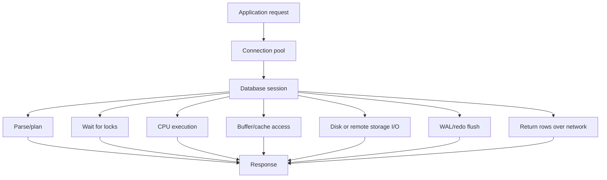
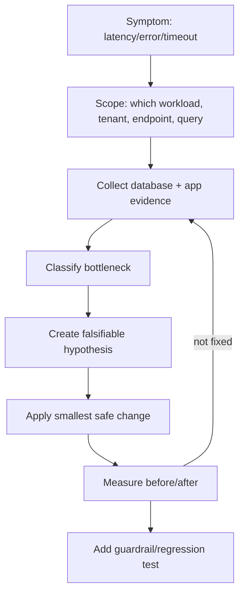

# Part 032 — Observability, Performance, and Operational Debugging

## 1. Why This Part Exists

SQL performance work is often taught as index tuning.

Production debugging is broader.

A slow database symptom may come from:

- a bad query plan,
- stale statistics,
- missing or excessive indexes,
- lock contention,
- long-running transactions,
- hot rows,
- bad connection pooling,
- I/O saturation,
- memory pressure,
- WAL/redo pressure,
- autovacuum/vacuum lag,
- replication lag,
- bloated indexes,
- parameter-sensitive plans,
- migration backfill overload,
- an application release that changed query shape,
- an analytics query accidentally running on OLTP primary.

A top-tier engineer does not ask only:

```text
Which index should I add?
```

They ask:

```text
What is the system waiting on?
What changed?
Which workload owns the pain?
Is the bottleneck CPU, I/O, lock, memory, network, log, or plan quality?
What evidence supports the fix?
What invariant prevents regression?
```

This part builds that operational mental model.

## 2. Kaufman Skill Deconstruction

Operational SQL debugging can be decomposed into repeatable sub-skills.

| Sub-skill | Question | Evidence |
|---|---|---|
| Symptom framing | What is actually bad? | latency, error rate, throughput, saturation |
| Workload identification | Which query/job/tenant changed? | query stats, logs, application traces |
| Wait analysis | What is the database waiting on? | wait events, lock waits, I/O waits |
| Plan analysis | Did access path or join strategy change? | `EXPLAIN`, Query Store, plan history |
| Contention analysis | Who blocks whom? | lock tables, transaction age |
| Storage health | Is table/index storage degraded? | bloat, dead tuples, vacuum lag |
| Capacity analysis | Is hardware/runtime saturated? | CPU, memory, disk I/O, WAL, connections |
| Regression prevention | How do we prevent repeat? | tests, baselines, alerts, query contracts |

The first 20 hours of this skill should be spent using a local database plus synthetic bad workloads.

You should intentionally create:

- missing index slow query,
- stale statistics plan issue,
- lock wait,
- deadlock,
- long-running transaction,
- queue contention,
- bad pagination,
- heavy aggregation on OLTP table,
- migration backfill overload.

Then diagnose each using evidence, not intuition.

## 3. Mental Model: Database as a Waiting System

Performance is mostly about time spent waiting or doing unnecessary work.



A query can be slow because it does too much work.

A query can also be slow because it is blocked from doing work.

Those are different problems.

```text
High CPU + many rows examined      → plan/index/query shape problem
High lock wait                     → concurrency/transaction boundary problem
High I/O wait                      → access path/cache/storage problem
High connection wait               → pool saturation/app behavior problem
High WAL/log wait                  → write workload/durability/checkpoint problem
High replication lag               → read scaling/long transaction/write volume problem
```

## 4. The Production Debugging Loop

Use a loop.



Do not start with a fix.

Start with scope.

Bad:

```text
The database is slow. Add indexes.
```

Better:

```text
P95 for /api/cases/search increased from 220ms to 1.8s for tenant segment enterprise after release 2026.06.30. The dominant query changed from index scan to sequential scan because a new LOWER(email) predicate is not covered by an expression index.
```

The second statement is fixable.

## 5. Observability Layers

| Layer | What It Tells You | Example Evidence |
|---|---|---|
| Application traces | user-facing operation and context | endpoint, tenant, request id, query timing |
| SQL logs | executed statements and duration | slow query log, bind parameters if safe |
| Query statistics | repeated workload behavior | calls, total time, mean time, rows |
| Execution plans | how a statement is executed | scan type, join type, estimated/actual rows |
| Wait events | why sessions are waiting | lock, I/O, client, WAL, buffer |
| Lock tables | blocking relationships | blocked session, blocker, object |
| Storage stats | table/index health | dead tuples, bloat, index usage |
| System metrics | capacity bottleneck | CPU, disk, memory, network |
| Replication metrics | read scale and HA lag | replica delay, replay lag |

No single layer is enough.

Application traces tell you what users feel.

Database metrics tell you where the engine spends time.

Execution plans tell you why a query shape is expensive.

## 6. PostgreSQL Operational Views

PostgreSQL exposes runtime activity through system views.

### Current Activity

```sql
SELECT
    pid,
    usename,
    application_name,
    client_addr,
    state,
    wait_event_type,
    wait_event,
    now() - query_start AS query_age,
    left(query, 500) AS query_sample
FROM pg_stat_activity
WHERE state <> 'idle'
ORDER BY query_age DESC;
```

This answers:

- what is running,
- how long it has been running,
- whether it is waiting,
- what it is waiting on,
- which application session owns it.

### Long Transactions

```sql
SELECT
    pid,
    usename,
    application_name,
    state,
    now() - xact_start AS transaction_age,
    now() - query_start AS query_age,
    wait_event_type,
    wait_event,
    left(query, 500) AS query_sample
FROM pg_stat_activity
WHERE xact_start IS NOT NULL
ORDER BY transaction_age DESC;
```

Long transactions can cause:

- lock retention,
- vacuum lag,
- MVCC version retention,
- replication issues,
- stale snapshots,
- application timeouts.

### Database-Level Stats

```sql
SELECT
    datname,
    numbackends,
    xact_commit,
    xact_rollback,
    blks_read,
    blks_hit,
    tup_returned,
    tup_fetched,
    tup_inserted,
    tup_updated,
    tup_deleted,
    deadlocks
FROM pg_stat_database
ORDER BY numbackends DESC;
```

Use this for directional signals, not precise root cause.

## 7. Query-Level Statistics

In PostgreSQL, `pg_stat_statements` is commonly used to aggregate query statistics.

Example:

```sql
SELECT
    queryid,
    calls,
    total_exec_time,
    mean_exec_time,
    rows,
    shared_blks_hit,
    shared_blks_read,
    temp_blks_read,
    temp_blks_written,
    left(query, 300) AS query_sample
FROM pg_stat_statements
ORDER BY total_exec_time DESC
FETCH FIRST 20 ROWS ONLY;
```

Interpretation:

| Sort By | Finds |
|---|---|
| `total_exec_time` | biggest total database cost |
| `mean_exec_time` | individually slow queries |
| `calls` | high-frequency queries |
| `shared_blks_read` | cache misses / disk pressure candidates |
| `temp_blks_written` | spills from sort/hash/aggregate |
| `rows` | result size/network pressure candidates |

A query called 50,000 times at 5ms can hurt more than one query at 2 seconds.

Always distinguish:

```text
slow per call
vs
expensive in aggregate
```

## 8. Slow Query Logs

Slow query logs are useful, but incomplete.

They usually capture statements above a duration threshold.

They may miss:

- high-frequency fast queries,
- lock waits if not configured clearly,
- application-side connection pool waits,
- parameter-sensitive behavior,
- queries normalized differently by framework,
- queries that are slow only for some tenants.

Use slow logs for samples.

Use query statistics for workload shape.

Use traces for user impact.

## 9. Execution Plan Debugging

When a query is expensive, inspect the plan.

PostgreSQL:

```sql
EXPLAIN (ANALYZE, BUFFERS)
SELECT *
FROM cases
WHERE tenant_id = 42
  AND status = 'OPEN'
ORDER BY opened_at DESC
FETCH FIRST 50 ROWS ONLY;
```

Plan investigation checklist:

- Is the expected index used?
- Are estimated rows close to actual rows?
- Is the join order sensible?
- Is there an unexpected sort?
- Is there a hash aggregate spilling to disk?
- Are many rows filtered after scan?
- Is the query reading far more rows than returned?
- Are buffers mostly hit or read?
- Did parameter values affect selectivity?

Common plan smells:

```text
estimated rows: 10, actual rows: 1,000,000
rows removed by filter: huge
sequential scan on large table for selective predicate
nested loop with large inner scan
sort on large result with no useful order index
temp file usage for hash/sort
index scan repeated thousands of times
```

## 10. Wait Events

Wait analysis asks:

```text
If the database session is not progressing, what is it waiting for?
```

Examples:

```sql
SELECT
    wait_event_type,
    wait_event,
    COUNT(*) AS session_count
FROM pg_stat_activity
WHERE wait_event IS NOT NULL
GROUP BY wait_event_type, wait_event
ORDER BY session_count DESC;
```

Interpretation examples:

| Wait Pattern | Likely Direction |
|---|---|
| many lock waits | blocking transaction or hot row |
| many I/O waits | inefficient access path or storage pressure |
| many client waits | app not consuming results or network issue |
| WAL-related waits | write-heavy workload or log flush bottleneck |
| buffer pin/contention | concurrent access pattern issue |

Do not overfit one wait sample.

Look at:

- current waits,
- historical waits if available,
- query workload during the same period,
- deployment/migration events,
- tenant/job schedule.

## 11. Lock Debugging

Lock issues often appear as slow queries, but the query itself may be fine.

### Find Blocked Sessions

```sql
SELECT
    blocked.pid AS blocked_pid,
    blocked.usename AS blocked_user,
    now() - blocked.query_start AS blocked_duration,
    blocker.pid AS blocker_pid,
    blocker.usename AS blocker_user,
    now() - blocker.query_start AS blocker_duration,
    left(blocked.query, 300) AS blocked_query,
    left(blocker.query, 300) AS blocker_query
FROM pg_stat_activity blocked
JOIN pg_locks blocked_locks
    ON blocked_locks.pid = blocked.pid
JOIN pg_locks blocker_locks
    ON blocker_locks.locktype = blocked_locks.locktype
   AND blocker_locks.database IS NOT DISTINCT FROM blocked_locks.database
   AND blocker_locks.relation IS NOT DISTINCT FROM blocked_locks.relation
   AND blocker_locks.page IS NOT DISTINCT FROM blocked_locks.page
   AND blocker_locks.tuple IS NOT DISTINCT FROM blocked_locks.tuple
   AND blocker_locks.virtualxid IS NOT DISTINCT FROM blocked_locks.virtualxid
   AND blocker_locks.transactionid IS NOT DISTINCT FROM blocked_locks.transactionid
   AND blocker_locks.classid IS NOT DISTINCT FROM blocked_locks.classid
   AND blocker_locks.objid IS NOT DISTINCT FROM blocked_locks.objid
   AND blocker_locks.objsubid IS NOT DISTINCT FROM blocked_locks.objsubid
   AND blocker_locks.pid <> blocked_locks.pid
JOIN pg_stat_activity blocker
    ON blocker.pid = blocker_locks.pid
WHERE NOT blocked_locks.granted
  AND blocker_locks.granted;
```

Many vendors provide easier blocking views or functions, but knowing the relationship matters.

### Lock Debugging Questions

- Who is blocked?
- Who is the blocker?
- Is the blocker active or idle in transaction?
- Which table/index/row is involved?
- Did DDL block DML?
- Did a migration acquire a strong lock?
- Did the app open a transaction and wait on external I/O?
- Is the same hot row repeatedly updated?

### Emergency Rule

Killing the blocker may restore service but can cause rollback, application errors, or partial workflow effects.

Use it only after understanding blast radius.

## 12. Connection Pool Saturation

A database can be healthy while users time out because the app cannot get a connection.

Symptoms:

- DB CPU low,
- DB active sessions low or normal,
- app request latency high,
- connection acquisition time high,
- pool exhausted,
- many threads waiting for connection.

Root causes:

- long transactions,
- slow queries holding connections,
- pool too small for workload,
- pool too large for database capacity,
- connection leak,
- per-request fan-out to many database calls,
- background jobs sharing OLTP pool.

SQL evidence helps, but app metrics are required.

A larger pool is not always the fix.

More connections can increase contention and context switching.

## 13. Index Usage and Unused Indexes

Indexes help reads but cost writes and storage.

PostgreSQL index usage example:

```sql
SELECT
    schemaname,
    relname AS table_name,
    indexrelname AS index_name,
    idx_scan,
    idx_tup_read,
    idx_tup_fetch
FROM pg_stat_user_indexes
ORDER BY idx_scan ASC, indexrelname;
```

Be careful.

An index with low scan count may still be critical for:

- uniqueness enforcement,
- rare emergency queries,
- monthly reports,
- foreign key checks,
- incident debugging,
- regulatory export.

Unused index review must include:

- creation date,
- constraint dependency,
- workload seasonality,
- write overhead,
- storage size,
- owner confirmation.

## 14. Table and Index Bloat

MVCC systems can accumulate dead tuples or fragmented storage.

Symptoms:

- table scans get slower,
- index scans touch more pages,
- vacuum cannot keep up,
- disk grows despite stable logical row count,
- cache efficiency declines,
- autovacuum works continuously.

PostgreSQL table stats:

```sql
SELECT
    schemaname,
    relname,
    n_live_tup,
    n_dead_tup,
    last_vacuum,
    last_autovacuum,
    last_analyze,
    last_autoanalyze
FROM pg_stat_user_tables
ORDER BY n_dead_tup DESC;
```

This is not a complete bloat estimate, but it is a useful operational signal.

Bloat root causes include:

- heavy update/delete churn,
- long-running transactions preventing cleanup,
- insufficient autovacuum settings,
- oversized indexes on volatile columns,
- queue tables using update-heavy state transitions,
- backfills that update many rows repeatedly.

## 15. Vacuum and Analyze Health

PostgreSQL-specific, but conceptually important for MVCC databases.

`VACUUM` helps reclaim dead row versions.

`ANALYZE` updates planner statistics.

If vacuum lags:

- storage grows,
- index/table bloat increases,
- old row versions remain visible to old snapshots,
- queries read more pages than necessary.

If analyze lags:

- cardinality estimates degrade,
- optimizer may choose bad plans,
- query regressions appear after data distribution changes.

Operational query:

```sql
SELECT
    relname,
    n_live_tup,
    n_dead_tup,
    last_autovacuum,
    last_autoanalyze,
    autovacuum_count,
    autoanalyze_count
FROM pg_stat_user_tables
ORDER BY n_dead_tup DESC
FETCH FIRST 20 ROWS ONLY;
```

Important mental model:

```text
Statistics freshness affects plan quality.
Storage cleanup affects page efficiency.
Long transactions can block cleanup.
```

## 16. Query Regression Analysis

Query regression means the same logical operation became slower.

Potential causes:

- plan changed,
- statistics changed,
- data distribution changed,
- table grew,
- index was dropped or became less selective,
- query text changed,
- parameter values changed,
- concurrency changed,
- memory grants/work memory changed,
- storage/cache state changed.

Regression investigation:

```text
1. Identify affected endpoint/job/query fingerprint.
2. Compare before/after latency and call volume.
3. Compare plan before/after if available.
4. Compare row estimates vs actual rows.
5. Compare index usage.
6. Compare table cardinality and data distribution.
7. Compare wait events.
8. Correlate with release/migration/config change.
9. Apply smallest safe fix.
10. Add regression guard.
```

SQL Server Query Store is designed to retain query, plan, and runtime history so plan-choice regressions can be investigated after the fact.

For PostgreSQL, you often combine `pg_stat_statements`, logs, plan capture, and external observability.

## 17. Incident Playbook: Database Latency Spike

### Step 1 — Define User Impact

```text
Which endpoints?
Which tenants?
Which operations?
What percentile?
When did it start?
Did errors increase or only latency?
```

### Step 2 — Check Active Sessions

```sql
SELECT
    state,
    wait_event_type,
    wait_event,
    COUNT(*)
FROM pg_stat_activity
GROUP BY state, wait_event_type, wait_event
ORDER BY COUNT(*) DESC;
```

### Step 3 — Check Long Queries

```sql
SELECT
    pid,
    now() - query_start AS age,
    wait_event_type,
    wait_event,
    left(query, 500) AS query_sample
FROM pg_stat_activity
WHERE state <> 'idle'
ORDER BY age DESC
FETCH FIRST 20 ROWS ONLY;
```

### Step 4 — Check Blockers

Use lock debugging query from section 11.

### Step 5 — Check Top Query Cost

```sql
SELECT
    calls,
    total_exec_time,
    mean_exec_time,
    rows,
    left(query, 300) AS query_sample
FROM pg_stat_statements
ORDER BY total_exec_time DESC
FETCH FIRST 20 ROWS ONLY;
```

### Step 6 — Check Deployment/Migration Timeline

Ask:

- Was a release deployed?
- Did query shape change?
- Did a migration/backfill start?
- Did a reporting job run?
- Did a tenant import data?
- Did data volume cross a threshold?

### Step 7 — Fix by Class

| Class | Immediate Mitigation | Long-Term Fix |
|---|---|---|
| blocker transaction | terminate/rollback carefully | transaction boundary + timeout |
| missing index | add concurrent/online index if supported | query/index review gate |
| bad plan | refresh stats, stabilize query, plan fix | statistics + regression monitor |
| heavy job | pause/throttle job | workload isolation |
| pool exhaustion | reduce hold time, shed load | pool design and query batching |
| hot row | spread writes, queue design | data model change |
| vacuum lag | tune vacuum, kill old transactions | workload/storage lifecycle |

## 18. Incident Playbook: Lock Contention

Symptoms:

- low CPU,
- high latency,
- many sessions waiting on locks,
- transactions appear stuck,
- timeout errors.

Investigate:

```sql
SELECT
    pid,
    state,
    wait_event_type,
    wait_event,
    now() - xact_start AS xact_age,
    now() - query_start AS query_age,
    left(query, 300) AS query_sample
FROM pg_stat_activity
WHERE wait_event_type = 'Lock'
ORDER BY query_age DESC;
```

Look for:

- idle in transaction blocker,
- DDL lock blocking DML,
- long update holding row locks,
- queue workers contending on same rows,
- migration changing large table,
- missing index causing update/delete to scan too many rows.

Mitigations:

- set statement and lock timeouts,
- keep transactions short,
- avoid external calls inside transactions,
- use deterministic lock order,
- use `SKIP LOCKED` for work queues when semantics allow,
- batch updates by primary key range,
- prefer expand-contract migrations.

## 19. Incident Playbook: Slow Search Query

Example symptom:

```text
/cases/search p95 increased from 180ms to 2.4s.
```

Possible query:

```sql
SELECT case_id, status, priority, opened_at
FROM cases
WHERE tenant_id = $1
  AND lower(reference_number) = lower($2)
ORDER BY opened_at DESC
FETCH FIRST 50 ROWS ONLY;
```

Diagnosis:

- predicate uses function on column,
- normal index on `reference_number` may not match,
- sort may not be covered,
- tenant distribution may be skewed.

Potential fixes:

```sql
CREATE INDEX idx_cases_reference_lower
ON cases (tenant_id, lower(reference_number), opened_at DESC);
```

Or normalize on write:

```sql
ALTER TABLE cases ADD COLUMN reference_number_normalized text;

CREATE INDEX idx_cases_reference_normalized
ON cases (tenant_id, reference_number_normalized, opened_at DESC);
```

Choose based on write path, portability, and operational constraints.

## 20. Incident Playbook: Backfill Overload

Symptoms:

- write latency increases,
- replica lag grows,
- WAL/redo volume spikes,
- autovacuum falls behind,
- locks appear intermittently,
- cache churn increases.

Bad backfill:

```sql
UPDATE cases
SET lifecycle_bucket = CASE
    WHEN status IN ('OPEN', 'IN_REVIEW') THEN 'ACTIVE'
    WHEN status IN ('CLOSED', 'CANCELLED') THEN 'TERMINAL'
    ELSE 'OTHER'
END
WHERE lifecycle_bucket IS NULL;
```

Better chunking pattern:

```sql
WITH batch AS (
    SELECT case_id
    FROM cases
    WHERE lifecycle_bucket IS NULL
    ORDER BY case_id
    FETCH FIRST 1000 ROWS ONLY
)
UPDATE cases c
SET lifecycle_bucket = CASE
    WHEN c.status IN ('OPEN', 'IN_REVIEW') THEN 'ACTIVE'
    WHEN c.status IN ('CLOSED', 'CANCELLED') THEN 'TERMINAL'
    ELSE 'OTHER'
END
FROM batch b
WHERE b.case_id = c.case_id;
```

Operational controls:

- batch size,
- sleep between batches,
- lock timeout,
- statement timeout,
- progress table,
- stop switch,
- replica lag guard,
- business-hours policy,
- assertion after each phase.

## 21. Operational Guardrails

### Timeouts

Use timeouts to prevent unlimited damage.

Examples:

```sql
SET statement_timeout = '30s';
SET lock_timeout = '3s';
```

Exact syntax varies by database.

Timeouts are not only defensive settings.

They encode service expectations.

### Query Commenting

Application-generated SQL should include safe comments or metadata when supported.

```sql
/* app=case-api endpoint=/cases/search feature=workflow-search */
SELECT ...
```

This helps tie database evidence to application ownership.

Do not include secrets or personally identifiable data in comments.

### Workload Isolation

Separate:

- OLTP primary writes,
- read-heavy dashboard queries,
- exports,
- backfills,
- reconciliation jobs,
- ad hoc analyst queries.

Isolation can be done through:

- replicas,
- resource groups,
- separate warehouses,
- job queues,
- rate limits,
- pool separation,
- scheduled windows.

## 22. Alert Design

Bad alert:

```text
Database CPU high.
```

Better alert:

```text
case-api p95 latency > 1s for 10 minutes and database active lock waits > 20 sessions.
```

Alert categories:

| Alert | Signal | Owner |
|---|---|---|
| User latency | endpoint p95/p99 | service team |
| Error rate | timeout/deadlock/serialization failures | service team + DB |
| Lock waits | blocked sessions duration/count | owning workload |
| Long transactions | transaction age | app owner |
| Replication lag | replica delay | platform/database |
| Query regression | query fingerprint duration change | service owner |
| Vacuum lag/dead tuples | MVCC cleanup risk | database/platform |
| Disk growth | storage exhaustion | platform/database |
| Connection saturation | pool wait and DB connections | app/platform |

Avoid alerts that cannot be acted upon.

Every alert needs:

- threshold,
- duration,
- owner,
- runbook,
- known false positives,
- escalation path.

## 23. Performance Testing Before Production

Production-like SQL performance testing needs more than functional tests.

Include:

- realistic row counts,
- realistic tenant skew,
- realistic status distribution,
- realistic date ranges,
- representative parameter values,
- concurrent writers/readers,
- cold and warm cache scenarios,
- migration/backfill workloads,
- realistic connection pool settings.

A query that is fast on 10,000 uniformly distributed rows may fail on 500 million skewed rows.

Test data must model distribution, not only volume.

## 24. Query Performance Regression Tests

You can gate critical query shapes.

Example metadata:

```text
Query: active case queue
Owner: workflow team
SLO: p95 < 250ms for tenant p95 data volume
Required access path: tenant_id + status + due_at index
Failure mode: sequential scan on cases partition
```

A regression test might check:

- latency threshold in test environment,
- plan contains expected index,
- actual rows roughly match expected population,
- no full scan of large table,
- no temp spill for normal parameters.

Be careful with brittle plan tests.

Plans can validly change across versions and data distribution.

Prefer performance budgets plus plan-smell detection over exact string matching.

## 25. Database Change Review Checklist

Before approving a SQL-affecting change, ask:

- Does it change query shape?
- Does it add/remove predicates?
- Does it add an unbounded sort?
- Does it add a new join to a high-cardinality table?
- Does it introduce N+1 query behavior?
- Does it require a new index?
- Does it invalidate an existing index?
- Does it change cardinality distribution?
- Does it add a write inside a hot transaction?
- Does it increase lock footprint?
- Does it run DDL on a large table?
- Does it need online/concurrent execution?
- Does it affect replicas or CDC?
- Does it need backfill throttling?
- Does it need new assertions or alerts?

## 26. Common Production Failure Modes

### Failure Mode 1: The Query Was Fine Until Data Grew

Cause:

- table crossed size threshold,
- old sequential scan became expensive,
- sort no longer fits memory,
- index selectivity changed.

Fix:

- index or partition appropriately,
- update stats,
- redesign query grain,
- archive old data.

### Failure Mode 2: The Index Was Added but Not Used

Cause:

- predicate not sargable,
- implicit cast,
- wrong column order,
- low selectivity,
- stale stats,
- expression mismatch,
- collation mismatch.

Fix:

- compare predicate shape to index definition,
- inspect plan estimates,
- test representative parameters.

### Failure Mode 3: One Tenant Breaks Everyone

Cause:

- tenant data skew,
- shared query plan,
- shared queue,
- shared connection pool,
- large tenant scans.

Fix:

- tenant-aware indexes,
- workload isolation,
- per-tenant throttles,
- large-tenant partitioning or sharding,
- parameter-aware plan strategy.

### Failure Mode 4: Backfill Competes With OLTP

Cause:

- unbounded update,
- large transaction,
- WAL/redo pressure,
- lock retention,
- cache churn.

Fix:

- chunking,
- throttling,
- off-peak execution,
- replica lag guard,
- progress checkpointing.

### Failure Mode 5: Analytics Query Hits Primary

Cause:

- dashboard uses OLTP connection,
- ad hoc query lacks limits,
- materialized view not used,
- no workload routing.

Fix:

- replicas/warehouse,
- query timeout,
- read-only role,
- dashboard query review,
- materialized aggregate.

## 27. Runbook Template

Every critical database alert should have a runbook.

```text
Alert name:
Service impact:
Primary owner:
Escalation:
Dashboard links:
First 5 queries to run:
Safe mitigations:
Unsafe mitigations:
Rollback criteria:
Related recent changes:
Known false positives:
Post-incident follow-up:
```

Example first queries for PostgreSQL:

```sql
-- active sessions by wait
SELECT state, wait_event_type, wait_event, COUNT(*)
FROM pg_stat_activity
GROUP BY state, wait_event_type, wait_event
ORDER BY COUNT(*) DESC;
```

```sql
-- oldest transactions
SELECT pid, usename, application_name, state,
       now() - xact_start AS xact_age,
       left(query, 300) AS query_sample
FROM pg_stat_activity
WHERE xact_start IS NOT NULL
ORDER BY xact_age DESC
FETCH FIRST 20 ROWS ONLY;
```

```sql
-- top query cost
SELECT calls, total_exec_time, mean_exec_time,
       left(query, 300) AS query_sample
FROM pg_stat_statements
ORDER BY total_exec_time DESC
FETCH FIRST 20 ROWS ONLY;
```

## 28. Practice Drills

### Drill 1 — Lock Wait Lab

Create two sessions.

Session A:

```sql
BEGIN;
UPDATE cases
SET priority = 'HIGH'
WHERE case_id = 100;
```

Do not commit.

Session B:

```sql
UPDATE cases
SET priority = 'LOW'
WHERE case_id = 100;
```

Then diagnose using activity and lock views.

Questions:

- Which session is blocked?
- Which session is blocker?
- How old is the blocking transaction?
- What mitigation is safe?

### Drill 2 — Bad Plan Lab

Create a query with `LOWER(column)` predicate and only a normal index.

Run `EXPLAIN`.

Then add an expression index or normalized column.

Compare plans.

### Drill 3 — Backfill Lab

Run an unbounded update in a test database.

Measure:

- transaction duration,
- rows updated,
- locks held,
- WAL/log volume if visible,
- impact on concurrent reads/writes.

Rewrite as chunked backfill.

### Drill 4 — Regression Report

Given before/after query statistics, write a regression report including:

- affected query fingerprint,
- latency delta,
- call volume delta,
- plan difference,
- wait difference,
- likely root cause,
- mitigation,
- regression guard.

## 29. Production Debugging Heuristics

Use these carefully.

They are not laws.

```text
If CPU is high and waits are low, suspect inefficient execution or high workload volume.
If CPU is low and latency is high, suspect locks, I/O, pool waits, or external bottlenecks.
If one query dominates total time, optimize that query first.
If many queries are slower, suspect shared resource pressure or blocking.
If p99 is bad but average is fine, suspect skew, locks, or rare parameters.
If a release correlates with slowdown, compare query shape and plan before/after.
If a migration correlates with slowdown, check locks, WAL, cache churn, and backfill size.
If estimates are wrong by orders of magnitude, inspect statistics, skew, correlation, and predicates.
```

## 30. Mental Model Recap

Operational SQL mastery is not “knowing many tuning tricks.”

It is disciplined diagnosis.

The core loop is:

```text
symptom
→ scope
→ evidence
→ bottleneck class
→ hypothesis
→ smallest safe change
→ before/after measurement
→ guardrail
```

Top-tier SQL engineers can move from:

```text
The database is slow.
```

to:

```text
The case search endpoint regressed after release 2026.06.30 because a new non-sargable predicate prevented use of the tenant/status/date index. The query now scans 8.4M rows for the largest tenant, spills sort data to temp files, and accounts for 62% of total execution time. Add a normalized search column plus composite index, then add a query regression budget for this endpoint.
```

That is production debugging.

Not guessing.

Evidence.

---

## 31. References

- PostgreSQL Documentation — Monitoring Database Activity: https://www.postgresql.org/docs/current/monitoring.html
- PostgreSQL Documentation — The Cumulative Statistics System: https://www.postgresql.org/docs/current/monitoring-stats.html
- PostgreSQL Documentation — `pg_stat_activity`: https://www.postgresql.org/docs/current/monitoring-stats.html#MONITORING-PG-STAT-ACTIVITY-VIEW
- PostgreSQL Documentation — Runtime Statistics Configuration: https://www.postgresql.org/docs/current/runtime-config-statistics.html
- PostgreSQL Documentation — `EXPLAIN`: https://www.postgresql.org/docs/current/sql-explain.html
- PostgreSQL Documentation — `pg_stat_statements`: https://www.postgresql.org/docs/current/pgstatstatements.html
- PostgreSQL Documentation — Routine Vacuuming: https://www.postgresql.org/docs/current/routine-vacuuming.html
- SQL Server Documentation — Monitor Performance by Using the Query Store: https://learn.microsoft.com/en-us/sql/relational-databases/performance/monitoring-performance-by-using-the-query-store
- SQL Server Documentation — Execution Plan Overview: https://learn.microsoft.com/en-us/sql/relational-databases/performance/execution-plans
- SQL Server Documentation — Transaction Locking and Row Versioning Guide: https://learn.microsoft.com/en-us/sql/relational-databases/sql-server-transaction-locking-and-row-versioning-guide
