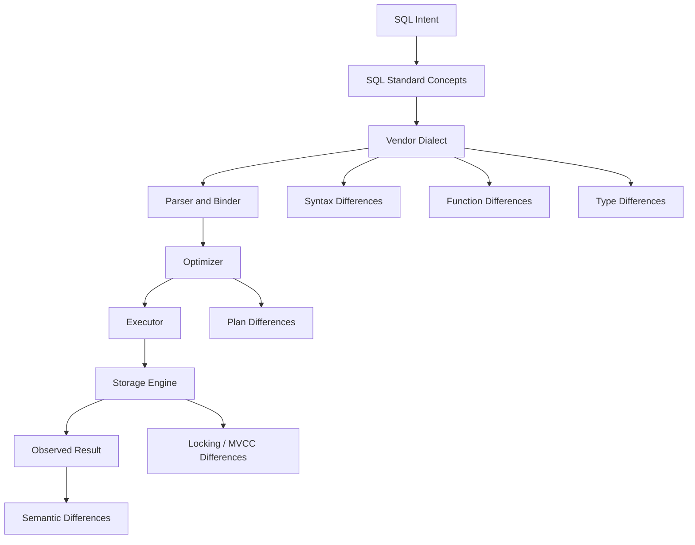
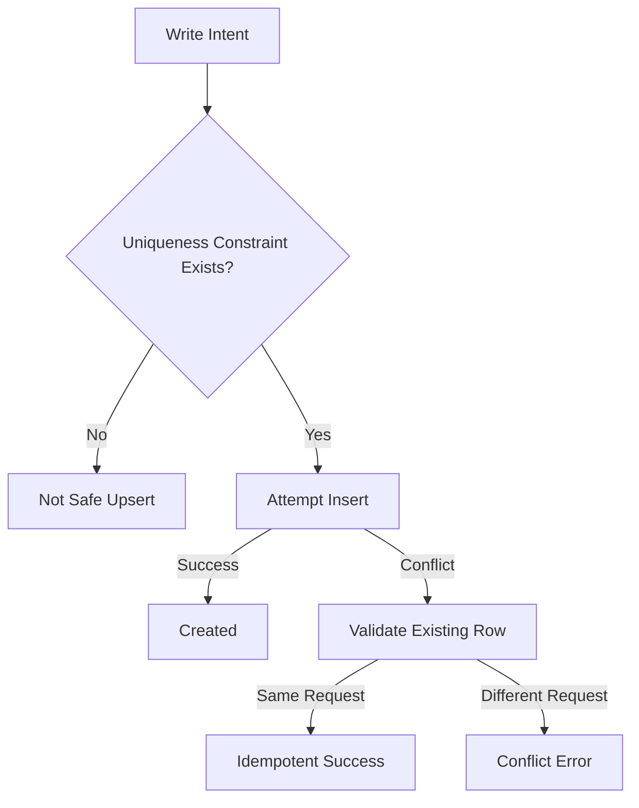
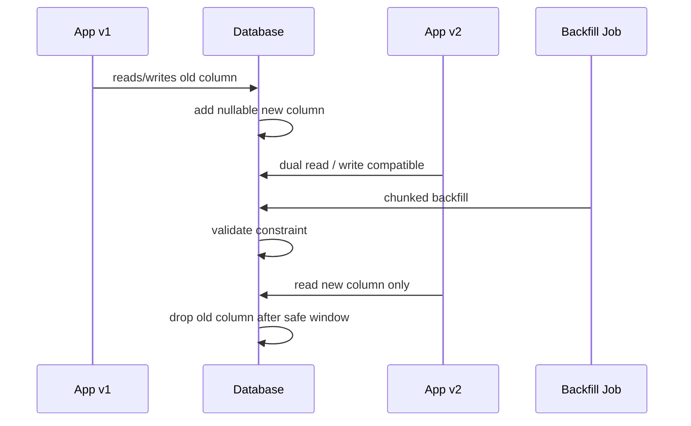
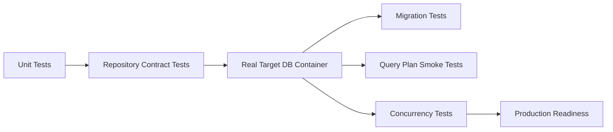
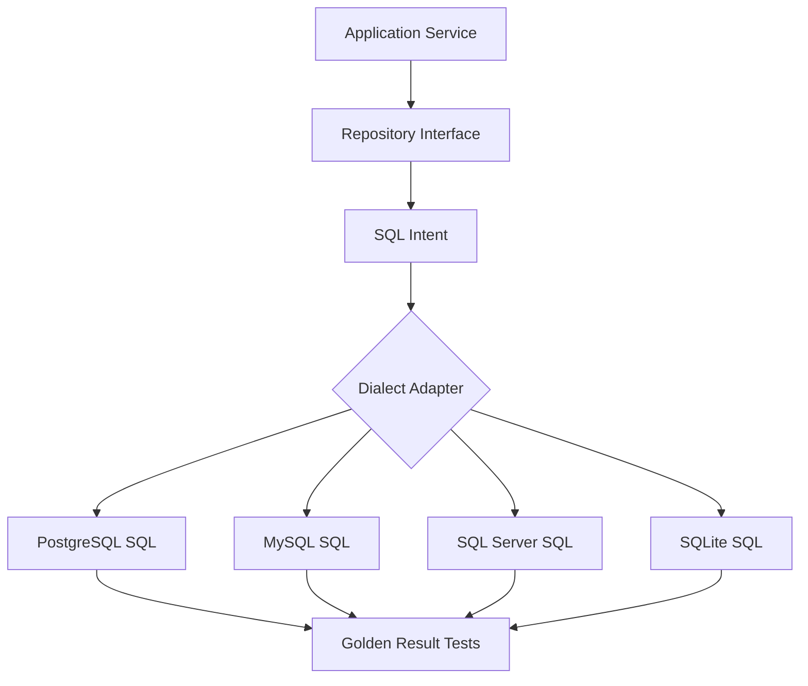

------
title: Learn SQL in Action - Part 033
description: SQL portability across engines, dialect differences, conformance gaps, type-system traps, isolation differences, JSON/date/time behavior, optimizer differences, and a production portability strategy.
series: learn-sql-in-action
seriesTitle: Learn SQL in Action
order: 33
partTitle: SQL Across Engines: Portability and Vendor Differences
tags:
- sql
- database
- portability
- dialect
- postgresql
- mysql
- sql-server
- oracle
- sqlite
- duckdb
- series
date: 2026-07-01
---

# Part 033 — SQL Across Engines: Portability and Vendor Differences

> Target skill: mampu menulis, membaca, dan memindahkan SQL lintas engine tanpa terjebak asumsi bahwa “semua SQL sama”.
>
> Outcome praktis: ketika memilih PostgreSQL, MySQL, SQL Server, Oracle, SQLite, atau DuckDB, kita tahu bagian mana yang portable, bagian mana yang vendor-specific, dan bagian mana yang harus diproteksi oleh test, adapter, migration rule, dan architecture boundary.

SQL punya standard, tetapi production SQL selalu hidup di dalam engine tertentu.

Perbedaan antar-engine bukan hanya cosmetic syntax seperti `LIMIT` vs `TOP`. Perbedaan yang berbahaya biasanya berada di area:

- tipe data dan implicit conversion,
- collation dan string comparison,
- `NULL` ordering,
- date/time arithmetic,
- JSON behavior,
- generated/computed column,
- upsert/merge semantics,
- recursive query limit,
- isolation level,
- locking behavior,
- execution plan,
- index feature,
- DDL locking,
- transaction behavior,
- error code,
- driver behavior,
- migration tooling,
- replication/CDC feature.

Portability bukan berarti “menulis SQL paling primitif”. Portability yang matang berarti kita tahu **level portability** yang dibutuhkan sistem, lalu sengaja mendesain boundary.

## 1. Kaufman Lens: Deconstructing SQL Portability

Dalam framework Kaufman, skill ini harus dipecah menjadi sub-skill kecil yang bisa dilatih.

Portability SQL bukan satu skill. Ia terdiri dari beberapa sub-skill:

| Sub-skill | Tujuan | Feedback cepat |
|---|---|---|
| Dialect reading | Mengenali syntax vendor dari sebuah query | Query gagal parse di engine lain |
| Semantic diff | Menemukan perbedaan hasil, bukan hanya perbedaan syntax | Golden result berbeda |
| Type mapping | Memetakan tipe domain ke tipe engine | Overflow, truncation, precision loss |
| Transaction mapping | Memahami isolation/locking berbeda | Race test, deadlock, anomaly |
| DDL mapping | Menulis migration yang aman per engine | Lock, timeout, rebuild table |
| Plan literacy | Membaca plan sesuai engine | Estimate berbeda, index tidak dipakai |
| Driver boundary | Memahami placeholder, batch, timezone, generated keys | Bug runtime aplikasi |
| Adapter design | Menempatkan vendor-specific SQL di boundary jelas | Codebase tidak menyebar dialect |

Kita tidak sedang mengejar hafalan seluruh dialect. Kita mengejar kemampuan membuat keputusan:

> “Bagian ini harus portable karena domain core. Bagian ini boleh vendor-specific karena performance critical. Bagian ini harus dibungkus adapter. Bagian ini harus diberi dialect test.”

## 2. Mental Model: SQL Standard vs Engine Contract

SQL standard memberi vocabulary umum. Engine memberi behavior nyata.



Dua query bisa terlihat sama tetapi menghasilkan behavior berbeda karena engine contract berbeda.

Contoh area yang sering terlihat sama tetapi tidak identik:

```sql
SELECT *
FROM case_file
ORDER BY closed_at DESC;
```

Pertanyaan portable-nya:

- `NULL` muncul dulu atau terakhir?
- collation memengaruhi ordering string lain di query yang sama?
- apakah `closed_at` bertipe timestamp with time zone atau local timestamp?
- apakah index bisa dipakai untuk sort?
- apakah pagination stabil jika ada nilai timestamp sama?

Query yang tampak sederhana bisa punya behavior yang tidak portable.

## 3. Portability Levels

Tidak semua sistem membutuhkan portability sama.

### Level 0 — Single Engine, No Portability Goal

Sistem sengaja memakai satu engine dan memaksimalkan fiturnya.

Contoh:

- PostgreSQL dengan `jsonb`, `GIN`, partial index, exclusion constraint.
- SQL Server dengan indexed view, temporal table, Query Store.
- Oracle dengan advanced partitioning, materialized view rewrite, PL/SQL package.
- DuckDB untuk embedded analytics dan local analytical processing.

Ini valid jika keputusan sadar.

Risikonya bukan vendor lock-in itu sendiri. Risiko sebenarnya adalah **vendor dependency tidak terlihat**.

### Level 1 — Portable Domain Model, Vendor-Specific Operational Features

Core schema dibuat cukup portable, tetapi indexing, diagnostics, dan operational tooling vendor-specific.

Ini sering paling realistis untuk aplikasi enterprise.

Contoh:

- table/constraint dasar portable,
- migration memiliki branch per engine,
- query aplikasi utama memakai subset SQL umum,
- analytics dan performance tuning boleh vendor-specific,
- test suite berjalan di target engine, bukan hanya H2/SQLite.

### Level 2 — Multi-Engine Product

Produk memang harus mendukung banyak database pelanggan.

Contoh:

- packaged enterprise software,
- on-premise regulated system,
- library/ORM/framework,
- SaaS yang deploy di environment pelanggan.

Di level ini kita butuh:

- dialect abstraction,
- golden query test per engine,
- feature matrix,
- migration generator per engine,
- driver compatibility test,
- strict SQL subset,
- documented unsupported features.

### Level 3 — Query Portability as Data Product

SQL menjadi artefak yang harus berjalan di berbagai analytical engine.

Contoh:

- dbt model multi warehouse,
- BI semantic layer,
- federated query,
- embedded text-to-SQL product,
- data quality rules lintas source.

Ini paling sulit karena analytical functions sangat beragam.

## 4. Feature Matrix: Common Production Differences

| Area | PostgreSQL | MySQL/InnoDB | SQL Server | Oracle | SQLite | DuckDB |
|---|---|---|---|---|---|---|
| Pagination | `LIMIT/OFFSET`, `FETCH` | `LIMIT/OFFSET` | `OFFSET/FETCH`, `TOP` | `FETCH`, legacy `ROWNUM` | `LIMIT/OFFSET` | `LIMIT/OFFSET` |
| Upsert | `ON CONFLICT` | `ON DUPLICATE KEY UPDATE` | `MERGE`, newer alternatives with locking care | `MERGE` | `INSERT OR ...`, `ON CONFLICT` | `ON CONFLICT` |
| JSON | `json`, `jsonb` | `JSON` with generated-column indexing pattern | JSON functions over text/nvarchar | SQL/JSON, JSON relational features | JSON extension functions | JSON support for analytics |
| Boolean | native `boolean` | `BOOLEAN` alias-like behavior over integer-ish representation | `bit` | historically no simple boolean in SQL tables in older versions | dynamic typing | native logical type |
| Date/time | rich timestamp/time zone behavior | several temporal types and modes | `datetime2`, `datetimeoffset` | rich date/timestamp types | type affinity, functions | analytics-friendly temporal functions |
| Isolation default | `READ COMMITTED` | `REPEATABLE READ` | `READ COMMITTED` with optional RCSI | `READ COMMITTED` | serializes writers, WAL changes read concurrency | embedded analytical transactions |
| Partial/filtered index | partial index | limited equivalent via generated columns/functional indexes depending case | filtered index | function-based/partial via patterns | partial index | limited relative to OLTP engines |
| Materialized view | materialized view, manual refresh | no direct full equivalent | indexed view | materialized view | no built-in equivalent | materialized via table/CTAS pattern |
| Stored logic | PL/pgSQL and others | stored routines/triggers | T-SQL procedures/functions/triggers | PL/SQL | limited triggers/functions via extension | SQL macros/functions vary |
| Concurrency model | MVCC | MVCC + locking/gap locks | locking + row versioning option | MVCC-like read consistency | single-writer file DB model | embedded columnar analytical engine |

Matrix ini bukan daftar final. Ia adalah reminder bahwa engine choice memengaruhi correctness.

## 5. Syntax Differences That Hide Semantic Differences

### 5.1 Pagination

PostgreSQL/MySQL/SQLite/DuckDB:

```sql
SELECT case_id, opened_at
FROM case_file
ORDER BY opened_at DESC, case_id DESC
LIMIT 50 OFFSET 100;
```

SQL Server:

```sql
SELECT case_id, opened_at
FROM case_file
ORDER BY opened_at DESC, case_id DESC
OFFSET 100 ROWS FETCH NEXT 50 ROWS ONLY;
```

Oracle modern:

```sql
SELECT case_id, opened_at
FROM case_file
ORDER BY opened_at DESC, case_id DESC
OFFSET 100 ROWS FETCH NEXT 50 ROWS ONLY;
```

Portable lesson:

- selalu tentukan deterministic order,
- jangan bergantung pada default physical order,
- gunakan keyset pagination untuk data besar,
- jangan menganggap offset pagination stabil pada concurrent writes.

Keyset pattern:

```sql
SELECT case_id, opened_at
FROM case_file
WHERE (opened_at, case_id) < (:last_opened_at, :last_case_id)
ORDER BY opened_at DESC, case_id DESC
FETCH FIRST 50 ROWS ONLY;
```

Catatan: row-value comparison tidak selalu sama dukungannya. Adapter mungkin perlu menulis ulang menjadi:

```sql
WHERE opened_at < :last_opened_at
   OR (opened_at = :last_opened_at AND case_id < :last_case_id)
```

### 5.2 `LIMIT` Is Not a Logical Guarantee

`LIMIT 1` tanpa `ORDER BY` bukan memilih “row pertama secara business”. Ia memilih row mana pun yang keluar dari plan.

Anti-pattern:

```sql
SELECT officer_id
FROM assignment
WHERE case_id = :case_id
LIMIT 1;
```

Production-safe:

```sql
SELECT officer_id
FROM assignment
WHERE case_id = :case_id
  AND revoked_at IS NULL
ORDER BY assigned_at DESC, assignment_id DESC
FETCH FIRST 1 ROW ONLY;
```

### 5.3 String Concatenation

Contoh non-portable:

```sql
SELECT first_name || ' ' || last_name AS full_name
FROM person;
```

Di beberapa engine `||` berarti concatenation; di MySQL default, operator ini terkait logical OR kecuali mode tertentu. SQL Server sering memakai `+` atau `CONCAT()`.

Lebih portable secara intention:

```sql
SELECT CONCAT(first_name, ' ', last_name) AS full_name
FROM person;
```

Namun `CONCAT()` pun punya `NULL` behavior yang perlu dicek per engine.

Portability rule:

> Untuk expression yang masuk domain logic, test hasilnya. Jangan hanya test parse.

## 6. Type System Differences

Tipe data adalah kontrak domain. Perbedaan tipe data bisa menyebabkan bug lebih mahal daripada perbedaan syntax.

### 6.1 Exact Numeric vs Floating Point

Untuk uang, penalti, pajak, skor, dan threshold regulatory, gunakan exact numeric.

```sql
penalty_amount NUMERIC(19, 4) NOT NULL
```

Jangan gunakan approximate float untuk uang:

```sql
-- Bad for money
penalty_amount DOUBLE PRECISION NOT NULL
```

Portability notes:

- precision/scale limit berbeda,
- arithmetic rounding bisa berbeda,
- overflow behavior bisa berbeda,
- driver mapping ke `BigDecimal`, `decimal`, atau `number` harus eksplisit.

### 6.2 Boolean

PostgreSQL:

```sql
is_active boolean NOT NULL DEFAULT true
```

SQL Server:

```sql
is_active bit NOT NULL DEFAULT 1
```

MySQL:

```sql
is_active boolean NOT NULL DEFAULT true
```

Tetapi di MySQL, `BOOLEAN` biasanya diperlakukan sebagai alias keluarga integer kecil. Jangan mengandalkan boolean semantic di semua tempat tanpa constraint.

Portable domain alternative untuk state penting:

```sql
status varchar(30) NOT NULL
CHECK (status IN ('DRAFT', 'OPEN', 'CLOSED'))
```

State bisnis jarang boolean. Boolean bagus untuk flag teknis, bukan lifecycle.

### 6.3 Text Length and Unicode

`VARCHAR(255)` bukan default aman untuk semua hal.

Pertanyaan yang harus dijawab:

- panjang dihitung character atau byte?
- collation case-sensitive atau case-insensitive?
- apakah index prefix dibatasi?
- apakah emoji/multibyte aman?
- apakah normalization Unicode memengaruhi uniqueness?

Untuk identifier eksternal:

```sql
external_reference varchar(100) NOT NULL
```

Untuk free text:

```sql
description text NOT NULL
```

Untuk normalized searchable text:

```sql
normalized_name varchar(300) NOT NULL
```

Lalu enforce normalization di application atau generated column sesuai engine.

### 6.4 UUID

PostgreSQL punya native `uuid`.

```sql
case_id uuid PRIMARY KEY
```

SQL Server punya `uniqueidentifier`.

```sql
case_id uniqueidentifier NOT NULL PRIMARY KEY
```

MySQL bisa pakai `binary(16)` atau `char(36)`.

SQLite bisa menyimpan sebagai text/blob.

Portability decision:

| Representation | Pros | Cons |
|---|---|---|
| Native UUID | semantic jelas, storage optimal per engine | non-portable type name |
| `char(36)` | readable, portable-ish | storage/index lebih besar |
| `binary(16)` | compact | readability rendah, function berbeda |

Untuk high-write OLTP, UUID random bisa menyebabkan index fragmentation. Pertimbangkan time-ordered UUID/ULID/engine sequence sesuai kebutuhan.

### 6.5 Date and Time

Time bugs adalah portability killer.

Perbedaan umum:

- apakah tipe menyimpan time zone atau offset?
- apakah driver mengubah time zone otomatis?
- precision microsecond/nanosecond?
- function date arithmetic berbeda?
- `CURRENT_TIMESTAMP` dievaluasi per statement atau per transaction?
- daylight saving time diperlakukan bagaimana?

Core rule:

> Untuk event absolute, simpan instant dalam UTC. Untuk jadwal manusia, simpan local time + zone/region + recurrence rule jika perlu.

Contoh event absolute:

```sql
created_at timestamptz NOT NULL DEFAULT current_timestamp
```

Contoh appointment manusia:

```sql
scheduled_local_date date NOT NULL,
scheduled_local_time time NOT NULL,
time_zone_id varchar(80) NOT NULL
```

### 6.6 Enum

Native enum di PostgreSQL nyaman tetapi migration-nya memiliki trade-off.

Portable alternative:

```sql
CREATE TABLE case_status_ref (
    status_code varchar(30) PRIMARY KEY,
    description varchar(200) NOT NULL,
    terminal_flag boolean NOT NULL
);

ALTER TABLE case_file
ADD CONSTRAINT fk_case_status
FOREIGN KEY (status_code)
REFERENCES case_status_ref(status_code);
```

Untuk state yang sering berubah oleh policy, lookup table biasanya lebih governable.

## 7. NULL Semantics and Ordering

`NULL` bukan value. Ia marker unknown/missing/inapplicable.

Perbedaan production yang sering muncul:

```sql
ORDER BY closed_at DESC
```

Di beberapa engine `NULL` bisa muncul paling atas/paling bawah tergantung arah sort dan default engine.

Portable intention:

```sql
ORDER BY
    CASE WHEN closed_at IS NULL THEN 1 ELSE 0 END,
    closed_at DESC,
    case_id DESC;
```

Atau gunakan syntax vendor bila tersedia:

```sql
ORDER BY closed_at DESC NULLS LAST;
```

Tetapi jangan tulis ini jika target engine tidak mendukungnya.

## 8. Collation and Case Sensitivity

String comparison bukan sekadar `=`.

Query berikut terlihat sederhana:

```sql
SELECT *
FROM person
WHERE email = :email;
```

Tetapi hasilnya dipengaruhi oleh:

- collation case-sensitive/case-insensitive,
- accent sensitivity,
- Unicode normalization,
- trailing space behavior,
- implicit cast,
- index collation.

Untuk email uniqueness, tentukan invariant eksplisit:

```sql
CREATE TABLE account_user (
    user_id bigint PRIMARY KEY,
    email_original varchar(320) NOT NULL,
    email_normalized varchar(320) NOT NULL,
    CONSTRAINT uq_account_user_email_normalized UNIQUE (email_normalized)
);
```

Jangan berharap default collation menebak business rule.

## 9. Upsert and Merge Semantics

Upsert terlihat seperti fitur kecil. Dalam concurrency tinggi, ia adalah correctness boundary.

### PostgreSQL

```sql
INSERT INTO idempotency_key (key_value, request_hash, created_at)
VALUES (:key_value, :request_hash, current_timestamp)
ON CONFLICT (key_value) DO NOTHING;
```

### MySQL

```sql
INSERT INTO idempotency_key (key_value, request_hash, created_at)
VALUES (?, ?, current_timestamp)
ON DUPLICATE KEY UPDATE key_value = key_value;
```

### SQL Server / Oracle

`MERGE` tersedia, tetapi perlu hati-hati terhadap concurrency, trigger side effect, dan vendor-specific caveats. Untuk banyak kasus, pola guarded insert/update eksplisit lebih mudah diaudit.

Portable mental model:



Upsert aman harus didasarkan pada unique constraint, bukan check-then-insert tanpa lock.

## 10. Generated / Computed Columns

Generated column useful untuk:

- normalized search key,
- extracted JSON field,
- computed partition key,
- derived invariant,
- partial migration bridge.

Tetapi syntax dan capability berbeda.

Conceptual example:

```sql
email_normalized generated always as (lower(email_original)) stored
```

Vendor differences:

- stored vs virtual generated column,
- index support,
- deterministic function requirement,
- dependency tracking,
- expression restrictions,
- migration behavior.

Portability rule:

> Treat generated columns as engine feature. Keep business meaning documented separately.

## 11. JSON Differences

JSON is not one feature. It is several different features:

- storage validation,
- binary vs text representation,
- path query,
- indexing,
- update path,
- schema validation,
- generated column extraction,
- relational projection,
- containment operator,
- array handling,
- null vs missing semantics.

PostgreSQL example:

```sql
SELECT payload ->> 'riskLevel' AS risk_level
FROM case_event
WHERE payload @> '{"riskLevel":"HIGH"}';
```

MySQL style often uses JSON path functions:

```sql
SELECT JSON_UNQUOTE(JSON_EXTRACT(payload, '$.riskLevel')) AS risk_level
FROM case_event
WHERE JSON_EXTRACT(payload, '$.riskLevel') = '"HIGH"';
```

Portable strategy:

1. keep raw JSON for audit/input preservation,
2. project important fields into relational columns,
3. index projected fields,
4. validate schema version,
5. test missing/null behavior.

Schema:

```sql
CREATE TABLE inbound_case_payload (
    payload_id bigint PRIMARY KEY,
    source_system varchar(50) NOT NULL,
    schema_version integer NOT NULL,
    raw_payload json NOT NULL,
    received_at timestamp NOT NULL
);

CREATE TABLE case_file (
    case_id bigint PRIMARY KEY,
    external_reference varchar(100) NOT NULL,
    risk_level varchar(20) NOT NULL,
    opened_at timestamp NOT NULL
);
```

## 12. Isolation Differences

This is where portability becomes dangerous.

Same isolation name can imply different practical behavior.

| Isolation name | Portable assumption? | Production warning |
|---|---|---|
| READ COMMITTED | Low | statement snapshot vs locking read can differ |
| REPEATABLE READ | Low | MySQL default differs from PostgreSQL behavior |
| SNAPSHOT | Vendor-specific | SQL Server requires database options/usage pattern |
| SERIALIZABLE | Medium conceptually, low operationally | retry semantics and predicate detection differ |

Portable transaction design should not rely on vague isolation names alone.

Design invariant with constraints and guarded writes:

```sql
UPDATE case_file
SET status = 'APPROVED',
    version = version + 1
WHERE case_id = :case_id
  AND status = 'UNDER_REVIEW'
  AND version = :expected_version;
```

Then require affected row count = 1.

This works across engines better than assuming an isolation level will protect all business invariants.

## 13. Locking Differences

Lock syntax varies:

PostgreSQL/MySQL:

```sql
SELECT *
FROM work_item
WHERE status = 'READY'
ORDER BY priority DESC, created_at ASC
FOR UPDATE SKIP LOCKED;
```

SQL Server style:

```sql
SELECT TOP (1) *
FROM work_item WITH (UPDLOCK, READPAST, ROWLOCK)
WHERE status = 'READY'
ORDER BY priority DESC, created_at ASC;
```

These are not exactly identical. Queue semantics require load tests and starvation tests.

Portable queue design needs:

- status transition guarded by row count,
- lease timeout,
- worker heartbeat,
- retry count,
- poison message handling,
- deterministic ordering,
- fairness policy,
- idempotent processing.

## 14. Index Feature Differences

Index features are highly vendor-specific.

### 14.1 Composite Index Order

Portable concept:

```sql
CREATE INDEX idx_case_tenant_status_due
ON case_file (tenant_id, status, due_at);
```

The concept is portable, but optimizer usage differs.

Questions:

- does engine support descending index key?
- can it scan backward?
- can it use expression index?
- can it use partial/filtered index?
- can it do index-only scan?
- are included columns supported?
- how are NULLs stored?
- how are statistics maintained?

### 14.2 Partial / Filtered Index

PostgreSQL:

```sql
CREATE INDEX idx_open_case_due
ON case_file (tenant_id, due_at)
WHERE status = 'OPEN';
```

SQL Server filtered index conceptually similar:

```sql
CREATE INDEX idx_open_case_due
ON dbo.case_file (tenant_id, due_at)
WHERE status = 'OPEN';
```

MySQL may need generated column or different index design.

Portable strategy:

- model intent in index design doc,
- implement per engine,
- verify with plan test,
- monitor usage.

## 15. DDL and Migration Differences

DDL portability is more operational than syntactic.

Adding a nullable column might be cheap in one engine/version and expensive in another.

```sql
ALTER TABLE case_file ADD COLUMN risk_score numeric(6, 2);
```

Questions:

- does it rewrite table?
- does it block writes?
- can constraint validation be deferred?
- can index build be concurrent/online?
- is rollback cheap?
- will replication lag spike?
- will lock timeout protect the system?

Migration rule:

> “Portable DDL” is a myth unless validated under production-like data volume and engine/version.

Use expand-contract:



## 16. Identifier Quoting and Case

Bad portability habit:

```sql
CREATE TABLE "CaseFile" (
    "CaseID" bigint PRIMARY KEY
);
```

This creates case-sensitive identifiers in some engines and pain everywhere.

Recommendation:

- use lower snake case for physical names,
- avoid reserved words,
- avoid quoted identifiers unless necessary,
- keep naming convention engine-neutral.

Good:

```sql
CREATE TABLE case_file (
    case_id bigint PRIMARY KEY,
    opened_at timestamp NOT NULL
);
```

## 17. Temporary Tables and Session State

Temporary table behavior differs widely:

- transaction scope vs session scope,
- visibility to nested procedure,
- statistics behavior,
- index support,
- commit behavior,
- cleanup behavior,
- concurrency behavior.

Temporary table can be good for complex ETL/reporting, but dangerous in stateless app connection pools.

Alternative:

- CTE for small pipeline,
- permanent staging table with batch ID,
- unlogged/transient table where engine supports it,
- application-side batch if data volume is small.

## 18. Error Codes and Retry Classification

Do not classify retryable errors by message string alone.

Classes:

| Error class | Retry? | Example handling |
|---|---|---|
| Serialization failure | yes | retry whole transaction |
| Deadlock victim | yes | retry with backoff |
| Unique violation | maybe | idempotency check or business conflict |
| FK violation | no usually | data/order bug |
| Check violation | no usually | domain validation bug |
| Lock timeout | maybe | retry if operation designed idempotent |
| Connection lost during commit | ambiguous | use idempotency key / reconciliation |

Engine-specific SQLSTATE/vendor code mapping should live in adapter layer.

## 19. Driver Differences

SQL portability does not stop at database server.

Driver differences include:

- placeholder syntax: `?`, `$1`, `:name`, `@p1`,
- generated key retrieval,
- batch execution behavior,
- date/time mapping,
- decimal mapping,
- boolean mapping,
- streaming result set,
- fetch size,
- transaction autocommit default,
- retry behavior in connection pool,
- prepared statement caching,
- server-side vs client-side prepared statements.

Application rule:

> Your SQL contract is DB engine + driver + connection pool + migration tool, not DB engine alone.

## 20. ORM Portability Trap

ORM can hide dialect differences, but cannot eliminate them.

Common trap:

- tests run on SQLite/H2,
- production runs on PostgreSQL/MySQL/SQL Server,
- generated SQL differs,
- isolation differs,
- DDL differs,
- constraint behavior differs,
- query plan differs.

Test strategy:



Do not use an in-memory substitute to validate production database behavior.

## 21. Dialect Adapter Design

A clean architecture for SQL portability:



Repository should expose domain operation, not raw dialect leakage.

Bad:

```java
String sql = isPostgres ? postgresSql : mysqlSql;
// spread across service layer
```

Better:

```java
interface CaseSearchSqlDialect {
    SqlStatement searchOpenCases(CaseSearchCriteria criteria);
    SqlStatement acquireNextWorkItem(String workerId);
    SqlStatement upsertIdempotencyKey();
}
```

## 22. Golden Result Testing

Dialect compatibility must be tested by result, not by syntax.

Test shape:

```yaml
scenario: open_case_queue_order
seed:
  - case_id: 1
    status: OPEN
    priority: 10
    due_at: 2026-07-01T09:00:00Z
  - case_id: 2
    status: OPEN
    priority: 10
    due_at: 2026-07-01T09:00:00Z
query: find_next_cases
expected:
  - case_id: 1
  - case_id: 2
engines:
  - postgres
  - mysql
  - sqlserver
```

Golden result catches:

- null ordering differences,
- collation differences,
- date truncation differences,
- integer division differences,
- duplicate semantics,
- implicit cast differences,
- aggregation denominator mistakes.

## 23. Portability Lint Rules

Create SQL lint rules for your codebase.

Example rules:

1. no `SELECT *` in production repository query,
2. no pagination without deterministic `ORDER BY`,
3. no `LIMIT 1` without order,
4. no implicit date string parsing,
5. no quoted mixed-case identifiers,
6. no vendor function outside dialect adapter,
7. no raw SQL string concatenation,
8. no `NOT IN` with nullable subquery,
9. no `CURRENT_TIMESTAMP` in cross-region business event without agreed time semantics,
10. no migration using destructive DDL without expand-contract plan.

## 24. Portability Decision Record

For every non-trivial vendor-specific feature, write a short ADR.

Template:

```md
# ADR: Use PostgreSQL partial index for open case queue

## Context
Open-case queue query filters tenant_id, status='READY', due_at <= now.
Full index over all statuses is too large and low-selectivity.

## Decision
Use PostgreSQL partial index:
CREATE INDEX ... WHERE status = 'READY';

## Consequences
- Query is fast for READY queue.
- Migration to MySQL requires alternative generated-column/index strategy.
- Repository query remains domain-level.
- Plan regression test required.
```

## 25. Engine Selection Heuristics

### PostgreSQL

Strong default for complex OLTP + rich SQL + extensibility.

Good fit:

- complex relational model,
- partial/expression indexes,
- JSONB plus relational hybrid,
- transactional workflows,
- advanced query composition,
- strong open ecosystem.

Watch:

- vacuum/bloat literacy,
- connection management,
- replication slot monitoring,
- migration locks,
- planner statistics.

### MySQL/InnoDB

Good fit for common web OLTP, high familiarity, mature replication ecosystem.

Watch:

- isolation default assumptions,
- gap locks and locking reads,
- JSON indexing pattern,
- SQL mode configuration,
- online DDL behavior by version/operation,
- `ON DUPLICATE KEY` side effects.

### SQL Server

Good fit for Microsoft ecosystem, enterprise tooling, Query Store, integrated BI, T-SQL, operational observability.

Watch:

- snapshot/RCSI configuration,
- tempdb/version store pressure,
- parameter sniffing,
- plan cache behavior,
- indexed view restrictions,
- locking hints misuse.

### Oracle

Good fit for large enterprise workloads, mature optimizer, PL/SQL ecosystem, partitioning/materialized view features.

Watch:

- licensing/feature boundaries,
- operational complexity,
- portability cost,
- Oracle-specific SQL/PLSQL idioms.

### SQLite

Good fit for embedded, local-first, mobile, edge, test fixtures with caution.

Watch:

- flexible typing,
- single-writer concurrency model,
- foreign key pragma/config,
- primary key/null quirks,
- limited server-style operational behavior.

### DuckDB

Good fit for embedded analytics, local analytical processing, data science, parquet/csv exploration, OLAP-style workloads.

Watch:

- not a general OLTP server replacement,
- memory behavior for blocking operators,
- concurrency/operational assumptions,
- dialect compatibility limits.

## 26. Portability Anti-Patterns

### Anti-pattern: “We use standard SQL”

Almost always false in production.

Better statement:

> “We use a documented SQL subset for repository queries, with vendor-specific adapters for locking, upsert, pagination, JSON, and migration.”

### Anti-pattern: Testing PostgreSQL Behavior on SQLite

SQLite is excellent for what it is, but it does not emulate PostgreSQL concurrency, types, planner, DDL, or constraints fully.

### Anti-pattern: Vendor Function in Domain Query Everywhere

Bad:

```sql
WHERE DATE_TRUNC('day', created_at) = :day
```

Better:

```sql
WHERE created_at >= :day_start
  AND created_at < :next_day_start
```

This is both more portable and more sargable.

### Anti-pattern: Generic Repository That Hides Critical SQL

A too-generic repository may prevent you from expressing lock hints, index-friendly predicates, or transaction semantics.

Use abstraction to isolate dialect, not to deny database reality.

## 27. Production Checklist

Before declaring SQL portable, answer:

- Does the query produce the same result across target engines?
- Are NULL ordering and collation explicitly handled?
- Are date/time values bound as typed parameters, not string literals?
- Are numeric types mapped without precision loss?
- Are pagination queries deterministic?
- Are upserts backed by unique constraints?
- Are locking queries tested under concurrency?
- Are isolation assumptions documented per engine?
- Are migrations tested on realistic data size?
- Are index features implemented per engine?
- Are driver-specific behaviors tested?
- Are vendor-specific features behind clear adapter boundaries?
- Are error codes mapped to retry categories per engine?

## 28. Practice Drill

Create a table `case_file` with:

- tenant ID,
- case ID,
- status,
- priority,
- opened timestamp,
- due timestamp,
- JSON metadata,
- normalized external reference.

Then implement these operations in two engines of your choice:

1. insert case with idempotency key,
2. find open cases due soon with keyset pagination,
3. acquire next ready work item safely,
4. compute SLA breach rate,
5. validate no duplicate active external reference,
6. migrate `risk_level` from JSON into relational column.

For each operation, record:

- SQL text,
- result equivalence,
- execution plan,
- index used,
- failure mode,
- retry behavior,
- portability notes.

## 29. Reference Notes

Use official vendor docs for engine-specific behavior. In this series, treat documentation as part of the executable contract.

Recommended reference categories:

- SQL conformance documentation,
- data type documentation,
- transaction isolation documentation,
- index documentation,
- JSON documentation,
- DDL/migration documentation,
- execution plan documentation,
- replication/CDC documentation,
- driver documentation.

## 30. Key Takeaways

1. SQL portability is not just syntax portability.
2. Same SQL can have different semantics across engines.
3. The most dangerous differences are type, time, collation, NULL, transaction, locking, and DDL behavior.
4. Vendor-specific features are not bad; hidden vendor-specific assumptions are bad.
5. Use dialect adapters for unavoidable differences.
6. Test by result, plan, concurrency, and migration behavior.
7. Real portability requires a feature matrix, golden tests, migration tests, and explicit architecture boundaries.

In the next part, we use this portability awareness at system-design level: relational databases as consistency boundaries, read replicas, CDC, outbox/inbox, CQRS, cache invalidation, and failure modelling.
