------
title: Learn SQL in Action - Part 034
description: System design with SQL and relational databases: OLTP vs OLAP, read replicas, CQRS, outbox/inbox, CDC, transactional messaging, cache invalidation, consistency boundaries, and failure modelling.
series: learn-sql-in-action
seriesTitle: Learn SQL in Action
order: 34
partTitle: System Design with SQL and Relational Databases
tags:
- sql
- database
- system-design
- cdc
- outbox
- cqrs
- replication
- consistency
- cache
- series
date: 2026-07-01
---

# Part 034 — System Design with SQL and Relational Databases

> Target skill: mampu menempatkan SQL database secara benar di arsitektur sistem: bukan hanya sebagai tempat menyimpan data, tetapi sebagai consistency boundary, integration source, audit anchor, read model source, dan operational dependency yang punya failure mode.
>
> Outcome praktis: ketika mendesain sistem case management, regulatory workflow, order lifecycle, billing, entitlement, atau audit platform, kita tahu kapan memakai single relational database, kapan memakai replica, kapan memakai outbox/CDC, kapan membuat read model, kapan cache berbahaya, dan kapan sharding/partitioning diperlukan.

SQL skill untuk top engineer tidak berhenti di query. Skill itu harus naik ke system design.

Database relasional adalah salah satu komponen paling kuat dalam sistem karena ia bisa memberikan:

- durable state,
- transaction boundary,
- referential integrity,
- concurrency control,
- auditability,
- queryability,
- recovery path,
- integration stream,
- operational visibility.

Tetapi kekuatan itu datang dengan trade-off:

- latency,
- contention,
- migration risk,
- replication lag,
- cache inconsistency,
- backup/restore complexity,
- schema evolution cost,
- blast radius,
- operational coupling.

Tujuan part ini adalah menyatukan semua materi sebelumnya ke desain sistem.

## 1. Kaufman Lens: Deconstructing Database System Design

System design dengan SQL bisa dipecah menjadi sub-skill:

| Sub-skill | Pertanyaan inti | Feedback cepat |
|---|---|---|
| Boundary design | Apa yang harus konsisten dalam satu transaksi? | invariant bisa dilanggar atau tidak |
| Workload classification | Ini OLTP, OLAP, HTAP, queue, audit, atau search? | query latency dan contention |
| Data ownership | Siapa source of truth? | conflicting writes |
| Replication design | Replica dipakai untuk apa? | lag, stale reads |
| Event propagation | Bagaimana state change keluar dari DB? | lost event / duplicate event |
| Cache strategy | Apa yang boleh stale? | stale read incident |
| Migration strategy | Bagaimana schema berubah tanpa downtime? | deployment failure |
| Failure modelling | Apa yang terjadi saat DB, broker, replica, atau consumer gagal? | incident drill |
| Observability | Bagaimana mendeteksi query, lock, lag, bloat, pool saturation? | time-to-diagnose |

Kita tidak belajar pattern untuk dihafal. Kita belajar constraint dan invariant.

## 2. Database as Consistency Boundary

Pertanyaan paling penting:

> Data apa yang harus berubah bersama-sama atau tidak berubah sama sekali?

Itulah transaction boundary.

Contoh case approval:

- update `case_file.status`,
- insert `case_status_history`,
- insert `case_decision`,
- insert `audit_event`,
- insert `outbox_event`.

Semua ini harus terjadi atomically.

```sql
BEGIN;

UPDATE case_file
SET status = 'APPROVED',
    version = version + 1,
    updated_at = current_timestamp
WHERE case_id = :case_id
  AND status = 'UNDER_REVIEW'
  AND version = :expected_version;

INSERT INTO case_status_history (...)
VALUES (...);

INSERT INTO case_decision (...)
VALUES (...);

INSERT INTO audit_event (...)
VALUES (...);

INSERT INTO outbox_event (...)
VALUES (...);

COMMIT;
```

If any part fails, none should be committed.

This is where relational database shines.

## 3. Unit of Consistency vs Unit of Deployment

A common mistake: assuming microservice boundary must always split database transaction boundary.

Better distinction:

| Concept | Meaning |
|---|---|
| Unit of consistency | Data that must obey invariant together |
| Unit of ownership | Team/service responsible for changing data |
| Unit of deployment | Artifact deployed independently |
| Unit of scaling | Component scaled independently |
| Unit of query | Shape needed by user/report/API |

These are not always identical.

A regulatory case system may have one strong consistency boundary for case lifecycle, but multiple read models for search, dashboard, notification, and analytics.

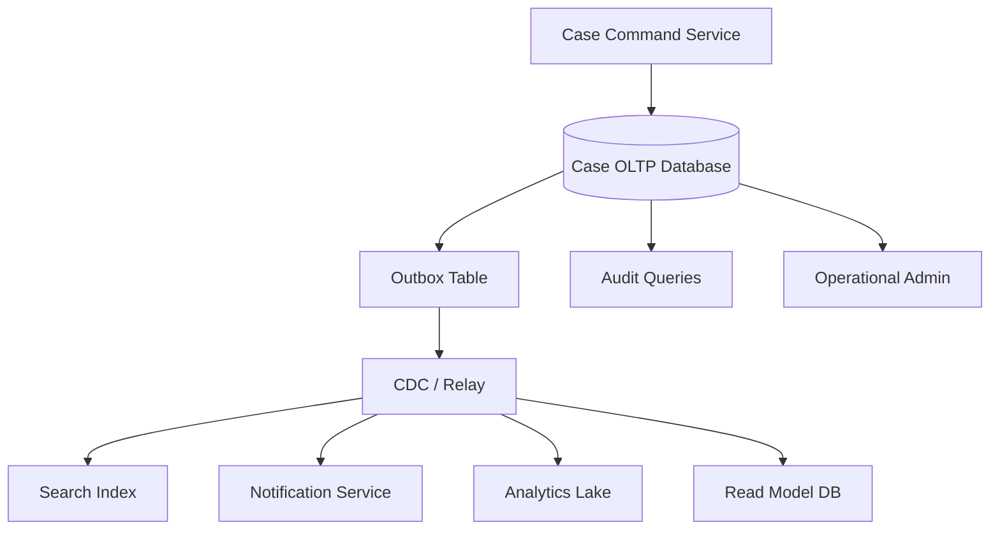

## 4. OLTP vs OLAP vs Operational Analytics

### OLTP

OLTP optimizes for small, concurrent, transactional changes.

Examples:

- open case,
- assign officer,
- approve decision,
- record payment,
- update SLA deadline,
- submit evidence.

Characteristics:

- short transactions,
- strict constraints,
- high concurrency,
- predictable indexes,
- normalized model,
- row-level changes,
- low latency.

### OLAP

OLAP optimizes for large scans, aggregations, joins, and trend analysis.

Examples:

- monthly enforcement trend,
- officer workload distribution,
- cohort retention,
- violation severity analysis,
- SLA compliance report.

Characteristics:

- large scans,
- columnar storage useful,
- denormalized/star schema useful,
- batch/stream ingestion,
- higher latency tolerance,
- snapshot consistency important.

### Operational Analytics

Operational analytics lives between OLTP and OLAP.

Examples:

- open cases due in next 24 hours,
- backlog by team,
- current SLA breach count,
- queue health,
- stuck workflow detection.

It often runs on OLTP data but can hurt OLTP if not controlled.

Strategy:

- indexed summary table,
- materialized view,
- read replica,
- read model database,
- CDC-fed dashboard store,
- query budget and timeout.

## 5. Read Replicas

Read replicas are not magic scale-out. They are consistency trade-offs.

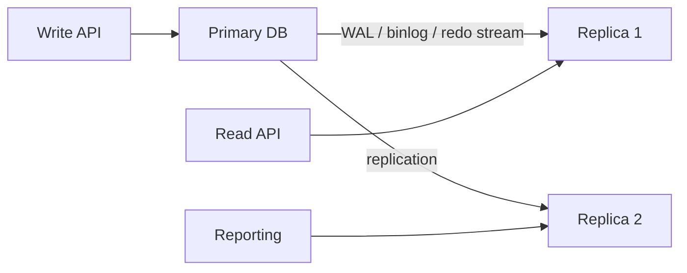

Read replicas help when:

- read workload is heavy,
- stale reads are acceptable,
- reports should not overload primary,
- failover readiness is needed,
- backup can run away from primary.

Read replicas hurt when:

- read-after-write consistency is required,
- application is unaware of lag,
- long analytical queries create replica conflicts,
- replica lag causes wrong decisions,
- failover assumptions are untested.

## 6. Read-After-Write Consistency

Problem:

1. user updates case,
2. API writes to primary,
3. next screen reads from replica,
4. replica has not caught up,
5. user sees stale state.

This is not a database bug. It is architecture behavior.

Solutions:

| Strategy | When useful | Trade-off |
|---|---|---|
| Read own writes from primary | user-facing immediate consistency | more primary load |
| Lag-aware routing | route to primary if replica lag too high | needs lag telemetry |
| Session consistency token | read from replica only after LSN/binlog position visible | complexity |
| UI pending state | eventual consistency acceptable | UX design needed |
| CQRS read model with delay indicator | dashboard/reporting | eventual semantics explicit |

For regulatory workflow, do not show approval result from stale replica unless UI explicitly marks freshness.

## 7. CQRS: Command Model vs Query Model

CQRS means separating write model from read model. It does not mean eventual consistency everywhere by default.

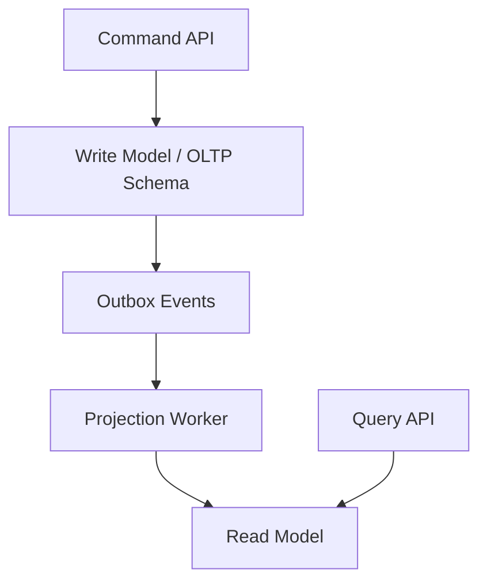

Write model:

- normalized,
- constraint-heavy,
- transactionally correct,
- optimized for state changes.

Read model:

- denormalized,
- query-shaped,
- possibly duplicated,
- rebuildable,
- optimized for user/API/dashboard reads.

CQRS is useful when:

- read shape differs greatly from write shape,
- query load threatens OLTP,
- search/reporting needs denormalized fields,
- read model can be rebuilt,
- eventual consistency is acceptable for those queries.

CQRS is harmful when:

- used to avoid learning SQL joins,
- read model becomes source of truth,
- projection lag is not observable,
- no replay/rebuild strategy exists,
- duplicate business rules drift.

## 8. Transactional Outbox Pattern

Problem: dual write.

Bad flow:

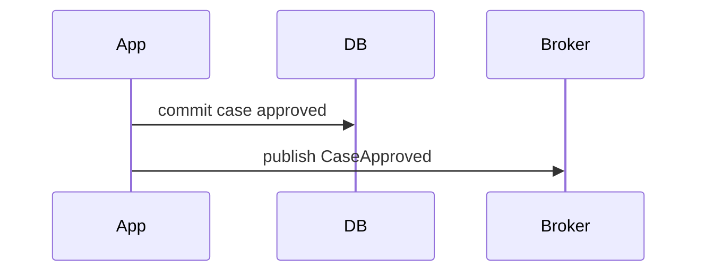

If DB commit succeeds and broker publish fails, state changed but event lost.

Transactional outbox solves this by writing event into the same transaction as business state.

```sql
BEGIN;

UPDATE case_file
SET status = 'APPROVED'
WHERE case_id = :case_id
  AND status = 'UNDER_REVIEW';

INSERT INTO outbox_event (
    event_id,
    aggregate_type,
    aggregate_id,
    event_type,
    payload,
    occurred_at,
    published_at
) VALUES (
    :event_id,
    'CaseFile',
    :case_id,
    'CaseApproved',
    :payload,
    current_timestamp,
    NULL
);

COMMIT;
```

Then a relay publishes the outbox event.

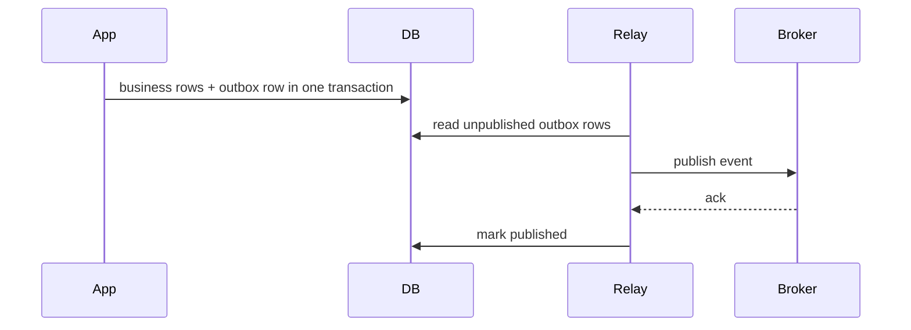

This gives atomic state + event recording, but delivery to broker is usually at-least-once.

Consumers must be idempotent.

## 9. Outbox Table Design

Example:

```sql
CREATE TABLE outbox_event (
    event_id uuid PRIMARY KEY,
    aggregate_type varchar(80) NOT NULL,
    aggregate_id varchar(120) NOT NULL,
    event_type varchar(120) NOT NULL,
    event_version integer NOT NULL,
    payload json NOT NULL,
    headers json NULL,
    occurred_at timestamp NOT NULL,
    available_at timestamp NOT NULL,
    published_at timestamp NULL,
    publish_attempts integer NOT NULL DEFAULT 0,
    last_error text NULL
);

CREATE INDEX idx_outbox_unpublished
ON outbox_event (available_at, occurred_at, event_id)
WHERE published_at IS NULL;
```

Important fields:

| Field | Purpose |
|---|---|
| `event_id` | idempotency key for consumers |
| `aggregate_type` | routing and rebuild |
| `aggregate_id` | ordering/keying per aggregate |
| `event_type` | schema contract |
| `event_version` | event evolution |
| `payload` | business fact |
| `occurred_at` | source timestamp |
| `available_at` | delay/retry scheduling |
| `published_at` | relay progress |
| `publish_attempts` | poison detection |
| `last_error` | operational debugging |

## 10. Polling Outbox vs CDC Outbox

### Polling Outbox

Relay queries outbox table periodically.

```sql
SELECT event_id, payload
FROM outbox_event
WHERE published_at IS NULL
  AND available_at <= current_timestamp
ORDER BY occurred_at, event_id
FETCH FIRST 100 ROWS ONLY
FOR UPDATE SKIP LOCKED;
```

Pros:

- simple,
- explicit,
- works without CDC infrastructure,
- easy to reason about.

Cons:

- polling overhead,
- locking complexity,
- marking published creates more writes,
- ordering needs design,
- relay failure can leave rows in progress.

### CDC Outbox

CDC reads database log and streams inserted outbox rows.

Pros:

- avoids polling query,
- preserves commit order more naturally depending connector,
- scales integration better,
- outbox row itself becomes event source.

Cons:

- needs CDC infrastructure,
- replication slot/binlog retention risk,
- connector failure can grow log storage,
- schema evolution needs discipline,
- operational complexity higher.

## 11. Change Data Capture

CDC means capturing committed database changes and propagating them to downstream systems.

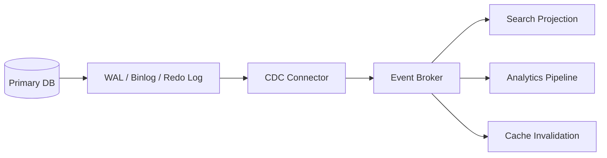

CDC use cases:

- search indexing,
- analytics ingestion,
- read model projection,
- audit streaming,
- cache invalidation,
- cross-service integration,
- migration synchronization.

CDC risks:

- lag,
- duplicate events,
- reordering by key/partition,
- schema change breakage,
- connector outage,
- log retention growth,
- snapshot/re-snapshot complexity,
- downstream backpressure.

CDC rule:

> CDC gives reliable observation of committed changes. It does not remove the need for idempotent consumers and schema contracts.

## 12. Inbox Pattern

If outbox solves producer-side dual write, inbox solves consumer-side duplicate handling.

Consumer table:

```sql
CREATE TABLE consumed_event (
    consumer_name varchar(100) NOT NULL,
    event_id uuid NOT NULL,
    consumed_at timestamp NOT NULL,
    PRIMARY KEY (consumer_name, event_id)
);
```

Consumer transaction:

```sql
BEGIN;

INSERT INTO consumed_event (consumer_name, event_id, consumed_at)
VALUES (:consumer_name, :event_id, current_timestamp);

-- apply business projection/update
UPDATE case_search_projection
SET status = :status,
    updated_at = :occurred_at
WHERE case_id = :case_id;

COMMIT;
```

If insert conflicts, event was already processed.

This is essential because at-least-once delivery is the realistic default for robust distributed systems.

## 13. Cache Invalidation

Cache is a second truth unless designed carefully.

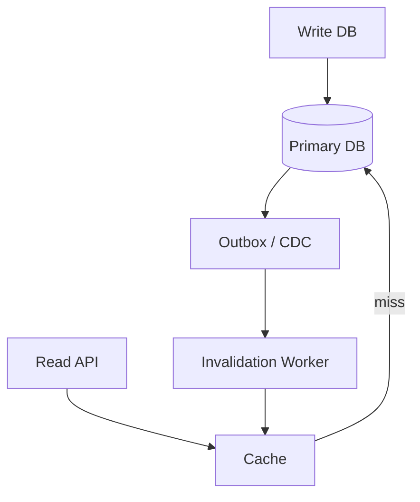

Cache strategies:

| Strategy | Good for | Risk |
|---|---|---|
| Cache-aside | simple reads | stale after write |
| Write-through | controlled updates | app complexity |
| Write-behind | high write throughput | data loss/inconsistency risk |
| CDC invalidation | DB as source of truth | invalidation lag |
| TTL only | low correctness need | stale window always exists |

For regulatory systems, cache domain decisions carefully. Cache reference data and read-only projections more freely than lifecycle state.

## 14. Cache Key and Invalidation Scope

Bad key:

```text
case:123
```

Better key includes tenant and representation:

```text
tenant:{tenantId}:case-summary:{caseId}:v3
```

Invalidation must know:

- which aggregate changed,
- which query result sets include it,
- whether list caches exist,
- whether permission-dependent view differs,
- whether stale read is acceptable.

For list queries, invalidation is hard. Often better:

- short TTL,
- event-driven projection,
- no list cache for critical workflow queue,
- cache only immutable pages/snapshots.

## 15. Search Index as Read Model

Search index is not source of truth.

Common architecture:

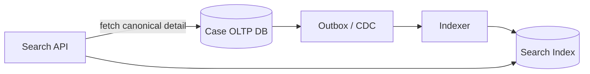

Rules:

- index documents should include enough fields for search/list,
- canonical detail should come from source DB if correctness matters,
- indexer must be idempotent,
- reindex from source must be possible,
- projection lag must be visible,
- delete/soft-delete semantics must be explicit.

## 16. Reporting and Analytics Architecture

Do not run heavy monthly reports on the OLTP primary unless intentionally budgeted.

Options:

1. read replica for moderate reports,
2. ETL/ELT into warehouse/lakehouse,
3. materialized summary tables,
4. CDC stream to analytical store,
5. snapshot export,
6. DuckDB/local analytical processing for offline/embedded workloads.

Architecture:

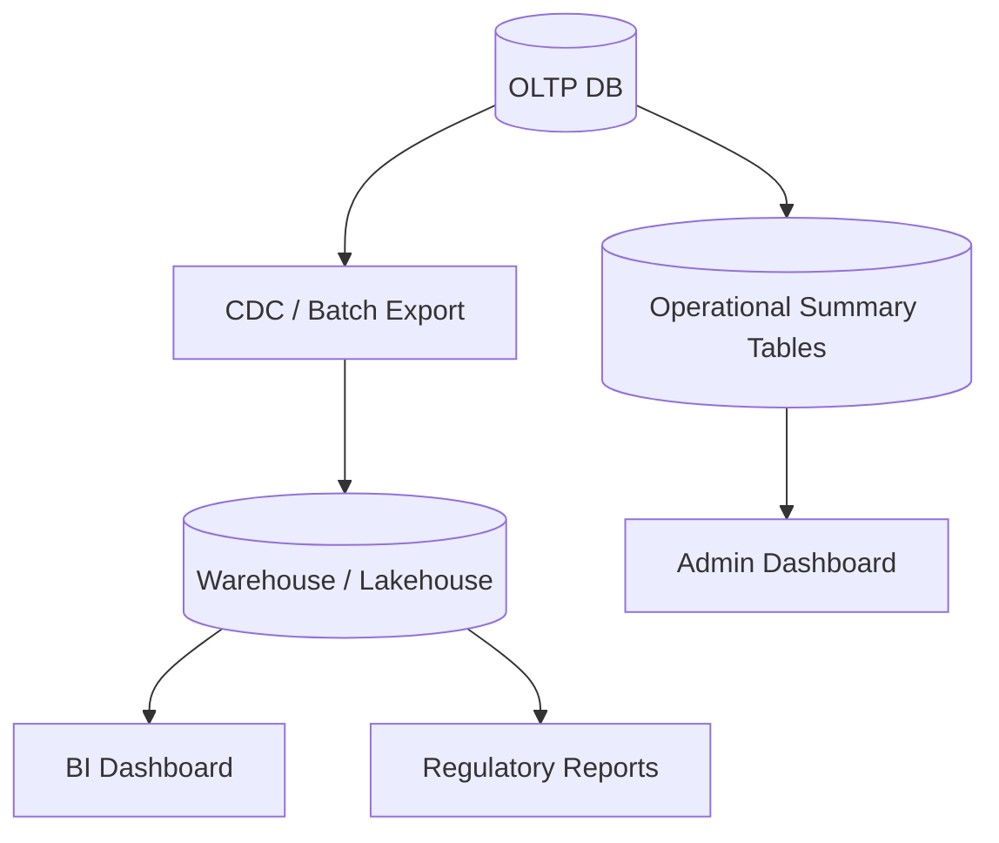

Use OLTP for current operational truth. Use analytical store for broad historical scanning.

## 17. Materialized Summary Tables

For operational dashboards:

```sql
CREATE TABLE team_case_backlog_summary (
    tenant_id bigint NOT NULL,
    team_id bigint NOT NULL,
    status varchar(30) NOT NULL,
    case_count bigint NOT NULL,
    breached_count bigint NOT NULL,
    refreshed_at timestamp NOT NULL,
    PRIMARY KEY (tenant_id, team_id, status)
);
```

Refresh options:

- synchronous update in same transaction,
- asynchronous event projection,
- scheduled recomputation,
- hybrid incremental + periodic reconciliation.

Trade-off:

| Refresh style | Freshness | Write cost | Complexity |
|---|---:|---:|---:|
| Synchronous | highest | high | medium |
| Async event | medium | low | high |
| Batch refresh | low/medium | low | medium |
| On-demand query | current | query cost high | low |

For dashboards, eventual consistency is often acceptable if freshness is visible.

## 18. Multi-Tenancy with SQL

Common models:

| Model | Pros | Cons |
|---|---|---|
| Shared DB, shared schema, tenant column | efficient, simple ops | isolation relies on predicates/RLS |
| Shared DB, schema per tenant | stronger logical separation | migration complexity |
| DB per tenant | strong isolation, custom backup | operational overhead |
| Cluster per tenant | strongest isolation | highest cost |

Shared schema pattern:

```sql
CREATE TABLE case_file (
    tenant_id bigint NOT NULL,
    case_id bigint NOT NULL,
    status varchar(30) NOT NULL,
    opened_at timestamp NOT NULL,
    PRIMARY KEY (tenant_id, case_id)
);

CREATE INDEX idx_case_file_tenant_status_opened
ON case_file (tenant_id, status, opened_at DESC, case_id DESC);
```

Never forget tenant in unique constraints:

```sql
ALTER TABLE case_file
ADD CONSTRAINT uq_case_external_ref
UNIQUE (tenant_id, external_reference);
```

Tenant isolation is an invariant, not a UI filter.

## 19. Sharding and Distribution

Sharding is not partitioning with marketing.

Partitioning usually divides data inside one database system. Sharding divides data across independent database nodes.

Use sharding when:

- one primary cannot handle write load,
- one node cannot hold data economically,
- tenant isolation/blast radius requires physical split,
- regional data residency requires separate placement.

Avoid sharding when:

- query model needs frequent cross-shard joins,
- team lacks operational maturity,
- bottleneck is missing index/query design,
- archive/partitioning would solve the issue.

Shard key questions:

- Does it align with transaction boundary?
- Does it avoid hot shards?
- Can tenants grow unevenly?
- How do we move a tenant?
- How do we run global reports?
- How do we enforce global uniqueness?
- How do we handle cross-shard workflow?

## 20. Cross-Database Transactions

Distributed transactions are expensive operationally and conceptually.

Safer pattern:

- keep strong invariant inside one database,
- publish event via outbox,
- downstream systems update eventually,
- use saga/process manager for multi-step workflow,
- make every step idempotent,
- reconcile periodically.

Saga example:

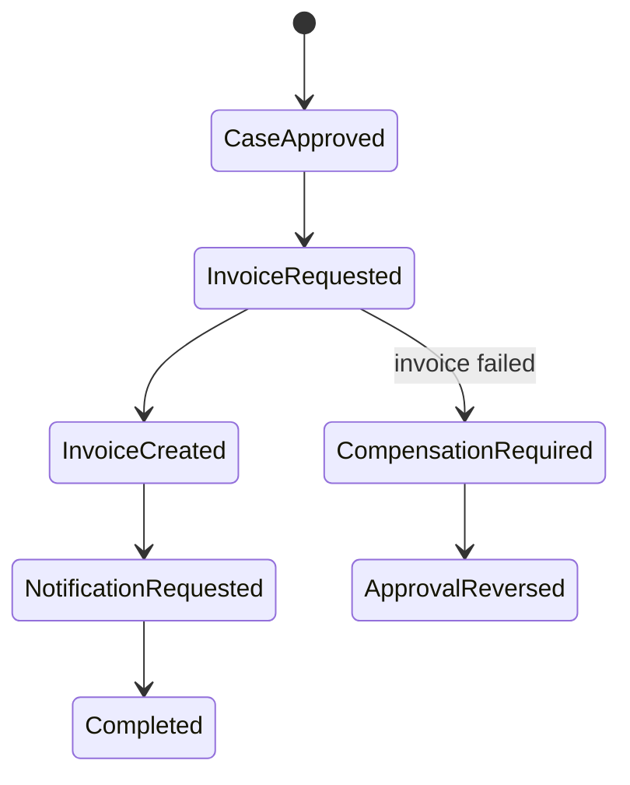

Not every process can be eventually consistent. Identify which invariant truly requires atomicity.

## 21. Transactional Messaging Without Illusions

Exactly-once is often a composed illusion built from:

- atomic write to source,
- durable event log,
- idempotent consumer,
- deduplication key,
- transactional sink,
- deterministic replay,
- careful offset management.

Design for:

- at-least-once delivery,
- duplicate events,
- delayed events,
- partial failure,
- replay,
- poison messages,
- schema evolution.

Consumer idempotency is not optional.

## 22. Event Schema Design

Bad event:

```json
{
  "status": "APPROVED"
}
```

Better event:

```json
{
  "eventId": "8a2e...",
  "eventType": "CaseApproved",
  "eventVersion": 2,
  "occurredAt": "2026-07-01T10:15:30Z",
  "tenantId": "tenant-42",
  "caseId": "case-1001",
  "previousStatus": "UNDER_REVIEW",
  "newStatus": "APPROVED",
  "decisionId": "decision-778",
  "approvedBy": "user-91",
  "reasonCode": "COMPLIANT"
}
```

Event should contain enough context for consumers without forcing them to query source synchronously for every projection.

But do not leak sensitive data unnecessarily.

## 23. Audit Log vs Event Log

Audit log and event log overlap but are not identical.

| Aspect | Audit log | Domain event/outbox |
|---|---|---|
| Purpose | accountability, evidence | integration, projection |
| Audience | compliance, support, investigation | downstream systems |
| Mutability | append-only, strict | append-only ideally |
| Payload | who/what/when/why | business fact for consumers |
| Retention | often long/legal | operational/event retention |
| Query pattern | reconstruction/investigation | consumption/replay |

Do not assume Kafka topic replaces audit table. Auditability often needs local queryable evidence with permission controls.

## 24. Backup, Restore, and Recovery Design

A database system design is incomplete without recovery thinking.

Questions:

- What is RPO?
- What is RTO?
- Are backups tested?
- Can we restore to a point in time?
- Are encryption keys backed up?
- Are schema migrations recoverable?
- How do replicas interact with backups?
- How do CDC/outbox consumers recover after restore?
- How do we reconcile events emitted after restored point?

Restore drill is not optional for critical systems.

## 25. Failure Mode: Primary DB Down

Behavior to define:

- write APIs fail fast or queue?
- read APIs serve stale replica?
- admin UI disabled?
- background jobs paused?
- outbox relay paused?
- health checks avoid thundering herd?
- circuit breaker protects DB during recovery?

Never let retry storms kill a recovering database.

## 26. Failure Mode: Replica Lag

Symptoms:

- user sees old state,
- reports inconsistent,
- search result missing recent case,
- dashboard undercounts backlog,
- failover risks data loss if async replication.

Mitigations:

- monitor lag,
- route critical reads to primary,
- expose freshness timestamp,
- limit long queries on replicas,
- capacity plan replica apply rate,
- alert on lag thresholds,
- test failover.

## 27. Failure Mode: CDC Connector Down

Consequences:

- search index stale,
- notifications delayed,
- analytics delayed,
- outbox backlog grows,
- WAL/binlog retention grows,
- disk risk on primary depending configuration.

Mitigations:

- backlog dashboard,
- connector health check,
- lag metric,
- disk alert,
- replay runbook,
- schema-change compatibility process,
- poison event quarantine.

## 28. Failure Mode: Cache Stale

Questions:

- What is maximum acceptable stale window?
- Can stale data cause wrong approval/decision?
- Does permission change invalidate cached data?
- Can user see data after access revoked?
- Can list cache omit newly escalated case?

For permission-sensitive data, stale cache can be a security incident.

## 29. Failure Mode: Migration Half-Complete

A safe migration plan handles:

- app v1 and app v2 both running,
- nullable transition,
- partial backfill,
- failed backfill,
- constraint validation failure,
- rollback not possible,
- old code reading new shape,
- new code reading old shape,
- CDC consumers seeing schema change.

Use expand-contract and feature flags.

## 30. Case Management Reference Architecture

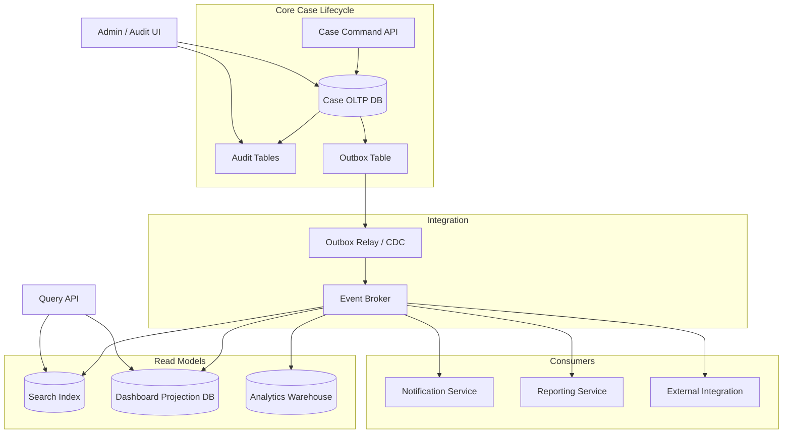

Core principle:

- DB owns canonical lifecycle state.
- Audit is written atomically with state change.
- Outbox is written atomically with state change.
- Read models are rebuildable.
- Consumers are idempotent.
- Search and dashboard are not source of truth.

## 31. Write Path Design

Example service flow:

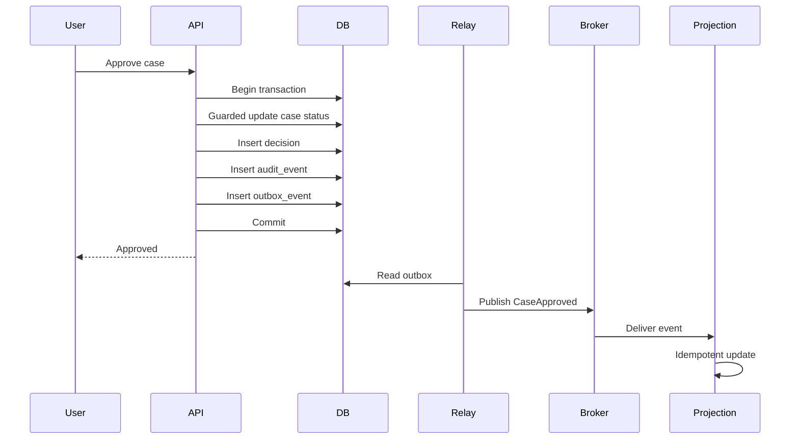

Notice: user success depends on DB commit, not broker publish.

## 32. Read Path Design

Different reads have different freshness needs.

| Read use case | Source | Freshness requirement |
|---|---|---|
| confirm approval result | primary OLTP | immediate |
| case detail audit page | OLTP + audit table | immediate/strong |
| search list | search index | eventual acceptable if marked |
| dashboard count | projection/summary | eventual acceptable |
| legal report | warehouse/snapshot | point-in-time consistency |
| workflow queue | OLTP or strongly consistent queue table | strong enough to avoid duplicate work |

Design read path per use case, not per generic repository.

## 33. Connection Pool and Backpressure

A relational database can be killed by too many connections even when CPU is not the first bottleneck.

Rules:

- use bounded pool,
- set statement timeout,
- set lock timeout for risky operations,
- separate OLTP and reporting pools,
- avoid long idle transactions,
- use bulkhead per workload,
- apply backpressure before DB collapses,
- monitor pool wait time.

Connection pool saturation is often the first visible symptom of slow query, lock wait, or DB overload.

## 34. Query Budgeting

Every query class should have a budget:

| Query class | Example | Budget |
|---|---|---|
| command write | approve case | low latency, short transaction |
| user detail read | open case page | low latency |
| workflow queue | next work item | very low latency, high concurrency |
| dashboard | backlog summary | moderate latency, bounded |
| report | monthly compliance | async/off primary |
| backfill | schema migration | chunked, throttleable |
| reconciliation | data quality check | scheduled, controlled |

Without query budget, every query competes equally. That is operationally false.

## 35. Database Observability in Architecture

Minimum signals:

- query latency by normalized query,
- rows examined/returned where available,
- lock wait,
- deadlock count,
- connection pool active/waiting,
- transaction age,
- replication lag,
- CDC lag,
- outbox backlog,
- cache hit/miss/staleness,
- migration duration,
- disk growth,
- table/index bloat,
- vacuum/analyze health where relevant.

Tie signals to user impact:

- “approval latency high because update waits on lock”,
- “dashboard stale because projection lag 8 minutes”,
- “search missing case because CDC connector stopped”,
- “database CPU high because report ran on primary”.

## 36. Data Ownership and Shared Database Trap

Multiple services writing the same tables is dangerous.

Better:

- one owner for write model,
- other services consume events or use API,
- shared read replica only for read-only/reporting with contract,
- schema changes controlled by owner,
- permissions enforce ownership.

Shared database is not always wrong, but uncontrolled shared writes create hidden coupling.

## 37. API vs Database Integration

When another system needs data, options include:

| Integration | Use when | Risk |
|---|---|---|
| Synchronous API | needs current decision/command | latency/coupling |
| Read replica access | internal reporting | schema coupling |
| CDC/event stream | downstream projection | eventual consistency |
| Batch export | periodic reporting | freshness delay |
| Shared table write | almost never | ownership violation |

For regulated data, prefer explicit contracts and auditability over convenience.

## 38. Reconciliation as Architecture Pattern

Eventual consistency needs reconciliation.

Examples:

```sql
-- Cases approved in OLTP but missing from search projection
SELECT c.case_id
FROM case_file c
LEFT JOIN case_search_projection p
  ON p.case_id = c.case_id
WHERE c.status = 'APPROVED'
  AND p.case_id IS NULL;
```

```sql
-- Outbox events not published after threshold
SELECT event_id, event_type, occurred_at, publish_attempts, last_error
FROM outbox_event
WHERE published_at IS NULL
  AND occurred_at < current_timestamp - interval '10 minutes';
```

Reconciliation jobs should be first-class, not emergency scripts.

## 39. Decision Heuristics

### Use single relational DB when:

- invariants cross several tables,
- transaction correctness matters,
- team size/system scale does not require distribution,
- query flexibility is valuable,
- operational simplicity matters.

### Add read replica when:

- reads overload primary,
- stale reads are acceptable for some paths,
- reporting needs isolation,
- failover/read scaling needs justify complexity.

### Add outbox/CDC when:

- state changes must drive external systems,
- dual write risk exists,
- read models/search/analytics need reliable updates,
- consumers can be idempotent.

### Add CQRS read model when:

- read shape is expensive on normalized OLTP,
- eventual consistency is acceptable,
- rebuild/replay is possible,
- projection lag is observable.

### Add cache when:

- data is read-heavy,
- staleness is acceptable or controlled,
- invalidation is understood,
- source of truth remains clear.

### Add sharding when:

- one primary cannot meet write/storage/isolation requirements,
- partitioning/archival/indexing is insufficient,
- cross-shard queries are manageable,
- operations team can handle it.

## 40. Anti-Patterns

### Anti-pattern: Broker as Source of Truth for Transactional State

Events are important, but canonical transactional state usually belongs in a database with constraints and recovery.

### Anti-pattern: Cache Before Index

Many systems add cache because query is slow, when the real issue is missing index or bad query shape.

### Anti-pattern: Read Replica for Strong Reads

If user must see their write immediately, route to primary or implement consistency token.

### Anti-pattern: Outbox Without Idempotent Consumer

Outbox does not guarantee exactly-once business effect. Consumer must dedupe.

### Anti-pattern: CDC Without Operational Ownership

CDC pipeline requires monitoring, schema policy, lag alert, replay plan, and disk/log retention guard.

### Anti-pattern: Sharding Before Lifecycle Partitioning

Large table can often be handled with partitioning, archival, indexing, and workload isolation before sharding.

### Anti-pattern: Analytics on Primary

A single unbounded report can degrade user-facing writes.

## 41. Architecture Review Checklist

For every SQL-backed system design, ask:

### Consistency

- What invariants must be transactionally enforced?
- Are they enforced by constraints, guarded writes, or application logic only?
- What isolation level is assumed?
- Is retry safe?

### Ownership

- Which service owns writes?
- Who can read directly?
- Are permissions aligned with ownership?
- Are schema changes controlled?

### Read Models

- Which reads require strong consistency?
- Which reads can be stale?
- Is freshness visible?
- Can read models be rebuilt?

### Integration

- Is there a dual write?
- Is outbox/CDC used?
- Are consumers idempotent?
- Is event schema versioned?

### Operations

- What are query budgets?
- What are pool limits?
- What are lock/statement timeouts?
- How is lag monitored?
- How are backups tested?
- What is the failover plan?

### Migration

- Is expand-contract used?
- Is backfill chunked and throttleable?
- Are old and new app versions compatible?
- Are CDC consumers schema-compatible?

## 42. Practice Drill: Design a Regulatory Case Platform

Design the SQL architecture for a case management platform with:

- case lifecycle,
- assignment,
- approval,
- escalation,
- SLA deadline,
- audit trail,
- external notification,
- search,
- dashboard,
- monthly compliance report.

Deliverables:

1. OLTP schema boundaries,
2. transaction boundary for case approval,
3. audit table design,
4. outbox event schema,
5. idempotent consumer/inbox schema,
6. search projection design,
7. dashboard summary design,
8. read-after-write strategy,
9. replica usage policy,
10. cache invalidation policy,
11. migration strategy,
12. observability dashboard,
13. failure-mode table.

Failure-mode table example:

| Failure | User impact | Detection | Mitigation |
|---|---|---|---|
| primary DB down | cannot approve case | health check, error rate | fail fast, pause workers, failover |
| replica lag | stale dashboard | lag metric | freshness badge, route critical reads primary |
| CDC down | search stale | CDC lag, outbox backlog | restart connector, replay, alert |
| duplicate event | duplicate notification | inbox conflict, event audit | idempotency key |
| migration fails mid-backfill | mixed data shape | migration dashboard | resume backfill, roll forward |

## 43. Key Takeaways

1. A relational database is a consistency boundary, not just storage.
2. System design starts by identifying invariants that must hold atomically.
3. Read replicas trade freshness for capacity/isolation.
4. CQRS is useful when read and write shapes diverge, but read models must be rebuildable.
5. Outbox prevents producer-side dual-write loss, but consumers must still be idempotent.
6. CDC is powerful but operationally serious: lag, schema evolution, and log retention matter.
7. Cache is safe only when staleness and invalidation are explicitly designed.
8. Sharding is a last-resort distribution strategy, not a substitute for indexing/partitioning.
9. Every SQL architecture needs observability, recovery, migration, and reconciliation plans.
10. Top-level SQL mastery means reasoning across query, transaction, schema, and distributed failure boundaries.

The next part is the capstone. We will combine the full series into an end-to-end production casebook: schema, query correctness, optimizer work, transaction anomalies, auditability, migration, observability, and final drills.
