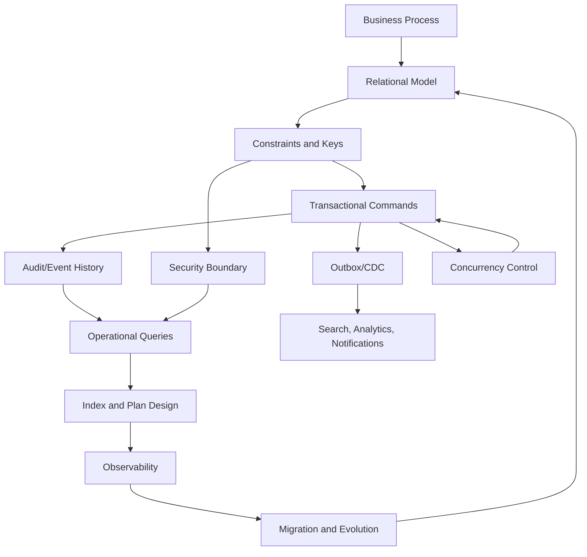
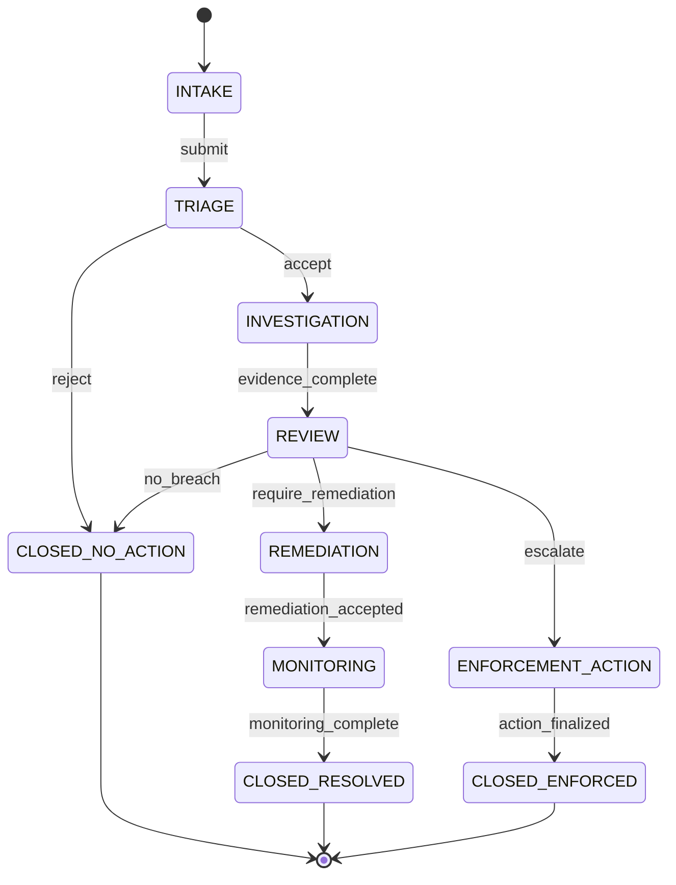
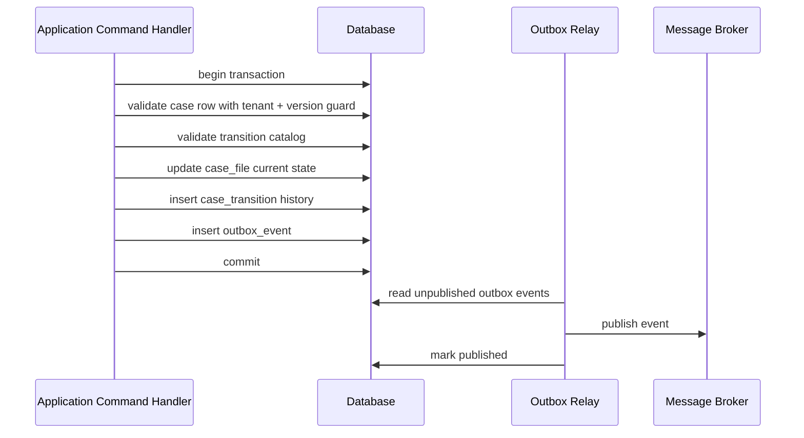
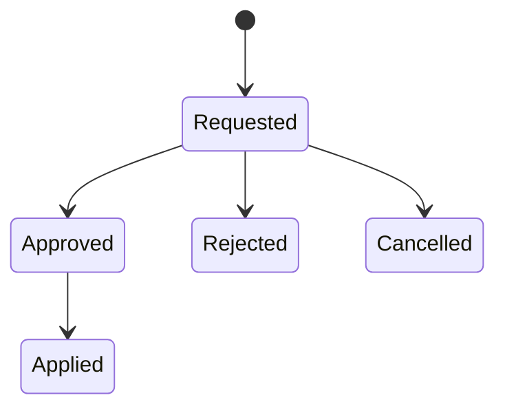
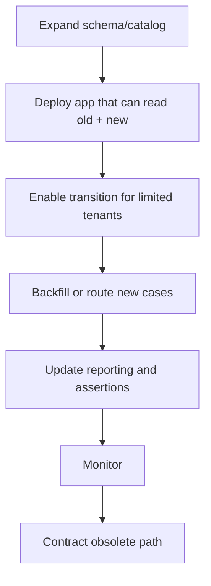

------
title: Learn SQL in Action - Part 035
description: Capstone production casebook untuk menggabungkan relational modelling, query correctness, optimizer literacy, transactions, concurrency, security, migration, analytics, observability, dan failure modelling dalam satu sistem case management.
series: learn-sql-in-action
seriesTitle: Learn SQL in Action
order: 35
partTitle: Capstone: SQL in Action Production Casebook
tags:
- sql
- database
- relational-database
- postgresql
- system-design
- concurrency
- auditability
- performance
- production-engineering
- series
date: 2026-07-01
---

# Capstone: SQL in Action Production Casebook

> Tujuan part ini bukan menambah syntax baru, tetapi menggabungkan seluruh skill sebelumnya menjadi satu cara berpikir produksi.
>
> Setelah part ini, kamu harus mampu melihat SQL bukan sebagai kumpulan query, tetapi sebagai **bahasa untuk memodelkan kebenaran, perubahan, bukti, performa, dan failure boundary** di sistem nyata.

Kita akan membangun casebook berbasis domain **regulatory case management** karena domain ini memaksa hampir semua kemampuan SQL tingkat lanjut muncul secara natural:

- lifecycle panjang;
- state transition yang harus valid;
- auditability;
- assignment dan escalation;
- approval;
- deadline dan SLA;
- dokumen/bukti;
- tenant/organization boundary;
- query operational;
- reporting;
- concurrency;
- migration;
- security;
- failure handling;
- forensic reconstruction.

Domain ini juga mirip dengan sistem enterprise serius lain:

- insurance claim;
- loan origination;
- fraud investigation;
- legal workflow;
- procurement approval;
- incident response;
- customer dispute;
- compliance remediation;
- ERP process orchestration.

Bedanya hanya istilah bisnisnya. Struktur engineering-nya sama.

---

## 1. Kaufman Closure: Dari Skill Map ke Production Fluency

Dalam kerangka *The First 20 Hours*, kita tidak mengejar semua teori database sekaligus. Kita mendekomposisi SQL menjadi sub-skill yang bisa dilatih dengan feedback cepat.

Di seri ini, sub-skill itu sudah kita bagi menjadi beberapa blok:

| Blok Skill | Yang Dilatih | Feedback Cepat |
|---|---|---|
| Relational thinking | grain, key, predicate, relation | duplicate, missing row, impossible state |
| Query correctness | filter, join, aggregate, window, set diff | expected result vs actual result |
| Optimizer literacy | index, plan, cardinality, statistics | `EXPLAIN`, latency, buffer read, row estimate |
| Transactional correctness | ACID, isolation, MVCC, lock | anomaly reproduction, deadlock, retry result |
| Modelling | normalization, workflow, temporal, JSON, partition | invariant stability, migration complexity |
| Boundary engineering | procedure, migration, security | rollback safety, privilege leak, compatibility |
| Production operation | testing, observability, system design | alert, slow query, incident postmortem |

Part ini adalah **integration drill**. Kita akan melihat satu sistem dari beberapa sudut:

1. apa kebenaran domainnya;
2. apa data shape-nya;
3. apa invariant-nya;
4. apa query operational-nya;
5. apa transaksi kritisnya;
6. apa concurrency hazard-nya;
7. apa performa query-nya;
8. apa migration strategy-nya;
9. apa security boundary-nya;
10. apa failure mode-nya.

Mental model final:



---

## 2. Case Study: Enforcement Case Management

Kita akan modelkan sistem bernama **EnforceFlow**.

Sistem ini mengelola proses enforcement dari awal laporan sampai resolution.

### 2.1 Core Workflow

Lifecycle sederhana:



Ini tampak mudah. Namun di produksi ada aturan:

- case punya tenant/organization;
- case punya owner yang berubah dari waktu ke waktu;
- state transition harus valid;
- transition harus punya reason;
- beberapa transition butuh approval;
- evidence tidak boleh hilang;
- deadline harus dihitung dari state tertentu;
- semua perubahan harus bisa diaudit;
- user tidak boleh melihat case tenant lain;
- reporting harus bisa merekonstruksi state historis;
- notification harus reliable;
- beberapa worker bisa memproses queue bersamaan;
- deployment tidak boleh menghentikan sistem.

Top 1% engineer tidak hanya bertanya:

> “Query-nya apa?”

Mereka bertanya:

> “Invariant apa yang harus tetap benar ketika query itu dijalankan bersamaan, gagal di tengah, diretry, dimigrasikan, dan diaudit dua tahun kemudian?”

---

## 3. Domain Invariants

Sebelum menulis table, tulis invariant.

### 3.1 Entity Invariants

| Entity | Invariant |
|---|---|
| `tenant` | setiap data operasional harus berada dalam tenant boundary |
| `case_file` | satu case punya satu `current_state` yang valid |
| `case_transition` | transition append-only dan harus valid dari state sebelumnya ke state berikutnya |
| `case_assignment` | maksimal satu active assignee per case pada satu waktu |
| `case_evidence` | evidence immutable secara metadata utama setelah accepted |
| `case_deadline` | maksimal satu active deadline per case per deadline type |
| `case_approval` | approval hanya boleh untuk transition yang membutuhkan approval |
| `outbox_event` | event dibuat dalam transaksi yang sama dengan state change |

### 3.2 Process Invariants

| Process | Invariant |
|---|---|
| Submit intake | hanya case di `INTAKE` yang bisa masuk `TRIAGE` |
| Accept triage | hanya case di `TRIAGE` yang bisa masuk `INVESTIGATION` |
| Close case | closed state tidak boleh ditransisi lagi kecuali ada reopen policy eksplisit |
| Reassignment | assignment lama harus ditutup sebelum assignment baru aktif |
| Approval | transition yang butuh approval tidak boleh mengubah state final sebelum approval accepted |
| Notification | state change event tidak boleh hilang meskipun broker down |
| Report | angka laporan harus bisa dijelaskan sampai row-level evidence |

### 3.3 Performance Invariants

| Query Class | Invariant Performa |
|---|---|
| Worklist | harus menggunakan index selective, tidak full scan history |
| Case detail | bounded query by `tenant_id` + `case_id` |
| SLA breach scan | partition/index aware |
| Audit timeline | append-only order by `occurred_at`, index-backed |
| Reporting | tidak mengganggu OLTP path |

---

## 4. Minimal Production Schema

Schema ini memakai gaya PostgreSQL untuk contoh. Engine lain bisa berbeda dalam syntax, tetapi mental model-nya sama.

> Catatan: capstone ini tidak memaksa semua logic ke database. Database menjaga invariant data dan atomicity. Application tetap menjalankan policy orchestration, authorization context, UI flow, dan integration.

### 4.1 Tenant and Users

```sql
create table tenant (
    tenant_id        uuid primary key,
    tenant_code      text not null unique,
    name             text not null,
    status           text not null check (status in ('ACTIVE', 'SUSPENDED', 'ARCHIVED')),
    created_at       timestamptz not null default now()
);

create table app_user (
    user_id          uuid primary key,
    tenant_id        uuid not null references tenant(tenant_id),
    email            text not null,
    display_name     text not null,
    status           text not null check (status in ('ACTIVE', 'DISABLED')),
    created_at       timestamptz not null default now(),
    unique (tenant_id, email)
);
```

Why this matters:

- `tenant_id` is not optional metadata. It is a boundary.
- `unique (tenant_id, email)` means email identity is tenant-local unless global identity is intentionally required.
- `status` is constrained because free-form status becomes impossible-state factory.

### 4.2 Case State Catalog

Use catalog tables for state and transition when the workflow is business-controlled, audited, and may evolve.

```sql
create table case_state_catalog (
    state_code       text primary key,
    state_order      integer not null unique,
    is_terminal      boolean not null,
    description      text not null
);

insert into case_state_catalog(state_code, state_order, is_terminal, description) values
('INTAKE', 10, false, 'Initial intake before triage'),
('TRIAGE', 20, false, 'Triage and jurisdiction check'),
('INVESTIGATION', 30, false, 'Evidence gathering and analysis'),
('REVIEW', 40, false, 'Formal review and decision'),
('REMEDIATION', 50, false, 'Remediation plan execution'),
('MONITORING', 60, false, 'Post-remediation monitoring'),
('ENFORCEMENT_ACTION', 70, false, 'Formal enforcement action'),
('CLOSED_NO_ACTION', 900, true, 'Closed without action'),
('CLOSED_RESOLVED', 910, true, 'Closed after remediation'),
('CLOSED_ENFORCED', 920, true, 'Closed after enforcement');
```

### 4.3 Transition Catalog

```sql
create table case_transition_catalog (
    transition_code       text primary key,
    from_state            text not null references case_state_catalog(state_code),
    to_state              text not null references case_state_catalog(state_code),
    requires_approval     boolean not null default false,
    requires_reason       boolean not null default true,
    is_active             boolean not null default true,
    unique (from_state, to_state)
);

insert into case_transition_catalog
(transition_code, from_state, to_state, requires_approval, requires_reason) values
('SUBMIT_INTAKE', 'INTAKE', 'TRIAGE', false, true),
('ACCEPT_TRIAGE', 'TRIAGE', 'INVESTIGATION', false, true),
('REJECT_TRIAGE', 'TRIAGE', 'CLOSED_NO_ACTION', true, true),
('COMPLETE_EVIDENCE', 'INVESTIGATION', 'REVIEW', false, true),
('REQUIRE_REMEDIATION', 'REVIEW', 'REMEDIATION', true, true),
('ESCALATE_ENFORCEMENT', 'REVIEW', 'ENFORCEMENT_ACTION', true, true),
('NO_BREACH', 'REVIEW', 'CLOSED_NO_ACTION', true, true),
('ACCEPT_REMEDIATION', 'REMEDIATION', 'MONITORING', false, true),
('COMPLETE_MONITORING', 'MONITORING', 'CLOSED_RESOLVED', true, true),
('FINALIZE_ACTION', 'ENFORCEMENT_ACTION', 'CLOSED_ENFORCED', true, true);
```

Important invariant:

- transition validity is data, not scattered `if` statements;
- app code can cache transition catalog but must not invent transitions;
- inactive transition supports policy deprecation without deleting history.

### 4.4 Case File

```sql
create table case_file (
    case_id              uuid primary key,
    tenant_id            uuid not null references tenant(tenant_id),
    case_number          text not null,
    title                text not null,
    case_type            text not null,
    severity             text not null check (severity in ('LOW', 'MEDIUM', 'HIGH', 'CRITICAL')),
    current_state        text not null references case_state_catalog(state_code),
    current_owner_id     uuid references app_user(user_id),
    opened_at            timestamptz not null default now(),
    closed_at            timestamptz,
    version              bigint not null default 0,
    created_by           uuid not null references app_user(user_id),
    created_at           timestamptz not null default now(),
    updated_at           timestamptz not null default now(),

    unique (tenant_id, case_number),
    check (
        (closed_at is null and current_state not like 'CLOSED_%')
        or
        (closed_at is not null and current_state like 'CLOSED_%')
    )
);
```

The `version` column is for optimistic concurrency. It is not a substitute for transaction isolation. It is a command-level guard.

### 4.5 Transition History

```sql
create table case_transition (
    transition_id       uuid primary key,
    tenant_id           uuid not null references tenant(tenant_id),
    case_id             uuid not null references case_file(case_id),
    transition_code     text not null references case_transition_catalog(transition_code),
    from_state          text not null references case_state_catalog(state_code),
    to_state            text not null references case_state_catalog(state_code),
    reason              text not null,
    actor_user_id       uuid not null references app_user(user_id),
    occurred_at         timestamptz not null default now(),
    command_id          uuid not null,
    metadata            jsonb not null default '{}'::jsonb,

    unique (tenant_id, command_id),
    foreign key (transition_code, from_state, to_state)
        references case_transition_catalog(transition_code, from_state, to_state)
);
```

This requires an additional uniqueness on the transition catalog:

```sql
alter table case_transition_catalog
add constraint uq_transition_catalog_triplet
unique (transition_code, from_state, to_state);
```

Why store both `from_state` and `to_state` in history if they are derivable from catalog?

Because history should remain understandable even when catalog labels or policy change later. You do not want an old audit event to change meaning because a catalog row was edited.

### 4.6 Assignment History

```sql
create table case_assignment (
    assignment_id        uuid primary key,
    tenant_id            uuid not null references tenant(tenant_id),
    case_id              uuid not null references case_file(case_id),
    assignee_user_id     uuid not null references app_user(user_id),
    assigned_by          uuid not null references app_user(user_id),
    assigned_at          timestamptz not null default now(),
    unassigned_at        timestamptz,
    assignment_reason    text not null,
    check (unassigned_at is null or unassigned_at > assigned_at)
);

create unique index uq_active_assignment_per_case
on case_assignment(tenant_id, case_id)
where unassigned_at is null;
```

This is a classic production pattern:

- history table stores all assignments;
- partial unique index enforces only one active assignment;
- current denormalization in `case_file.current_owner_id` supports worklist speed;
- reconciliation query detects drift.

### 4.7 Evidence

```sql
create table case_evidence (
    evidence_id          uuid primary key,
    tenant_id            uuid not null references tenant(tenant_id),
    case_id              uuid not null references case_file(case_id),
    evidence_type        text not null,
    storage_uri          text not null,
    content_hash         text not null,
    status               text not null check (status in ('UPLOADED', 'ACCEPTED', 'REJECTED', 'REDACTED')),
    submitted_by         uuid not null references app_user(user_id),
    submitted_at         timestamptz not null default now(),
    accepted_by          uuid references app_user(user_id),
    accepted_at          timestamptz,
    metadata             jsonb not null default '{}'::jsonb,

    unique (tenant_id, content_hash),
    check (
        (status = 'ACCEPTED' and accepted_by is not null and accepted_at is not null)
        or
        (status <> 'ACCEPTED')
    )
);
```

Evidence is intentionally hybrid:

- relational columns for invariant and query dimensions;
- `metadata` for evidence-specific optional properties;
- `content_hash` for deduplication and tamper detection;
- file bytes are outside database, but metadata is inside transactional model.

### 4.8 Deadlines

```sql
create table case_deadline (
    deadline_id          uuid primary key,
    tenant_id            uuid not null references tenant(tenant_id),
    case_id              uuid not null references case_file(case_id),
    deadline_type        text not null,
    due_at               timestamptz not null,
    status               text not null check (status in ('ACTIVE', 'MET', 'MISSED', 'CANCELLED')),
    created_at           timestamptz not null default now(),
    resolved_at          timestamptz,
    check (resolved_at is null or resolved_at >= created_at)
);

create unique index uq_active_deadline_per_case_type
on case_deadline(tenant_id, case_id, deadline_type)
where status = 'ACTIVE';
```

### 4.9 Approvals

```sql
create table case_approval (
    approval_id          uuid primary key,
    tenant_id            uuid not null references tenant(tenant_id),
    case_id              uuid not null references case_file(case_id),
    transition_code      text not null references case_transition_catalog(transition_code),
    requested_by         uuid not null references app_user(user_id),
    requested_at         timestamptz not null default now(),
    decided_by           uuid references app_user(user_id),
    decided_at           timestamptz,
    decision             text not null check (decision in ('PENDING', 'APPROVED', 'REJECTED', 'CANCELLED')),
    reason               text,
    command_id           uuid not null,

    unique (tenant_id, command_id),
    check (
        (decision = 'PENDING' and decided_by is null and decided_at is null)
        or
        (decision <> 'PENDING' and decided_by is not null and decided_at is not null)
    )
);

create unique index uq_pending_approval_per_case_transition
on case_approval(tenant_id, case_id, transition_code)
where decision = 'PENDING';
```

### 4.10 Outbox

```sql
create table outbox_event (
    outbox_id          uuid primary key,
    tenant_id          uuid not null references tenant(tenant_id),
    aggregate_type     text not null,
    aggregate_id       uuid not null,
    event_type         text not null,
    event_version      integer not null,
    payload            jsonb not null,
    created_at         timestamptz not null default now(),
    published_at       timestamptz,
    attempts           integer not null default 0,
    last_error         text,
    command_id         uuid not null,

    unique (tenant_id, command_id, event_type)
);

create index idx_outbox_unpublished
on outbox_event(created_at, outbox_id)
where published_at is null;
```

Outbox exists because distributed systems punish dual-write shortcuts.

Bad design:

```text
1. update case state in database
2. publish event to broker
```

If step 2 fails after step 1 commits, external consumers never learn the state changed.

Better design:

```text
1. update case state
2. insert outbox event
3. commit both together
4. relay publishes outbox later
```

---

## 5. Capstone Command: Transition Case State

This is the heart of the system.

Input:

- `tenant_id`
- `case_id`
- `transition_code`
- `actor_user_id`
- `reason`
- `command_id`
- expected `version`

Output:

- state changed exactly once;
- transition history appended;
- outbox event inserted;
- version incremented;
- invalid transitions rejected;
- duplicate command safely ignored or returned idempotently.

### 5.1 Naive Implementation

```sql
update case_file
set current_state = 'INVESTIGATION'
where case_id = :case_id;
```

This is not production code.

It misses:

- tenant boundary;
- transition validity;
- actor authorization;
- current state guard;
- optimistic version;
- terminal state protection;
- audit history;
- outbox event;
- idempotency;
- concurrency behavior;
- approval policy;
- timestamps;
- diagnostics.

### 5.2 Production-Grade Transaction Shape



### 5.3 SQL Implementation Pattern

```sql
begin;

with target_case as (
    select
        c.case_id,
        c.tenant_id,
        c.current_state,
        c.version,
        s.is_terminal
    from case_file c
    join case_state_catalog s
      on s.state_code = c.current_state
    where c.tenant_id = :tenant_id
      and c.case_id = :case_id
    for update
), valid_transition as (
    select
        tc.case_id,
        tc.tenant_id,
        tc.current_state as from_state,
        t.to_state,
        t.transition_code,
        t.requires_approval
    from target_case tc
    join case_transition_catalog t
      on t.from_state = tc.current_state
     and t.transition_code = :transition_code
     and t.is_active = true
    where tc.is_terminal = false
      and tc.version = :expected_version
), updated_case as (
    update case_file c
    set current_state = vt.to_state,
        closed_at = case when vt.to_state like 'CLOSED_%' then now() else c.closed_at end,
        version = c.version + 1,
        updated_at = now()
    from valid_transition vt
    where c.tenant_id = vt.tenant_id
      and c.case_id = vt.case_id
      and vt.requires_approval = false
    returning
        c.case_id,
        c.tenant_id,
        vt.transition_code,
        vt.from_state,
        c.current_state as to_state,
        c.version
), inserted_transition as (
    insert into case_transition(
        transition_id,
        tenant_id,
        case_id,
        transition_code,
        from_state,
        to_state,
        reason,
        actor_user_id,
        command_id,
        metadata
    )
    select
        gen_random_uuid(),
        uc.tenant_id,
        uc.case_id,
        uc.transition_code,
        uc.from_state,
        uc.to_state,
        :reason,
        :actor_user_id,
        :command_id,
        jsonb_build_object('new_version', uc.version)
    from updated_case uc
    on conflict (tenant_id, command_id) do nothing
    returning transition_id, tenant_id, case_id, transition_code, from_state, to_state
), inserted_outbox as (
    insert into outbox_event(
        outbox_id,
        tenant_id,
        aggregate_type,
        aggregate_id,
        event_type,
        event_version,
        payload,
        command_id
    )
    select
        gen_random_uuid(),
        it.tenant_id,
        'case_file',
        it.case_id,
        'CaseStateChanged',
        1,
        jsonb_build_object(
            'case_id', it.case_id,
            'transition_code', it.transition_code,
            'from_state', it.from_state,
            'to_state', it.to_state,
            'actor_user_id', :actor_user_id,
            'reason', :reason
        ),
        :command_id
    from inserted_transition it
    on conflict (tenant_id, command_id, event_type) do nothing
    returning outbox_id
)
select
    (select count(*) from updated_case) as updated_count,
    (select count(*) from inserted_transition) as transition_count,
    (select count(*) from inserted_outbox) as outbox_count;

commit;
```

### 5.4 What This Protects

| Failure | Protection |
|---|---|
| concurrent transition | `for update` locks target row |
| stale client view | `version = :expected_version` guard |
| invalid transition | join to `case_transition_catalog` |
| terminal transition | `is_terminal = false` guard |
| event loss | outbox inserted in same transaction |
| duplicate command | `command_id` unique constraints |
| cross-tenant update | `tenant_id` in every predicate |
| audit gap | `case_transition` insert in same transaction |

### 5.5 What This Does Not Yet Protect

Be honest about limitations:

- app authorization is not shown;
- RLS policy is not shown in this command;
- approval-required transitions are rejected but not routed to approval flow;
- external publication is asynchronous;
- outbox relay can publish duplicate messages unless consumer is idempotent;
- `gen_random_uuid()` availability depends on PostgreSQL extension/setup;
- `like 'CLOSED_%'` is convenient but a catalog lookup is cleaner.

Production maturity means knowing exactly what your SQL does **and does not** guarantee.

---

## 6. Approval Flow

Approval is not just another state transition. It is a two-phase domain decision.

### 6.1 Wrong Model

```sql
update case_file
set current_state = 'ENFORCEMENT_ACTION'
where case_id = :case_id;
```

This collapses:

- request;
- review;
- decision;
- state change;
- audit event;
- authorization;
- justification.

### 6.2 Better Model



Approval request is its own entity.

Only an approved request can drive final transition.

### 6.3 Request Approval

```sql
insert into case_approval(
    approval_id,
    tenant_id,
    case_id,
    transition_code,
    requested_by,
    decision,
    reason,
    command_id
)
select
    gen_random_uuid(),
    c.tenant_id,
    c.case_id,
    t.transition_code,
    :requested_by,
    'PENDING',
    :reason,
    :command_id
from case_file c
join case_transition_catalog t
  on t.from_state = c.current_state
 and t.transition_code = :transition_code
where c.tenant_id = :tenant_id
  and c.case_id = :case_id
  and t.requires_approval = true
  and t.is_active = true
on conflict (tenant_id, command_id) do nothing;
```

### 6.4 Decide Approval

```sql
begin;

with decided as (
    update case_approval a
    set decision = :decision,
        decided_by = :decided_by,
        decided_at = now(),
        reason = coalesce(:decision_reason, a.reason)
    where a.tenant_id = :tenant_id
      and a.approval_id = :approval_id
      and a.decision = 'PENDING'
    returning *
), outbox as (
    insert into outbox_event(
        outbox_id,
        tenant_id,
        aggregate_type,
        aggregate_id,
        event_type,
        event_version,
        payload,
        command_id
    )
    select
        gen_random_uuid(),
        d.tenant_id,
        'case_approval',
        d.approval_id,
        'CaseApprovalDecided',
        1,
        jsonb_build_object(
            'approval_id', d.approval_id,
            'case_id', d.case_id,
            'transition_code', d.transition_code,
            'decision', d.decision,
            'decided_by', d.decided_by
        ),
        :command_id
    from decided d
    on conflict (tenant_id, command_id, event_type) do nothing
)
select count(*) from decided;

commit;
```

### 6.5 Apply Approved Transition

Do not apply transition simply because approval exists. Guard it:

- approval is `APPROVED`;
- approval belongs to same tenant and case;
- case still in expected source state;
- transition is still active or policy explicitly allows old approvals;
- approval not already applied;
- command is idempotent.

This is where many systems fail: they approve a future action, but by the time approval arrives, the case has moved elsewhere.

---

## 7. Worklist Queries

A worklist query powers daily operations. It must be correct, fast, and stable.

### 7.1 Investigator Worklist

```sql
select
    c.case_id,
    c.case_number,
    c.title,
    c.severity,
    c.current_state,
    d.due_at,
    c.updated_at
from case_file c
left join case_deadline d
  on d.tenant_id = c.tenant_id
 and d.case_id = c.case_id
 and d.deadline_type = 'INVESTIGATION_DUE'
 and d.status = 'ACTIVE'
where c.tenant_id = :tenant_id
  and c.current_owner_id = :user_id
  and c.current_state in ('INVESTIGATION', 'REVIEW')
order by
    d.due_at nulls last,
    case c.severity
        when 'CRITICAL' then 1
        when 'HIGH' then 2
        when 'MEDIUM' then 3
        else 4
    end,
    c.updated_at desc,
    c.case_id
fetch first 50 rows only;
```

### 7.2 Worklist Index

```sql
create index idx_case_worklist_owner_state
on case_file(
    tenant_id,
    current_owner_id,
    current_state,
    updated_at desc,
    case_id
)
where current_state in ('INVESTIGATION', 'REVIEW');

create index idx_active_deadline_case_type
on case_deadline(tenant_id, case_id, deadline_type, due_at)
where status = 'ACTIVE';
```

### 7.3 Correctness Traps

| Trap | Example | Fix |
|---|---|---|
| left join becomes inner join | deadline filter in `where` | put active deadline predicate in `on` |
| unstable pagination | order by non-unique column only | include `case_id` tie-breaker |
| tenant leak | missing `tenant_id` on join | tenant-aware join predicate |
| index ignored | function on indexed column | precompute or expression index |
| duplicate worklist row | multiple active deadlines | partial unique index |

---

## 8. Audit Timeline Query

Case detail screens often need a timeline.

```sql
select
    event_type,
    occurred_at,
    actor_user_id,
    summary,
    payload
from (
    select
        'STATE_TRANSITION' as event_type,
        t.occurred_at,
        t.actor_user_id,
        t.from_state || ' -> ' || t.to_state as summary,
        jsonb_build_object(
            'transition_code', t.transition_code,
            'reason', t.reason
        ) as payload
    from case_transition t
    where t.tenant_id = :tenant_id
      and t.case_id = :case_id

    union all

    select
        'EVIDENCE_SUBMITTED' as event_type,
        e.submitted_at as occurred_at,
        e.submitted_by as actor_user_id,
        e.evidence_type || ' evidence submitted' as summary,
        jsonb_build_object(
            'evidence_id', e.evidence_id,
            'status', e.status,
            'content_hash', e.content_hash
        ) as payload
    from case_evidence e
    where e.tenant_id = :tenant_id
      and e.case_id = :case_id

    union all

    select
        'ASSIGNMENT' as event_type,
        a.assigned_at as occurred_at,
        a.assigned_by as actor_user_id,
        'Assigned to user' as summary,
        jsonb_build_object(
            'assignee_user_id', a.assignee_user_id,
            'unassigned_at', a.unassigned_at,
            'reason', a.assignment_reason
        ) as payload
    from case_assignment a
    where a.tenant_id = :tenant_id
      and a.case_id = :case_id
) timeline
order by occurred_at, event_type;
```

Indexes:

```sql
create index idx_transition_timeline
on case_transition(tenant_id, case_id, occurred_at, transition_id);

create index idx_evidence_timeline
on case_evidence(tenant_id, case_id, submitted_at, evidence_id);

create index idx_assignment_timeline
on case_assignment(tenant_id, case_id, assigned_at, assignment_id);
```

Why `union all`?

Because timeline wants all events. `union` would deduplicate and introduce unnecessary sort/hash work.

---

## 9. SLA Breach Detection

### 9.1 Active Breach Query

```sql
select
    c.tenant_id,
    c.case_id,
    c.case_number,
    c.current_state,
    c.current_owner_id,
    d.deadline_type,
    d.due_at
from case_deadline d
join case_file c
  on c.tenant_id = d.tenant_id
 and c.case_id = d.case_id
where d.status = 'ACTIVE'
  and d.due_at < now()
  and c.current_state not like 'CLOSED_%'
order by d.due_at, c.case_id;
```

Index:

```sql
create index idx_deadline_active_due
on case_deadline(status, due_at, tenant_id, case_id)
where status = 'ACTIVE';
```

Depending on engine and data distribution, this might be better as:

```sql
create index idx_deadline_active_due_tenant
on case_deadline(due_at, tenant_id, case_id)
where status = 'ACTIVE';
```

Reasoning:

- if the partial index already only contains active rows, leading with `status` can be redundant;
- if queries always include tenant, use `(tenant_id, due_at, case_id)`;
- if global scheduler scans all tenants, use `(due_at, tenant_id, case_id)`.

### 9.2 Mark Missed Idempotently

```sql
update case_deadline
set status = 'MISSED',
    resolved_at = now()
where status = 'ACTIVE'
  and due_at < now()
returning tenant_id, case_id, deadline_type, due_at;
```

In production, this command should likely:

- run in chunks;
- produce outbox events;
- avoid long transactions;
- include `order by` via CTE if limiting;
- be idempotent;
- be monitored.

```sql
with overdue as (
    select deadline_id
    from case_deadline
    where status = 'ACTIVE'
      and due_at < now()
    order by due_at, deadline_id
    for update skip locked
    limit 500
), updated as (
    update case_deadline d
    set status = 'MISSED',
        resolved_at = now()
    from overdue o
    where d.deadline_id = o.deadline_id
    returning d.*
)
select count(*) from updated;
```

---

## 10. Concurrency Drills

Top-tier SQL skill includes the ability to **reproduce** anomalies, not just name them.

### 10.1 Lost Update Drill

Session A:

```sql
begin;
select version, current_state
from case_file
where tenant_id = :tenant_id and case_id = :case_id;
```

Session B:

```sql
begin;
select version, current_state
from case_file
where tenant_id = :tenant_id and case_id = :case_id;

update case_file
set current_state = 'INVESTIGATION', version = version + 1
where tenant_id = :tenant_id
  and case_id = :case_id;

commit;
```

Session A:

```sql
update case_file
set current_state = 'CLOSED_NO_ACTION', version = version + 1
where tenant_id = :tenant_id
  and case_id = :case_id;

commit;
```

If both succeed, you have a lost update or invalid transition risk.

Fix:

```sql
update case_file
set current_state = :to_state,
    version = version + 1
where tenant_id = :tenant_id
  and case_id = :case_id
  and version = :expected_version
  and current_state = :expected_from_state;
```

Then assert affected row count is exactly one.

### 10.2 Write Skew Drill

Invariant:

> At least one reviewer must remain assigned to a critical case.

Bad design:

```sql
select count(*)
from case_assignment
where case_id = :case_id
  and role = 'REVIEWER'
  and unassigned_at is null;

-- if count > 1, unassign self
```

Two reviewers concurrently see count = 2, both unassign, invariant broken.

Fix options:

1. lock parent case row as invariant guard;
2. use serializable isolation and retry;
3. model active reviewer count with constrained parent row;
4. use exclusion/partial unique constraints when invariant shape allows;
5. move decision through a single command queue.

### 10.3 Deadlock Drill

Session A:

```sql
begin;
update case_file set updated_at = now() where case_id = :case_1;
update case_file set updated_at = now() where case_id = :case_2;
commit;
```

Session B:

```sql
begin;
update case_file set updated_at = now() where case_id = :case_2;
update case_file set updated_at = now() where case_id = :case_1;
commit;
```

Potential deadlock.

Fix:

- acquire locks in deterministic order;
- keep transactions short;
- avoid interactive transactions;
- retry deadlock-safe commands;
- observe lock wait graph.

```sql
select case_id
from case_file
where case_id in (:case_1, :case_2)
order by case_id
for update;
```

---

## 11. Query Plan Casebook

### 11.1 Slow Worklist Symptom

Query:

```sql
select *
from case_file
where tenant_id = :tenant_id
  and current_owner_id = :user_id
  and lower(current_state) = 'investigation'
order by updated_at desc
limit 50;
```

Problem:

- function on column may prevent normal index matching;
- `select *` may increase heap access;
- ordering needs index support;
- if `tenant_id` omitted from index, cross-tenant scan may happen.

Fix:

```sql
select
    case_id,
    case_number,
    title,
    severity,
    current_state,
    updated_at
from case_file
where tenant_id = :tenant_id
  and current_owner_id = :user_id
  and current_state = 'INVESTIGATION'
order by updated_at desc, case_id
limit 50;
```

Index:

```sql
create index idx_case_worklist_investigation
on case_file(tenant_id, current_owner_id, updated_at desc, case_id)
where current_state = 'INVESTIGATION';
```

### 11.2 Plan Review Checklist

When reading `EXPLAIN`, ask:

| Question | Why It Matters |
|---|---|
| Is row estimate close to actual rows? | bad estimates cause bad join strategy |
| Is the access path expected? | full scan may be okay or disastrous depending on cardinality |
| Is sort spilling? | memory/work_mem/tempdb issue |
| Is nested loop multiplying unexpectedly? | join fan-out or missing index |
| Are predicates index conditions or residual filters? | residual filters reduce benefit of index |
| Are buffers mostly read or hit? | cold cache vs logical inefficiency |
| Is plan stable across tenants? | skew/parameter-sensitive plan risk |

### 11.3 Optimization Rule

Never optimize only from SQL text.

Optimization needs:

1. query text;
2. parameter values;
3. row counts;
4. indexes;
5. constraints;
6. statistics freshness;
7. execution plan;
8. actual runtime metrics;
9. concurrency context;
10. workload priority.

---

## 12. Data Quality Assertions

### 12.1 No Case Without Initial Transition

```sql
select c.case_id
from case_file c
left join case_transition t
  on t.tenant_id = c.tenant_id
 and t.case_id = c.case_id
 and t.from_state = 'INTAKE'
where c.created_at < now() - interval '5 minutes'
  and t.transition_id is null;
```

This query returns failure rows.

### 12.2 Current State Matches Latest Transition

```sql
with latest_transition as (
    select distinct on (tenant_id, case_id)
        tenant_id,
        case_id,
        to_state,
        occurred_at
    from case_transition
    order by tenant_id, case_id, occurred_at desc, transition_id desc
)
select
    c.tenant_id,
    c.case_id,
    c.current_state,
    lt.to_state as latest_transition_state
from case_file c
join latest_transition lt
  on lt.tenant_id = c.tenant_id
 and lt.case_id = c.case_id
where c.current_state <> lt.to_state;
```

### 12.3 Active Assignment Drift

```sql
select
    c.tenant_id,
    c.case_id,
    c.current_owner_id,
    a.assignee_user_id as active_assignment_user_id
from case_file c
left join case_assignment a
  on a.tenant_id = c.tenant_id
 and a.case_id = c.case_id
 and a.unassigned_at is null
where c.current_owner_id is distinct from a.assignee_user_id;
```

### 12.4 Duplicate Active Deadlines

Should be prevented by partial unique index, but still useful as assertion if legacy data exists:

```sql
select tenant_id, case_id, deadline_type, count(*) as active_count
from case_deadline
where status = 'ACTIVE'
group by tenant_id, case_id, deadline_type
having count(*) > 1;
```

### 12.5 Assertion Severity

| Severity | Meaning | Action |
|---|---|---|
| P0 | data integrity broken, user/legal impact likely | stop writes or hotfix |
| P1 | invariant broken, contained blast radius | repair and root cause |
| P2 | metric/reporting inconsistency | correct pipeline/report |
| P3 | hygiene issue | scheduled cleanup |

---

## 13. Migration Casebook

### 13.1 Requirement

Add a new state:

```text
LEGAL_REVIEW
```

It sits between `REVIEW` and `ENFORCEMENT_ACTION` for high severity cases.

### 13.2 Bad Migration

```sql
alter table case_file
add constraint chk_state
check (current_state in (..., 'LEGAL_REVIEW'));

update application immediately;
```

Problems:

- app version skew;
- old workers may not understand new state;
- reports may exclude new state;
- transition catalog incomplete;
- queue routing missing;
- dashboard broken;
- rollback unclear.

### 13.3 Expand-Contract Plan



### 13.4 Migration Steps

Step 1: add state.

```sql
insert into case_state_catalog(state_code, state_order, is_terminal, description)
values ('LEGAL_REVIEW', 65, false, 'Legal review before enforcement action');
```

Step 2: add transitions inactive first.

```sql
insert into case_transition_catalog
(transition_code, from_state, to_state, requires_approval, requires_reason, is_active)
values
('SEND_TO_LEGAL_REVIEW', 'REVIEW', 'LEGAL_REVIEW', true, true, false),
('LEGAL_APPROVE_ENFORCEMENT', 'LEGAL_REVIEW', 'ENFORCEMENT_ACTION', true, true, false),
('LEGAL_NO_ACTION', 'LEGAL_REVIEW', 'CLOSED_NO_ACTION', true, true, false);
```

Step 3: deploy app that knows `LEGAL_REVIEW` but does not route to it yet.

Step 4: update reports.

```sql
-- Example report grouping should not silently bucket unknown states.
select current_state, count(*)
from case_file
group by current_state
order by current_state;
```

Step 5: enable transition.

```sql
update case_transition_catalog
set is_active = true
where transition_code in (
    'SEND_TO_LEGAL_REVIEW',
    'LEGAL_APPROVE_ENFORCEMENT',
    'LEGAL_NO_ACTION'
);
```

Step 6: add assertions.

```sql
select case_id
from case_file
where current_state = 'LEGAL_REVIEW'
  and severity not in ('HIGH', 'CRITICAL');
```

### 13.5 Rollback Strategy

Rollback does not mean deleting the state if rows already use it.

Safe rollback options:

- disable new transitions;
- leave state readable;
- manually drain cases from `LEGAL_REVIEW` through approved remediation path;
- patch application routing;
- preserve audit history.

Never erase audit facts just to make rollback look clean.

---

## 14. Security Casebook

### 14.1 Tenant Predicate Discipline

Every operational query must include tenant boundary:

```sql
where tenant_id = :tenant_id
```

But discipline alone is insufficient. Add defense layers.

### 14.2 Row-Level Security Sketch

```sql
alter table case_file enable row level security;

create policy tenant_case_isolation
on case_file
using (tenant_id = current_setting('app.tenant_id')::uuid);
```

Then application sets context per transaction:

```sql
begin;
select set_config('app.tenant_id', :tenant_id::text, true);
-- tenant-scoped queries
commit;
```

Cautions:

- pool reuse must reset context;
- superuser/bypass roles must be restricted;
- background jobs need explicit tenant context or separate policy;
- tests must verify denial, not just allowed path.

### 14.3 SQL Injection Boundary

Good:

```sql
select *
from case_file
where tenant_id = $1
  and case_number = $2;
```

Bad:

```text
"select * from case_file where case_number = '" + input + "'"
```

Dynamic order by must use allowlist:

```text
allowed_sort = {
  "updatedAt": "updated_at",
  "severity": "severity",
  "dueAt": "due_at"
}
```

Do not parameterize identifiers as if they are values. Values use bind parameters; identifiers use strict allowlists.

---

## 15. Outbox Relay Casebook

### 15.1 Polling Relay

```sql
with next_events as (
    select outbox_id
    from outbox_event
    where published_at is null
    order by created_at, outbox_id
    for update skip locked
    limit 100
)
select o.*
from outbox_event o
join next_events n
  on n.outbox_id = o.outbox_id;
```

After publish:

```sql
update outbox_event
set published_at = now(),
    attempts = attempts + 1,
    last_error = null
where outbox_id = any(:published_outbox_ids);
```

On failure:

```sql
update outbox_event
set attempts = attempts + 1,
    last_error = :error
where outbox_id = :outbox_id;
```

### 15.2 Relay Failure Modes

| Failure | Expected Behavior |
|---|---|
| DB commit succeeds, broker down | event remains unpublished |
| broker publish succeeds, mark-published fails | event may be republished |
| relay crashes mid-batch | locked rows released, another relay retries |
| duplicate event delivered | consumer idempotency handles it |
| poison event | attempts/last_error expose it |

### 15.3 Consumer Idempotency

```sql
create table consumed_event (
    consumer_name       text not null,
    event_id            uuid not null,
    consumed_at         timestamptz not null default now(),
    primary key (consumer_name, event_id)
);
```

Consumer transaction:

```sql
begin;

insert into consumed_event(consumer_name, event_id)
values (:consumer_name, :event_id)
on conflict do nothing;

-- If row inserted, apply side effect.
-- If conflict, skip.

commit;
```

Exactly-once delivery is rarely the practical contract. The practical contract is usually:

> at-least-once delivery plus idempotent consumers plus observable retries.

---

## 16. Analytics Casebook

### 16.1 Case Throughput by Week

```sql
select
    date_trunc('week', opened_at) as week_start,
    count(*) as opened_cases,
    count(*) filter (where current_state like 'CLOSED_%') as currently_closed_cases
from case_file
where tenant_id = :tenant_id
  and opened_at >= :from_date
  and opened_at < :to_date
group by 1
order by 1;
```

Caution: `currently_closed_cases` is not “closed within week.” It is cases opened in week that are currently closed.

Correct closure throughput:

```sql
select
    date_trunc('week', closed_at) as week_start,
    count(*) as closed_cases
from case_file
where tenant_id = :tenant_id
  and closed_at >= :from_date
  and closed_at < :to_date
group by 1
order by 1;
```

### 16.2 Time in State

```sql
with ordered as (
    select
        tenant_id,
        case_id,
        from_state,
        to_state,
        occurred_at,
        lead(occurred_at) over (
            partition by tenant_id, case_id
            order by occurred_at, transition_id
        ) as next_occurred_at
    from case_transition
    where tenant_id = :tenant_id
), state_spans as (
    select
        case_id,
        to_state as state_code,
        occurred_at as entered_at,
        coalesce(next_occurred_at, now()) as exited_at
    from ordered
)
select
    state_code,
    percentile_cont(0.5) within group (order by exited_at - entered_at) as p50_duration,
    percentile_cont(0.95) within group (order by exited_at - entered_at) as p95_duration
from state_spans
group by state_code
order by state_code;
```

### 16.3 Funnel Conversion

```sql
with case_flags as (
    select
        tenant_id,
        case_id,
        bool_or(to_state = 'TRIAGE') as reached_triage,
        bool_or(to_state = 'INVESTIGATION') as reached_investigation,
        bool_or(to_state = 'REVIEW') as reached_review,
        bool_or(to_state in ('CLOSED_RESOLVED', 'CLOSED_ENFORCED')) as reached_positive_closure
    from case_transition
    where tenant_id = :tenant_id
      and occurred_at >= :from_date
      and occurred_at < :to_date
    group by tenant_id, case_id
)
select
    count(*) as total_cases,
    count(*) filter (where reached_triage) as triage,
    count(*) filter (where reached_investigation) as investigation,
    count(*) filter (where reached_review) as review,
    count(*) filter (where reached_positive_closure) as positive_closure
from case_flags;
```

Analytics rule:

> Always state the denominator.

---

## 17. Observability Casebook

### 17.1 Operational Metrics

| Metric | Why It Matters |
|---|---|
| p95/p99 worklist query latency | user-facing productivity |
| lock wait duration | contention symptom |
| deadlock count | transaction order/design smell |
| outbox unpublished age | integration lag |
| active connection count | pool pressure |
| slow query count by fingerprint | regression detection |
| rows scanned per row returned | index/query shape smell |
| autovacuum/vacuum lag | bloat and table health |
| replication lag | stale read risk |
| failed assertion count | data correctness risk |

### 17.2 Incident Runbook: Worklist Is Slow

1. Identify query fingerprint.
2. Check plan with representative parameters.
3. Compare actual vs estimated rows.
4. Check index usage.
5. Check tenant skew.
6. Check lock waits.
7. Check recent migrations.
8. Check statistics freshness.
9. Check connection pool saturation.
10. Apply bounded mitigation.

Bounded mitigations:

- add targeted index concurrently where supported;
- temporarily reduce result set;
- disable expensive optional join;
- route analytics away from primary;
- refresh statistics;
- kill pathological query only when safe;
- roll forward bad migration.

### 17.3 Incident Runbook: Outbox Lag

1. Check unpublished event count and oldest age.
2. Check relay worker health.
3. Check broker availability.
4. Check poison events.
5. Check DB locks on outbox table.
6. Scale relay only if bottleneck is not DB lock/contention.
7. Verify consumer idempotency before replay.

```sql
select
    count(*) as unpublished_count,
    min(created_at) as oldest_unpublished_at,
    now() - min(created_at) as oldest_age
from outbox_event
where published_at is null;
```

---

## 18. Failure Mode Matrix

| Area | Failure | Detection | Prevention/Mitigation |
|---|---|---|---|
| Query correctness | duplicate rows from join fan-out | count by key, diff query | grain discipline, unique constraints |
| Predicate | `NOT IN` + NULL misses rows | test with NULL fixtures | prefer `NOT EXISTS` |
| Aggregation | wrong denominator | metric assertion | define grain and denominator |
| Index | full scan on hot path | plan regression alert | targeted index, sargable predicate |
| Stats | bad cardinality estimate | actual vs estimated row gap | analyze, extended stats, query rewrite |
| Transaction | lost update | concurrent test | version guard, row lock |
| Isolation | write skew | anomaly drill | serializable/retry, parent lock |
| Deadlock | inconsistent lock order | deadlock log | deterministic ordering |
| Migration | app version skew | canary/rollback metric | expand-contract |
| Security | tenant leak | denial test, audit | RLS, tenant predicate, least privilege |
| Outbox | event loss | outbox age, reconciliation | transactional outbox |
| Consumer | duplicate side effect | duplicate event test | idempotency table |
| Audit | missing transition history | assertion query | same transaction insert |
| Reporting | current truth vs historical truth confused | report review | temporal model |

---

## 19. Final Design Review Checklist

Use this before approving a SQL-backed feature.

### 19.1 Relational Model

- What is the grain of each table?
- What is the primary key?
- What are natural uniqueness constraints?
- Which columns are nullable and why?
- Which states are constrained?
- Which relationships are mandatory?
- What history is append-only?
- What data is current-state cache?
- What is derived and how is it reconciled?

### 19.2 Query Correctness

- Does every join preserve expected grain?
- Are outer join predicates placed correctly?
- Are NULL cases tested?
- Is `count(*)` vs `count(column)` intentional?
- Is `distinct` hiding a modelling bug?
- Is pagination deterministic?
- Is every metric denominator explicit?

### 19.3 Performance

- What are hot queries?
- What are expected cardinalities?
- Which indexes support each access path?
- Are predicates sargable?
- Does sort require memory/disk?
- Does plan work for large tenants?
- Are statistics sufficient?
- Is analytics isolated from OLTP?

### 19.4 Transactions and Concurrency

- What is the unit of work?
- What rows are locked?
- What invariant is protected?
- What happens on retry?
- Is command idempotent?
- Could two sessions break an invariant?
- Are deadlock orders deterministic?
- Are external side effects outside DB transaction handled by outbox?

### 19.5 Migration

- Is migration expand-contract?
- Can old and new app versions coexist?
- Is backfill chunked?
- Is rollback actually possible?
- Are reports updated?
- Are assertions added before or with the migration?
- Are indexes created safely for large tables?

### 19.6 Security

- Are privileges least-privilege?
- Is tenant isolation enforced defensively?
- Are prepared statements used?
- Is dynamic SQL allowlisted?
- Are sensitive columns masked or restricted?
- Are audit logs tamper-resistant?
- Are break-glass accesses visible?

### 19.7 Observability

- What query metrics matter?
- What lock/deadlock metrics matter?
- What outbox lag threshold matters?
- What data assertion failures are alert-worthy?
- What dashboards distinguish symptom from cause?
- What runbook exists for top failure modes?

---

## 20. Final Practice Program

This is the final Kaufman-style deliberate practice block.

### 20.1 Hour 1-2: Build Schema

Create the core schema:

- tenant;
- user;
- state catalog;
- transition catalog;
- case file;
- transition history;
- assignment;
- deadline;
- evidence;
- approval;
- outbox.

Validate constraints by intentionally inserting invalid rows.

### 20.2 Hour 3-4: Implement Commands

Implement:

- create case;
- assign case;
- transition case;
- request approval;
- decide approval;
- apply approved transition;
- upload evidence;
- mark deadline missed.

Every command must be idempotent.

### 20.3 Hour 5-6: Write Operational Queries

Build:

- investigator worklist;
- manager queue;
- overdue cases;
- case detail;
- audit timeline;
- pending approvals;
- outbox relay query.

### 20.4 Hour 7-8: Index and Plan Review

For each hot query:

- run `EXPLAIN`;
- add expected indexes;
- compare before/after;
- test with skewed tenant data;
- test with large history.

### 20.5 Hour 9-10: Concurrency Tests

Reproduce:

- duplicate assignment attempt;
- concurrent state transition;
- lost update;
- deadlock;
- queue workers with `skip locked`;
- approval race.

### 20.6 Hour 11-12: Data Quality Assertions

Write assertions for:

- current state drift;
- duplicate active assignment;
- duplicate active deadline;
- missing transition history;
- invalid terminal state;
- orphan evidence;
- unpublished outbox age.

### 20.7 Hour 13-14: Migration Drill

Add `LEGAL_REVIEW` state using expand-contract.

Include:

- inactive catalog insert;
- app compatibility assumption;
- report update;
- activation;
- rollback plan;
- assertion.

### 20.8 Hour 15-16: Security Drill

Test:

- tenant isolation;
- missing tenant predicate;
- RLS policy;
- prepared statement path;
- dynamic sort allowlist;
- denied access audit.

### 20.9 Hour 17-18: Incident Drill

Simulate:

- slow worklist query;
- stale statistics;
- missing index;
- outbox lag;
- lock wait;
- dashboard metric mismatch.

Write postmortem:

- impact;
- trigger;
- root cause;
- contributing factors;
- detection gap;
- prevention;
- follow-up assertions.

### 20.10 Hour 19-20: Architecture Review

Write a final design review document answering:

- What are the core invariants?
- Which invariants are enforced by database constraints?
- Which invariants are enforced by transaction commands?
- Which invariants are only monitored?
- What is the data retention model?
- What are the top 5 query risks?
- What are the top 5 concurrency risks?
- What is the rollback story?
- What is the forensic reconstruction story?
- What would fail at 10x data volume?

---

## 21. Senior-Level Heuristics

### 21.1 SQL Correctness Heuristics

- A query without known grain is not finished.
- A metric without denominator is not trustworthy.
- A join without cardinality expectation is a bug waiting to happen.
- `distinct` after a join is often a symptom, not a solution.
- NULL must be tested, not assumed.
- Temporal queries must state whether they mean current truth, valid-time truth, or transaction-time truth.

### 21.2 Performance Heuristics

- Indexes are workload contracts, not decorations.
- Cost is paid somewhere: read speed, write speed, storage, maintenance, migration.
- The optimizer cannot choose well if statistics lie.
- A query that is fast for one tenant may be catastrophic for another.
- `EXPLAIN` without representative parameters is incomplete.
- Avoid optimizing rare queries at the cost of hot write paths unless explicitly justified.

### 21.3 Transaction Heuristics

- Transaction boundary should match invariant boundary.
- Idempotency is not optional for retryable commands.
- External side effects do not belong inside database atomicity assumptions.
- Deadlocks are not weird database bugs; they are often lock-order design feedback.
- Serializable isolation still needs retry handling.
- Optimistic locking detects conflict; it does not magically resolve domain intent.

### 21.4 Modelling Heuristics

- Current state and history are different data products.
- Audit logs should be append-only and explainable.
- JSON is good for optional shape, bad for hidden invariants.
- Denormalization is acceptable when there is reconciliation.
- A workflow state machine should be represented as data when policy changes over time.
- Soft delete is not auditability.

### 21.5 Operational Heuristics

- A database feature is not production-ready until it has observability.
- A migration is not complete until old code, new code, reports, and backfills are all considered.
- If a query is important, keep a regression fixture for it.
- Alerts should point to action, not just anxiety.
- Reconciliation queries are production safety rails.

---

## 22. What “Top 1% SQL in Action” Looks Like

A top-tier engineer can do more than write advanced SQL syntax.

They can:

1. model business truth as relational invariants;
2. identify grain before query composition;
3. predict join fan-out;
4. handle NULL deliberately;
5. design indexes from workload shape;
6. read execution plans without superstition;
7. diagnose cardinality estimate failures;
8. design transaction boundaries around invariants;
9. reproduce concurrency anomalies;
10. make commands idempotent;
11. use audit history for forensic reconstruction;
12. evolve schema without downtime;
13. separate current state from history and derived truth;
14. protect tenant/security boundaries;
15. connect database changes to distributed events safely;
16. write data quality assertions;
17. operate slow-query and lock incidents;
18. explain trade-offs clearly to other engineers.

That is the actual skill.

Not memorizing `SELECT` templates.

---

## 23. Final Capstone Assignment

Build a minimal EnforceFlow database and submit the following artifacts:

1. schema DDL;
2. seed data;
3. transition command SQL;
4. approval command SQL;
5. worklist query;
6. audit timeline query;
7. SLA breach query;
8. indexes;
9. `EXPLAIN` before/after for at least two queries;
10. three concurrency test scripts;
11. five data quality assertions;
12. one expand-contract migration;
13. one incident runbook;
14. one design review note.

Acceptance criteria:

- invalid transitions fail;
- duplicate active assignment fails;
- duplicate active deadline fails;
- duplicate command does not double-apply;
- outbox event is created atomically with state change;
- worklist query has deterministic pagination;
- audit timeline reconstructs case lifecycle;
- migration supports old and new app versions;
- tenant leakage test fails closed;
- slow query diagnosis includes plan and cardinality reasoning.

---

## 24. References

Use these as grounding references while implementing the capstone:

- PostgreSQL Documentation — Constraints: `https://www.postgresql.org/docs/current/ddl-constraints.html`
- PostgreSQL Documentation — `CREATE TABLE`: `https://www.postgresql.org/docs/current/sql-createtable.html`
- PostgreSQL Documentation — Using `EXPLAIN`: `https://www.postgresql.org/docs/current/using-explain.html`
- PostgreSQL Documentation — `EXPLAIN`: `https://www.postgresql.org/docs/current/sql-explain.html`
- PostgreSQL Documentation — Concurrency Control / MVCC: `https://www.postgresql.org/docs/current/mvcc.html`
- PostgreSQL Documentation — Explicit Locking: `https://www.postgresql.org/docs/current/explicit-locking.html`
- PostgreSQL Documentation — Monitoring Database Activity: `https://www.postgresql.org/docs/current/monitoring.html`
- PostgreSQL Documentation — Row Security Policies: `https://www.postgresql.org/docs/current/ddl-rowsecurity.html`
- Debezium Documentation — Outbox Event Router: `https://debezium.io/documentation/reference/stable/transformations/outbox-event-router.html`
- OWASP Cheat Sheet Series — SQL Injection Prevention: `https://cheatsheetseries.owasp.org/cheatsheets/SQL_Injection_Prevention_Cheat_Sheet.html`

---

## 25. Series Completion

This is the final part of **Learn SQL in Action**.

The complete series runs from:

```text
learn-sql-in-action-part-001-kaufman-skill-map-and-sql-operating-model.mdx
```

to:

```text
learn-sql-in-action-part-035-capstone-sql-in-action-production-casebook.mdx
```

At this point, the series is complete.

The next useful step is not more passive reading. The next step is to build the capstone, run the drills, collect failures, and rewrite the design with evidence from actual query plans and concurrency tests.
