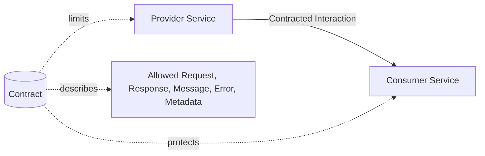
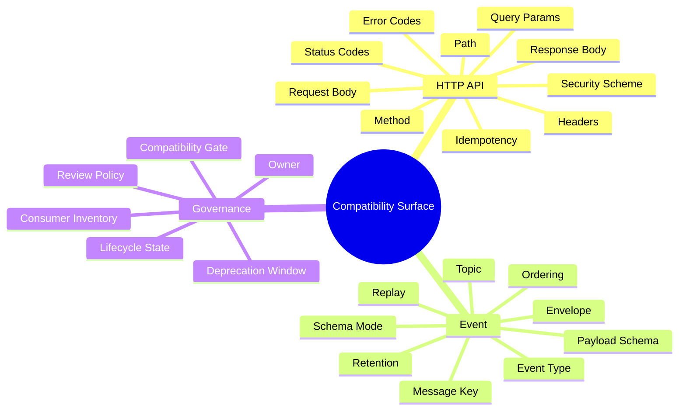
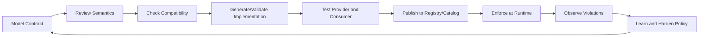
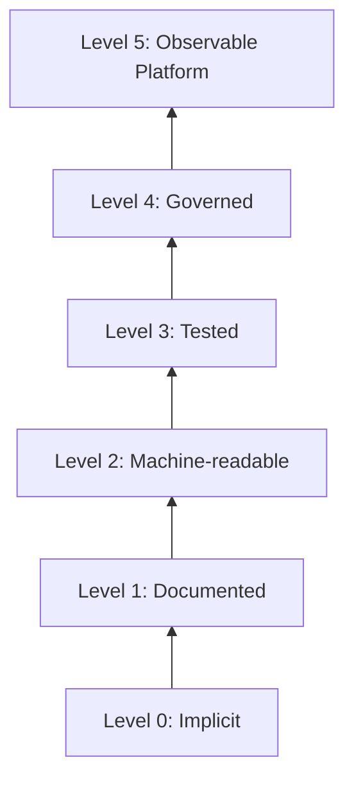
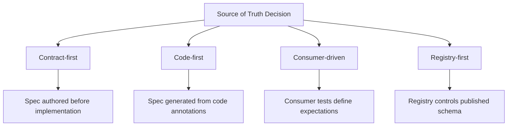

# Part 001 — Kaufman Skill Map: Contract Engineering as an Engineering Discipline

## 1. Tujuan Part Ini

Part ini bukan membahas syntax OpenAPI, AsyncAPI, Avro, Protobuf, JSON Schema, Pact, atau Schema Registry secara detail. Itu akan masuk di part berikutnya.

Part ini membangun **peta kemampuan**: bagaimana seorang software engineer senior/top-tier melihat API contract, event contract, dan schema governance sebagai **sistem kendali perubahan** di distributed system.

Setelah menyelesaikan part ini, kamu harus bisa:

1. Membedakan contract engineering dari sekadar API documentation.
2. Menjelaskan mengapa contract adalah boundary, promise, compatibility surface, dan governance artifact.
3. Memetakan sub-skill yang harus dikuasai agar bisa mendesain, mereview, menguji, dan meng-govern contract di enterprise environment.
4. Menggunakan framework Kaufman untuk belajar cepat tetapi tetap mendalam.
5. Menghindari overlap dengan materi Java REST, messaging, validation, serialization, observability, security, dan domain system yang sudah dipelajari.
6. Menilai contract bukan hanya dari “valid schema”, tetapi dari risiko perubahan, kejelasan semantic, operability, auditability, dan evolvability.

> Core thesis: **Contract engineering adalah disiplin mengelola janji antar sistem agar perubahan tetap aman, terukur, dapat diaudit, dan tidak menghancurkan consumer.**

---

## 2. Posisi Seri Ini di Antara Seri yang Sudah Selesai

Kita tidak akan mengulang seri-seri sebelumnya. Seri ini mengambil kemampuan dari seri lain sebagai prasyarat, lalu menaikkannya ke level governance dan contract lifecycle.

| Seri sebelumnya | Yang dianggap sudah dikuasai | Yang tidak akan diulang di seri ini |
|---|---:|---|
| `learn-modern-java-8-to-25` | Java language, records, sealed classes, generics, collections, streams, modern Java style | Syntax Java basic |
| `learn-java-jakarta-restful-web-services` | REST endpoint, request/response, JAX-RS, HTTP integration | Cara membuat REST API dasar |
| `learn-java-messaging-event-streaming` | Kafka/message broker, producer/consumer, delivery semantics | Dasar messaging, consumer group, broker setup |
| `learn-java-data-mapper-json-xml-validation` | Jackson, MapStruct, serialization/deserialization, Bean Validation | DTO mapping dan basic validation |
| `learn-java-security-cryptography-integrity-hardening` | Authentication, authorization, cryptography, secure platform baseline | Security basic |
| `learn-java-error-reliability-observability` | Logging, metrics, tracing, reliability patterns | Observability dasar dan error handling umum |
| `learn-java-core-banking-system`, `learn-java-telecom-bss-oss` | Complex domain lifecycle, regulatory/system-of-record constraints | Domain-specific business implementation |

Seri ini menjawab pertanyaan yang lebih sempit namun lebih tajam:

> “Bagaimana memastikan interface antar sistem tetap benar, stabil, aman berubah, dapat diuji, dapat di-review, dapat dipromosikan lintas environment, dan dapat dipertanggungjawabkan?”

---

## 3. Mengapa Contract Engineering Layak Dipelajari Secara Khusus

Di sistem kecil, contract sering terasa seperti documentation artifact. Di enterprise distributed system, contract adalah **risk boundary**.

Satu field kecil bisa menjadi incident besar:

- Mengubah `customerId` dari string ke number bisa mematahkan consumer lama.
- Menambahkan enum value baru bisa membuat client gagal deserialize.
- Mengubah semantic `ACTIVE` dari “account can transact” menjadi “account exists” bisa merusak regulatory workflow.
- Menghapus optional field bisa mematahkan batch reconciliation.
- Mengubah Kafka message key bisa menghancurkan ordering invariant.
- Mengganti event name bisa membuat consumer diam-diam tidak menerima fakta bisnis.
- Mengubah error code bisa mematahkan retry, compensation, atau customer communication flow.
- Mengubah schema compatibility dari backward ke none bisa membuka jalan bagi breaking change yang tidak disengaja.

Contract engineering adalah cara membuat perubahan seperti itu **terlihat sebelum production**, bukan setelah consumer break.

---

## 4. Mental Model Utama

### 4.1 Contract sebagai Boundary

Contract berada di batas dua pihak: provider dan consumer.



Boundary yang baik tidak hanya menjelaskan “shape data”. Boundary yang baik menjawab:

- Apa yang boleh dikirim?
- Apa yang bisa diterima?
- Apa arti field ini?
- Apa yang stabil?
- Apa yang boleh berubah?
- Apa yang harus consumer toleransi?
- Apa yang tidak boleh provider ubah tanpa migration plan?
- Apa failure mode yang sah?
- Apa metadata wajib untuk audit, tracing, idempotency, tenancy, dan classification?

Contract adalah pagar. Bukan dekorasi.

---

### 4.2 Contract sebagai Promise

Sebuah API atau event bukan hanya mekanisme teknis. Ia adalah janji.

Contoh janji API:

```http
GET /accounts/{accountId}
```

Janji eksplisit:

- Endpoint tersedia.
- `accountId` adalah identifier yang valid menurut domain.
- Response sukses punya struktur yang disepakati.
- Error response punya format stabil.
- Status code mencerminkan outcome.

Janji implisit:

- Kalau account tidak ditemukan, consumer tahu bagaimana bereaksi.
- Kalau request invalid, consumer bisa memperbaiki input.
- Kalau service timeout, retry policy tidak membuat double effect.
- Kalau field baru ditambahkan, consumer lama tidak rusak.

Contoh janji event:

```text
CustomerKycApproved
```

Janji eksplisit:

- Event merepresentasikan fakta KYC sudah approved.
- Ada customer identity.
- Ada waktu kejadian.
- Ada event ID.
- Payload sesuai schema.

Janji implisit:

- Event tidak dipublish sebelum state committed.
- Event dapat di-deduplicate.
- Event ordering terhadap customer yang sama masuk akal.
- Consumer bisa replay event lama.
- Schema baru tidak merusak consumer lama.

Top-tier engineer mengejar janji implisit ini, karena di sanalah incident biasanya muncul.

---

### 4.3 Contract sebagai Compatibility Surface

Compatibility surface adalah semua hal yang bisa membuat consumer rusak ketika provider berubah.

Untuk API HTTP:

- Path
- Method
- Query parameter
- Header
- Request body
- Response body
- Status code
- Error code
- Authentication scheme
- Authorization scope
- Rate-limit behavior
- Pagination behavior
- Sorting/filtering semantics
- Idempotency behavior
- Timeout and retry expectation

Untuk event:

- Topic/channel
- Event name/type
- Message key
- Partitioning strategy
- Ordering assumption
- Envelope metadata
- Payload schema
- Required/optional field
- Enum values
- Default values
- Retention policy
- Compaction behavior
- Replay semantics
- DLQ/quarantine behavior
- Schema compatibility mode

Contract engineering membuat compatibility surface ini eksplisit.



---

### 4.4 Contract sebagai Governance Artifact

Governance bukan berarti rapat panjang dan approval lambat. Governance yang baik adalah **automation plus clear decision rights**.

Contract sebagai governance artifact berarti contract punya:

- Owner
- Version
- Lifecycle state
- Compatibility rule
- Review history
- Approval evidence
- Deprecation policy
- Consumer impact
- Security classification
- Regulatory classification
- Runtime enforcement strategy

Di enterprise, contract bukan hanya untuk developer. Contract dipakai oleh:

- API consumer
- Platform engineer
- Security reviewer
- Data governance team
- Compliance/audit team
- SRE/on-call engineer
- Release manager
- Partner integration team
- Product/domain owner

Itu sebabnya contract harus bisa dibaca manusia dan mesin.

---

## 5. Framework Kaufman untuk Seri Ini

Josh Kaufman menekankan pendekatan belajar skill praktis dengan cara:

1. Deconstruct the skill.
2. Learn enough to self-correct.
3. Remove barriers to practice.
4. Practice the most important sub-skills deliberately.

Kita adaptasikan ke contract engineering.

---

## 6. Step 1 — Deconstruct the Skill

Contract engineering bukan satu skill. Ia gabungan beberapa sub-skill.

```mermaid
flowchart TD
    A[Contract Engineering Mastery] --> B[Contract Modeling]
    A --> C[Compatibility Reasoning]
    A --> D[Schema Design]
    A --> E[Contract Testing]
    A --> F[Governance Automation]
    A --> G[Runtime Enforcement]
    A --> H[Operational Response]
    A --> I[Platform Enablement]

    B --> B1[HTTP API Modeling]
    B --> B2[Event Modeling]
    B --> B3[Error Modeling]
    B --> B4[Metadata Modeling]

    C --> C1[Backward/Forward Compatibility]
    C --> C2[Semantic Compatibility]
    C --> C3[Consumer Impact]
    C --> C4[Migration Planning]

    D --> D1[OpenAPI Schema]
    D --> D2[JSON Schema]
    D --> D3[Avro]
    D --> D4[Protobuf]

    E --> E1[Provider Verification]
    E --> E2[Consumer-Driven Tests]
    E --> E3[Schema Gates]
    E --> E4[Replay Tests]

    F --> F1[Linting]
    F --> F2[Policy as Code]
    F --> F3[Contract Diff]
    F --> F4[Approval Workflow]

    G --> G1[Request Validation]
    G --> G2[Response Validation]
    G --> G3[Event Validation]
    G --> G4[Quarantine/DLQ]

    H --> H1[Violation Metrics]
    H --> H2[Drift Detection]
    H --> H3[Blast Radius]
    H --> H4[Rollback]

    I --> I1[Catalog]
    I --> I2[Registry]
    I --> I3[Developer Portal]
    I --> I4[Golden Paths]
```



Kita tidak mencoba menguasai semuanya sekaligus. Kita pecah menjadi kemampuan yang bisa dipraktikkan.

---

## 7. Step 2 — Learn Enough to Self-Correct

Belajar cukup untuk self-correct artinya kamu tidak harus hafal seluruh specification, tetapi harus tahu cara menemukan kesalahan desain.

### 7.1 Self-Correction Questions

Gunakan pertanyaan berikut setiap kali melihat API/event/schema:

#### A. Boundary Clarity

- Siapa provider?
- Siapa consumer?
- Apakah consumer manusia, service, partner, batch job, workflow engine, atau analytics pipeline?
- Apa yang menjadi source of truth?
- Apakah contract ini request-response, event fact, command, query, stream, webhook, atau file exchange?

#### B. Semantic Precision

- Apa arti field ini dalam domain?
- Apakah nama field menjelaskan business meaning atau implementation detail?
- Apakah enum values punya definisi stabil?
- Apakah `status` mencampur lifecycle state, technical state, dan eligibility state?
- Apakah timestamp menjelaskan occurred time, processed time, effective time, atau published time?

#### C. Compatibility

- Perubahan apa yang aman?
- Perubahan apa yang breaking?
- Apakah optional field benar-benar optional untuk consumer?
- Apakah required field punya default yang aman?
- Apakah enum baru bisa ditangani consumer lama?
- Apakah event lama masih bisa direplay dengan reader baru?

#### D. Operational Behavior

- Apa retry expectation?
- Apa idempotency rule?
- Apa error taxonomy?
- Apa timeout behavior?
- Bagaimana correlation/tracing dilakukan?
- Bagaimana contract violation dideteksi?

#### E. Governance

- Siapa owner contract?
- Apa lifecycle state-nya?
- Ada review record?
- Ada compatibility gate?
- Ada deprecation date?
- Ada consumer inventory?
- Ada classification untuk sensitive data?

Jika kamu bisa menjawab pertanyaan itu, kamu mulai bisa self-correct.

---

## 8. Step 3 — Remove Barriers to Practice

Contract engineering sering gagal dipelajari karena developer menunggu proyek besar. Padahal skill ini bisa dilatih dari artifact kecil.

Minimum practice environment:

```text
contract-lab/
  api/
    customer-api.openapi.yaml
    account-api.openapi.yaml
  events/
    customer-kyc-approved.asyncapi.yaml
    account-status-changed.asyncapi.yaml
  schemas/
    avro/
    protobuf/
    json-schema/
  examples/
    valid/
    invalid/
  decisions/
    ADR-0001-contract-source-of-truth.md
    ADR-0002-versioning-policy.md
  checks/
    lint.sh
    compatibility.sh
    diff.sh
```

Untuk Java project:

```text
customer-platform/
  contracts/
    openapi/
    asyncapi/
    avro/
    proto/
    json-schema/
  contract-tests/
  service-customer/
  service-kyc/
  service-notification/
  build.gradle.kts
```

Barriers yang harus dihilangkan:

| Barrier | Solusi |
|---|---|
| Terlalu banyak spec | Mulai dari 1 API dan 1 event |
| Bingung source of truth | Pilih satu mode: contract-first untuk latihan awal |
| Tidak ada consumer nyata | Buat consumer dummy dengan expectation eksplisit |
| Tooling terlalu banyak | Mulai dari manual review + simple CI check |
| Over-focus pada syntax | Pakai checklist semantic dan compatibility |
| Tidak ada feedback | Gunakan breaking-change exercise |

---

## 9. Step 4 — Practice the Most Important Sub-Skills

Kita tidak ingin “bisa menulis YAML”. Kita ingin bisa membuat contract yang aman hidup bertahun-tahun.

### 9.1 Sub-skill Prioritas

| Prioritas | Sub-skill | Mengapa penting |
|---:|---|---|
| 1 | Compatibility reasoning | Ini sumber incident paling sering: perubahan kecil yang dianggap aman padahal breaking |
| 2 | Semantic modeling | Schema valid belum tentu domain meaning benar |
| 3 | Error contract design | Consumer butuh failure semantics yang stabil |
| 4 | Event evolution | Event hidup lama, replayable, dan sering dikonsumsi diam-diam |
| 5 | Contract testing | Mencegah spec drift dan assumption drift |
| 6 | Governance automation | Tanpa automation, review manual akan kalah oleh velocity |
| 7 | Runtime enforcement | Menangkap violation yang lolos dari CI |
| 8 | Incident response | Contract mistake harus bisa dirollback atau dimitigasi |

---

## 10. The Contract Engineering Loop

Contract engineering yang matang mengikuti loop berikut:



Setiap loop harus menghasilkan artifact:

| Step | Artifact |
|---|---|
| Model Contract | OpenAPI, AsyncAPI, Avro, Proto, JSON Schema |
| Review Semantics | PR comments, checklist, ADR |
| Check Compatibility | Diff report, registry compatibility result |
| Generate/Validate Implementation | Generated interface/client, validator, stubs |
| Test Provider and Consumer | Contract tests, Pact file, Spring Cloud Contract stubs, replay samples |
| Publish | Registry artifact, catalog entry, version tag |
| Enforce | Runtime validation, gateway rule, consumer decoder |
| Observe | Metrics, logs, traces, violation events |
| Harden | Policy-as-code rule, lint rule, migration guide |

---

## 11. Contract Maturity Levels

Gunakan maturity model ini untuk menilai organisasi atau project.

### Level 0 — Implicit Contract

Karakteristik:

- Contract hanya ada di kode.
- Consumer membaca contoh payload dari log atau Slack.
- Breaking change diketahui setelah production.
- Tidak ada schema registry.
- Tidak ada compatibility gate.

Risiko:

- Integrasi rapuh.
- Knowledge tersimpan di orang.
- Onboarding lambat.
- Incident sulit dianalisis.

---

### Level 1 — Documentation Contract

Karakteristik:

- Ada Swagger/OpenAPI page atau wiki.
- Dokumentasi bisa outdated.
- Schema tidak selalu dipakai oleh build/test.
- Review masih manual.

Risiko:

- Documentation drift.
- Consumer mengandalkan behavior runtime, bukan spec.
- “Docs said X, service did Y.”

---

### Level 2 — Machine-Readable Contract

Karakteristik:

- OpenAPI/AsyncAPI/schema disimpan di repository.
- Build bisa validate syntax.
- Client/server bisa digenerate.
- Ada contoh request/response/event.

Risiko:

- Valid secara syntax belum tentu compatible.
- Semantic review masih lemah.
- Contract bisa hanya menjadi by-product dari code annotation.

---

### Level 3 — Tested Contract

Karakteristik:

- Provider diverifikasi terhadap contract.
- Consumer expectation diuji.
- Breaking changes dicegah di CI.
- Stub/mock dipublish.

Risiko:

- Hanya interaction yang diuji yang terlindungi.
- Event replay semantics belum tentu diuji.
- Schema compatibility belum tentu semantic compatibility.

---

### Level 4 — Governed Contract

Karakteristik:

- Ada owner.
- Ada lifecycle state.
- Ada compatibility policy.
- Ada approval flow berbasis risiko.
- Ada deprecation policy.
- Ada catalog dan consumer inventory.

Risiko:

- Governance bisa menjadi bottleneck jika tidak diautomasi.
- Policy bisa terlalu general dan tidak domain-aware.

---

### Level 5 — Observable and Adaptive Contract Platform

Karakteristik:

- Runtime violation terukur.
- Drift detection aktif.
- Consumer breakage bisa dikorelasikan ke contract change.
- Contract quality score dipantau.
- Policy diperbaiki berdasarkan incident.
- Catalog menunjukkan lineage dan blast radius.

Ini target enterprise-grade.



---

## 12. Contract Engineer's Core Vocabulary

### 12.1 Contract

Definisi praktis:

> Contract adalah deskripsi eksplisit tentang interaksi yang diizinkan antara provider dan consumer, termasuk struktur, semantic, behavior, compatibility expectation, dan governance metadata.

Contract bukan hanya schema.

Schema menjawab:

```text
Apakah data ini valid secara bentuk?
```

Contract menjawab:

```text
Apakah interaksi ini sah, stabil, dapat dipahami, kompatibel, dan aman dioperasikan?
```

---

### 12.2 Schema

Schema adalah bagian dari contract yang mendefinisikan bentuk data:

- Field
- Type
- Required/optional
- Constraint
- Default
- Enum
- Composition
- References

Schema tidak selalu menjelaskan semantic domain secara lengkap.

Contoh:

```json
{
  "status": "ACTIVE"
}
```

Schema mungkin mengatakan `status` adalah string enum. Tetapi semantic contract harus menjelaskan:

- ACTIVE untuk entity apa?
- Apakah ACTIVE berarti usable?
- Apakah ACTIVE berarti legally valid?
- Apakah ACTIVE berarti lifecycle completed?
- Apakah ACTIVE bisa kembali ke PENDING?
- Apa consumer harus lakukan ketika menerima ACTIVE?

---

### 12.3 Compatibility

Compatibility adalah kemampuan versi berbeda dari provider/consumer/schema untuk tetap bekerja benar.

Compatibility punya beberapa level:

| Level | Pertanyaan |
|---|---|
| Syntax compatibility | Apakah file contract valid? |
| Structural compatibility | Apakah data lama/baru bisa dibaca? |
| Behavioral compatibility | Apakah behavior runtime tetap sesuai expectation? |
| Semantic compatibility | Apakah arti bisnis tidak berubah secara merusak? |
| Operational compatibility | Apakah retry, ordering, timeout, replay tetap aman? |
| Governance compatibility | Apakah perubahan mengikuti policy dan approval? |

Top-tier engineer tidak berhenti di structural compatibility.

---

### 12.4 Consumer

Consumer bukan hanya service yang memanggil endpoint.

Consumer bisa berupa:

- Backend service
- Frontend application
- Mobile app
- Partner system
- Batch reconciliation job
- Analytics pipeline
- Fraud engine
- Workflow engine
- Regulatory reporting system
- Support dashboard
- Data warehouse ingestion
- AI/automation agent

Hidden consumer adalah risiko besar. Event dan public API sering punya consumer yang tidak diketahui provider.

---

### 12.5 Provider

Provider adalah pihak yang membuat contract tersedia melalui API, event, file, stream, SDK, atau platform interface.

Provider bertanggung jawab menjaga promise.

Tanggung jawab provider:

- Publish contract yang jelas.
- Maintain compatibility.
- Menyediakan migration path.
- Mengumumkan deprecation.
- Menguji provider behavior.
- Mengobservasi violation.
- Menyediakan error semantics yang stabil.

---

### 12.6 Governance

Governance adalah mekanisme untuk memastikan contract berubah secara aman.

Governance yang buruk:

```text
Semua perubahan harus meeting approval board.
```

Governance yang baik:

```text
Mayoritas perubahan aman divalidasi otomatis.
Perubahan berisiko tinggi diekskalasi dengan evidence yang jelas.
```

---

## 13. Apa yang Membuat Contract “Enterprise-Grade”

Contract enterprise-grade punya kualitas berikut.

### 13.1 Explicit

Semua assumption penting tertulis atau dapat dibuktikan oleh test/tool.

Buruk:

```yaml
status:
  type: string
```

Lebih baik:

```yaml
status:
  type: string
  description: >
    Current account lifecycle status. ACTIVE means the account is open and
    eligible for normal debit/credit operations unless blocked by a separate
    restriction state.
  enum:
    - PENDING_ACTIVATION
    - ACTIVE
    - SUSPENDED
    - CLOSED
```

Tetapi description saja belum cukup. Contract review harus mengecek apakah `SUSPENDED` berarti transaction denied, partially denied, atau only manual review required.

---

### 13.2 Stable

Contract harus dirancang untuk berubah tanpa sering breaking.

Tanda contract tidak stabil:

- Field terlalu implementation-specific.
- Enum terlalu sempit.
- Required field terlalu banyak.
- Response mencampur banyak concept.
- Event payload terlalu mirip database row.
- Tidak ada reserved extension point.
- Error code terlalu granular atau terlalu vague.

---

### 13.3 Compatible

Contract harus punya aturan perubahan.

Contoh API compatible changes:

- Menambah optional response field.
- Menambah optional request field dengan default aman.
- Menambah endpoint baru.
- Menambah non-required header baru.

Contoh API breaking changes:

- Menghapus field yang digunakan consumer.
- Mengubah type field.
- Mengubah requiredness tanpa default.
- Mengubah status code semantics.
- Mengubah error code yang dipakai automation.
- Mengubah pagination semantics.

Contoh event breaking changes:

- Mengubah message key.
- Mengubah event type name.
- Menghapus field tanpa compatibility path.
- Mengganti semantic timestamp.
- Mengubah ordering guarantee.
- Mengubah retention dari 30 hari menjadi 1 hari tanpa consumer migration.

---

### 13.4 Testable

Contract harus dapat diuji.

Jika contract mengatakan:

```text
POST /payments is idempotent when Idempotency-Key is supplied.
```

Maka harus ada test:

1. Kirim request pertama.
2. Kirim request kedua dengan idempotency key sama.
3. Pastikan tidak double charge.
4. Pastikan response semantics konsisten.
5. Pastikan trace/log menunjukkan deduplication.

Jika tidak dapat diuji, janji itu rapuh.

---

### 13.5 Governable

Contract harus dapat diproses oleh automation.

Contoh governable metadata:

```yaml
x-owner: team-customer-platform
x-domain: customer-onboarding
x-data-classification: confidential
x-lifecycle-state: active
x-compatibility-policy: backward-compatible
x-deprecation-policy: 180-days-notice
```

Metadata seperti ini memungkinkan:

- PR routing ke owner.
- Lint rule berbasis domain.
- Report contract quality.
- Audit evidence.
- Catalog discovery.

---

### 13.6 Observable

Contract violation harus terlihat.

Contoh metrics:

```text
api_contract_request_validation_failed_total
api_contract_response_validation_failed_total
event_schema_validation_failed_total
event_unknown_type_total
schema_registry_compatibility_rejected_total
contract_runtime_drift_detected_total
```

Tanpa observability, contract hanya gate di build. Production behavior bisa tetap menyimpang.

---

## 14. Top 1% Lens: Cara Engineer Kuat Membaca Contract

Engineer pemula membaca contract seperti ini:

> “Field-nya apa saja?”

Engineer menengah membaca contract seperti ini:

> “Apakah request/response valid dan bisa digenerate client?”

Engineer senior membaca contract seperti ini:

> “Apakah contract ini bisa berevolusi tanpa menghancurkan consumer?”

Engineer top-tier membaca contract seperti ini:

> “Apa invariant bisnis dan operasional yang sedang dijanjikan, siapa yang bergantung padanya, bagaimana perubahan divalidasi, bagaimana violation diketahui, dan bagaimana migration/rollback dilakukan tanpa kehilangan auditability?”

Perbedaan utamanya ada pada **time horizon** dan **failure imagination**.

---

## 15. Contract Failure Modes

Contract engineering harus dimulai dari failure modelling.

### 15.1 Structural Break

Contoh:

```json
{
  "customerId": 12345
}
```

Sebelumnya:

```json
{
  "customerId": "CUST-12345"
}
```

Consumer lama mengharapkan string. Deserialization gagal.

---

### 15.2 Semantic Break

Contoh field tetap sama:

```json
{
  "status": "ACTIVE"
}
```

Sebelumnya `ACTIVE` berarti account bisa transaksi.
Sekarang `ACTIVE` berarti account sudah dibuat tetapi masih bisa punya restriction.

Schema tidak berubah. Consumer tetap deserialize. Tetapi business outcome rusak.

Ini lebih berbahaya daripada structural break karena CI schema check tidak menangkapnya.

---

### 15.3 Behavioral Break

Contoh:

Sebelumnya:

```text
POST /payments with same Idempotency-Key returns original result.
```

Sekarang:

```text
POST /payments with same Idempotency-Key returns 409 Conflict.
```

Payload schema tidak berubah, tetapi consumer retry logic rusak.

---

### 15.4 Temporal Break

Contoh event:

Sebelumnya:

```text
AccountClosed is emitted after transaction settlement completes.
```

Sekarang:

```text
AccountClosed is emitted immediately when closure requested.
```

Event name dan schema tidak berubah. Tetapi consumer yang menghentikan downstream settlement bisa salah.

---

### 15.5 Operational Break

Contoh:

- Topic retention berubah dari 14 hari ke 24 jam.
- Event key berubah dari `customerId` ke `accountId`.
- API timeout turun dari 30s ke 2s.
- Rate limit berubah tanpa announcement.

Ini bukan sekadar infrastructure setting. Ini bagian dari contract ketika consumer bergantung padanya.

---

### 15.6 Governance Break

Contoh:

- Contract berubah tanpa owner approval.
- Compatibility gate dimatikan.
- Schema registry mode diubah menjadi `NONE`.
- Deprecated field dihapus sebelum window selesai.
- Consumer inventory tidak diperbarui.

Governance break sering menjadi root cause dari technical break.

---

## 16. Contract Engineering vs Related Practices

### 16.1 Contract Engineering vs API Design

API design fokus pada bentuk interface.
Contract engineering fokus pada lifecycle dan safety interface.

| API Design | Contract Engineering |
|---|---|
| Endpoint shape | Compatibility surface |
| Resource naming | Semantic invariant |
| Request/response design | Change impact |
| Developer experience | Consumer safety |
| Documentation | Machine validation + governance |

---

### 16.2 Contract Engineering vs Schema Design

Schema design adalah bagian dari contract engineering.

| Schema Design | Contract Engineering |
|---|---|
| Type, field, constraint | Meaning, lifecycle, compatibility, ownership |
| Valid data shape | Safe interaction |
| Serialization concern | Distributed change concern |
| Mostly structural | Structural + semantic + operational |

---

### 16.3 Contract Engineering vs Contract Testing

Contract testing adalah mekanisme verifikasi. Contract engineering lebih luas.

| Contract Testing | Contract Engineering |
|---|---|
| Test provider/consumer expectation | Design, publish, review, test, govern, enforce, observe |
| CI-time feedback | Full lifecycle control |
| Usually interaction-specific | Organization-wide change management |
| Tool-centered | Discipline-centered |

---

### 16.4 Contract Engineering vs Data Governance

Data governance fokus pada data meaning, quality, lineage, policy. Contract engineering fokus pada interface exchange.

Keduanya bertemu pada:

- Data classification
- PII/sensitive data
- Lineage
- Ownership
- Schema lifecycle
- Auditability
- Regulatory reporting

---

## 17. Contract Source of Truth

Salah satu keputusan awal: apa sumber kebenaran contract?



Tidak ada satu jawaban universal.

### 17.1 Contract-First

Baik ketika:

- Public/partner API.
- Banyak consumer.
- Regulatory/audit requirement tinggi.
- Implementation bisa berubah tetapi interface harus stabil.
- Review perlu terjadi sebelum coding.

Risiko:

- Spec bisa terlalu teoritis.
- Developer merasa lambat.
- Contract dan code bisa drift kalau tidak ada verification.

---

### 17.2 Code-First

Baik ketika:

- Internal API sederhana.
- Team kecil.
- Velocity lebih penting.
- Contract hanya perlu expose implementation yang sudah stabil.

Risiko:

- Implementation detail bocor ke contract.
- Annotation menjadi dokumentasi kosmetik.
- Breaking change bisa terlihat normal dari perspektif compiler.

---

### 17.3 Consumer-Driven

Baik ketika:

- Ada consumer penting dengan expectation spesifik.
- Provider ingin bebas mengubah behavior yang tidak dipakai consumer.
- Integrasi lebih penting daripada full API documentation.

Risiko:

- Hanya expectation yang diuji yang terlindungi.
- Consumer yang tidak menulis contract test tidak terwakili.
- Butuh discipline broker/publishing verification.

---

### 17.4 Registry-First

Baik ketika:

- Event streaming platform besar.
- Schema compatibility harus menjadi gate utama.
- Banyak service publish/consume event.
- Governance perlu centralized metadata.

Risiko:

- Registry hanya tahu schema, bukan semua operational semantics.
- Semantic break tetap bisa lolos.
- Topic/key/retention/replay contract bisa tidak terdokumentasi.

---

## 18. Skill Map Detail

### 18.1 Contract Modeling

Kemampuan:

- Memilih tipe contract yang tepat.
- Mendesain shape data.
- Menentukan metadata.
- Menulis description yang menjelaskan semantic, bukan hanya field label.
- Menghindari coupling ke persistence model.
- Membuat contoh valid dan invalid.

Practice:

- Ambil satu domain object.
- Buat API request/response contract.
- Buat event fact contract.
- Bandingkan keduanya.
- Catat field yang seharusnya ada di API tetapi tidak di event, dan sebaliknya.

---

### 18.2 Compatibility Reasoning

Kemampuan:

- Mengklasifikasikan perubahan sebagai safe, dangerous, atau breaking.
- Membedakan structural dan semantic compatibility.
- Menentukan migration strategy.
- Menilai consumer impact.
- Memilih deprecation window.

Practice:

- Ubah satu field dari optional ke required.
- Ubah enum.
- Ubah timestamp meaning.
- Ubah event key.
- Ubah error code.
- Untuk tiap perubahan, tulis impact analysis.

---

### 18.3 Schema Design

Kemampuan:

- Memilih JSON Schema, Avro, Protobuf, atau plain JSON contract.
- Memahami required/optional/default/null semantics.
- Mendesain enum yang evolvable.
- Menentukan identifier dan temporal type.
- Mengatur namespace/package.

Practice:

- Modelkan `CustomerKycApproved` dalam JSON Schema, Avro, dan Protobuf.
- Bandingkan compatibility behavior.
- Catat perbedaan default, optionality, dan enum handling.

---

### 18.4 Contract Testing

Kemampuan:

- Membedakan provider verification, consumer-driven contract, schema compatibility, dan replay testing.
- Menentukan test yang harus menjadi CI gate.
- Menghindari test yang memberi false confidence.

Practice:

- Buat OpenAPI contract.
- Buat provider implementation minimal.
- Tambahkan provider verification.
- Buat consumer expectation.
- Lakukan breaking change dan lihat gate gagal.

---

### 18.5 Governance Automation

Kemampuan:

- Menulis lint rule.
- Menjalankan semantic diff.
- Membuat approval workflow.
- Menyimpan owner metadata.
- Mengintegrasikan schema registry.
- Membuat exception process.

Practice:

- Buat rule: semua public API harus punya `operationId`.
- Buat rule: semua error response harus punya `errorCode`.
- Buat rule: event envelope harus punya `eventId`, `eventType`, `occurredAt`, `schemaVersion`.
- Buat rule: PII field harus punya classification metadata.

---

### 18.6 Runtime Enforcement

Kemampuan:

- Menentukan kapan request/response/event divalidasi.
- Menentukan strict vs tolerant strategy.
- Menentukan fail-fast vs quarantine.
- Mengukur performance cost.
- Menghindari runtime validator menjadi single point of failure.

Practice:

- Validate incoming HTTP request.
- Validate outgoing response di non-prod.
- Validate event before publish.
- Send invalid event ke quarantine topic.
- Expose metrics.

---

### 18.7 Operational Response

Kemampuan:

- Mendeteksi contract drift.
- Menghubungkan contract change ke incident.
- Menentukan blast radius.
- Rollback contract atau implementation.
- Communicate migration.

Practice:

- Simulasikan breaking event schema.
- Catat consumer yang gagal.
- Buat incident timeline.
- Buat postmortem action: lint rule atau compatibility policy baru.

---

## 19. Learning Roadmap Berdasarkan Kaufman

Seri ini panjang. Tetapi prinsip Kaufman tetap kita gunakan: cepat masuk ke practice, lalu ulangi feedback loop.

### Phase 1 — Orientation and Mental Model

Part:

- Part 001 — Kaufman Skill Map
- Part 002 — Contract Taxonomy
- Part 003 — Contract Invariants
- Part 004 — Contract-First vs Code-First vs Consumer-First

Target:

- Bisa membaca contract sebagai promise dan compatibility surface.
- Bisa mengklasifikasikan contract.
- Bisa menemukan hidden assumption.

---

### Phase 2 — HTTP API Contract Engineering

Part:

- Part 005 sampai Part 012

Target:

- Bisa mendesain OpenAPI enterprise-grade.
- Bisa model error, versioning, idempotency, pagination, validation semantics.
- Bisa mengintegrasikan Java implementation dan contract testing.

---

### Phase 3 — Event Contract Engineering

Part:

- Part 013 sampai Part 021

Target:

- Bisa mendesain event fact, envelope, AsyncAPI, Kafka topic contract.
- Bisa memilih Avro/Protobuf/JSON Schema.
- Bisa mengelola event compatibility dan replay risk.

---

### Phase 4 — Schema Governance

Part:

- Part 022 sampai Part 028

Target:

- Bisa membangun schema registry strategy.
- Bisa membuat compatibility governance.
- Bisa membuat contract diff, linting, catalog, dan lifecycle state.

---

### Phase 5 — Production Contract Platform

Part:

- Part 029 sampai Part 032

Target:

- Bisa mendesain operating model multi-team.
- Bisa enforce runtime contract.
- Bisa observe contract violation.
- Bisa membangun capstone platform.

---

## 20. Practice Plan 20 Jam

Kaufman bukan berarti cukup 20 jam untuk menjadi expert. Untuk top-tier engineering, 20 jam pertama adalah **activation energy**: cukup untuk membangun skill loop yang benar.

### 20.1 Jam 1–2: Contract Reading

Ambil 3 contract:

1. Satu OpenAPI internal/public.
2. Satu event schema.
3. Satu generated client atau DTO.

Tulis:

- Provider.
- Consumer.
- Compatibility surface.
- Hidden assumption.
- Potential breaking changes.

---

### 20.2 Jam 3–5: Contract Modeling

Modelkan domain kecil:

```text
Customer onboarding -> KYC approval -> Account activation
```

Buat:

- `POST /customers`
- `GET /customers/{customerId}`
- `CustomerRegistered`
- `CustomerKycApproved`
- `AccountActivated`

Fokus bukan tool, tetapi semantic.

---

### 20.3 Jam 6–8: Compatibility Exercises

Untuk setiap contract, lakukan perubahan:

- Tambah optional field.
- Hapus field.
- Ubah type.
- Tambah enum.
- Ubah error code.
- Ubah event key.
- Ubah timestamp meaning.

Klasifikasikan:

```text
SAFE / DANGEROUS / BREAKING
```

Tulis alasan.

---

### 20.4 Jam 9–11: Contract Testing

Buat test minimal:

- Provider validates OpenAPI.
- Consumer expectation test.
- Schema compatibility check.
- Golden sample validation.

Jangan berusaha sempurna. Tujuannya membangun feedback loop.

---

### 20.5 Jam 12–14: Governance Automation

Buat lint rules sederhana:

- Semua operation punya `operationId`.
- Semua API error punya `errorCode`.
- Semua event punya `eventId`.
- Semua event punya `schemaVersion`.
- Semua PII field diberi metadata.

---

### 20.6 Jam 15–17: Runtime and Observability

Tambahkan:

- Request validation.
- Event validation before publish.
- Invalid event quarantine.
- Metrics untuk violation.

---

### 20.7 Jam 18–20: Capstone Mini Review

Simulasikan PR contract change.

Isi review:

- Summary perubahan.
- Compatibility classification.
- Consumer impact.
- Required migration.
- Rollback plan.
- Observability plan.
- Approval needed or not.

Output akhir 20 jam:

```text
Kamu belum expert, tetapi sudah punya feedback loop yang benar.
```

---

## 21. Contract Review Checklist Level Awal

Gunakan checklist ini sejak Part 001.

### 21.1 Identity and Ownership

- [ ] Contract punya owner jelas.
- [ ] Domain jelas.
- [ ] Audience jelas: internal, public, partner, regulatory, platform.
- [ ] Lifecycle state jelas: draft, active, deprecated, retired.

### 21.2 Semantic Quality

- [ ] Field names menjelaskan domain meaning.
- [ ] Description menjelaskan behavior penting.
- [ ] Enum values punya arti stabil.
- [ ] Timestamp punya semantic jelas.
- [ ] Identifier tidak ambiguous.

### 21.3 Compatibility

- [ ] Perubahan diklasifikasi safe/dangerous/breaking.
- [ ] Optionality/default/nullability jelas.
- [ ] Enum evolution aman.
- [ ] Error code evolution aman.
- [ ] Consumer lama tidak rusak tanpa migration path.

### 21.4 Operational Semantics

- [ ] Retry behavior jelas.
- [ ] Idempotency jelas.
- [ ] Timeout expectation jelas.
- [ ] Ordering/replay jelas untuk event.
- [ ] DLQ/quarantine behavior jelas.

### 21.5 Governance

- [ ] Compatibility gate ada.
- [ ] Review path jelas.
- [ ] Deprecation policy ada.
- [ ] Consumer impact dianalisis.
- [ ] Sensitive data diklasifikasikan.

---

## 22. Anti-Patterns yang Harus Dihindari

### 22.1 “Swagger sudah ada, berarti contract aman”

OpenAPI page bisa valid tetapi tetap tidak aman jika:

- Generated dari code yang salah.
- Tidak punya error model jelas.
- Tidak diuji terhadap runtime.
- Tidak punya compatibility gate.
- Tidak punya consumer impact analysis.

---

### 22.2 “Schema Registry menjamin tidak breaking”

Schema Registry membantu structural compatibility. Tetapi belum tentu menangkap:

- Semantic change.
- Topic/key change.
- Ordering change.
- Retention change.
- Event meaning change.
- Consumer business assumption.

---

### 22.3 “Semua field dibuat optional agar backward compatible”

Optional berlebihan membuat contract ambigu.

Masalah:

- Consumer tidak tahu field mana yang reliable.
- Provider tidak punya obligation jelas.
- Validation melemah.
- Domain invariant hilang.

Lebih baik:

- Required untuk invariant yang benar-benar wajib.
- Optional untuk evolution point yang jelas.
- Description menjelaskan absence meaning.
- Default behavior ditentukan.

---

### 22.4 “Event payload sama dengan database row”

Ini coupling berbahaya.

Database row berubah karena persistence optimization. Event contract berubah karena business fact evolution. Dua lifecycle ini berbeda.

Event harus membawa fakta yang consumer butuhkan, bukan snapshot internal yang kebetulan mudah dipublish.

---

### 22.5 “Version baru menyelesaikan semua masalah”

`/v2` atau `CustomerEventV2` tidak otomatis menyelesaikan:

- Consumer migration.
- Dual write.
- Data consistency.
- Replay compatibility.
- Operational cost.
- Deprecation.
- Documentation drift.

Versioning adalah alat terakhir setelah compatibility strategy dipikirkan.

---

### 22.6 “Contract adalah urusan platform team”

Platform team bisa menyediakan tooling. Domain team tetap pemilik semantic.

Platform team tidak selalu tahu arti:

- `eligible`
- `restricted`
- `approved`
- `settled`
- `closed`
- `suspended`
- `effectiveDate`

Semantic ownership tidak bisa di-outsource.

---

## 23. Enterprise Contract Decision Record

Setiap keputusan besar harus punya record. Format ringan:

```md
# CDR-0001: Customer Event Envelope Standard

## Status
Accepted

## Context
Multiple teams publish customer lifecycle events with inconsistent metadata.
Consumers cannot reliably deduplicate, trace, or classify events.

## Decision
All customer-domain events must use the standard enterprise event envelope:
- eventId
- eventType
- schemaVersion
- occurredAt
- publishedAt
- producer
- correlationId
- causationId
- tenantId
- dataClassification

## Consequences
- Producer libraries will be updated.
- Existing topics need migration plan.
- Schema registry lint rules will enforce envelope fields.

## Compatibility
Backward-compatible for new events.
Existing events require migration window.

## Reviewers
- customer-platform
- data-governance
- platform-streaming
```

CDR bukan birokrasi. CDR adalah memory organisasi.

---

## 24. Contract as Evidence

Dalam sistem regulatori, banking, telecom, insurance, healthcare, public sector, atau enforcement lifecycle, contract juga menjadi evidence.

Contract bisa menjawab:

- Data apa yang dikirim antar sistem?
- Kapan field tertentu mulai tersedia?
- Siapa yang menyetujui perubahan?
- Consumer mana yang terdampak?
- Apakah PII diklasifikasikan?
- Apakah error behavior sesuai policy?
- Apakah event merepresentasikan fakta atau command?
- Apakah state transition dipublish setelah commit?

Jika contract tidak versioned, tidak direview, dan tidak punya changelog, maka organisasi kehilangan bukti teknis tentang interface behavior.

---

## 25. Mini Case Study: Account Status Change

### 25.1 Naive Event

```json
{
  "accountId": "ACC-123",
  "status": "ACTIVE"
}
```

Masalah:

- Tidak ada event ID.
- Tidak ada event type.
- Tidak ada timestamp.
- Tidak ada schema version.
- Tidak jelas status berubah dari apa ke apa.
- Tidak jelas apakah event fact atau snapshot.
- Tidak ada causation.
- Tidak ada trace/correlation.
- Tidak ada tenant/jurisdiction.
- Tidak ada classification.

---

### 25.2 Better Contract Thinking

```json
{
  "eventId": "01JZ0W4T8Y6KM9Y6V5ABCD1234",
  "eventType": "AccountStatusChanged",
  "schemaVersion": "1.0.0",
  "occurredAt": "2026-06-29T10:15:30Z",
  "publishedAt": "2026-06-29T10:15:31Z",
  "producer": "account-lifecycle-service",
  "correlationId": "corr-789",
  "causationId": "cmd-456",
  "tenantId": "bank-id",
  "dataClassification": "confidential",
  "payload": {
    "accountId": "ACC-123",
    "previousStatus": "PENDING_ACTIVATION",
    "newStatus": "ACTIVE",
    "reasonCode": "KYC_APPROVED",
    "effectiveAt": "2026-06-29T10:15:30Z"
  }
}
```

Ini belum sempurna, tetapi jauh lebih contract-aware.

Pertanyaan lanjut:

- Apakah `effectiveAt` bisa berbeda dari `occurredAt`?
- Apakah status transition legal?
- Apakah consumer boleh treat ACTIVE sebagai can-transact?
- Apakah reasonCode optional?
- Apakah enum reasonCode bisa bertambah?
- Apakah event bisa dipublish ulang?
- Apa key Kafka-nya?
- Apakah ordering per account dijamin?
- Apakah event lama bisa direplay setelah schema berubah?

Inilah cara berpikir contract engineer.

---

## 26. Java-Specific Implications

Walaupun contract sebaiknya tidak Java-centric, Java implementation punya dampak nyata.

### 26.1 DTO Records

Java `record` bagus untuk immutable DTO, tetapi jangan menjadikan constructor shape sebagai contract final tanpa memikirkan optionality dan defaults.

```java
public record AccountResponse(
    String accountId,
    String status,
    Instant openedAt
) {}
```

Pertanyaan contract:

- Apakah `status` enum atau string?
- Apakah `openedAt` selalu ada?
- Apakah `Instant` serialized sebagai ISO-8601?
- Apakah timezone behavior eksplisit?
- Apakah null diizinkan?
- Apakah field tambahan akan diabaikan client lama?

---

### 26.2 Enum

Java enum nyaman, tetapi contract enum evolvability tricky.

```java
public enum AccountStatus {
    PENDING_ACTIVATION,
    ACTIVE,
    SUSPENDED,
    CLOSED
}
```

Risiko:

- Consumer lama gagal jika menerima enum baru.
- Switch expression tanpa default bisa break.
- Enum name menjadi public contract.
- Rename enum adalah breaking change.

---

### 26.3 Jackson Defaults

Jackson bisa menerima unknown properties jika dikonfigurasi. Tetapi itu harus menjadi consumer policy, bukan kebetulan.

Consumer tolerant reader policy:

```text
Consumers MUST ignore unknown response fields unless explicitly documented otherwise.
```

Provider obligation:

```text
Providers MAY add optional response fields without version bump.
```

Tooling harus mendukung policy itu.

---

### 26.4 Bean Validation vs Contract Validation

Bean Validation bisa mengekspresikan constraints seperti `@NotNull`, `@Size`, `@Pattern`. Tetapi contract validation lebih luas.

Contoh:

```java
public record CreateAccountRequest(
    @NotBlank String customerId,
    @NotBlank String productCode
) {}
```

Belum menjawab:

- Apakah customer harus KYC approved?
- Apakah productCode berlaku untuk jurisdiction ini?
- Apakah request idempotent?
- Apa error code jika customer tidak eligible?
- Apakah consumer boleh retry?

Jangan samakan Bean Validation dengan contract completeness.

---

## 27. Contract Engineering Heuristics

### 27.1 Design for Unknown Consumers

Terutama untuk event dan platform API.

Aturan:

- Jangan menghapus tanpa deprecation.
- Jangan reuse meaning.
- Jangan mengubah event key diam-diam.
- Jangan asumsikan semua consumer upgrade cepat.
- Jangan publish implementation detail.

---

### 27.2 Make Absence Meaningful

Jika field tidak ada, apa artinya?

| Situation | Meaning |
|---|---|
| Field absent | Not provided, unknown, not applicable, or hidden? |
| Field null | Explicitly unknown or intentionally cleared? |
| Empty array | Known to be empty or not loaded? |
| Empty string | Valid value or bad input? |

Contract harus menjelaskan.

---

### 27.3 Separate Lifecycle State from Eligibility

Bad pattern:

```json
{
  "status": "ACTIVE"
}
```

Better:

```json
{
  "lifecycleStatus": "ACTIVE",
  "transactionEligibility": "BLOCKED",
  "restrictionReasons": ["AML_REVIEW"]
}
```

Banyak contract buruk karena satu field `status` memuat terlalu banyak meaning.

---

### 27.4 Prefer Business-Stable Names

Buruk:

```json
{
  "isDbFlag7": true,
  "crmCustomerNo": "123"
}
```

Lebih baik:

```json
{
  "highRiskCustomer": true,
  "customerReference": "CUST-123"
}
```

Implementation names sering berubah lebih cepat daripada business names.

---

### 27.5 Treat Error Codes as API Surface

Error code bukan log message. Error code sering dipakai automation.

Contoh:

```json
{
  "errorCode": "CUSTOMER_NOT_ELIGIBLE",
  "message": "Customer is not eligible to open this account.",
  "retryable": false
}
```

Mengubah `CUSTOMER_NOT_ELIGIBLE` menjadi `KYC_REQUIRED` mungkin breaking jika consumer punya workflow khusus.

---

## 28. What Good Looks Like

Contract engineering yang baik menghasilkan perubahan seperti ini:

### Scenario

Team Account ingin menambah field `restrictionSummary` pada `GET /accounts/{id}`.

### Good Flow

1. Developer mengubah OpenAPI.
2. Lint memastikan field punya description dan classification.
3. Diff tool mengklasifikasikan perubahan sebagai additive response field.
4. Compatibility check menyatakan safe.
5. Contract test memastikan provider mengembalikan schema valid.
6. Consumer tolerant reader policy memastikan field tambahan tidak mematahkan client.
7. Catalog menampilkan field baru.
8. Release notes generated.
9. Runtime metrics memantau response validation.

Tidak perlu approval board panjang karena perubahan low risk dan policy jelas.

---

## 29. What Bad Looks Like

### Scenario

Team Account mengubah `status` meaning tanpa mengubah schema.

Sebelumnya:

```text
ACTIVE = account can transact
```

Sesudah:

```text
ACTIVE = account exists and lifecycle is open
```

Dampak:

- Payment service mengizinkan transaksi untuk restricted account.
- Fraud workflow tidak trigger.
- Regulatory report salah.
- Customer support dashboard misleading.
- Schema compatibility check pass.
- OpenAPI diff tidak mendeteksi breaking change.

Root cause:

- Semantic invariant tidak tertulis.
- Review fokus pada schema shape.
- Tidak ada domain owner approval.
- Tidak ada consumer impact analysis.

Corrective actions:

- Pisahkan lifecycle status dan eligibility.
- Tambahkan semantic review checklist.
- Tambahkan contract decision record.
- Tambahkan consumer impact analysis untuk status field changes.
- Tambahkan event/API examples untuk restricted account.

---

## 30. Output yang Harus Kamu Bisa Hasilkan Setelah Seri Ini

Di akhir seri, kamu harus mampu membuat:

1. OpenAPI contract enterprise-grade.
2. AsyncAPI contract untuk event-driven system.
3. Avro/Protobuf/JSON Schema yang evolvable.
4. Compatibility policy.
5. Contract review checklist.
6. CI contract validation pipeline.
7. Contract diff report.
8. Schema registry governance model.
9. Runtime enforcement pattern.
10. Contract observability dashboard concept.
11. Multi-team operating model.
12. Capstone Java contract governance platform.

---

## 31. Learning Rules untuk Seri Ini

Gunakan aturan berikut saat mengikuti part-part berikutnya:

### Rule 1 — Jangan puas dengan valid syntax

YAML valid bukan berarti contract aman.

### Rule 2 — Selalu tanyakan consumer impact

Provider tidak boleh menjadi satu-satunya perspektif.

### Rule 3 — Semantic break lebih berbahaya daripada structural break

Structural break sering cepat terlihat. Semantic break bisa menghasilkan data salah dengan sistem tetap “hijau”.

### Rule 4 — Contract harus punya owner

Tanpa owner, contract menjadi orphaned artifact.

### Rule 5 — Governance harus lebih banyak automation daripada meeting

Manual approval untuk semua hal akan dibypass.

### Rule 6 — Runtime bisa menyimpang dari spec

Jangan mengandalkan spec saja. Verifikasi dan observasi.

### Rule 7 — Event hidup lebih lama dari service

Event perlu lebih konservatif daripada internal API.

### Rule 8 — Versioning bukan pengganti compatibility design

Banyak versi tanpa migration plan hanya memindahkan masalah.

---

## 32. Latihan Part 001

### Exercise 1 — Contract Surface Inventory

Ambil satu API yang pernah kamu buat. Tulis:

```md
# Contract Surface Inventory

## Provider

## Consumers

## Explicit Contract
- Path:
- Method:
- Request:
- Response:
- Error:

## Implicit Contract
- Retry:
- Idempotency:
- Timeout:
- Pagination:
- Authorization:
- Semantic assumptions:

## Possible Breaking Changes
1.
2.
3.

## Unknowns
1.
2.
3.
```

---

### Exercise 2 — Event Contract Review

Ambil satu event. Jawab:

```md
# Event Contract Review

## Event Name

## Is it fact, command, notification, or state transfer?

## What business fact does it represent?

## What is the event identity?

## What is the aggregate identity?

## What is the ordering expectation?

## Can it be replayed safely?

## What schema evolution rules apply?

## What would be a semantic breaking change?
```

---

### Exercise 3 — Semantic Break Detection

Cari satu field bernama `status`, `type`, `code`, `flag`, atau `state`.

Tulis:

- Apa arti sekarang?
- Siapa consumer-nya?
- Apakah arti itu tertulis?
- Apa yang terjadi jika arti berubah?
- Apakah schema diff akan menangkap perubahan itu?
- Policy apa yang bisa mencegah incident?

---

## 33. Ringkasan

Contract engineering adalah disiplin mengelola interface sebagai janji jangka panjang antar sistem.

Mental model utama:

1. Contract sebagai boundary.
2. Contract sebagai promise.
3. Contract sebagai compatibility surface.
4. Contract sebagai governance artifact.
5. Contract sebagai operational evidence.

Framework Kaufman membantu kita belajar efektif:

1. Pecah skill menjadi sub-skill.
2. Belajar cukup untuk self-correct.
3. Hilangkan friction untuk praktik.
4. Latih sub-skill terpenting dengan feedback loop nyata.

Part berikutnya akan membangun taxonomy contract: HTTP API, event, command, query, webhook, batch, file, stream, platform contract, dan bagaimana memilih model yang benar.

---

## References

- OpenAPI Specification v3.2.0 — https://spec.openapis.org/oas/v3.2.0.html
- OpenAPI Initiative — https://www.openapis.org/
- AsyncAPI Initiative — https://www.asyncapi.com/
- JSON Schema Specification — https://json-schema.org/specification
- Apache Avro Specification — https://avro.apache.org/docs/1.11.1/specification/
- Protocol Buffers Language Guide — https://protobuf.dev/programming-guides/proto3/
- Pact Documentation — https://docs.pact.io/
- Josh Kaufman, The First 20 Hours learning method summary — https://www.wired.com/story/learn-new-skills-in-20
