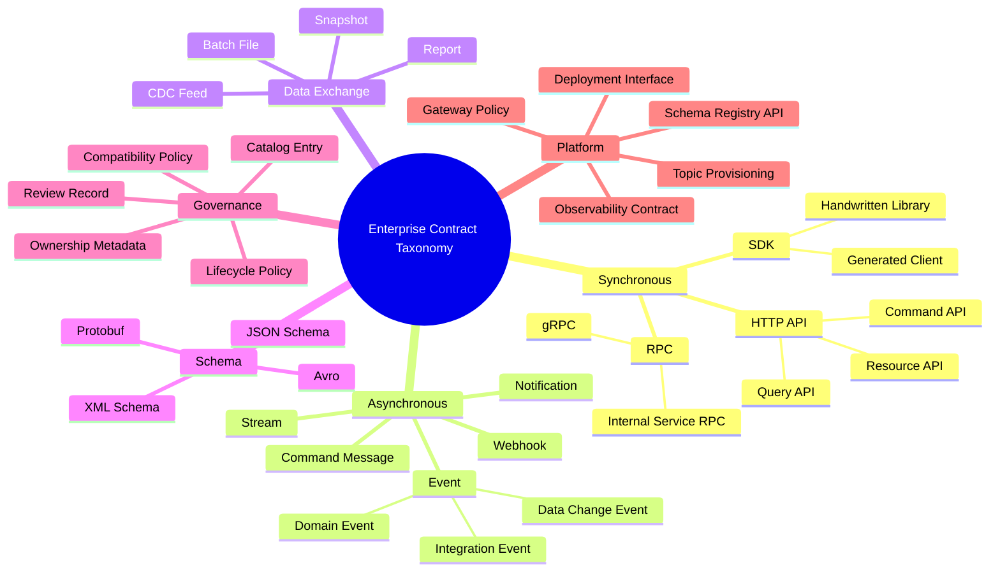
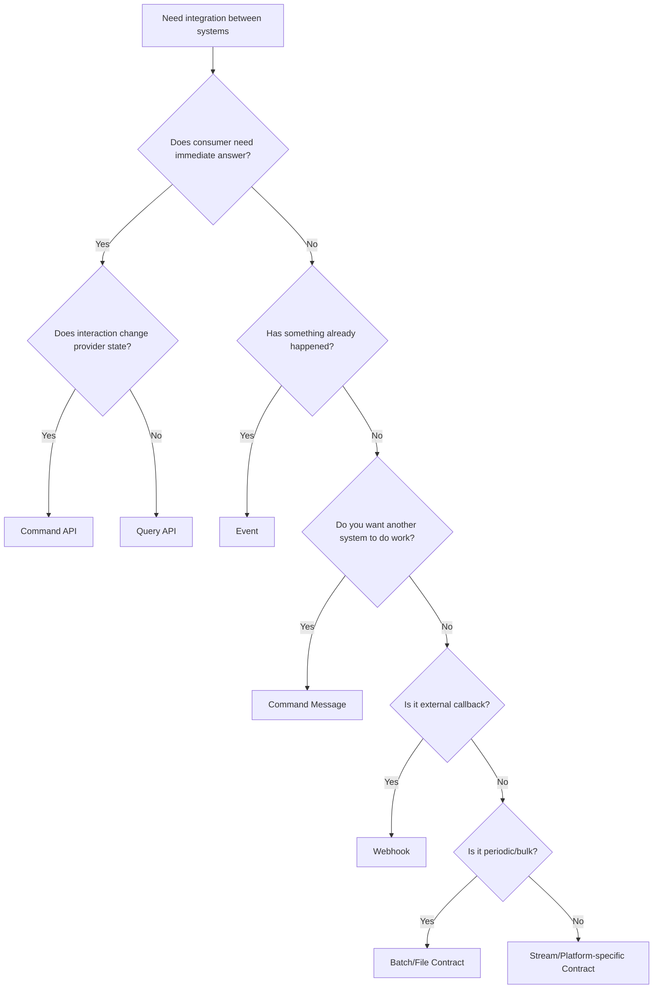
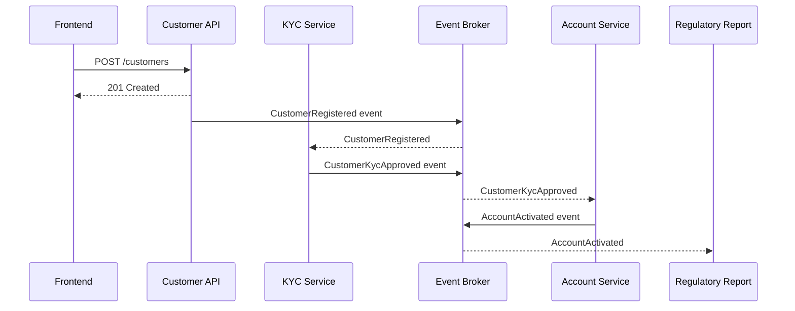
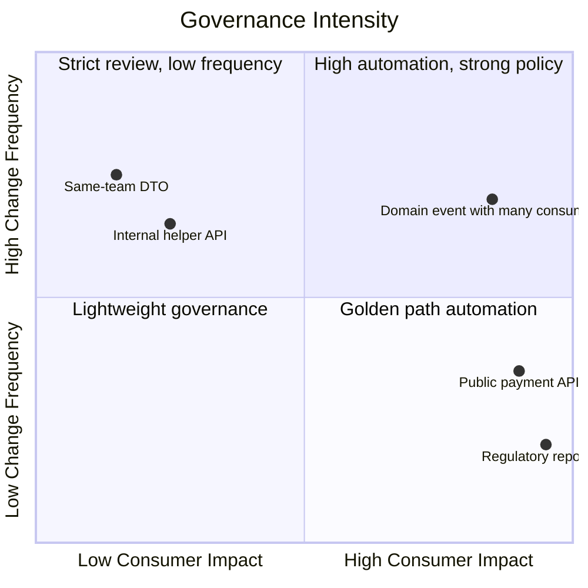
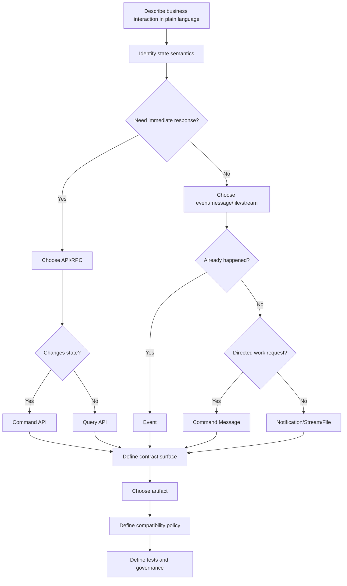
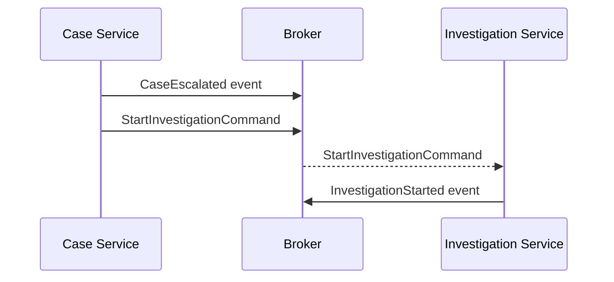
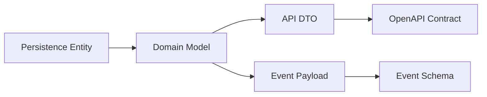

# Part 002 — Contract Taxonomy: HTTP APIs, Events, Schemas, Commands, Queries, and Platform Contracts

## 1. Tujuan Part Ini

Part 001 membangun mental model: contract sebagai boundary, promise, compatibility surface, dan governance artifact.

Part 002 menjawab pertanyaan berikut:

> “Jenis contract apa yang sedang saya desain, dan apa konsekuensi engineering dari pilihan itu?”

Ini penting karena banyak incident contract terjadi bukan karena engineer tidak tahu syntax OpenAPI/AsyncAPI/Avro/Protobuf, tetapi karena salah mengklasifikasikan interaksi.

Contoh kesalahan taxonomy:

- Event dipakai sebagai command.
- API query dipakai sebagai workflow transition.
- Webhook dianggap sama dengan internal event.
- File exchange dianggap “hanya CSV”, padahal menjadi contract regulatory.
- SDK dianggap helper, padahal menjadi compatibility surface.
- Topic Kafka dianggap implementation detail, padahal consumer bergantung pada key, ordering, dan retention.
- Schema registry dianggap cukup, padahal event semantics tidak tertulis.

Setelah part ini, kamu harus bisa:

1. Mengklasifikasikan contract berdasarkan interaction model.
2. Membedakan HTTP API, RPC, event, command, query, webhook, batch, file, stream, SDK, dan platform contract.
3. Menjelaskan contract surface untuk setiap jenis.
4. Menentukan compatibility risk per jenis contract.
5. Memilih artifact yang tepat: OpenAPI, AsyncAPI, Avro, Protobuf, JSON Schema, IDL, ADR/CDR, catalog metadata, atau test contract.
6. Membuat contract profile card untuk review enterprise.

---

## 2. Why Taxonomy Matters

Tanpa taxonomy, semua interface terlihat seperti “data lewat dari A ke B”. Itu terlalu dangkal.

Interface punya sifat berbeda:

| Interaksi | Pertanyaan utama |
|---|---|
| HTTP API | Apa yang diminta consumer dan apa response-nya sekarang? |
| Query API | Bagaimana consumer membaca state tanpa mengubah state? |
| Command API | Bagaimana consumer meminta perubahan state? |
| Event | Fakta bisnis apa yang sudah terjadi? |
| Notification | Pihak lain perlu tahu apa, tanpa menjadi source of truth? |
| Webhook | Bagaimana external provider memanggil kita secara async-ish? |
| Stream | Apa sequence data yang terus mengalir? |
| Batch/File | Snapshot atau exchange periodik apa yang diproses? |
| SDK | Abstraksi client apa yang menjadi public surface? |
| Platform contract | Interface apa yang disediakan platform untuk teams? |

Jika taxonomy salah, contract salah.

---

## 3. Contract Taxonomy Map



Diagram ini bukan sekadar daftar. Ia menunjukkan bahwa contract bisa berada di banyak layer.

Satu capability enterprise biasanya punya beberapa contract sekaligus.

Contoh capability `Customer Onboarding`:

```text
POST /customers                         -> HTTP command API contract
GET /customers/{id}                     -> HTTP query API contract
CustomerRegistered                      -> domain event contract
CustomerKycApproved                     -> domain event contract
customer-events Kafka topic             -> topic operational contract
customer.v1.CustomerRegistered.avsc     -> Avro schema contract
customer-api Java client                -> SDK contract
Customer API catalog entry              -> discovery/governance contract
PII classification metadata             -> data governance contract
```

---

## 4. Taxonomy Dimension, Bukan Hanya Label

Jangan hanya bertanya “ini API atau event?” Tanyakan dimensi berikut.

### 4.1 Coupling Dimension

| Dimension | Tight | Loose |
|---|---|---|
| Temporal coupling | Consumer menunggu response langsung | Consumer tidak harus online saat event terjadi |
| Schema coupling | Consumer compile terhadap generated class | Consumer tolerant terhadap unknown fields |
| Semantic coupling | Consumer bergantung pada detail domain spesifik | Consumer hanya butuh fact umum |
| Operational coupling | Consumer bergantung pada timeout/rate limit/order | Consumer bisa retry/replay/degrade |
| Release coupling | Provider dan consumer deploy bersama | Provider dan consumer deploy independen |

Contract engineering bertujuan mengelola coupling, bukan pura-pura semua loose-coupled.

---

### 4.2 Time Dimension

| Time property | Meaning |
|---|---|
| Request time | Saat consumer meminta sesuatu |
| Response time | Saat provider menjawab |
| Occurred time | Saat fakta bisnis terjadi |
| Effective time | Saat perubahan mulai berlaku |
| Published time | Saat event keluar |
| Processing time | Saat consumer memproses |
| Reporting period | Periode data file/report |
| Retention window | Berapa lama data/event tersedia |

Banyak contract buruk karena timestamp tidak punya semantic jelas.

Contoh buruk:

```json
{
  "date": "2026-06-29"
}
```

Pertanyaan:

- Date apa?
- Created date?
- Effective date?
- Settlement date?
- Business date?
- Local timezone atau UTC?
- Apakah inclusive/exclusive?

---

### 4.3 Authority Dimension

| Contract type | Siapa authority? |
|---|---|
| Command API | Provider yang mengubah state |
| Query API | Provider sebagai source of truth atau read model |
| Domain event | Producer domain yang mengalami fakta |
| Integration event | Integration layer atau anti-corruption layer |
| Webhook | External system |
| File report | Report producer berdasarkan cut-off tertentu |
| CDC event | Database/source log, bukan necessarily domain semantic |
| SDK | Library owner, tetapi behavior tetap mengikuti remote provider |

Authority penting karena menentukan siapa yang boleh mengubah meaning.

---

### 4.4 Audience Dimension

| Audience | Governance expectation |
|---|---|
| Same-team internal | Lightweight, fast, but still testable |
| Cross-team internal | Ownership, compatibility, review, catalog |
| Platform-wide | Strict compatibility, strong docs, support model |
| Partner/external | Formal lifecycle, versioning, deprecation, SLA |
| Public API | Long-term stability, security, abuse protection, docs quality |
| Regulatory/audit | Evidence, traceability, controlled change, retention |

Semakin jauh audience dari provider, semakin konservatif contract evolution harus dilakukan.

---

### 4.5 State Semantics Dimension

| Interaction | State meaning |
|---|---|
| Command | Request to change state |
| Query | Read state |
| Event | State already changed or fact occurred |
| Notification | Something worth knowing, not necessarily source of truth |
| Snapshot | State at a point in time |
| CDC | Low-level data mutation |
| Report | Derived state for period/purpose |

Kesalahan umum: event yang sebenarnya command.

Bad:

```text
CreateInvoiceEvent
```

Jika maksudnya “please create invoice”, itu command.

Better:

```text
CreateInvoiceCommand
InvoiceCreated
```

---

## 5. HTTP API Contract

HTTP API contract adalah contract untuk interaksi request-response melalui HTTP.

OpenAPI adalah artifact utama untuk mendeskripsikan HTTP API secara machine-readable.

### 5.1 Contract Surface

| Surface | Contoh |
|---|---|
| Path | `/customers/{customerId}` |
| Method | `GET`, `POST`, `PUT`, `PATCH`, `DELETE` |
| Path parameter | `customerId` |
| Query parameter | `page`, `size`, `sort`, `status` |
| Headers | `Authorization`, `Idempotency-Key`, `If-Match`, `X-Correlation-Id` |
| Request body | DTO input |
| Response body | DTO output |
| Status code | `200`, `201`, `400`, `404`, `409`, `422`, `429`, `500` |
| Error model | `errorCode`, `message`, `details`, `retryable` |
| Security scheme | OAuth2, mTLS, API key |
| Rate limit | Quota, burst, retry-after |
| Caching | ETag, Cache-Control |
| Idempotency | Idempotency key behavior |

### 5.2 When to Use

Gunakan HTTP API ketika:

- Consumer butuh request-response langsung.
- Consumer perlu query state sekarang.
- Consumer perlu command dengan immediate acknowledgement.
- Human/developer usability penting.
- API perlu mudah diakses lintas bahasa/platform.

### 5.3 Contract Risk

Risiko utama:

- Status code tidak konsisten.
- Error model tidak stabil.
- Required field berubah.
- Null/absent tidak jelas.
- Pagination berubah.
- Idempotency diklaim tetapi tidak benar.
- Authentication/authorization behavior tidak terdokumentasi.
- Response generated dari entity internal.

### 5.4 Java Implication

Di Java, HTTP API contract sering terhubung dengan:

- Spring MVC/WebFlux controller.
- Jakarta REST resource.
- DTO records/classes.
- Bean Validation.
- Jackson serialization.
- OpenAPI generator/springdoc/swagger-core.
- Generated Java clients.

Tetapi jangan menjadikan Java controller sebagai satu-satunya contract source tanpa drift detection.

---

## 6. Command API Contract

Command API adalah API yang meminta provider melakukan perubahan state.

Contoh:

```http
POST /accounts/{accountId}/close
POST /payments
POST /customers/{customerId}/kyc-verifications
```

### 6.1 Command Contract Must Define

- Preconditions.
- Idempotency.
- Authorization.
- State transition semantics.
- Validation errors.
- Business rule errors.
- Accepted vs completed semantics.
- Synchronous vs asynchronous execution.
- Retry safety.
- Conflict handling.

### 6.2 Bad Command Contract

```http
POST /accounts/updateStatus
```

Request:

```json
{
  "status": "CLOSED"
}
```

Masalah:

- Generic update.
- Tidak jelas transition reason.
- Tidak jelas precondition.
- Tidak jelas idempotency.
- Tidak jelas apakah close immediate atau pending.
- Tidak jelas error jika account punya unsettled transaction.

### 6.3 Better Command Contract

```http
POST /accounts/{accountId}/closure-requests
Idempotency-Key: 01JZ0W...
```

Request:

```json
{
  "reasonCode": "CUSTOMER_REQUEST",
  "requestedBy": "customer-service-agent",
  "requestedAt": "2026-06-29T10:00:00Z"
}
```

Response:

```json
{
  "closureRequestId": "CLR-123",
  "accountId": "ACC-123",
  "status": "PENDING_SETTLEMENT",
  "nextReviewAt": "2026-06-30T00:00:00Z"
}
```

Contract improvement:

- Command has business identity.
- Request is idempotent.
- State transition is explicit.
- Async completion can be represented later by event.

---

## 7. Query API Contract

Query API membaca state tanpa mengubah state.

Contoh:

```http
GET /customers/{customerId}
GET /accounts?customerId=CUST-123&status=ACTIVE
GET /payments/{paymentId}
```

### 7.1 Query Contract Must Define

- Read consistency expectation.
- Pagination.
- Filtering.
- Sorting.
- Field projection.
- Caching.
- Authorization filtering.
- Not found vs hidden due to authorization.
- Snapshot time.
- Staleness tolerance.

### 7.2 Common Risk

Query API sering dianggap sederhana, padahal consumer bisa bergantung pada subtle behavior.

Contoh:

```http
GET /accounts?customerId=CUST-123
```

Pertanyaan contract:

- Apakah mengembalikan closed accounts?
- Urutan default apa?
- Apakah hasil eventually consistent?
- Apakah paging stable saat data berubah?
- Apakah unauthorized account disembunyikan atau return 403?
- Apakah empty list berarti tidak ada account atau data belum indexed?

---

## 8. RPC/gRPC Contract

RPC contract mendefinisikan method/service interface, sering dengan IDL seperti Protocol Buffers.

Contoh proto:

```proto
service CustomerService {
  rpc GetCustomer(GetCustomerRequest) returns (CustomerResponse);
}
```

### 8.1 When to Use

Gunakan RPC/gRPC ketika:

- Internal service-to-service latency penting.
- Strong typing lintas bahasa diperlukan.
- Streaming RPC dibutuhkan.
- Contract-first IDL cocok dengan platform.
- Consumer dan provider relatif controlled.

### 8.2 Contract Surface

| Surface | Contoh |
|---|---|
| Service name | `CustomerService` |
| Method name | `GetCustomer` |
| Request message | `GetCustomerRequest` |
| Response message | `CustomerResponse` |
| Field numbers | Protobuf tags |
| Error/status | gRPC status + details |
| Deadline | Timeout expectation |
| Metadata | Headers/trailers |
| Streaming mode | unary, server streaming, client streaming, bidi |

### 8.3 Risk

- Field number reuse.
- Required semantic hidden behind optional fields.
- Enum evolution failure.
- Error details not standardized.
- Deadline/retry behavior not documented.
- Generated client creates false sense of compatibility.

---

## 9. Event Contract

Event contract mendeskripsikan fakta yang sudah terjadi.

Contoh:

```text
CustomerRegistered
CustomerKycApproved
AccountActivated
PaymentSettled
CaseEscalated
```

### 9.1 Event is a Fact

Event harus bernama past tense atau fact-like.

Good:

```text
InvoiceCreated
PaymentSettled
CustomerRiskRatingChanged
```

Suspicious:

```text
CreateInvoice
SettlePayment
UpdateCustomerRisk
```

Jika message meminta sesuatu terjadi, itu command, bukan event.

### 9.2 Event Contract Surface

| Surface | Contoh |
|---|---|
| Event type/name | `CustomerKycApproved` |
| Envelope | eventId, occurredAt, producer, correlationId |
| Payload | business facts |
| Schema | Avro/Protobuf/JSON Schema |
| Topic/channel | `customer.lifecycle.events` |
| Key | `customerId` |
| Ordering | per customer |
| Retention | 30 days, compacted, infinite archive |
| Replay | allowed/not allowed, side-effect rules |
| Compatibility | backward/full/transitive |
| Classification | PII/confidential/public |

### 9.3 Event Contract Risk

- Event name vague.
- Payload is database row.
- Missing event identity.
- Missing occurredAt.
- Key does not match ordering assumption.
- Consumer treats notification as source of truth.
- Schema compatibility passes but semantic meaning changed.
- Replay breaks consumers because event processing has side effects.

---

## 10. Domain Event vs Integration Event vs Data Event

Tidak semua event sama.

### 10.1 Domain Event

Domain event merepresentasikan fakta bermakna dalam domain.

```text
AccountClosed
CustomerKycApproved
FraudCaseEscalated
```

Kualitas:

- Business language.
- Stable meaning.
- Published by domain owner.
- Useful for multiple consumers.
- Should survive implementation change.

### 10.2 Integration Event

Integration event dirancang untuk kebutuhan integrasi tertentu.

```text
CustomerProfileSyncedToCrm
NotificationDispatchRequested
```

Kualitas:

- Often narrower.
- May be tied to integration flow.
- Still needs contract, but lifecycle may be shorter.

### 10.3 Data Change Event / CDC

CDC event merepresentasikan perubahan data low-level.

```text
customers table row updated
accounts.balance changed
```

Kualitas:

- Strongly tied to persistence model.
- Useful for replication/analytics.
- Dangerous if treated as domain event.
- Schema evolution tied to database evolution.

### 10.4 Comparison

| Type | Source | Meaning | Consumer risk |
|---|---|---|---|
| Domain event | Domain service | Business fact | Semantic break |
| Integration event | Integration service | Flow-specific signal | Flow coupling |
| CDC event | Database/log | Data mutation | Persistence leakage |

---

## 11. Command Message Contract

Command message adalah asynchronous request to do something.

Contoh:

```text
GenerateMonthlyStatementCommand
SendCustomerNotificationCommand
RecalculateRiskScoreCommand
```

### 11.1 Contract Surface

- Command name.
- Command ID.
- Target handler.
- Preconditions.
- Idempotency key.
- Deadline/expiry.
- Retry policy.
- Expected outcome event.
- Failure event/error channel.

### 11.2 Difference from Event

| Command | Event |
|---|---|
| Imperative | Past fact |
| Directed to handler | Broadcastable |
| Can be rejected | Already happened |
| Needs idempotency | Needs deduplication/replay semantics |
| Often has deadline | Has occurredAt/effectiveAt |

### 11.3 Common Mistake

Bad:

```text
CustomerCreatedEvent consumed by Account Service to create account automatically.
```

If account creation is mandatory and directed, model the dependency explicitly.

Better options:

1. Orchestrated command: `CreateAccountForCustomerCommand`.
2. Choreography with domain event: `CustomerRegistered` plus account service independently decides.
3. Workflow engine: state transition with commands and events.

The right choice depends on coupling and business ownership.

---

## 12. Notification Contract

Notification is “something worth telling”, but not necessarily canonical fact.

Examples:

```text
CustomerProfileUpdatedNotification
PasswordResetEmailRequested
MaintenanceWindowAnnouncement
```

### 12.1 Notification Characteristics

- Often lossy-tolerant.
- May not be replayable.
- Often user/channel oriented.
- May duplicate domain facts in simpler form.
- Consumer should not always treat it as source of truth.

### 12.2 Risk

- Consumer starts relying on notification as authoritative state.
- Notification payload lacks enough context.
- Delivery guarantee unclear.
- Duplicate notification causes bad user experience.

### 12.3 Contract Rule

Always state:

```text
Is this notification authoritative?
Can consumers derive state from it?
Should consumers call a query API to fetch current state?
```

---

## 13. Webhook Contract

Webhook is an HTTP callback where an external/internal provider sends event-like messages to a consumer endpoint.

Example:

```http
POST /webhooks/payment-provider/events
```

### 13.1 Webhook Contract Surface

- Endpoint path.
- Authentication/signature verification.
- Event type.
- Payload schema.
- Delivery retry policy.
- Timeout expected by sender.
- Acknowledgement semantics.
- Idempotency/deduplication.
- Event ordering.
- Replay/manual resend.
- Versioning.

### 13.2 Webhook is Not Just HTTP API

Webhook uses HTTP transport, but its semantics are asynchronous event delivery.

So it needs both:

- HTTP contract: status code, authentication, request body.
- Event contract: event type, event ID, occurredAt, deduplication, retry, ordering.

### 13.3 Common Risk

- Returning `200` before durable persistence.
- No signature validation.
- No replay handling.
- No idempotency.
- Treating delivery order as guaranteed without provider promise.
- Not storing raw payload for forensic analysis.

---

## 14. Stream Contract

Stream contract describes continuous flow of records.

Examples:

- Kafka topic.
- Kinesis stream.
- WebSocket feed.
- Server-sent events.
- gRPC streaming.

### 14.1 Contract Surface

- Stream/channel name.
- Record schema.
- Keying/partitioning.
- Ordering guarantee.
- Delivery guarantee.
- Retention.
- Replay.
- Consumer offset semantics.
- Backpressure behavior.
- Rate/volume expectation.
- Schema evolution.

### 14.2 Stream-Specific Risk

- Volume increase breaks consumers.
- Key change breaks ordering.
- Retention change breaks recovery.
- Compaction semantics misunderstood.
- Consumer assumes exactly-once because producer says “no duplicates”.
- Schema is valid but record order causes wrong aggregation.

---

## 15. Batch/File Contract

Batch/file contracts are often underestimated.

Examples:

- Daily settlement CSV.
- Monthly regulatory report XML.
- Partner reconciliation file.
- Bulk customer import.
- Data warehouse export.

### 15.1 Contract Surface

| Surface | Example |
|---|---|
| File name pattern | `settlement_YYYYMMDD_seq.csv` |
| Format | CSV, JSONL, XML, Parquet |
| Encoding | UTF-8 |
| Delimiter | comma, pipe, tab |
| Header | required/optional |
| Schema | columns/elements/types |
| Null representation | empty, `NULL`, missing |
| Date/time format | ISO date, local business date |
| Ordering | sorted by accountId? none? |
| Completeness | full snapshot or delta |
| Cut-off time | business day close |
| Delivery mechanism | SFTP, object storage, API download |
| Retry/replacement | overwrite, append, correction file |
| Reconciliation | control totals/checksum |

### 15.2 Why File Contract is Critical

File contracts often carry:

- Money movement.
- Regulatory reporting.
- Partner settlement.
- Bulk migration.
- Audit evidence.

A CSV column rename can be as breaking as API field removal.

### 15.3 File Contract Risk

- Excel-style formatting corrupts identifiers.
- Leading zero lost.
- Local timezone ambiguity.
- Null vs empty string unclear.
- Partial file processed as complete.
- Reprocessing creates duplicates.
- Correction file semantics unclear.

---

## 16. Schema Contract

Schema contract describes data shape independent of one transport.

Common schema technologies:

- JSON Schema.
- Avro schema.
- Protobuf `.proto`.
- XML Schema.
- Database schema.
- Parquet schema.

### 16.1 Schema is Not Enough

Schema can say:

```json
{
  "type": "string",
  "enum": ["ACTIVE", "SUSPENDED", "CLOSED"]
}
```

It does not necessarily say:

- What ACTIVE means.
- Whether ACTIVE allows transaction.
- Whether SUSPENDED can become ACTIVE again.
- Whether CLOSED is terminal.
- Whether enum can grow.

Contract engineering wraps schema with semantic and lifecycle policy.

### 16.2 Schema Contract Surface

- Name.
- Namespace/package.
- Field names/types.
- Required/optional/default.
- Nullability.
- Enum values.
- References/imports.
- Logical types.
- Compatibility mode.
- Owner.
- Version.
- Examples.

---

## 17. SDK/Client Library Contract

SDK is often forgotten as a contract.

Example:

```java
CustomerClient client = CustomerClient.builder()
    .baseUrl(baseUrl)
    .tokenProvider(tokenProvider)
    .build();

Customer customer = client.getCustomer("CUST-123");
```

### 17.1 SDK Contract Surface

- Public classes/methods.
- Method signatures.
- Exception types.
- Retry defaults.
- Timeout defaults.
- Serialization behavior.
- Thread-safety.
- Dependency versions.
- Configuration properties.
- Backward compatibility of public API.

### 17.2 Risk

- Generated client changes method names.
- Exception hierarchy changes.
- Retry policy changes silently.
- Timeout default changes.
- SDK exposes remote enum directly and breaks on new enum values.
- SDK version not aligned with API version.

### 17.3 Rule

If consumers compile against it, it is a contract.

---

## 18. Platform Contract

Platform contract adalah interface yang platform team berikan ke application teams.

Examples:

- How to provision Kafka topics.
- How to register schema.
- How to define API gateway route.
- How to publish service metadata.
- How to emit standard telemetry.
- How to define deployment manifest.
- How to request secrets.
- How to configure rate limit.

### 18.1 Platform Contract Surface

- YAML/JSON manifest schema.
- CLI command interface.
- Terraform module variables.
- Helm chart values.
- Annotation format.
- Required metadata.
- Policy constraints.
- Lifecycle state.
- Error messages.

### 18.2 Risk

- Platform changes break all teams.
- Manifest schema changes without migration.
- Policy error messages unclear.
- Teams bypass platform because contract is hard to use.
- Contract exists but no compatibility guarantee.

### 18.3 Good Platform Contract Example

```yaml
apiVersion: platform.example.com/v1
kind: KafkaTopic
metadata:
  name: customer.lifecycle.events
  owner: team-customer-platform
spec:
  partitions: 12
  retentionDays: 30
  cleanupPolicy: delete
  keyStrategy: customerId
  dataClassification: confidential
  schemaCompatibility: BACKWARD_TRANSITIVE
```

This is a contract between application team and platform.

---

## 19. Catalog Contract

Catalog entry is a governance/discovery contract.

It tells humans and tools:

- What exists.
- Who owns it.
- How to consume it.
- What lifecycle state it has.
- What classification it has.
- What dependencies exist.

### 19.1 Catalog Metadata

```yaml
name: customer-api
kind: http-api
owner: team-customer-platform
domain: customer-onboarding
lifecycle: active
audience: internal-cross-team
contractLocation: contracts/openapi/customer-api.yaml
runtimeService: customer-service
dataClassification: confidential
supportChannel: '#team-customer-platform'
deprecation: null
```

### 19.2 Risk

- Catalog stale.
- Owner invalid.
- Contract link broken.
- Consumer list incomplete.
- Classification missing.
- Deprecated API still shown as preferred.

Catalog quality is part of contract governance.

---

## 20. Contract Artifact Selection

Choose artifact based on contract type.

| Contract type | Primary artifact | Supporting artifact |
|---|---|---|
| HTTP API | OpenAPI | Examples, contract tests, ADR/CDR |
| gRPC/RPC | Protobuf IDL | Buf rules, generated clients, compatibility tests |
| Event API | AsyncAPI | Schema, examples, topic contract |
| Kafka event schema | Avro/Protobuf/JSON Schema | Schema registry metadata, AsyncAPI |
| Webhook | OpenAPI + event schema | Signature docs, retry policy |
| Batch/file | Schema/spec doc | Control totals, sample files, reconciliation tests |
| SDK | Java API surface | SemVer policy, binary compatibility checks |
| Platform manifest | JSON Schema/OpenAPI-like schema | Policy-as-code, examples |
| Catalog entry | YAML/JSON metadata | Ownership validation, scorecard |

Do not force every problem into OpenAPI.

---

## 21. Interaction Pattern Decision Tree



This tree is simplified. Real systems combine patterns.

Example:

- API command accepts request.
- Domain service changes state.
- Event is published.
- Consumer updates read model.
- Query API exposes read model.
- Batch report reconciles end-of-day.

Each step has a different contract.

---

## 22. Contract Composition in Real Systems

### 22.1 Customer Onboarding Example



Contracts involved:

| Flow | Contract |
|---|---|
| UI -> API | HTTP command API contract |
| API -> UI | Response/error contract |
| API -> Broker | Event contract + schema + topic contract |
| Broker -> KYC | Consumer event expectation |
| KYC -> Broker | Event contract + schema compatibility |
| Account -> Broker | Event contract |
| Broker -> Report | Replay/retention/classification contract |

Satu business flow bisa punya 8+ contract surfaces.

---

## 23. Taxonomy Matrix

Gunakan matrix ini untuk review.

| Type | Coupling | Source of truth | Artifact | Main risk | Governance strength |
|---|---|---|---|---|---|
| Command API | Temporal tight | Provider domain | OpenAPI | Duplicate side effect, bad error semantics | Medium-high |
| Query API | Temporal tight | Provider/read model | OpenAPI | Staleness, pagination, authorization ambiguity | Medium |
| RPC | Temporal tight | IDL/provider | Protobuf | Field number reuse, deadline/retry ambiguity | Medium |
| Domain event | Temporal loose | Producer domain | AsyncAPI + schema | Semantic break, replay break | High |
| Command message | Temporal loose | Command owner | AsyncAPI + schema | Duplicate execution, expiry ambiguity | High |
| Notification | Loose | Producer or channel owner | AsyncAPI/schema | Treated as authoritative when not | Medium |
| Webhook | Mixed | External sender | OpenAPI/schema | Signature/retry/idempotency failure | High |
| Stream | Loose but continuous | Producer/platform | AsyncAPI/schema/topic spec | Ordering/key/retention break | High |
| File/batch | Loose periodic | File producer | File spec/schema | Cut-off/null/control total ambiguity | High |
| SDK | Compile-time tight | Library owner | Java API + docs | Binary/source incompatibility | Medium-high |
| Platform manifest | Operational tight | Platform team | JSON Schema/policy | Platform-wide break | Very high |

---

## 24. Contract Profile Card

Setiap contract sebaiknya bisa dijelaskan dengan profile card.

```md
# Contract Profile

## Identity
Name:
Type:
Domain:
Owner:
Audience:
Lifecycle State:

## Interaction
Provider:
Consumers:
Transport:
Synchronous/Asynchronous:
Command/Query/Event/Notification/Batch:

## Artifacts
Primary Contract:
Schema:
Examples:
Tests:
Catalog Entry:

## Compatibility
Compatibility Policy:
Safe Changes:
Breaking Changes:
Deprecation Window:
Consumer Migration Strategy:

## Operational Semantics
Idempotency:
Retry:
Ordering:
Timeout/Deadline:
Retention:
Replay:
Failure Channel:

## Governance
Reviewers:
Approval Policy:
Data Classification:
Security Requirements:
Audit Requirements:

## Observability
Contract Validation Metrics:
Consumer Error Signals:
Drift Detection:
```

This card forces taxonomy clarity.

---

## 25. Examples of Misclassification

### 25.1 Event Misclassified as Command

Bad:

```text
UserSignupEvent consumed by Email Service, which must send welcome email.
```

If the business requirement is “send email”, there are options:

- `UserSignedUp` event + Email Service independently reacts.
- `SendWelcomeEmailCommand` if directed execution is required.
- Workflow orchestration if retry/compensation/visibility matters.

Question:

```text
Is Email Service observing a fact or being instructed?
```

---

### 25.2 Query Misclassified as Command

Bad:

```http
GET /accounts/{id}/activate
```

This violates method semantics. It changes state via GET.

Better:

```http
POST /accounts/{id}/activation-requests
```

---

### 25.3 CDC Misclassified as Domain Event

Bad:

```text
Customer table updated -> all consumers treat it as CustomerProfileChanged
```

Problem:

- Table update may include technical changes.
- Not every update is domain-relevant.
- Multiple domain meanings collapsed into one event.
- Database schema change becomes event contract change.

Better:

- CDC for replication/analytics.
- Domain event for business fact.

---

### 25.4 File Contract Treated as Implementation Detail

Bad:

```text
Finance team changes column order because parser uses headers anyway.
```

But partner parser may depend on column position.

Contract must specify:

- Header required?
- Column order stable?
- Unknown columns tolerated?
- Missing columns allowed?
- File replacement semantics?

---

## 26. Java Project Layout by Contract Type

A contract-aware Java repository can separate artifacts clearly.

```text
customer-platform/
  contracts/
    openapi/
      customer-command-api.yaml
      customer-query-api.yaml
    asyncapi/
      customer-events.yaml
    avro/
      CustomerRegistered.avsc
      CustomerKycApproved.avsc
    proto/
      customer_service.proto
    json-schema/
      customer-platform-manifest.schema.json
    files/
      monthly-customer-report.md
      examples/
  contract-tests/
    provider/
    consumer/
    schema-compatibility/
    replay/
  services/
    customer-service/
    kyc-service/
    account-service/
  catalog/
    customer-api.yaml
    customer-events.yaml
```

### 26.1 Why Separate Contracts from Implementation

Benefits:

- Contract review can happen without reading service code.
- Diff is easier.
- Ownership metadata is explicit.
- CI gates can run fast.
- Contract artifacts can be published.
- Catalog can index them.

Risk:

- Contract drift if implementation verification is weak.

Therefore, separation must be paired with tests/generation.

---

## 27. Taxonomy and Compatibility

Compatibility differs by type.

### 27.1 HTTP API Compatibility

Usually safe:

- Add new endpoint.
- Add optional response field.
- Add optional request field with default behavior.
- Add new error detail field while preserving errorCode.

Usually breaking:

- Remove endpoint.
- Remove/rename field.
- Change field type.
- Change requiredness.
- Change status code for same business outcome.
- Change idempotency behavior.

---

### 27.2 Event Compatibility

Usually safe:

- Add optional field with default/tolerant consumer policy.
- Add new event type to topic if consumers tolerate unknown event types.
- Add metadata field in envelope if ignored by old consumers.

Usually breaking:

- Remove field.
- Change field type.
- Change event key.
- Change event type name.
- Change ordering guarantee.
- Change occurredAt meaning.
- Change replay semantics.

---

### 27.3 File Compatibility

Usually safe:

- Add trailing optional column if consumers tolerate unknown columns.
- Add optional XML element if parser tolerates it.
- Add new file type with distinct name pattern.

Usually breaking:

- Reorder columns if position-based consumers exist.
- Change delimiter.
- Change date format.
- Change null representation.
- Remove control total.
- Change file completeness semantics.

---

### 27.4 SDK Compatibility

Usually safe:

- Add method.
- Add overload carefully.
- Add optional configuration.
- Add subtype if callers don't exhaustively switch.

Usually breaking:

- Remove/rename public method.
- Change method signature.
- Change exception type.
- Change default timeout/retry unexpectedly.
- Upgrade dependency causing conflict.

---

## 28. Taxonomy and Ownership

Ownership must match semantic authority.

| Contract | Owner should be |
|---|---|
| Customer domain event | Customer domain team |
| Kafka topic policy | Platform streaming team + domain owner |
| OpenAPI for customer API | Customer API provider team |
| Partner webhook | Integration/partner team |
| Regulatory report file | Reporting domain owner + compliance reviewer |
| Platform manifest | Platform team |
| SDK | API provider or developer experience team |

Bad ownership:

```text
Platform team owns all event schemas.
```

Platform team can own schema registry and policy. But domain event semantic must be owned by domain team.

---

## 29. Taxonomy and Governance Intensity

Not all contracts need equal process.



Interpretation:

- High impact + high change frequency needs automation, not manual bottleneck.
- High impact + low change frequency can tolerate stricter review.
- Low impact + high frequency needs golden path and lightweight checks.
- Low impact + low frequency should not be over-governed.

---

## 30. Boundary Between Contract and Implementation

A contract should not expose implementation details unless the implementation detail is intentionally part of the promise.

### 30.1 Bad Implementation Leakage

```json
{
  "dbShard": "shard-7",
  "hibernateVersion": 3,
  "internalStatusFlag": "A1",
  "legacyCustomerPk": 982341
}
```

### 30.2 Legitimate Operational Contract

Some operational details are valid contract if consumer needs them.

Example event:

```json
{
  "partitionKey": "CUST-123",
  "sequenceNumber": 89123
}
```

This can be legitimate if ordering/replay semantics require it.

Rule:

```text
Expose operational detail only when it is stable, documented, and intentionally supported.
```

---

## 31. Semantic Contract Types

Beyond transport, contracts also differ by semantic role.

### 31.1 Entity Contract

Represents a business entity.

```json
{
  "customerId": "CUST-123",
  "name": "...",
  "status": "ACTIVE"
}
```

Risk:

- Becomes too large.
- Consumers depend on every field.
- Entity shape follows database.

---

### 31.2 State Transition Contract

Represents state movement.

```json
{
  "caseId": "CASE-123",
  "fromState": "UNDER_REVIEW",
  "toState": "ESCALATED",
  "reasonCode": "HIGH_RISK"
}
```

Risk:

- State machine semantics hidden.
- Illegal transition not documented.
- Reason code uncontrolled.

---

### 31.3 Decision Contract

Represents decision outcome.

```json
{
  "decisionId": "DEC-123",
  "subjectId": "CUST-123",
  "outcome": "APPROVED",
  "policyVersion": "2026.06",
  "reasons": ["KYC_CLEAR"]
}
```

Risk:

- Missing policy version.
- Reasons not stable.
- Explainability/audit weak.

---

### 31.4 Measurement Contract

Represents measured value.

```json
{
  "metric": "risk_score",
  "value": 72,
  "scale": "0-100",
  "measuredAt": "2026-06-29T10:00:00Z"
}
```

Risk:

- Unit/scale omitted.
- Model version omitted.
- Measurement time ambiguous.

---

### 31.5 Eligibility Contract

Represents allowed/not allowed decision.

```json
{
  "eligible": false,
  "reasons": ["KYC_PENDING", "SANCTIONS_REVIEW"]
}
```

Risk:

- Boolean hides nuance.
- Reason taxonomy unstable.
- Consumer treats current eligibility as future guarantee.

---

## 32. Contract Type Smells

Use these smells to detect wrong taxonomy.

| Smell | Possible issue |
|---|---|
| Event name starts with imperative verb | It may be a command |
| GET changes state | Query/command confusion |
| Event payload mirrors DB table | CDC mistaken for domain event |
| Field named `status` has 12 unrelated values | Multiple state dimensions collapsed |
| Webhook handler has side effects before persistence | Retry/idempotency risk |
| SDK catches all errors and returns null | Error contract destroyed |
| File has no control totals | Reconciliation risk |
| API returns 200 for business failure | Error semantics ambiguity |
| Enum has `OTHER` but no handling rules | Semantic escape hatch without governance |
| Topic name includes service implementation | Coupling to producer internals |

---

## 33. Contract Taxonomy Review Checklist

### 33.1 Identity

- [ ] What is the contract name?
- [ ] What type is it?
- [ ] Who owns it?
- [ ] Who consumes it?
- [ ] Is the audience internal, external, partner, platform, or regulatory?

### 33.2 Interaction

- [ ] Is it synchronous or asynchronous?
- [ ] Is it command, query, event, notification, stream, file, or SDK?
- [ ] Is the provider authoritative?
- [ ] Does the consumer expect immediate response?
- [ ] Does the interaction change state?

### 33.3 Artifact

- [ ] Is OpenAPI appropriate?
- [ ] Is AsyncAPI appropriate?
- [ ] Is Avro/Protobuf/JSON Schema appropriate?
- [ ] Is additional markdown/ADR/CDR needed for semantics?
- [ ] Are examples included?

### 33.4 Compatibility

- [ ] What changes are safe?
- [ ] What changes are breaking?
- [ ] What changes are semantically dangerous?
- [ ] Is there a compatibility gate?
- [ ] Is there a migration/deprecation path?

### 33.5 Operational Semantics

- [ ] Retry behavior known?
- [ ] Idempotency known?
- [ ] Timeout/deadline known?
- [ ] Ordering known?
- [ ] Replay known?
- [ ] Retention known?
- [ ] Failure channel known?

---

## 34. Practical Classification Exercise

Classify each interaction.

### Case 1

```http
POST /payments
```

With `Idempotency-Key`, creates payment instruction.

Classification:

```text
HTTP Command API Contract
```

Must define:

- Idempotency.
- Duplicate handling.
- Accepted vs settled.
- Error code taxonomy.
- Payment state transition.

---

### Case 2

```text
PaymentSettled
```

Published after clearing/settlement completed.

Classification:

```text
Domain Event Contract
```

Must define:

- Settlement meaning.
- OccurredAt/effectiveAt.
- Payment ID.
- Amount/currency precision.
- Ordering per payment/account.
- Replay safety.

---

### Case 3

```text
payments table updated CDC
```

Classification:

```text
CDC/Data Change Event Contract
```

Must define:

- Table schema.
- Operation type.
- Before/after image.
- Transaction ordering.
- Database schema compatibility.
- Not necessarily domain meaning.

---

### Case 4

```http
POST /webhooks/stripe/events
```

Classification:

```text
Webhook Contract
```

Must define:

- Signature verification.
- Event type registry.
- Idempotency.
- Retry acknowledgement.
- Raw payload storage.

---

### Case 5

```text
monthly_regulatory_case_report_202606.csv
```

Classification:

```text
Batch/File Regulatory Contract
```

Must define:

- Reporting period.
- Cut-off.
- Schema.
- Control totals.
- Correction semantics.
- Retention/audit.

---

## 35. Taxonomy-Driven Design Workflow

Use this workflow before writing any spec.



---

## 36. Enterprise Example: Enforcement Case Management

Karena banyak enterprise/regulatory systems punya lifecycle kompleks, lihat contoh `Enforcement Case`.

### 36.1 Candidate Interactions

| Business need | Correct contract type |
|---|---|
| Create a case | Command API |
| Read case details | Query API |
| Case assigned to investigator | Domain event |
| Request external agency review | Command message or partner API |
| Agency sends review completed | Webhook/event |
| Daily case status export | Batch/file contract |
| Case state changes stream | Event stream |
| Investigator UI client library | SDK/client contract |
| Define case workflow manifest | Platform/workflow contract |

### 36.2 Why This Matters

If `CaseEscalated` event is used to command another team to start investigation, the architecture hides obligation.

Better:

- `CaseEscalated` states fact.
- `StartInvestigationCommand` requests action.
- `InvestigationStarted` confirms action happened.

This separation improves auditability.



In some systems, emitting both event and command may be overkill. But for regulatory lifecycle with accountability, the distinction is valuable.

---

## 37. Contract Taxonomy in Java Architecture

### 37.1 Package Boundaries

A contract-aware Java service should avoid mixing internal models and external contracts.

```text
com.example.customer
  domain/
    Customer.java
    CustomerStatus.java
  application/
    RegisterCustomerUseCase.java
  api/
    http/
      CustomerController.java
      dto/
        RegisterCustomerRequest.java
        CustomerResponse.java
    events/
      CustomerRegisteredEvent.java
  infrastructure/
    persistence/
      CustomerEntity.java
    messaging/
      CustomerEventPublisher.java
```

Rule:

```text
Domain model is not automatically API contract.
Persistence entity is not event contract.
Generated schema class is not automatically business model.
```

### 37.2 Boundary Mapping

Mapping is not busywork. Mapping is contract protection.



Each mapping is a place to enforce semantic boundary.

---

## 38. When One Contract Should Become Multiple Contracts

A common enterprise smell: one contract tries to serve every consumer.

### 38.1 Example Bad Unified Response

```json
{
  "customerId": "CUST-123",
  "name": "...",
  "kycStatus": "APPROVED",
  "riskScore": 72,
  "accounts": [...],
  "latestTransactions": [...],
  "marketingPreferences": {...},
  "internalFlags": {...}
}
```

Problems:

- Too many ownership domains.
- Too much sensitive data.
- Hard to evolve.
- Consumer overfetching.
- Authorization complex.
- Cache invalidation unclear.

### 38.2 Better Split

- Customer profile API.
- Customer risk API.
- Account summary API.
- Marketing preference API.
- Customer lifecycle events.
- Risk decision events.

Contract taxonomy helps decide split by semantic ownership and consumer need.

---

## 39. When Multiple Contracts Should Become One

Opposite smell: too many tiny contracts causing fragmentation.

Bad:

```text
CustomerNameChanged
CustomerPhoneChanged
CustomerEmailChanged
CustomerAddressChanged
```

Maybe okay if each has independent lifecycle. But if consumers always need complete profile changes, better:

```text
CustomerProfileChanged
```

With changed fields:

```json
{
  "customerId": "CUST-123",
  "changedFields": ["email", "phone"],
  "profileVersion": 17
}
```

Decision depends on:

- Consumer use cases.
- Frequency.
- Semantic independence.
- Replay needs.
- Schema evolution risk.

---

## 40. Taxonomy and Data Classification

Contract type affects data policy.

| Contract type | Data classification risk |
|---|---|
| Public API | High external exposure |
| Partner API | Contractual/legal exposure |
| Internal event | Wide internal replication risk |
| CDC | May leak hidden sensitive fields |
| File export | Bulk exfiltration risk |
| SDK | Logs/errors may leak data |
| Catalog | Metadata may reveal sensitive system info |

Contract taxonomy must include classification.

Example metadata:

```yaml
dataClassification: restricted
containsPII: true
piiFields:
  - customerName
  - nationalId
  - dateOfBirth
retentionPolicy: P7Y
allowedConsumers:
  - team-kyc
  - team-regulatory-reporting
```

---

## 41. Contract Taxonomy and Auditability

For audit-heavy systems, every contract type needs evidence.

| Contract | Evidence needed |
|---|---|
| Command API | Who requested, when, idempotency key, result |
| Query API | Access log, authorization, data returned class |
| Domain event | Event ID, occurredAt, producer, source transaction |
| Command message | Command ID, handler, outcome event |
| File report | Generation time, control totals, checksum, approval |
| Schema change | Diff, reviewer, compatibility result |
| Webhook | Signature, raw payload, delivery attempts |

Auditability is not added later. It is designed into contract.

---

## 42. Minimal Contract Metadata Standard

Enterprise teams should converge on minimal metadata.

```yaml
x-contract:
  owner: team-customer-platform
  domain: customer-onboarding
  audience: internal-cross-team
  lifecycle: active
  compatibility: backward-compatible
  dataClassification: confidential
  containsPII: true
  supportChannel: '#team-customer-platform'
  deprecationPolicy: 180-days
```

For event:

```yaml
x-event-contract:
  owner: team-customer-platform
  eventKind: domain-event
  authoritative: true
  orderingKey: customerId
  replayable: true
  retention: P30D
  compatibility: backward-transitive
```

This metadata can later drive linting, catalog, review routing, and CI gates.

---

## 43. Part 002 Exercises

### Exercise 1 — Classify 10 Interfaces

List 10 interfaces from your current/past systems.

For each:

```md
## Interface
Name:

## Classification
Type:
Synchronous/Asynchronous:
Command/Query/Event/Notification/File/SDK/Platform:

## Source of Truth

## Consumers

## Contract Artifact

## Main Compatibility Risk

## Main Governance Requirement
```

---

### Exercise 2 — Find Misclassified Events

Search for event names that start with:

```text
Create
Update
Delete
Send
Generate
Process
Run
Calculate
```

For each, ask:

- Is this truly an event?
- Is it a command?
- Is it a notification?
- Is the target handler implicit?
- Is failure/retry behavior defined?

---

### Exercise 3 — Contract Surface Expansion

Take one simple API:

```http
GET /customers/{id}
```

Expand its contract surface:

- Path.
- Method.
- Parameters.
- Headers.
- Response fields.
- Error model.
- Authorization.
- Caching.
- Staleness.
- Rate limit.
- Consumer assumptions.

---

### Exercise 4 — File Contract Hardening

Take any CSV/report file. Define:

- File name pattern.
- Encoding.
- Delimiter.
- Column order.
- Null representation.
- Date/time format.
- Control totals.
- Correction semantics.
- Partial failure handling.
- Reprocessing idempotency.

---

## 44. Review Questions

1. Apa perbedaan command API dan query API?
2. Mengapa event harus dimodelkan sebagai fact?
3. Kapan CDC event tidak boleh dianggap domain event?
4. Mengapa webhook butuh HTTP semantics dan event semantics sekaligus?
5. Apa contract surface dari SDK Java?
6. Apa risiko menganggap file CSV sebagai implementation detail?
7. Mengapa platform manifest adalah contract?
8. Bagaimana taxonomy mempengaruhi compatibility policy?
9. Bagaimana taxonomy mempengaruhi governance intensity?
10. Mengapa semantic authority penting untuk ownership?

---

## 45. Ringkasan

Contract taxonomy membantu kita memilih model yang benar sebelum menulis spec.

Poin utama:

1. Contract bukan hanya API. Contract bisa berupa event, schema, file, stream, SDK, catalog entry, atau platform manifest.
2. Command, query, event, notification, CDC, dan file punya semantic berbeda.
3. Salah taxonomy menghasilkan salah compatibility policy.
4. Contract surface berbeda untuk setiap type.
5. Ownership harus mengikuti semantic authority.
6. Governance intensity harus mengikuti consumer impact dan change frequency.
7. Java implementation harus menjaga boundary antara domain model, DTO, event payload, persistence entity, dan generated schema class.

Part berikutnya akan masuk ke **Contract Invariants**: hal-hal yang tidak boleh berubah sembarangan meskipun schema terlihat valid.

---

## References

- OpenAPI Specification v3.2.0 — https://spec.openapis.org/oas/v3.2.0.html
- OpenAPI Initiative — https://www.openapis.org/
- AsyncAPI Initiative — https://www.asyncapi.com/
- AsyncAPI Operations Concept — https://www.asyncapi.com/docs/concepts/asyncapi-document/adding-operations
- JSON Schema Specification — https://json-schema.org/specification
- Apache Avro Specification — https://avro.apache.org/docs/1.11.1/specification/
- Protocol Buffers Language Guide — https://protobuf.dev/programming-guides/proto3/
- Protocol Buffers Best Practices — https://protobuf.dev/best-practices/dos-donts/
- Pact Documentation — https://docs.pact.io/
