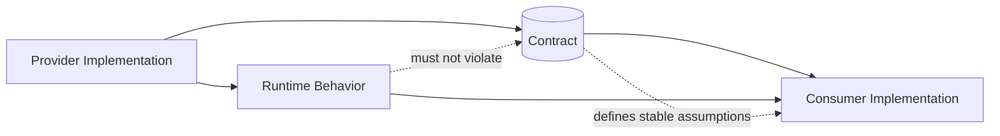
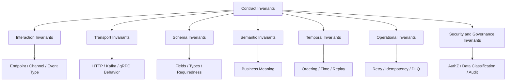
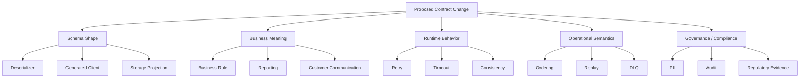

# Part 003 — Contract Invariants: What Must Never Accidentally Change

## 1. Tujuan Part Ini

Part ini membahas **contract invariant**: bagian dari kontrak yang harus dianggap stabil, dilindungi, diuji, dan tidak boleh berubah tanpa proses migrasi yang eksplisit.

Di banyak tim, contract review terlalu fokus pada bentuk data:

```json
{
  "accountId": "A-123",
  "status": "ACTIVE"
}
```

Padahal contract yang sebenarnya jauh lebih luas:

- apakah `accountId` selalu stable identifier?
- apakah `status = ACTIVE` berarti account boleh bertransaksi?
- apakah field boleh hilang?
- apakah enum boleh bertambah?
- apakah consumer boleh retry request yang sama?
- apakah event dengan key yang sama selalu ordered?
- apakah error code tertentu berarti consumer harus retry, compensate, atau stop?
- apakah `occurredAt` adalah business event time atau publish time?
- apakah response `200` berarti state sudah committed atau hanya accepted?

Top-tier contract engineer tidak hanya bertanya:

> “Schema valid atau tidak?”

Mereka bertanya:

> “Promise apa yang sedang dibuat, promise mana yang harus tetap benar setelah sistem berubah, dan apa blast radius kalau promise itu diam-diam berubah?”

---

## 2. Mental Model: Contract Invariant

**Invariant** adalah properti yang harus tetap benar sepanjang lifecycle contract, kecuali ada perubahan versi, migration plan, atau explicit governance approval.

Dalam contract engineering, invariant adalah janji yang consumer boleh jadikan asumsi.



Contoh sederhana:

```http
GET /accounts/{accountId}
```

Invariant yang mungkin melekat:

| Layer | Invariant |
|---|---|
| Interaction identity | `GET /accounts/{accountId}` tetap endpoint untuk membaca account |
| Method semantics | `GET` tidak mengubah state bisnis |
| Path semantics | `accountId` mereferensikan account identity, bukan customer identity |
| Response semantics | `200` berarti account ditemukan dan representasi valid |
| Error semantics | `404` berarti account tidak ditemukan atau tidak visible untuk caller, sesuai policy |
| Authorization semantics | caller hanya melihat account yang boleh diakses |
| Schema semantics | `status` selalu berada dalam vocabulary yang documented |
| Behavioral semantics | membaca account tidak membuat account menjadi active/inactive |
| Observability semantics | setiap call punya correlation/trace identifier |

Perhatikan: hanya sebagian kecil invariant ada di JSON Schema atau OpenAPI schema. Sisanya hidup di HTTP semantics, domain semantics, security, operational behavior, dan organizational practice.

---

## 3. Kenapa Invariant Lebih Penting daripada Template

Template contract bisa membuat semua API terlihat rapi. Tetapi template tidak menjamin compatibility.

Contoh contract yang terlihat rapi:

```yaml
responses:
  '200':
    description: Account detail
    content:
      application/json:
        schema:
          $ref: '#/components/schemas/AccountResponse'
```

Masalahnya: contract ini belum menjelaskan invariant yang sebenarnya dipakai consumer.

Consumer bisa saja diam-diam mengasumsikan:

```java
if (response.status().equals("ACTIVE")) {
    allowWithdrawal(accountId);
}
```

Jika provider mengubah makna `ACTIVE` dari:

> account boleh melakukan transaksi

menjadi:

> account tercatat belum ditutup

maka schema tetap valid, OpenAPI tetap valid, test bisa tetap hijau, tetapi contract secara semantic sudah rusak.

**Contract failure terbesar sering bukan syntax failure. Contract failure terbesar adalah semantic drift.**

---

## 4. Jenis-Jenis Invariant dalam Contract Engineering

Contract invariant dapat dikelompokkan menjadi beberapa lapisan.



A senior engineer harus bisa membaca contract dari seluruh lapisan itu, bukan hanya file schema.

---

## 5. Interaction Identity Invariants

Interaction identity menjawab:

> “Interaksi ini sebenarnya apa?”

Pada API:

- path
- method
- operation id
- media type
- resource identity
- command/query meaning

Pada event:

- event type
- topic/channel
- message name
- aggregate identity
- producer ownership
- semantic fact yang dipublikasikan

### 5.1 API Interaction Identity

Contoh:

```http
POST /loan-applications/{applicationId}/approve
```

Invariant yang melekat:

| Elemen | Invariant |
|---|---|
| `POST` | operasi menghasilkan side effect |
| `/loan-applications` | resource domain adalah loan application |
| `{applicationId}` | identifier adalah loan application id |
| `/approve` | operasi adalah command approval |
| Response | outcome adalah hasil approval attempt |

Breaking change tidak selalu terlihat seperti mengubah path. Mengubah **meaning** juga breaking.

Misalnya endpoint tetap sama:

```http
POST /loan-applications/{applicationId}/approve
```

Tetapi implementation berubah dari:

> approve application jika semua rule terpenuhi

menjadi:

> submit approval request untuk diproses async

Itu bukan perubahan kecil. Itu mengubah invariant sinkronisasi, state transition, error response, retry behavior, dan expectation caller.

### 5.2 Event Interaction Identity

Contoh event:

```json
{
  "eventType": "LoanApplicationApproved",
  "applicationId": "APP-001",
  "approvedAt": "2026-06-29T10:15:00Z"
}
```

Invariant:

| Elemen | Invariant |
|---|---|
| Event type | fakta bisnis bahwa application sudah approved |
| Past tense | event adalah fact yang sudah terjadi |
| `applicationId` | aggregate identity |
| `approvedAt` | waktu bisnis approval terjadi |
| Producer | bounded context yang berwenang menyatakan approval |

Jika event `LoanApplicationApproved` mulai dipublish ketika approval masih pending manual review, schema tetap sama, tetapi semantic invariant rusak.

---

## 6. Transport Invariants

Transport invariant adalah promise yang berasal dari protokol atau infrastruktur.

### 6.1 HTTP Transport Invariants

HTTP contract tidak hanya payload. HTTP punya semantic sendiri.

| Elemen | Invariant yang sering penting |
|---|---|
| Method | safe, idempotent, atau mutating behavior |
| Status code | outcome class |
| Header | metadata control plane |
| Media type | representation format |
| Cache headers | freshness dan revalidation |
| Conditional headers | optimistic concurrency |
| Idempotency key | duplicate command handling |
| Location header | resource creation reference |

Contoh:

```http
PUT /customers/{customerId}/email
Idempotency-Key: 6fb98d1e-8f6f-4f35-a2d9-1e533acb0d3e
Content-Type: application/json
```

Invariant yang perlu jelas:

- apakah `PUT` benar-benar idempotent?
- apakah request body penuh mengganti email atau patch sebagian?
- apakah `Idempotency-Key` scoped per customer, per endpoint, atau global?
- apakah retry dengan key yang sama mengembalikan response yang sama?
- berapa lama idempotency record disimpan?
- apakah duplicate request yang payload-nya berbeda dengan key sama dianggap conflict?

### 6.2 Kafka/Event Transport Invariants

Untuk Kafka/event streaming, contract tidak berhenti di payload.

| Elemen | Invariant |
|---|---|
| Topic | channel distribusi event tertentu |
| Key | partitioning dan ordering boundary |
| Partitioning | order hanya dijamin dalam partition |
| Offset | posisi log, bukan business identity |
| Retention | event tersedia untuk replay dalam periode tertentu |
| Compaction | hanya latest value per key yang bertahan |
| Header | metadata teknis dan governance |
| DLQ | failure routing semantics |

Contoh:

```text
Topic: account.lifecycle.events
Key: accountId
Event: AccountStatusChanged
```

Invariant penting:

- semua event untuk account yang sama menggunakan key `accountId`;
- perubahan status untuk account yang sama diproses ordered oleh consumer yang membaca topic dengan partitioning yang sama;
- event dapat direplay selama retention policy yang disepakati;
- consumer tidak boleh mengasumsikan global ordering antar account;
- producer tidak boleh tiba-tiba mengganti key menjadi `customerId`.

Mengubah Kafka key sering lebih berbahaya daripada menambah field payload, karena bisa merusak ordering dan stateful consumer.

---

## 7. Schema Invariants

Schema invariant adalah invariant paling mudah terlihat, tetapi tetap sering salah dipahami.

### 7.1 Required, Optional, Nullable, and Absent

Empat konsep ini harus dibedakan:

| Konsep | Arti |
|---|---|
| Required | field harus hadir |
| Optional | field boleh tidak hadir |
| Nullable | field hadir dengan nilai `null` |
| Absent | field tidak dikirim sama sekali |

Contoh JSON:

```json
{
  "middleName": null
}
```

Berbeda dari:

```json
{
}
```

Dalam contract, ini bisa punya arti berbeda:

| Bentuk | Kemungkinan arti |
|---|---|
| absent | provider tidak tahu, tidak menghitung, atau tidak applicable |
| `null` | value diketahui kosong, sengaja dihapus, atau tidak tersedia |
| empty string | value hadir tetapi kosong; sering harus dianggap invalid |

Top-tier schema engineer tidak membiarkan perbedaan ini implisit.

### 7.2 Field Type Invariants

Mengubah tipe field hampir selalu berisiko.

| Perubahan | Risiko |
|---|---|
| string → number | consumer lama gagal parse |
| number → string | consumer numerik gagal hitung |
| integer → decimal | precision dan rounding berubah |
| boolean → enum | logic branch consumer berubah |
| object → array | struktur consumer rusak |
| date string → timestamp string | temporal interpretation berubah |

Untuk Java consumer, ini juga memengaruhi generated type:

```java
public record AccountResponse(
    String accountId,
    BigDecimal availableBalance,
    AccountStatus status
) {}
```

Jika contract mengubah `availableBalance` dari decimal string menjadi floating number, bug yang muncul bisa bukan hanya deserialization failure. Bisa muncul **financial precision defect**.

### 7.3 Enum Invariants

Enum tampak sederhana, tetapi sangat berbahaya.

```yaml
status:
  type: string
  enum:
    - ACTIVE
    - SUSPENDED
    - CLOSED
```

Menambahkan enum value baru bisa breaking untuk consumer yang melakukan exhaustive switch:

```java
return switch (status) {
    case ACTIVE -> allow();
    case SUSPENDED -> blockTemporary();
    case CLOSED -> blockPermanent();
};
```

Jika `DORMANT` ditambahkan, behavior consumer lama tidak otomatis benar.

Rule praktis:

- jika vocabulary dapat bertambah, contract harus menyatakan consumer harus tolerant terhadap unknown value;
- Java client harus punya fallback strategy;
- enum yang menjadi business decision critical perlu lifecycle governance;
- enum baru sebaiknya dianggap **dangerous additive change**, bukan selalu safe additive change.

### 7.4 Object Extension Invariants

Dalam JSON, field tambahan sering dianggap aman. Tetapi ini tergantung consumer.

```json
{
  "accountId": "A-123",
  "status": "ACTIVE",
  "riskFlags": ["AML_REVIEW"]
}
```

Menambah `riskFlags` mungkin safe untuk tolerant consumer. Namun bisa dangerous jika:

- consumer menolak unknown field;
- consumer menggunakan hash/signature payload;
- payload disimpan di strict relational projection;
- consumer meneruskan payload ke sistem downstream yang strict;
- field baru mengandung data sensitif yang tidak boleh dilihat semua consumer.

Jadi additive structural change tidak selalu additive governance change.

---

## 8. Semantic Invariants

Semantic invariant adalah arti bisnis dari interaksi atau field.

Contoh field:

```json
{
  "availableBalance": "100000.00"
}
```

Pertanyaan semantic:

- mata uang apa?
- apakah sudah termasuk hold amount?
- apakah real-time atau snapshot?
- apakah balance setelah transaksi terakhir committed?
- apakah boleh negatif?
- apakah consumer boleh menggunakan field ini untuk authorize payment?
- apakah value sudah rounded?
- apakah timezone memengaruhi cut-off?

Schema `type: string` tidak menjawab semua itu.

### 8.1 Domain Meaning as Contract

Contoh status:

```json
{
  "caseStatus": "ESCALATED"
}
```

Invariant semantic:

- `ESCALATED` berarti case sudah melewati threshold tertentu;
- case sudah masuk queue reviewer level lebih tinggi;
- SLA berubah;
- customer communication mungkin berubah;
- audit trail harus mencatat alasan escalation;
- consumer reporting boleh menghitung case sebagai escalated sejak timestamp tertentu.

Jika makna `ESCALATED` berubah, contract berubah walaupun schema tidak berubah.

### 8.2 Regulatory Semantic Invariants

Dalam domain regulated, semantic drift bisa menjadi audit issue.

Misalnya field:

```json
{
  "decisionReasonCode": "KYC_INCOMPLETE"
}
```

Invariant:

- code harus berasal dari taxonomy yang approved;
- code harus dapat dijelaskan kepada regulator atau customer;
- code tidak boleh dipakai ulang untuk makna baru;
- code harus dapat ditelusuri ke rule atau policy version;
- perubahan taxonomy harus punya effective date.

Reusing code untuk makna baru adalah contract violation meskipun schema tetap valid.

---

## 9. Temporal Invariants

Distributed system penuh dengan waktu. Contract yang tidak menjelaskan waktu akan menciptakan ambiguity.

### 9.1 Time Field Invariants

Contoh:

```json
{
  "occurredAt": "2026-06-29T10:15:30Z",
  "publishedAt": "2026-06-29T10:15:31Z",
  "processedAt": "2026-06-29T10:15:34Z"
}
```

Invariant:

| Field | Meaning |
|---|---|
| `occurredAt` | waktu fakta bisnis terjadi |
| `publishedAt` | waktu producer mempublish event |
| `processedAt` | waktu consumer memproses event |

Jika producer mulai mengisi `occurredAt` dengan publish time, consumer analytics, SLA, reconciliation, dan audit bisa salah.

### 9.2 Ordering Invariants

Event contract harus jelas tentang ordering.

```text
AccountOpened(accountId=A-1)
AccountActivated(accountId=A-1)
AccountSuspended(accountId=A-1)
```

Pertanyaan:

- apakah order dijamin per aggregate?
- apakah order dijamin per topic?
- apakah event bisa datang duplicate?
- apakah event bisa datang out-of-order?
- apakah consumer harus buffer?
- apakah ada sequence number?
- apakah sequence gap berarti data loss atau hanya late arrival?

Tambahkan sequence jika ordering menjadi business invariant:

```json
{
  "eventId": "evt-1003",
  "aggregateId": "A-1",
  "aggregateVersion": 7,
  "eventType": "AccountSuspended",
  "occurredAt": "2026-06-29T10:15:30Z"
}
```

`aggregateVersion` memberi consumer cara mendeteksi duplicate, gap, atau out-of-order event.

### 9.3 Effective Date Invariants

Untuk policy, pricing, regulatory rule, dan entitlement, waktu efektif lebih penting daripada waktu publish.

```json
{
  "feeRuleId": "FEE-2026-001",
  "effectiveFrom": "2026-07-01T00:00:00+07:00",
  "effectiveUntil": "2026-12-31T23:59:59+07:00"
}
```

Invariant:

- timezone harus eksplisit;
- boundary inclusive/exclusive harus jelas;
- late-arriving update harus punya treatment;
- consumer harus tahu apakah rule berlaku berdasarkan event time, transaction time, atau processing time.

---

## 10. Operational Invariants

Operational invariant adalah bagian contract yang memengaruhi reliability.

### 10.1 Retry Invariants

Consumer harus tahu kapan boleh retry.

| Failure | Retry? | Contract requirement |
|---|---:|---|
| timeout sebelum response | mungkin | idempotency diperlukan |
| `429 Too Many Requests` | ya, dengan backoff | `Retry-After` disarankan |
| `409 Conflict` | tidak otomatis | caller harus resolve state conflict |
| validation error | tidak | request harus diperbaiki |
| temporary provider error | ya | error code harus machine-readable |

Contoh error response:

```json
{
  "code": "TEMPORARY_LIMIT_SERVICE_UNAVAILABLE",
  "message": "Limit service is temporarily unavailable.",
  "retryable": true,
  "correlationId": "corr-123"
}
```

`retryable` bukan sekadar field tambahan. Ia menjadi operational invariant.

### 10.2 Idempotency Invariants

Command mutating di distributed system harus punya idempotency model.

```http
POST /payments
Idempotency-Key: payment-request-789
```

Contract harus menjawab:

- key dibuat oleh siapa?
- key berlaku untuk endpoint apa?
- key berlaku berapa lama?
- duplicate request dengan body sama mengembalikan apa?
- duplicate request dengan body beda mengembalikan apa?
- apakah side effect downstream juga idempotent?
- apakah idempotency result disimpan setelah failure?

Tanpa ini, retry bisa berubah menjadi duplicate transaction.

### 10.3 Backpressure and Rate Limit Invariants

Rate limit adalah contract.

```http
HTTP/1.1 429 Too Many Requests
Retry-After: 30
X-RateLimit-Limit: 1000
X-RateLimit-Remaining: 0
X-RateLimit-Reset: 1719655200
```

Invariant:

- limit dihitung per API key, user, tenant, IP, atau client id?
- window fixed/sliding/token bucket?
- `Retry-After` seconds atau HTTP date?
- apakah limit berbeda antar endpoint?
- apakah burst allowed?

Jika tidak tertulis, consumer akan menebak.

---

## 11. Security, Privacy, and Governance Invariants

Contract juga membawa data governance.

### 11.1 Data Classification Invariants

Field harus punya klasifikasi jika enterprise membutuhkan governance.

Contoh:

```yaml
customerName:
  type: string
  x-data-classification: pii
  x-purpose: customer-servicing
```

Invariant:

- field berisi PII;
- consumer harus punya purpose yang sah;
- log masking wajib;
- retention policy berlaku;
- field tidak boleh tiba-tiba ditambahkan ke event publik tanpa review.

### 11.2 Authorization Invariants

OpenAPI bisa mendeskripsikan security scheme, tetapi object-level authorization sering tetap menjadi invariant yang harus dijelaskan.

Contoh:

```http
GET /customers/{customerId}/cases/{caseId}
```

Authorization invariant:

- caller harus boleh melihat customer;
- caller harus boleh melihat case;
- case harus milik customer tersebut;
- tenant boundary tidak boleh dilanggar;
- denied access tidak boleh membocorkan keberadaan object jika policy melarang.

`403` vs `404` juga bagian dari contract.

### 11.3 Audit Invariants

Di sistem regulated, auditability adalah contract.

Invariant:

- setiap mutating command menghasilkan audit event;
- audit event memiliki actor, subject, action, timestamp, reason, source system;
- correlation id menghubungkan API call, command, event, dan audit record;
- field penting tidak boleh diubah tanpa recording previous value;
- retention audit lebih panjang dari retention operational event jika diwajibkan.

---

## 12. Latent Invariants: Yang Dipakai Consumer tapi Tidak Pernah Ditulis

Latent invariant adalah asumsi tersembunyi yang sudah dipakai consumer tetapi tidak tertulis dalam contract.

Contoh:

- `customerId` selalu uppercase.
- `createdAt` selalu UTC walaupun tidak tertulis.
- `amount` selalu dua desimal.
- `status` hanya memiliki tiga value.
- event selalu muncul maksimal 5 detik setelah API call.
- `404` berarti data tidak ada, bukan unauthorized.
- Kafka key selalu sama dengan aggregate id.
- field baru tidak pernah muncul tanpa koordinasi.
- response list selalu sorted descending by created time.
- duplicate event jarang terjadi sehingga consumer tidak handle idempotency.

Latent invariant berbahaya karena provider tidak tahu sedang menjaga promise itu.

### 12.1 Cara Menemukan Latent Invariant

Gunakan pertanyaan review:

1. Apa yang consumer lakukan dengan field ini?
2. Apakah consumer melakukan branching berdasarkan value ini?
3. Apakah consumer menyimpan payload ini di schema strict?
4. Apakah consumer menggabungkan event ini dengan event lain berdasarkan ordering?
5. Apakah consumer melakukan retry?
6. Apakah consumer menganggap error tertentu terminal?
7. Apakah consumer menganggap field optional sebagai absent atau null?
8. Apakah consumer punya generated client yang strict?
9. Apakah consumer pernah replay data lama?
10. Apakah field ini masuk audit, reporting, SLA, billing, regulatory decision, atau customer communication?

Jika jawabannya “ya”, kemungkinan ada invariant yang harus ditulis.

---

## 13. Contract Invariants pada HTTP API: Checklist Praktis

Gunakan checklist ini saat review OpenAPI/API design.

### 13.1 Resource and Operation

| Pertanyaan | Kenapa penting |
|---|---|
| Apakah operation adalah query atau command? | menentukan safe/idempotent expectation |
| Apakah path merepresentasikan resource yang benar? | mencegah semantic mismatch |
| Apakah method sesuai semantics? | mencegah retry/cache/side-effect bug |
| Apakah operation id stabil? | penting untuk generator dan SDK |
| Apakah media type jelas? | mencegah format drift |

### 13.2 Request

| Pertanyaan | Kenapa penting |
|---|---|
| Field mana required? | contract strictness |
| Field mana nullable? | semantic null vs absent |
| Field mana immutable? | update safety |
| Field mana client-generated? | idempotency/identity |
| Field mana server-generated? | trust boundary |
| Apakah unknown fields ditolak atau diabaikan? | forward compatibility |

### 13.3 Response

| Pertanyaan | Kenapa penting |
|---|---|
| Apakah response berarti committed, accepted, atau queued? | consistency expectation |
| Apakah response snapshot atau live state? | stale data handling |
| Apakah pagination stable? | missing/duplicate item risk |
| Apakah order result deterministic? | reconciliation risk |
| Apakah links/next tokens opaque? | client coupling risk |

### 13.4 Error

| Pertanyaan | Kenapa penting |
|---|---|
| Error code machine-readable? | automation |
| Retryability explicit? | safe retry |
| Validation error granular? | UX dan correction |
| Business rule error stable? | decision flow |
| Authorization failure tidak bocor? | security |
| Correlation id tersedia? | incident response |

---

## 14. Contract Invariants pada Event: Checklist Praktis

### 14.1 Event Identity

| Pertanyaan | Kenapa penting |
|---|---|
| Event fact atau command? | modeling correctness |
| Nama event past tense? | semantic clarity |
| Producer authoritative? | ownership |
| Event type stable? | routing/consumer binding |
| Aggregate id jelas? | state projection |

### 14.2 Envelope

| Pertanyaan | Kenapa penting |
|---|---|
| Event id unique? | deduplication |
| Correlation id ada? | traceability |
| Causation id ada? | causal chain |
| Schema version ada? | deserialization/evolution |
| OccurredAt vs publishedAt jelas? | temporal correctness |
| Tenant/jurisdiction ada jika perlu? | governance |

### 14.3 Transport

| Pertanyaan | Kenapa penting |
|---|---|
| Topic/channel stable? | subscription contract |
| Key stable? | ordering/partitioning |
| Retention documented? | replay |
| Compaction documented? | state recovery |
| Duplicate possible? | idempotent consumer |
| Out-of-order possible? | projection logic |
| DLQ behavior jelas? | operational recovery |

### 14.4 Payload

| Pertanyaan | Kenapa penting |
|---|---|
| Payload berisi fact minimal atau full state? | coupling |
| Optional fields punya semantics? | compatibility |
| Enum evolution planned? | consumer resilience |
| PII classification jelas? | compliance |
| Reference ids stable? | join/reconciliation |

---

## 15. Invariant Breakage Patterns

### 15.1 Structural Breakage

Perubahan bentuk data.

Contoh:

```diff
- "amount": "100.00"
+ "amount": 100.00
```

Dampak:

- generated client berubah;
- deserializer gagal;
- precision berubah;
- tests bisa gagal cepat.

Structural breakage biasanya mudah dideteksi oleh tooling.

### 15.2 Semantic Breakage

Perubahan makna tanpa perubahan bentuk.

```diff
  "status": "ACTIVE"
```

Tidak ada diff, tetapi arti berubah.

Dampak:

- consumer membuat keputusan salah;
- reconciliation salah;
- audit/reporting salah;
- incident sulit dilacak karena schema terlihat valid.

Semantic breakage sulit dideteksi otomatis. Butuh review dan governance.

### 15.3 Behavioral Breakage

Perubahan runtime behavior.

Contoh:

- endpoint dulu synchronous, sekarang asynchronous;
- event dulu exactly-once secara practical, sekarang duplicate lebih sering;
- response dulu sorted, sekarang tidak;
- timeout berubah drastis;
- error yang dulu retryable sekarang terminal.

Behavioral breakage sering muncul setelah performance optimization atau infrastructure migration.

### 15.4 Operational Breakage

Perubahan yang memengaruhi reliability.

Contoh:

- retention Kafka dikurangi dari 7 hari menjadi 12 jam;
- DLQ berubah format;
- rate limit berubah tanpa komunikasi;
- idempotency cache dikurangi;
- schema registry compatibility mode dimatikan;
- old schema dihapus sehingga replay gagal.

Ini tidak selalu terlihat di OpenAPI/AsyncAPI payload schema, tetapi tetap contract break.

---

## 16. Tolerant Reader vs Strict Contract

Ada prinsip populer: provider boleh menambah field, consumer harus mengabaikan field yang tidak dikenal. Ini membantu forward compatibility, tetapi tidak bisa diterapkan secara membabi buta.

### 16.1 Tolerant Reader Cocok Ketika

- consumer hanya membaca sebagian field;
- payload tidak signed secara strict;
- field baru tidak mengubah semantic lama;
- data classification aman;
- consumer tidak menyimpan payload ke schema strict;
- generated client bisa ignore unknown property.

Java/Jackson contoh:

```java
@JsonIgnoreProperties(ignoreUnknown = true)
public record AccountResponse(
    String accountId,
    String status
) {}
```

### 16.2 Strict Contract Cocok Ketika

- payload adalah legal/regulatory document;
- payload disign/hash untuk integrity;
- consumer harus reject data asing;
- additional field bisa menjadi security risk;
- schema digunakan untuk durable storage projection;
- contract merupakan financial transaction instruction.

Contoh:

```json
{
  "transferId": "TRX-1",
  "fromAccount": "A-1",
  "toAccount": "A-2",
  "amount": "100.00",
  "currency": "IDR"
}
```

Untuk payment instruction, menerima field asing seperti `overrideLimit: true` tanpa governance bisa berbahaya walaupun aplikasi mengabaikannya.

### 16.3 Rule yang Lebih Akurat

Bukan:

> Selalu tolerant reader.

Melainkan:

> Consumer harus tolerant terhadap perubahan yang telah didefinisikan sebagai compatible oleh contract, dan provider tidak boleh menganggap semua additive change aman secara semantic/governance.

---

## 17. Contract Invariants sebagai Testable Specification

Invariant harus masuk ke testing strategy.

| Invariant | Test yang sesuai |
|---|---|
| schema shape | schema validation test |
| HTTP status semantics | contract/provider test |
| retryable errors | error contract test |
| idempotency | duplicate request test |
| event key | producer test |
| ordering per aggregate | integration/replay test |
| enum unknown tolerance | consumer compatibility test |
| semantic field meaning | domain contract test |
| data classification | governance lint rule |
| required headers | API gateway/runtime validation |

Contoh producer event test:

```java
@Test
void publishesAccountStatusChangedWithAccountIdAsKafkaKey() {
    Account account = accountFixture("A-100", ACTIVE);

    publisher.publishStatusChanged(account, SUSPENDED);

    ProducedRecord record = testKafka.lastRecord("account.lifecycle.events");
    assertThat(record.key()).isEqualTo("A-100");
    assertThat(record.header("eventType")).isEqualTo("AccountStatusChanged");
}
```

Test ini bukan sekadar test implementation. Ini melindungi invariant partitioning/ordering.

---

## 18. Invariant Documentation Pattern

Setiap contract penting sebaiknya punya bagian “Contract Invariants”.

Contoh format:

```md
## Contract Invariants

### Identity
- `accountId` is the stable account aggregate identifier.
- `accountId` must not be reused for another account.

### Temporal Semantics
- `occurredAt` is the business event time when the status transition was committed.
- `publishedAt` is the broker publication time and must not be used for SLA calculation.

### Ordering
- Events with the same `accountId` are published with Kafka key = `accountId`.
- Consumers may assume per-account ordering, but not global ordering.

### Compatibility
- New optional payload fields may be added.
- New enum values require compatibility review.
- Existing event type semantics must not change.

### Operational
- Duplicate events are possible.
- Consumers must deduplicate by `eventId`.
```

Ini terlihat sederhana, tetapi sangat kuat karena membuat hidden assumption menjadi explicit.

---

## 19. Invariant Classification: Stable, Evolvable, Experimental

Tidak semua aspek contract harus sama strict. Gunakan classification.

| Classification | Meaning | Governance |
|---|---|---|
| Stable | consumer boleh bergantung penuh | breaking change process |
| Evolvable | boleh berubah dengan compatibility rules | automated compatibility check + review |
| Experimental | belum dijamin stabil | limited consumers, explicit warning |
| Internal | hanya untuk platform/internal use | ownership controlled |
| Deprecated | masih didukung tapi tidak boleh dipakai baru | migration timeline |

Contoh:

```yaml
x-contract-stability: stable
x-compatibility:
  additive-fields: allowed
  enum-expansion: review-required
  semantic-change: breaking
```

Extension seperti `x-*` bukan standar universal, tetapi berguna untuk enterprise governance jika disepakati.

---

## 20. Java Implementation Boundary: Jangan Bocorkan Invariant Internal

Tidak semua invariant internal harus menjadi public contract.

Contoh internal domain model:

```java
public class Account {
    private UUID id;
    private AccountStatus status;
    private RiskProfile riskProfile;
    private List<AccountHold> holds;
    private LedgerBalance ledgerBalance;
}
```

API response mungkin hanya:

```java
public record AccountSummaryResponse(
    String accountId,
    String status,
    String availableBalance,
    String currency
) {}
```

Contract invariant harus berada pada boundary response, bukan seluruh domain object.

Anti-pattern:

```java
@GetMapping("/accounts/{id}")
public Account getAccount(@PathVariable UUID id) {
    return accountService.get(id);
}
```

Masalah:

- domain internal menjadi external contract;
- field internal bisa bocor;
- perubahan refactoring menjadi breaking API change;
- security classification sulit;
- generated schema mengikuti implementation, bukan product contract.

---

## 21. Invariant-Driven Review Example

### 21.1 Proposed API

```http
POST /cases/{caseId}/escalations
Content-Type: application/json
```

Request:

```json
{
  "reasonCode": "HIGH_RISK_CUSTOMER",
  "comment": "Customer has repeated suspicious activity"
}
```

Response:

```json
{
  "caseId": "CASE-123",
  "status": "ESCALATED"
}
```

### 21.2 Invariant Review

| Area | Review Question | Expected Decision |
|---|---|---|
| Command identity | Is this escalation creation or state transition? | Clarify as command that transitions case state |
| Idempotency | What if caller retries? | Require `Idempotency-Key` or request id |
| Authorization | Who can escalate? | Role and assignment policy documented |
| Reason code | Is vocabulary governed? | Use approved taxonomy |
| Comment | Contains PII? | classification + masking |
| Response | Does `ESCALATED` mean committed? | Define state transition committed before response |
| Audit | Is escalation audit event emitted? | Required |
| Event | Is `CaseEscalated` published? | Required after commit |
| Error | What if already escalated? | `409 CASE_ALREADY_ESCALATED` |

### 21.3 Improved Contract Notes

```md
Contract invariants:
- This command transitions a case to `ESCALATED` if policy and authorization checks pass.
- Successful `201` means escalation state transition has been committed.
- Duplicate command with the same idempotency key returns the original result.
- `reasonCode` must be from the approved escalation reason taxonomy.
- `comment` may contain sensitive data and must be masked in logs.
- A `CaseEscalated` event is published after commit using `caseId` as event key.
- `409 CASE_ALREADY_ESCALATED` is terminal and must not be retried automatically.
```

Ini jauh lebih kuat daripada hanya schema request/response.

---

## 22. Mermaid: Invariant Impact Map



Gunakan peta ini saat melakukan contract diff review. Jangan berhenti di schema.

---

## 23. Anti-Pattern yang Harus Dihindari

### 23.1 “Schema Valid Berarti Contract Aman”

Salah. Schema validation hanya memeriksa struktur dan constraint tertentu.

Yang tidak dijamin schema:

- business meaning;
- authorization rule;
- idempotency;
- retry behavior;
- ordering;
- event timing;
- retention;
- audit side effect;
- semantic compatibility.

### 23.2 “Menambah Field Selalu Non-Breaking”

Tidak selalu.

Menambah field bisa breaking jika:

- consumer strict terhadap unknown properties;
- field baru mengandung data sensitif;
- field baru mengubah meaning field lama;
- field baru wajib untuk decision logic;
- field baru mengubah payload signature;
- field baru membuat payload terlalu besar;
- downstream storage tidak siap.

### 23.3 “Enum Baru Itu Additive”

Secara struktur bisa additive. Secara behavior bisa breaking.

### 23.4 “Event Contract Sama dengan Payload Schema”

Salah. Event contract mencakup topic, key, ordering, retention, replay, producer authority, envelope, duplicate behavior, dan semantic fact.

### 23.5 “Internal API Tidak Perlu Contract”

Internal API tetap punya consumer. Bedanya governance bisa lebih ringan, bukan contract boleh kacau.

---

## 24. Practical Framework: Invariant Discovery in 10 Minutes

Saat menerima contract baru, lakukan ini:

1. Identifikasi interaksi: query, command, fact, notification, atau state transfer.
2. Tulis actor: siapa producer/provider, siapa consumer/caller.
3. Tulis outcome sukses: committed, accepted, queued, projected, atau eventual.
4. Tulis identity: resource id, aggregate id, event id, correlation id.
5. Tulis state impact: state apa yang berubah atau dibaca.
6. Tulis failure classes: validation, conflict, authorization, temporary, permanent.
7. Tulis retry rule: boleh retry atau tidak.
8. Tulis ordering/replay rule untuk event.
9. Tulis compatibility promise: apa yang boleh berubah tanpa koordinasi.
10. Tulis data classification dan audit requirement.

Jika satu poin tidak bisa dijawab, contract belum siap untuk production-grade review.

---

## 25. Skill Drill

### Drill 1 — Find Hidden Invariants

Ambil API berikut:

```http
GET /customers/{customerId}/risk-score
```

Response:

```json
{
  "customerId": "C-100",
  "score": 74,
  "level": "MEDIUM"
}
```

Tulis minimal 15 invariant yang mungkin tersembunyi.

Contoh jawaban awal:

- `score` range 0-100 atau tidak?
- `level` diturunkan dari score atau policy lain?
- score real-time atau snapshot?
- model version apa?
- boleh dipakai untuk auto reject atau hanya advisory?
- timezone/effective date model?
- apakah customer unauthorized mengembalikan 403 atau 404?

### Drill 2 — Event Invariant Review

Review event:

```json
{
  "eventType": "PaymentUpdated",
  "paymentId": "P-1",
  "status": "FAILED"
}
```

Perbaiki contract invariant-nya. Pertanyaan minimal:

- updated itu fact apa?
- status berubah dari apa ke apa?
- event time mana?
- duplicate possible?
- ordering per payment dijamin?
- apakah `FAILED` terminal?
- apakah retry payment boleh?
- apa reason code?

### Drill 3 — Breaking Change Classification

Klasifikasikan perubahan berikut sebagai safe, dangerous, atau breaking:

1. Menambah optional field `customerSegment`.
2. Menambah enum `DORMANT` pada `accountStatus`.
3. Mengubah Kafka key dari `accountId` ke `customerId`.
4. Mengubah `404` unauthorized object menjadi `403`.
5. Mengurangi retention topic dari 14 hari menjadi 2 hari.
6. Mengubah `occurredAt` dari business time menjadi publish time.
7. Menambah response header `Retry-After` pada `429`.
8. Mengubah field `amount` dari string decimal menjadi JSON number.

Jawaban terbaik tidak hanya memberi label, tetapi menjelaskan consumer impact.

---

## 26. Senior Engineer Heuristics

Gunakan heuristik ini dalam review harian.

1. **Jika consumer membuat keputusan berdasarkan value, value itu semantic contract.**
2. **Jika consumer melakukan retry, retry behavior adalah contract.**
3. **Jika consumer menyimpan data, storage projection assumptions adalah contract.**
4. **Jika consumer join antar event, identity dan ordering adalah contract.**
5. **Jika field masuk laporan, audit, billing, atau regulatory decision, semantic stability harus tinggi.**
6. **Jika perubahan tidak terlihat di schema diff, jangan otomatis menganggap aman.**
7. **Jika field baru membawa data sensitif, perubahan additive tetap butuh governance.**
8. **Jika generated client digunakan luas, operation id dan schema name adalah contract.**
9. **Jika event bisa direplay, old schema dan old semantic harus tetap dapat dipahami.**
10. **Jika tidak ada owner, contract akan membusuk.**

---

## 27. Kaufman Practice Block

Dalam kerangka Kaufman, part ini adalah latihan sub-skill: **melihat invariant**.

Latihan 20 jam tidak dimulai dengan membaca semua specification. Ia dimulai dengan kemampuan melihat contract risk pada perubahan kecil.

### 27.1 Practice Routine

Selama 5 hari, lakukan latihan 30-45 menit per hari:

| Hari | Latihan |
|---:|---|
| 1 | Ambil 3 API response dan tulis invariant tersembunyi |
| 2 | Ambil 3 event dan tulis invariant topic/key/ordering/envelope |
| 3 | Ambil 5 schema changes dan klasifikasikan risk |
| 4 | Ambil 2 error contract dan tulis retry/terminal semantics |
| 5 | Review satu real PR/API change dan tulis contract impact note |

Output yang diharapkan bukan hafalan. Output yang diharapkan adalah habit:

> setiap melihat contract, otomatis mencari promise yang tersembunyi.

---

## 28. Ringkasan

Contract invariant adalah janji yang consumer boleh jadikan asumsi.

Invariant tidak hanya berada di schema. Ia bisa berada di:

- path;
- method;
- status code;
- headers;
- field type;
- requiredness;
- enum vocabulary;
- business meaning;
- error semantics;
- retry behavior;
- idempotency;
- event type;
- topic;
- key;
- ordering;
- retention;
- replay;
- authorization;
- data classification;
- audit side effect.

Engineer yang kuat dalam contract engineering tidak hanya membuat spec valid. Ia membuat perubahan aman, terlihat, dan dapat dipertanggungjawabkan.

Part berikutnya akan membahas pilihan strategis:

> Contract-first, code-first, atau consumer-first? Mana yang harus menjadi source of truth dalam situasi tertentu?
