# Part 004 — Contract-First vs Code-First vs Consumer-First: Choosing the Right Source of Truth

## 1. Tujuan Part Ini

Part ini membahas pertanyaan yang sering terlihat sederhana, tetapi sangat menentukan kualitas platform:

> “Contract harus ditulis dari mana?”

Pilihan umum:

1. Contract-first: OpenAPI/AsyncAPI/Avro/Protobuf/schema ditulis sebagai sumber kebenaran utama.
2. Code-first: Java implementation adalah sumber kebenaran, contract digenerate dari code.
3. Annotation-first: Java annotations menghasilkan OpenAPI/schema/spec.
4. Test-first: contract lahir dari test/stub yang executable.
5. Consumer-first: kebutuhan consumer menjadi sumber contract, biasanya melalui consumer-driven contract testing.
6. Registry-first: schema registry menjadi gate dan authoritative artifact untuk event schemas.
7. Catalog-first: enterprise catalog menjadi discovery dan governance source, bukan necessarily execution source.

Tidak ada satu pilihan yang selalu benar. Kesalahan senior-level bukan memilih code-first atau contract-first. Kesalahan senior-level adalah tidak sadar **source of truth mana yang sedang dipakai**, siapa yang mengontrolnya, bagaimana drift dicegah, dan apa consequence-nya untuk lifecycle perubahan.

---

## 2. Mental Model: Source of Truth adalah Control Point

Source of truth bukan sekadar file yang “paling benar”. Source of truth adalah titik kontrol yang menentukan:

- siapa boleh mengubah contract;
- bagaimana perubahan di-review;
- kapan breaking change dideteksi;
- artifact mana yang dipakai generator;
- artifact mana yang dipakai test;
- artifact mana yang dipublish ke consumer;
- artifact mana yang diaudit saat incident;
- artifact mana yang dipromosikan antar environment.

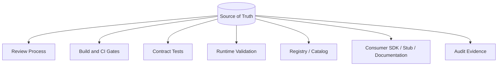

Jika source of truth tidak jelas, akan muncul drift:

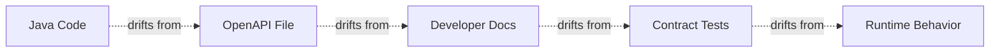

Contract engineering yang matang mengurangi drift bukan dengan berharap engineer disiplin, tetapi dengan memilih control point dan memasangnya di pipeline.

---

## 3. Pilihan 1: Contract-First

Contract-first berarti contract artifact ditulis dan direview sebelum implementation dianggap benar.

Untuk HTTP API, artifact bisa berupa:

- OpenAPI YAML/JSON;
- JSON Schema components;
- API design document;
- examples;
- lint metadata;
- compatibility policy.

Untuk event:

- AsyncAPI;
- Avro schema;
- Protobuf schema;
- JSON Schema;
- event envelope specification;
- topic/channel contract;
- schema registry artifact.

### 3.1 Workflow Contract-First

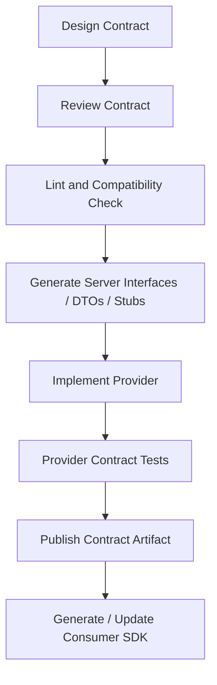

### 3.2 Kapan Contract-First Kuat

Contract-first kuat ketika:

- banyak consumer bergantung pada API/event;
- contract adalah public/partner/external interface;
- API/event butuh review governance sebelum coding;
- breaking change cost tinggi;
- SDK generation penting;
- documentation portal penting;
- platform ingin standardisasi linting dan lifecycle;
- contract menjadi bagian regulatory evidence;
- provider dan consumer dikembangkan oleh tim berbeda;
- event schema harus dipromosikan ke registry sebelum producer deploy.

### 3.3 Kelebihan Contract-First

| Kelebihan | Dampak |
|---|---|
| Contract terlihat sebelum code | design issue ditemukan lebih awal |
| Consumer bisa parallel development | mocks/stubs bisa dibuat dari spec |
| Governance mudah | review artifact jelas |
| Tooling kuat | generator, lint, diff, catalog |
| Implementation tidak otomatis bocor | domain model tidak menjadi public contract |
| Compatibility bisa dicek lebih awal | breaking change dicegah di PR |

### 3.4 Kelemahan Contract-First

| Kelemahan | Risiko |
|---|---|
| Bisa menjadi dokumen mati | implementation drift |
| Butuh discipline | spec harus dijaga |
| Generator boundary kompleks | generated code bisa membatasi design |
| Over-design | terlalu banyak diskusi sebelum feedback runtime |
| Skill barrier | engineer harus paham specification |

### 3.5 Contract-First di Java

Project layout sederhana:

```text
account-service/
  contracts/
    openapi/
      account-api.yaml
    asyncapi/
      account-events.yaml
    schemas/
      avro/
        AccountStatusChanged.avsc
  src/main/java/
    com/example/account/
  build.gradle.kts
```

Build pipeline:

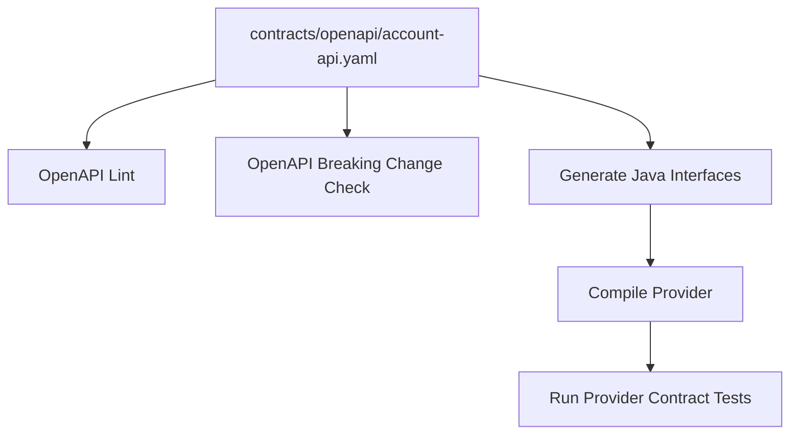

Implementation boundary:

```java
@RestController
final class AccountController implements AccountsApi {

    private final AccountApplicationService service;
    private final AccountDtoMapper mapper;

    AccountController(AccountApplicationService service, AccountDtoMapper mapper) {
        this.service = service;
        this.mapper = mapper;
    }

    @Override
    public ResponseEntity<AccountResponse> getAccount(String accountId) {
        Account account = service.getAccount(AccountId.parse(accountId));
        return ResponseEntity.ok(mapper.toResponse(account));
    }
}
```

Contract-first tidak berarti generated code menguasai domain. Generated code berhenti di adapter boundary.

---

## 4. Pilihan 2: Code-First

Code-first berarti Java implementation menjadi sumber kebenaran. Contract digenerate atau dipahami dari code.

Contoh:

```java
@RestController
@RequestMapping("/accounts")
class AccountController {

    @GetMapping("/{accountId}")
    AccountResponse getAccount(@PathVariable String accountId) {
        return service.getAccount(accountId);
    }
}
```

Kemudian OpenAPI digenerate dari annotations/runtime scanning.

### 4.1 Kapan Code-First Kuat

Code-first kuat ketika:

- API kecil/internal;
- consumer sedikit dan dekat dengan provider;
- kecepatan delivery lebih penting daripada formal review;
- contract sering berubah dalam fase discovery;
- team belum punya platform contract-first yang matang;
- API tidak menjadi public integration surface;
- implementation detail memang cukup dekat dengan contract.

### 4.2 Kelebihan Code-First

| Kelebihan | Dampak |
|---|---|
| Cepat | developer bisa langsung implement |
| Tidak ada spec-code mismatch awal | spec berasal dari code |
| Familiar untuk Java/Spring team | adoption rendah friction |
| Cocok untuk prototype/internal APIs | feedback cepat |

### 4.3 Kelemahan Code-First

| Kelemahan | Risiko |
|---|---|
| Domain model mudah bocor | refactoring menjadi breaking change |
| Contract review terlambat | design issue muncul setelah code |
| Generated OpenAPI bisa miskin semantic | docs terlihat lengkap tapi tidak bermakna |
| Breaking change sulit terlihat | annotation diff tidak cukup |
| Consumer parallel development sulit | contract belum stabil sebelum implementation |
| Governance cenderung reaktif | review terjadi setelah API terbentuk |

### 4.4 Code-First Anti-Pattern

```java
@GetMapping("/{id}")
public Account get(@PathVariable UUID id) {
    return repository.findById(id).orElseThrow();
}
```

Masalah:

- entity persistence menjadi response contract;
- lazy fields bisa bocor;
- internal enum bocor;
- Jackson serialization menentukan external contract secara tidak sadar;
- perubahan JPA/entity bisa mematahkan consumer.

Code-first masih bisa sehat jika tetap memakai DTO boundary:

```java
public record AccountResponse(
    String accountId,
    String status,
    String availableBalance,
    String currency
) {}
```

Dan contract generated dari DTO yang memang didesain sebagai boundary, bukan dari entity.

---

## 5. Pilihan 3: Annotation-First

Annotation-first adalah varian code-first yang mencoba memperkaya contract lewat annotations.

Contoh:

```java
@Operation(
    summary = "Get account by id",
    description = "Returns the current account summary visible to the caller."
)
@ApiResponses({
    @ApiResponse(responseCode = "200", description = "Account found"),
    @ApiResponse(responseCode = "404", description = "Account not found or not visible")
})
@GetMapping("/accounts/{accountId}")
AccountResponse getAccount(
    @Parameter(description = "Stable account aggregate identifier")
    @PathVariable String accountId
) {
    return service.getAccount(accountId);
}
```

### 5.1 Kapan Annotation-First Kuat

- team ingin docs tetap dekat dengan code;
- API internal tapi butuh discovery;
- contract tidak terlalu kompleks;
- governance ringan;
- annotations digunakan untuk memperbaiki generated spec;
- provider ownership kuat.

### 5.2 Risiko Annotation-First

Annotation-first sering menghasilkan noise:

```java
@Schema(description = "Customer name")
private String customerName;
```

Deskripsi seperti ini tidak menambah semantic. Yang dibutuhkan contract engineer adalah:

```java
@Schema(
    description = "Legal customer display name visible to servicing agents. May contain PII and must be masked in logs."
)
private String customerName;
```

Annotation-first gagal jika hanya menjadi ritual memperindah Swagger UI.

### 5.3 Rule Praktis

Annotation-first boleh dipakai, tetapi:

- jangan generate public contract dari domain entity;
- tetap gunakan DTO boundary;
- gunakan examples;
- dokumentasikan error semantics;
- dokumentasikan headers;
- lakukan generated spec diff di CI;
- publish generated spec sebagai artifact;
- jangan menganggap Swagger UI sama dengan governance.

---

## 6. Pilihan 4: Test-First Contract

Test-first contract berarti executable tests menjadi sumber utama promise.

Bentuknya bisa:

- Spring Cloud Contract DSL;
- Pact consumer tests;
- provider verification tests;
- HTTP stub contracts;
- event producer/consumer tests.

### 6.1 Spring Cloud Contract Style

Contract dapat ditulis sebagai DSL yang menghasilkan tests dan stubs.

Pseudo contoh:

```groovy
Contract.make {
    request {
        method 'GET'
        url '/accounts/A-123'
    }
    response {
        status OK()
        body(
            accountId: 'A-123',
            status: 'ACTIVE'
        )
        headers {
            contentType(applicationJson())
        }
    }
}
```

Kekuatan approach ini:

- contract executable;
- provider test bisa digenerate;
- consumer stub bisa dipublish;
- mismatch request/response mudah ditemukan.

### 6.2 Kelemahan Test-First Contract

- test bisa terlalu contoh-spesifik;
- tidak selalu menggantikan full OpenAPI/schema;
- semantic yang tidak diuji tetap bisa drift;
- banyak contract test bisa sulit dikelola;
- governance metadata sering kurang.

Test-first sangat kuat untuk memastikan behavior yang dipakai consumer tetap tersedia. Namun untuk catalog, documentation, dan schema lifecycle, biasanya tetap butuh artifact lain.

---

## 7. Pilihan 5: Consumer-First / Consumer-Driven Contract

Consumer-first berarti kebutuhan consumer menjadi input utama contract. Provider diverifikasi terhadap ekspektasi consumer.

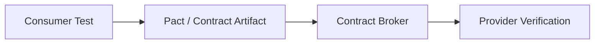

### 7.1 Kapan Consumer-Driven Contract Kuat

- provider punya banyak consumer;
- provider tidak tahu semua usage pattern;
- regression terhadap existing consumer harus dicegah;
- API internal antar tim;
- deployment independent;
- consumer bisa menulis test expectation sendiri;
- provider ingin tahu perubahan mana yang benar-benar breaking untuk consumer aktif.

### 7.2 Kelebihan Consumer-First

| Kelebihan | Dampak |
|---|---|
| Testing berdasarkan usage nyata | provider tidak over-preserve unused behavior |
| Consumer ownership kuat | expectation jelas |
| Deployment confidence | can-I-deploy style decision possible |
| Cocok untuk microservices | independent release lebih aman |

### 7.3 Kelemahan Consumer-First

| Kelemahan | Risiko |
|---|---|
| Consumer bisa menulis expectation buruk | provider terkunci behavior jelek |
| Tidak menggantikan API design | usage-driven bukan domain-model-driven |
| Coverage tergantung consumer tests | untested behavior tidak terlindungi |
| Consumer discipline diperlukan | stale pact bisa mengganggu |
| Public API tidak cukup | external consumers tidak selalu menulis pact |

### 7.4 Consumer-First Bukan Berarti Consumer Selalu Benar

Consumer-driven contract harus dipandu governance.

Consumer tidak boleh memaksa provider mempertahankan:

- internal field bocor;
- invalid status code usage;
- undocumented behavior;
- security bypass;
- performance-heavy query;
- accidental ordering;
- deprecated field selamanya.

Consumer expectation adalah evidence. Bukan hukum absolut.

---

## 8. Pilihan 6: Registry-First untuk Event Schema

Pada event-driven architecture, schema registry sering menjadi authoritative control point.

Workflow:

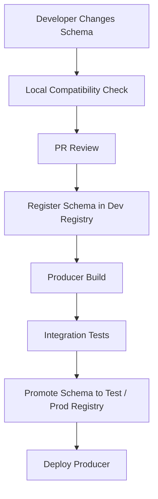

### 8.1 Kapan Registry-First Kuat

- Kafka/event streaming dipakai lintas banyak team;
- Avro/Protobuf/JSON Schema compatibility perlu enforced;
- schema ID digunakan runtime serialization;
- replay dan consumer lag penting;
- platform ingin mencegah incompatible producer deploy;
- event catalog terhubung ke registry;
- governance ingin audit trail schema changes.

### 8.2 Risiko Registry-First

Registry hanya tahu schema, bukan semua contract.

Registry biasanya tidak tahu:

- Kafka key berubah;
- topic retention berubah;
- event semantic berubah;
- data classification salah;
- producer authority salah;
- event diterbitkan pada waktu yang salah;
- consumer mengasumsikan ordering tertentu;
- business meaning enum berubah.

Karena itu registry-first harus digabung dengan event contract review dan AsyncAPI/catalog metadata.

---

## 9. Pilihan 7: Catalog-First untuk Enterprise Discovery

Catalog-first berarti enterprise catalog menjadi pintu utama discovery, ownership, lifecycle, dan governance.

Catalog bisa menyimpan:

- API name;
- event name;
- owner;
- domain;
- lifecycle status;
- documentation link;
- OpenAPI/AsyncAPI link;
- schema registry link;
- consumers;
- data classification;
- SLA/SLO;
- deprecation status;
- contact/escalation path.

Catalog bukan selalu source of truth untuk executable contract. Namun catalog bisa menjadi source of truth untuk **ownership dan lifecycle**.

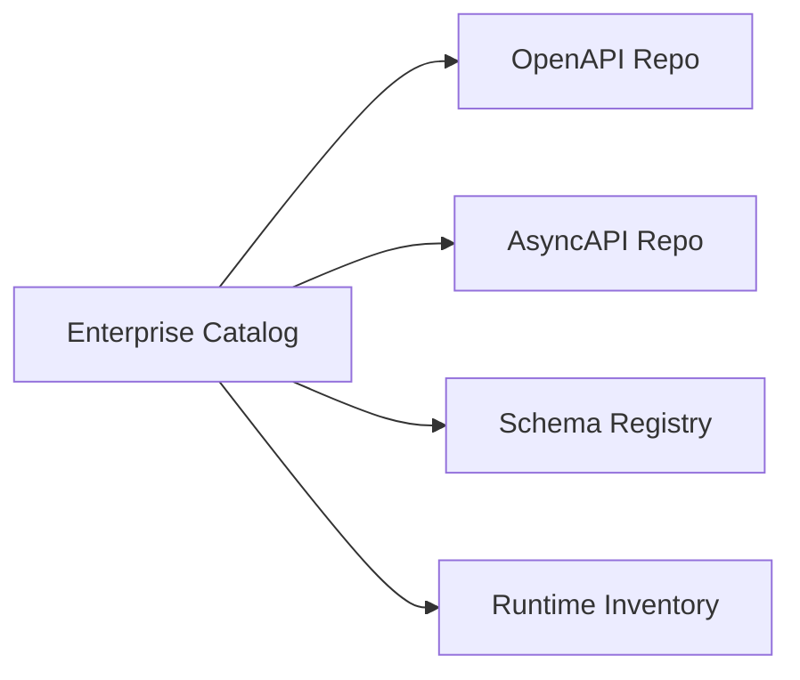

Catalog-first kuat untuk governance, tetapi lemah jika tidak terhubung ke CI/runtime.

---

## 10. Decision Matrix

Gunakan matrix berikut.

| Situation | Recommended Source of Truth |
|---|---|
| Public/partner HTTP API | Contract-first OpenAPI |
| Internal Spring API dengan sedikit consumer | Code-first/annotation-first dengan DTO boundary |
| Critical internal API banyak consumer | Contract-first + consumer-driven tests |
| Event schema lintas domain | Registry-first + AsyncAPI + governance metadata |
| Kafka event dengan complex topology | AsyncAPI/event contract + registry schema |
| gRPC internal platform API | Protobuf-first |
| Rapid prototype | Code-first, lalu stabilize ke contract-first |
| Regulatory/audit-heavy interface | Contract-first + lifecycle approval |
| SDK product | Contract-first + generated client governance |
| Legacy API tanpa spec | Runtime/code discovery → generated baseline → contract hardening |
| Consumer-specific integration | Consumer-first plus provider approval |
| Shared enterprise events | Event contract-first + schema registry gate |

---

## 11. Compatibility with Team Maturity

Tidak semua team siap langsung contract-first penuh.

| Maturity | Practice |
|---|---|
| Level 1 | Code-first, manual docs |
| Level 2 | Annotation-first, generated OpenAPI |
| Level 3 | Generated spec diff in CI |
| Level 4 | Contract-first for critical APIs/events |
| Level 5 | Contract linting, compatibility gates, registry/catalog integration |
| Level 6 | Consumer impact analysis, deployment decision automation, governance evidence |

Target seri ini adalah membawa kamu ke Level 5-6, tetapi implementasi di organisasi harus bertahap.

---

## 12. Source-of-Truth Drift

Drift terjadi ketika dua artifact yang seharusnya sama mulai berbeda.

### 12.1 Jenis Drift

| Drift | Contoh |
|---|---|
| Spec-code drift | OpenAPI mengatakan field required, code tidak validate |
| Code-doc drift | Swagger UI berbeda dari README |
| Test-spec drift | contract test tidak mencakup schema terbaru |
| Runtime-spec drift | runtime mengembalikan header/error yang tidak terdokumentasi |
| Registry-repo drift | schema registry berisi versi yang tidak ada di Git |
| Catalog-runtime drift | catalog bilang API deprecated, runtime masih aktif tanpa owner |
| Consumer-provider drift | consumer pakai behavior yang provider anggap internal |

### 12.2 Drift Prevention Pattern

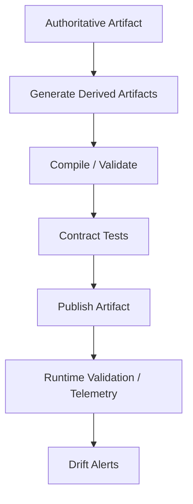

Rule:

- hanya satu artifact boleh authoritative untuk aspek tertentu;
- artifact turunan harus digenerate, bukan diedit manual;
- CI harus gagal jika generated output tidak sync;
- runtime telemetry harus mendeteksi behavior yang keluar dari contract;
- catalog harus refer ke artifact version, bukan copy manual.

---

## 13. Hybrid Strategy: Yang Paling Realistis di Enterprise

Enterprise jarang murni contract-first atau code-first. Yang realistis adalah hybrid dengan boundary jelas.

Contoh recommended hybrid:

| Contract Area | Source of Truth |
|---|---|
| Public HTTP shape | OpenAPI repo |
| Java controller implementation | Java code |
| Request/response DTO | Generated interfaces + hand-written mapping |
| Error code taxonomy | Shared error catalog |
| Event payload schema | Schema registry artifact from Git |
| Event envelope | Platform event standard |
| Topic/key/retention | AsyncAPI + platform config repo |
| Consumer expectations | Pact/Spring Cloud Contract |
| Ownership/lifecycle | Enterprise catalog |
| Runtime behavior | Observability + validation telemetry |

Diagram:

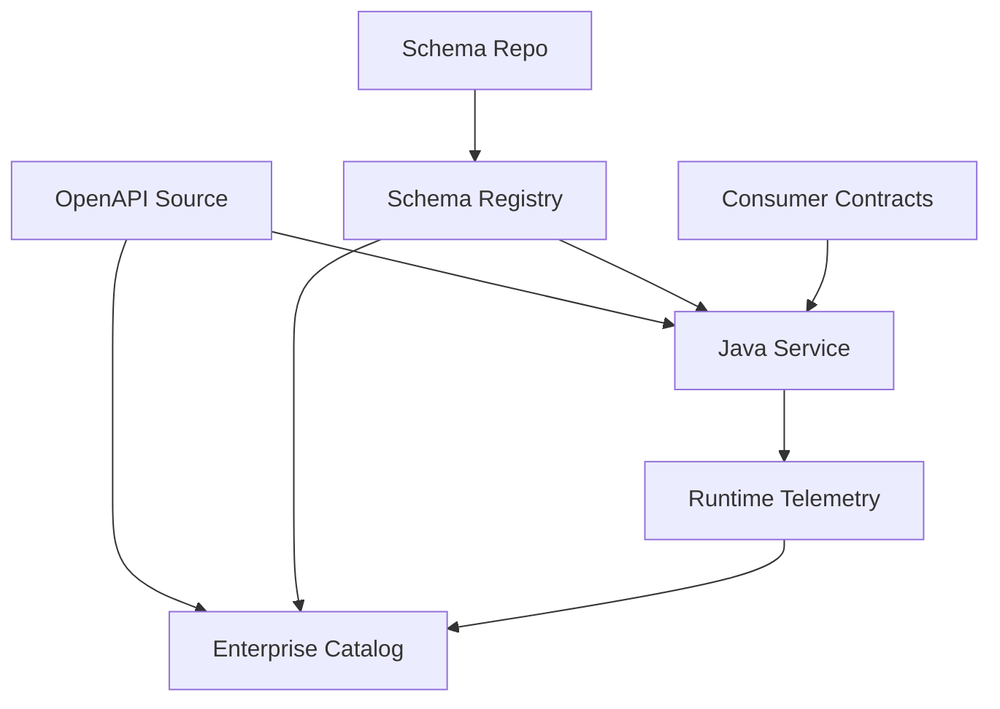

Hybrid bukan kekacauan jika setiap artifact punya domain of authority.

---

## 14. Domain of Authority

Tulis domain of authority secara eksplisit.

Contoh:

```md
## Contract Source of Truth

- OpenAPI file is the source of truth for HTTP paths, methods, request/response schemas, status codes, and public headers.
- Java code is the source of truth for internal domain logic and persistence model.
- Error catalog is the source of truth for error codes and retryability classification.
- Pact contracts are evidence of active consumer expectations.
- Runtime telemetry is evidence of actual observed behavior, but not a design source of truth.
```

Ini mencegah perdebatan:

> “Tapi code-nya begini.”

atau:

> “Tapi Swagger UI-nya begitu.”

Jawabannya:

> untuk aspek apa? source of truth-nya apa?

---

## 15. API Source-of-Truth Patterns

### 15.1 Static OpenAPI as Source

```text
contracts/openapi/customer-api.yaml
```

Pros:

- reviewable;
- diffable;
- generator-friendly;
- catalog-friendly;
- good for external API.

Cons:

- drift jika code tidak mengikuti;
- membutuhkan generator/test gate;
- engineer harus nyaman menulis YAML/schema.

### 15.2 Generated OpenAPI as Source

```text
Java annotations -> generated openapi.json
```

Pros:

- dekat dengan code;
- mudah adopsi;
- cepat.

Cons:

- code design menentukan contract;
- generated output kadang kurang semantic;
- sulit review sebelum implementation;
- annotation noise.

### 15.3 OpenAPI Baseline from Runtime

Untuk legacy:

```text
runtime traffic / code scan -> generated baseline -> harden contract
```

Pros:

- cocok untuk existing API tanpa spec;
- mendapatkan starting point.

Cons:

- baseline merekam accident, bukan ideal design;
- butuh cleanup;
- hidden consumers tetap harus ditemukan.

---

## 16. Event Source-of-Truth Patterns

### 16.1 Schema File in Git as Source

```text
contracts/schemas/avro/AccountStatusChanged.avsc
```

Pros:

- reviewable;
- versioned;
- compatibility checkable;
- CI-friendly.

Cons:

- harus sync dengan registry;
- schema tidak menjelaskan topic/key/semantic penuh.

### 16.2 Registry as Source

Pros:

- runtime serializer/deserializer langsung mengandalkan registry;
- compatibility enforcement kuat;
- schema id/version jelas.

Cons:

- review UX bisa kurang;
- changes via UI/API bisa bypass PR jika tidak dikontrol;
- semantic contract tidak lengkap.

### 16.3 AsyncAPI as Source

Pros:

- menjelaskan channel, message, operation, protocol binding;
- cocok untuk catalog/documentation;
- lebih luas daripada payload schema.

Cons:

- runtime enforcement tidak sekuat schema registry;
- perlu discipline agar tidak menjadi dokumen mati.

### 16.4 Protobuf as Source

Untuk gRPC atau event dengan protobuf:

```proto
syntax = "proto3";

package account.v1;

message AccountStatusChanged {
  string event_id = 1;
  string account_id = 2;
  string previous_status = 3;
  string new_status = 4;
  string occurred_at = 5;
}
```

Pros:

- strong code generation;
- field numbers stabil;
- cocok untuk internal platform;
- clear binary compatibility constraints.

Cons:

- semantic tetap perlu documentation;
- JSON/REST consumers mungkin butuh mapping;
- field presence/unknown behavior harus dipahami.

---

## 17. Provider Ownership vs Consumer Ownership

Contract bukan milik sepihak. Tetapi ownership harus jelas.

| Area | Owner utama | Input wajib |
|---|---|---|
| Domain meaning | Provider/domain owner | consumer use cases |
| API operation shape | Provider + API design review | consumer ergonomics |
| Consumer expectation | Consumer | provider feasibility |
| Schema compatibility | Provider + platform governance | registry policy |
| Error taxonomy | Platform/domain | consumer automation needs |
| Event topic/key | Provider + platform streaming team | consumer projection needs |
| Lifecycle/deprecation | Provider | consumer inventory |

Rule penting:

> Provider owns what it promises. Consumer owns what it depends on. Governance owns how promises change.

---

## 18. Contract-First Implementation Pattern in Java

### 18.1 OpenAPI Source

```yaml
openapi: 3.1.0
info:
  title: Account API
  version: 1.0.0
paths:
  /accounts/{accountId}:
    get:
      operationId: getAccount
      parameters:
        - name: accountId
          in: path
          required: true
          schema:
            type: string
      responses:
        '200':
          description: Account found
          content:
            application/json:
              schema:
                $ref: '#/components/schemas/AccountResponse'
        '404':
          description: Account not found or not visible
components:
  schemas:
    AccountResponse:
      type: object
      required:
        - accountId
        - status
      properties:
        accountId:
          type: string
        status:
          type: string
          enum: [ACTIVE, SUSPENDED, CLOSED]
```

### 18.2 Generated API Interface

```java
public interface AccountsApi {
    ResponseEntity<AccountResponse> getAccount(String accountId);
}
```

### 18.3 Hand-Written Adapter

```java
@RestController
final class AccountsHttpAdapter implements AccountsApi {

    private final GetAccountUseCase getAccount;
    private final AccountContractMapper mapper;

    AccountsHttpAdapter(GetAccountUseCase getAccount, AccountContractMapper mapper) {
        this.getAccount = getAccount;
        this.mapper = mapper;
    }

    @Override
    public ResponseEntity<AccountResponse> getAccount(String accountId) {
        AccountView view = getAccount.execute(AccountId.parse(accountId));
        return ResponseEntity.ok(mapper.toContract(view));
    }
}
```

### 18.4 Boundary Rule

Generated types can exist at the edge. Domain types should not depend on generated DTOs.

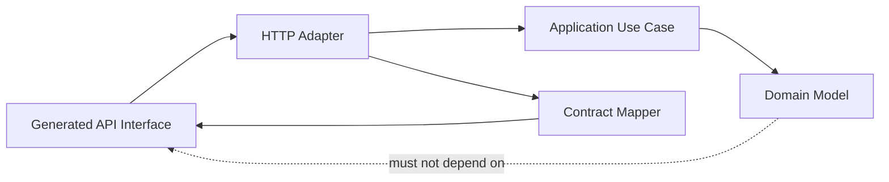

---

## 19. Code-First Hardening Pattern

Jika team memulai code-first, jangan berhenti di generated docs.

### 19.1 Baseline

```java
@GetMapping("/accounts/{accountId}")
AccountResponse getAccount(@PathVariable String accountId) {
    return service.getAccount(accountId);
}
```

### 19.2 Hardened Code-First

Tambahkan:

- DTO boundary;
- explicit error contract;
- generated OpenAPI artifact in CI;
- OpenAPI diff check;
- examples;
- schema lint;
- contract test;
- catalog publishing.

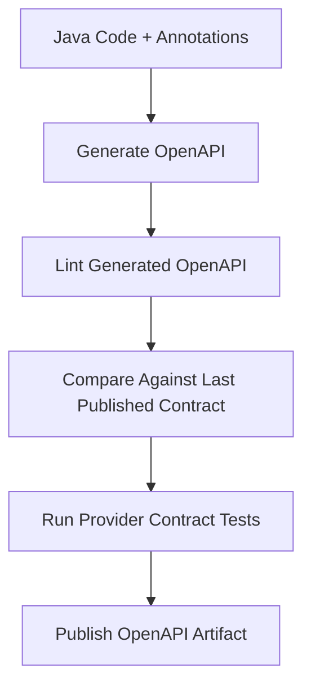

### 19.3 Hardening Rule

Code-first boleh, tetapi contract tetap harus menjadi artifact.

Jika tidak ada artifact yang dipublish, consumer tidak punya stable reference.

---

## 20. Consumer-Driven Contract Pattern in Java

### 20.1 Consumer Test Intent

Consumer menulis expectation:

```java
@Test
void canLoadActiveAccount() {
    pact.given("account A-123 exists and is active")
        .uponReceiving("a request for account A-123")
        .path("/accounts/A-123")
        .method("GET")
        .willRespondWith()
        .status(200)
        .body(newJsonBody(body -> {
            body.stringType("accountId", "A-123");
            body.stringValue("status", "ACTIVE");
        }).build());
}
```

Tujuan bukan menguji provider langsung. Tujuannya merekam assumption consumer.

### 20.2 Provider Verification

Provider kemudian diverifikasi:

```java
@TestTemplate
@ExtendWith(PactVerificationInvocationContextProvider.class)
void verifyPact(PactVerificationContext context) {
    context.verifyInteraction();
}
```

### 20.3 Governance Rule

Consumer pact harus:

- merepresentasikan usage nyata;
- tidak mengunci accidental internal behavior;
- tidak terlalu strict pada field yang tidak dibutuhkan;
- versioned;
- retired saat consumer tidak lagi memakai behavior.

---

## 21. Event Contract-First Pattern

Untuk event, contract-first harus mencakup lebih dari schema.

### 21.1 Event Contract Document

```yaml
event:
  name: AccountStatusChanged
  producer: account-service
  topic: account.lifecycle.events
  key: accountId
  semantics: Published after account status transition is committed.
  ordering: Per accountId ordering is expected.
  duplicates: Possible. Consumers must deduplicate by eventId.
  retention: 14 days
  schema:
    format: avro
    subject: account.lifecycle.AccountStatusChanged
```

### 21.2 Avro Schema

```json
{
  "type": "record",
  "name": "AccountStatusChanged",
  "namespace": "com.example.account.events.v1",
  "fields": [
    { "name": "eventId", "type": "string" },
    { "name": "accountId", "type": "string" },
    { "name": "previousStatus", "type": "string" },
    { "name": "newStatus", "type": "string" },
    { "name": "occurredAt", "type": "string" }
  ]
}
```

### 21.3 Producer Boundary

```java
public final class AccountStatusChangedPublisher {

    private final KafkaTemplate<String, AccountStatusChanged> kafka;

    public void publish(AccountStatusChanged event) {
        kafka.send("account.lifecycle.events", event.accountId(), event);
    }
}
```

The key is not implementation detail. It is contract.

---

## 22. Choosing Source of Truth by Risk

Gunakan risk scoring.

| Risk Factor | Low | High |
|---|---|---|
| Consumer count | 1-2 known consumers | many/unknown consumers |
| Consumer coupling | loose | generated clients/stateful projections |
| Business criticality | non-critical | payment, decisioning, regulatory, identity |
| Change frequency | high/prototype | stable/public |
| Failure blast radius | local | cross-domain outage |
| Compliance | none | audit/regulatory/data governance |
| Replay requirement | none | replay required |
| Ownership | one team | multi-team/multi-org |

Recommendation:

- low risk: code-first acceptable;
- medium risk: annotation-first + artifact + tests;
- high risk: contract-first + governance gates;
- very high risk: contract-first + consumer-driven verification + runtime validation + audit trail.

---

## 23. Decision Tree

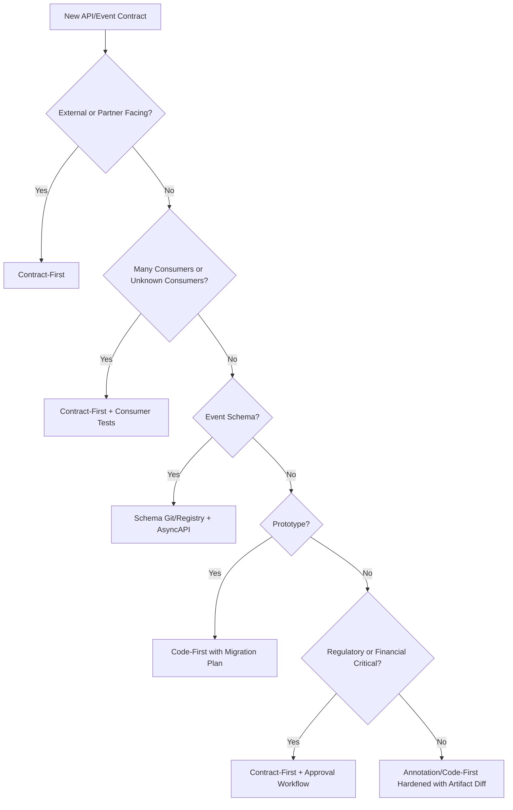

Decision tree ini bukan hukum absolut, tetapi cukup baik untuk review awal.

---

## 24. Governance by Source-of-Truth Type

### 24.1 Contract-First Governance

Required controls:

- contract PR review;
- linting;
- semantic checklist;
- breaking change diff;
- example validation;
- generated server/client compile;
- provider verification;
- publish to registry/catalog.

### 24.2 Code-First Governance

Required controls:

- DTO boundary review;
- generated OpenAPI diff;
- response validation tests;
- forbidden entity exposure check;
- documentation quality check;
- artifact publishing.

### 24.3 Consumer-First Governance

Required controls:

- consumer pact review for over-specific expectations;
- provider verification;
- stale consumer contract cleanup;
- deployment compatibility checks;
- consumer ownership metadata.

### 24.4 Registry-First Governance

Required controls:

- schema compatibility mode;
- transitive compatibility where needed;
- subject naming policy;
- schema promotion workflow;
- access control;
- registry-to-Git consistency check.

---

## 25. Anti-Patterns

### 25.1 “Swagger UI adalah Contract Governance”

Swagger UI adalah viewer. Ia bukan governance.

Governance membutuhkan:

- review;
- diff;
- ownership;
- lifecycle;
- compatibility;
- testing;
- publishing;
- audit.

### 25.2 “Code is the Only Truth”

Untuk internal implementation, benar. Untuk consumer contract, tidak cukup.

Consumer tidak bisa membaca semua code provider untuk memahami promise. Consumer butuh artifact yang stabil.

### 25.3 “Spec is the Only Truth”

Spec yang tidak diverifikasi terhadap runtime adalah aspirasi, bukan contract.

Contract-first harus disertai provider verification.

### 25.4 “Consumer Pact Menggantikan API Design”

Pact merekam expectation consumer. Ia tidak otomatis menghasilkan API design yang baik.

Jika semua consumer meminta field internal yang berbeda-beda, provider harus memperbaiki API model, bukan sekadar memenuhi semua pact.

### 25.5 “Schema Registry Menjamin Event Contract Aman”

Registry menjamin aspek schema compatibility tertentu. Ia tidak menjamin semantic correctness, event timing, topic key, ordering, data classification, atau producer authority.

---

## 26. Practical Source-of-Truth Document Template

Setiap service yang matang sebaiknya punya file seperti ini:

```md
# Contract Source of Truth

## HTTP APIs
- Source: `contracts/openapi/service-api.yaml`
- Generated server interfaces: yes
- Generated clients: Java internal SDK
- Breaking change check: required in PR
- Runtime request validation: enabled for non-prod

## Events
- Event metadata source: `contracts/asyncapi/service-events.yaml`
- Payload schema source: `contracts/schemas/avro/*.avsc`
- Registry: Apicurio/Confluent compatible registry
- Compatibility mode: backward transitive unless exception approved
- Kafka key policy: documented per event

## Consumer Contracts
- Pact broker: enabled for critical consumers
- Provider verification: required before deploy

## Catalog
- Published to enterprise catalog after merge
- Owner: Account Platform Team
- Escalation: #account-platform-support

## Exceptions
- Any semantic breaking change requires migration plan and architecture approval.
```

Template ini membuat source of truth eksplisit.

---

## 27. Build Pipeline Examples

### 27.1 Contract-First API Pipeline

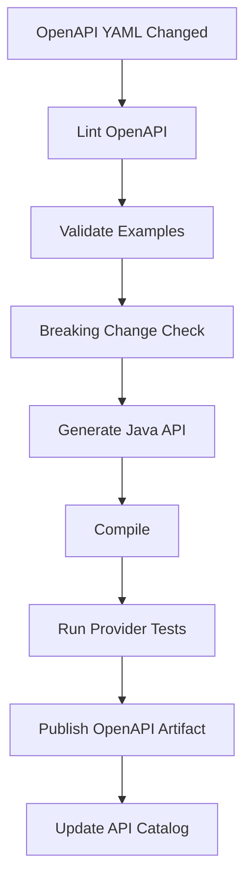

### 27.2 Code-First API Pipeline

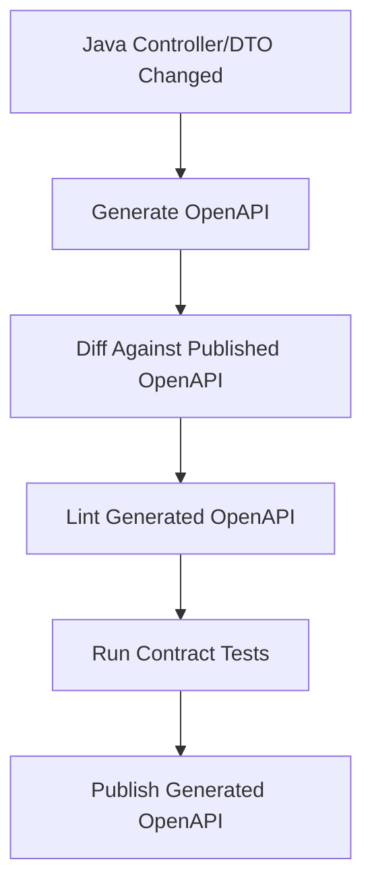

### 27.3 Event Schema Pipeline

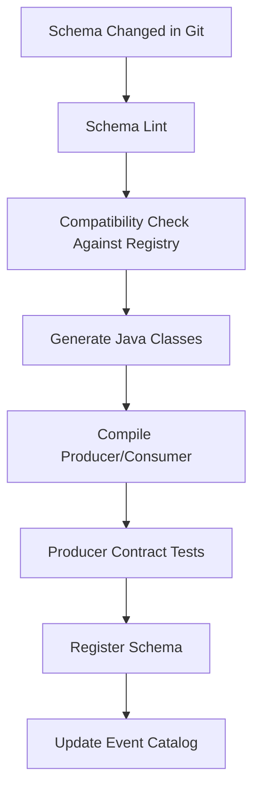

### 27.4 Consumer-Driven Pipeline

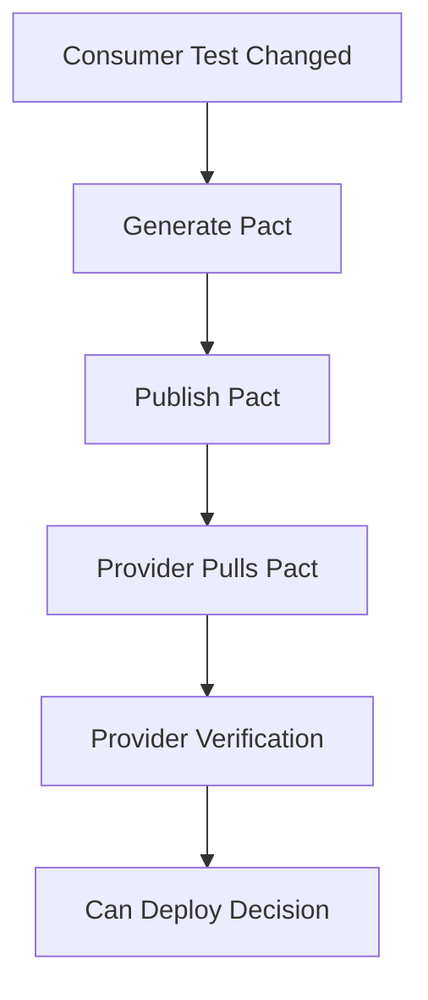

---

## 28. Migration Pattern: From Code-First to Contract-First

Banyak organisasi tidak bisa langsung contract-first. Gunakan migrasi bertahap.

### Step 1 — Generate Baseline

Generate OpenAPI dari runtime/code.

### Step 2 — Freeze Baseline

Simpan baseline sebagai published contract.

### Step 3 — Add Diff Gate

Setiap perubahan code menghasilkan OpenAPI baru dan dibandingkan dengan baseline.

### Step 4 — Harden Contract

Tambahkan descriptions, examples, error models, headers, security, pagination semantics.

### Step 5 — Move Critical APIs to Contract-First

Untuk API kritis, ubah flow menjadi spec PR dulu, baru implementation.

### Step 6 — Add Consumer Contract Tests

Untuk consumer kritis, tambahkan Pact/Spring Cloud Contract.

### Step 7 — Publish to Catalog

Setiap version dan lifecycle status masuk enterprise catalog.

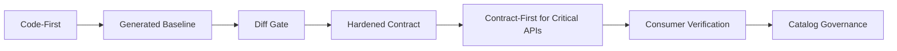

---

## 29. Handling Legacy APIs

Legacy APIs sering punya contract yang hidup di consumer code dan production behavior.

Approach:

1. Collect observed traffic shape.
2. Generate approximate OpenAPI.
3. Compare with controller/DTO code.
4. Identify active consumers.
5. Extract known examples.
6. Mark uncertain behavior as `observed`, not `guaranteed`.
7. Review with domain owner.
8. Publish baseline as version `observed-baseline`.
9. Add tests to lock only intended behavior.
10. Deprecate accidental behavior gradually.

Jangan langsung menjadikan semua observed behavior sebagai permanent contract. Itu mengabadikan bug.

---

## 30. Contract Review Questions for Source of Truth

Saat review proposal contract, tanyakan:

1. Artifact mana yang authoritative?
2. Artifact mana yang generated?
3. Artifact mana yang diedit manual?
4. Siapa owner contract?
5. Siapa known consumers?
6. Apa compatibility policy?
7. Bagaimana breaking change dicek?
8. Bagaimana runtime diverifikasi terhadap contract?
9. Bagaimana contract dipublish?
10. Bagaimana consumer mendapat update?
11. Bagaimana deprecation dikomunikasikan?
12. Bagaimana schema/event direplay setelah perubahan?
13. Bagaimana contract masuk catalog?
14. Bagaimana exception diapprove?
15. Bagaimana incident membuktikan contract version yang aktif?

Jika pertanyaan ini tidak terjawab, source-of-truth model belum matang.

---

## 31. Top-Tier Heuristics

1. **Contract-first untuk boundary yang mahal berubah.**
2. **Code-first untuk discovery, bukan untuk interface yang sudah menjadi platform promise.**
3. **Consumer-first untuk melindungi usage nyata, bukan menggantikan design thinking.**
4. **Registry-first untuk schema enforcement, bukan semantic governance lengkap.**
5. **Catalog-first untuk discovery dan lifecycle, bukan runtime validation.**
6. **Generated artifact harus dianggap turunan, kecuali memang dideklarasikan authoritative.**
7. **Satu artifact boleh authoritative hanya untuk domain tertentu.**
8. **Spec tanpa verification adalah niat baik. Code tanpa spec adalah hidden contract. Test tanpa design adalah local optimum.**
9. **Source of truth yang tidak ada di CI bukan control point.**
10. **Drift adalah default; governance adalah mekanisme aktif untuk melawannya.**

---

## 32. Kaufman Practice Block

Sub-skill di part ini adalah **memilih source of truth secara sadar**.

### 32.1 Drill 1 — Classify Existing Services

Ambil 5 service yang kamu kenal. Untuk masing-masing, isi:

| Service | API source of truth | Event source of truth | Consumer tests | Registry | Catalog | Drift risk |
|---|---|---|---|---|---|---|
| account-service | ? | ? | ? | ? | ? | ? |

Tujuan: melihat real maturity, bukan idealisasi.

### 32.2 Drill 2 — Choose Strategy

Untuk setiap skenario, pilih strategy dan jelaskan trade-off:

1. Public partner API untuk payment status.
2. Internal admin API dipakai satu frontend.
3. Kafka event `CustomerRiskScoreChanged` dipakai 12 consumer.
4. Legacy customer API tanpa OpenAPI.
5. gRPC service antar platform service.
6. Prototype API untuk experiment 2 minggu.
7. Regulatory reporting event yang harus direplay 5 tahun.

### 32.3 Drill 3 — Design CI Gate

Pilih satu API dan rancang pipeline:

- source artifact;
- lint;
- diff;
- generation;
- tests;
- publish;
- catalog update;
- exception path.

Output latihan harus berupa flow diagram, bukan hanya bullet list.

---

## 33. Ringkasan

Tidak ada satu source-of-truth strategy yang selalu benar.

Yang penting:

- pilih source of truth berdasarkan risk, consumer count, governance need, dan lifecycle cost;
- bedakan authoritative artifact dari generated artifact;
- cegah drift dengan CI, tests, registry, dan runtime telemetry;
- jangan biarkan Java entity menjadi public contract secara tidak sadar;
- jangan biarkan spec menjadi dokumen mati;
- jangan biarkan consumer tests mengunci accidental behavior;
- jangan menganggap schema registry cukup untuk semantic event governance;
- gunakan hybrid strategy dengan domain of authority yang jelas.

Part berikutnya akan mulai masuk ke OpenAPI secara lebih detail:

> OpenAPI sebagai executable API semantics, bukan sekadar dokumentasi Swagger UI.
