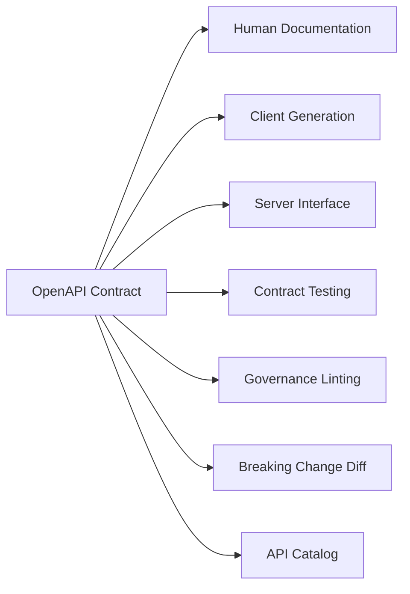
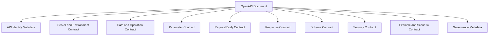
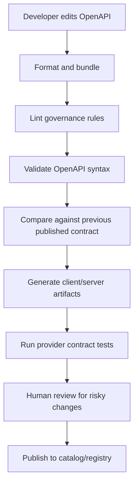

# Part 005 — OpenAPI Deep Model: Not Documentation, but Executable API Semantics

## 1. Tujuan Part Ini

Part ini membahas **OpenAPI sebagai contract artifact**, bukan sebagai file dokumentasi tambahan yang dibuat setelah service selesai.

Target setelah menyelesaikan part ini:

1. Anda mampu membaca OpenAPI sebagai **model semantik API**, bukan hanya daftar endpoint.
2. Anda mampu membedakan bagian OpenAPI yang menyatakan **transport contract**, **operation contract**, **schema contract**, **security contract**, dan **consumer ergonomics**.
3. Anda mampu mendesain OpenAPI yang dapat dipakai untuk:
   - review desain API,
   - generate client/server skeleton,
   - contract testing,
   - documentation portal,
   - linting governance,
   - breaking-change detection,
   - API catalog,
   - dan migration planning.
4. Anda memahami batas OpenAPI: apa yang bisa dijelaskan, apa yang harus dilengkapi dengan policy, test, event, observability, atau design decision record.

OpenAPI sering diperlakukan sebagai “Swagger docs”. Cara berpikir itu terlalu dangkal untuk engineer senior.

Mental model yang lebih benar:

> OpenAPI adalah **machine-readable agreement** antara provider dan consumer tentang bagaimana HTTP API dapat dipanggil, bentuk data apa yang diterima/dikembalikan, outcome apa yang mungkin terjadi, dan constraint apa yang boleh diasumsikan consumer.

---

## 2. Kaufman Framing: Skill yang Ingin Kita Kuasai

Dalam pendekatan Josh Kaufman, kita tidak belajar semua detail spesifikasi sekaligus. Kita memecah skill menjadi sub-skill yang paling sering dipakai untuk menghasilkan kemampuan praktis.

Untuk OpenAPI contract engineering, sub-skill minimum yang harus dikuasai adalah:

| Sub-skill | Kenapa Penting |
|---|---|
| Membaca object model OpenAPI | Agar tidak tersesat di YAML besar |
| Mendesain operation contract | Unit perubahan utama pada HTTP API adalah operation |
| Mendesain request/response schema | Payload adalah bagian paling mudah rusak |
| Mendesain error contract | Consumer bergantung pada failure semantics |
| Mendesain reusable components | Menghindari drift antar endpoint |
| Mendesain header contract | Banyak control-plane contract berada di header |
| Mendesain security scheme | Security bukan catatan tambahan |
| Membuat examples yang valid | Examples mempercepat review dan testing |
| Menjalankan lint dan diff | Governance harus otomatis, bukan opini manual |
| Menghubungkan spec ke Java build | Contract harus hidup di pipeline |

Latihan terarah pada part ini:

1. Ambil satu endpoint sederhana.
2. Tuliskan OpenAPI-nya secara contract-first.
3. Tanyakan: “Promise apa yang dibuat oleh API ini?”
4. Tambahkan responses, error model, headers, examples, security, dan extension metadata.
5. Jalankan mental diff: “Perubahan apa yang akan mematahkan consumer?”

---

## 3. OpenAPI Bukan Sekadar Dokumentasi

Dokumentasi tradisional sering bersifat human-only:

```md
POST /payments
Creates a payment.
```

Masalahnya:

- tidak jelas request body-nya apa,
- tidak jelas field mana yang wajib,
- tidak jelas status code apa saja yang mungkin,
- tidak jelas error code apa yang stable,
- tidak jelas header apa yang wajib,
- tidak jelas apakah request idempotent,
- tidak jelas apakah endpoint butuh OAuth scope tertentu,
- tidak jelas apakah response `201` berarti settlement selesai atau baru payment instruction dibuat,
- tidak bisa otomatis diuji,
- tidak bisa otomatis di-diff,
- tidak bisa otomatis dipakai generate client.

OpenAPI memperbaiki masalah itu dengan membuat API description menjadi machine-readable.



Dalam organisasi matang, OpenAPI bukan output sampingan. OpenAPI menjadi **control point**.

Perubahan API harus melewati:

1. design review,
2. compatibility review,
3. security/data classification review,
4. automated lint,
5. automated breaking-change detection,
6. provider verification,
7. consumer migration note,
8. publication ke catalog atau registry.

---

## 4. Lapisan Contract di Dalam OpenAPI

Satu file OpenAPI tampak seperti YAML. Tapi secara konsep, ia berisi beberapa lapisan contract.



Masing-masing lapisan harus dipahami sebagai promise:

| Lapisan | Promise ke Consumer |
|---|---|
| `info` | Identitas API, versi contract, ownership signal |
| `servers` | Base URL/environment yang didukung |
| `paths` | Resource/operation yang callable |
| `parameters` | Input via path/query/header/cookie |
| `requestBody` | Payload yang diterima |
| `responses` | Outcome yang mungkin terjadi |
| `components.schemas` | Vocabulary data bersama |
| `securitySchemes` | Cara autentikasi/otorisasi |
| `examples` | Contoh valid dari skenario penting |
| `x-*` extensions | Metadata governance yang tidak ada di standar |

Top-tier engineer tidak membaca OpenAPI dari atas ke bawah seperti teks biasa. Mereka membaca dari **risk surface**:

1. operation apa yang berubah,
2. consumer mana yang terdampak,
3. schema apa yang berubah,
4. behavior apa yang implicit,
5. failure path apa yang tidak didokumentasikan,
6. governance metadata apa yang hilang.

---

## 5. Struktur Minimum OpenAPI yang Layak Disebut Contract

Contoh skeleton sederhana:

```yaml
openapi: 3.1.0
info:
  title: Payment Instruction API
  version: 1.0.0
  description: API for creating and querying payment instructions.
servers:
  - url: https://api.example.com/payments
paths:
  /payment-instructions:
    post:
      operationId: createPaymentInstruction
      summary: Create a payment instruction
      tags:
        - PaymentInstruction
      requestBody:
        required: true
        content:
          application/json:
            schema:
              $ref: '#/components/schemas/CreatePaymentInstructionRequest'
      responses:
        '201':
          description: Payment instruction created
          content:
            application/json:
              schema:
                $ref: '#/components/schemas/PaymentInstruction'
        '400':
          $ref: '#/components/responses/BadRequest'
        '409':
          $ref: '#/components/responses/Conflict'
components:
  schemas:
    CreatePaymentInstructionRequest:
      type: object
      required:
        - debtorAccountId
        - creditorAccountId
        - amount
        - currency
      properties:
        debtorAccountId:
          type: string
        creditorAccountId:
          type: string
        amount:
          type: string
          pattern: '^\\d+(\\.\\d{1,2})?$'
        currency:
          type: string
          pattern: '^[A-Z]{3}$'
    PaymentInstruction:
      type: object
      required:
        - id
        - status
      properties:
        id:
          type: string
        status:
          type: string
          enum:
            - RECEIVED
            - VALIDATED
            - REJECTED
```

File ini sudah lebih baik dari dokumentasi biasa. Tapi untuk enterprise contract, masih kurang:

- belum ada error schema yang stabil,
- belum ada idempotency header,
- belum ada correlation/trace header,
- belum ada security scheme,
- belum ada examples,
- belum ada pagination/filtering untuk query endpoint,
- belum ada data classification,
- belum ada deprecation metadata,
- belum ada ownership metadata,
- belum ada SLA/operational note,
- belum jelas apakah `amount` seharusnya decimal string, integer minor unit, atau object money,
- belum jelas semantic `status`,
- belum jelas lifecycle state transition,
- belum jelas apakah enum boleh bertambah.

Contract yang baik bukan sekadar valid secara syntax. Contract yang baik harus **mengurangi interpretasi bebas**.

---

## 6. `info`: API Identity, Bukan Pajangan

Bagian `info` sering dianggap metadata kosmetik. Padahal untuk governance, `info` adalah identitas contract.

```yaml
info:
  title: Case Enforcement API
  version: 1.4.0
  summary: API for managing enforcement case lifecycle.
  description: |
    Provides commands and queries for enforcement case intake,
    escalation, assignment, hold, closure, and audit retrieval.
  contact:
    name: Enforcement Platform Team
    email: enforcement-platform@example.com
```

Yang perlu dipikirkan:

| Field | Contract Meaning |
|---|---|
| `title` | Nama resmi API di catalog |
| `version` | Versi dokumen contract, bukan selalu versi implementation |
| `summary` | Ringkasan capability API |
| `description` | Penjelasan domain boundary |
| `contact` | Ownership escalation path |
| `license` | Relevan untuk API publik/open source |

Kesalahan umum:

```yaml
info:
  title: Service API
  version: 1.0.0
```

Masalahnya:

- tidak menunjukkan domain,
- tidak menunjukkan owner,
- tidak menunjukkan lifecycle,
- tidak membantu catalog,
- tidak membantu review,
- tidak membantu incident response.

Untuk internal engineering handbook, minimal tambahkan extension metadata:

```yaml
info:
  title: Enforcement Case API
  version: 1.4.0
  x-owner-team: enforcement-platform
  x-domain: regulatory-enforcement
  x-service-tier: tier-1
  x-data-classification: confidential
  x-lifecycle: active
```

OpenAPI extension `x-*` sangat berguna untuk governance, tetapi harus distandarkan. Jangan biarkan setiap tim membuat extension sendiri tanpa taxonomy.

---

## 7. `servers`: Environment Contract

`servers` mendefinisikan base URL yang valid.

```yaml
servers:
  - url: https://api.example.com/enforcement/v1
    description: Production
  - url: https://sandbox-api.example.com/enforcement/v1
    description: Sandbox
```

Untuk API publik/partner, ini penting karena consumer sering generate client langsung dari spec.

Namun untuk internal enterprise, perlu hati-hati:

- jangan leak internal hostname sensitif,
- jangan hard-code temporary environment,
- jangan campur production dan local dev jika spec dipublish luas,
- jangan memakai server URL sebagai satu-satunya versioning strategy.

Untuk multi-tenant atau regional API:

```yaml
servers:
  - url: https://{region}.api.example.com/enforcement/v1
    variables:
      region:
        default: id
        enum:
          - id
          - sg
          - au
```

Tapi ingat: server variables adalah contract juga. Kalau `region` enum berubah, consumer generated client bisa terdampak.

---

## 8. `paths`: Resource Surface

Path adalah bagian paling terlihat dari API contract.

Contoh buruk:

```yaml
paths:
  /doCreate:
    post: {}
  /getCase:
    post: {}
```

Masalah:

- action-oriented tanpa resource model,
- query memakai POST tanpa alasan,
- tidak reusable,
- sulit di-cache,
- sulit diamati,
- sulit dipahami consumer.

Contoh lebih baik:

```yaml
paths:
  /cases:
    post:
      operationId: createCase
  /cases/{caseId}:
    get:
      operationId: getCase
  /cases/{caseId}/assignments:
    post:
      operationId: assignCase
  /cases/{caseId}/holds:
    post:
      operationId: placeCaseOnHold
```

Prinsip desain path:

1. Noun untuk resource.
2. Verb HTTP untuk aksi dasar.
3. Sub-resource untuk lifecycle action yang punya entity/history sendiri.
4. Jangan expose struktur database.
5. Jangan memasukkan state transition sembarangan ke query parameter.
6. Jangan memakai path sebagai tempat semua filter.

Path juga menyatakan domain model. `/cases/{caseId}/holds` memberi sinyal bahwa hold adalah konsep domain yang mungkin punya metadata, reason, actor, duration, dan audit trail.

---

## 9. Operation: Unit Utama Contract Review

Dalam OpenAPI, method di bawah path adalah **operation**.

```yaml
/cases/{caseId}/assignments:
  post:
    operationId: assignCase
    summary: Assign a case to an officer
```

Operation adalah unit utama untuk:

- permission,
- idempotency,
- validation,
- rate limit,
- audit,
- contract testing,
- generated method name,
- backward compatibility,
- monitoring,
- documentation,
- ownership.

`operationId` harus stabil. Banyak code generator memakai `operationId` sebagai nama method client.

Contoh buruk:

```yaml
operationId: postCasesCaseIdAssignments
```

Contoh lebih baik:

```yaml
operationId: assignCase
```

Tapi nama yang baik harus tetap unik dan domain-aware:

```yaml
operationId: createCaseAssignment
```

Checklist operation:

| Pertanyaan | Kenapa Penting |
|---|---|
| Apakah operation merepresentasikan capability domain? | Menghindari CRUD-only thinking |
| Apakah operationId stabil? | Generated client bergantung padanya |
| Apakah summary jelas? | Catalog dan docs mudah dibaca |
| Apakah tags konsisten? | Grouping API tidak kacau |
| Apakah request body eksplisit? | Consumer tidak menebak |
| Apakah semua response penting dideskripsikan? | Failure adalah contract |
| Apakah security per operation jelas? | Tidak semua endpoint punya scope sama |
| Apakah header wajib dimodelkan? | Control-plane contract tidak hilang |

---

## 10. Parameters: Path, Query, Header, Cookie

OpenAPI membedakan parameter berdasarkan lokasi:

- `path`,
- `query`,
- `header`,
- `cookie`.

Contoh path parameter:

```yaml
parameters:
  - name: caseId
    in: path
    required: true
    schema:
      type: string
      pattern: '^CASE-[0-9]{10}$'
```

Path parameter selalu required. Kalau tidak, path tidak dapat dibentuk.

Contoh query parameter:

```yaml
parameters:
  - name: status
    in: query
    required: false
    schema:
      type: array
      items:
        type: string
        enum:
          - OPEN
          - UNDER_REVIEW
          - ESCALATED
          - CLOSED
    style: form
    explode: true
```

Pertanyaan desain penting:

1. Apakah query parameter ini filter, selector, modifier, atau behavior flag?
2. Apakah perubahan default akan mematahkan consumer?
3. Apakah enum boleh bertambah?
4. Apakah urutan array bermakna?
5. Apakah parameter bisa dikombinasikan?
6. Apakah ada limit terhadap cardinality?
7. Apakah filtering berdampak pada authorization?

Header parameter:

```yaml
parameters:
  - name: Idempotency-Key
    in: header
    required: true
    schema:
      type: string
      minLength: 1
      maxLength: 128
    description: Unique key used to safely retry create requests.
  - name: X-Correlation-Id
    in: header
    required: false
    schema:
      type: string
```

Header bukan tempat sampah. Header cocok untuk cross-cutting control metadata, bukan business payload utama.

Cookie parameter jarang dipakai untuk service-to-service API, tetapi relevan untuk browser-facing API.

---

## 11. Request Body: Payload Contract

Request body mendefinisikan payload yang consumer boleh kirim.

```yaml
requestBody:
  required: true
  content:
    application/json:
      schema:
        $ref: '#/components/schemas/CreateCaseRequest'
      examples:
        minimal:
          value:
            complainantId: CUST-10001
            subjectType: ACCOUNT
            subjectId: ACC-90001
            allegationType: FRAUD
```

Hal penting:

1. `required: true` pada requestBody berarti body harus ada.
2. `required` di schema berarti property harus ada.
3. `nullable`/null semantics bergantung pada versi OpenAPI dan JSON Schema dialect.
4. `additionalProperties` menentukan apakah unknown field diterima.
5. `examples` harus valid terhadap schema.

Kesalahan umum:

```yaml
CreateCaseRequest:
  type: object
  properties:
    complainantId:
      type: string
    subjectId:
      type: string
```

Tanpa `required`, semua field optional secara schema. Ini sering tidak disengaja.

Lebih eksplisit:

```yaml
CreateCaseRequest:
  type: object
  required:
    - complainantId
    - subjectType
    - subjectId
    - allegationType
  additionalProperties: false
  properties:
    complainantId:
      type: string
      minLength: 1
    subjectType:
      type: string
      enum:
        - ACCOUNT
        - CUSTOMER
        - TRANSACTION
    subjectId:
      type: string
      minLength: 1
    allegationType:
      type: string
      enum:
        - FRAUD
        - MISCONDUCT
        - AML_ALERT
```

Namun `additionalProperties: false` punya trade-off compatibility.

Jika provider menolak unknown field, consumer akan cepat tahu saat salah kirim field. Tetapi jika ada proxy, generated client, atau forward-compatible payload, strictness bisa membuat evolusi lebih sulit.

Rule of thumb:

| Context | Strategy |
|---|---|
| Public write API | Strict request body, clear errors |
| Internal tolerant platform | Strict known fields, but explicit extension object jika perlu |
| Event consumer | Tolerant reader lebih penting |
| Regulated command | Strict request validation lebih defensible |

---

## 12. Response Contract: Outcome, Not Just Payload

Response bukan hanya schema. Response adalah outcome contract.

```yaml
responses:
  '201':
    description: Case created successfully.
    headers:
      Location:
        schema:
          type: string
        description: URI of the created case.
    content:
      application/json:
        schema:
          $ref: '#/components/schemas/Case'
  '400':
    $ref: '#/components/responses/BadRequest'
  '401':
    $ref: '#/components/responses/Unauthorized'
  '403':
    $ref: '#/components/responses/Forbidden'
  '409':
    $ref: '#/components/responses/Conflict'
  '422':
    $ref: '#/components/responses/UnprocessableEntity'
```

Response code harus digunakan dengan disiplin.

- `200` bukan universal success.
- `201` cocok untuk resource creation.
- `202` cocok untuk accepted async processing, tetapi harus menyediakan cara tracking.
- `204` tidak punya body; jangan diam-diam mengirim body.
- `400` untuk malformed/invalid request secara umum.
- `401` untuk authentication missing/invalid.
- `403` untuk authenticated but not authorized.
- `404` bisa berarti not found atau intentionally hidden.
- `409` untuk conflict dengan state saat ini.
- `412` untuk precondition failed.
- `422` sering dipakai untuk semantically invalid request, tetapi konsistensi enterprise lebih penting daripada debat status code.
- `429` untuk rate limiting.
- `500` untuk unhandled provider error.
- `503` untuk temporary unavailability.

Kontrak response harus menjawab:

1. Apakah outcome sudah committed?
2. Apakah consumer boleh retry?
3. Apakah response body stable?
4. Apakah error code machine-readable?
5. Apakah header penting disediakan?
6. Apakah consumer punya next action?

---

## 13. Error Responses sebagai Reusable Components

Jangan mendefinisikan error berbeda-beda di setiap endpoint.

Buat reusable response:

```yaml
components:
  responses:
    BadRequest:
      description: Request is malformed or violates request schema.
      content:
        application/json:
          schema:
            $ref: '#/components/schemas/ErrorResponse'
    Conflict:
      description: Request conflicts with current resource state.
      content:
        application/json:
          schema:
            $ref: '#/components/schemas/ErrorResponse'
  schemas:
    ErrorResponse:
      type: object
      required:
        - code
        - message
        - traceId
      properties:
        code:
          type: string
          example: CASE_ALREADY_CLOSED
        message:
          type: string
          example: Case cannot be assigned because it is already closed.
        traceId:
          type: string
          example: 4bf92f3577b34da6a3ce929d0e0e4736
        details:
          type: array
          items:
            $ref: '#/components/schemas/ErrorDetail'
    ErrorDetail:
      type: object
      required:
        - field
        - reason
      properties:
        field:
          type: string
          example: assigneeId
        reason:
          type: string
          example: Officer is not eligible for this case type.
```

Stable error code adalah contract. Message manusia boleh berubah lebih bebas, tetapi code harus dikelola seperti enum publik.

Untuk regulated system, error contract juga berfungsi sebagai evidence:

- kenapa request ditolak,
- policy mana yang dilanggar,
- apakah user diberi reason yang cukup,
- apakah trace/audit tersedia,
- apakah decision bisa dijelaskan ulang.

---

## 14. Components: Vocabulary Bersama

`components` adalah tempat reuse:

- schemas,
- responses,
- parameters,
- examples,
- requestBodies,
- headers,
- securitySchemes,
- links,
- callbacks.

Contoh reusable parameter:

```yaml
components:
  parameters:
    CorrelationIdHeader:
      name: X-Correlation-Id
      in: header
      required: false
      schema:
        type: string
        minLength: 8
        maxLength: 128
      description: Correlation identifier supplied by caller.
```

Lalu dipakai:

```yaml
parameters:
  - $ref: '#/components/parameters/CorrelationIdHeader'
```

Benefit:

1. Consistency.
2. Lint lebih mudah.
3. Contract diff lebih bersih.
4. Generated clients lebih konsisten.
5. Error semantics tidak drift.
6. Governance metadata bisa distandarkan.

Namun reuse berlebihan juga berbahaya.

Anti-pattern:

```yaml
GenericResponse:
  type: object
  properties:
    data:
      type: object
    error:
      type: object
```

Ini menghilangkan type safety dan membuat contract tidak berguna.

Reusable component harus merepresentasikan vocabulary nyata, bukan shortcut agar YAML pendek.

---

## 15. Schema Contract: Required, Optional, Nullable, Absent

Salah satu sumber bug terbesar adalah gagal membedakan:

| Concept | Meaning |
|---|---|
| Required | Field harus ada |
| Optional | Field boleh tidak ada |
| Null | Field ada dengan value null |
| Absent | Field tidak dikirim |
| Empty string | Field ada, string kosong |
| Empty array | Field ada, array kosong |
| Default | Value diasumsikan saat field tidak ada |

Contoh:

```yaml
Case:
  type: object
  required:
    - id
    - status
  properties:
    id:
      type: string
    status:
      type: string
      enum:
        - OPEN
        - ESCALATED
        - CLOSED
    assignedOfficerId:
      type:
        - string
        - 'null'
```

Pada desain ini:

- `id` wajib ada,
- `status` wajib ada,
- `assignedOfficerId` boleh absent karena tidak ada di `required`,
- jika ada, nilainya boleh string atau null.

Pertanyaan desain:

1. Apakah consumer harus membedakan absent vs null?
2. Apakah null berarti unknown, not applicable, cleared, atau hidden?
3. Apakah field optional karena lifecycle, permission, atau backward compatibility?
4. Apakah default akan diterapkan di server?
5. Apakah generated Java model mampu merepresentasikan perbedaan itu?

Java sering membuat ambiguity:

```java
private String assignedOfficerId;
```

Field ini tidak dapat membedakan:

- absent dari JSON,
- explicit null,
- field ada tetapi kosong,
- field tidak dideserialize karena permission/filter.

Untuk contract-critical input, pertimbangkan:

- explicit command DTO,
- validation layer,
- JSON merge patch semantics jika partial update,
- custom deserializer jika perlu membedakan absent/null,
- atau gunakan wrapper seperti `JsonNullable` dalam beberapa stack.

---

## 16. Enum Contract: Small Field, Large Blast Radius

Enum sering dianggap mudah. Padahal enum adalah salah satu contract paling berisiko.

```yaml
status:
  type: string
  enum:
    - OPEN
    - UNDER_REVIEW
    - ESCALATED
    - CLOSED
```

Pertanyaan:

1. Bolehkah provider menambahkan enum baru?
2. Apakah generated Java client akan gagal deserialize enum baru?
3. Apakah consumer punya default branch?
4. Apakah enum adalah display state atau decision state?
5. Apakah enum merepresentasikan state machine?

Jika enum bisa bertambah, dokumentasikan:

```yaml
status:
  type: string
  enum:
    - OPEN
    - UNDER_REVIEW
    - ESCALATED
    - CLOSED
  description: |
    Consumers must tolerate unknown future values.
    Unknown values must be treated as non-terminal unless explicitly documented otherwise.
```

Tapi deskripsi saja tidak cukup. Anda perlu:

- generated client config yang mendukung unknown enum,
- consumer test,
- compatibility policy,
- release note,
- monitoring deserialization failures.

Untuk Java, enum generated code sering menjadi sumber breakage. Jika contract menuntut forward compatibility, string-based enum dengan validation di boundary kadang lebih aman daripada Java enum keras di model consumer.

---

## 17. Money, Time, Identifier, and Reference Fields

Field sederhana sering menyimpan kompleksitas enterprise.

### 17.1 Money

Buruk:

```yaml
amount:
  type: number
```

Masalah:

- floating point precision,
- currency hilang,
- scale tidak jelas,
- rounding tidak jelas.

Lebih baik:

```yaml
Money:
  type: object
  required:
    - amount
    - currency
  properties:
    amount:
      type: string
      pattern: '^-?\\d+(\\.\\d{1,6})?$'
      example: '125000.00'
    currency:
      type: string
      pattern: '^[A-Z]{3}$'
      example: IDR
```

Atau integer minor unit:

```yaml
MoneyMinorUnit:
  type: object
  required:
    - amountMinor
    - currency
  properties:
    amountMinor:
      type: integer
      format: int64
      example: 12500000
    currency:
      type: string
      pattern: '^[A-Z]{3}$'
```

Pilih satu standar platform, jangan setiap API berbeda.

### 17.2 Time

Buruk:

```yaml
createdAt:
  type: string
```

Lebih baik:

```yaml
createdAt:
  type: string
  format: date-time
  description: RFC 3339 timestamp in UTC.
  example: '2026-06-29T10:15:30Z'
```

Pertanyaan:

- UTC atau local time?
- Apakah timezone offset dipertahankan?
- Apakah precision milliseconds, microseconds, nanoseconds?
- Apakah time merepresentasikan business occurrence, persistence commit, publish, atau observation?

### 17.3 Identifier

```yaml
caseId:
  type: string
  pattern: '^CASE-[0-9]{10}$'
```

Jangan expose database primary key jika itu membuat future migration sulit.

### 17.4 Reference

```yaml
subject:
  type: object
  required:
    - type
    - id
  properties:
    type:
      type: string
      enum:
        - CUSTOMER
        - ACCOUNT
        - TRANSACTION
    id:
      type: string
```

Reference harus menjawab:

- apakah referenced object harus ada saat request dibuat?
- apakah referential integrity synchronous atau eventual?
- apakah consumer boleh cache referenced object?
- apakah ID stable lintas region/tenant?

---

## 18. Security Schemes: Contract of Access, Not Implementation Detail

OpenAPI dapat mendeskripsikan security scheme.

```yaml
components:
  securitySchemes:
    OAuth2:
      type: oauth2
      flows:
        clientCredentials:
          tokenUrl: https://auth.example.com/oauth2/token
          scopes:
            cases:read: Read enforcement cases
            cases:write: Create and update enforcement cases
security:
  - OAuth2:
      - cases:read
```

Per operation bisa override:

```yaml
/cases:
  post:
    security:
      - OAuth2:
          - cases:write
```

Security contract harus jelas karena consumer perlu tahu:

- credential type,
- scope/permission,
- token audience,
- error response untuk auth failure,
- apakah mTLS diperlukan,
- apakah tenant header wajib,
- apakah field tertentu filtered berdasarkan authorization.

OpenAPI tidak cukup untuk menjelaskan seluruh authorization semantics. Gunakan description, extension metadata, dan external policy docs.

Contoh extension:

```yaml
x-authorization-policy:
  resource: enforcement-case
  action: create
  tenantScoped: true
  dataEntitlementRequired: true
```

---

## 19. Examples: Contract Scenario, Bukan Dummy Data

Examples sering diisi asal-asalan:

```yaml
example:
  id: string
  status: string
```

Itu tidak membantu.

Good examples harus:

1. valid terhadap schema,
2. merepresentasikan scenario nyata,
3. mengandung edge case penting,
4. stabil untuk snapshot test,
5. bisa dipakai documentation dan mock server.

```yaml
examples:
  openCase:
    summary: Newly created open case
    value:
      id: CASE-0000001234
      status: OPEN
      subject:
        type: ACCOUNT
        id: ACC-998877
      createdAt: '2026-06-29T10:15:30Z'
  escalatedCase:
    summary: Escalated case awaiting supervisor review
    value:
      id: CASE-0000001235
      status: ESCALATED
      subject:
        type: TRANSACTION
        id: TXN-20260629-0001
      escalationReason: HIGH_RISK_SIGNAL
      createdAt: '2026-06-29T10:16:00Z'
```

Untuk enterprise contract, examples adalah alat review.

Jika reviewer tidak bisa memahami API dari examples, kemungkinan contract terlalu abstrak atau nama field buruk.

---

## 20. Links and Callbacks: Modeling Flow

OpenAPI punya fitur `links` untuk menyatakan relationship antar operation.

Contoh:

```yaml
responses:
  '201':
    description: Case created.
    content:
      application/json:
        schema:
          $ref: '#/components/schemas/Case'
    links:
      GetCaseById:
        operationId: getCase
        parameters:
          caseId: '$response.body#/id'
```

Ini berguna untuk documentation dan client navigation, tetapi jarang dipakai dalam internal API.

Callbacks dapat memodelkan webhook:

```yaml
callbacks:
  caseStatusChanged:
    '{$request.body#/callbackUrl}':
      post:
        requestBody:
          content:
            application/json:
              schema:
                $ref: '#/components/schemas/CaseStatusChangedNotification'
        responses:
          '204':
            description: Notification accepted.
```

Namun untuk event-driven APIs yang lebih luas, AsyncAPI biasanya lebih cocok daripada callbacks OpenAPI.

Rule of thumb:

| Scenario | Better Contract Tool |
|---|---|
| HTTP request/response | OpenAPI |
| Webhook callback from HTTP registration | OpenAPI callback or AsyncAPI |
| Kafka event stream | AsyncAPI + schema registry |
| gRPC service | Protobuf `.proto` |
| Public API portal | OpenAPI + docs |

---

## 21. OpenAPI Extensions for Governance

OpenAPI mengizinkan custom extension dengan prefix `x-`.

Contoh enterprise metadata:

```yaml
x-owner-team: enforcement-platform
x-domain: regulatory-enforcement
x-data-classification: confidential
x-pii: true
x-business-criticality: high
x-lifecycle: active
x-deprecation-date: null
x-review-required: true
```

Pada operation:

```yaml
post:
  operationId: createCase
  x-change-risk: high
  x-audit-event: CASE_CREATED
  x-idempotency-required: true
  x-sla:
    p95LatencyMs: 500
    availability: 99.9
```

Manfaat:

- API catalog bisa menampilkan ownership.
- CI bisa menolak endpoint tanpa owner.
- Security review bisa mencari API dengan PII.
- Observability dashboard bisa group by domain.
- Deprecation automation bisa berjalan.
- Governance tidak bergantung pada spreadsheet.

Bahaya:

- extension tidak distandarkan,
- setiap tim membuat nama berbeda,
- extension menjadi dokumentasi mati,
- policy tidak membaca extension,
- extension terlalu banyak sehingga spec noisy.

Solusi: buat platform-level extension vocabulary.

---

## 22. OpenAPI as Source of Truth: Repository Layout

Ada beberapa pola repository.

### 22.1 Spec Inside Service Repository

```text
case-service/
  src/main/java/...
  src/main/resources/openapi/case-api.yaml
  build.gradle
```

Cocok untuk:

- satu service owner,
- API internal,
- contract tightly coupled dengan implementation.

Risiko:

- discovery lintas enterprise sulit,
- consumer tidak mudah melihat perubahan,
- governance tersebar.

### 22.2 Central Contract Repository

```text
api-contracts/
  enforcement/
    case-api/1.4.0/openapi.yaml
    assignment-api/1.2.0/openapi.yaml
  payments/
    payment-instruction-api/2.1.0/openapi.yaml
```

Cocok untuk:

- partner/public API,
- multi-team governance,
- central catalog,
- review workflow.

Risiko:

- contract drift dari implementation,
- bottleneck review,
- duplicate PR antara service dan contract repo.

### 22.3 Hybrid

```text
case-service/
  contracts/openapi.yaml

contract-catalog/
  generated-index.json
  published/case-api/openapi.yaml
```

Service repo adalah source of truth. Catalog repo adalah publication target.

Ini sering menjadi pilihan paling sehat.

---

## 23. OpenAPI Lifecycle in CI/CD

Contract harus hidup di pipeline.



CI gate minimum:

1. Spec parseable.
2. No unresolved `$ref`.
3. operationId unique.
4. Required responses present.
5. Error schema consistent.
6. Security declared.
7. Owner metadata present.
8. No breaking change without approval.
9. Examples valid.
10. Generated code compiles if generation is part of workflow.

---

## 24. Contract Quality Scorecard

Gunakan scorecard untuk review.

| Area | Poor | Good | Excellent |
|---|---|---|---|
| Operation naming | Generic CRUD only | Clear domain action | Stable, domain-aligned, generated-client friendly |
| Schemas | Loose object blobs | Required fields and types | Evolution-safe with clear null/default semantics |
| Errors | Undocumented 500/400 | Shared error shape | Stable machine codes and retry guidance |
| Headers | Missing | Some cross-cutting headers | Correlation, idempotency, caching, concurrency explicit |
| Security | Global vague auth | Per-operation scopes | Auth + tenant + entitlement semantics captured |
| Examples | Dummy values | Valid happy path | Scenario-rich edge cases |
| Compatibility | Not considered | Basic diff | Automated diff + decision records |
| Governance | Manual docs | Lint rules | Catalog metadata, ownership, lifecycle automation |

---

## 25. Anti-Patterns

### 25.1 “Generated Spec Means Correct Spec”

Code-first generation can produce syntactically valid OpenAPI that fails as contract.

Example issue:

- Java model exposes internal enum.
- Internal field leaks to public response.
- Error responses omitted.
- Security inferred poorly.
- Required/nullable semantics wrong.

Generated spec should be reviewed like code.

### 25.2 “Everything Is 200”

```yaml
responses:
  '200':
    description: OK
```

Then body contains:

```json
{
  "success": false,
  "errorCode": "CASE_CLOSED"
}
```

This destroys HTTP semantics and makes gateways, caches, monitoring, clients, and retries less effective.

### 25.3 “One Generic DTO for Everything”

```yaml
GenericRequest:
  type: object
  additionalProperties: true
```

This is not a contract. It is a tunnel.

### 25.4 “Enum Without Evolution Policy”

Adding enum value feels additive but can break generated clients.

### 25.5 “Description-Only Constraints”

```yaml
amount:
  type: string
  description: Must be positive and max 2 decimals.
```

Prefer executable constraint:

```yaml
amount:
  type: string
  pattern: '^\\d+(\\.\\d{1,2})?$'
```

Description is useful, but machine-readable constraints are better for validation and testing.

### 25.6 “Business Semantics Hidden in Field Names”

```yaml
flag:
  type: boolean
```

What does `flag` mean? Who sets it? When does it change? What should consumer do?

Use domain language:

```yaml
requiresSupervisorReview:
  type: boolean
  description: Indicates that the case cannot proceed until supervisor approval is recorded.
```

---

## 26. Practical OpenAPI Template for Enterprise API

```yaml
openapi: 3.1.0
info:
  title: Enforcement Case API
  version: 1.0.0
  summary: API for managing enforcement case lifecycle.
  x-owner-team: enforcement-platform
  x-domain: regulatory-enforcement
  x-data-classification: confidential
  x-lifecycle: active
servers:
  - url: https://api.example.com/enforcement/v1
security:
  - OAuth2:
      - cases:read
paths:
  /cases:
    post:
      operationId: createCase
      summary: Create enforcement case
      tags:
        - Cases
      x-idempotency-required: true
      security:
        - OAuth2:
            - cases:write
      parameters:
        - $ref: '#/components/parameters/CorrelationIdHeader'
        - $ref: '#/components/parameters/IdempotencyKeyHeader'
      requestBody:
        required: true
        content:
          application/json:
            schema:
              $ref: '#/components/schemas/CreateCaseRequest'
            examples:
              minimalFraudCase:
                $ref: '#/components/examples/CreateFraudCaseRequest'
      responses:
        '201':
          description: Case created.
          headers:
            Location:
              schema:
                type: string
          content:
            application/json:
              schema:
                $ref: '#/components/schemas/Case'
        '400':
          $ref: '#/components/responses/BadRequest'
        '401':
          $ref: '#/components/responses/Unauthorized'
        '403':
          $ref: '#/components/responses/Forbidden'
        '409':
          $ref: '#/components/responses/Conflict'
components:
  securitySchemes:
    OAuth2:
      type: oauth2
      flows:
        clientCredentials:
          tokenUrl: https://auth.example.com/oauth2/token
          scopes:
            cases:read: Read cases
            cases:write: Create and update cases
  parameters:
    CorrelationIdHeader:
      name: X-Correlation-Id
      in: header
      required: false
      schema:
        type: string
        minLength: 8
        maxLength: 128
    IdempotencyKeyHeader:
      name: Idempotency-Key
      in: header
      required: true
      schema:
        type: string
        minLength: 1
        maxLength: 128
  schemas:
    CreateCaseRequest:
      type: object
      required:
        - subject
        - allegationType
      additionalProperties: false
      properties:
        subject:
          $ref: '#/components/schemas/SubjectReference'
        allegationType:
          type: string
          enum:
            - FRAUD
            - MISCONDUCT
            - AML_ALERT
        narrative:
          type: string
          maxLength: 4000
    SubjectReference:
      type: object
      required:
        - type
        - id
      additionalProperties: false
      properties:
        type:
          type: string
          enum:
            - CUSTOMER
            - ACCOUNT
            - TRANSACTION
        id:
          type: string
          minLength: 1
    Case:
      type: object
      required:
        - id
        - status
        - createdAt
      properties:
        id:
          type: string
          pattern: '^CASE-[0-9]{10}$'
        status:
          type: string
          enum:
            - OPEN
            - UNDER_REVIEW
            - ESCALATED
            - CLOSED
        createdAt:
          type: string
          format: date-time
    ErrorResponse:
      type: object
      required:
        - code
        - message
        - traceId
      properties:
        code:
          type: string
        message:
          type: string
        traceId:
          type: string
  responses:
    BadRequest:
      description: Invalid request syntax or schema violation.
      content:
        application/json:
          schema:
            $ref: '#/components/schemas/ErrorResponse'
    Unauthorized:
      description: Authentication is missing or invalid.
    Forbidden:
      description: Caller is authenticated but not allowed to perform this operation.
    Conflict:
      description: Request conflicts with current resource state.
      content:
        application/json:
          schema:
            $ref: '#/components/schemas/ErrorResponse'
  examples:
    CreateFraudCaseRequest:
      summary: Create fraud case for account subject
      value:
        subject:
          type: ACCOUNT
          id: ACC-998877
        allegationType: FRAUD
        narrative: Suspicious transfer pattern detected.
```

Ini bukan template final untuk semua perusahaan, tetapi baseline yang jauh lebih sehat daripada endpoint-only spec.

---

## 27. Latihan 20 Jam: OpenAPI Deep Model

### Drill 1 — Endpoint Reconstruction

Ambil endpoint existing di sistem Anda. Tulis OpenAPI tanpa melihat kode.

Tujuan:

- melatih domain understanding,
- memisahkan contract dari implementation,
- menemukan implicit behavior.

### Drill 2 — Response Exhaustion

Untuk satu operation, tulis semua possible response:

- success,
- validation error,
- authorization failure,
- not found,
- conflict,
- rate limit,
- dependency unavailable,
- internal error.

Lalu tanyakan: response mana yang consumer perlu handle secara berbeda?

### Drill 3 — Unknown Field and Enum Evolution

Desain satu schema dengan:

- required field,
- optional field,
- nullable field,
- enum yang bisa bertambah,
- extension field.

Lalu tulis aturan compatibility-nya.

### Drill 4 — Governance Lint Rule

Buat daftar 10 rule yang harus lulus sebelum OpenAPI boleh merge.

Contoh:

- semua operation punya `operationId`,
- semua operation punya `summary`,
- semua operation punya minimal satu success response dan common error response,
- semua request body punya schema,
- semua schema object punya `additionalProperties` eksplisit,
- semua operation punya security declaration,
- semua endpoint mutating punya correlation header,
- semua create operation punya idempotency strategy,
- semua examples valid,
- semua spec punya owner metadata.

---

## 28. Senior Review Checklist

Gunakan checklist berikut saat review OpenAPI:

### API Identity

- Apakah title jelas dan domain-specific?
- Apakah owner team jelas?
- Apakah lifecycle jelas?
- Apakah data classification jelas?

### Operation Design

- Apakah operationId stabil dan meaningful?
- Apakah path merepresentasikan resource/capability yang benar?
- Apakah HTTP method sesuai semantics?
- Apakah idempotency strategy jelas?

### Request Design

- Apakah required fields eksplisit?
- Apakah null/absent/default semantics jelas?
- Apakah monetary/time/identifier fields aman?
- Apakah unknown fields policy eksplisit?

### Response Design

- Apakah status codes lengkap?
- Apakah success response membedakan created/accepted/no-content?
- Apakah error response reusable dan machine-readable?
- Apakah retry guidance jelas?

### Security

- Apakah auth scheme jelas?
- Apakah scope per operation jelas?
- Apakah tenant/data entitlement perlu dimodelkan?

### Governance

- Apakah examples valid?
- Apakah lint rules akan menangkap masalah ini?
- Apakah breaking-change diff bisa memahami perubahan ini?
- Apakah consumer migration perlu?

---

## 29. Ringkasan

OpenAPI yang baik bukan file YAML panjang. OpenAPI yang baik adalah **boundary contract** yang:

- menjelaskan API identity,
- menyatakan operation capability,
- mendeskripsikan request dan response secara eksplisit,
- membuat error semantics stabil,
- menangkap header dan security sebagai contract,
- menyediakan examples valid,
- mendukung linting, diff, generation, testing, dan catalog,
- serta membantu organisasi mencegah breaking change tidak sengaja.

Engineer biasa bertanya:

> “Swagger-nya sudah muncul?”

Engineer senior bertanya:

> “Apakah contract ini cukup jelas untuk consumer membangun integrasi tanpa membaca source code, cukup stabil untuk berevolusi, cukup machine-readable untuk diuji, dan cukup governed untuk dipakai lintas tim?”

Itulah level berpikir yang ingin kita bangun.

---

## 30. Referensi

- OpenAPI Specification: https://spec.openapis.org/oas/v3.2.0.html
- OpenAPI Initiative: https://www.openapis.org/
- OpenAPI 3.1 to 3.2 Upgrade Guide: https://learn.openapis.org/upgrading/v3.1-to-v3.2.html
- RFC 9110 — HTTP Semantics: https://www.rfc-editor.org/info/rfc9110
- RFC 9111 — HTTP Caching: https://www.rfc-editor.org/info/rfc9111
