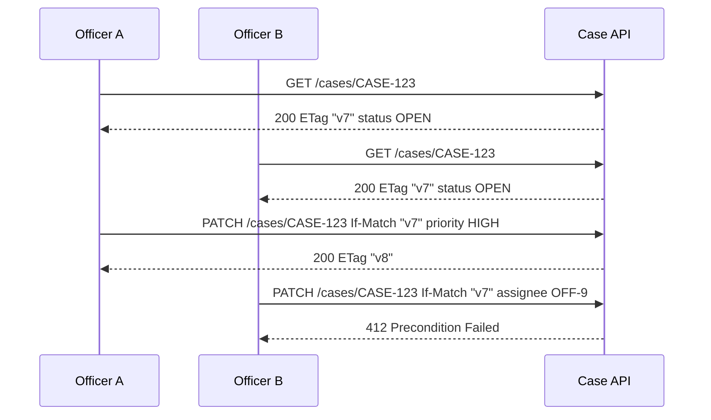
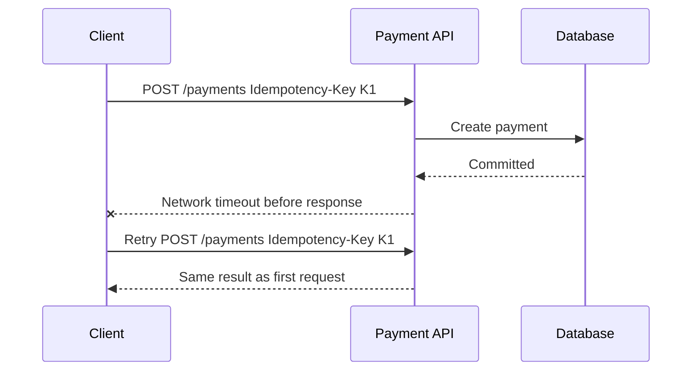

# Part 006 — HTTP Contract Semantics: Status Codes, Headers, Caching, Conditional Requests, and Idempotency

## 1. Tujuan Part Ini

Part ini membahas **HTTP sebagai contract language**, bukan sekadar transport untuk JSON.

Banyak API enterprise memakai HTTP tetapi tidak memakai semantics HTTP dengan benar. Akibatnya:

- semua outcome dibungkus `200 OK`,
- retry tidak aman,
- client tidak tahu kapan boleh cache,
- update race condition tidak terdeteksi,
- error tidak dapat diproses mesin,
- gateway/API management tidak bisa membantu,
- observability kehilangan sinyal,
- generated client tidak bisa memberi behavior yang benar,
- API contract terlihat sederhana tetapi behavior-nya ambigu.

Target setelah part ini:

1. Anda memahami HTTP method semantics sebagai bagian dari contract.
2. Anda mampu memilih status code berdasarkan outcome, bukan kebiasaan tim.
3. Anda mampu mendesain header sebagai control-plane contract.
4. Anda memahami caching dan conditional request sebagai alat correctness dan performance.
5. Anda mampu mendesain idempotency untuk create/update operation yang aman di distributed system.
6. Anda bisa menuangkan semantics ini ke OpenAPI.

Mental model utama:

> HTTP method, status code, header, cache directive, dan precondition bukan detail protokol rendah. Mereka adalah vocabulary kontrak antara provider, consumer, gateway, proxy, cache, load balancer, observability platform, dan manusia yang mengoperasikan sistem.

---

## 2. Kaufman Framing: Sub-Skill HTTP Contract

Agar efektif, pecah skill ini menjadi beberapa sub-skill:

| Sub-skill | Output Praktis |
|---|---|
| Method semantics | Bisa memilih GET/POST/PUT/PATCH/DELETE dengan benar |
| Status code taxonomy | Bisa memetakan outcome ke response code |
| Header contract | Bisa mendesain correlation, idempotency, cache, auth, concurrency |
| Conditional request | Bisa mencegah lost update |
| Caching contract | Bisa membedakan private/public/no-store/revalidation |
| Retry semantics | Bisa menjelaskan kapan consumer boleh retry |
| OpenAPI encoding | Bisa menulis semantics ke spec |
| Failure modeling | Bisa membedakan conflict, validation error, dependency failure, timeout |

Latihan minimal:

1. Pilih satu mutating API.
2. Tentukan method dan status code untuk semua outcome.
3. Tambahkan idempotency dan correlation header.
4. Tambahkan optimistic concurrency jika resource bisa diupdate bersamaan.
5. Tambahkan OpenAPI contract.
6. Review apakah consumer bisa membangun retry logic tanpa bertanya ke provider.

---

## 3. HTTP Bukan Sekadar “REST Transport”

Bentuk anti-pattern:

```http
POST /api
Content-Type: application/json

{
  "action": "createCase",
  "payload": {
    "subjectId": "ACC-123"
  }
}
```

Lalu semua response:

```http
HTTP/1.1 200 OK
Content-Type: application/json

{
  "success": false,
  "errorCode": "CASE_ALREADY_EXISTS"
}
```

Ini memakai HTTP sebagai tunnel. Banyak semantics hilang:

- method tidak menunjukkan safety/idempotency,
- path tidak menunjukkan resource,
- status code tidak menunjukkan outcome,
- cache tidak bisa bekerja,
- gateway tidak bisa classify error,
- monitoring tidak bisa group status dengan benar,
- client harus memahami custom envelope untuk semua hal.

Desain yang lebih baik:

```http
POST /cases
Idempotency-Key: 20260629-create-case-abc123
Content-Type: application/json
Accept: application/json

{
  "subject": {
    "type": "ACCOUNT",
    "id": "ACC-123"
  },
  "allegationType": "FRAUD"
}
```

Success:

```http
HTTP/1.1 201 Created
Location: /cases/CASE-0000001001
Content-Type: application/json

{
  "id": "CASE-0000001001",
  "status": "OPEN"
}
```

Conflict:

```http
HTTP/1.1 409 Conflict
Content-Type: application/json

{
  "code": "DUPLICATE_ACTIVE_CASE",
  "message": "An active case already exists for this subject.",
  "traceId": "4bf92f3577b34da6a3ce929d0e0e4736"
}
```

Transport semantics sekarang membantu contract.

---

## 4. Method Semantics: Safety dan Idempotency

HTTP methods membawa semantics.

| Method | Safe | Idempotent | Common Use | Contract Note |
|---|---:|---:|---|---|
| GET | Yes | Yes | Retrieve representation | Tidak boleh mengubah state yang meaningful |
| HEAD | Yes | Yes | Retrieve metadata only | Sama seperti GET tanpa body |
| POST | No | No by default | Create subordinate resource, command, processing | Perlu idempotency design untuk retry aman |
| PUT | No | Yes | Replace resource at known URI | Idempotent jika semantics dijaga |
| PATCH | No | Not necessarily | Partial update | Harus mendefinisikan patch format dan concurrency strategy |
| DELETE | No | Yes | Delete/remove resource | Idempotency outcome perlu jelas |
| OPTIONS | Yes | Yes | Capabilities | Jarang digunakan langsung oleh business API |

### 4.1 Safe Method

Safe berarti client tidak meminta state-changing behavior. Provider masih boleh melakukan logging, metrics, cache warming, atau audit read, tetapi tidak boleh mengubah business state sebagai efek utama.

Buruk:

```http
GET /cases/{caseId}/close
```

Masalah:

- crawler bisa memanggil,
- cache/proxy bisa mengulang,
- prefetcher bisa memicu state change,
- semantics salah.

Lebih benar:

```http
POST /cases/{caseId}/closures
```

### 4.2 Idempotent Method

Idempotent berarti beberapa request identik memiliki efek akhir yang sama seperti satu request.

Contoh PUT:

```http
PUT /cases/CASE-0001/priority
Content-Type: application/json

{
  "priority": "HIGH"
}
```

Mengirim request yang sama berkali-kali tetap menghasilkan priority `HIGH`.

Namun idempotent bukan berarti response harus selalu sama. Request pertama bisa `200`, request berikutnya juga `200`, atau dalam beberapa desain `204`. Yang penting efek akhirnya tidak berlipat.

### 4.3 POST Tidak Otomatis Buruk

POST sering diperlukan untuk:

- create resource dengan server-generated ID,
- menjalankan command,
- submit form/process,
- search kompleks yang terlalu besar untuk query string,
- asynchronous processing.

Tetapi POST mutating yang penting harus punya idempotency strategy.

---

## 5. Resource vs Command: Memilih Path dan Method

Tidak semua operation natural sebagai CRUD.

Contoh domain regulatory case management:

| Business Intent | Good HTTP Shape | Reason |
|---|---|---|
| Create case | `POST /cases` | Server creates subordinate resource |
| Get case | `GET /cases/{caseId}` | Retrieve representation |
| Replace case metadata | `PUT /cases/{caseId}/metadata` | Known resource replacement |
| Patch narrative | `PATCH /cases/{caseId}` | Partial update |
| Assign officer | `POST /cases/{caseId}/assignments` | Creates assignment record/action |
| Place hold | `POST /cases/{caseId}/holds` | Hold is auditable sub-resource |
| Release hold | `POST /cases/{caseId}/hold-releases` | Auditable command/result |
| Close case | `POST /cases/{caseId}/closures` | Business command with policy |
| Delete draft case | `DELETE /cases/{caseId}` | Resource removal if allowed |

Why not `POST /cases/{caseId}/close`?

It can be acceptable, but creating a sub-resource like `/closures` is often more auditable. It gives a place for:

- closure reason,
- actor,
- approval,
- timestamp,
- policy version,
- decision evidence.

Dalam regulated systems, state transition sering lebih baik dimodelkan sebagai auditable command/resource daripada sekadar verb endpoint.

---

## 6. Status Code Taxonomy: Outcome Contract

Status code harus menjawab:

1. Apakah request diterima secara syntax?
2. Apakah caller authenticated?
3. Apakah caller authorized?
4. Apakah target resource ada?
5. Apakah state target memungkinkan operation?
6. Apakah request sudah diproses?
7. Apakah consumer boleh retry?
8. Apakah error bersifat client-side atau provider-side?

### 6.1 Success Codes

| Code | Use | Contract Meaning |
|---|---|---|
| 200 OK | Successful request with response body | Outcome selesai dan representation dikembalikan |
| 201 Created | New resource created | Resource URI sebaiknya tersedia via `Location` |
| 202 Accepted | Request diterima untuk async processing | Belum selesai; perlu status tracking |
| 204 No Content | Success without body | Jangan kirim body |
| 206 Partial Content | Range response | Relevan untuk byte range, bukan pagination biasa |

### 6.2 Client Error Codes

| Code | Use | Contract Meaning |
|---|---|---|
| 400 Bad Request | Syntax/schema malformed or general bad request | Consumer perlu memperbaiki request |
| 401 Unauthorized | Authentication missing/invalid | Butuh credential/token valid |
| 403 Forbidden | Authenticated but not allowed | Credential valid tapi permission kurang |
| 404 Not Found | Resource not found or hidden | Jangan leak existence jika security menuntut |
| 405 Method Not Allowed | Method tidak didukung untuk resource | Sertakan `Allow` jika relevan |
| 409 Conflict | Conflict dengan current state | Consumer mungkin perlu refresh state |
| 412 Precondition Failed | Conditional request gagal | ETag/version tidak cocok |
| 415 Unsupported Media Type | Content-Type tidak didukung | Consumer salah media type |
| 422 Unprocessable Content/Entity | Semantically invalid payload | Tim harus konsisten jika memakai ini |
| 428 Precondition Required | Provider mensyaratkan conditional request | Mencegah lost update |
| 429 Too Many Requests | Rate limit | Sertakan retry guidance jika memungkinkan |

### 6.3 Server Error Codes

| Code | Use | Contract Meaning |
|---|---|---|
| 500 Internal Server Error | Unhandled provider failure | Consumer mungkin retry tergantung operation |
| 502 Bad Gateway | Upstream invalid response | Biasanya gateway/proxy |
| 503 Service Unavailable | Temporary unavailable | Retry mungkin aman jika idempotent |
| 504 Gateway Timeout | Upstream timeout | Outcome mungkin unknown untuk mutating operation |

Critical point:

> Untuk mutating request, timeout/5xx tidak selalu berarti operation gagal. Bisa jadi operation sudah committed tetapi response hilang.

Karena itu idempotency penting.

---

## 7. 400 vs 409 vs 422: Jangan Campur Semuanya

Perdebatan umum:

- pakai `400` untuk semua invalid request,
- pakai `422` untuk semantic validation,
- pakai `409` untuk business state conflict.

Yang penting bukan memenangkan debat, tapi membuat taxonomy konsisten.

Rekomendasi enterprise:

| Situation | Recommended Code | Example |
|---|---:|---|
| JSON malformed | 400 | Body tidak valid JSON |
| Required field missing | 400 or 422, pilih konsisten | `subjectId` hilang |
| Field format invalid | 400 or 422, pilih konsisten | currency bukan ISO-style code |
| Business rule conflict with current state | 409 | Case sudah closed |
| Optimistic concurrency mismatch | 412 | `If-Match` tidak cocok |
| Unsupported media type | 415 | `Content-Type: text/plain` |
| Auth missing | 401 | Token tidak ada |
| Permission denied | 403 | Scope tidak cukup |

Jangan lakukan ini:

```json
{
  "status": 400,
  "code": "CASE_ALREADY_CLOSED"
}
```

`CASE_ALREADY_CLOSED` biasanya state conflict, bukan malformed request.

Lebih baik:

```http
HTTP/1.1 409 Conflict
Content-Type: application/json

{
  "code": "CASE_ALREADY_CLOSED",
  "message": "Case cannot be assigned because it is already closed.",
  "traceId": "..."
}
```

---

## 8. 202 Accepted: Jangan Berbohong Tentang Completion

Gunakan `202 Accepted` ketika request diterima tetapi processing belum selesai.

Contoh:

```http
POST /case-import-jobs
Content-Type: application/json

{
  "sourceFileId": "FILE-123"
}
```

Response:

```http
HTTP/1.1 202 Accepted
Location: /case-import-jobs/JOB-789
Retry-After: 10
Content-Type: application/json

{
  "jobId": "JOB-789",
  "status": "QUEUED"
}
```

Kontrak `202` harus menyediakan:

1. tracking resource,
2. status lifecycle,
3. retry/polling guidance,
4. eventual success/failure representation,
5. idempotency behavior jika submit diulang,
6. retention policy untuk job result.

Buruk:

```http
HTTP/1.1 202 Accepted

{
  "message": "processing"
}
```

Consumer tidak tahu harus apa.

---

## 9. Headers as Control Plane

Header adalah bagian dari contract. Jangan hanya fokus pada JSON body.

| Header | Direction | Contract Role |
|---|---|---|
| `Content-Type` | Request/Response | Media type payload |
| `Accept` | Request | Response media type negotiation |
| `Authorization` | Request | Credential carrier |
| `Idempotency-Key` | Request | Retry-safe mutating request |
| `ETag` | Response | Representation version validator |
| `If-Match` | Request | Optimistic concurrency precondition |
| `If-None-Match` | Request | Cache validation / conditional create patterns |
| `Cache-Control` | Response/Request | Caching policy |
| `Location` | Response | URI of created/accepted resource |
| `Retry-After` | Response | Backoff guidance |
| `RateLimit-*` | Response | Rate-limit visibility if adopted |
| `traceparent` | Request/Response | Distributed tracing context |
| `X-Correlation-Id` | Request/Response | Business/application correlation |

### 9.1 Header Naming

Prefer standardized headers when available. Gunakan `X-*` hanya untuk private/internal conventions. Banyak organisasi tetap memakai `X-Correlation-Id`; itu boleh jika distandarkan internal, tetapi jangan menganggapnya universal standard.

### 9.2 Header in OpenAPI

```yaml
components:
  parameters:
    IdempotencyKeyHeader:
      name: Idempotency-Key
      in: header
      required: true
      schema:
        type: string
        minLength: 1
        maxLength: 128
      description: Unique client-generated key for safely retrying this operation.
    IfMatchHeader:
      name: If-Match
      in: header
      required: true
      schema:
        type: string
      description: ETag value obtained from the latest representation.
  headers:
    ETag:
      schema:
        type: string
      description: Entity tag representing the current resource representation.
    Location:
      schema:
        type: string
      description: URI of the created or accepted resource.
```

---

## 10. Content Negotiation Contract

`Content-Type` menjelaskan media type request body.

```http
Content-Type: application/json
```

`Accept` menjelaskan response media type yang diinginkan.

```http
Accept: application/json
```

OpenAPI:

```yaml
requestBody:
  content:
    application/json:
      schema:
        $ref: '#/components/schemas/CreateCaseRequest'
responses:
  '201':
    content:
      application/json:
        schema:
          $ref: '#/components/schemas/Case'
```

Jika API mendukung versi via media type:

```http
Accept: application/vnd.example.case.v1+json
```

Maka versioning menjadi bagian content negotiation contract. Ini bisa powerful, tetapi lebih kompleks untuk tooling, docs, client generation, gateway routing, dan support.

Jika tidak perlu, jangan pilih strategi versioning yang paling kompleks hanya agar terlihat sophisticated.

---

## 11. Caching Contract

Caching bukan hanya performance. Caching adalah contract tentang reuse response.

Basic response:

```http
HTTP/1.1 200 OK
Cache-Control: private, max-age=60
ETag: "case-123-v7"
Content-Type: application/json

{
  "id": "CASE-123",
  "status": "OPEN"
}
```

Meaning:

- response boleh disimpan private cache,
- fresh selama 60 detik,
- ETag bisa dipakai revalidation.

### 11.1 Common Cache-Control Directives

| Directive | Meaning |
|---|---|
| `no-store` | Jangan simpan response di cache |
| `no-cache` | Boleh simpan, tetapi harus revalidate sebelum reuse |
| `private` | Hanya private cache, bukan shared cache |
| `public` | Shared cache boleh menyimpan jika syarat terpenuhi |
| `max-age=N` | Fresh selama N detik |
| `s-maxage=N` | Freshness khusus shared cache |
| `must-revalidate` | Jangan gunakan stale response setelah expired tanpa revalidation |

Untuk data sensitif:

```http
Cache-Control: no-store
```

Untuk user-specific data:

```http
Cache-Control: private, no-cache
```

Untuk reference data yang jarang berubah:

```http
Cache-Control: public, max-age=3600
ETag: "refdata-v42"
```

### 11.2 Caching Mistakes

1. Tidak mengirim `Cache-Control` sama sekali untuk API sensitif.
2. Mengirim `public` untuk user-specific/PII data.
3. Menggunakan `no-cache` padahal maksudnya `no-store`.
4. Mengubah response tanpa mengubah validator.
5. Menggunakan cache untuk command response yang tidak boleh reused.
6. Tidak mendokumentasikan caching di OpenAPI.

---

## 12. ETag and Conditional GET

ETag adalah validator untuk representation.

Request pertama:

```http
GET /cases/CASE-123
```

Response:

```http
HTTP/1.1 200 OK
ETag: "case-123-v7"
Cache-Control: private, no-cache
Content-Type: application/json

{
  "id": "CASE-123",
  "status": "OPEN"
}
```

Request berikutnya:

```http
GET /cases/CASE-123
If-None-Match: "case-123-v7"
```

Jika tidak berubah:

```http
HTTP/1.1 304 Not Modified
ETag: "case-123-v7"
```

Manfaat:

- hemat bandwidth,
- memperjelas representation version,
- mendukung cache revalidation,
- menjadi foundation untuk optimistic concurrency.

ETag harus mewakili representation yang relevan. Jangan gunakan timestamp kasar yang bisa collision jika update cepat.

---

## 13. Optimistic Concurrency with If-Match

Lost update problem:



Without `If-Match`, B might overwrite A's update.

OpenAPI:

```yaml
/cases/{caseId}:
  patch:
    operationId: updateCase
    parameters:
      - name: caseId
        in: path
        required: true
        schema:
          type: string
      - name: If-Match
        in: header
        required: true
        schema:
          type: string
        description: ETag from the latest representation.
    requestBody:
      required: true
      content:
        application/json:
          schema:
            $ref: '#/components/schemas/PatchCaseRequest'
    responses:
      '200':
        description: Case updated.
        headers:
          ETag:
            schema:
              type: string
      '412':
        description: Precondition failed because the resource has changed.
```

### 13.1 409 vs 412

Use `412 Precondition Failed` when HTTP precondition header fails.

Use `409 Conflict` when request conflicts with business state.

Examples:

| Situation | Code |
|---|---:|
| `If-Match` ETag outdated | 412 |
| Assigning closed case | 409 |
| Closing case that has unresolved mandatory task | 409 |
| Updating without required `If-Match` where policy demands it | 428 |

---

## 14. PATCH Semantics: Define the Patch Format

`PATCH` is not self-explanatory. You must define patch document semantics.

Common options:

1. JSON Merge Patch.
2. JSON Patch.
3. Custom partial update DTO.

### 14.1 Custom Partial Update DTO

```yaml
PatchCaseRequest:
  type: object
  additionalProperties: false
  properties:
    priority:
      type: string
      enum:
        - LOW
        - MEDIUM
        - HIGH
    narrative:
      type:
        - string
        - 'null'
```

But now absent vs null matters:

- absent means do not change,
- null may mean clear field,
- string means set field.

Java DTO must preserve this distinction if null is meaningful.

### 14.2 JSON Patch

```http
PATCH /cases/CASE-123
Content-Type: application/json-patch+json
If-Match: "v7"

[
  { "op": "replace", "path": "/priority", "value": "HIGH" }
]
```

Powerful, but exposes document paths and is harder to validate semantically.

### 14.3 JSON Merge Patch

```http
PATCH /cases/CASE-123
Content-Type: application/merge-patch+json
If-Match: "v7"

{
  "priority": "HIGH",
  "narrative": null
}
```

Simple, but null-as-delete semantics must be understood.

Rule:

> Never expose PATCH without specifying the patch media type and null/absent semantics.

---

## 15. Idempotency-Key Pattern

Distributed systems fail in uncertain ways.

Scenario:



Without idempotency, retry can create duplicate payment/case/order.

### 15.1 Contract Rules

For an idempotency key to be a real contract:

1. Client generates unique key per logical operation.
2. Server stores key with request fingerprint and result.
3. Retry with same key and same payload returns same or equivalent result.
4. Retry with same key but different payload is rejected.
5. Key has retention window.
6. Behavior under concurrent duplicate request is defined.
7. Applicable methods/operations are documented.
8. Error and timeout semantics are documented.

### 15.2 OpenAPI

```yaml
components:
  parameters:
    IdempotencyKeyHeader:
      name: Idempotency-Key
      in: header
      required: true
      schema:
        type: string
        minLength: 1
        maxLength: 128
      description: |
        Unique client-generated key for safely retrying this operation.
        The same key with the same request payload returns the original outcome
        within the idempotency retention window. The same key with a different
        request payload is rejected.
```

Operation:

```yaml
/payments:
  post:
    operationId: createPayment
    parameters:
      - $ref: '#/components/parameters/IdempotencyKeyHeader'
    responses:
      '201':
        description: Payment created.
      '409':
        description: Request conflicts with an existing operation or resource state.
      '422':
        description: Idempotency key reused with a different payload.
```

Some organizations prefer `409` for key collision with different payload; others use `422`. Choose and standardize.

### 15.3 Storage Model

Conceptual table:

```text
idempotency_record
- key
- operation_name
- request_fingerprint
- status: PROCESSING | SUCCEEDED | FAILED_RETRYABLE | FAILED_FINAL
- response_status
- response_body
- resource_id
- created_at
- expires_at
```

Important invariants:

- unique key scoped by tenant/client/operation,
- request fingerprint prevents accidental reuse,
- concurrent first requests must not both execute,
- response replay should not expose stale sensitive data beyond retention policy,
- records should expire safely.

### 15.4 Common Mistakes

1. Key accepted but not persisted transactionally.
2. Key scoped globally, causing collision across clients.
3. Same key with different payload silently returns old result.
4. Server returns `500` for duplicate in-progress request without guidance.
5. Retention window undocumented.
6. Idempotency implemented only at controller layer while side effect happens downstream.
7. Idempotency key not included in logs/traces.
8. Idempotency key used as business ID without clear semantics.

---

## 16. Retry Semantics

Consumers need to know when retry is safe.

| Situation | Retry? | Notes |
|---|---|---|
| GET failed with 503 | Usually yes | Safe/idempotent |
| POST create without idempotency key timed out | Dangerous | Outcome unknown |
| POST create with idempotency key timed out | Yes | Retry same key/payload |
| PATCH with If-Match failed 412 | No blind retry | Refresh state first |
| 429 with Retry-After | Retry after delay | Respect throttling |
| 400 validation error | No | Fix request |
| 409 business conflict | Usually no blind retry | Resolve state/business issue |
| 500 after idempotent PUT | Usually yes with backoff | Verify semantics |
| 504 after mutating request | Unknown | Idempotency required |

OpenAPI can document retry hints using headers and descriptions:

```yaml
responses:
  '429':
    description: Rate limit exceeded.
    headers:
      Retry-After:
        schema:
          type: integer
        description: Seconds to wait before retrying.
```

But retry policy often lives in SDK/client docs as well.

---

## 17. Rate Limit Contract

Rate limiting is not only infrastructure. It affects consumer behavior.

A useful `429` response includes:

```http
HTTP/1.1 429 Too Many Requests
Retry-After: 60
Content-Type: application/json

{
  "code": "RATE_LIMIT_EXCEEDED",
  "message": "Request rate exceeded. Retry after 60 seconds.",
  "traceId": "..."
}
```

Contract questions:

1. Is limit per API key, tenant, user, IP, operation, or region?
2. Is it fixed window, sliding window, token bucket, or adaptive?
3. Is burst allowed?
4. Is `Retry-After` always present?
5. Are rate-limit headers exposed?
6. Are different scopes documented?
7. Are partner tiers different?

Even if exact algorithms are internal, consumer-facing behavior must be clear enough for safe integration.

---

## 18. Correlation, Trace, and Audit Headers

Common distinction:

| Concept | Purpose |
|---|---|
| Trace ID | Distributed tracing across services/spans |
| Correlation ID | Business/application request correlation |
| Request ID | Unique ID for a specific HTTP request |
| Idempotency Key | Retry identity for logical operation |
| Audit ID | Compliance/audit trail reference |

Do not collapse all into one field.

Example:

```http
traceparent: 00-4bf92f3577b34da6a3ce929d0e0e4736-00f067aa0ba902b7-01
X-Correlation-Id: CASE-INTAKE-20260629-ABC
Idempotency-Key: 20260629-create-case-abc123
```

OpenAPI:

```yaml
parameters:
  - name: traceparent
    in: header
    required: false
    schema:
      type: string
    description: W3C trace context header when distributed tracing is propagated.
  - name: X-Correlation-Id
    in: header
    required: false
    schema:
      type: string
    description: Business correlation identifier supplied by caller.
```

---

## 19. Modeling HTTP Semantics in OpenAPI

A contract engineer should encode HTTP semantics explicitly.

```yaml
/cases/{caseId}:
  get:
    operationId: getCase
    parameters:
      - name: caseId
        in: path
        required: true
        schema:
          type: string
      - name: If-None-Match
        in: header
        required: false
        schema:
          type: string
    responses:
      '200':
        description: Case representation.
        headers:
          ETag:
            schema:
              type: string
          Cache-Control:
            schema:
              type: string
        content:
          application/json:
            schema:
              $ref: '#/components/schemas/Case'
      '304':
        description: Case representation has not changed.
      '404':
        $ref: '#/components/responses/NotFound'
  patch:
    operationId: patchCase
    parameters:
      - name: caseId
        in: path
        required: true
        schema:
          type: string
      - name: If-Match
        in: header
        required: true
        schema:
          type: string
    requestBody:
      required: true
      content:
        application/merge-patch+json:
          schema:
            $ref: '#/components/schemas/PatchCaseRequest'
    responses:
      '200':
        description: Case updated.
        headers:
          ETag:
            schema:
              type: string
        content:
          application/json:
            schema:
              $ref: '#/components/schemas/Case'
      '409':
        $ref: '#/components/responses/Conflict'
      '412':
        $ref: '#/components/responses/PreconditionFailed'
      '428':
        $ref: '#/components/responses/PreconditionRequired'
```

This is dramatically more useful than:

```yaml
responses:
  '200':
    description: OK
```

---

## 20. Java Implementation Implications

Walaupun part ini fokus contract, kita perlu memahami efeknya ke Java.

### 20.1 Spring Controller Example

```java
@RestController
@RequestMapping("/cases")
class CaseController {

    @PostMapping
    ResponseEntity<CaseResponse> createCase(
            @RequestHeader("Idempotency-Key") String idempotencyKey,
            @RequestHeader(value = "X-Correlation-Id", required = false) String correlationId,
            @Valid @RequestBody CreateCaseRequest request) {

        CreatedCase created = caseApplicationService.createCase(
                idempotencyKey,
                correlationId,
                request
        );

        URI location = URI.create("/cases/" + created.id());

        return ResponseEntity
                .created(location)
                .eTag(created.etag())
                .body(CaseResponse.from(created));
    }
}
```

### 20.2 Conditional Update

```java
@PatchMapping("/{caseId}")
ResponseEntity<CaseResponse> patchCase(
        @PathVariable String caseId,
        @RequestHeader("If-Match") String ifMatch,
        @RequestBody PatchCaseRequest patch) {

    UpdatedCase updated = caseApplicationService.patchCase(caseId, ifMatch, patch);

    return ResponseEntity
            .ok()
            .eTag(updated.etag())
            .body(CaseResponse.from(updated));
}
```

### 20.3 Exception Mapping

```java
@RestControllerAdvice
class ApiExceptionHandler {

    @ExceptionHandler(PreconditionFailedException.class)
    ResponseEntity<ErrorResponse> preconditionFailed(PreconditionFailedException ex) {
        return ResponseEntity
                .status(HttpStatus.PRECONDITION_FAILED)
                .body(ErrorResponse.of("PRECONDITION_FAILED", ex.getMessage()));
    }

    @ExceptionHandler(StateConflictException.class)
    ResponseEntity<ErrorResponse> conflict(StateConflictException ex) {
        return ResponseEntity
                .status(HttpStatus.CONFLICT)
                .body(ErrorResponse.of(ex.code(), ex.getMessage()));
    }
}
```

Implementation harus mengikuti contract, bukan sebaliknya.

---

## 21. HTTP Contract Decision Matrix

| Design Question | Preferred Decision | When to Deviate |
|---|---|---|
| Create with server ID | `POST /resources` + `201` + `Location` | Use PUT if client controls ID |
| Create with retry safety | Require `Idempotency-Key` | Low-risk non-critical operation |
| Full replacement | `PUT /resources/{id}` | If replacement semantics unavailable |
| Partial update | `PATCH` with explicit media type | Use sub-resource command for complex business action |
| Concurrent update protection | `ETag` + `If-Match` | Single-writer resources or append-only actions |
| Async processing | `202` + status resource | If completion is immediate and committed |
| Business state conflict | `409` | If precondition header failed, use `412` |
| Validation failure | `400` or `422` consistently | Do not mix randomly |
| Sensitive data response | `Cache-Control: no-store` | Reference/public data only |
| Rate limit | `429` + `Retry-After` | If policy forbids exposing retry timing |

---

## 22. Anti-Patterns

### 22.1 GET That Mutates Business State

```http
GET /cases/CASE-1/approve
```

This violates safe method expectation.

### 22.2 POST Everything

```http
POST /getCase
POST /updateCase
POST /deleteCase
```

This hides semantics from infrastructure and humans.

### 22.3 200 for All Errors

```http
HTTP/1.1 200 OK

{
  "success": false
}
```

This breaks monitoring, retries, gateway policies, and client expectations.

### 22.4 Missing Idempotency on Critical Create

Payment, order, case creation, account opening, payout, transfer, and regulatory decision submission should not rely on blind retry.

### 22.5 ETag That Does Not Track Real Representation Change

If ETag stays same while meaningful representation changes, consumer cache/concurrency behavior becomes wrong.

### 22.6 PATCH Without Patch Semantics

```http
PATCH /cases/CASE-1

{
  "priority": null
}
```

Does null mean clear, ignore, invalid, or unknown? Contract must say.

### 22.7 Cache-Control Ignored for Sensitive Data

Leaving caching implicit on API with confidential data is a governance smell.

---

## 23. Production Failure Modes

### 23.1 Duplicate Side Effects

Cause:

- client retries POST after timeout,
- provider lacks idempotency,
- downstream side effect committed twice.

Prevention:

- idempotency key,
- transactional idempotency record,
- deduplication at downstream boundary,
- idempotent event publication.

### 23.2 Lost Update

Cause:

- two clients read same state,
- both update,
- second overwrites first.

Prevention:

- ETag,
- If-Match,
- version column,
- 412 response,
- merge UI/workflow.

### 23.3 Stale Authorization/Data Exposure via Cache

Cause:

- private data cached by shared proxy,
- missing/no wrong `Cache-Control`.

Prevention:

- `Cache-Control: no-store` for highly sensitive data,
- `private` for user-specific cacheable data,
- API gateway policy,
- cache testing.

### 23.4 Consumer Retry Storm

Cause:

- provider returns 503,
- no Retry-After,
- clients retry immediately,
- outage amplifies.

Prevention:

- backoff policy,
- Retry-After,
- circuit breaker,
- rate limit,
- idempotent retry.

### 23.5 Incorrect Semantic Monitoring

Cause:

- all errors returned as 200,
- monitoring sees success,
- incident detected late.

Prevention:

- proper status codes,
- error code metrics,
- contract-level SLO.

---

## 24. Testing HTTP Contract Semantics

Contract tests should verify more than schema.

### 24.1 Test Status Mapping

```java
@Test
void shouldReturn409WhenAssigningClosedCase() {
    // arrange: closed case
    // act: POST /cases/{caseId}/assignments
    // assert: 409 + error code CASE_ALREADY_CLOSED
}
```

### 24.2 Test Idempotency

```java
@Test
void shouldReturnSameResultWhenCreateCaseRetriedWithSameIdempotencyKey() {
    String key = UUID.randomUUID().toString();

    var first = client.createCase(key, request);
    var second = client.createCase(key, request);

    assertThat(first.statusCode()).isEqualTo(201);
    assertThat(second.body().id()).isEqualTo(first.body().id());
}
```

### 24.3 Test Idempotency Misuse

```java
@Test
void shouldRejectSameIdempotencyKeyWithDifferentPayload() {
    String key = UUID.randomUUID().toString();

    client.createCase(key, requestA);
    var response = client.createCase(key, requestB);

    assertThat(response.statusCode()).isIn(409, 422);
}
```

### 24.4 Test Conditional Update

```java
@Test
void shouldReturn412WhenIfMatchIsStale() {
    var caseView = client.getCase("CASE-1");
    String staleEtag = caseView.etag();

    client.patchCase("CASE-1", staleEtag, patchA);
    var response = client.patchCase("CASE-1", staleEtag, patchB);

    assertThat(response.statusCode()).isEqualTo(412);
}
```

### 24.5 Test Cache Headers

```java
@Test
void sensitiveCaseDetailShouldNotBeStoredInSharedCache() {
    var response = client.getCase("CASE-1");

    assertThat(response.header("Cache-Control")).contains("no-store");
}
```

---

## 25. OpenAPI Review Checklist for HTTP Semantics

### Method

- Apakah GET bebas business side effect?
- Apakah PUT benar-benar replacement/idempotent?
- Apakah PATCH punya media type dan null/absent semantics?
- Apakah POST mutating punya idempotency strategy?

### Status Code

- Apakah success code membedakan 200/201/202/204?
- Apakah validation, auth, conflict, precondition, rate limit jelas?
- Apakah 5xx tidak dipakai untuk business error?
- Apakah timeout/unknown outcome dijelaskan untuk mutating operation?

### Headers

- Apakah Content-Type dan Accept jelas?
- Apakah Location dikirim untuk created/accepted resource?
- Apakah ETag dikirim untuk mutable resource representation?
- Apakah If-Match wajib untuk update yang rawan lost update?
- Apakah Retry-After ada untuk 429/503 jika relevan?
- Apakah correlation/trace headers distandarkan?

### Caching

- Apakah sensitive data memakai no-store?
- Apakah cacheable reference data punya max-age/ETag?
- Apakah 304 flow didokumentasikan jika conditional GET didukung?

### Idempotency

- Apakah key scope jelas?
- Apakah retention window dijelaskan?
- Apakah duplicate same payload behavior jelas?
- Apakah duplicate different payload behavior jelas?
- Apakah concurrent duplicate behavior jelas?

---

## 26. Latihan 20 Jam: HTTP Contract Semantics

### Drill 1 — Status Code Refactoring

Ambil API existing yang memakai `200` untuk semua hal.

Buat mapping baru:

| Old Body Code | New HTTP Code | New Error Code |
|---|---:|---|
| `VALIDATION_FAILED` | 400/422 | `VALIDATION_FAILED` |
| `NOT_ALLOWED` | 403 | `FORBIDDEN` |
| `CASE_CLOSED` | 409 | `CASE_ALREADY_CLOSED` |
| `VERSION_MISMATCH` | 412 | `PRECONDITION_FAILED` |

### Drill 2 — Idempotent Create

Desain create API untuk resource penting:

- request,
- success response,
- duplicate same-key behavior,
- duplicate different-payload behavior,
- storage model,
- OpenAPI header,
- tests.

### Drill 3 — Conditional Update

Ambil mutable resource.

Tambahkan:

- ETag pada GET,
- If-Match pada PATCH/PUT,
- 412 response,
- 428 jika header wajib tapi hilang,
- test lost update.

### Drill 4 — Cache Classification

Klasifikasikan endpoint:

| Endpoint | Cache Policy |
|---|---|
| Current user profile | private/no-cache or no-store |
| Case detail with PII | no-store |
| Reference country list | public max-age + ETag |
| Audit log export | no-store |
| Static product catalog | public max-age |

---

## 27. Ringkasan

HTTP contract semantics adalah salah satu pembeda engineer biasa dan engineer senior.

Engineer biasa melihat:

> “Endpoint menerima JSON dan mengembalikan JSON.”

Engineer senior melihat:

> “Method, status code, header, cache policy, precondition, retry rule, idempotency key, dan response body bersama-sama membentuk contract yang menentukan correctness consumer dan behavior sistem saat gagal.”

Prinsip penting:

1. Jangan jadikan HTTP tunnel bodoh.
2. Gunakan method semantics dengan benar.
3. Pilih status code berdasarkan outcome.
4. Treat header as contract.
5. Gunakan caching secara eksplisit, terutama untuk sensitive data.
6. Gunakan ETag dan If-Match untuk mencegah lost update.
7. Gunakan Idempotency-Key untuk mutating POST yang perlu retry aman.
8. Dokumentasikan semua ini di OpenAPI.
9. Uji semantics, bukan hanya schema.

Jika contract tidak menjelaskan retry, cache, concurrency, dan failure semantics, consumer akan mengarang sendiri. Dalam distributed system, asumsi liar adalah sumber incident.

---

## 28. Referensi

- RFC 9110 — HTTP Semantics: https://www.rfc-editor.org/info/rfc9110
- RFC 9111 — HTTP Caching: https://www.rfc-editor.org/info/rfc9111
- OpenAPI Specification: https://spec.openapis.org/oas/v3.2.0.html
- MDN HTTP Resources and Specifications: https://developer.mozilla.org/en-US/docs/Web/HTTP/Reference/Resources_and_specifications
- MDN Idempotency-Key Header: https://developer.mozilla.org/en-US/docs/Web/HTTP/Reference/Headers/Idempotency-Key
- IETF HTTPAPI Idempotency-Key Draft Archive: https://datatracker.ietf.org/doc/draft-ietf-httpapi-idempotency-key-header/
