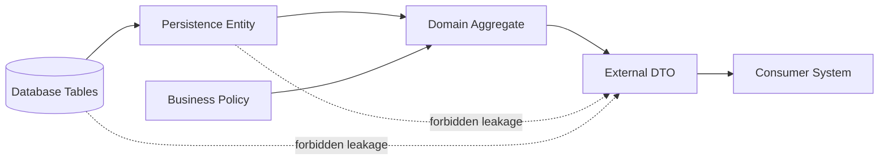
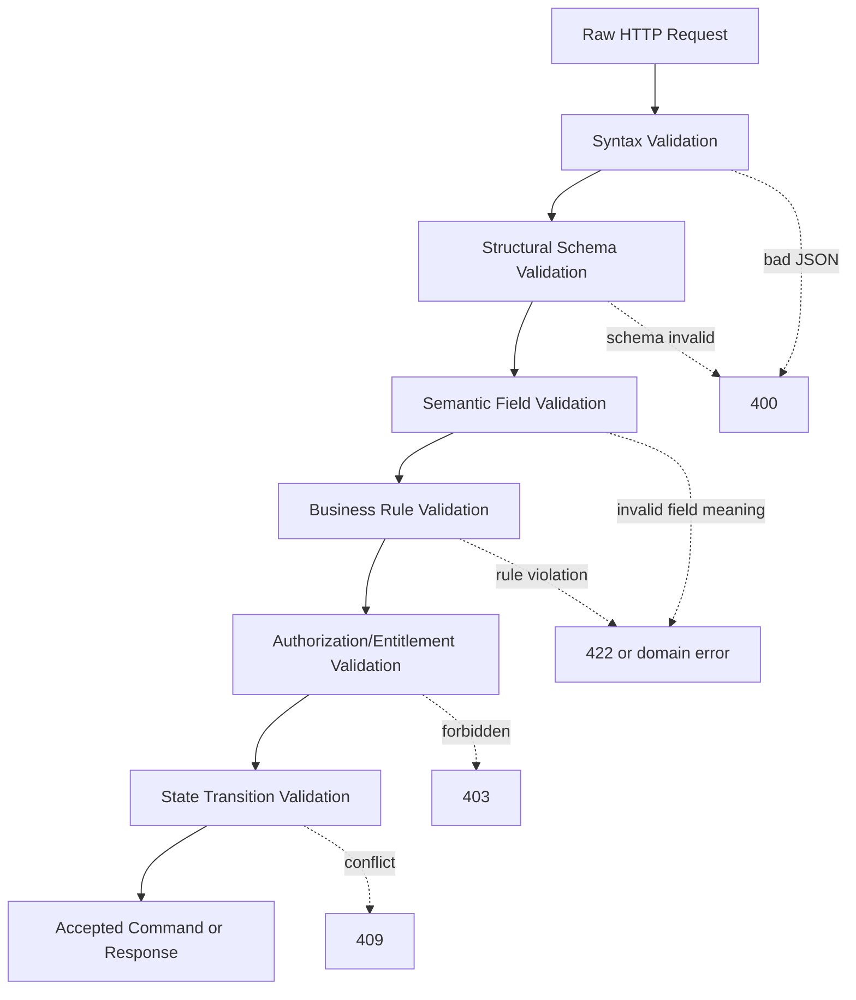
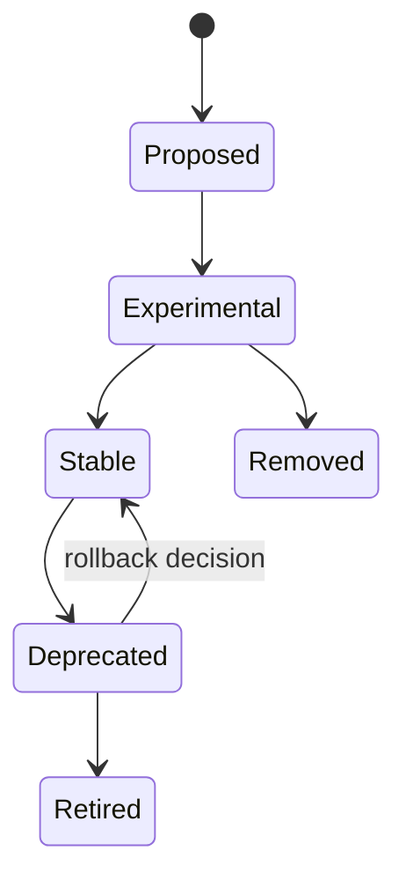
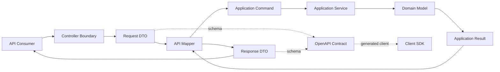

# Part 007 — Request and Response Design: DTO Boundaries, Validation Semantics, and Evolution Safety

## Tujuan Pembelajaran

Pada part ini kita tidak belajar “cara membuat DTO” secara basic. Itu sudah terlalu rendah untuk level contract engineering. Fokus kita adalah bagaimana **request dan response menjadi public promise** yang dapat hidup lama, dapat diuji, dapat berevolusi, dan tidak membocorkan struktur internal sistem Java.

Setelah menyelesaikan part ini, kamu harus mampu:

1. mendesain request/response yang stabil walaupun domain, database, dan service implementation berubah;
2. membedakan required, optional, nullable, absent, defaulted, derived, immutable, mutable, dan deprecated field;
3. menentukan kapan field boleh ditambah, diubah, disembunyikan, atau dipensiunkan;
4. membuat payload yang ramah consumer tanpa mengorbankan correctness;
5. menghindari leakage dari Java type, ORM entity, enum internal, database column, dan validation implementation;
6. membaca contract diff dan menilai apakah perubahan DTO aman, berbahaya, atau breaking;
7. membangun policy review untuk request/response di level enterprise.

Part ini adalah jembatan antara contract theory dan implementasi API Java produksi.

---

## 1. Kaufman Skill Decomposition

Josh Kaufman menekankan bahwa skill harus dipecah menjadi sub-skill kecil yang bisa dilatih dan dikoreksi. Untuk request/response design, skill besarnya adalah:

> “Mampu mendesain payload API yang benar secara domain, mudah dipakai consumer, aman berevolusi, dan tidak rapuh terhadap perubahan internal.”

Skill ini kita pecah menjadi sub-skill berikut.

| Sub-skill | Output yang harus terlihat |
|---|---|
| Payload boundary design | DTO tidak sama dengan entity, command, event, atau domain aggregate |
| Field semantics | Setiap field punya arti, lifecycle, ownership, dan compatibility class |
| Optionality modelling | Required, optional, nullable, absent, default tidak tercampur |
| Type selection | Money, time, ID, enum, state, reference tidak dimodelkan asal-asalan |
| Validation placement | Bisa membedakan syntax validation, structural validation, dan business validation |
| Evolution safety | Bisa menambah field tanpa mematahkan consumer dan tahu kapan perubahan breaking |
| Contract documentation | OpenAPI/JSON Schema menjelaskan real behavior, bukan hanya bentuk JSON |
| Review discipline | Bisa menemukan risiko jangka panjang dari payload yang tampak “benar” |

Praktik terbaiknya bukan menghafal template DTO. Praktik terbaiknya adalah membangun instinct:

> “Apa yang akan rusak kalau field ini berubah dua tahun lagi?”

---

## 2. Request/Response Bukan Sekadar JSON Shape

Kesalahan umum engineer menengah adalah berpikir:

```text
DTO = class Java yang di-serialize menjadi JSON
```

Dalam contract engineering, definisinya lebih ketat:

```text
Request contract = bentuk, batasan, intensi, dan konsekuensi input yang consumer kirim ke provider.

Response contract = bentuk, arti, stabilitas, dan interpretasi output yang provider janjikan ke consumer.
```

Payload bukan hanya struktur data. Payload adalah **boundary artifact**.

Contoh field sederhana:

```json
{
  "status": "ACTIVE"
}
```

Pertanyaan contract engineer:

1. Apakah `status` adalah state internal atau public state?
2. Apakah consumer boleh mengambil keputusan berdasarkan value ini?
3. Apakah daftar value akan bertambah?
4. Apakah value lama bisa hilang?
5. Apakah state ini konsisten dengan endpoint lain?
6. Apakah `ACTIVE` berarti dapat digunakan, dapat login, dapat menerima transaksi, atau hanya belum dihapus?
7. Apakah ada state transisi seperti `SUSPENDING`, `PENDING_REVIEW`, `LOCKED`, `ARCHIVED`?
8. Apa yang terjadi jika consumer lama menerima value baru?

Satu field bisa membawa banyak kontrak tersembunyi.

---

## 3. Mental Model: Payload as External Truth Projection

Model domain internal mungkin kompleks:



DTO bukan salinan entity. DTO adalah **projection** dari kebenaran internal ke dunia luar.

Projection berarti:

1. ada pemilihan field;
2. ada normalisasi istilah;
3. ada penyembunyian detail internal;
4. ada stabilisasi semantics;
5. ada transformasi tipe;
6. ada explicit compatibility promise.

Contoh buruk:

```java
@Entity
@Table(name = "customer_master")
public class CustomerEntity {
    @Id
    private Long id;

    @Column(name = "cust_stat_cd")
    private String statusCode;

    @Column(name = "upd_ts")
    private LocalDateTime updatedTimestamp;

    @Column(name = "kyc_flag")
    private String kycFlag;
}
```

Lalu entity ini langsung diekspos:

```json
{
  "id": 123,
  "statusCode": "A",
  "updatedTimestamp": "2026-06-29T09:15:00",
  "kycFlag": "Y"
}
```

Masalah:

| Leakage | Dampak |
|---|---|
| `id` sebagai number internal | Sulit migrasi ID format, raw enumeration, atau sharding |
| `statusCode` dengan value `"A"` | Consumer belajar kode internal |
| `LocalDateTime` tanpa offset | Ambiguity timezone |
| `kycFlag` `"Y"`/`"N"` | Database encoding bocor ke API |
| Nama field internal | Database refactor jadi breaking change |
| Tidak ada lifecycle semantics | Consumer tidak tahu mana field stabil |

Projection yang lebih baik:

```json
{
  "customerId": "cus_01J2T7Q7BSM8PV8K4J6JYQH7TR",
  "lifecycleStatus": "ACTIVE",
  "kycStatus": "VERIFIED",
  "lastUpdatedAt": "2026-06-29T02:15:00Z"
}
```

Bukan berarti ini otomatis sempurna, tapi sudah lebih dekat ke external contract.

---

## 4. DTO Boundary Rules

Aturan utama:

> Jangan pernah menggunakan type internal sebagai public contract hanya karena convenient.

Boundary type harus dipisah dari:

1. persistence entity;
2. domain aggregate;
3. database projection;
4. Kafka event payload internal;
5. framework request object;
6. generated client model dari service lain;
7. security principal internal;
8. UI form state;
9. batch import record;
10. third-party vendor payload.

### 4.1 Recommended Java Package Boundary

Contoh struktur package:

```text
com.acme.customer
├── api
│   ├── CustomerController.java
│   ├── request
│   │   ├── CreateCustomerRequest.java
│   │   └── UpdateCustomerProfileRequest.java
│   ├── response
│   │   ├── CustomerResponse.java
│   │   └── CustomerSummaryResponse.java
│   └── error
│       └── CustomerProblemTypes.java
├── application
│   ├── CreateCustomerCommand.java
│   └── CustomerApplicationService.java
├── domain
│   ├── Customer.java
│   ├── CustomerId.java
│   └── CustomerLifecycleStatus.java
├── persistence
│   ├── CustomerEntity.java
│   └── CustomerRepository.java
└── mapping
    └── CustomerApiMapper.java
```

Catatan:

- `CreateCustomerRequest` bukan `CreateCustomerCommand`.
- `CustomerResponse` bukan `Customer`.
- `CustomerEntity` tidak keluar dari persistence.
- Mapper berada di boundary, bukan menyebar ke seluruh codebase.
- Contract type diberi nama sesuai perspektif consumer.

### 4.2 DTO as Record?

Java `record` cocok untuk DTO immutable:

```java
public record CustomerResponse(
    String customerId,
    String lifecycleStatus,
    String kycStatus,
    OffsetDateTime lastUpdatedAt
) {}
```

Namun `record` bukan silver bullet.

Gunakan `record` ketika:

1. object adalah pure data carrier;
2. field relatif flat;
3. tidak butuh framework mutation;
4. constructor validation jelas;
5. serializer mendukung dengan baik;
6. tidak ada inheritance/polymorphic complexity.

Hati-hati ketika:

1. butuh backward-compatible deserialization dengan default;
2. butuh optional field yang kompleks;
3. ada `@JsonCreator` rumit;
4. generated OpenAPI model tidak cocok;
5. field lifecycle perlu custom setter behavior;
6. API berubah sangat sering.

---

## 5. Required, Optional, Nullable, Absent: Empat Konsep Berbeda

Ini salah satu bagian paling penting.

Banyak API rusak bukan karena algoritma salah, tetapi karena contract tidak jelas tentang kehadiran field.

### 5.1 Vocabulary

| Konsep | Arti |
|---|---|
| Required | Field harus ada dalam payload |
| Optional | Field boleh tidak ada |
| Nullable | Field boleh ada dengan value `null` |
| Absent | Field tidak dikirim sama sekali |
| Empty | Field ada tetapi berisi empty value, misalnya `""`, `[]`, `{}` |
| Defaulted | Field tidak dikirim, provider mengisi default |
| Derived | Field tidak dikirim, provider menghitung dari data lain |
| Ignored | Field dikirim tapi tidak dipakai |
| Rejected | Field dikirim dan dianggap error |

### 5.2 Matrix Semantics

| Payload | Required? | Nullable? | Meaning |
|---|---:|---:|---|
| field absent | no | irrelevant | consumer tidak memberikan value |
| field absent | yes | irrelevant | invalid |
| `"field": null` | yes/no | yes | explicit null |
| `"field": null` | yes/no | no | invalid |
| `"field": ""` | yes/no | no/yes | empty string, bukan null |
| `"field": []` | yes/no | no/yes | empty collection |
| `"field": {}` | yes/no | no/yes | empty object |

Jangan menyamakan `null`, empty string, dan absent.

### 5.3 OpenAPI 3.1/3.2 Style

OpenAPI 3.1+ alignment dengan JSON Schema membuat null dapat dimodelkan sebagai type.

```yaml
components:
  schemas:
    CustomerProfile:
      type: object
      required:
        - displayName
      properties:
        displayName:
          type: string
          minLength: 1
        middleName:
          type:
            - string
            - "null"
          description: >
            Optional middle name. If absent, provider leaves current value unchanged
            in PATCH semantics. If null, provider clears the value.
```

Catatan:

- `required` bicara kehadiran property.
- `type: ["string", "null"]` bicara value yang diizinkan.
- Field bisa required sekaligus nullable.
- Field bisa optional tetapi non-nullable.

### 5.4 OpenAPI 3.0 Style

Di OpenAPI 3.0, umum ditemukan:

```yaml
middleName:
  type: string
  nullable: true
```

Masalahnya, banyak tool memiliki interpretasi berbeda antara `nullable`, `required`, dan Java generated type. Untuk sistem baru, prefer OpenAPI 3.1+ bila tooling sudah matang di organisasi.

---

## 6. Request Semantics: Create, Replace, Patch, Action

Tidak semua request sama. Desain DTO harus mengikuti operation semantics.

### 6.1 Create Request

Create request biasanya menyatakan intent untuk membuat resource baru.

```json
{
  "externalReference": "CRM-928812",
  "fullName": "Ayu Lestari",
  "birthDate": "1994-05-18",
  "emailAddress": "ayu@example.com"
}
```

Pertanyaan desain:

1. Apakah client boleh menentukan ID?
2. Apakah request idempotent?
3. Apakah duplicate externalReference ditolak atau mengembalikan resource existing?
4. Field apa yang wajib pada waktu create?
5. Field apa yang dihasilkan provider?
6. Apakah create langsung final atau masuk state pending?

Contoh OpenAPI fragment:

```yaml
CreateCustomerRequest:
  type: object
  required:
    - externalReference
    - fullName
    - birthDate
  additionalProperties: false
  properties:
    externalReference:
      type: string
      minLength: 1
      maxLength: 100
      description: Consumer-provided stable reference for idempotency and reconciliation.
    fullName:
      type: string
      minLength: 1
      maxLength: 200
    birthDate:
      type: string
      format: date
    emailAddress:
      type: string
      format: email
```

### 6.2 Replace Request

PUT-like replace berarti consumer mengirim representasi lengkap.

Bahaya:

- field yang tidak dikirim bisa dianggap dihapus;
- consumer lama yang tidak tahu field baru bisa menghapus data baru;
- full replacement sulit aman untuk resource yang berevolusi.

Gunakan replace hanya bila:

1. resource representation kecil dan stabil;
2. ownership seluruh field jelas di consumer;
3. optimistic concurrency tersedia;
4. API mendokumentasikan absent sebagai delete/reset;
5. consumer upgrade discipline kuat.

### 6.3 Patch Request

PATCH-like request cocok untuk partial update, tetapi semantics harus eksplisit.

Ada beberapa model.

#### Merge Patch Style

```json
{
  "displayName": "Ayu L.",
  "middleName": null
}
```

Semantics:

- absent = no change;
- null = clear;
- value = replace.

Ini mudah digunakan, tetapi berbahaya jika null semantics tidak jelas.

#### Operation Patch Style

```json
{
  "operations": [
    {
      "op": "replace",
      "path": "/displayName",
      "value": "Ayu L."
    },
    {
      "op": "remove",
      "path": "/middleName"
    }
  ]
}
```

Lebih eksplisit, tetapi lebih kompleks.

#### Domain Patch Style

```json
{
  "displayNameChange": {
    "newValue": "Ayu L."
  },
  "middleNameChange": {
    "clear": true
  }
}
```

Lebih verbose, tetapi cocok untuk domain yang high-risk.

### 6.4 Action Request

Kadang endpoint bukan CRUD, tetapi action domain:

```http
POST /cases/{caseId}:approve
POST /accounts/{accountId}:freeze
POST /claims/{claimId}:escalate
```

Request DTO harus merepresentasikan decision context:

```json
{
  "reasonCode": "RISK_THRESHOLD_EXCEEDED",
  "comment": "Escalated after second failed verification.",
  "evidenceIds": [
    "evd_01J2T9XGQYV1F3E5F2D7W8AR9Z"
  ]
}
```

Action request bukan tempat mengirim seluruh state resource. Ia harus fokus pada:

1. decision;
2. reason;
3. evidence;
4. actor intent;
5. idempotency;
6. concurrency guard.

---

## 7. Response Semantics: Representation, Acknowledgement, Projection, Result

Response tidak selalu resource representation.

### 7.1 Resource Representation

```json
{
  "customerId": "cus_01J2T7Q7BSM8PV8K4J6JYQH7TR",
  "lifecycleStatus": "ACTIVE",
  "kycStatus": "VERIFIED",
  "createdAt": "2026-06-29T02:15:00Z",
  "lastUpdatedAt": "2026-06-29T02:15:00Z"
}
```

Gunakan ketika consumer membutuhkan current state.

### 7.2 Command Acknowledgement

```json
{
  "commandId": "cmd_01J2TBH5KZTR2TH63AWY5N5RG9",
  "acceptedAt": "2026-06-29T02:16:00Z",
  "statusUrl": "/commands/cmd_01J2TBH5KZTR2TH63AWY5N5RG9"
}
```

Gunakan ketika operation asynchronous.

### 7.3 Search Result

```json
{
  "items": [
    {
      "customerId": "cus_01J2T7Q7BSM8PV8K4J6JYQH7TR",
      "displayName": "Ayu Lestari",
      "lifecycleStatus": "ACTIVE"
    }
  ],
  "page": {
    "nextCursor": "eyJvZmZzZXQiOjEwMH0",
    "hasMore": true
  }
}
```

Jangan mengembalikan raw array untuk list endpoint jika pagination, metadata, trace, atau expansion mungkin dibutuhkan.

Bad:

```json
[
  { "customerId": "cus_1" },
  { "customerId": "cus_2" }
]
```

Lebih baik:

```json
{
  "items": [
    { "customerId": "cus_1" },
    { "customerId": "cus_2" }
  ],
  "page": {
    "nextCursor": null,
    "hasMore": false
  }
}
```

Alasannya evolvability. Object wrapper memungkinkan field baru tanpa breaking major shape.

---

## 8. DTO Naming: Consumer Language, Not Internal Language

Nama field adalah contract. Nama yang buruk bisa membekukan model yang salah selama bertahun-tahun.

### 8.1 Naming Principles

| Principle | Example buruk | Example lebih baik |
|---|---|---|
| Use domain language | `statCd` | `lifecycleStatus` |
| Avoid storage terms | `custIdPk` | `customerId` |
| Avoid implementation terms | `retryFlag` | `retryable` |
| Avoid ambiguous flags | `active` | `lifecycleStatus` |
| Avoid overloaded field | `type` | `caseCategory`, `documentKind`, `accountClass` |
| Use time semantics | `date` | `createdAt`, `effectiveFrom`, `expiresAt` |

### 8.2 Boolean Trap

Boolean sering terlihat simpel tetapi miskin semantics.

Bad:

```json
{
  "active": true
}
```

Apa arti active?

- boleh login?
- belum dihapus?
- subscription aktif?
- sudah KYC?
- tidak sedang suspend?
- masih valid untuk transaksi?

Lebih baik:

```json
{
  "lifecycleStatus": "ACTIVE",
  "accessStatus": "ALLOWED",
  "kycStatus": "VERIFIED"
}
```

Gunakan boolean hanya jika domain benar-benar binary dan stabil.

Contoh boolean yang masuk akal:

```json
{
  "hasMore": true,
  "retryable": false
}
```

---

## 9. Identifier Contract

ID bukan detail kecil. ID adalah external reference surface.

### 9.1 Internal Numeric ID Leakage

Bad:

```json
{
  "customerId": 12345
}
```

Masalah:

1. mudah ditebak;
2. mengungkap volume atau urutan;
3. sulit migrasi ke distributed ID;
4. raw database key bocor;
5. consumer mungkin menyimpan asumsi numeric;
6. bisa memperbesar risiko enumeration.

Lebih baik:

```json
{
  "customerId": "cus_01J2T7Q7BSM8PV8K4J6JYQH7TR"
}
```

### 9.2 ID Prefix

Prefix membantu debugging dan validasi manusia:

| Prefix | Meaning |
|---|---|
| `cus_` | customer |
| `acc_` | account |
| `case_` | case |
| `evd_` | evidence |
| `cmd_` | command |
| `evt_` | event |

Namun prefix adalah contract. Jangan mengganti seenaknya.

### 9.3 External Reference vs Provider ID

Pisahkan:

```json
{
  "customerId": "cus_01J2T7Q7BSM8PV8K4J6JYQH7TR",
  "externalReference": "CRM-928812"
}
```

| Field | Owner |
|---|---|
| `customerId` | provider |
| `externalReference` | consumer atau upstream system |

Jangan membuat consumer bingung mana ID otoritatif.

---

## 10. Monetary Field Contract

Money adalah sumber bug besar di enterprise systems.

Bad:

```json
{
  "amount": 1000
}
```

Pertanyaan:

1. Currency apa?
2. Minor unit atau major unit?
3. Precision berapa?
4. Apakah termasuk tax?
5. Apakah amount bisa negative?
6. Apakah rounding sudah diterapkan?
7. Apakah ini authorized amount, settled amount, outstanding amount, atau fee amount?

Lebih baik:

```json
{
  "outstandingAmount": {
    "currency": "IDR",
    "value": "1000.00"
  }
}
```

Gunakan string decimal untuk menghindari floating point ambiguity di consumer lintas bahasa.

Java internal:

```java
public record MoneyDto(
    String currency,
    String value
) {}
```

Mapping internal:

```java
public record Money(
    Currency currency,
    BigDecimal amount
) {}
```

OpenAPI:

```yaml
Money:
  type: object
  required:
    - currency
    - value
  additionalProperties: false
  properties:
    currency:
      type: string
      minLength: 3
      maxLength: 3
      example: IDR
    value:
      type: string
      pattern: '^-?[0-9]+(\.[0-9]+)?$'
      example: "1000.00"
```

Policy:

1. jangan expose `double` untuk money;
2. dokumentasikan rounding;
3. dokumentasikan sign;
4. dokumentasikan currency;
5. dokumentasikan apakah tax included;
6. dokumentasikan scale expectation bila domain membutuhkannya.

---

## 11. Temporal Field Contract

Waktu tidak boleh dimodelkan asal-asalan.

### 11.1 Common Temporal Types

| Contract type | JSON form | Java type candidate | Use case |
|---|---|---|---|
| Instant timestamp | `2026-06-29T02:15:00Z` | `Instant` / `OffsetDateTime` | audit, event time |
| Local date | `2026-06-29` | `LocalDate` | birth date, due date by jurisdiction |
| Local time | `09:00:00` | `LocalTime` | schedule template |
| Date range | object | custom value object | validity period |
| Duration | `PT15M` | `Duration` | timeout, SLA |
| Period | `P1M` | `Period` | billing cycle |

### 11.2 Avoid LocalDateTime in Public API

Bad:

```json
{
  "createdAt": "2026-06-29T09:15:00"
}
```

Tidak jelas timezone-nya.

Lebih baik:

```json
{
  "createdAt": "2026-06-29T02:15:00Z"
}
```

atau jika memang jurisdiction-local:

```json
{
  "businessDate": "2026-06-29",
  "jurisdiction": "ID"
}
```

### 11.3 Time Name Matters

| Field | Meaning |
|---|---|
| `createdAt` | provider created resource |
| `updatedAt` | provider last updated resource |
| `occurredAt` | business event happened |
| `publishedAt` | message was published |
| `receivedAt` | provider received request/message |
| `effectiveFrom` | rule/state starts to apply |
| `expiresAt` | no longer valid after this timestamp |
| `businessDate` | domain date, not necessarily technical timestamp |

Jangan menggunakan field generik seperti `date`, `timestamp`, atau `time` tanpa qualifier.

---

## 12. Enum Contract

Enum adalah compatibility trap.

Bad:

```json
{
  "status": "ACTIVE"
}
```

Bukan karena string enum salah, tetapi karena evolution-nya sering tidak dipikirkan.

### 12.1 Enum Evolution Questions

1. Apakah value baru boleh ditambah?
2. Apakah consumer lama harus ignore unknown value?
3. Apakah provider boleh menghapus value lama?
4. Apakah enum mewakili state machine?
5. Apakah enum mewakili taxonomy yang berubah?
6. Apakah ada default fallback?
7. Apakah enum value digunakan dalam business rule consumer?

### 12.2 Closed Enum vs Open Enum

Closed enum:

```yaml
kycStatus:
  type: string
  enum:
    - NOT_STARTED
    - PENDING
    - VERIFIED
    - REJECTED
```

Cocok bila:

- value jarang berubah;
- consumer harus menangani semua value;
- unknown value harus dianggap error;
- provider dan consumer release cadence terkendali.

Open enum pattern:

```yaml
riskBand:
  type: string
  description: >
    Known values include LOW, MEDIUM, HIGH. Consumers must tolerate unknown
    values and treat them as requiring manual/default handling.
```

Cocok bila:

- taxonomy dapat bertambah;
- consumer harus robust;
- value tidak selalu hard-coded.

### 12.3 Java Enum Leakage

Bad:

```java
public enum InternalCustomerStatus {
    A,
    B,
    C,
    X1,
    TEMP_LOCK_2
}
```

Diekspos langsung ke API:

```json
{
  "status": "TEMP_LOCK_2"
}
```

Lebih baik mapping explicit:

```java
public enum CustomerLifecycleStatusDto {
    ACTIVE,
    SUSPENDED,
    CLOSED,
    PENDING_REVIEW
}
```

Mapper:

```java
public CustomerLifecycleStatusDto toDto(InternalCustomerStatus status) {
    return switch (status) {
        case A -> CustomerLifecycleStatusDto.ACTIVE;
        case B -> CustomerLifecycleStatusDto.PENDING_REVIEW;
        case C -> CustomerLifecycleStatusDto.CLOSED;
        case X1, TEMP_LOCK_2 -> CustomerLifecycleStatusDto.SUSPENDED;
    };
}
```

Rule:

> Internal enum boleh berubah cepat. Public enum harus berubah lambat.

---

## 13. Polymorphic Payload Contract

Polymorphism sering dibutuhkan, tetapi bisa membuat contract sulit dipakai.

Contoh:

```json
{
  "verificationMethod": {
    "type": "DOCUMENT",
    "documentType": "PASSPORT",
    "documentNumber": "A1234567"
  }
}
```

Alternatif:

```json
{
  "verificationMethodType": "DOCUMENT",
  "documentVerification": {
    "documentType": "PASSPORT",
    "documentNumber": "A1234567"
  },
  "biometricVerification": null
}
```

Atau oneOf schema:

```yaml
VerificationMethod:
  oneOf:
    - $ref: '#/components/schemas/DocumentVerification'
    - $ref: '#/components/schemas/BiometricVerification'
  discriminator:
    propertyName: type
```

Trade-off:

| Pattern | Pro | Kontra |
|---|---|---|
| Discriminator + oneOf | expressive, schema-validatable | tool support bervariasi |
| Separate nullable branches | mudah di beberapa client | bisa verbose dan invalid combination |
| Type + generic object | fleksibel | validation lemah |
| Separate endpoint | jelas | lebih banyak operation |

Gunakan polymorphism hanya saat benar-benar ada variasi shape yang stabil. Jangan pakai hanya karena domain model memakai inheritance.

---

## 14. Validation Semantics: Jangan Campur Semua di Satu Layer

Validation memiliki beberapa level.



### 14.1 Syntax Validation

Contoh:

- invalid JSON;
- invalid content type;
- malformed date;
- malformed UUID.

Biasanya menghasilkan `400 Bad Request`.

### 14.2 Structural Validation

Contoh:

- required field missing;
- value type salah;
- string too long;
- array exceeds max items;
- unknown property rejected.

Bisa `400`, sering juga dipisah sebagai validation problem.

### 14.3 Semantic Field Validation

Contoh:

- `birthDate` di masa depan;
- `effectiveFrom` setelah `effectiveTo`;
- currency tidak didukung;
- enum valid secara schema tetapi tidak valid untuk tenant.

### 14.4 Business Rule Validation

Contoh:

- customer belum KYC sehingga tidak bisa membuka account;
- case tidak bisa ditutup karena mandatory evidence belum ada;
- transaction melebihi limit.

Ini bukan sekadar DTO validation. Jangan sembunyikan sebagai `@NotNull` atau `@Pattern`.

### 14.5 State Transition Validation

Contoh:

```text
DRAFT -> SUBMITTED -> UNDER_REVIEW -> APPROVED
```

Request `approve` invalid jika current state masih `DRAFT`.

Ini harus menjadi domain error atau conflict, bukan field validation biasa.

---

## 15. Bean Validation Annotation as Implementation, Not Contract Strategy

Annotation seperti `@NotNull`, `@Size`, `@Pattern`, `@Email` berguna, tetapi bukan strategi contract lengkap.

Contoh:

```java
public record CreateCustomerRequest(
    @NotBlank
    @Size(max = 200)
    String fullName,

    @NotNull
    LocalDate birthDate,

    @Email
    String emailAddress
) {}
```

Ini baik sebagai enforcement di Java boundary. Namun contract engineer tetap harus memastikan:

1. OpenAPI schema sesuai annotation;
2. error response stabil;
3. validation group tidak membocorkan operation internal;
4. custom validator tidak menyembunyikan business rule;
5. optional/null semantics terdokumentasi;
6. consumer tahu apakah field absent, null, atau empty valid;
7. test membuktikan runtime sesuai spec.

Annotation adalah guardrail. Contract tetap harus explicit.

---

## 16. Unknown Properties: Strict or Tolerant?

Keputusan `additionalProperties` sangat penting.

### 16.1 Strict Request

```yaml
CreateCustomerRequest:
  type: object
  additionalProperties: false
```

Pro:

- typo cepat ketahuan;
- contract bersih;
- mengurangi accidental field;
- security lebih baik untuk mass-assignment risk.

Kontra:

- consumer yang mengirim field eksperimen akan gagal;
- forward compatibility lebih rendah;
- gateway/proxy yang menambahkan field bisa mematahkan request.

### 16.2 Tolerant Request

```yaml
CreateCustomerRequest:
  type: object
  additionalProperties: true
```

Pro:

- lebih tolerant;
- cocok untuk extension field;
- bisa mendukung vendor-specific metadata.

Kontra:

- typo diam-diam diabaikan;
- consumer punya false confidence;
- provider sulit mendeteksi misuse;
- governance lemah.

### 16.3 Recommended Enterprise Policy

Untuk high-value command request:

```yaml
additionalProperties: false
```

Untuk metadata extension yang disengaja:

```yaml
metadata:
  type: object
  additionalProperties:
    type: string
```

Aturan:

1. default strict untuk command;
2. explicit extension point jika dibutuhkan;
3. log rejected unknown fields;
4. test typo fields;
5. jangan silently ignore field penting.

---

## 17. Field Lifecycle

Setiap field harus punya lifecycle.



### 17.1 Proposed

Field belum masuk public contract. Masih dalam desain.

### 17.2 Experimental

Field tersedia untuk limited consumer.

Risiko:

- begitu external consumer bergantung, field sulit dihapus;
- experimental harus diberi scope dan expiry.

### 17.3 Stable

Field menjadi public promise.

Stable berarti:

1. name tidak berubah;
2. type tidak berubah breaking;
3. meaning tidak berubah diam-diam;
4. constraints tidak diperketat tanpa migration;
5. enum value lama tetap dipahami;
6. response field tetap tersedia sesuai dokumentasi.

### 17.4 Deprecated

Deprecated bukan removed.

Harus ada:

1. alasan deprecation;
2. replacement field;
3. migration window;
4. target removal date bila memungkinkan;
5. consumer inventory;
6. telemetry usage;
7. changelog.

OpenAPI example:

```yaml
oldStatus:
  type: string
  deprecated: true
  description: >
    Deprecated. Use lifecycleStatus instead. This field will remain available
    until all registered consumers migrate.
```

### 17.5 Retired

Field sudah tidak dikirim atau tidak diterima. Ini breaking jika masih ada consumer. Harus melalui governance.

---

## 18. Safe Evolution Rules

### 18.1 Usually Safe Changes

| Change | Condition |
|---|---|
| Add optional response field | Consumer ignores unknown field |
| Add optional request field | Provider has default behavior |
| Widen string max length | Downstream can handle |
| Add enum value | Consumer tolerates unknown |
| Add new error code | Consumer has fallback |
| Add new link/metadata | Wrapper object supports it |

### 18.2 Dangerous Changes

| Change | Why dangerous |
|---|---|
| Add required request field | Old consumer cannot send it |
| Remove response field | Old consumer may depend on it |
| Change field type | Deserialization break |
| Tighten validation | Previously valid requests fail |
| Change enum meaning | Silent semantic break |
| Rename field | Equivalent to remove + add |
| Change date format | Parser break |
| Change ID format | Stored references may break |
| Change nullability | Consumer assumptions break |
| Change default | Behavior changes silently |

### 18.3 Semantic Breaking Change

Perubahan bisa breaking walaupun schema diff terlihat aman.

Contoh:

```json
{
  "riskScore": 720
}
```

Sebelumnya range 0-1000. Kemudian provider mengubah menjadi 0-100 tanpa rename.

Schema mungkin tetap integer, tetapi semantics berubah total.

Rule:

> Contract diff harus membaca meaning, bukan hanya type.

---

## 19. Request Field Ownership

Dalam request, setiap field harus jelas siapa owner-nya.

| Field | Owner | Provider behavior |
|---|---|---|
| `externalReference` | consumer | persisted for reconciliation |
| `customerId` | provider | usually not accepted on create |
| `requestedLimit` | consumer | subject to provider approval |
| `approvedLimit` | provider | not accepted from consumer |
| `reasonCode` | consumer or provider taxonomy | validated |
| `metadata` | consumer | stored or ignored by explicit policy |

Bad request:

```json
{
  "customerId": "cus_123",
  "approvedLimit": {
    "currency": "IDR",
    "value": "10000000.00"
  },
  "riskBand": "LOW"
}
```

Jika field seharusnya provider-derived, jangan terima dari consumer. Bila diterima untuk admin override, operation harus berbeda dan authorization jelas.

---

## 20. Response Field Stability

Response field bisa dibagi berdasarkan stability.

| Stability | Meaning |
|---|---|
| Stable | Consumer boleh hard-depend |
| Informational | Consumer boleh tampilkan, jangan gunakan untuk decision |
| Experimental | Limited use, bisa berubah |
| Deprecated | Jangan mulai dependency baru |
| Debug-only | Tidak untuk business logic |
| Derived | Bisa berubah jika source berubah |
| Eventually consistent | Tidak selalu langsung update |

Contoh:

```yaml
riskBand:
  type: string
  description: >
    Informational risk classification for display and triage. Consumers must
    not use this field as the sole authorization decision input.
```

Jika consumer boleh mengambil keputusan berdasarkan field, field tersebut harus memiliki compatibility guarantee yang lebih kuat.

---

## 21. DTO Mapping Pattern

### 21.1 API Request to Application Command

```java
@RestController
@RequestMapping("/customers")
public class CustomerController {
    private final CustomerApplicationService service;
    private final CustomerApiMapper mapper;

    @PostMapping
    public ResponseEntity<CustomerResponse> createCustomer(
        @Valid @RequestBody CreateCustomerRequest request,
        @RequestHeader(name = "Idempotency-Key", required = false) String idempotencyKey
    ) {
        CreateCustomerCommand command = mapper.toCommand(request, idempotencyKey);
        CustomerResult result = service.createCustomer(command);
        return ResponseEntity
            .created(URI.create("/customers/" + result.customerId().value()))
            .body(mapper.toResponse(result));
    }
}
```

Request DTO:

```java
public record CreateCustomerRequest(
    @NotBlank
    @Size(max = 100)
    String externalReference,

    @NotBlank
    @Size(max = 200)
    String fullName,

    @NotNull
    LocalDate birthDate,

    @Email
    String emailAddress
) {}
```

Application command:

```java
public record CreateCustomerCommand(
    ExternalReference externalReference,
    FullName fullName,
    BirthDate birthDate,
    Optional<EmailAddress> emailAddress,
    Optional<IdempotencyKey> idempotencyKey
) {}
```

Mapper:

```java
@Component
public class CustomerApiMapper {
    public CreateCustomerCommand toCommand(
        CreateCustomerRequest request,
        String idempotencyKey
    ) {
        return new CreateCustomerCommand(
            ExternalReference.of(request.externalReference()),
            FullName.of(request.fullName()),
            BirthDate.of(request.birthDate()),
            Optional.ofNullable(request.emailAddress()).map(EmailAddress::of),
            Optional.ofNullable(idempotencyKey).map(IdempotencyKey::of)
        );
    }

    public CustomerResponse toResponse(CustomerResult result) {
        return new CustomerResponse(
            result.customerId().value(),
            result.lifecycleStatus().name(),
            result.kycStatus().name(),
            result.createdAt(),
            result.lastUpdatedAt()
        );
    }
}
```

Key point:

- boundary validation ada di DTO;
- domain validation ada di value object/application service;
- mapping explicit;
- idempotency header masuk command, bukan request body.

---

## 22. Avoiding Mass Assignment

Mass assignment terjadi ketika request payload langsung di-bind ke entity atau object internal yang memiliki field lebih banyak dari yang consumer boleh ubah.

Bad:

```java
@PatchMapping("/{id}")
public CustomerEntity update(
    @PathVariable Long id,
    @RequestBody CustomerEntity request
) {
    request.setId(id);
    return repository.save(request);
}
```

Risiko:

1. consumer mengubah field internal;
2. authorization bypass;
3. status dapat diubah tanpa state machine;
4. audit field dimanipulasi;
5. sensitive flag bocor;
6. schema sulit dikendalikan.

Lebih baik:

```java
public record UpdateCustomerProfileRequest(
    @Size(max = 200)
    String displayName,

    @Email
    String emailAddress
) {}
```

Lalu application service memutuskan perubahan yang valid.

---

## 23. Partial Response and Field Expansion

Untuk API besar, consumer sering ingin subset atau expansion.

Contoh:

```http
GET /customers/{customerId}?include=accounts,addresses
```

Response:

```json
{
  "customerId": "cus_01J2T7Q7BSM8PV8K4J6JYQH7TR",
  "displayName": "Ayu Lestari",
  "accounts": [
    {
      "accountId": "acc_01J2T7ZVJ3VN6P4Q3KACB3TR1Y",
      "status": "OPEN"
    }
  ]
}
```

Governance concerns:

1. `include` values adalah contract;
2. nested response punya lifecycle sendiri;
3. performance implications harus jelas;
4. authorization untuk expanded resource harus dicek;
5. default response tidak boleh berubah terlalu besar;
6. partial response jangan membuat required fields ambigu.

Alternatif:

```http
GET /customers/{customerId}/accounts
```

Trade-off antara ergonomics dan explicit boundary.

---

## 24. Pagination Contract

Pagination bukan afterthought.

### 24.1 Offset Pagination

```json
{
  "items": [],
  "page": {
    "offset": 0,
    "limit": 50,
    "totalItems": 1280
  }
}
```

Cocok untuk small stable data. Kurang cocok untuk high-write datasets.

### 24.2 Cursor Pagination

```json
{
  "items": [],
  "page": {
    "nextCursor": "eyJjcmVhdGVkQXQiOiIyMDI2LTA2LTI5VDAyOjE1OjAwWiJ9",
    "hasMore": true
  }
}
```

Cocok untuk scalable API.

Contract rules:

1. cursor opaque;
2. consumer tidak boleh parse cursor;
3. cursor expiry didokumentasikan;
4. sort order stabil;
5. filter perubahan invalidates cursor;
6. duplicate/missing items possibility dijelaskan bila dataset mutable.

OpenAPI:

```yaml
PageInfo:
  type: object
  required:
    - hasMore
  properties:
    nextCursor:
      type:
        - string
        - "null"
      description: Opaque cursor. Consumers must not parse or persist indefinitely.
    hasMore:
      type: boolean
```

---

## 25. Sorting and Filtering Contract

Filter dan sort adalah contract grammar.

Bad:

```http
GET /customers?filter=active
```

Apa arti active?

Lebih baik:

```http
GET /customers?lifecycleStatus=ACTIVE&createdFrom=2026-01-01&sort=createdAt:desc
```

Atau structured filter untuk domain kompleks:

```json
{
  "criteria": {
    "lifecycleStatus": ["ACTIVE", "SUSPENDED"],
    "createdAt": {
      "from": "2026-01-01T00:00:00Z",
      "to": "2026-06-29T00:00:00Z"
    }
  },
  "sort": [
    {
      "field": "createdAt",
      "direction": "DESC"
    }
  ],
  "page": {
    "limit": 50
  }
}
```

Policy:

1. allowed filter fields harus terdokumentasi;
2. allowed sort fields harus terdokumentasi;
3. default sort harus stabil;
4. case sensitivity jelas;
5. timezone jelas;
6. unsupported filter harus rejected, bukan silently ignored;
7. expensive filters butuh guardrail.

---

## 26. Contract Examples Are Tests in Disguise

Example di OpenAPI sering dianggap kosmetik. Pada contract engineering, example adalah executable learning artifact.

Bad example:

```yaml
example:
  customerId: string
  status: string
```

Good example:

```yaml
example:
  customerId: cus_01J2T7Q7BSM8PV8K4J6JYQH7TR
  lifecycleStatus: ACTIVE
  kycStatus: VERIFIED
  createdAt: "2026-06-29T02:15:00Z"
  lastUpdatedAt: "2026-06-29T02:15:00Z"
```

Better: multiple examples.

```yaml
examples:
  activeVerified:
    summary: Active customer with verified KYC
    value:
      customerId: cus_01J2T7Q7BSM8PV8K4J6JYQH7TR
      lifecycleStatus: ACTIVE
      kycStatus: VERIFIED
      createdAt: "2026-06-29T02:15:00Z"
      lastUpdatedAt: "2026-06-29T02:15:00Z"
  suspendedPendingReview:
    summary: Suspended customer pending review
    value:
      customerId: cus_01J2V6RQ33YJ2V6P7S4P3Y8KMC
      lifecycleStatus: SUSPENDED
      kycStatus: PENDING_REVIEW
      createdAt: "2026-06-01T05:00:00Z"
      lastUpdatedAt: "2026-06-29T01:00:00Z"
```

Examples harus mencakup:

1. happy path;
2. edge case;
3. nullable field;
4. absent optional field;
5. enum variasi penting;
6. error case;
7. pagination boundary.

---

## 27. Request/Response Contract Review Checklist

Gunakan checklist ini saat review PR contract.

### 27.1 Boundary

- Apakah DTO terpisah dari entity/domain/generated type?
- Apakah nama field memakai bahasa consumer?
- Apakah ada field internal yang bocor?
- Apakah ID internal bocor?
- Apakah field provider-derived diterima dari consumer?

### 27.2 Optionality

- Apakah required field benar-benar wajib untuk semua consumer?
- Apakah nullable berbeda dari absent?
- Apakah default behavior jelas?
- Apakah empty string/list/object semantics jelas?
- Apakah PATCH semantics jelas?

### 27.3 Type

- Apakah money memakai decimal string dan currency?
- Apakah timestamp punya timezone/offset?
- Apakah date-only memang date-only?
- Apakah enum bisa bertambah?
- Apakah boolean tidak menyembunyikan state machine?

### 27.4 Compatibility

- Apakah perubahan menambah required request field?
- Apakah response field dihapus/di-rename?
- Apakah validation diperketat?
- Apakah enum value berubah meaning?
- Apakah format ID/date/money berubah?
- Apakah default berubah?

### 27.5 Consumer Experience

- Apakah response list memakai wrapper?
- Apakah pagination jelas?
- Apakah error response stabil?
- Apakah examples realistis?
- Apakah generated client akan usable?
- Apakah field description cukup untuk implementasi tanpa bertanya ke provider?

---

## 28. Practice Lab

### Lab 1 — Refactor Leaky DTO

Input buruk:

```json
{
  "id": 912,
  "cust_nm": "Ayu Lestari",
  "stat_cd": "A",
  "kyc_flg": "Y",
  "upd_ts": "2026-06-29T09:15:00"
}
```

Tugas:

1. desain response DTO yang consumer-friendly;
2. definisikan ID contract;
3. ubah temporal field;
4. ubah status field;
5. buat OpenAPI schema;
6. jelaskan compatibility rule.

Target output:

```json
{
  "customerId": "cus_01J2T7Q7BSM8PV8K4J6JYQH7TR",
  "displayName": "Ayu Lestari",
  "lifecycleStatus": "ACTIVE",
  "kycStatus": "VERIFIED",
  "lastUpdatedAt": "2026-06-29T02:15:00Z"
}
```

### Lab 2 — Design PATCH Semantics

Desain request untuk update profile:

Requirements:

1. `displayName` bisa diubah;
2. `middleName` bisa diubah atau dihapus;
3. `emailAddress` bisa diubah tetapi harus verified ulang;
4. absent berarti no change;
5. null untuk `middleName` berarti clear;
6. null untuk `emailAddress` tidak boleh.

Tugas:

- buat JSON examples;
- buat schema;
- buat Java record;
- buat validation rule;
- buat error cases.

### Lab 3 — Identify Breaking Changes

Klasifikasikan perubahan:

1. `birthDate` dari required menjadi optional;
2. `emailAddress` dari optional menjadi required;
3. `customerId` dari string menjadi number;
4. tambah optional response field `riskBand`;
5. tambah enum value `PENDING_REVIEW`;
6. hapus field `oldStatus`;
7. ubah `amount.value` dari string menjadi number;
8. perketat `displayName.maxLength` dari 200 ke 100;
9. ubah default sort dari `createdAt desc` ke `displayName asc`;
10. ubah `null` semantics pada PATCH dari “clear” menjadi “ignore”.

Jawaban yang matang harus membedakan structural compatibility dan semantic compatibility.

---

## 29. Senior Engineer Heuristics

1. **DTO harus berubah lebih lambat dari domain model.**
2. **Public field adalah dependency injection ke masa depan.**
3. **Nama field buruk lebih mahal daripada mapper tambahan.**
4. **Required field adalah hutang compatibility.**
5. **Nullable field tanpa semantics adalah bug yang ditunda.**
6. **Enum value baru bisa breaking jika consumer tidak punya fallback.**
7. **Boolean adalah red flag untuk hidden state machine.**
8. **Raw array response menghambat evolusi.**
9. **Money tanpa currency bukan money contract.**
10. **Timestamp tanpa timezone adalah ambiguity contract.**
11. **Validation tightening adalah breaking change untuk consumer lama.**
12. **DTO reuse antar operation sering membuat contract terlalu besar.**
13. **Generated DTO tidak otomatis berarti contract yang baik.**
14. **Field yang “hanya untuk UI” tetap bisa menjadi business dependency.**
15. **Consumer akan bergantung pada apa pun yang kamu expose.**

---

## 30. Mini Architecture Pattern: Contract DTO Layer



Boundary rule:

- Request DTO receives external data.
- Mapper translates into application semantics.
- Domain model enforces invariant.
- Response DTO projects stable public truth.
- OpenAPI describes the same boundary.

---

## 31. Summary

Request/response design adalah inti API contract engineering. Ia bukan pekerjaan kosmetik dan bukan sekadar serialisasi Java object. Ia adalah desain public boundary yang menentukan bagaimana consumer memahami, menyimpan, mengandalkan, dan bereaksi terhadap sistem kita.

Pelajaran utama:

1. DTO adalah external projection, bukan entity.
2. Required, optional, nullable, absent, empty, dan default harus dibedakan.
3. Create, replace, patch, dan action membutuhkan request semantics berbeda.
4. Response harus didesain untuk evolusi, terutama list response dan pagination.
5. Money, time, ID, enum, dan boolean adalah field berisiko tinggi.
6. Validation harus dibagi antara syntax, structural, semantic, business, authorization, dan state transition.
7. Field lifecycle harus eksplisit sejak desain awal.
8. Compatibility bukan hanya schema compatibility, tetapi juga semantic compatibility.
9. Contract review harus mencari risiko masa depan, bukan hanya apakah code compile.

Part berikutnya membahas error contract engineering: bagaimana failure diekspose sebagai contract yang stabil, machine-readable, defensible, dan aman untuk distributed consumers.
