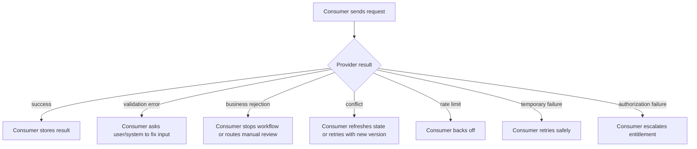
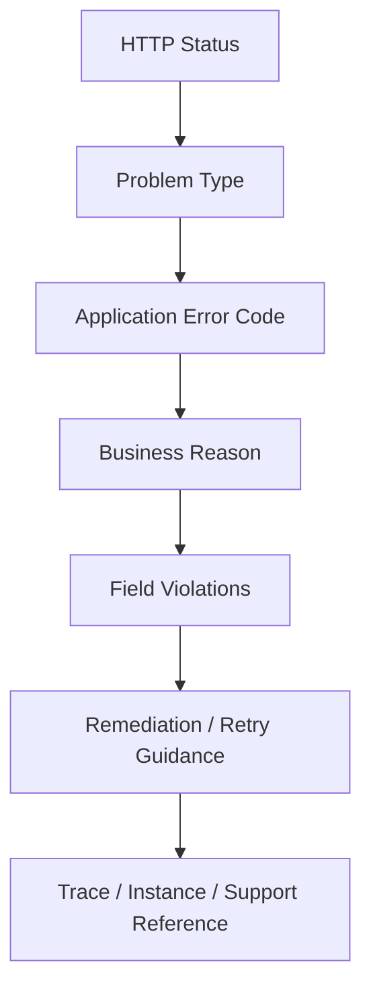
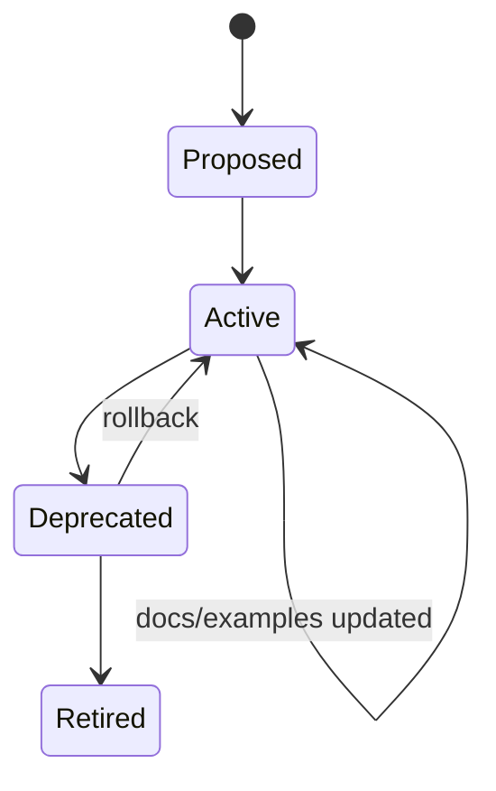

# Part 008 — Error Contract Engineering: Stable Failure Models for Distributed Consumers

## Tujuan Pembelajaran

Error response bukan sekadar pesan ketika sesuatu gagal. Dalam sistem enterprise, error adalah **control signal** untuk consumer, operator, support, auditor, dan sometimes regulator. Error contract yang buruk membuat consumer salah retry, salah menampilkan pesan, salah mengambil keputusan, atau gagal membedakan bug dari business rejection.

Setelah part ini, kamu harus mampu:

1. mendesain error model yang stabil dan machine-readable;
2. membedakan HTTP status, problem type, error code, business reason, dan validation detail;
3. menentukan error mana yang retryable, non-retryable, recoverable, transient, atau final;
4. membuat error response yang tidak membocorkan implementation detail;
5. mendesain validation error yang bisa dipakai UI dan system integrator;
6. menjaga backward compatibility error contract;
7. mengimplementasikan error handling Java/Spring tanpa menyebarkan try-catch acak;
8. menilai apakah suatu error model siap untuk distributed consumers.

---

## 1. Why Error Is a Contract

Banyak API review terlalu fokus pada happy path. Ini keliru.

Dalam distributed system, failure path sering lebih sering digunakan oleh consumer logic daripada yang dibayangkan:



Setiap cabang di atas membutuhkan contract yang jelas.

Error response menjawab pertanyaan consumer:

1. Apakah request salah bentuk?
2. Apakah input valid secara syntax tapi ditolak business rule?
3. Apakah consumer boleh retry?
4. Kalau retry, kapan?
5. Apakah user perlu memperbaiki input?
6. Field mana yang salah?
7. Apakah resource state berubah?
8. Apakah operation mungkin sudah diproses sebagian?
9. Apakah error ini expected business outcome atau incident?
10. Apakah error aman ditampilkan ke manusia?
11. Apakah error harus dilog sebagai warning atau error?
12. Apakah support bisa mencari kejadian ini?

Jika error response tidak menjawab hal-hal ini, consumer akan menebak.

---

## 2. The Bad Error Model

Contoh buruk 1:

```json
{
  "message": "Something went wrong"
}
```

Masalah:

- tidak machine-readable;
- tidak ada error code;
- tidak ada correlation;
- tidak ada retryability;
- tidak ada field-level detail;
- tidak bisa dipakai untuk routing;
- tidak membantu support.

Contoh buruk 2:

```json
{
  "error": "NullPointerException at CustomerService.java:312"
}
```

Masalah:

- membocorkan implementation detail;
- tidak aman secara security;
- unstable;
- tidak actionable;
- menandakan internal exception keluar ke boundary.

Contoh buruk 3:

```json
{
  "status": 400,
  "code": "ERR_123"
}
```

Masalah:

- code tidak bermakna;
- tidak ada taxonomy;
- tidak jelas apakah retryable;
- tidak ada docs;
- tidak ada relation ke business reason.

Contoh buruk 4:

```json
{
  "success": false,
  "data": null,
  "error": "Invalid customer"
}
```

Masalah:

- HTTP status sering tetap 200;
- client harus parse body untuk failure;
- cache/gateway/observability salah memahami outcome;
- generated client sulit.

---

## 3. Mental Model: Error Has Layers

Error contract harus dipisah menjadi beberapa layer.



### 3.1 HTTP Status

HTTP status memberi kategori hasil request pada level protocol/application interface.

Contoh:

- `400 Bad Request`: request malformed atau structurally invalid;
- `401 Unauthorized`: authentication required/invalid;
- `403 Forbidden`: authenticated but not allowed;
- `404 Not Found`: target resource not found atau tidak boleh diketahui;
- `409 Conflict`: conflict dengan current resource state;
- `412 Precondition Failed`: conditional request gagal;
- `422 Unprocessable Content`: syntactically valid tetapi semantically invalid;
- `429 Too Many Requests`: rate limited;
- `500 Internal Server Error`: unexpected provider failure;
- `503 Service Unavailable`: temporary unavailable.

Status code penting, tapi tidak cukup.

### 3.2 Problem Type

Problem type adalah stable identifier untuk kelas masalah.

Contoh:

```text
https://api.acme.com/problems/customer-not-eligible
```

atau internal URI-style:

```text
urn:problem:acme:customer:not-eligible
```

Problem type harus stabil dan documented.

### 3.3 Application Error Code

Error code adalah identifier pendek untuk programmatic branching, logging, support, dan analytics.

Contoh:

```text
CUSTOMER_NOT_ELIGIBLE
KYC_REQUIRED
ACCOUNT_STATE_CONFLICT
IDEMPOTENCY_KEY_REUSED_WITH_DIFFERENT_PAYLOAD
```

Jangan pakai `ERR_001` kecuali ada registry yang benar-benar menjaga mapping dan docs.

### 3.4 Business Reason

Business reason memberi alasan domain.

Contoh:

```json
{
  "reasonCode": "KYC_NOT_VERIFIED"
}
```

Reason code bisa berbeda dari error code. Error code menjelaskan problem class. Reason code menjelaskan penyebab domain spesifik.

### 3.5 Field Violations

Untuk validation error, consumer butuh field mana yang salah dan mengapa.

### 3.6 Retry Guidance

Consumer butuh tahu apakah retry aman.

### 3.7 Instance / Trace / Support Reference

Support butuh menghubungkan error ke log/trace.

---

## 4. RFC 9457 Problem Details Mental Model

Problem Details menyediakan format standar untuk membawa detail error machine-readable dalam HTTP response. Field utamanya:

| Field | Meaning |
|---|---|
| `type` | URI yang mengidentifikasi problem type |
| `title` | summary pendek dari problem type |
| `status` | HTTP status code |
| `detail` | detail spesifik occurrence |
| `instance` | URI/reference untuk occurrence tertentu |

Contoh:

```json
{
  "type": "https://api.acme.com/problems/customer-not-eligible",
  "title": "Customer is not eligible",
  "status": 422,
  "detail": "The customer cannot open a premium account because KYC is not verified.",
  "instance": "/problem-instances/prb_01J2VC9BRPS2HHP45VYSSN6PMP"
}
```

Problem Details juga dapat diperluas dengan extension members.

Contoh enterprise error:

```json
{
  "type": "https://api.acme.com/problems/customer-not-eligible",
  "title": "Customer is not eligible",
  "status": 422,
  "detail": "The customer cannot open a premium account because KYC is not verified.",
  "instance": "/problem-instances/prb_01J2VC9BRPS2HHP45VYSSN6PMP",
  "code": "CUSTOMER_NOT_ELIGIBLE",
  "reasonCode": "KYC_NOT_VERIFIED",
  "retryable": false,
  "correlationId": "corr_01J2VC8ZMP6F3HF7N6YWSX1CBA",
  "timestamp": "2026-06-29T02:30:00Z"
}
```

Important principle:

> Problem Details gives the base envelope. Your organization still needs an error taxonomy and governance model.

---

## 5. Error Contract Canonical Shape

Untuk enterprise Java API, canonical shape yang practical:

```json
{
  "type": "https://api.acme.com/problems/validation-failed",
  "title": "Validation failed",
  "status": 400,
  "detail": "The request contains invalid fields.",
  "instance": "/problem-instances/prb_01J2VC9BRPS2HHP45VYSSN6PMP",
  "code": "VALIDATION_FAILED",
  "retryable": false,
  "correlationId": "corr_01J2VC8ZMP6F3HF7N6YWSX1CBA",
  "violations": [
    {
      "field": "/birthDate",
      "code": "DATE_IN_FUTURE",
      "message": "birthDate must not be in the future.",
      "rejectedValue": "2030-01-01"
    }
  ]
}
```

### 5.1 Field Definitions

| Field | Required? | Stability | Notes |
|---|---:|---|---|
| `type` | yes | stable | problem class identifier |
| `title` | yes | stable-ish | do not branch on this |
| `status` | yes | stable | mirrors HTTP status |
| `detail` | no | occurrence-specific | human diagnostic |
| `instance` | no | stable format | support/audit reference |
| `code` | yes | stable | machine branching |
| `retryable` | yes | stable | consumer automation |
| `correlationId` | yes | stable | trace/support |
| `violations` | conditional | stable shape | validation details |
| `reasonCode` | conditional | stable taxonomy | business reason |
| `documentationUrl` | optional | stable-ish | human docs |

### 5.2 Do Not Branch on Message

Consumer must not branch on:

- `title`;
- `detail`;
- localized message;
- English text;
- order of violations;
- stack trace;
- support note.

Consumer may branch on:

- HTTP status class;
- `type`;
- `code`;
- `reasonCode`;
- `retryable`;
- field violation `code`;
- documented extension members.

---

## 6. Error Taxonomy

Tanpa taxonomy, error code menjadi sampah historis.

### 6.1 Top-Level Categories

| Category | HTTP status candidates | Example code |
|---|---|---|
| Syntax error | 400 | MALFORMED_JSON |
| Structural validation | 400 | VALIDATION_FAILED |
| Semantic validation | 400/422 | INVALID_DATE_RANGE |
| Authentication | 401 | AUTHENTICATION_REQUIRED |
| Authorization | 403 | ACCESS_DENIED |
| Not found | 404 | CUSTOMER_NOT_FOUND |
| State conflict | 409 | CASE_STATE_CONFLICT |
| Precondition failure | 412 | VERSION_MISMATCH |
| Business rejection | 422 | CUSTOMER_NOT_ELIGIBLE |
| Rate limit | 429 | RATE_LIMIT_EXCEEDED |
| Dependency unavailable | 503 | DEPENDENCY_UNAVAILABLE |
| Internal unexpected | 500 | INTERNAL_ERROR |

### 6.2 Error Code Naming

Good:

```text
VALIDATION_FAILED
CUSTOMER_NOT_FOUND
CUSTOMER_NOT_ELIGIBLE
CASE_STATE_CONFLICT
ACCOUNT_LIMIT_EXCEEDED
IDEMPOTENCY_KEY_REUSED_WITH_DIFFERENT_PAYLOAD
```

Bad:

```text
ERR_001
BAD_REQUEST
FAILED
UNKNOWN
INVALID
CUSTOMER_ERROR
```

Rules:

1. code must be stable;
2. code must be documented;
3. code should identify problem class;
4. code should avoid leaking Java exception;
5. code should avoid implementation component names;
6. code should be globally unique within API domain or namespaced;
7. code should have owner.

### 6.3 Reason Code

Reason code is finer-grained.

```json
{
  "code": "CUSTOMER_NOT_ELIGIBLE",
  "reasonCode": "KYC_NOT_VERIFIED"
}
```

Other possible reason codes:

```text
AGE_BELOW_MINIMUM
JURISDICTION_NOT_SUPPORTED
ACCOUNT_ALREADY_EXISTS
RISK_SCORE_TOO_HIGH
MANDATORY_DOCUMENT_MISSING
```

Difference:

| Field | Role |
|---|---|
| `code` | stable problem class |
| `reasonCode` | business explanation |
| `detail` | occurrence-specific text |

---

## 7. HTTP Status Mapping

HTTP status tidak boleh dipilih asal.

### 7.1 400 Bad Request

Gunakan untuk malformed or structurally invalid request.

Examples:

- invalid JSON;
- invalid content type;
- missing required field;
- field type mismatch;
- unknown property rejected;
- malformed date.

Example:

```json
{
  "type": "https://api.acme.com/problems/validation-failed",
  "title": "Validation failed",
  "status": 400,
  "code": "VALIDATION_FAILED",
  "retryable": false,
  "violations": [
    {
      "field": "/emailAddress",
      "code": "INVALID_EMAIL_FORMAT",
      "message": "emailAddress must be a valid email address."
    }
  ],
  "correlationId": "corr_01J2VC8ZMP6F3HF7N6YWSX1CBA"
}
```

### 7.2 401 Unauthorized

Authentication problem.

Do not use 401 for “authenticated but forbidden”.

```json
{
  "type": "https://api.acme.com/problems/authentication-required",
  "title": "Authentication required",
  "status": 401,
  "code": "AUTHENTICATION_REQUIRED",
  "retryable": false,
  "correlationId": "corr_01J2VDKJEQSB4K8BD6PDJMY1Y7"
}
```

### 7.3 403 Forbidden

Consumer is authenticated but not allowed.

```json
{
  "type": "https://api.acme.com/problems/access-denied",
  "title": "Access denied",
  "status": 403,
  "code": "ACCESS_DENIED",
  "retryable": false,
  "correlationId": "corr_01J2VDM7N8ZSQ1S8QKZ4F8N2AS"
}
```

Avoid leaking whether hidden resource exists if the caller is not entitled.

### 7.4 404 Not Found

Use when resource is not found or intentionally hidden.

```json
{
  "type": "https://api.acme.com/problems/customer-not-found",
  "title": "Customer not found",
  "status": 404,
  "code": "CUSTOMER_NOT_FOUND",
  "retryable": false,
  "correlationId": "corr_01J2VDN5EDT5HWZRQ49J9WVYVE"
}
```

### 7.5 409 Conflict

Use when request conflicts with current state.

```json
{
  "type": "https://api.acme.com/problems/case-state-conflict",
  "title": "Case state conflict",
  "status": 409,
  "code": "CASE_STATE_CONFLICT",
  "reasonCode": "CASE_NOT_SUBMITTED",
  "retryable": false,
  "detail": "The case cannot be approved while it is still in DRAFT state.",
  "correlationId": "corr_01J2VDP0M0JX36NS90BHTA4CTY"
}
```

### 7.6 412 Precondition Failed

Use for conditional request failure, such as `If-Match` mismatch.

```json
{
  "type": "https://api.acme.com/problems/version-mismatch",
  "title": "Version mismatch",
  "status": 412,
  "code": "VERSION_MISMATCH",
  "retryable": false,
  "detail": "The resource version does not match the If-Match precondition.",
  "correlationId": "corr_01J2VDQ5PHFY1WY8ZTGFXREZ8P"
}
```

### 7.7 422 Unprocessable Content

Use when request is syntactically valid but semantically rejected.

```json
{
  "type": "https://api.acme.com/problems/customer-not-eligible",
  "title": "Customer is not eligible",
  "status": 422,
  "code": "CUSTOMER_NOT_ELIGIBLE",
  "reasonCode": "KYC_NOT_VERIFIED",
  "retryable": false,
  "detail": "The customer must complete KYC verification before opening this account type.",
  "correlationId": "corr_01J2VDR3QTFWHCVJRF35TGQ8DB"
}
```

### 7.8 429 Too Many Requests

Use for rate limiting.

```json
{
  "type": "https://api.acme.com/problems/rate-limit-exceeded",
  "title": "Rate limit exceeded",
  "status": 429,
  "code": "RATE_LIMIT_EXCEEDED",
  "retryable": true,
  "retryAfter": "PT60S",
  "correlationId": "corr_01J2VDS43NV3F8VF1WK8G88E1N"
}
```

Also set the appropriate HTTP header when applicable:

```http
Retry-After: 60
```

### 7.9 500 Internal Server Error

Use for unexpected provider failure.

But response should not leak details.

```json
{
  "type": "https://api.acme.com/problems/internal-error",
  "title": "Internal server error",
  "status": 500,
  "code": "INTERNAL_ERROR",
  "retryable": true,
  "correlationId": "corr_01J2VDT42QQFJD616HFWX35R07"
}
```

### 7.10 503 Service Unavailable

Use for temporary unavailability.

```json
{
  "type": "https://api.acme.com/problems/service-unavailable",
  "title": "Service unavailable",
  "status": 503,
  "code": "SERVICE_UNAVAILABLE",
  "retryable": true,
  "retryAfter": "PT30S",
  "correlationId": "corr_01J2VDV0VTN0AKJ0VJ7Q1A1A5B"
}
```

---

## 8. Retryability Contract

Retryability is not the same as HTTP status.

| Error | Retryable? | Notes |
|---|---:|---|
| malformed JSON | no | same request will fail |
| missing required field | no | fix request |
| unauthorized | conditional | refresh token maybe |
| forbidden | no | entitlement change required |
| not found | usually no | maybe eventual consistency exception |
| conflict | conditional | refresh state, retry with new version |
| rate limited | yes after delay | use Retry-After/backoff |
| dependency timeout | yes if idempotent | use idempotency key |
| internal error | maybe | only safe if operation idempotent |
| service unavailable | yes | backoff |

### 8.1 Retryable Field

Include explicit boolean:

```json
{
  "code": "DEPENDENCY_UNAVAILABLE",
  "retryable": true
}
```

But boolean alone is not enough. Add guidance:

```json
{
  "retryable": true,
  "retryAfter": "PT30S",
  "retryStrategy": "EXPONENTIAL_BACKOFF"
}
```

Do not overfit. A stable `retryable` boolean plus HTTP `Retry-After` is often sufficient.

### 8.2 Idempotency and Retry

For mutating operations, retryability depends on idempotency.

Example:

```http
POST /payments
Idempotency-Key: idem_01J2VE51VFPFSYQC684ND6W38Z
```

If provider returns 500 but operation might have succeeded, consumer must retry with same idempotency key.

Error contract should avoid saying “retryable true” for non-idempotent mutation unless idempotency mechanism exists.

---

## 9. Validation Error Design

Validation errors must be useful for both UI and machine integration.

### 9.1 Field Pointer

Use JSON Pointer-like field references.

```json
{
  "field": "/beneficiaries/0/emailAddress",
  "code": "INVALID_EMAIL_FORMAT",
  "message": "emailAddress must be a valid email address."
}
```

This is better than:

```json
{
  "field": "beneficiaries[0].emailAddress"
}
```

because JSON Pointer style maps naturally to JSON document structure.

### 9.2 Violation Shape

Recommended shape:

```json
{
  "field": "/birthDate",
  "code": "DATE_IN_FUTURE",
  "message": "birthDate must not be in the future.",
  "rejectedValue": "2030-01-01",
  "allowedValues": null
}
```

But be careful with `rejectedValue`.

Do not echo sensitive values:

- password;
- token;
- secret;
- national ID;
- card number;
- biometric data;
- private document content.

For sensitive fields:

```json
{
  "field": "/password",
  "code": "PASSWORD_TOO_WEAK",
  "message": "password does not satisfy the password policy."
}
```

### 9.3 Multiple Violations

Return all reasonable violations, not just first, if validation cost is acceptable.

```json
{
  "type": "https://api.acme.com/problems/validation-failed",
  "title": "Validation failed",
  "status": 400,
  "code": "VALIDATION_FAILED",
  "retryable": false,
  "violations": [
    {
      "field": "/fullName",
      "code": "REQUIRED",
      "message": "fullName is required."
    },
    {
      "field": "/birthDate",
      "code": "DATE_IN_FUTURE",
      "message": "birthDate must not be in the future."
    }
  ],
  "correlationId": "corr_01J2VEA9H9G4Y5ZV5V6D4XGKPM"
}
```

### 9.4 Cross-Field Validation

For cross-field errors, use a pointer to the object or include multiple fields.

```json
{
  "field": "/validityPeriod",
  "code": "INVALID_DATE_RANGE",
  "message": "effectiveFrom must be before effectiveTo.",
  "relatedFields": [
    "/validityPeriod/effectiveFrom",
    "/validityPeriod/effectiveTo"
  ]
}
```

---

## 10. Business Rule Error Design

Business rule errors are not the same as validation errors.

Validation error:

```text
birthDate is missing
```

Business rule error:

```text
customer is too young for this account product
```

Both may involve `birthDate`, but they are not the same category.

Example:

```json
{
  "type": "https://api.acme.com/problems/customer-not-eligible",
  "title": "Customer is not eligible",
  "status": 422,
  "code": "CUSTOMER_NOT_ELIGIBLE",
  "reasonCode": "AGE_BELOW_PRODUCT_MINIMUM",
  "retryable": false,
  "detail": "The customer does not satisfy the minimum age requirement for the requested product.",
  "correlationId": "corr_01J2VEE1PMMXE6BS93VKEMF4W4"
}
```

Do not represent this as:

```json
{
  "field": "/birthDate",
  "code": "INVALID"
}
```

because the birth date may be valid. The business decision rejects the request.

---

## 11. State Transition Error Design

For stateful systems, many errors are state transition failures.

Example:

```text
Case current state = DRAFT
Requested action = APPROVE
Allowed action = SUBMIT
```

Response:

```json
{
  "type": "https://api.acme.com/problems/case-state-conflict",
  "title": "Case state conflict",
  "status": 409,
  "code": "CASE_STATE_CONFLICT",
  "reasonCode": "ACTION_NOT_ALLOWED_IN_CURRENT_STATE",
  "retryable": false,
  "detail": "The case cannot be approved while it is in DRAFT state.",
  "currentState": "DRAFT",
  "requestedAction": "APPROVE",
  "allowedActions": [
    "SUBMIT",
    "CANCEL"
  ],
  "correlationId": "corr_01J2VEHB20YK75VCN4J1PKVX7Y"
}
```

This is useful because consumer can:

1. refresh UI state;
2. disable unavailable action;
3. route to correct workflow;
4. log domain conflict;
5. avoid blind retry.

But be careful: `allowedActions` itself becomes contract. Only include it if you can support it consistently.

---

## 12. Authorization Error Design

Authorization errors must balance usability and information disclosure.

### 12.1 Avoid Leaking Hidden Resources

If caller has no access to a customer, should you return 403 or 404?

Depends on product/security policy.

| Situation | Possible response |
|---|---|
| Resource existence is not sensitive | 403 |
| Resource existence must be hidden | 404 |
| Caller authenticated but lacks scope | 403 |
| Token invalid/missing | 401 |

### 12.2 Do Not Reveal Policy Internals

Bad:

```json
{
  "detail": "User john@example.com failed rule RISK_ADMIN_POLICY_V2 line 87"
}
```

Better:

```json
{
  "type": "https://api.acme.com/problems/access-denied",
  "title": "Access denied",
  "status": 403,
  "code": "ACCESS_DENIED",
  "reasonCode": "INSUFFICIENT_ENTITLEMENT",
  "retryable": false,
  "correlationId": "corr_01J2VEN6K3QNKP2TEVV6SJDTAQ"
}
```

Support can inspect correlation ID internally.

---

## 13. Idempotency Error Design

Idempotency creates special error cases.

### 13.1 Same Key, Same Payload

Request:

```http
POST /payments
Idempotency-Key: idem_01J2VEQ6HYA5ZP9W7N2W8Z4TXA
```

If retry uses same key and same payload, provider should return previous result if possible.

### 13.2 Same Key, Different Payload

This should be rejected.

```json
{
  "type": "https://api.acme.com/problems/idempotency-key-conflict",
  "title": "Idempotency key conflict",
  "status": 409,
  "code": "IDEMPOTENCY_KEY_REUSED_WITH_DIFFERENT_PAYLOAD",
  "retryable": false,
  "detail": "The idempotency key was already used with a different request payload.",
  "correlationId": "corr_01J2VET0HYQ2C9DD5JED5PK1MW"
}
```

Why 409? Because request conflicts with prior state of idempotency key.

### 13.3 Missing Key for Required Idempotency

```json
{
  "type": "https://api.acme.com/problems/idempotency-key-required",
  "title": "Idempotency key required",
  "status": 400,
  "code": "IDEMPOTENCY_KEY_REQUIRED",
  "retryable": false,
  "detail": "This operation requires an Idempotency-Key header.",
  "correlationId": "corr_01J2VEWVDHESAZD65CQMAQ8D9J"
}
```

---

## 14. Error Compatibility

Error contract changes can break consumers.

### 14.1 Safe Changes

| Change | Condition |
|---|---|
| Add optional extension field | Consumers ignore unknown fields |
| Add new error code for new operation | Documented fallback exists |
| Add violation detail | Shape remains compatible |
| Add documentation URL | Optional |
| Add more specific reasonCode | Existing code still stable |

### 14.2 Dangerous Changes

| Change | Why dangerous |
|---|---|
| Change HTTP status for existing error | Consumer branching breaks |
| Rename `code` | Consumer branching breaks |
| Remove `code` | Consumer cannot handle |
| Change `retryable` from false to true | Could trigger unsafe retry |
| Change `retryable` from true to false | Could stop recovery |
| Change field pointer format | UI mapping breaks |
| Change violation shape | Client validation handling breaks |
| Replace `400` validation with `200` body error | Protocol behavior breaks |
| Remove problem type URI | Docs and client mapping break |
| Change semantics of code | Silent business break |

### 14.3 Error Code Lifecycle



Rules:

1. never reuse retired code for different meaning;
2. document owner;
3. document HTTP status;
4. document retryability;
5. document remediation;
6. track usage if possible;
7. remove only after consumer migration.

---

## 15. OpenAPI Error Components

Define reusable error schemas.

```yaml
components:
  schemas:
    Problem:
      type: object
      required:
        - type
        - title
        - status
        - code
        - retryable
        - correlationId
      properties:
        type:
          type: string
          format: uri
        title:
          type: string
        status:
          type: integer
          minimum: 400
          maximum: 599
        detail:
          type: string
        instance:
          type: string
        code:
          type: string
        reasonCode:
          type: string
        retryable:
          type: boolean
        correlationId:
          type: string
        timestamp:
          type: string
          format: date-time
        violations:
          type: array
          items:
            $ref: '#/components/schemas/Violation'

    Violation:
      type: object
      required:
        - field
        - code
        - message
      properties:
        field:
          type: string
          description: JSON Pointer to the invalid field.
        code:
          type: string
        message:
          type: string
        rejectedValue:
          description: May be omitted for sensitive fields.
        relatedFields:
          type: array
          items:
            type: string
```

Reusable responses:

```yaml
components:
  responses:
    BadRequest:
      description: Request is malformed or structurally invalid.
      content:
        application/problem+json:
          schema:
            $ref: '#/components/schemas/Problem'
    Conflict:
      description: Request conflicts with current resource state.
      content:
        application/problem+json:
          schema:
            $ref: '#/components/schemas/Problem'
    UnprocessableContent:
      description: Request is syntactically valid but semantically rejected.
      content:
        application/problem+json:
          schema:
            $ref: '#/components/schemas/Problem'
```

Operation usage:

```yaml
paths:
  /customers/{customerId}/accounts:
    post:
      operationId: openCustomerAccount
      responses:
        '201':
          description: Account created.
        '400':
          $ref: '#/components/responses/BadRequest'
        '409':
          $ref: '#/components/responses/Conflict'
        '422':
          $ref: '#/components/responses/UnprocessableContent'
```

---

## 16. Java Implementation Pattern

### 16.1 Problem DTO

```java
public record ApiProblem(
    URI type,
    String title,
    int status,
    String detail,
    String instance,
    String code,
    String reasonCode,
    boolean retryable,
    String correlationId,
    OffsetDateTime timestamp,
    List<Violation> violations
) {
    public static ApiProblem of(
        URI type,
        String title,
        HttpStatus status,
        String code,
        boolean retryable,
        String correlationId
    ) {
        return new ApiProblem(
            type,
            title,
            status.value(),
            null,
            null,
            code,
            null,
            retryable,
            correlationId,
            OffsetDateTime.now(ZoneOffset.UTC),
            List.of()
        );
    }
}
```

Violation:

```java
public record Violation(
    String field,
    String code,
    String message,
    Object rejectedValue,
    List<String> relatedFields
) {}
```

For sensitive values, set `rejectedValue` to `null`.

### 16.2 Domain Exception

Avoid throwing generic runtime exceptions at boundary.

```java
public abstract class DomainException extends RuntimeException {
    private final String code;
    private final String reasonCode;
    private final boolean retryable;

    protected DomainException(
        String message,
        String code,
        String reasonCode,
        boolean retryable
    ) {
        super(message);
        this.code = code;
        this.reasonCode = reasonCode;
        this.retryable = retryable;
    }

    public String code() {
        return code;
    }

    public String reasonCode() {
        return reasonCode;
    }

    public boolean retryable() {
        return retryable;
    }
}
```

Specific exception:

```java
public final class CustomerNotEligibleException extends DomainException {
    public CustomerNotEligibleException(String reasonCode) {
        super(
            "Customer is not eligible.",
            "CUSTOMER_NOT_ELIGIBLE",
            reasonCode,
            false
        );
    }
}
```

### 16.3 Controller Advice

```java
@RestControllerAdvice
public class ApiExceptionHandler {
    private final CorrelationIdProvider correlationIdProvider;

    public ApiExceptionHandler(CorrelationIdProvider correlationIdProvider) {
        this.correlationIdProvider = correlationIdProvider;
    }

    @ExceptionHandler(CustomerNotEligibleException.class)
    public ResponseEntity<ApiProblem> handleCustomerNotEligible(
        CustomerNotEligibleException ex
    ) {
        ApiProblem problem = new ApiProblem(
            URI.create("https://api.acme.com/problems/customer-not-eligible"),
            "Customer is not eligible",
            422,
            ex.getMessage(),
            null,
            ex.code(),
            ex.reasonCode(),
            ex.retryable(),
            correlationIdProvider.current(),
            OffsetDateTime.now(ZoneOffset.UTC),
            List.of()
        );

        return ResponseEntity
            .status(422)
            .contentType(MediaType.valueOf("application/problem+json"))
            .body(problem);
    }
}
```

### 16.4 Validation Exception Mapping

```java
@ExceptionHandler(MethodArgumentNotValidException.class)
public ResponseEntity<ApiProblem> handleValidation(MethodArgumentNotValidException ex) {
    List<Violation> violations = ex.getBindingResult()
        .getFieldErrors()
        .stream()
        .map(error -> new Violation(
            "/" + error.getField().replace(".", "/"),
            validationCode(error),
            error.getDefaultMessage(),
            safeRejectedValue(error.getRejectedValue()),
            List.of()
        ))
        .toList();

    ApiProblem problem = new ApiProblem(
        URI.create("https://api.acme.com/problems/validation-failed"),
        "Validation failed",
        400,
        "The request contains invalid fields.",
        null,
        "VALIDATION_FAILED",
        null,
        false,
        correlationIdProvider.current(),
        OffsetDateTime.now(ZoneOffset.UTC),
        violations
    );

    return ResponseEntity
        .badRequest()
        .contentType(MediaType.valueOf("application/problem+json"))
        .body(problem);
}
```

Be careful: converting Spring field names to JSON Pointer is not always trivial, especially with custom Jackson property names. For production, build a robust mapping strategy.

---

## 17. Error Registry

A mature organization should maintain an error registry.

Example registry entry:

```yaml
code: CUSTOMER_NOT_ELIGIBLE
type: https://api.acme.com/problems/customer-not-eligible
title: Customer is not eligible
defaultStatus: 422
retryable: false
owner: customer-platform
category: BUSINESS_REJECTION
reasonCodes:
  - KYC_NOT_VERIFIED
  - AGE_BELOW_PRODUCT_MINIMUM
  - JURISDICTION_NOT_SUPPORTED
consumerAction: Stop workflow or route to remediation.
supportAction: Check customer eligibility evaluation details using correlationId.
introducedIn: 2026-06-29
deprecated: false
```

Benefits:

1. prevents duplicate codes;
2. keeps docs consistent;
3. supports governance review;
4. helps support and operations;
5. makes analytics possible;
6. helps client SDK generation.

---

## 18. Error Observability

Every problem response should correlate with telemetry.

Minimum fields:

- HTTP status;
- problem type;
- code;
- reasonCode;
- correlationId;
- endpoint;
- consumer/client ID;
- tenant/jurisdiction when applicable;
- retryable;
- latency;
- trace ID.

Metrics:

```text
api_error_total{operation="openCustomerAccount", code="CUSTOMER_NOT_ELIGIBLE", status="422"}
api_error_total{operation="openCustomerAccount", code="VALIDATION_FAILED", status="400"}
api_error_total{operation="openCustomerAccount", code="INTERNAL_ERROR", status="500"}
```

But do not create unbounded cardinality labels from:

- detail message;
- customer ID;
- instance ID;
- raw field value;
- stack trace.

---

## 19. Security and Privacy in Error Contract

Error messages can leak data.

### 19.1 Do Not Leak Secrets

Bad:

```json
{
  "detail": "Invalid token eyJhbGciOiJIUzI1NiIs..."
}
```

Better:

```json
{
  "code": "INVALID_TOKEN",
  "detail": "The access token is invalid."
}
```

### 19.2 Do Not Reveal Enumeration

Bad:

```json
{
  "detail": "Customer with nationalId 3173010101010001 exists but belongs to another tenant."
}
```

Better:

```json
{
  "code": "CUSTOMER_NOT_FOUND"
}
```

or:

```json
{
  "code": "ACCESS_DENIED"
}
```

depending on policy.

### 19.3 Do Not Echo Sensitive Rejected Values

Bad:

```json
{
  "field": "/password",
  "rejectedValue": "MyWeakPassword123"
}
```

Better:

```json
{
  "field": "/password",
  "code": "PASSWORD_TOO_WEAK"
}
```

### 19.4 Avoid Internal Topology

Bad:

```json
{
  "detail": "Oracle DB CUSTOMER_MASTER timed out on shard-id-7."
}
```

Better:

```json
{
  "code": "DEPENDENCY_UNAVAILABLE",
  "retryable": true
}
```

---

## 20. Localized Error Messages

Do not make localized message the machine contract.

Recommended:

```json
{
  "code": "CUSTOMER_NOT_ELIGIBLE",
  "reasonCode": "KYC_NOT_VERIFIED",
  "messageKey": "customer.notEligible.kycNotVerified",
  "localizedMessage": "Customer must complete KYC verification.",
  "locale": "en-US"
}
```

Rules:

1. branch on code, not message;
2. translation can change without breaking contract;
3. messageKey may be stable if externalized deliberately;
4. avoid exposing internal translation keys unless committed;
5. for public APIs, consumer often prefers doing localization itself.

---

## 21. Error Contract Anti-Patterns

### 21.1 Always 200

Bad:

```http
HTTP/1.1 200 OK
```

```json
{
  "success": false,
  "error": "Customer not eligible"
}
```

Breaks:

- caches;
- monitoring;
- generated clients;
- retry logic;
- gateway policy;
- status-based alerting.

### 21.2 Exception Class as Code

Bad:

```json
{
  "code": "CustomerNotEligibleException"
}
```

Java class names are implementation detail.

### 21.3 One Giant Error Code

Bad:

```json
{
  "code": "BAD_REQUEST"
}
```

Too generic.

### 21.4 Over-Specific Error Code

Bad:

```json
{
  "code": "CUSTOMER_AGE_17_YEARS_11_MONTHS_29_DAYS_WHEN_OPENING_PREMIUM_ACCOUNT_IN_ID_REGION"
}
```

Too specific. Use reasonCode and detail.

### 21.5 Unstable Detail Text

Bad consumer logic:

```java
if (problem.detail().contains("KYC")) {
    routeToKyc();
}
```

This will break.

### 21.6 Stack Trace in Response

Never expose stack trace in public API.

### 21.7 Validation as Business Error

Bad:

```json
{
  "field": "/birthDate",
  "code": "INVALID"
}
```

for an eligibility rule. That is business rejection, not invalid date.

---

## 22. Error Contract Testing

### 22.1 Test Structural Error Shape

```java
@Test
void shouldReturnValidationProblemForMissingFullName() {
    given()
        .contentType("application/json")
        .body("""
            {
              "birthDate": "1994-05-18"
            }
            """)
    .when()
        .post("/customers")
    .then()
        .statusCode(400)
        .contentType("application/problem+json")
        .body("code", equalTo("VALIDATION_FAILED"))
        .body("retryable", equalTo(false))
        .body("violations.field", hasItem("/fullName"));
}
```

### 22.2 Test Business Error

```java
@Test
void shouldReturnCustomerNotEligibleWhenKycIsNotVerified() {
    givenCustomerWithKycStatus("PENDING");

    given()
        .contentType("application/json")
        .body(validOpenAccountRequest())
    .when()
        .post("/customers/{customerId}/accounts", customerId)
    .then()
        .statusCode(422)
        .contentType("application/problem+json")
        .body("code", equalTo("CUSTOMER_NOT_ELIGIBLE"))
        .body("reasonCode", equalTo("KYC_NOT_VERIFIED"))
        .body("retryable", equalTo(false));
}
```

### 22.3 Test No Leakage

```java
@Test
void shouldNotExposeStackTraceOnUnexpectedError() {
    forceUnexpectedFailure();

    given()
        .contentType("application/json")
        .body(validRequest())
    .when()
        .post("/customers")
    .then()
        .statusCode(500)
        .body("code", equalTo("INTERNAL_ERROR"))
        .body("detail", anyOf(nullValue(), not(containsString("Exception"))))
        .body(not(hasKey("stackTrace")));
}
```

### 22.4 Contract Diff Tests

When error schema changes, CI should detect:

1. removed required field;
2. changed type;
3. changed status mapping;
4. removed error code;
5. changed retryability;
6. changed violation shape.

---

## 23. Governance Checklist

Use this in review.

### 23.1 Error Shape

- Does every error use `application/problem+json`?
- Are required fields consistent?
- Is `code` stable and documented?
- Is `retryable` present?
- Is `correlationId` present?
- Is `violations` shape stable?

### 23.2 Status Mapping

- Is HTTP status semantically correct?
- Are business rejections separated from structural validation?
- Are conflicts represented as 409 or conditional failures as 412 where appropriate?
- Are authn/authz errors mapped correctly?
- Are temporary failures distinguished from unexpected internal failures?

### 23.3 Security

- Are stack traces hidden?
- Are internal class names hidden?
- Are secrets not echoed?
- Are sensitive rejected values omitted?
- Does 404/403 policy avoid resource enumeration?

### 23.4 Compatibility

- Is this a new error code?
- Is an existing error code meaning changed?
- Does retryability change?
- Does consumer have fallback?
- Is error docs updated?
- Is error registry updated?

### 23.5 Consumer Actionability

- Can consumer decide retry vs stop?
- Can UI highlight invalid fields?
- Can support trace the occurrence?
- Can workflow engine route the error?
- Can the error be tested?

---

## 24. Practice Lab

### Lab 1 — Redesign Bad Error

Input:

```json
{
  "error": "Cannot approve case"
}
```

Context:

- case current state is `DRAFT`;
- requested action is `APPROVE`;
- allowed actions are `SUBMIT` and `CANCEL`;
- consumer should not retry blindly.

Design a Problem Details response.

Expected direction:

```json
{
  "type": "https://api.acme.com/problems/case-state-conflict",
  "title": "Case state conflict",
  "status": 409,
  "code": "CASE_STATE_CONFLICT",
  "reasonCode": "ACTION_NOT_ALLOWED_IN_CURRENT_STATE",
  "retryable": false,
  "detail": "The case cannot be approved while it is in DRAFT state.",
  "currentState": "DRAFT",
  "requestedAction": "APPROVE",
  "allowedActions": [
    "SUBMIT",
    "CANCEL"
  ],
  "correlationId": "corr_01J2VF3SS6AR85T7TGTZVSG9XE"
}
```

### Lab 2 — Build Validation Error

Input invalid request:

```json
{
  "fullName": "",
  "birthDate": "2030-01-01",
  "emailAddress": "not-an-email"
}
```

Design:

1. HTTP status;
2. problem type;
3. error code;
4. violations;
5. retryable;
6. sensitive value policy.

### Lab 3 — Classify Status

Classify status and code:

1. invalid JSON;
2. missing access token;
3. authenticated user lacks role;
4. customer not found;
5. approving a DRAFT case;
6. `If-Match` version mismatch;
7. KYC not verified;
8. rate limit exceeded;
9. database unavailable;
10. unexpected null pointer.

### Lab 4 — Detect Breaking Error Changes

Classify:

1. `CUSTOMER_NOT_ELIGIBLE` changes status from 422 to 400;
2. `retryable` changes from false to true;
3. add optional `documentationUrl`;
4. remove `correlationId`;
5. change `violations.field` from JSON Pointer to dot notation;
6. add new reasonCode under existing code;
7. rename `VALIDATION_FAILED` to `REQUEST_INVALID`;
8. stop returning `application/problem+json`;
9. add `instance`;
10. remove `detail`.

---

## 25. Senior Engineer Heuristics

1. **Error is not a message; error is a decision interface.**
2. **HTTP status classifies outcome; error code drives program behavior.**
3. **Business rejection is not the same as malformed request.**
4. **Never branch on human-readable text.**
5. **Retryability must be explicit for distributed consumers.**
6. **A 500 response must reveal almost nothing but must be traceable internally.**
7. **Validation errors should point to fields; business errors should point to reasons.**
8. **Changing error status can be as breaking as changing success payload.**
9. **Error code registry prevents entropy.**
10. **Do not expose Java exception classes as public contract.**
11. **Do not echo secrets or sensitive rejected values.**
12. **Unknown errors need documented fallback behavior.**
13. **Consumer actionability is the test of a good error contract.**
14. **Every error path should be observable.**
15. **A stable error model reduces support cost and integration friction.**

---

## 26. Summary

Error contract engineering adalah kemampuan mendesain failure response yang stabil, aman, dan actionable. Dalam distributed system, error bukan edge case; error adalah bagian normal dari komunikasi antar sistem.

Pelajaran utama:

1. Error response harus machine-readable.
2. HTTP status saja tidak cukup.
3. Problem Details memberi base shape, tetapi taxonomy tetap harus didesain.
4. Error code harus stabil, documented, dan tidak berasal dari Java exception class.
5. Validation error dan business rule error harus dibedakan.
6. Retryability harus eksplisit dan dikaitkan dengan idempotency.
7. Security/privacy harus diperhitungkan pada setiap error field.
8. Error compatibility harus diuji seperti success payload compatibility.
9. Error registry membantu governance lintas tim.
10. Error observability membuat contract violation dan consumer breakage bisa dilacak.

Part berikutnya membahas API versioning strategy: bagaimana berevolusi tanpa menjadikan `/v2` sebagai reflex, dan bagaimana compatibility lebih penting daripada angka versi.
