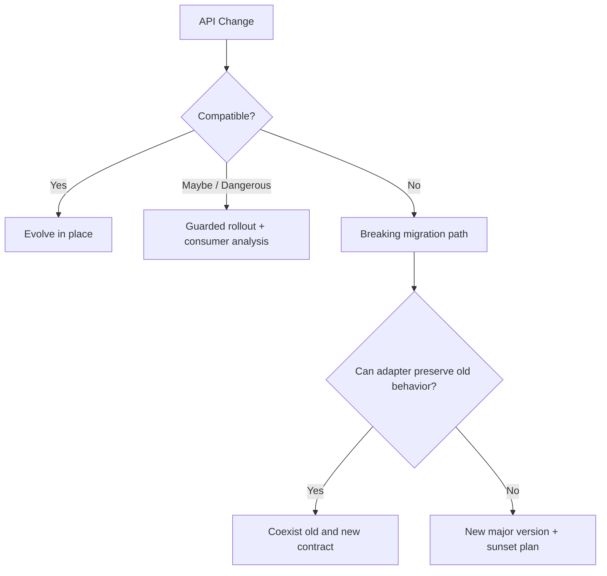
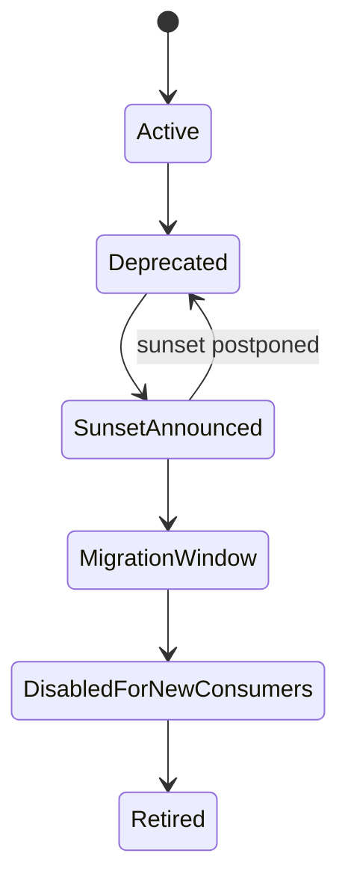
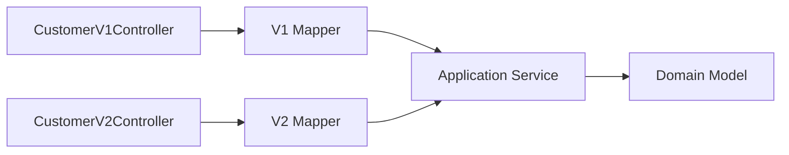
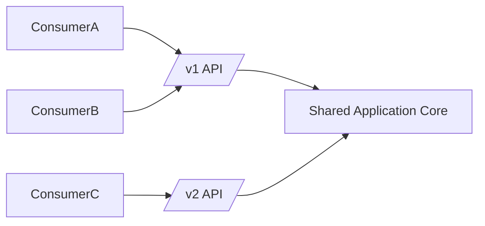
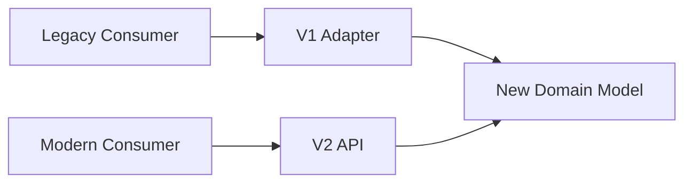
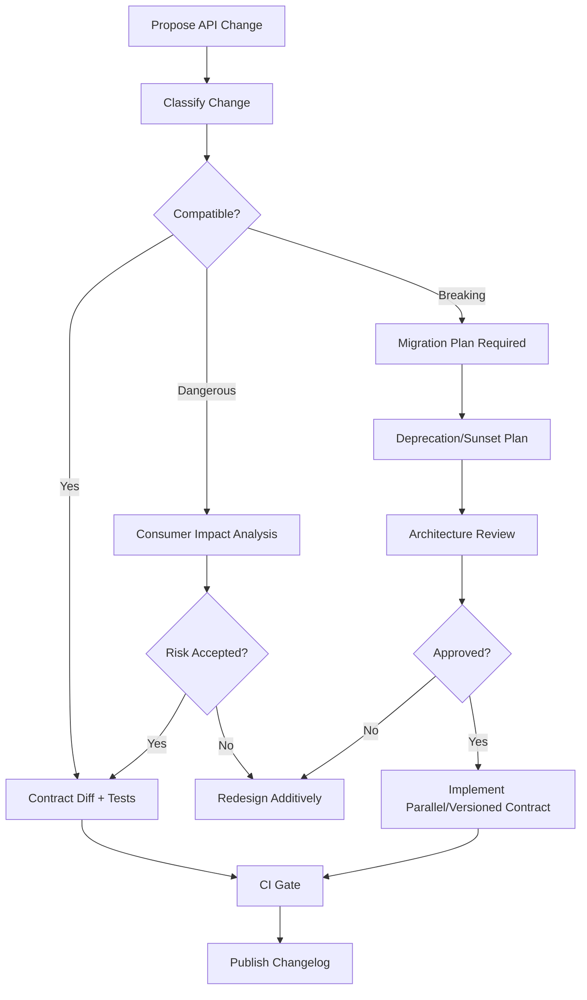

# Part 009 — API Versioning Strategy: Compatibility Before Version Numbers

## Tujuan Pembelajaran

Banyak engineer berpikir API versioning adalah memilih antara `/v1`, header version, atau media type version. Itu terlalu sempit. Dalam contract engineering, versioning adalah **strategi evolusi public promise**.

Versi API bukan tujuan. Tujuan sebenarnya adalah:

> Membuat provider bisa berubah tanpa merusak consumer, dan membuat consumer bisa bermigrasi tanpa dipaksa sinkron dengan release provider.

Setelah part ini, kamu harus mampu:

1. membedakan compatibility strategy dan versioning mechanism;
2. menilai apakah perubahan API benar-benar butuh versi baru;
3. mendesain evolution path tanpa reflex membuat `/v2`;
4. mengelola breaking change dengan deprecation, sunset, migration window, dan consumer inventory;
5. memilih URI/header/media type/capability negotiation dengan alasan yang jelas;
6. menyusun governance rule untuk API lifecycle enterprise;
7. menganalisis blast radius perubahan API sebelum release;
8. membangun API versioning policy yang realistis untuk Java platform besar.

---

## 1. Kaufman Skill Slice

Skill utama:

> “Mampu membuat API berevolusi selama bertahun-tahun tanpa membuat consumer rusak, bingung, atau terpaksa rewrite.”

Skill ini dipecah menjadi sub-skill:

| Sub-skill | Output praktis |
|---|---|
| Compatibility classification | Bisa membedakan safe, dangerous, breaking, dan semantic breaking change |
| Versioning mechanism selection | Bisa memilih URI/header/media type/capability dengan trade-off |
| Deprecation planning | Ada timeline, owner, replacement, consumer inventory |
| Migration design | Ada coexistence, adapter, dual-run, fallback |
| Consumer impact analysis | Ada daftar consumer, traffic, dependency, criticality |
| Governance | Ada policy kapan perubahan boleh masuk |
| Runtime observability | Ada telemetry pemakaian versi/field/operation |
| Communication | Ada changelog, migration guide, sunset notice |

Kaufman-style practice bukan membaca seluruh teori versioning. Latihannya adalah mengambil API nyata, membuat change proposal, lalu mengklasifikasi dampaknya.

---

## 2. Core Principle: Compatibility First, Version Second

Kalimat yang harus diingat:

> A good API does not become versioned because it changes. A good API becomes versioned only when it cannot remain compatible.

Perubahan API ada tiga level:



Versi baru sering menjadi tanda bahwa kita gagal menjaga compatibility, bukan selalu tanda maturity.

Namun versi baru tetap valid ketika:

1. model resource berubah fundamental;
2. semantics lama salah dan tidak bisa diperbaiki additively;
3. security/privacy policy memaksa menghapus behavior lama;
4. consumer behavior lama berbahaya;
5. field/type/operation lama tidak bisa dipertahankan;
6. migration harus dikontrol eksplisit;
7. platform harus menjalankan dua contract berbeda cukup lama.

---

## 3. Vocabulary

| Term | Meaning |
|---|---|
| API version | Identifier untuk contract surface tertentu |
| Resource version | Versi state resource, sering untuk optimistic locking |
| Schema version | Versi payload/schema tertentu |
| Contract version | Versi public promise, bisa berbeda dari artifact version |
| Implementation version | Versi deployable service |
| SDK version | Versi client library |
| Compatibility | Kemampuan consumer lama/provider baru tetap bekerja |
| Deprecation | Warning bahwa feature/field/operation tidak direkomendasikan |
| Sunset | Jadwal penghentian support |
| Retirement | Feature/field/operation tidak lagi tersedia |
| Migration window | Periode consumer pindah dari contract lama ke baru |
| Capability | Feature/behavior yang dinegosiasikan atau dinyatakan consumer |

Jangan mencampur semuanya.

Contoh:

```text
Service deployment version: customer-service 2026.06.29.4
OpenAPI artifact version: 1.18.0
Public API base path: /v1
Resource ETag: "customer-42-rev-19"
SDK version: customer-sdk-java 3.7.1
Schema version: CustomerResponse 1.4
```

Ini semua berbeda.

---

## 4. Compatibility Classes

### 4.1 Safe Changes

Umumnya aman:

1. menambah optional response field;
2. menambah optional request field dengan default behavior;
3. menambah endpoint baru;
4. menambah response example;
5. memperjelas description tanpa mengubah semantics;
6. menambah non-required header response;
7. memperlebar constraint;
8. menambah error detail optional;
9. menambah pagination metadata optional;
10. menambah link optional.

Tetapi tetap tergantung consumer behavior. Consumer yang strict terhadap unknown fields bisa rusak saat response field baru ditambah.

### 4.2 Dangerous Changes

Dangerous bukan pasti breaking, tapi butuh analisis.

1. menambah enum value;
2. menambah error code;
3. mengubah default sort;
4. mengubah default page size;
5. memperbaiki bug yang consumer sudah bergantung padanya;
6. memperketat rate limit;
7. mengubah latency profile;
8. mengubah eventual consistency window;
9. mengubah partial response default;
10. mengganti generated schema naming yang memengaruhi SDK.

### 4.3 Breaking Changes

Breaking untuk consumer lama:

1. menghapus field response;
2. rename field;
3. mengubah field type;
4. mengubah required request field;
5. menghapus endpoint;
6. mengubah path/method;
7. mengubah semantics status code;
8. mengubah date format;
9. mengubah ID format;
10. mengubah enum meaning;
11. memperketat validation;
12. mengubah pagination cursor format bila consumer pernah diberi hak parse;
13. mengganti authentication mechanism tanpa transition;
14. mengubah media type secara incompatible.

### 4.4 Semantic Breaking Changes

Paling berbahaya karena contract diff bisa terlihat aman.

Contoh:

```json
{
  "riskScore": 720
}
```

Sebelumnya:

```text
riskScore range 0-1000
```

Setelah perubahan:

```text
riskScore range 0-100
```

Type tetap integer. Field tetap ada. Tapi consumer decision logic rusak.

Contoh lain:

- `status=ACTIVE` dulu berarti account bisa transaksi; sekarang berarti account belum closed.
- `availableBalance` dulu termasuk overdraft; sekarang tidak.
- `createdAt` dulu berdasarkan provider receive time; sekarang berdasarkan business occurred time.
- `retryable=true` dulu aman untuk POST karena idempotent; sekarang tidak lagi.

Rule:

> Compatibility analysis harus membaca behavior dan meaning, bukan hanya schema diff.

---

## 5. Why `/v2` Is Often Not Strategy

URI versioning populer:

```http
GET /v1/customers/{customerId}
GET /v2/customers/{customerId}
```

Masalahnya bukan `/v2`. Masalahnya adalah ketika `/v2` dipakai untuk menghindari discipline.

Anti-pattern:

```text
"We need to rename two fields. Let's create v2."
```

Dampak:

1. dua API harus dipelihara;
2. docs bercabang;
3. SDK bercabang;
4. support bercabang;
5. telemetry bercabang;
6. security patch harus masuk dua versi;
7. consumer bingung kapan migrasi;
8. provider team kehilangan incentive menjaga compatibility;
9. contract debt berlipat.

Versi baru harus punya **exit plan**, bukan hanya base path baru.

---

## 6. Versioning Mechanisms

### 6.1 URI Versioning

Example:

```http
GET /v1/customers/{customerId}
GET /v2/customers/{customerId}
```

Pros:

- mudah dipahami;
- mudah di-cache/routing;
- visible di logs;
- mudah di-document;
- cocok untuk public API;
- gateway policy sederhana.

Cons:

- versi melekat pada semua resource;
- sulit melakukan granular version per operation/schema;
- mendorong duplicate API surface;
- URL berubah walaupun hanya payload berubah;
- bisa menciptakan big-bang migration.

Gunakan jika:

1. public/partner API butuh kejelasan eksplisit;
2. breaking change cukup besar;
3. infrastructure/gateway perlu route berdasarkan versi;
4. consumer ecosystem besar dan heterogeneous;
5. versi lama harus berjalan lama.

### 6.2 Header Versioning

Example:

```http
GET /customers/{customerId}
Api-Version: 2026-06-01
```

Pros:

- URL tetap bersih;
- bisa granular;
- dapat dipakai untuk negotiation;
- migration bisa controlled.

Cons:

- kurang visible;
- lebih sulit cache/debug;
- developer sering lupa header;
- docs/testing harus kuat;
- gateway harus aware.

Gunakan jika:

1. API internal/platform;
2. ingin menjaga resource URI stabil;
3. versioning lebih terkait representation/behavior;
4. consumer tooling mature.

### 6.3 Media Type Versioning

Example:

```http
Accept: application/vnd.acme.customer.v2+json
Content-Type: application/vnd.acme.customer.v2+json
```

Pros:

- secara teori elegan untuk representation versioning;
- cocok jika resource sama punya multiple representations;
- HTTP content negotiation friendly.

Cons:

- berat untuk banyak consumer;
- kurang familiar;
- tooling/generated clients kadang kurang nyaman;
- observability perlu parsing header;
- docs lebih rumit.

Gunakan bila organisasi punya API maturity tinggi dan representation versioning benar-benar dibutuhkan.

### 6.4 Query Parameter Versioning

Example:

```http
GET /customers/{customerId}?version=2
```

Pros:

- mudah dicoba;
- visible;
- simple.

Cons:

- sering dianggap kurang canonical;
- cache semantics harus hati-hati;
- mudah disalahgunakan;
- query parameter bercampur dengan filter domain.

Biasanya bukan pilihan utama untuk enterprise contract.

### 6.5 Consumer Capability Negotiation

Example:

```http
GET /customers/{customerId}
X-Consumer-Capabilities: customer-risk-band-v2,problem-details-rfc9457
```

atau body:

```json
{
  "capabilities": [
    "SUPPORTS_PENDING_REVIEW_STATUS",
    "SUPPORTS_RISK_BAND_V2"
  ]
}
```

Pros:

- lebih precise daripada versi global;
- memungkinkan fitur gradual;
- cocok untuk multi-consumer complex platform;
- menghindari `/v2` untuk satu field.

Cons:

- lebih kompleks;
- butuh registry capability;
- consumer harus jujur/akurat;
- testing matrix lebih besar;
- docs harus kuat.

Gunakan untuk platform besar dengan consumer critical dan perubahan bertahap.

---

## 7. Versioning Decision Matrix

| Situation | Recommended approach |
|---|---|
| Add optional response field | Evolve in place |
| Add optional request field | Evolve in place with default |
| Add endpoint | Evolve in place |
| Add enum value | Evolve in place only if open enum contract; otherwise guarded |
| Rename response field | Add new field, deprecate old, do not remove immediately |
| Change field type | Add new field, deprecate old, or new version |
| Remove field | Deprecate, track usage, retire only after migration |
| Change operation semantics | Usually new operation or new version |
| Change authentication model | Parallel support + migration |
| Fix dangerous bug | Communicate as behavioral change, maybe feature flag |
| Change resource model radically | New major version likely |
| Change default sorting | Add explicit sort parameter, preserve old default |
| Tighten validation | Warn first, measure invalid traffic, then enforce |

Core heuristic:

> Prefer additive compatibility. Use versioning only when additive evolution would preserve the wrong model.

---

## 8. The Additive Evolution Pattern

Most API evolution should be additive.

### 8.1 Rename Field Safely

Bad breaking change:

```diff
- "status": "ACTIVE"
+ "lifecycleStatus": "ACTIVE"
```

Safe migration:

Phase 1:

```json
{
  "status": "ACTIVE",
  "lifecycleStatus": "ACTIVE"
}
```

Document:

```yaml
status:
  type: string
  deprecated: true
  description: Deprecated. Use lifecycleStatus.
lifecycleStatus:
  type: string
```

Phase 2:

- measure `status` usage;
- update SDK;
- notify consumers;
- create migration guide.

Phase 3:

- stop recommending `status`;
- maybe hide from default docs but keep schema detail.

Phase 4:

- remove only after agreed sunset, or keep indefinitely if cheap and widely used.

### 8.2 Change Type Safely

Bad:

```diff
- "amount": 1000
+ "amount": { "currency": "IDR", "value": "1000.00" }
```

Safer:

```json
{
  "amount": 1000,
  "monetaryAmount": {
    "currency": "IDR",
    "value": "1000.00"
  }
}
```

Then deprecate `amount`.

### 8.3 Change Enum Safely

If old:

```json
{
  "status": "ACTIVE"
}
```

Need new richer status:

```json
{
  "status": "ACTIVE",
  "lifecycleStatus": "ACTIVE",
  "accessStatus": "ALLOWED",
  "kycStatus": "VERIFIED"
}
```

Do not overload `status` silently.

---

## 9. API Deprecation Model

Deprecation means:

> This contract still works, but consumers should stop building new dependency on it.

Deprecation is not removal.

### 9.1 Deprecation Metadata

For field:

```yaml
oldStatus:
  type: string
  deprecated: true
  description: >
    Deprecated. Use lifecycleStatus. This field will be supported until
    registered consumers migrate.
```

For operation:

```yaml
paths:
  /customers/{customerId}/legacy-status:
    get:
      deprecated: true
      summary: Get legacy customer status
```

### 9.2 Deprecation Record

Maintain a record:

```yaml
artifact: customer-api
element: CustomerResponse.status
deprecatedSince: 2026-06-29
replacement: CustomerResponse.lifecycleStatus
owner: customer-platform
reason: Ambiguous status field overloaded lifecycle and access semantics.
consumerImpact: Medium
knownConsumers:
  - onboarding-ui
  - case-management-service
  - crm-adapter
sunsetTarget: 2027-06-30
removalCondition: No traffic for 90 days and all registered consumers migrated.
```

### 9.3 Deprecation Communication

Minimum:

1. changelog;
2. migration guide;
3. examples old/new;
4. SDK release note;
5. known consumer outreach;
6. telemetry dashboard;
7. support escalation path;
8. sunset date if applicable.

---

## 10. Sunset Strategy

Sunset is stronger than deprecation. Sunset says support will end.

Lifecycle:



### 10.1 Sunset Preconditions

Do not announce sunset unless:

1. replacement exists;
2. replacement is documented;
3. migration path is tested;
4. consumer inventory exists;
5. usage telemetry exists;
6. support team is informed;
7. owner is accountable;
8. rollback plan exists.

### 10.2 Retirement Guard

Before removing:

1. 0 traffic for agreed period, or approved exception;
2. no critical consumer dependency;
3. contract tests updated;
4. SDK old method removed/hidden only in major SDK release;
5. support docs updated;
6. gateway rules updated;
7. dashboards updated.

---

## 11. Consumer Inventory

Versioning without consumer inventory is guessing.

Minimum consumer metadata:

| Field | Meaning |
|---|---|
| consumerId | registered application/client |
| ownerTeam | accountable team |
| contact | support/escalation |
| operationsUsed | endpoint/operation |
| fieldsUsed | observed or declared |
| versionUsed | API/header/media type |
| trafficVolume | request count |
| criticality | business impact |
| migrationStatus | not started/in progress/done/exception |
| lastSeenAt | recent usage |

Consumer inventory can be collected from:

1. gateway client IDs;
2. OAuth client IDs;
3. API keys;
4. service mesh telemetry;
5. access logs;
6. SDK telemetry if allowed;
7. contract registry;
8. service catalog;
9. manual registration.

Warning:

> If you do not know who consumes your API, every breaking change is high risk.

---

## 12. Capability Negotiation

For large enterprise systems, global versions are often too coarse.

### 12.1 Problem

Consumer A supports new enum value. Consumer B does not. Provider wants to emit new value only where safe.

A global `/v2` may force all changes into one migration.

Capability model:

```http
GET /customers/cus_123
X-Consumer-Capabilities: customer.lifecycle.pending-review
```

Provider response:

```json
{
  "customerId": "cus_123",
  "lifecycleStatus": "PENDING_REVIEW"
}
```

Without capability:

```json
{
  "customerId": "cus_123",
  "lifecycleStatus": "SUSPENDED",
  "lifecycleStatusDetail": "PENDING_REVIEW"
}
```

This is simplified; real systems must avoid lying. But capability negotiation can be useful for transition.

### 12.2 Capability Registry

```yaml
capability: customer.lifecycle.pending-review
description: Consumer can handle PENDING_REVIEW lifecycle status.
introduced: 2026-06-29
owner: customer-platform
appliesTo:
  - GET /customers/{customerId}
  - GET /customers
fallbackBehavior: Map PENDING_REVIEW to SUSPENDED for legacy consumers.
sunsetLegacyMapping: 2027-01-31
```

### 12.3 Risks

1. matrix explosion;
2. inconsistent behavior across consumers;
3. hidden complexity in provider;
4. testing burden;
5. caching complexity;
6. documentation burden.

Use capabilities for high-value transitions, not every small field.

---

## 13. API Version vs SDK Version

Do not confuse API version and SDK version.

Example:

```text
API: /v1
Java SDK: 4.2.0
```

SDK can have many releases while API remains `/v1`.

SDK version changes for:

1. bug fixes;
2. generated client improvements;
3. retry policy change;
4. language runtime upgrade;
5. new optional fields;
6. new helper methods;
7. better error mapping.

API version changes for:

1. incompatible contract surface;
2. new major resource model;
3. incompatible operation semantics.

Rule:

> SDK major version can change even when API version does not. API major version should not change just because SDK changed.

---

## 14. OpenAPI Artifact Versioning

OpenAPI document itself should be versioned.

Example:

```yaml
openapi: 3.1.0
info:
  title: Customer API
  version: 1.18.0
```

This version is often artifact semantic version:

- `1.18.0`: added compatible fields/operations;
- `2.0.0`: breaking contract change;
- `1.18.1`: documentation or non-contract correction.

But be careful: semantic versioning for OpenAPI artifact only works if your organization defines what counts as breaking.

Suggested policy:

| Change | OpenAPI artifact version |
|---|---|
| typo in description | patch |
| add example | patch |
| add optional response field | minor |
| add endpoint | minor |
| add optional request field | minor |
| remove field | major |
| change type | major |
| add required request field | major |
| change operation semantics | major |
| change error code semantics | major |

---

## 15. Versioning Repository Structure

### 15.1 Single Spec with Current Version

```text
contracts/
└── customer-api/
    └── openapi.yaml
```

Good for small/internal APIs.

Problem: older versions disappear unless tags/releases are well-managed.

### 15.2 Versioned Directories

```text
contracts/
└── customer-api/
    ├── v1/
    │   └── openapi.yaml
    ├── v2/
    │   └── openapi.yaml
    └── README.md
```

Good when multiple major versions supported.

Risk: duplication.

### 15.3 Versioned Artifacts

```text
customer-api-openapi-1.18.0.yaml
customer-api-openapi-2.0.0.yaml
```

Good for registry/artifact repository.

### 15.4 Recommended Enterprise Hybrid

```text
contracts/
└── customer-api/
    ├── current/
    │   └── openapi.yaml
    ├── supported/
    │   ├── v1/
    │   │   └── openapi.yaml
    │   └── v2/
    │       └── openapi.yaml
    ├── changelog.md
    ├── deprecations.yaml
    ├── consumers.yaml
    └── decisions/
        └── ADR-2026-06-29-status-field-migration.md
```

This supports:

1. latest editing;
2. supported version visibility;
3. governance evidence;
4. changelog;
5. deprecation tracking;
6. decision history.

---

## 16. Versioning and Java Implementation

### 16.1 Separate Controllers by Major Version

```java
@RestController
@RequestMapping("/v1/customers")
public class CustomerV1Controller {
    // v1 DTO and behavior
}
```

```java
@RestController
@RequestMapping("/v2/customers")
public class CustomerV2Controller {
    // v2 DTO and behavior
}
```

Pros:

- clear separation;
- easy routing;
- different DTOs;
- less accidental breakage.

Cons:

- duplication;
- business logic may diverge;
- fixes must be applied twice.

Use shared application service underneath:



### 16.2 Separate DTOs by Version

```text
api/v1/response/CustomerResponseV1.java
api/v2/response/CustomerResponseV2.java
```

Do not use one DTO with many nullable fields trying to satisfy all versions indefinitely.

Bad:

```java
public record CustomerResponse(
    String status,
    String lifecycleStatus,
    String accessStatus,
    String v2OnlyField,
    String deprecatedField,
    String compatibilityHack
) {}
```

Better:

```java
public record CustomerResponseV1(
    String customerId,
    String status
) {}

public record CustomerResponseV2(
    String customerId,
    String lifecycleStatus,
    String accessStatus
) {}
```

Mappers handle projection.

### 16.3 Versioned Handler with Header

```java
@GetMapping(
    value = "/customers/{customerId}",
    headers = "Api-Version=2026-06-01"
)
public CustomerResponseV20260601 getCustomerV20260601(@PathVariable String customerId) {
    return mapper.toV20260601(service.getCustomer(customerId));
}
```

Be careful: Spring mapping by headers can become hard to reason about if too many variants.

### 16.4 Feature Flag Is Not API Version

Feature flags are implementation rollout controls. They are not public contracts by themselves.

Bad:

```java
if (featureFlags.newCustomerStatus()) {
    return newStatusResponse();
}
return oldStatusResponse();
```

If consumer cannot know which response shape it receives, contract becomes unstable.

Feature flag is acceptable when:

1. response remains compatible;
2. consumer behavior unaffected;
3. rollout is transparent;
4. contract has explicit capability/version;
5. tests cover both states.

---

## 17. Migration Patterns

### 17.1 Parallel Run

Provider supports old and new contract.



Use when major version migration is needed.

### 17.2 Adapter Layer

Provider keeps old contract but maps to new internal model.



This is ideal when old API can be preserved cheaply.

### 17.3 Dual Field

Old and new fields coexist.

```json
{
  "status": "ACTIVE",
  "lifecycleStatus": "ACTIVE"
}
```

Use for field rename or split.

### 17.4 Dual Write / Dual Read

For behavior/data migration. More relevant to persistence, but API contract may expose migration state.

### 17.5 Translation Endpoint

```http
POST /v1/customer-status-translations
```

Usually avoid unless migration is complex and consumer needs mapping support.

### 17.6 Consumer Opt-In

Consumer explicitly opts into new behavior.

```http
Api-Version: 2026-06-01
```

or:

```http
X-Consumer-Capabilities: customer.lifecycle.v2
```

---

## 18. Versioning and Caching

Versioning affects caching.

### 18.1 URI Version

Cache key naturally differs:

```http
/v1/customers/cus_123
/v2/customers/cus_123
```

### 18.2 Header Version

Need `Vary` header:

```http
Vary: Api-Version, Accept
```

Otherwise cache may return wrong representation.

### 18.3 Capability Header

Also may require `Vary`:

```http
Vary: X-Consumer-Capabilities
```

But high-cardinality capability headers can reduce cache effectiveness.

Design implication:

> Header/capability versioning requires stronger HTTP/cache discipline than URI versioning.

---

## 19. Versioning and Error Contract

Do not forget error versioning.

Breaking changes include:

1. status code change;
2. error code rename;
3. error shape change;
4. retryability change;
5. validation pointer format change;
6. switching from JSON error to `application/problem+json`;
7. removing correlation ID;
8. changing business reason semantics.

Safe migration to Problem Details:

Phase 1:

```json
{
  "errorCode": "CUSTOMER_NOT_ELIGIBLE",
  "message": "Customer is not eligible",
  "problem": {
    "type": "https://api.acme.com/problems/customer-not-eligible",
    "title": "Customer is not eligible",
    "status": 422,
    "code": "CUSTOMER_NOT_ELIGIBLE",
    "retryable": false
  }
}
```

Phase 2:

- SDK supports both.
- docs recommend Problem Details.
- telemetry measures old field usage.

Phase 3:

- new version uses only Problem Details.

---

## 20. Versioning and Generated Clients

Generated clients amplify breaking changes.

A minor OpenAPI change can cause major Java generated code changes:

1. inline schema naming changes;
2. enum class changes;
3. `nullable` mapping changes;
4. date/time type mapping changes;
5. package name changes;
6. `oneOf` generation changes;
7. library template changes;
8. required field constructor changes.

Therefore:

> API compatibility and generated-code compatibility are related but not identical.

Governance should include:

1. generate Java client in CI;
2. compile representative consumer sample;
3. compare public SDK surface;
4. run contract tests;
5. publish migration notes for generated breaking changes.

---

## 21. Versioning Policy Template

Use this as organization-level starting point.

```yaml
apiVersioningPolicy:
  defaultStrategy: compatible-evolution
  majorVersionMechanism: uri
  minorEvolution: openapi-artifact-version
  deprecation:
    minimumNoticeDays: 180
    requiresReplacement: true
    requiresConsumerInventory: true
    requiresTelemetry: true
  breakingChange:
    requiresArchitectureReview: true
    requiresMigrationGuide: true
    requiresSunsetPlan: true
    requiresRollbackPlan: true
  enumEvolution:
    default: open-enum-only-if-documented
    closedEnumRequiresNewVersionOrCapability: true
  errorContract:
    statusCodeChangeIsBreaking: true
    retryabilityChangeRequiresReview: true
  generatedClients:
    compileSmokeTestRequired: true
  removal:
    requireZeroTrafficDays: 90
```

This is not bureaucracy. It is protection from accidental platform damage.

---

## 22. API Change Review Workflow



---

## 23. Practical Examples

### 23.1 Add Optional Response Field

Change:

```json
{
  "customerId": "cus_123",
  "displayName": "Ayu"
}
```

to:

```json
{
  "customerId": "cus_123",
  "displayName": "Ayu",
  "kycStatus": "VERIFIED"
}
```

Classification: compatible if consumers tolerate unknown response fields.

Required actions:

1. update OpenAPI;
2. add example;
3. update SDK;
4. test old clients if possible;
5. mark field stability.

No new API version.

### 23.2 Add Required Request Field

Change:

```json
{
  "fullName": "Ayu"
}
```

to:

```json
{
  "fullName": "Ayu",
  "birthDate": "1994-05-18"
}
```

Breaking. Old consumers cannot comply.

Alternative:

1. add optional `birthDate`;
2. provider derives/handles missing;
3. after deprecation window, enforce for new consumers only;
4. use capability or version for strict behavior.

### 23.3 Split Ambiguous Status

Old:

```json
{
  "status": "ACTIVE"
}
```

New:

```json
{
  "status": "ACTIVE",
  "lifecycleStatus": "ACTIVE",
  "accessStatus": "ALLOWED"
}
```

Do not remove `status` immediately.

### 23.4 Change Default Sort

Old:

```http
GET /customers
```

returns newest first.

New desired behavior: alphabetical.

Breaking/dangerous because consumer may rely on order.

Safer:

```http
GET /customers?sort=displayName:asc
```

Keep old default.

### 23.5 Tighten Validation

Old allowed `displayName` up to 200. New wants 100.

Breaking for consumers sending 150-char values.

Safer:

1. warn/log values >100;
2. return deprecation warning header if appropriate;
3. notify consumers;
4. enforce only after migration or new version.

---

## 24. Warning Headers and Migration Signals

For deprecated usage, response can include warning-style metadata or custom headers.

Example:

```http
Deprecation: true
Sunset: Tue, 30 Jun 2027 00:00:00 GMT
Link: <https://developer.acme.com/migrations/customer-status>; rel="deprecation"
```

Use carefully and consistently. Headers can help automated inventory and consumer alerts.

Payload metadata can also help, but should not pollute core domain response unless your API style allows it.

---

## 25. Governance Decision Record

For significant changes, write a short ADR.

```md
# ADR-2026-06-29: Customer status field migration

## Context

The `status` field currently mixes lifecycle, access, and KYC semantics. Consumers use it for display and workflow routing.

## Decision

Add `lifecycleStatus`, `accessStatus`, and `kycStatus`. Keep `status` as deprecated compatibility field.

## Compatibility

No breaking change in initial release. `status` remains available.

## Migration

SDK 3.8 will expose new fields. Consumers should migrate by 2027-06-30.

## Risks

Some consumers may continue using `status`. Gateway telemetry and field usage reporting will be used to track migration.

## Rollback

New fields can remain harmless if consumers do not use them. Do not remove old field.
```

ADR prevents future engineers from “cleaning up” compatibility fields without knowing why they exist.

---

## 26. Contract Versioning Tests

Test categories:

### 26.1 Old Consumer Compatibility Test

Use snapshot from old contract.

```java
@Test
void v1ConsumerCanStillDeserializeCustomerResponseAfterAddingFields() {
    String response = """
        {
          "customerId": "cus_123",
          "displayName": "Ayu",
          "kycStatus": "VERIFIED"
        }
        """;

    CustomerResponseV1 parsed = oldClientMapper.readValue(response, CustomerResponseV1.class);

    assertThat(parsed.customerId()).isEqualTo("cus_123");
    assertThat(parsed.displayName()).isEqualTo("Ayu");
}
```

### 26.2 Breaking Diff Gate

CI compares old and new OpenAPI.

Rules:

- removed property = fail;
- added required request property = fail;
- changed type = fail;
- enum value added to closed enum = review;
- status code removed = fail;
- error code changed = fail.

### 26.3 Semantic Change Test

Not everything can be detected by diff. Write tests for known semantic contract.

Example:

```java
@Test
void defaultCustomerSearchSortRemainsCreatedAtDescending() {
    List<CustomerResponse> customers = api.searchCustomers(defaultRequest());

    assertThat(customers)
        .extracting(CustomerResponse::createdAt)
        .isSortedAccordingTo(Comparator.reverseOrder());
}
```

### 26.4 Deprecation Test

Ensure deprecated fields still present until removal is approved.

```java
@Test
void deprecatedStatusFieldStillReturnedForV1() {
    CustomerResponseV1 response = api.getCustomerV1(customerId);

    assertThat(response.status()).isNotNull();
}
```

---

## 27. Versioning Anti-Patterns

### 27.1 New Version for Every Change

Symptoms:

- `/v1`, `/v2`, `/v3`, `/v4` exist simultaneously;
- differences are tiny;
- no sunset;
- docs confusing;
- SDK matrix huge.

### 27.2 No Version and No Compatibility Discipline

Symptoms:

- provider changes fields freely;
- consumers break after deploy;
- “internal API” used as excuse;
- no contract diff.

### 27.3 Versioning Implementation, Not Contract

Example:

```http
GET /api/customer-service-20260629/customers
```

Implementation release should not appear in public contract.

### 27.4 One DTO for All Versions

Leads to nullable chaos and accidental leakage.

### 27.5 Removing Deprecated Too Early

Deprecated does not mean unused.

### 27.6 Silent Behavior Change

Worst kind. No schema diff, no version, no changelog, but consumer decisions change.

### 27.7 Consumer-Blind Versioning

Provider creates `/v2` without knowing which consumers use `/v1`.

### 27.8 Fake Backward Compatibility

Provider keeps field name/type but changes meaning.

---

## 28. Enterprise Versioning Maturity Model

| Level | Behavior |
|---|---|
| 0 | No explicit contract, consumers break randomly |
| 1 | URI versions exist, but no deprecation discipline |
| 2 | OpenAPI versioned, basic changelog |
| 3 | Compatibility diff in CI, deprecation records |
| 4 | Consumer inventory and migration dashboard |
| 5 | Capability negotiation, semantic governance, automated impact analysis |

Target for top-tier engineer: Level 4 minimum, Level 5 for platform-critical domains.

---

## 29. Practice Lab

### Lab 1 — Classify Changes

Classify as safe, dangerous, breaking, or semantic breaking:

1. Add optional response field `kycStatus`.
2. Add required request field `birthDate`.
3. Rename `status` to `lifecycleStatus`.
4. Keep `status` but add `lifecycleStatus`.
5. Change `amount` from number to object.
6. Add enum value `PENDING_REVIEW`.
7. Change default sort order.
8. Remove `oldStatus` after deprecation but with active traffic.
9. Change error code `VALIDATION_FAILED` to `REQUEST_INVALID`.
10. Change `riskScore` range from 0-1000 to 0-100.

### Lab 2 — Design Migration

Old response:

```json
{
  "customerId": "cus_123",
  "status": "ACTIVE"
}
```

New desired model:

```json
{
  "customerId": "cus_123",
  "lifecycleStatus": "ACTIVE",
  "accessStatus": "ALLOWED",
  "kycStatus": "VERIFIED"
}
```

Design:

1. OpenAPI schema transition;
2. DTOs;
3. deprecation record;
4. consumer migration guide;
5. telemetry;
6. retirement condition.

### Lab 3 — Choose Versioning Mechanism

Choose mechanism and justify:

1. public partner API with radical resource redesign;
2. internal API adding optional field;
3. platform API changing representation for selected capable consumers;
4. high-cache API with two incompatible response shapes;
5. endpoint removal with 50 unknown consumers.

### Lab 4 — Write ADR

Create an ADR for changing monetary field from:

```json
{
  "amount": 1000
}
```

to:

```json
{
  "amount": {
    "currency": "IDR",
    "value": "1000.00"
  }
}
```

Your ADR must include compatibility and migration plan.

---

## 30. Senior Engineer Heuristics

1. **Versioning is a migration tool, not a design shortcut.**
2. **The best versioning strategy is compatible evolution.**
3. **A new version without sunset plan is permanent debt.**
4. **Deprecation is a promise to keep working, not permission to remove.**
5. **Semantic breaking changes are more dangerous than visible schema changes.**
6. **Consumer inventory turns fear into data.**
7. **Generated clients can break even when HTTP payload seems compatible.**
8. **Header/capability versioning needs cache and observability discipline.**
9. **Changing defaults is often breaking.**
10. **Do not reuse retired error codes or enum values.**
11. **Keep old fields when cheap; compatibility is often cheaper than migration chaos.**
12. **Every version should have owner, docs, telemetry, and retirement condition.**
13. **Internal APIs need compatibility discipline too if multiple teams depend on them.**
14. **Use additive fields to correct bad naming; do not rename in place.**
15. **If you cannot explain who breaks, you are not ready to break.**

---

## 31. Summary

API versioning strategy is not about picking `/v1` versus headers. It is about governing evolution. Mature systems do not create new versions for every change. They classify changes, preserve compatibility where possible, measure consumer usage, and only introduce new versions when old semantics cannot safely remain.

Key takeaways:

1. compatibility comes before version numbers;
2. safe additive changes usually do not need new versions;
3. dangerous changes need consumer impact analysis;
4. breaking changes need migration plans;
5. URI versioning is simple but coarse;
6. header/media type/capability versioning is more flexible but operationally harder;
7. deprecation requires replacement, communication, telemetry, and ownership;
8. sunset requires readiness and governance;
9. OpenAPI artifact version, API version, SDK version, and deployment version are different;
10. Java implementation should isolate versioned DTOs and reuse application core carefully.

Part berikutnya membahas OpenAPI in Java: bagaimana Spring Boot, JAX-RS, Swagger Core, springdoc, dan OpenAPI Generator dipakai tanpa kehilangan source-of-truth discipline.
