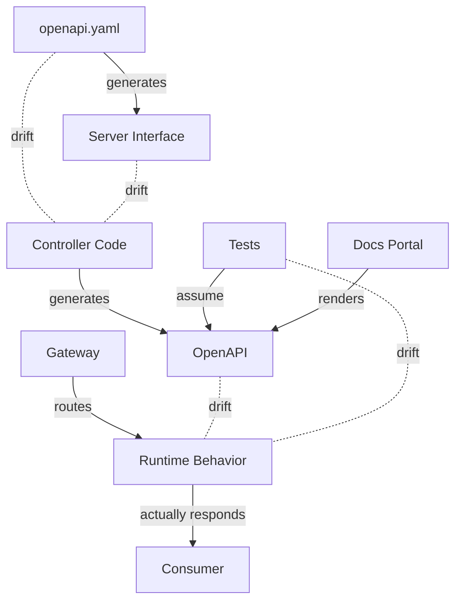
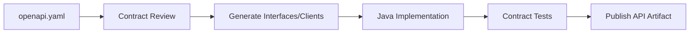
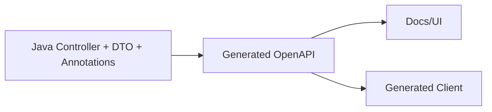
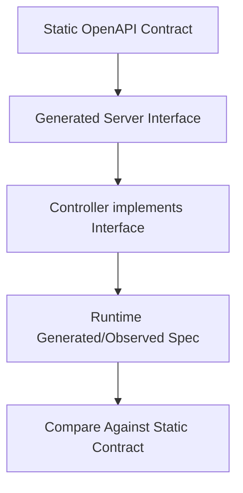
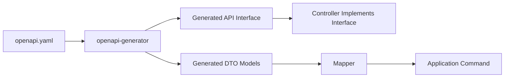
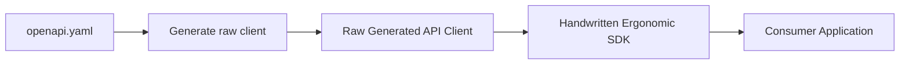
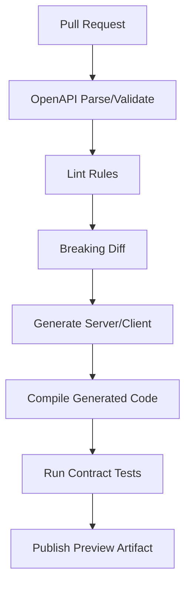

# Part 010 — OpenAPI in Java: Spring Boot, JAX-RS, Swagger Core, springdoc, and Generator Boundaries

## Tujuan Pembelajaran

Part sebelumnya membahas strategy. Sekarang kita masuk ke implementasi Java.

Masalah utama OpenAPI di Java bukan “library mana yang dipakai”. Masalah utamanya adalah:

> Bagaimana menjaga agar OpenAPI, Java code, generated client, runtime behavior, dan contract tests tidak saling drift.

Setelah part ini, kamu harus mampu:

1. memilih contract-first, code-first, atau hybrid OpenAPI workflow dengan sadar;
2. memakai springdoc/Swagger Core tanpa mengira annotation adalah governance;
3. mendesain project layout untuk OpenAPI spec, DTO, generated code, dan tests;
4. mengintegrasikan OpenAPI Generator dengan Maven/Gradle secara aman;
5. memisahkan generated server interface dari domain/application layer;
6. membuat CI gate untuk validate, diff, generate, compile, dan publish contract;
7. menghindari common pitfalls OpenAPI in Java;
8. membangun source-of-truth discipline untuk enterprise API platform.

---

## 1. OpenAPI in Java: The Real Problem

OpenAPI dapat dibuat dari:

1. static YAML/JSON file;
2. Java annotations;
3. generated server stubs;
4. runtime introspection;
5. tests;
6. gateway configuration;
7. documentation portal.

Jika semua mengklaim sebagai truth, hasilnya:



Top-tier engineer harus menetapkan:

> Apa source of truth untuk contract, dan apa yang hanya derived artifact?

---

## 2. Workflow Options

### 2.1 Contract-First

OpenAPI spec ditulis/di-review terlebih dahulu.



Pros:

- contract jelas sebelum implementation;
- cocok untuk partner/public API;
- review mudah;
- generated client/server konsisten;
- CI diff kuat.

Cons:

- butuh discipline;
- YAML bisa verbose;
- developer perlu memahami OpenAPI;
- tool quirks tetap ada;
- generated server stub bisa terlalu framework-driven.

Use when:

1. API punya banyak consumer;
2. partner/public/regulatory API;
3. cross-team contract review penting;
4. compatibility governance penting;
5. SDK generation penting.

### 2.2 Code-First / Annotation-First

Controller Java ditulis, OpenAPI dihasilkan.



Pros:

- cepat;
- developer-friendly;
- cocok untuk internal APIs;
- docs mengikuti code;
- sedikit duplication.

Cons:

- spec sering tidak menangkap real semantics;
- annotation noise;
- drift dengan intended contract;
- generated spec bisa berubah karena refactor;
- sulit review sebagai design artifact;
- default schema naming bisa unstable.

Use when:

1. internal API kecil;
2. low-risk service;
3. team belum siap contract-first;
4. OpenAPI mainly for docs/discovery;
5. CI tetap melakukan diff/validation.

### 2.3 Hybrid

Spec adalah source of truth untuk stable/external parts, annotation melengkapi atau memverifikasi.

Pattern:



Use when:

1. contract-first required tetapi framework ergonomics penting;
2. ingin prevent drift;
3. ingin generated interfaces;
4. API besar dan maintained lama.

---

## 3. Source-of-Truth Decision

Decision matrix:

| Context | Source of truth recommended |
|---|---|
| Public API | Static OpenAPI contract |
| Partner API | Static OpenAPI contract |
| Internal platform API with many consumers | Static or hybrid |
| Single-team internal API | Code-first acceptable |
| Regulated API | Static contract + approved changelog |
| Rapid prototype | Code-first |
| Generated SDK product | Static contract |
| Legacy API documentation | Observed/generated spec as bootstrap, then curated spec |

Rule:

> Code-first can generate an OpenAPI file. It does not automatically create a good API contract.

---

## 4. Project Layout: Contract-First Spring Boot

Recommended multi-module layout:

```text
customer-service/
├── contract/
│   ├── src/main/openapi/customer-api.yaml
│   ├── src/test/openapi/examples/
│   └── build.gradle
├── api-generated/
│   ├── build.gradle
│   └── build/generated/
├── application/
│   └── src/main/java/com/acme/customer/application/
├── domain/
│   └── src/main/java/com/acme/customer/domain/
├── infrastructure/
│   └── src/main/java/com/acme/customer/infrastructure/
├── web/
│   ├── src/main/java/com/acme/customer/web/
│   └── src/test/java/com/acme/customer/web/
└── settings.gradle
```

Module responsibilities:

| Module | Responsibility |
|---|---|
| `contract` | OpenAPI file, examples, contract lint/diff |
| `api-generated` | generated interfaces/models if used |
| `web` | controllers, mappers, exception handlers |
| `application` | use cases/commands |
| `domain` | domain model/invariants |
| `infrastructure` | persistence/external adapters |

Important:

- generated DTOs should not leak into domain;
- generated server interface can be implemented by web adapter;
- mapper translates generated/API DTO to application commands;
- OpenAPI artifact is versioned and published.

---

## 5. Project Layout: Code-First Spring Boot

```text
customer-service/
├── src/main/java/com/acme/customer/
│   ├── api/
│   │   ├── CustomerController.java
│   │   ├── request/
│   │   ├── response/
│   │   └── error/
│   ├── application/
│   ├── domain/
│   └── persistence/
├── src/test/java/
└── build/generated/openapi/
```

Generated spec is output:

```text
build/generated/openapi/customer-api.yaml
```

CI publishes generated spec, but also diffs it against last published spec.

Minimum discipline:

1. stable operationId;
2. explicit response annotations;
3. explicit error responses;
4. schema descriptions for tricky fields;
5. examples;
6. no entity exposure;
7. generated spec diff review.

---

## 6. Spring Boot with springdoc

springdoc-openapi generates OpenAPI description from Spring Boot application by inspecting Spring configuration, controller structure, and annotations.

Typical dependencies for Spring MVC UI:

```xml
<dependency>
    <groupId>org.springdoc</groupId>
    <artifactId>springdoc-openapi-starter-webmvc-ui</artifactId>
    <version>${springdoc.version}</version>
</dependency>
```

For API endpoint only:

```xml
<dependency>
    <groupId>org.springdoc</groupId>
    <artifactId>springdoc-openapi-starter-webmvc-api</artifactId>
    <version>${springdoc.version}</version>
</dependency>
```

Typical local endpoints:

```text
/v3/api-docs
/swagger-ui.html
```

Do not hardcode this into contract governance without checking your actual configuration.

### 6.1 Basic Controller

```java
@RestController
@RequestMapping("/customers")
class CustomerController {
    private final CustomerApplicationService service;
    private final CustomerApiMapper mapper;

    @Operation(
        operationId = "createCustomer",
        summary = "Create customer"
    )
    @ApiResponses({
        @ApiResponse(
            responseCode = "201",
            description = "Customer created",
            content = @Content(
                mediaType = "application/json",
                schema = @Schema(implementation = CustomerResponse.class)
            )
        ),
        @ApiResponse(
            responseCode = "400",
            description = "Validation failed",
            content = @Content(
                mediaType = "application/problem+json",
                schema = @Schema(implementation = ApiProblem.class)
            )
        )
    })
    @PostMapping
    ResponseEntity<CustomerResponse> createCustomer(
        @Valid @RequestBody CreateCustomerRequest request
    ) {
        CustomerResult result = service.createCustomer(mapper.toCommand(request));
        return ResponseEntity
            .created(URI.create("/customers/" + result.customerId().value()))
            .body(mapper.toResponse(result));
    }
}
```

### 6.2 DTO Annotation

```java
@Schema(name = "CreateCustomerRequest")
public record CreateCustomerRequest(
    @Schema(
        description = "Consumer-provided stable reference for reconciliation.",
        example = "CRM-928812",
        maxLength = 100
    )
    @NotBlank
    @Size(max = 100)
    String externalReference,

    @Schema(example = "Ayu Lestari", maxLength = 200)
    @NotBlank
    @Size(max = 200)
    String fullName,

    @Schema(
        description = "Birth date in ISO-8601 date format.",
        example = "1994-05-18"
    )
    @NotNull
    LocalDate birthDate
) {}
```

Annotation helps, but it is not enough.

Questions still requiring design:

1. absent/null semantics;
2. defaulting;
3. business validation;
4. compatibility lifecycle;
5. examples for edge cases;
6. error taxonomy;
7. deprecation plan.

---

## 7. Springdoc Pitfalls

### 7.1 Hidden Runtime Behavior

Controller:

```java
@PostMapping
CustomerResponse create(@Valid @RequestBody CreateCustomerRequest request) {
    return service.create(request);
}
```

Generated OpenAPI may not know:

- actual `201 Created` instead of `200`;
- `Location` header;
- all error responses;
- idempotency header;
- authorization scopes;
- rate limit response;
- conditional request headers.

Add explicit annotations or static contract.

### 7.2 Missing Error Responses

If OpenAPI only shows `200`, consumer generated clients are wrong.

```yaml
responses:
  '201':
    description: Created
  '400':
    description: Validation failed
  '401':
    description: Authentication required
  '403':
    description: Access denied
  '409':
    description: Conflict
  '422':
    description: Business rejection
  '500':
    description: Internal server error
```

### 7.3 Java Type Misrepresents Contract

Java:

```java
BigDecimal amount
```

Generated schema might become:

```yaml
type: number
```

But contract policy may require decimal string.

Then DTO should expose:

```java
String value
```

or schema annotation/custom converter must enforce intended contract.

### 7.4 LocalDateTime Leakage

Java:

```java
LocalDateTime createdAt
```

Generated contract may lack timezone semantics. Prefer `OffsetDateTime`/`Instant` for timestamps.

### 7.5 Required/Nullable Confusion

`@NotNull`, Java primitive types, `Optional<T>`, Jackson inclusion settings, and OpenAPI `required` do not always align naturally. Test generated schema.

### 7.6 OperationId Instability

If operationId generated from method name and method is renamed, client method changes.

Set explicit operationId.

```java
@Operation(operationId = "getCustomer")
```

### 7.7 Entity Exposure

If controller returns `CustomerEntity`, OpenAPI will document database shape. This is contract leakage.

---

## 8. JAX-RS and Swagger Core

Swagger Core is a Java implementation of OpenAPI and supports JAX-RS environments, including javax and jakarta namespaces.

Example JAX-RS resource:

```java
@Path("/customers")
@Produces(MediaType.APPLICATION_JSON)
@Consumes(MediaType.APPLICATION_JSON)
public class CustomerResource {
    private final CustomerApplicationService service;
    private final CustomerApiMapper mapper;

    @POST
    @Operation(
        operationId = "createCustomer",
        summary = "Create customer"
    )
    @APIResponses({
        @APIResponse(
            responseCode = "201",
            description = "Customer created"
        ),
        @APIResponse(
            responseCode = "400",
            description = "Validation failed"
        )
    })
    public Response createCustomer(@Valid CreateCustomerRequest request) {
        CustomerResult result = service.createCustomer(mapper.toCommand(request));
        return Response
            .created(URI.create("/customers/" + result.customerId().value()))
            .entity(mapper.toResponse(result))
            .build();
    }
}
```

Annotation names vary depending on library/imports. In practice, verify your stack:

- Jakarta REST vs legacy javax;
- MicroProfile OpenAPI vs Swagger Core annotations;
- application server integration;
- build-time vs runtime generation.

### 8.1 JAX-RS Pitfalls

1. resource method returns generic `Response`, losing schema unless annotated;
2. exception mappers not reflected in spec automatically;
3. filters add headers not documented;
4. security annotations may not map to OpenAPI security schemes;
5. content negotiation can be underdocumented;
6. async responses need explicit schema documentation.

---

## 9. Contract-First with OpenAPI Generator

OpenAPI Generator can generate clients, server stubs, documentation, and configuration from an OpenAPI document.

Contract-first flow:



### 9.1 Maven Plugin Example

```xml
<plugin>
    <groupId>org.openapitools</groupId>
    <artifactId>openapi-generator-maven-plugin</artifactId>
    <version>${openapi-generator.version}</version>
    <executions>
        <execution>
            <id>generate-customer-api</id>
            <goals>
                <goal>generate</goal>
            </goals>
            <configuration>
                <inputSpec>${project.basedir}/../contract/src/main/openapi/customer-api.yaml</inputSpec>
                <generatorName>spring</generatorName>
                <apiPackage>com.acme.customer.generated.api</apiPackage>
                <modelPackage>com.acme.customer.generated.model</modelPackage>
                <configOptions>
                    <interfaceOnly>true</interfaceOnly>
                    <useSpringBoot3>true</useSpringBoot3>
                    <useTags>true</useTags>
                </configOptions>
            </configuration>
        </execution>
    </executions>
</plugin>
```

### 9.2 Gradle Plugin Example

```kotlin
plugins {
    id("org.openapi.generator") version "<version>"
}

openApiGenerate {
    generatorName.set("spring")
    inputSpec.set("$rootDir/contract/src/main/openapi/customer-api.yaml")
    outputDir.set("$buildDir/generated/openapi")
    apiPackage.set("com.acme.customer.generated.api")
    modelPackage.set("com.acme.customer.generated.model")
    configOptions.set(
        mapOf(
            "interfaceOnly" to "true",
            "useSpringBoot3" to "true",
            "useTags" to "true"
        )
    )
}
```

Do not copy-paste blindly. Generator options differ by version/generator. Lock and review generated output.

---

## 10. Generated Server Interfaces

Generated interface:

```java
@Generated(...)
public interface CustomersApi {
    @PostMapping(
        value = "/customers",
        produces = { "application/json", "application/problem+json" },
        consumes = { "application/json" }
    )
    ResponseEntity<CustomerResponse> createCustomer(
        @Valid @RequestBody CreateCustomerRequest createCustomerRequest
    );
}
```

Implementation:

```java
@RestController
public class CustomerController implements CustomersApi {
    private final CustomerApplicationService service;
    private final CustomerApiMapper mapper;

    @Override
    public ResponseEntity<CustomerResponse> createCustomer(
        CreateCustomerRequest request
    ) {
        CustomerResult result = service.createCustomer(mapper.toCommand(request));
        return ResponseEntity
            .created(URI.create("/customers/" + result.customerId().value()))
            .body(mapper.toGeneratedResponse(result));
    }
}
```

Good:

- controller forced to match contract;
- operation path/method generated;
- DTO shape comes from spec.

Risks:

- generated models can pollute application layer;
- generator updates can change code shape;
- `oneOf`/nullable behavior can be awkward;
- generated annotations can conflict with team style;
- interface only does not guarantee runtime semantics like status under all branches.

---

## 11. Generated Models: Use or Map?

Decision:

| Option | Pros | Cons |
|---|---|---|
| Use generated models at web boundary only | Clear contract alignment | Need mapping |
| Use generated models throughout app | Less mapping | Domain polluted by contract/tool |
| Hand-write DTOs matching OpenAPI | Control | Drift risk |
| Generate clients only, not server | Server flexible | Need contract validation |

Recommended for serious systems:

> Generated models may live at the API boundary, but domain/application should use explicit internal types.

Example:

```java
// generated
com.acme.customer.generated.model.CreateCustomerRequest
```

Mapper:

```java
@Component
public class CustomerGeneratedApiMapper {
    public CreateCustomerCommand toCommand(CreateCustomerRequest request) {
        return new CreateCustomerCommand(
            ExternalReference.of(request.getExternalReference()),
            FullName.of(request.getFullName()),
            BirthDate.of(request.getBirthDate()),
            Optional.ofNullable(request.getEmailAddress()).map(EmailAddress::of)
        );
    }
}
```

---

## 12. Generated Client Boundaries

For Java client SDK:



Avoid exposing raw generated client directly for high-value APIs.

Why?

1. generated exceptions may be poor;
2. retry/timeouts often weak;
3. error mapping needs domain semantics;
4. idempotency support may be missing;
5. pagination helpers useful;
6. SDK compatibility can be controlled;
7. generated code changes between generator versions.

Wrapper example:

```java
public final class CustomerClient {
    private final CustomersApi api;

    public CustomerClient(CustomersApi api) {
        this.api = api;
    }

    public Customer getCustomer(CustomerId customerId) {
        try {
            CustomerResponse response = api.getCustomer(customerId.value());
            return Customer.from(response);
        } catch (ApiException ex) {
            throw CustomerApiExceptionMapper.map(ex);
        }
    }
}
```

---

## 13. OpenAPI Generator Pitfalls

### 13.1 Inline Schema Names

OpenAPI:

```yaml
responses:
  '200':
    content:
      application/json:
        schema:
          type: object
          properties:
            customerId:
              type: string
```

Generator may produce unstable names like `GetCustomer200Response`.

Prefer named components:

```yaml
components:
  schemas:
    CustomerResponse:
      type: object
      properties:
        customerId:
          type: string
```

### 13.2 oneOf/anyOf/allOf Complexity

Polymorphism generation differs by language/generator options. Test generated code.

### 13.3 Nullable Mapping

OpenAPI nullable semantics can map awkwardly to Java:

- `JsonNullable<T>`;
- `Optional<T>`;
- nullable field;
- primitive vs boxed type;
- required nullable field.

Design tests for absent vs null.

### 13.4 Date/Time Mapping

Ensure type mapping matches policy:

- `date` -> `LocalDate`;
- `date-time` -> `OffsetDateTime` or `Instant`;
- avoid `LocalDateTime` for timestamps.

### 13.5 Enum Unknown Values

Generated Java enum often fails deserialization on unknown value. If enum is open/extensible, generated enum may be unsafe.

Options:

1. model as string with documented known values;
2. custom enum with UNKNOWN;
3. custom deserializer;
4. capability negotiation;
5. closed enum only.

### 13.6 Generator Version Drift

Updating OpenAPI Generator can change generated code without contract change.

Policy:

1. pin generator version;
2. review generated diff;
3. compile sample consumer;
4. run SDK compatibility check;
5. update intentionally.

---

## 14. Validate OpenAPI in CI

Minimum CI pipeline:



### 14.1 Validation

Check:

1. spec parses;
2. references resolve;
3. schema valid;
4. examples match schemas;
5. operationId unique;
6. paths valid;
7. no duplicate names;
8. no invalid media type;
9. security schemes defined;
10. reusable components valid.

### 14.2 Lint Rules

Examples:

1. operationId required;
2. all errors use `application/problem+json`;
3. no raw arrays for paginated list;
4. timestamps use `date-time`;
5. money uses `Money`;
6. no `LocalDateTime` leakage if generated;
7. all operations have 4xx/5xx responses;
8. request bodies define examples;
9. enums documented as open/closed;
10. `additionalProperties` policy explicit.

### 14.3 Breaking Diff

Fail PR if:

1. response field removed;
2. request required field added;
3. type changed;
4. endpoint removed;
5. status removed;
6. enum value removed;
7. validation tightened;
8. error shape changed.

Dangerous changes require review.

---

## 15. Runtime Contract Validation

OpenAPI is not enough if runtime does something else.

Validation options:

1. request validation middleware;
2. response validation in non-prod;
3. contract tests;
4. gateway validation;
5. consumer-driven tests;
6. synthetic probes.

### 15.1 Response Validation in Test

```java
@Test
void getCustomerResponseMatchesOpenApi() {
    mockMvc.perform(get("/customers/{id}", customerId))
        .andExpect(status().isOk())
        .andExpect(openApi().isValid("getCustomer"));
}
```

Exact library depends on stack. The principle matters: verify runtime response against contract.

### 15.2 Do Not Validate Everything in Production Blindly

Production response validation can be expensive and risky.

Use strategy:

| Environment | Request validation | Response validation |
|---|---|---|
| local | strict | strict |
| CI | strict | strict |
| staging | strict | sampled/strict |
| production | request strict for public API; response sampled or shadow |

---

## 16. OpenAPI and Security Schemes

Define security explicitly.

```yaml
components:
  securitySchemes:
    OAuth2:
      type: oauth2
      flows:
        clientCredentials:
          tokenUrl: https://auth.acme.com/oauth2/token
          scopes:
            customer.read: Read customers
            customer.write: Create and update customers

paths:
  /customers/{customerId}:
    get:
      security:
        - OAuth2:
            - customer.read
```

Do not rely on Spring Security annotations alone if OpenAPI is public contract.

Mismatch risk:

```java
@PreAuthorize("hasAuthority('customer:read')")
```

but OpenAPI says:

```yaml
security: []
```

Consumer will think no auth required.

---

## 17. OpenAPI and Headers

Headers are contract too.

Document:

1. correlation ID;
2. idempotency key;
3. request ID;
4. tenant ID;
5. locale;
6. traceparent if public;
7. ETag;
8. If-Match;
9. Retry-After;
10. RateLimit headers if used.

Example:

```yaml
parameters:
  IdempotencyKey:
    name: Idempotency-Key
    in: header
    required: false
    schema:
      type: string
      maxLength: 255
    description: Required for safe retry of mutating requests where documented.
```

Response header:

```yaml
headers:
  Location:
    description: URI of the created customer.
    schema:
      type: string
  ETag:
    description: Current resource version for conditional updates.
    schema:
      type: string
```

---

## 18. OpenAPI Examples and Tests

Examples should be validated.

```yaml
CustomerResponse:
  type: object
  required:
    - customerId
    - lifecycleStatus
  properties:
    customerId:
      type: string
    lifecycleStatus:
      type: string
  examples:
    activeCustomer:
      value:
        customerId: cus_01J2T7Q7BSM8PV8K4J6JYQH7TR
        lifecycleStatus: ACTIVE
```

But tool support for schema examples varies. In CI, use a validator that checks examples, or write custom tests.

Golden examples directory:

```text
contract/src/test/openapi/examples/
├── customer-response-active.json
├── customer-response-suspended.json
├── validation-problem.json
└── case-state-conflict-problem.json
```

Test:

```java
@Test
void examplesMustMatchSchemas() {
    openApiExampleValidator.validateAllExamples(
        "src/main/openapi/customer-api.yaml",
        "src/test/openapi/examples"
    );
}
```

Implementation depends on chosen validator.

---

## 19. OpenAPI Modularization

Large specs become hard to maintain.

Structure:

```text
openapi/
├── customer-api.yaml
├── paths/
│   ├── customers.yaml
│   └── customer-accounts.yaml
├── schemas/
│   ├── CustomerResponse.yaml
│   ├── CreateCustomerRequest.yaml
│   ├── Money.yaml
│   └── Problem.yaml
├── parameters/
│   ├── CorrelationId.yaml
│   └── IdempotencyKey.yaml
└── responses/
    ├── BadRequest.yaml
    ├── Conflict.yaml
    └── UnprocessableContent.yaml
```

Pros:

- maintainable;
- reusable;
- smaller review diffs.

Cons:

- bundling needed;
- `$ref` path management;
- tooling differences.

CI should bundle into a canonical artifact:

```text
build/openapi/customer-api.bundle.yaml
```

Publish bundled spec, not a tree of unresolved refs, unless your registry supports it.

---

## 20. OpenAPI Governance Metadata

OpenAPI allows extensions with `x-`.

Example:

```yaml
paths:
  /customers/{customerId}:
    get:
      operationId: getCustomer
      x-owner-team: customer-platform
      x-lifecycle: stable
      x-data-classification: confidential
      x-consumer-criticality: high
      x-slo-tier: tier-1
```

Schema:

```yaml
CustomerResponse:
  type: object
  x-owner-team: customer-platform
  x-lifecycle: stable
  x-data-classification: confidential
```

Use extensions for governance, not runtime semantics unless tooling supports them.

Possible metadata:

1. owner team;
2. lifecycle state;
3. data classification;
4. PII marker;
5. regulatory domain;
6. SLO tier;
7. deprecation info;
8. capability requirement;
9. review status;
10. consumer visibility.

---

## 21. Handling Multiple Java Frameworks

Enterprise may have:

1. Spring Boot MVC;
2. Spring WebFlux;
3. JAX-RS/Jersey;
4. Quarkus RESTEasy Reactive;
5. Micronaut;
6. legacy servlet;
7. gateway-only APIs.

OpenAPI governance should be framework-neutral.

Rule:

> The contract is platform-level. Framework annotations are implementation detail.

Central policy should define:

1. OpenAPI version;
2. naming rules;
3. error shape;
4. pagination model;
5. header model;
6. security schemes;
7. compatibility policy;
8. publishing process.

Each framework adapter implements the policy differently.

---

## 22. Contract Publication

After validation, publish artifacts:

```text
customer-api-openapi-1.18.0.yaml
customer-api-openapi-1.18.0.json
customer-api-java-client-3.8.0.jar
customer-api-postman-collection.json
customer-api-changelog.md
```

Publication targets:

1. artifact repository;
2. API catalog/developer portal;
3. schema/contract registry;
4. internal documentation site;
5. SDK repository;
6. gateway config repository.

Do not publish unreviewed local generated specs as official contract.

---

## 23. Pull Request Review: What to Look For

### 23.1 OpenAPI Quality

- Is operationId stable and meaningful?
- Are request/response schemas named?
- Are examples realistic?
- Are error responses documented?
- Are headers documented?
- Are security requirements correct?
- Are pagination/filter/sort semantics clear?
- Is additionalProperties policy explicit?

### 23.2 Java Alignment

- Does controller return documented status?
- Are DTOs separate from entities?
- Do annotations match schema?
- Are exception handlers aligned with error contract?
- Are time/money/ID fields mapped correctly?
- Does generated server interface compile?
- Does generated client compile?

### 23.3 Governance

- Is this change compatible?
- Is OpenAPI artifact version updated?
- Is changelog updated?
- Are deprecated fields marked?
- Is consumer impact known?
- Is lint/diff passing?
- Are examples/tests updated?

---

## 24. Common Anti-Patterns

### 24.1 Annotation Dumping

Adding many annotations without design.

```java
@Schema(description = "status")
private String status;
```

This does not solve ambiguous semantics.

### 24.2 Generated Code Everywhere

Generated models become domain objects, persistence entities, and business logic types.

Result: contract tool controls your domain.

### 24.3 Spec Never Used

Team writes OpenAPI but server ignores it, tests ignore it, CI ignores it.

Result: documentation drift.

### 24.4 Runtime Spec as Official Contract Without Review

Every deploy changes official contract.

Result: consumer instability.

### 24.5 No Explicit Error Responses

Generated clients assume only success.

### 24.6 Inline Schemas Everywhere

Generated code becomes unstable and unreadable.

### 24.7 Changing Generator Version Casually

SDK public surface changes unexpectedly.

### 24.8 OperationId Generated from Java Method Names

Refactor becomes client breaking change.

### 24.9 OpenAPI Used to Describe Internal Entity

Database refactor becomes API breaking change.

### 24.10 Docs UI Treated as Governance

Swagger UI is useful. It is not governance.

---

## 25. Practical Implementation Blueprint

### 25.1 Contract-First Blueprint

```text
1. Write or update openapi.yaml
2. Run formatter/linter
3. Run breaking diff against last released contract
4. Generate server interface and models
5. Implement controller adapter
6. Map generated DTO to application command/result
7. Implement exception mapping
8. Run contract tests
9. Generate Java client
10. Compile sample consumer
11. Publish contract artifact and changelog
```

### 25.2 Code-First Blueprint

```text
1. Implement controller and DTOs
2. Add explicit OpenAPI annotations
3. Generate OpenAPI in test/build
4. Validate generated spec
5. Diff generated spec against last released contract
6. Fix unintended changes
7. Generate client
8. Compile generated client
9. Publish reviewed spec
```

### 25.3 Hybrid Blueprint

```text
1. Maintain static OpenAPI as intended contract
2. Generate server interface
3. Implement interface
4. Generate runtime spec in test
5. Compare runtime generated spec with static spec
6. Run request/response validation tests
7. Publish static/bundled spec
```

---

## 26. Example Contract-First Mini API

OpenAPI fragment:

```yaml
openapi: 3.1.0
info:
  title: Customer API
  version: 1.0.0
paths:
  /customers:
    post:
      operationId: createCustomer
      summary: Create customer
      parameters:
        - $ref: '#/components/parameters/IdempotencyKey'
      requestBody:
        required: true
        content:
          application/json:
            schema:
              $ref: '#/components/schemas/CreateCustomerRequest'
      responses:
        '201':
          description: Customer created
          headers:
            Location:
              schema:
                type: string
          content:
            application/json:
              schema:
                $ref: '#/components/schemas/CustomerResponse'
        '400':
          $ref: '#/components/responses/BadRequest'
        '422':
          $ref: '#/components/responses/UnprocessableContent'
components:
  parameters:
    IdempotencyKey:
      name: Idempotency-Key
      in: header
      required: false
      schema:
        type: string
        maxLength: 255
  schemas:
    CreateCustomerRequest:
      type: object
      required:
        - externalReference
        - fullName
        - birthDate
      additionalProperties: false
      properties:
        externalReference:
          type: string
          minLength: 1
          maxLength: 100
        fullName:
          type: string
          minLength: 1
          maxLength: 200
        birthDate:
          type: string
          format: date
    CustomerResponse:
      type: object
      required:
        - customerId
        - lifecycleStatus
        - createdAt
      additionalProperties: false
      properties:
        customerId:
          type: string
        lifecycleStatus:
          type: string
        createdAt:
          type: string
          format: date-time
    Problem:
      type: object
      required:
        - type
        - title
        - status
        - code
        - retryable
        - correlationId
      properties:
        type:
          type: string
          format: uri
        title:
          type: string
        status:
          type: integer
        code:
          type: string
        retryable:
          type: boolean
        correlationId:
          type: string
  responses:
    BadRequest:
      description: Validation failed
      content:
        application/problem+json:
          schema:
            $ref: '#/components/schemas/Problem'
    UnprocessableContent:
      description: Business rejection
      content:
        application/problem+json:
          schema:
            $ref: '#/components/schemas/Problem'
```

Implementation remains adapter-layer only.

---

## 27. Practice Lab

### Lab 1 — Choose Workflow

Given:

1. public partner API used by 30 external clients;
2. internal single-team admin API;
3. regulated case management API;
4. experimental prototype service;
5. shared customer platform API used by 80 internal services.

For each, choose contract-first, code-first, or hybrid, and justify.

### Lab 2 — Fix Code-First Spec Drift

Controller returns:

```java
@PostMapping("/customers")
CustomerResponse create(@RequestBody CreateCustomerRequest request) {
    return service.create(request);
}
```

Generated OpenAPI only shows `200`.

Fix:

1. correct status to 201;
2. add Location header;
3. add error responses;
4. add operationId;
5. avoid entity DTO;
6. add examples.

### Lab 3 — Generator Boundary

Generated model:

```java
public class CreateCustomerRequest {
    private String externalReference;
    private String fullName;
    private LocalDate birthDate;
}
```

Design mapper to:

```java
CreateCustomerCommand(
  ExternalReference,
  FullName,
  BirthDate
)
```

Explain why generated model should not enter domain layer.

### Lab 4 — CI Pipeline

Design CI steps for OpenAPI change PR:

1. validate spec;
2. lint policy;
3. diff breaking changes;
4. generate server;
5. generate client;
6. compile;
7. run contract tests;
8. publish preview;
9. require governance approval for dangerous changes.

### Lab 5 — Detect Generator Pitfalls

Find risks:

1. inline schema in response;
2. Java enum generated for open enum;
3. `LocalDateTime` generated for `date-time`;
4. operationId missing;
5. `application/problem+json` absent;
6. entity returned from controller;
7. generator version floating;
8. response examples not validated.

---

## 28. Senior Engineer Heuristics

1. **OpenAPI is a contract artifact, not just Swagger UI input.**
2. **Annotation-first is convenient but can hide design debt.**
3. **Contract-first is strongest when many consumers depend on you.**
4. **Generated server interfaces are boundary adapters, not architecture.**
5. **Generated models should not become domain models.**
6. **OperationId stability matters for generated clients.**
7. **Inline schemas create unstable generated code.**
8. **OpenAPI diff must be part of CI.**
9. **Runtime behavior must be tested against the spec.**
10. **Error responses must be first-class in OpenAPI.**
11. **Security annotations and OpenAPI security schemes must agree.**
12. **Generator version is a build dependency with compatibility impact.**
13. **Swagger UI is documentation UX, not contract governance.**
14. **A spec that is not validated, diffed, tested, and published is probably stale.**
15. **Source-of-truth ambiguity is the root cause of OpenAPI drift.**

---

## 29. Summary

OpenAPI in Java is powerful but easy to misuse. The key is not choosing springdoc, Swagger Core, or OpenAPI Generator in isolation. The key is establishing source-of-truth discipline and boundary discipline.

Main points:

1. contract-first works best for high-value and multi-consumer APIs;
2. code-first is acceptable for lower-risk APIs if diff/testing/governance exist;
3. hybrid workflows can prevent drift but require discipline;
4. springdoc and Swagger Core can generate useful specs, but annotations do not replace design;
5. OpenAPI Generator is useful for server interfaces and clients, but generated code must stay at boundaries;
6. CI must validate, lint, diff, generate, compile, test, and publish;
7. Java DTO/entity/domain boundaries remain essential;
8. OpenAPI must include errors, headers, security, examples, pagination, and compatibility semantics;
9. generator version and generated output changes need review;
10. official contract publication should be deliberate, not accidental.

Part berikutnya membahas API client contract engineering: generated clients, SDKs, resilience, error mapping, pagination helpers, and consumer ergonomics.
