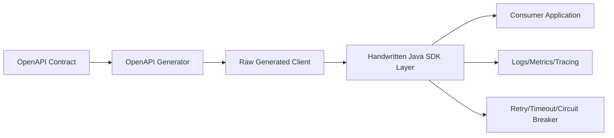
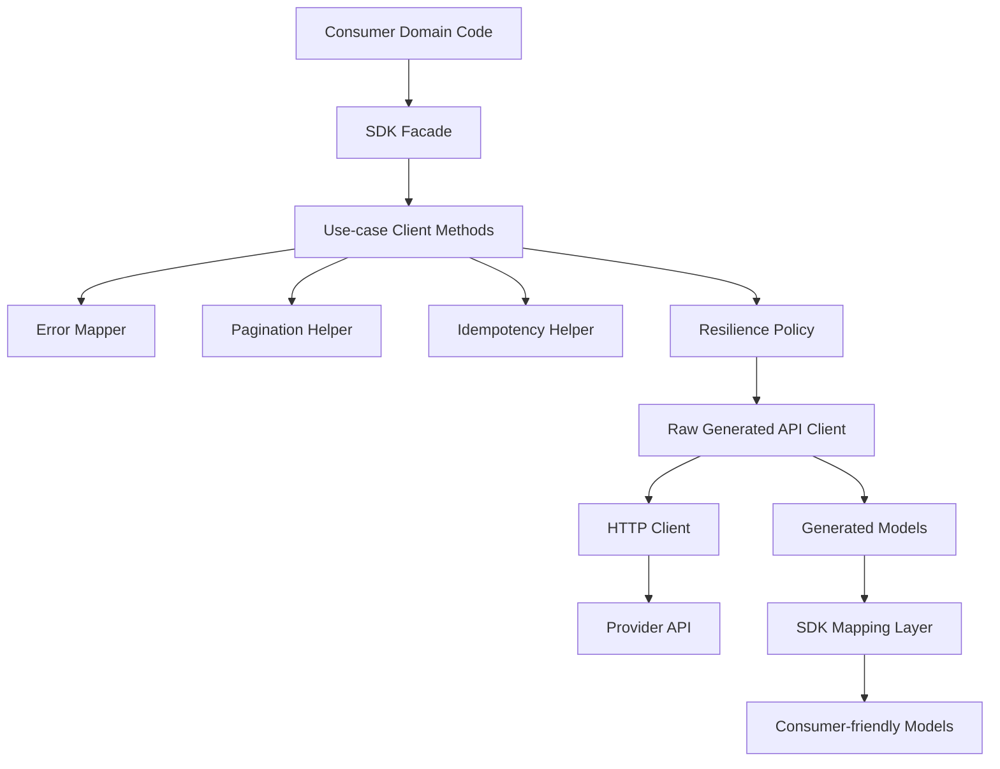
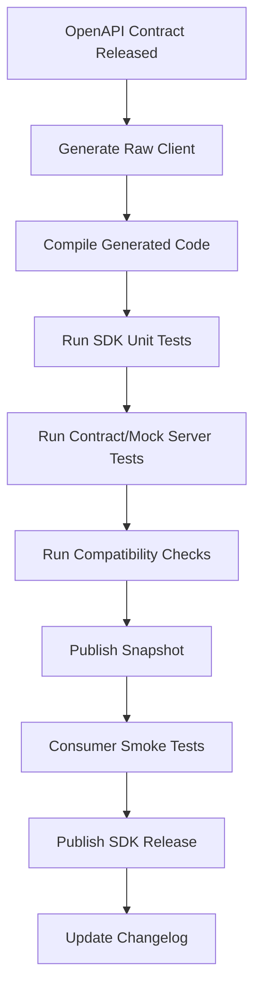

# Part 011 — API Client Contract Engineering: Generated Clients, SDKs, Resilience, and Consumer Ergonomics

## Tujuan Pembelajaran

Pada banyak organisasi, API contract engineering berhenti di provider: OpenAPI dibuat, endpoint berjalan, dokumentasi muncul di portal. Itu belum cukup. API contract baru benar-benar berguna ketika consumer dapat memanggilnya secara aman, konsisten, resilient, dan mudah dipahami.

Part ini membahas sisi consumer:

> Bagaimana mengubah API contract menjadi client experience yang reliable, type-safe, evolvable, dan tidak membuat setiap consumer menulis ulang error handling, retry, pagination, idempotency, dan observability sendiri.

Setelah part ini, kamu harus mampu:

1. membedakan raw generated client, typed client, dan product-grade SDK;
2. menentukan kapan generated client cukup dan kapan perlu wrapper SDK;
3. mendesain boundary antara OpenAPI-generated model dan domain model consumer;
4. membuat error mapping yang stabil dan tidak bergantung pada message text;
5. menerapkan resilience semantics sesuai contract, bukan asal retry;
6. mendukung pagination, filtering, idempotency, ETag, correlation, dan timeout;
7. menjaga compatibility SDK ketika OpenAPI berubah;
8. mendesain release model untuk Java client library;
9. membuat consumer ergonomics yang menurunkan integration friction tanpa menyembunyikan contract penting.

---

## 1. Kaufman Skill Slice

Skill utamanya:

> “Mampu membangun client library/SDK Java yang membuat consumer memakai API dengan benar secara default.”

Sub-skill:

| Sub-skill | Output praktis |
|---|---|
| Generated client evaluation | Bisa membaca generated code dan menilai apakah aman dipakai langsung |
| Boundary design | Generated model tidak bocor ke domain consumer tanpa alasan |
| Error mapping | Problem Details/API errors menjadi typed exception atau result |
| Resilience semantics | Retry, timeout, circuit breaker, backoff mengikuti contract |
| Pagination helpers | Consumer tidak salah loop atau parse cursor |
| Idempotency support | Mutating call bisa diretry dengan aman |
| Observability propagation | correlation/trace/client-id konsisten |
| SDK compatibility | Release SDK tidak membuat consumer compile/runtime break tanpa sadar |
| Developer ergonomics | API mudah digunakan tanpa menghilangkan explicitness |

Praktik Kaufman-style untuk part ini: ambil satu OpenAPI spec, generate raw Java client, lalu desain wrapper SDK yang memperbaiki 10 kelemahan penggunaan langsung.

---

## 2. Client Is Also a Contract Surface

Provider contract:

```text
HTTP method + path + headers + request schema + response schema + errors
```

Consumer-facing SDK contract:

```text
Java method + input type + output type + exception model + retry behavior + timeout + telemetry + upgrade path
```

Keduanya harus selaras, tapi tidak identik.



Raw generated client adalah mechanical artifact. SDK adalah consumer product.

---

## 3. Raw Generated Client vs SDK

### 3.1 Raw Generated Client

Generated from OpenAPI.

Typical generated shape:

```java
CustomersApi api = new CustomersApi(apiClient);
CustomerResponse response = api.getCustomer("cus_123");
```

Pros:

1. fast;
2. aligned with spec shape;
3. avoids manual boilerplate;
4. supports many languages;
5. good for internal low-risk use;
6. helps compile-time discovery.

Cons:

1. often exposes HTTP/tooling details;
2. error handling can be generic;
3. generated exceptions may be awkward;
4. retry/timeout defaults may be weak;
5. pagination not ergonomic;
6. nullable/optional semantics can be clumsy;
7. generator upgrades can break source compatibility;
8. domain-friendly types usually absent;
9. authentication integration may be primitive;
10. generated model names may be unstable.

### 3.2 SDK Wrapper

SDK wraps generated client.

```java
CustomerClient client = CustomerClient.builder()
    .baseUrl("https://api.acme.com")
    .credentials(credentials)
    .timeout(Duration.ofSeconds(3))
    .build();

Customer customer = client.getCustomer(CustomerId.of("cus_123"));
```

Pros:

1. stable Java API;
2. domain-friendly types;
3. typed exceptions/results;
4. built-in resilience;
5. consistent telemetry;
6. pagination helpers;
7. idempotency support;
8. backward-compatible wrapper even if generated code changes;
9. security defaults;
10. easier consumer onboarding.

Cons:

1. more engineering effort;
2. wrapper can hide too much;
3. needs release discipline;
4. needs tests against contract;
5. must track provider changes.

Rule:

> For strategic APIs, do not expose raw generated client as the primary consumer experience.

---

## 4. Client Layering Model

Recommended Java client architecture:



Package layout:

```text
customer-sdk-java/
├── src/main/java/com/acme/customer/sdk/
│   ├── CustomerClient.java
│   ├── CustomerClientBuilder.java
│   ├── model/
│   │   ├── Customer.java
│   │   ├── CustomerId.java
│   │   ├── Money.java
│   │   └── Page.java
│   ├── exception/
│   │   ├── CustomerApiException.java
│   │   ├── CustomerNotFoundException.java
│   │   ├── CustomerNotEligibleException.java
│   │   └── RateLimitExceededException.java
│   ├── internal/
│   │   ├── GeneratedClientFactory.java
│   │   ├── ProblemMapper.java
│   │   ├── CustomerDtoMapper.java
│   │   └── RetryPolicyFactory.java
│   └── generated/
│       └── ...
└── src/test/java/
```

Rule:

- Public SDK API lives outside `internal` and `generated`.
- Generated code is implementation detail.
- Consumer should not import generated classes in normal use.

---

## 5. Consumer-Friendly API Design

Raw generated method:

```java
CustomerResponse getCustomer(String customerId);
```

SDK method:

```java
Customer getCustomer(CustomerId customerId);
```

Better for optional not found:

```java
Optional<Customer> findCustomer(CustomerId customerId);
```

Or separate semantics:

```java
Customer getCustomer(CustomerId customerId) throws CustomerNotFoundException;

Optional<Customer> findCustomer(CustomerId customerId);
```

Do not make every method return `Optional` if not found is exceptional for that use case.

### 5.1 Method Naming

| Raw/generated | Better SDK |
|---|---|
| `customersCustomerIdGet` | `getCustomer` |
| `createCustomerWithHttpInfo` | `createCustomer` / `createCustomerWithResponse` |
| `listCustomers` returning raw response | `searchCustomers` returning `Page<Customer>` |
| `postCasesCaseIdApprove` | `approveCase` |
| `getCustomerByIdUsingGET` | `getCustomer` |

OperationId stability from OpenAPI helps, but SDK should still expose domain-friendly names.

### 5.2 Separate Simple and Advanced Methods

```java
Customer customer = client.getCustomer(customerId);
```

Advanced:

```java
Customer customer = client.getCustomer(
    GetCustomerRequest.builder()
        .customerId(customerId)
        .include(CustomerInclude.ACCOUNTS)
        .ifNoneMatch(etag)
        .build()
);
```

Avoid forcing every consumer into low-level request object for common paths.

---

## 6. SDK Model vs Generated Model

Generated model:

```java
public class CustomerResponse {
    private String customerId;
    private String lifecycleStatus;
    private OffsetDateTime createdAt;
}
```

SDK model:

```java
public record Customer(
    CustomerId customerId,
    CustomerLifecycleStatus lifecycleStatus,
    Instant createdAt
) {}
```

Value objects:

```java
public record CustomerId(String value) {
    public CustomerId {
        if (value == null || value.isBlank()) {
            throw new IllegalArgumentException("customerId must not be blank");
        }
    }

    public static CustomerId of(String value) {
        return new CustomerId(value);
    }
}
```

Status:

```java
public enum CustomerLifecycleStatus {
    ACTIVE,
    SUSPENDED,
    CLOSED,
    PENDING_REVIEW,
    UNKNOWN
}
```

Why include `UNKNOWN`?

- If provider adds value and contract allows open enum, SDK should not crash.
- SDK can preserve raw value if needed.

Alternative:

```java
public record CustomerLifecycleStatus(String value) {
    public boolean isKnown() {
        return switch (value) {
            case "ACTIVE", "SUSPENDED", "CLOSED", "PENDING_REVIEW" -> true;
            default -> false;
        };
    }
}
```

For truly open enums, string-backed value object may be better than Java enum.

---

## 7. Error Mapping

Raw generated clients often throw generic exceptions.

Example:

```java
try {
    api.openCustomerAccount(customerId, request);
} catch (ApiException ex) {
    // status, body, headers
}
```

SDK should map Problem Details into typed exception or result.

### 7.1 Base Exception

```java
public abstract class CustomerApiException extends RuntimeException {
    private final int status;
    private final String code;
    private final String reasonCode;
    private final boolean retryable;
    private final String correlationId;

    protected CustomerApiException(
        String message,
        int status,
        String code,
        String reasonCode,
        boolean retryable,
        String correlationId
    ) {
        super(message);
        this.status = status;
        this.code = code;
        this.reasonCode = reasonCode;
        this.retryable = retryable;
        this.correlationId = correlationId;
    }

    public int status() {
        return status;
    }

    public String code() {
        return code;
    }

    public String reasonCode() {
        return reasonCode;
    }

    public boolean retryable() {
        return retryable;
    }

    public String correlationId() {
        return correlationId;
    }
}
```

Specific exception:

```java
public final class CustomerNotEligibleException extends CustomerApiException {
    public CustomerNotEligibleException(ApiProblem problem) {
        super(
            problem.detail(),
            problem.status(),
            problem.code(),
            problem.reasonCode(),
            problem.retryable(),
            problem.correlationId()
        );
    }
}
```

### 7.2 Problem Mapper

```java
final class ProblemMapper {
    CustomerApiException map(int status, String responseBody) {
        ApiProblem problem = parseProblem(responseBody);

        return switch (problem.code()) {
            case "CUSTOMER_NOT_FOUND" ->
                new CustomerNotFoundException(problem);
            case "CUSTOMER_NOT_ELIGIBLE" ->
                new CustomerNotEligibleException(problem);
            case "RATE_LIMIT_EXCEEDED" ->
                new RateLimitExceededException(problem);
            case "VALIDATION_FAILED" ->
                new ValidationFailedException(problem);
            default ->
                new UnknownCustomerApiException(problem);
        };
    }
}
```

Key rule:

> Map by stable error code, not title/detail/message.

### 7.3 Unknown Error Fallback

Never assume provider will only return known errors.

```java
public final class UnknownCustomerApiException extends CustomerApiException {
    public UnknownCustomerApiException(ApiProblem problem) {
        super(
            problem.detail(),
            problem.status(),
            problem.code(),
            problem.reasonCode(),
            problem.retryable(),
            problem.correlationId()
        );
    }
}
```

If response body is not Problem Details:

```java
public final class UnparseableApiErrorException extends CustomerApiException {
    // preserve status, response snippet, correlation header if present
}
```

---

## 8. Exception vs Result Type

Two styles:

### 8.1 Exception Style

```java
try {
    Customer customer = client.getCustomer(customerId);
} catch (CustomerNotFoundException ex) {
    // handle
}
```

Pros:

- idiomatic for many Java APIs;
- simple happy path;
- integrates with existing code.

Cons:

- expected business outcomes may become exception-heavy;
- control flow hidden;
- harder for batch processing.

### 8.2 Result Style

```java
CustomerResult result = client.findCustomer(customerId);

switch (result) {
    case CustomerFound found -> use(found.customer());
    case CustomerMissing missing -> handleMissing(missing);
    case CustomerAccessDenied denied -> handleDenied(denied);
}
```

Java sealed interface:

```java
public sealed interface GetCustomerResult
    permits CustomerFound, CustomerMissing, CustomerAccessDenied {}

public record CustomerFound(Customer customer) implements GetCustomerResult {}
public record CustomerMissing(CustomerId customerId) implements GetCustomerResult {}
public record CustomerAccessDenied(String correlationId) implements GetCustomerResult {}
```

Pros:

- explicit expected outcomes;
- better for workflows;
- safer for business branching.

Cons:

- more verbose;
- less natural for unexpected failures;
- requires careful design.

### 8.3 Recommended Hybrid

Use result for expected domain outcomes, exception for technical/unexpected failures.

Example:

```java
GetCustomerResult getCustomerResult(CustomerId customerId);

Customer getCustomer(CustomerId customerId) throws CustomerNotFoundException;
```

---

## 9. Resilience Semantics

SDK should not blindly retry every failure.

### 9.1 Timeout

Always set timeouts.

```java
CustomerClient client = CustomerClient.builder()
    .connectTimeout(Duration.ofMillis(500))
    .readTimeout(Duration.ofSeconds(3))
    .build();
```

Expose sane defaults but allow override.

Timeout policy should be documented:

| Operation type | Example timeout |
|---|---|
| read small resource | 1-3 seconds |
| search/list | 3-10 seconds |
| mutating command | 3-10 seconds |
| async command submit | shorter, because processing is async |
| file/batch operation | explicit long timeout or async API |

Do not hide infinite timeouts.

### 9.2 Retry

Retry only when:

1. operation is idempotent;
2. error is retryable;
3. HTTP method/contract allows it;
4. idempotency key is present for mutating operation;
5. backoff is used;
6. retry budget is bounded.

Bad:

```java
retryOn(Exception.class);
```

Better:

```java
boolean shouldRetry(ApiFailure failure, OperationMetadata operation) {
    return failure.retryable()
        && operation.isIdempotent()
        && failure.status() != 400
        && failure.status() != 403
        && failure.status() != 422;
}
```

### 9.3 Backoff and Jitter

Use exponential backoff with jitter for transient failures.

Pseudo:

```java
Duration delayForAttempt(int attempt) {
    long baseMillis = Math.min(1000L * (1L << attempt), 10_000L);
    long jitter = ThreadLocalRandom.current().nextLong(0, baseMillis / 2 + 1);
    return Duration.ofMillis(baseMillis + jitter);
}
```

Do not synchronize thundering herd retries.

### 9.4 Circuit Breaker

Circuit breaker is appropriate when:

1. dependency has repeated failures;
2. failure is expensive;
3. fallback exists or fail-fast is better;
4. consumer can tolerate temporary blocking.

Do not make circuit breaker hide business rejections.

### 9.5 Bulkhead

For high-throughput clients, isolate:

1. thread pools;
2. connection pools;
3. rate limits;
4. semaphores.

SDK should allow configuration, but platform usually owns defaults.

---

## 10. Idempotency Support

Mutating APIs should support safe retry where appropriate.

Raw consumer usage:

```java
api.createCustomer(request, "idem_123");
```

SDK ergonomic usage:

```java
CreateCustomerCommand command = CreateCustomerCommand.builder()
    .externalReference("CRM-928812")
    .fullName("Ayu Lestari")
    .birthDate(LocalDate.parse("1994-05-18"))
    .idempotencyKey(IdempotencyKey.random())
    .build();

Customer customer = client.createCustomer(command);
```

Or auto-generated:

```java
Customer customer = client.createCustomer(
    CreateCustomerCommand.builder()
        .externalReference("CRM-928812")
        .fullName("Ayu Lestari")
        .birthDate(LocalDate.parse("1994-05-18"))
        .build()
);
```

SDK can generate idempotency key if operation contract allows, but must document:

1. key scope;
2. key lifetime;
3. retry behavior;
4. replay behavior;
5. conflict behavior when same key used with different payload.

### 10.1 Idempotency Conflict Mapping

```java
catch (IdempotencyKeyConflictException ex) {
    // do not retry with same key and different payload
}
```

This error must not be treated as transient.

---

## 11. Pagination Helpers

Raw API:

```java
CustomerSearchResponse page = api.searchCustomers(cursor, 50);
```

Consumer may write broken loops.

SDK can provide:

```java
Page<Customer> page = client.searchCustomers(
    CustomerSearchRequest.builder()
        .lifecycleStatus(CustomerLifecycleStatus.ACTIVE)
        .limit(50)
        .build()
);
```

Page type:

```java
public record Page<T>(
    List<T> items,
    String nextCursor,
    boolean hasMore
) {}
```

Auto-pagination:

```java
Stream<Customer> customers = client.streamCustomers(
    CustomerSearchRequest.builder()
        .lifecycleStatus(CustomerLifecycleStatus.ACTIVE)
        .pageSize(100)
        .build()
);
```

Important: streaming should not hide failure semantics.

Document:

1. each page is separate HTTP request;
2. stream may fail mid-way;
3. duplicates/missing items possible if dataset mutates;
4. cursor is opaque;
5. backpressure behavior;
6. max page size;
7. retry per page.

### 11.1 Avoid Infinite Auto-Pagination Defaults

Bad:

```java
List<Customer> all = client.listAllCustomers();
```

This can accidentally load millions.

Better:

```java
Stream<Customer> streamCustomers(CustomerSearchRequest request);
```

or require explicit limit:

```java
List<Customer> firstCustomers(CustomerSearchRequest request, int maxItems);
```

---

## 12. Conditional Requests and ETags

SDK can make optimistic concurrency easier.

API contract:

```http
GET /customers/{customerId}
ETag: "customer-42-rev-19"
```

Update:

```http
PATCH /customers/{customerId}
If-Match: "customer-42-rev-19"
```

SDK model:

```java
public record Versioned<T>(
    T value,
    String etag
) {}
```

Usage:

```java
Versioned<Customer> current = client.getCustomerVersioned(customerId);

client.updateCustomerProfile(
    UpdateCustomerProfileCommand.builder()
        .customerId(customerId)
        .displayName("Ayu L.")
        .ifMatch(current.etag())
        .build()
);
```

Conflict mapping:

```java
catch (VersionMismatchException ex) {
    Versioned<Customer> refreshed = client.getCustomerVersioned(customerId);
}
```

Do not hide ETag entirely if consumer workflow needs concurrency control.

---

## 13. Authentication and Token Handling

SDK may integrate token provider.

```java
CustomerClient client = CustomerClient.builder()
    .baseUrl(baseUrl)
    .tokenProvider(tokenProvider)
    .build();
```

Token provider interface:

```java
@FunctionalInterface
public interface AccessTokenProvider {
    String currentToken();
}
```

Better:

```java
public interface AccessTokenProvider {
    AccessToken getToken(Set<String> scopes);
}
```

SDK responsibilities:

1. attach Authorization header;
2. refresh token if configured;
3. not log token;
4. not expose token in exception message;
5. distinguish 401 and 403;
6. allow consumer-managed credentials;
7. support mTLS/proxy if enterprise requires.

SDK should not become identity platform unless intentionally designed.

---

## 14. Correlation, Tracing, and Consumer Identity

SDK should propagate:

1. correlation ID;
2. request ID;
3. trace context;
4. client application ID;
5. tenant/jurisdiction headers if contract requires.

Builder:

```java
CustomerClient client = CustomerClient.builder()
    .clientId("case-management-service")
    .correlationIdProvider(CorrelationIdProvider.mdc("correlationId"))
    .build();
```

Request interceptor:

```java
headers.put("X-Correlation-Id", correlationIdProvider.currentOrCreate());
headers.put("X-Client-Id", clientId);
```

Do not create high-cardinality logs by default.

Log:

```text
operation=getCustomer status=404 code=CUSTOMER_NOT_FOUND correlationId=corr_...
```

Do not log:

```text
nationalId=...
accessToken=...
fullPayload=...
```

---

## 15. SDK Observability

SDK should expose metrics where appropriate.

Example metrics:

```text
customer_sdk_request_total{operation="getCustomer", status="200"}
customer_sdk_request_total{operation="getCustomer", status="404", code="CUSTOMER_NOT_FOUND"}
customer_sdk_latency_seconds{operation="searchCustomers"}
customer_sdk_retry_total{operation="createCustomer", reason="DEPENDENCY_UNAVAILABLE"}
customer_sdk_circuit_state{operationGroup="customer-api"}
```

Avoid labels:

1. customerId;
2. raw URL with ID;
3. exception message;
4. correlationId;
5. tenant if high cardinality unless carefully bounded.

SDK should integrate with Micrometer/OpenTelemetry but not force one runtime if library is general-purpose.

---

## 16. Configuration Surface

A good SDK exposes configuration without making consumer configure everything.

```java
CustomerClient client = CustomerClient.builder()
    .baseUrl("https://api.acme.com")
    .tokenProvider(tokenProvider)
    .connectTimeout(Duration.ofMillis(500))
    .readTimeout(Duration.ofSeconds(3))
    .maxRetries(2)
    .userAgent("case-management-service/1.4.2")
    .build();
```

Recommended config categories:

| Category | Examples |
|---|---|
| endpoint | baseUrl |
| auth | token provider, mTLS |
| timeouts | connect, read, call |
| resilience | retry, backoff, circuit breaker |
| observability | metrics/tracing/logging |
| headers | correlation, client id, tenant |
| serialization | object mapper/custom modules |
| compatibility | API version/capability flags |

Do not expose every generated client knob directly. Curate.

---

## 17. Java HTTP Client Choices

OpenAPI Generator Java client supports multiple libraries depending on generator configuration, such as OkHttp, Jersey, Retrofit, Feign, WebClient, RestClient, and others depending on version/options.

Decision criteria:

| Client | Consideration |
|---|---|
| Java `HttpClient` | JDK-native, less dependency |
| OkHttp | mature, widely used, interceptors |
| WebClient | reactive stack, Spring ecosystem |
| RestClient/RestTemplate style | Spring MVC compatibility |
| Feign | declarative, ecosystem integration |
| Jersey | JAX-RS ecosystem |

Pick based on:

1. organization stack;
2. blocking vs reactive;
3. instrumentation support;
4. connection pooling;
5. TLS/proxy needs;
6. generated code maturity;
7. dependency footprint;
8. operational familiarity.

Do not let generator default choose architecture silently.

---

## 18. Handling Null and Optional in SDK

OpenAPI nullable/optional semantics can be awkward in Java.

Example PATCH semantics:

- absent = no change;
- null = clear.

A Java method with nullable string cannot express absent vs clear safely:

```java
updateProfile(String displayName, String middleName)
```

Better command object:

```java
public record UpdateCustomerProfileCommand(
    CustomerId customerId,
    FieldUpdate<String> displayName,
    FieldUpdate<String> middleName
) {}
```

Field update:

```java
public sealed interface FieldUpdate<T>
    permits FieldUpdate.Absent, FieldUpdate.Set, FieldUpdate.Clear {

    record Absent<T>() implements FieldUpdate<T> {}
    record Set<T>(T value) implements FieldUpdate<T> {}
    record Clear<T>() implements FieldUpdate<T> {}

    static <T> FieldUpdate<T> absent() {
        return new Absent<>();
    }

    static <T> FieldUpdate<T> set(T value) {
        return new Set<>(value);
    }

    static <T> FieldUpdate<T> clear() {
        return new Clear<>();
    }
}
```

Usage:

```java
client.updateCustomerProfile(
    new UpdateCustomerProfileCommand(
        customerId,
        FieldUpdate.set("Ayu L."),
        FieldUpdate.clear()
    )
);
```

This is much safer than relying on `null`.

---

## 19. Handling Open Enums

If provider may add enum values, Java SDK must not crash.

Bad:

```java
public enum RiskBand {
    LOW,
    MEDIUM,
    HIGH
}
```

If provider sends `CRITICAL`, deserialization fails.

Safer:

```java
public record RiskBand(String value) {
    public static final RiskBand LOW = new RiskBand("LOW");
    public static final RiskBand MEDIUM = new RiskBand("MEDIUM");
    public static final RiskBand HIGH = new RiskBand("HIGH");

    public boolean isKnown() {
        return value.equals("LOW")
            || value.equals("MEDIUM")
            || value.equals("HIGH");
    }
}
```

Or enum with raw fallback:

```java
public record ParsedEnum<E extends Enum<E>>(
    Optional<E> knownValue,
    String rawValue
) {}
```

SDK docs must tell consumer how to handle unknown values.

---

## 20. Backward Compatibility of SDK

SDK public API is its own contract.

Breaking changes:

1. remove public method;
2. rename method;
3. change return type;
4. change exception type hierarchy;
5. change package names;
6. remove model field;
7. make constructor stricter;
8. change default timeout/retry drastically;
9. change null behavior;
10. change generated classes if exposed publicly.

Safe-ish changes:

1. add method overload;
2. add optional model field if construction remains compatible;
3. add specific subclass exception while preserving base exception;
4. add builder option;
5. improve docs;
6. add support for new error code with fallback preserved.

### 20.1 Semantic Versioning for SDK

Suggested:

| Change | SDK version |
|---|---|
| bug fix, no API change | patch |
| add method/model field | minor |
| add support for new endpoint | minor |
| change generated internal code only | patch/minor depending risk |
| remove method | major |
| change exception hierarchy incompatibly | major |
| change default retry behavior | major or documented minor if safe |
| drop Java runtime version support | major |

---

## 21. Generated Code Isolation

If generated code is public, generator changes become consumer breaking changes.

Avoid:

```java
public com.acme.customer.generated.model.CustomerResponse getCustomer(String id)
```

Prefer:

```java
public com.acme.customer.sdk.model.Customer getCustomer(CustomerId id)
```

If you expose generated models for speed, accept the cost:

1. generator version pinned;
2. generated public API diff checked;
3. migration guide for generator changes;
4. no inline schemas;
5. stable operationId/schema names.

---

## 22. Client Contract Tests

SDK must be tested against provider contract.

Types:

1. compile tests against generated code;
2. mock server tests from OpenAPI examples;
3. Pact consumer tests;
4. provider sandbox tests;
5. replay tests with golden responses;
6. error mapping tests;
7. unknown enum/error tests;
8. timeout/retry tests.

### 22.1 Golden Response Mapping Test

```java
@Test
void mapsCustomerResponseToSdkModel() {
    CustomerResponse dto = json.readValue("""
        {
          "customerId": "cus_01J2T7Q7BSM8PV8K4J6JYQH7TR",
          "lifecycleStatus": "ACTIVE",
          "createdAt": "2026-06-29T02:15:00Z"
        }
        """, CustomerResponse.class);

    Customer customer = mapper.toSdk(dto);

    assertThat(customer.customerId().value())
        .isEqualTo("cus_01J2T7Q7BSM8PV8K4J6JYQH7TR");
    assertThat(customer.lifecycleStatus())
        .isEqualTo(CustomerLifecycleStatus.ACTIVE);
}
```

### 22.2 Unknown Enum Test

```java
@Test
void preservesUnknownRiskBand() {
    CustomerResponse dto = json.readValue("""
        {
          "customerId": "cus_123",
          "riskBand": "CRITICAL"
        }
        """, CustomerResponse.class);

    Customer customer = mapper.toSdk(dto);

    assertThat(customer.riskBand().value()).isEqualTo("CRITICAL");
    assertThat(customer.riskBand().isKnown()).isFalse();
}
```

### 22.3 Error Mapping Test

```java
@Test
void mapsCustomerNotEligibleProblem() {
    ApiProblem problem = json.readValue("""
        {
          "type": "https://api.acme.com/problems/customer-not-eligible",
          "title": "Customer is not eligible",
          "status": 422,
          "code": "CUSTOMER_NOT_ELIGIBLE",
          "reasonCode": "KYC_NOT_VERIFIED",
          "retryable": false,
          "correlationId": "corr_123"
        }
        """, ApiProblem.class);

    CustomerApiException ex = mapper.map(problem);

    assertThat(ex).isInstanceOf(CustomerNotEligibleException.class);
    assertThat(ex.code()).isEqualTo("CUSTOMER_NOT_ELIGIBLE");
    assertThat(ex.retryable()).isFalse();
}
```

---

## 23. SDK Release Pipeline



Minimum gates:

1. OpenAPI validation;
2. generator pinned;
3. generated diff reviewed;
4. SDK public API diff;
5. error mapping tests;
6. example mapping tests;
7. generated client compile;
8. sample consumer compile;
9. changelog.

---

## 24. SDK Changelog

Bad changelog:

```text
Updated client.
```

Good changelog:

```md
## 3.8.0

### Added

- Added `CustomerClient.searchCustomers(...)`.
- Added `Customer.kycStatus`.
- Added typed exception `CustomerNotEligibleException`.

### Changed

- Internal generated OpenAPI client updated from contract `customer-api` 1.18.0 to 1.19.0.
- Default read timeout remains 3 seconds.

### Compatibility

- No source-breaking public SDK changes.
- Unknown `lifecycleStatus` values continue to map to `CustomerLifecycleStatus.UNKNOWN`.

### Migration

- Prefer `Customer.lifecycleStatus()` over deprecated `Customer.status()`.
```

Consumer needs actionable upgrade info.

---

## 25. Consumer Usage Patterns

### 25.1 Simple Read

```java
Customer customer = customerClient.getCustomer(CustomerId.of("cus_123"));
```

### 25.2 Not Found Handling

```java
Optional<Customer> customer = customerClient.findCustomer(CustomerId.of("cus_123"));

customer.ifPresentOrElse(
    this::useCustomer,
    () -> log.info("Customer not found")
);
```

### 25.3 Business Rejection Handling

```java
try {
    customerClient.openPremiumAccount(command);
} catch (CustomerNotEligibleException ex) {
    if ("KYC_NOT_VERIFIED".equals(ex.reasonCode())) {
        workflow.routeToKycRemediation(command.customerId());
    } else {
        workflow.routeToManualReview(command.customerId(), ex.reasonCode());
    }
}
```

### 25.4 Pagination

```java
try (Stream<Customer> customers = customerClient.streamCustomers(
    CustomerSearchRequest.builder()
        .lifecycleStatus(CustomerLifecycleStatus.ACTIVE)
        .pageSize(100)
        .build()
)) {
    customers.forEach(this::processCustomer);
}
```

### 25.5 Conditional Update

```java
Versioned<Customer> current = customerClient.getCustomerVersioned(customerId);

customerClient.updateProfile(
    UpdateCustomerProfileCommand.builder()
        .customerId(customerId)
        .displayName(FieldUpdate.set("Ayu L."))
        .middleName(FieldUpdate.clear())
        .ifMatch(current.etag())
        .build()
);
```

---

## 26. Consumer Anti-Patterns

### 26.1 Parsing Error Message

Bad:

```java
if (ex.getMessage().contains("KYC")) {
    routeToKyc();
}
```

Use `code` and `reasonCode`.

### 26.2 Catching Generic Exception

Bad:

```java
catch (Exception ex) {
    retry();
}
```

This retries validation/business errors.

### 26.3 Infinite Pagination

Bad:

```java
while (true) {
    page = client.search(cursor);
    cursor = page.nextCursor();
}
```

Need `hasMore`, max items, and failure handling.

### 26.4 Exposing Generated Models in Domain

Bad:

```java
public class CaseWorkflow {
    void handle(CustomerResponse generatedCustomer) {}
}
```

This couples business logic to provider schema and generator.

### 26.5 Assuming Enum Exhaustiveness

Bad:

```java
switch (status) {
    case ACTIVE -> ...
    case SUSPENDED -> ...
    case CLOSED -> ...
}
```

without unknown handling if enum is extensible.

### 26.6 Blind Retry POST

Bad:

```java
retry(() -> api.createPayment(request));
```

without idempotency key.

### 26.7 Default Timeout from HTTP Library

Bad because often unknown/infinite/unfit.

---

## 27. SDK Governance Checklist

### 27.1 Public API

- Are public classes stable and documented?
- Are generated classes hidden?
- Are method names domain-friendly?
- Are advanced options available without burdening common use?
- Are null/absent/clear semantics explicit?

### 27.2 Error Handling

- Are Problem Details parsed?
- Are stable codes mapped?
- Is unknown error handled?
- Does SDK preserve correlation ID?
- Does SDK avoid branching on message text?
- Are sensitive details not logged?

### 27.3 Resilience

- Are timeouts set?
- Are retries bounded?
- Are retries idempotency-aware?
- Is Retry-After honored where relevant?
- Are 4xx business/validation errors not retried?
- Are metrics/traces emitted?

### 27.4 Compatibility

- Is generator version pinned?
- Is public SDK diff checked?
- Are generated changes isolated?
- Are examples tested?
- Are unknown enum values tolerated where contract requires?
- Is changelog useful?

### 27.5 Consumer Experience

- Is common usage simple?
- Is pagination safe?
- Is ETag/concurrency usable?
- Is auth integration clear?
- Are builder defaults sensible?
- Are docs based on real examples?

---

## 28. Practice Lab

### Lab 1 — Wrap a Generated Client

Given raw generated API:

```java
CustomerResponse getCustomer(String customerId);
CustomerResponse createCustomer(CreateCustomerRequest request, String idempotencyKey);
CustomerSearchResponse searchCustomers(String cursor, Integer limit);
```

Design SDK:

1. public facade;
2. SDK models;
3. mappers;
4. typed exceptions;
5. pagination helper;
6. idempotency strategy;
7. timeout/retry config.

### Lab 2 — Error Mapping

Given Problem Details:

```json
{
  "status": 422,
  "code": "CUSTOMER_NOT_ELIGIBLE",
  "reasonCode": "KYC_NOT_VERIFIED",
  "retryable": false,
  "correlationId": "corr_123"
}
```

Design:

1. exception class;
2. mapping logic;
3. consumer handling code;
4. unknown error fallback.

### Lab 3 — PATCH Semantics in SDK

API PATCH semantics:

- absent = no change;
- null = clear;
- value = set.

Design Java command type that avoids ambiguous null.

### Lab 4 — SDK Compatibility Review

Classify changes:

1. expose generated model as return type;
2. remove `findCustomer`;
3. add `searchCustomers`;
4. change default retry count from 0 to 3;
5. add `Customer.kycStatus`;
6. change `CustomerId` from string wrapper to UUID;
7. change exception base class;
8. update generator version causing package rename;
9. add unknown enum fallback;
10. make timeout required in builder.

### Lab 5 — Consumer-Safe Pagination

Design a method to process all active customers with:

1. bounded page size;
2. failure handling;
3. backoff;
4. duplicate tolerance;
5. max item guard;
6. observable progress.

---

## 29. Senior Engineer Heuristics

1. **A generated client is not automatically an SDK.**
2. **The SDK is a contract surface; version it seriously.**
3. **Generated code should be implementation detail for strategic APIs.**
4. **Typed errors reduce consumer guesswork.**
5. **Retry policy must follow contract semantics, not exception classes.**
6. **Every mutating retry needs idempotency reasoning.**
7. **Pagination helpers should prevent accidental unbounded reads.**
8. **Unknown enum handling is mandatory for open taxonomies.**
9. **Do not hide ETags if consumer workflows need concurrency control.**
10. **Timeout defaults are part of client contract.**
11. **SDK logs must be useful but never leak secrets.**
12. **OpenAPI compatibility and SDK compatibility are related but different.**
13. **A good SDK makes the correct path the easiest path.**
14. **Consumer ergonomics is reliability engineering.**
15. **If every consumer writes retry/error/pagination logic independently, the platform failed.**

---

## 30. Summary

API client contract engineering turns provider contracts into safe consumer experience. Raw generated clients are useful, but strategic APIs often need SDK wrappers that stabilize Java API shape, map errors, enforce resilience semantics, handle pagination/idempotency, and preserve compatibility despite generator churn.

Main takeaways:

1. raw generated clients are mechanical artifacts;
2. SDKs are consumer-facing products;
3. generated models should usually stay at the boundary;
4. error mapping must use stable codes, not text;
5. retry must be idempotency-aware;
6. pagination must be explicit and bounded;
7. null/absent/clear semantics need dedicated Java types;
8. open enums need unknown handling;
9. SDK compatibility needs its own release discipline;
10. client-side observability and defaults strongly influence production reliability.

Part berikutnya membahas API contract testing: provider verification, consumer expectations, drift detection, Pact, Spring Cloud Contract, and CI gates.
