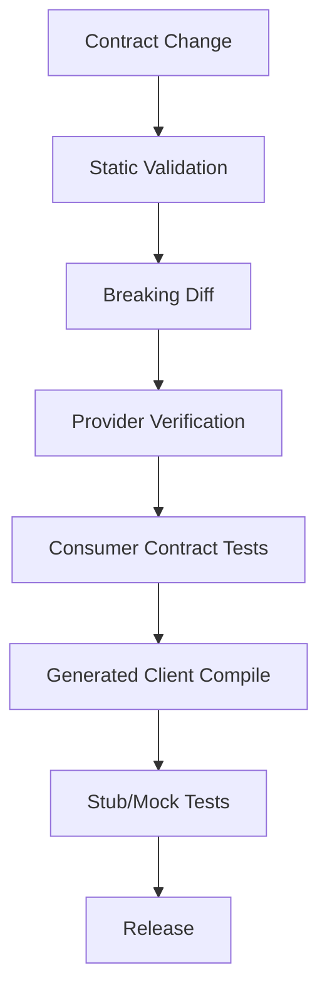
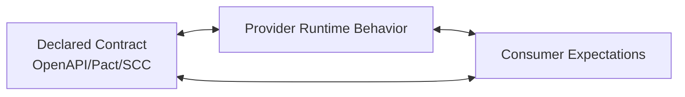
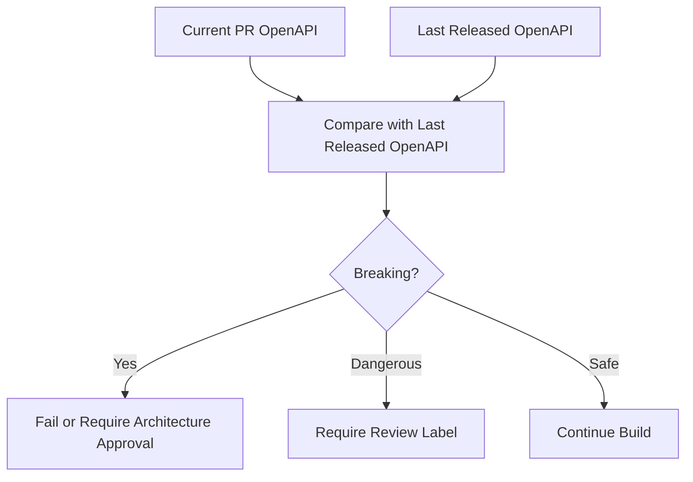
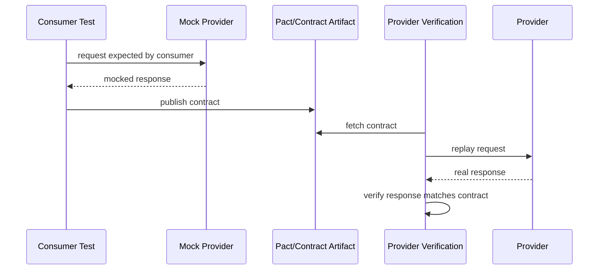
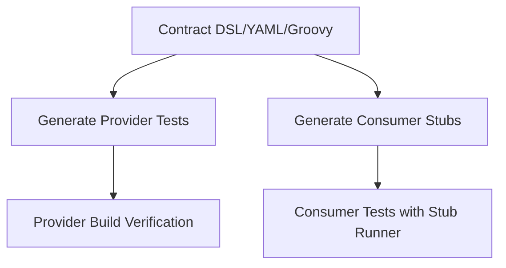
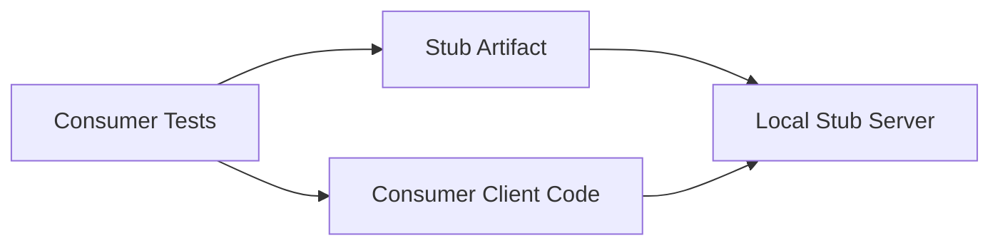
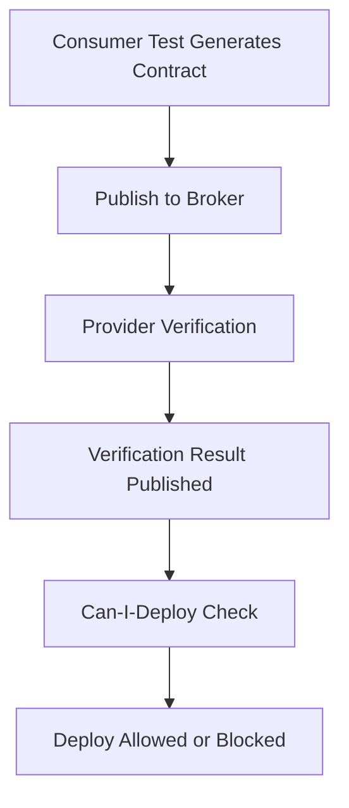
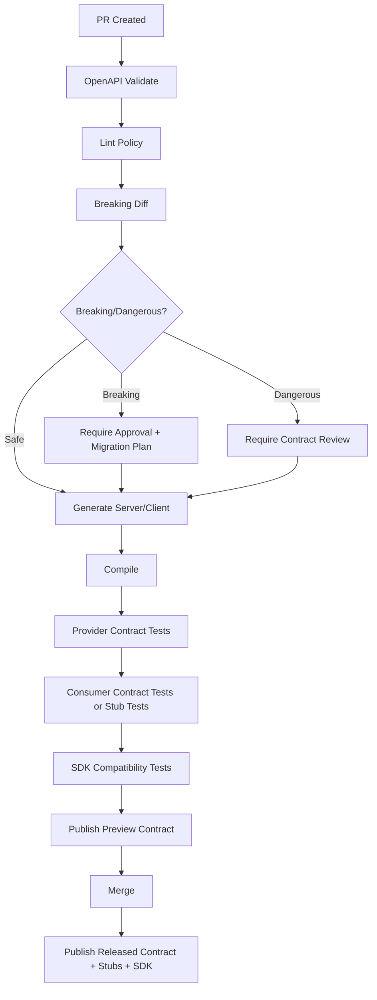

# Part 012 — API Contract Testing: Provider Verification, Consumer Expectations, and Drift Detection

## Tujuan Pembelajaran

Contract tanpa test adalah dokumen dengan harapan. Dalam sistem enterprise, kita membutuhkan bukti otomatis bahwa:

1. provider benar-benar memenuhi contract;
2. consumer expectations tidak rusak;
3. runtime behavior tidak drift dari OpenAPI;
4. generated clients tetap compile dan dapat dipakai;
5. perubahan contract tidak breaking tanpa review;
6. error, header, status, dan edge case ikut diuji.

Part ini membahas API contract testing di Java secara mendalam.

Setelah part ini, kamu harus mampu:

1. membedakan unit, integration, end-to-end, schema validation, provider contract test, dan consumer-driven contract test;
2. memilih OpenAPI validation, Pact, Spring Cloud Contract, atau kombinasi;
3. membuat test strategy yang menghindari false confidence;
4. menguji success response, error response, headers, content type, pagination, idempotency, dan concurrency;
5. memasukkan contract diff dan generated client compile ke CI gate;
6. mendesain stub publishing untuk consumer;
7. membangun drift detection antara spec, server, docs, gateway, dan SDK.

---

## 1. Why Contract Testing Exists

Masalah distributed systems:

```text
Provider deploys change.
Consumer compiles fine.
Integration environment looks okay.
Production consumer breaks because one field changed semantics.
```

Contract testing mencoba memindahkan failure dari production ke build pipeline.



Tujuan bukan mengganti semua integration tests. Tujuan adalah mempercepat feedback untuk boundary compatibility.

---

## 2. Testing Taxonomy

| Test type | Scope | Strength | Weakness |
|---|---|---|---|
| Unit test | class/function | fast, precise | no boundary confidence |
| Controller slice test | HTTP adapter | validates mapping/status/errors | may mock domain too much |
| OpenAPI schema validation | payload vs spec | catches shape drift | may miss semantics |
| Provider contract test | provider vs contract | proves provider implements spec | may not reflect real consumer usage |
| Consumer-driven contract test | consumer expectations vs provider | tests used interactions | may not cover unused but documented API |
| Integration test | real services or dependencies | good confidence | slower, brittle |
| End-to-end test | full workflow | highest scenario confidence | slow, expensive, hard to debug |
| Generated client compile test | SDK vs spec | catches generated breakage | not runtime behavior |
| Semantic regression test | documented behavior | catches non-schema changes | must be manually designed |

Good strategy combines several.

---

## 3. Contract Testing Mental Model

There are three truths:



Failures:

| Drift | Example |
|---|---|
| Contract vs provider | OpenAPI says 201, server returns 200 |
| Provider vs consumer | Consumer expects `status`, provider removed it |
| Consumer vs contract | Consumer relies on undocumented field |
| Contract vs docs | portal shows stale spec |
| Contract vs SDK | generated client cannot parse nullable field |
| Contract vs gateway | gateway requires header not documented |

Contract testing should target these drift lines.

---

## 4. OpenAPI-Based Provider Verification

OpenAPI-based provider verification checks runtime request/response against OpenAPI.

### 4.1 What to Verify

For each operation:

1. method/path;
2. request content type;
3. request body schema;
4. request headers;
5. response status;
6. response content type;
7. response body schema;
8. response headers;
9. examples;
10. error responses.

### 4.2 Example with MockMvc Concept

Pseudo-code:

```java
@Test
void createCustomerShouldMatchOpenApiContract() {
    mockMvc.perform(post("/customers")
            .contentType("application/json")
            .header("Idempotency-Key", "idem_123")
            .content("""
                {
                  "externalReference": "CRM-928812",
                  "fullName": "Ayu Lestari",
                  "birthDate": "1994-05-18"
                }
                """))
        .andExpect(status().isCreated())
        .andExpect(header().exists("Location"))
        .andExpect(content().contentType("application/json"))
        .andExpect(openApi().isValid("createCustomer"));
}
```

The exact matcher depends on chosen library. The important practice: response must be validated against the OpenAPI operation.

### 4.3 Provider Verification Is Not Enough

If you only test happy path, provider can still break:

1. validation errors;
2. business errors;
3. pagination;
4. unknown input;
5. idempotency conflict;
6. concurrency conflict;
7. rate limit;
8. auth failures;
9. nullable fields;
10. edge enum values.

Contract tests must include negative and edge cases.

---

## 5. OpenAPI Example Validation

Examples in OpenAPI should be executable.

Example file:

```text
src/test/resources/openapi/examples/customer-created.json
src/test/resources/openapi/examples/validation-problem.json
src/test/resources/openapi/examples/customer-not-eligible-problem.json
```

Test strategy:

```java
@Test
void allExamplesShouldMatchReferencedSchemas() {
    OpenApiDocument document = OpenApiDocument.load("customer-api.yaml");

    document.examples().forEach(example -> {
        Schema schema = document.schemaFor(example);
        assertThat(schemaValidator.validate(example.value(), schema)).isEmpty();
    });
}
```

This prevents docs drift.

Bad example:

```yaml
example:
  customerId: string
  lifecycleStatus: true
```

Schema would catch `lifecycleStatus` boolean if it should be string.

---

## 6. Contract Diff Testing

Before testing runtime, detect dangerous changes statically.

Contract diff categories:

| Change | Gate |
|---|---|
| removed path | fail |
| removed operation | fail |
| removed response status | fail |
| removed response field | fail or review |
| added required request field | fail |
| changed type | fail |
| tightened min/max/pattern | fail/review |
| added enum value to closed enum | review/fail |
| changed error response content type | fail |
| added optional response field | pass |
| added operation | pass |
| added optional request field | pass/review |

CI flow:



Static diff cannot catch semantic changes. It catches structural changes early.

---

## 7. Consumer-Driven Contract Testing

Consumer-driven contract testing starts from consumer expectation.

The consumer says:

> “When I send this request, I require this response shape/status/header.”

Provider later verifies it can satisfy that expectation.



Consumer-driven contracts are useful because they test what consumers actually use, not every documented possibility.

---

## 8. Pact Mental Model

Pact is a consumer-driven contract testing tool. The consumer test generates a contract from interactions used by the consumer. The provider then verifies those interactions.

Important characteristics:

1. consumer writes tests against mock provider;
2. contract artifact records interactions;
3. provider verifies contract against real provider;
4. Pact Broker can coordinate publication and verification;
5. “can I deploy?” workflow checks compatibility.

### 8.1 Consumer Test Concept

Pseudo Java/JUnit style:

```java
@Pact(consumer = "case-management-service", provider = "customer-service")
RequestResponsePact getCustomerPact(PactDslWithProvider builder) {
    return builder
        .given("customer cus_123 exists")
        .uponReceiving("a request for customer cus_123")
            .path("/customers/cus_123")
            .method("GET")
        .willRespondWith()
            .status(200)
            .headers(Map.of("Content-Type", "application/json"))
            .body(newJsonBody(body -> {
                body.stringValue("customerId", "cus_123");
                body.stringType("lifecycleStatus", "ACTIVE");
            }).build())
        .toPact();
}
```

Consumer test:

```java
@Test
void shouldLoadCustomerFromProvider(MockServer mockServer) {
    CustomerClient client = CustomerClient.builder()
        .baseUrl(mockServer.getUrl())
        .build();

    Customer customer = client.getCustomer(CustomerId.of("cus_123"));

    assertThat(customer.lifecycleStatus())
        .isEqualTo(CustomerLifecycleStatus.ACTIVE);
}
```

### 8.2 Provider Verification Concept

```java
@TestTemplate
@ExtendWith(PactVerificationInvocationContextProvider.class)
void verifyPact(PactVerificationContext context) {
    context.verifyInteraction();
}
```

Provider states are used to set up data:

```java
@State("customer cus_123 exists")
void customerExists() {
    testData.createCustomer("cus_123", "ACTIVE");
}
```

Exact annotations and setup depend on Pact JVM version and test framework. The model matters more than copy-paste.

### 8.3 Pact Strengths

1. tests real consumer needs;
2. reduces over-testing unused provider behavior;
3. supports independent deployability;
4. good for many consumers;
5. provides verification workflow.

### 8.4 Pact Weaknesses

1. consumer tests can encode poor expectations;
2. provider state setup can be hard;
3. contract sprawl if poorly governed;
4. does not replace provider API spec;
5. may miss undocumented but important platform guarantees;
6. requires discipline around broker and versioning.

---

## 9. Spring Cloud Contract Mental Model

Spring Cloud Contract supports consumer-driven and producer-driven contract testing in the Spring ecosystem. It lets teams define contracts and generate tests/stubs.

Basic idea:



### 9.1 Contract Example Concept

YAML-style contract concept:

```yaml
description: should create customer
request:
  method: POST
  url: /customers
  headers:
    Content-Type: application/json
  body:
    externalReference: CRM-928812
    fullName: Ayu Lestari
    birthDate: "1994-05-18"
response:
  status: 201
  headers:
    Content-Type: application/json
    Location: /customers/cus_123
  body:
    customerId: cus_123
    lifecycleStatus: ACTIVE
```

Provider verification generates a test that calls provider and checks response.

Consumer side can use generated stubs.

### 9.2 Strengths

1. strong Spring integration;
2. generated provider tests;
3. generated stubs;
4. good for producer-owned contracts;
5. works well in JVM/Spring organizations.

### 9.3 Weaknesses

1. can duplicate OpenAPI if not integrated;
2. DSL contract may become another source of truth;
3. requires governance around contract ownership;
4. may overfit to Spring ecosystem;
5. generated tests can give false confidence if base setup is weak.

---

## 10. OpenAPI vs Pact vs Spring Cloud Contract

They solve overlapping but different problems.

| Tool/Approach | Best at | Not enough for |
|---|---|---|
| OpenAPI | public API description, schema, docs, generation | actual consumer expectations |
| OpenAPI validation | provider shape compliance | consumer usage and semantic expectations |
| Pact | consumer-driven interactions | full API documentation/catalog |
| Spring Cloud Contract | JVM/Spring contract tests/stubs | external API standard by itself |
| Integration tests | real service interaction | fast compatibility feedback |
| Generated client compile | SDK build compatibility | runtime behavior |

Recommended combinations:

| Context | Strategy |
|---|---|
| Public API | OpenAPI + provider validation + generated client tests |
| Internal multi-consumer API | OpenAPI + Pact or SCC + diff gates |
| Spring-only org | OpenAPI + Spring Cloud Contract |
| Many heterogeneous consumers | OpenAPI + Pact Broker + SDK tests |
| Regulated API | OpenAPI + provider verification + examples + audit trail |
| Prototype | code-first spec + smoke contract tests |

---

## 11. Provider Contract Test Matrix

For each operation, define matrix.

Example: `POST /customers`

| Scenario | Expected |
|---|---|
| valid create | 201 + CustomerResponse + Location |
| invalid JSON | 400 + Problem |
| missing required field | 400 + Problem violations |
| invalid birthDate format | 400 + Problem violations |
| birthDate future | 400/422 depending policy |
| duplicate externalReference | 409 or idempotent result |
| KYC/business rejection | 422 + reasonCode |
| unauthorized | 401 + Problem |
| forbidden | 403 + Problem |
| idempotency key conflict | 409 + Problem |
| dependency unavailable | 503 + retryable true |

Each scenario should be traceable to contract docs.

---

## 12. Testing Headers as Contract

Headers are often forgotten.

Test:

```java
@Test
void createCustomerShouldReturnLocationAndCorrelationId() {
    mockMvc.perform(post("/customers")
            .contentType("application/json")
            .header("X-Correlation-Id", "corr_test")
            .content(validCreateCustomerJson()))
        .andExpect(status().isCreated())
        .andExpect(header().exists("Location"))
        .andExpect(header().string("X-Correlation-Id", "corr_test"));
}
```

Headers to test:

1. `Location`;
2. `ETag`;
3. `Retry-After`;
4. correlation/request ID;
5. deprecation/sunset;
6. rate limit headers;
7. content type;
8. cache control;
9. `Vary` when header versioning is used.

---

## 13. Testing Content Type

Do not only test status and body.

```java
.andExpect(content().contentType("application/problem+json"))
```

For success:

```java
.andExpect(content().contentType("application/json"))
```

If provider returns HTML error page under some failure path, generated clients may fail badly.

Contract test should catch this.

---

## 14. Testing Error Contracts

### 14.1 Validation Error

```java
@Test
void missingFullNameShouldReturnValidationProblem() {
    mockMvc.perform(post("/customers")
            .contentType("application/json")
            .content("""
                {
                  "externalReference": "CRM-928812",
                  "birthDate": "1994-05-18"
                }
                """))
        .andExpect(status().isBadRequest())
        .andExpect(content().contentType("application/problem+json"))
        .andExpect(jsonPath("$.code").value("VALIDATION_FAILED"))
        .andExpect(jsonPath("$.retryable").value(false))
        .andExpect(jsonPath("$.violations[?(@.field == '/fullName')]").exists());
}
```

### 14.2 Business Error

```java
@Test
void kycNotVerifiedShouldReturnCustomerNotEligible() {
    givenCustomerKycStatus("cus_123", "PENDING");

    mockMvc.perform(post("/customers/cus_123/accounts")
            .contentType("application/json")
            .content(validOpenAccountJson()))
        .andExpect(status().isUnprocessableEntity())
        .andExpect(content().contentType("application/problem+json"))
        .andExpect(jsonPath("$.code").value("CUSTOMER_NOT_ELIGIBLE"))
        .andExpect(jsonPath("$.reasonCode").value("KYC_NOT_VERIFIED"))
        .andExpect(jsonPath("$.retryable").value(false));
}
```

### 14.3 Unexpected Error Does Not Leak

```java
@Test
void unexpectedErrorShouldNotExposeStackTrace() {
    forceUnexpectedError();

    mockMvc.perform(post("/customers")
            .contentType("application/json")
            .content(validCreateCustomerJson()))
        .andExpect(status().isInternalServerError())
        .andExpect(content().contentType("application/problem+json"))
        .andExpect(jsonPath("$.code").value("INTERNAL_ERROR"))
        .andExpect(jsonPath("$.stackTrace").doesNotExist());
}
```

---

## 15. Testing Idempotency Contract

Scenarios:

| Scenario | Expected |
|---|---|
| same key + same payload | same result or documented replay response |
| same key + different payload | 409 idempotency conflict |
| missing required key | 400 |
| retry after timeout | no duplicate side effect |
| key expired | documented behavior |

Pseudo-test:

```java
@Test
void sameIdempotencyKeyWithDifferentPayloadShouldFail() {
    String key = "idem_123";

    postCreateCustomer(key, createCustomerJson("CRM-1", "Ayu"))
        .andExpect(status().isCreated());

    postCreateCustomer(key, createCustomerJson("CRM-2", "Budi"))
        .andExpect(status().isConflict())
        .andExpect(jsonPath("$.code")
            .value("IDEMPOTENCY_KEY_REUSED_WITH_DIFFERENT_PAYLOAD"));
}
```

This is more than schema test. It verifies behavior contract.

---

## 16. Testing Optimistic Concurrency

Scenarios:

1. GET returns ETag;
2. update with matching If-Match succeeds;
3. update with stale If-Match returns 412;
4. update without If-Match returns 428 or allowed depending policy;
5. ETag changes after update.

Pseudo:

```java
@Test
void staleIfMatchShouldReturnPreconditionFailed() {
    Versioned<Customer> current = getCustomerVersioned("cus_123");

    updateCustomerElsewhere("cus_123");

    mockMvc.perform(patch("/customers/cus_123")
            .header("If-Match", current.etag())
            .contentType("application/json")
            .content(updateProfileJson()))
        .andExpect(status().isPreconditionFailed())
        .andExpect(jsonPath("$.code").value("VERSION_MISMATCH"));
}
```

---

## 17. Testing Pagination Contract

Scenarios:

1. first page returns `items` and `page`;
2. cursor is opaque;
3. `hasMore` correct;
4. nextCursor null when no more;
5. limit max enforced;
6. unsupported sort rejected;
7. stable default sort;
8. filter semantics.

Pseudo:

```java
@Test
void searchCustomersShouldReturnPageWrapper() {
    mockMvc.perform(get("/customers")
            .param("limit", "50"))
        .andExpect(status().isOk())
        .andExpect(jsonPath("$.items").isArray())
        .andExpect(jsonPath("$.page.hasMore").exists())
        .andExpect(jsonPath("$.page.nextCursor").exists());
}
```

Semantic test for default sort:

```java
@Test
void defaultSortShouldRemainCreatedAtDescending() {
    List<CustomerResponse> items = api.searchCustomers(defaultSearch()).items();

    assertThat(items)
        .extracting(CustomerResponse::createdAt)
        .isSortedAccordingTo(Comparator.reverseOrder());
}
```

---

## 18. Consumer Contract Tests for SDK

Consumer SDK should have tests against stubs/mock server.

### 18.1 Mock Server from OpenAPI Examples

Test SDK mapping without real provider:

```java
@Test
void sdkShouldParseCustomerResponseFromStub() {
    stubServer.stubGet(
        "/customers/cus_123",
        200,
        "application/json",
        """
        {
          "customerId": "cus_123",
          "lifecycleStatus": "ACTIVE",
          "createdAt": "2026-06-29T02:15:00Z"
        }
        """
    );

    Customer customer = client.getCustomer(CustomerId.of("cus_123"));

    assertThat(customer.lifecycleStatus())
        .isEqualTo(CustomerLifecycleStatus.ACTIVE);
}
```

### 18.2 Unknown Error Test

```java
@Test
void sdkShouldHandleUnknownProblemCode() {
    stubServer.stubGet(
        "/customers/cus_123",
        499,
        "application/problem+json",
        """
        {
          "type": "https://api.acme.com/problems/new-problem",
          "title": "New problem",
          "status": 499,
          "code": "NEW_PROBLEM",
          "retryable": false,
          "correlationId": "corr_123"
        }
        """
    );

    assertThatThrownBy(() -> client.getCustomer(CustomerId.of("cus_123")))
        .isInstanceOf(UnknownCustomerApiException.class);
}
```

This prevents SDK from crashing on future-compatible errors.

---

## 19. Stub Publishing

Stubs let consumers test without provider running.

Artifacts:

```text
customer-service-stubs-1.18.0.jar
customer-api-openapi-1.18.0.yaml
customer-sdk-java-3.8.0.jar
```

Consumer build:



Benefits:

1. faster consumer tests;
2. fewer shared test environment dependencies;
3. reproducible interactions;
4. versioned contract artifacts.

Risks:

1. stale stubs;
2. stubs not matching provider;
3. overly simplistic behavior;
4. false confidence if stubs do not include errors;
5. stub version mismatch.

Governance:

- stubs generated from approved contract;
- provider verification passes before publishing;
- stub version tied to contract version;
- consumers pin stub version;
- changelog explains changes.

---

## 20. Contract Broker / Registry Workflow

For Pact-like workflows:



Key concepts:

1. consumer version;
2. provider version;
3. environment;
4. tags/branches;
5. verification result;
6. deployability matrix.

This is useful for independent deployability, but requires operational ownership.

---

## 21. Avoiding False Confidence

Contract tests can lie.

### 21.1 Schema-Only False Confidence

Schema says:

```yaml
riskScore:
  type: integer
```

Provider changes range from 0-1000 to 0-100. Schema still passes.

Need semantic test.

### 21.2 Mocked Domain False Confidence

Controller test mocks application service with expected DTO. It proves controller mapping, not domain behavior.

Need at least some provider verification with real application path or carefully configured test slices.

### 21.3 Consumer Pact Too Weak

Consumer only asserts `customerId`, but production uses `lifecycleStatus`.

Contract will not protect that field.

Consumer tests must assert what consumer actually uses.

### 21.4 Stubs Too Happy-Path

Consumer never tests 409/422/429. Production breaks on errors.

### 21.5 Generated Client Compile Only

Compile proves types exist, not that runtime parsing and error handling work.

### 21.6 Environment Drift

Contract test uses local config, production gateway adds required header.

Test gateway-level contract or include gateway rules in contract governance.

---

## 22. Contract Test Data Management

Provider verification often needs states.

Examples:

```text
customer cus_123 exists
customer cus_missing does not exist
customer cus_kyc_pending exists with KYC=PENDING
case case_123 exists in DRAFT
account acc_123 has version 19
```

Rules:

1. provider states must be deterministic;
2. test data setup should be isolated;
3. cleanup must be reliable;
4. avoid shared mutable test data;
5. avoid time-dependent flaky states;
6. seed IDs should be stable but not production-like sensitive data;
7. state setup should use domain/application APIs where possible.

Bad provider state:

```java
@State("customer exists")
void setup() {
    // depends on whatever data is in shared database
}
```

Good:

```java
@State("customer cus_123 exists with lifecycle ACTIVE")
void setupCustomer() {
    testData.reset();
    testData.createCustomer("cus_123", "ACTIVE");
}
```

---

## 23. Testing Security Contract

Security is part of contract.

Scenarios:

1. missing token -> 401;
2. invalid token -> 401;
3. expired token -> 401;
4. valid token missing scope -> 403;
5. valid scope but wrong tenant -> 403/404 based on policy;
6. hidden resource not leaked;
7. security headers present if public;
8. OpenAPI security scheme matches runtime.

Pseudo:

```java
@Test
void missingTokenShouldReturn401Problem() {
    mockMvc.perform(get("/customers/cus_123"))
        .andExpect(status().isUnauthorized())
        .andExpect(content().contentType("application/problem+json"))
        .andExpect(jsonPath("$.code").value("AUTHENTICATION_REQUIRED"));
}
```

---

## 24. Contract Testing and Gateways

Provider app may pass tests, but gateway behavior can break contract.

Gateway may add:

1. authentication;
2. rate limiting;
3. header requirements;
4. path rewriting;
5. response transformation;
6. timeout;
7. CORS;
8. request size limits;
9. compression;
10. custom error format.

If gateway is part of public API, test it.

Strategies:

1. run contract tests against deployed gateway in staging;
2. include gateway config diff in contract review;
3. validate gateway error responses use same Problem Details;
4. test rate limit headers and 429;
5. test path and header versioning.

---

## 25. CI/CD Contract Gate Blueprint



Gates:

| Gate | Fails when |
|---|---|
| validate | invalid OpenAPI |
| lint | style/governance violation |
| diff | breaking without approval |
| generate | generator cannot generate |
| compile | generated/server/client compile fail |
| provider test | runtime mismatch |
| consumer test | consumer expectation broken |
| SDK compatibility | public SDK break |
| publish | artifact metadata missing |

---

## 26. Contract Test Ownership

Ownership matters.

| Artifact | Owner |
|---|---|
| OpenAPI spec | provider team, reviewed by platform/domain |
| Pact consumer contracts | consumer team |
| Pact provider verification | provider team |
| Spring Cloud Contract producer contracts | provider or shared ownership |
| SDK tests | SDK/platform team |
| diff policy | platform/API governance team |
| stubs | provider/platform |
| examples | provider, validated by CI |
| semantic tests | provider + domain experts |

Do not centralize all test writing in platform team. Platform sets guardrails; domain/provider/consumer own semantics.

---

## 27. Contract Test Granularity

Avoid one giant test per endpoint. Prefer scenario-based tests.

Bad:

```java
@Test
void customerApiWorks() {}
```

Good:

```text
createCustomer_validRequest_returns201
createCustomer_missingFullName_returnsValidationProblem
createCustomer_duplicateExternalReference_returnsConflict
createCustomer_reusedIdempotencyKeyWithDifferentPayload_returnsConflict
getCustomer_missingToken_returns401
getCustomer_unknownCustomer_returns404
searchCustomers_defaultSort_isCreatedAtDescending
```

Names should reveal contract behavior.

---

## 28. Semantic Contract Tests

Some contract must be expressed as tests, not schema.

Examples:

### 28.1 Idempotency

Same key and same payload should not create duplicate.

### 28.2 Default Sort

Search default remains createdAt desc.

### 28.3 State Machine

Cannot approve draft case.

### 28.4 Retryability

503 response includes `retryable=true` and Retry-After.

### 28.5 Authorization Hiding

Unauthorized tenant sees 404, not 403, if policy says hide existence.

### 28.6 Monetary Semantics

Amount value is decimal string with currency and no floating rounding.

### 28.7 Time Semantics

`createdAt` is UTC instant, not server-local time.

These tests require domain understanding.

---

## 29. Contract Coverage

Do not chase 100% endpoint count only. Track meaningful coverage.

Metrics:

1. operations with provider verification;
2. operations with error contract tests;
3. operations with examples;
4. operations with generated client compile;
5. operations with consumer-driven contracts;
6. deprecated fields with usage telemetry;
7. dangerous changes reviewed;
8. gateway-level scenarios tested;
9. semantic invariants tested;
10. stubs published.

Example dashboard:

```text
Customer API Contract Coverage
- Operations: 42
- Provider-verified operations: 39
- Error scenarios covered: 81%
- OpenAPI examples validated: 100%
- Generated Java client compile: passing
- Active Pact consumers: 17
- Deprecated fields with telemetry: 6/6
- Breaking diff gate: enabled
```

---

## 30. Contract Testing Anti-Patterns

### 30.1 Treating Contract Test as E2E Test

Contract tests should be fast and focused. Do not require entire enterprise landscape.

### 30.2 Only Testing 200

Most integration pain happens outside 200.

### 30.3 Testing Implementation Details

Do not assert database table side effects in API contract test unless contract promises them.

### 30.4 Consumer Tests Not Publishing Contracts

Consumer tests pass locally but provider never sees expectations.

### 30.5 Provider Ignores Consumer Contracts

Pact generated but verification not blocking release.

### 30.6 Contract Stubs Not Versioned

Consumers unknowingly test against stale stubs.

### 30.7 Contract Diff Warnings Ignored

If dangerous changes are always overridden, gate is theater.

### 30.8 Snapshot Testing Entire JSON Blindly

Snapshot tests can be too brittle and block safe additive changes.

Prefer targeted assertions plus schema validation.

### 30.9 Mocking Away Error Mapper

If test bypasses exception handling, error contract is untested.

### 30.10 No Negative Tests

Validation, conflict, auth, rate limit, and dependency failures untested.

---

## 31. Practical Contract Testing Stack

A practical Java enterprise stack might include:

1. OpenAPI spec validation in build;
2. OpenAPI linting with organization rules;
3. OpenAPI breaking diff;
4. MockMvc/WebTestClient/JAX-RS tests validating responses;
5. Pact for consumer-driven interactions;
6. Spring Cloud Contract for Spring-heavy producer/consumer stubs;
7. generated Java client compile test;
8. SDK mapping/error tests;
9. Testcontainers for realistic dependencies when needed;
10. gateway staging contract smoke tests.

Do not add all tools blindly. Start from risk:

| Risk | Tooling response |
|---|---|
| OpenAPI drift | provider validation |
| consumer-specific breakage | Pact |
| Spring stub ecosystem | Spring Cloud Contract |
| generated client breakage | compile SDK/client |
| semantic behavior change | semantic regression tests |
| gateway mismatch | gateway contract smoke |
| docs examples stale | example validation |

---

## 32. Example End-to-End Build Policy

```yaml
contractTestingPolicy:
  openapi:
    validate: true
    lint: true
    breakingDiff: true
    examplesMustValidate: true
  provider:
    requireOperationTests: true
    requireErrorTests: true
    requireHeaderTests: true
  consumerDriven:
    enabledForTier1Consumers: true
    verificationBlocksProviderDeploy: true
  sdk:
    generatedClientCompile: true
    publicApiDiff: true
    unknownEnumTests: true
    errorMappingTests: true
  gateway:
    stagingSmokeForPublicApis: true
  approvals:
    dangerousChangeRequiresApiReview: true
    breakingChangeRequiresMigrationPlan: true
```

This policy can be implemented gradually.

---

## 33. Practice Lab

### Lab 1 — Build Test Matrix

For endpoint:

```http
POST /cases/{caseId}:approve
```

Requirements:

- case must be `SUBMITTED`;
- stale `If-Match` returns 412;
- missing approval reason returns validation error;
- unauthorized user returns 403;
- successful approval returns 200 with new state;
- duplicate idempotency key returns same result;
- same idempotency key with different payload returns 409.

Create provider contract test matrix.

### Lab 2 — Choose Testing Approach

Choose tools:

1. public API with OpenAPI and 100 external consumers;
2. internal Spring-to-Spring APIs;
3. multi-language consumers with critical workflows;
4. simple admin API used by one UI;
5. regulated case transition API.

### Lab 3 — Write Consumer Pact Scenario

Consumer needs:

```text
GET /customers/{id}
```

and uses:

- `customerId`;
- `lifecycleStatus`;
- `kycStatus`.

Design Pact interaction and explain provider state.

### Lab 4 — Detect False Confidence

Find weakness:

1. provider test only checks 200;
2. consumer Pact only asserts customerId;
3. OpenAPI diff passes but default sort changed;
4. generated client compiles but error parsing fails;
5. stub returns success only;
6. gateway returns HTML error page;
7. validation error pointer format changed.

### Lab 5 — CI Gate Design

Design CI pipeline for contract PR:

1. validate spec;
2. lint;
3. breaking diff;
4. generate server;
5. compile;
6. provider tests;
7. consumer contract verification;
8. SDK tests;
9. publish preview;
10. require review for dangerous changes.

---

## 34. Senior Engineer Heuristics

1. **Contract tests prevent drift, not all bugs.**
2. **Schema validation is necessary but not sufficient.**
3. **Consumer-driven contracts protect actual usage, not imagined usage.**
4. **Provider verification must include errors, headers, and edge cases.**
5. **Generated client compile is a contract test for SDK feasibility.**
6. **Semantic invariants need explicit tests.**
7. **Mocks are useful only when they represent approved contracts.**
8. **Stubs must be versioned and verified.**
9. **Gateway behavior is part of public contract.**
10. **Do not test only happy path.**
11. **A weak consumer Pact gives weak protection.**
12. **Contract diff gates must distinguish safe, dangerous, and breaking changes.**
13. **Provider states must be deterministic.**
14. **Examples are test assets, not decoration.**
15. **If contract tests are not in CI, they are documentation.**

---

## 35. Summary

API contract testing is the discipline that keeps provider behavior, declared contract, generated clients, and consumer expectations aligned. It is not a single tool. OpenAPI validation, Pact, Spring Cloud Contract, generated client compilation, semantic regression tests, and gateway smoke tests each cover different risk surfaces.

Main takeaways:

1. contract tests are about compatibility feedback;
2. provider verification proves implementation matches declared contract;
3. consumer-driven tests prove provider satisfies actual consumer expectations;
4. OpenAPI, Pact, and Spring Cloud Contract are complementary, not mutually exclusive;
5. error responses, headers, idempotency, pagination, security, and concurrency must be tested;
6. static diff catches structural breaking changes early;
7. semantic changes require explicitly designed tests;
8. generated clients and SDKs need their own compatibility tests;
9. stubs must be versioned and verified;
10. CI gates turn contract governance into enforceable engineering practice.

Part berikutnya mulai masuk ke event contract engineering: event sebagai fact, command, notification, atau state transfer; dan bagaimana mental model event contract berbeda dari HTTP API contract.
