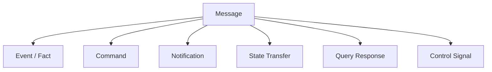
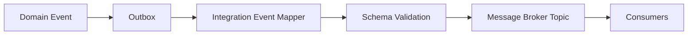
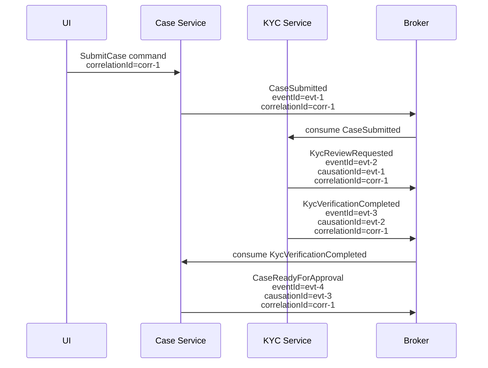
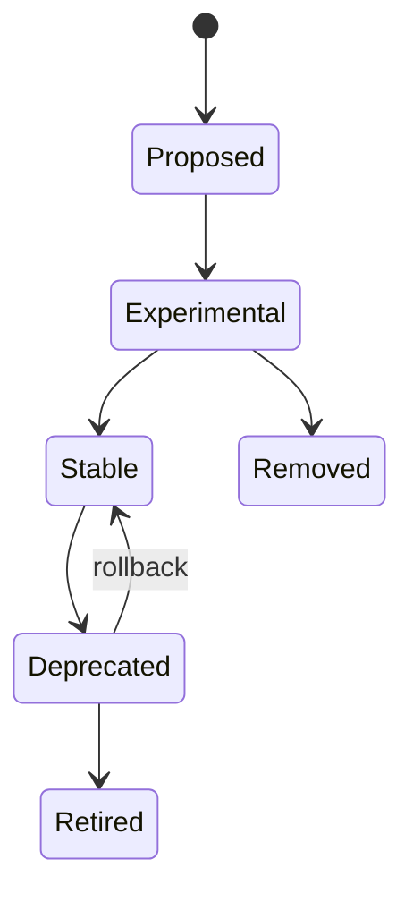
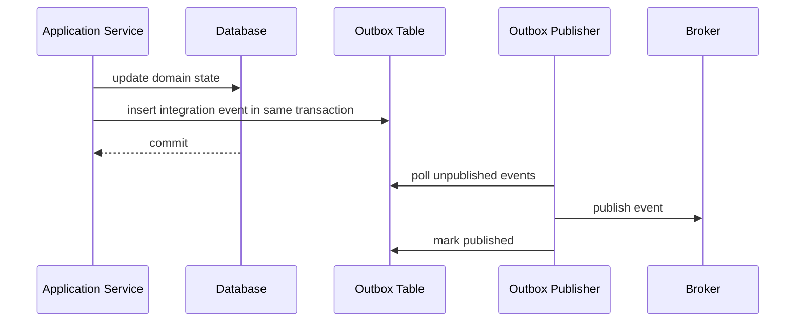

# Part 013 — Event Contract Mental Model: Facts, Commands, Notifications, and State Transfer

## Tujuan Pembelajaran

Pada part sebelumnya kita menyelesaikan lapisan utama HTTP API contract engineering: request/response, error, versioning, OpenAPI Java integration, client SDK, dan contract testing. Sekarang kita masuk ke event contract engineering.

Masalah umum engineer menengah adalah menganggap event contract sama dengan payload schema:

```text
event contract = JSON/Avro/Protobuf schema
```

Itu terlalu dangkal.

Dalam sistem produksi, event contract mencakup:

1. makna domain dari sesuatu yang terjadi;
2. siapa yang menyatakan fakta itu;
3. kapan fakta itu terjadi;
4. apa identity event tersebut;
5. apa entity/agregat yang dipengaruhi;
6. apa relasi kausal dengan command/event lain;
7. apakah event bisa direplay;
8. apakah consumer boleh mengambil keputusan dari event;
9. apakah event bersifat immutable;
10. bagaimana event berevolusi tanpa merusak consumer;
11. bagaimana ordering, idempotency, dan deduplication ditangani;
12. bagaimana event diamati, diaudit, dan di-govern.

Setelah part ini, kamu harus mampu:

- membedakan event, command, notification, message, dan state transfer;
- mendesain event sebagai domain fact, bukan remote procedure call tersembunyi;
- menentukan kapan payload harus fact-oriented, state-oriented, atau notification-oriented;
- memahami event identity, aggregate identity, causation ID, correlation ID, trace ID;
- membedakan event time, publish time, processing time, dan ingestion time;
- menganalisis compatibility event dari sisi semantic, bukan hanya schema;
- menghindari anti-pattern event-driven architecture yang membuat sistem rapuh.

---

## 1. Kaufman Skill Slice

Skill utama part ini:

> “Mampu mendesain event contract yang bisa dipakai banyak consumer tanpa membuat coupling tersembunyi, semantic ambiguity, atau distributed workflow chaos.”

Sub-skill:

| Sub-skill | Output praktis |
|---|---|
| Event classification | Bisa membedakan fact, command, notification, state transfer |
| Naming discipline | Event name merepresentasikan domain fact, bukan implementation action |
| Identity model | Event ID, aggregate ID, entity ID, correlation ID, causation ID jelas |
| Time model | occurredAt, publishedAt, processedAt tidak tercampur |
| Semantic boundary | Payload tidak membocorkan internal transaction/domain object sembarangan |
| Consumer reasoning | Bisa menjelaskan apa yang boleh diasumsikan consumer dari event |
| Evolution reasoning | Bisa menambah/mengubah event tanpa merusak consumer lama |
| Failure reasoning | Bisa menangani duplicate, out-of-order, replay, dan late events |
| Governance | Event punya owner, lifecycle, schema, compatibility rule, dan review discipline |

Latihan terbaik bukan membuat event sebanyak mungkin. Latihan terbaik adalah mengambil satu workflow dan bertanya:

> “Apa fakta domain yang benar-benar terjadi, siapa yang berhak menyatakannya, dan consumer boleh menyimpulkan apa dari fakta ini?”

---

## 2. Event Is Not Just a Message

Message adalah unit transport. Event adalah makna.

```text
Message = sesuatu yang dikirim melalui broker/queue/topic.
Event = fakta yang sudah terjadi dalam domain.
```

Sebuah message bisa berisi:

1. event;
2. command;
3. query request;
4. query response;
5. notification;
6. state snapshot;
7. document transfer;
8. heartbeat;
9. control signal;
10. tombstone.

Jangan semua disebut event hanya karena lewat Kafka.



Jika klasifikasi salah, contract akan salah.

Contoh:

```json
{
  "type": "SEND_EMAIL",
  "customerId": "cus_123"
}
```

Ini bukan event. Ini command/task.

Event yang benar:

```json
{
  "type": "CustomerEmailVerificationRequested",
  "customerId": "cus_123"
}
```

Atau jika email sudah dikirim:

```json
{
  "type": "CustomerEmailVerificationEmailSent",
  "customerId": "cus_123",
  "emailChannel": "PRIMARY"
}
```

Makna berbeda. Consumer behavior berbeda.

---

## 3. Event as Fact

Event harus merepresentasikan sesuatu yang sudah terjadi.

```text
CustomerRegistered
PaymentAuthorized
CaseSubmitted
AccountFrozen
KycVerificationRejected
ShipmentDispatched
PolicyRuleActivated
```

Event fact memiliki properties:

1. past tense;
2. immutable;
3. emitted by authority;
4. can be stored as history;
5. can be replayed;
6. can be interpreted without asking producer internal state;
7. can be used by multiple consumers for different reasons.

### 3.1 Good Event Name

```text
CustomerRegistered
CaseApproved
PaymentCaptured
AccountSuspended
KycReviewCompleted
EvidenceAttachedToCase
```

### 3.2 Bad Event Name

```text
ProcessCustomer
UpdateDatabase
SendToCRM
DoKyc
CallRiskService
CustomerEvent
StatusChanged
DataChanged
```

Kenapa buruk?

| Name | Problem |
|---|---|
| `ProcessCustomer` | command/procedure |
| `UpdateDatabase` | implementation detail |
| `SendToCRM` | consumer-specific |
| `DoKyc` | command |
| `CustomerEvent` | terlalu generik |
| `StatusChanged` | status apa, dari apa ke apa, meaning apa? |
| `DataChanged` | tidak memberi domain semantics |

Event name adalah contract. Nama generik membuat consumer harus membaca payload dan menebak.

---

## 4. Command vs Event

Command meminta sesuatu terjadi. Event menyatakan sesuatu sudah terjadi.

| Dimension | Command | Event |
|---|---|---|
| Tense | imperative/future | past |
| Coupling | targeted receiver | broadcast/fan-out possible |
| Ownership | requester asks | authority declares |
| Mutability | can be rejected | happened already |
| Consumer behavior | perform action | react/derive/update |
| Example | `ApproveCase` | `CaseApproved` |
| Failure | command can fail | event should not be “unhappened” |
| Routing | usually specific handler | many consumers |

### 4.1 Command Example

```json
{
  "commandId": "cmd_01J2X41XAZMQWR61PZ0TBP87GV",
  "type": "ApproveCase",
  "caseId": "case_01J2X420G91GR8ZJH0ZDR2PKQJ",
  "requestedBy": "usr_01J2X42KFTZQ6A2XQD2E7YNDYK",
  "reasonCode": "EVIDENCE_COMPLETE"
}
```

### 4.2 Event Example

```json
{
  "eventId": "evt_01J2X45B2M7G3G4WKEXZSM6D7E",
  "type": "CaseApproved",
  "caseId": "case_01J2X420G91GR8ZJH0ZDR2PKQJ",
  "approvedBy": "usr_01J2X42KFTZQ6A2XQD2E7YNDYK",
  "approvedAt": "2026-06-29T03:00:00Z",
  "reasonCode": "EVIDENCE_COMPLETE"
}
```

### 4.3 Wrong Use: Event as Command

Bad:

```json
{
  "eventType": "GenerateInvoice",
  "orderId": "ord_123"
}
```

This asks some service to act. It should be command/task.

Better:

```json
{
  "commandType": "GenerateInvoice",
  "orderId": "ord_123"
}
```

or fact event:

```json
{
  "eventType": "OrderReadyForInvoicing",
  "orderId": "ord_123"
}
```

Then invoice service reacts.

---

## 5. Notification vs Event

Notification says “look over there” or “something relevant happened”, often with minimal detail.

Event says “this fact happened” and should carry enough stable semantics.

### 5.1 Notification

```json
{
  "notificationId": "ntf_123",
  "type": "CustomerChanged",
  "customerId": "cus_123",
  "resourceUrl": "/customers/cus_123"
}
```

Consumer likely calls API to fetch current state.

### 5.2 Event

```json
{
  "eventId": "evt_123",
  "type": "CustomerLifecycleStatusChanged",
  "customerId": "cus_123",
  "previousLifecycleStatus": "PENDING_REVIEW",
  "newLifecycleStatus": "ACTIVE",
  "changedAt": "2026-06-29T03:00:00Z",
  "reasonCode": "KYC_VERIFIED"
}
```

Consumer can update projection without immediate API call.

### 5.3 Trade-off

| Approach | Pros | Cons |
|---|---|---|
| Notification | small, low schema coupling, current state fetched | extra API calls, race conditions, provider load |
| Rich event | autonomous consumers, replay-friendly, lower API dependency | schema ownership, compatibility burden |
| State transfer | projection building easy | larger payload, privacy/data governance burden |
| Minimal event | less leakage | consumer may need provider call |

Decision:

- If consumers need to build projections, event needs enough data.
- If data is sensitive or changes rapidly, notification + fetch may be safer.
- If strong audit/replay is needed, event should be fact-rich.
- If consumer-specific data needs vary widely, avoid stuffing everything into one event.

---

## 6. State Transfer Event vs Domain Event

### 6.1 Domain Event

Domain event focuses on what happened.

```json
{
  "type": "CustomerEmailChanged",
  "customerId": "cus_123",
  "previousEmailAddress": "old@example.com",
  "newEmailAddress": "new@example.com",
  "changedAt": "2026-06-29T03:10:00Z"
}
```

Good for workflow/audit/reaction.

### 6.2 State Transfer Event

State transfer event sends current state snapshot.

```json
{
  "type": "CustomerSnapshotUpdated",
  "customerId": "cus_123",
  "snapshotVersion": 42,
  "customer": {
    "displayName": "Ayu Lestari",
    "lifecycleStatus": "ACTIVE",
    "kycStatus": "VERIFIED",
    "emailAddress": "new@example.com"
  }
}
```

Good for projection replication/search/read models.

### 6.3 Difference

| Dimension | Domain Event | State Transfer |
|---|---|---|
| Meaning | Something happened | Current state is X |
| Size | usually smaller | usually larger |
| Replay | reconstruct history | reconstruct latest projection |
| Consumer logic | reacts to facts | updates local view |
| Ordering sensitivity | high for same aggregate | high but version helps |
| Privacy risk | selective | higher |
| Compatibility | event-type-specific | snapshot schema evolves |
| Example | `CaseApproved` | `CaseSnapshotUpdated` |

### 6.4 Hybrid Event

Sometimes useful:

```json
{
  "type": "CustomerLifecycleStatusChanged",
  "customerId": "cus_123",
  "previousLifecycleStatus": "PENDING_REVIEW",
  "newLifecycleStatus": "ACTIVE",
  "customerVersion": 42,
  "customerSnapshot": {
    "displayName": "Ayu Lestari",
    "lifecycleStatus": "ACTIVE",
    "kycStatus": "VERIFIED"
  }
}
```

Trade-off: easy for consumers but heavier and more coupled.

Rule:

> Do not mix domain event and snapshot blindly. Make the contract explicit about whether payload is fact, state, or both.

---

## 7. Integration Event vs Internal Domain Event

Internal domain event:

```java
public record CustomerVerified(
    CustomerId customerId,
    VerificationDecision decision,
    Instant occurredAt
) {}
```

Integration event:

```json
{
  "eventId": "evt_01J2X5GV4SKVW9ED5JFK4V45WA",
  "eventType": "CustomerKycVerified",
  "customerId": "cus_01J2X5J6SY9DGYD0B95WRNXZ2E",
  "verifiedAt": "2026-06-29T03:20:00Z",
  "verificationLevel": "STANDARD"
}
```

Do not publish internal domain event class directly.

Reasons:

1. internal model changes faster;
2. internal value objects may leak implementation;
3. internal event may contain sensitive fields;
4. internal naming may not be consumer-facing;
5. internal event may not include integration metadata;
6. integration event needs compatibility lifecycle;
7. internal event may be too granular or too broad.

Pattern:



Mapper is a contract boundary.

---

## 8. Event Authority

An event must have an authority: the system that is allowed to state that fact.

Examples:

| Event | Authority |
|---|---|
| `CustomerRegistered` | Customer service |
| `PaymentAuthorized` | Payment service/provider adapter |
| `CaseApproved` | Case management service |
| `KycVerificationCompleted` | KYC service |
| `AccountFrozen` | Account service |
| `PolicyRulePublished` | Policy/rules service |

Anti-pattern:

```text
CRM service emits PaymentAuthorized
```

Unless CRM is truly the payment authority, this is wrong.

Why authority matters:

1. consumer trust;
2. conflict resolution;
3. data ownership;
4. audit;
5. replay correctness;
6. governance approval;
7. lineage.

If two services can emit the same event type, contract must define authority and dedup/conflict semantics explicitly.

---

## 9. Event Identity

Every integration event should have stable identity.

```json
{
  "eventId": "evt_01J2X6RKHNQME8YGR5K5BA12H4"
}
```

Event ID is not always the same as:

| ID | Meaning |
|---|---|
| `eventId` | unique event occurrence |
| `aggregateId` | entity/aggregate whose state changed |
| `commandId` | command that caused event |
| `correlationId` | end-to-end business/process correlation |
| `causationId` | immediate parent event/command |
| `traceId` | distributed tracing technical correlation |
| `messageId` | broker/message system ID |
| `schemaId` | schema registry artifact/version ID |

### 9.1 Example

```json
{
  "eventId": "evt_01J2X6RKHNQME8YGR5K5BA12H4",
  "eventType": "CaseApproved",
  "aggregateType": "Case",
  "aggregateId": "case_01J2X6VD7MWK23YWGQ5KTV8DGY",
  "commandId": "cmd_01J2X6WBHQ4T428WHM4EFSCKS2",
  "correlationId": "corr_01J2X6XJH5Y8KX674M4CY5BSYX",
  "causationId": "evt_01J2X6Z6X0R2F7H2Y8VDACDJ21",
  "traceId": "4bf92f3577b34da6a3ce929d0e0e4736"
}
```

### 9.2 Event ID Requirements

Event ID should be:

1. globally unique or unique within event stream;
2. immutable;
3. stable across retry/publish retry;
4. included in logs/metrics/traces;
5. used for idempotent consumer deduplication;
6. not derived from payload hash unless policy clear;
7. not broker offset alone if replay/migration across topics is possible.

---

## 10. Aggregate Identity

For stateful domain systems, event usually relates to an aggregate.

```json
{
  "aggregateType": "Case",
  "aggregateId": "case_01J2X6VD7MWK23YWGQ5KTV8DGY",
  "aggregateVersion": 17
}
```

Why important?

1. ordering per aggregate;
2. optimistic projection updates;
3. replay;
4. idempotency;
5. deduplication;
6. audit history;
7. consumer partitioning;
8. state machine validation.

### 10.1 Aggregate Version

`aggregateVersion` or `sequenceNumber` helps detect missing/out-of-order events.

Example:

```json
{
  "eventType": "CaseApproved",
  "caseId": "case_123",
  "caseVersion": 17
}
```

Consumer projection:

```java
if (event.caseVersion() <= projection.version()) {
    return; // duplicate or old event
}

if (event.caseVersion() != projection.version() + 1) {
    quarantine(event); // missing event or out-of-order
}
```

This is critical for strict projections.

---

## 11. Correlation vs Causation vs Trace

These are often confused.

### 11.1 Correlation ID

Groups work belonging to same business/process flow.

Example:

```text
customer onboarding flow
```

Many commands/events share one `correlationId`.

### 11.2 Causation ID

Points to immediate cause.

Example:

```text
KycVerificationCompleted caused CustomerActivated
```

`causationId` may be event ID or command ID.

### 11.3 Trace ID

Technical distributed trace ID used by observability systems.

May cross HTTP calls and message processing.

### 11.4 Diagram



### 11.5 Contract Rule

- Use `correlationId` for journey/process.
- Use `causationId` for immediate parent.
- Use `traceId` for distributed tracing.
- Do not make one field serve all three roles.

---

## 12. Time Semantics

Event time fields must be explicit.

| Field | Meaning |
|---|---|
| `occurredAt` | business fact happened |
| `decidedAt` | decision was made |
| `effectiveAt` | state/rule becomes effective |
| `publishedAt` | producer published event |
| `receivedAt` | broker/gateway received event |
| `processedAt` | consumer processed event |
| `ingestedAt` | data platform ingested event |
| `recordedAt` | event persisted in outbox/event store |

### 12.1 Example

```json
{
  "eventType": "PolicyRuleActivated",
  "occurredAt": "2026-06-29T03:30:00Z",
  "effectiveAt": "2026-07-01T00:00:00Z",
  "publishedAt": "2026-06-29T03:30:02Z"
}
```

Do not collapse all into `timestamp`.

### 12.2 Late Events

If event arrives late:

```text
occurredAt = 10:00
publishedAt = 10:30
processedAt = 10:31
```

Consumer must know whether to process based on occurrence time or processing time.

Examples:

| Use case | Time basis |
|---|---|
| audit history | occurredAt |
| SLA of broker | publishedAt/receivedAt |
| projection freshness | processedAt |
| regulatory effective rule | effectiveAt |
| workflow timeout | occurredAt or command acceptedAt depending contract |

---

## 13. Event Immutability

Event should not be updated after publication.

If correction is needed, publish compensating/correction event.

Bad:

```text
Update old event payload in topic/storage
```

Better:

```text
CustomerEmailChanged
CustomerEmailChangeCorrected
```

or:

```text
CaseApprovalRevoked
```

depending domain meaning.

Why immutability matters:

1. replay determinism;
2. audit;
3. consumer idempotency;
4. lineage;
5. legal/regulatory evidence;
6. debugging;
7. event store correctness.

### 13.1 Correction Event Example

```json
{
  "eventType": "CustomerBirthDateCorrectionApplied",
  "customerId": "cus_123",
  "previousBirthDate": "1994-05-18",
  "correctedBirthDate": "1994-05-19",
  "correctionReason": "DOCUMENT_REVIEW",
  "correctedAt": "2026-06-29T03:40:00Z",
  "correctedBy": "usr_123"
}
```

This is explicit and auditable.

---

## 14. Event Granularity

Granularity choices:

### 14.1 Coarse Event

```text
CustomerUpdated
```

Pros:

- fewer event types;
- easier producer management.

Cons:

- consumer must inspect fields;
- unclear semantics;
- hard to route;
- hard to test;
- high coupling;
- schema grows.

### 14.2 Fine-Grained Event

```text
CustomerEmailChanged
CustomerPhoneNumberChanged
CustomerKycStatusChanged
CustomerLifecycleStatusChanged
```

Pros:

- explicit semantics;
- easier consumer filtering;
- clearer compatibility;
- better audit.

Cons:

- more event types;
- higher governance overhead;
- risk of event explosion.

### 14.3 Decision

Use domain significance, not field-level reflex.

Good event type if:

1. consumer actions differ;
2. audit meaning differs;
3. business rule differs;
4. lifecycle differs;
5. security/data classification differs;
6. ordering/replay semantics differ.

Do not create event type for every column update unless each has domain meaning.

---

## 15. Event Naming Pattern

Recommended:

```text
<Noun><PastTenseVerb>
```

Examples:

```text
CustomerRegistered
CustomerActivated
CaseSubmitted
CaseApproved
PaymentAuthorized
PaymentCaptured
AccountFrozen
PolicyRulePublished
EvidenceAttached
```

Sometimes:

```text
<Noun><State>Changed
```

Examples:

```text
CustomerLifecycleStatusChanged
CaseAssignmentChanged
AccountLimitChanged
```

But “changed” must include previous/new state or reason.

Bad:

```text
CustomerChanged
StatusChanged
UpdateHappened
NotificationEvent
```

### 15.1 Include Domain Scope

If `Approved` can refer to many domains:

```text
CaseApproved
LoanApplicationApproved
PaymentApproved
PolicyExceptionApproved
```

Avoid global ambiguous event names.

---

## 16. Payload Design: Minimal but Sufficient

Event payload must be enough for intended consumer classes.

Too little:

```json
{
  "eventType": "CustomerActivated",
  "customerId": "cus_123"
}
```

Consumer must call API, causing coupling and race.

Too much:

```json
{
  "eventType": "CustomerActivated",
  "customer": {
    "...": "entire customer entity with sensitive fields"
  }
}
```

Privacy and schema coupling.

Balanced:

```json
{
  "eventType": "CustomerActivated",
  "customerId": "cus_123",
  "previousLifecycleStatus": "PENDING_REVIEW",
  "newLifecycleStatus": "ACTIVE",
  "activatedAt": "2026-06-29T03:50:00Z",
  "activationReason": "KYC_VERIFIED"
}
```

Decision checklist:

1. What will common consumers do?
2. Can they act without API call?
3. Is data sensitive?
4. Is field stable?
5. Is it authoritative?
6. Is it needed for replay?
7. Can it be derived safely by consumer?
8. Is it consumer-specific?
9. Does it create privacy/data minimization problem?
10. Is it part of long-term contract?

---

## 17. Event Ordering

Event contract must define ordering assumptions.

Possible guarantees:

| Level | Meaning |
|---|---|
| None | consumers must handle arbitrary order |
| Per topic partition | broker-specific partition order |
| Per aggregate | events for same aggregate ordered |
| Global order | rarely practical |
| Sequence-number based | consumer can detect gaps |
| Version-based | aggregateVersion increments |

Example contract:

```yaml
ordering:
  guarantee: per-aggregate
  partitionKey: caseId
  sequenceField: caseVersion
  duplicateDelivery: possible
  outOfOrderAcrossAggregates: allowed
```

Do not imply global ordering unless you can provide it.

### 17.1 Out-of-Order Example

Events:

```text
CaseApproved version=5
CaseSubmitted version=4
```

Consumer receives approved first. What should happen?

Options:

1. buffer/quarantine;
2. fetch current state;
3. apply last-write-wins if state transfer;
4. ignore old event if version lower;
5. fail and alert;
6. process if operation commutative.

Contract must guide this.

---

## 18. Duplicate Delivery

Most distributed messaging systems require consumers to tolerate duplicates.

Event contract should include stable event ID.

Consumer pattern:

```java
public void handle(CaseApprovedEvent event) {
    if (processedEventRepository.exists(event.eventId())) {
        return;
    }

    process(event);
    processedEventRepository.markProcessed(event.eventId());
}
```

But dedup storage has trade-offs:

1. retention duration;
2. storage size;
3. transactional boundary;
4. consumer group specific;
5. replay semantics.

Event ID is necessary but not sufficient. Consumer must define dedup strategy.

---

## 19. Replay Semantics

Can old events be replayed?

Contract should specify:

| Question | Why it matters |
|---|---|
| Is replay supported? | consumer projection rebuild |
| Are events immutable? | replay determinism |
| Are schemas still readable? | compatibility |
| Are old events semantically valid? | business rule drift |
| Are tombstones included? | deletion handling |
| Are corrections represented? | audit |
| Are side-effect consumers protected? | avoid sending emails again |

### 19.1 Replay-Safe vs Side-Effect Consumer

Projection consumer:

```text
safe to replay
```

Email sender:

```text
not replay-safe unless idempotent by eventId/business key
```

Contract should warn:

```yaml
replay:
  supported: true
  consumerRequirement: Consumers causing external side effects must deduplicate by eventId.
```

---

## 20. Event Compatibility

Schema compatibility is not enough.

### 20.1 Structurally Compatible but Semantically Breaking

Old event:

```json
{
  "eventType": "CustomerActivated",
  "customerId": "cus_123"
}
```

Meaning old:

```text
customer may transact
```

Meaning new:

```text
customer profile activated, but transaction access may still be blocked
```

Schema unchanged. Consumers break.

### 20.2 Safe Event Evolution

Usually safe:

1. add optional field;
2. add metadata field;
3. add new event type;
4. add optional nested object;
5. widen field constraint;
6. add reasonCode if optional;
7. add new consumer-independent header.

Dangerous:

1. add enum value;
2. make optional field required;
3. change event meaning;
4. change ordering key;
5. change partition key;
6. change event authority;
7. change replay behavior;
8. change time semantics;
9. change id format;
10. change null/absent semantics;
11. change topic.

Breaking:

1. remove field;
2. rename field;
3. change type;
4. change event type name;
5. change key field;
6. change payload from fact to snapshot without compatibility;
7. stop publishing event;
8. publish event from different authority without migration.

---

## 21. Event Type Lifecycle



### 21.1 Proposed

Design only.

### 21.2 Experimental

Limited consumer. Must have scope and expiry.

### 21.3 Stable

Public integration event. Requires compatibility discipline.

### 21.4 Deprecated

Still published but new consumers should avoid.

### 21.5 Retired

No longer published. Requires migration and consumer inventory.

Event retirement is often harder than API endpoint retirement because consumers may be passive and less visible.

---

## 22. Event Consumer Contract

A good event contract should say what consumers may assume.

Example:

```yaml
eventType: CaseApproved
consumerAssumptions:
  - The case existed before this event.
  - The case state transitioned to APPROVED.
  - The approving actor had required authority at decision time.
  - The event is immutable.
  - Duplicate delivery is possible.
  - Ordering is guaranteed per caseId when consumed from the case-events topic with key=caseId.
  - Consumers must tolerate unknown optional fields.
  - Consumers must not assume global ordering across cases.
```

This is more valuable than schema alone.

---

## 23. Event Producer Contract

Producer promises:

1. event is emitted after durable state change;
2. event ID stable across publish retries;
3. event type name stable;
4. schema registered before publish;
5. event key follows contract;
6. event ordering follows contract;
7. event does not include forbidden sensitive data;
8. event timestamp semantics correct;
9. event is published at-least-once or exactly-once depending stated guarantee;
10. deprecation policy followed.

### 23.1 Outbox Pattern Context

Typical reliable publish:



This reduces risk of state change without event or event without state change.

---

## 24. Event Consumer Responsibility

Consumer must not assume exactly-once processing unless contract explicitly gives it and implementation actually supports it.

Consumer responsibilities:

1. idempotent processing;
2. duplicate tolerance;
3. out-of-order handling;
4. schema compatibility;
5. unknown field tolerance;
6. unknown enum strategy;
7. DLQ/quarantine;
8. backpressure handling;
9. replay safety;
10. observability;
11. poison message strategy;
12. version migration.

Event-driven architecture shifts responsibility to both producer and consumer.

---

## 25. Event Contract Documentation Template

```yaml
eventType: CaseApproved
description: A case has been approved by an authorized actor.
ownerTeam: case-management-platform
authority: case-service
lifecycle: stable
topic: case-events
messageKey: caseId
ordering:
  guarantee: per-case
  sequenceField: caseVersion
delivery:
  guarantee: at-least-once
  duplicates: possible
replay:
  supported: true
  sideEffectWarning: Consumers must deduplicate external side effects by eventId.
schema:
  format: avro
  subject: case.CaseApproved
compatibility:
  mode: backward-transitive
identity:
  eventId: globally unique event occurrence
  aggregateId: caseId
  aggregateVersion: caseVersion
time:
  occurredAt: approval decision time
  publishedAt: broker publish time
consumerAssumptions:
  - Case state is APPROVED after this event.
  - Approval may be reversed only by a later CaseApprovalRevoked event.
security:
  dataClassification: confidential
  containsPII: false
```

This is the level of documentation expected in mature platform teams.

---

## 26. Java Event Type Modelling

### 26.1 Internal Domain Event

```java
public record CaseApprovedDomainEvent(
    CaseId caseId,
    CaseVersion caseVersion,
    UserId approvedBy,
    ApprovalReason reason,
    Instant approvedAt
) {}
```

### 26.2 Integration Event

```java
public record CaseApprovedEvent(
    String eventId,
    String eventType,
    String aggregateType,
    String aggregateId,
    long aggregateVersion,
    String correlationId,
    String causationId,
    Instant occurredAt,
    Instant publishedAt,
    Payload payload
) {
    public record Payload(
        String caseId,
        long caseVersion,
        String approvedBy,
        String reasonCode,
        Instant approvedAt
    ) {}
}
```

### 26.3 Mapper

```java
public final class CaseEventMapper {
    public CaseApprovedEvent toIntegrationEvent(
        CaseApprovedDomainEvent domainEvent,
        EventContext context
    ) {
        Instant now = context.clock().instant();

        return new CaseApprovedEvent(
            context.eventId(),
            "CaseApproved",
            "Case",
            domainEvent.caseId().value(),
            domainEvent.caseVersion().value(),
            context.correlationId(),
            context.causationId(),
            domainEvent.approvedAt(),
            now,
            new CaseApprovedEvent.Payload(
                domainEvent.caseId().value(),
                domainEvent.caseVersion().value(),
                domainEvent.approvedBy().value(),
                domainEvent.reason().code(),
                domainEvent.approvedAt()
            )
        );
    }
}
```

Note:

- integration event has metadata;
- payload has domain data;
- internal value objects mapped to stable external strings;
- no entity leakage.

---

## 27. Event Contract Review Checklist

### 27.1 Classification

- Is this truly an event/fact?
- Is it actually a command?
- Is it notification or state transfer?
- Is the event name past tense and domain-specific?
- Is authority clear?

### 27.2 Semantics

- What exactly happened?
- What may consumer assume?
- What should consumer not assume?
- Is event immutable?
- Is correction/compensation model clear?
- Is state transition clear?

### 27.3 Identity and Time

- Is eventId present?
- Is aggregateId present if relevant?
- Is aggregateVersion/sequence present?
- Are correlationId and causationId clear?
- Are occurredAt/publishedAt semantics clear?

### 27.4 Delivery and Ordering

- Is delivery guarantee stated?
- Are duplicates possible?
- Is ordering guarantee stated?
- Is partition/message key stated?
- Is replay supported?
- Are side-effect consumer warnings documented?

### 27.5 Schema and Payload

- Does payload include enough stable data?
- Does it avoid internal model leakage?
- Does it avoid sensitive data?
- Are enum evolution rules clear?
- Are nullable/optional semantics clear?
- Is schema registered/governed?

### 27.6 Compatibility

- Is adding this event type safe for consumers?
- Does it replace/deprecate another event?
- Are existing consumers impacted?
- Is topic/key changing?
- Is semantic meaning stable?

---

## 28. Event Anti-Patterns

### 28.1 Event as RPC

```text
UserCreated event consumed only by one service to perform required synchronous action
```

If producer depends on immediate consumer success, it may be command/RPC, not event.

### 28.2 Generic DataChanged Event

```json
{
  "eventType": "DataChanged",
  "table": "customer",
  "id": "123"
}
```

This leaks database thinking and lacks domain semantics.

### 28.3 Consumer-Specific Event

```text
SendCustomerToCRM
```

This couples producer to one consumer. Prefer domain fact and let CRM consume.

### 28.4 Entity Dump Event

Publishing entire database entity.

Problems:

1. privacy leakage;
2. internal coupling;
3. schema instability;
4. consumer misuse;
5. unnecessary size.

### 28.5 No Event ID

Consumers cannot deduplicate.

### 28.6 Timestamp Ambiguity

Field `timestamp` without meaning.

### 28.7 No Ordering Contract

Consumers assume ordering that producer never promised.

### 28.8 Reusing Event Type with New Meaning

Silent semantic break.

### 28.9 Publishing Before Commit

Consumer sees fact that might roll back.

### 28.10 Side Effects on Replay

Consumer sends duplicate emails/payments during replay.

---

## 29. Practice Lab

### Lab 1 — Classify Messages

Classify as event, command, notification, or state transfer:

1. `ApproveCase`
2. `CaseApproved`
3. `CustomerChanged`
4. `CustomerSnapshotUpdated`
5. `SendWelcomeEmail`
6. `PaymentAuthorizationRequested`
7. `PaymentAuthorized`
8. `PolicyRuleActivated`
9. `RefreshCustomerProjection`
10. `DocumentUploaded`

For each, explain whether name/payload should change.

### Lab 2 — Design Event Contract

Workflow:

```text
A case is submitted, reviewed, approved, possibly reopened.
```

Design event types with:

1. event name;
2. authority;
3. aggregate ID;
4. version;
5. occurredAt;
6. causation/correlation;
7. payload fields;
8. consumer assumptions.

### Lab 3 — Fix Bad Event

Input:

```json
{
  "eventType": "CustomerUpdated",
  "id": 123,
  "status": "A",
  "timestamp": "2026-06-29T10:00:00"
}
```

Refactor into a proper event contract.

### Lab 4 — Ordering Strategy

Given events:

```text
CaseSubmitted version=3
CaseApproved version=5
CaseAssigned version=4
```

Design consumer handling for:

1. strict projection;
2. notification-only consumer;
3. audit log consumer.

### Lab 5 — Replay Safety

Consumer sends SMS when `CustomerRegistered` is received. Design idempotency/replay protection.

---

## 30. Senior Engineer Heuristics

1. **Event is a fact, not a function call.**
2. **Message transport does not define event semantics.**
3. **Past-tense naming prevents many design mistakes.**
4. **Authority matters: only the owner of a fact should publish it.**
5. **Event ID is mandatory for serious integration events.**
6. **Correlation, causation, and trace are different things.**
7. **`timestamp` is not enough; name the time semantics.**
8. **Domain event and integration event should not be the same object by default.**
9. **Generic `Changed` events are usually design debt.**
10. **Snapshot events and domain events solve different problems.**
11. **Replay is a contract, not just broker capability.**
12. **Consumers must be idempotent unless impossibility is explicitly guaranteed.**
13. **Semantic compatibility matters more than schema compatibility.**
14. **A good event tells consumers what they may assume.**
15. **If an event has only one required consumer and producer depends on it immediately, question whether it is really an event.**

---

## 31. Summary

Event contract engineering starts with mental model, not schema. An event is a domain fact declared by an authority. A message can carry an event, command, notification, or state transfer, and each has different contract semantics.

Main takeaways:

1. event is not the same as message;
2. event should represent something that already happened;
3. command asks for action, event declares fact;
4. notification points to change, rich event carries fact;
5. state transfer event carries current projection state;
6. internal domain events should be mapped to stable integration events;
7. event identity, aggregate identity, correlation, causation, and trace must be separated;
8. time fields need explicit meaning;
9. ordering, duplicate delivery, and replay are part of contract;
10. semantic compatibility is more important than schema compatibility.

Part berikutnya membahas event envelope design: bagaimana metadata, payload, routing, idempotency, tracing, tenancy, classification, and schema versioning disusun menjadi envelope yang stabil dan governable.
