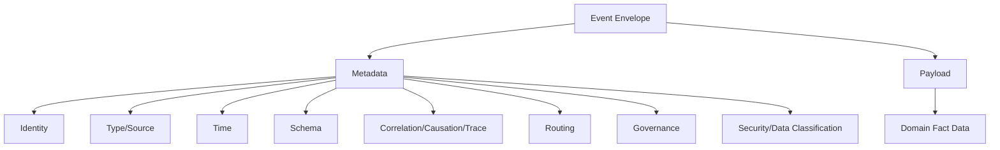
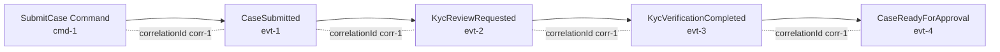

# Part 014 — Event Envelope Design: Metadata, Payload, Routing, Idempotency, and Observability

## Tujuan Pembelajaran

Pada part sebelumnya kita membangun mental model event sebagai domain fact. Sekarang kita masuk ke desain envelope.

Banyak tim hanya mendesain payload:

```json
{
  "customerId": "cus_123",
  "status": "ACTIVE"
}
```

Lalu metadata penting tersebar di:

- header Kafka;
- key Kafka;
- topic name;
- log context;
- database outbox;
- tracing system;
- schema registry;
- custom config;
- consumer assumptions.

Akibatnya event sulit di-debug, sulit di-govern, sulit direplay, dan sulit dipakai lintas tim.

Event envelope adalah struktur yang memisahkan **metadata kontrak** dari **payload domain**.

Setelah part ini, kamu harus mampu:

1. membedakan envelope metadata dan domain payload;
2. menentukan metadata wajib untuk event enterprise;
3. mendesain event ID, event type, source, subject, aggregate, schema, time, correlation, causation, trace;
4. menempatkan routing metadata tanpa mencampurnya dengan business data;
5. mendukung idempotency, deduplication, replay, tenancy, jurisdiction, dan data classification;
6. menyusun event envelope yang cocok untuk Kafka/AMQP/HTTP/webhook;
7. memahami CloudEvents-style thinking tanpa terjebak copy-paste;
8. mengimplementasikan envelope Java yang stabil dan type-safe;
9. menghindari envelope yang terlalu generic atau terlalu vendor-specific;
10. membuat governance policy untuk common event metadata.

---

## 1. Why Envelope Exists

Tanpa envelope, event sering terlihat seperti ini:

```json
{
  "customerId": "cus_123",
  "lifecycleStatus": "ACTIVE",
  "updatedAt": "2026-06-29T04:00:00Z"
}
```

Pertanyaan yang tidak terjawab:

1. Ini event type apa?
2. Siapa producer-nya?
3. Apakah `updatedAt` occurredAt atau publishedAt?
4. Event ID-nya apa?
5. Duplicate detection pakai apa?
6. Schema version berapa?
7. Aggregate version berapa?
8. Correlation ID apa?
9. Causation ID apa?
10. Topic/key apa?
11. Apakah event replay atau live?
12. Tenant/jurisdiction apa?
13. Apakah payload mengandung PII?
14. Apakah consumer boleh menyimpan field ini?
15. Apakah event berasal dari authority yang benar?

Envelope menjawab pertanyaan non-domain yang tetap menjadi bagian dari contract.

---

## 2. Envelope vs Payload



### 2.1 Metadata

Metadata explains the event as an integration artifact.

Examples:

```json
{
  "eventId": "evt_01J2X92M67ZP8VPKYB53PDC4M2",
  "eventType": "CaseApproved",
  "source": "case-service",
  "occurredAt": "2026-06-29T04:00:00Z",
  "schemaRef": "case.CaseApproved:3"
}
```

### 2.2 Payload

Payload explains the domain fact.

```json
{
  "caseId": "case_01J2X93KD2CVS6NQY5G9XKFM1P",
  "caseVersion": 17,
  "approvedBy": "usr_01J2X94ZSGC2BMB1TSVGTFXHZ2",
  "reasonCode": "EVIDENCE_COMPLETE"
}
```

Rule:

> Metadata should support transport, governance, identity, observability, and processing. Payload should express business fact.

---

## 3. Canonical Event Envelope

A practical enterprise envelope:

```json
{
  "metadata": {
    "eventId": "evt_01J2X92M67ZP8VPKYB53PDC4M2",
    "eventType": "CaseApproved",
    "eventVersion": "1.0",
    "source": "case-service",
    "subject": "case/case_01J2X93KD2CVS6NQY5G9XKFM1P",
    "aggregateType": "Case",
    "aggregateId": "case_01J2X93KD2CVS6NQY5G9XKFM1P",
    "aggregateVersion": 17,
    "occurredAt": "2026-06-29T04:00:00Z",
    "publishedAt": "2026-06-29T04:00:02Z",
    "correlationId": "corr_01J2X95S4Y1MQJ8ZF9DKC2Z6E8",
    "causationId": "cmd_01J2X96C3N93ESVB9ZGKMJZQZS",
    "traceId": "4bf92f3577b34da6a3ce929d0e0e4736",
    "schemaRef": "case.CaseApproved:1",
    "contentType": "application/json",
    "tenantId": "tenant_01J2X97RS8SPAQF9R0XJMWAEKA",
    "jurisdiction": "ID",
    "dataClassification": "CONFIDENTIAL",
    "pii": false
  },
  "payload": {
    "caseId": "case_01J2X93KD2CVS6NQY5G9XKFM1P",
    "caseVersion": 17,
    "approvedBy": "usr_01J2X94ZSGC2BMB1TSVGTFXHZ2",
    "approvedAt": "2026-06-29T04:00:00Z",
    "reasonCode": "EVIDENCE_COMPLETE"
  }
}
```

This is not the only possible shape. The key is explicit separation.

---

## 4. CloudEvents-Style Thinking

CloudEvents popularized a common event metadata vocabulary with attributes such as:

- `id`;
- `source`;
- `specversion`;
- `type`;
- `subject`;
- `time`;
- `datacontenttype`;
- `dataschema`;
- extension attributes.

A CloudEvents-like envelope may look like:

```json
{
  "specversion": "1.0",
  "id": "evt_01J2X92M67ZP8VPKYB53PDC4M2",
  "source": "/services/case-service",
  "type": "com.acme.case.CaseApproved",
  "subject": "case/case_01J2X93KD2CVS6NQY5G9XKFM1P",
  "time": "2026-06-29T04:00:00Z",
  "datacontenttype": "application/json",
  "dataschema": "schema://case.CaseApproved/1",
  "correlationid": "corr_01J2X95S4Y1MQJ8ZF9DKC2Z6E8",
  "causationid": "cmd_01J2X96C3N93ESVB9ZGKMJZQZS",
  "data": {
    "caseId": "case_01J2X93KD2CVS6NQY5G9XKFM1P",
    "caseVersion": 17,
    "approvedBy": "usr_01J2X94ZSGC2BMB1TSVGTFXHZ2",
    "reasonCode": "EVIDENCE_COMPLETE"
  }
}
```

Important:

1. You can adopt CloudEvents directly.
2. You can use CloudEvents-inspired metadata.
3. You can create your own envelope.
4. But do not create random inconsistent metadata per team.

The standardization benefit is less about exact names and more about shared semantics.

---

## 5. Required Metadata Categories

### 5.1 Identity

| Field | Purpose |
|---|---|
| `eventId` | unique event occurrence |
| `eventType` | stable event type |
| `eventVersion` | event contract/schema version if used |
| `source` | producer/authority |
| `subject` | resource/entity subject |
| `aggregateId` | domain aggregate identifier |
| `aggregateVersion` | sequence/version for ordering |

### 5.2 Time

| Field | Purpose |
|---|---|
| `occurredAt` | business event time |
| `publishedAt` | event publication time |
| `effectiveAt` | when fact/rule becomes effective |
| `expiresAt` | when fact/command relevance ends |

### 5.3 Causality and Observability

| Field | Purpose |
|---|---|
| `correlationId` | business/process correlation |
| `causationId` | immediate cause |
| `traceId` | distributed tracing |
| `spanId` | current span if needed |
| `requestId` | external request reference if event caused by API call |

### 5.4 Schema

| Field | Purpose |
|---|---|
| `schemaRef` | registry subject/artifact/version |
| `contentType` | payload media type |
| `schemaFormat` | JSON Schema/Avro/Protobuf |
| `compatibilityMode` | optional governance metadata |

### 5.5 Routing and Delivery

| Field | Purpose |
|---|---|
| `messageKey` | logical key used for partitioning/routing |
| `topic` | sometimes external metadata, not necessarily in payload |
| `partition` | broker-specific, usually not in business envelope |
| `retryCount` | delivery/processing retry count if framework-managed |
| `replay` | marker if event is replayed, if relevant |

### 5.6 Governance and Security

| Field | Purpose |
|---|---|
| `tenantId` | tenant boundary |
| `jurisdiction` | regulatory/legal scope |
| `dataClassification` | public/internal/confidential/restricted |
| `pii` | contains personally identifiable information |
| `retentionClass` | retention policy |
| `producerTeam` | ownership |
| `lifecycle` | experimental/stable/deprecated |

Not every event needs all fields in payload. But platform policy should define required fields by event class.

---

## 6. Minimal vs Rich Envelope

### 6.1 Minimal Envelope

```json
{
  "id": "evt_123",
  "type": "CaseApproved",
  "source": "case-service",
  "time": "2026-06-29T04:00:00Z",
  "data": {
    "caseId": "case_123"
  }
}
```

Good for:

- simple systems;
- low governance burden;
- notification events;
- early maturity.

### 6.2 Rich Envelope

```json
{
  "metadata": {
    "eventId": "evt_123",
    "eventType": "CaseApproved",
    "source": "case-service",
    "aggregateType": "Case",
    "aggregateId": "case_123",
    "aggregateVersion": 17,
    "occurredAt": "2026-06-29T04:00:00Z",
    "publishedAt": "2026-06-29T04:00:02Z",
    "correlationId": "corr_123",
    "causationId": "cmd_123",
    "schemaRef": "case.CaseApproved:1",
    "tenantId": "tenant_123",
    "jurisdiction": "ID",
    "dataClassification": "CONFIDENTIAL"
  },
  "payload": {
    "caseId": "case_123",
    "reasonCode": "EVIDENCE_COMPLETE"
  }
}
```

Good for:

- regulated environments;
- multi-tenant platforms;
- critical workflows;
- replay/projection;
- cross-team integration;
- enterprise governance.

Trade-off: verbosity and implementation discipline.

---

## 7. Metadata Placement: Payload vs Broker Headers

Kafka/AMQP/etc. often support message headers. Should metadata be in payload or headers?

### 7.1 Put in Envelope Payload

Pros:

1. self-contained event;
2. easier replay from storage/file;
3. schema-validatable;
4. works across transports;
5. easier data lake ingestion;
6. fewer hidden assumptions.

Cons:

1. larger payload;
2. metadata duplicated with broker headers;
3. consumers may parse full payload for routing.

### 7.2 Put in Broker Headers

Pros:

1. efficient routing/filtering;
2. avoids payload parsing for some middleware;
3. aligns with tracing header propagation;
4. can be transport-native.

Cons:

1. event not self-contained if headers lost;
2. schema registry may not validate headers;
3. data lake exports may miss headers;
4. cross-transport portability lower;
5. replay tooling must preserve headers.

### 7.3 Recommended Policy

Use both selectively:

| Metadata | Envelope body | Header |
|---|---:|---:|
| eventId | yes | optional |
| eventType | yes | yes |
| source | yes | optional |
| schemaRef/schemaId | yes | yes if registry requires |
| correlationId | yes | yes |
| traceparent | optional | yes |
| tenantId | yes | yes if routing/auth needed |
| dataClassification | yes | optional |
| retry count | no/optional | header/internal |
| broker partition/offset | no | broker metadata |

Rule:

> Critical event identity and governance metadata should survive outside broker-specific headers.

---

## 8. Event ID and Idempotency

### 8.1 Producer Event ID

Producer should generate event ID before publish retry.

Bad:

```text
new eventId generated each publish attempt
```

This causes duplicate logical event with different IDs.

Better:

```text
eventId generated when outbox record created
same eventId reused for publish retries
```

### 8.2 Consumer Deduplication

Consumer dedup key typically:

```text
consumerName + eventId
```

Example table:

```sql
CREATE TABLE processed_events (
    consumer_name VARCHAR(100) NOT NULL,
    event_id VARCHAR(100) NOT NULL,
    processed_at TIMESTAMP NOT NULL,
    PRIMARY KEY (consumer_name, event_id)
);
```

Java pseudo:

```java
@Transactional
public void handle(EventEnvelope<CaseApprovedPayload> event) {
    boolean firstTime = processedEventRepository.markIfNotProcessed(
        "case-projection-consumer",
        event.metadata().eventId()
    );

    if (!firstTime) {
        return;
    }

    projection.apply(event.payload());
}
```

Be careful with transactional boundary. Marking processed before side effect can lose processing if crash occurs. Marking after side effect can duplicate side effect. Choose based on idempotency of effect.

---

## 9. Event Type

Event type should be stable.

Possible styles:

```text
CaseApproved
case.approved
com.acme.case.CaseApproved
acme.case.case-approved.v1
```

Each has trade-offs.

| Style | Pros | Cons |
|---|---|---|
| `CaseApproved` | readable | possible global collision |
| `case.approved` | concise namespace | less Java-like |
| `com.acme.case.CaseApproved` | globally namespaced | verbose |
| `acme.case.case-approved.v1` | explicit | may mix version into name |

Recommended:

```text
com.acme.case.CaseApproved
```

or org-defined equivalent.

Rules:

1. stable;
2. domain-specific;
3. not consumer-specific;
4. not technology-specific;
5. not internal class name unless deliberately made public;
6. versioning strategy clear.

---

## 10. Source

`source` identifies producer authority.

Possible values:

```text
case-service
/services/case-service
urn:service:case-service
https://api.acme.com/services/case-service
```

Good source field should:

1. identify authority;
2. be stable across deployments;
3. not include pod/container instance;
4. not include environment unless needed;
5. map to service catalog;
6. be useful for lineage.

Bad:

```text
case-service-pod-7d9c8f6bcb-x1k2q
```

That is runtime instance, not source authority.

If runtime instance is needed, use separate technical metadata.

---

## 11. Subject

Subject identifies the primary entity/resource.

Examples:

```text
case/case_123
customer/cus_123
payment/pay_123
policy-rule/rule_123
```

Subject is useful when event type is broad or CloudEvents-like.

Subject should not replace payload fields if payload consumers need typed data.

Example:

```json
{
  "subject": "case/case_123",
  "payload": {
    "caseId": "case_123"
  }
}
```

Duplication is acceptable if it improves routing and payload clarity.

---

## 12. Aggregate Metadata

For stateful domain event:

```json
{
  "aggregateType": "Case",
  "aggregateId": "case_123",
  "aggregateVersion": 17
}
```

### 12.1 aggregateVersion vs eventVersion

Do not confuse:

| Field | Meaning |
|---|---|
| `aggregateVersion` | state version/sequence of aggregate |
| `eventVersion` | version of event contract/schema |
| `schemaVersion` | schema artifact version |
| `payloadVersion` | sometimes same as event/schema version |
| `messageVersion` | envelope format version |

Example:

```json
{
  "eventType": "CaseApproved",
  "eventVersion": "1.0",
  "aggregateVersion": 17
}
```

---

## 13. Schema Reference

Event must connect to schema registry/governance.

Possible:

```json
{
  "schemaRef": "case.CaseApproved:1"
}
```

or:

```json
{
  "dataschema": "https://schemas.acme.com/case/CaseApproved/1.0.0"
}
```

or registry ID in broker header.

### 13.1 What schemaRef should answer

1. Which schema validates this event?
2. Which format?
3. Which version/artifact?
4. Which compatibility rule?
5. Which owner?

Possible structure:

```json
{
  "schema": {
    "format": "AVRO",
    "artifactId": "case.CaseApproved",
    "version": "3",
    "globalId": "18492"
  }
}
```

Do not force all formats into one simplistic string if organization uses multiple schema technologies.

---

## 14. Content Type

`contentType` tells how payload is encoded.

Examples:

```text
application/json
application/avro
application/protobuf
application/cloudevents+json
```

For Kafka with Confluent/Apicurio serializers, content type may be implicit in serializer. Still, documentation should state it.

If envelope is JSON but payload is encoded separately, be explicit.

Most internal events choose one of:

1. JSON for readability and simple integrations;
2. Avro for compact schema-governed Kafka;
3. Protobuf for strongly typed multi-language/RPC-ish systems.

This series will cover Avro/Protobuf/JSON Schema in later parts.

---

## 15. Correlation and Causation Metadata

Metadata:

```json
{
  "correlationId": "corr_01J2X95S4Y1MQJ8ZF9DKC2Z6E8",
  "causationId": "cmd_01J2X96C3N93ESVB9ZGKMJZQZS"
}
```

Rules:

1. correlation ID should be propagated across whole business flow;
2. causation ID should point to immediate cause;
3. if caused by HTTP request, causation can be requestId/commandId;
4. if caused by event, causation can be eventId;
5. do not regenerate correlation ID at every service boundary;
6. if missing from upstream, create one and mark root.

### 15.1 Causality Chain



Every event has same correlationId, but different causationId.

---

## 16. Trace Context

Trace context is technical observability metadata.

Depending on organization:

```json
{
  "traceId": "4bf92f3577b34da6a3ce929d0e0e4736",
  "spanId": "00f067aa0ba902b7"
}
```

or W3C-style `traceparent` header:

```text
traceparent: 00-4bf92f3577b34da6a3ce929d0e0e4736-00f067aa0ba902b7-01
```

Recommended:

- put trace context in headers for tracing tools;
- optionally copy traceId/correlationId into envelope for data/audit search;
- avoid coupling business logic to trace ID.

Trace ID is not business correlation ID.

---

## 17. Tenant and Jurisdiction

For multi-tenant/regulatory systems, envelope often needs:

```json
{
  "tenantId": "tenant_123",
  "jurisdiction": "ID"
}
```

Why:

1. routing;
2. authorization;
3. data residency;
4. retention;
5. consumer filtering;
6. audit;
7. regulatory reporting;
8. partitioning;
9. quarantine rules.

### 17.1 Tenant Placement

If tenant is a hard isolation boundary, include it in:

1. envelope metadata;
2. broker key/header where routing/security needs it;
3. authorization context;
4. schema governance metadata if relevant.

Do not rely only on topic naming:

```text
tenant-123-case-events
```

unless topic-per-tenant is deliberate and documented.

---

## 18. Data Classification

Envelope metadata:

```json
{
  "dataClassification": "CONFIDENTIAL",
  "pii": true,
  "retentionClass": "REGULATED_7_YEARS"
}
```

Possible classification:

| Value | Meaning |
|---|---|
| `PUBLIC` | public data |
| `INTERNAL` | internal business data |
| `CONFIDENTIAL` | restricted internal |
| `RESTRICTED` | highly sensitive |
| `REGULATED` | specific legal/regulatory handling |

Use organization taxonomy.

Why include classification?

1. prevent unauthorized sinks;
2. data lake governance;
3. consumer access control;
4. retention policy;
5. audit;
6. encryption policy;
7. masking/redaction;
8. DLQ handling.

Classification must be governed. Do not let producers self-label sensitive events incorrectly without review.

---

## 19. Replay Metadata

Sometimes replay needs explicit marker:

```json
{
  "replay": {
    "isReplay": true,
    "replayId": "rpl_01J2XA2J8P0H4W2ZY1V2R29XHG",
    "originalPublishedAt": "2026-03-01T00:00:00Z",
    "replayedAt": "2026-06-29T04:10:00Z"
  }
}
```

But be careful.

If consumers should process replay exactly like live event, adding replay marker can create branching complexity.

Policy choices:

| Policy | Meaning |
|---|---|
| transparent replay | event unchanged, delivery context indicates replay |
| marked replay | envelope includes replay metadata |
| separate replay topic | replay stream separated |
| projection-only replay | side-effect consumers excluded |

Document replay behavior.

---

## 20. Routing Metadata and Message Key

For Kafka, message key strongly affects partitioning and ordering.

Contract should state logical message key:

```yaml
messageKey:
  field: metadata.aggregateId
  reason: preserve per-case ordering
```

or:

```yaml
messageKey:
  field: metadata.tenantId + ":" + metadata.aggregateId
  reason: tenant-local ordering and distribution
```

### 20.1 Key Is Contract

Changing key from `caseId` to `customerId` can break:

1. per-aggregate ordering;
2. consumer partitioning assumptions;
3. compaction behavior;
4. replay behavior;
5. load distribution;
6. stateful stream processing.

Key changes require contract review.

### 20.2 Do Not Hide Key

Even if broker key is outside payload, document it.

Example:

```yaml
topic: case-events
key:
  expression: payload.caseId
  orderingGuarantee: per-case
```

---

## 21. Topic Is Not Event Type

Kafka topic may contain:

1. one event type;
2. several related event types;
3. all events for an aggregate/domain;
4. compacted snapshots;
5. command messages;
6. DLQ messages.

Do not assume topic = event type.

### 21.1 One Event Type per Topic

```text
case-approved-events
```

Pros:

- simple consumer filtering;
- simple schema;
- access control granular.

Cons:

- topic explosion;
- cross-event ordering harder;
- operational overhead.

### 21.2 Domain Event Topic

```text
case-events
```

Contains:

```text
CaseSubmitted
CaseAssigned
CaseApproved
CaseReopened
CaseClosed
```

Pros:

- per-aggregate ordering possible;
- fewer topics;
- cohesive domain stream.

Cons:

- consumers must filter;
- schema handling more complex;
- access control coarser unless metadata-based.

### 21.3 Decision

Use event type and topic as separate contract dimensions.

---

## 22. Envelope Versioning

Envelope itself may evolve.

Fields:

```json
{
  "metadata": {
    "envelopeVersion": "1.0"
  }
}
```

or CloudEvents:

```json
{
  "specversion": "1.0"
}
```

Envelope version differs from event schema version.

| Version | Meaning |
|---|---|
| envelopeVersion | metadata/envelope format |
| eventVersion | event type contract version |
| schemaVersion | registry artifact version |
| aggregateVersion | domain state sequence |

Changing envelope is high-risk because all consumers parse it.

Safe envelope changes:

1. add optional metadata field;
2. add extension field;
3. add optional governance metadata.

Breaking envelope changes:

1. rename `eventId`;
2. move `payload`;
3. change time field format;
4. change metadata nesting;
5. remove correlationId;
6. change eventType semantics.

Envelope should be more stable than payload.

---

## 23. Java Envelope Model

### 23.1 Generic Envelope

```java
public record EventEnvelope<T>(
    EventMetadata metadata,
    T payload
) {}
```

Metadata:

```java
public record EventMetadata(
    String eventId,
    String eventType,
    String eventVersion,
    String source,
    String subject,
    String aggregateType,
    String aggregateId,
    Long aggregateVersion,
    Instant occurredAt,
    Instant publishedAt,
    String correlationId,
    String causationId,
    String traceId,
    String schemaRef,
    String contentType,
    String tenantId,
    String jurisdiction,
    String dataClassification,
    boolean pii
) {}
```

Payload:

```java
public record CaseApprovedPayload(
    String caseId,
    long caseVersion,
    String approvedBy,
    Instant approvedAt,
    String reasonCode
) {}
```

Type alias style usage:

```java
EventEnvelope<CaseApprovedPayload> event = new EventEnvelope<>(
    metadata,
    payload
);
```

### 23.2 Stronger Typed Event

```java
public record CaseApprovedEvent(
    EventMetadata metadata,
    CaseApprovedPayload payload
) {
    public CaseApprovedEvent {
        if (!"CaseApproved".equals(metadata.eventType())) {
            throw new IllegalArgumentException("eventType must be CaseApproved");
        }
    }
}
```

Pros:

- type-safe;
- event-specific validation;
- clearer handler signature.

Cons:

- more classes;
- generic infrastructure harder.

Recommended: generic infrastructure + typed payload/event wrappers at boundaries.

---

## 24. Envelope Builder

Producer should not hand-build metadata everywhere.

```java
public final class EventEnvelopeFactory {
    private final Clock clock;
    private final EventIdGenerator eventIdGenerator;
    private final ServiceIdentity serviceIdentity;
    private final CorrelationContext correlationContext;

    public <T> EventEnvelope<T> create(
        EventDescriptor descriptor,
        AggregateRef aggregate,
        T payload
    ) {
        Instant now = clock.instant();

        EventMetadata metadata = new EventMetadata(
            eventIdGenerator.nextId(),
            descriptor.eventType(),
            descriptor.eventVersion(),
            serviceIdentity.source(),
            aggregate.subject(),
            aggregate.aggregateType(),
            aggregate.aggregateId(),
            aggregate.aggregateVersion(),
            descriptor.occurredAt(payload),
            now,
            correlationContext.correlationId(),
            correlationContext.causationId(),
            correlationContext.traceId(),
            descriptor.schemaRef(),
            descriptor.contentType(),
            correlationContext.tenantId(),
            correlationContext.jurisdiction(),
            descriptor.dataClassification(),
            descriptor.containsPii()
        );

        return new EventEnvelope<>(metadata, payload);
    }
}
```

Benefit:

1. consistent metadata;
2. fewer missing fields;
3. easier policy enforcement;
4. easier testing;
5. centralized time/id/source logic.

---

## 25. Envelope Validation

Before publish:

```java
public final class EventEnvelopeValidator {
    public void validate(EventEnvelope<?> envelope) {
        requireNonBlank(envelope.metadata().eventId(), "eventId");
        requireNonBlank(envelope.metadata().eventType(), "eventType");
        requireNonBlank(envelope.metadata().source(), "source");
        requireNonNull(envelope.metadata().occurredAt(), "occurredAt");
        requireNonNull(envelope.metadata().publishedAt(), "publishedAt");
        requireNonBlank(envelope.metadata().schemaRef(), "schemaRef");

        if (envelope.payload() == null) {
            throw new IllegalArgumentException("payload must not be null");
        }
    }
}
```

But structural validation is not enough.

Validate:

1. event type matches payload type;
2. source is allowed for event type;
3. schemaRef matches event type/version;
4. aggregate metadata present when required;
5. tenant/jurisdiction present for regulated domains;
6. classification is not missing;
7. no forbidden sensitive fields;
8. occurredAt <= publishedAt unless special case documented;
9. event ID format valid;
10. correlation ID present for workflow events.

---

## 26. Envelope and Schema Registry

Schema registry may store:

1. payload schema only;
2. full envelope schema;
3. envelope schema + payload schema reference;
4. multiple event types per topic;
5. record-name strategy.

### 26.1 Payload-Only Schema

Pros:

- producer/consumer metadata handled separately;
- event payload schema smaller;
- easier with serializers that manage headers.

Cons:

- envelope not governed by schema;
- metadata drift possible.

### 26.2 Full Envelope Schema

Pros:

- full event validated;
- metadata consistent;
- replay/export self-contained.

Cons:

- every payload schema wrapped;
- envelope changes affect all schemas;
- generic envelope with schema references can be tricky.

### 26.3 Recommended Enterprise Pattern

Govern envelope separately as platform standard, and govern each payload schema. For JSON events, full envelope schema may be validated. For Avro/Protobuf, define common metadata record/message and compose where tooling supports it.

Later parts will go deeper into schema registry architecture.

---

## 27. Envelope and Outbox

Outbox row should store enough envelope data.

Example outbox table:

```sql
CREATE TABLE outbox_events (
    event_id VARCHAR(100) PRIMARY KEY,
    event_type VARCHAR(200) NOT NULL,
    aggregate_type VARCHAR(100) NOT NULL,
    aggregate_id VARCHAR(100) NOT NULL,
    aggregate_version BIGINT,
    correlation_id VARCHAR(100),
    causation_id VARCHAR(100),
    schema_ref VARCHAR(200) NOT NULL,
    topic VARCHAR(200) NOT NULL,
    message_key VARCHAR(300) NOT NULL,
    payload JSONB NOT NULL,
    metadata JSONB NOT NULL,
    occurred_at TIMESTAMP NOT NULL,
    published_at TIMESTAMP,
    publish_status VARCHAR(20) NOT NULL
);
```

Why store metadata?

1. retry publish with same eventId;
2. audit;
3. replay;
4. debugging;
5. dedup;
6. schema validation;
7. lineage.

Do not regenerate critical metadata at publish time if it changes event identity.

---

## 28. Envelope and DLQ/Quarantine

When consumer cannot process event, DLQ/quarantine message should preserve original envelope.

DLQ envelope may add failure metadata:

```json
{
  "failure": {
    "failedAt": "2026-06-29T04:20:00Z",
    "consumer": "case-projection-consumer",
    "failureCode": "SCHEMA_VALIDATION_FAILED",
    "failureMessage": "Missing required field payload.caseId",
    "attempt": 3
  },
  "originalEvent": {
    "metadata": {
      "eventId": "evt_123",
      "eventType": "CaseApproved"
    },
    "payload": {}
  }
}
```

Do not drop original event ID or correlation ID.

DLQ contract should define:

1. original event preservation;
2. failure metadata;
3. retry policy;
4. redrive semantics;
5. access control;
6. retention;
7. sensitive data handling.

---

## 29. Envelope and Data Lake

If events are ingested into analytics/data lake, envelope helps lineage.

Fields useful for data platform:

1. eventId;
2. eventType;
3. source;
4. schemaRef;
5. occurredAt;
6. publishedAt;
7. tenantId;
8. jurisdiction;
9. dataClassification;
10. aggregateId;
11. correlationId;
12. ingestion timestamp.

Without envelope, analytics teams reverse-engineer meaning from topic names and payload fragments.

But governance must prevent analytics sinks from receiving restricted events incorrectly.

---

## 30. Envelope Anti-Patterns

### 30.1 Metadata Mixed Randomly into Payload

```json
{
  "caseId": "case_123",
  "eventId": "evt_123",
  "approvedBy": "usr_123",
  "traceId": "abc",
  "reasonCode": "OK"
}
```

Not fatal, but unclear boundary.

### 30.2 Envelope Too Generic

```json
{
  "type": "SomethingHappened",
  "data": {}
}
```

Generic envelope without domain contract is useless.

### 30.3 Envelope Too Vendor-Specific

```json
{
  "kafkaPartition": 2,
  "kafkaOffset": 9918272,
  "kafkaCluster": "prod-kafka-a"
}
```

These are delivery metadata, not portable event identity. Keep broker metadata in processing context unless needed for audit/debug.

### 30.4 Missing Event ID

No dedup.

### 30.5 Timestamp Without Meaning

```json
{
  "timestamp": "2026-06-29T04:00:00Z"
}
```

Occurred? Published? Processed?

### 30.6 Different Metadata Names per Team

Team A: `eventId`; Team B: `id`; Team C: `message_id`; Team D: `uuid`.

Governance fails.

### 30.7 Source as Hostname

Producer authority should not change with pod/container.

### 30.8 Schema Version Only in File Name

Runtime event cannot tell its schema identity.

### 30.9 Tenant Only in Topic Name

Consumers and downstream stores may lose tenant context.

### 30.10 Replay Marker Causing Side Effects

If replay events look different and consumers branch incorrectly, replay becomes dangerous.

---

## 31. Event Envelope Governance Policy

Example policy:

```yaml
eventEnvelopePolicy:
  envelopeVersion: "1.0"
  requiredMetadata:
    - eventId
    - eventType
    - source
    - occurredAt
    - publishedAt
    - schemaRef
    - correlationId
  requiredForAggregateEvents:
    - aggregateType
    - aggregateId
    - aggregateVersion
  requiredForMultiTenantEvents:
    - tenantId
  requiredForRegulatedEvents:
    - jurisdiction
    - dataClassification
    - retentionClass
  timeFormat: RFC3339 UTC instant
  eventId:
    uniqueness: global
    stableAcrossPublishRetries: true
  eventType:
    naming: namespaced-past-tense
  source:
    mustMapToServiceCatalog: true
  schema:
    registryRequired: true
  routing:
    keyMustBeDocumented: true
  compatibility:
    envelopeBreakingChangeRequiresPlatformReview: true
```

This policy can be enforced partly by schema/linting and partly by review.

---

## 32. Event Envelope Review Checklist

### 32.1 Metadata

- Is eventId present and stable?
- Is eventType stable and meaningful?
- Is source authority clear?
- Is subject/aggregate ID present where needed?
- Is aggregateVersion present for ordered stateful events?
- Are occurredAt and publishedAt distinct?
- Is schemaRef present?
- Are correlationId and causationId handled correctly?

### 32.2 Routing

- Is topic documented?
- Is message key documented?
- Is ordering guarantee clear?
- Would changing key break consumers?
- Are tenant/jurisdiction routing needs clear?

### 32.3 Governance

- Is owner team known?
- Is lifecycle state known?
- Is data classification present?
- Is PII marker correct?
- Is retention class defined if needed?
- Is schema registered?
- Is compatibility mode known?

### 32.4 Observability

- Does envelope support trace correlation?
- Does it preserve correlation ID through async boundary?
- Can support find logs by eventId?
- Can event be traced from cause to effect?

### 32.5 Replay and Failure

- Can event be replayed?
- Are side-effect consumers protected?
- Does DLQ preserve original envelope?
- Can duplicate event be detected?

---

## 33. Practice Lab

### Lab 1 — Design Envelope

Given event:

```text
CaseApproved
```

Design full envelope with:

1. eventId;
2. eventType;
3. source;
4. aggregate;
5. version;
6. occurredAt/publishedAt;
7. correlation/causation;
8. schemaRef;
9. tenant/jurisdiction;
10. classification;
11. payload.

### Lab 2 — Split Payload and Metadata

Bad event:

```json
{
  "id": "case_123",
  "event": "approved",
  "time": "2026-06-29T04:00:00Z",
  "trace": "abc",
  "status": "APPROVED",
  "tenant": "t1"
}
```

Refactor into envelope + payload.

### Lab 3 — Header vs Body

For these fields, decide body envelope, broker header, both, or neither:

1. eventId;
2. traceparent;
3. eventType;
4. tenantId;
5. aggregateVersion;
6. Kafka offset;
7. schema ID;
8. retry count;
9. dataClassification;
10. correlationId.

### Lab 4 — Key Strategy

Topic `case-events` contains:

- `CaseSubmitted`;
- `CaseAssigned`;
- `CaseApproved`;
- `CaseClosed`.

Choose message key and explain ordering guarantees.

### Lab 5 — Envelope Versioning

You need to add `jurisdiction` to all regulated events. Design rollout without breaking old consumers.

---

## 34. Senior Engineer Heuristics

1. **Envelope makes hidden assumptions explicit.**
2. **Payload is domain fact; metadata is processing/governance context.**
3. **Event ID must survive publish retries.**
4. **Event type and source define trust.**
5. **Aggregate version helps consumers detect gaps and duplicates.**
6. **OccurredAt and publishedAt are not the same.**
7. **Correlation ID is business flow; trace ID is observability flow.**
8. **Broker key is contract when ordering matters.**
9. **Topic is not event type.**
10. **Envelope version is different from schema version.**
11. **Critical metadata should not exist only in broker headers.**
12. **Tenant and jurisdiction are governance metadata, not decoration.**
13. **Data classification in envelope enables downstream controls.**
14. **DLQ must preserve original envelope.**
15. **A common envelope is platform infrastructure, not team preference.**

---

## 35. Summary

Event envelope design turns event payloads into governable integration artifacts. It separates metadata from domain payload, provides identity, source, time, schema, correlation, routing, tenancy, classification, and replay context.

Main takeaways:

1. envelope exists because event processing needs more than domain fields;
2. metadata and payload should have clear responsibilities;
3. CloudEvents-style attributes provide a useful common vocabulary;
4. eventId, eventType, source, time, schemaRef, and correlationId are foundational;
5. aggregate metadata supports ordering and projection correctness;
6. tenant, jurisdiction, and classification support enterprise governance;
7. broker headers are useful but should not be the only place for critical metadata;
8. message key and topic design are part of contract;
9. envelope version, event version, schema version, and aggregate version are different;
10. Java implementation should centralize envelope creation and validation;
11. outbox, DLQ, replay, and data lake all benefit from a stable envelope.

Part berikutnya membahas AsyncAPI deep model: bagaimana mendeskripsikan message-driven APIs, channels, messages, operations, servers, and protocol bindings secara contract-first.
