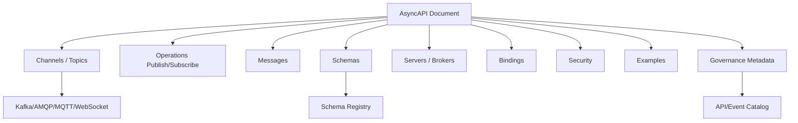
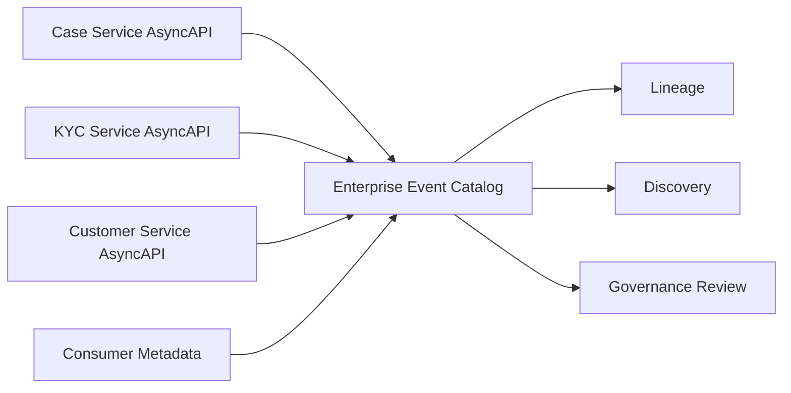
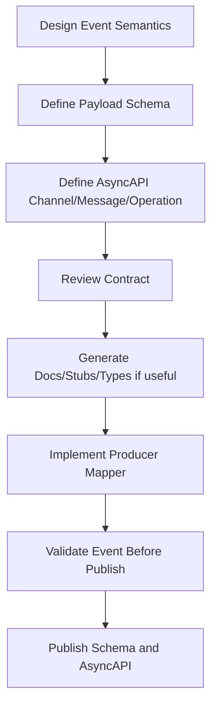

# Part 015 — AsyncAPI Deep Model: Describing Message-Driven APIs Across Protocols

## Tujuan Pembelajaran

Pada part sebelumnya kita membahas mental model event dan envelope. Sekarang kita membutuhkan cara formal untuk mendeskripsikan event-driven/message-driven API supaya contract tidak tersebar di wiki, topic name, kode consumer, dan tribal knowledge.

OpenAPI mendeskripsikan HTTP API. AsyncAPI mendeskripsikan asynchronous/message-driven API.

Namun kesalahan umum adalah memperlakukan AsyncAPI sebagai “Swagger untuk Kafka”. Itu terlalu sempit. AsyncAPI bukan hanya untuk Kafka, dan bukan hanya untuk dokumentasi. Ia bisa menjadi contract artifact untuk:

1. event type;
2. message shape;
3. channel/topic/queue;
4. publish/subscribe operation;
5. server/broker;
6. security;
7. protocol binding;
8. schema reference;
9. examples;
10. ownership/governance metadata;
11. developer portal;
12. generated docs/stubs/tools.

Setelah part ini, kamu harus mampu:

- membaca dan menulis AsyncAPI document untuk event-driven API;
- membedakan channel, operation, message, schema, server, dan binding;
- memodelkan Kafka topic, AMQP queue/exchange, WebSocket channel, dan generic message API;
- menjelaskan publish/subscribe dari perspektif provider/consumer;
- menghindari pencampuran event type, topic, schema, dan business operation;
- memasukkan event envelope dan payload schema ke AsyncAPI;
- memakai AsyncAPI sebagai bagian dari governance dan CI;
- memahami batas AsyncAPI dibanding schema registry dan runtime broker config;
- membangun mental model contract-first untuk asynchronous integration.

---

## 1. AsyncAPI as Contract Artifact

AsyncAPI adalah machine-readable definition untuk asynchronous APIs. Dalam konteks event contract engineering, AsyncAPI menjawab:

```text
Pesan apa yang dipublish?
Pesan apa yang dikonsumsi?
Melalui channel apa?
Di broker/server mana?
Dengan protocol apa?
Schema message-nya apa?
Security-nya apa?
Binding protocol-specific-nya apa?
Contoh message-nya seperti apa?
Siapa owner-nya?
Apa lifecycle-nya?
```

AsyncAPI tidak menggantikan schema registry. AsyncAPI juga tidak menggantikan broker configuration. Ia adalah **contract view** yang menghubungkan semua itu.



---

## 2. AsyncAPI vs OpenAPI

| Dimension | OpenAPI | AsyncAPI |
|---|---|---|
| Main interaction | request/response | publish/subscribe, send/receive |
| Common protocols | HTTP | Kafka, AMQP, MQTT, WebSocket, HTTP callbacks, etc. |
| Main artifact | path + operation | channel + operation + message |
| Consumer action | call endpoint | publish/consume message |
| Response | usually immediate | often absent, async, separate message |
| Failure model | HTTP status/problem | broker errors, DLQ, retry, poison message |
| Runtime coupling | synchronous | temporal decoupling |
| Contract risks | status/payload/versioning | topic/key/order/replay/schema/semantics |

OpenAPI path:

```yaml
paths:
  /customers/{customerId}:
    get:
      operationId: getCustomer
```

AsyncAPI channel:

```yaml
channels:
  case-events:
    address: case-events
```

Operation:

```yaml
operations:
  publishCaseApproved:
    action: send
    channel:
      $ref: '#/channels/case-events'
    messages:
      - $ref: '#/components/messages/CaseApproved'
```

Mental model shift:

> In OpenAPI, operation is usually endpoint-centric. In AsyncAPI, operation is message-flow-centric.

---

## 3. Core AsyncAPI Concepts

### 3.1 AsyncAPI Document

Top-level document usually includes:

```yaml
asyncapi: 3.0.0
info:
  title: Case Events API
  version: 1.0.0
servers:
  production:
    host: kafka.prod.acme.internal:9092
    protocol: kafka
channels:
  case-events:
    address: case-events
operations:
  publishCaseApproved:
    action: send
    channel:
      $ref: '#/channels/case-events'
    messages:
      - $ref: '#/components/messages/CaseApproved'
components:
  messages:
    CaseApproved:
      ...
  schemas:
    CaseApprovedEnvelope:
      ...
```

In current modern usage, AsyncAPI 3.x has clearer separation between channels and operations than older 2.x patterns. Always align with the spec version your tooling supports.

### 3.2 Info

```yaml
info:
  title: Case Events API
  version: 1.0.0
  description: >
    Event-driven API for case lifecycle facts emitted by the case-management service.
```

This is artifact/version metadata, not necessarily event schema version.

### 3.3 Servers

Servers describe brokers or endpoints.

```yaml
servers:
  production:
    host: kafka.prod.acme.internal:9092
    protocol: kafka
    description: Production Kafka cluster.
  staging:
    host: kafka.staging.acme.internal:9092
    protocol: kafka
```

Server definitions can include security and protocol details.

### 3.4 Channels

A channel is an addressable destination/source.

For Kafka, channel often maps to topic:

```yaml
channels:
  case-events:
    address: case-events
    description: Domain event stream for case lifecycle events.
```

For AMQP, it might map to exchange/queue pattern depending binding.

### 3.5 Operations

Operations describe sending/receiving messages over channels.

```yaml
operations:
  publishCaseEvents:
    action: send
    channel:
      $ref: '#/channels/case-events'
    messages:
      - $ref: '#/components/messages/CaseApproved'
      - $ref: '#/components/messages/CaseSubmitted'
```

Perspective matters. If the document is owned by producer, `send` means producer sends. If describing consumer API, `receive` may be used.

### 3.6 Messages

A message describes headers, payload, traits, examples, content type, and bindings.

```yaml
components:
  messages:
    CaseApproved:
      name: CaseApproved
      title: Case Approved
      contentType: application/json
      payload:
        $ref: '#/components/schemas/CaseApprovedEnvelope'
```

### 3.7 Schemas

Schemas describe message payload/envelope shape.

Can be JSON Schema-like, Avro schema, or references depending tooling and spec.

### 3.8 Bindings

Bindings describe protocol-specific details.

Kafka binding may include topic, key, group, offset, or binding-specific settings depending binding version and tooling.

---

## 4. Channel Is Not Event Type

Common mistake:

```yaml
channels:
  CaseApproved:
    address: CaseApproved
```

This may be valid if topic per event type is deliberate. But usually event type and channel are separate.

Better for domain stream:

```yaml
channels:
  case-events:
    address: case-events
    messages:
      CaseApproved:
        $ref: '#/components/messages/CaseApproved'
      CaseSubmitted:
        $ref: '#/components/messages/CaseSubmitted'
      CaseClosed:
        $ref: '#/components/messages/CaseClosed'
```

Conceptual separation:

| Concept | Example | Changes require |
|---|---|---|
| Event type | `CaseApproved` | semantic/schema review |
| Channel/topic | `case-events` | routing/ordering/access review |
| Schema subject | `case.CaseApproved` | schema governance |
| Message key | `caseId` | ordering/partitioning review |
| Operation | `publishCaseEvents` | producer/consumer responsibility review |

Do not collapse all five into one name.

---

## 5. Producer-Owned AsyncAPI

A producer-owned document says:

> “This service publishes these messages and maybe consumes these commands.”

Example:

```yaml
asyncapi: 3.0.0
info:
  title: Case Service Events
  version: 1.0.0
  description: Events published by the case service.

servers:
  production:
    host: kafka.prod.acme.internal:9092
    protocol: kafka

channels:
  case-events:
    address: case-events
    description: Case domain event topic.

operations:
  publishCaseApproved:
    action: send
    channel:
      $ref: '#/channels/case-events'
    messages:
      - $ref: '#/components/messages/CaseApproved'
```

This is natural when provider is the event authority.

---

## 6. Consumer-Owned AsyncAPI

A consumer-owned document says:

> “This service consumes these messages.”

Example:

```yaml
asyncapi: 3.0.0
info:
  title: Case Projection Consumer
  version: 1.0.0
  description: Events consumed to build case search projection.

channels:
  case-events:
    address: case-events

operations:
  consumeCaseApproved:
    action: receive
    channel:
      $ref: '#/channels/case-events'
    messages:
      - $ref: '#/components/messages/CaseApproved'
```

Useful for documenting consumer expectations, but not a replacement for producer source-of-truth or consumer-driven contract tests.

---

## 7. Platform Catalog AsyncAPI

An event catalog may aggregate producer and consumer views.



Catalog should answer:

1. Which service publishes `CaseApproved`?
2. Which topic carries it?
3. Which schema validates it?
4. Which consumers subscribe?
5. Is it stable/deprecated?
6. Does it contain PII?
7. What is ordering/key?
8. What is compatibility mode?
9. Where is sample message?
10. Who owns it?

AsyncAPI can supply much of this metadata with extensions.

---

## 8. Modeling Event Envelope in AsyncAPI

Suppose envelope:

```json
{
  "metadata": {
    "eventId": "evt_123",
    "eventType": "CaseApproved",
    "source": "case-service",
    "aggregateId": "case_123",
    "aggregateVersion": 17,
    "occurredAt": "2026-06-29T04:00:00Z",
    "schemaRef": "case.CaseApproved:1"
  },
  "payload": {
    "caseId": "case_123",
    "caseVersion": 17,
    "approvedBy": "usr_123",
    "reasonCode": "EVIDENCE_COMPLETE"
  }
}
```

AsyncAPI schema:

```yaml
components:
  schemas:
    EventMetadata:
      type: object
      required:
        - eventId
        - eventType
        - source
        - occurredAt
        - schemaRef
      properties:
        eventId:
          type: string
        eventType:
          type: string
        eventVersion:
          type: string
        source:
          type: string
        aggregateType:
          type: string
        aggregateId:
          type: string
        aggregateVersion:
          type: integer
          format: int64
        occurredAt:
          type: string
          format: date-time
        publishedAt:
          type: string
          format: date-time
        correlationId:
          type: string
        causationId:
          type: string
        schemaRef:
          type: string
        tenantId:
          type: string
        jurisdiction:
          type: string
        dataClassification:
          type: string

    CaseApprovedPayload:
      type: object
      required:
        - caseId
        - caseVersion
        - approvedBy
        - approvedAt
        - reasonCode
      properties:
        caseId:
          type: string
        caseVersion:
          type: integer
          format: int64
        approvedBy:
          type: string
        approvedAt:
          type: string
          format: date-time
        reasonCode:
          type: string

    CaseApprovedEnvelope:
      type: object
      required:
        - metadata
        - payload
      properties:
        metadata:
          $ref: '#/components/schemas/EventMetadata'
        payload:
          $ref: '#/components/schemas/CaseApprovedPayload'
```

Important: if metadata.eventType must equal `CaseApproved`, encode it where tooling supports `const`:

```yaml
eventType:
  type: string
  const: CaseApproved
```

If tool support for `const` is weak, enforce with tests/linting.

---

## 9. Modeling Messages

```yaml
components:
  messages:
    CaseApproved:
      name: CaseApproved
      title: Case Approved
      summary: A case has been approved by an authorized actor.
      contentType: application/json
      payload:
        $ref: '#/components/schemas/CaseApprovedEnvelope'
      examples:
        - name: standardApproval
          summary: Standard approval after evidence completion.
          payload:
            metadata:
              eventId: evt_01J2X92M67ZP8VPKYB53PDC4M2
              eventType: CaseApproved
              eventVersion: "1.0"
              source: case-service
              aggregateType: Case
              aggregateId: case_01J2X93KD2CVS6NQY5G9XKFM1P
              aggregateVersion: 17
              occurredAt: "2026-06-29T04:00:00Z"
              publishedAt: "2026-06-29T04:00:02Z"
              correlationId: corr_01J2X95S4Y1MQJ8ZF9DKC2Z6E8
              causationId: cmd_01J2X96C3N93ESVB9ZGKMJZQZS
              schemaRef: case.CaseApproved:1
              dataClassification: CONFIDENTIAL
            payload:
              caseId: case_01J2X93KD2CVS6NQY5G9XKFM1P
              caseVersion: 17
              approvedBy: usr_01J2X94ZSGC2BMB1TSVGTFXHZ2
              approvedAt: "2026-06-29T04:00:00Z"
              reasonCode: EVIDENCE_COMPLETE
```

Examples are not decoration. They are contract test material.

---

## 10. Modeling Kafka Channel

Example:

```yaml
channels:
  case-events:
    address: case-events
    description: >
      Kafka topic containing case lifecycle domain events.
    messages:
      CaseSubmitted:
        $ref: '#/components/messages/CaseSubmitted'
      CaseApproved:
        $ref: '#/components/messages/CaseApproved'
```

Add governance extensions:

```yaml
channels:
  case-events:
    address: case-events
    description: Case lifecycle event topic.
    x-owner-team: case-management-platform
    x-data-classification: confidential
    x-message-key: payload.caseId
    x-ordering-guarantee: per-case
    x-delivery-guarantee: at-least-once
    x-replay-supported: true
    x-retention-policy: delete
    x-retention-duration: P90D
```

AsyncAPI bindings may represent protocol-specific metadata, but org-specific governance often uses `x-` extensions.

---

## 11. Kafka Binding Thinking

Protocol bindings should capture Kafka-specific contract aspects:

1. topic address;
2. message key;
3. partitioning assumption;
4. consumer group guidance;
5. schema registry integration;
6. content type/serialization;
7. retention/compaction;
8. replay expectation;
9. DLQ topic;
10. security.

Not all of these are first-class in every AsyncAPI binding/tooling version, so extensions are common.

Example:

```yaml
components:
  messages:
    CaseApproved:
      bindings:
        kafka:
          key:
            type: string
            description: caseId. Used to preserve per-case ordering.
```

If your binding/tooling cannot express enough, add explicit documentation and extensions.

---

## 12. Modeling Operation Semantics

Operation:

```yaml
operations:
  publishCaseApproved:
    action: send
    channel:
      $ref: '#/channels/case-events'
    messages:
      - $ref: '#/components/messages/CaseApproved'
    summary: Publish CaseApproved when a submitted case is approved.
    description: >
      The case service publishes this event after the case state transition
      to APPROVED is committed.
    x-transactional-boundary: outbox-after-domain-commit
    x-idempotency: eventId stable across publish retries
```

This captures the producer promise:

1. after commit;
2. not before;
3. event ID stable;
4. at-least-once delivery;
5. semantic trigger.

---

## 13. Modeling Subscribe/Receive

Consumer-facing operation:

```yaml
operations:
  receiveCaseApproved:
    action: receive
    channel:
      $ref: '#/channels/case-events'
    messages:
      - $ref: '#/components/messages/CaseApproved'
    summary: Receive CaseApproved events.
    x-consumer-requirements:
      idempotent: true
      tolerateDuplicates: true
      tolerateUnknownFields: true
      handleOutOfOrder: true
```

This is useful for consumer team documentation.

But producer contract should not make consumer-specific behavior part of producer guarantee unless broadly true.

---

## 14. AsyncAPI for Commands

AsyncAPI can also model commands sent via broker.

Command message:

```yaml
components:
  messages:
    ApproveCaseCommand:
      name: ApproveCaseCommand
      contentType: application/json
      payload:
        $ref: '#/components/schemas/ApproveCaseCommandEnvelope'
```

Channel:

```yaml
channels:
  case-commands:
    address: case-commands
```

Operation:

```yaml
operations:
  receiveApproveCaseCommand:
    action: receive
    channel:
      $ref: '#/channels/case-commands'
    messages:
      - $ref: '#/components/messages/ApproveCaseCommand'
```

Important:

- name it command, not event;
- document rejection/response path;
- define idempotency;
- define command timeout/expiration;
- define authorization context;
- define expected resulting events if any.

Command via broker has very different semantics from event.

---

## 15. Modeling Request/Reply Over Messaging

Some systems use async request/reply.

Example:

```text
Command: GenerateReportRequested
Reply: GenerateReportAccepted / GenerateReportRejected / ReportGenerated
```

AsyncAPI should model:

1. command channel;
2. reply channel;
3. correlation ID;
4. timeout;
5. error/rejection message;
6. idempotency;
7. consumer responsibilities.

Example extension:

```yaml
operations:
  sendGenerateReportCommand:
    action: send
    channel:
      $ref: '#/channels/report-commands'
    messages:
      - $ref: '#/components/messages/GenerateReportCommand'
    x-reply:
      channel: report-results
      correlationField: metadata.correlationId
      possibleMessages:
        - ReportGenerationAccepted
        - ReportGenerationRejected
        - ReportGenerated
```

Do not pretend request/reply messaging is simply event publishing. It has workflow contract.

---

## 16. Modeling WebSocket Events

AsyncAPI can describe WebSocket-style channels.

Example:

```yaml
servers:
  productionWebSocket:
    host: stream.acme.com
    protocol: wss

channels:
  caseUpdates:
    address: /ws/cases/{caseId}
    parameters:
      caseId:
        description: Case identifier.
```

Message:

```yaml
operations:
  receiveCaseStatusUpdate:
    action: receive
    channel:
      $ref: '#/channels/caseUpdates'
    messages:
      - $ref: '#/components/messages/CaseStatusUpdate'
```

Contract concerns:

1. connection lifecycle;
2. authentication;
3. subscription semantics;
4. reconnect behavior;
5. missed message recovery;
6. ordering;
7. heartbeat;
8. backpressure;
9. message envelope;
10. versioning.

---

## 17. Modeling AMQP/RabbitMQ

AMQP may have exchanges, queues, routing keys.

AsyncAPI channel address might represent exchange/queue depending style.

Example extensions:

```yaml
channels:
  case-events:
    address: case.events
    x-amqp-exchange: case.events
    x-amqp-exchange-type: topic
    x-routing-key-pattern: case.*.approved
```

Contract concerns:

1. exchange type;
2. routing key;
3. queue binding;
4. durable/non-durable;
5. ack/nack;
6. dead-letter exchange;
7. retry policy;
8. message TTL;
9. ordering;
10. consumer prefetch.

AsyncAPI can document core contract, while infra config may live elsewhere.

---

## 18. AsyncAPI and Schema Registry

AsyncAPI schema component may inline schema:

```yaml
payload:
  $ref: '#/components/schemas/CaseApprovedEnvelope'
```

or refer to external schema:

```yaml
payload:
  $ref: 'https://schemas.acme.com/case/CaseApproved/1.0.0/schema.json'
```

or:

```yaml
x-schema-registry:
  registry: apicurio
  artifactId: case.CaseApproved
  version: 3
  globalId: 18492
```

AsyncAPI should tell developers where authoritative schema lives.

Possible models:

| Model | Pros | Cons |
|---|---|---|
| Inline schema in AsyncAPI | self-contained | duplicate with registry |
| External `$ref` to registry | single source | tooling/network complexity |
| AsyncAPI references registry metadata | pragmatic | not fully schema-validating |
| Generated from registry | avoids duplication | loses channel/operation semantics |

Recommended:

- Use schema registry as source for payload schema when mature.
- Use AsyncAPI as contract view combining channel, message, operation, schemaRef, examples, governance.

---

## 19. AsyncAPI and Avro/Protobuf

JSON Schema-style examples are easy, but many Kafka systems use Avro or Protobuf.

Patterns:

### 19.1 Avro Payload Reference

```yaml
components:
  messages:
    CaseApproved:
      name: CaseApproved
      contentType: application/avro
      payload:
        $ref: 'schema://apicurio/case.CaseApproved/3'
      x-schema-format: avro
```

### 19.2 Protobuf Payload Reference

```yaml
components:
  messages:
    CaseApproved:
      name: CaseApproved
      contentType: application/protobuf
      payload:
        $ref: 'schema://buf/acme.case.CaseApproved/v1'
      x-schema-format: protobuf
```

Tooling support varies. The governance pattern still matters:

1. message named;
2. channel documented;
3. schema reference clear;
4. examples or sample binary-decoded payload available;
5. compatibility rule declared.

---

## 20. AsyncAPI Extensions for Governance

`x-` fields are powerful for enterprise governance.

Event message:

```yaml
components:
  messages:
    CaseApproved:
      x-owner-team: case-management-platform
      x-lifecycle: stable
      x-authority: case-service
      x-data-classification: confidential
      x-pii: false
      x-retention-class: regulated-7-years
      x-compatibility-mode: backward-transitive
      x-replay-supported: true
      x-consumer-assumptions:
        - Case state is APPROVED after this event.
        - Duplicate delivery is possible.
        - Consumers must deduplicate by metadata.eventId.
```

Channel:

```yaml
channels:
  case-events:
    x-message-key: metadata.aggregateId
    x-ordering-guarantee: per-aggregate
    x-delivery-guarantee: at-least-once
    x-dlq: case-events-dlq
```

Extensions should be standardized organization-wide. Random extensions create another governance mess.

---

## 21. AsyncAPI Document Structure

For a large domain:

```text
asyncapi/
├── case-events.yaml
├── channels/
│   ├── case-events.yaml
│   └── case-commands.yaml
├── messages/
│   ├── CaseSubmitted.yaml
│   ├── CaseApproved.yaml
│   ├── CaseClosed.yaml
│   └── ApproveCaseCommand.yaml
├── schemas/
│   ├── EventMetadata.yaml
│   ├── CaseApprovedPayload.yaml
│   └── ProblemMessage.yaml
├── examples/
│   ├── case-approved.json
│   └── approve-case-command.json
└── governance/
    ├── ownership.yaml
    └── lifecycle.yaml
```

CI should bundle into a single resolved artifact:

```text
build/asyncapi/case-events.bundle.yaml
```

---

## 22. AsyncAPI in Java Workflow

### 22.1 Contract-First Event Workflow



### 22.2 Code-First Event Workflow

Some teams annotate Java handlers/producers to generate AsyncAPI.

Pros:

- faster start;
- closer to code;
- lower friction.

Cons:

- same as OpenAPI code-first: generated docs may not capture real semantics;
- metadata often missing;
- topic/key/replay/retention not inferred reliably;
- internal class names leak.

For serious event platforms, prefer contract-first or curated hybrid.

---

## 23. Producer Implementation Alignment

Java producer should align with AsyncAPI.

Contract says:

```yaml
eventType: CaseApproved
channel: case-events
messageKey: metadata.aggregateId
schemaRef: case.CaseApproved:1
```

Producer code:

```java
EventEnvelope<CaseApprovedPayload> event = envelopeFactory.create(
    EventDescriptor.caseApproved(),
    AggregateRef.case(caseId.value(), caseVersion.value()),
    payload
);

schemaValidator.validate(event, "case.CaseApproved:1");

kafkaTemplate.send(
    "case-events",
    event.metadata().aggregateId(),
    event
);
```

Contract test should verify:

1. topic correct;
2. key correct;
3. eventType correct;
4. schemaRef correct;
5. payload matches schema;
6. required metadata present.

---

## 24. Consumer Implementation Alignment

AsyncAPI says consumer receives `CaseApproved`.

Consumer code:

```java
@KafkaListener(topics = "case-events", groupId = "case-projection")
public void onMessage(ConsumerRecord<String, EventEnvelope<CaseApprovedPayload>> record) {
    EventEnvelope<CaseApprovedPayload> event = record.value();

    if (!"CaseApproved".equals(event.metadata().eventType())) {
        return;
    }

    caseProjectionHandler.handle(event);
}
```

For multi-type topic, consumer must filter by eventType and handle unknown event types gracefully.

Bad:

```java
CaseApprovedPayload payload = record.value();
```

if topic contains multiple event types or envelope metadata is needed.

---

## 25. AsyncAPI Contract Testing

### 25.1 Static Validation

Check AsyncAPI document parses and references resolve.

### 25.2 Linting

Rules:

1. every message has owner;
2. every channel has address;
3. every event message has example;
4. every event has eventType;
5. every event declares data classification;
6. every Kafka channel declares message key;
7. every aggregate event declares ordering semantics;
8. every stable event declares compatibility mode;
9. commands are not named as past-tense events;
10. event names are not generic `DataChanged`.

### 25.3 Example Validation

Examples should validate against schema.

### 25.4 Producer Contract Test

Given domain action, verify produced message matches AsyncAPI contract.

Pseudo:

```java
@Test
void approvingCasePublishesCaseApprovedEvent() {
    caseService.approve(caseId, command);

    PublishedMessage message = testBroker.singleMessage("case-events");

    assertThat(message.key()).isEqualTo(caseId.value());
    assertThat(message.payload().metadata().eventType()).isEqualTo("CaseApproved");
    assertThat(message.payload().metadata().schemaRef()).isEqualTo("case.CaseApproved:1");
    asyncApiValidator.validateMessage("CaseApproved", message.payload());
}
```

### 25.5 Consumer Contract Test

Use sample events from AsyncAPI examples to test handler.

```java
@Test
void consumerHandlesCaseApprovedExample() {
    EventEnvelope<CaseApprovedPayload> event =
        exampleLoader.load("case-approved.json", CaseApprovedPayload.class);

    handler.handle(event);

    assertThat(projectionRepository.find(event.payload().caseId()))
        .hasValueSatisfying(projection ->
            assertThat(projection.status()).isEqualTo("APPROVED")
        );
}
```

---

## 26. AsyncAPI and Developer Portal

AsyncAPI can feed portal pages:

1. event list;
2. topic list;
3. producer service;
4. consumer services;
5. schemas;
6. examples;
7. lifecycle;
8. data classification;
9. replay policy;
10. contact/owner;
11. changelog;
12. migration guide.

Good portal page for an event:

```text
Event: CaseApproved
Owner: case-management-platform
Authority: case-service
Topic: case-events
Key: caseId
Schema: case.CaseApproved:1
Compatibility: backward-transitive
Delivery: at-least-once
Ordering: per-case
Replay: supported
PII: false
Lifecycle: stable
Examples: 3
Consumers: 12 registered
```

This is where AsyncAPI becomes an engineering system, not docs.

---

## 27. AsyncAPI Limitations

AsyncAPI does not automatically solve:

1. schema compatibility enforcement;
2. broker topic creation correctness;
3. consumer idempotency;
4. semantic event correctness;
5. runtime delivery guarantees;
6. event ordering proof;
7. DLQ processing quality;
8. privacy review;
9. schema registry policy;
10. generated code quality;
11. consumer ownership;
12. production observability.

It is a contract description. You still need governance, CI, runtime validation, and operational practices.

---

## 28. AsyncAPI Anti-Patterns

### 28.1 AsyncAPI as Wiki Dump

Document exists but not validated, not reviewed, not used by CI.

### 28.2 One AsyncAPI per Topic with No Messages

Only lists topic names, not event contracts.

### 28.3 One Message Called GenericEvent

```yaml
messages:
  GenericEvent:
    payload:
      type: object
```

No semantic value.

### 28.4 Confusing Send/Receive Perspective

Producer document says `receive` when it publishes, causing consumer confusion.

### 28.5 Missing Examples

Consumers cannot learn real payload.

### 28.6 No Binding/Key/Ordering

Kafka contract missing the most important Kafka details.

### 28.7 Schema Duplicated and Divergent

AsyncAPI inline schema differs from schema registry.

### 28.8 Event Type in Topic Name Only

Payload has no eventType, multi-tool consumption breaks.

### 28.9 No Lifecycle

Consumers cannot tell if event is stable/deprecated/experimental.

### 28.10 No Owner

Nobody accountable for breaking changes.

---

## 29. AsyncAPI Review Checklist

### 29.1 Document

- Is AsyncAPI version supported by tooling?
- Is info.title/version meaningful?
- Are servers defined correctly?
- Is environment-specific detail handled safely?
- Are security schemes defined?

### 29.2 Channels

- Does channel address map to real topic/queue/path?
- Is channel not confused with event type?
- Is owner defined?
- Is message key/routing documented?
- Is ordering guarantee stated?
- Is retention/replay/DLQ referenced?

### 29.3 Operations

- Is action send/receive correct from document perspective?
- Are messages linked?
- Is producer/consumer responsibility clear?
- Are transactional boundary and idempotency documented where needed?

### 29.4 Messages

- Is message name stable and domain-specific?
- Is contentType correct?
- Is schema reference correct?
- Are examples present?
- Is lifecycle defined?
- Is data classification defined?
- Is compatibility mode stated?

### 29.5 Schemas

- Is envelope modeled?
- Is payload schema stable?
- Are required/optional/null semantics clear?
- Is schema registry authority clear?
- Are examples valid?

### 29.6 Governance

- Owner team?
- Authority?
- Consumer assumptions?
- Security/PII?
- Versioning?
- Deprecation?
- Changelog?

---

## 30. Practice Lab

### Lab 1 — Model Case Events

Create AsyncAPI for topic `case-events` with messages:

1. `CaseSubmitted`
2. `CaseApproved`
3. `CaseClosed`

Include:

- server;
- channel;
- operations;
- message key;
- envelope schema;
- examples;
- governance extensions.

### Lab 2 — Fix Bad AsyncAPI

Input:

```yaml
channels:
  CustomerUpdated:
    address: customer-updated
messages:
  Event:
    payload:
      type: object
```

Refactor to meaningful AsyncAPI with event type, channel, schema, owner, and examples.

### Lab 3 — Producer Alignment Test

Given AsyncAPI says key=`payload.caseId`, write test plan to verify Java producer sends correct key and message.

### Lab 4 — Schema Registry Integration

Design how AsyncAPI references Avro schemas stored in schema registry.

### Lab 5 — Command Over Broker

Model `ApproveCaseCommand` and resulting `CaseApproved`/`CaseApprovalRejected` messages.

---

## 31. Senior Engineer Heuristics

1. **AsyncAPI is not “Swagger for Kafka”; it is a contract view for message-driven APIs.**
2. **Channel, event type, schema subject, message key, and operation are different concepts.**
3. **AsyncAPI should document semantics that broker config cannot explain.**
4. **A topic list is not an event contract.**
5. **Examples are essential for consumer learning and tests.**
6. **Bindings and extensions are where protocol reality enters the contract.**
7. **Do not duplicate schemas blindly between AsyncAPI and registry.**
8. **Producer perspective and consumer perspective must be explicit.**
9. **AsyncAPI should feed catalog, docs, linting, and review workflows.**
10. **Governance metadata belongs near the contract, not only in a spreadsheet.**
11. **Kafka key and ordering assumptions must be documented.**
12. **Command messages need different semantics from event messages.**
13. **AsyncAPI cannot prove semantics; pair it with tests.**
14. **Contract-first event design prevents tribal knowledge from becoming infrastructure.**
15. **A useful AsyncAPI document lets a new consumer integrate without a meeting.**

---

## 32. Summary

AsyncAPI provides a machine-readable way to describe asynchronous/message-driven APIs. For event contract engineering, it connects channels, messages, operations, schemas, servers, protocol bindings, examples, and governance metadata.

Main takeaways:

1. AsyncAPI complements OpenAPI and schema registry;
2. channel is not event type;
3. message is not schema only;
4. operation must clarify send/receive perspective;
5. Kafka-specific contract needs key, ordering, retention, replay, and DLQ semantics;
6. event envelope and payload should be modeled explicitly;
7. schema registry integration must avoid duplicate divergent truth;
8. governance extensions are practical for enterprise metadata;
9. AsyncAPI should be validated, linted, tested, bundled, and published;
10. AsyncAPI is most valuable when it drives docs, catalog, examples, review, and CI.

Part berikutnya goes deep into Kafka event contracts: topic, key, partitioning, ordering, retention, compaction, replay, consumer groups, poison messages, and DLQ semantics.
