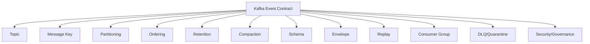
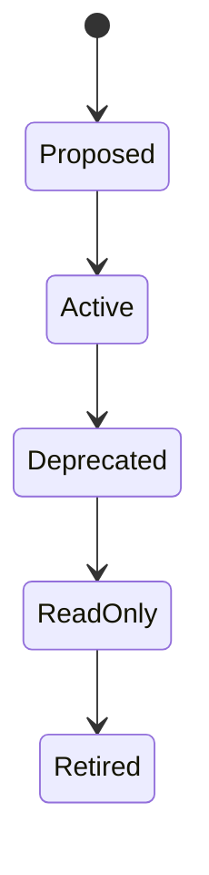
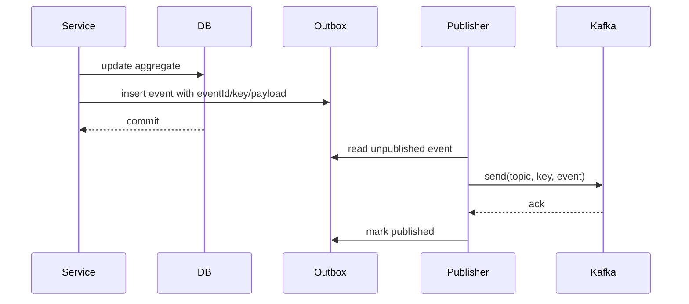

# Part 016 — Kafka Event Contracts: Topic, Key, Partitioning, Ordering, Retention, and Replay Semantics

## Tujuan Pembelajaran

Banyak tim mengira Kafka contract hanya payload schema. Ini salah besar.

Kafka event contract mencakup:

1. topic;
2. event type;
3. message key;
4. partitioning;
5. ordering guarantee;
6. delivery guarantee;
7. retention;
8. compaction;
9. tombstone semantics;
10. replay policy;
11. consumer group expectations;
12. offset management;
13. poison message handling;
14. DLQ/quarantine semantics;
15. schema registry interaction;
16. producer transaction/outbox behavior;
17. idempotency and deduplication;
18. operational SLO.

Schema hanya satu bagian.

Setelah part ini, kamu harus mampu:

- mendesain Kafka topic sebagai contract boundary;
- memilih message key berdasarkan ordering, partitioning, compaction, dan load distribution;
- menjelaskan ordering yang benar: per partition, not global;
- mendesain event replay dan side-effect safety;
- membedakan retention delete dan compaction;
- memahami tombstone semantics untuk compacted topics;
- merancang DLQ/quarantine contract;
- menulis Java producer/consumer contract tests untuk Kafka events;
- menghindari anti-pattern yang menyebabkan data loss, consumer breakage, dan event stream chaos.

---

## 1. Kafka Contract Surface

Kafka contract is not:

```text
topic + Avro schema
```

Kafka contract is:

```text
who publishes what message to which topic,
with what key,
under what ordering/delivery/retention/replay assumptions,
using what schema,
with what failure and compatibility policy.
```



If contract only mentions schema, consumers will invent assumptions for the rest.

---

## 2. Topic as Contract Boundary

Topic names are API surface.

Bad:

```text
service-a-output
test-topic
customer
events
new-topic-1
```

Better:

```text
customer-events
case-events
payment-events
customer-snapshots
case-commands
case-events-dlq
```

### 2.1 Topic Naming Principles

1. reflect domain or message purpose;
2. avoid implementation component names;
3. avoid temporary names;
4. avoid consumer-specific names unless topic is consumer-owned;
5. make environment separate from logical name if possible;
6. distinguish events, commands, snapshots, DLQ;
7. document owner and authority.

Example convention:

```text
<domain>-events
<domain>-commands
<domain>-snapshots
<domain>-events-dlq
```

or:

```text
acme.<domain>.<stream-kind>
```

### 2.2 Topic Ownership

Topic must have an owner.

| Topic | Owner | Authority |
|---|---|---|
| `case-events` | case-management-platform | case-service |
| `customer-events` | customer-platform | customer-service |
| `payment-events` | payment-platform | payment-service |
| `case-events-dlq` | case-platform / platform | consumers/platform |

No owner = no governance.

### 2.3 Topic Lifecycle



Retiring a topic requires:

1. producer stopped;
2. consumer inventory migrated;
3. retention expired or archived;
4. replay requirements satisfied;
5. schema references archived;
6. access controls cleaned;
7. docs updated.

---

## 3. Topic Design Patterns

### 3.1 Event Type per Topic

```text
case-approved-events
case-submitted-events
case-closed-events
```

Pros:

- simple schema per topic;
- easy consumer filtering;
- granular access control;
- easier DLQ per event type.

Cons:

- topic explosion;
- cross-event ordering per aggregate difficult;
- operational overhead;
- consumers need many subscriptions.

Use when:

1. event types have very different consumers/security;
2. event volume high and isolated;
3. per-event retention differs;
4. access control differs significantly.

### 3.2 Domain Event Stream

```text
case-events
```

Contains:

```text
CaseSubmitted
CaseAssigned
CaseApproved
CaseClosed
CaseReopened
```

Pros:

- cohesive domain stream;
- per-aggregate ordering possible if keyed by caseId;
- fewer topics;
- good for event-sourced/projection consumers.

Cons:

- consumers must filter eventType;
- multiple schemas per topic;
- access control coarser;
- topic schema governance more complex.

Use when:

1. consumers need lifecycle stream;
2. ordering across event types per aggregate matters;
3. event types share owner/security/retention.

### 3.3 Snapshot Topic

```text
customer-snapshots
```

Usually compacted by key.

Contains latest state snapshot per entity.

Pros:

- consumers can bootstrap projection;
- compaction retains latest per key;
- good for read-model replication.

Cons:

- not audit history;
- old changes lost by compaction;
- tombstone semantics needed;
- consumers may confuse snapshot with event history.

### 3.4 Command Topic

```text
case-commands
```

Contains commands, not events.

Must define:

1. command authority;
2. authorization context;
3. idempotency key;
4. command expiration;
5. result/rejection path;
6. retry policy.

Do not mix commands and events casually.

---

## 4. Message Key Is Contract

Kafka message key affects partitioning. Partitioning affects ordering and load.

If key is `caseId`, events for same case usually go to same partition, preserving order for that case.

```text
key = caseId
```

Contract:

```yaml
topic: case-events
messageKey: metadata.aggregateId
orderingGuarantee: per-case
```

### 4.1 Bad Key Choice

Random key:

```text
key = eventId
```

Pros:

- good distribution.

Cons:

- events for same aggregate go to different partitions;
- per-aggregate ordering lost;
- projection consumers must handle disorder more heavily.

Null key:

```text
key = null
```

Pros:

- producer easy.

Cons:

- partitioning may be round-robin/sticky depending producer behavior;
- no key-based ordering;
- compaction impossible/useful semantics lost;
- consumer assumptions weak.

### 4.2 Key Decision Matrix

| Requirement | Good key |
|---|---|
| preserve order per case | `caseId` |
| preserve order per customer | `customerId` |
| compact latest snapshot per account | `accountId` |
| distribute high-volume independent events | random or eventId |
| tenant-local ordering | `tenantId + ":" + aggregateId` |
| consumer partition by region | `region + ":" + aggregateId` |

### 4.3 Key Stability

Changing key is dangerous.

Impacts:

1. ordering guarantee changes;
2. partition distribution changes;
3. stateful stream tasks rebalance;
4. compaction semantics change;
5. consumer local state stores may break;
6. replay behavior changes;
7. monitoring baselines change.

Key changes require contract review.

---

## 5. Partitioning and Ordering

Kafka ordering is within a partition, not global across all partitions.

If topic has multiple partitions:

```text
Partition 0: Case A v1, Case A v2
Partition 1: Case B v1, Case B v2
```

There is no global order between Case A and Case B.

### 5.1 Per-Aggregate Ordering

If key = aggregateId, and partitioner stable, events for same aggregate go to same partition.

Consumer can assume:

```text
CaseSubmitted v1 -> CaseAssigned v2 -> CaseApproved v3
```

for same case, if producer sends in order and no producer misconfiguration.

### 5.2 Ordering Contract Should State

```yaml
ordering:
  scope: per-aggregate
  key: metadata.aggregateId
  sequenceField: metadata.aggregateVersion
  duplicates: possible
  globalOrdering: false
```

### 5.3 Add Sequence Anyway

Even with Kafka partition ordering, include aggregateVersion/sequence.

Why:

1. detect missing events;
2. detect duplicates;
3. handle replay;
4. survive migration/repartition;
5. help projection correctness;
6. debug ordering issues.

Consumer logic:

```java
void apply(EventEnvelope<CaseEventPayload> event) {
    long incoming = event.metadata().aggregateVersion();
    long current = projection.version(event.metadata().aggregateId());

    if (incoming <= current) {
        return; // duplicate or old
    }

    if (incoming != current + 1) {
        quarantine(event, "SEQUENCE_GAP");
        return;
    }

    projection.apply(event);
}
```

---

## 6. Partition Count Is Contract-ish

Kafka partition count is operational config, but consumers can be affected.

Increasing partitions:

- may change key-to-partition mapping depending partitioner and key hashing;
- can affect ordering if producers/consumers rely on partition assignment assumptions;
- affects throughput;
- affects consumer group parallelism;
- affects state store distribution;
- affects replay duration.

Do not let consumers assume fixed partition numbers unless documented.

Contract should say:

```yaml
partitioning:
  partitionCountIsStableContract: false
  orderingScope: per-key
  consumersMustNotDependOnPartitionNumber: true
```

If using Kafka Streams/state stores, partition count changes require migration planning.

---

## 7. Delivery Guarantees

Common real-world statement:

```text
At-least-once delivery, duplicates possible.
```

Contract should state:

```yaml
delivery:
  guarantee: at-least-once
  duplicateDelivery: possible
  producerEventIdStableAcrossRetries: true
  consumerIdempotencyRequired: true
```

### 7.1 At-Most-Once

Messages may be lost. Rarely acceptable for critical domain events.

### 7.2 At-Least-Once

Messages not lost if systems configured correctly, but duplicates possible.

Most common.

### 7.3 Exactly-Once

Kafka has transactional/exactly-once features for some scenarios, but end-to-end exactly-once across arbitrary external side effects is hard.

Contract should not promise exactly-once unless carefully scoped:

```yaml
delivery:
  guarantee: exactly-once-within-kafka-transactional-topology
  externalSideEffectsExactlyOnce: false
```

Avoid marketing language.

---

## 8. Producer Contract

Producer promises:

1. event emitted after durable state change;
2. event ID stable;
3. correct topic;
4. correct key;
5. correct schema;
6. correct event type;
7. correct aggregate version;
8. no forbidden data;
9. ordering per key if promised;
10. retry publish safely.

### 8.1 Outbox Pattern



Outbox helps align state and event.

### 8.2 Producer Java Example

```java
public void publish(EventEnvelope<CaseApprovedPayload> event) {
    String topic = "case-events";
    String key = event.metadata().aggregateId();

    ProducerRecord<String, EventEnvelope<CaseApprovedPayload>> record =
        new ProducerRecord<>(topic, key, event);

    record.headers().add(
        "event-type",
        event.metadata().eventType().getBytes(StandardCharsets.UTF_8)
    );
    record.headers().add(
        "correlation-id",
        event.metadata().correlationId().getBytes(StandardCharsets.UTF_8)
    );

    kafkaTemplate.send(record);
}
```

The topic/key/header choice should be contract-driven, not incidental.

---

## 9. Consumer Contract

Consumer must handle:

1. duplicates;
2. out-of-order events if not guaranteed;
3. unknown event types;
4. unknown optional fields;
5. schema evolution;
6. transient processing failure;
7. poison messages;
8. replay;
9. rebalancing;
10. offset commit semantics.

### 9.1 Consumer Handler

```java
@KafkaListener(topics = "case-events", groupId = "case-projection")
public void consume(ConsumerRecord<String, EventEnvelope<CaseApprovedPayload>> record) {
    EventEnvelope<CaseApprovedPayload> event = record.value();

    if (!"CaseApproved".equals(event.metadata().eventType())) {
        return;
    }

    handler.handle(event);
}
```

### 9.2 Offset Commit

Offset commit strategy affects failure behavior.

| Strategy | Risk |
|---|---|
| commit before processing | message loss on crash |
| commit after processing | duplicate processing on crash |
| transactional consume-process-produce | stronger but complex |
| manual commit with idempotency | common practical pattern |

Contract may not dictate offset strategy, but consumer guide should.

---

## 10. Retention Policy

Retention answers: how long messages remain available.

Kafka topic config can use delete policy based on time/size, compaction, or both depending configuration.

### 10.1 Delete Retention

Messages are deleted after retention time/size.

Example:

```yaml
retention:
  policy: delete
  duration: P90D
  purpose: allow replay within 90 days
```

Contract implications:

1. new consumer can bootstrap only within retention window;
2. replay after retention requires archive;
3. audit must not rely only on topic if retention short;
4. data deletion must align with legal policy.

### 10.2 Size-Based Retention

Retention may be size-limited. This makes replay window variable.

Contract should avoid promising “90 days” if size can delete earlier.

### 10.3 Retention as Governance

For regulated systems:

1. topic retention;
2. data lake/archive retention;
3. DLQ retention;
4. schema retention;
5. outbox retention;
6. audit log retention.

All must align.

---

## 11. Compaction

Compaction retains latest record per key, not full history.

Compacted topic is suitable for latest state snapshots.

Example:

```text
key=cus_123 value=status=PENDING
key=cus_123 value=status=ACTIVE
key=cus_123 value=status=SUSPENDED
```

After compaction, topic may retain latest:

```text
key=cus_123 value=status=SUSPENDED
```

### 11.1 Contract Implications

Compacted topic is not reliable audit history.

Use for:

1. latest entity snapshot;
2. lookup table replication;
3. materialized view bootstrap;
4. configuration/rules latest state.

Avoid for:

1. audit events;
2. lifecycle history;
3. compliance event stream;
4. workflows needing every transition.

### 11.2 Tombstones

In compacted topics, a null value for a key often acts as tombstone/delete marker.

Example:

```text
key=cus_123 value=null
```

Contract must define tombstone semantics:

```yaml
tombstone:
  supported: true
  meaning: customer snapshot deleted or no longer available
  consumerAction: delete local projection for key
```

Consumers must handle tombstones.

### 11.3 Compaction Does Not Mean Single Record Immediately

Compaction is asynchronous. Consumers may see multiple records for same key before compaction.

Contract should say:

```yaml
compaction:
  policy: compact
  consumersMustHandleMultipleRecordsPerKey: true
  latestRecordByOffsetWins: true
```

---

## 12. Delete + Compact

Kafka can support delete and compact policies together depending topic config.

Meaning:

- compaction keeps latest per key;
- delete retention can remove old segments based on time/size.

Contract must document final behavior:

```yaml
retention:
  policy: delete,compact
  deleteRetention: P30D
  compactedLatestPerKey: true
```

This matters for bootstrap and recovery.

---

## 13. Replay Semantics

Replay means consumers can re-read old messages.

Kinds:

1. consumer resets offset;
2. producer republishes from outbox/archive;
3. replay topic;
4. data lake backfill;
5. compacted snapshot bootstrap.

### 13.1 Replay Contract

```yaml
replay:
  supported: true
  source: kafka-retention
  retentionWindow: P90D
  sideEffectConsumersAllowed: false
  deduplicationKey: metadata.eventId
```

### 13.2 Replay-Safe Consumer

Projection consumer:

```java
if (alreadyApplied(event.eventId())) {
    return;
}
applyProjection(event);
```

Email/SMS/payment consumer:

- must not blindly replay;
- must dedup by eventId or business key;
- may need separate live-only topic or replay marker;
- may be excluded from replay.

### 13.3 Replay Can Break Semantics

Old event interpreted with new code may yield different projection if business rules changed.

Mitigations:

1. event contains facts, not instructions;
2. versioned handlers;
3. schema evolution support;
4. archived reference data;
5. deterministic projection logic;
6. migration scripts.

---

## 14. Consumer Groups

Consumer group controls load-sharing.

In a group, each partition is consumed by one member at a time. Different groups each receive their own copy of stream.

Contract guidance:

```yaml
consumerGroups:
  expected:
    - case-projection
    - case-notification
  note: Each logical application should use its own groupId.
```

### 14.1 Group ID as Consumer Identity

Bad:

```text
group.id=test
group.id=consumer
```

Better:

```text
case-projection-service
fraud-monitoring-service
customer-search-indexer
```

### 14.2 Consumer Group Contract Risks

1. two different apps accidentally share group ID and split messages;
2. one app changes group ID and reprocesses all history;
3. offset reset policy causes unexpected replay/skip;
4. partition count limits parallelism;
5. slow consumer causes lag.

Consumer onboarding docs should include group ID guidance.

---

## 15. Offset Reset Policy

If consumer has no committed offset:

- `earliest`: read from beginning available;
- `latest`: read only new messages;
- `none`: fail if no offset.

Contract should guide new consumers:

```yaml
consumerGuidance:
  autoOffsetReset: earliest for projection rebuild, latest for notification-only consumers
```

Wrong default can cause:

1. missed historical events;
2. accidental massive replay;
3. duplicate side effects;
4. consumer overload.

---

## 16. Poison Messages

Poison message = message consumer cannot process successfully.

Causes:

1. schema incompatible;
2. unknown event type;
3. invalid domain state;
4. bug in consumer;
5. missing reference data;
6. deserialization failure;
7. authorization/classification violation.

### 16.1 Strategies

| Strategy | When |
|---|---|
| fail and retry forever | rarely acceptable |
| skip and commit | low-value notification only |
| DLQ | common |
| quarantine | regulated/high-risk |
| pause partition | strict ordering required |
| fetch current state and repair | projection consumers |
| manual remediation | critical workflows |

### 16.2 Contract Should Define

```yaml
poisonMessage:
  strategy: quarantine
  dlqTopic: case-events-dlq
  maxAttempts: 3
  preservesOriginalEnvelope: true
  includesFailureMetadata: true
  redriveSupported: true
```

---

## 17. DLQ Contract

DLQ is not a trash can. It is a contract.

DLQ message should include:

1. original topic;
2. original partition;
3. original offset;
4. original key;
5. original headers;
6. original event envelope/payload;
7. consumer name/group;
8. failure time;
9. failure code;
10. failure message/class sanitized;
11. attempt count;
12. correlation ID;
13. schema ID if available.

Example:

```json
{
  "failure": {
    "consumer": "case-projection-service",
    "groupId": "case-projection-service",
    "failedAt": "2026-06-29T05:00:00Z",
    "failureCode": "SCHEMA_VALIDATION_FAILED",
    "attempt": 3,
    "originalTopic": "case-events",
    "originalPartition": 4,
    "originalOffset": 998172
  },
  "original": {
    "key": "case_123",
    "headers": {
      "event-type": "CaseApproved",
      "correlation-id": "corr_123"
    },
    "value": {
      "metadata": {
        "eventId": "evt_123",
        "eventType": "CaseApproved"
      },
      "payload": {}
    }
  }
}
```

DLQ access may need same or stronger security than source topic because it contains failed sensitive payloads.

---

## 18. Unknown Event Types

For multi-type topic, consumers must handle unknown event types.

Bad:

```java
throw new IllegalArgumentException("Unknown event type");
```

This can poison the partition when producer adds new event type.

Better:

```java
if (!supportedEventTypes.contains(event.metadata().eventType())) {
    metrics.increment("event.ignored", "eventType", event.metadata().eventType());
    return;
}
```

Contract:

```yaml
multiTypeTopic:
  consumersMustIgnoreUnknownEventTypes: true
```

Unless consumer is meant to validate all events as governance monitor.

---

## 19. Schema Evolution in Kafka

Schema evolution depends on serializer and registry. But Kafka contract must document:

1. schema format;
2. registry;
3. subject naming;
4. compatibility mode;
5. reader/writer behavior;
6. unknown fields;
7. enum evolution;
8. nullability/defaults.

Topic contract example:

```yaml
schema:
  format: avro
  registry: apicurio
  subjectNamingStrategy: record-name
  compatibility: backward-transitive
```

This series will deep dive Avro, Protobuf, and JSON Schema in later parts.

---

## 20. Retrying Consumer Processing

Consumer retries differ from producer retries.

### 20.1 Retry in Same Partition

If processing fails and consumer does not commit offset, same message will be retried. This preserves order but can block partition.

### 20.2 Retry Topic

Move failed message to retry topic with delay.

Pros:

- avoids blocking main partition;
- controlled backoff.

Cons:

- ordering may break;
- more topics;
- complex redrive.

### 20.3 DLQ After Attempts

After max attempts, send DLQ/quarantine and commit original offset.

Risk: projection may miss event.

Contract must define whether this is acceptable.

For strict state projections, skipping event can corrupt projection unless later snapshot repair exists.

---

## 21. Event Ordering vs Retry Topics

Retry topic can violate ordering.

Example:

```text
CaseApproved v5 fails, moved to retry.
CaseClosed v6 succeeds.
Then CaseApproved v5 retry succeeds later.
```

Projection corrupts unless version logic handles it.

If ordering matters, options:

1. block partition until fixed;
2. quarantine and stop projection;
3. use version checks;
4. fetch current state;
5. route all events for aggregate to same retry lane;
6. design commutative handlers.

Document strategy.

---

## 22. Kafka Topic Configuration as Contract

Important topic configs:

| Config concept | Contract relevance |
|---|---|
| partitions | parallelism and ordering scope |
| replication factor | availability/durability |
| cleanup.policy | delete/compact behavior |
| retention.ms/bytes | replay window |
| min.insync.replicas | durability with producer acks |
| max.message.bytes | payload size limit |
| compression | performance/compat |
| segment settings | retention behavior |
| delete.retention.ms | tombstone retention |
| compaction lag | snapshot correctness timing |

Not every config belongs in developer docs, but contract-critical ones do.

---

## 23. Security and Access Control

Kafka event contract should document:

1. who can produce;
2. who can consume;
3. data classification;
4. PII presence;
5. encryption expectations;
6. tenant isolation;
7. schema registry permissions;
8. DLQ access;
9. replay access;
10. audit logging.

Example:

```yaml
security:
  producers:
    - case-service
  consumers:
    approvalRequired: true
  dataClassification: confidential
  containsPii: false
  tenantScoped: true
```

A topic with sensitive data should not be discoverable/consumable casually just because it exists.

---

## 24. Observability Contract

Metrics:

1. producer publish count;
2. producer publish failure;
3. event type count;
4. schema validation failure;
5. consumer lag;
6. consumer processing failure;
7. DLQ count;
8. retry count;
9. replay count;
10. end-to-end latency: occurredAt to processedAt.

Key labels:

```text
topic
eventType
consumerGroup
status
failureCode
```

Avoid high cardinality:

```text
eventId
aggregateId
customerId
correlationId
```

Logs should include eventId/correlationId, but metrics should avoid unbounded IDs.

---

## 25. Java Producer Contract Tests

### 25.1 Verify Topic, Key, Event Type

```java
@Test
void approvingCasePublishesCaseApprovedWithCaseIdKey() {
    caseService.approve(caseId, approveCommand);

    ProducerRecord<String, EventEnvelope<CaseApprovedPayload>> record =
        testKafka.singleProducedRecord("case-events");

    assertThat(record.key()).isEqualTo(caseId.value());
    assertThat(record.value().metadata().eventType()).isEqualTo("CaseApproved");
    assertThat(record.value().metadata().aggregateId()).isEqualTo(caseId.value());
    assertThat(record.value().metadata().aggregateVersion()).isEqualTo(17L);
}
```

### 25.2 Verify Schema

```java
@Test
void producedCaseApprovedEventMatchesSchema() {
    EventEnvelope<CaseApprovedPayload> event = produceCaseApproved();

    schemaValidator.validate("case.CaseApproved", event);
}
```

### 25.3 Verify Outbox Event ID Stability

```java
@Test
void outboxPublishRetryUsesSameEventId() {
    OutboxEvent outboxEvent = createOutboxEvent();

    publisher.publish(outboxEvent);
    publisher.publish(outboxEvent);

    assertThat(testKafka.records("case-events"))
        .extracting(record -> record.value().metadata().eventId())
        .containsOnly(outboxEvent.eventId());
}
```

---

## 26. Java Consumer Contract Tests

### 26.1 Duplicate Handling

```java
@Test
void duplicateEventShouldNotApplyProjectionTwice() {
    EventEnvelope<CaseApprovedPayload> event = caseApprovedEvent("evt_123", 17);

    consumer.handle(event);
    consumer.handle(event);

    CaseProjection projection = repository.get(event.payload().caseId());
    assertThat(projection.appliedEventCount("evt_123")).isEqualTo(1);
}
```

### 26.2 Out-of-Order Handling

```java
@Test
void eventWithSequenceGapShouldBeQuarantined() {
    repository.saveProjection("case_123", 15);

    EventEnvelope<CaseApprovedPayload> event = caseApprovedEvent("evt_17", 17);

    consumer.handle(event);

    assertThat(quarantineRepository.exists("evt_17")).isTrue();
}
```

### 26.3 Unknown Event Type

```java
@Test
void unknownEventTypeShouldBeIgnoredOnMultiTypeTopic() {
    EventEnvelope<Object> event = unknownEvent("NewFutureEvent");

    consumer.handle(event);

    assertThat(dlq.count()).isZero();
}
```

---

## 27. Topic Contract Template

```yaml
topic: case-events
ownerTeam: case-management-platform
authority: case-service
purpose: Case lifecycle domain event stream.
messageTypes:
  - CaseSubmitted
  - CaseAssigned
  - CaseApproved
  - CaseClosed
key:
  field: metadata.aggregateId
  meaning: caseId
ordering:
  scope: per-case
  globalOrdering: false
  sequenceField: metadata.aggregateVersion
delivery:
  guarantee: at-least-once
  duplicates: possible
retention:
  policy: delete
  duration: P90D
replay:
  supported: true
  source: kafka-retention
  sideEffectConsumers: must-deduplicate-or-opt-out
schema:
  format: avro
  registry: apicurio
  compatibility: backward-transitive
dlq:
  topic: case-events-dlq
  preservesOriginalEnvelope: true
security:
  dataClassification: confidential
  pii: false
consumerGuidance:
  unknownEventTypes: ignore
  idempotencyKey: metadata.eventId
  offsetReset:
    projectionConsumers: earliest
    notificationConsumers: latest
```

---

## 28. Kafka Contract Review Checklist

### 28.1 Topic

- Is topic name stable and meaningful?
- Is owner defined?
- Is authority defined?
- Is topic lifecycle known?
- Are event types listed?

### 28.2 Key and Ordering

- Is message key documented?
- Does key match ordering requirement?
- Is aggregateVersion/sequence present?
- Is global ordering avoided unless actually provided?
- Is key change impact analyzed?

### 28.3 Retention and Replay

- Is retention policy documented?
- Is replay window known?
- Is compaction used?
- Are tombstones defined?
- Is archive needed beyond retention?
- Are side-effect consumers protected?

### 28.4 Consumer Handling

- Are duplicates possible?
- Must unknown event types be ignored?
- Is offset reset guidance documented?
- Is DLQ/quarantine contract clear?
- Are poison messages handled?

### 28.5 Schema and Compatibility

- Is schema format known?
- Is registry known?
- Is subject naming strategy known?
- Is compatibility mode declared?
- Are event examples valid?

### 28.6 Security and Governance

- Is classification defined?
- Is PII marker correct?
- Are ACL expectations clear?
- Is DLQ access controlled?
- Is consumer onboarding process defined?

---

## 29. Common Anti-Patterns

### 29.1 Null Key for Ordered Events

No per-aggregate ordering.

### 29.2 Event Type per Topic Explosion

Hundreds of topics with no lifecycle/governance.

### 29.3 One Giant Topic for Everything

All events, all domains, all security levels in one stream.

### 29.4 Assuming Global Order

Kafka does not provide global order across partitions.

### 29.5 Compacted Topic Used as Audit Log

Compaction removes old values eventually.

### 29.6 Consumer Crashes on Unknown Event Type

Adding event type breaks old consumers.

### 29.7 DLQ Without Original Context

Cannot redrive/debug.

### 29.8 Replay Causes External Side Effects

Duplicate emails, payments, notifications.

### 29.9 Producer Publishes Before Commit

Consumers see facts that roll back.

### 29.10 Changing Key Without Review

Ordering and partitioning contract breaks.

### 29.11 Offset Reset Accident

Consumer changes group ID and replays millions unexpectedly.

### 29.12 Schema Registry Compatibility Only

Schema check passes but topic key/order/retention changed.

---

## 30. Practice Lab

### Lab 1 — Topic Design

Design topics for:

1. customer lifecycle events;
2. customer latest snapshot;
3. case commands;
4. payment authorization events;
5. failed case event processing.

For each, specify key, retention, compaction, owner, and consumer guidance.

### Lab 2 — Key Selection

Choose key for:

1. `CaseApproved`;
2. `CustomerSnapshotUpdated`;
3. `PaymentCaptured`;
4. `FraudSignalObserved`;
5. `PolicyRuleActivated`.

Explain ordering and load trade-offs.

### Lab 3 — Replay Policy

Consumer sends email on `CustomerRegistered`. Topic has 90-day retention. Design safe replay strategy.

### Lab 4 — DLQ Contract

Design DLQ payload for failed `CaseApproved` consumer processing.

### Lab 5 — Compaction Semantics

Topic `customer-snapshots` is compacted. Design tombstone handling and consumer bootstrap behavior.

### Lab 6 — Ordering Failure

Events arrive:

```text
CaseApproved version=5
CaseAssigned version=4
```

Design handling for projection consumer.

---

## 31. Senior Engineer Heuristics

1. **Kafka contract is much bigger than schema.**
2. **Topic name is public API surface.**
3. **Key choice is ordering, partitioning, and compaction policy.**
4. **Kafka gives order within partition, not global order.**
5. **Use aggregateVersion even when key ordering exists.**
6. **At-least-once means duplicates are normal, not exceptional.**
7. **Compacted topic is latest state, not history.**
8. **Tombstone is a contract.**
9. **Replay is dangerous for side-effect consumers.**
10. **DLQ is a contract, not garbage storage.**
11. **Unknown event types must not break multi-type topic consumers.**
12. **Changing key is often a breaking change.**
13. **Retention defines replay window.**
14. **Consumer group ID is operational identity; choose it deliberately.**
15. **Schema compatibility does not protect ordering, retention, or replay semantics.**

---

## 32. Summary

Kafka event contract engineering requires thinking beyond payload schema. Topic, key, partitioning, ordering, retention, compaction, replay, DLQ, consumer groups, offset behavior, and security are all part of the real contract.

Main takeaways:

1. topic is a contract boundary with owner and lifecycle;
2. message key determines partitioning and often ordering;
3. ordering is per partition, commonly per aggregate if keyed correctly;
4. aggregateVersion helps detect gaps, duplicates, and out-of-order processing;
5. delivery is usually at-least-once, so consumers must be idempotent;
6. retention determines replay window;
7. compaction retains latest per key and requires tombstone semantics;
8. replay must distinguish projection consumers from side-effect consumers;
9. DLQ/quarantine must preserve original event context;
10. Kafka configuration changes can be contract changes;
11. schema registry is necessary but not sufficient for Kafka governance.

Part berikutnya membahas Avro contract engineering: schema resolution, defaults, union types, logical types, namespace strategy, and backward/forward/full compatibility.
