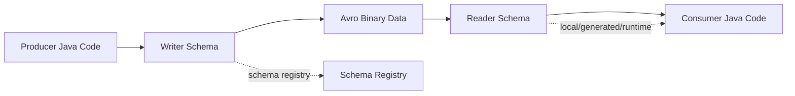
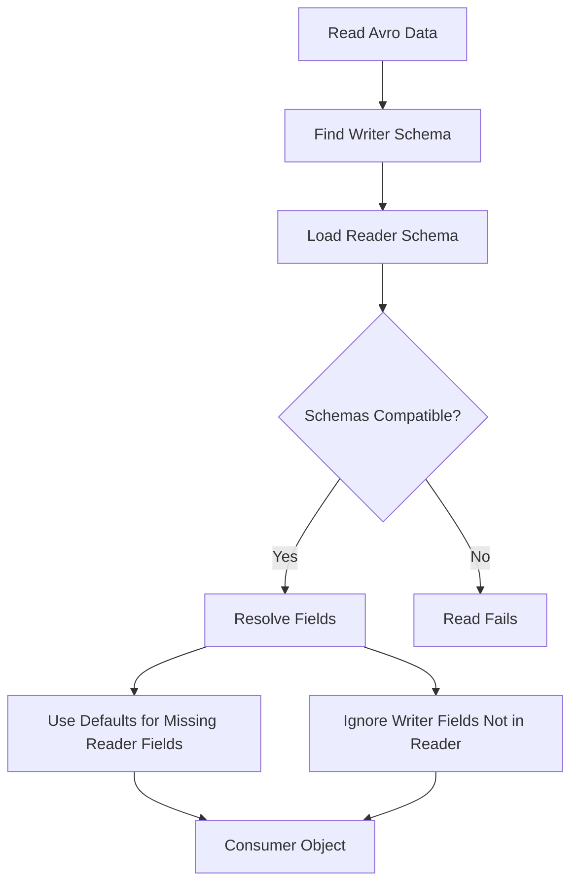
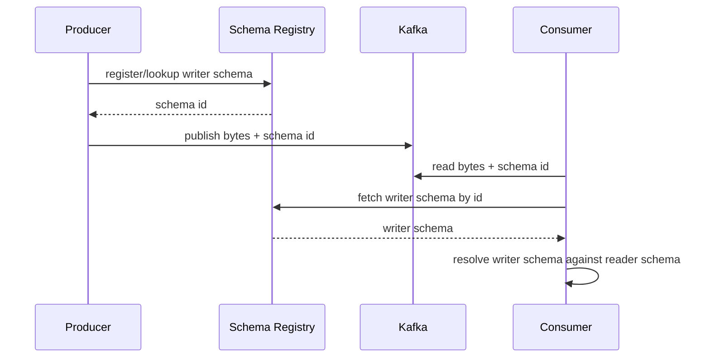

# Part 017 — Avro Contract Engineering: Schema Resolution, Defaults, Union Types, and Evolution

## Tujuan Pembelajaran

Avro sering dipakai di Kafka/event streaming karena schema-nya eksplisit, binary encoding-nya compact, dan evolution model-nya kuat. Tetapi banyak bug enterprise justru muncul karena engineer memahami Avro sebagai:

```text
.avsc file -> generated Java class -> Kafka payload
```

Itu terlalu dangkal.

Avro contract engineering harus dipahami sebagai:

> Perjanjian antara writer schema yang dipakai producer saat menulis data dan reader schema yang dipakai consumer saat membaca data.

Setelah part ini, kamu harus mampu:

1. membaca Avro schema sebagai contract, bukan sekadar generator input;
2. memahami writer schema vs reader schema;
3. menjelaskan schema resolution;
4. memakai defaults dengan benar;
5. mendesain nullable field memakai union secara aman;
6. memakai logical types untuk decimal, date, timestamp, UUID, dan duration-like needs;
7. menentukan namespace dan record naming strategy;
8. memakai aliases secara hati-hati;
9. membedakan backward, forward, full, dan transitive compatibility;
10. menghindari perubahan schema yang kelihatan kecil tetapi breaking;
11. mengintegrasikan Avro dengan Java, Maven/Gradle, Kafka, dan schema registry;
12. membuat review checklist untuk Avro event contracts.

---

## 1. Why Avro Is Different

Avro tidak hanya menyimpan bytes. Avro data dibaca dengan schema.

Mental model:



Avro compatibility bergantung pada kemampuan reader schema membaca data yang ditulis writer schema.

Ini berbeda dari JSON yang sering loose dan Protobuf yang field-number oriented.

---

## 2. Avro Schema Anatomy

Contoh schema:

```json
{
  "type": "record",
  "name": "CaseApproved",
  "namespace": "com.acme.case.events",
  "doc": "A case has been approved by an authorized actor.",
  "fields": [
    {
      "name": "eventId",
      "type": "string"
    },
    {
      "name": "caseId",
      "type": "string"
    },
    {
      "name": "caseVersion",
      "type": "long"
    },
    {
      "name": "approvedAt",
      "type": {
        "type": "long",
        "logicalType": "timestamp-millis"
      }
    },
    {
      "name": "reasonCode",
      "type": "string"
    }
  ]
}
```

Key elements:

| Element | Meaning |
|---|---|
| `type` | Avro type: record, enum, array, map, union, fixed, primitive |
| `name` | named type identity |
| `namespace` | qualified naming boundary |
| `fields` | record fields |
| `doc` | documentation, not compatibility semantics |
| `default` | value used during reader/writer resolution when field missing |
| `aliases` | alternative names used during schema resolution |
| `logicalType` | semantic type layered over primitive |
| `order` | sort order metadata for fields, rarely central to event contracts |

---

## 3. Primitive and Complex Types

### 3.1 Primitive Types

Common Avro primitives:

| Avro type | Java mapping idea | Use |
|---|---|---|
| `null` | `null` | absence/null branch |
| `boolean` | `boolean`/`Boolean` | binary truth |
| `int` | `int`/`Integer` | 32-bit integer |
| `long` | `long`/`Long` | 64-bit integer |
| `float` | `float` | rarely for business contract |
| `double` | `double` | avoid for money |
| `bytes` | `ByteBuffer`/`byte[]` | binary data, decimal logical type |
| `string` | `CharSequence`/`String` | text, ID, enum-like open values |

### 3.2 Complex Types

| Type | Use |
|---|---|
| `record` | structured object |
| `enum` | closed symbolic set |
| `array` | ordered list |
| `map` | string-keyed map |
| `union` | one of multiple schemas |
| `fixed` | fixed-size binary data |

---

## 4. Writer Schema and Reader Schema

Producer writes data with writer schema.

Consumer reads data using reader schema.

If schemas differ, Avro applies schema resolution.

Example:

Writer schema v1:

```json
{
  "type": "record",
  "name": "CustomerRegistered",
  "namespace": "com.acme.customer.events",
  "fields": [
    { "name": "customerId", "type": "string" },
    { "name": "registeredAt", "type": { "type": "long", "logicalType": "timestamp-millis" } }
  ]
}
```

Reader schema v2 adds field with default:

```json
{
  "type": "record",
  "name": "CustomerRegistered",
  "namespace": "com.acme.customer.events",
  "fields": [
    { "name": "customerId", "type": "string" },
    { "name": "registeredAt", "type": { "type": "long", "logicalType": "timestamp-millis" } },
    { "name": "registrationChannel", "type": "string", "default": "UNKNOWN" }
  ]
}
```

Consumer using v2 can read old v1 data because `registrationChannel` has default.

Important:

> Avro default is used by reader when the writer did not provide a field. It does not mean producer may omit the field when writing with a schema that requires it.

---

## 5. Schema Resolution Mental Model

When reading:

```text
writer data + writer schema + reader schema -> resolved record
```

Avro resolution checks whether writer and reader schemas match or can be promoted/resolved.



Key rules for records:

1. fields are matched by name, not position;
2. writer fields not in reader are ignored;
3. reader fields not in writer must have default or read fails;
4. aliases can help match renamed fields/types;
5. doc fields do not affect resolution;
6. type changes only work when Avro allows promotion/compatibility.

---

## 6. Field Defaults

Defaults are one of the most misunderstood Avro features.

### 6.1 Adding Field Safely

Safe-ish:

```json
{
  "name": "registrationChannel",
  "type": "string",
  "default": "UNKNOWN"
}
```

Old data lacks field. New reader uses default.

### 6.2 Adding Field Without Default

Breaking for backward reads:

```json
{
  "name": "registrationChannel",
  "type": "string"
}
```

New reader cannot read old data.

### 6.3 Default Does Not Make Field Optional for Writer

If schema says field exists, writer must provide it when writing with that schema.

Bad assumption:

```text
Field has default, so producer does not need to set it.
```

Reality:

```text
Default is for reader schema resolution when writer schema lacks the field.
```

Generated Java may initialize defaults in builders, but that is implementation convenience, not a license to ignore contract semantics.

---

## 7. Nullable Fields and Union Types

Avro does not have a separate nullable keyword. Nullable is commonly modeled as union with `null`.

Example:

```json
{
  "name": "middleName",
  "type": ["null", "string"],
  "default": null
}
```

### 7.1 Union Default Rule

For union fields, the default value must match the first branch.

Good:

```json
{
  "name": "middleName",
  "type": ["null", "string"],
  "default": null
}
```

Bad:

```json
{
  "name": "middleName",
  "type": ["string", "null"],
  "default": null
}
```

Because `null` is not first branch.

### 7.2 Null First Convention

For optional fields, use:

```json
"type": ["null", "string"],
"default": null
```

This is common and readable.

### 7.3 Avoid Large Unions

Bad:

```json
{
  "name": "value",
  "type": ["null", "string", "int", "long", "double", "boolean", "bytes"]
}
```

This creates weak contract. Prefer explicit records or separate event types.

### 7.4 Union of Records

Polymorphic event payload example:

```json
{
  "name": "payload",
  "type": [
    "com.acme.case.events.CaseSubmittedPayload",
    "com.acme.case.events.CaseApprovedPayload"
  ]
}
```

This can work, but schema registry, Java generation, and consumer ergonomics can get complex. For multi-event topics, many teams prefer envelope with eventType plus payload schema per event, not one giant union.

---

## 8. Type Promotion

Avro allows some numeric promotions.

Examples commonly supported:

```text
int -> long -> float -> double
```

But do not use promotion casually.

Changing:

```json
{ "name": "amount", "type": "int" }
```

to:

```json
{ "name": "amount", "type": "long" }
```

may be structurally compatible in one direction, but semantic questions remain:

1. why was range expanded?
2. can old consumers handle new large values?
3. does generated Java type change?
4. does downstream database column support it?
5. does schema registry mode allow it?
6. does SDK public API break?

Structural compatibility is not enough.

---

## 9. Logical Types

Logical types add semantics over primitive types.

Common logical types:

| Logical type | Underlying type | Use |
|---|---|---|
| `decimal` | `bytes` or `fixed` | money/precise decimal |
| `uuid` | `string` | UUID value |
| `date` | `int` | days since Unix epoch |
| `time-millis` | `int` | time of day millis |
| `time-micros` | `long` | time of day micros |
| `timestamp-millis` | `long` | instant millis |
| `timestamp-micros` | `long` | instant micros |
| `local-timestamp-millis` | `long` | local timestamp without timezone |
| `duration` | `fixed` | duration representation |

### 9.1 Timestamp

Event time:

```json
{
  "name": "occurredAt",
  "type": {
    "type": "long",
    "logicalType": "timestamp-millis"
  }
}
```

Java mapping often becomes `Instant` or `java.time` type depending generator/conversion.

Avoid `local-timestamp-*` for integration events unless business semantics truly require local time without timezone.

### 9.2 Date

Birth date:

```json
{
  "name": "birthDate",
  "type": {
    "type": "int",
    "logicalType": "date"
  }
}
```

This maps conceptually to `LocalDate`.

### 9.3 Decimal for Money

Money record:

```json
{
  "type": "record",
  "name": "Money",
  "namespace": "com.acme.common",
  "fields": [
    {
      "name": "currency",
      "type": "string"
    },
    {
      "name": "value",
      "type": {
        "type": "bytes",
        "logicalType": "decimal",
        "precision": 18,
        "scale": 2
      }
    }
  ]
}
```

Contract questions:

1. Is scale fixed?
2. Can value be negative?
3. Is currency ISO 4217?
4. Does precision handle all future values?
5. Is rounding policy documented?
6. Does Java generated code map to `BigDecimal` correctly?

### 9.4 Logical Type Compatibility

Changing logical type or precision/scale can be breaking semantically and operationally.

Example:

```text
decimal scale 2 -> scale 4
```

This changes money semantics.

---

## 10. Records, Namespaces, and Full Names

Avro named types use name + namespace.

```json
{
  "type": "record",
  "name": "CaseApproved",
  "namespace": "com.acme.case.events"
}
```

Full name:

```text
com.acme.case.events.CaseApproved
```

### 10.1 Naming Strategy

Good:

```text
com.acme.case.events.CaseApproved
com.acme.customer.events.CustomerRegistered
com.acme.common.Money
```

Bad:

```text
Event
Data
Payload
com.acme.servicea.output.CustomerEvent
```

### 10.2 Namespace Is Contract

Changing namespace can break schema resolution unless aliases are used.

Do not rename namespace because Java package changed internally.

---

## 11. Aliases

Aliases help schema resolution for renamed records or fields.

Field rename example:

Old:

```json
{ "name": "status", "type": "string" }
```

New reader:

```json
{
  "name": "lifecycleStatus",
  "type": "string",
  "aliases": ["status"],
  "default": "UNKNOWN"
}
```

This tells reader that old writer field `status` can map to new field `lifecycleStatus`.

### 11.1 Use Aliases Carefully

Aliases are not a magic migration strategy.

Questions:

1. Does semantic meaning truly remain same?
2. Are all consumers using Avro resolution with aliases?
3. Does schema registry compatibility check understand intended alias behavior?
4. Does generated Java class surface change break consumer code?
5. Do downstream systems store old field name?
6. Does documentation reflect migration?

### 11.2 Do Not Use Alias to Hide Semantic Change

Bad:

```text
old field status meant account transaction access
new field lifecycleStatus means lifecycle state
alias status -> lifecycleStatus
```

If meaning changed, alias is dishonest.

---

## 12. Enums in Avro

Enum:

```json
{
  "type": "enum",
  "name": "CaseStatus",
  "namespace": "com.acme.case.events",
  "symbols": [
    "SUBMITTED",
    "UNDER_REVIEW",
    "APPROVED",
    "CLOSED"
  ]
}
```

### 12.1 Enum Compatibility Risk

Adding enum symbol can break old readers if they do not know the new symbol.

Example:

New writer emits:

```text
REOPENED
```

Old reader enum does not include `REOPENED`.

Read may fail depending schema resolution/defaults.

### 12.2 Enum Default

Avro supports enum default in schema to use when reader lacks writer symbol, depending schema usage.

Example:

```json
{
  "type": "enum",
  "name": "CaseStatus",
  "symbols": [
    "UNKNOWN",
    "SUBMITTED",
    "UNDER_REVIEW",
    "APPROVED",
    "CLOSED"
  ],
  "default": "UNKNOWN"
}
```

This can make unknown symbols safer for readers.

### 12.3 Open Taxonomy Alternative

If values may evolve frequently, consider string-backed field:

```json
{
  "name": "riskBand",
  "type": "string",
  "doc": "Known values include LOW, MEDIUM, HIGH. Consumers must tolerate unknown values."
}
```

Trade-off:

- less schema-enforced;
- more forward-compatible;
- requires governance docs/tests.

---

## 13. Fixed and Bytes

`fixed`:

```json
{
  "type": "fixed",
  "name": "Md5",
  "size": 16
}
```

Use when binary size is exactly fixed.

`bytes`:

```json
{
  "name": "documentHash",
  "type": "bytes"
}
```

Avoid exposing arbitrary binary fields unless clearly needed. Consider base64 strings if interoperability/debuggability matters more than compactness.

---

## 14. Maps and Arrays

Array:

```json
{
  "name": "evidenceIds",
  "type": {
    "type": "array",
    "items": "string"
  },
  "default": []
}
```

Map:

```json
{
  "name": "attributes",
  "type": {
    "type": "map",
    "values": "string"
  },
  "default": {}
}
```

Map keys are strings. Maps are tempting for arbitrary metadata, but dangerous if they become ungoverned schema escape hatch.

Policy:

1. use explicit fields for stable contract data;
2. use map only for true dynamic metadata;
3. bound allowed keys if possible;
4. document whether consumers may depend on map entries;
5. avoid sensitive data leakage through metadata maps.

---

## 15. Schema Evolution: Safe, Dangerous, Breaking

### 15.1 Usually Safe

| Change | Condition |
|---|---|
| Add field with default | New readers can read old data |
| Remove field | Old data can still be read by new reader if reader does not need it |
| Add optional nullable field with default null | Common safe addition |
| Add doc text | Resolution ignores doc |
| Add alias | May help migration |
| Widen int to long | Check both registry mode and consumer semantics |

### 15.2 Dangerous

| Change | Why |
|---|---|
| Add enum symbol | Old readers may fail |
| Change default value | Semantic behavior changes |
| Change logical type | Reader/writer or semantic break |
| Change decimal precision/scale | Money break |
| Rename field with alias | Java/generated code and semantics may still break |
| Change namespace with alias | Tooling/registry/Java package impact |
| Add field with default but business requires producer-set value | Silent false data |
| Change doc to redefine meaning | Semantic breaking despite schema pass |

### 15.3 Breaking

| Change | Why |
|---|---|
| Add field without default | New reader cannot read old data |
| Remove field required by old reader | Old reader cannot read new data depending direction |
| Change field type incompatibly | Resolution fails |
| Rename field without alias/default | Resolution fails |
| Remove enum symbol used by data | Read fails |
| Change record name/namespace without alias | Named type mismatch |
| Change union branch order with default issue | Defaults break |
| Change fixed size | Incompatible |
| Change key semantic outside schema | Kafka contract break |

---

## 16. Compatibility Modes

Schema registries often discuss:

| Mode | Meaning |
|---|---|
| Backward | New schema can read data written with previous schema |
| Forward | Previous schema can read data written with new schema |
| Full | Both backward and forward |
| Backward transitive | New schema can read all previous versions |
| Forward transitive | Old schemas can read data from new schema across versions |
| Full transitive | Both directions across all versions |
| None | No compatibility enforcement |

### 16.1 Event Streaming Recommendation

For Kafka event streams with replay and lagging consumers, prefer stronger modes such as backward transitive or full transitive depending producer/consumer model.

But compatibility mode choice depends on:

1. whether old consumers remain active;
2. whether old events are replayed;
3. whether data is stored long-term;
4. whether producer can coordinate upgrades;
5. whether event schema is public/internal;
6. whether generated clients are used.

### 16.2 Backward Example

New reader reads old data.

Add field with default.

### 16.3 Forward Example

Old reader reads new data.

Adding field is often okay because old reader ignores unknown writer field.

But if new writer emits enum symbol unknown to old reader, old reader may fail.

### 16.4 Full

Both new and old readers can read each other’s data. Harder but safer for independent deployability.

---

## 17. Avro + Kafka Schema Registry

Common flow:



### 17.1 Subject Naming

Subject strategy matters.

Common strategies:

| Strategy | Meaning |
|---|---|
| Topic name | subject tied to topic |
| Record name | subject tied to fully qualified record |
| Topic-record name | topic + record combination |

Decision depends on:

1. one schema per topic vs multiple event types per topic;
2. record reuse across topics;
3. compatibility boundary;
4. governance ownership;
5. consumer discovery.

For multi-event domain topic, record-name or topic-record strategy often fits better than simple topic-name strategy, but evaluate registry/tooling.

---

## 18. Java Specific vs Generic Records

### 18.1 SpecificRecord

Generated Java classes.

Pros:

1. type-safe;
2. fast;
3. IDE-friendly;
4. compile-time schema use;
5. common in Java services.

Cons:

1. generated code churn;
2. build complexity;
3. Java package tied to Avro namespace;
4. nullable union awkwardness;
5. open enum handling difficult.

### 18.2 GenericRecord

Dynamic schema at runtime.

Pros:

1. flexible;
2. good for generic processors;
3. works with many schemas;
4. less generated code.

Cons:

1. less type-safe;
2. runtime errors;
3. verbose field access;
4. weaker domain modeling.

### 18.3 Recommended

Use SpecificRecord for domain-specific producers/consumers with stable schemas. Use GenericRecord for platform tooling, routers, schema validators, DLQ processors, and data pipelines.

---

## 19. Avro Maven Example

Typical dependency:

```xml
<dependency>
    <groupId>org.apache.avro</groupId>
    <artifactId>avro</artifactId>
    <version>${avro.version}</version>
</dependency>
```

Generation plugin concept:

```xml
<plugin>
    <groupId>org.apache.avro</groupId>
    <artifactId>avro-maven-plugin</artifactId>
    <version>${avro.version}</version>
    <executions>
        <execution>
            <phase>generate-sources</phase>
            <goals>
                <goal>schema</goal>
            </goals>
            <configuration>
                <sourceDirectory>${project.basedir}/src/main/avro</sourceDirectory>
                <outputDirectory>${project.build.directory}/generated-sources/avro</outputDirectory>
                <stringType>String</stringType>
            </configuration>
        </execution>
    </executions>
</plugin>
```

Pin Avro version. Review generated code. Do not float generator versions casually.

---

## 20. Avro Gradle Concept

```kotlin
plugins {
    id("java")
    id("com.github.davidmc24.gradle.plugin.avro") version "<version>"
}

dependencies {
    implementation("org.apache.avro:avro:<version>")
}

avro {
    stringType.set("String")
}
```

Exact plugin/version depends on organization. Governance point: schema generation must be deterministic and part of CI.

---

## 21. Java Nullable Union Pitfalls

Avro nullable union may generate:

1. nullable Java field;
2. `Object` for complex unions;
3. generated union helper depending library;
4. awkward builder defaults.

Example field:

```json
{
  "name": "middleName",
  "type": ["null", "string"],
  "default": null
}
```

Generated Java may allow `null`.

Contract needs still define:

1. absent vs null for old/new schema;
2. whether consumer treats null as unknown, cleared, not applicable;
3. whether producer may emit null;
4. whether default null has semantic meaning.

Do not let generated Java nulls become your domain model. Map to explicit internal type if needed.

---

## 22. Event Envelope with Avro

Envelope schema:

```json
{
  "type": "record",
  "name": "EventMetadata",
  "namespace": "com.acme.events",
  "fields": [
    { "name": "eventId", "type": "string" },
    { "name": "eventType", "type": "string" },
    { "name": "source", "type": "string" },
    {
      "name": "occurredAt",
      "type": { "type": "long", "logicalType": "timestamp-millis" }
    },
    {
      "name": "publishedAt",
      "type": ["null", { "type": "long", "logicalType": "timestamp-millis" }],
      "default": null
    },
    { "name": "schemaRef", "type": "string" },
    { "name": "correlationId", "type": ["null", "string"], "default": null },
    { "name": "causationId", "type": ["null", "string"], "default": null }
  ]
}
```

CaseApproved:

```json
{
  "type": "record",
  "name": "CaseApproved",
  "namespace": "com.acme.case.events",
  "fields": [
    { "name": "metadata", "type": "com.acme.events.EventMetadata" },
    { "name": "payload", "type": "com.acme.case.events.CaseApprovedPayload" }
  ]
}
```

Payload:

```json
{
  "type": "record",
  "name": "CaseApprovedPayload",
  "namespace": "com.acme.case.events",
  "fields": [
    { "name": "caseId", "type": "string" },
    { "name": "caseVersion", "type": "long" },
    { "name": "approvedBy", "type": "string" },
    {
      "name": "approvedAt",
      "type": { "type": "long", "logicalType": "timestamp-millis" }
    },
    { "name": "reasonCode", "type": "string" }
  ]
}
```

---

## 23. Avro Contract Testing

### 23.1 Schema Compatibility Test

In CI:

```text
new schema vs latest schema
new schema vs all previous schemas if transitive
```

Test:

1. registry compatibility check;
2. local compatibility check;
3. generated Java compile;
4. golden event deserialization;
5. old reader/new writer scenario;
6. new reader/old writer scenario.

### 23.2 Golden Old Data Test

Store old encoded event or JSON representation.

Pseudo:

```java
@Test
void newReaderCanReadV1CaseApprovedEvent() {
    byte[] oldBytes = fixtureBytes("case-approved-v1.avro");
    Schema writerSchema = loadSchema("CaseApproved-v1.avsc");
    Schema readerSchema = loadSchema("CaseApproved-v2.avsc");

    CaseApproved event = avroReader.read(oldBytes, writerSchema, readerSchema);

    assertThat(event.getPayload().getCaseId()).isEqualTo("case_123");
    assertThat(event.getPayload().getNewOptionalField()).isEqualTo("UNKNOWN");
}
```

### 23.3 Old Reader/New Data Test

If forward/full compatibility required, test old generated consumer can read new data.

### 23.4 Semantic Test

Schema compatibility will not catch:

1. changed event meaning;
2. changed time semantics;
3. changed amount scale meaning;
4. changed enum interpretation;
5. changed ID format;
6. changed Kafka key.

Write explicit tests/reviews.

---

## 24. Avro Schema Review Checklist

### 24.1 Naming

- Is record name domain-specific?
- Is namespace stable?
- Is Java package not leaking implementation service name?
- Are common types reused intentionally?

### 24.2 Fields

- Are required fields truly required forever?
- Do added fields have defaults?
- Are nullable unions ordered with null first if default null?
- Are defaults semantically correct?
- Are maps used only for true dynamic data?

### 24.3 Types

- Is money modeled as decimal + currency?
- Are timestamps logical types?
- Is date-only modeled as date?
- Are IDs strings unless strong reason otherwise?
- Are enums closed intentionally?

### 24.4 Compatibility

- What compatibility mode applies?
- Does change pass registry check?
- Does generated Java compile?
- Do old fixtures deserialize?
- Are aliases used honestly?
- Did semantic meaning change?

### 24.5 Governance

- Is owner known?
- Is schema subject known?
- Is namespace registered?
- Is lifecycle stable/experimental/deprecated?
- Is data classification considered?
- Is event topic/key unaffected?

---

## 25. Common Avro Anti-Patterns

### 25.1 Adding Required Field Without Default

Breaks old data reads.

### 25.2 Nullable Union Wrong Default

```json
"type": ["string", "null"],
"default": null
```

Default does not match first union branch.

### 25.3 Using Enum for Open Taxonomy

Old readers fail when new symbol appears.

### 25.4 Changing Namespace Casually

Named type identity changes.

### 25.5 Relying on doc for Semantics

`doc` is for humans; schema resolution ignores it.

### 25.6 Entity-to-Avro Dump

Publishing database model as Avro schema.

### 25.7 Generic Map Escape Hatch

Everything goes into `attributes`.

### 25.8 Decimal as double

Money with `double` is dangerous.

### 25.9 Assuming Compatibility Check Catches Kafka Key Change

Schema registry does not know message key.

### 25.10 Overusing Aliases

Aliases do not make semantic changes safe.

---

## 26. Practice Lab

### Lab 1 — Safe Field Addition

Schema v1:

```json
{
  "type": "record",
  "name": "CustomerRegistered",
  "namespace": "com.acme.customer.events",
  "fields": [
    { "name": "customerId", "type": "string" }
  ]
}
```

Add `registrationChannel` safely.

### Lab 2 — Nullable Field

Add nullable `middleName` with correct union/default. Explain why branch order matters.

### Lab 3 — Enum Evolution

Existing enum:

```text
LOW, MEDIUM, HIGH
```

Need to add `CRITICAL`. Decide whether Avro enum or string-backed field is safer.

### Lab 4 — Rename Field

Rename `status` to `lifecycleStatus`. Design alias strategy and explain when it is unsafe.

### Lab 5 — Money Schema

Design `Money` type for IDR/USD with precision/scale and explain compatibility risks of changing scale later.

### Lab 6 — Compatibility Classification

Classify:

1. add field with default;
2. add field without default;
3. remove field;
4. change int to long;
5. change string to int;
6. add enum symbol;
7. remove enum symbol;
8. change namespace;
9. add alias;
10. change doc only;
11. change decimal scale;
12. change Kafka message key.

---

## 27. Senior Engineer Heuristics

1. **Avro compatibility is reader/writer schema compatibility.**
2. **Defaults are for reading missing fields, not permission to omit writer fields.**
3. **Nullable means union with null; branch order matters for defaults.**
4. **Fields match by name, not position.**
5. **doc changes do not affect schema resolution.**
6. **Aliases help renames only when semantics truly remain compatible.**
7. **Enums are closed unless you deliberately design unknown handling.**
8. **Logical types carry business semantics; changing them can be breaking.**
9. **Namespace is type identity, not just Java packaging.**
10. **Schema registry compatibility is necessary but not sufficient.**
11. **Generated Java compatibility and Avro schema compatibility are different.**
12. **Use SpecificRecord for domain services, GenericRecord for platform tooling.**
13. **Do not dump persistence entities into Avro.**
14. **Transitive compatibility matters for replay and lagging consumers.**
15. **Every Avro change needs both structural and semantic review.**

---

## 28. Summary

Avro contract engineering is about schema resolution between writer and reader schemas. This makes Avro powerful for event evolution, but only if defaults, unions, logical types, namespaces, aliases, enums, and compatibility modes are handled with discipline.

Main takeaways:

1. Avro data is read with writer and reader schema;
2. defaults are critical for adding fields safely;
3. nullable fields use union with `null`, and default must match union order;
4. logical types should be used for time, date, decimal, UUID-like semantics;
5. enums can be dangerous for open taxonomies;
6. namespace and name are contract identity;
7. aliases help with renames but cannot fix semantic changes;
8. schema registry compatibility should be part of CI;
9. Java generated code must stay at event boundary;
10. Kafka topic/key/retention changes remain contract changes outside Avro schema.

Part berikutnya membahas Protobuf and gRPC contract engineering: field numbers, presence, reserved fields, enum evolution, oneof, service contracts, and Java generated code behavior.
