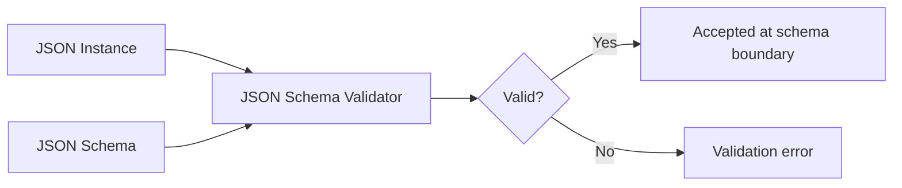
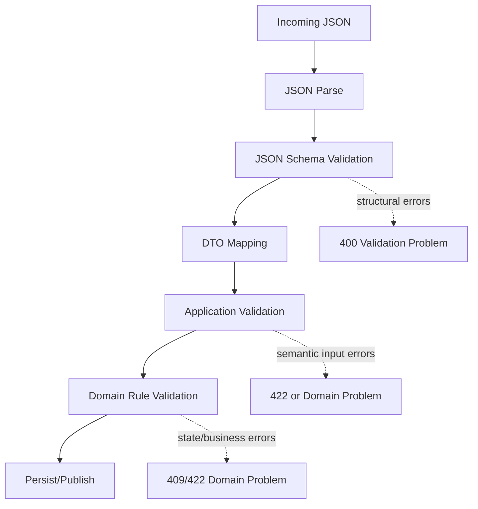

# Part 019 — JSON Schema for Contract Engineers: Constraints, Composition, Dialects, and Validation Boundaries

## Tujuan Pembelajaran

JSON Schema sering dipakai untuk validasi payload JSON, tetapi banyak engineer memperlakukannya sebagai daftar field dan `required`. Itu terlalu dangkal.

JSON Schema adalah bahasa kontrak untuk mendeskripsikan struktur dan constraint JSON data. Ia dapat dipakai untuk:

1. API request/response schema;
2. event payload schema;
3. configuration schema;
4. webhook contract;
5. message envelope validation;
6. schema registry artifact;
7. form generation;
8. documentation;
9. policy validation;
10. compatibility governance.

Namun JSON Schema juga punya banyak jebakan:

- `required` sering disalahpahami;
- `nullable` berbeda antara OpenAPI 3.0 dan JSON Schema;
- `additionalProperties` sering diabaikan;
- `oneOf`/`anyOf`/`allOf` sering dipakai salah;
- `$id`, `$ref`, dan `$defs` sering membingungkan;
- format validation sering tidak seketat yang dikira;
- schema validation sering dicampur dengan business validation;
- schema compatibility tidak otomatis berarti semantic compatibility.

Setelah part ini, kamu harus mampu:

1. membaca JSON Schema sebagai contract;
2. mendesain schema object, array, string, number, enum, const, composition;
3. memahami `required`, null, absent, default, and additional properties;
4. memakai `$id`, `$ref`, `$defs`, anchors, dan modularization;
5. membedakan assertion, annotation, and applicator keywords;
6. menentukan validation boundary antara syntax/shape/business rule;
7. menyelaraskan JSON Schema dengan OpenAPI;
8. memakai JSON Schema di Java runtime dan CI;
9. menilai schema changes dari sisi compatibility;
10. menghindari schema yang valid tetapi buruk sebagai contract.

---

## 1. JSON Schema Mental Model

JSON Schema adalah schema untuk JSON values.

JSON value bisa berupa:

1. object;
2. array;
3. string;
4. number;
5. integer;
6. boolean;
7. null.

Schema bukan Java class. Schema bukan DTO. Schema adalah kontrak data.



Important:

> Valid under schema does not necessarily mean valid under business rules.

Example:

```json
{
  "birthDate": "2030-01-01"
}
```

Schema may validate it as `format: date`, but business may reject future birth date.

---

## 2. Dialects and `$schema`

JSON Schema has dialects/versions.

Modern contract should explicitly declare dialect:

```json
{
  "$schema": "https://json-schema.org/draft/2020-12/schema",
  "$id": "https://schemas.acme.com/customer/CustomerRegistered.schema.json",
  "type": "object"
}
```

Why `$schema` matters:

1. validator knows keyword semantics;
2. draft differences are real;
3. OpenAPI tooling may support subset/variant;
4. compatibility/diff tooling needs stable interpretation.

Do not assume every validator supports Draft 2020-12. Tooling maturity matters.

---

## 3. Core Vocabulary

| Concept | Meaning |
|---|---|
| instance | JSON data being validated |
| schema | JSON object/boolean defining validation rules |
| dialect | version/vocabulary of JSON Schema |
| keyword | schema property with special meaning |
| assertion | keyword that can make validation fail |
| annotation | keyword that adds metadata |
| applicator | keyword that applies subschemas |
| subschema | nested schema |
| reference | `$ref` to another schema/subschema |
| vocabulary | group of keywords with semantics |

Example:

```json
{
  "type": "string",
  "minLength": 1,
  "description": "Customer display name."
}
```

- `type`, `minLength` are assertions.
- `description` is annotation.

---

## 4. Boolean Schemas

JSON Schema can be boolean.

```json
true
```

means accepts everything.

```json
false
```

means accepts nothing.

Useful in composition and advanced schemas, but avoid in business contracts unless clear.

Example:

```json
{
  "type": "object",
  "properties": {
    "legacyField": false
  }
}
```

This rejects `legacyField` if present.

---

## 5. Object Schema Basics

```json
{
  "type": "object",
  "required": ["customerId", "displayName"],
  "properties": {
    "customerId": {
      "type": "string"
    },
    "displayName": {
      "type": "string",
      "minLength": 1,
      "maxLength": 200
    }
  },
  "additionalProperties": false
}
```

Key points:

| Keyword | Meaning |
|---|---|
| `type: object` | instance must be object |
| `properties` | schemas for named properties |
| `required` | property names that must be present |
| `additionalProperties` | schema/boolean for properties not listed |
| `propertyNames` | validates property names |
| `minProperties` / `maxProperties` | object size constraints |
| `dependentRequired` | if one property exists, require others |
| `dependentSchemas` | if property exists, apply schema |

---

## 6. Required vs Nullable vs Absent

Critical concept.

Schema:

```json
{
  "type": "object",
  "required": ["displayName"],
  "properties": {
    "displayName": {
      "type": "string"
    },
    "middleName": {
      "type": ["string", "null"]
    }
  }
}
```

Meaning:

| Field | Required? | Null allowed? |
|---|---:|---:|
| `displayName` | yes | no |
| `middleName` | no | yes if present |
| unknown fields | depends on additionalProperties | depends |

Important:

- `required` means property must exist.
- `type: ["string", "null"]` means value may be string or null.
- A field can be required and nullable.
- A field can be optional and non-nullable.
- Absent and null are different.

### 6.1 Required Nullable

```json
{
  "type": "object",
  "required": ["middleName"],
  "properties": {
    "middleName": {
      "type": ["string", "null"]
    }
  }
}
```

Valid:

```json
{ "middleName": null }
```

Invalid:

```json
{}
```

### 6.2 Optional Non-Nullable

```json
{
  "type": "object",
  "properties": {
    "middleName": {
      "type": "string"
    }
  }
}
```

Valid:

```json
{}
```

Valid:

```json
{ "middleName": "Sari" }
```

Invalid:

```json
{ "middleName": null }
```

---

## 7. `default` Is Annotation

In JSON Schema, `default` is annotation. It does not mean validator will insert the value.

Example:

```json
{
  "type": "object",
  "properties": {
    "pageSize": {
      "type": "integer",
      "default": 50
    }
  }
}
```

A standard validator generally validates:

```json
{}
```

as valid, but does not mutate it into:

```json
{ "pageSize": 50 }
```

Defaulting is application behavior.

Contract must say:

1. is field optional?
2. if absent, does provider default?
3. what is default?
4. is default stable?
5. does defaulting happen before business validation?

Do not rely on JSON Schema `default` alone for runtime behavior.

---

## 8. Additional Properties

### 8.1 Strict Object

```json
{
  "type": "object",
  "properties": {
    "customerId": { "type": "string" }
  },
  "additionalProperties": false
}
```

Rejects:

```json
{
  "customerId": "cus_123",
  "typoField": "x"
}
```

### 8.2 Open Object

If omitted, additional properties are generally allowed.

```json
{
  "type": "object",
  "properties": {
    "customerId": { "type": "string" }
  }
}
```

This accepts unknown fields.

### 8.3 Typed Additional Properties

```json
{
  "type": "object",
  "additionalProperties": {
    "type": "string"
  }
}
```

Useful for labels/metadata maps.

### 8.4 Contract Policy

Recommended:

| Context | Policy |
|---|---|
| command/request payload | usually `additionalProperties: false` |
| response payload | tolerate consumer ignoring unknown fields; schema can still document strict known structure |
| metadata map | typed `additionalProperties` |
| event envelope | strict metadata fields plus explicit extension area |
| external partner API | be explicit; no accidental open objects |

If you allow extensions:

```json
{
  "type": "object",
  "properties": {
    "customerId": { "type": "string" },
    "extensions": {
      "type": "object",
      "additionalProperties": true
    }
  },
  "additionalProperties": false
}
```

This prevents random top-level leakage while allowing controlled extension.

---

## 9. String Constraints

```json
{
  "type": "string",
  "minLength": 1,
  "maxLength": 200,
  "pattern": "^[A-Za-z0-9_-]+$"
}
```

Contract cautions:

1. regex dialect is ECMA-262-like in JSON Schema context; validate tooling behavior;
2. `minLength` counts characters, but Unicode handling may surprise;
3. `format` is not always assertion;
4. tightening maxLength is breaking;
5. changing pattern is often breaking;
6. empty string and null are different.

### 9.1 ID Field

```json
{
  "type": "string",
  "pattern": "^cus_[A-HJ-KM-NP-TV-Z0-9]{26}$",
  "description": "Stable customer identifier."
}
```

Be careful: if you constrain ID format too tightly, future ID migration becomes breaking.

---

## 10. Number and Integer Constraints

```json
{
  "type": "integer",
  "minimum": 0,
  "maximum": 1000
}
```

Keywords:

| Keyword | Meaning |
|---|---|
| `minimum` | inclusive min |
| `exclusiveMinimum` | exclusive min |
| `maximum` | inclusive max |
| `exclusiveMaximum` | exclusive max |
| `multipleOf` | numeric divisibility |

### 10.1 Money Warning

Do not model money as JSON number casually.

Bad:

```json
{
  "amount": {
    "type": "number"
  }
}
```

Potential issues:

1. floating point in consumers;
2. precision loss;
3. currency missing;
4. scale undefined;
5. rounding ambiguous.

Prefer:

```json
{
  "$defs": {
    "Money": {
      "type": "object",
      "required": ["currency", "value"],
      "properties": {
        "currency": {
          "type": "string",
          "minLength": 3,
          "maxLength": 3
        },
        "value": {
          "type": "string",
          "pattern": "^-?[0-9]+(\\.[0-9]+)?$"
        }
      },
      "additionalProperties": false
    }
  }
}
```

---

## 11. Array Constraints

```json
{
  "type": "array",
  "items": {
    "type": "string"
  },
  "minItems": 1,
  "maxItems": 100,
  "uniqueItems": true
}
```

Contract questions:

1. Is order meaningful?
2. Are duplicates allowed?
3. Is empty array different from absent?
4. Is array size bounded?
5. Does order have stable semantics?
6. Are items nullable?

### 11.1 Tuple-Like Arrays

Draft 2020-12 uses `prefixItems` for tuple validation.

```json
{
  "type": "array",
  "prefixItems": [
    { "type": "number" },
    { "type": "number" }
  ],
  "items": false,
  "minItems": 2,
  "maxItems": 2
}
```

For business contracts, prefer objects over tuple arrays unless there is strong reason.

Bad:

```json
[106.8, -6.2]
```

Better:

```json
{
  "longitude": 106.8,
  "latitude": -6.2
}
```

---

## 12. Enum and Const

### 12.1 Enum

```json
{
  "type": "string",
  "enum": ["PENDING", "APPROVED", "REJECTED"]
}
```

Closed set.

Adding enum value can be dangerous for old consumers.

### 12.2 Const

```json
{
  "const": "CaseApproved"
}
```

Useful for event type discriminator.

Example:

```json
{
  "type": "object",
  "required": ["eventType"],
  "properties": {
    "eventType": {
      "const": "CaseApproved"
    }
  }
}
```

### 12.3 Open Enum Pattern

If taxonomy evolves:

```json
{
  "type": "string",
  "description": "Known values: LOW, MEDIUM, HIGH. Consumers must tolerate unknown values."
}
```

JSON Schema cannot express “known but open enum” as a standard assertion without rejecting unknown values. Use documentation, examples, lint rules, and consumer tests.

---

## 13. Composition: allOf, anyOf, oneOf, not

### 13.1 allOf

All schemas must validate.

```json
{
  "allOf": [
    { "$ref": "#/$defs/EventEnvelopeBase" },
    {
      "type": "object",
      "properties": {
        "payload": { "$ref": "#/$defs/CaseApprovedPayload" }
      }
    }
  ]
}
```

Common misconception: `allOf` merges objects. Technically it applies multiple schemas. Tooling may display as inheritance, but validation is applicative.

### 13.2 anyOf

At least one schema must validate.

```json
{
  "anyOf": [
    { "$ref": "#/$defs/EmailContact" },
    { "$ref": "#/$defs/PhoneContact" }
  ]
}
```

Use when multiple schemas may overlap.

### 13.3 oneOf

Exactly one schema must validate.

```json
{
  "oneOf": [
    { "$ref": "#/$defs/DocumentVerification" },
    { "$ref": "#/$defs/BiometricVerification" }
  ]
}
```

Pitfall: if instance validates against two schemas, `oneOf` fails.

For discriminated unions, make schemas mutually exclusive with `const` discriminator.

### 13.4 not

Reject matching schema.

```json
{
  "not": {
    "required": ["legacyField"]
  }
}
```

Use sparingly.

---

## 14. Discriminator Pattern

JSON Schema itself can model discriminated variants using `oneOf` + `const`.

```json
{
  "oneOf": [
    { "$ref": "#/$defs/DocumentVerification" },
    { "$ref": "#/$defs/BiometricVerification" }
  ],
  "$defs": {
    "DocumentVerification": {
      "type": "object",
      "required": ["type", "documentNumber"],
      "properties": {
        "type": { "const": "DOCUMENT" },
        "documentNumber": { "type": "string" }
      },
      "additionalProperties": false
    },
    "BiometricVerification": {
      "type": "object",
      "required": ["type", "biometricSessionId"],
      "properties": {
        "type": { "const": "BIOMETRIC" },
        "biometricSessionId": { "type": "string" }
      },
      "additionalProperties": false
    }
  }
}
```

OpenAPI has discriminator support, but JSON Schema and OpenAPI tool support differs. Test with your generator/validator.

---

## 15. Conditional Schemas

Keywords:

- `if`;
- `then`;
- `else`;
- `dependentRequired`;
- `dependentSchemas`.

Example:

```json
{
  "type": "object",
  "properties": {
    "accountType": {
      "type": "string",
      "enum": ["BASIC", "PREMIUM"]
    },
    "incomeProofDocumentId": {
      "type": "string"
    }
  },
  "if": {
    "properties": {
      "accountType": { "const": "PREMIUM" }
    },
    "required": ["accountType"]
  },
  "then": {
    "required": ["incomeProofDocumentId"]
  }
}
```

This is structural/semantic-ish validation, but be careful not to encode complex business policy into JSON Schema if it changes often or requires external state.

---

## 16. `$id`, `$ref`, `$defs`

### 16.1 `$id`

`$id` identifies schema URI/base.

```json
{
  "$id": "https://schemas.acme.com/common/Money.schema.json",
  "$schema": "https://json-schema.org/draft/2020-12/schema",
  "type": "object"
}
```

Use stable, versioned or governance-controlled IDs.

### 16.2 `$defs`

Reusable subschemas.

```json
{
  "$defs": {
    "Money": {
      "type": "object",
      "required": ["currency", "value"],
      "properties": {
        "currency": { "type": "string" },
        "value": { "type": "string" }
      }
    }
  }
}
```

### 16.3 `$ref`

Reference schema/subschema.

```json
{
  "$ref": "#/$defs/Money"
}
```

External:

```json
{
  "$ref": "https://schemas.acme.com/common/Money.schema.json"
}
```

### 16.4 Reference Design Rules

1. use stable IDs;
2. avoid circular references unless validator/tooling supports;
3. bundle schemas for CI/publishing if external refs are difficult;
4. version common schemas intentionally;
5. do not change common schema semantics without impact analysis.

---

## 17. Modular Schema Repository

Example:

```text
schemas/
├── common/
│   ├── Money.schema.json
│   ├── EventMetadata.schema.json
│   └── Problem.schema.json
├── customer/
│   ├── CustomerRegistered.schema.json
│   └── CustomerSnapshotUpdated.schema.json
├── case/
│   ├── CaseApproved.schema.json
│   └── CaseSubmitted.schema.json
└── bundle/
    └── case-events.bundle.schema.json
```

Use bundling to make validation deterministic.

Repository metadata:

```text
schemas/catalog.yaml
schemas/owners.yaml
schemas/compatibility.yaml
schemas/deprecations.yaml
```

---

## 18. Format Keyword

`format` is annotation by default in some dialect/tooling unless format assertion is enabled.

Example:

```json
{
  "type": "string",
  "format": "email"
}
```

Do not assume every validator rejects invalid emails unless configured.

Common formats:

- `date`;
- `date-time`;
- `time`;
- `duration`;
- `email`;
- `hostname`;
- `ipv4`;
- `ipv6`;
- `uuid`;
- `uri`;
- `uri-reference`.

Contract rule:

> If format must be enforced, configure validator and test it.

For critical fields, combine format with pattern or application validation if necessary.

---

## 19. Unevaluated Properties

Modern JSON Schema includes keywords such as `unevaluatedProperties`, useful with composition.

Example:

```json
{
  "allOf": [
    { "$ref": "#/$defs/BaseEvent" },
    { "$ref": "#/$defs/CaseApprovedPayloadWrapper" }
  ],
  "unevaluatedProperties": false
}
```

This can help avoid `additionalProperties` problems with `allOf`.

But tool support and complexity vary. Use carefully and test.

---

## 20. Validation Boundary

Do not put all validation into JSON Schema.

### 20.1 Good for JSON Schema

1. JSON type;
2. required fields;
3. string length;
4. regex shape;
5. numeric bounds;
6. array size;
7. object structure;
8. enum/const when closed;
9. simple conditional structure;
10. additional properties policy.

### 20.2 Better for Application/Domain Validation

1. customer exists;
2. case is in correct state;
3. user has entitlement;
4. KYC verified;
5. balance sufficient;
6. birth date age rule by jurisdiction;
7. policy rule active;
8. uniqueness constraint;
9. cross-service reference validation;
10. time-window based business rules.

### 20.3 Boundary Diagram



Schema validation is an early boundary, not whole business truth.

---

## 21. JSON Schema and OpenAPI Alignment

OpenAPI 3.1 aligns much more closely with JSON Schema Draft 2020-12 than OpenAPI 3.0 did.

### 21.1 OpenAPI 3.0 Nullable

```yaml
type: string
nullable: true
```

### 21.2 OpenAPI 3.1 / JSON Schema Style

```yaml
type:
  - string
  - "null"
```

or JSON:

```json
{
  "type": ["string", "null"]
}
```

### 21.3 Contract Risk

If your tooling mixes:

- OpenAPI 3.0;
- OpenAPI 3.1;
- JSON Schema Draft 7;
- JSON Schema Draft 2020-12;

then nullability, composition, and validation behavior can drift.

Policy:

1. define supported dialect/version;
2. test validators/generators;
3. avoid keywords unsupported by target tools;
4. document limitations;
5. do not assume OpenAPI schema is arbitrary JSON Schema unless version supports it.

---

## 22. Java Validation Libraries

In Java, JSON Schema validation libraries vary in draft support and performance.

Contract engineering concerns:

1. which draft is supported?
2. is `format` asserted?
3. are external refs resolved?
4. is schema compiled/cached?
5. are validation errors machine-readable?
6. performance under large payloads?
7. streaming validation needed?
8. thread safety?
9. integration with Jackson?
10. error path format?

Pseudo usage:

```java
public final class JsonSchemaValidator {
    private final SchemaRegistry schemaRegistry;

    public ValidationResult validate(String schemaId, JsonNode payload) {
        JsonSchema schema = schemaRegistry.compiledSchema(schemaId);
        Set<ValidationMessage> messages = schema.validate(payload);

        return ValidationResult.from(messages);
    }
}
```

Do not compile schema per request. Cache compiled schemas.

---

## 23. Validation Error Mapping

JSON Schema validator errors must map to stable API/event error contract.

Raw validator message:

```text
$.birthDate: does not match format date
```

Canonical violation:

```json
{
  "field": "/birthDate",
  "code": "INVALID_DATE_FORMAT",
  "message": "birthDate must be an ISO-8601 date."
}
```

Rules:

1. do not expose validator internals directly;
2. convert paths to JSON Pointer consistently;
3. map keyword failures to stable violation codes;
4. avoid leaking sensitive rejected values;
5. aggregate useful errors;
6. preserve correlation/event ID.

Keyword-to-code example:

| JSON Schema keyword | Violation code |
|---|---|
| `required` | REQUIRED |
| `type` | INVALID_TYPE |
| `format` | INVALID_FORMAT |
| `minLength` | TOO_SHORT |
| `maxLength` | TOO_LONG |
| `pattern` | PATTERN_MISMATCH |
| `enum` | UNSUPPORTED_VALUE |
| `additionalProperties` | UNKNOWN_FIELD |
| `minimum` | BELOW_MINIMUM |
| `maximum` | ABOVE_MAXIMUM |
| `oneOf` | INVALID_VARIANT |

---

## 24. Runtime Validation for Events

Producer-side:

```java
schemaValidator.validate("CaseApproved", eventJson);
publisher.publish(eventJson);
```

Consumer-side:

```java
if (!schemaValidator.isValid("CaseApproved", eventJson)) {
    quarantine(eventJson, "SCHEMA_VALIDATION_FAILED");
    return;
}
handler.handle(eventJson);
```

Guidance:

| Location | Purpose |
|---|---|
| producer | prevent invalid events from entering stream |
| registry | prevent incompatible schema publication |
| consumer | protect consumer from bad/legacy/poison data |
| CI | prevent schema drift |
| staging | catch integration mismatch |
| production | validate selectively or at boundary depending risk/performance |

For high-volume Kafka, full runtime validation can be expensive. Balance with serializer validation, schema registry, and sampling.

---

## 25. Schema Compatibility for JSON Schema

JSON Schema compatibility is harder than Avro/Protobuf because JSON Schema is very expressive and semantic comparison can be complex.

Practical classification:

### 25.1 Often Backward-Compatible for Readers

1. add optional property;
2. widen allowed string length;
3. widen numeric bounds;
4. allow additional enum value only if consumers tolerate unknown;
5. allow null where previously not allowed, if consumers can handle;
6. relax pattern.

### 25.2 Often Breaking for Writers/Requests

1. add required property;
2. tighten maxLength;
3. tighten pattern;
4. remove allowed enum value;
5. change type;
6. disallow previously allowed additional properties;
7. remove property expected by consumers;
8. change nullability;
9. change oneOf discriminator;
10. change default semantics.

### 25.3 Direction Matters

For request schemas:

- Provider tightening schema breaks existing consumers.
- Provider loosening schema may be safe but might allow bad data.

For response/event schemas:

- Producer adding optional fields is usually safe if consumers ignore unknown.
- Producer removing fields breaks consumers that read them.
- Producer adding enum value may break consumers with closed enum logic.

---

## 26. JSON Schema Diff Is Not Enough

Schema diff can detect structural changes.

It may miss semantic changes:

1. `riskScore` range meaning changed;
2. `status` value meaning changed;
3. `date` time zone semantics changed;
4. `amount.value` scale changed but still string;
5. `eventType` published at different lifecycle point;
6. field source authority changed;
7. default behavior changed outside schema.

Schema review must include semantic notes and examples.

---

## 27. Event Envelope Schema Example

```json
{
  "$schema": "https://json-schema.org/draft/2020-12/schema",
  "$id": "https://schemas.acme.com/events/CaseApproved.schema.json",
  "title": "CaseApproved",
  "type": "object",
  "required": ["metadata", "payload"],
  "properties": {
    "metadata": {
      "$ref": "https://schemas.acme.com/common/EventMetadata.schema.json"
    },
    "payload": {
      "$ref": "#/$defs/CaseApprovedPayload"
    }
  },
  "additionalProperties": false,
  "$defs": {
    "CaseApprovedPayload": {
      "type": "object",
      "required": [
        "caseId",
        "caseVersion",
        "approvedBy",
        "approvedAt",
        "reasonCode"
      ],
      "properties": {
        "caseId": {
          "type": "string",
          "pattern": "^case_[A-Za-z0-9]+$"
        },
        "caseVersion": {
          "type": "integer",
          "minimum": 1
        },
        "approvedBy": {
          "type": "string"
        },
        "approvedAt": {
          "type": "string",
          "format": "date-time"
        },
        "reasonCode": {
          "type": "string"
        }
      },
      "additionalProperties": false
    }
  }
}
```

Potential improvement: enforce metadata.eventType = `CaseApproved` with nested constraint if common metadata allows it.

---

## 28. Common Metadata Schema

```json
{
  "$schema": "https://json-schema.org/draft/2020-12/schema",
  "$id": "https://schemas.acme.com/common/EventMetadata.schema.json",
  "title": "EventMetadata",
  "type": "object",
  "required": [
    "eventId",
    "eventType",
    "source",
    "occurredAt",
    "schemaRef"
  ],
  "properties": {
    "eventId": {
      "type": "string",
      "pattern": "^evt_[A-Za-z0-9]+$"
    },
    "eventType": {
      "type": "string",
      "minLength": 1
    },
    "eventVersion": {
      "type": "string"
    },
    "source": {
      "type": "string"
    },
    "aggregateType": {
      "type": "string"
    },
    "aggregateId": {
      "type": "string"
    },
    "aggregateVersion": {
      "type": "integer",
      "minimum": 1
    },
    "occurredAt": {
      "type": "string",
      "format": "date-time"
    },
    "publishedAt": {
      "type": "string",
      "format": "date-time"
    },
    "correlationId": {
      "type": "string"
    },
    "causationId": {
      "type": "string"
    },
    "schemaRef": {
      "type": "string"
    },
    "tenantId": {
      "type": "string"
    },
    "jurisdiction": {
      "type": "string"
    },
    "dataClassification": {
      "type": "string",
      "enum": ["PUBLIC", "INTERNAL", "CONFIDENTIAL", "RESTRICTED"]
    }
  },
  "additionalProperties": false
}
```

Important: common metadata schema changes affect every event. Govern strongly.

---

## 29. JSON Schema Governance Policy

Example:

```yaml
jsonSchemaPolicy:
  dialect: "https://json-schema.org/draft/2020-12/schema"
  requireSchemaId: true
  requireAdditionalPropertiesPolicy: true
  requireExamples: true
  formatAssertion: enabled-in-ci
  commonSchemas:
    - EventMetadata
    - Money
    - Problem
  strictRequests:
    additionalProperties: false
  eventSchemas:
    requireEventTypeConst: true
    requireMetadataRef: true
    requireSchemaRef: true
  compatibility:
    addedRequiredField: breaking
    removedProperty: breaking
    typeChange: breaking
    enumValueAdded: dangerous
    constraintTightening: dangerous-or-breaking
  validationErrors:
    useStableViolationCodes: true
```

---

## 30. Review Checklist

### 30.1 Dialect and Identity

- Is `$schema` present?
- Is `$id` stable?
- Are external refs resolvable?
- Is schema versioning strategy clear?

### 30.2 Object Design

- Is `required` correct?
- Are nullable fields explicit?
- Is `additionalProperties` explicit?
- Are extension points intentional?
- Are defaults documented as application behavior?

### 30.3 Types and Constraints

- Are money/time/ID fields modeled safely?
- Are string patterns too strict?
- Are numeric ranges future-proof?
- Are arrays bounded?
- Is enum closed intentionally?
- Is `format` enforcement tested?

### 30.4 Composition

- Is `oneOf` mutually exclusive?
- Is discriminator explicit?
- Is `allOf` not mistaken as inheritance?
- Is `unevaluatedProperties` used only if supported?

### 30.5 Validation Boundary

- Is schema validation separated from business validation?
- Are error codes stable?
- Are sensitive rejected values hidden?
- Are validator-specific messages normalized?

### 30.6 Compatibility

- Did schema add required property?
- Did schema remove property?
- Did constraints tighten?
- Did enum change?
- Did nullability change?
- Did semantic meaning change outside schema?

---

## 31. Anti-Patterns

### 31.1 No `$schema`

Validator uses unknown/default dialect.

### 31.2 Open Object Accidentally

No `additionalProperties` policy.

### 31.3 Required Everything

Makes evolution hard.

### 31.4 Nullable Everything

Hides semantics and pushes complexity to consumers.

### 31.5 Enum for Rapidly Changing Taxonomy

Old consumers break or reject future values.

### 31.6 Business Rules in Huge Conditional Schema

Schema becomes unmaintainable and environment-dependent.

### 31.7 Format Assumed But Not Enforced

`format: email` present but validator not configured.

### 31.8 oneOf Without Discriminator

Ambiguous validation failures.

### 31.9 Common Schema Changed Casually

Every event/API breaks.

### 31.10 Default Misunderstood

Expecting validator to fill values.

### 31.11 Pattern Too Strict

Future ID migration becomes breaking.

### 31.12 Schema Diff Treated as Semantic Review

Meaning changes undetected.

---

## 32. Practice Lab

### Lab 1 — Required vs Null

Design schema for:

- `displayName` required non-null string;
- `middleName` optional nullable string;
- `emailAddress` optional non-null email string;
- `birthDate` required date string.

Explain valid/invalid examples.

### Lab 2 — Event Schema

Create JSON Schema for `CustomerActivated` envelope with metadata and payload.

Enforce:

- `metadata.eventType` is `CustomerActivated`;
- `payload.customerId` required;
- `payload.previousLifecycleStatus` required;
- `payload.newLifecycleStatus` required;
- no additional payload properties.

### Lab 3 — oneOf Discriminator

Model verification method:

- `DOCUMENT`;
- `BIOMETRIC`;
- `MANUAL_REVIEW`.

Use `oneOf` + `const`.

### Lab 4 — Compatibility Classification

Classify:

1. add optional property;
2. add required property;
3. remove property;
4. widen maxLength;
5. tighten maxLength;
6. add enum value;
7. remove enum value;
8. allow null;
9. disallow null;
10. add additionalProperties false;
11. change format from date to date-time;
12. change description only.

### Lab 5 — Java Error Mapping

Map validator errors for:

- missing field;
- invalid type;
- unknown field;
- enum mismatch;
- pattern mismatch;

to stable API problem violations.

---

## 33. Senior Engineer Heuristics

1. **JSON Schema validates shape, not full business truth.**
2. **Always declare `$schema`.**
3. **`required` is about presence, not non-null.**
4. **Null and absent are different contract states.**
5. **`default` is annotation, not mutation.**
6. **Be explicit about `additionalProperties`.**
7. **`format` may not assert unless validator enables it.**
8. **Use `oneOf` only with mutually exclusive schemas.**
9. **Schema composition is validation, not object-oriented inheritance.**
10. **Open enum requires documentation and consumer tests, not just schema.**
11. **Common schemas are high-blast-radius assets.**
12. **Tightening constraints is often breaking.**
13. **Schema compatibility direction depends on request vs response/event.**
14. **Normalize validator errors into stable contract errors.**
15. **JSON Schema diff cannot replace semantic review.**

---

## 34. Summary

JSON Schema is a powerful contract language for JSON payloads, but it requires precision. The most important concepts are dialect, `$id`, `$ref`, `$defs`, required vs null, additional properties, composition, validation boundaries, and compatibility direction.

Main takeaways:

1. JSON Schema is not Java DTO validation;
2. Draft/dialect matters;
3. `required`, null, absent, and default have distinct meanings;
4. `additionalProperties` is a core governance decision;
5. `oneOf`, `anyOf`, `allOf`, and `not` need careful semantics;
6. `$id`, `$ref`, and `$defs` enable modular schemas but require stable references;
7. `format` enforcement must be tested;
8. business rules should not all be forced into schema;
9. OpenAPI alignment depends on OpenAPI version;
10. schema compatibility is not semantic compatibility.

Part berikutnya membahas event versioning and compatibility: additive evolution, semantic breaks, dual publish, upcasting, translation topics, consumer lag, replay compatibility, and migration patterns.
