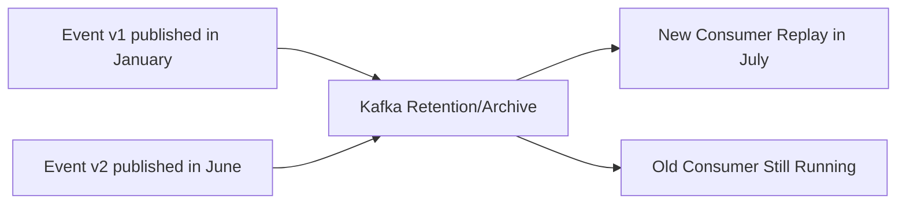
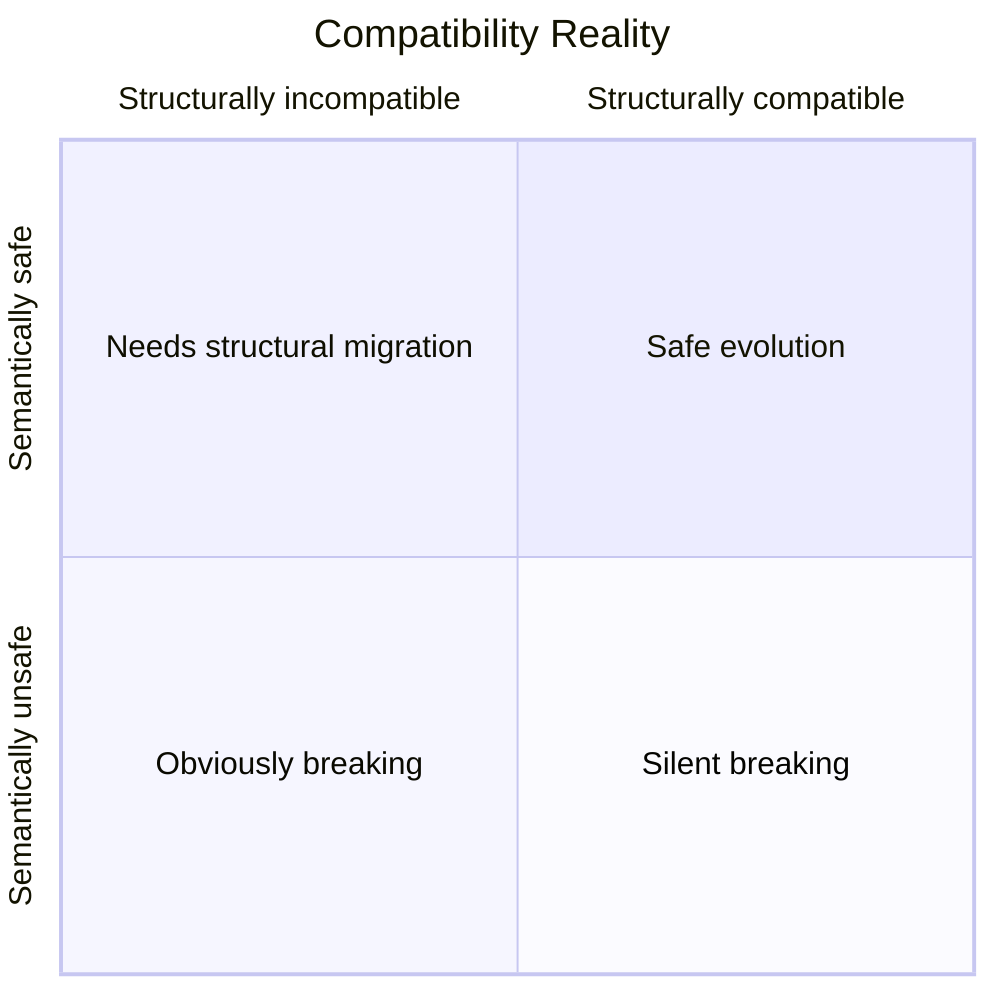
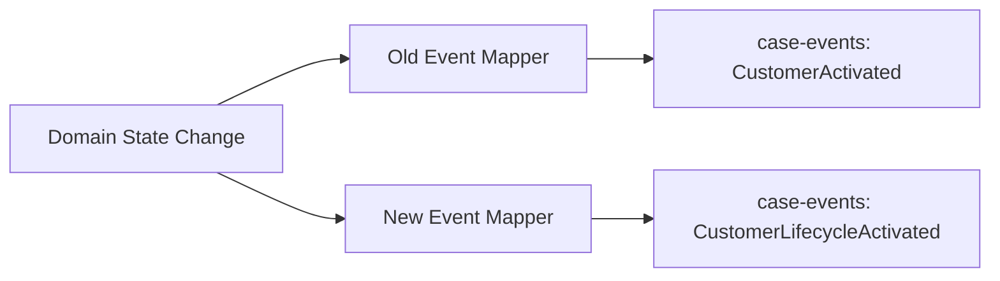
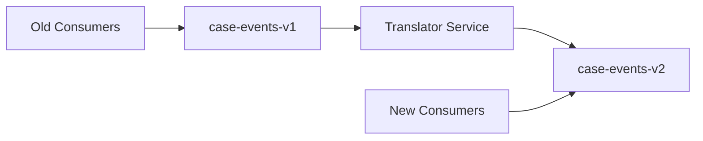
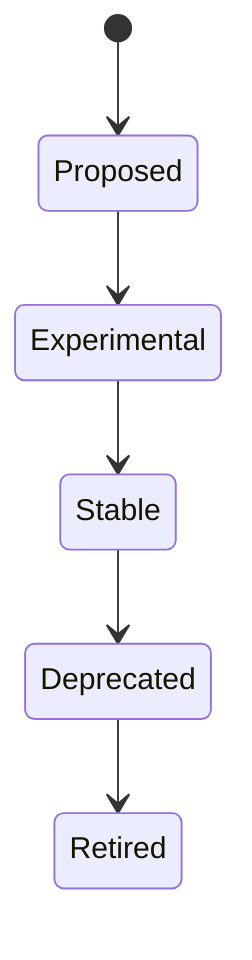
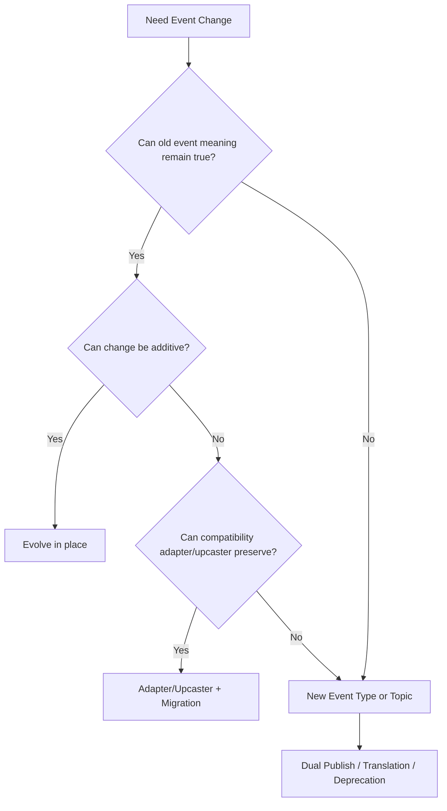

# Part 020 — Event Versioning and Compatibility: Additive Evolution, Semantic Breaks, and Migration Patterns

## Tujuan Pembelajaran

Event versioning lebih sulit daripada API versioning karena consumer bisa:

1. tertinggal jauh dari producer;
2. membaca event lama saat replay;
3. menyimpan local projection;
4. melakukan side effect;
5. tidak selalu terdaftar;
6. memproses event secara asynchronous;
7. membaca data dari topic retention/archive;
8. menggunakan schema lama dan code lama;
9. menerima duplicate/out-of-order events;
10. bergantung pada semantics yang tidak tertulis.

Jika API `/v2` saja sudah bisa menjadi contract debt, event `v2` yang buruk bisa menjadi distributed data debt.

Setelah part ini, kamu harus mampu:

1. membedakan schema version, event type version, envelope version, topic version, and semantic version;
2. menentukan kapan event bisa berevolusi in-place;
3. menentukan kapan butuh event type baru;
4. mengelola consumer lag dan replay compatibility;
5. memakai dual publish, upcasting, translation topics, and compatibility adapters;
6. membedakan structural compatibility dan semantic compatibility;
7. membuat deprecation/sunset plan untuk event;
8. mendesain migration pattern yang aman untuk Java/Kafka/event systems;
9. menghindari event versioning anti-pattern.

---

## 1. Core Principle: Event History Makes Compatibility Harder

HTTP API biasanya berurusan dengan current request/response. Event stream berurusan dengan **history**.



Producer bukan hanya harus kompatibel dengan consumers sekarang, tetapi juga:

1. old events stored in topic/archive;
2. old consumers reading new events;
3. new consumers reading old events;
4. replay of mixed schema versions;
5. local projections built from historical data.

Therefore:

> Event compatibility is time compatibility.

---

## 2. Version Vocabulary

| Version | Meaning |
|---|---|
| `schemaVersion` | version of payload schema artifact |
| `eventVersion` | version of event contract/type |
| `eventType` version | encoded in event type name, e.g. `CaseApprovedV2` |
| `envelopeVersion` | version of common metadata/envelope |
| `topicVersion` | topic/address version, e.g. `case-events-v2` |
| `producerVersion` | software deployment version |
| `consumerVersion` | consumer software version |
| `aggregateVersion` | domain state sequence number |
| `businessRuleVersion` | version of decision/rule applied |
| `SDK version` | consumer library version |

Do not mix them.

Example event:

```json
{
  "metadata": {
    "eventType": "CaseApproved",
    "eventVersion": "1.2",
    "schemaRef": "case.CaseApproved:7",
    "envelopeVersion": "1.0",
    "aggregateVersion": 17
  }
}
```

This does not mean topic or service is version 1.2.

---

## 3. Structural vs Semantic Compatibility

### 3.1 Structural Compatibility

Can old/new schemas parse/read messages?

Examples:

- Avro reader can read writer data;
- Protobuf old reader ignores new field;
- JSON Schema new optional field accepted by tolerant consumer.

### 3.2 Semantic Compatibility

Does meaning remain safe for consumer behavior?

Example structurally compatible but semantically breaking:

Old:

```json
{
  "eventType": "CustomerActivated",
  "customerId": "cus_123"
}
```

Meaning:

```text
customer may transact
```

New meaning:

```text
customer profile is active but transaction access may still be blocked
```

Schema unchanged. Consumers break.

### 3.3 Compatibility Matrix



Most dangerous: structurally compatible + semantically unsafe.

---

## 4. Event Evolution Directions

Compatibility direction matters.

### 4.1 New Consumer Reads Old Events

Needed for replay/bootstrap.

This is backward compatibility in common schema-registry terms: new reader can read old data.

### 4.2 Old Consumer Reads New Events

Needed for independent producer deployment while old consumers still run.

This is forward compatibility: old reader can read new data.

### 4.3 Both Directions

Full compatibility.

### 4.4 Across All Versions

Transitive compatibility.

For event streams with long retention and unknown consumer lag, transitive compatibility is often important.

---

## 5. In-Place Additive Evolution

Best path when possible.

Old event:

```json
{
  "eventType": "CaseApproved",
  "caseId": "case_123",
  "approvedAt": "2026-06-29T05:00:00Z"
}
```

New event:

```json
{
  "eventType": "CaseApproved",
  "caseId": "case_123",
  "approvedAt": "2026-06-29T05:00:00Z",
  "reasonCode": "EVIDENCE_COMPLETE"
}
```

If `reasonCode` optional/defaulted and old consumers ignore unknown fields, this is usually safe.

### 5.1 Additive Evolution Requirements

1. new field optional for old data;
2. old consumers tolerate unknown field;
3. field absence semantics documented;
4. event meaning unchanged;
5. schema registry compatibility passes;
6. generated clients do not break;
7. examples updated;
8. consumer tests include unknown fields if possible.

### 5.2 Additive But Dangerous

Adding enum value is structurally small but semantically dangerous.

Adding `reasonCode` might be safe structurally but consumer may begin relying on it before it is stable.

Mark field lifecycle if needed:

```yaml
reasonCode:
  lifecycle: experimental
  stability: do-not-use-for-automated-decisions-yet
```

---

## 6. When to Create New Event Type

Create new event type when old event meaning cannot remain true.

Old:

```text
CustomerActivated
```

Meaning overloaded.

Need split:

```text
CustomerLifecycleActivated
CustomerTransactionAccessGranted
KycVerificationCompleted
```

Do not keep publishing `CustomerActivated` with changed meaning.

### 6.1 New Event Type Conditions

Use new event type if:

1. business fact changed;
2. authority changed;
3. event lifecycle point changed;
4. required consumer action changes;
5. payload model fundamentally different;
6. old event name is misleading;
7. old event cannot carry new semantics additively;
8. replay of old and new event under one type would be ambiguous;
9. compatibility adapter would lie.

### 6.2 Example

Bad in-place semantic change:

```text
PaymentAuthorized now means authorization requested, not completed.
```

Better:

```text
PaymentAuthorizationRequested
PaymentAuthorized
PaymentAuthorizationFailed
```

---

## 7. Event Type Versioning

Options:

### 7.1 Version in Event Type Name

```text
CaseApprovedV2
```

Pros:

- explicit;
- old/new consumers can filter;
- clear schema separation.

Cons:

- event type proliferation;
- semantics often unclear;
- consumers must subscribe to both;
- migration burden;
- `V2` says nothing about meaning.

### 7.2 Version in Metadata

```json
{
  "eventType": "CaseApproved",
  "eventVersion": "2.0"
}
```

Pros:

- stable event type;
- version readable;
- can route by eventType+version.

Cons:

- consumers must branch inside handler;
- multi-version schema per event type;
- easy to forget version handling.

### 7.3 Version in Schema Reference

```json
{
  "eventType": "CaseApproved",
  "schemaRef": "case.CaseApproved:8"
}
```

Pros:

- aligns with registry;
- avoids manual version field.

Cons:

- schema version may not equal semantic version;
- consumers may not inspect it;
- not enough for semantic changes.

### 7.4 Version in Topic

```text
case-events-v2
```

Pros:

- strong isolation;
- consumers opt into new stream;
- clean ACL/config.

Cons:

- topic duplication;
- ordering/replay split;
- migration complexity;
- old/new events separated physically.

### 7.5 Recommended

Prefer in-place compatible evolution. Use new event type for new fact semantics. Use topic version only for major stream-level migration. Avoid reflex `V2` suffix when additive change is enough.

---

## 8. Dual Publish Pattern

Producer publishes both old and new events during migration.



Use when:

1. old consumers need time;
2. new semantics differ;
3. old event can still be truthfully produced;
4. producer can maintain mapping;
5. duplicate side effects are controlled.

### 8.1 Risks

1. consumers may process both and duplicate effects;
2. ordering between old/new events may matter;
3. metrics double count;
4. producer complexity;
5. old event may become lie if semantics no longer map;
6. deprecation may never finish.

### 8.2 Contract Requirements

```yaml
dualPublish:
  oldEvent: CustomerActivated
  newEvent: CustomerLifecycleActivated
  startDate: 2026-06-29
  targetEndDate: 2027-03-31
  consumerGuidance: Consumers must not subscribe to both for same side effect unless deduplicating by aggregateId+transition.
```

---

## 9. Upcasting Pattern

Upcasting transforms old event shape into newer in-memory representation for consumers.

Old stored event:

```json
{
  "eventType": "CaseApproved",
  "caseId": "case_123"
}
```

New handler expects:

```json
{
  "eventType": "CaseApproved",
  "caseId": "case_123",
  "reasonCode": "UNKNOWN"
}
```

Upcaster:

```java
public JsonNode upcast(JsonNode oldEvent) {
    ObjectNode copy = oldEvent.deepCopy();
    ObjectNode payload = (ObjectNode) copy.get("payload");

    if (!payload.has("reasonCode")) {
        payload.put("reasonCode", "UNKNOWN");
    }

    copy.withObject("/metadata").put("schemaRef", "case.CaseApproved:2");
    return copy;
}
```

### 9.1 Use Cases

1. event sourcing;
2. projection rebuild;
3. consumers reading historical events;
4. migration from old schema to new internal model.

### 9.2 Risks

1. upcaster invents data;
2. default may be semantically false;
3. chain of upcasters becomes complex;
4. performance overhead;
5. hidden compatibility logic;
6. must be tested with old fixtures.

Rule:

> Upcasting is acceptable when missing data can be safely defaulted or derived. It is dangerous when it fabricates business facts.

---

## 10. Translation Topic Pattern

Create new topic populated by translator from old event stream.



Use when:

1. new topic contract needed;
2. old producer cannot change quickly;
3. many consumers need normalized stream;
4. major schema/topic migration;
5. backfill required.

### 10.1 Risks

1. translator becomes critical infrastructure;
2. latency added;
3. ordering may change;
4. failure/DLQ complexity;
5. semantic translation may be lossy;
6. ownership unclear.

### 10.2 Contract Requirements

```yaml
translation:
  sourceTopic: case-events-v1
  targetTopic: case-events-v2
  orderingPreserved: per-case
  keyMapping: source.key -> target.key
  backfillSupported: true
  semanticLoss: none
  ownerTeam: event-platform
```

---

## 11. Compatibility Adapter in Consumer

Consumer supports multiple versions.

```java
public void handle(EventEnvelope<JsonNode> event) {
    switch (event.metadata().schemaRef()) {
        case "case.CaseApproved:1" -> handleV1(mapV1(event));
        case "case.CaseApproved:2" -> handleV2(mapV2(event));
        default -> quarantine(event, "UNSUPPORTED_SCHEMA");
    }
}
```

Pros:

- consumer controls migration;
- producer simpler;
- useful for replay.

Cons:

- consumer complexity;
- every consumer repeats logic;
- risk of inconsistent interpretation.

For many consumers, prefer shared SDK/adapter library.

---

## 12. Schema Registry Compatibility Modes

Registry compatibility modes such as backward, forward, full, and transitive are structural guardrails.

They answer:

```text
Can schemas read each other's data under registry rules?
```

They do not answer:

```text
Did event meaning remain safe?
Was Kafka key changed?
Was topic retention changed?
Did side-effect consumers break?
```

### 12.1 Backward

New schema can read old data. Good for replay with new consumers.

### 12.2 Forward

Old schema can read new data. Good for old consumers while producers upgrade.

### 12.3 Full

Both backward and forward.

### 12.4 Transitive

Checks against all previous versions, not just latest. Important for long-lived event history.

### 12.5 Governance Rule

For stable event streams:

```yaml
compatibility:
  schema: backward-transitive
  semanticReviewRequired: true
  kafkaContractReviewRequired: true
```

---

## 13. Consumer Lag

Consumers may be behind.

Event versioning must account for:

1. consumer not deployed for weeks;
2. consumer group lag;
3. paused consumer;
4. replay from earliest;
5. local schema cache old;
6. generated model old;
7. old SDK version;
8. disaster recovery consumer reading archive.

Producer cannot assume all consumers upgrade immediately.

### 13.1 Lag-Aware Release

Before incompatible event change:

1. identify consumers;
2. measure consumer lag;
3. check schema versions used;
4. verify unknown field handling;
5. publish new schema;
6. deploy producer compatibility mode;
7. monitor consumer errors;
8. migrate consumers;
9. only retire old event after lag cleared and consumers upgraded.

---

## 14. Replay Compatibility

Replay is stricter than live consumption.

A new consumer in July may replay January events.

Questions:

1. are old schemas still available?
2. can new code read old events?
3. are old reference data/rules available?
4. are old event semantics documented?
5. are upcasters available?
6. are tombstones/corrections included?
7. are old event types still understood?
8. can side effects be disabled?
9. are historical PII policies respected?

### 14.1 Replay Test

CI should include old fixtures.

```java
@Test
void projectionCanReplayCaseApprovedV1V2V3() {
    List<EventEnvelope<JsonNode>> events = fixtures.load(
        "CaseSubmitted-v1.json",
        "CaseApproved-v1.json",
        "CaseApproved-v2.json",
        "CaseClosed-v3.json"
    );

    Projection projection = replay(events);

    assertThat(projection.status()).isEqualTo("CLOSED");
}
```

---

## 15. Event Deprecation

Deprecation means event is still published but should not be used by new consumers.

Deprecation record:

```yaml
eventType: CustomerActivated
deprecatedSince: 2026-06-29
replacement:
  - CustomerLifecycleActivated
  - CustomerTransactionAccessGranted
reason: CustomerActivated overloaded lifecycle and access semantics.
producer: customer-service
knownConsumers:
  - onboarding-service
  - crm-sync
  - notification-service
sunsetTarget: 2027-03-31
removalCondition: No live consumers and replay archive translation available.
```

### 15.1 Deprecation Communication

1. AsyncAPI updated;
2. catalog marks deprecated;
3. schema registry metadata updated;
4. consumer teams notified;
5. migration guide published;
6. examples updated;
7. metrics dashboard created;
8. sunset conditions defined.

---

## 16. Event Retirement

Retiring an event means producer stops publishing it.

Preconditions:

1. consumer inventory complete;
2. no live consumers or approved exceptions;
3. topic usage metrics show no dependency;
4. replay story exists;
5. old schema archived;
6. docs/catalog updated;
7. DLQ/retry references removed;
8. tests updated;
9. rollback plan exists.

Warning:

> Event retirement can break passive consumers you do not know about. Discovery and access governance matter.

---

## 17. Event Field Lifecycle

Field lifecycle:



Field can be experimental even in stable event, but this must be explicit.

Example metadata:

```yaml
fields:
  payload.riskBand:
    lifecycle: experimental
    consumerGuidance: Do not use for automated rejection decisions.
```

Without lifecycle, consumers may hard-depend.

---

## 18. Semantic Change Decision Tree



Principle:

> Do not mutate event meaning in place.

---

## 19. Versioning Examples

### 19.1 Add Optional Field

Old:

```json
{
  "eventType": "CaseApproved",
  "payload": {
    "caseId": "case_123"
  }
}
```

New:

```json
{
  "eventType": "CaseApproved",
  "payload": {
    "caseId": "case_123",
    "reasonCode": "EVIDENCE_COMPLETE"
  }
}
```

Compatible if optional/default and semantics unchanged.

### 19.2 Rename Field

Old:

```json
"status": "ACTIVE"
```

New:

```json
"lifecycleStatus": "ACTIVE"
```

Safer:

```json
{
  "status": "ACTIVE",
  "lifecycleStatus": "ACTIVE"
}
```

Deprecate old.

### 19.3 Split Event

Old:

```text
CustomerActivated
```

New:

```text
CustomerLifecycleActivated
CustomerTransactionAccessGranted
```

Use dual publish if old event still truthfully derived.

### 19.4 Change Event Timing

Old `CaseApproved` emitted when approval requested. New emitted after approval committed.

This is semantic breaking. Old event was misnamed. Create:

```text
CaseApprovalRequested
CaseApproved
```

Migrate.

### 19.5 Change Topic Key

Old key = `customerId`. New key = `caseId`.

Even if schema unchanged, ordering/partitioning contract changes. Treat as breaking/dangerous.

---

## 20. Topic Versioning

Topic versioning:

```text
case-events-v1
case-events-v2
```

Use when:

1. key/partitioning changes;
2. retention/compaction model changes;
3. security classification changes;
4. event type set changes radically;
5. schema format changes;
6. old and new stream must run independently.

Avoid for small schema additions.

### 20.1 Migration Plan

1. create v2 topic;
2. publish v1 and v2 or translate v1 to v2;
3. onboard new consumers to v2;
4. migrate old consumers;
5. monitor lag and usage;
6. freeze v1 for new consumers;
7. retire after conditions met.

---

## 21. Envelope Versioning

Envelope changes affect all events.

Safe:

1. add optional metadata field;
2. add extension object;
3. add optional governance classification.

Breaking:

1. rename `metadata`;
2. rename `payload`;
3. remove `eventId`;
4. change `occurredAt` format;
5. change correlation semantics;
6. change eventType location;
7. make previously optional metadata required for old messages without default.

Strategy:

- evolve envelope very slowly;
- version envelope separately;
- use common library;
- validate old fixtures;
- support multiple envelope versions if needed.

---

## 22. Event Schema Version in Payload?

Do you include `schemaVersion` field inside payload?

Usually better in metadata:

```json
{
  "metadata": {
    "schemaRef": "case.CaseApproved:7"
  }
}
```

Avoid scattering version fields inside payload unless business domain needs them.

Payload version can confuse consumers:

```json
{
  "payload": {
    "version": 7
  }
}
```

Is this schema version, aggregate version, or business document version?

Name precisely.

---

## 23. Consumer Capability Negotiation for Events

Unlike HTTP, events are broadcast. Consumer capability negotiation is harder.

Options:

1. separate topics;
2. separate consumer groups with filtering;
3. per-consumer projection topics;
4. registry of consumer capabilities;
5. producer conditional publish by consumer is usually anti-pattern for broadcast events.

For events, prefer:

- compatible evolution;
- dual publish;
- translation topics;
- consumer adapters.

Do not make producer emit different event semantics per consumer unless using explicit targeted command/notification channel.

---

## 24. Migration Pattern Matrix

| Pattern | Use when | Main risk |
|---|---|---|
| Additive evolution | field addition, compatible schema | unknown consumer strictness |
| Dual field | rename/split simple field | inconsistency |
| New event type | new fact semantics | consumers process both/migration |
| Dual publish | old/new consumers coexist | duplicate side effects |
| Upcasting | replay old events into new model | fabricated semantics |
| Translation topic | major stream migration | translator ownership/latency |
| Topic v2 | key/security/format changes | operational duplication |
| Consumer adapter | few consumers, complex mapping | repeated logic |
| Snapshot backfill | projection rebuild | loses event history |
| Deprecation only | discourage new use | no actual migration if not enforced |

---

## 25. Java Implementation: Versioned Handler

```java
public interface EventHandler {
    void handle(EventEnvelope<JsonNode> event);
}
```

Version dispatch:

```java
public final class CaseApprovedDispatcher implements EventHandler {
    private final CaseApprovedV1Handler v1Handler;
    private final CaseApprovedV2Handler v2Handler;

    @Override
    public void handle(EventEnvelope<JsonNode> event) {
        String schemaRef = event.metadata().schemaRef();

        switch (schemaRef) {
            case "case.CaseApproved:1" ->
                v1Handler.handle(mapV1(event));
            case "case.CaseApproved:2" ->
                v2Handler.handle(mapV2(event));
            default ->
                throw new UnsupportedEventSchemaException(schemaRef);
        }
    }
}
```

Better: normalize to internal canonical model.

```java
CaseApproved canonical = upcaster.upcast(event);
caseApprovedHandler.handle(canonical);
```

---

## 26. Java Upcaster Chain

```java
public interface EventUpcaster {
    boolean supports(String eventType, String schemaRef);
    EventEnvelope<JsonNode> upcast(EventEnvelope<JsonNode> event);
}
```

Chain:

```java
public final class UpcasterChain {
    private final List<EventUpcaster> upcasters;

    public EventEnvelope<JsonNode> upcastToLatest(EventEnvelope<JsonNode> event) {
        EventEnvelope<JsonNode> current = event;

        boolean changed;
        do {
            changed = false;
            for (EventUpcaster upcaster : upcasters) {
                if (upcaster.supports(
                    current.metadata().eventType(),
                    current.metadata().schemaRef()
                )) {
                    current = upcaster.upcast(current);
                    changed = true;
                    break;
                }
            }
        } while (changed);

        return current;
    }
}
```

Governance:

1. upcasters versioned;
2. old fixtures tested;
3. no silent data fabrication without marker;
4. performance measured;
5. deprecation timeline clear.

---

## 27. Java Dual Publish Mapper

```java
public void publishCustomerActivation(CustomerActivatedDomainEvent domainEvent) {
    CustomerActivated legacy = legacyMapper.toCustomerActivated(domainEvent);
    CustomerLifecycleActivated lifecycle = newMapper.toCustomerLifecycleActivated(domainEvent);

    eventPublisher.publish("customer-events", legacy.metadata().aggregateId(), legacy);
    eventPublisher.publish("customer-events", lifecycle.metadata().aggregateId(), lifecycle);
}
```

Safety:

1. same correlationId;
2. different eventId for different facts or same causation ID depending semantics;
3. docs warn consumers;
4. metrics track both;
5. sunset plan exists.

Do not reuse same eventId for two different event types unless your dedup semantics explicitly require grouping and consumers understand it.

---

## 28. Contract Tests for Event Evolution

### 28.1 Old Event Replay Test

```java
@Test
void latestProjectionCanReplayAllHistoricalCaseApprovedVersions() {
    List<EventEnvelope<JsonNode>> events = fixtureLoader.loadAllVersions("CaseApproved");

    Projection projection = projectionRebuilder.rebuild(events);

    assertThat(projection).isConsistent();
}
```

### 28.2 Old Consumer Reads New Event

If forward compatibility required:

```java
@Test
void oldConsumerIgnoresNewOptionalField() {
    EventEnvelope<JsonNode> newEvent = fixture("CaseApproved-v2-with-reason.json");

    oldConsumer.handle(newEvent);

    assertThat(oldConsumer.errors()).isEmpty();
}
```

### 28.3 Semantic Regression Test

```java
@Test
void customerActivatedStillMeansLifecycleActivatedNotAccessGranted() {
    CustomerActivated event = produceCustomerActivated();

    assertThat(event.payload().lifecycleStatus()).isEqualTo("ACTIVE");
    assertThat(event.payload()).doesNotHaveFieldOrProperty("transactionAccessStatus");
}
```

Better: if meaning split, stop relying on old event.

### 28.4 Kafka Contract Change Test

Validate key unchanged:

```java
@Test
void caseApprovedKeyRemainsCaseId() {
    ProducerRecord<String, ?> record = produceCaseApproved();

    assertThat(record.key()).isEqualTo(record.value().metadata().aggregateId());
}
```

Schema compatibility test alone will not catch this.

---

## 29. Governance Checklist

### 29.1 Version Identity

- What version is changing: schema, event type, envelope, topic, key, or semantics?
- Is aggregateVersion confused with schemaVersion?
- Is eventVersion meaningful or redundant?

### 29.2 Compatibility

- Can new consumers read old events?
- Can old consumers read new events?
- Is transitive compatibility required?
- Does registry compatibility pass?
- Does semantic review pass?

### 29.3 Consumer Impact

- Who consumes this event?
- What schema versions are active?
- Are consumers lagging?
- Are side-effect consumers affected?
- Are projections replayed from history?

### 29.4 Migration

- Additive evolution possible?
- New event type needed?
- Dual publish needed?
- Upcaster needed?
- Translation topic needed?
- Topic v2 needed?
- Migration guide written?

### 29.5 Retirement

- Is old event deprecated?
- Is sunset date defined?
- Are usage metrics available?
- Are old schemas archived?
- Is replay compatibility preserved?
- Is rollback possible?

---

## 30. Anti-Patterns

### 30.1 EventTypeV2 Reflex

Creating `SomethingV2` for every field addition.

### 30.2 Semantic Mutation In Place

Same event name, different meaning.

### 30.3 Schema Version Equals Business Version

Confusing registry version with domain fact version.

### 30.4 No Old Fixture Tests

Replay breaks silently.

### 30.5 Dual Publish Forever

Temporary migration becomes permanent debt.

### 30.6 New Topic for Small Additive Change

Operational duplication without need.

### 30.7 Upcaster Fabricates Facts

Default value falsely implies known business reason.

### 30.8 Retiring Event Without Consumer Inventory

Passive consumers break.

### 30.9 Compatibility Check Only

Registry passes, consumers still break due to semantics/key/order.

### 30.10 Version Hidden in Java Class Only

Runtime event does not carry schema identity.

### 30.11 Unknown Consumers Ignored

Internal broadcast topics often have more consumers than producer knows.

### 30.12 Changing Topic Key as “Implementation Detail”

It is not implementation detail if ordering/partitioning matters.

---

## 31. Practice Lab

### Lab 1 — Field Addition

Add `reasonCode` to `CaseApproved`. Design:

1. schema change;
2. default/optional semantics;
3. old consumer behavior;
4. replay test;
5. docs update.

### Lab 2 — Semantic Split

Old event `CustomerActivated` means both lifecycle active and transaction access allowed. Split safely.

Design:

1. new event types;
2. dual publish strategy;
3. deprecation record;
4. consumer migration guide;
5. retirement condition.

### Lab 3 — Upcaster

Old event lacks `caseVersion`. New projection requires it. Decide whether upcasting is safe. If not, propose alternative.

### Lab 4 — Topic V2

Topic key changes from `customerId` to `accountId`. Design migration to `account-events-v2`.

### Lab 5 — Compatibility Classification

Classify:

1. add optional field;
2. add required field;
3. remove field;
4. rename field with alias;
5. add enum value;
6. change event timing;
7. change Kafka key;
8. change topic retention from 90 days to 7 days;
9. change event source authority;
10. add new event type;
11. stop publishing old event;
12. change envelope field name.

---

## 32. Senior Engineer Heuristics

1. **Event compatibility is time compatibility.**
2. **Schema version is not event meaning version.**
3. **Aggregate version is not schema version.**
4. **In-place evolution is best only when semantics remain true.**
5. **New event type is better than lying with old event name.**
6. **Dual publish must have an end date.**
7. **Upcasting must not fabricate business facts.**
8. **Replay is the harshest compatibility test.**
9. **Consumer lag makes forward compatibility important.**
10. **Transitive compatibility matters for long-lived streams.**
11. **Topic key changes are contract changes.**
12. **Registry compatibility is necessary but not sufficient.**
13. **Old fixtures are governance assets.**
14. **Deprecation without telemetry is hope.**
15. **Never mutate event semantics silently.**

---

## 33. Summary

Event versioning requires thinking across time, consumers, replay, schemas, topics, keys, and semantics. The safest path is compatible additive evolution. When meaning changes, create new event types or migration streams rather than mutating old facts.

Main takeaways:

1. event streams preserve history, so compatibility is harder than request/response;
2. distinguish schemaVersion, eventVersion, envelopeVersion, topicVersion, and aggregateVersion;
3. structural compatibility and semantic compatibility are different;
4. new consumers must often read old events;
5. old consumers may continue receiving new events;
6. replay requires old schemas, old semantics, and old fixtures;
7. dual publish, upcasting, translation topics, and topic v2 solve different problems;
8. schema registry compatibility does not catch Kafka key/order/retention changes;
9. event deprecation needs consumer inventory and telemetry;
10. never change event meaning in place.

Part berikutnya membahas event contract testing: producer tests, consumer tests, schema registry gates, golden event samples, replay tests, Testcontainers, and false confidence traps.
