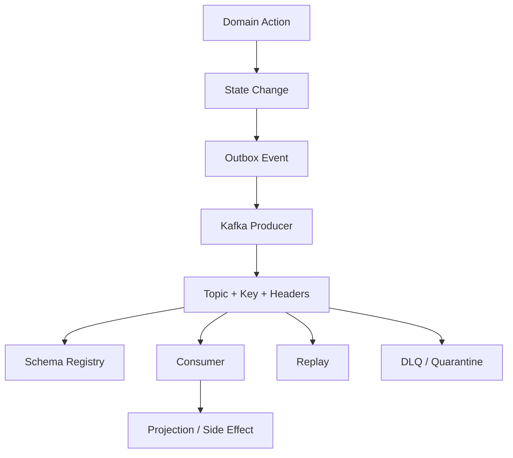
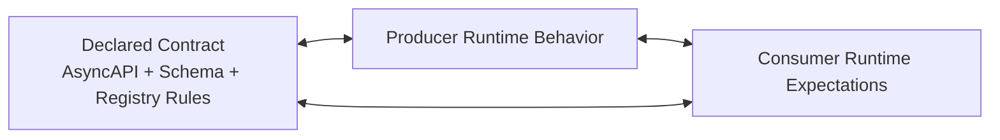
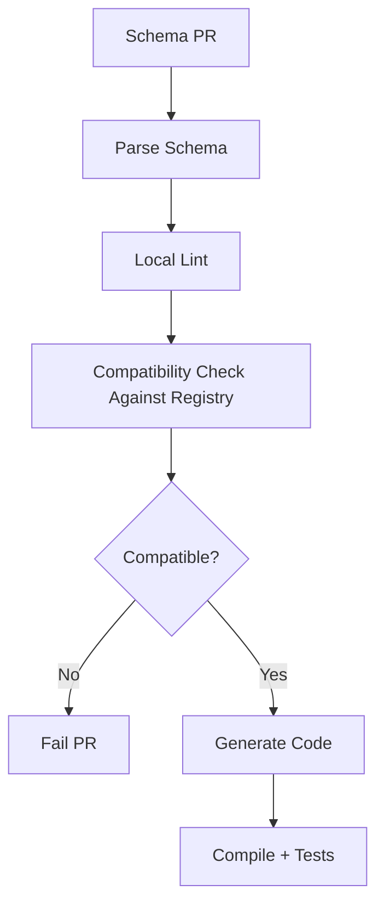
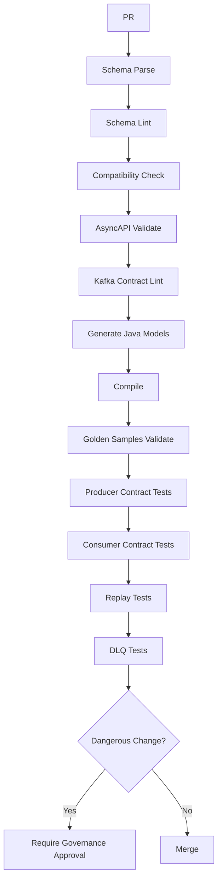

# Part 021 — Event Contract Testing: Producer Tests, Consumer Tests, Schema Registry Gates, and Replay Tests

## Tujuan Pembelajaran

Event contract tanpa test adalah asumsi yang dikirim ke broker. Dalam sistem event-driven, kontrak bisa drift di banyak tempat sekaligus:

- producer mengubah payload;
- schema registry menerima schema yang ternyata secara semantic breaking;
- Kafka key berubah;
- topic retention berubah;
- consumer tidak tahan unknown event type;
- retry topic mengubah ordering;
- DLQ kehilangan original envelope;
- replay memicu side effect ulang;
- generated Java class berubah;
- event example di dokumentasi sudah tidak valid.

Part ini membahas cara membuktikan event contract secara otomatis.

Setelah part ini, kamu harus mampu:

1. membuat producer contract tests untuk topic, key, envelope, schema, headers, and semantic trigger;
2. membuat consumer contract tests untuk duplicate, unknown event type, out-of-order, old schema, poison message, and DLQ behavior;
3. memakai schema registry compatibility gates di CI;
4. membuat golden event samples untuk regression and documentation;
5. menjalankan Kafka-oriented integration tests dengan Testcontainers;
6. membuat replay tests untuk projection rebuild;
7. membedakan schema compatibility test dan semantic contract test;
8. mendesain CI pipeline untuk event contract changes;
9. menghindari false confidence dari tests yang hanya memvalidasi schema.

---

## 1. Why Event Contract Testing Is Harder Than API Contract Testing

HTTP API contract test biasanya menguji:

```text
request -> response
```

Event contract test harus menguji:

```text
domain action -> event persisted -> event published -> broker metadata -> schema -> consumer behavior -> replay behavior
```



Drift can happen at each node.

---

## 2. Event Contract Test Taxonomy

| Test type | Purpose | Example |
|---|---|---|
| Schema validation test | payload/envelope matches schema | `CaseApproved` validates against Avro/JSON Schema/Protobuf |
| Schema compatibility test | new schema compatible with old versions | registry check backward/full/transitive |
| Producer contract test | producer emits correct event | approval publishes `CaseApproved` to `case-events` with key `caseId` |
| Consumer contract test | consumer handles documented event | projection updates when receiving `CaseApproved` |
| Golden sample test | examples remain valid and parseable | `case-approved-v1.json` still maps |
| Replay test | historical events rebuild state | replay all `Case*` events to projection |
| Idempotency test | duplicate event harmless | same `eventId` processed once |
| Ordering test | out-of-order behavior correct | version gap quarantined |
| DLQ test | poison message preserves original context | invalid payload sent to `case-events-dlq` |
| Registry gate | incompatible schema blocked before merge | added required Avro field without default fails |
| Generated code test | Java generated models compile and parse | Avro/Protobuf generated code compiles |
| Semantic test | meaning remains correct | `CaseApproved` emitted only after commit |

A mature event platform uses several of these, not just one.

---

## 3. The Three Contract Truths

For events, there are at least three truths:



Testing must answer:

1. Does producer publish what contract says?
2. Can consumer handle what contract says?
3. Does declared contract match actual examples?
4. Does registry prevent unsafe structural changes?
5. Are semantic invariants tested outside schema?
6. Are Kafka metadata assumptions tested?

---

## 4. Producer Contract Testing

Producer contract test starts from a domain action and verifies emitted event.

Example scenario:

```text
When a submitted case is approved,
case-service must publish CaseApproved to topic case-events,
with key = caseId,
eventType = CaseApproved,
aggregateVersion incremented,
schemaRef = case.CaseApproved:1,
and occurredAt = approval decision time.
```

### 4.1 Test Shape

```java
@Test
void approvingSubmittedCasePublishesCaseApprovedEvent() {
    CaseId caseId = testData.submittedCase();
    ApproveCaseCommand command = approveCommand("EVIDENCE_COMPLETE");

    caseApplicationService.approve(caseId, command);

    PublishedKafkaRecord record = kafkaProbe.singleRecord("case-events");

    assertThat(record.key()).isEqualTo(caseId.value());

    EventEnvelope<CaseApprovedPayload> event = record.valueAs(CaseApprovedEvent.class);

    assertThat(event.metadata().eventType()).isEqualTo("CaseApproved");
    assertThat(event.metadata().aggregateType()).isEqualTo("Case");
    assertThat(event.metadata().aggregateId()).isEqualTo(caseId.value());
    assertThat(event.metadata().aggregateVersion()).isEqualTo(2L);
    assertThat(event.metadata().schemaRef()).isEqualTo("case.CaseApproved:1");
    assertThat(event.payload().reasonCode()).isEqualTo("EVIDENCE_COMPLETE");
}
```

The exact helper classes are custom. The pattern matters.

### 4.2 Verify Semantic Trigger

Do not only assert an event exists. Assert why it exists.

Bad:

```java
assertThat(kafkaProbe.records()).isNotEmpty();
```

Good:

```java
assertThat(record.value().metadata().eventType()).isEqualTo("CaseApproved");
assertThat(caseRepository.get(caseId).status()).isEqualTo(CaseStatus.APPROVED);
```

For outbox pattern, also verify event inserted after state transition.

### 4.3 Verify No Event on Rejected Command

```java
@Test
void approvingDraftCaseDoesNotPublishCaseApproved() {
    CaseId caseId = testData.draftCase();

    assertThatThrownBy(() -> caseApplicationService.approve(caseId, approveCommand()))
        .isInstanceOf(CaseStateConflictException.class);

    assertThat(kafkaProbe.records("case-events")).isEmpty();
}
```

This prevents false event facts.

---

## 5. Testing Topic and Key

Kafka topic and key are part of contract.

```java
@Test
void caseApprovedUsesCaseIdAsKafkaKey() {
    EventEnvelope<CaseApprovedPayload> event = eventFactory.caseApproved(caseId);

    producer.publish(event);

    ProducerRecord<String, ?> record = kafkaProbe.singleProducedRecord();

    assertThat(record.topic()).isEqualTo("case-events");
    assertThat(record.key()).isEqualTo(caseId.value());
}
```

This catches accidental changes such as:

```java
kafkaTemplate.send("case-events", event.metadata().eventId(), event);
```

which would destroy per-case ordering if contract says key is caseId.

---

## 6. Testing Envelope Metadata

Minimum metadata tests:

1. eventId present;
2. eventType correct;
3. source correct;
4. aggregateId present;
5. aggregateVersion present;
6. occurredAt present;
7. publishedAt present if policy requires;
8. correlationId propagated;
9. causationId set;
10. schemaRef correct;
11. tenant/jurisdiction/classification present where required.

Example:

```java
@Test
void eventEnvelopeContainsGovernanceMetadata() {
    EventEnvelope<CaseApprovedPayload> event = produceCaseApproved();

    assertThat(event.metadata().eventId()).startsWith("evt_");
    assertThat(event.metadata().source()).isEqualTo("case-service");
    assertThat(event.metadata().correlationId()).isEqualTo(testCorrelationId);
    assertThat(event.metadata().dataClassification()).isEqualTo("CONFIDENTIAL");
}
```

Metadata is not decoration. Missing metadata breaks observability and governance.

---

## 7. Testing Schema Validation

Producer-side schema validation test:

```java
@Test
void producedCaseApprovedMatchesRegisteredSchema() {
    EventEnvelope<CaseApprovedPayload> event = produceCaseApproved();

    schemaValidator.validate("case.CaseApproved", event);
}
```

For Avro:

```java
@Test
void avroSpecificRecordMatchesSchema() {
    CaseApproved event = caseApprovedAvro();

    byte[] bytes = avroSerializer.serialize("case-events", event);
    CaseApproved parsed = avroDeserializer.deserialize("case-events", bytes);

    assertThat(parsed.getMetadata().getEventType()).isEqualTo("CaseApproved");
}
```

For Protobuf:

```java
@Test
void protobufEventRoundTrips() throws Exception {
    CaseApproved event = caseApprovedProto();

    byte[] bytes = event.toByteArray();
    CaseApproved parsed = CaseApproved.parseFrom(bytes);

    assertThat(parsed.getMetadata().getEventType()).isEqualTo("CaseApproved");
}
```

For JSON Schema:

```java
@Test
void jsonEventMatchesSchema() {
    JsonNode event = objectMapper.valueToTree(produceCaseApproved());

    ValidationResult result = jsonSchemaValidator.validate(
        "https://schemas.acme.com/case/CaseApproved.schema.json",
        event
    );

    assertThat(result.isValid()).isTrue();
}
```

---

## 8. Schema Registry Compatibility Gate

A CI gate should check new schemas against registry rules before merge.

Flow:



Compatibility checks depend on registry:

1. Confluent Schema Registry subject compatibility;
2. Apicurio Registry global/group/artifact rules;
3. custom JSON Schema diff;
4. Buf/Protobuf breaking check;
5. Avro compatibility checker.

### 8.1 What Registry Gate Catches

1. added required Avro field without default;
2. Protobuf tag reuse if tool checks;
3. JSON Schema type change if diff supports;
4. schema parse failure;
5. invalid references;
6. incompatible enum change depending format/tooling.

### 8.2 What Registry Gate Does Not Catch

1. Kafka key changed;
2. topic changed;
3. event meaning changed;
4. event emitted at different lifecycle point;
5. retention changed;
6. DLQ behavior changed;
7. consumer side effect duplicate;
8. default value semantically wrong;
9. generated SDK source break;
10. data classification missing unless custom rule exists.

Therefore registry gate is necessary but not sufficient.

---

## 9. Golden Event Samples

Golden samples are canonical event examples stored as files.

```text
src/test/resources/events/
├── case-approved-v1.json
├── case-approved-v2.json
├── case-submitted-v1.json
├── customer-registered-v1.avro.json
└── payment-captured-v1.json
```

Golden sample should include realistic:

1. metadata;
2. payload;
3. optional fields absent;
4. nullable fields present/null;
5. boundary values;
6. old versions;
7. failure/DLQ examples.

### 9.1 Golden Sample Test

```java
@Test
void allGoldenEventsValidateAgainstSchemas() {
    goldenEventRepository.all().forEach(sample -> {
        ValidationResult result = schemaValidator.validate(
            sample.schemaRef(),
            sample.payload()
        );

        assertThat(result.isValid())
            .as(sample.fileName())
            .isTrue();
    });
}
```

### 9.2 Golden Samples as Documentation

Examples in AsyncAPI/schema docs should come from golden sample files, not manually duplicated snippets.

This avoids stale documentation.

---

## 10. Consumer Contract Testing

Consumer tests prove that handler can process documented events.

Example:

```java
@Test
void caseProjectionHandlesCaseApproved() {
    EventEnvelope<CaseApprovedPayload> event =
        goldenEvents.load("case-approved-v1.json", CaseApprovedPayload.class);

    caseProjectionConsumer.handle(event);

    CaseProjection projection = projectionRepository.get(event.payload().caseId());

    assertThat(projection.status()).isEqualTo("APPROVED");
    assertThat(projection.version()).isEqualTo(event.payload().caseVersion());
}
```

### 10.1 Consumer Should Test What It Uses

If consumer uses:

1. `caseId`;
2. `caseVersion`;
3. `reasonCode`;
4. `approvedAt`;

then test those fields. Do not only assert consumer does not crash.

### 10.2 Unknown Field Tolerance

For JSON consumers:

```java
@Test
void consumerIgnoresUnknownOptionalFields() {
    JsonNode event = goldenEvents.loadJson("case-approved-v1.json");
    ((ObjectNode) event.get("payload")).put("futureField", "futureValue");

    assertThatCode(() -> consumer.handle(event))
        .doesNotThrowAnyException();
}
```

For generated Avro/Protobuf, unknown field handling differs. Test according to chosen format.

---

## 11. Unknown Event Type Test

For multi-type topic consumers:

```java
@Test
void consumerIgnoresUnknownEventTypeOnDomainTopic() {
    EventEnvelope<JsonNode> event = EventEnvelope.builder()
        .metadata(metadata("CaseFutureEvent"))
        .payload(objectMapper.createObjectNode())
        .build();

    consumer.handle(event);

    assertThat(dlqRepository.count()).isZero();
    assertThat(metrics.counter("event.ignored", "eventType", "CaseFutureEvent"))
        .hasCount(1);
}
```

If consumer throws on unknown event type, adding new event type to topic breaks old consumers.

Contract should state whether unknown event types must be ignored.

---

## 12. Duplicate Event Test

At-least-once delivery means duplicates are normal.

```java
@Test
void duplicateEventIsProcessedOnce() {
    EventEnvelope<CaseApprovedPayload> event =
        goldenEvents.load("case-approved-v1.json", CaseApprovedPayload.class);

    consumer.handle(event);
    consumer.handle(event);

    CaseProjection projection = projectionRepository.get(event.payload().caseId());

    assertThat(projection.appliedEventIds())
        .containsExactly(event.metadata().eventId());
}
```

### 12.1 Dedup Boundary

Test crash boundary if possible:

1. process side effect then crash before commit;
2. commit processed ID then crash before side effect;
3. retry after partial failure.

For external side effects, idempotency must be tested at business key or provider API level.

---

## 13. Out-of-Order and Gap Tests

For projection consumers:

```java
@Test
void eventWithVersionGapIsQuarantined() {
    projectionRepository.save(new CaseProjection("case_123", 3));

    EventEnvelope<CaseApprovedPayload> event =
        caseApprovedEvent("case_123", 5);

    consumer.handle(event);

    assertThat(quarantineRepository.contains(event.metadata().eventId())).isTrue();
    assertThat(projectionRepository.get("case_123").version()).isEqualTo(3);
}
```

Test duplicate/old version:

```java
@Test
void olderEventIsIgnored() {
    projectionRepository.save(new CaseProjection("case_123", 5));

    EventEnvelope<CaseApprovedPayload> event =
        caseApprovedEvent("case_123", 4);

    consumer.handle(event);

    assertThat(quarantineRepository.contains(event.metadata().eventId())).isFalse();
    assertThat(projectionRepository.get("case_123").version()).isEqualTo(5);
}
```

---

## 14. Replay Tests

Replay test validates historical events rebuild expected projection.

```java
@Test
void replayCaseLifecycleEventsBuildsFinalProjection() {
    List<EventEnvelope<?>> events = goldenEvents.loadSequence(
        "case-submitted-v1.json",
        "case-assigned-v1.json",
        "case-approved-v1.json",
        "case-closed-v1.json"
    );

    CaseProjection projection = replayEngine.rebuild(events);

    assertThat(projection.status()).isEqualTo("CLOSED");
    assertThat(projection.version()).isEqualTo(4L);
}
```

### 14.1 Replay Test Must Include Old Versions

```java
@Test
void replaySupportsHistoricalSchemaVersions() {
    List<EventEnvelope<?>> events = goldenEvents.loadSequence(
        "case-submitted-v1.json",
        "case-approved-v1.json",
        "case-approved-v2.json"
    );

    assertThatCode(() -> replayEngine.rebuild(events))
        .doesNotThrowAnyException();
}
```

### 14.2 Replay Side-Effect Test

For side-effect consumers:

```java
@Test
void replayDoesNotSendDuplicateEmail() {
    EventEnvelope<CustomerRegisteredPayload> event =
        goldenEvents.load("customer-registered-v1.json", CustomerRegisteredPayload.class);

    emailConsumer.handle(event);
    emailConsumer.handle(replayMarked(event));

    assertThat(emailGateway.sentMessagesFor(event.payload().customerId()))
        .hasSize(1);
}
```

If replay is not allowed for side-effect consumer, test that replay marker causes skip.

---

## 15. DLQ and Quarantine Tests

### 15.1 Invalid Schema Goes to DLQ

```java
@Test
void invalidPayloadGoesToDlqWithOriginalEnvelope() {
    EventEnvelope<JsonNode> invalidEvent = invalidCaseApprovedMissingCaseId();

    consumer.handleRaw(invalidEvent);

    DlqMessage dlq = dlqRepository.single();

    assertThat(dlq.failure().failureCode()).isEqualTo("SCHEMA_VALIDATION_FAILED");
    assertThat(dlq.original().metadata().eventId()).isEqualTo(invalidEvent.metadata().eventId());
    assertThat(dlq.original().metadata().correlationId()).isEqualTo(invalidEvent.metadata().correlationId());
}
```

### 15.2 Poison Domain State Goes to Quarantine

```java
@Test
void stateConflictEventIsQuarantined() {
    projectionRepository.save(new CaseProjection("case_123", 10));

    EventEnvelope<CaseApprovedPayload> event = caseApprovedEvent("case_123", 3);

    consumer.handle(event);

    QuarantinedEvent quarantined = quarantineRepository.single();

    assertThat(quarantined.reason()).isEqualTo("STALE_EVENT");
    assertThat(quarantined.originalEventId()).isEqualTo(event.metadata().eventId());
}
```

### 15.3 DLQ Contract Test

Verify DLQ includes:

1. original topic;
2. original partition;
3. original offset;
4. original key;
5. original headers;
6. original envelope;
7. failure metadata;
8. consumer group;
9. attempt count;
10. correlation ID.

---

## 16. Testcontainers for Kafka Contract Tests

For integration-level tests, use Kafka container instead of mocks when testing real serialization, topic/key, headers, consumer group behavior, or offset behavior.

Example conceptual setup:

```java
@Testcontainers
class CaseEventKafkaContractTest {
    @Container
    static KafkaContainer kafka = new KafkaContainer(
        DockerImageName.parse("apache/kafka-native:3.8.0")
    );

    @BeforeAll
    static void setup() {
        System.setProperty("spring.kafka.bootstrap-servers", kafka.getBootstrapServers());
    }
}
```

Depending on Testcontainers version and Kafka image, container class/package can differ. Keep this in test infrastructure and pin versions.

### 16.1 What to Test with Real Kafka

1. serialization/deserialization;
2. topic name and key;
3. headers;
4. consumer group behavior;
5. offset commit/retry;
6. DLQ publishing;
7. ordering within partition;
8. schema registry integration if registry container available.

### 16.2 What Not to Overdo

Do not make every unit test start Kafka. Use layers:

| Test | Tool |
|---|---|
| mapper validation | unit test |
| schema validation | local validator |
| producer event shape | fake publisher/probe |
| real serialization | Kafka/Testcontainers |
| consumer group/offset | Kafka/Testcontainers |
| end-to-end topology | integration test |
| production broker config | staging smoke test |

---

## 17. Schema Registry in Tests

You can test against:

1. mock schema registry client;
2. embedded registry/test double;
3. Testcontainers registry;
4. real staging registry.

Use cases:

| Approach | Good for |
|---|---|
| mock registry | unit tests |
| local compatibility checker | fast CI |
| registry container | integration confidence |
| staging registry | pre-release validation |

Test registry behavior:

1. schema registration;
2. compatibility rejection;
3. schema ID resolution;
4. subject naming;
5. serializer behavior;
6. old schema fetch during deserialization.

---

## 18. Producer + Registry Integration Test

```java
@Test
void producerRegistersCompatibleSchemaAndPublishesEvent() {
    CaseApproved event = caseApprovedAvro();

    kafkaTemplate.send("case-events", event.getPayload().getCaseId(), event).get();

    ConsumerRecord<String, CaseApproved> record =
        testConsumer.pollOne("case-events");

    assertThat(record.value().getMetadata().getEventType()).isEqualTo("CaseApproved");
}
```

This catches:

1. serializer misconfiguration;
2. subject naming issue;
3. registry connectivity;
4. schema ID mismatch;
5. consumer deserialization failure.

---

## 19. Testing Schema Evolution with Old Fixtures

### 19.1 Avro

Test new reader reads old writer data.

```java
@Test
void caseApprovedV2ReaderReadsV1Data() {
    byte[] oldBytes = fixtureBytes("case-approved-v1.avro");
    Schema writerSchema = schema("case-approved-v1.avsc");
    Schema readerSchema = schema("case-approved-v2.avsc");

    CaseApprovedV2 event = avro.read(oldBytes, writerSchema, readerSchema);

    assertThat(event.getReasonCode()).isEqualTo("UNKNOWN");
}
```

### 19.2 Protobuf

Old binary parse test.

```java
@Test
void newProtoParsesOldBinary() throws Exception {
    byte[] oldBytes = fixtureBytes("case-approved-v1.bin");

    CaseApproved event = CaseApproved.parseFrom(oldBytes);

    assertThat(event.getCaseId()).isEqualTo("case_123");
}
```

### 19.3 JSON Schema

Validate old events against current reader/upcaster path.

```java
@Test
void currentConsumerCanHandleOldJsonEvent() {
    JsonNode oldEvent = fixtureJson("case-approved-v1.json");

    EventEnvelope<JsonNode> current = upcaster.upcastToLatest(oldEvent);

    assertThat(schemaValidator.validate("case.CaseApproved.latest", current).isValid())
        .isTrue();
}
```

---

## 20. Semantic Contract Tests

Schema tests cannot prove semantics.

Examples of semantic tests:

### 20.1 Event Emitted After Commit

```java
@Test
void eventIsPublishedOnlyAfterCaseStateIsCommitted() {
    caseService.approve(caseId, command);

    EventEnvelope<CaseApprovedPayload> event = kafkaProbe.singleEvent();

    Case persisted = caseRepository.get(caseId);
    assertThat(persisted.status()).isEqualTo(APPROVED);
    assertThat(event.payload().caseVersion()).isEqualTo(persisted.version());
}
```

### 20.2 No Event on Rollback

```java
@Test
void rollbackDoesNotPublishEvent() {
    forceDatabaseFailureOnCommit();

    assertThatThrownBy(() -> caseService.approve(caseId, command))
        .isInstanceOf(PersistenceException.class);

    assertThat(kafkaProbe.records("case-events")).isEmpty();
}
```

### 20.3 Correct Domain Meaning

```java
@Test
void caseApprovedMeansStateTransitionToApproved() {
    caseService.approve(caseId, command);

    EventEnvelope<CaseApprovedPayload> event = kafkaProbe.singleEvent();

    assertThat(event.metadata().eventType()).isEqualTo("CaseApproved");
    assertThat(caseRepository.get(caseId).status()).isEqualTo(APPROVED);
}
```

This catches event name misuse.

---

## 21. Testing Event Version Migration

### 21.1 Dual Publish Test

```java
@Test
void customerActivationDualPublishesLegacyAndNewEventsDuringMigration() {
    customerService.activate(customerId);

    List<EventEnvelope<?>> events = kafkaProbe.records("customer-events");

    assertThat(events)
        .extracting(e -> e.metadata().eventType())
        .contains("CustomerActivated", "CustomerLifecycleActivated");
}
```

Also test not double side effect in consumer.

### 21.2 Upcaster Test

```java
@Test
void upcasterAddsReasonCodeDefaultForOldCaseApproved() {
    EventEnvelope<JsonNode> old = goldenEvents.loadJsonEnvelope("case-approved-v1.json");

    EventEnvelope<JsonNode> upcasted = upcaster.upcastToLatest(old);

    assertThat(upcasted.payload().get("reasonCode").asText()).isEqualTo("UNKNOWN");
}
```

### 21.3 Translation Topic Test

```java
@Test
void translatorPreservesKeyAndCorrelation() {
    EventEnvelope<OldCustomerActivated> oldEvent = oldCustomerActivated();

    translator.handle(oldEvent);

    ProducerRecord<String, EventEnvelope<CustomerLifecycleActivated>> newRecord =
        kafkaProbe.singleProducedRecord("customer-events-v2");

    assertThat(newRecord.key()).isEqualTo(oldEvent.metadata().aggregateId());
    assertThat(newRecord.value().metadata().correlationId())
        .isEqualTo(oldEvent.metadata().correlationId());
}
```

---

## 22. CI Pipeline for Event Contract Changes



Dangerous changes:

1. enum value added;
2. key changed;
3. retention reduced;
4. topic changed;
5. event meaning changed;
6. event deprecated/retired;
7. schema compatibility mode changed;
8. data classification changed;
9. envelope changed;
10. DLQ behavior changed.

---

## 23. Event Contract Test Matrix Template

For each event:

```yaml
eventType: CaseApproved
producerTests:
  - emits only after state committed
  - uses topic case-events
  - uses key caseId
  - includes eventId
  - includes aggregateVersion
  - validates schema
  - includes correlationId
consumerTests:
  - handles valid golden sample
  - handles duplicate event
  - handles old schema version
  - handles unknown optional field
  - quarantines sequence gap
  - ignores unknown event type on same topic
replayTests:
  - rebuilds projection from v1-vN fixtures
  - no duplicate side effects
dlqTests:
  - invalid schema goes to DLQ
  - DLQ preserves original envelope
registryGates:
  - backward-transitive compatibility
  - generated code compile
```

---

## 24. Testing Event Catalog Consistency

Event catalog should match actual contracts.

Tests can verify:

1. every schema has catalog entry;
2. every AsyncAPI message has owner;
3. every stable event has examples;
4. every event has data classification;
5. every Kafka topic has key documented;
6. every deprecated event has replacement/migration;
7. every schemaRef resolves;
8. every topic in AsyncAPI exists in infra config.

Pseudo:

```java
@Test
void everyStableEventHasOwnerAndExample() {
    eventCatalog.stableEvents().forEach(event -> {
        assertThat(event.ownerTeam()).isNotBlank();
        assertThat(event.examples()).isNotEmpty();
    });
}
```

This is governance-as-test.

---

## 25. False Confidence Traps

### 25.1 Schema Registry Passes, Consumer Breaks

Example: added enum symbol. Registry may allow, old consumer switch lacks default.

Mitigation: unknown enum tests.

### 25.2 Producer Test Uses Mock Publisher Only

Mock verifies method called, not serialization/topic/key.

Mitigation: add Kafka/Testcontainers integration for selected paths.

### 25.3 Consumer Test Uses Hand-Built Object

Hand-built Java object may not match real serialized payload.

Mitigation: load golden sample or deserialize real bytes.

### 25.4 Replay Test Uses Only Latest Schema

Old history ignored.

Mitigation: keep old fixtures.

### 25.5 DLQ Test Only Checks Count

DLQ message lacks original envelope.

Mitigation: assert DLQ contract shape.

### 25.6 Unknown Event Type Not Tested

New event breaks old consumers.

Mitigation: unknown event type test for multi-type topics.

### 25.7 Topic Key Not Tested

Ordering contract silently changes.

Mitigation: producer test asserts key.

### 25.8 Upcaster Untested

Old replay fails months later.

Mitigation: fixture-driven upcaster tests.

### 25.9 Tests Ignore Headers

Trace/correlation/security missing in production.

Mitigation: assert headers/envelope metadata.

### 25.10 Contract Tests Not Blocking Release

Tests exist but not in CI/CD gates.

Mitigation: make contract pipeline required.

---

## 26. Practice Lab

### Lab 1 — Producer Test Matrix

For event `PaymentCaptured`, define tests for:

1. domain trigger;
2. topic;
3. key;
4. schema;
5. envelope metadata;
6. no event on failed capture;
7. idempotent publish retry.

### Lab 2 — Consumer Test Matrix

For consumer `ledger-projection`, define tests for:

1. valid event;
2. duplicate;
3. out-of-order;
4. unknown event type;
5. old schema version;
6. invalid schema;
7. DLQ/quarantine;
8. replay.

### Lab 3 — Golden Samples

Create sample list for `CaseApproved` versions v1, v2, v3. Explain which fields differ and how tests use them.

### Lab 4 — Registry Gate

Design CI gate for Avro schemas with backward-transitive compatibility. Add extra checks for Kafka key and semantic review.

### Lab 5 — Replay Safety

Consumer sends SMS on `CustomerRegistered`. Design tests to ensure replay does not send duplicate SMS.

### Lab 6 — False Confidence Review

Given pipeline:

```text
schema registry compatibility only
```

List at least 10 event contract risks it does not catch.

---

## 27. Senior Engineer Heuristics

1. **Event contract tests must verify topic, key, and semantics, not only schema.**
2. **Golden event samples are long-term compatibility assets.**
3. **Replay tests are the strongest proof of historical compatibility.**
4. **At-least-once delivery requires duplicate tests.**
5. **Multi-type topics require unknown event type tests.**
6. **DLQ without original envelope is operational debt.**
7. **Schema registry gates are necessary but insufficient.**
8. **Producer tests must prove event emitted at the correct lifecycle point.**
9. **Consumer tests should load real samples or serialized bytes.**
10. **Semantic invariants need explicit tests outside schema.**
11. **Testcontainers is valuable for serialization, topic/key, headers, and offsets.**
12. **Upcasters must be tested with old fixtures.**
13. **Side-effect consumers need replay/idempotency tests.**
14. **Contract tests that do not block release are documentation.**
15. **A good event test fails before a consumer learns the breakage in production.**

---

## 28. Summary

Event contract testing is the discipline that keeps producer behavior, schema registry, broker metadata, consumer expectations, replay behavior, and governance metadata aligned. It requires more than schema compatibility.

Main takeaways:

1. test producer semantics, topic, key, envelope, and schema;
2. test consumer handling of valid, duplicate, old, unknown, and invalid events;
3. use golden samples as documentation and regression fixtures;
4. use replay tests for historical compatibility;
5. test DLQ/quarantine as a contract;
6. use schema registry gates but do not rely only on them;
7. use Kafka/Testcontainers selectively for real serialization and broker behavior;
8. test semantic invariants explicitly;
9. make event contract tests required in CI;
10. treat event compatibility as an engineering system, not a one-time validation.

Part berikutnya membahas schema registry architecture: subject naming, artifact identity, compatibility rules, access control, references, environment promotion, and registry-as-governance-control-point.
