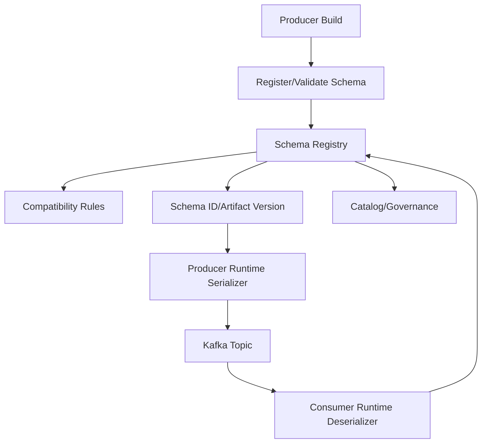
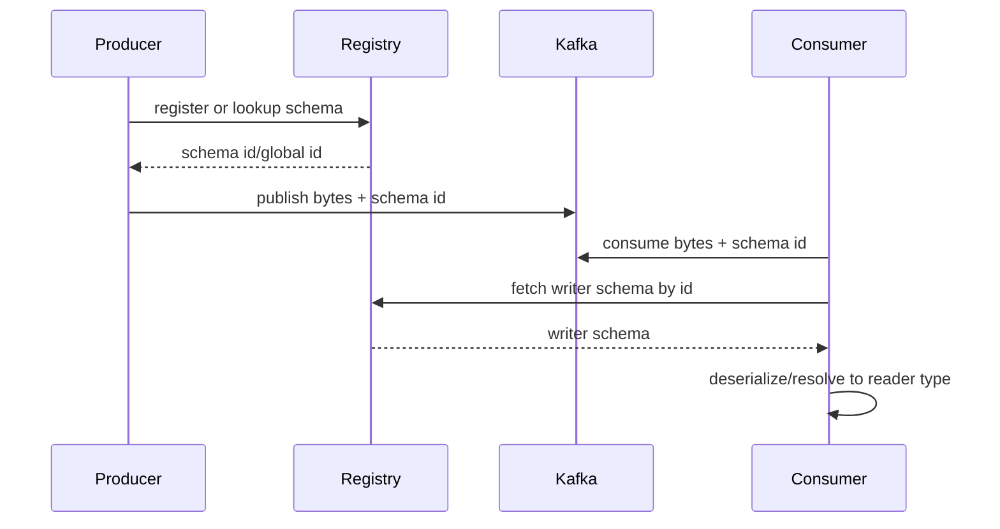
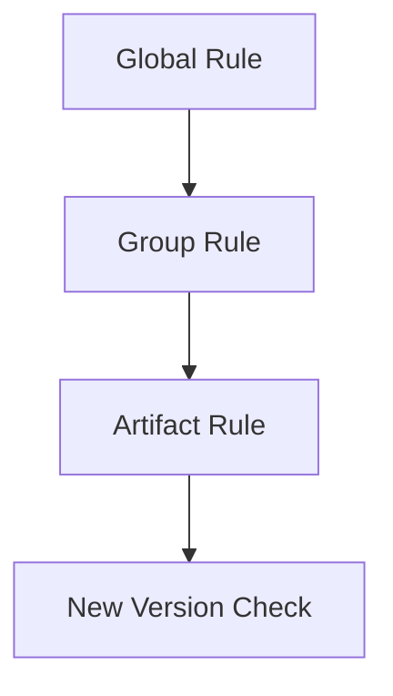
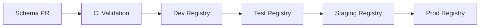
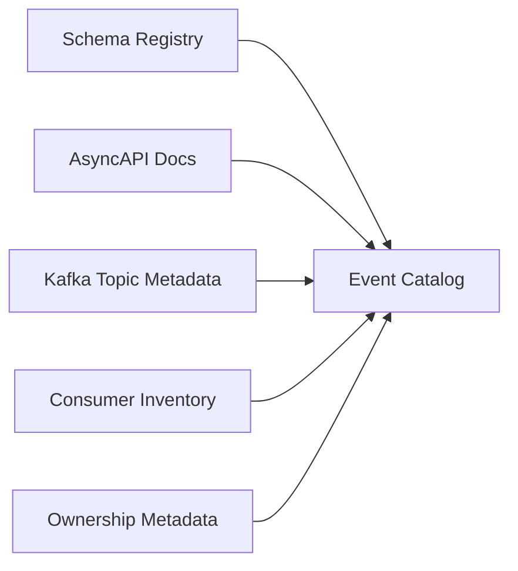
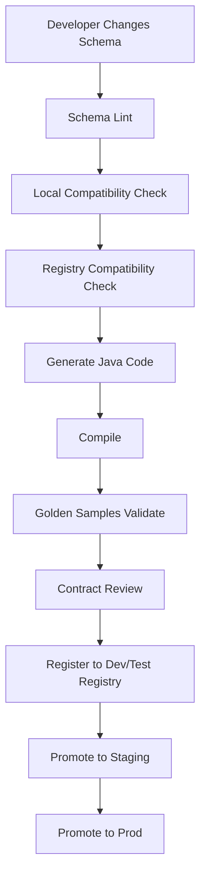
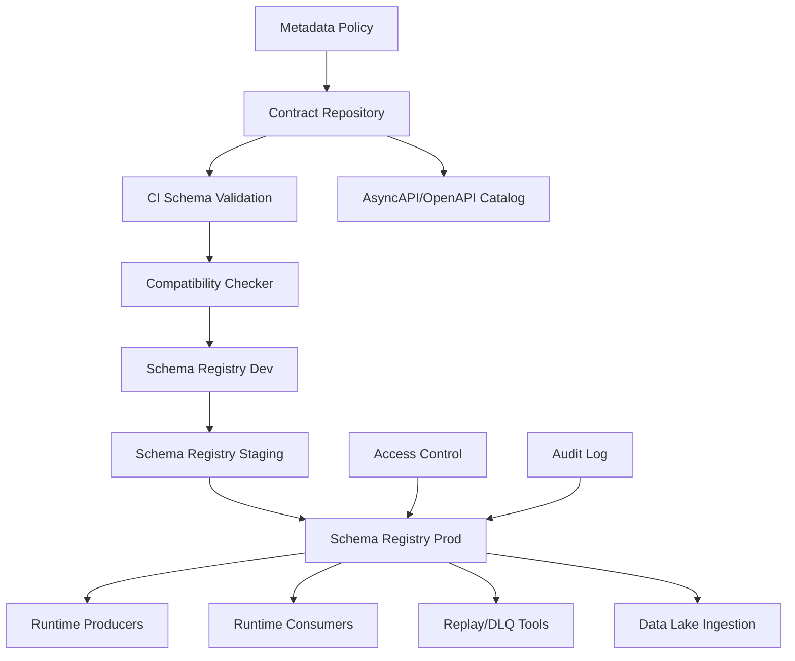

# Part 022 — Schema Registry Architecture: Subject Naming, Artifact Identity, Compatibility Rules, and Access Control

## Tujuan Pembelajaran

Schema registry adalah salah satu control point paling penting dalam event-driven architecture. Tetapi banyak organisasi memperlakukannya hanya sebagai tempat menyimpan Avro schema ID. Itu terlalu sempit.

Schema registry yang matang adalah:

> sistem governance untuk menyimpan, mengidentifikasi, memvalidasi, mengevolusi, mendistribusikan, mengamankan, dan mengaudit schema/API artifacts.

Part ini membahas arsitektur schema registry dari perspektif Java enterprise event platform.

Setelah part ini, kamu harus mampu:

1. menjelaskan peran schema registry dalam event contract lifecycle;
2. membedakan subject, artifact, group, version, global ID, content ID, and schema reference;
3. memilih subject/artifact naming strategy;
4. mendesain compatibility rules global, group-level, artifact-level;
5. mengelola Avro, Protobuf, JSON Schema, OpenAPI, AsyncAPI as artifacts;
6. mendesain promotion across environments;
7. mengatur access control dan ownership;
8. mengintegrasikan registry dengan producer/consumer Java;
9. membuat CI gates untuk registry;
10. menghindari registry anti-pattern seperti subject chaos, compatibility none, and environment drift.

---

## 1. What Schema Registry Actually Does

Schema registry responsibilities:

1. stores schema/artifact content;
2. assigns identifiers;
3. versions artifacts;
4. validates syntax/content;
5. enforces compatibility rules;
6. resolves references;
7. serves schemas to serializers/deserializers;
8. supports discovery;
9. records metadata;
10. controls access;
11. supports promotion and audit;
12. integrates with CI/CD.



Registry is not just runtime dependency. It is governance infrastructure.

---

## 2. Registry Concepts

Different products use different words. Learn the concepts.

| Concept | Meaning |
|---|---|
| subject/artifact | logical identity under which versions are stored |
| group | namespace/collection of artifacts |
| version | version of artifact under identity |
| global ID | registry-wide unique identifier for artifact version/content |
| content ID | identifier for identical content |
| schema ID | commonly used runtime ID embedded in payload/header |
| compatibility rule | policy for whether new version is allowed |
| validity rule | schema syntax/content validation |
| references | schema depends on another schema |
| metadata | owner, lifecycle, labels, description |
| registry API | management and runtime access interface |

Example:

```text
group: case
artifactId: com.acme.case.events.CaseApproved
version: 7
globalId: 18492
compatibility: BACKWARD_TRANSITIVE
format: AVRO
```

---

## 3. Runtime Flow with Schema ID

Typical Kafka schema registry flow:



Key point:

> The schema ID in a message must be enough for consumer deserializer to find the writer schema.

If consumers cannot resolve old schema IDs during replay, event history becomes unreadable.

---

## 4. Registry as Design-Time and Runtime System

### 4.1 Design-Time

Used by:

1. contract reviews;
2. CI compatibility checks;
3. schema linting;
4. artifact metadata;
5. promotion workflow;
6. catalog generation;
7. governance approvals.

### 4.2 Runtime

Used by:

1. producer serializers;
2. consumer deserializers;
3. generic processors;
4. DLQ tooling;
5. replay tools;
6. data lake ingestion;
7. schema-aware gateways.

Design-time registry access can be stricter than runtime read access.

---

## 5. Artifact Types

A mature registry may store more than Avro:

| Artifact type | Use |
|---|---|
| Avro schema | Kafka/event payload |
| Protobuf schema | Kafka/gRPC/message payload |
| JSON Schema | JSON events, APIs, configs |
| OpenAPI | HTTP API contract |
| AsyncAPI | message-driven API contract |
| GraphQL schema | graph API contract |
| XML Schema | legacy/batch contracts |
| Kafka Connect schema | connector payload |
| WSDL | SOAP legacy systems |

Even if your runtime serializer only uses Avro/Protobuf, storing OpenAPI/AsyncAPI in registry or catalog can unify governance.

---

## 6. Subject / Artifact Naming Strategy

Naming strategy is one of the most important registry architecture decisions.

Bad names:

```text
test
value
case-events-value
schema1
customer
new-schema
```

Good names:

```text
com.acme.case.events.CaseApproved
com.acme.customer.events.CustomerRegistered
com.acme.common.Money
case.CaseApproved
customer.CustomerRegistered
```

### 6.1 Topic-Name Strategy

Subject tied to topic:

```text
case-events-value
case-events-key
```

Pros:

1. simple;
2. common default in some ecosystems;
3. good for one value schema per topic;
4. topic-level compatibility.

Cons:

1. poor for multi-event topic;
2. unrelated event types share compatibility scope;
3. record reuse across topics harder;
4. subject identity coupled to topic name;
5. topic migration changes schema identity.

Use when:

- one schema per topic;
- simple event streams;
- topic is true compatibility boundary.

### 6.2 Record-Name Strategy

Subject tied to record/message full name:

```text
com.acme.case.events.CaseApproved
```

Pros:

1. good for multi-event topics;
2. schema identity follows event type;
3. record reuse possible;
4. compatibility per event type.

Cons:

1. same record on different topics shares compatibility boundary;
2. topic-specific constraints not captured;
3. governance must track topic separately.

Use when:

- domain topic carries multiple event types;
- event type is compatibility boundary;
- schema reused across topics intentionally.

### 6.3 Topic-Record Strategy

Subject tied to topic and record:

```text
case-events-com.acme.case.events.CaseApproved
```

Pros:

1. supports multi-event topic;
2. separates same record used in different topics;
3. compatibility boundary includes topic context.

Cons:

1. longer names;
2. duplicate schema versions across topics;
3. more subjects.

Use when:

- same record may evolve differently per topic;
- topic context matters;
- governance wants strong isolation.

### 6.4 Artifact Group Strategy

If registry supports groups/namespaces:

```text
group: case
artifactId: com.acme.case.events.CaseApproved
```

or:

```text
group: acme.case.events
artifactId: CaseApproved
```

This improves organization and access control.

---

## 7. Key Schema vs Value Schema

Kafka record can have key and value schemas.

Key schema matters when key is structured.

Example key:

```json
{
  "tenantId": "tenant_123",
  "caseId": "case_123"
}
```

If key is structured and serialized, govern its schema too.

Subject examples:

```text
case-events-key
case-events-value
```

or:

```text
com.acme.case.keys.CaseEventKey
com.acme.case.events.CaseApproved
```

Key schema changes can be breaking for partitioning/ordering/compaction.

Registry compatibility for value schema will not protect key contract unless key schema is also governed.

---

## 8. Compatibility Rule Levels

Registry products often support rules at different scopes.

Possible levels:

1. global default;
2. group/namespace;
3. artifact/subject;
4. version-specific metadata;
5. environment-specific policy.



Precedence depends on product. Architecturally, more specific rule should override general rule only with governance.

### 8.1 Global Rule

Example:

```yaml
globalCompatibility: BACKWARD
```

Good baseline. Dangerous if too permissive or disabled.

### 8.2 Group Rule

Example:

```yaml
group: case
compatibility: BACKWARD_TRANSITIVE
```

Good for domain-level consistency.

### 8.3 Artifact Rule

Example:

```yaml
artifact: com.acme.case.events.CaseApproved
compatibility: FULL_TRANSITIVE
```

For high-risk event.

### 8.4 Exception Rule

Exceptions must be auditable.

```yaml
artifact: com.acme.case.events.LegacyCaseUpdated
compatibility: NONE
reason: Legacy migration artifact. Producer and consumers locked to migration window.
expiresAt: 2026-12-31
approvedBy: architecture-review-board
```

No permanent silent `NONE`.

---

## 9. Compatibility Modes

Common modes:

| Mode | Meaning |
|---|---|
| NONE | no compatibility check |
| BACKWARD | new schema can read latest previous data |
| BACKWARD_TRANSITIVE | new schema can read all previous data |
| FORWARD | old schema can read new data |
| FORWARD_TRANSITIVE | all previous schemas can read new data |
| FULL | backward + forward latest |
| FULL_TRANSITIVE | backward + forward against all versions |

Choose based on event lifecycle.

### 9.1 Recommended Defaults

| Artifact class | Suggested mode |
|---|---|
| stable event stream | BACKWARD_TRANSITIVE or FULL_TRANSITIVE |
| internal short-lived event | BACKWARD |
| command message | BACKWARD or FULL depending old consumers |
| compacted snapshot | BACKWARD_TRANSITIVE often useful |
| public/partner schema | FULL_TRANSITIVE or strict custom |
| experimental schema | BACKWARD with expiry or isolated group |
| legacy migration | exception with time-bound NONE only if unavoidable |

Do not blindly use one mode for everything. But never leave critical streams as `NONE`.

---

## 10. Format-Specific Compatibility

Compatibility is format-specific.

### 10.1 Avro

Important factors:

1. reader/writer schema resolution;
2. defaults;
3. unions;
4. aliases;
5. enum symbols/defaults;
6. logical types;
7. namespace/name.

### 10.2 Protobuf

Important factors:

1. field number reuse;
2. reserved numbers/names;
3. wire type compatibility;
4. enum number reuse;
5. oneof changes;
6. service method changes if registry checks `.proto`;
7. package changes.

### 10.3 JSON Schema

Important factors:

1. type changes;
2. required properties;
3. additionalProperties;
4. enum changes;
5. constraint tightening;
6. composition changes;
7. nullability.

A registry compatibility pass means “under this registry’s algorithm.” It does not guarantee semantic compatibility.

---

## 11. Schema References

Schemas often reuse common types.

Avro example:

```json
{
  "type": "record",
  "name": "CaseApproved",
  "namespace": "com.acme.case.events",
  "fields": [
    {
      "name": "metadata",
      "type": "com.acme.common.EventMetadata"
    }
  ]
}
```

Protobuf import:

```proto
import "acme/events/v1/event_metadata.proto";
```

JSON Schema `$ref`:

```json
{
  "$ref": "https://schemas.acme.com/common/EventMetadata.schema.json"
}
```

### 11.1 Registry Reference Requirements

Registry should support:

1. registering referenced schemas;
2. resolving references during serialization/deserialization;
3. versioning references;
4. checking compatibility with references;
5. preventing deletion of referenced artifact;
6. showing dependency graph.

### 11.2 Common Schema Blast Radius

Changing common schema like `EventMetadata` or `Money` affects many artifacts.

Governance:

1. stricter review;
2. compatibility tests across dependents;
3. semantic versioning;
4. deprecation path;
5. dependency graph;
6. consumer communication.

---

## 12. Environment Strategy

Environments:

```text
dev
test
staging
prod
```

Bad strategy:

```text
Each environment has unrelated schema IDs and manual schema edits.
```

Better:

```text
Schemas are promoted as immutable artifacts from lower to higher environments.
```



### 12.1 Promotion Principles

1. schema content immutable once approved;
2. same artifact identity across environments;
3. version metadata preserved;
4. compatibility checked before promotion;
5. prod registry not edited manually;
6. rollback strategy defined;
7. old schemas retained for replay;
8. environment-specific IDs handled carefully.

### 12.2 Same IDs Across Environments?

Some registries generate IDs per environment. Do not require numeric global IDs to match unless platform supports it.

Instead rely on:

1. artifactId/subject;
2. version;
3. content hash;
4. metadata;
5. promotion records.

Runtime messages in prod use prod registry IDs.

---

## 13. Registry Access Control

Access levels:

| Role | Permission |
|---|---|
| platform admin | manage registry config |
| schema owner | create/update artifacts in owned group |
| producer runtime | register/lookup schema if allowed |
| consumer runtime | read schemas by ID |
| auditor | read metadata/history |
| catalog service | read all approved metadata |
| CI service | validate/register/publish under controlled identity |

### 13.1 Producer Auto-Registration

Producer auto-registration can be convenient but risky.

Pros:

1. developer speed;
2. automatic schema registration;
3. fewer deployment steps.

Cons:

1. runtime can publish unreviewed schema;
2. prod registry changes outside CI;
3. accidental schema drift;
4. compatibility exceptions harder to control.

Recommended for production:

```yaml
autoRegisterSchemas: false
useLatestVersion: false
schemaRegistration: CI/CD only
runtimeProducer: lookup existing schema ID
```

This avoids runtime surprise.

### 13.2 Consumer Access

Consumers generally need read access.

But data classification may restrict schema discovery too, because schema names/fields can reveal sensitive domains.

---

## 14. Registry Metadata

Artifact metadata should include:

1. owner team;
2. domain;
3. lifecycle;
4. data classification;
5. PII flag;
6. compatibility mode;
7. subject naming strategy;
8. topic/channel references;
9. AsyncAPI/OpenAPI references;
10. introduced date;
11. deprecation status;
12. replacement artifact;
13. documentation URL;
14. approval record;
15. tags/labels.

Example:

```yaml
artifactId: com.acme.case.events.CaseApproved
groupId: case
type: AVRO
ownerTeam: case-management-platform
lifecycle: stable
dataClassification: confidential
pii: false
compatibility: BACKWARD_TRANSITIVE
topics:
  - case-events
messageKey: metadata.aggregateId
asyncApi: case-events.asyncapi.yaml#/components/messages/CaseApproved
introducedAt: 2026-06-29
```

Registry without metadata is only half useful.

---

## 15. Registry and Event Catalog

Schema registry stores artifacts. Event catalog explains integration.

Registry answers:

```text
What schema versions exist?
Are they compatible?
What is schema ID?
```

Catalog answers:

```text
What does this event mean?
Who publishes it?
Which topic?
Who consumes it?
What are ordering/replay semantics?
Is it deprecated?
```

They should be linked, not confused.



Schema registry can be source for schema artifacts. Catalog is broader contract discovery layer.

---

## 16. Subject Naming Decision Matrix

| Scenario | Recommended |
|---|---|
| one schema per topic | topic-name strategy acceptable |
| multiple event types per topic | record-name or topic-record |
| schema reused across topics | record-name if same compatibility boundary |
| same record evolves differently per topic | topic-record |
| high governance by domain | group + artifact identity |
| compacted snapshot | subject tied to snapshot record |
| command topic | command message subject |
| key schema | separate key subject/artifact |

Document selected strategy globally.

---

## 17. Registry Integration in Java

### 17.1 Producer Configuration

Conceptual properties:

```properties
schema.registry.url=https://schema-registry.acme.internal
auto.register.schemas=false
use.latest.version=false
```

Serializer-specific configs depend on registry and serializer.

### 17.2 Consumer Configuration

```properties
schema.registry.url=https://schema-registry.acme.internal
specific.avro.reader=true
```

For Protobuf/JSON Schema serializers, configuration differs.

### 17.3 Java Boundary

Producer should not hand-register arbitrary schema at runtime in prod.

Preferred:

1. schema registered in CI;
2. producer artifact built against schema version;
3. runtime serializer looks up exact schema;
4. startup check verifies required schemas exist;
5. metrics/logs expose schemaRef/schemaId.

---

## 18. Startup Schema Verification

Producer startup can verify required schemas exist:

```java
@Component
public class SchemaStartupVerifier {
    private final SchemaRegistryClient registryClient;

    @PostConstruct
    void verifySchemas() {
        verify("com.acme.case.events.CaseApproved", "7");
        verify("com.acme.case.events.CaseSubmitted", "3");
    }

    private void verify(String artifactId, String version) {
        if (!registryClient.exists(artifactId, version)) {
            throw new IllegalStateException(
                "Required schema missing: " + artifactId + ":" + version
            );
        }
    }
}
```

This fails fast before producer emits invalid/unregistered events.

---

## 19. CI/CD Registry Workflow



### 19.1 Required CI Checks

1. parse schema;
2. enforce naming convention;
3. enforce required metadata;
4. compatibility check;
5. reference resolution;
6. generated code compile;
7. golden sample validation;
8. AsyncAPI link validation;
9. Kafka key contract check;
10. artifact metadata validation.

---

## 20. Registry Rule Policy

Example:

```yaml
registryPolicy:
  global:
    validity: enabled
    compatibility: BACKWARD
  groups:
    case:
      compatibility: BACKWARD_TRANSITIVE
      artifactTypes:
        - AVRO
        - JSON
        - ASYNCAPI
    customer:
      compatibility: FULL_TRANSITIVE
  artifacts:
    com.acme.case.events.CaseApproved:
      compatibility: BACKWARD_TRANSITIVE
      ownerTeam: case-management-platform
      lifecycle: stable
  exceptions:
    - artifact: com.acme.legacy.LegacyCustomerEvent
      compatibility: NONE
      expiresAt: 2026-12-31
      approvedBy: architecture-review-board
      reason: migration-only stream
```

Policy should be machine-validated.

---

## 21. Compatibility Exceptions

Exception process:

1. requester explains change;
2. impact analysis generated;
3. consumers identified;
4. migration plan attached;
5. exception expiry date set;
6. approver recorded;
7. telemetry monitored;
8. rollback plan defined.

No permanent exception without review.

Exception record:

```yaml
exceptionId: schema-exc-2026-06-29-001
artifact: com.acme.case.events.LegacyCaseUpdated
requestedCompatibility: NONE
reason: one-time migration from legacy schema
approvedBy: platform-architecture
expiresAt: 2026-09-30
consumerImpact: known migration consumers only
rollback: restore previous schema and stop migration producer
```

---

## 22. Registry Auditability

Registry should answer:

1. who created artifact?
2. who changed compatibility mode?
3. who registered version?
4. what changed?
5. when was it promoted to prod?
6. which CI build registered it?
7. which approval was attached?
8. which consumers were impacted?
9. which schemas reference it?
10. is it deprecated?

Audit is not optional in regulated domains.

---

## 23. Deleting Schemas

Avoid hard-deleting schemas used by historical messages.

If old messages contain schema ID, consumer replay needs schema.

Preferred:

1. mark deprecated;
2. disable new registration;
3. prevent new producer usage;
4. keep schema readable;
5. archive metadata;
6. hide from default catalog view if needed.

Hard delete only if:

1. schema never reached prod;
2. no messages exist;
3. legal/security requires removal;
4. migration plan exists.

Schema deletion can make old Kafka data unreadable.

---

## 24. Registry Backup and DR

Schema registry is critical infrastructure.

Backup requirements:

1. artifact content;
2. versions;
3. global IDs/content IDs;
4. compatibility rules;
5. metadata;
6. access control config;
7. audit log;
8. references.

DR questions:

1. can consumers deserialize old messages after registry restore?
2. are schema IDs preserved?
3. can producers continue if registry temporarily unavailable?
4. are schemas cached?
5. is cache eviction safe?
6. what is startup behavior when registry unavailable?

Runtime serializers often cache schemas. But cache is not a DR strategy.

---

## 25. Multi-Region and Multi-Cluster Registry

Questions:

1. one global registry or per-region registry?
2. are artifact IDs consistent?
3. are numeric schema IDs replicated?
4. how are schema promotions coordinated?
5. can region A consume region B events?
6. what happens during failover?
7. do data residency rules restrict schema/content?
8. are compatibility rules identical?

Possible models:

| Model | Pros | Cons |
|---|---|---|
| central registry | single governance point | latency/availability dependency |
| per-region registry with promotion | regional resilience | ID drift, promotion complexity |
| registry replication | consistent runtime | operational complexity |
| build-time embedded schema | less runtime dependency | less dynamic/generic |

Document model explicitly.

---

## 26. Registry and Data Classification

Schema itself can reveal sensitive information:

```text
national_id
fraud_score
blacklist_reason
medical_condition
```

Registry access should consider metadata sensitivity.

For restricted schemas:

1. limited read access;
2. masked catalog fields if needed;
3. approval for consumer onboarding;
4. audit reads;
5. classification metadata mandatory;
6. DLQ access aligned.

Data classification belongs in both schema metadata and event catalog.

---

## 27. Schema Registry Anti-Patterns

### 27.1 Compatibility NONE Everywhere

Fast today, broken tomorrow.

### 27.2 Runtime Auto-Register in Prod

Unreviewed schema changes enter production.

### 27.3 Subject Naming Chaos

Every team invents naming. Discovery and compatibility fail.

### 27.4 Topic-Name Strategy for Multi-Event Topic Without Plan

Unrelated event types share one compatibility subject.

### 27.5 Deleting Old Schemas

Replay breaks.

### 27.6 Registry as Only Documentation

Schema says shape, not event meaning.

### 27.7 No Ownership Metadata

Nobody approves changes.

### 27.8 Common Schema Changed Without Impact Analysis

Mass breakage.

### 27.9 Environment Drift

Dev/staging/prod schemas differ silently.

### 27.10 Ignoring Key Schema

Value schema governed, key contract breaks.

### 27.11 Manual Prod Edits

Audit and reproducibility lost.

### 27.12 Assuming Registry Compatibility Equals Business Safety

Semantic break passes structural check.

---

## 28. Registry Architecture Blueprint



Key architecture principles:

1. contract repository is source for changes;
2. registry is authoritative runtime artifact store;
3. CI gates all new versions;
4. prod registry is not manually edited;
5. catalog links schema to business semantics;
6. access control enforces ownership;
7. audit log preserves governance evidence;
8. old schemas remain readable.

---

## 29. Review Checklist

### 29.1 Identity

- Is artifact/subject name stable?
- Is naming strategy correct for topic/event model?
- Is group/namespace correct?
- Is key schema governed if structured?
- Is schemaRef included in event envelope?

### 29.2 Compatibility

- Is compatibility mode appropriate?
- Is transitive compatibility required?
- Are exceptions time-bound?
- Does registry check pass?
- Are semantic changes reviewed separately?

### 29.3 References

- Are referenced schemas registered?
- Is common schema blast radius known?
- Are reference versions pinned or intentionally latest?
- Is dependency graph visible?

### 29.4 Environments

- Is schema promoted via CI?
- Are dev/staging/prod aligned?
- Are numeric IDs handled correctly?
- Is manual prod edit blocked?

### 29.5 Access and Audit

- Are producer/consumer permissions correct?
- Is owner metadata present?
- Are changes auditable?
- Is schema deletion restricted?
- Is data classification present?

### 29.6 Runtime

- Is auto-registration disabled in prod if policy requires?
- Do producers verify schema availability?
- Can consumers resolve old schemas during replay?
- Are registry outages handled?

---

## 30. Practice Lab

### Lab 1 — Naming Strategy

Given topic `case-events` contains:

1. `CaseSubmitted`;
2. `CaseApproved`;
3. `CaseClosed`.

Choose subject/artifact naming strategy and justify.

### Lab 2 — Registry Policy

Design registry policy for:

- stable case events;
- experimental fraud events;
- public partner schemas;
- legacy migration schemas.

Include compatibility modes and exception process.

### Lab 3 — Environment Promotion

Design promotion flow from PR to prod registry. Include validation, compatibility, code generation, approval, and rollback.

### Lab 4 — Common Schema Change

`EventMetadata` needs new required `jurisdiction`. Design safe rollout.

### Lab 5 — Access Control

Define roles and permissions for:

1. platform admin;
2. domain schema owner;
3. producer runtime;
4. consumer runtime;
5. auditor;
6. catalog service;
7. CI service.

### Lab 6 — Registry Incident

A schema was hard-deleted and consumers cannot replay old events. Design recovery and prevention plan.

---

## 31. Senior Engineer Heuristics

1. **Schema registry is governance infrastructure, not only serializer support.**
2. **Subject naming strategy determines compatibility boundary.**
3. **Topic-name strategy is simple but weak for multi-event topics.**
4. **Record-name strategy fits event-type compatibility.**
5. **Topic-record strategy fits topic-specific isolation.**
6. **Compatibility NONE must be rare, approved, and temporary.**
7. **Prod schema registration should be controlled by CI/CD, not accidental runtime.**
8. **Old schemas are needed for replay. Do not delete casually.**
9. **Common schemas have huge blast radius.**
10. **Schema registry does not document event semantics; catalog/AsyncAPI must.**
11. **Registry compatibility is structural, not business semantic proof.**
12. **Key schema and value schema both matter.**
13. **Environment drift breaks reproducibility.**
14. **Access control must consider schema sensitivity.**
15. **A schema without owner is unmanaged public infrastructure.**

---

## 32. Summary

Schema registry architecture is central to schema governance. It defines how artifacts are named, versioned, validated, checked for compatibility, referenced, promoted, accessed, audited, and consumed at runtime.

Main takeaways:

1. registry stores and governs schemas/artifacts;
2. subject/artifact naming defines compatibility boundaries;
3. topic-name, record-name, and topic-record strategies have different trade-offs;
4. compatibility rules should exist at global/group/artifact levels;
5. Avro, Protobuf, JSON Schema, OpenAPI, and AsyncAPI can all be governed as artifacts;
6. references and common schemas need dependency-aware governance;
7. environment promotion must be controlled and auditable;
8. prod auto-registration should be treated carefully;
9. old schemas must remain available for replay;
10. registry must be linked to catalog and semantic documentation.

Part berikutnya membahas compatibility governance in more depth: backward, forward, full, transitive, semantic compatibility, decision records, exceptions, risk-based approval, and consumer impact scoring.
