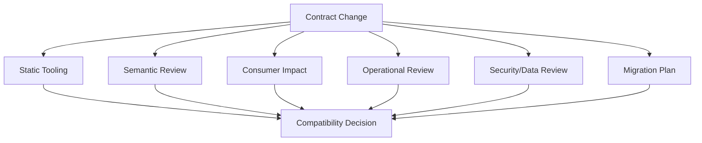
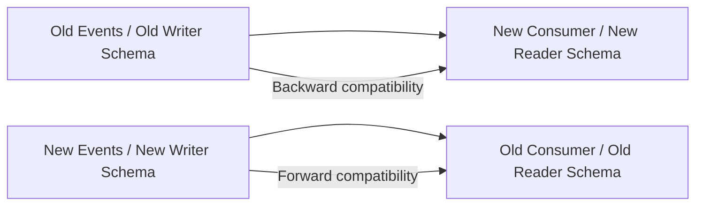
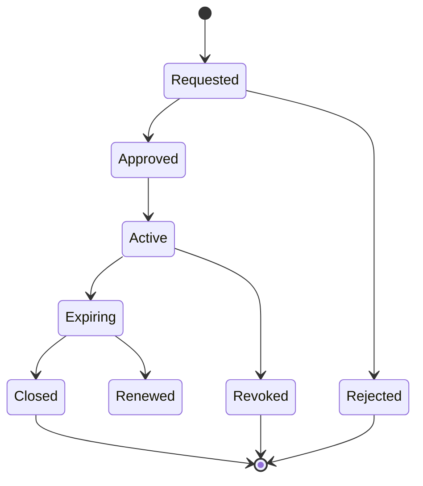
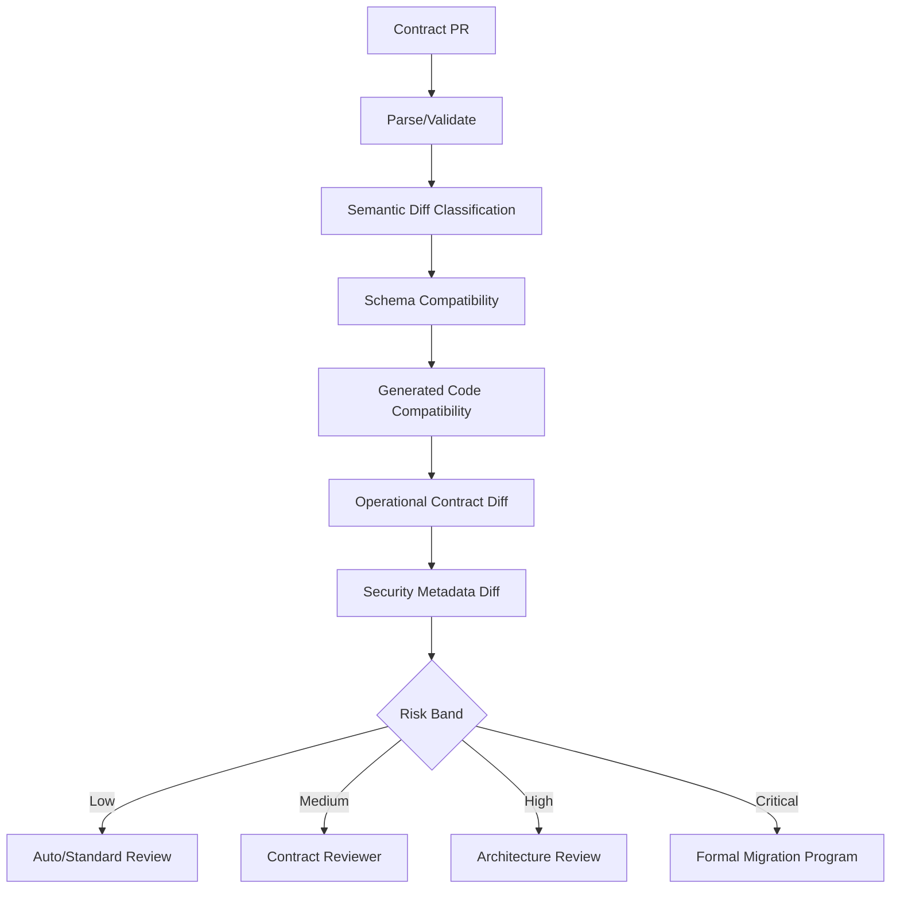

# Part 023 — Compatibility Governance: Backward, Forward, Full, Transitive, and Semantic Compatibility

## Tujuan Pembelajaran

Compatibility governance adalah discipline untuk menjawab pertanyaan:

> “Apakah perubahan contract ini aman, untuk siapa, dalam arah mana, dalam horizon waktu berapa lama, dan dengan bukti apa?”

Tanpa governance, compatibility sering direduksi menjadi:

```text
schema registry passed
```

atau:

```text
unit tests green
```

Itu tidak cukup.

Compatibility governance harus menggabungkan:

1. structural compatibility;
2. semantic compatibility;
3. runtime behavior compatibility;
4. generated-code compatibility;
5. consumer compatibility;
6. operational compatibility;
7. security/data compatibility;
8. replay compatibility;
9. regulatory/audit compatibility;
10. migration feasibility.

Setelah part ini, kamu harus mampu:

- membedakan backward, forward, full, and transitive compatibility;
- menjelaskan compatibility direction berdasarkan reader/writer dan producer/consumer;
- membuat decision matrix untuk API, event, Avro, Protobuf, JSON Schema, OpenAPI, AsyncAPI;
- mengidentifikasi semantic breaking change yang tidak tertangkap schema diff;
- membuat Compatibility Decision Record;
- mendesain exception workflow yang tidak menjadi loophole;
- melakukan consumer impact scoring;
- membuat risk-based approval process;
- membangun compatibility policy yang enforceable di CI/CD;
- menghindari governance theater.

---

## 1. Compatibility Governance Is Not Just a Tool

Tools can answer:

```text
Does this schema parse?
Does this change pass configured compatibility mode?
Did this OpenAPI diff remove a field?
Did Protobuf tag reuse happen?
```

Tools cannot fully answer:

```text
Did event meaning change?
Did this field become legally sensitive?
Can consumer projections replay historical data?
Will generated Java SDK break source compatibility?
Will old consumers crash on new enum values?
Does this change alter retry/idempotency semantics?
```

Therefore:



Compatibility governance is a socio-technical system: tools + rules + ownership + evidence + decisions.

---

## 2. Compatibility Vocabulary

| Term | Meaning |
|---|---|
| structural compatibility | data/schema can be read/parsed/validated |
| semantic compatibility | meaning and valid consumer assumptions remain safe |
| backward compatibility | new reader/consumer can read old data or old contract usage |
| forward compatibility | old reader/consumer can read new data |
| full compatibility | backward + forward |
| transitive compatibility | compatibility checked against all previous versions |
| runtime compatibility | actual server/producer behavior remains compatible |
| generated-code compatibility | generated Java/SDK public API remains compatible |
| operational compatibility | topic/key/retention/retry/SLO behavior remains compatible |
| security compatibility | access/data sensitivity assumptions remain compatible |
| replay compatibility | historical data remains processable by new code |
| source compatibility | consumer source code still compiles |
| binary compatibility | compiled code still links/runs against new library |
| behavioral compatibility | same inputs/conditions produce expected observable outcomes |

---

## 3. Backward and Forward: Direction Matters

In schema registry contexts:

- **Backward compatibility** often means a new schema can read data written with the previous schema.
- **Forward compatibility** often means the previous schema can read data written with the new schema.
- **Full compatibility** combines both.
- **Transitive** means the check is against all earlier versions, not just the latest.

For event streams:



### 3.1 Backward Compatibility Example

New consumer can replay old events.

Old event:

```json
{
  "caseId": "case_123"
}
```

New event schema adds optional/defaulted field:

```json
{
  "caseId": "case_123",
  "reasonCode": "UNKNOWN"
}
```

New reader can read old event and default `reasonCode`.

### 3.2 Forward Compatibility Example

Old consumer can read new events.

New producer adds field:

```json
{
  "caseId": "case_123",
  "reasonCode": "EVIDENCE_COMPLETE"
}
```

Old consumer ignores `reasonCode`.

This works only if old consumer tolerates unknown fields and no dangerous enum/value/semantic changes occur.

---

## 4. API Compatibility vs Event Compatibility

### 4.1 API Compatibility

HTTP API compatibility is usually about:

1. old clients calling new server;
2. new clients calling old server if rollout requires;
3. generated SDK compatibility;
4. request/response/error compatibility;
5. runtime behavior.

Backward-compatible API change:

```text
Add optional response field.
```

Breaking API change:

```text
Add required request field.
```

### 4.2 Event Compatibility

Event compatibility is about:

1. old consumers reading new events;
2. new consumers replaying old events;
3. old event history and new code;
4. topic/key/order/retention;
5. schema registry compatibility;
6. replay and side effects;
7. local projection rebuild.

Event compatibility must handle time much more explicitly.

```text
API compatibility: client/server across deployment versions.
Event compatibility: producer/consumer across deployment versions and historical data.
```

---

## 5. Compatibility Dimensions

A compatibility decision should evaluate multiple dimensions.

| Dimension | Example question |
|---|---|
| Schema | Does the schema pass registry compatibility? |
| Semantics | Does field/event meaning remain the same? |
| Runtime behavior | Does producer/server still emit/respond at same lifecycle point? |
| Consumer code | Will old Java generated client compile/run? |
| Error model | Did retryability or error code change? |
| Operational | Did Kafka key, topic, retention, ordering, or DLQ change? |
| Security | Did field become sensitive or access-restricted? |
| Replay | Can new code process old events? |
| Observability | Are correlation IDs, event IDs, status metrics stable? |
| Governance | Is owner, approval, migration, and changelog present? |

Tooling can automate some. Senior review covers the rest.

---

## 6. Structural Compatibility by Format

### 6.1 Avro

Avro compatibility is reader/writer schema resolution.

Common safe pattern:

```text
Add field with default.
```

Risky:

```text
Add enum symbol.
Rename without honest alias.
Change logical type.
Change decimal scale.
```

### 6.2 Protobuf

Protobuf compatibility is primarily field-number/wire compatibility.

Safe-ish:

```text
Add field with new number.
```

Dangerous:

```text
Rename field if generated Java public API matters.
Add enum value without unknown handling.
Change presence semantics.
```

Breaking:

```text
Reuse field number.
Change field type to incompatible wire type.
Remove field and later reuse number.
```

### 6.3 JSON Schema

JSON Schema compatibility depends heavily on direction and content model.

Safe-ish:

```text
Add optional property to response/event, if consumers ignore unknown fields.
```

Breaking:

```text
Add required request property.
Tighten constraint.
Change type.
Disallow previously allowed additional properties.
```

### 6.4 OpenAPI

OpenAPI diff must consider:

1. method/path;
2. parameters;
3. headers;
4. request body;
5. responses;
6. schemas;
7. security;
8. error models;
9. examples;
10. operationId/generated client effects.

### 6.5 AsyncAPI

AsyncAPI compatibility includes:

1. channel address;
2. operation send/receive;
3. message references;
4. event type;
5. broker bindings;
6. key/routing;
7. schema;
8. examples;
9. lifecycle metadata.

---

## 7. Semantic Compatibility

Semantic compatibility means consumer assumptions remain safe.

Schema unchanged:

```json
{
  "status": "ACTIVE"
}
```

Old meaning:

```text
customer may transact
```

New meaning:

```text
customer profile is active
```

This is semantic breaking.

### 7.1 Common Semantic Breaks

1. field meaning changed;
2. event emitted earlier/later in workflow;
3. status code meaning changed;
4. error retryability changed;
5. default sort changed;
6. id format changed;
7. time basis changed from occurredAt to processedAt;
8. monetary scale changed;
9. enum value meaning changed;
10. authority/source changed;
11. old field now derived differently;
12. event no longer implies same state transition;
13. null meaning changed;
14. missing field meaning changed;
15. data freshness window changed.

### 7.2 Semantic Compatibility Test

For every significant field/event:

```yaml
consumerAssumption:
  field: payload.lifecycleStatus
  assumption: ACTIVE means customer lifecycle state is active.
  doesNotMean: customer has transaction access.
```

When changing contract, review assumptions.

---

## 8. Compatibility Classification

Use a four-level classification:

| Class | Meaning | Example | Gate |
|---|---|---|---|
| Safe | compatible and low-risk | add optional response field | automated tests |
| Dangerous | likely compatible but needs review | add enum value | review + consumer impact |
| Breaking | known incompatible | remove field | migration plan + approval |
| Semantic breaking | shape may pass but meaning unsafe | change event timing | architecture review |

### 8.1 Safe Change

```text
Add optional `description` field to response.
```

Conditions:

1. old consumers ignore unknown fields;
2. generated SDK not source-breaking;
3. no semantic dependency;
4. docs/examples updated.

### 8.2 Dangerous Change

```text
Add enum value `PENDING_REVIEW`.
```

Risk:

1. old switch statements fail;
2. analytics filters exclude unknown;
3. UI displays blank;
4. workflow falls to default branch.

Requires review.

### 8.3 Breaking Change

```text
Rename `status` to `lifecycleStatus` and remove `status`.
```

Old consumers break.

### 8.4 Semantic Breaking

```text
`PaymentAuthorized` now means authorization request accepted, not money authorized.
```

Even if schema same, contract is broken.

---

## 9. Compatibility Decision Matrix

### 9.1 API Changes

| Change | Class | Notes |
|---|---|---|
| Add optional response field | Safe | if unknown tolerated |
| Add required request field | Breaking | old clients cannot send |
| Remove response field | Breaking | consumers may depend |
| Rename field | Breaking | use dual field migration |
| Add enum value | Dangerous | depends open/closed enum |
| Change default sort | Semantic breaking/dangerous | consumer-visible behavior |
| Add error code | Dangerous | old SDK mapping |
| Change retryability | Semantic breaking | affects resilience |
| Tighten validation | Breaking | old requests fail |
| Add endpoint | Safe | normally |
| Remove endpoint | Breaking | requires sunset |

### 9.2 Event Changes

| Change | Class | Notes |
|---|---|---|
| Add optional field with default | Safe/dangerous | depends semantics |
| Add required field | Breaking | old data/replay |
| Add enum value | Dangerous | old consumers |
| Change Kafka key | Breaking/dangerous | ordering/partitioning |
| Change retention 90d -> 7d | Operational breaking | replay window |
| Add new event type to multi-type topic | Dangerous | unknown event type handling |
| Stop publishing event | Breaking | consumers starve |
| Change event source authority | Semantic breaking | trust/lineage |
| Change event timing | Semantic breaking | workflow correctness |
| Add topic v2 | Safe if additive, but migration needed | operational burden |
| Change DLQ shape | Breaking for tooling | operational |

---

## 10. Generated-Code Compatibility

A schema may be wire-compatible but generated Java incompatible.

Examples:

### 10.1 Protobuf Field Rename

```proto
string status = 2;
```

to:

```proto
string lifecycle_status = 2;
```

Wire-compatible. Java source changes from:

```java
getStatus()
```

to:

```java
getLifecycleStatus()
```

Consumers break if generated class is public.

### 10.2 OpenAPI operationId Change

Old:

```yaml
operationId: getCustomer
```

New:

```yaml
operationId: retrieveCustomer
```

HTTP contract same. Generated client method changes.

### 10.3 Avro Namespace Change

Schema may use aliases, but generated Java package/class changes.

### 10.4 Governance Rule

If generated code is exposed to consumers:

```yaml
generatedCodeCompatibility:
  required: true
  checks:
    - generated-client-compile
    - public-api-diff
    - sample-consumer-compile
```

---

## 11. Operational Compatibility

Operational compatibility is often ignored.

Examples:

| Change | Why compatibility risk |
|---|---|
| Kafka key changes | ordering/partitioning break |
| topic retention reduced | replay/bootstrap break |
| compaction enabled | history removed |
| topic renamed | consumers stop receiving |
| DLQ topic changed | tooling/operations break |
| retry topic introduced | ordering changes |
| rate limit lowered | clients fail |
| timeout reduced | old slow consumers fail |
| cache headers changed | stale/freshness assumptions |
| gateway auth changed | access break |

Compatibility policy must include operational metadata.

---

## 12. Security and Data Compatibility

A schema change can be structurally safe but security-breaking.

Examples:

1. add PII field to event consumed by broad audience;
2. change data classification from internal to confidential;
3. include national ID in DLQ;
4. expose error details with sensitive reason;
5. add tenantId but not enforce tenant filtering;
6. publish restricted event to existing topic with many consumers.

Security compatibility question:

> Are existing consumers still authorized to receive the new data?

If not, additive field is not safe.

---

## 13. Replay Compatibility

Event changes need replay analysis.

Questions:

1. can latest consumer read all old event versions?
2. are old schemas still available?
3. are old business meanings documented?
4. are old reference data/rules needed?
5. are upcasters tested?
6. do side-effect consumers deduplicate?
7. does topic retention still satisfy replay needs?
8. are deleted/tombstone events handled?

Replay compatibility is often stricter than live compatibility.

---

## 14. Consumer Impact Scoring

Use a structured score.

### 14.1 Impact Dimensions

| Dimension | Score 1 | Score 3 | Score 5 |
|---|---|---|---|
| consumer count | 1 team | 2-5 teams | many/unknown |
| criticality | non-critical | business workflow | tier-1/regulatory |
| change type | additive | dangerous | breaking |
| consumer control | same team | internal teams | external/partner |
| replay impact | none | limited | historical rebuild affected |
| generated code | hidden | some exposed | public SDK |
| security | no new data | internal sensitive | regulated/PII |
| operational | no infra change | minor topic config | key/retention/topic change |

Example:

```yaml
consumerImpact:
  consumerCount: 5
  criticality: 5
  changeType: 3
  consumerControl: 3
  replayImpact: 5
  generatedCode: 1
  security: 3
  operational: 5
  total: 30
  riskBand: high
```

### 14.2 Risk Bands

| Score | Risk |
|---:|---|
| 0-8 | low |
| 9-18 | medium |
| 19-30 | high |
| 31+ | critical |

Use organization-specific calibration.

---

## 15. Approval Model

### 15.1 Low Risk

Requirements:

1. automated compatibility checks pass;
2. unit/contract tests pass;
3. changelog updated.

Approval:

```text
service owner
```

### 15.2 Medium Risk

Requirements:

1. compatibility checks;
2. consumer impact analysis;
3. reviewer from platform/domain;
4. examples updated;
5. generated client compile.

Approval:

```text
service owner + contract reviewer
```

### 15.3 High Risk

Requirements:

1. migration plan;
2. consumer inventory;
3. rollout plan;
4. rollback plan;
5. security review if data changes;
6. replay plan;
7. architecture review.

Approval:

```text
domain owner + platform architect + impacted consumers
```

### 15.4 Critical Risk

Requirements:

1. executive/business owner if regulatory/public;
2. migration project;
3. formal exception record;
4. sunset communication;
5. production readiness review.

Approval:

```text
architecture review board / governance council
```

This is not bureaucracy. It is proportional control.

---

## 16. Compatibility Decision Record

For any dangerous/breaking/semantic change, write a decision record.

Template:

```md
# CDR-2026-06-29-001: Add PENDING_REVIEW to CustomerLifecycleStatus

## Context

Customer onboarding now has a manual review stage between KYC submitted and activation.

## Proposed Change

Add enum value `PENDING_REVIEW` to `CustomerLifecycleStatus`.

## Compatibility Classification

Dangerous.

## Structural Compatibility

Schema registry check passes because enum addition is allowed under current mode.

## Semantic Compatibility

Existing consumers may assume known values are ACTIVE, SUSPENDED, CLOSED.

## Consumer Impact

Known consumers:
- onboarding-ui
- crm-sync
- case-management
- notification-service

Risk score: 21 / high.

## Migration Plan

1. Update SDK with UNKNOWN fallback.
2. Notify consumers.
3. Add consumer tests for unknown values.
4. Producer will not emit PENDING_REVIEW until consumers confirm readiness.
5. Enable emission behind feature flag after approval.

## Rollback Plan

Disable emission of PENDING_REVIEW. Existing schema remains registered.

## Decision

Approved with gated rollout.

## Approvers

- customer-platform owner
- API governance reviewer
- onboarding-ui owner
```

CDR is evidence.

---

## 17. Compatibility Exception Workflow

Exceptions are sometimes necessary. They must be controlled.

### 17.1 Exception Request

```yaml
exceptionRequest:
  artifact: com.acme.case.events.LegacyCaseUpdated
  requestedCompatibility: NONE
  currentCompatibility: BACKWARD_TRANSITIVE
  reason: one-time legacy migration
  duration: 90d
  consumers:
    - legacy-migration-worker
  dataClassification: internal
  rollbackPlan: stop migration producer and restore previous artifact rule
  expiresAt: 2026-09-30
```

### 17.2 Exception Rules

1. time-bound;
2. approved by appropriate role;
3. documented reason;
4. consumer impact known;
5. telemetry active;
6. rollback plan exists;
7. cannot be renewed silently;
8. visible in dashboard;
9. blocks new consumers unless approved;
10. reviewed before expiry.

### 17.3 Exception State Machine



---

## 18. Compatibility Policy as Code

Policy should be executable.

Example:

```yaml
compatibilityPolicy:
  default:
    schemaCompatibility: BACKWARD
    semanticReviewRequiredFor:
      - enumAddition
      - fieldMeaningChange
      - eventTimingChange
      - errorRetryabilityChange
      - kafkaKeyChange
  stableEvents:
    schemaCompatibility: BACKWARD_TRANSITIVE
    requireGoldenSamples: true
    requireReplayTests: true
    requireConsumerInventoryForBreaking: true
  publicApis:
    breakingChangeRequires:
      - migrationGuide
      - deprecationWindow
      - architectureApproval
  dangerousChanges:
    requireDecisionRecord: true
  exceptions:
    requireExpiry: true
    maxDurationDays: 180
```

CI can enforce:

1. compatibility mode;
2. forbidden changes;
3. metadata presence;
4. decision record required;
5. exception expiry;
6. reviewers.

---

## 19. Compatibility Gates in CI



### 19.1 Gates Should Fail On

1. invalid schema;
2. removed required contract element;
3. added required request field;
4. Protobuf tag reuse;
5. missing default for Avro added field;
6. unknown artifact owner;
7. compatibility mode disabled without exception;
8. deprecated event without replacement;
9. key change without decision record;
10. classification downgrade/upgrade without review;
11. missing golden samples for new event;
12. breaking diff without migration guide.

---

## 20. Compatibility Dashboard

A dashboard should show:

```text
Contract Governance
- Total artifacts: 1,248
- Stable artifacts: 903
- Experimental artifacts: 201
- Deprecated artifacts: 74
- Artifacts with NONE compatibility: 12
- Expiring exceptions in 30 days: 5
- Breaking changes this month: 3
- Dangerous changes awaiting approval: 9
- Schemas without owner: 0
- Stable events without replay tests: 14
```

Dashboard prevents governance blind spots.

---

## 21. Compatibility for Deprecation

Deprecation is compatible only if old contract still works.

Deprecation change:

```yaml
status:
  deprecated: true
  replacement: lifecycleStatus
```

Usually safe structurally.

But operationally it must include:

1. changelog;
2. migration guide;
3. owner;
4. telemetry;
5. replacement;
6. target sunset;
7. consumer tracking.

Removing deprecated field is a new breaking change, not part of deprecation.

---

## 22. Consumer Inventory

Compatibility governance needs consumer inventory.

Minimum fields:

```yaml
consumerId: case-management-service
ownerTeam: case-platform
contact: case-platform-oncall
artifactUsed: com.acme.customer.events.CustomerActivated
schemaVersions:
  - 1
  - 2
topic: customer-events
consumerGroup: case-management-service
criticality: tier-1
usage:
  fields:
    - payload.customerId
    - payload.lifecycleStatus
  sideEffects:
    - opens case workflow
lastSeenAt: 2026-06-29T05:00:00Z
migrationStatus: not-started
```

No inventory = assume high risk.

---

## 23. Semantic Compatibility Review Questions

For every dangerous change:

1. What consumer assumptions exist?
2. Does field/event name still tell the truth?
3. Does event timing change?
4. Does authority/source change?
5. Does default behavior change?
6. Does retryability/idempotency change?
7. Does ordering/key/replay behavior change?
8. Does data classification change?
9. Does generated SDK public API change?
10. Can old consumers safely ignore new data?
11. Can new consumers process old data?
12. Are old examples still valid?
13. Is migration observable?
14. Is rollback possible?
15. Who owns the decision?

---

## 24. Compatibility Anti-Patterns

### 24.1 “Registry Passed, Ship It”

Structural check only.

### 24.2 Compatibility NONE as Default

Destroys long-term trust.

### 24.3 Silent Semantic Break

Worst category.

### 24.4 Exception Without Expiry

Permanent bypass.

### 24.5 Unknown Consumers Ignored

Breakage discovered in production.

### 24.6 Generated SDK Break Ignored

Schema wire-compatible but consumers fail compile.

### 24.7 Kafka Key Change Treated as Internal

Ordering contract breaks.

### 24.8 Deprecation Treated as Removal

Consumers still using deprecated field break.

### 24.9 Review Board for Everything

Bureaucracy causes teams to bypass process. Use risk-based governance.

### 24.10 No Decision Records

Future engineers repeat mistakes.

---

## 25. Practice Lab

### Lab 1 — Classify Changes

Classify as safe, dangerous, breaking, or semantic breaking:

1. Add optional response field.
2. Add required request field.
3. Add enum value.
4. Remove deprecated field with active traffic.
5. Change Kafka key from `caseId` to `customerId`.
6. Change event timing from “requested” to “committed”.
7. Change Protobuf field name, same number.
8. Reuse Protobuf field number.
9. Add Avro field with default.
10. Add Avro field without default.
11. Tighten JSON Schema maxLength.
12. Change topic retention from 90 days to 7 days.

### Lab 2 — Consumer Impact Score

A stable event with 18 consumers adds enum value `MANUAL_REVIEW`. Three consumers are tier-1 workflows. Generated Java enum is public. Score risk and define approval path.

### Lab 3 — Write CDR

Write Compatibility Decision Record for splitting `CustomerActivated` into:

- `CustomerLifecycleActivated`;
- `CustomerTransactionAccessGranted`.

### Lab 4 — Exception Workflow

A migration team asks for compatibility `NONE` for 120 days. Define required data, approval, monitoring, and expiry.

### Lab 5 — Policy-as-Code

Write YAML policy that blocks:

1. Protobuf tag reuse;
2. Avro added field without default;
3. OpenAPI removed response field;
4. Kafka key change without CDR;
5. compatibility NONE without expiry.

---

## 26. Senior Engineer Heuristics

1. **Compatibility is directional. Always ask: who reads whose data?**
2. **Structural compatibility is not semantic compatibility.**
3. **Transitive compatibility matters when history and replay matter.**
4. **Generated Java compatibility can break even when wire compatibility passes.**
5. **Kafka key, retention, and topic are compatibility surfaces.**
6. **Security/data classification can make additive changes unsafe.**
7. **No consumer inventory means high risk by default.**
8. **Dangerous changes need decision records, not casual approval.**
9. **Exceptions must expire.**
10. **Deprecation is not removal.**
11. **A registry pass is evidence, not final decision.**
12. **Risk-based governance beats review-board-for-everything.**
13. **Semantic assumptions should be written near the contract.**
14. **Compatibility policy should run in CI.**
15. **The best compatibility process prevents surprises without blocking safe evolution.**

---

## 27. Summary

Compatibility governance combines tool-enforced structural checks with semantic review, consumer impact analysis, operational review, and risk-based approval. Backward, forward, full, and transitive modes are essential vocabulary, but they are only one part of compatibility.

Main takeaways:

1. compatibility is multi-dimensional;
2. backward and forward depend on reader/writer direction;
3. transitive matters for historical events and replay;
4. semantic compatibility is often the hidden danger;
5. generated-code compatibility matters for Java consumers;
6. Kafka operational settings are contract surfaces;
7. data/security changes can invalidate otherwise safe schema changes;
8. decision records make risky changes defensible;
9. exceptions must be controlled, visible, and time-bound;
10. policy-as-code turns governance into engineering practice.

Part berikutnya membahas schema lifecycle management: draft, review, approve, publish, deprecate, retire, changelog, migration notes, auditability, and lifecycle state machines.
