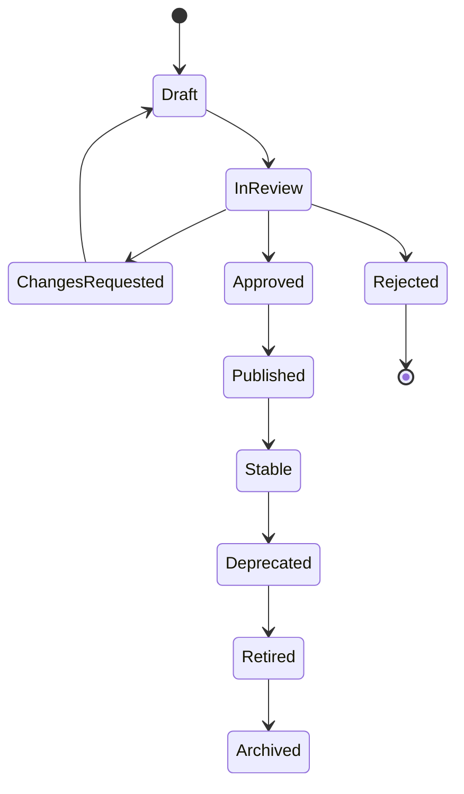
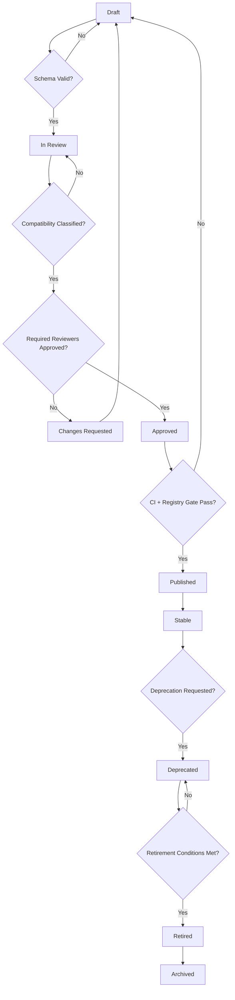

# Part 024 — Schema Lifecycle Management: Draft, Review, Approve, Publish, Deprecate, Retire

## Tujuan Pembelajaran

Schema dan contract tidak hanya “dibuat lalu dipakai”. Di enterprise system, schema punya lifecycle:

```text
draft -> review -> approved -> published -> stable -> deprecated -> retired
```

Tanpa lifecycle, registry menjadi kuburan artifact:

- schema tidak jelas owner-nya;
- experimental schema dipakai production;
- deprecated field dihapus tanpa migrasi;
- old schema hilang sehingga replay gagal;
- partner membaca contract yang belum approved;
- topic/event tidak jelas apakah stable atau temporary;
- breaking changes terjadi tanpa governance evidence.

Part ini membahas schema lifecycle management sebagai operating model.

Setelah part ini, kamu harus mampu:

1. mendesain state machine lifecycle untuk schema/API/event contracts;
2. menentukan entry/exit criteria setiap lifecycle state;
3. mengelola ownership, stewardship, and approval workflow;
4. membuat changelog dan migration notes yang berguna;
5. menghubungkan lifecycle dengan registry metadata, catalog, CI, and runtime gates;
6. mendesain deprecation and retirement process;
7. membuat audit trail untuk regulatory defensibility;
8. menghindari lifecycle anti-pattern seperti “deprecated forever” dan “experimental in production”.

---

## 1. Why Lifecycle Matters

Contract lifecycle menjawab:

1. bolehkah schema dipakai production?
2. siapa owner-nya?
3. apakah schema masih experimental?
4. apakah consumer baru boleh onboard?
5. apakah ada replacement?
6. kapan old version akan sunset?
7. apakah event masih dipublish?
8. apakah old schema masih bisa dipakai replay?
9. apakah perubahan sudah approved?
10. apakah governance evidence tersedia?

Without lifecycle, every artifact becomes ambiguous.



---

## 2. Contract Artifact Classes

Lifecycle applies to many artifact types:

| Artifact | Lifecycle needed? |
|---|---|
| Avro schema | yes |
| Protobuf schema | yes |
| JSON Schema | yes |
| OpenAPI spec | yes |
| AsyncAPI spec | yes |
| event type | yes |
| Kafka topic contract | yes |
| error code taxonomy | yes |
| common metadata schema | yes |
| SDK generated artifact | yes |
| examples/golden samples | yes |
| deprecation record | yes |

A schema version can be retired while artifact identity remains active. Be precise.

---

## 3. Lifecycle States

### 3.1 Draft

Purpose:

```text
Design work in progress.
```

Allowed:

1. editing freely;
2. local validation;
3. discussion with reviewers;
4. not used by production consumers.

Entry:

- author creates new schema/contract proposal.

Exit criteria:

1. owner assigned;
2. artifact identity proposed;
3. schema validates;
4. examples included;
5. compatibility classification stated;
6. review request opened.

Metadata:

```yaml
lifecycle: draft
ownerTeam: case-management-platform
```

### 3.2 In Review

Purpose:

```text
Formal review by owner/platform/domain/security as needed.
```

Checks:

1. naming;
2. semantics;
3. compatibility;
4. schema validity;
5. examples;
6. topic/key;
7. security/data classification;
8. consumer impact;
9. migration plan if needed.

Exit:

- approved;
- changes requested;
- rejected.

### 3.3 Approved

Purpose:

```text
Design accepted, not yet published/released.
```

Approved artifact should be immutable except for metadata corrections.

Exit criteria to publish:

1. CI passed;
2. schema registered to target environment;
3. docs/catalog generated;
4. release notes ready;
5. runtime producer/consumer integration ready.

### 3.4 Published

Purpose:

```text
Artifact is available in registry/catalog/artifact repository.
```

Published does not always mean production traffic exists.

Examples:

1. OpenAPI spec published;
2. schema registered in prod registry;
3. AsyncAPI page visible;
4. Java SDK artifact released.

### 3.5 Stable

Purpose:

```text
Supported for production use and compatibility-governed.
```

Stable contract promises:

1. compatibility policy enforced;
2. breaking changes require migration;
3. owner accountable;
4. docs maintained;
5. examples valid;
6. telemetry monitored.

### 3.6 Deprecated

Purpose:

```text
Still works, but new consumers should not adopt.
```

Deprecation requires:

1. replacement or explanation;
2. migration guide;
3. known consumers;
4. telemetry;
5. owner;
6. target sunset or condition;
7. changelog.

Deprecated is not removed.

### 3.7 Retired

Purpose:

```text
No longer supported for new production use.
```

For API endpoint: not available or removed.

For event type: no longer published.

For schema: no new writes use it, but old schema may remain readable for replay.

Retired does not always mean deleted.

### 3.8 Archived

Purpose:

```text
Preserved for audit/history/replay but hidden from normal discovery.
```

Archived artifact may be read-only and retained for compliance.

---

## 4. Lifecycle Metadata Model

Example:

```yaml
artifactId: com.acme.case.events.CaseApproved
artifactType: AVRO
lifecycle: stable
ownerTeam: case-management-platform
steward: jane.doe@acme.com
domain: case-management
introducedAt: 2026-06-29
approvedAt: 2026-06-25
publishedAt: 2026-06-29
compatibility: BACKWARD_TRANSITIVE
dataClassification: confidential
pii: false
consumerVisibility: internal
reviewRecord: CDR-2026-06-20-004
changelog: ./CHANGELOG.md
```

For deprecated:

```yaml
lifecycle: deprecated
deprecatedSince: 2027-01-31
replacement: com.acme.case.events.CaseApprovalDecisionRecorded
sunsetTarget: 2027-12-31
removalCondition: no consumer traffic for 90 days
migrationGuide: https://developer.acme.com/migrations/case-approved
```

---

## 5. Ownership and Stewardship

### 5.1 Owner

Owner team is accountable for:

1. semantic correctness;
2. compatibility;
3. lifecycle decisions;
4. consumer communication;
5. deprecation/migration;
6. incident response.

### 5.2 Steward

Steward is a named role/person or rotating role responsible for day-to-day contract hygiene.

Steward tasks:

1. review PRs;
2. update catalog;
3. monitor deprecated usage;
4. ensure examples valid;
5. coordinate consumers;
6. manage exceptions;
7. maintain changelog.

### 5.3 Platform Team

Platform team owns:

1. registry infrastructure;
2. lint rules;
3. CI templates;
4. compatibility tooling;
5. catalog integration;
6. policy-as-code;
7. governance dashboards.

Platform should enable, not become bottleneck for every safe change.

---

## 6. Lifecycle State Machine with Gates



Each transition must be auditable.

---

## 7. Draft State Entry Checklist

Before review:

- artifact name proposed;
- owner team assigned;
- artifact type known;
- schema syntax valid;
- examples provided;
- lifecycle target defined;
- data classification proposed;
- compatibility impact estimated;
- topic/channel/API path identified;
- consumer assumptions written;
- source/authority defined for events;
- error semantics defined for APIs;
- generated code impact considered.

Drafts without owner should not enter formal review.

---

## 8. Review State Checklist

Review dimensions:

### 8.1 Contract Semantics

- What does this schema/event/API mean?
- Who is authority?
- What may consumers assume?
- What must consumers not assume?
- Is name accurate?

### 8.2 Compatibility

- Is this new artifact or change?
- Is it safe/dangerous/breaking?
- Does registry compatibility pass?
- Does semantic compatibility pass?
- Are old examples preserved?

### 8.3 Operational

- Topic/key/retention/order documented?
- Error/retry/idempotency documented?
- Replay requirements clear?
- DLQ behavior clear?

### 8.4 Security/Data

- Classification correct?
- PII present?
- Consumers authorized?
- Retention policy aligned?
- DLQ/data lake handling considered?

### 8.5 Tooling

- Lint passes?
- Generated code compiles?
- Examples validate?
- AsyncAPI/OpenAPI links valid?
- Catalog metadata complete?

---

## 9. Approval Criteria

A contract is approved when:

1. owner accepts semantic responsibility;
2. required reviewers approve;
3. compatibility classification is recorded;
4. high-risk changes have decision record;
5. schema validates;
6. examples validate;
7. security metadata complete;
8. migration plan exists if needed;
9. rollback plan exists for risky rollout;
10. CI gates pass.

Approval is not just a GitHub “LGTM”. It is a governance event.

Approval record:

```yaml
approval:
  artifact: com.acme.case.events.CaseApproved
  version: 7
  approvedAt: 2026-06-29T05:00:00Z
  approvedBy:
    - case-platform-owner
    - schema-governance-reviewer
  decisionRecord: CDR-2026-06-29-002
  riskBand: medium
```

---

## 10. Publishing

Publishing means artifact becomes available to intended audience.

Publishing actions:

1. register schema in registry;
2. publish OpenAPI/AsyncAPI docs;
3. publish generated client/stub if applicable;
4. update event catalog;
5. update changelog;
6. tag/release contract repository;
7. notify consumers if needed;
8. update examples;
9. update SDK version;
10. update registry metadata.

### 10.1 Immutable Published Versions

Published schema versions should be immutable.

Bad:

```text
Edit schema version 7 in place.
```

Better:

```text
Publish version 8.
```

If metadata correction is needed, make metadata changes separately and audit them. Do not mutate schema content.

---

## 11. Stable State Responsibilities

Stable artifacts require ongoing maintenance.

Owner responsibilities:

1. monitor usage;
2. maintain docs;
3. keep examples valid;
4. respond to issues;
5. review changes;
6. maintain compatibility;
7. publish changelogs;
8. manage deprecations;
9. support replay;
10. participate in incidents.

Stable is not “done”. Stable means supported.

---

## 12. Deprecation

Deprecation is a lifecycle state with rules.

### 12.1 Deprecation Requirements

Do not deprecate without:

1. reason;
2. replacement or explanation why none;
3. migration guide;
4. known consumer list;
5. telemetry plan;
6. target sunset or removal condition;
7. owner;
8. support contact;
9. changelog entry.

### 12.2 Deprecation Record

```yaml
deprecation:
  artifact: com.acme.customer.events.CustomerActivated
  deprecatedSince: 2026-06-29
  reason: Event overloaded lifecycle activation and transaction access.
  replacement:
    - com.acme.customer.events.CustomerLifecycleActivated
    - com.acme.customer.events.CustomerTransactionAccessGranted
  ownerTeam: customer-platform
  knownConsumers:
    - onboarding-service
    - crm-sync
    - case-management-service
  sunsetTarget: 2027-03-31
  removalCondition: no production consumption for 90 days
  migrationGuide: https://developer.acme.com/migrations/customer-activated
```

### 12.3 Deprecation Communication

Communication channels:

1. catalog banner;
2. changelog;
3. PR/release notes;
4. email/Slack to known consumers;
5. SDK deprecation annotations;
6. API response headers if HTTP;
7. AsyncAPI/OpenAPI deprecated flags;
8. dashboard.

---

## 13. Retirement

Retirement is not deletion.

### 13.1 Retirement for API

- endpoint no longer available;
- gateway route disabled;
- SDK method removed in major version;
- docs archived.

### 13.2 Retirement for Event Type

- producer no longer publishes event;
- old schema remains readable;
- topic may remain for other event types;
- catalog marks retired;
- replay tools still understand old event if needed.

### 13.3 Retirement for Schema Version

- no new producer uses version;
- registry still stores version;
- old messages can deserialize;
- artifact hidden from default docs if needed.

### 13.4 Retirement Preconditions

1. replacement stable;
2. consumers migrated;
3. telemetry shows no active use or exceptions approved;
4. deprecation window satisfied;
5. replay/archive plan exists;
6. rollback plan exists;
7. owner approval;
8. registry/catalog updated;
9. support team informed.

---

## 14. Archive

Archived artifacts are retained for:

1. audit;
2. replay;
3. incident investigation;
4. legal/regulatory evidence;
5. migration reference.

Archived should be:

1. read-only;
2. searchable by ID;
3. hidden from normal onboarding;
4. linked to retirement record;
5. retained according to policy.

Do not hard-delete production schemas that may be referenced by old messages.

---

## 15. Lifecycle for Experimental Contracts

Experimental contract is allowed only with controls.

Metadata:

```yaml
lifecycle: experimental
expiresAt: 2026-09-30
allowedConsumers:
  - fraud-research-service
productionUseAllowed: false
compatibilityGuarantee: none-or-limited
```

Rules:

1. visible as experimental;
2. limited consumers;
3. expiry date;
4. no tier-1 dependency;
5. no partner/public use;
6. migration or deletion at expiry;
7. not promoted to stable silently.

Anti-pattern:

```text
Experimental event becomes de facto production contract because nobody cleaned it up.
```

---

## 16. Lifecycle for Common Schemas

Common schemas need stricter lifecycle:

1. `EventMetadata`;
2. `Money`;
3. `Problem`;
4. `Address`;
5. `IdentityRef`;
6. `Pagination`;
7. `AuditActor`.

Because blast radius is high.

Change requirements:

1. dependency graph impact analysis;
2. transitive compatibility;
3. sample validation across dependents;
4. platform review;
5. rollout guide;
6. versioned common schema strategy.

Common schema should rarely be experimental if used by stable artifacts.

---

## 17. Changelog

Every artifact should have changelog.

Good changelog entry:

```md
## 1.4.0 - 2026-06-29

### Added

- Added optional `payload.reasonCode` to `CaseApproved`.

### Compatibility

- Backward-compatible for new consumers reading old events.
- Forward-compatible if old consumers ignore unknown fields.
- No Kafka key/topic/retention change.

### Migration

- Consumers may continue ignoring `reasonCode`.
- New consumers should treat missing `reasonCode` as `UNKNOWN`.

### Governance

- Approved by case-management-platform.
- Decision record: CDR-2026-06-29-002.
```

Bad:

```text
Updated schema.
```

Changelog should answer “what changed and what should I do?”

---

## 18. Migration Notes

Migration guide for breaking/dangerous changes should include:

1. old contract;
2. new contract;
3. why change exists;
4. compatibility classification;
5. timeline;
6. step-by-step consumer migration;
7. code examples;
8. testing guidance;
9. rollback;
10. support contact.

Example:

```md
# Migration: CustomerActivated to CustomerLifecycleActivated

## Why

`CustomerActivated` mixed lifecycle and transaction access semantics.

## Old

Consume `CustomerActivated`.

## New

Consume:
- `CustomerLifecycleActivated` for lifecycle state;
- `CustomerTransactionAccessGranted` for transaction permission.

## Timeline

- 2026-06-29: dual publish starts
- 2027-01-31: new consumers blocked from old event
- 2027-03-31: old event publication target sunset

## Consumer Steps

1. Add handler for new event.
2. Deduplicate side effects by customerId + transition.
3. Deploy with both handlers.
4. Verify metrics.
5. Remove old handler after confirmation.
```

---

## 19. Registry Metadata and Lifecycle

Registry should store lifecycle metadata.

Example:

```yaml
artifactMetadata:
  lifecycle: deprecated
  deprecatedSince: 2026-06-29
  replacementArtifact: com.acme.customer.events.CustomerLifecycleActivated
  ownerTeam: customer-platform
  migrationGuide: https://developer.acme.com/migrations/customer-activated
```

CI should block:

1. stable artifact without owner;
2. deprecated artifact without replacement/reason;
3. experimental artifact without expiry;
4. retired artifact with active producer;
5. artifact with lifecycle mismatch between registry and catalog.

---

## 20. Catalog Lifecycle Display

Catalog should visually show lifecycle:

```text
CaseApproved
Status: Stable
Owner: case-management-platform
Compatibility: BACKWARD_TRANSITIVE
Consumers: 12
Last changed: 2026-06-29
```

Deprecated:

```text
CustomerActivated
Status: Deprecated
Replacement: CustomerLifecycleActivated, CustomerTransactionAccessGranted
Sunset target: 2027-03-31
Migration guide: ...
```

Experimental:

```text
FraudSignalObserved
Status: Experimental
Expires: 2026-09-30
Allowed consumers: fraud-research-service
```

Lifecycle must be visible to prevent accidental adoption.

---

## 21. Lifecycle Automation

Automate reminders and gates.

### 21.1 CI Gates

Fail if:

1. lifecycle missing;
2. owner missing;
3. experimental expiry missing;
4. deprecated replacement missing;
5. stable artifact has compatibility NONE;
6. retired artifact still referenced by active AsyncAPI;
7. new consumer subscribes to deprecated event without waiver;
8. schema changed without changelog.

### 21.2 Scheduled Checks

Daily/weekly job:

1. list expiring experimental artifacts;
2. list deprecated artifacts past sunset;
3. list exceptions expiring;
4. list schemas without usage;
5. list stable artifacts without examples;
6. list retired artifacts still receiving traffic;
7. notify owners.

### 21.3 Runtime Checks

Producer startup can warn/fail if attempting to publish retired artifact.

Consumer onboarding can block deprecated artifact unless approved.

---

## 22. Lifecycle and Consumer Onboarding

When a consumer wants to use event/API:

1. check lifecycle;
2. check data classification;
3. check access approval;
4. check compatibility guarantee;
5. check deprecation status;
6. register consumer identity;
7. link consumer to artifact;
8. define usage fields;
9. define side effects;
10. define support contact.

For deprecated artifact:

```text
new consumers blocked unless exception approved.
```

For experimental artifact:

```text
only allowed consumers.
```

For stable artifact:

```text
onboarding allowed subject to access/security.
```

---

## 23. Lifecycle and Runtime Telemetry

Telemetry needed for lifecycle decisions:

1. API endpoint traffic;
2. field usage if measurable;
3. event consumption by group;
4. schema version usage;
5. producer schema version;
6. deprecated artifact usage;
7. consumer lag;
8. DLQ errors by event type;
9. SDK version adoption;
10. unknown consumer detection.

Without telemetry, retirement is guesswork.

---

## 24. Audit Trail

Audit should capture:

1. proposal author;
2. reviewers;
3. approval decision;
4. compatibility classification;
5. schema diff;
6. metadata changes;
7. registry version IDs;
8. promotion environments;
9. deprecation notice;
10. retirement decision;
11. exception approvals;
12. consumer migration evidence.

Audit record example:

```yaml
auditEvent:
  type: CONTRACT_VERSION_PUBLISHED
  artifact: com.acme.case.events.CaseApproved
  version: 7
  actor: ci-contract-publisher
  timestamp: 2026-06-29T05:00:00Z
  sourceCommit: abc123
  buildId: contract-build-9821
  approvalRecord: CDR-2026-06-29-002
```

This makes governance defensible.

---

## 25. Lifecycle Incident Scenarios

### 25.1 Experimental Used by Production

Cause:

- lifecycle not visible;
- onboarding not controlled;
- no expiry check.

Fix:

1. mark artifact blocked for new consumers;
2. identify consumers;
3. decide promote-to-stable or migrate off;
4. add lifecycle gate.

### 25.2 Deprecated Removed Too Early

Cause:

- no telemetry;
- owner assumed no usage.

Fix:

1. restore old contract if possible;
2. notify impacted consumers;
3. add retirement preconditions;
4. add usage dashboard.

### 25.3 Schema Deleted

Cause:

- registry cleanup job;
- misunderstanding retirement.

Fix:

1. restore registry backup;
2. re-register old schema if IDs allow;
3. verify replay;
4. block hard delete.

### 25.4 Common Schema Change Breaks Many Events

Cause:

- no dependency graph.

Fix:

1. rollback common schema version;
2. rebuild dependent artifacts;
3. add dependency impact analysis.

---

## 26. Lifecycle Policy Template

```yaml
schemaLifecyclePolicy:
  requiredMetadata:
    - lifecycle
    - ownerTeam
    - artifactType
    - dataClassification
  states:
    draft:
      productionUse: false
    inReview:
      productionUse: false
      requiresReviewers: true
    approved:
      mutableSchemaContent: false
    published:
      registryVisible: true
      catalogVisible: true
    stable:
      compatibilityRequired: true
      breakingChangeRequiresMigration: true
    experimental:
      expiryRequired: true
      allowedConsumersRequired: true
    deprecated:
      replacementOrReasonRequired: true
      migrationGuideRequired: true
      usageTelemetryRequired: true
    retired:
      newProductionUse: false
      runtimePublishAllowed: false
      schemaReadableForReplay: true
    archived:
      readOnly: true
  deletion:
    productionSchemaHardDeleteAllowed: false
```

---

## 27. Lifecycle Repository Layout

```text
contracts/
├── schemas/
│   ├── case/
│   │   ├── CaseApproved.avsc
│   │   ├── CaseSubmitted.avsc
│   │   └── metadata.yaml
│   └── common/
│       ├── EventMetadata.avsc
│       └── Money.avsc
├── asyncapi/
│   └── case-events.yaml
├── lifecycle/
│   ├── artifacts.yaml
│   ├── deprecations.yaml
│   ├── exceptions.yaml
│   └── retirements.yaml
├── decisions/
│   └── CDR-2026-06-29-002.md
├── examples/
│   └── case-approved-v1.json
└── CHANGELOG.md
```

Keep lifecycle metadata near contracts, not hidden in spreadsheets.

---

## 28. Lifecycle Review Checklist

### 28.1 New Artifact

- Owner assigned?
- Lifecycle target?
- Artifact name stable?
- Data classification?
- Examples?
- Compatibility policy?
- Catalog metadata?
- Consumer assumptions?

### 28.2 Change Existing Artifact

- Current lifecycle?
- Compatibility classification?
- Changelog updated?
- Decision record needed?
- Examples updated?
- Consumers impacted?
- Migration needed?
- Registry compatibility passes?

### 28.3 Deprecation

- Reason?
- Replacement?
- Migration guide?
- Known consumers?
- Telemetry?
- Sunset target?
- Owner?

### 28.4 Retirement

- Usage zero or exception approved?
- Replacement stable?
- Replay/archive support?
- Old schema retained?
- Catalog updated?
- Runtime publishing blocked?
- Rollback plan?

---

## 29. Lifecycle Anti-Patterns

### 29.1 Stable by Accident

Schema used in production before review.

### 29.2 Experimental Forever

No expiry and no owner.

### 29.3 Deprecated Forever

No migration, no sunset, no telemetry.

### 29.4 Retired Means Deleted

Old messages become unreadable.

### 29.5 Ownerless Contract

Nobody reviews or supports it.

### 29.6 Changelog Useless

“Updated schema.”

### 29.7 Lifecycle Only in Wiki

CI/runtime cannot enforce.

### 29.8 Approval Without Evidence

No compatibility classification or diff.

### 29.9 New Consumers on Deprecated Contract

Debt grows after deprecation.

### 29.10 Common Schema Change Without Dependent Tests

Blast radius ignored.

---

## 30. Practice Lab

### Lab 1 — State Machine

Design lifecycle state machine for:

```text
new event type -> stable -> deprecated -> retired -> archived
```

Include entry/exit criteria.

### Lab 2 — Deprecation Record

Write deprecation record for `CustomerActivated`.

Include replacement, reason, known consumers, sunset target, migration guide, and removal condition.

### Lab 3 — Retirement Gate

Define retirement checklist for event `LegacyCaseUpdated`.

### Lab 4 — Lifecycle Policy

Write YAML policy that blocks:

1. experimental artifact without expiry;
2. deprecated artifact without migration guide;
3. stable artifact with compatibility NONE;
4. retired event still being published;
5. schema deletion for production artifacts.

### Lab 5 — Audit Trail

Design audit record for publishing `CaseApproved` schema version 7.

### Lab 6 — Incident Response

A deprecated event was removed but one tier-1 consumer still uses it. Write incident response and prevention changes.

---

## 31. Senior Engineer Heuristics

1. **Schema lifecycle is contract lifecycle.**
2. **Draft contracts must not become accidental production contracts.**
3. **Stable means supported, not finished.**
4. **Deprecated means still works.**
5. **Retired does not mean deleted.**
6. **Experimental requires expiry.**
7. **Every contract needs an owner.**
8. **Common schemas need stricter lifecycle control.**
9. **Changelog must tell consumers what to do.**
10. **Migration guide is part of breaking-change governance.**
11. **Lifecycle must be machine-readable.**
12. **Retirement without telemetry is unsafe.**
13. **Archive old schemas for replay and audit.**
14. **Lifecycle transitions should be auditable events.**
15. **Good lifecycle management turns governance from meetings into durable system behavior.**

---

## 32. Summary

Schema lifecycle management gives contracts a controlled path from draft to review, approval, publication, stability, deprecation, retirement, and archive. It prevents experimental artifacts from becoming accidental production dependencies and prevents deprecated artifacts from being removed without evidence.

Main takeaways:

1. lifecycle state must be explicit and machine-readable;
2. draft and experimental contracts need production-use controls;
3. stable contracts require compatibility guarantees and owner accountability;
4. deprecation requires replacement, migration guide, telemetry, and sunset conditions;
5. retirement should preserve old schemas for replay/audit;
6. ownership and stewardship are mandatory;
7. changelogs and migration notes are part of contract quality;
8. registry/catalog/CI/runtime should all understand lifecycle;
9. lifecycle transitions must leave audit evidence;
10. lifecycle governance keeps long-lived API/event platforms maintainable.

Part berikutnya membahas contract review playbook: what senior engineers actually look for when reviewing API contracts, event contracts, schema changes, compatibility risks, security/data classification, error semantics, and consumer ergonomics.
