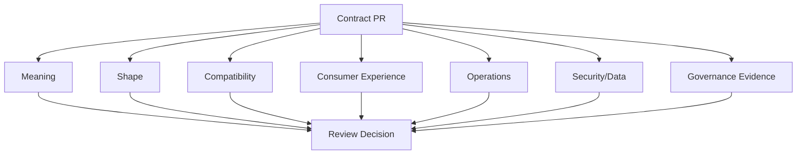

# Part 025 — Contract Review Playbook: How Senior Engineers Review API, Event, and Schema Changes

## Tujuan Pembelajaran

Contract review adalah salah satu tempat paling jelas terlihat perbedaan antara engineer biasa dan engineer top-tier.

Engineer biasa review contract dengan bertanya:

```text
Apakah schema valid?
Apakah endpoint jalan?
Apakah field-nya lengkap?
```

Senior engineer yang kuat bertanya:

```text
Apa promise yang sedang dibuat?
Siapa consumer-nya?
Apa invariants-nya?
Apa yang akan rusak dalam 6 bulan?
Apa semantic ambiguity-nya?
Apa compatibility surface-nya?
Apa migration path-nya?
Apa observability dan rollback-nya?
Apa evidence bahwa ini aman?
```

Part ini adalah playbook praktis untuk mereview:

1. OpenAPI/HTTP API contract;
2. AsyncAPI/event contract;
3. Avro/Protobuf/JSON Schema;
4. Kafka topic/key/retention contract;
5. SDK/generated client impact;
6. compatibility and lifecycle changes;
7. security/data classification;
8. governance metadata;
9. migration/deprecation;
10. operational readiness.

Setelah part ini, kamu harus mampu melakukan contract review seperti platform engineer senior: tajam, efisien, evidence-based, dan tidak sekadar nitpick naming.

---

## 1. Contract Review Mindset

Contract review bukan taste review. Bukan juga sekadar YAML review.

Contract review bertujuan memastikan:

1. contract menyatakan promise yang benar;
2. consumer bisa memakai contract tanpa meeting tambahan;
3. provider bisa mengimplementasikan dan mengoperasikan contract;
4. evolution path aman;
5. failure behavior jelas;
6. security/data governance aman;
7. generated tooling tidak menciptakan surprise;
8. observability dan support cukup;
9. breaking/dangerous changes dikendalikan;
10. keputusan terekam.



Review yang baik bukan mencari kesalahan sebanyak mungkin. Review yang baik menurunkan risiko terbesar dengan feedback paling actionable.

---

## 2. Review Layers

Gunakan layered review agar tidak tenggelam di detail.

| Layer | Pertanyaan utama |
|---|---|
| Intent | Masalah apa yang diselesaikan? |
| Semantics | Apa arti contract ini? |
| Surface | Apa public promise-nya? |
| Compatibility | Apa yang berubah dan siapa terdampak? |
| Consumer ergonomics | Apakah mudah dipakai dengan benar? |
| Failure | Bagaimana error/retry/DLQ/replay? |
| Security/data | Apakah data boleh mengalir ke sini? |
| Operational | Apakah topic/key/retention/SLO jelas? |
| Tooling | Apakah generator/validator/registry bisa mendukung? |
| Governance | Apakah owner, lifecycle, changelog, CDR ada? |

Review dari atas ke bawah. Jangan mulai dari indentation kalau semantics belum jelas.

---

## 3. Fast Triage: 10-Minute First Pass

Dalam 10 menit pertama, cari risiko besar:

1. apakah ini safe/dangerous/breaking/semantic breaking?
2. apakah owner jelas?
3. apakah lifecycle jelas?
4. apakah consumer diketahui?
5. apakah ada migration plan jika perlu?
6. apakah schema valid dan lint passing?
7. apakah ada examples?
8. apakah security/data classification jelas?
9. apakah generated code impact disebut?
10. apakah runtime operational behavior berubah?

Jika salah satu high-risk item kosong, review harus berhenti di situ dulu.

---

## 4. Contract PR Description Template

Minta author mengisi ini sebelum review:

```md
## What changed?

Describe contract change in human language.

## Why?

Business/platform reason.

## Artifact(s)

- OpenAPI:
- AsyncAPI:
- Schema:
- Topic:
- SDK:

## Compatibility classification

Safe / Dangerous / Breaking / Semantic breaking.

## Consumers impacted

Known consumers and risk.

## Migration plan

Required only for dangerous/breaking changes.

## Runtime/operational impact

Topic/key/retention/error/retry/auth/rate limit/etc.

## Security/data impact

Classification/PII/access/retention.

## Tests and evidence

- schema validation
- compatibility check
- generated client compile
- provider tests
- consumer tests
- replay tests
```

If PR lacks context, reviewers waste time reverse-engineering intent.

---

## 5. API Contract Review

### 5.1 Resource and Operation Semantics

Ask:

1. Is the resource noun meaningful?
2. Is HTTP method appropriate?
3. Is operation id stable?
4. Is request/response semantic clear?
5. Are state transitions explicit?
6. Is idempotency documented?
7. Are conditional updates needed?
8. Is pagination/filter/sort specified?
9. Are partial updates semantics clear?
10. Are examples realistic?

Bad endpoint:

```http
POST /customers/{id}/process
```

Ask:

- process what?
- is it command?
- what state changes?
- what errors?
- is it idempotent?

Better:

```http
POST /customers/{customerId}/kyc-verifications
```

or:

```http
POST /cases/{caseId}:approve
```

depending API style.

### 5.2 Request Body Review

Checklist:

- Are required fields truly required from day one?
- Are optional fields defaulted clearly?
- Are null and absent semantics clear?
- Are field names domain-specific?
- Are validation constraints too strict?
- Is money/time modeled safely?
- Is ID format future-proof?
- Is `additionalProperties` policy clear?
- Are examples valid?
- Is sensitive data minimized?

Danger sign:

```json
{
  "data": {},
  "status": "A",
  "type": "1"
}
```

Review comment:

```md
`data`, `status`, and `type` are ambiguous. Please split into named fields with documented meanings. If status uses coded values, define enum semantics or use descriptive values.
```

### 5.3 Response Body Review

Ask:

1. Are response fields stable public promise?
2. Are internal entity fields leaking?
3. Are computed fields clearly documented?
4. Are timestamps named by semantics?
5. Are status fields overloaded?
6. Are enums open or closed?
7. Is pagination wrapper consistent?
8. Are links/metadata needed?
9. Are deprecated fields marked?
10. Are examples complete?

### 5.4 HTTP Status and Error Review

Require:

1. success status correct;
2. validation error documented;
3. business rejection documented;
4. conflict/precondition documented;
5. authn/authz documented;
6. rate limit documented if applicable;
7. retryability visible;
8. error code stable;
9. correlation/request ID included;
10. no raw exception leakage.

Bad:

```yaml
responses:
  '500':
    description: Error
```

Better:

```yaml
'422':
  description: Customer is not eligible for requested action.
  content:
    application/problem+json:
      schema:
        $ref: '#/components/schemas/Problem'
```

### 5.5 API Compatibility Review

Ask:

1. Was a field removed?
2. Was a field renamed?
3. Was a type changed?
4. Was validation tightened?
5. Was a required request field added?
6. Was default behavior changed?
7. Was operationId changed?
8. Was response status changed?
9. Was error code/retryability changed?
10. Was auth scope changed?

If yes, require classification and plan.

---

## 6. Event Contract Review

### 6.1 Is It Really an Event?

Ask:

1. Is name past tense?
2. Did something already happen?
3. Who is authority?
4. Is producer allowed to state this fact?
5. Is this actually a command?
6. Is it notification or state transfer?
7. Is event consumer-specific?
8. Does event name tell the truth?
9. Can it be replayed?
10. What may consumer assume?

Bad:

```text
SendCustomerToCRM
```

Review:

```md
This is consumer-specific and command-like. Please model the domain fact (`CustomerRegistered`, `CustomerProfileUpdated`) and let CRM consume it, unless this is intentionally a targeted command channel.
```

### 6.2 Event Name Review

Good names:

```text
CaseApproved
PaymentCaptured
CustomerRegistered
KycVerificationRejected
PolicyRuleActivated
```

Bad names:

```text
CustomerUpdated
DataChanged
ProcessDone
EventMessage
```

Review questions:

- What changed exactly?
- Is field-level change domain-significant?
- Would different consumers react differently?
- Should there be separate events?

### 6.3 Event Payload Review

Checklist:

- Does payload include enough stable facts?
- Does it avoid dumping internal entity?
- Does it avoid consumer-specific fields?
- Is sensitive data minimized?
- Are previous/new values included if transition matters?
- Are reason codes stable?
- Are IDs stable?
- Are time fields explicit?
- Are enum values open/closed?
- Are null/default semantics clear?
- Are examples realistic?

### 6.4 Event Envelope Review

Require:

1. eventId;
2. eventType;
3. source;
4. occurredAt;
5. schemaRef;
6. correlationId where applicable;
7. causationId where applicable;
8. aggregateId/version for stateful events;
9. tenant/jurisdiction if relevant;
10. data classification.

Review comment example:

```md
This event lacks `aggregateVersion`. Because consumers build projections and ordering is per case, we need a monotonic case version so consumers can detect gaps, duplicates, and out-of-order delivery.
```

### 6.5 Kafka Review

Ask:

1. What topic?
2. What key?
3. Why this key?
4. What ordering guarantee?
5. What retention?
6. Is compaction enabled?
7. Are tombstones used?
8. Is replay supported?
9. Is DLQ/quarantine defined?
10. Are unknown event types tolerated?

Bad:

```yaml
topic: events
key: eventId
```

for case lifecycle events.

Comment:

```md
If consumers need per-case ordering, key should be caseId/aggregateId, not eventId. eventId distributes well but destroys per-case ordering.
```

---

## 7. Schema Review

### 7.1 Avro Review

Checklist:

- record name/namespace stable?
- added fields have defaults?
- nullable unions use `["null", T]` with default null?
- logical types used for timestamps/date/decimal?
- enum addition reviewed?
- aliases honest?
- namespace not tied to implementation?
- generated Java impact checked?
- registry compatibility mode appropriate?
- old fixtures tested?

Review comment:

```md
This adds `approvalChannel` without a default. New readers will fail when replaying old events. Please add a default or make the migration explicit with a new event type.
```

### 7.2 Protobuf Review

Checklist:

- no field number reuse?
- removed fields reserved?
- removed names reserved?
- zero enum value unspecified?
- enum additions reviewed?
- presence modeled correctly?
- oneof changes reviewed?
- package/java_package stable?
- generated Java source compatibility checked?
- service method changes reviewed?

Review comment:

```md
Field number 7 was previously `legacy_status`. Reusing it for `risk_band` is unsafe. Please reserve 7 and allocate a new field number.
```

### 7.3 JSON Schema Review

Checklist:

- `$schema` present?
- `$id` stable?
- `required` correct?
- null vs absent clear?
- `additionalProperties` explicit?
- `format` enforcement known?
- `oneOf` has discriminator?
- constraints not overly tight?
- defaults not assumed to mutate data?
- compatibility direction considered?

Review comment:

```md
`default: 50` does not mean the validator will insert pageSize. Please document provider defaulting behavior explicitly and test it.
```

---

## 8. Compatibility Review

### 8.1 Change Classification

Reviewer should force a classification:

```text
Safe / Dangerous / Breaking / Semantic breaking
```

Do not accept:

```text
minor change
```

without explanation.

### 8.2 Questions

1. Can old consumers read new data?
2. Can new consumers replay old data?
3. Does semantic meaning remain true?
4. Does generated Java compile for old consumer?
5. Does API SDK public surface change?
6. Did topic/key/retention change?
7. Did error retryability change?
8. Did security classification change?
9. Are examples updated?
10. Is migration observable?

### 8.3 Red Flags

- “No consumers depend on this” without inventory.
- “Internal API, so breaking is okay.”
- “Schema registry passed.”
- “Deprecated means we can remove.”
- “This field is optional but all consumers should use it.”
- “We changed status meaning but name stays same.”
- “Only key changed, payload same.”

---

## 9. Security and Data Review

Contract reviewers should not leave security only to security team.

Ask:

1. Does contract expose PII?
2. Is data classification correct?
3. Are existing consumers authorized?
4. Does DLQ preserve sensitive payload?
5. Is retention compliant?
6. Are error details safe?
7. Are IDs guessable?
8. Are tenant/jurisdiction boundaries explicit?
9. Are scopes/permissions documented?
10. Are examples using fake data?

### 9.1 Additive Field Can Be Unsafe

Adding field:

```json
{
  "nationalId": "..."
}
```

to a broad event is structurally additive but security-breaking.

Review comment:

```md
This additive field changes data classification and consumer authorization requirements. Please either remove it, create a restricted event/topic, or complete data governance review.
```

---

## 10. Consumer Ergonomics Review

A contract can be technically correct but hard to use.

Ask:

1. Is common path easy?
2. Are errors machine-readable?
3. Are examples realistic?
4. Is pagination safe?
5. Is idempotency supported?
6. Are enums/unknown values handled?
7. Is SDK/generated client stable?
8. Are nullable fields confusing?
9. Are field names domain-friendly?
10. Is migration guide actionable?

Bad:

```json
{
  "result": "N",
  "reason": "01"
}
```

Better:

```json
{
  "eligible": false,
  "reasonCode": "KYC_NOT_VERIFIED"
}
```

---

## 11. Operational Readiness Review

For APIs:

- rate limit?
- timeout?
- cache semantics?
- idempotency?
- retryability?
- correlation ID?
- error SLO?
- graceful deprecation?

For events:

- topic/key?
- ordering?
- retention?
- replay?
- DLQ?
- consumer lag?
- poison messages?
- duplicate delivery?
- schema registry availability?
- outbox/transactional publishing?

Review comment:

```md
The event is used by projection consumers, but retention is not documented. Please define replay window and whether an archive/backfill exists beyond Kafka retention.
```

---

## 12. Documentation and Examples Review

Require examples for:

1. happy path;
2. validation error;
3. business rejection;
4. conflict/precondition;
5. deprecated field if present;
6. event old/new version;
7. DLQ message;
8. replay marker if used;
9. unknown enum handling if relevant.

Examples must validate against schema.

Bad example:

```json
{
  "customerId": "string",
  "status": "string"
}
```

Good:

```json
{
  "customerId": "cus_01J2T7Q7BSM8PV8K4J6JYQH7TR",
  "lifecycleStatus": "ACTIVE"
}
```

---

## 13. Review Comment Style

Good review comment is:

1. specific;
2. risk-based;
3. explains why;
4. suggests fix;
5. separates blocker vs suggestion.

Bad:

```text
Bad naming.
```

Good:

```md
Blocker: `CustomerUpdated` is too generic for a stable integration event. Consumers cannot know whether this represents lifecycle, profile, KYC, or access change. Please either split into domain-specific events or document this as notification-only with `resourceUrl` and no projection guarantees.
```

### 13.1 Prefix Comments

Use:

- `Blocker:`
- `Risk:`
- `Question:`
- `Suggestion:`
- `Nit:`

This improves review efficiency.

---

## 14. Review Decision

Possible outcomes:

| Decision | Meaning |
|---|---|
| Approve | safe enough, evidence sufficient |
| Approve with conditions | must complete listed actions before release |
| Request changes | risks must be fixed |
| Escalate | requires architecture/security/domain review |
| Reject | contract direction is fundamentally wrong |

Do not approve dangerous change because “team needs to ship” without recording exception.

---

## 15. Contract Review Checklist: API

```yaml
apiReview:
  semantics:
    - resource meaningful
    - method appropriate
    - operationId stable
    - idempotency documented
  request:
    - required fields justified
    - null/absent clear
    - validation constraints safe
    - examples valid
  response:
    - no entity leakage
    - timestamps semantic
    - enums open/closed documented
    - pagination/filter/sort clear
  errors:
    - problem schema
    - stable error codes
    - retryability
    - correlation id
  compatibility:
    - diff classified
    - generated client impact checked
    - changelog updated
  security:
    - scopes
    - classification
    - sensitive fields
  governance:
    - owner
    - lifecycle
    - CDR if dangerous
```

---

## 16. Contract Review Checklist: Event

```yaml
eventReview:
  classification:
    - event_not_command
    - fact_past_tense
    - authority_clear
  envelope:
    - eventId
    - eventType
    - source
    - occurredAt
    - schemaRef
    - correlationId
    - aggregateId
    - aggregateVersion
  payload:
    - stable_facts
    - no_entity_dump
    - enough_for_consumers
    - sensitive_data_minimized
  kafka:
    - topic
    - key
    - ordering
    - retention
    - replay
    - dlq
  compatibility:
    - schema_registry
    - semantic_review
    - old_fixtures
    - generated_code
  governance:
    - owner
    - lifecycle
    - examples
    - data_classification
```

---

## 17. Contract Review Checklist: Schema

```yaml
schemaReview:
  identity:
    - name_stable
    - namespace_package_stable
    - schema_id_or_subject
  structure:
    - required_optional_correct
    - defaults_correct
    - nullability_clear
    - constraints_future_safe
  evolution:
    - compatibility_mode
    - old_versions_tested
    - aliases_or_reserved_fields
    - enum_strategy
  java:
    - generated_code_compile
    - package_stability
    - public_api_impact
  governance:
    - owner
    - lifecycle
    - changelog
    - examples
```

---

## 18. Contract Review Anti-Patterns

### 18.1 YAML Formatting Review Only

Misses semantic breaks.

### 18.2 Rubber Stamp

All PRs approved because author is senior.

### 18.3 Review Board for Every Safe Change

Creates bottleneck and bypass culture.

### 18.4 Tool Output Blindness

Reviewer trusts schema compatibility pass without reading meaning.

### 18.5 Consumer-Blind Review

No consumer impact considered.

### 18.6 No Migration Demand

Breaking change approved with no migration guide.

### 18.7 Security Late Review

Sensitive field added, security only notices after production.

### 18.8 Review Without Examples

Contract accepted but consumers cannot learn.

### 18.9 No Decision Records

Rationale lost.

### 18.10 Nitpick Over Risk

Reviewer blocks style but misses key/retention change.

---

## 19. Practice Lab

### Lab 1 — Review Bad API

Review:

```http
POST /customer/process
```

Body:

```json
{
  "id": "123",
  "status": "A",
  "data": {}
}
```

Write review comments.

### Lab 2 — Review Bad Event

Review event:

```json
{
  "eventType": "CustomerUpdated",
  "customerId": "cus_123",
  "status": "A",
  "timestamp": "2026-06-29T05:00:00Z"
}
```

Identify issues and propose replacement.

### Lab 3 — Review Avro Change

Old Avro schema has:

```json
{ "name": "caseId", "type": "string" }
```

New schema adds:

```json
{ "name": "approvalChannel", "type": "string" }
```

No default. Write review.

### Lab 4 — Review Protobuf Change

Old:

```proto
string email_address = 4;
```

New:

```proto
string national_id = 4;
```

Write review.

### Lab 5 — Review Kafka Change

Topic key changes from `caseId` to `eventId`. Payload unchanged. Classify and write comment.

### Lab 6 — Review Security Change

Event adds optional `nationalId` field to broad `customer-events`. Write review.

---

## 20. Senior Engineer Heuristics

1. **Review meaning before syntax.**
2. **Every contract change creates or changes a promise.**
3. **Names are compatibility surface.**
4. **Unknown consumers require conservative design.**
5. **Schema validity is not enough.**
6. **Event authority must be clear.**
7. **Kafka key is not implementation detail.**
8. **Generated Java impact matters.**
9. **Examples reveal ambiguity faster than descriptions.**
10. **Security review starts at contract design, not after implementation.**
11. **Deprecation requires migration evidence.**
12. **A good review comment explains risk and fix.**
13. **Block semantic breaks, not harmless formatting.**
14. **Risk-based review keeps governance fast and meaningful.**
15. **A contract that needs a meeting to understand is not ready.**

---

## 21. Summary

Contract review is an engineering practice for protecting consumers, providers, and long-term system evolution. Strong reviewers look beyond schema syntax into semantics, compatibility, consumer ergonomics, operational behavior, security, lifecycle, and evidence.

Main takeaways:

1. review intent and semantics first;
2. classify changes explicitly;
3. require examples, tests, lifecycle, and owner;
4. review API errors and event failures as first-class contract;
5. review Kafka topic/key/retention as contract surface;
6. review generated Java impact;
7. review data classification and security implications;
8. demand migration plan for dangerous/breaking changes;
9. write actionable review comments;
10. use risk-based approval, not rubber stamp or bureaucracy.

Part berikutnya membahas contract governance automation: linting, diffing, policy-as-code, CI gates, registry hooks, catalog sync, generated code checks, and automated risk classification.
