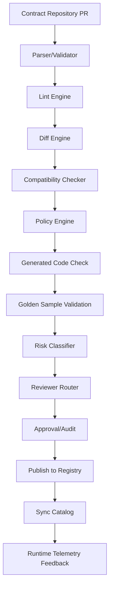
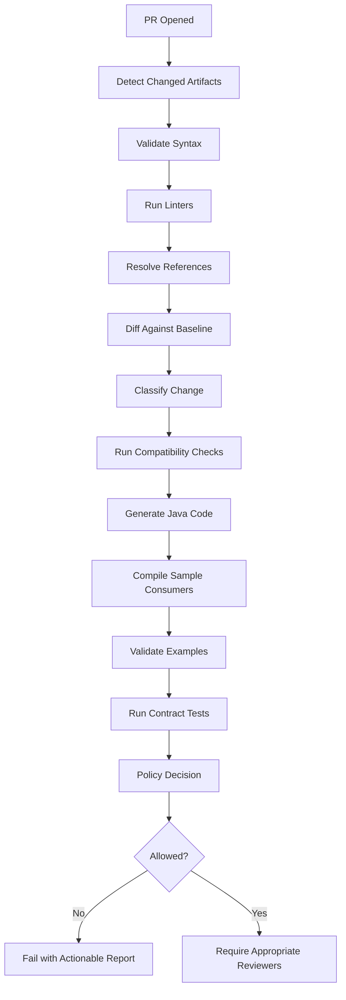
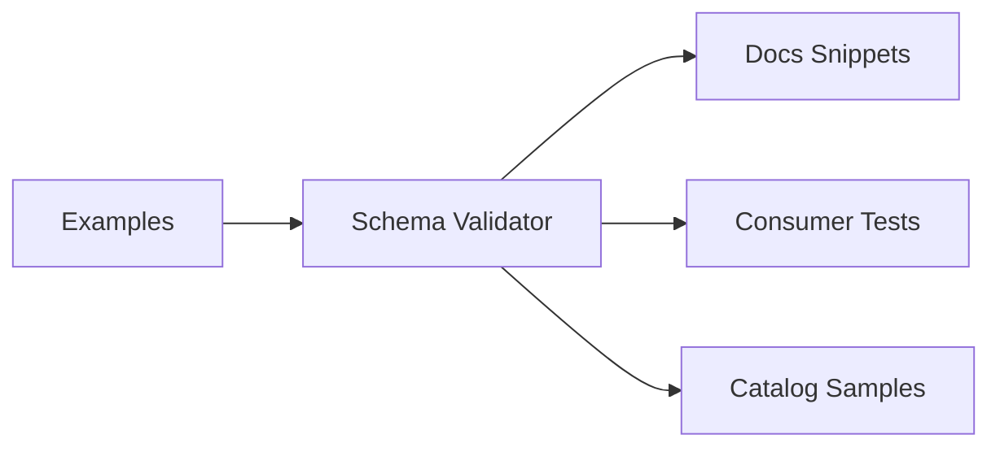
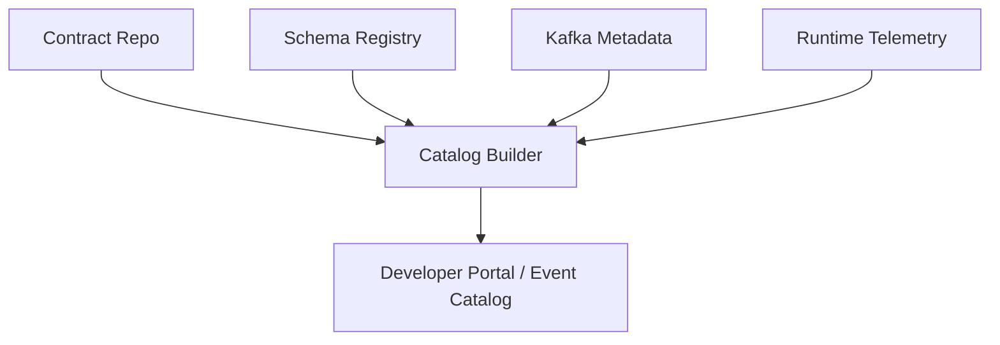

# Part 026 — Contract Governance Automation: Linting, Diffing, Policy-as-Code, CI Gates, and Registry Hooks

## Tujuan Pembelajaran

Governance manual tidak scale. Jika setiap contract change harus dibaca dari nol oleh senior architect, organisasi akan lambat atau governance akan di-bypass.

Contract governance yang matang menggabungkan:

1. automated validation;
2. linting;
3. compatibility diff;
4. policy-as-code;
5. generated code compile;
6. schema registry gates;
7. AsyncAPI/OpenAPI validation;
8. Kafka contract diff;
9. metadata enforcement;
10. lifecycle checks;
11. risk classification;
12. approval routing;
13. catalog synchronization;
14. runtime telemetry feedback.

Tujuannya bukan menghilangkan review manusia. Tujuannya:

> Automate the obvious, highlight the dangerous, and preserve human attention for semantic decisions.

Setelah part ini, kamu harus mampu:

- mendesain CI pipeline untuk contract governance;
- membuat lint rules untuk OpenAPI, AsyncAPI, JSON Schema, Avro, Protobuf;
- menjalankan compatibility diff;
- menerapkan policy-as-code;
- menghubungkan contract repository dengan schema registry;
- melakukan generated Java code compatibility checks;
- mengotomasi risk classification dan reviewer routing;
- menghindari governance automation anti-pattern seperti noisy gates dan false confidence.

---

## 1. Automation Philosophy

Good automation should:

1. be fast enough for PR feedback;
2. be deterministic;
3. produce actionable errors;
4. catch repeatable mistakes;
5. enforce metadata/lifecycle;
6. route high-risk changes to humans;
7. preserve audit evidence;
8. reduce review fatigue;
9. avoid blocking harmless changes unnecessarily;
10. evolve with policy.

Bad automation:

1. noisy;
2. slow;
3. unclear;
4. easy to bypass;
5. catches style but misses risk;
6. breaks randomly;
7. requires manual interpretation;
8. treats every warning as blocker.

---

## 2. Governance Automation Architecture



Each step should produce machine-readable output.

---

## 3. Contract Repository as Source of Change

Recommended repository:

```text
contracts/
├── openapi/
├── asyncapi/
├── schemas/
│   ├── avro/
│   ├── protobuf/
│   └── json-schema/
├── kafka/
│   └── topics.yaml
├── lifecycle/
├── policies/
├── examples/
├── decisions/
└── build/
```

Automation reads:

1. contract artifacts;
2. previous released version;
3. policy files;
4. registry state;
5. catalog metadata;
6. examples;
7. decision records.

Avoid contract changes only in service code if enterprise governance needs cross-team visibility.

---

## 4. CI Pipeline Overview



Baseline should be last released artifact, not arbitrary main branch if releases are separate.

---

## 5. Artifact Detection

Automation should detect changed artifacts.

Example output:

```yaml
changedArtifacts:
  openapi:
    - customer-api/openapi.yaml
  asyncapi:
    - case-events/asyncapi.yaml
  avro:
    - schemas/avro/case/CaseApproved.avsc
  protobuf:
    - schemas/protobuf/customer/customer_events.proto
  jsonSchema:
    - schemas/json/customer/CustomerActivated.schema.json
  kafka:
    - kafka/topics.yaml
  lifecycle:
    - lifecycle/deprecations.yaml
```

Why?

1. run targeted checks;
2. classify risk;
3. choose reviewers;
4. avoid slow full rebuild;
5. generate focused report.

---

## 6. Syntax and Reference Validation

### 6.1 OpenAPI

Validate:

1. document parses;
2. version supported;
3. `$ref` resolves;
4. schemas valid;
5. operationId unique;
6. examples validate where possible.

### 6.2 AsyncAPI

Validate:

1. document parses;
2. channels/operations/messages linked;
3. refs resolve;
4. bindings valid for supported version;
5. examples validate.

### 6.3 Avro

Validate:

1. `.avsc` parse;
2. named types resolve;
3. defaults match type;
4. union defaults valid;
5. logical types valid.

### 6.4 Protobuf

Validate:

1. `.proto` compiles;
2. imports resolve;
3. field numbers unique;
4. reserved range syntax valid;
5. package/options valid.

### 6.5 JSON Schema

Validate:

1. `$schema` supported;
2. `$id` present;
3. refs resolve;
4. schema itself valid under meta-schema.

---

## 7. Linting

Lint rules enforce organization style and safety.

### 7.1 OpenAPI Lint Rules

Examples:

```yaml
openapiRules:
  operationIdRequired: error
  operationIdStable: warning
  errorResponseRequired: error
  problemJsonRequired: error
  noInlineResponseSchemas: warning
  requestExamplesRequired: warning
  paginationModelRequiredForList: error
  noEntityNames:
    - Entity
    - Jpa
  securityRequiredForNonPublic: error
```

### 7.2 AsyncAPI Lint Rules

```yaml
asyncapiRules:
  messageOwnerRequired: error
  channelOwnerRequired: error
  messageExamplesRequired: error
  kafkaKeyRequired: error
  orderingGuaranteeRequired: error
  dataClassificationRequired: error
  eventTypePastTense: warning
  noGenericEventNames:
    - DataChanged
    - Event
    - Message
```

### 7.3 Avro Lint Rules

```yaml
avroRules:
  namespaceRequired: error
  docRequiredForStable: warning
  nullableUnionNullFirst: error
  addedFieldRequiresDefault: error
  decimalForMoney: error
  timestampLogicalTypeRequired: warning
  enumDefaultRequiredForOpen: warning
```

### 7.4 Protobuf Lint Rules

```yaml
protobufRules:
  packageRequired: error
  javaPackageRequired: error
  javaMultipleFilesRequired: warning
  zeroEnumUnspecified: error
  removedFieldMustBeReserved: error
  noFieldNumberReuse: error
  noGenericMapData: warning
```

### 7.5 JSON Schema Lint Rules

```yaml
jsonSchemaRules:
  schemaDialectRequired: error
  idRequired: error
  additionalPropertiesExplicit: error
  examplesRequiredForStable: warning
  noMoneyAsNumber: error
  oneOfRequiresDiscriminator: warning
```

---

## 8. Diff Engine

Diff engine compares new artifact to baseline.

### 8.1 OpenAPI Diff

Detect:

1. path removed;
2. operation removed;
3. request parameter added/removed;
4. request required field added;
5. response field removed;
6. type changed;
7. status code removed;
8. error schema changed;
9. security requirement changed;
10. operationId changed.

### 8.2 AsyncAPI Diff

Detect:

1. channel removed/renamed;
2. message removed;
3. operation action changed;
4. message schema changed;
5. Kafka key changed;
6. binding changed;
7. lifecycle changed;
8. replay/retention changed.

### 8.3 Schema Diff

Detect format-specific change.

Avro:

- added field with/without default;
- removed field;
- type change;
- enum symbol change;
- namespace/name change;
- logical type change.

Protobuf:

- tag reuse;
- removed field not reserved;
- type change;
- enum number reuse;
- oneof change;
- service method change.

JSON Schema:

- required change;
- type change;
- constraint tightening/relaxing;
- enum change;
- additionalProperties change;
- composition change.

### 8.4 Kafka Diff

Detect:

1. topic added/removed;
2. key expression changed;
3. partition count changed;
4. retention changed;
5. cleanup policy changed;
6. DLQ changed;
7. classification changed;
8. producer authority changed.

---

## 9. Change Classification Engine

Diff results should classify risk.

Example output:

```yaml
classification:
  artifact: com.acme.case.events.CaseApproved
  changes:
    - path: payload.reasonCode
      type: field_added
      compatibility: safe
      reason: optional field with default UNKNOWN
    - path: kafka.key
      type: key_changed
      compatibility: breaking
      reason: changes per-aggregate ordering contract
  overall: breaking
  requiredActions:
    - compatibilityDecisionRecord
    - architectureReview
    - migrationPlan
```

Classification is not perfect. It should be conservative.

---

## 10. Policy-as-Code

Policy-as-code turns governance rules into executable rules.

Example policy:

```yaml
policies:
  stableEventRequires:
    - ownerTeam
    - lifecycle
    - dataClassification
    - compatibilityMode
    - goldenExample
    - asyncApiMessage
  breakingChangeRequires:
    - decisionRecord
    - migrationGuide
    - consumerImpactAnalysis
    - rollbackPlan
  kafkaKeyChange:
    allowed: false
    exceptionRequires:
      - architectureReview
      - topicMigrationPlan
  compatibilityNone:
    allowed: false
    exceptionRequires:
      - expiryDate
      - approval
```

Policy engine output:

```yaml
policyDecision:
  allowed: false
  violations:
    - code: KAFKA_KEY_CHANGE_REQUIRES_CDR
      message: "Kafka key changed from caseId to eventId. Add CDR and migration plan."
    - code: DEPRECATED_REQUIRES_REPLACEMENT
      message: "Deprecated artifact lacks replacement or reason."
```

---

## 11. Approval Routing

Automation should route reviewers based on risk.

Example:

```yaml
reviewRouting:
  low:
    reviewers:
      - ownerTeam
  medium:
    reviewers:
      - ownerTeam
      - contract-governance
  high:
    reviewers:
      - ownerTeam
      - contract-governance
      - platform-architecture
  dataClassificationChange:
    reviewers:
      - security-data-governance
  publicApiChange:
    reviewers:
      - developer-platform
      - partner-integration-owner
  kafkaKeyChange:
    reviewers:
      - event-platform
      - affected-consumers
```

Do not require architecture review for every typo. Route proportionally.

---

## 12. Generated Code Checks

### 12.1 OpenAPI

Generate Java client/server interface.

Checks:

1. generated code compiles;
2. operationId stability;
3. public API diff;
4. sample consumer compiles;
5. SDK wrapper tests pass.

### 12.2 Avro

Generate SpecificRecord.

Checks:

1. Java classes compile;
2. namespace/package stable;
3. old fixture deserializes;
4. generated class public API diff if exposed.

### 12.3 Protobuf

Compile `.proto`.

Checks:

1. generated Java compiles;
2. descriptor breaking check;
3. sample consumer compiles;
4. reserved fields enforced.

### 12.4 Governance Rule

Generated compatibility check is required if generated artifacts are consumed outside owning service.

---

## 13. Golden Example Automation

Examples should be validated automatically.

Pipeline:



Rules:

1. every stable message/operation has example;
2. examples validate;
3. examples use realistic fake IDs;
4. examples do not contain secrets/PII;
5. docs embed examples from source file;
6. old examples retained for compatibility.

Example violation:

```yaml
code: EXAMPLE_SCHEMA_MISMATCH
file: examples/case-approved-v1.json
message: payload.caseVersion expected integer but got string
```

---

## 14. Schema Registry Hooks

Registry integration points:

1. pre-register validation;
2. compatibility check;
3. artifact metadata validation;
4. access control check;
5. post-register catalog sync;
6. audit event emission;
7. deprecation status update.

Recommended production flow:

```text
CI registers approved schemas.
Runtime producers look up existing schemas.
Auto-registration disabled or restricted.
```

### 14.1 Registry Pre-Commit

Before merge:

```text
check compatibility against registry baseline
```

### 14.2 Registry Publish

After merge/release:

```text
register artifact version with metadata
```

### 14.3 Registry Drift Detection

Scheduled job:

```text
compare registry artifacts with contract repository and catalog
```

Report:

1. registry artifact not in repo;
2. repo artifact not in registry;
3. metadata mismatch;
4. compatibility rule mismatch;
5. lifecycle mismatch.

---

## 15. Catalog Sync

Catalog should be generated/synced from contracts.

Inputs:

1. OpenAPI;
2. AsyncAPI;
3. schemas;
4. Kafka topic metadata;
5. lifecycle metadata;
6. ownership;
7. examples;
8. consumer registry;
9. runtime telemetry.

Automation:



Catalog sync checks:

1. owner exists;
2. lifecycle visible;
3. schema links valid;
4. consumers linked;
5. deprecated banners visible;
6. examples render.

---

## 16. Runtime Feedback Loop

Governance automation should use runtime evidence.

Runtime signals:

1. deprecated endpoint traffic;
2. deprecated event consumption;
3. schema version usage;
4. unknown event type errors;
5. DLQ by event type;
6. consumer lag;
7. SDK version adoption;
8. field usage if instrumented;
9. producer schema ID usage;
10. topic access logs.

Use cases:

1. block retirement if traffic exists;
2. notify consumers of deprecated usage;
3. detect unknown consumers;
4. prioritize migration;
5. identify schema versions still active.

---

## 17. Automated Risk Report

Every contract PR should get a report.

Example:

```md
# Contract Governance Report

## Overall Risk

High

## Changed Artifacts

- `schemas/avro/case/CaseApproved.avsc`
- `asyncapi/case-events.yaml`

## Detected Changes

- Added enum symbol `MANUAL_REVIEW` to `ApprovalDecision`
- Added optional field `payload.reviewedBy`
- No Kafka topic/key change

## Compatibility

- Registry: PASS
- Generated Java: PASS
- Golden samples: PASS
- Semantic risk: Dangerous enum addition

## Required Actions

- Add Compatibility Decision Record
- Add unknown enum consumer test
- Notify registered consumers:
  - case-projection-service
  - approval-dashboard
```

This helps reviewers focus.

---

## 18. Governance Severity Levels

| Severity | Meaning | Example |
|---|---|---|
| Info | no action | description changed |
| Warning | review recommended | optional field added |
| Dangerous | approval required | enum value added |
| Error | must fix or exception | schema invalid |
| Blocker | cannot merge | Protobuf tag reuse |

Do not make all warnings blockers. That creates bypass culture.

---

## 19. Developer Experience

Governance automation should be developer-friendly.

### 19.1 Local Commands

Provide:

```bash
./gradlew contractValidate
./gradlew contractDiff
./gradlew contractGenerate
./gradlew contractTest
```

or:

```bash
make contract-check
```

### 19.2 Actionable Messages

Bad:

```text
Policy violation: rule 73.
```

Good:

```text
Breaking change: response property `customer.status` was removed.
Add a migration plan and CDR, or reintroduce the field as deprecated.
```

### 19.3 Fast Feedback

Split:

1. quick validation/lint;
2. deeper compatibility/generation;
3. full integration tests.

---

## 20. Policy Testing

Policy-as-code must be tested.

Example test cases:

```yaml
tests:
  - name: added optional field is safe
    inputDiff: fixtures/diff/add-optional-field.yaml
    expectedRisk: low

  - name: kafka key change is breaking
    inputDiff: fixtures/diff/kafka-key-change.yaml
    expectedRisk: high
    expectedViolation: KAFKA_KEY_CHANGE_REQUIRES_CDR

  - name: protobuf tag reuse is blocker
    inputDiff: fixtures/diff/protobuf-tag-reuse.yaml
    expectedViolation: PROTOBUF_TAG_REUSE
```

If policy rules are untested, governance will regress.

---

## 21. Implementation Blueprint in Gradle

Conceptual task structure:

```kotlin
tasks.register("contractValidate") {
    dependsOn("validateOpenApi")
    dependsOn("validateAsyncApi")
    dependsOn("validateAvro")
    dependsOn("validateProtobuf")
    dependsOn("validateJsonSchema")
}

tasks.register("contractDiff") {
    dependsOn("diffOpenApi")
    dependsOn("diffAsyncApi")
    dependsOn("diffSchemas")
    dependsOn("diffKafkaTopics")
}

tasks.register("contractGenerate") {
    dependsOn("generateOpenApiJava")
    dependsOn("generateAvroJava")
    dependsOn("generateProtobufJava")
}

tasks.register("contractCheck") {
    dependsOn("contractValidate")
    dependsOn("contractDiff")
    dependsOn("contractGenerate")
    dependsOn("validateExamples")
    dependsOn("policyCheck")
}
```

Actual plugins/tools vary. The architecture matters.

---

## 22. Implementation Blueprint in CI

Example stages:

```yaml
stages:
  - detect
  - validate
  - lint
  - diff
  - compatibility
  - generate
  - test
  - policy
  - report
  - publish
```

Job output should upload:

1. validation report;
2. diff report;
3. generated code compile result;
4. compatibility result;
5. risk report;
6. policy decision;
7. artifacts preview.

---

## 23. Automation for Deprecation

Scheduled job:

```yaml
deprecationMonitor:
  checks:
    - deprecatedArtifactsWithTraffic
    - deprecatedArtifactsPastSunset
    - deprecatedArtifactsWithoutReplacement
    - newConsumersUsingDeprecatedArtifacts
    - migrationStatusStale
```

Actions:

1. notify owner;
2. notify consumer;
3. create issue;
4. block new onboarding;
5. escalate if past sunset;
6. update dashboard.

---

## 24. Automation for Lifecycle

Rules:

1. draft cannot publish to prod registry;
2. experimental requires expiry;
3. stable requires compatibility mode;
4. deprecated requires migration guide;
5. retired cannot be produced;
6. archived is read-only;
7. owner missing blocks merge.

Policy violation example:

```yaml
code: EXPERIMENTAL_REQUIRES_EXPIRY
artifact: com.acme.fraud.events.FraudSignalObserved
message: Experimental artifacts must define expiresAt.
```

---

## 25. Automation for Security/Data

Rules:

1. PII fields require classification;
2. restricted schemas require access policy;
3. broad topic cannot add restricted field without review;
4. DLQ for restricted topic must have restricted access;
5. examples must not contain real-looking secrets;
6. data retention class required for regulated domain.

Sensitive field detection can be heuristic:

```yaml
sensitiveFieldPatterns:
  - nationalId
  - ssn
  - passport
  - cardNumber
  - biometric
```

But human review still needed.

---

## 26. Automated Consumer Impact

Inputs:

1. consumer registry;
2. runtime access logs;
3. schema version usage;
4. topic group IDs;
5. SDK download/adoption;
6. API gateway logs;
7. catalog subscriptions.

Impact report:

```yaml
consumerImpact:
  artifact: com.acme.customer.events.CustomerActivated
  knownConsumers:
    - onboarding-service
    - crm-sync
    - case-management-service
  unknownConsumersDetected: 2
  tier1Consumers:
    - case-management-service
  deprecatedUsageLast7Days: 123481
  riskBand: high
```

This makes retirement decisions evidence-based.

---

## 27. Automated Semantic Hints

Full semantic review cannot be automated, but hints can help.

Flag when:

1. description/doc changed significantly;
2. enum value added;
3. status field changed;
4. event name contains generic words;
5. field name includes `status`, `type`, `data`;
6. timestamp field renamed;
7. key changed;
8. lifecycle metadata changed;
9. source/authority changed;
10. data classification changed.

Example:

```yaml
semanticHints:
  - code: STATUS_FIELD_CHANGED
    message: "Field `payload.status` changed. Confirm semantic meaning remains compatible."
  - code: EVENT_DESCRIPTION_CHANGED
    message: "Event description changed by 68%. Review semantic compatibility."
```

---

## 28. Drift Detection

Scheduled drift checks:

1. OpenAPI generated from runtime differs from contract;
2. AsyncAPI differs from broker metadata;
3. registry schema missing from repo;
4. repo schema missing from registry;
5. catalog lifecycle differs from registry metadata;
6. Kafka topic config differs from contract;
7. runtime producer emits unregistered schema;
8. deprecated event still produced after retirement.

Drift report:

```yaml
drift:
  - type: kafka_retention_mismatch
    topic: case-events
    contract: P90D
    runtime: P30D
    severity: high
  - type: registry_artifact_without_owner
    artifact: com.acme.legacy.LegacyEvent
    severity: medium
```

Drift detection turns governance into continuous control.

---

## 29. Governance Automation Anti-Patterns

### 29.1 Noisy Warnings

Too many irrelevant warnings cause teams to ignore all output.

### 29.2 Slow Required Jobs

Contract check takes 45 minutes for a one-line doc change.

### 29.3 Unclear Failures

Developers cannot fix.

### 29.4 Style Over Risk

Blocks indentation but misses breaking field removal.

### 29.5 Manual Override Without Audit

Bypass becomes default path.

### 29.6 Policy Not Versioned

Rules change unpredictably.

### 29.7 CI-Only, No Runtime Drift

Runtime config diverges after merge.

### 29.8 Registry Auto-Register Bypasses CI

Prod schemas appear without review.

### 29.9 No Local Tooling

Developers learn issues only in CI.

### 29.10 Automation Treated as Complete Governance

Semantic review still needed.

---

## 30. Governance Automation Maturity Model

| Level | Behavior |
|---|---|
| 0 | manual review only, no consistent checks |
| 1 | schema syntax validation |
| 2 | lint + compatibility checks |
| 3 | diff classification + generated code compile |
| 4 | policy-as-code + approval routing + registry gates |
| 5 | catalog sync + runtime drift detection + consumer impact automation |
| 6 | risk analytics + lifecycle automation + telemetry-driven retirement |

Aim for Level 4 minimum for serious platform. Level 5+ for enterprise-critical API/event platforms.

---

## 31. Practice Lab

### Lab 1 — Design CI Pipeline

Design CI pipeline for contract repo containing:

1. OpenAPI;
2. AsyncAPI;
3. Avro;
4. Protobuf;
5. JSON Schema;
6. Kafka topics.

Include stages and failure conditions.

### Lab 2 — Write Lint Rules

Create 10 lint rules for event contracts. Include severity.

### Lab 3 — Policy-as-Code

Write policy that:

1. blocks Protobuf tag reuse;
2. blocks Avro added field without default;
3. requires Kafka key CDR if changed;
4. requires deprecation guide;
5. requires owner/lifecycle/classification.

### Lab 4 — Risk Report

Given diff:

```text
Added enum value MANUAL_REVIEW.
Added optional field reviewedBy.
No key change.
```

Produce automated risk report.

### Lab 5 — Drift Detection

Runtime Kafka topic `case-events` retention is 30 days, contract says 90 days. Design drift alert and remediation workflow.

### Lab 6 — Developer Experience

Design local command and error message for missing `additionalProperties` in JSON Schema.

---

## 32. Senior Engineer Heuristics

1. **Automate repeatable checks; preserve human attention for semantics.**
2. **Governance automation must be fast, actionable, and risk-based.**
3. **Diff classification is more useful than raw diff.**
4. **Policy-as-code needs tests.**
5. **Generated Java compile is part of contract governance.**
6. **Kafka key/retention changes must be diffed like schema changes.**
7. **Registry gates should be CI-controlled for production.**
8. **Catalog sync prevents tribal knowledge.**
9. **Runtime drift detection closes the loop.**
10. **Warnings must be meaningful or they become noise.**
11. **Manual overrides need audit and expiry.**
12. **Local developer tooling reduces CI frustration.**
13. **Examples should be validated and reused in docs/tests.**
14. **Security/data rules should run early, not after release.**
15. **Automation that only validates syntax creates false confidence.**

---

## 33. Summary

Contract governance automation turns review principles into repeatable engineering controls. It validates artifacts, lints style and safety rules, diffs against baselines, classifies risk, checks compatibility, compiles generated Java code, validates examples, enforces policy-as-code, routes approvals, publishes to registry, syncs catalog, and detects runtime drift.

Main takeaways:

1. automate syntax, lint, diff, compatibility, generated code, examples, lifecycle, and policy;
2. keep semantic decisions human but highlight risks automatically;
3. make CI reports actionable;
4. include Kafka operational metadata in diff/governance;
5. use schema registry through controlled CI/CD workflows;
6. sync registry/catalog/docs from source contracts;
7. use runtime telemetry for deprecation and drift;
8. test governance policies themselves;
9. avoid noisy or slow gates;
10. governance automation should accelerate safe change and block unsafe surprise.

Part berikutnya membahas contract diff engineering: how to design diff algorithms, classify changes, handle schema formats, detect semantic hints, calculate risk scores, and produce reviewer-friendly reports.
