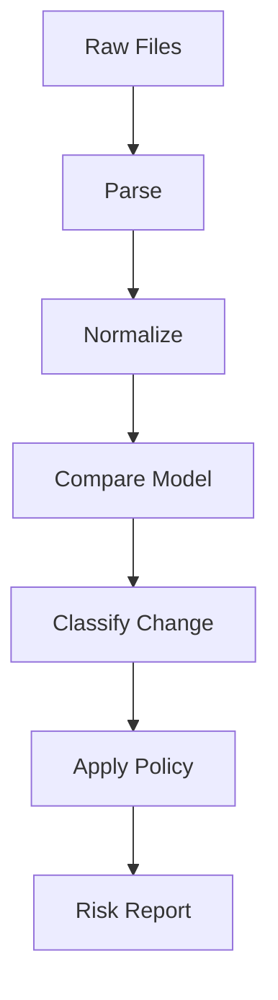
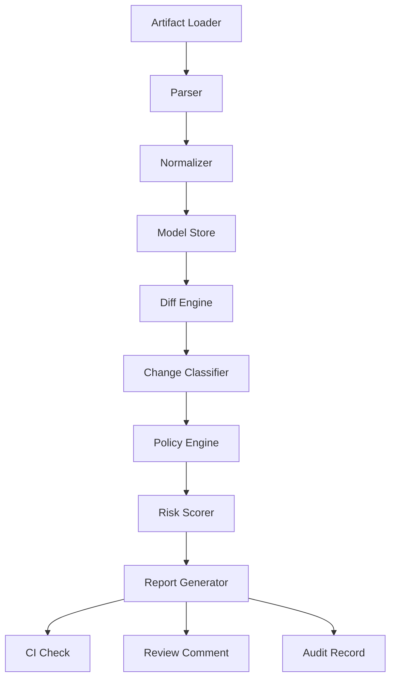

# Part 027 — Contract Diff Engineering: Detecting, Classifying, and Explaining Contract Changes

## Tujuan Pembelajaran

Diff adalah jantung contract governance automation.

Tanpa diff yang baik, pipeline hanya bisa berkata:

```text
schema changed
```

Dengan diff yang baik, pipeline bisa berkata:

```text
Breaking: POST /customers now requires request field `birthDate`.
Dangerous: enum `CustomerLifecycleStatus` added `PENDING_REVIEW`.
Operational breaking: Kafka key changed from `payload.caseId` to `metadata.eventId`.
Semantic review required: event description changed and event timing metadata changed.
```

Part ini membahas contract diff engineering: bagaimana membangun mesin yang bukan hanya membandingkan text, tetapi memahami contract structure, compatibility direction, risk class, and reviewer needs.

Setelah part ini, kamu harus mampu:

1. membedakan text diff, AST diff, semantic diff, and policy diff;
2. membuat normalized model untuk OpenAPI, AsyncAPI, Avro, Protobuf, JSON Schema, Kafka topic contracts;
3. mengklasifikasikan diff menjadi safe/dangerous/breaking/semantic-review-required;
4. menghitung risk score berbasis consumer impact;
5. menghasilkan report yang actionable untuk reviewer;
6. menghubungkan diff engine dengan CI, schema registry, policy-as-code, catalog, and lifecycle;
7. memahami batas automation dan kapan human semantic review wajib;
8. menghindari false positives/false negatives dalam contract diff.

---

## 1. Why Text Diff Is Not Enough

Text diff:

```diff
- status:
-   type: string
+ lifecycleStatus:
+   type: string
```

Text diff tidak tahu:

1. ini field rename atau remove+add?
2. apakah consumer masih butuh `status`?
3. apakah alias/default tersedia?
4. apakah generated Java method berubah?
5. apakah schema registry menganggap compatible?
6. apakah semantic meaning sama?
7. apakah deprecation path ada?

Contract diff harus memahami artifact model.



---

## 2. Diff Levels

| Diff level | Example | Useful for |
|---|---|---|
| Text diff | line changed | code review context |
| Structural diff | field removed | schema compatibility |
| Semantic hint diff | description/meaning changed | human review |
| Runtime contract diff | Kafka key changed | operational compatibility |
| Generated API diff | Java method changed | SDK/source compatibility |
| Policy diff | lifecycle changed to deprecated | governance |
| Consumer impact diff | tier-1 consumer affected | approval routing |

A mature system combines all levels.

---

## 3. Baseline Selection

Diff against the correct baseline.

Wrong baselines:

1. current working tree only;
2. latest commit on branch;
3. arbitrary main branch when releases lag;
4. generated docs instead of source contract.

Correct baseline depends on context:

| Context | Baseline |
|---|---|
| PR review | last released or current main contract |
| release check | last production-released contract |
| compatibility check | last registered schema version or all versions for transitive |
| deprecation | current stable catalog state |
| runtime drift | deployed runtime config |
| SDK compatibility | last published SDK artifact |

If baseline is wrong, diff classification is misleading.

---

## 4. Normalized Contract Model

Instead of diffing raw YAML/JSON/proto text, parse into model.

Example normalized API operation:

```yaml
operation:
  artifact: customer-api
  path: /customers/{customerId}
  method: GET
  operationId: getCustomer
  request:
    parameters:
      customerId:
        in: path
        required: true
        schema: string
  responses:
    "200":
      contentType: application/json
      schemaRef: Customer
    "404":
      contentType: application/problem+json
      errorCode: CUSTOMER_NOT_FOUND
  security:
    - scope: customer.read
```

Example normalized event message:

```yaml
message:
  artifact: case-events
  eventType: CaseApproved
  channel: case-events
  key: metadata.aggregateId
  ordering: per-aggregate
  schemaRef: case.CaseApproved:1
  lifecycle: stable
  dataClassification: confidential
```

This model makes diffing format-independent.

---

## 5. Diff Architecture



Components:

1. loader reads current/baseline artifacts;
2. parser converts raw files to AST;
3. normalizer creates canonical model;
4. diff engine emits atomic changes;
5. classifier assigns compatibility category;
6. policy engine checks required evidence;
7. risk scorer uses consumer/catalog data;
8. report generator creates human-friendly output.

---

## 6. Atomic Change Model

Represent each change as structured data.

```yaml
change:
  id: CHG-001
  artifactType: openapi
  artifactId: customer-api
  path: $.paths["/customers/{customerId}"].get.responses["200"].schema.properties.lifecycleStatus
  changeType: property_added
  oldValue: null
  newValue:
    type: string
  compatibilityClass: safe
  confidence: high
  notes:
    - Added optional response property.
```

For breaking:

```yaml
change:
  id: CHG-002
  artifactType: asyncapi
  artifactId: case-events
  path: $.channels.case-events.x-message-key
  changeType: kafka_key_changed
  oldValue: metadata.aggregateId
  newValue: metadata.eventId
  compatibilityClass: breaking
  confidence: high
  notes:
    - Changes per-aggregate ordering and partitioning semantics.
```

Atomic changes make policy easier.

---

## 7. Change Types

Core taxonomy:

### 7.1 Shape Changes

- property added;
- property removed;
- property renamed;
- type changed;
- required changed;
- nullability changed;
- constraint changed;
- enum changed;
- default changed.

### 7.2 API Changes

- path added/removed;
- method added/removed;
- operationId changed;
- parameter added/removed;
- request body changed;
- response status changed;
- error code changed;
- security scope changed;
- media type changed.

### 7.3 Event Changes

- event type added/removed;
- event name changed;
- source/authority changed;
- envelope changed;
- schemaRef changed;
- topic/channel changed;
- key changed;
- ordering changed;
- retention changed;
- replay changed;
- DLQ changed.

### 7.4 Protobuf-Specific

- field number added;
- field number reused;
- field removed;
- field not reserved;
- enum number reused;
- oneof changed;
- package changed;
- service method changed.

### 7.5 Avro-Specific

- field added with default;
- field added without default;
- union branch changed;
- logical type changed;
- namespace changed;
- alias added/removed;
- enum symbol added/removed.

### 7.6 Governance Changes

- lifecycle changed;
- owner changed;
- compatibility mode changed;
- data classification changed;
- deprecation added;
- retirement requested;
- exception added/expired.

---

## 8. OpenAPI Diff Engineering

### 8.1 Important Diffs

```yaml
openApiDiffRules:
  pathRemoved: breaking
  operationRemoved: breaking
  requiredRequestFieldAdded: breaking
  optionalRequestFieldAdded: safe
  responseFieldRemoved: breaking
  optionalResponseFieldAdded: safe
  responseFieldTypeChanged: breaking
  enumValueAdded: dangerous
  enumValueRemoved: breaking
  operationIdChanged: dangerous
  errorCodeRemoved: breaking
  errorRetryabilityChanged: semantic_breaking
  securityScopeAdded: breaking
```

### 8.2 Request vs Response Direction

Adding a required request field is breaking.

Adding an optional response field is usually safe.

Removing a response field is breaking.

Removing a request field requirement may be safe for clients but can change provider semantics.

Diff engine must know whether schema is request or response.

### 8.3 OperationId Diff

HTTP behavior may be same, but generated client changes.

```yaml
changeType: operation_id_changed
compatibilityClass: dangerous
impact:
  generatedClient: source_break_possible
```

### 8.4 Error Contract Diff

Detect:

1. status removed;
2. problem schema changed;
3. error code added/removed;
4. retryable flag changed;
5. violation path format changed;
6. content type changed.

Error changes are often consumer-breaking even if success schema unchanged.

---

## 9. AsyncAPI Diff Engineering

AsyncAPI diff must include message-driven semantics.

Important:

```yaml
asyncApiDiffRules:
  channelRemoved: breaking
  channelAddressChanged: breaking
  messageRemoved: breaking
  messageAddedToMultiTypeChannel: dangerous
  operationActionChanged: breaking
  messageSchemaChanged: schema_specific
  kafkaKeyChanged: breaking
  orderingGuaranteeChanged: breaking
  replaySupportChanged: dangerous
  retentionReduced: breaking
  dataClassificationChanged: security_review
```

### 9.1 Event Type Added

Adding a new event type to a multi-type topic is not always safe.

Old consumers should ignore unknown event types. If not proven, classify dangerous.

### 9.2 Channel Rename

Channel/topic rename breaks consumers unless dual publish/translation exists.

### 9.3 Binding Changes

Kafka binding changes can affect:

1. key;
2. partitioning;
3. content type;
4. schema registry;
5. consumer group guidance;
6. DLQ.

Treat binding changes as operational contract changes.

---

## 10. Avro Diff Engineering

Avro diff must understand schema resolution.

### 10.1 Field Added

```yaml
if field_added and has_default:
  class: safe_or_dangerous
else:
  class: breaking
```

But still check semantics.

### 10.2 Field Removed

Potentially forward/backward depending reader/writer direction.

Practical governance:

- removing field from stable event is dangerous/breaking because consumers may depend;
- require deprecation first.

### 10.3 Enum Symbol Added

Classify dangerous.

Old readers may fail or business logic may not handle.

### 10.4 Logical Type Change

Classify breaking/dangerous.

```text
timestamp-millis -> string
decimal scale 2 -> scale 4
```

### 10.5 Alias

Detect alias addition and infer possible rename.

But do not auto-classify rename as safe solely because alias exists.

```yaml
changeType: field_renamed_with_alias
compatibilityClass: dangerous
semanticReviewRequired: true
```

---

## 11. Protobuf Diff Engineering

Protobuf diff needs descriptor awareness.

### 11.1 Field Number Reuse

Blocker.

```yaml
changeType: protobuf_field_number_reused
compatibilityClass: blocker
```

### 11.2 Field Removed Without Reserved

Error.

```yaml
changeType: protobuf_field_removed_without_reserved
compatibilityClass: error
```

### 11.3 Field Rename Same Number

Wire-compatible but Java-source-dangerous.

```yaml
changeType: protobuf_field_renamed
wireCompatibility: compatible
generatedCodeCompatibility: source_break_possible
compatibilityClass: dangerous
```

### 11.4 Enum Value Added

Dangerous.

### 11.5 oneof Change

Often dangerous/breaking.

Detect:

1. field moved into oneof;
2. field removed from oneof;
3. new oneof variant;
4. oneof renamed;
5. oneof field number reuse.

### 11.6 gRPC Service Diff

Detect:

1. service removed;
2. method removed;
3. request type changed;
4. response type changed;
5. streaming mode changed;
6. method name changed.

These are API contract changes.

---

## 12. JSON Schema Diff Engineering

JSON Schema diff is hard because schema is expressive.

### 12.1 Basic Rules

| Change | Likely classification |
|---|---|
| add optional property | safe for response/event |
| add required property | breaking |
| remove property | breaking/dangerous |
| type change | breaking |
| add enum value | dangerous |
| remove enum value | breaking |
| tighten maxLength | breaking |
| loosen maxLength | safe/dangerous |
| disallow additionalProperties | breaking |
| allow null | dangerous |
| disallow null | breaking |
| add oneOf branch | dangerous |
| change discriminator | breaking |

### 12.2 Context Required

Same schema diff can mean different risk based on context.

Example: add required property.

- request schema: breaking for clients;
- response schema: provider must now always send it; consumers may benefit, but old recorded events fail if replaying against new required schema;
- event reader schema: can break old event replay if no default/upcaster.

Diff engine must carry `usageContext`.

```yaml
usageContext: api_request | api_response | event_payload | config | command
```

---

## 13. Kafka Contract Diff

Kafka changes are first-class.

Important diffs:

```yaml
kafkaDiffRules:
  topicRemoved: breaking
  topicRenamed: breaking
  keyExpressionChanged: breaking
  orderingScopeChanged: breaking
  retentionReduced: breaking
  cleanupPolicyChanged: dangerous_or_breaking
  compactionEnabled: dangerous
  compactionDisabled: dangerous
  tombstoneSemanticsChanged: breaking
  partitionCountChanged: dangerous
  dlqTopicChanged: dangerous
  dataClassificationChanged: security_review
```

### 13.1 Retention Diff

```yaml
old: P90D
new: P30D
changeType: retention_reduced
class: breaking
reason: reduces replay/bootstrap window
```

Increasing retention can be safe operationally but may affect data retention policy/security.

### 13.2 Cleanup Policy Diff

`delete` -> `compact` changes history semantics. Dangerous/breaking.

`compact` -> `delete` changes snapshot bootstrap semantics.

---

## 14. Semantic Hint Detection

Automation cannot prove semantic compatibility, but it can detect hints.

Examples:

1. description changed significantly;
2. field with name `status` changed;
3. field with name `type` changed;
4. event name changed;
5. event description says "before" now "after";
6. source/authority changed;
7. timestamp field renamed;
8. reason code enum changed;
9. retryability changed;
10. default value changed.

Example output:

```yaml
semanticHints:
  - path: payload.status
    hint: status_field_changed
    message: "Status fields often carry business semantics. Confirm meaning remains compatible."
  - path: description
    hint: description_changed_significantly
    similarity: 0.42
    message: "Description changed significantly. Semantic review required."
```

Semantic hints should route review, not automatically decide everything.

---

## 15. Rename Detection

Text diff sees remove + add. Diff engine can infer rename.

Heuristics:

1. same type;
2. similar name;
3. same description;
4. alias present;
5. same position/context;
6. old field deprecated and new field added;
7. examples updated similarly.

Example:

```yaml
removed: status
added: lifecycleStatus
typeSame: true
descriptionSimilarity: 0.87
inferredChange: field_renamed
confidence: medium
```

Classification:

- breaking if old field removed;
- dangerous if dual-published/deprecated;
- safe only if old field remains and new field additive.

Do not overtrust rename inference.

---

## 16. Risk Scoring

Diff risk score combines change severity and consumer impact.

```yaml
riskInput:
  changes:
    - compatibilityClass: dangerous
      weight: 5
    - compatibilityClass: safe
      weight: 1
  consumerCount: 12
  tier1Consumers: 3
  externalConsumers: false
  dataClassification: confidential
  replayRequired: true
  generatedCodePublic: true
```

Example formula:

```text
risk = changeSeverity + consumerCriticality + externality + dataSensitivity + replayImpact + generatedCodeImpact + operationalImpact
```

Output:

```yaml
risk:
  score: 27
  band: high
  requiredReview:
    - ownerTeam
    - contract-governance
    - platform-architecture
```

Risk scoring does not replace judgment. It standardizes routing.

---

## 17. Consumer-Aware Diff

If catalog knows consumer usage, diff can be more precise.

Example:

Change removes `payload.reasonCode`.

Consumer inventory:

```yaml
consumers:
  case-dashboard:
    fieldsUsed:
      - payload.caseId
      - payload.reasonCode
  analytics:
    fieldsUsed:
      - payload.caseId
```

Diff report:

```yaml
directlyImpactedConsumers:
  - case-dashboard
potentiallyImpactedConsumers:
  - analytics
```

Without field-level usage, assume broader risk.

---

## 18. Report Design

A good diff report should have:

1. summary;
2. overall risk;
3. changed artifacts;
4. breaking changes;
5. dangerous changes;
6. safe changes;
7. semantic review hints;
8. consumer impact;
9. required actions;
10. links to files/lines;
11. generated code impact;
12. policy violations.

Example:

```md
# Contract Diff Report

Overall risk: High

## Breaking

- Kafka key for `case-events` changed from `metadata.aggregateId` to `metadata.eventId`.
  - Impact: per-case ordering no longer guaranteed.
  - Required: CDR, migration plan, event-platform approval.

## Dangerous

- Enum `CaseStatus` added `REOPENED`.
  - Impact: old Java consumers may not handle new value.
  - Required: unknown enum tests and consumer notification.

## Safe

- Optional field `payload.reviewedBy` added with default null.

## Semantic Review Hints

- Event description changed significantly for `CaseApproved`.
```

---

## 19. Machine-Readable Report

Besides Markdown, produce JSON.

```json
{
  "overallRisk": "HIGH",
  "changes": [
    {
      "artifactType": "kafka",
      "artifactId": "case-events",
      "changeType": "key_changed",
      "oldValue": "metadata.aggregateId",
      "newValue": "metadata.eventId",
      "classification": "BREAKING",
      "requiredActions": ["CDR", "MIGRATION_PLAN"]
    }
  ]
}
```

Machine-readable output supports:

1. policy engine;
2. dashboards;
3. audit records;
4. approval routing;
5. trend analytics.

---

## 20. Diff Engine Testing

Diff engine itself must be tested.

Fixtures:

```text
fixtures/
├── openapi/
│   ├── add-required-request-field/
│   ├── remove-response-field/
│   └── change-operation-id/
├── avro/
│   ├── add-field-with-default/
│   ├── add-field-without-default/
│   └── add-enum-symbol/
├── protobuf/
│   ├── tag-reuse/
│   ├── remove-with-reserve/
│   └── field-rename/
├── kafka/
│   ├── key-change/
│   ├── retention-reduction/
│   └── cleanup-policy-change/
```

Test assertion:

```yaml
expected:
  classification: breaking
  changeType: required_request_field_added
  policyViolation: REQUIRED_FIELD_ADDED
```

Without tests, diff rules will regress silently.

---

## 21. False Positive and False Negative Management

### 21.1 False Positive

Tool says breaking, but change is safe.

Example: internal-only schema not used by consumers.

Handle with:

1. explicit context metadata;
2. waiver/exception with expiry;
3. rule tuning;
4. ownership approval.

### 21.2 False Negative

Tool says safe, but change breaks consumer.

Example: schema unchanged, semantics changed.

Handle with:

1. semantic hints;
2. required decision records for description/status/time changes;
3. consumer tests;
4. incident feedback into rules.

Track both. Governance tooling improves through incident learning.

---

## 22. Integration with Policy Engine

Diff engine emits facts. Policy engine decides.

Diff fact:

```yaml
changeType: kafka_key_changed
classification: breaking
```

Policy:

```yaml
if changeType == kafka_key_changed:
  require:
    - compatibilityDecisionRecord
    - migrationPlan
    - eventPlatformApproval
```

This separation keeps diff logic and governance policy maintainable.

---

## 23. Integration with Schema Registry

Diff engine should query registry for:

1. latest version;
2. all previous versions;
3. compatibility mode;
4. artifact metadata;
5. references;
6. owner/lifecycle;
7. existing schema content.

Registry checks are format-specific, but diff report should include registry result.

```yaml
registryCompatibility:
  artifact: com.acme.case.events.CaseApproved
  mode: BACKWARD_TRANSITIVE
  result: PASS
```

If registry passes but diff detects dangerous semantic hint, both should be shown.

---

## 24. Integration with Catalog

Catalog provides context:

1. consumers;
2. owner;
3. lifecycle;
4. criticality;
5. data classification;
6. usage telemetry;
7. deprecated status;
8. topic lineage.

Diff without catalog is blind to impact.

Example:

```yaml
catalogContext:
  knownConsumers: 18
  tier1Consumers: 4
  lifecycle: stable
  dataClassification: confidential
  deprecated: false
```

This informs risk scoring.

---

## 25. Integration with Review UI

Diff report should appear in PR comments.

Good PR comment:

```md
## Contract Diff: High Risk

Breaking:
- `case-events` key changed from `caseId` to `eventId`.

Dangerous:
- `CaseStatus` enum added `REOPENED`.

Required before merge:
- Add CDR.
- Add migration plan.
- Add unknown enum consumer test.
- Approval required from event-platform.
```

Avoid dumping hundreds of low-value details. Summarize and link to full report artifact.

---

## 26. Diff Anti-Patterns

### 26.1 Raw Text Diff Only

Misses compatibility semantics.

### 26.2 Schema-Only Diff

Misses Kafka key/retention/security/lifecycle.

### 26.3 No Direction Awareness

Treats request/response/event changes the same.

### 26.4 No Baseline Discipline

Diff against wrong version.

### 26.5 All Changes Same Severity

Reviewers cannot focus.

### 26.6 No Machine Output

Cannot integrate with policy/dashboard.

### 26.7 Overconfident Semantic Automation

Tool claims safe when meaning changed.

### 26.8 No Testing of Diff Rules

Rules drift.

### 26.9 No Consumer Context

Impact unknown.

### 26.10 Unactionable Reports

Developers see huge diff but not what to do.

---

## 27. Practice Lab

### Lab 1 — Classify OpenAPI Diff

Old response has `status`. New response removes it and adds `lifecycleStatus`.

Produce atomic changes and classification.

### Lab 2 — Classify Avro Diff

New Avro field `approvalChannel` added without default. Produce report.

### Lab 3 — Classify Protobuf Diff

Field number 6 previously `email_address`, now `national_id`. Produce blocker report.

### Lab 4 — Classify Kafka Diff

Topic retention changes from 90 days to 14 days. Key unchanged. Produce classification and required action.

### Lab 5 — Semantic Hint

Event description changed from “published after approval committed” to “published when approval requested.” Classify.

### Lab 6 — Design Report

Create a reviewer-friendly diff report for:

1. optional field added;
2. enum value added;
3. Kafka key changed.

---

## 28. Senior Engineer Heuristics

1. **Diff against released baseline, not random text.**
2. **Normalize before comparing.**
3. **Classify changes, do not merely list them.**
4. **Direction matters: request, response, event, command are different.**
5. **Schema diff must be format-aware.**
6. **Kafka key/retention/topic diffs are contract diffs.**
7. **Generated-code diff matters for Java consumers.**
8. **Semantic hints route human review.**
9. **Risk scoring needs consumer/catalog context.**
10. **Diff output must be actionable.**
11. **Machine-readable reports enable policy and audit.**
12. **Test the diff engine like production code.**
13. **False positives and negatives should improve rules.**
14. **Registry pass and diff report are complementary.**
15. **A good diff engine makes dangerous changes obvious before review fatigue starts.**

---

## 29. Summary

Contract diff engineering turns raw contract changes into structured, classified, actionable knowledge. It requires parsing, normalization, format-specific analysis, compatibility classification, semantic hints, risk scoring, policy integration, and reviewer-friendly reports.

Main takeaways:

1. text diff is not enough;
2. normalized contract models enable robust diff;
3. OpenAPI, AsyncAPI, Avro, Protobuf, JSON Schema, and Kafka need different rules;
4. usage context determines compatibility direction;
5. semantic hints help route human review;
6. generated Java compatibility is part of diff;
7. consumer/catalog context improves risk scoring;
8. reports should be both human- and machine-readable;
9. diff rules need tests and incident feedback;
10. diff engine is a core platform capability for contract governance.

Part berikutnya membahas enterprise API and event catalog: discovery, lineage, ownership, lifecycle, schema linking, consumer inventory, governance dashboards, and runtime telemetry.
