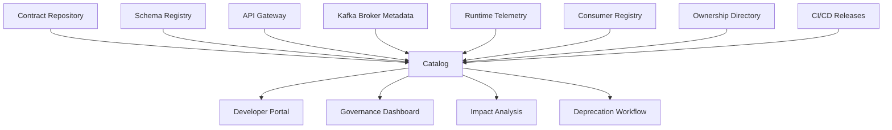
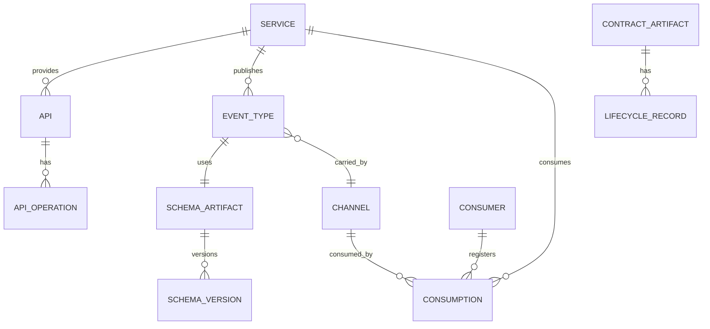
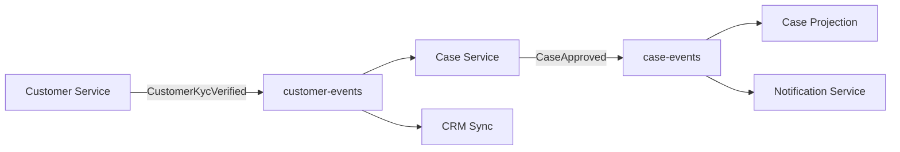
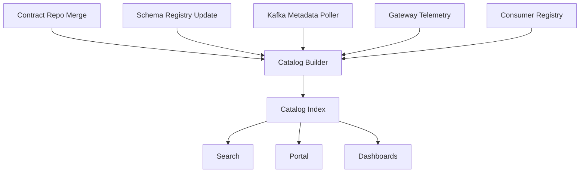
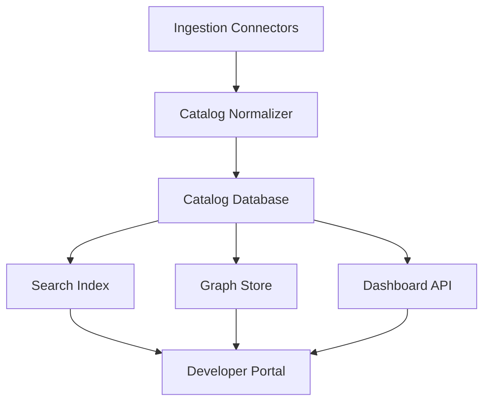

# Part 028 — Enterprise API and Event Catalog: Discovery, Lineage, Ownership, Lifecycle, and Runtime Telemetry

## Tujuan Pembelajaran

API/event catalog adalah sistem discovery dan governance untuk contract ecosystem.

Tanpa catalog, engineer bertanya di Slack:

```text
Ada event untuk customer active nggak?
Siapa owner topic ini?
Schema yang dipakai versi mana?
Apakah event ini deprecated?
Consumer mana saja yang pakai endpoint ini?
Apakah payload ini mengandung PII?
Kalau ingin replay, retention-nya berapa?
```

Catalog yang matang menjawab pertanyaan tersebut secara self-service.

Namun catalog bukan sekadar portal dokumentasi. Catalog enterprise harus menghubungkan:

1. OpenAPI specs;
2. AsyncAPI specs;
3. schemas;
4. Kafka topics/channels;
5. event types;
6. owners;
7. lifecycle;
8. compatibility policy;
9. data classification;
10. consumer inventory;
11. lineage;
12. runtime telemetry;
13. deprecation/migration;
14. incidents and support;
15. SDKs/stubs/examples.

Setelah part ini, kamu harus mampu:

- mendesain API/event catalog sebagai platform capability;
- menentukan data model catalog;
- menghubungkan catalog dengan schema registry, contract repo, CI, Kafka, gateway, runtime telemetry;
- membuat consumer inventory and lineage;
- menampilkan lifecycle, compatibility, and governance metadata;
- mendukung search/discovery;
- membuat dashboard governance;
- menghindari catalog yang menjadi wiki mati.

---

## 1. Catalog Is Not Just Documentation

Documentation answers:

```text
What is this API/event?
```

Catalog answers:

```text
What exists, who owns it, how stable is it, who uses it, how does it evolve, how do I integrate, and what risk exists?
```



A catalog should be generated/synced from authoritative sources, not manually maintained page-by-page.

---

## 2. Catalog User Personas

### 2.1 Consumer Engineer

Needs:

1. find API/event;
2. understand meaning;
3. see examples;
4. know stability/lifecycle;
5. know auth/access process;
6. get SDK/stubs;
7. understand errors/retry/replay;
8. register consumption.

### 2.2 Provider Engineer

Needs:

1. publish contract;
2. see consumers;
3. manage deprecation;
4. track compatibility;
5. monitor usage;
6. respond to incidents.

### 2.3 Platform Engineer

Needs:

1. enforce governance;
2. detect drift;
3. maintain registry integration;
4. measure coverage;
5. route reviews;
6. manage lifecycle.

### 2.4 Architect/Tech Lead

Needs:

1. understand system dependencies;
2. assess blast radius;
3. review change risk;
4. identify duplicated contracts;
5. track domain ownership.

### 2.5 Security/Data Governance

Needs:

1. find sensitive data flows;
2. enforce classification;
3. approve consumers;
4. audit access;
5. ensure retention and jurisdiction.

---

## 3. Catalog Core Entities



Core entities:

1. service/system;
2. API;
3. API operation;
4. event type;
5. channel/topic/queue;
6. schema artifact;
7. schema version;
8. owner/team;
9. consumer;
10. consumption/subscription;
11. lifecycle record;
12. compatibility policy;
13. example;
14. SDK/stub;
15. deprecation/migration record;
16. runtime metric.

---

## 4. Catalog Entity: Service

```yaml
service:
  id: case-service
  name: Case Service
  ownerTeam: case-management-platform
  domain: case-management
  repository: github.com/acme/case-service
  runtimeTier: tier-1
  onCall: case-platform-oncall
  provides:
    apis:
      - case-api
    events:
      - CaseSubmitted
      - CaseApproved
  consumes:
    events:
      - CustomerKycVerified
```

Service catalog links technical ownership to contracts.

---

## 5. Catalog Entity: API

```yaml
api:
  id: customer-api
  title: Customer API
  type: HTTP
  ownerTeam: customer-platform
  lifecycle: stable
  visibility: internal
  openApiRef: openapi/customer-api.yaml
  baseUrls:
    prod: https://api.acme.internal/customers
  compatibilityPolicy: no-breaking-without-deprecation
  dataClassification: confidential
  authentication:
    type: OAuth2
    scopes:
      - customer.read
      - customer.write
```

API operation:

```yaml
operation:
  operationId: getCustomer
  method: GET
  path: /customers/{customerId}
  summary: Get customer by ID.
  lifecycle: stable
  sdkMethods:
    java: CustomerClient.getCustomer
  consumers:
    - case-management-service
    - crm-sync
```

---

## 6. Catalog Entity: Event Type

```yaml
eventType:
  name: CaseApproved
  qualifiedName: com.acme.case.events.CaseApproved
  ownerTeam: case-management-platform
  authority: case-service
  lifecycle: stable
  description: A case has been approved by an authorized actor.
  channel: case-events
  messageKey: metadata.aggregateId
  ordering: per-case
  delivery: at-least-once
  replaySupported: true
  schemaArtifact: com.acme.case.events.CaseApproved
  asyncApiRef: asyncapi/case-events.yaml#/components/messages/CaseApproved
  dataClassification: confidential
  pii: false
  compatibility: BACKWARD_TRANSITIVE
```

Consumer assumptions:

```yaml
consumerAssumptions:
  - Case state is APPROVED after this event.
  - Duplicate delivery is possible.
  - Consumers must deduplicate by metadata.eventId.
  - Global ordering is not guaranteed.
```

This is much richer than schema.

---

## 7. Catalog Entity: Channel / Topic

```yaml
channel:
  name: case-events
  protocol: kafka
  ownerTeam: case-management-platform
  purpose: Case lifecycle event stream.
  messageTypes:
    - CaseSubmitted
    - CaseAssigned
    - CaseApproved
    - CaseClosed
  key:
    expression: metadata.aggregateId
    meaning: caseId
  ordering:
    scope: per-case
  retention:
    policy: delete
    duration: P90D
  cleanupPolicy: delete
  dlq: case-events-dlq
  dataClassification: confidential
  access:
    approvalRequired: true
```

Topic catalog should include runtime config and contract config, with drift status.

---

## 8. Catalog Entity: Schema Artifact

```yaml
schemaArtifact:
  id: com.acme.case.events.CaseApproved
  format: AVRO
  registry: prod-schema-registry
  group: case
  compatibility: BACKWARD_TRANSITIVE
  lifecycle: stable
  ownerTeam: case-management-platform
  currentVersion: 7
  versions:
    - version: 1
      introducedAt: 2025-08-01
    - version: 7
      introducedAt: 2026-06-29
  references:
    - com.acme.common.EventMetadata
```

Schema version page should show:

1. raw schema;
2. rendered fields;
3. compatibility result;
4. examples;
5. changelog;
6. generated artifacts;
7. dependent schemas;
8. events/channels using it.

---

## 9. Catalog Entity: Consumer / Consumption

Consumer registration:

```yaml
consumption:
  consumerId: case-projection-service
  ownerTeam: case-management-platform
  consumes:
    type: event
    eventType: CaseApproved
    channel: case-events
    consumerGroup: case-projection-service
  usage:
    fields:
      - payload.caseId
      - payload.caseVersion
      - payload.reasonCode
    sideEffects:
      - update-case-search-projection
  criticality: tier-1
  replayBehavior: projection-safe
  lastSeenAt: 2026-06-29T05:30:00Z
  schemaVersionsObserved:
    - 6
    - 7
```

This powers impact analysis.

---

## 10. Catalog Pages

### 10.1 API Page

Should include:

1. summary and owner;
2. lifecycle;
3. base URL;
4. auth scopes;
5. operations;
6. schemas;
7. errors;
8. examples;
9. SDK/client;
10. changelog;
11. consumers;
12. deprecation status;
13. incidents/support;
14. OpenAPI download.

### 10.2 Event Page

Should include:

1. event meaning;
2. authority;
3. topic/channel;
4. key/order/delivery/replay;
5. schema;
6. examples;
7. consumer assumptions;
8. producer guarantees;
9. consumers;
10. lifecycle;
11. compatibility;
12. deprecation/migration;
13. DLQ/replay guidance;
14. AsyncAPI download.

### 10.3 Topic Page

Should include:

1. event types carried;
2. key strategy;
3. retention/compaction;
4. partitions/replication if exposed;
5. ACL/access;
6. DLQ/retry topics;
7. consumers/groups;
8. lag/traffic;
9. drift status.

### 10.4 Schema Page

Should include:

1. schema content;
2. version history;
3. compatibility mode;
4. references/dependents;
5. examples;
6. generated Java artifact;
7. changelog;
8. lifecycle.

---

## 11. Search and Discovery

Catalog search should support:

1. keyword search;
2. domain filter;
3. owner filter;
4. lifecycle filter;
5. data classification filter;
6. event type search;
7. field search;
8. schema search;
9. topic/channel search;
10. consumer search;
11. deprecated filter;
12. API method/path search.

Example queries:

```text
customer activated event
case approved
events containing customerId
APIs owned by customer-platform
deprecated events with active consumers
topics with restricted data
schemas using Money
```

Field-level search is powerful but must respect data sensitivity.

---

## 12. Lineage

Lineage shows data flow.

Example:



Lineage should answer:

1. who produces event?
2. which topic carries it?
3. who consumes it?
4. what downstream APIs/events are triggered?
5. what data classification flows?
6. what blast radius if event changes?
7. what dependency path exists for incident?

Lineage must be partially automated from runtime telemetry. Manual lineage rots.

---

## 13. Runtime Telemetry Integration

Catalog should show runtime evidence:

For APIs:

1. request rate;
2. error rate;
3. latency;
4. consumers/client IDs;
5. auth scopes used;
6. deprecated endpoint traffic;
7. SDK version if reported.

For events:

1. producer event rate;
2. event types observed;
3. schema versions observed;
4. consumer groups;
5. consumer lag;
6. DLQ count;
7. deprecated event consumption;
8. unknown event type errors.

Example event telemetry:

```yaml
runtime:
  lastProducedAt: 2026-06-29T05:40:00Z
  eventsPerHour: 12043
  schemaVersionsObserved:
    - 7
  activeConsumerGroups:
    - case-projection-service
    - notification-service
    - analytics-case-loader
  dlqLast24h: 3
```

Runtime evidence prevents stale catalog.

---

## 14. Catalog and Consumer Inventory

Consumer inventory can be:

1. manual registration;
2. API key/client ID telemetry;
3. Kafka consumer group telemetry;
4. service mesh traces;
5. SDK telemetry;
6. gateway logs;
7. repository dependency scanning;
8. schema registry access logs.

Best system combines explicit registration + runtime detection.

### 14.1 Registered vs Observed Consumers

```yaml
registeredConsumers:
  - case-projection-service
  - notification-service
observedConsumers:
  - case-projection-service
  - notification-service
  - unknown-consumer-group-892
```

Unknown consumers are governance risk.

---

## 15. Catalog and Access Control

Catalog must enforce visibility.

Not every user should see every schema/event if names/fields reveal sensitive information.

Access model:

| Data | Visibility |
|---|---|
| public API | broad |
| internal API | employee/internal |
| confidential schema | approved teams |
| restricted schema | need-to-know |
| security-sensitive fields | masked or hidden |
| deprecated migration notes | known consumers + owners |

Catalog search should respect ACL.

---

## 16. Data Classification View

Security/data governance needs queries:

1. show all events with PII;
2. show all topics with restricted data;
3. show consumers of national ID;
4. show schemas with retention class X;
5. show data crossing jurisdiction;
6. show DLQs containing restricted payloads.

Example dashboard:

```text
Restricted Data Flows
- customer-events: contains PII, 7 consumers
- identity-verification-events: restricted, 3 consumers
- fraud-signals: confidential, 5 consumers
```

This is difficult without catalog metadata.

---

## 17. Lifecycle Dashboard

Catalog should show lifecycle health.

Metrics:

```text
Artifacts
- Stable: 940
- Experimental: 87
- Experimental expiring in 30d: 12
- Deprecated: 61
- Deprecated with active consumers: 43
- Retired but still produced: 2
- Missing owner: 0
- Missing examples: 29
```

This turns lifecycle from theory into operational hygiene.

---

## 18. Compatibility Dashboard

Show:

1. artifacts by compatibility mode;
2. NONE compatibility exceptions;
3. expiring exceptions;
4. failed compatibility checks;
5. dangerous changes awaiting approval;
6. breaking changes by domain;
7. replay test coverage;
8. generated code failure trends.

Example:

```text
Compatibility Risk
- Stable schemas with NONE compatibility: 3
- Backward transitive: 712
- Full transitive: 84
- Dangerous changes this week: 9
- High-risk pending reviews: 2
```

---

## 19. Deprecation Dashboard

Show:

1. deprecated artifacts;
2. replacement;
3. sunset date;
4. active consumers;
5. traffic trend;
6. migration status;
7. blockers.

Example:

```text
CustomerActivated
Status: Deprecated
Replacement: CustomerLifecycleActivated
Sunset target: 2027-03-31
Active consumers: 4
Traffic last 7d: 1.2M
Migration status: 50%
```

This prevents “deprecated forever.”

---

## 20. Catalog Data Sources

| Source | Data |
|---|---|
| contract repo | source contracts, lifecycle, decisions |
| schema registry | schema versions, compatibility, IDs |
| API gateway | traffic, clients, auth scopes |
| Kafka broker | topics, groups, lag, configs |
| observability platform | traces, metrics, logs |
| CI/CD | releases, build metadata |
| service catalog | owner, repo, tier, on-call |
| IAM/security | access approvals |
| developer portal | docs/pages |
| incident system | contract-related incidents |

Integrations should be automated.

---

## 21. Catalog Freshness

Catalog page should show freshness:

```yaml
lastSyncedAt: 2026-06-29T05:45:00Z
sources:
  contractRepo: synced
  schemaRegistry: synced
  kafkaRuntime: stale_2h
  gatewayTelemetry: synced
```

If runtime telemetry stale, users should know.

---

## 22. Catalog Sync Pipeline



Use incremental sync where possible.

---

## 23. Catalog Data Quality Rules

Rules:

1. every stable artifact has owner;
2. every stable event has topic/channel;
3. every event has schemaRef;
4. every schemaRef resolves;
5. every deprecated artifact has replacement or reason;
6. every topic has data classification;
7. every stable API has OpenAPI;
8. every stable event has AsyncAPI or equivalent;
9. every schema has lifecycle;
10. every restricted artifact has access policy.

Violations should create issues/alerts.

---

## 24. Catalog and Contract Review

During PR, catalog context helps reviewers:

1. known consumers;
2. criticality;
3. lifecycle;
4. data classification;
5. traffic;
6. schema version usage;
7. deprecation status;
8. prior incidents.

Review bot comment:

```md
Catalog context:
- Event `CaseApproved` has 12 consumers, 3 tier-1.
- Active schema versions observed: 6, 7.
- Replay supported for 90 days.
- Data classification: confidential.
- Last incident: DLQ spike on 2026-05-14.
```

This makes review evidence-based.

---

## 25. Catalog and Incident Response

During incident, catalog answers:

1. who owns event/API?
2. who consumes it?
3. what changed recently?
4. which schema version introduced issue?
5. which consumers are affected?
6. what DLQ/replay path exists?
7. what rollback/migration guide exists?
8. who is on-call?

Incident page should link to catalog entity.

---

## 26. Catalog and SDK/Artifacts

Catalog should link:

1. Java SDK artifact;
2. Maven coordinates;
3. latest version;
4. compatibility notes;
5. generated client docs;
6. sample code;
7. changelog.

Example:

```yaml
sdk:
  language: java
  groupId: com.acme.sdk
  artifactId: customer-api-client
  latestVersion: 3.8.0
  minJavaVersion: 21
  changelog: ...
```

This improves consumer onboarding.

---

## 27. Catalog and Examples

Catalog examples should be source-controlled and validated.

Event example page:

```json
{
  "metadata": {
    "eventId": "evt_01J2...",
    "eventType": "CaseApproved",
    "source": "case-service"
  },
  "payload": {
    "caseId": "case_01J2...",
    "caseVersion": 17,
    "reasonCode": "EVIDENCE_COMPLETE"
  }
}
```

Examples should show:

1. minimal valid;
2. full valid;
3. error/problem;
4. old version if relevant;
5. DLQ if relevant.

---

## 28. Catalog Implementation Architecture

Possible architecture:



Storage:

1. relational DB for core entities;
2. search index for discovery;
3. graph model for lineage;
4. object storage for rendered docs/artifacts;
5. metrics store links for telemetry.

Do not start with overcomplex graph if data quality is low. Start with core entity model and grow.

---

## 29. Catalog APIs

Catalog itself should expose APIs:

1. search artifacts;
2. get API detail;
3. get event detail;
4. get schema versions;
5. register consumer;
6. query consumers;
7. query lineage;
8. update lifecycle;
9. list deprecated artifacts;
10. get risk context for PR.

Example:

```http
GET /catalog/events/CaseApproved
GET /catalog/topics/case-events/consumers
POST /catalog/consumptions
GET /catalog/artifacts/{id}/impact
```

Treat catalog API as internal platform contract.

---

## 30. Catalog Anti-Patterns

### 30.1 Wiki Catalog

Manual pages rot.

### 30.2 Schema-Only Catalog

Shape visible, meaning/ownership absent.

### 30.3 No Runtime Telemetry

Catalog claims no consumers, but production has unknown consumers.

### 30.4 No Lifecycle

Consumers adopt deprecated/experimental artifacts.

### 30.5 No Access Control

Sensitive schemas discoverable by everyone.

### 30.6 No Search

Portal exists but nobody can find anything.

### 30.7 No Ownership

Catalog says what, not who.

### 30.8 No Integration with Review

PR reviewers lack impact data.

### 30.9 No Deprecation Dashboard

Deprecated forever.

### 30.10 Catalog as Separate Truth

Catalog data diverges from registry/contracts/runtime.

---

## 31. Maturity Model

| Level | Behavior |
|---|---|
| 0 | contracts scattered in repos/wiki |
| 1 | static docs generated from OpenAPI/AsyncAPI |
| 2 | schema registry linked to docs |
| 3 | ownership/lifecycle/search available |
| 4 | consumer inventory and lineage |
| 5 | runtime telemetry and governance dashboards |
| 6 | PR impact analysis, drift detection, automated onboarding |
| 7 | telemetry-driven deprecation and risk analytics |

Aim for Level 4 for internal platform. Level 5+ for enterprise-critical ecosystem.

---

## 32. Practice Lab

### Lab 1 — Catalog Entity Model

Design catalog model for:

1. service;
2. API;
3. event type;
4. topic;
5. schema artifact;
6. consumer;
7. lifecycle;
8. ownership.

### Lab 2 — Event Page

Design catalog page for `CaseApproved`.

Include all fields a new consumer needs.

### Lab 3 — Consumer Inventory

Design registration form for a service consuming `CustomerActivated`.

Include usage fields, side effects, criticality, owner, consumer group, and replay behavior.

### Lab 4 — Dashboard

Design dashboard for deprecated events with active consumers.

### Lab 5 — Lineage

Draw lineage from `CustomerKycVerified` to `CaseApproved` to `NotificationSent`.

### Lab 6 — Drift Detection

Catalog says topic `case-events` retention is 90 days, Kafka runtime says 30 days. Design alert and remediation.

---

## 33. Senior Engineer Heuristics

1. **Catalog is governance infrastructure, not only docs.**
2. **Catalog must be generated from authoritative sources.**
3. **Every contract needs owner, lifecycle, and examples.**
4. **Schema shape without meaning is insufficient.**
5. **Runtime telemetry keeps catalog honest.**
6. **Consumer inventory powers impact analysis.**
7. **Lineage turns contract changes into blast-radius understanding.**
8. **Deprecated artifacts need dashboards.**
9. **Access control matters because schemas reveal data.**
10. **Search quality determines adoption.**
11. **Catalog should feed PR review context.**
12. **Registry and catalog are complementary, not identical.**
13. **Unknown consumers are governance risk.**
14. **A catalog with stale data is worse than no catalog.**
15. **A good catalog lets a new engineer integrate safely without tribal knowledge.**

---

## 34. Summary

Enterprise API and event catalog centralizes discovery, ownership, lifecycle, schemas, channels, consumers, lineage, runtime telemetry, and governance dashboards. It connects contract repository, schema registry, gateway, Kafka metadata, CI/CD, service catalog, and observability.

Main takeaways:

1. catalog is not just documentation;
2. catalog data model should include services, APIs, events, topics, schemas, consumers, lifecycle, and ownership;
3. event pages must include semantic, operational, schema, and governance details;
4. runtime telemetry prevents stale catalog;
5. consumer inventory enables impact analysis;
6. lineage supports architecture review and incidents;
7. lifecycle/deprecation dashboards turn governance into operational hygiene;
8. access control matters for sensitive schemas;
9. catalog should sync from authoritative sources;
10. catalog context should appear directly in contract PR reviews.

Part berikutnya membahas multi-team contract operating model: ownership, producer/consumer responsibilities, platform governance, review councils, paved roads, escalation, and operating rhythms.
