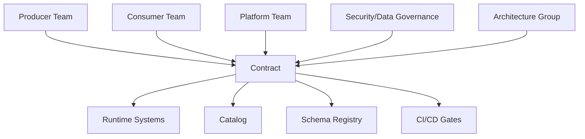
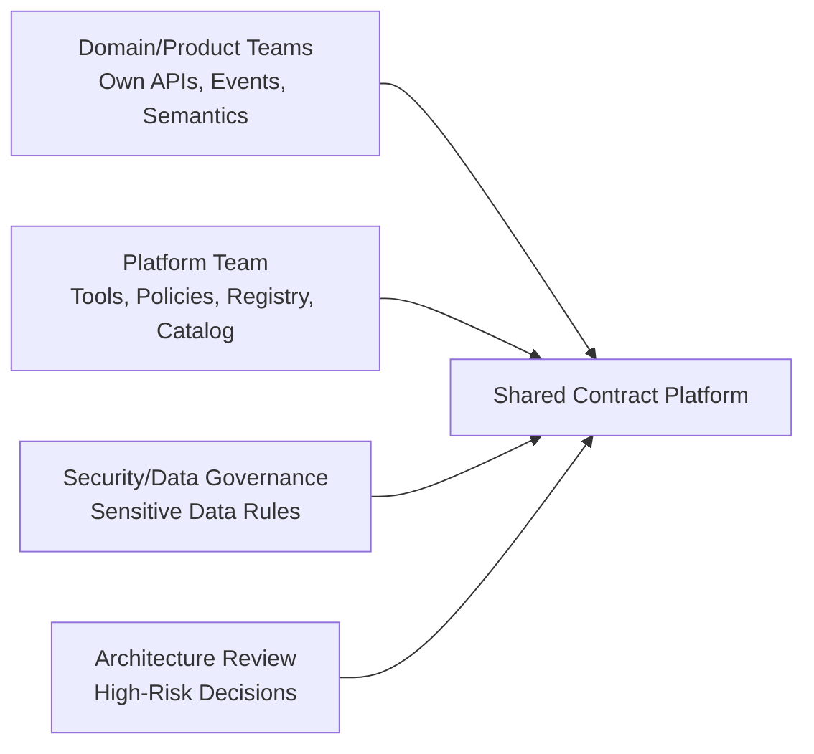
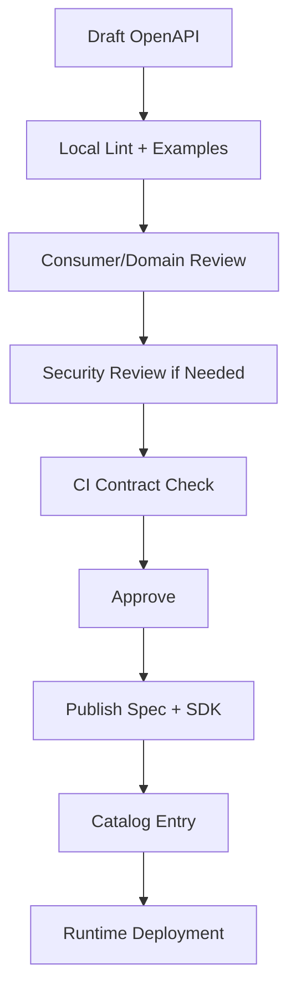
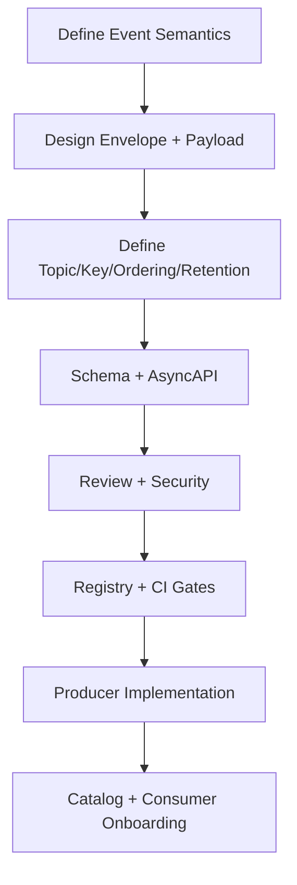
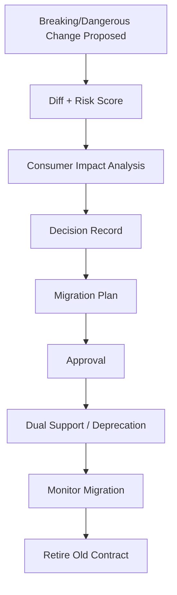
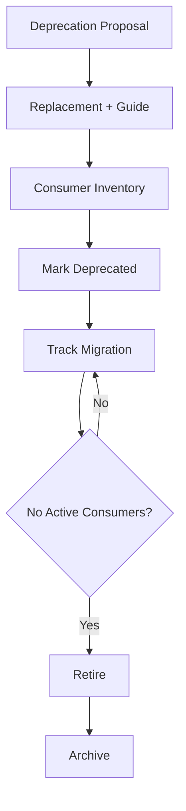

# Part 029 — Multi-Team Contract Operating Model: Ownership, Producer/Consumer Responsibilities, and Governance Rhythm

## Tujuan Pembelajaran

API contract, event contract, schema registry, catalog, linting, and lifecycle policy tidak akan berhasil jika operating model lintas tim berantakan.

Masalah nyata di enterprise jarang hanya teknis:

```text
Schema registry sudah ada, tapi producer tetap breaking.
OpenAPI sudah ada, tapi consumer tidak tahu perubahan.
Event catalog sudah ada, tapi owner tidak jelas.
CI gate sudah ada, tapi exception dipakai permanen.
Platform team membuat rules, tapi product team merasa diperlambat.
```

Operating model menjawab:

1. siapa yang boleh membuat contract;
2. siapa owner semantics;
3. siapa reviewer;
4. kapan platform team wajib terlibat;
5. apa tanggung jawab producer;
6. apa tanggung jawab consumer;
7. bagaimana onboarding consumer;
8. bagaimana breaking change disetujui;
9. bagaimana deprecation dijalankan;
10. bagaimana incident contract ditangani;
11. bagaimana governance tidak menjadi bottleneck;
12. bagaimana kualitas contract diukur.

Setelah part ini, kamu harus mampu mendesain operating model yang bisa dipakai banyak tim Java/backend/platform dalam organisasi enterprise.

---

## 1. Why Operating Model Matters

Contract engineering is not only artifact engineering. It is coordination engineering.



Jika ownership dan responsibility tidak jelas, contract menjadi shared resource tanpa steward.

Symptoms:

1. `DataChanged` events everywhere;
2. producers change schema without impact analysis;
3. consumers parse error message text;
4. no one owns old deprecated endpoints;
5. registry has `NONE` compatibility for critical streams;
6. Kafka topic key changed silently;
7. APIs have no error taxonomy;
8. incident response asks “who owns this event?”;
9. platform team becomes approval bottleneck;
10. governance rules are bypassed.

---

## 2. Core Principle: Federated Governance with Paved Roads

Centralized governance for everything does not scale. Fully decentralized governance creates chaos.

Better model:

> Federated governance: domain teams own semantics; platform team owns paved roads, automation, and guardrails; high-risk changes escalate through lightweight review.



Paved road means:

1. standard templates;
2. lint rules;
3. CI gates;
4. registry workflows;
5. catalog integration;
6. generated code pipelines;
7. test harnesses;
8. review checklist;
9. migration templates;
10. examples.

Teams should not have to invent governance from scratch.

---

## 3. Roles

### 3.1 Producer Team

The team that owns and publishes API/event/schema.

Responsibilities:

1. define semantic meaning;
2. own source of truth;
3. maintain contract artifacts;
4. publish examples;
5. keep compatibility;
6. maintain lifecycle metadata;
7. notify consumers of dangerous changes;
8. support incidents;
9. run producer contract tests;
10. own deprecation/migration.

### 3.2 Consumer Team

The team that calls API or consumes event.

Responsibilities:

1. register consumption where required;
2. follow contract rules;
3. handle compatibility expectations;
4. tolerate documented unknown fields/events;
5. implement idempotency for events;
6. monitor failures/lag;
7. migrate off deprecated contracts;
8. not depend on undocumented fields/behavior;
9. participate in impact review when affected;
10. maintain consumer contract tests.

### 3.3 Platform Team

Owns contract infrastructure:

1. contract repository template;
2. CI/CD gates;
3. schema registry;
4. catalog;
5. diff engine;
6. lint rules;
7. generated code pipeline;
8. governance dashboards;
9. runtime drift detection;
10. paved-road libraries.

### 3.4 Contract Steward

A role within domain/platform that keeps contract hygiene.

Tasks:

1. review contract PRs;
2. maintain catalog metadata;
3. monitor deprecated usage;
4. coordinate consumers;
5. ensure examples/tests;
6. triage governance exceptions.

### 3.5 Security/Data Reviewer

Involved when:

1. PII added;
2. data classification changes;
3. restricted event/API introduced;
4. retention/jurisdiction changes;
5. DLQ contains sensitive payload;
6. external/partner exposure.

### 3.6 Architecture Reviewer

Involved for:

1. semantic breaking changes;
2. topic/key migration;
3. public/partner contract changes;
4. platform-wide common schema changes;
5. long-term exception requests;
6. cross-domain workflow contracts.

---

## 4. RACI Matrix

| Activity | Producer | Consumer | Platform | Security/Data | Architecture |
|---|---|---|---|---|---|
| Define API/event semantics | A/R | C | C | C if data-sensitive | C |
| Maintain schema | A/R | C | C | C if data-sensitive | C |
| Set compatibility mode | A/R | C | C/R for policy | C | A for high risk |
| Approve safe additive change | A/R | I | C via automation | I | I |
| Approve dangerous change | A/R | C | C | C if needed | A/R if high |
| Register schema in prod | R via CI | I | A/R platform workflow | I | I |
| Maintain catalog metadata | A/R | C | R tooling | C | I |
| Consumer onboarding | C | A/R | C | A/R if sensitive | I |
| Deprecation migration | A/R | R for own migration | C | C if data | C |
| Runtime drift detection | C | C | A/R | I | I |
| Contract incident response | A/R | R if impacted | C | C if data | C if severe |

A = Accountable, R = Responsible, C = Consulted, I = Informed.

---

## 5. Producer Responsibilities

Producer must promise only what it can support.

### 5.1 API Producer Responsibilities

1. publish OpenAPI;
2. define request/response/error semantics;
3. document idempotency/retryability;
4. maintain stable operationId if SDK generated;
5. version/deprecate safely;
6. publish examples;
7. run contract tests;
8. avoid leaking internal entities;
9. document auth/scopes;
10. maintain changelog.

### 5.2 Event Producer Responsibilities

1. publish AsyncAPI/event contract;
2. own event authority;
3. define topic/key/order/retention;
4. emit stable eventId;
5. publish after durable state change;
6. maintain schema compatibility;
7. keep old schemas readable;
8. document replay/DLQ behavior;
9. publish examples/golden samples;
10. maintain consumer assumptions.

### 5.3 Producer Anti-Responsibilities

Producer should not:

1. force consumer-specific payload into domain event;
2. change event meaning silently;
3. assume no consumers exist without catalog/telemetry;
4. publish internal entity model;
5. register prod schemas manually;
6. use compatibility `NONE` casually;
7. delete old schema versions;
8. change Kafka key as implementation detail;
9. emit event before commit;
10. break generated clients without migration.

---

## 6. Consumer Responsibilities

Consumers are not passive victims. They must build resilient consumption.

### 6.1 API Consumer Responsibilities

1. call documented operations only;
2. do not parse human error text;
3. handle documented error codes;
4. do not depend on undocumented response fields;
5. tolerate additional response fields;
6. respect rate limits/retry guidance;
7. use idempotency keys where required;
8. migrate before sunset;
9. keep SDK versions supported;
10. report contract ambiguity.

### 6.2 Event Consumer Responsibilities

1. register event consumption;
2. deduplicate by eventId if delivery at-least-once;
3. ignore unknown event types on multi-type topic if contract says so;
4. tolerate unknown optional fields;
5. handle out-of-order or sequence gaps per contract;
6. quarantine poison messages;
7. avoid side effects during replay or deduplicate them;
8. monitor lag and DLQ;
9. migrate from deprecated events;
10. avoid relying on undocumented payload fields.

### 6.3 Consumer Anti-Patterns

1. parse `detail` message string;
2. switch on enum without default/unknown path;
3. assume global Kafka ordering;
4. assume event exactly once;
5. assume all fields always present if optional;
6. ignore deprecation notices;
7. use deprecated event for new feature;
8. consume sensitive topic without approval;
9. create shadow dependency not registered;
10. hardcode schema version without migration path.

---

## 7. Platform Team Responsibilities

Platform team owns the paved road.

### 7.1 Tooling

1. OpenAPI/AsyncAPI validators;
2. Avro/Protobuf/JSON Schema generators;
3. registry clients;
4. contract diff engine;
5. CI templates;
6. Gradle/Maven plugins;
7. Java validation libraries;
8. test harnesses;
9. example validators;
10. catalog sync.

### 7.2 Governance

1. default policies;
2. compatibility modes;
3. lifecycle rules;
4. exception workflow;
5. reviewer routing;
6. dashboards;
7. drift detection;
8. scorecards;
9. office hours;
10. documentation.

### 7.3 Platform Should Not

1. own every domain schema meaning;
2. manually approve every safe change;
3. become blocker for routine additive evolution;
4. encode business semantics without domain owner;
5. allow teams to bypass paved road silently.

---

## 8. Contract Operating Workflows

### 8.1 New API Workflow



Required artifacts:

1. OpenAPI;
2. examples;
3. error model;
4. owner/lifecycle;
5. auth scopes;
6. compatibility policy;
7. contract tests.

### 8.2 New Event Workflow



Required artifacts:

1. event meaning;
2. authority;
3. topic/key/order;
4. schema;
5. AsyncAPI;
6. examples;
7. compatibility mode;
8. replay/DLQ policy;
9. lifecycle;
10. producer tests.

### 8.3 Breaking Change Workflow



---

## 9. Consumer Onboarding Workflow

When a team wants to consume event/API:

1. search catalog;
2. read lifecycle and compatibility;
3. request access if needed;
4. register consumer identity;
5. declare usage and criticality;
6. declare side effects and replay behavior;
7. implement contract tests;
8. monitor runtime health;
9. subscribe to deprecation notifications.

Consumer registration example:

```yaml
consumer:
  service: fraud-monitoring-service
  ownerTeam: fraud-platform
  consumes:
    eventType: PaymentCaptured
    topic: payment-events
  usage:
    fields:
      - payload.paymentId
      - payload.amount
      - payload.customerId
    sideEffects:
      - create-fraud-case
  criticality: tier-1
  replayBehavior: side-effect-protected
  contact: fraud-platform-oncall
```

This enables impact analysis.

---

## 10. Deprecation Operating Model

Deprecation is a program, not a flag.

Steps:

1. producer proposes deprecation;
2. replacement defined;
3. migration guide written;
4. known consumers identified;
5. catalog marks deprecated;
6. new consumers blocked unless exception;
7. telemetry dashboard created;
8. consumer migration tracked;
9. sunset decision made from evidence;
10. old artifact retired/archived.



---

## 11. Exception Operating Model

Exceptions are controlled bypasses.

Examples:

1. compatibility `NONE` for migration;
2. temporary use of deprecated event;
3. publishing experimental schema to staging;
4. delayed migration past sunset;
5. consumer needs restricted data.

Exception requirements:

1. reason;
2. scope;
3. owner;
4. expiry;
5. approver;
6. risk;
7. rollback plan;
8. monitoring.

No expiry = not exception, but policy change.

---

## 12. Governance Council vs Review Board

Avoid “architecture review board for every field.”

Use layered governance:

| Change | Review |
|---|---|
| safe additive internal change | automated + owner |
| dangerous schema change | contract steward |
| sensitive data addition | security/data reviewer |
| topic key/retention change | event platform reviewer |
| public API breaking change | architecture/governance council |
| common schema breaking change | platform architecture review |

Governance council should focus on:

1. policy changes;
2. recurring issues;
3. high-risk exceptions;
4. cross-domain conflicts;
5. platform investment priorities;
6. quality scorecards.

---

## 13. Operating Rhythm

### 13.1 Daily/Continuous

1. CI gates run;
2. registry/catalog sync;
3. drift alerts;
4. deprecated usage alerts;
5. schema validation.

### 13.2 Weekly

1. contract office hours;
2. review high-risk PRs;
3. check expiring exceptions;
4. check blocked migrations;
5. unblock teams.

### 13.3 Monthly

1. governance scorecard;
2. deprecated artifact review;
3. compatibility exception review;
4. incident trend review;
5. policy adjustment;
6. platform tooling roadmap.

### 13.4 Quarterly

1. contract maturity review;
2. catalog quality audit;
3. common schema review;
4. major deprecation planning;
5. cross-domain architecture review.

---

## 14. Contract Quality Scorecard

Metrics:

```yaml
scorecard:
  totalContracts: 1240
  stableWithoutOwner: 0
  stableWithoutExamples: 21
  compatibilityNoneStable: 3
  deprecatedWithActiveConsumers: 42
  experimentalPastExpiry: 7
  eventsWithoutAsyncApi: 18
  topicsWithoutKeyDocumentation: 11
  schemasWithoutChangelog: 89
  contractIncidentsLast30Days: 4
```

Team scorecard:

| Metric | Target |
|---|---:|
| stable artifacts with owner | 100% |
| stable events with examples | >95% |
| deprecated past sunset | 0 |
| compatibility NONE stable | 0 |
| unknown consumers on critical topics | 0 |
| contract PRs with risk report | 100% |
| schema registry drift | 0 high severity |
| replay test coverage for tier-1 streams | >90% |

Scorecard should be used for improvement, not blame.

---

## 15. Escalation Paths

Escalate when:

1. producer/consumer disagreement on contract meaning;
2. breaking change deadline conflicts;
3. security/data classification dispute;
4. owner absent;
5. deprecated consumer refuses migration;
6. exception requested without acceptable rollback;
7. incident caused by contract ambiguity;
8. cross-domain common schema conflict;
9. public/partner contract risk.

Escalation path:

```text
team steward -> domain lead -> platform contract lead -> architecture council
```

Document it.

---

## 16. Contract Incident Response

Contract incident examples:

1. producer emits invalid schema;
2. consumer crashes on new enum value;
3. deprecated endpoint removed too early;
4. Kafka key changed and projection corrupts;
5. DLQ loses original event;
6. restricted field published to broad topic;
7. old schema deleted and replay fails.

Incident response:

1. identify artifact and owner;
2. identify blast radius through catalog;
3. stop producer or rollback if needed;
4. quarantine bad events;
5. notify impacted consumers;
6. restore old schema/contract if possible;
7. publish correction/migration;
8. update tests/policies to prevent recurrence.

Postmortem should update governance rules.

---

## 17. Communication Model

Channels:

1. catalog changelog;
2. contract PR comments;
3. release notes;
4. consumer notifications;
5. migration guides;
6. office hours;
7. incident channel;
8. deprecation dashboard.

Message format for dangerous change:

```md
Contract change: CustomerLifecycleStatus adds PENDING_REVIEW

Impact:
Old consumers may not handle new enum value.

Action:
Add unknown/default enum handling before 2026-08-01.

Evidence:
Known affected consumers listed in catalog.

Support:
#customer-platform-contracts
```

Good communication is targeted, not spam.

---

## 18. Paved Road Libraries for Java

Platform should provide libraries:

1. API error/problem response library;
2. OpenAPI validation integration;
3. event envelope model;
4. event publisher with schema validation;
5. outbox publisher;
6. Kafka consumer idempotency helper;
7. DLQ/quarantine helper;
8. schema registry client wrapper;
9. correlation/trace propagation;
10. contract test utilities.

Example package:

```text
com.acme.platform.contracts
├── api-problem
├── event-envelope
├── event-publisher
├── kafka-consumer-tools
├── schema-validation
├── contract-test-support
└── observability
```

Paved road reduces custom inconsistent implementations.

---

## 19. Distributed Ownership Boundaries

Use domain ownership.

| Contract | Owner |
|---|---|
| CustomerRegistered | customer-platform |
| CaseApproved | case-management-platform |
| PaymentCaptured | payment-platform |
| EventMetadata | event-platform |
| Money | platform/common-data |
| Problem | API platform |
| customer-events topic | customer-platform with event-platform guardrails |

Do not assign all contracts to platform team. Platform owns standards; domain owns meaning.

---

## 20. Multi-Team Anti-Patterns

### 20.1 Central Approval Bottleneck

Every small field change waits for architecture board.

### 20.2 Total Decentralization

Every team invents envelope/schema/versioning.

### 20.3 Producer Dictatorship

Producer breaks consumers because it owns service.

### 20.4 Consumer Entitlement

Consumer depends on undocumented behavior and blocks all evolution.

### 20.5 Ownerless Shared Schema

Common schema changes without accountable team.

### 20.6 Deprecated Forever

No migration tracking.

### 20.7 Exceptions as Normal Path

Policy bypass becomes default.

### 20.8 Governance by Spreadsheet

Not connected to CI/runtime.

### 20.9 Catalog Without Enforcement

People ignore it because it has no operational role.

### 20.10 Platform Rules Without Developer Experience

Teams bypass because paved road is painful.

---

## 21. Practice Lab

### Lab 1 — RACI

Create RACI for adding new event `LoanApplicationApproved`.

Include producer, consumers, platform, security, architecture.

### Lab 2 — Consumer Onboarding

Design onboarding workflow for a team consuming `PaymentCaptured` to trigger fraud analysis.

### Lab 3 — Breaking Change

Producer wants to rename `CustomerActivated` to `CustomerLifecycleActivated`. Design operating workflow.

### Lab 4 — Exception

A team requests compatibility `NONE` for migration. Define approval, expiry, monitoring, rollback.

### Lab 5 — Scorecard

Design monthly contract quality scorecard for your organization.

### Lab 6 — Incident

Consumer crashed after new enum value. Write incident response and governance improvement.

---

## 22. Senior Engineer Heuristics

1. **Domain teams own meaning; platform owns paved roads.**
2. **Federated governance scales better than central review for everything.**
3. **Producer owns promises; consumer owns resilience.**
4. **Unknown consumers increase risk.**
5. **Consumer registration is part of impact analysis.**
6. **Deprecation without telemetry is hope.**
7. **Exceptions must expire.**
8. **A common library is better than a common wiki.**
9. **Scorecards reveal hygiene debt before incidents.**
10. **Governance council should focus on high-risk decisions and system improvement.**
11. **Contract incidents should update tools and policies.**
12. **Paved roads must be easier than custom paths.**
13. **Security/data governance must be built into contract workflow.**
14. **Contract ownership must survive team reorgs.**
15. **Operating model is what turns contract engineering from documents into durable behavior.**

---

## 23. Summary

A multi-team contract operating model defines how producers, consumers, platform teams, security reviewers, and architecture reviewers collaborate. It balances autonomy and control through federated governance, paved roads, policy-as-code, catalog, registry, lifecycle, and risk-based review.

Main takeaways:

1. contract governance is coordination engineering;
2. producer and consumer responsibilities must be explicit;
3. platform team should build paved roads, not manually approve everything;
4. consumer registration and telemetry enable impact analysis;
5. breaking changes require decision records and migration plans;
6. deprecation needs ownership, telemetry, and sunset conditions;
7. exceptions must be scoped, approved, and time-bound;
8. scorecards and operating rhythm keep governance healthy;
9. contract incidents should improve policy/tooling;
10. the best operating model makes safe changes fast and unsafe changes visible.

Part berikutnya membahas runtime contract enforcement: API gateway validation, producer validation, consumer validation, schema registry runtime use, quarantine, fail-open/fail-closed strategy, and observability.
