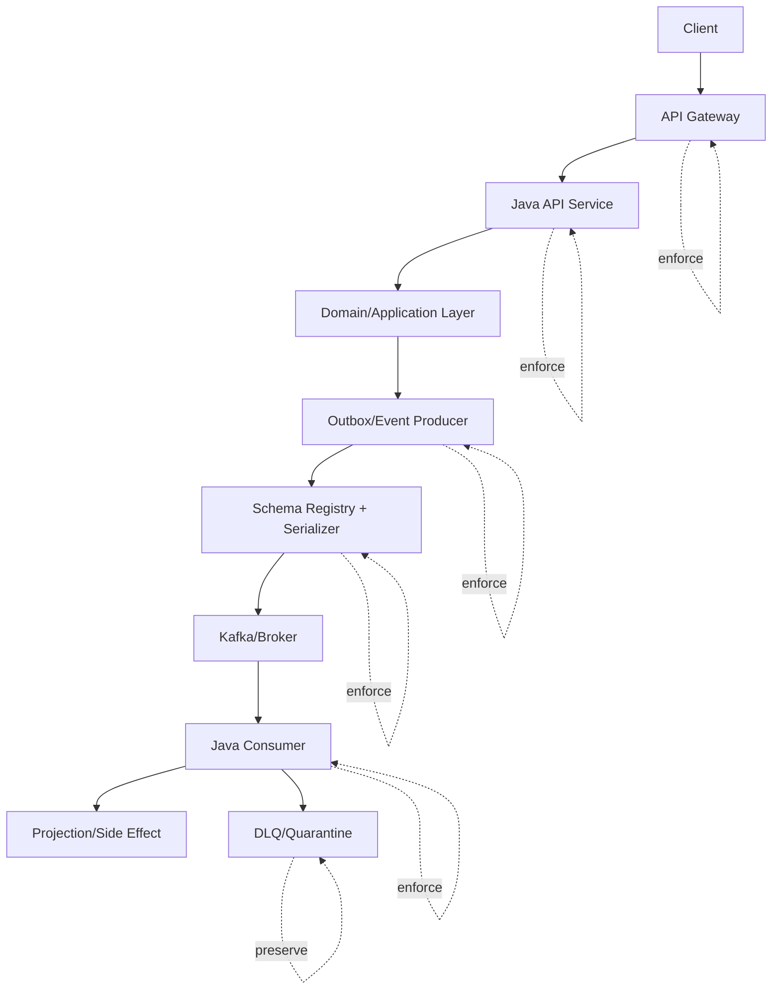
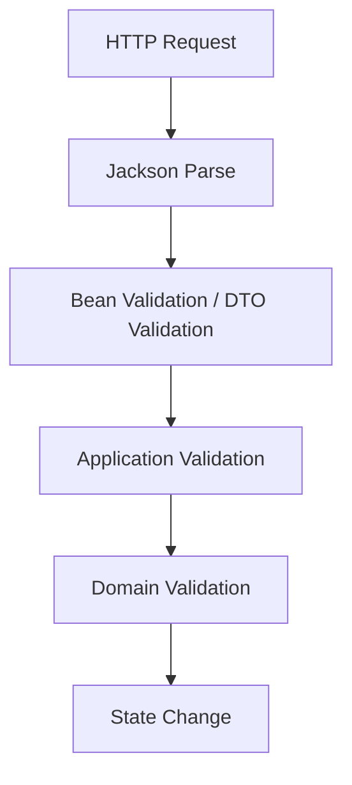
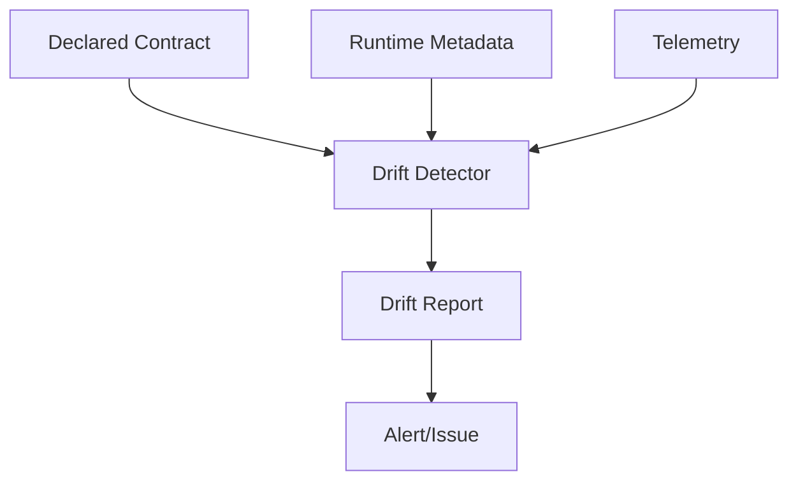

# Part 030 — Runtime Contract Enforcement: Gateway, Service, Producer, Consumer, Registry, and Quarantine Controls

## Tujuan Pembelajaran

Static contract governance mencegah banyak masalah sebelum release. Tetapi runtime tetap bisa drift:

1. service mengirim response berbeda dari OpenAPI;
2. producer publish event yang tidak valid;
3. consumer menerima old event yang tidak diuji;
4. schema registry unreachable;
5. gateway config tidak sesuai contract;
6. Kafka topic retention berbeda;
7. DLQ payload kehilangan original metadata;
8. producer melewati paved-road publisher;
9. manual hotfix mengubah behavior;
10. consumer strict parser crash karena unknown field.

Runtime contract enforcement adalah lapisan kontrol yang memastikan contract tidak hanya benar di repo, tetapi juga benar di production.

Setelah part ini, kamu harus mampu:

1. menentukan enforcement points untuk API and event systems;
2. membedakan validation at edge, service, producer, broker/registry, consumer, and DLQ;
3. mendesain fail-open/fail-closed strategy;
4. menerapkan runtime validation di Java/Spring/Kafka services;
5. mengelola performance cost dari validation;
6. mengirim invalid messages ke quarantine/DLQ secara aman;
7. membuat metrics/logs/traces untuk contract violations;
8. melakukan shadow validation and sampling;
9. mendeteksi runtime drift;
10. menghindari enforcement yang menyebabkan outage lebih besar daripada bug awal.

---

## 1. Runtime Enforcement Layers



Enforcement should be layered, not duplicated blindly.

---

## 2. Enforcement Goals

Runtime enforcement aims to:

1. prevent invalid input from entering system;
2. prevent invalid output from leaving service;
3. prevent invalid events from entering streams;
4. protect consumers from bad events;
5. preserve invalid artifacts for debugging;
6. detect drift from contract;
7. measure contract violation rate;
8. provide evidence for incidents;
9. support safe rollout/shadow validation;
10. avoid silent data corruption.

It does not mean validating everything at every hop forever. Enforcement must be risk-based.

---

## 3. Enforcement Points

| Point | What to enforce |
|---|---|
| API gateway | auth, route, request shape, size, rate limit |
| API service inbound | DTO validation, business preconditions, idempotency |
| API service outbound | response schema, error contract, headers |
| Event producer | envelope, payload schema, topic, key, metadata |
| Outbox | event immutability, event ID stability, schemaRef |
| Schema registry/serializer | schema existence, compatibility, serialization |
| Broker config | topic policy, ACL, retention, compaction |
| Event consumer inbound | schema, event type, sequence, duplicate, classification |
| DLQ/quarantine | original preservation, failure metadata |
| Catalog/drift jobs | runtime vs declared contract |

---

## 4. Fail-Open vs Fail-Closed

Enforcement decision:

| Strategy | Meaning | Use when |
|---|---|---|
| fail-closed | reject/stop on violation | unsafe input, critical contract |
| fail-open | allow but record violation | observability rollout, low risk |
| shadow | validate but do not affect flow | new validation rule |
| sample | validate percentage | high volume response/event |
| quarantine | isolate invalid message | event consumer/projection |
| degrade | return limited response | non-critical enrichment |
| feature-gated | enforce for selected traffic | rollout |

### 4.1 Rule

Use fail-closed at trust boundaries for unsafe input.

Use shadow/sampling for outbound validation during adoption.

Use quarantine for event consumers when bad message should not corrupt state.

---

## 5. API Gateway Enforcement

Gateway can enforce:

1. authentication;
2. authorization/scopes;
3. request size;
4. content type;
5. route/method existence;
6. basic request schema;
7. rate limits;
8. idempotency key presence for selected operations;
9. correlation/request ID;
10. threat protection.

Gateway should not own deep business validation.

### 5.1 Gateway Benefits

1. reject invalid requests before service load;
2. consistent error response;
3. central rate limit;
4. enforce public contract;
5. collect traffic metrics.

### 5.2 Gateway Risks

1. gateway schema drifts from service;
2. validation behavior differs from service;
3. complex business rules pushed to gateway;
4. response validation at gateway expensive;
5. generated gateway config stale.

Contract source should generate or validate gateway config.

---

## 6. Java API Inbound Validation

Typical layers:



### 6.1 DTO Validation

Example:

```java
public record ApproveCaseRequest(
    @NotBlank String reasonCode,
    @Size(max = 500) String note
) {}
```

Controller:

```java
@PostMapping("/cases/{caseId}:approve")
public ResponseEntity<CaseResponse> approve(
    @PathVariable String caseId,
    @Valid @RequestBody ApproveCaseRequest request
) {
    CaseResponse response = caseApplicationService.approve(caseId, request);
    return ResponseEntity.ok(response);
}
```

### 6.2 Validation Boundary

DTO validation:

1. shape;
2. required fields;
3. format;
4. simple constraints.

Application/domain validation:

1. case exists;
2. user has authority;
3. state transition allowed;
4. policy active;
5. idempotency semantics;
6. cross-service reference.

Do not force all business validation into annotations.

---

## 7. Error Contract Enforcement

Use one error mapper for stable error shape.

Example Problem model:

```java
public record ApiProblem(
    URI type,
    String title,
    int status,
    String detail,
    String instance,
    String code,
    String correlationId,
    List<Violation> violations
) {
    public record Violation(
        String field,
        String code,
        String message
    ) {}
}
```

Controller advice:

```java
@RestControllerAdvice
public class ApiExceptionHandler {
    @ExceptionHandler(ValidationException.class)
    ResponseEntity<ApiProblem> handleValidation(ValidationException ex) {
        ApiProblem problem = problemFactory.validationProblem(ex);
        return ResponseEntity.status(422).body(problem);
    }

    @ExceptionHandler(CaseConflictException.class)
    ResponseEntity<ApiProblem> handleConflict(CaseConflictException ex) {
        ApiProblem problem = problemFactory.conflictProblem(ex);
        return ResponseEntity.status(409).body(problem);
    }
}
```

Enforce:

1. stable `code`;
2. correct HTTP status;
3. no stack trace leakage;
4. correlation ID present;
5. retryability if part of contract;
6. validation paths normalized.

---

## 8. Response Contract Enforcement

Response validation can catch server drift.

Options:

1. validate all responses in tests;
2. validate sampled production responses;
3. validate shadow mode;
4. validate only critical/public APIs;
5. validate in gateway/proxy;
6. validate in service filter.

### 8.1 Why Not Always Validate Everything?

Costs:

1. CPU overhead;
2. latency;
3. large response validation;
4. false positives due to schema mismatch;
5. validation library bugs;
6. outage risk if fail-closed.

### 8.2 Recommended

- fail-closed for inbound unsafe input;
- test-time response validation for all APIs;
- shadow/sampled response validation in production for critical/public APIs;
- fail-closed outbound only for highly controlled internal paths where risk justified.

### 8.3 Response Validation Metric

```text
api.contract.response.validation.failures
labels:
  api
  operationId
  status
  violationCode
```

Avoid high cardinality labels like request ID.

---

## 9. API Idempotency Enforcement

For commands with side effects, enforce idempotency key.

```java
@PostMapping("/payments")
public ResponseEntity<PaymentResponse> createPayment(
    @RequestHeader("Idempotency-Key") String idempotencyKey,
    @Valid @RequestBody CreatePaymentRequest request
) {
    return idempotencyService.execute(
        idempotencyKey,
        request.fingerprint(),
        () -> paymentService.create(request)
    );
}
```

Contract should define:

1. header name;
2. key scope;
3. retention;
4. same key same request behavior;
5. same key different request conflict;
6. response replay behavior.

Runtime must enforce it, not only document.

---

## 10. Event Producer Enforcement

Producer must validate before publishing.

Checks:

1. event envelope present;
2. eventId non-empty and stable;
3. eventType matches schema/event descriptor;
4. source matches service authority;
5. occurredAt present;
6. schemaRef present;
7. aggregateId/key present;
8. topic correct;
9. key correct;
10. schema validation passes;
11. data classification present;
12. no forbidden sensitive fields.

### 10.1 Java Event Publisher Wrapper

```java
public final class ContractEnforcedEventPublisher {
    private final SchemaValidator schemaValidator;
    private final EventPolicyValidator policyValidator;
    private final KafkaTemplate<String, Object> kafkaTemplate;

    public <T> void publish(EventDescriptor<T> descriptor, EventEnvelope<T> event) {
        policyValidator.validate(descriptor, event);
        schemaValidator.validate(descriptor.schemaRef(), event);

        String key = descriptor.keyExtractor().apply(event);

        kafkaTemplate.send(descriptor.topic(), key, event);
    }
}
```

Require teams to use paved-road publisher.

### 10.2 Prevent Bypass

1. static analysis ban direct KafkaTemplate use for domain events;
2. code owners on publisher config;
3. runtime metrics detect unknown event shape;
4. broker ACL limits producer topics;
5. CI tests verify published records.

---

## 11. Outbox Enforcement

Outbox row should include:

1. eventId;
2. eventType;
3. topic;
4. key;
5. schemaRef;
6. payload;
7. metadata;
8. occurredAt;
9. publish status.

Validation before insert:

```java
outboxValidator.validate(outboxEvent);
outboxRepository.save(outboxEvent);
```

Publisher should not mutate event identity.

Bad:

```java
event.setEventId(randomId()) // during publish retry
```

Good:

```text
eventId generated once at domain transaction/outbox creation.
```

Outbox enforcement protects against invalid events entering publish pipeline.

---

## 12. Schema Registry Runtime Enforcement

Producer serializer can enforce schema existence and serialization.

Production guidance:

1. auto-register disabled or tightly controlled;
2. producer uses schema known from CI;
3. schema compatibility checked before release;
4. serializer fails if schema missing;
5. schema ID included in payload/header according to standard;
6. schema cache monitored;
7. registry failures handled with clear policy.

### 12.1 Registry Unavailable

If registry unavailable:

- producer may fail to publish if schema not cached;
- consumer may fail to deserialize unknown schema ID;
- cached schemas may allow continued operation temporarily.

Policy must define:

1. cache TTL;
2. startup behavior;
3. fail-open/fail-closed;
4. alerting;
5. fallback if any.

For critical systems, registry availability is part of platform SLO.

---

## 13. Broker-Level Enforcement

Broker/Kafka controls:

1. ACL: only approved producers can write topic;
2. ACL: only approved consumers can read sensitive topics;
3. topic config policy;
4. max message size;
5. retention/compaction config;
6. quotas;
7. schema-aware interceptors if platform supports;
8. topic creation policy.

Broker cannot understand all semantics, but can enforce access and operational boundaries.

---

## 14. Event Consumer Enforcement

Consumer inbound checks:

1. deserialization success;
2. event envelope valid;
3. event type supported or ignored;
4. schemaRef supported;
5. data classification allowed;
6. duplicate detection;
7. sequence/order check;
8. tenant/jurisdiction check;
9. replay marker handling;
10. poison message route.

### 14.1 Consumer Skeleton

```java
public void onMessage(ConsumerRecord<String, EventEnvelope<JsonNode>> record) {
    EventEnvelope<JsonNode> event = record.value();

    try {
        consumerPolicy.validate(record, event);

        if (!supportedEventTypes.contains(event.metadata().eventType())) {
            ignoredEventCounter.increment(event.metadata().eventType());
            return;
        }

        if (deduplicator.alreadyProcessed(event.metadata().eventId())) {
            duplicateCounter.increment(event.metadata().eventType());
            return;
        }

        EventEnvelope<JsonNode> normalized = upcaster.upcastToLatest(event);

        schemaValidator.validate(normalized.metadata().schemaRef(), normalized);

        handler.handle(normalized);

        deduplicator.markProcessed(event.metadata().eventId());
    } catch (RecoverableContractException ex) {
        retryStrategy.retry(record, ex);
    } catch (ContractViolationException ex) {
        quarantinePublisher.publish(record, ex);
    }
}
```

Actual commit transaction must be carefully designed.

---

## 15. Quarantine vs DLQ

### 15.1 DLQ

Usually for failed processing after retries.

### 15.2 Quarantine

For messages requiring manual/controlled review, often because processing them could corrupt state.

Use quarantine for:

1. sequence gap;
2. unknown schema for critical projection;
3. data classification violation;
4. semantic validation failure;
5. possible producer bug;
6. invalid event from authoritative source.

DLQ/quarantine must preserve original message.

---

## 16. DLQ Contract Enforcement

DLQ message should include:

1. original topic;
2. original partition;
3. original offset;
4. original key;
5. original headers;
6. original value/envelope;
7. consumer group;
8. failure code;
9. failure message sanitized;
10. failure time;
11. attempt count;
12. correlationId/eventId.

Java helper:

```java
public final class DlqPublisher {
    public void publish(ConsumerRecord<String, ?> original, Exception exception) {
        DlqEnvelope dlq = DlqEnvelope.from(original, exception);
        dlqValidator.validate(dlq);
        kafkaTemplate.send(dlqTopic(original.topic()), original.key(), dlq);
    }
}
```

Do not drop original envelope.

---

## 17. Runtime Schema Validation Strategies

### 17.1 Producer Full Validation

Pros:

1. prevents invalid event entering stream;
2. early failure;
3. easier debugging.

Cons:

1. overhead;
2. duplicate with serializer;
3. may block on validation bug.

Recommended for critical events.

### 17.2 Consumer Full Validation

Pros:

1. protects consumer;
2. catches bad producer/drift;
3. good for external/untrusted streams.

Cons:

1. overhead;
2. old event validation complexity;
3. might poison on schema evolution if too strict.

### 17.3 Sampling

Validate 1% or selected event types.

Useful for high-volume trusted internal streams.

### 17.4 Shadow Validation

Run validation and emit metrics but do not block.

Use for rollout of new rules.

---

## 18. Contract Violation Taxonomy

Define stable violation codes.

API:

```text
API_REQUEST_SCHEMA_INVALID
API_RESPONSE_SCHEMA_INVALID
API_ERROR_CONTRACT_INVALID
API_IDEMPOTENCY_KEY_MISSING
API_UNDOCUMENTED_STATUS
```

Event:

```text
EVENT_SCHEMA_INVALID
EVENT_ENVELOPE_INVALID
EVENT_TYPE_UNSUPPORTED
EVENT_KEY_MISMATCH
EVENT_SEQUENCE_GAP
EVENT_DUPLICATE
EVENT_SOURCE_INVALID
EVENT_CLASSIFICATION_VIOLATION
EVENT_SCHEMA_UNKNOWN
EVENT_REPLAY_UNSAFE
```

Registry:

```text
SCHEMA_NOT_FOUND
SCHEMA_COMPATIBILITY_REJECTED
SCHEMA_ID_RESOLUTION_FAILED
```

DLQ:

```text
DLQ_ORIGINAL_CONTEXT_MISSING
DLQ_PUBLISH_FAILED
```

Stable codes enable metrics, alerting, and incident analysis.

---

## 19. Observability for Runtime Enforcement

Metrics:

1. validation success/failure;
2. contract violation count;
3. violation by code;
4. event type invalid count;
5. DLQ/quarantine count;
6. schema ID unknown;
7. registry lookup latency/failure;
8. response validation failure;
9. idempotency conflict;
10. replay skipped side effects.

Labels:

```text
service
artifactId
operationId
eventType
topic
consumerGroup
violationCode
environment
```

Avoid high cardinality:

```text
eventId
customerId
caseId
correlationId
```

Logs/traces should include high-cardinality IDs, metrics should not.

---

## 20. Trace and Correlation Enforcement

At runtime ensure:

1. inbound request has or gets request/correlation ID;
2. correlation propagates to events;
3. causation ID set from command/event;
4. trace context flows across async boundary;
5. logs include eventId/correlationId;
6. DLQ preserves correlation.

Example event creation:

```java
EventMetadata metadata = EventMetadata.builder()
    .eventId(eventIds.next())
    .correlationId(correlationContext.currentCorrelationId())
    .causationId(correlationContext.currentCausationId())
    .traceId(traceContext.currentTraceId())
    .build();
```

Without runtime enforcement, observability fields are often missing.

---

## 21. Data Classification Enforcement

Runtime checks:

1. producer includes classification metadata;
2. topic classification compatible with event classification;
3. consumer authorized for classification;
4. DLQ classification not weaker than source;
5. data lake sink allowed;
6. sensitive fields not in logs;
7. examples/test data do not leak secrets.

Example policy:

```java
if (!topicPolicy.allows(event.metadata().dataClassification())) {
    throw new ContractViolationException("EVENT_CLASSIFICATION_VIOLATION");
}
```

For high-risk domains, data classification enforcement prevents accidental leakage.

---

## 22. Runtime Drift Detection

Drift examples:

1. gateway route exists but OpenAPI missing;
2. service returns field not in OpenAPI;
3. producer emits eventType not in AsyncAPI;
4. Kafka topic retention differs from contract;
5. producer uses schema not in repo;
6. consumer group exists but not registered;
7. deprecated event still produced after retirement;
8. API auth scope differs from spec.

Drift job:



Drift should be categorized by severity.

---

## 23. Runtime Enforcement Rollout

Do not turn on strict enforcement everywhere at once.

Rollout:

1. observe only;
2. shadow validation;
3. sample validation;
4. warn-only;
5. fail-closed for low-risk endpoints/events;
6. expand coverage;
7. enforce for critical boundaries;
8. monitor violation rate;
9. tune false positives.

Example feature flag:

```yaml
contractValidation:
  mode: shadow
  sampleRate: 0.10
  failClosed:
    operations:
      - createPayment
    eventTypes:
      - PaymentCaptured
```

---

## 24. Performance Considerations

Validation cost depends on:

1. payload size;
2. schema complexity;
3. format;
4. validator implementation;
5. reference resolution;
6. caching;
7. serialization/deserialization;
8. sample rate.

Optimization:

1. compile/cache schemas;
2. avoid network schema fetch per message;
3. validate at producer once if trusted;
4. sample response validation;
5. use binary schema serializers;
6. keep schemas sane;
7. benchmark critical paths;
8. make enforcement configurable.

Do not let validation fetch remote refs synchronously per request.

---

## 25. Java Implementation Patterns

### 25.1 Spring Boot API Validation

1. Jackson parse strictness;
2. Bean Validation annotations;
3. ControllerAdvice;
4. request/response filters;
5. OpenAPI generated interfaces;
6. problem detail mapper;
7. idempotency service;
8. correlation filter.

### 25.2 Kafka Producer Enforcement

1. event publisher wrapper;
2. schema validator;
3. topic/key descriptor;
4. producer interceptor for headers;
5. outbox validator;
6. schema registry serializer.

### 25.3 Kafka Consumer Enforcement

1. deserializer with schema registry;
2. envelope validator;
3. idempotency repository;
4. sequence checker;
5. upcaster;
6. quarantine publisher;
7. retry/DLQ strategy;
8. metrics.

### 25.4 Shared Platform Libraries

Put enforcement in libraries, not copy-pasted service code.

---

## 26. Testing Runtime Enforcement

Tests:

1. invalid request rejected;
2. invalid response detected in test/shadow;
3. missing idempotency key rejected;
4. producer blocks invalid event;
5. producer uses correct topic/key;
6. consumer deduplicates duplicate event;
7. consumer quarantines schema-invalid event;
8. DLQ preserves original context;
9. registry missing schema fails startup;
10. data classification violation blocked;
11. drift detector flags mismatch.

Example:

```java
@Test
void producerRejectsEventWithWrongEventType() {
    EventEnvelope<CaseApprovedPayload> event =
        caseApprovedEventWithType("CaseClosed");

    assertThatThrownBy(() -> publisher.publish(CASE_APPROVED_DESCRIPTOR, event))
        .isInstanceOf(ContractViolationException.class)
        .hasMessageContaining("EVENT_TYPE_MISMATCH");
}
```

---

## 27. Failures Caused by Enforcement

Enforcement can cause incidents if poorly designed.

Examples:

1. validator bug rejects valid production traffic;
2. registry outage blocks producer;
3. response validation fail-closed causes outage;
4. consumer quarantines every event due to new optional field;
5. DLQ topic unavailable blocks consumer;
6. strict JSON parser rejects harmless unknown field;
7. schema cache eviction causes latency spike.

Mitigations:

1. shadow mode rollout;
2. feature flags;
3. fail-open for non-critical outbound checks;
4. fallback cache;
5. alert before block;
6. canary enforcement;
7. clear rollback.

Enforcement must be reliable software.

---

## 28. Runtime Enforcement Policy Template

```yaml
runtimeContractEnforcement:
  api:
    inbound:
      mode: fail-closed
      validation: dto-and-schema
    outbound:
      mode: shadow
      sampleRate: 0.05
    errors:
      problemDetailsRequired: true
    idempotency:
      enforceFor:
        - createPayment
        - submitCase
  events:
    producer:
      mode: fail-closed
      requireSchemaValidation: true
      requireEnvelopeValidation: true
      requireTopicKeyValidation: true
    consumer:
      schemaValidation: fail-closed-for-critical
      unknownEventType: ignore-on-multitype-topic
      duplicateHandling: required
      sequenceGap: quarantine
    dlq:
      preserveOriginalEnvelope: true
      includeFailureMetadata: true
  registry:
    autoRegisterInProd: false
    startupSchemaCheck: true
  observability:
    metricsRequired: true
    violationCodesRequired: true
  rollout:
    defaultModeForNewRules: shadow
```

---

## 29. Runtime Enforcement Anti-Patterns

### 29.1 Static Governance Only

Production drifts.

### 29.2 Validate Everything Everywhere

Latency/outage risk.

### 29.3 Fail-Closed Outbound Response Too Early

Turns schema mismatch into outage.

### 29.4 Runtime Auto-Register Schemas in Prod

Bypasses review.

### 29.5 Consumer Rejects Unknown Event Type

Multi-type topic evolution breaks.

### 29.6 DLQ Drops Original Event

Debugging impossible.

### 29.7 Metrics with Event ID Label

High-cardinality metrics explosion.

### 29.8 No Feature Flag

Cannot disable bad validator.

### 29.9 No Shadow Mode

Strict enforcement causes surprise.

### 29.10 Enforcement Logic Copy-Pasted

Inconsistent behavior across services.

### 29.11 Registry Required on Every Message

Latency and outage risk.

### 29.12 Contract Violations Logged but Not Alerted

No operational value.

---

## 30. Practice Lab

### Lab 1 — API Enforcement

Design runtime enforcement for `POST /payments`:

1. request validation;
2. idempotency key;
3. error contract;
4. response validation;
5. metrics.

### Lab 2 — Producer Enforcement

Design Java event publisher wrapper for `PaymentCaptured`.

Validate envelope, schema, topic, key, classification.

### Lab 3 — Consumer Enforcement

Consumer `ledger-projection` consumes `PaymentCaptured`.

Design duplicate, sequence, schema, DLQ, and replay handling.

### Lab 4 — Fail-Open/Fail-Closed

Classify enforcement mode for:

1. invalid public API request;
2. API response validation failure;
3. invalid event produced by payment service;
4. unknown event type on multi-type topic;
5. registry unavailable;
6. DLQ publish failure.

### Lab 5 — Drift Detection

Runtime emits eventType not in AsyncAPI. Design drift detector and escalation.

### Lab 6 — Observability

Define metrics and alert thresholds for contract violations.

---

## 31. Senior Engineer Heuristics

1. **Static contract checks prevent bad releases; runtime enforcement detects bad reality.**
2. **Validate at trust boundaries.**
3. **Producer validation prevents bad events from becoming shared history.**
4. **Consumer validation protects local state.**
5. **Fail-closed inbound; shadow/sample outbound unless risk justifies.**
6. **Kafka key/topic validation is runtime contract enforcement.**
7. **Schema registry is runtime dependency; design its failure mode.**
8. **DLQ must preserve original context.**
9. **Contract violations need stable codes and metrics.**
10. **Avoid high-cardinality metric labels.**
11. **Use feature flags for enforcement rollout.**
12. **Runtime drift detection closes the governance loop.**
13. **Enforcement should be implemented in paved-road libraries.**
14. **Do not let enforcement create bigger outages than the violation.**
15. **A serious platform treats contract conformance as observable production behavior.**

---

## 32. Summary

Runtime contract enforcement ensures that APIs, events, schemas, and operational metadata conform to contract in production, not just in repositories. It includes gateway validation, service validation, producer enforcement, outbox checks, schema registry runtime behavior, consumer validation, DLQ/quarantine, drift detection, and observability.

Main takeaways:

1. enforce at multiple layers, but risk-base the strictness;
2. fail-closed for unsafe inbound boundaries;
3. use shadow/sampling for outbound validation rollout;
4. producer event validation protects shared event history;
5. consumer validation protects projections and side effects;
6. schema registry runtime behavior needs caching and failure policy;
7. DLQ/quarantine must preserve original event context;
8. contract violation taxonomy enables metrics and alerts;
9. runtime drift detection finds divergence between declared and actual systems;
10. enforcement must be reliable, feature-gated, observable, and implemented through paved-road libraries.

Part berikutnya membahas contract observability and incident response: metrics, traces, logs, violation dashboards, consumer lag, DLQ analysis, schema incidents, compatibility incidents, and postmortem-driven governance improvement.
