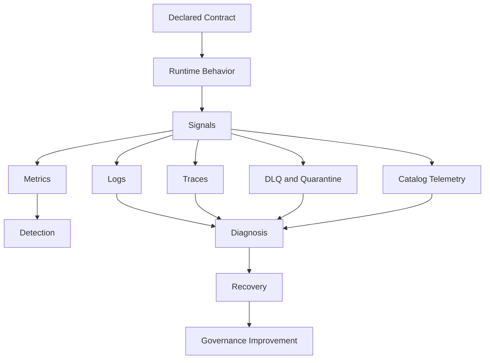
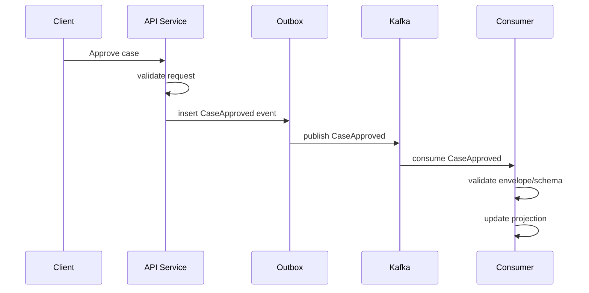
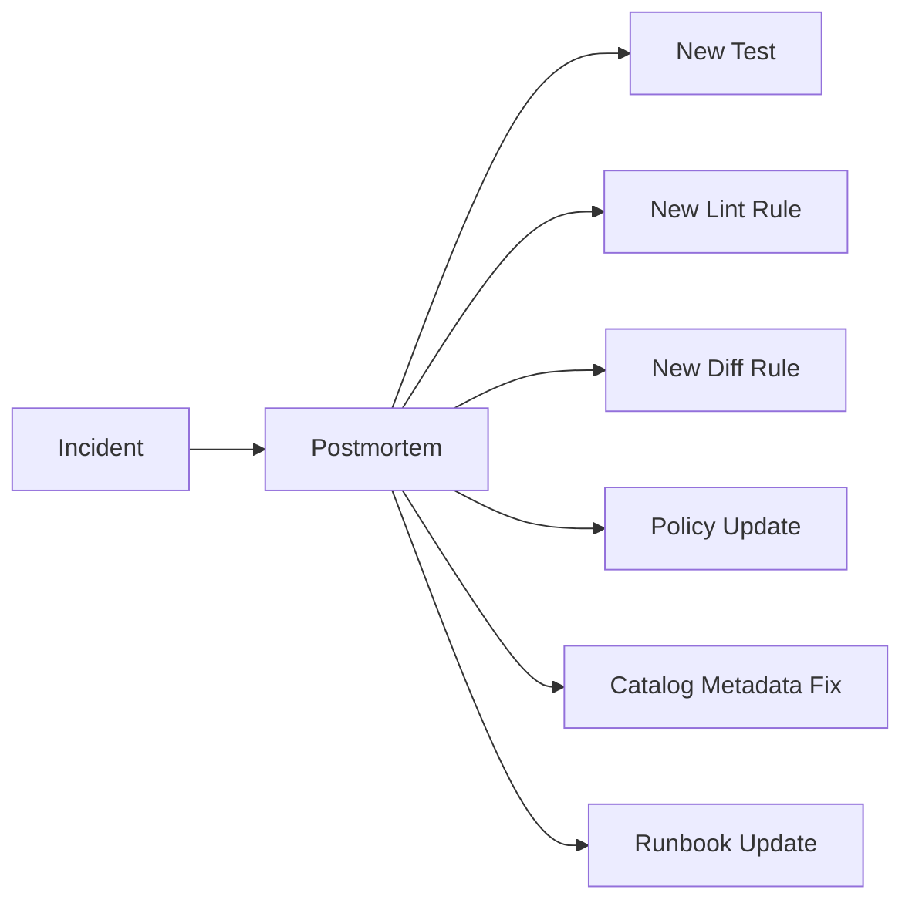

# Part 031 — Contract Observability and Incident Response: Detect, Diagnose, Recover, and Improve

## Tujuan Pembelajaran

Contract governance tidak selesai di CI, registry, atau catalog. Contract harus observable di production.

Pertanyaan production yang harus bisa dijawab cepat:

1. API mana yang mengirim response tidak sesuai OpenAPI?
2. Event mana yang gagal schema validation?
3. Consumer mana yang crash setelah enum baru?
4. Schema version mana yang sedang dipakai producer?
5. Apakah deprecated event masih dikonsumsi?
6. Apakah Kafka key berubah dan menyebabkan out-of-order projection?
7. Apakah DLQ spike karena producer bug atau consumer bug?
8. Apakah registry outage memblokir publish?
9. Apakah replay gagal karena schema lama hilang?
10. Apakah contract incident butuh rollback, quarantine, upcaster, correction event, atau migration?

Setelah part ini, kamu harus mampu:

- mendefinisikan metrics, logs, traces, dashboards, and alerts untuk contract conformance;
- membuat taxonomy contract violation;
- mendeteksi schema, compatibility, registry, API response, event, and DLQ incidents;
- menganalisis consumer lag, unknown event types, invalid schemas, replay failure, and runtime drift;
- mendesain runbook incident;
- menghubungkan postmortem dengan governance improvement;
- membuat SLI/SLO untuk contract platform;
- menghindari observability anti-pattern seperti high-cardinality metrics dan noisy alerts.

---

## 1. Contract Observability Mental Model

Contract observability adalah kemampuan melihat apakah runtime behavior sesuai declared contract.



Observability goals:

1. detect violations quickly;
2. identify artifact, version, producer, consumer, and owner;
3. preserve evidence;
4. reduce diagnosis time;
5. support rollback, redrive, replay, and correction;
6. feed governance rules, tests, and runbooks.

---

## 2. Contract Violation Taxonomy

Stable violation codes are foundational. Jangan hanya log `validation failed`.

### 2.1 API Violations

```text
API_REQUEST_SCHEMA_INVALID
API_RESPONSE_SCHEMA_INVALID
API_UNDOCUMENTED_STATUS_CODE
API_UNDOCUMENTED_ERROR_CODE
API_ERROR_SHAPE_INVALID
API_IDEMPOTENCY_KEY_MISSING
API_IDEMPOTENCY_CONFLICT
API_REQUIRED_HEADER_MISSING
API_SECURITY_SCOPE_MISMATCH
API_DEPRECATED_OPERATION_USED
API_OPERATION_RETIRED_BUT_CALLED
```

### 2.2 Event Violations

```text
EVENT_SCHEMA_INVALID
EVENT_ENVELOPE_INVALID
EVENT_TYPE_UNKNOWN
EVENT_TYPE_UNREGISTERED
EVENT_TOPIC_MISMATCH
EVENT_KEY_MISMATCH
EVENT_SOURCE_INVALID
EVENT_SEQUENCE_GAP
EVENT_OUT_OF_ORDER
EVENT_DUPLICATE
EVENT_REPLAY_UNSAFE
EVENT_CLASSIFICATION_VIOLATION
EVENT_DEPRECATED_CONSUMED
EVENT_RETIRED_PRODUCED
EVENT_SCHEMA_VERSION_UNSUPPORTED
```

### 2.3 Registry Violations

```text
SCHEMA_NOT_FOUND
SCHEMA_ID_RESOLUTION_FAILED
SCHEMA_COMPATIBILITY_REJECTED
SCHEMA_REGISTRY_UNAVAILABLE
SCHEMA_REFERENCE_UNRESOLVED
SCHEMA_UNREGISTERED_PRODUCER
SCHEMA_VERSION_UNSUPPORTED
```

### 2.4 Governance Violations

```text
CONTRACT_OWNER_MISSING
CONTRACT_LIFECYCLE_MISSING
CONTRACT_EXCEPTION_EXPIRED
CONTRACT_DEPRECATED_PAST_SUNSET
CONTRACT_RUNTIME_DRIFT
CONTRACT_CATALOG_METADATA_MISMATCH
CONTRACT_UNKNOWN_CONSUMER_DETECTED
```

Stable codes enable dashboards, alerts, runbooks, and postmortem automation.

---

## 3. Metrics Design

### 3.1 API Metrics

```text
api_contract_request_validation_total
api_contract_response_validation_total
api_contract_violation_total
api_contract_deprecated_usage_total
api_contract_error_code_total
api_contract_undocumented_status_total
api_contract_idempotency_conflict_total
```

Recommended bounded labels:

```text
service
api
operationId
status
violationCode
environment
```

Avoid high-cardinality labels:

```text
requestId
customerId
caseId
userId
rawPathWithIds
correlationId
```

### 3.2 Event Metrics

```text
event_contract_published_total
event_contract_consumed_total
event_contract_violation_total
event_contract_dlq_total
event_contract_quarantine_total
event_contract_duplicate_total
event_contract_sequence_gap_total
event_contract_unknown_type_total
event_contract_schema_validation_total
event_contract_deprecated_usage_total
```

Recommended labels:

```text
service
topic
eventType
schemaRef
consumerGroup
violationCode
environment
```

Avoid:

```text
eventId
aggregateId
customerId
caseId
```

Use logs/traces for those IDs.

### 3.3 Registry Metrics

```text
schema_registry_lookup_total
schema_registry_lookup_latency_seconds
schema_registry_lookup_failure_total
schema_registry_compatibility_check_total
schema_registry_registration_total
schema_registry_cache_hit_total
schema_registry_cache_miss_total
```

Registry is part of platform runtime. Treat it like critical infrastructure.

---

## 4. Logs

Logs capture high-cardinality diagnosis details.

Structured contract violation log:

```json
{
  "level": "WARN",
  "event": "contract_violation",
  "violationCode": "EVENT_SEQUENCE_GAP",
  "service": "case-projection-service",
  "topic": "case-events",
  "eventType": "CaseApproved",
  "schemaRef": "case.CaseApproved:7",
  "eventId": "evt_01J...",
  "aggregateId": "case_01J...",
  "expectedVersion": 18,
  "actualVersion": 20,
  "correlationId": "corr_01J...",
  "action": "quarantined"
}
```

Rules:

1. include eventId/requestId/correlationId in logs;
2. never log raw sensitive payload by default;
3. include action taken: ignored, quarantined, retried, rejected, redriven;
4. include schemaRef/version;
5. include topic/operationId/consumerGroup;
6. include DLQ/quarantine reference.

---

## 5. Traces

Trace contract boundaries:

1. HTTP request enters gateway;
2. service validates request;
3. service persists state;
4. outbox event is created;
5. event is published;
6. consumer receives event;
7. consumer validates envelope/schema;
8. consumer updates projection or triggers side effect;
9. DLQ/quarantine if failed.



Useful trace attributes:

```text
contract.api.operation_id
contract.event.type
contract.schema.ref
contract.violation.code
messaging.destination.name
messaging.kafka.message.key
```

---

## 6. Dashboards

### 6.1 Contract Health Dashboard

Show:

1. total contract violations by service;
2. top violation codes;
3. API response validation failures;
4. event schema validation failures;
5. DLQ/quarantine trend;
6. schema registry failures;
7. deprecated usage;
8. runtime drift findings;
9. high-risk topics/events;
10. open incidents.

### 6.2 Event Stream Dashboard

For each topic/event:

1. publish rate;
2. consume rate by group;
3. lag;
4. DLQ count;
5. schema versions observed;
6. unknown event type count;
7. duplicate count;
8. sequence gap count;
9. replay activity;
10. deprecated consumption.

### 6.3 API Contract Dashboard

For each operation:

1. request validation failures;
2. response validation failures;
3. undocumented status codes;
4. error code distribution;
5. deprecated endpoint usage;
6. client IDs;
7. SDK versions if available.

---

## 7. Alerting

Alert only on actionable signals.

Critical alerts:

1. invalid event published to tier-1 topic;
2. schema registry unavailable in production;
3. DLQ spike on payment/ledger topic;
4. response validation failure for public API above threshold;
5. retired event still produced;
6. Kafka key mismatch detected;
7. schema ID resolution failure during replay.

Warning alerts:

1. deprecated event still consumed after sunset;
2. unknown consumer group appears;
3. new schema version observed before catalog update;
4. response validation shadow failure increasing;
5. unknown enum value seen by old consumer.

Bad alert:

```text
Contract violation happened.
```

Good alert:

```text
EVENT_SCHEMA_INVALID increased to 8% for PaymentCaptured on payment-events.
Owner: payment-platform.
Top producer version: payment-service 4.17.2.
Action: check recent schema change and DLQ sample.
```

---

## 8. Incident Types and Diagnosis

### 8.1 Producer Published Invalid Event

Symptoms:

1. consumer deserialization failures;
2. DLQ spike;
3. schema validation fail;
4. unknown schema ID;
5. projection gaps.

Response:

1. stop or rollback producer;
2. identify bad event range by offset/time/schema;
3. quarantine invalid events;
4. publish correction events or replay fixed events;
5. notify consumers;
6. update producer tests/gates.

### 8.2 Consumer Breaks on New Compatible Schema

Symptoms:

1. one consumer group DLQ spike;
2. schema registry passed;
3. other consumers okay.

Likely cause:

1. consumer strict parser;
2. enum switch no default;
3. unknown field rejection;
4. generated model old.

Response:

1. pause or patch consumer;
2. temporarily suppress new value if producer can;
3. redrive DLQ after fix;
4. add consumer contract tests.

### 8.3 Schema Registry Outage

Symptoms:

1. serializers/deserializers fail lookup;
2. producer publish failure;
3. consumer parse failure for uncached schemas.

Response:

1. check registry SLO;
2. confirm cache behavior;
3. failover/restore registry;
4. pause deployments requiring new schemas;
5. avoid auto-register retry storms.

### 8.4 Deprecated Contract Removed Too Early

Symptoms:

1. clients get 404/410;
2. event stops arriving;
3. consumer workflow starves.

Response:

1. restore old endpoint/event if possible;
2. notify impacted consumers;
3. update catalog usage detection;
4. revise retirement gate.

### 8.5 Kafka Key Change Breaks Projection

Symptoms:

1. out-of-order events;
2. sequence gaps;
3. projection corruption;
4. partition distribution changed.

Response:

1. rollback key change;
2. quarantine affected offsets;
3. rebuild projection from safe point;
4. add key contract tests and diff gate.

---

## 9. Incident Runbook Template

```md
# Contract Incident Runbook

## 1. Identify

- violation code:
- artifact:
- API/event/schema/topic:
- owner:
- severity:
- start time:

## 2. Scope

- affected producers:
- affected consumers:
- schema versions:
- topic offsets/time range:
- request IDs/correlation IDs:
- data classification:

## 3. Stop the Bleeding

- rollback producer?
- disable feature flag?
- pause consumer?
- fail-open/shadow?
- block bad schema?
- quarantine invalid events?

## 4. Preserve Evidence

- DLQ samples:
- logs:
- traces:
- schema versions:
- contract diff:
- deployment version:

## 5. Recover

- redrive DLQ?
- replay events?
- publish correction?
- rebuild projection?
- restore schema?
- notify consumers?

## 6. Prevent

- new test:
- new lint rule:
- new diff rule:
- new policy:
- catalog metadata update:
- owner/action items:
```

---

## 10. DLQ Analysis

DLQ is evidence, not trash.

Group DLQ by:

1. failure code;
2. event type;
3. producer version;
4. schemaRef;
5. consumer group;
6. topic/partition;
7. time window.

DLQ spike questions:

1. Did producer deploy recently?
2. Did schema version change?
3. Did consumer deploy recently?
4. Is failure deserialization, schema validation, or domain state?
5. Are all consumers affected or one group?
6. Does invalid event share producer version?
7. Is event out-of-order or duplicate?
8. Is registry lookup failing?
9. Is DLQ itself failing?

Redrive only after:

1. root cause fixed;
2. idempotency verified;
3. ordering implications considered;
4. side effects safe;
5. consumer can handle event;
6. redrive rate controlled;
7. audit record created.

---

## 11. Consumer Lag and Contract Incidents

Consumer lag can hide compatibility incidents.

Scenario:

1. producer publishes new event version at 10:00;
2. consumer is lagging 6 hours;
3. failure starts at 16:00 when it reaches new events.

Do not correlate incident only with wall-clock deploy time. Use:

1. event `publishedAt`;
2. Kafka offset;
3. schemaRef;
4. producer version;
5. consumer lag;
6. consumer processed timestamp.

Metrics:

```text
consumer_lag
event_published_at_to_processed_at_latency
schema_version_processed_by_consumer
```

---

## 12. Replay Observability

Replay should be observable separately from live processing.

Metrics:

```text
event_replay_started_total
event_replay_completed_total
event_replay_failed_total
event_replay_events_processed_total
event_replay_side_effect_skipped_total
event_replay_schema_unsupported_total
```

Replay logs must include:

1. replay ID;
2. source topic/offset/time range;
3. event types;
4. schema versions;
5. side-effect mode;
6. result.

Replay failure is often a compatibility failure discovered late.

---

## 13. Schema Version Observability

Track schema versions observed in runtime.

Producer metric:

```text
event_schema_version_published_total{eventType="CaseApproved", schemaRef="case.CaseApproved:7"}
```

Consumer metric:

```text
event_schema_version_consumed_total{consumerGroup="case-projection", schemaRef="case.CaseApproved:7"}
```

Use for:

1. migration tracking;
2. old schema retirement;
3. replay readiness;
4. incident diagnosis;
5. consumer lag understanding.

---

## 14. Contract SLOs

Possible platform SLOs:

### 14.1 Registry SLO

```text
99.9% schema lookup success over 30 days.
p95 schema lookup latency < 50ms.
```

### 14.2 Contract Validation SLO

```text
99.99% of produced tier-1 events validate against registered schema.
```

### 14.3 Catalog Freshness SLO

```text
95% of contract metadata changes visible in catalog within 10 minutes.
```

### 14.4 Deprecation SLO

```text
0 retired artifacts with active runtime usage.
```

### 14.5 Incident Detection SLO

```text
Tier-1 contract violations alert within 5 minutes.
```

SLOs must be tied to business risk.

---

## 15. Java Observability Implementation

### 15.1 Metrics Wrapper

```java
public final class ContractMetrics {
    private final MeterRegistry registry;

    public void recordViolation(String service, String artifact, String violationCode) {
        Counter.builder("contract_violation_total")
            .tag("service", service)
            .tag("artifact", artifact)
            .tag("violationCode", violationCode)
            .register(registry)
            .increment();
    }
}
```

Keep tags bounded.

### 15.2 Structured Logging

```java
log.warn("contract violation",
    kv("violationCode", violation.code()),
    kv("eventType", event.metadata().eventType()),
    kv("eventId", event.metadata().eventId()),
    kv("correlationId", event.metadata().correlationId()),
    kv("action", "quarantined")
);
```

### 15.3 Trace Attributes

```java
Span.current().setAttribute("contract.event.type", event.metadata().eventType());
Span.current().setAttribute("contract.schema.ref", event.metadata().schemaRef());
Span.current().setAttribute("contract.violation.code", violation.code());
```

---

## 16. Postmortem Questions

For every contract incident:

1. What contract promise was violated?
2. Was artifact wrong, implementation wrong, or consumer assumption wrong?
3. Did CI catch it?
4. Did registry compatibility pass? Why insufficient?
5. Did catalog know impacted consumers?
6. Did runtime observability detect quickly?
7. Was DLQ evidence sufficient?
8. Could rollback/replay recover safely?
9. What test/lint/diff/policy should be added?
10. What ownership/lifecycle metadata was missing?

Postmortem output should update the governance system.



---

## 17. Anti-Patterns

1. No stable violation codes.
2. Metrics with `eventId` label.
3. DLQ without original context.
4. Logs with sensitive payload.
5. Alerts without owner.
6. Catalog not linked from alert.
7. Runtime signals not feeding governance.
8. No replay metrics.
9. Only producer metrics, no consumer visibility.
10. No schema version tracking.
11. Deprecated usage invisible.
12. Contract incident postmortems produce reminders, not rules/tests.

---

## 18. Practice Lab

### Lab 1 — Metrics Design

Define metrics for event `PaymentCaptured` including publish, consume, validation failure, DLQ, duplicate, schema version, and deprecated usage.

### Lab 2 — Incident Runbook

Write runbook for `EVENT_SCHEMA_INVALID` spike on `payment-events`.

### Lab 3 — DLQ Analysis

Given DLQ samples all have schemaRef `PaymentCaptured:9` and producer version `4.17.2`, design diagnosis steps.

### Lab 4 — Consumer Lag

Consumer fails 6 hours after producer deploy. Explain how lag changes investigation.

### Lab 5 — Postmortem Action

Incident: consumer crashed on new enum value. Propose tests, lint, diff, and policy updates.

### Lab 6 — Dashboard

Design dashboard for deprecated event usage and schema version migration.

---

## 19. Senior Engineer Heuristics

1. **Contract conformance must be observable in production.**
2. **Stable violation codes are the foundation.**
3. **Metrics show pattern; logs show details; traces show flow.**
4. **DLQ is evidence, not trash.**
5. **Consumer lag changes incident timelines.**
6. **Track schema versions published and consumed.**
7. **Deprecated usage must be visible.**
8. **Registry health is platform health.**
9. **Avoid high-cardinality metrics.**
10. **Runtime drift detection closes the governance loop.**
11. **Incident runbooks should start from artifact ownership.**
12. **Redrive requires idempotency and ordering analysis.**
13. **Postmortems should produce tests/rules, not only reminders.**
14. **Observability without action ownership is noise.**
15. **A top-tier platform learns from every contract incident.**

---

## 20. Summary

Contract observability and incident response ensure that API/event/schema contracts are not only designed and tested, but monitored and improved in production. Metrics, logs, traces, DLQ analysis, schema version telemetry, consumer lag, catalog context, and runbooks work together.

Main takeaways:

1. define stable violation taxonomy;
2. instrument API, event, registry, DLQ, replay, and governance signals;
3. build dashboards for contract health, deprecation, schema migration, and DLQ;
4. alert only on actionable risk;
5. preserve evidence for diagnosis;
6. use catalog for ownership and impact analysis;
7. track schema versions and consumer lag;
8. redrive/replay carefully;
9. postmortems must update tests, lint rules, diff rules, policies, and runbooks;
10. contract engineering becomes mature when production incidents improve the governance system.

Part berikutnya adalah final capstone: membangun Java Contract Governance Platform untuk API dan event contracts end-to-end.
