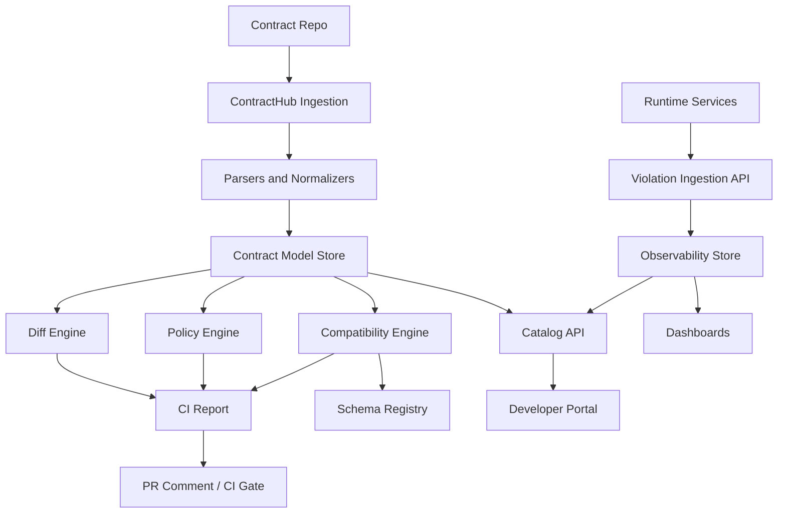

# Part 032 — Capstone: Build a Java Contract Governance Platform for APIs and Events

## Tujuan Pembelajaran

Ini adalah final part.

Capstone ini menggabungkan seluruh seri menjadi satu proyek besar:

> Build a Java Contract Governance Platform for API contracts, event contracts, schema governance, compatibility, catalog, runtime enforcement, and observability.

Tujuannya bukan membuat toy project. Tujuannya membuat blueprint platform engineering yang realistis untuk enterprise.

Setelah menyelesaikan capstone ini, kamu harus mampu menunjukkan skill top-tier dalam:

1. contract-first architecture;
2. API/event/schema governance;
3. Java platform engineering;
4. schema registry integration;
5. OpenAPI/AsyncAPI processing;
6. Avro/Protobuf/JSON Schema handling;
7. Kafka contract modeling;
8. diff and compatibility classification;
9. CI/CD governance gates;
10. catalog and lineage;
11. runtime enforcement;
12. observability and incident response;
13. multi-team operating model.

---

## 1. Capstone Goal

Build platform named:

```text
ContractHub
```

ContractHub provides:

1. contract repository ingestion;
2. OpenAPI validation and diff;
3. AsyncAPI validation and diff;
4. Avro compatibility checks;
5. Protobuf breaking-change checks;
6. JSON Schema validation/diff;
7. Kafka topic contract governance;
8. policy-as-code engine;
9. schema registry integration;
10. catalog API and UI-ready data model;
11. consumer registration;
12. lifecycle management;
13. CI report generation;
14. runtime violation ingestion;
15. governance dashboards;
16. incident runbook links.

---

## 2. Target Architecture



Core modules:

```text
contracthub/
├── contracthub-core
├── contracthub-openapi
├── contracthub-asyncapi
├── contracthub-avro
├── contracthub-protobuf
├── contracthub-jsonschema
├── contracthub-kafka
├── contracthub-policy
├── contracthub-registry
├── contracthub-catalog
├── contracthub-runtime
├── contracthub-cli
└── contracthub-app
```

---

## 3. Domain Model

### 3.1 ContractArtifact

```java
public record ContractArtifact(
    ArtifactId id,
    ArtifactType type,
    String name,
    String ownerTeam,
    LifecycleState lifecycle,
    DataClassification dataClassification,
    URI sourceUri,
    Instant updatedAt
) {}
```

ArtifactType:

```java
public enum ArtifactType {
    OPENAPI,
    ASYNCAPI,
    AVRO,
    PROTOBUF,
    JSON_SCHEMA,
    KAFKA_TOPIC,
    EVENT_TYPE,
    API_OPERATION
}
```

Lifecycle:

```java
public enum LifecycleState {
    DRAFT,
    IN_REVIEW,
    APPROVED,
    PUBLISHED,
    STABLE,
    EXPERIMENTAL,
    DEPRECATED,
    RETIRED,
    ARCHIVED
}
```

### 3.2 ContractChange

```java
public record ContractChange(
    ChangeId id,
    ArtifactId artifactId,
    ArtifactType artifactType,
    String path,
    ChangeType changeType,
    JsonNode oldValue,
    JsonNode newValue,
    CompatibilityClass compatibilityClass,
    Confidence confidence,
    List<String> notes
) {}
```

CompatibilityClass:

```java
public enum CompatibilityClass {
    SAFE,
    DANGEROUS,
    BREAKING,
    SEMANTIC_REVIEW_REQUIRED,
    BLOCKER
}
```

### 3.3 GovernanceDecision

```java
public record GovernanceDecision(
    boolean allowed,
    RiskBand riskBand,
    List<PolicyViolation> violations,
    List<RequiredAction> requiredActions,
    List<ReviewerRole> requiredReviewers
) {}
```

---

## 4. Repository Layout for Demo

```text
demo-contracts/
├── openapi/
│   └── customer-api.yaml
├── asyncapi/
│   └── case-events.yaml
├── schemas/
│   ├── avro/
│   │   └── case/CaseApproved.avsc
│   ├── protobuf/
│   │   └── customer/customer_events.proto
│   └── json-schema/
│       └── customer/CustomerActivated.schema.json
├── kafka/
│   └── topics.yaml
├── lifecycle/
│   └── artifacts.yaml
├── examples/
│   └── case-approved-v1.json
├── decisions/
│   └── CDR-template.md
└── policy/
    └── contract-policy.yaml
```

Use this repo as input for ContractHub CLI.

---

## 5. CLI Commands

Build CLI:

```bash
contracthub validate ./demo-contracts
contracthub diff ./demo-contracts --baseline ./released-contracts
contracthub check ./demo-contracts --baseline ./released-contracts
contracthub report ./demo-contracts --format markdown
contracthub catalog build ./demo-contracts
```

Expected output:

```text
Overall risk: HIGH
Violations:
- KAFKA_KEY_CHANGE_REQUIRES_CDR
- AVRO_ADDED_FIELD_WITHOUT_DEFAULT
Required reviewers:
- event-platform
- contract-governance
```

---

## 6. Validation Engine

Interface:

```java
public interface ContractValidator {
    ArtifactType supports();
    ValidationResult validate(Path artifactPath);
}
```

ValidationResult:

```java
public record ValidationResult(
    ArtifactId artifactId,
    boolean valid,
    List<ValidationMessage> messages
) {}
```

ValidationMessage:

```java
public record ValidationMessage(
    Severity severity,
    String code,
    String path,
    String message
) {}
```

Validators:

1. OpenApiValidator;
2. AsyncApiValidator;
3. AvroSchemaValidator;
4. ProtobufValidator;
5. JsonSchemaValidator;
6. KafkaTopicContractValidator;
7. LifecycleMetadataValidator.

Minimum behavior:

- parse file;
- ensure required metadata;
- resolve references where possible;
- report actionable errors.

---

## 7. Normalizer

Create normalized model.

```java
public interface ContractNormalizer {
    ArtifactType supports();
    NormalizedArtifact normalize(Path artifactPath);
}
```

NormalizedArtifact:

```java
public record NormalizedArtifact(
    ArtifactId id,
    ArtifactType type,
    JsonNode canonicalModel,
    Map<String, String> metadata
) {}
```

Canonicalization:

1. sort object properties;
2. resolve local refs where practical;
3. remove non-semantic formatting;
4. keep descriptions for semantic hints;
5. preserve source paths.

---

## 8. Diff Engine

```java
public interface ContractDiffEngine {
    List<ContractChange> diff(
        NormalizedArtifact baseline,
        NormalizedArtifact candidate
    );
}
```

Implement format-specific engines:

1. OpenApiDiffEngine;
2. AsyncApiDiffEngine;
3. AvroDiffEngine;
4. ProtobufDiffEngine;
5. JsonSchemaDiffEngine;
6. KafkaContractDiffEngine;
7. LifecycleDiffEngine.

Example rule:

```java
public final class KafkaKeyChangeRule implements DiffRule {
    @Override
    public Optional<ContractChange> evaluate(JsonNode oldModel, JsonNode newModel) {
        String oldKey = oldModel.at("/key/expression").asText(null);
        String newKey = newModel.at("/key/expression").asText(null);

        if (!Objects.equals(oldKey, newKey)) {
            return Optional.of(new ContractChange(
                ChangeId.next(),
                artifactId,
                ArtifactType.KAFKA_TOPIC,
                "/key/expression",
                ChangeType.KAFKA_KEY_CHANGED,
                TextNode.valueOf(oldKey),
                TextNode.valueOf(newKey),
                CompatibilityClass.BREAKING,
                Confidence.HIGH,
                List.of("Kafka key change affects partitioning and ordering.")
            ));
        }

        return Optional.empty();
    }
}
```

---

## 9. Policy Engine

Policy input:

1. changes;
2. artifact metadata;
3. catalog context;
4. consumer impact;
5. decision records;
6. exception records.

Policy output:

1. allowed or blocked;
2. violations;
3. required actions;
4. required reviewers;
5. risk band.

```java
public interface PolicyEngine {
    GovernanceDecision evaluate(PolicyContext context);
}
```

Example policy:

```yaml
rules:
  - id: KAFKA_KEY_CHANGE_REQUIRES_CDR
    when:
      changeType: KAFKA_KEY_CHANGED
    require:
      - decisionRecord
      - migrationPlan
      - reviewer:event-platform
    severity: error

  - id: AVRO_ADDED_FIELD_REQUIRES_DEFAULT
    when:
      changeType: AVRO_FIELD_ADDED_WITHOUT_DEFAULT
    severity: blocker

  - id: STABLE_ARTIFACT_REQUIRES_OWNER
    when:
      lifecycle: STABLE
      missing: ownerTeam
    severity: error
```

---

## 10. Compatibility Engine

```java
public interface CompatibilityChecker {
    ArtifactType supports();
    CompatibilityResult check(
        NormalizedArtifact baseline,
        NormalizedArtifact candidate,
        CompatibilityMode mode
    );
}
```

Implement minimum rules:

1. Avro field added without default;
2. Protobuf field number reuse;
3. JSON Schema added required property;
4. OpenAPI removed path/operation/response field;
5. Kafka key/retention change.

Later integrate real libraries and registries.

---

## 11. Schema Registry Integration

Interface:

```java
public interface SchemaRegistryGateway {
    Optional<RegisteredSchema> findLatest(ArtifactId artifactId);
    CompatibilityResult checkCompatibility(ArtifactId artifactId, String schemaContent);
    RegisteredSchema register(ArtifactId artifactId, String schemaContent, ArtifactMetadata metadata);
}
```

Implementation modes:

1. mock/in-memory for capstone;
2. HTTP adapter for actual registry;
3. file-based registry for local demo.

Keep registry interface separate from domain logic.

---

## 12. Catalog Module

Catalog entities:

1. service;
2. API;
3. operation;
4. event type;
5. channel/topic;
6. schema artifact;
7. consumer;
8. lifecycle;
9. deprecation record;
10. runtime signal.

Catalog API examples:

```http
GET /catalog/artifacts
GET /catalog/events/{eventType}
GET /catalog/topics/{topic}
GET /catalog/consumers/{consumerId}
POST /catalog/consumptions
GET /catalog/impact/{artifactId}
```

Spring controller sketch:

```java
@RestController
@RequestMapping("/catalog")
public class CatalogController {
    private final CatalogService catalogService;

    @GetMapping("/events/{eventType}")
    public EventCatalogEntry getEvent(@PathVariable String eventType) {
        return catalogService.getEvent(eventType);
    }
}
```

---

## 13. Runtime Violation Ingestion

Services report violations.

API:

```http
POST /runtime/violations
```

Body:

```json
{
  "violationCode": "EVENT_SCHEMA_INVALID",
  "service": "case-projection-service",
  "artifactId": "com.acme.case.events.CaseApproved",
  "eventType": "CaseApproved",
  "topic": "case-events",
  "consumerGroup": "case-projection-service",
  "schemaRef": "case.CaseApproved:7",
  "occurredAt": "2026-06-29T06:00:00Z",
  "action": "quarantined"
}
```

Use this to power dashboards and catalog runtime context.

---

## 14. Report Generator

Generate Markdown and JSON.

Markdown structure:

```md
# ContractHub Report

Overall Risk: High

## Summary

Changed artifacts...

## Breaking Changes

...

## Dangerous Changes

...

## Policy Violations

...

## Required Reviewers

...

## Consumer Impact

...
```

JSON structure for CI:

```json
{
  "overallRisk": "HIGH",
  "allowed": false,
  "changes": [],
  "violations": [],
  "requiredActions": [],
  "requiredReviewers": []
}
```

---

## 15. Minimum Viable Capstone

Build MVP with:

1. read contract repo;
2. parse lifecycle metadata;
3. validate JSON/YAML exists and required metadata;
4. implement Kafka topic diff;
5. implement Avro added-field-without-default check;
6. implement Protobuf field-number reuse check on simplified descriptor model;
7. implement OpenAPI removed-path and required-request-field check;
8. generate Markdown report;
9. expose catalog endpoint for event type;
10. ingest runtime violation;
11. show simple dashboard JSON.

MVP success:

```bash
contracthub check demo-contracts --baseline released-contracts
```

returns:

```text
BLOCKED: Avro field approvalChannel added without default.
HIGH: Kafka key changed for case-events.
```

---

## 16. Advanced Capstone

Add:

1. real OpenAPI parser;
2. real AsyncAPI parser;
3. schema registry integration;
4. Protobuf descriptor diff;
5. JSON Schema compatibility analysis;
6. consumer inventory;
7. risk scoring;
8. policy-as-code YAML;
9. PR comment integration;
10. runtime drift detection from Kafka/admin API;
11. metrics dashboards;
12. generated Java compile checks;
13. deprecation monitor;
14. lineage graph.

---

## 17. End-to-End Scenarios

### Scenario 1 — Safe API Change

Change:

```text
Add optional response field customer.preferredName.
```

Expected:

1. OpenAPI diff detects optional response field added;
2. classification SAFE;
3. generated client compiles;
4. examples updated;
5. policy passes;
6. report says low risk;
7. owner review enough.

### Scenario 2 — Dangerous Event Change

Change:

```text
Add enum value MANUAL_REVIEW to KycStatus.
```

Expected:

1. schema diff detects enum added;
2. classification DANGEROUS;
3. policy requires decision record;
4. consumer inventory lists impacted consumers;
5. unknown enum tests required;
6. report blocks until evidence provided.

### Scenario 3 — Breaking Kafka Key Change

Change:

```text
case-events key changes from caseId to eventId.
```

Expected:

1. Kafka diff detects key change;
2. classification BREAKING;
3. policy requires architecture review and migration plan;
4. catalog shows consumers;
5. report blocks.

### Scenario 4 — Runtime Violation

Runtime sends:

```json
{
  "violationCode": "EVENT_SCHEMA_INVALID",
  "eventType": "PaymentCaptured",
  "topic": "payment-events"
}
```

Expected:

1. violation stored;
2. catalog event page shows recent violations;
3. dashboard increments;
4. owner identified;
5. alert created if threshold exceeded;
6. runbook link shown.

---

## 18. Testing Strategy

### 18.1 Unit Tests

1. parser;
2. normalizer;
3. diff rules;
4. policy rules;
5. risk scoring;
6. report rendering.

### 18.2 Integration Tests

1. contract repo fixture -> report;
2. registry mock integration;
3. catalog API;
4. runtime violation ingestion;
5. Postgres persistence if used.

### 18.3 Golden Tests

Store expected reports:

```text
fixtures/reports/kafka-key-change.expected.md
```

Compare generated output to expected.

### 18.4 Regression Tests from Incidents

Every real contract incident should become a fixture.

---

## 19. Suggested Tech Stack

Java platform:

1. Java 21+;
2. Spring Boot;
3. Jackson;
4. Maven or Gradle;
5. JUnit 5;
6. AssertJ;
7. Testcontainers;
8. Micrometer.

Optional integrations:

1. OpenAPI parser;
2. AsyncAPI parser/validator;
3. Apache Avro;
4. Protobuf compiler/descriptor tooling;
5. JSON Schema validator;
6. Kafka clients;
7. schema registry client;
8. ArchUnit for enforcing paved-road usage.

Architecture matters more than brand choice.

---

## 20. Portfolio Narrative

When explaining this project in interview or promotion packet:

> “I built a contract governance platform that parses API/event/schema artifacts, normalizes them, detects structural and operational diffs, classifies compatibility risk, enforces policy-as-code, integrates with schema registry and catalog, and ingests runtime contract violations. It prevents unsafe changes like Avro required field additions, Protobuf tag reuse, Kafka key changes, and undocumented API breaking changes before they reach production.”

This demonstrates senior/platform-level thinking.

---

## 21. What Top 1% Looks Like Here

Top-tier engineer does not only know OpenAPI or Kafka.

They can connect:

1. API semantics;
2. event semantics;
3. schema evolution;
4. runtime behavior;
5. generated code;
6. CI/CD;
7. registry;
8. catalog;
9. observability;
10. operating model;
11. incident learning.

They build systems where correct behavior is easier than incorrect behavior.

---

## 22. 20-Hour Deliberate Practice Plan

Based on Kaufman-style rapid skill acquisition:

### Hours 1-3 — Read and Model

- review this series;
- draw API/event/schema taxonomy;
- model one domain’s contracts.

### Hours 4-6 — Build Contract Repo

- create OpenAPI;
- create AsyncAPI;
- create Avro/Protobuf/JSON Schema;
- create Kafka topic metadata;
- add examples.

### Hours 7-10 — Build Diff MVP

- parse artifacts;
- normalize;
- implement 10 diff rules;
- generate report.

### Hours 11-13 — Add Policy

- write policy YAML;
- enforce CDR/migration requirements;
- add risk classification.

### Hours 14-16 — Add Catalog

- build catalog model;
- expose REST endpoints;
- register consumers;
- show impact.

### Hours 17-18 — Add Runtime Signals

- ingest violations;
- show dashboard data;
- add metrics/logging design.

### Hours 19-20 — Simulate Incidents

- Avro field without default;
- Protobuf tag reuse;
- Kafka key change;
- new enum breaks consumer;
- deprecated event still used.

Write postmortem and update rules.

---

## 23. Final Capstone Deliverables

Produce:

1. architecture diagram;
2. contract repo fixture;
3. Java modules;
4. CLI;
5. REST API;
6. diff report examples;
7. policy YAML;
8. catalog sample data;
9. runtime violation ingestion;
10. test suite;
11. runbook;
12. README;
13. portfolio write-up.

README sections:

```md
# ContractHub

## Problem

## Architecture

## Supported Artifacts

## Diff and Compatibility Rules

## Policy-as-Code

## Catalog

## Runtime Enforcement Signals

## Demo Scenarios

## How to Run

## Design Trade-offs

## Future Work
```

---

## 24. Future Enhancements

1. real schema registry adapters;
2. GitHub PR bot;
3. Backstage plugin;
4. OpenTelemetry integration;
5. Kafka Admin drift detector;
6. graph lineage store;
7. SDK compatibility checker;
8. AI-assisted semantic change review;
9. consumer field-usage analysis;
10. automated migration guide generation;
11. contract incident correlation;
12. policy simulation before rollout.

---

## 25. Final Self-Assessment

You are ready if you can answer:

1. Is this event really a fact?
2. What compatibility direction matters?
3. What breaks old consumers?
4. Can new consumers replay old data?
5. What is the Kafka key and why?
6. What happens on duplicate delivery?
7. What schema version is in production?
8. Who owns this contract?
9. Is this field PII?
10. What is the deprecation plan?
11. What runtime metric detects violation?
12. What diff rule would catch this next time?
13. What is safe to automate?
14. What needs human semantic review?
15. What is the migration path?

If yes, you have crossed from framework user to contract platform engineer.

---

## 26. Series Closure

This series covered:

1. Kaufman skill map;
2. contract taxonomy;
3. invariants;
4. source-of-truth strategy;
5. OpenAPI;
6. HTTP semantics;
7. request/response design;
8. error contracts;
9. API versioning;
10. OpenAPI in Java;
11. API client engineering;
12. API contract testing;
13. event mental model;
14. event envelope;
15. AsyncAPI;
16. Kafka contracts;
17. Avro;
18. Protobuf/gRPC;
19. JSON Schema;
20. event versioning;
21. event contract testing;
22. schema registry architecture;
23. compatibility governance;
24. schema lifecycle;
25. review playbook;
26. governance automation;
27. contract diff;
28. catalog;
29. multi-team operating model;
30. runtime enforcement;
31. observability and incident response;
32. capstone platform.

---

## 27. Final Heuristics

1. **Contracts are promises under change.**
2. **Schema is not the whole contract.**
3. **Compatibility is directional, temporal, semantic, operational, and social.**
4. **Events are facts declared by authorities.**
5. **Kafka key is contract.**
6. **Generated Java code is consumer surface.**
7. **Registry is governance infrastructure.**
8. **Catalog is discovery plus impact analysis.**
9. **Diff engine turns change into risk.**
10. **Policy-as-code scales governance.**
11. **Runtime enforcement catches reality drift.**
12. **Observability makes contract quality operational.**
13. **Deprecation without telemetry is hope.**
14. **Incidents should become rules, tests, and runbooks.**
15. **Top engineers build systems where safe evolution is easy and unsafe change is visible.**

---

## Final Summary

The final goal is not to memorize every tool. The goal is to develop contract judgment:

- know what promise is being made;
- know who relies on it;
- know how it evolves;
- know how it fails;
- know how to detect failure;
- know how to recover;
- know how to improve the system after learning.

That is the difference between writing APIs/events and engineering an enterprise contract platform.

**Status seri: selesai. Ini adalah Part 032 dari 32.**
