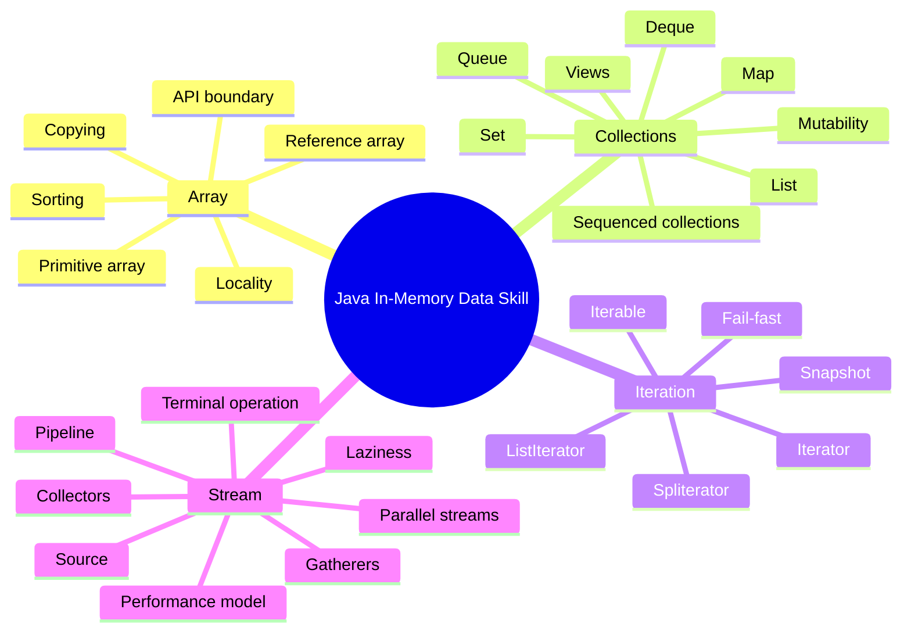
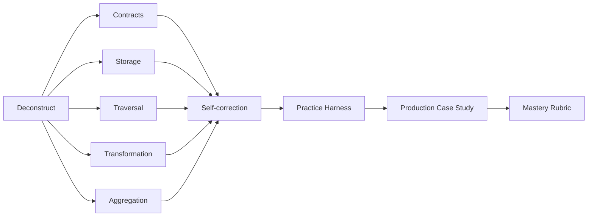
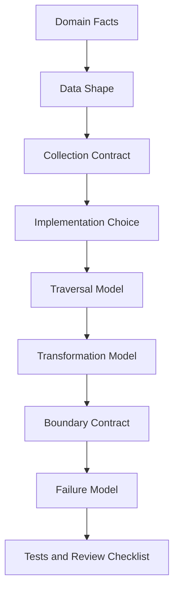
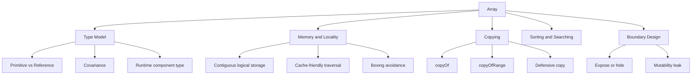
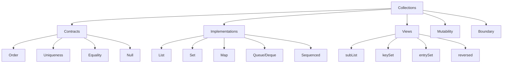
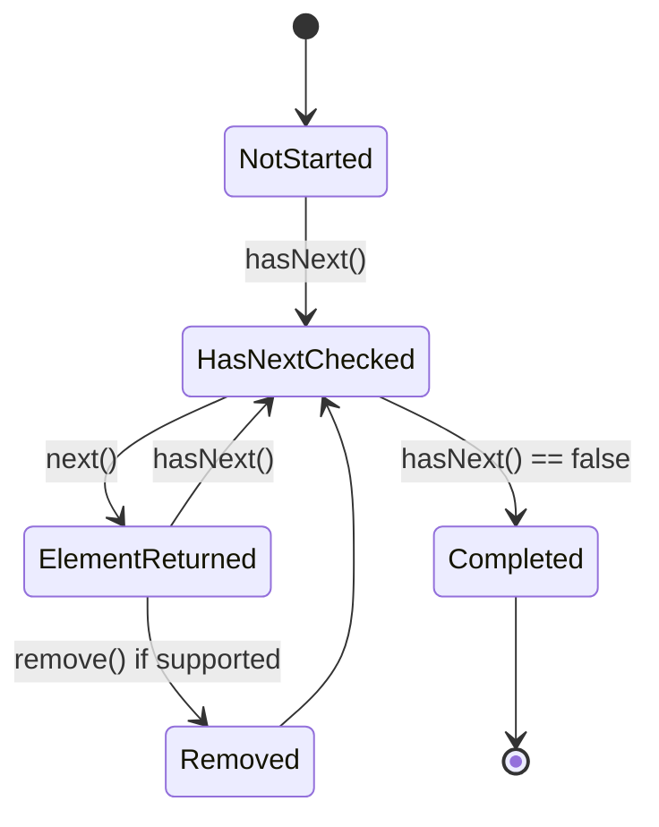
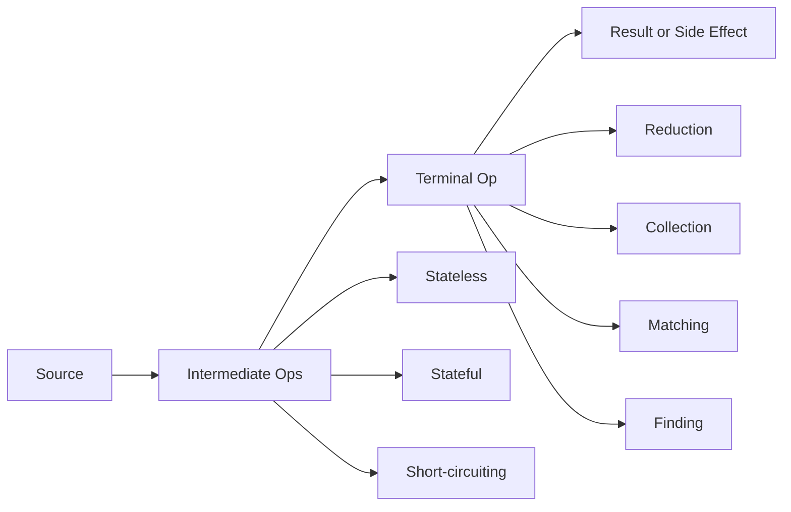
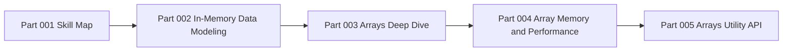

# Part 001 — Kaufman Skill Map: Deconstructing Java Collections Mastery

## 1. Tujuan Part Ini

Part ini bukan pembahasan API satu per satu. Part ini adalah **peta skill**: bagaimana kita akan menguasai Java Array, Collections, Iterator/Iterable, Spliterator, dan Stream dengan pendekatan efektif ala Josh Kaufman dalam *The First 20 Hours*.

Target akhirnya bukan sekadar bisa menulis:

```java
List<String> names = users.stream()
    .map(User::name)
    .toList();
```

Target sebenarnya adalah mampu menjawab pertanyaan desain seperti ini dengan defensible reasoning:

- Apakah data ini perlu `List`, `Set`, `Map`, `Deque`, array, `Stream`, atau `Iterable`?
- Apakah caller boleh memodifikasi hasil yang kita return?
- Apakah order penting secara domain, hanya kebetulan implementasi, atau tidak relevan?
- Apakah duplicate valid, error, atau harus digabung?
- Apakah operasi ini traversal satu kali, transformasi pipeline, indexing, grouping, diffing, atau validation accumulation?
- Apakah stream lebih jelas daripada loop, atau justru menyembunyikan state dan failure?
- Apakah collection ini snapshot, live view, unmodifiable view, immutable value, atau mutable working set?
- Apakah key pada `Map` stabil terhadap `equals` dan `hashCode` selama berada di dalam map?
- Apakah parallel stream aman secara associativity, side effect, ordering, dan cost model?

Dengan kata lain, seri ini melatih kemampuan **collection reasoning**, bukan hanya “hafal class Java”.

---

## 2. Kenapa Materi Ini Layak Dipelajari Sangat Dalam

Di production code, collection hampir selalu berada di jalur kritis:

- input request dinormalisasi menjadi collection;
- data database dimaterialisasi menjadi collection;
- event payload dipetakan menjadi collection;
- validation mengumpulkan error collection;
- rule engine melakukan filtering dan grouping;
- authorization mengecek membership;
- workflow engine menilai state transition list;
- reporting dan reconciliation melakukan diff antara snapshot lama dan baru;
- cache menyimpan map dari key ke aggregate;
- API mengembalikan list, set, map, atau stream-like result.

Bug collection sering terlihat sederhana, tetapi dampaknya dalam enterprise system bisa besar:

- record hilang karena duplicate key saat `Collectors.toMap`;
- audit output berubah urutan karena memakai `HashSet` ketika order domain penting;
- memory leak karena `subList` atau view mempertahankan backing collection;
- `ConcurrentModificationException` muncul sporadis karena mutation selama iteration;
- mutable object dipakai sebagai key `HashMap`, lalu lookup gagal setelah field berubah;
- stream pipeline terlihat “functional”, tetapi diam-diam melakukan side effect;
- unmodifiable collection dikira immutable, padahal elemen di dalamnya mutable;
- endpoint return internal list sehingga caller bisa merusak invariant aggregate;
- `parallelStream()` dipakai sebagai shortcut optimisasi dan justru memperlambat atau merusak correctness.

Collections adalah lapisan tempat **domain correctness**, **API contract**, **performance**, dan **runtime behavior** bertemu. Karena itu, engineer yang kuat di area ini biasanya jauh lebih efektif saat membaca dan mendesain sistem Java besar.

---

## 3. Scope Seri Ini

Seri ini membahas empat keluarga besar:



Kita tidak akan mengulang DSA dari nol. Misalnya, kita tidak akan membahas ulang tree, graph, heap, big-O dasar, atau hash table sebagai struktur data akademis secara panjang. Yang akan kita bahas adalah **bagaimana Java Collections Framework dan Stream API merepresentasikan, membatasi, dan mengekspos perilaku tersebut di production code**.

---

## 4. Baseline Fakta Java yang Menjadi Fondasi Seri Ini

Beberapa fakta API penting yang menjadi dasar:

1. `Collection<E>` adalah root interface dalam collection hierarchy untuk group of objects, dan ia extends `Iterable<E>`.
2. JDK tidak menyediakan direct implementation dari `Collection`; implementasi umum berada di subinterface seperti `List`, `Set`, dan `Queue`.
3. Sebagian operasi collection bersifat optional operation dan dapat melempar `UnsupportedOperationException`.
4. Collection dapat memiliki restriction terhadap null, tipe elemen, order, duplicate, mutability, serializability, dan synchronization policy.
5. `Collection` menyediakan `iterator()`, `spliterator()`, `stream()`, dan `parallelStream()` sebagai jembatan traversal dan pipeline processing.
6. Banyak collection API memiliki view semantics: view tidak selalu menyimpan data sendiri, melainkan bergantung pada backing collection.
7. JDK 21 memperkenalkan sequenced collection interfaces untuk merepresentasikan collection yang punya encounter order dan operasi first/last/reversed secara eksplisit.
8. JDK modern menyediakan Gatherer sebagai ekstensi Stream untuk custom intermediate operation.

Fakta-fakta ini akan kita gunakan sebagai dasar reasoning di seluruh seri, bukan sebagai trivia.

---

## 5. Framework Kaufman untuk Seri Ini

Josh Kaufman mengusulkan pendekatan belajar cepat yang intinya dapat dipadatkan menjadi empat aktivitas:

1. **Deconstruct the skill** — pecah skill menjadi subskill kecil.
2. **Learn enough to self-correct** — pelajari cukup teori agar bisa mendeteksi kesalahan sendiri.
3. **Remove practice barriers** — hilangkan hambatan latihan.
4. **Practice deliberately** — latihan terarah minimal sekitar 20 jam.

Untuk topik ini, kita adaptasikan menjadi:



Tujuan dari framework ini adalah menghindari dua jebakan:

- terlalu cepat masuk ke API tanpa mental model;
- terlalu lama di teori tanpa kemampuan memilih solusi di kode nyata.

---

## 6. Skill Target yang Jelas

Skill target seri ini:

> Mampu mendesain, memilih, mengevaluasi, dan mengimplementasikan pengolahan data in-memory di Java menggunakan arrays, collections, iterators, spliterators, streams, collectors, dan gatherers dengan correctness, readability, performance, dan API contract yang defensible.

Skill ini bisa dipecah menjadi beberapa outcome.

### 6.1 Outcome Level 1 — Correct Usage

Kamu mampu memakai API secara benar:

- membuat `List`, `Set`, `Map`, `Queue`, `Deque` dengan implementation yang tepat;
- memahami perbedaan `List.of`, `Arrays.asList`, `new ArrayList`, `Collections.unmodifiableList`, dan `List.copyOf`;
- menghindari stream reuse;
- menghindari mutation ilegal saat iteration;
- memakai `equals`/`hashCode` dengan benar untuk set dan map;
- memilih terminal operation stream yang tepat;
- memakai collector umum seperti `groupingBy`, `partitioningBy`, dan `toMap` dengan merge function yang benar.

### 6.2 Outcome Level 2 — Contract Reasoning

Kamu mampu menilai kontrak:

- apakah order guaranteed atau incidental;
- apakah null diterima;
- apakah duplicate diterima;
- apakah collection mutable, unmodifiable, fixed-size, atau immutable secara efektif;
- apakah view backed by original collection;
- apakah iterator fail-fast, weakly consistent, atau snapshot;
- apakah stream source boleh dimodifikasi saat pipeline berjalan;
- apakah collector associative dan aman untuk parallel execution.

### 6.3 Outcome Level 3 — Design and Architecture

Kamu mampu mendesain boundary:

- kapan method menerima `Collection`, `List`, `Set`, `Iterable`, `Stream`, array, atau `Map`;
- kapan return collection harus snapshot;
- kapan perlu defensive copy;
- kapan domain invariant harus direpresentasikan oleh type, bukan komentar;
- kapan order harus dieksplisitkan sebagai bagian dari contract;
- kapan collection perlu menjadi internal mutable working set tetapi external immutable result;
- kapan stream tidak cocok sebagai return type karena lifecycle dan resource ownership.

### 6.4 Outcome Level 4 — Production Failure Modeling

Kamu mampu memprediksi bug:

- lost update dalam aggregation;
- accidental quadratic behavior;
- nondeterministic output;
- mutable key corruption;
- memory retention through view;
- side effect dalam stream;
- overuse parallel stream;
- silent duplicate collapse;
- null contamination;
- unexpected `UnsupportedOperationException`;
- debug difficulty karena pipeline terlalu padat.

---

## 7. Mental Model Inti

Untuk seluruh seri, gunakan model berikut:



Jangan mulai dari pertanyaan “pakai class apa?”. Mulai dari pertanyaan:

1. Data ini merepresentasikan apa?
2. Apa invariant-nya?
3. Apa operasi dominannya?
4. Apa failure yang tidak boleh terjadi?
5. Apa kontrak yang perlu diketahui caller?
6. Apa cost yang relevan?

Baru setelah itu pilih implementation.

---

## 8. Deconstruction: Subskill yang Harus Dikuasai

### 8.1 Storage Skill

Pertanyaan inti:

- Bagaimana data disimpan?
- Apakah ukuran tetap atau berubah?
- Apakah elemen primitive atau object reference?
- Apakah locality penting?
- Apakah mutation sering terjadi?
- Apakah allocation pressure relevan?

Subskill:

- primitive array vs boxed collection;
- reference array vs object graph;
- `ArrayList` sebagai resizable array;
- `LinkedList` sebagai node chain dan kenapa sering kalah dalam praktik;
- map/set sebagai lookup structure;
- view collection vs owning collection;
- immutable/unmodifiable distinction.

### 8.2 Contract Skill

Pertanyaan inti:

- Apa yang dijanjikan type?
- Apa yang tidak dijanjikan?
- Apakah implementation menambahkan guarantee?
- Apakah caller bergantung pada guarantee yang tidak eksplisit?

Subskill:

- equality semantics;
- hashing stability;
- ordering semantics;
- encounter order;
- duplicate behavior;
- null policy;
- optional operation;
- destructive vs non-destructive operation;
- serializability condition;
- thread-safety boundary.

### 8.3 Traversal Skill

Pertanyaan inti:

- Apakah traversal satu kali atau bisa diulang?
- Apakah source berubah selama traversal?
- Apakah mutation saat traversal legal?
- Apakah traversal order deterministic?
- Apakah traversal bisa dipartisi?

Subskill:

- `Iterable` vs `Iterator`;
- enhanced for-loop;
- `Iterator.remove`;
- `ListIterator` cursor model;
- fail-fast behavior;
- weakly consistent behavior;
- snapshot behavior;
- `Spliterator` characteristics;
- bridge dari collection ke stream.

### 8.4 Transformation Skill

Pertanyaan inti:

- Apakah transformasi stateless?
- Apakah butuh state antar elemen?
- Apakah butuh windowing?
- Apakah bisa short-circuit?
- Apakah side effect unavoidable?

Subskill:

- loop vs stream;
- `map`, `filter`, `flatMap`, `mapMulti`;
- `distinct`, `sorted`, `limit`, `skip`;
- primitive streams;
- custom intermediate operation dengan Gatherer;
- debug pipeline;
- avoiding side effects.

### 8.5 Aggregation Skill

Pertanyaan inti:

- Apakah output scalar, collection, map, grouped map, atau domain object?
- Apakah duplicate key mungkin?
- Apakah aggregation associative?
- Apakah order output penting?
- Apakah partial aggregation valid?

Subskill:

- `reduce`;
- `collect`;
- `Collectors.toMap`;
- merge function;
- `groupingBy`;
- downstream collectors;
- custom collector;
- parallel collector correctness.

### 8.6 API Boundary Skill

Pertanyaan inti:

- Apa yang caller boleh lakukan terhadap hasil?
- Apakah result snapshot atau live view?
- Apakah caller boleh menyimpan reference?
- Apakah callee akan menyimpan input collection?
- Apakah method mengonsumsi stream?

Subskill:

- input type selection;
- return type selection;
- defensive copy;
- unmodifiable result;
- immutable elements;
- resource ownership;
- contract documentation.

---

## 9. Apa yang Harus Dihindari dari Awal

### 9.1 API Memorization Without Contract

Buruk:

```java
return users.stream().map(User::email).toList();
```

Tanpa memahami:

- apakah order penting;
- apakah email null mungkin;
- apakah duplicate email harus collapsed;
- apakah result boleh dimodifikasi;
- apakah `toList()` behavior cukup cocok untuk caller;
- apakah transformasi ini seharusnya mempertahankan user id untuk audit.

Lebih baik:

```java
List<EmailAddress> emails = users.stream()
    .map(User::emailAddress)
    .filter(Objects::nonNull)
    .toList();
```

Namun ini pun belum tentu benar kalau duplicate harus invalid, bukan diabaikan.

### 9.2 Accidental Semantics

Contoh:

```java
Set<String> roles = new HashSet<>();
roles.add("APPROVER");
roles.add("REVIEWER");
roles.add("SUBMITTER");

return new ArrayList<>(roles);
```

Jika caller menganggap urutan role meaningful, ini bug. `HashSet` tidak boleh dijadikan sumber ordering contract. Gunakan type dan implementation yang menyatakan maksud:

```java
SequencedSet<String> roles = new LinkedHashSet<>();
```

Atau lebih baik, encode domain order secara eksplisit.

### 9.3 Treating Unmodifiable as Deep Immutable

```java
List<OrderLine> lines = List.copyOf(inputLines);
```

Ini membuat list tidak bisa dimodifikasi lewat list API, tetapi `OrderLine` di dalamnya masih bisa mutable jika class-nya mutable. Jadi invariant tetap bisa bocor.

### 9.4 Returning Stream from Closed Resource

Buruk:

```java
Stream<String> lines(Path path) throws IOException {
    try (Stream<String> stream = Files.lines(path)) {
        return stream;
    }
}
```

Return value sudah tidak valid karena resource sudah ditutup. Ini contoh kenapa stream bukan sekadar collection lazy. Stream punya lifecycle.

---

## 10. Learning Path 20 Jam

Berikut rencana latihan deliberate practice. Ini bukan total waktu membaca seluruh seri; ini waktu latihan aktif untuk membangun skill.

| Blok | Durasi | Fokus | Output Praktis |
|---:|---:|---|---|
| 1 | 2 jam | Array, copying, boundary | Utility kecil untuk defensive array handling |
| 2 | 3 jam | Collection contracts | Test suite untuk equality, hashing, mutability, ordering |
| 3 | 3 jam | List, Set, Map, Queue, Sequenced | Decision matrix dan refactor beberapa use case |
| 4 | 2 jam | Iterator, Iterable, Spliterator | Custom iterable + spliterator sederhana |
| 5 | 4 jam | Stream pipeline dan collectors | Transform/group/index/diff pipeline production-like |
| 6 | 2 jam | Gatherers | Custom intermediate operation untuk windowing/scan/fold |
| 7 | 2 jam | Performance reasoning | Benchmark plan dan manual reasoning tanpa premature optimization |
| 8 | 2 jam | Capstone | In-memory processing module dengan checklist review |

### 10.1 Cara Berlatih yang Benar

Setiap latihan harus punya:

1. **invariant tertulis**;
2. **contoh input/output**;
3. **failure case**;
4. **pilihan type dan alasannya**;
5. **test untuk edge case**;
6. **review terhadap mutability dan ordering**;
7. **catatan performance bila relevan**.

Contoh format latihan:

```md
Problem:
- Normalize incoming approval rules.

Input:
- List<RawRule>

Invariant:
- Rule id must be unique.
- Output order follows input order after invalid rows are rejected.
- Duplicate rule id is an error, not last-write-wins.

Chosen structure:
- LinkedHashMap<RuleId, Rule> to preserve input encounter order while enforcing uniqueness.

Failure cases:
- Null id.
- Duplicate id.
- Invalid priority.
- Rule mutation after indexing.
```

Ini melatih reasoning, bukan hanya syntax.

---

## 11. Diagnostic Questions untuk Self-Correction

Gunakan daftar pertanyaan ini saat membaca atau menulis kode collection-heavy.

### 11.1 Data Shape

- Apakah data ini sequence, set, mapping, queue, stack-like deque, matrix, tree-like view, atau scalar aggregation?
- Apakah posisi elemen punya makna domain?
- Apakah duplicate boleh muncul?
- Apakah data kosong valid?
- Apakah null valid?
- Apakah data akan bertambah/berkurang setelah dibuat?

### 11.2 Ownership

- Siapa pemilik collection?
- Siapa boleh memodifikasi?
- Apakah input disimpan langsung?
- Apakah output adalah snapshot?
- Apakah elemen di dalam collection mutable?
- Apakah caller bisa merusak invariant internal?

### 11.3 Traversal

- Apakah traversal order guaranteed?
- Apakah iterator boleh dipakai setelah source dimodifikasi?
- Apakah traversal perlu short-circuit?
- Apakah traversal satu kali atau repeatable?
- Apakah source potentially infinite?

### 11.4 Transformation

- Apakah operation stateless?
- Apakah operasi punya side effect?
- Apakah exception handling jelas?
- Apakah pipeline terlalu padat untuk debug?
- Apakah loop lebih sesuai?

### 11.5 Aggregation

- Apakah duplicate key mungkin?
- Apa merge policy?
- Apakah output order deterministic?
- Apakah reduction associative?
- Apakah hasil partial bisa digabung dengan benar?

### 11.6 Performance

- Apakah operasi dominan lookup, append, random access, sorting, grouping, deletion, atau traversal?
- Apakah ada nested loop yang bisa menjadi quadratic?
- Apakah boxing signifikan?
- Apakah allocation temporary collection berlebihan?
- Apakah stream stateful operation mengubah cost?

---

## 12. Skill Map per Area

### 12.1 Array Skill Map



Array skill bukan tentang `int[]` saja. Array adalah boundary antara low-level storage dan high-level abstraction. Banyak collection implementation memakai array internal. Banyak API lama masih array-based. Banyak performance-critical code tetap memakai primitive array.

### 12.2 Collection Skill Map



Collection skill adalah kemampuan membaca semantic gap antara interface dan implementation.

Contoh:

```java
Collection<Order> orders
```

Ini memberi generality, tetapi menghilangkan informasi:

- apakah order deterministic;
- apakah duplicate valid;
- apakah random access tersedia;
- apakah first/last meaningful.

Kadang generality baik. Kadang ia menyembunyikan invariant penting.

### 12.3 Iterator Skill Map



Iterator adalah state machine. Banyak bug muncul karena developer memperlakukan iterator seperti stateless cursor.

### 12.4 Stream Skill Map



Stream skill bukan “pakai chain agar terlihat modern”. Stream adalah model declarative untuk traversal dan transformation dengan aturan laziness, non-interference, single-use, dan reduction semantics.

---

## 13. Top 1% Rubric

Engineer yang kuat di area ini biasanya tidak hanya menulis kode yang jalan. Ia mampu menjelaskan konsekuensi desainnya.

### 13.1 Junior Pattern

```java
Map<String, User> map = new HashMap<>();
for (User user : users) {
    map.put(user.email(), user);
}
return map;
```

Masalah yang tidak dijelaskan:

- bagaimana jika email null?
- bagaimana jika duplicate?
- apakah last-write-wins valid?
- apakah output order penting?
- apakah `String` email sudah normalized?
- apakah `User` mutable?

### 13.2 Senior Pattern

```java
Map<EmailAddress, User> usersByEmail = new LinkedHashMap<>();

for (User user : users) {
    EmailAddress email = user.emailAddress();
    if (email == null) {
        throw new InvalidUserException("User email is required: " + user.id());
    }

    User previous = usersByEmail.putIfAbsent(email.normalized(), user);
    if (previous != null) {
        throw new DuplicateUserEmailException(email, previous.id(), user.id());
    }
}

return Collections.unmodifiableMap(usersByEmail);
```

Lebih baik karena:

- uniqueness policy eksplisit;
- null policy eksplisit;
- order dipertahankan bila diperlukan;
- mutation boundary lebih jelas;
- error punya context;
- domain type `EmailAddress` mengurangi primitive obsession.

### 13.3 Top 1% Pattern

Top 1% engineer akan bertanya lebih jauh:

- Apakah `EmailAddress.normalized()` stable dan konsisten dengan equality?
- Apakah returned map perlu snapshot deep immutable atau cukup unmodifiable?
- Apakah caller membutuhkan `Map` atau cukup lookup service?
- Apakah duplicate harus error atau dikumpulkan semua error sekaligus?
- Apakah result perlu deterministic untuk audit?
- Apakah data size membuat memory map acceptable?
- Apakah error message boleh mengandung PII?
- Apakah collection ini melewati thread boundary?
- Apakah test mencakup duplicate, null, case normalization, order, dan mutation?

Perbedaan level bukan pada syntax. Perbedaannya ada pada **invariant awareness**.

---

## 14. Decision Matrix Awal

Gunakan matrix ini sebagai baseline. Detailnya akan dibahas pada part berikutnya.

| Kebutuhan | Kandidat Awal | Catatan |
|---|---|---|
| Ukuran tetap, primitive, performance-sensitive | array primitive | Hindari boxing dan object overhead |
| Ordered sequence, random access | `ArrayList` / `List` | Default paling umum untuk list mutable |
| Ordered immutable result | `List.copyOf` / `stream().toList()` | Perhatikan shallow immutability |
| Unique membership | `HashSet` | Tidak menjanjikan order |
| Unique + insertion order | `LinkedHashSet` / `SequencedSet` | Cocok untuk deterministic output |
| Sorted uniqueness | `TreeSet` | Comparator contract penting |
| Key-value lookup | `HashMap` | Key harus stable |
| Key-value + deterministic insertion order | `LinkedHashMap` | Berguna untuk audit/reporting |
| Enum key atau enum set | `EnumMap` / `EnumSet` | Sangat efisien dan type-safe |
| FIFO worklist | `ArrayDeque` / `Queue` | Hindari `LinkedList` sebagai default |
| Stack-like behavior | `ArrayDeque` / `Deque` | Hindari legacy `Stack` |
| Read-only boundary | `List.copyOf`, `Set.copyOf`, `Map.copyOf` | Snapshot shallow |
| Live read-only view | `Collections.unmodifiableX` | Backing collection masih bisa berubah |
| One-pass traversal API | `Iterable` atau `Iterator` | Jangan return `Iterator` bila source harus reusable |
| Declarative transform | `Stream` | Jangan return stream tanpa lifecycle clarity |

---

## 15. Core Invariants yang Akan Terus Diulang

Setiap collection-heavy design harus menjawab invariant berikut.

### 15.1 Cardinality

- Berapa jumlah elemen minimum dan maksimum?
- Apakah kosong valid?
- Apakah single element special?
- Apakah jumlah bisa melewati `Integer.MAX_VALUE` secara konseptual?

### 15.2 Identity and Equality

- Apa yang membuat dua elemen “sama”?
- Apakah equality domain sama dengan `equals` Java?
- Apakah identity object penting?
- Apakah value object lebih tepat?

### 15.3 Ordering

- Apakah order merupakan bagian dari business rule?
- Apakah order berasal dari input, sort key, priority, atau event time?
- Apakah output harus deterministic?
- Apakah order perlu stabil antar JVM run?

### 15.4 Mutability

- Apakah collection bisa berubah?
- Apakah elemen bisa berubah?
- Apakah perubahan elemen memengaruhi equality/hash?
- Apakah mutation terjadi sebelum atau sesudah indexing?

### 15.5 Ownership

- Siapa yang boleh memegang reference?
- Apakah caller boleh menyimpan result?
- Apakah internal state terekspos?
- Apakah perlu defensive copy?

### 15.6 Traversal Safety

- Apakah source bisa berubah saat traversal?
- Apakah traversal harus fail-fast?
- Apakah snapshot lebih aman?
- Apakah weak consistency acceptable?

### 15.7 Failure Policy

- Apakah duplicate harus error, ignored, merged, atau last-write-wins?
- Apakah null harus error, filtered, defaulted, atau preserved?
- Apakah invalid item menghentikan proses atau dikumpulkan?
- Apakah exception perlu menyertakan index/key/context?

---

## 16. Practice Harness yang Akan Dipakai

Untuk setiap part praktis, gunakan struktur folder seperti ini:

```text
collection-lab/
  src/main/java/com/example/collections/
    arrays/
    contracts/
    iteration/
    streams/
    capstone/
  src/test/java/com/example/collections/
    arrays/
    contracts/
    iteration/
    streams/
    capstone/
```

Minimal Java version yang disarankan:

- Java 21 untuk Sequenced Collections.
- Java 24+ untuk Stream Gatherers.
- Java 25 bila ingin mengikuti API modern yang akan dipakai di seri ini secara penuh.

Namun banyak konsep tetap berlaku sejak Java 8.

### 16.1 Test Philosophy

Test untuk collection-heavy code tidak cukup hanya happy path. Gunakan kategori berikut:

| Kategori | Contoh |
|---|---|
| Empty | input kosong |
| Singleton | satu elemen |
| Duplicate | key sama, value berbeda |
| Null | null element, null key, null field |
| Ordering | input order vs sorted order |
| Mutability | mutate setelah insert ke map/set |
| Boundary | return collection lalu caller mencoba mutate |
| Large input | accidental quadratic behavior |
| Exception context | error menyebut index/key relevan |

---

## 17. Anti-Goal Seri Ini

Kita tidak mengejar:

- memakai stream di semua tempat;
- menghindari loop secara dogmatis;
- menghafal semua method tanpa konteks;
- micro-optimization sebelum correctness;
- menulis abstraction berlebihan;
- membuat custom collection tanpa alasan kuat;
- mengganti semua mutable collection dengan immutable tanpa memahami boundary;
- memakai parallel stream sebagai “performance switch”.

Loop yang jelas lebih baik daripada stream yang memalsukan simplicity.

Contoh loop yang baik:

```java
List<ValidationError> errors = new ArrayList<>();

for (int i = 0; i < lines.size(); i++) {
    OrderLine line = lines.get(i);
    if (line.quantity() <= 0) {
        errors.add(new ValidationError(i, "quantity must be positive"));
    }
}
```

Ini lebih jelas daripada stream yang memaksa index handling secara tidak natural.

---

## 18. Red Flags di Code Review

Saat review Java code, waspadai pola berikut.

### 18.1 `HashMap` atau `HashSet` Dipakai Lalu Output Diharapkan Ordered

```java
return new ArrayList<>(new HashSet<>(input));
```

Red flag: deduplication mengubah order secara tidak eksplisit.

### 18.2 `Collectors.toMap` Tanpa Merge Function pada Data Eksternal

```java
Map<String, User> users = input.stream()
    .collect(Collectors.toMap(User::email, Function.identity()));
```

Red flag: duplicate key akan menyebabkan exception. Itu bisa benar jika memang policy-nya reject duplicate, tetapi error context biasanya buruk.

### 18.3 `peek` untuk Business Side Effect

```java
orders.stream()
    .peek(order -> audit.log(order))
    .filter(Order::isValid)
    .toList();
```

Red flag: side effect disembunyikan sebagai intermediate operation.

### 18.4 Return Internal Mutable Collection

```java
class Cart {
    private final List<Item> items = new ArrayList<>();

    List<Item> items() {
        return items;
    }
}
```

Red flag: caller bisa merusak invariant `Cart`.

### 18.5 Mutable Key

```java
Map<Customer, Account> accounts = new HashMap<>();
customer.setEmail("new@example.com");
accounts.get(customer); // may fail if hashCode changed
```

Red flag: key stability dilanggar.

---

## 19. Seri Ini Akan Menggunakan Bahasa Desain Berikut

Agar konsisten, beberapa istilah akan digunakan terus-menerus.

### 19.1 Encounter Order

Urutan elemen sebagaimana dialami saat traversal. Tidak semua collection punya encounter order. Jika order penting, jangan biarkan ia implisit.

### 19.2 Structural Modification

Perubahan yang mengubah struktur collection, misalnya menambah atau menghapus elemen. Ini berbeda dari mengubah state object elemen.

### 19.3 Backed View

Collection view yang tidak memiliki storage sendiri dan meneruskan operasi ke backing collection.

### 19.4 Snapshot

Representasi hasil pada satu titik waktu tertentu. Perubahan source setelah snapshot tidak memengaruhi result.

### 19.5 Live View

Representasi yang tetap terhubung ke source. Perubahan source terlihat melalui view.

### 19.6 Shallow Immutability

Struktur collection tidak bisa diubah, tetapi elemen di dalamnya mungkin tetap mutable.

### 19.7 Non-Interference

Dalam stream, source tidak boleh dimodifikasi dengan cara yang mengganggu pipeline selama operasi berjalan, kecuali source memang dirancang untuk concurrent modification tertentu.

### 19.8 Associativity

Syarat reduction/collector agar partial result bisa digabung tanpa mengubah hasil final. Ini penting untuk parallel stream.

---

## 20. Roadmap Part Berikutnya

Part 002 akan membahas problem sebenarnya: **in-memory data modeling**. Kita akan memulai dari domain facts, bukan API. Dari sana kita tentukan data shape, access pattern, mutation policy, traversal model, dan boundary contract.

Alurnya:



---

## 21. Latihan Part 001

### Latihan 1 — Audit Collection Usage

Ambil satu service class nyata atau contoh. Cari semua penggunaan:

- `List`
- `Set`
- `Map`
- array
- `Stream`

Untuk setiap penggunaan, tulis:

```md
Usage:
- Type:
- Implementation:
- Ownership:
- Mutability:
- Ordering:
- Duplicate policy:
- Null policy:
- Failure mode:
- Better alternative:
```

Tujuannya bukan langsung refactor. Tujuannya melatih mata untuk melihat kontrak tersembunyi.

### Latihan 2 — Identify Accidental Semantics

Cari kode yang bergantung pada behavior implementasi tanpa kontrak eksplisit. Contoh:

- `HashMap` output dianggap ordered;
- `List` dipakai padahal uniqueness wajib;
- `Set` dipakai padahal duplicate harus dilaporkan sebagai error;
- `Collection` dipakai padahal first/last meaningful;
- `Stream` direturn dari resource-bound source.

### Latihan 3 — Rewrite One Boundary

Pilih satu method yang menerima atau mengembalikan collection. Tulis ulang kontraknya:

```java
// Before
List<Item> getItems();

// After
/**
 * Returns a snapshot of cart items in insertion order.
 * The returned list is unmodifiable. Item instances are immutable.
 */
List<Item> itemsSnapshot();
```

Perubahan nama dan dokumentasi sering mengungkap bug desain.

---

## 22. Checklist Mastery untuk Part Ini

Kamu siap lanjut jika bisa menjawab tanpa membuka catatan:

- Apa beda storage skill, contract skill, traversal skill, transformation skill, aggregation skill, dan boundary skill?
- Kenapa `Collection` terlalu general untuk beberapa API domain?
- Apa bahaya order yang incidental?
- Kenapa unmodifiable tidak otomatis deep immutable?
- Kenapa stream bukan collection?
- Kenapa mutable key berbahaya untuk `HashMap`/`HashSet`?
- Kapan loop lebih baik daripada stream?
- Apa maksud ownership pada collection boundary?
- Apa minimal informasi yang harus ada saat memilih collection type?

---

## 23. Ringkasan

Part ini memberi peta besar. Inti pembelajaran seri ini:

1. Jangan mulai dari class; mulai dari invariant.
2. Jangan percaya order kecuali contract menyatakannya.
3. Jangan expose mutable internal state.
4. Jangan anggap unmodifiable sama dengan immutable.
5. Jangan pakai stream untuk terlihat modern; pakai ketika pipeline membuat reasoning lebih jelas.
6. Jangan pakai collection hanya sebagai container; gunakan sebagai ekspresi contract domain.
7. Jangan optimisasi sebelum tahu access pattern dan failure model.
8. Jangan menilai correctness hanya dari happy path.

Part berikutnya akan masuk ke fondasi desain: bagaimana menerjemahkan domain facts menjadi in-memory data model yang tepat.

---

## References

- Oracle Java SE 25 API, `java.util.Collection`: https://docs.oracle.com/en/java/javase/25/docs/api/java.base/java/util/Collection.html
- Oracle Java SE 25 Java Collections Framework: https://docs.oracle.com/en/java/javase/25/core/java-collections-framework.html
- Oracle Java SE 25 Stream Package Summary: https://docs.oracle.com/en/java/javase/25/docs/api/java.base/java/util/stream/package-summary.html
- Oracle Java SE 25 `java.util.stream.Gatherers`: https://docs.oracle.com/en/java/javase/25/docs/api/java.base/java/util/stream/Gatherers.html
- OpenJDK JEP 431, Sequenced Collections: https://openjdk.org/jeps/431
- OpenJDK JEP 485, Stream Gatherers: https://openjdk.org/jeps/485
