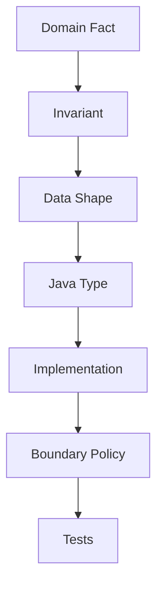
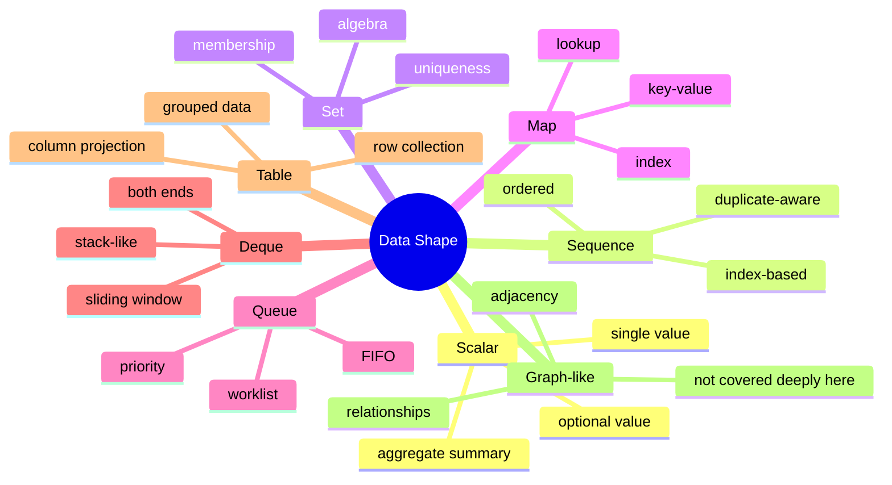
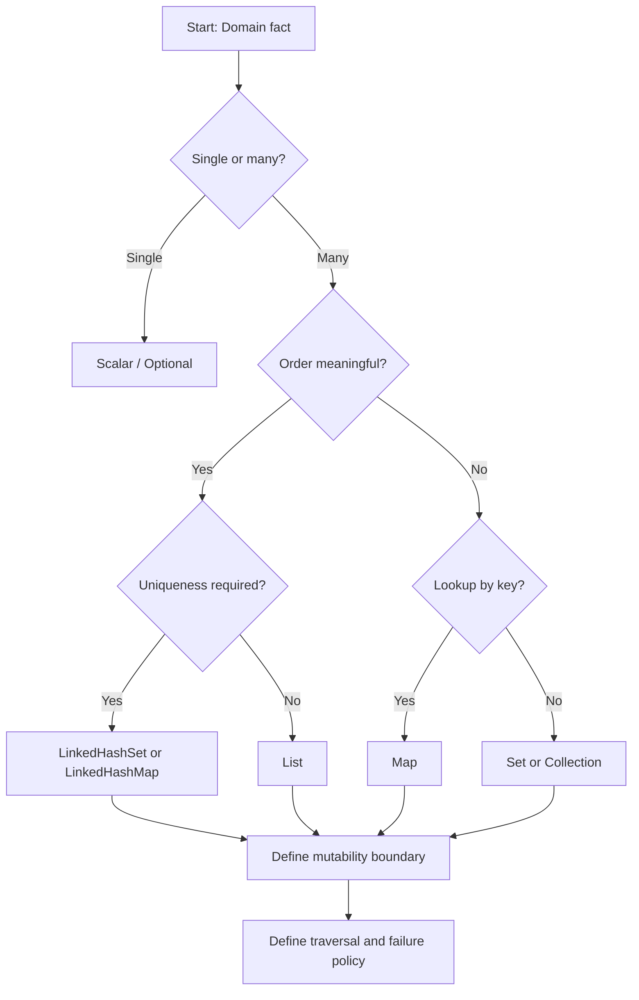
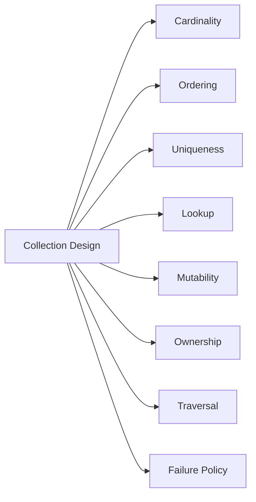
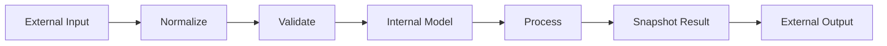
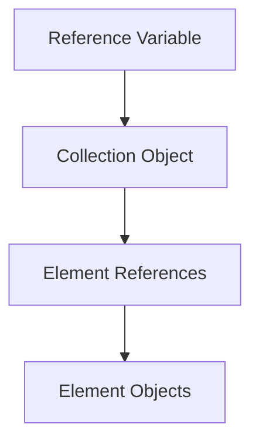
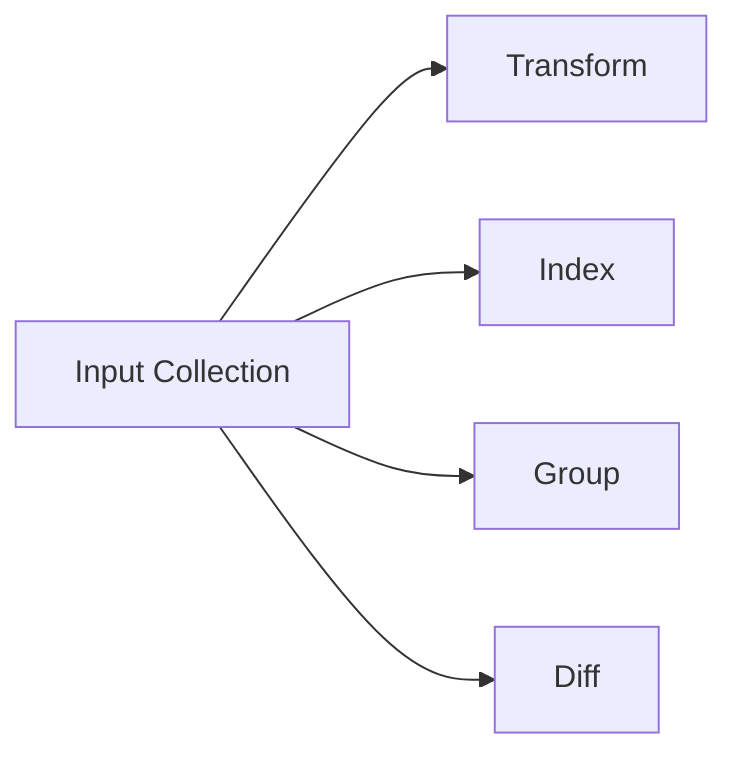

# Part 002 — The Real Problem: In-Memory Data Modeling in Java

## 1. Tujuan Part Ini

Sebelum membahas array, `ArrayList`, `HashMap`, iterator, stream, collector, atau gatherer, kita perlu menyelesaikan problem yang lebih fundamental:

> Bagaimana menerjemahkan fakta domain menjadi bentuk data in-memory yang benar, aman, jelas, dan efisien di Java?

Banyak bug collection bukan karena developer tidak tahu API. Bug muncul karena salah memilih **data shape**.

Contoh sederhana:

```java
List<String> roles = new ArrayList<>();
```

Kode ini belum mengatakan:

- apakah role boleh duplicate;
- apakah urutan role penting;
- apakah role case-sensitive;
- apakah null valid;
- apakah list ini mutable working set atau result final;
- apakah caller boleh memodifikasi;
- apakah role harus sorted untuk audit;
- apakah role identity cukup `String` atau perlu value object.

Jadi, pertanyaan awal bukan “pakai `ArrayList` atau `HashSet`?”. Pertanyaan awal adalah “apa fakta domain dan invariant yang harus dijaga?”.

---

## 2. Collection sebagai Model, Bukan Container

Di level dasar, collection terlihat seperti wadah elemen. Di level production, collection adalah ekspresi dari kontrak:



Misalnya domain mengatakan:

> Satu case enforcement memiliki daftar escalation step. Urutannya penting. Step ID tidak boleh duplicate. Setelah case aktif, step definition tidak boleh dimodifikasi oleh caller.

Terjemahan awal:

- data shape: ordered unique sequence;
- access pattern: iterate in order, lookup by step id;
- mutation: build-time mutable, runtime immutable;
- boundary: return snapshot/unmodifiable;
- likely implementation: internal `LinkedHashMap<StepId, EscalationStep>` untuk uniqueness + order, external `List<EscalationStep>` atau `SequencedCollection<EscalationStep>` tergantung API.

Kode naive:

```java
List<EscalationStep> steps;
```

Kode ini tidak cukup kuat untuk menjaga uniqueness. Ia hanya menyimpan urutan.

Alternatif yang lebih eksplisit:

```java
final class EscalationPlan {
    private final SequencedMap<StepId, EscalationStep> stepsById;

    private EscalationPlan(SequencedMap<StepId, EscalationStep> stepsById) {
        this.stepsById = Collections.unmodifiableSequencedMap(new LinkedHashMap<>(stepsById));
    }

    List<EscalationStep> stepsInOrder() {
        return List.copyOf(stepsById.sequencedValues());
    }

    Optional<EscalationStep> findStep(StepId id) {
        return Optional.ofNullable(stepsById.get(id));
    }
}
```

Catatan: detail `SequencedMap` akan dibahas khusus di part Java 21 Sequenced Collections. Fokus di sini adalah cara berpikirnya: satu fakta domain bisa membutuhkan kombinasi order dan lookup.

---

## 3. Data Shape Taxonomy

Gunakan taxonomy berikut sebelum memilih type.



### 3.1 Scalar

Scalar adalah satu nilai:

```java
int count;
Money total;
Optional<User> approver;
```

Jangan pakai collection jika domain hanya butuh satu nilai. `List<User>` dengan asumsi “paling banyak satu” adalah smell jika invariant-nya single.

Buruk:

```java
List<User> primaryApprovers;
```

Lebih eksplisit:

```java
Optional<User> primaryApprover;
```

Atau jika wajib ada:

```java
User primaryApprover;
```

### 3.2 Sequence

Sequence berarti elemen memiliki urutan. Contoh:

- audit events in occurrence order;
- approval steps in configured order;
- validation errors in input order;
- CSV rows in file order.

Kandidat Java:

- `List<E>`;
- `ArrayList<E>`;
- immutable list via `List.copyOf`;
- `SequencedCollection<E>` bila API ingin menyatakan first/last/reverse secara eksplisit.

Pertanyaan wajib:

- Apakah index punya makna domain?
- Apakah duplicate valid?
- Apakah order berasal dari input atau sort?
- Apakah caller boleh reorder?

### 3.3 Set

Set berarti uniqueness atau membership. Contoh:

- assigned permissions;
- enabled feature flags;
- blocked customer ids;
- supported currencies.

Kandidat Java:

- `HashSet<E>`;
- `LinkedHashSet<E>`;
- `TreeSet<E>`;
- `EnumSet<E>`;
- immutable set via `Set.copyOf`.

Pertanyaan wajib:

- Apa definisi duplicate?
- Apakah uniqueness berdasarkan `equals` atau domain-specific key?
- Apakah order output penting?
- Apakah set harus sorted?
- Apakah element mutable?

### 3.4 Map

Map berarti lookup berdasarkan key. Contoh:

- user by id;
- account by account number;
- latest event by aggregate id;
- validation error by field;
- rule by rule code.

Kandidat Java:

- `HashMap<K,V>`;
- `LinkedHashMap<K,V>`;
- `TreeMap<K,V>`;
- `EnumMap<K,V>`;
- immutable map via `Map.copyOf`.

Pertanyaan wajib:

- Apakah key stable?
- Apakah null key/value valid?
- Apa kebijakan duplicate key?
- Apakah insertion order perlu dipertahankan?
- Apakah sorted key order diperlukan?
- Apakah map merupakan index turunan atau source of truth?

### 3.5 Queue

Queue berarti worklist atau processing order. Contoh:

- pending tasks;
- BFS-like traversal frontier;
- retry queue in-memory sederhana;
- event dispatch buffer.

Kandidat Java:

- `Queue<E>`;
- `ArrayDeque<E>`;
- `PriorityQueue<E>`;
- concurrent queues akan dibahas hanya sebatas semantics, bukan concurrency deep dive.

Pertanyaan wajib:

- FIFO, priority, atau custom order?
- Apakah bounded?
- Apakah null allowed?
- Apakah failure saat kosong harus exception atau special value?

### 3.6 Deque

Deque berarti akses dua ujung. Contoh:

- stack-like processing;
- sliding window;
- undo/redo buffer;
- parsing context.

Kandidat Java:

- `Deque<E>`;
- `ArrayDeque<E>`.

Pertanyaan wajib:

- Apakah operasi dominan di head, tail, atau dua-duanya?
- Apakah perlu random access? Jika ya, deque mungkin salah.
- Apakah stack semantics lebih jelas dengan `push/pop/peek`?

---

## 4. Dari Domain Fact ke Type Selection

Gunakan alur berikut.



Contoh domain facts dan terjemahan:

| Domain Fact | Data Shape | Candidate Type |
|---|---|---|
| “Ada nol atau satu reviewer aktif” | optional scalar | `Optional<Reviewer>` atau nullable internal field dengan API non-null |
| “Error validasi harus tampil sesuai urutan input” | ordered sequence | `List<ValidationError>` |
| “Permission tidak boleh duplicate” | set membership | `Set<Permission>` / `EnumSet<Permission>` |
| “Event harus diproses FIFO” | queue | `Queue<Event>` / `ArrayDeque<Event>` |
| “Rule lookup by code dan output harus sesuai config order” | ordered map | `LinkedHashMap<RuleCode, Rule>` / `SequencedMap` |
| “Currency supported bersifat enum” | enum set | `EnumSet<CurrencyCode>` |
| “Matrix score fixed-size primitive” | primitive array | `double[]` atau `double[][]` |

---

## 5. The Eight Axes of Collection Design

Sebelum menulis collection field atau return type, nilai delapan axis berikut.



### 5.1 Cardinality

Pertanyaan:

- Apakah data bisa kosong?
- Apakah maksimal satu?
- Apakah jumlah elemen terbatas?
- Apakah jumlah sangat besar?

Kesalahan umum:

```java
List<Account> primaryAccounts; // padahal maksimal satu
```

Lebih baik:

```java
Optional<Account> primaryAccount;
```

Atau jika harus ada:

```java
Account primaryAccount;
```

Jika domain mengenal “minimal satu”, Java standard library tidak punya `NonEmptyList`. Kamu bisa enforce melalui factory:

```java
public final class ApprovalChain {
    private final List<Approver> approvers;

    private ApprovalChain(List<Approver> approvers) {
        this.approvers = List.copyOf(approvers);
    }

    public static ApprovalChain of(List<Approver> approvers) {
        Objects.requireNonNull(approvers, "approvers");
        if (approvers.isEmpty()) {
            throw new IllegalArgumentException("approval chain must contain at least one approver");
        }
        return new ApprovalChain(approvers);
    }
}
```

### 5.2 Ordering

Pertanyaan:

- Apakah order bagian dari business rule?
- Apakah order berasal dari input?
- Apakah order harus sorted?
- Apakah output harus deterministic untuk audit/test?

Buruk:

```java
Set<Violation> violations = new HashSet<>();
return new ArrayList<>(violations);
```

Jika output harus deterministic, gunakan:

```java
Set<Violation> violations = new LinkedHashSet<>();
```

Atau sorting eksplisit:

```java
List<Violation> sorted = violations.stream()
    .sorted(Comparator.comparing(Violation::code))
    .toList();
```

Jangan biarkan order menjadi efek samping implementation.

### 5.3 Uniqueness

Pertanyaan:

- Duplicate valid atau invalid?
- Duplicate harus collapsed atau dilaporkan?
- Duplicate berdasarkan object equality atau key tertentu?

Contoh buruk:

```java
Set<Customer> customers = new HashSet<>(input);
```

Jika duplicate customer id adalah error, bukan sekadar dedup, maka `Set` langsung membuang informasi penting. Lebih baik:

```java
Map<CustomerId, Customer> byId = new LinkedHashMap<>();
List<ValidationError> errors = new ArrayList<>();

for (int i = 0; i < input.size(); i++) {
    Customer customer = input.get(i);
    Customer previous = byId.putIfAbsent(customer.id(), customer);
    if (previous != null) {
        errors.add(new ValidationError(i, "duplicate customer id: " + customer.id()));
    }
}
```

Deduplication dan duplicate validation adalah dua operasi berbeda.

### 5.4 Lookup

Pertanyaan:

- Apakah kita sering mencari elemen berdasarkan key?
- Apakah lookup dilakukan sekali atau berkali-kali?
- Apakah index turunan perlu disimpan atau cukup dibuat sementara?

Buruk:

```java
User findById(List<User> users, UserId id) {
    return users.stream()
        .filter(user -> user.id().equals(id))
        .findFirst()
        .orElseThrow();
}
```

Ini baik jika lookup hanya sekali dan list kecil. Buruk jika dipanggil ribuan kali dalam loop.

Lebih baik untuk repeated lookup:

```java
Map<UserId, User> usersById = users.stream()
    .collect(Collectors.toMap(
        User::id,
        Function.identity(),
        (left, right) -> {
            throw new IllegalStateException("duplicate user id: " + left.id());
        },
        LinkedHashMap::new
    ));
```

Namun untuk error context production, loop eksplisit sering lebih baik.

### 5.5 Mutability

Pertanyaan:

- Apakah collection mutable selama construction saja?
- Apakah caller boleh mutate?
- Apakah element mutable?
- Apakah mutation bisa merusak hash/equality?

Pattern umum:

```java
public final class RuleSet {
    private final List<Rule> rules;

    public RuleSet(Collection<Rule> rules) {
        this.rules = List.copyOf(rules);
    }

    public List<Rule> rules() {
        return rules;
    }
}
```

Ini membuat struktur list tidak bisa dimodifikasi. Tetapi jika `Rule` mutable, invariant tetap bisa rusak melalui object reference.

### 5.6 Ownership

Ownership menjawab: siapa yang bertanggung jawab atas perubahan?

Buruk:

```java
public final class Batch {
    private final List<Job> jobs;

    public Batch(List<Job> jobs) {
        this.jobs = jobs;
    }
}
```

Caller masih punya reference ke list yang sama.

Lebih aman:

```java
public Batch(Collection<Job> jobs) {
    this.jobs = List.copyOf(jobs);
}
```

Jika butuh internal mutable working set:

```java
public Batch(Collection<Job> jobs) {
    this.jobs = new ArrayList<>(jobs);
}

public List<Job> jobsSnapshot() {
    return List.copyOf(jobs);
}
```

### 5.7 Traversal

Pertanyaan:

- Apakah caller hanya perlu iterate?
- Apakah random access diperlukan?
- Apakah traversal order dijamin?
- Apakah traversal bisa dilakukan lebih dari sekali?

Jika API hanya butuh traversal, `Iterable<T>` bisa cukup:

```java
void exportRows(Iterable<Row> rows) {
    for (Row row : rows) {
        write(row);
    }
}
```

Namun hati-hati: `Iterable` biasanya mengimplikasikan bisa dipanggil `iterator()` lebih dari sekali, walau custom implementation bisa saja single-use. Jika single-use, dokumentasikan dengan tegas atau gunakan type lain.

### 5.8 Failure Policy

Pertanyaan:

- Apakah invalid item menghentikan proses?
- Apakah semua error dikumpulkan?
- Apakah duplicate last-write-wins?
- Apakah null difilter atau error?
- Apakah exception menyertakan index/key?

Contoh failure policy eksplisit:

```java
record ImportResult(
    List<ImportedCustomer> accepted,
    List<ValidationError> rejected
) {}
```

Ini lebih baik daripada melempar exception pertama jika requirement-nya batch import dengan error report lengkap.

---

## 6. Access Pattern Drives Implementation

Interface menyatakan kontrak. Implementation menentukan behavior operasional.

| Access Pattern | Better Starting Point | Avoid as Default |
|---|---|---|
| append + iterate | `ArrayList` | `LinkedList` |
| random access by index | `ArrayList` / array | `LinkedList` |
| frequent membership check | `HashSet` | `List.contains` in loop |
| preserve insertion order + uniqueness | `LinkedHashSet` | `HashSet` |
| lookup by key | `HashMap` | linear scan repeated |
| lookup + insertion order | `LinkedHashMap` | `HashMap` if output deterministic |
| sorted traversal | `TreeSet` / `TreeMap` or sort list | sorting repeatedly |
| enum membership | `EnumSet` | `HashSet<Enum>` |
| enum key lookup | `EnumMap` | `HashMap<Enum, V>` |
| FIFO | `ArrayDeque` | `LinkedList` |
| stack | `ArrayDeque` | `Stack` |
| primitive numeric bulk | primitive array / primitive stream | `List<Integer>` in hot path |

Rule of thumb: **pilih implementation berdasarkan operasi dominan, bukan berdasarkan kebiasaan**.

---

## 7. Boundary Modeling

Boundary adalah tempat collection berpindah ownership: dari caller ke callee, dari domain ke API, dari persistence ke service, dari service ke controller, dari internal mutable state ke external result.



Setiap boundary perlu policy.

### 7.1 Input Boundary

Pertanyaan:

- Apakah input boleh null?
- Apakah input collection boleh berisi null?
- Apakah input akan disimpan?
- Apakah input akan dimodifikasi?
- Apakah duplicate diterima?

Pattern aman:

```java
public RuleEngine(Collection<Rule> rules) {
    Objects.requireNonNull(rules, "rules");
    this.rules = normalizeAndValidate(rules);
}
```

Jangan langsung assign input ke field kecuali memang explicit shared ownership.

### 7.2 Internal Boundary

Internal structure boleh berbeda dari external contract.

Contoh:

```java
public final class RuleCatalog {
    private final Map<RuleCode, Rule> rulesByCode;

    public RuleCatalog(Collection<Rule> rules) {
        this.rulesByCode = indexByCode(rules);
    }

    public Optional<Rule> find(RuleCode code) {
        return Optional.ofNullable(rulesByCode.get(code));
    }

    public List<Rule> rules() {
        return List.copyOf(rulesByCode.values());
    }
}
```

External API tidak harus expose map jika caller tidak perlu map.

### 7.3 Output Boundary

Pertanyaan:

- Apakah result mutable?
- Apakah result snapshot atau live view?
- Apakah order dijamin?
- Apakah caller boleh menyimpan result?

Contoh dokumentasi contract:

```java
/**
 * Returns a snapshot of active rules in configured order.
 * The returned list is unmodifiable and does not reflect future updates.
 */
public List<Rule> activeRules() {
    return List.copyOf(activeRules);
}
```

Kontrak seperti ini mengurangi asumsi liar di caller.

---

## 8. Snapshot vs Live View

Ini salah satu sumber bug paling sering.

### 8.1 Snapshot

Snapshot berarti result tidak berubah ketika source berubah.

```java
List<OrderLine> snapshot = List.copyOf(lines);
```

Jika `lines` berubah setelahnya, `snapshot` tetap memiliki struktur yang sama. Tetapi ingat: elemen di dalamnya bisa masih mutable.

### 8.2 Live View

Live view berarti result terhubung ke backing collection.

```java
List<OrderLine> readOnlyView = Collections.unmodifiableList(lines);
```

Caller tidak bisa mutate melalui `readOnlyView`, tetapi jika pemilik `lines` menambah elemen, perubahan terlihat melalui view.

### 8.3 Backed View

Contoh backed view:

```java
List<OrderLine> firstTen = lines.subList(0, 10);
```

`firstTen` bukan independent list penuh. Ia view dari `lines`. Ini bisa efisien, tetapi juga bisa menyebabkan coupling dan memory retention.

### 8.4 Decision Rule

| Kebutuhan | Pilih |
|---|---|
| Caller perlu stable result | snapshot |
| Caller perlu melihat update internal | live view, dokumentasikan kuat |
| Data internal sensitif | snapshot + immutable elements |
| Performance menghindari copy besar | view, tetapi batasi lifetime |
| API public/library | default ke snapshot/unmodifiable kecuali ada alasan kuat |

---

## 9. Mutability Layers

Mutability punya beberapa layer.



Contoh:

```java
final List<OrderLine> lines = List.copyOf(input);
```

Yang dijamin:

- variable `lines` tidak bisa di-reassign karena `final`;
- list structure tidak bisa diubah jika result dari `List.copyOf`;

Yang tidak otomatis dijamin:

- object `OrderLine` immutable;
- field di dalam `OrderLine` tidak berubah;
- object yang direferensikan oleh `OrderLine` tidak berubah.

### 9.1 Shallow Immutability Example

```java
class MutableLine {
    private int quantity;

    void setQuantity(int quantity) {
        this.quantity = quantity;
    }
}

List<MutableLine> lines = List.copyOf(input);
lines.get(0).setQuantity(-10); // list tidak berubah, elemen berubah
```

Jadi untuk invariant kuat, collection immutability harus dipasangkan dengan immutable element design.

---

## 10. Ordering as a First-Class Contract

Order tidak boleh dianggap detail kecil. Dalam sistem enterprise, order sering menjadi bagian dari auditability.

Contoh order yang meaningful:

- approval step order;
- escalation priority;
- event occurrence order;
- validation error display order;
- ledger posting order;
- rules evaluation order.

Contoh order yang tidak meaningful:

- set of enabled flags;
- map of id to object untuk lookup internal;
- membership check.

### 10.1 Input Order vs Sorted Order

Input order:

```java
List<ValidationError> errors = new ArrayList<>();
```

Sorted order:

```java
List<Rule> rules = input.stream()
    .sorted(Comparator.comparing(Rule::priority).thenComparing(Rule::code))
    .toList();
```

Insertion order with uniqueness:

```java
Set<RuleCode> codes = new LinkedHashSet<>();
```

Key order:

```java
Map<RuleCode, Rule> rules = new TreeMap<>();
```

### 10.2 Avoid Ambiguous Return Type

Ambiguous:

```java
Collection<Rule> rules();
```

Clearer if order matters:

```java
List<Rule> rulesInEvaluationOrder();
```

Clearer if uniqueness matters:

```java
Set<Permission> permissions();
```

Clearer if lookup matters:

```java
Optional<Rule> findRule(RuleCode code);
```

---

## 11. Duplicate Policy

Duplicate adalah domain decision, bukan hanya technical detail.

### 11.1 Four Common Policies

| Policy | Meaning | Example |
|---|---|---|
| Reject | duplicate adalah error | duplicate account number |
| Collapse | duplicate dianggap sama | repeated feature flag |
| Merge | duplicate digabung | totals by category |
| Last wins | value terakhir mengganti sebelumnya | latest config override |

### 11.2 Reject Duplicate

```java
static Map<CustomerId, Customer> indexCustomers(List<Customer> customers) {
    Map<CustomerId, Customer> result = new LinkedHashMap<>();

    for (int i = 0; i < customers.size(); i++) {
        Customer customer = customers.get(i);
        Customer previous = result.putIfAbsent(customer.id(), customer);
        if (previous != null) {
            throw new IllegalArgumentException(
                "duplicate customer id at index " + i + ": " + customer.id()
            );
        }
    }

    return Map.copyOf(result);
}
```

### 11.3 Merge Duplicate

```java
Map<Category, BigDecimal> totalsByCategory = lines.stream()
    .collect(Collectors.toMap(
        OrderLine::category,
        OrderLine::amount,
        BigDecimal::add,
        LinkedHashMap::new
    ));
```

### 11.4 Last Wins

Last wins harus eksplisit karena sering menyembunyikan bug.

```java
Map<String, String> effectiveConfig = new LinkedHashMap<>();
for (ConfigEntry entry : entries) {
    effectiveConfig.put(entry.key(), entry.value());
}
```

Tambahkan komentar jika memang intentional:

```java
// Later entries override earlier entries by design.
```

---

## 12. Null Policy

Java collections punya behavior null yang berbeda tergantung implementation. Namun dari perspektif desain, null policy harus domain-driven.

### 12.1 Null as Invalid

```java
List<Item> items = input.stream()
    .map(item -> Objects.requireNonNull(item, "item"))
    .toList();
```

Untuk error context yang lebih baik:

```java
for (int i = 0; i < input.size(); i++) {
    if (input.get(i) == null) {
        throw new IllegalArgumentException("item at index " + i + " must not be null");
    }
}
```

### 12.2 Null as Missing Data

Jika null berarti missing optional field, sering lebih baik normalize ke `Optional`, default value, atau validation error.

```java
Optional<EmailAddress> email = Optional.ofNullable(raw.email())
    .map(EmailAddress::parse);
```

Namun jangan menaruh `Optional` sebagai elemen collection tanpa alasan kuat jika membuat API berat. Kadang collection of valid values + separate error list lebih jelas.

### 12.3 Null as Filtered Out

```java
List<EmailAddress> emails = rawEmails.stream()
    .filter(Objects::nonNull)
    .map(EmailAddress::parse)
    .toList();
```

Filtering null hanya benar jika kehilangan data memang acceptable.

---

## 13. Collection as Source of Truth vs Derived Index

Ini penting untuk desain internal.

### 13.1 Source of Truth

```java
private final List<OrderLine> lines;
```

List adalah data utama.

### 13.2 Derived Index

```java
private final Map<ProductId, OrderLine> lineByProductId;
```

Map bisa saja turunan dari list untuk lookup.

Masalah muncul ketika dua-duanya mutable dan bisa diverge.

Buruk:

```java
private final List<OrderLine> lines = new ArrayList<>();
private final Map<ProductId, OrderLine> byProduct = new HashMap<>();

void add(OrderLine line) {
    lines.add(line);
    // lupa update byProduct
}
```

Lebih baik:

- satu source of truth;
- index dibangun on demand;
- atau semua mutation melewati method yang menjaga dua struktur sekaligus;
- atau object immutable setelah construction.

### 13.3 Immutable After Construction

```java
public final class OrderLines {
    private final List<OrderLine> lines;
    private final Map<ProductId, OrderLine> byProductId;

    public OrderLines(List<OrderLine> input) {
        this.lines = List.copyOf(input);
        this.byProductId = buildIndex(this.lines);
    }
}
```

Ini aman karena setelah construction tidak ada mutation yang bisa membuat list dan map diverge.

---

## 14. Stream Is a Processing View, Not a Data Model

Stream sangat berguna, tetapi jangan jadikan stream sebagai default data model.

Buruk:

```java
record CustomerBatch(Stream<Customer> customers) {}
```

Masalah:

- stream single-use;
- lifecycle source mungkin resource-bound;
- sulit mengetahui size;
- sulit melakukan validation multiple pass;
- caller bisa lupa terminal operation;
- error muncul jauh dari construction.

Lebih baik jika batch memang materialized:

```java
record CustomerBatch(List<Customer> customers) {
    CustomerBatch {
        customers = List.copyOf(customers);
    }
}
```

Gunakan stream untuk operasi:

```java
List<CustomerView> views = batch.customers().stream()
    .filter(Customer::active)
    .map(CustomerView::from)
    .toList();
```

Stream cocok sebagai **pipeline**, bukan sebagai **state**.

---

## 15. Iterable as Boundary

`Iterable<T>` berguna ketika callee hanya perlu traversal.

```java
void writeReport(Iterable<ReportRow> rows) {
    for (ReportRow row : rows) {
        writer.write(row);
    }
}
```

Keuntungan:

- general;
- bisa menerima list, set, custom iterable;
- tidak memaksa materialization detail.

Risiko:

- tidak ada size;
- tidak ada random access;
- ordering tergantung source;
- custom iterable bisa single-use;
- exception bisa muncul saat traversal, bukan saat parameter diterima.

Gunakan `Iterable` ketika benar-benar hanya butuh traversal. Jangan gunakan untuk menyembunyikan kontrak yang sebenarnya penting.

---

## 16. Arrays in Data Modeling

Array cocok jika:

- ukuran fixed atau diketahui;
- primitive data dominan;
- memory locality penting;
- API boundary legacy membutuhkan array;
- representasi matrix/vector sederhana;
- hot path menghindari boxing.

Array kurang cocok jika:

- ukuran sering berubah;
- butuh rich collection operations;
- perlu uniqueness;
- perlu ownership boundary aman tanpa copy;
- data model domain ingin ekspresif.

Contoh tepat:

```java
final class ScoreVector {
    private final double[] values;

    ScoreVector(double[] values) {
        this.values = values.clone();
    }

    double valueAt(int index) {
        return values[index];
    }

    double[] toArray() {
        return values.clone();
    }
}
```

Array internal, boundary defensive.

---

## 17. Case Study: Enforcement Case Validation

Kita gunakan contoh domain yang dekat dengan regulatory/enforcement lifecycle.

### 17.1 Requirement

Sebuah enforcement case menerima list action dari input eksternal.

Rules:

1. Action id wajib ada.
2. Action id tidak boleh duplicate.
3. Urutan action mengikuti input order.
4. Invalid action tidak menghentikan seluruh batch; semua error harus dikumpulkan.
5. Valid action harus bisa dilookup berdasarkan id.
6. Output report harus deterministic.

### 17.2 Naive Model

```java
List<CaseAction> actions = request.actions();
```

Masalah:

- duplicate tidak dicegah;
- null policy tidak jelas;
- lookup by id akan linear scan;
- invalid action handling tidak jelas;
- ownership input bocor jika list mutable.

### 17.3 Better Internal Model

```java
record ActionImportResult(
    List<CaseAction> validActions,
    Map<ActionId, CaseAction> validActionsById,
    List<ValidationError> errors
) {}
```

Kita memisahkan:

- sequence valid actions untuk order;
- map untuk lookup;
- list errors untuk report.

### 17.4 Implementation

```java
static ActionImportResult importActions(List<RawAction> rawActions) {
    Objects.requireNonNull(rawActions, "rawActions");

    List<CaseAction> valid = new ArrayList<>();
    Map<ActionId, CaseAction> byId = new LinkedHashMap<>();
    List<ValidationError> errors = new ArrayList<>();

    for (int i = 0; i < rawActions.size(); i++) {
        RawAction raw = rawActions.get(i);

        if (raw == null) {
            errors.add(new ValidationError(i, "action must not be null"));
            continue;
        }

        if (raw.id() == null || raw.id().isBlank()) {
            errors.add(new ValidationError(i, "action id is required"));
            continue;
        }

        ActionId id = new ActionId(raw.id().trim());
        CaseAction action = new CaseAction(id, raw.type(), raw.effectiveDate());

        CaseAction previous = byId.putIfAbsent(id, action);
        if (previous != null) {
            errors.add(new ValidationError(i, "duplicate action id: " + id.value()));
            continue;
        }

        valid.add(action);
    }

    return new ActionImportResult(
        List.copyOf(valid),
        Map.copyOf(byId),
        List.copyOf(errors)
    );
}
```

### 17.5 Why Not Pure Stream?

A stream-only version is possible, but not necessarily better. This logic has:

- index-aware error reporting;
- duplicate detection;
- multiple outputs;
- clear imperative failure policy;
- accumulated errors.

A loop is more explicit and easier to debug. Stream is not the goal. Correctness and clarity are the goal.

---

## 18. Case Study: Rule Evaluation Order

### 18.1 Requirement

- Rules have unique code.
- Rules evaluate in configured order.
- Caller can lookup rule by code.
- Catalog immutable after construction.

### 18.2 Model

```java
public final class RuleCatalog {
    private final SequencedMap<RuleCode, Rule> rulesByCode;

    public RuleCatalog(List<Rule> rules) {
        this.rulesByCode = Collections.unmodifiableSequencedMap(index(rules));
    }

    private static SequencedMap<RuleCode, Rule> index(List<Rule> rules) {
        LinkedHashMap<RuleCode, Rule> result = new LinkedHashMap<>();

        for (int i = 0; i < rules.size(); i++) {
            Rule rule = Objects.requireNonNull(rules.get(i), "rule at index " + i);
            Rule previous = result.putIfAbsent(rule.code(), rule);
            if (previous != null) {
                throw new IllegalArgumentException("duplicate rule code: " + rule.code());
            }
        }

        return result;
    }

    public Optional<Rule> find(RuleCode code) {
        return Optional.ofNullable(rulesByCode.get(code));
    }

    public List<Rule> evaluationOrder() {
        return List.copyOf(rulesByCode.sequencedValues());
    }
}
```

### 18.3 Design Notes

- `LinkedHashMap` supports insertion-order semantics.
- `SequencedMap` makes encounter-order operations explicit in Java 21+ APIs.
- The map is internal because lookup is internal capability.
- External result returns list because caller needs evaluation order, not map mutation.
- Duplicate policy is reject.

---

## 19. Case Study: Validation Errors

Validation error modeling often exposes collection design weakness.

### 19.1 Requirement

- Multiple errors can exist for one field.
- Error output must follow input order.
- UI sometimes needs group by field.
- Backend audit needs flat deterministic list.

### 19.2 Bad Model

```java
Map<String, String> errors;
```

Masalah:

- hanya satu error per field;
- order tidak jelas;
- key string raw;
- duplicate overwritten;
- tidak ada index/input context.

### 19.3 Better Model

```java
record ValidationError(
    String field,
    int inputIndex,
    String code,
    String message
) {}

record ValidationReport(List<ValidationError> errors) {
    ValidationReport {
        errors = List.copyOf(errors);
    }

    boolean hasErrors() {
        return !errors.isEmpty();
    }

    Map<String, List<ValidationError>> byField() {
        return errors.stream()
            .collect(Collectors.groupingBy(
                ValidationError::field,
                LinkedHashMap::new,
                Collectors.toList()
            ));
    }
}
```

Flat list menjadi source of truth. Grouped map adalah derived view saat dibutuhkan.

---

## 20. Choosing Input Parameter Types

Parameter type menentukan apa yang method butuhkan.

| Method Needs | Parameter Type | Reason |
|---|---|---|
| only traversal | `Iterable<T>` | paling general untuk traversal |
| collection size + traversal | `Collection<T>` | bisa `size`, `isEmpty` |
| order/index | `List<T>` | index dan order eksplisit |
| uniqueness/membership | `Set<T>` | duplicate tidak relevan atau sudah dicegah |
| lookup by key | `Map<K,V>` | caller menyediakan index |
| primitive fixed data | `int[]`, `long[]`, `double[]` | avoid boxing |
| pipeline composition | `Stream<T>` | method mengonsumsi stream, dokumentasikan single-use |

### 20.1 Do Not Over-Generalize

Buruk:

```java
void evaluate(Collection<Rule> rules) { ... }
```

Jika evaluation order penting, gunakan:

```java
void evaluate(List<Rule> rulesInOrder) { ... }
```

Atau:

```java
void evaluate(SequencedCollection<Rule> rulesInOrder) { ... }
```

Generality yang menghapus invariant bukan simplification. Itu ambiguity.

### 20.2 Do Not Over-Specify

Buruk:

```java
void sendAll(ArrayList<Message> messages) { ... }
```

Jika hanya butuh traversal:

```java
void sendAll(Iterable<Message> messages) { ... }
```

Atau jika butuh size:

```java
void sendAll(Collection<Message> messages) { ... }
```

Implementation type jarang cocok sebagai parameter public API.

---

## 21. Choosing Return Types

Return type harus menyampaikan contract.

| Return Need | Return Type |
|---|---|
| stable ordered result | `List<T>` |
| unique result | `Set<T>` |
| lookup result | `Map<K,V>` |
| optional single result | `Optional<T>` |
| traversal-only lazy-ish result | `Iterable<T>` |
| stream pipeline from non-resource source | `Stream<T>` with documentation |
| primitive data | defensive array copy |

### 21.1 Returning `Collection<T>`

`Collection<T>` sebagai return type sering terlalu kabur. Ia tidak menyatakan order, index, uniqueness, atau lookup. Gunakan jika memang caller hanya boleh tahu “kumpulan elemen” tanpa semantic tambahan.

### 21.2 Returning `Stream<T>`

Return `Stream<T>` hanya jika:

- source lifecycle aman;
- caller memang akan membangun pipeline;
- single-use behavior acceptable;
- resource ownership jelas;
- exception timing jelas.

Untuk API domain umum, `List<T>` snapshot sering lebih mudah dipahami.

---

## 22. Transform, Index, Group, Diff: Four Production Moves

Sebagian besar collection-heavy code enterprise dapat dipetakan ke empat operasi.



### 22.1 Transform

```java
List<CustomerView> views = customers.stream()
    .map(CustomerView::from)
    .toList();
```

Cocok untuk stateless mapping.

### 22.2 Index

```java
Map<CustomerId, Customer> byId = customers.stream()
    .collect(Collectors.toMap(Customer::id, Function.identity()));
```

Tambahkan merge policy untuk data eksternal.

### 22.3 Group

```java
Map<Region, List<Customer>> byRegion = customers.stream()
    .collect(Collectors.groupingBy(Customer::region));
```

Tambahkan map supplier jika output order penting.

### 22.4 Diff

```java
Set<AccountId> oldIds = oldAccounts.stream()
    .map(Account::id)
    .collect(Collectors.toSet());

Set<AccountId> newIds = newAccounts.stream()
    .map(Account::id)
    .collect(Collectors.toSet());

Set<AccountId> removed = new HashSet<>(oldIds);
removed.removeAll(newIds);
```

Diff sering lebih jelas dengan set operations daripada stream chain panjang.

---

## 23. Hidden Cost of Wrong Shape

### 23.1 Repeated Linear Search

```java
for (OrderLine line : lines) {
    Product product = products.stream()
        .filter(p -> p.id().equals(line.productId()))
        .findFirst()
        .orElseThrow();
}
```

Jika `lines` dan `products` besar, ini accidental nested lookup. Buat index:

```java
Map<ProductId, Product> productsById = products.stream()
    .collect(Collectors.toMap(Product::id, Function.identity()));

for (OrderLine line : lines) {
    Product product = productsById.get(line.productId());
    if (product == null) {
        throw new IllegalArgumentException("unknown product: " + line.productId());
    }
}
```

### 23.2 Over-Materialization

```java
List<User> active = users.stream()
    .filter(User::active)
    .toList();

long count = active.stream()
    .filter(User::premium)
    .count();
```

Jika hanya butuh count:

```java
long count = users.stream()
    .filter(User::active)
    .filter(User::premium)
    .count();
```

### 23.3 Losing Error Context

```java
input.stream()
    .map(Parser::parse)
    .toList();
```

Jika parse gagal, error mungkin tidak punya index. Loop lebih baik:

```java
for (int i = 0; i < input.size(); i++) {
    try {
        result.add(Parser.parse(input.get(i)));
    } catch (ParseException ex) {
        errors.add(new ValidationError(i, ex.getMessage()));
    }
}
```

---

## 24. API Documentation Template

Gunakan template ini untuk method collection-heavy.

```java
/**
 * Returns active escalation steps in evaluation order.
 *
 * Contract:
 * - The returned list is a snapshot.
 * - The returned list is unmodifiable.
 * - Elements are ordered by configured escalation priority.
 * - Duplicate step ids are rejected during construction.
 * - The list never contains null elements.
 */
public List<EscalationStep> activeSteps() {
    return List.copyOf(activeSteps);
}
```

Dokumentasi yang baik menjelaskan:

- ordering;
- mutability;
- snapshot/live view;
- null policy;
- duplicate policy;
- failure timing;
- ownership.

---

## 25. Design Smells

### 25.1 `List` Everywhere

Jika semua many-values direpresentasikan sebagai `List`, domain semantics hilang.

Tanda bahaya:

```java
List<String> permissions;
List<String> tags;
List<String> supportedCurrencies;
List<String> approverIds;
```

Sebagian mungkin seharusnya `Set`, `EnumSet`, value object, atau ordered list dengan invariant.

### 25.2 `Map<String, Object>`

Sering menjadi tanda domain model belum jelas.

```java
Map<String, Object> attributes;
```

Kadang valid untuk boundary dinamis, tetapi jangan biarkan menyebar ke core domain tanpa normalization.

### 25.3 Collection Field Exposed Directly

```java
public List<Item> items;
```

Hampir selalu buruk untuk domain object.

### 25.4 Stream Pipeline Too Clever

```java
var result = input.stream().collect(groupingBy(... mapping(... reducing(...))));
```

Jika reviewer perlu 10 menit untuk memahami failure policy, pecah menjadi langkah lebih eksplisit.

### 25.5 `parallelStream()` Without Proof

Parallel stream perlu reasoning tentang source splitting, workload, shared state, associativity, ordering, dan common pool. Tanpa itu, ia bukan optimisasi; ia spekulasi.

---

## 26. Review Checklist untuk In-Memory Data Model

Gunakan checklist ini sebelum lanjut implementasi.

### 26.1 Shape

- [ ] Apakah single vs many sudah tepat?
- [ ] Apakah sequence/set/map/queue/deque sudah dipilih karena domain, bukan kebiasaan?
- [ ] Apakah order meaningful sudah dieksplisitkan?
- [ ] Apakah uniqueness meaningful sudah dieksplisitkan?

### 26.2 Contract

- [ ] Null policy jelas?
- [ ] Duplicate policy jelas?
- [ ] Mutability policy jelas?
- [ ] Snapshot vs live view jelas?
- [ ] Ownership jelas?

### 26.3 Implementation

- [ ] Access pattern cocok dengan implementation?
- [ ] Tidak ada repeated linear scan besar?
- [ ] Tidak ada reliance pada incidental order?
- [ ] Tidak ada mutable key dalam map/set?
- [ ] Tidak ada internal mutable collection yang bocor?

### 26.4 Failure

- [ ] Error menyertakan index/key/context?
- [ ] Batch validation mengumpulkan error jika requirement begitu?
- [ ] Duplicate tidak diam-diam hilang?
- [ ] Null tidak diam-diam terfilter kecuali intentional?

### 26.5 Test

- [ ] Empty input?
- [ ] Singleton input?
- [ ] Duplicate?
- [ ] Null?
- [ ] Order?
- [ ] Mutation attempt?
- [ ] Large input?

---

## 27. Latihan Part 002

### Latihan 1 — Data Shape Classification

Untuk setiap domain berikut, pilih shape dan type awal:

1. Daftar approval step yang harus dievaluasi berurutan.
2. Permission user.
3. Config override yang last-write-wins.
4. Validation errors yang harus tampil dalam input order.
5. Lookup account by account number.
6. Supported enum-based transaction types.
7. Retry worklist FIFO.
8. Score vector fixed-size berisi primitive double.

Untuk setiap jawaban, tulis:

```md
Domain:
Shape:
Java type:
Implementation:
Ordering policy:
Duplicate policy:
Null policy:
Mutability policy:
Failure policy:
```

### Latihan 2 — Refactor `List` Everywhere

Ambil class yang punya beberapa field `List`. Untuk setiap field, tanyakan:

- Apakah duplicate valid?
- Apakah order valid?
- Apakah lookup sering?
- Apakah field harus immutable?
- Apakah return type-nya sudah tepat?

Refactor satu field menjadi type yang lebih ekspresif.

### Latihan 3 — Design an Import Result

Buat model untuk batch import:

- input rows punya id;
- duplicate id invalid;
- invalid rows dikumpulkan;
- valid rows harus retain input order;
- valid rows harus lookup by id.

Implementasikan dengan:

- `List` untuk valid order;
- `LinkedHashMap` untuk index;
- `List` untuk errors;
- defensive output.

---

## 28. Ringkasan

Part ini mengubah cara berpikir dari “pilih collection class” menjadi “modelkan fakta domain”.

Inti yang harus dibawa:

1. Collection adalah contract, bukan container pasif.
2. Data shape harus ditentukan sebelum implementation.
3. Order, uniqueness, lookup, mutability, ownership, traversal, dan failure policy adalah axis desain.
4. `List` everywhere adalah smell jika domain punya uniqueness atau lookup semantics.
5. `Set` untuk dedup tidak sama dengan duplicate validation.
6. `Map` bisa menjadi source of truth atau derived index; jangan biarkan keduanya mutable dan diverge.
7. Stream cocok untuk processing, bukan state model.
8. Snapshot dan live view harus dibedakan jelas.
9. Null dan duplicate policy harus intentional.
10. API boundary harus menjelaskan ownership dan mutability.

Part berikutnya akan masuk ke **Java Arrays Deep Dive**: array sebagai object JVM, primitive/reference array, covariance, runtime component type, bounds checking, default initialization, dan array sebagai fondasi storage banyak struktur Java.

---

## References

- Oracle Java SE 25 API, `java.util.Collection`: https://docs.oracle.com/en/java/javase/25/docs/api/java.base/java/util/Collection.html
- Oracle Java SE 25 Java Collections Framework: https://docs.oracle.com/en/java/javase/25/core/java-collections-framework.html
- Oracle Java SE 25 Stream Package Summary: https://docs.oracle.com/en/java/javase/25/docs/api/java.base/java/util/stream/package-summary.html
- Oracle Java SE 21 Sequenced Collections Tutorial: https://docs.oracle.com/en/java/javase/21/core/creating-sequenced-collections-sets-and-maps.html
- OpenJDK JEP 431, Sequenced Collections: https://openjdk.org/jeps/431
