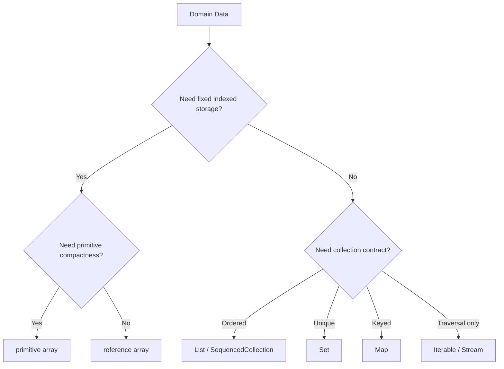
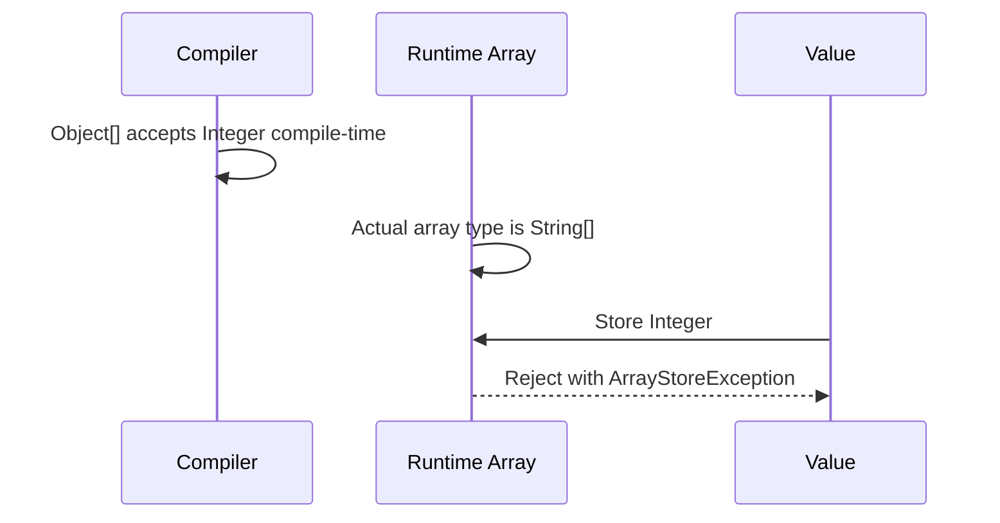
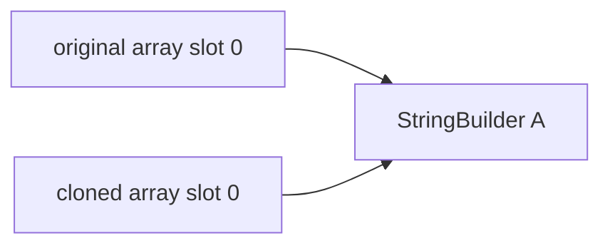

# Part 003 — Java Arrays Deep Dive: Object Model, Type Model, and Runtime Behavior

## 1. Tujuan Part Ini

Part ini membahas array bukan sebagai syntax dasar, tetapi sebagai **runtime object** dengan semantics yang unik di Java.

Kita ingin mampu menjawab pertanyaan seperti:

- Apa sebenarnya `int[]`, `String[]`, dan `Object[]` di runtime?
- Kenapa array di Java covariant, tetapi generic collection tidak?
- Kenapa `Object[] values = new String[10]` bisa compile tetapi dapat gagal saat runtime?
- Apa beda `new int[10]` dengan `new Integer[10]` secara behavior dan memory?
- Kenapa `T[]` bermasalah ketika `T` adalah generic type?
- Kenapa exposing array dari API sering merusak encapsulation?
- Kapan array adalah pilihan terbaik, dan kapan array hanya legacy leakage?

Array adalah bentuk storage paling fundamental di Java. Banyak implementation collection memakai array di dalamnya. `ArrayList`, `ArrayDeque`, hash table bucket, serialization buffer, parser buffer, dan banyak library high-performance pada akhirnya bertemu dengan array.

Namun array juga membawa beberapa warisan desain lama Java:

- covariant type system;
- mutable fixed-size storage;
- runtime component type;
- shallow clone;
- reference aliasing;
- default zero/null initialization;
- runtime store check;
- special JVM bytecodes.

Engineer yang kuat tidak hanya tahu `arr[i]`; ia tahu **kontrak runtime** di baliknya.

---

## 2. Posisi Array di Peta Skill Seri Ini

Di Part 002 kita mulai dari pertanyaan data shape. Array adalah salah satu jawaban ketika data shape membutuhkan:

- jumlah slot tetap;
- index-based access sangat cepat;
- traversal linear predictable;
- primitive storage tanpa boxing;
- representasi low-level untuk buffer, table, matrix, codec, atau algoritma internal;
- boundary dengan API lama atau library yang mensyaratkan array.

Tetapi array bukan jawaban ideal ketika data shape membutuhkan:

- ukuran dinamis;
- uniqueness contract;
- lookup by key;
- insertion/removal frequently in middle;
- strong immutability abstraction;
- rich domain semantics;
- lazy traversal;
- composable transformation.

Mental model awal:



Array adalah tool yang sangat kuat ketika problem-nya tepat. Tetapi karena array terlalu low-level, array sering membuat kontrak domain menjadi implisit.

---

## 3. Array adalah Object

Di Java, array adalah object. Artinya:

```java
int[] numbers = new int[3];
System.out.println(numbers instanceof Object); // true
```

Konsekuensinya:

- array dialokasikan di heap, kecuali compiler/JIT melakukan optimisasi internal;
- array memiliki identity;
- array bisa disimpan dalam variable bertipe `Object`;
- array memiliki method dari `Object`, seperti `getClass()`, `clone()`, `toString()`, `equals()`, `hashCode()`;
- array punya field khusus `length`;
- array bisa menjadi target synchronization, walaupun ini jarang desain yang baik.

Contoh:

```java
String[] names = {"Ayu", "Bima"};

Object asObject = names;
Class<?> runtimeClass = names.getClass();

System.out.println(asObject.getClass()); // class [Ljava.lang.String;
System.out.println(names.length);        // 2
```

Perhatikan output class name. Untuk array object, JVM memakai internal name khusus:

| Java type | Runtime class name umum |
|---|---|
| `int[]` | `[I` |
| `long[]` | `[J` |
| `double[]` | `[D` |
| `boolean[]` | `[Z` |
| `String[]` | `[Ljava.lang.String;` |
| `Object[][]` | `[[Ljava.lang.Object;` |

Kamu tidak perlu menghafal semua encoding, tetapi perlu memahami bahwa array memiliki runtime class sendiri.

---

## 4. Declaration, Allocation, Initialization

Ada tiga hal berbeda yang sering dicampur:

```java
String[] names;             // declaration
names = new String[3];      // allocation + default initialization
names[0] = "Ayu";           // element assignment
```

Declaration hanya membuat variable. Allocation membuat array object. Initialization mengisi setiap slot dengan default value.

Default value array mengikuti component type:

| Component type | Default value |
|---|---|
| `byte`, `short`, `int`, `long` | `0` |
| `float`, `double` | `0.0` |
| `char` | `\u0000` |
| `boolean` | `false` |
| reference type | `null` |

Contoh:

```java
int[] counts = new int[3];
String[] labels = new String[3];

System.out.println(counts[0]); // 0
System.out.println(labels[0]); // null
```

Default initialization adalah fitur penting untuk safety, tetapi juga bisa menyembunyikan bug. Misalnya `0` mungkin berarti “belum diisi”, tetapi juga bisa berarti nilai domain valid.

Production rule:

> Jangan biarkan default value menjadi domain state kecuali memang bagian eksplisit dari kontrak.

Buruk:

```java
int[] scores = new int[userCount];
// 0 berarti belum dihitung? atau score benar-benar 0?
```

Lebih jelas:

```java
Integer[] scores = new Integer[userCount];
// null berarti belum dihitung, tetapi ada boxing + null risk.
```

Atau model domain yang lebih kuat:

```java
record ScoreSlot(boolean calculated, int value) {}
ScoreSlot[] scores = new ScoreSlot[userCount];
```

Namun reference array masih default `null`, jadi perlu initialization policy yang jelas.

---

## 5. Primitive Array vs Reference Array

Java memiliki dua kategori besar array:

```java
int[] primitiveArray = new int[1_000];
Integer[] referenceArray = new Integer[1_000];
String[] objectArray = new String[1_000];
```

Primitive array menyimpan primitive values langsung di slot array.

Reference array menyimpan references ke object, bukan object-nya langsung.

```mermaid
flowchart LR
    A[int[]] --> A0[slot 0: 10]
    A --> A1[slot 1: 20]
    A --> A2[slot 2: 30]

    B[Integer[]] --> B0[slot 0: ref]
    B0 --> O0[Integer object: 10]
    B --> B1[slot 1: ref]
    B1 --> O1[Integer object: 20]
    B --> B2[slot 2: null]
```

Konsekuensi:

| Aspek | `int[]` | `Integer[]` |
|---|---|---|
| Slot stores | raw int value | reference |
| Null allowed | no | yes |
| Boxing | no | yes if values berasal dari int |
| Memory density | tinggi | lebih rendah |
| Cache locality | lebih baik | lebih buruk karena pointer chasing |
| Domain absence | tidak bisa pakai null | bisa null, tetapi raw null risk |

Untuk computation-heavy code, `int[]`, `long[]`, dan `double[]` sering jauh lebih baik daripada boxed arrays atau `List<Integer>`.

Namun primitive array juga lemah secara semantic. `int[]` tidak menyatakan apakah elemen adalah amount, status code, index, count, priority, atau timestamp offset. Karena itu, primitive array cocok untuk internal implementation detail, bukan selalu untuk public domain API.

---

## 6. Array Length: Fixed Size, Mutable Content

Array memiliki ukuran tetap setelah dibuat:

```java
String[] names = new String[3];
System.out.println(names.length); // 3
```

`length` bukan method, melainkan field khusus array.

Yang fixed adalah jumlah slot, bukan isi slot.

```java
String[] names = new String[2];
names[0] = "Ayu";
names[1] = "Bima";
// names[2] = "Citra"; // ArrayIndexOutOfBoundsException
```

Jika butuh ukuran dinamis, array harus diganti dengan array baru:

```java
String[] oldNames = {"Ayu", "Bima"};
String[] newNames = java.util.Arrays.copyOf(oldNames, 3);
newNames[2] = "Citra";
```

Inilah salah satu alasan `ArrayList` memakai array internal dengan capacity yang bisa tumbuh. Public abstraction-nya dynamic list, internal storage-nya array yang sesekali diganti.

Production implication:

- array cocok untuk fixed-size logical data;
- array juga cocok untuk internal growable implementation;
- array kurang cocok sebagai public abstraction untuk dynamic collection;
- array length tidak menjelaskan jumlah elemen valid jika array dipakai sebagai buffer.

Contoh buffer:

```java
byte[] buffer = new byte[8192];
int bytesRead = input.read(buffer);
```

Di sini `buffer.length` adalah capacity, bukan jumlah data valid. Data valid hanya `0 <= i < bytesRead`.

Ini invariant penting.

---

## 7. Array Bounds Check

Setiap akses array harus berada dalam range:

```java
0 <= index < array.length
```

Jika tidak:

```java
int[] values = new int[3];
int x = values[3]; // ArrayIndexOutOfBoundsException
```

Bounds check adalah bagian dari safety Java. Tidak ada undefined behavior seperti di C/C++.

Namun dari sisi performance, banyak engineer bertanya: apakah setiap akses berarti overhead besar?

Jawaban production-grade:

- secara semantic, setiap akses harus aman;
- JVM/JIT dapat menghilangkan bounds check tertentu jika bisa membuktikan index aman;
- jangan menulis kode tidak jelas hanya untuk “menghindari bounds check” tanpa benchmark;
- loop linear sederhana biasanya mudah dioptimisasi.

Contoh loop yang jelas:

```java
int sum(int[] values) {
    int total = 0;
    for (int i = 0; i < values.length; i++) {
        total += values[i];
    }
    return total;
}
```

Ini bentuk yang sangat mudah dipahami oleh manusia dan compiler.

Buruk:

```java
int sum(int[] values) {
    int total = 0;
    try {
        for (int i = 0; ; i++) {
            total += values[i];
        }
    } catch (ArrayIndexOutOfBoundsException done) {
        return total;
    }
}
```

Jangan pakai exception sebagai control flow traversal.

---

## 8. Runtime Component Type

Array membawa component type di runtime:

```java
String[] names = new String[3];
System.out.println(names.getClass().getComponentType());
// class java.lang.String
```

Untuk primitive array:

```java
int[] values = new int[3];
System.out.println(values.getClass().getComponentType());
// int
```

Ini berbeda dari generic type Java yang mengalami type erasure. Misalnya `List<String>` pada runtime tidak menyimpan parameter type `String` sebagai bagian dari class object list biasa.

Array adalah **reified** terhadap component type-nya. Generic collection adalah **erased** terhadap type argument-nya.

Konsekuensi besarnya muncul pada covariance.

---

## 9. Array Covariance

Array reference type di Java adalah covariant.

Artinya, jika `String` adalah subtype dari `Object`, maka `String[]` dianggap subtype dari `Object[]`.

```java
String[] strings = new String[2];
Object[] objects = strings; // allowed
```

Ini terlihat nyaman, tetapi berbahaya.

```java
String[] strings = new String[2];
Object[] objects = strings;

objects[0] = "valid";
objects[1] = 123; // ArrayStoreException
```

Compile-time type `objects` adalah `Object[]`, jadi compiler mengizinkan `Integer`. Tetapi runtime array sebenarnya adalah `String[]`, sehingga JVM menolak assignment `Integer`.

Diagram:



Ini alasan generic collection tidak covariant secara mutable:

```java
List<String> strings = new ArrayList<>();
// List<Object> objects = strings; // compile error
```

Jika `List<String>` bisa diperlakukan sebagai `List<Object>`, kita dapat memasukkan `Integer` ke list string. Generic invariance mencegah bug itu di compile time.

Production rule:

> Hindari mengandalkan array covariance di API design. Treat `Object[]` sebagai boundary raw/legacy, bukan sebagai abstraction aman.

---

## 10. Array Store Check

Karena array covariant, JVM perlu melakukan runtime store check untuk reference array.

```java
Object[] objects = new String[10];
objects[0] = new Object(); // runtime check fails
```

Untuk primitive array, kasus ini tidak relevan karena primitive array tidak covariant dengan `Object[]`.

```java
int[] values = new int[3];
Object obj = values;       // allowed, int[] is Object
// Object[] arr = values;  // compile error
```

Primitive arrays adalah object, tetapi bukan `Object[]`.

```java
Object value = new int[] {1, 2, 3}; // ok
Object[] values = new int[] {1, 2, 3}; // tidak compile
```

Ini sering muncul di varargs/reflection/debugging code.

---

## 11. `equals`, `hashCode`, dan `toString` pada Array

Array tidak override `Object.equals` untuk deep element equality.

```java
int[] a = {1, 2, 3};
int[] b = {1, 2, 3};

System.out.println(a.equals(b)); // false
```

`equals` pada array membandingkan identity.

Gunakan `Arrays.equals`:

```java
System.out.println(java.util.Arrays.equals(a, b)); // true
```

Untuk nested array:

```java
int[][] x = {{1, 2}, {3, 4}};
int[][] y = {{1, 2}, {3, 4}};

System.out.println(java.util.Arrays.equals(x, y));     // false, shallow for nested refs
System.out.println(java.util.Arrays.deepEquals(x, y)); // true
```

Hal yang sama berlaku untuk `hashCode`:

```java
int[] values = {1, 2, 3};
System.out.println(values.hashCode()); // identity-based
System.out.println(java.util.Arrays.hashCode(values)); // content-based
```

Dan `toString`:

```java
System.out.println(values); // [I@4eec7777, not useful
System.out.println(java.util.Arrays.toString(values)); // [1, 2, 3]
```

Production rule:

> Jangan pakai array langsung sebagai key `HashMap` kecuali identity semantics memang diinginkan.

Buruk:

```java
Map<byte[], UserSession> sessions = new HashMap<>();
```

Dua `byte[]` dengan content sama tidak akan match.

Lebih aman:

```java
record TokenKey(byte[] bytes) {
    TokenKey {
        bytes = bytes.clone();
    }

    @Override
    public boolean equals(Object other) {
        return other instanceof TokenKey that
            && java.util.Arrays.equals(this.bytes, that.bytes);
    }

    @Override
    public int hashCode() {
        return java.util.Arrays.hashCode(bytes);
    }

    public byte[] bytes() {
        return bytes.clone();
    }
}
```

Catatan: record default `equals` untuk array field juga identity-based, sehingga perlu override jika content equality dibutuhkan.

---

## 12. Array Aliasing

Array variable menyimpan reference ke array object.

```java
String[] a = {"A", "B"};
String[] b = a;

b[0] = "X";
System.out.println(a[0]); // X
```

`a` dan `b` menunjuk array yang sama.

Aliasing adalah sumber bug besar ketika array melewati boundary:

```java
class Report {
    private final String[] columns;

    Report(String[] columns) {
        this.columns = columns;
    }

    String[] columns() {
        return columns;
    }
}
```

Caller dapat memodifikasi invariant object:

```java
String[] cols = {"id", "status"};
Report report = new Report(cols);

cols[0] = "corrupted";          // mutates internal state
report.columns()[1] = "broken"; // mutates internal state
```

Correct defensive version:

```java
class Report {
    private final String[] columns;

    Report(String[] columns) {
        this.columns = columns.clone();
    }

    String[] columns() {
        return columns.clone();
    }
}
```

Ini hanya shallow copy. Jika elemen mutable, elemen tetap bisa berubah.

---

## 13. `clone()` pada Array adalah Shallow Copy

Array memiliki `clone()` yang membuat array baru dengan slot yang disalin.

Primitive array:

```java
int[] a = {1, 2, 3};
int[] b = a.clone();

b[0] = 99;
System.out.println(a[0]); // 1
```

Reference array:

```java
StringBuilder[] a = {new StringBuilder("A")};
StringBuilder[] b = a.clone();

b[0].append("X");
System.out.println(a[0]); // AX
```

Slot array berbeda, tetapi object elemen sama.



Production rule:

> Clone array cukup untuk melindungi struktur slot, bukan untuk melindungi mutable element graph.

Jika butuh deep copy, harus eksplisit:

```java
StringBuilder[] copy = new StringBuilder[source.length];
for (int i = 0; i < source.length; i++) {
    copy[i] = new StringBuilder(source[i].toString());
}
```

Namun deep copy seharusnya bukan default reflex. Gunakan ketika ownership dan mutability memang menuntutnya.

---

## 14. Multidimensional Array adalah Array of Arrays

Java tidak memiliki true rectangular multidimensional array seperti beberapa bahasa lain. Java memiliki array yang elemennya adalah array.

```java
int[][] matrix = new int[2][3];
```

Secara conceptual:

```mermaid
flowchart LR
    M[int[][]] --> R0[int[] row 0]
    M --> R1[int[] row 1]
    R0 --> A00[0]
    R0 --> A01[0]
    R0 --> A02[0]
    R1 --> A10[0]
    R1 --> A11[0]
    R1 --> A12[0]
```

Karena array of arrays, row bisa memiliki panjang berbeda:

```java
int[][] jagged = new int[3][];
jagged[0] = new int[2];
jagged[1] = new int[5];
jagged[2] = new int[1];
```

Ini disebut jagged/ragged array.

Implikasi:

- `matrix.length` adalah jumlah row;
- `matrix[i].length` adalah panjang row ke-i;
- `matrix[i]` bisa `null` jika belum diisi;
- data tidak dijamin contiguous sebagai satu blok besar;
- traversal nested memiliki pointer dereference per row.

Untuk high-performance matrix-like data, kadang `int[] flat = new int[rows * cols]` lebih baik:

```java
int index(int row, int col, int cols) {
    return row * cols + col;
}
```

Tetapi flat array mengorbankan readability dan safety. Gunakan ketika ada alasan kuat.

---

## 15. Array Initializer dan Type Inference

Array bisa dibuat dengan initializer:

```java
String[] names = {"Ayu", "Bima"};
```

Atau explicit:

```java
String[] names = new String[] {"Ayu", "Bima"};
```

Dalam method call, bentuk explicit sering diperlukan:

```java
process(new String[] {"Ayu", "Bima"});
```

Sejak Java modern, `var` bisa dipakai untuk local variable, tetapi array initializer bare tidak bisa berdiri sendiri tanpa target type:

```java
var names = new String[] {"Ayu", "Bima"}; // ok
// var names = {"Ayu", "Bima"};          // tidak compile
```

Gunakan explicit type ketika type array penting untuk pembaca.

---

## 16. Generic Array Problem

Java melarang generic array creation tertentu:

```java
// List<String>[] lists = new List<String>[10]; // tidak compile
```

Alasannya: array reified, generic erased. Kombinasi ini bisa merusak type safety.

Bayangkan jika diizinkan:

```java
List<String>[] stringLists = new List<String>[1];
Object[] objects = stringLists;
objects[0] = List.of(123);
String value = stringLists[0].get(0); // runtime problem
```

Karena runtime array hanya tahu component raw-ish type, bukan `List<String>` penuh, type safety tidak dapat dijaga seperti yang diharapkan.

Workaround yang sering terlihat:

```java
@SuppressWarnings("unchecked")
List<String>[] lists = (List<String>[]) new List<?>[10];
```

Ini bukan “aman otomatis”. Ini memindahkan tanggung jawab ke developer.

Production rule:

> Jika kamu membutuhkan `List<T>[]`, sering kali desain yang lebih baik adalah `List<List<T>>`, custom holder, atau array dari non-generic concrete value object.

Contoh lebih aman:

```java
List<List<String>> buckets = new ArrayList<>();
for (int i = 0; i < bucketCount; i++) {
    buckets.add(new ArrayList<>());
}
```

Atau:

```java
final class Bucket<T> {
    private final List<T> values = new ArrayList<>();
}

List<Bucket<String>> buckets = new ArrayList<>();
```

---

## 17. Varargs adalah Array

Varargs method:

```java
void log(String... messages) {
    System.out.println(messages.length);
}
```

Secara runtime, `messages` adalah `String[]`.

Pemanggilan:

```java
log("A", "B", "C");
```

Diterjemahkan secara conceptual menjadi array argument.

Untuk reference type biasa, ini nyaman. Tetapi untuk generic varargs, ada risiko heap pollution.

```java
@SafeVarargs
static <T> List<T> concat(List<T>... lists) {
    List<T> result = new ArrayList<>();
    for (List<T> list : lists) {
        result.addAll(list);
    }
    return result;
}
```

`@SafeVarargs` berarti author method menyatakan bahwa penggunaan varargs generic aman. Jangan menambahkan annotation ini tanpa memahami apakah method menyimpan array varargs, memodifikasinya, atau membocorkannya.

Buruk:

```java
static <T> T[] unsafe(T... values) {
    return values; // exposes varargs array
}
```

Lebih aman:

```java
static <T> List<T> safeList(T... values) {
    return List.of(values); // note: null elements not accepted by List.of
}
```

Atau copy eksplisit jika perlu array result.

---

## 18. `Arrays.asList` Trap

`Arrays.asList(array)` membuat fixed-size list backed by array.

```java
String[] array = {"A", "B"};
List<String> list = java.util.Arrays.asList(array);

list.set(0, "X");
System.out.println(array[0]); // X

// list.add("C"); // UnsupportedOperationException
```

Kontraknya sering disalahpahami:

| Operation | Behavior |
|---|---|
| `get` | allowed |
| `set` | allowed, mutates backing array |
| `add` | unsupported |
| `remove` | unsupported |
| array mutation | visible in list |
| list set | visible in array |

Jika butuh mutable independent list:

```java
List<String> mutable = new ArrayList<>(Arrays.asList(array));
```

Jika butuh unmodifiable snapshot:

```java
List<String> snapshot = List.copyOf(Arrays.asList(array));
```

Namun `List.copyOf` tidak menerima null elements.

---

## 19. Array dan Null Policy

Reference array selalu bisa memiliki null slot, kecuali kamu menjaga invariant sendiri.

```java
User[] users = new User[10];
```

Semua slot awalnya null.

Ada beberapa policy:

### Policy A — Null means empty slot

Cocok untuk internal table/buffer.

```java
User[] table = new User[capacity];
if (table[i] == null) {
    // empty slot
}
```

Risiko: null bisa bocor ke domain layer.

### Policy B — Fully initialized array

Cocok untuk immutable-ish snapshots.

```java
User[] users = source.toArray(User[]::new);
for (User user : users) {
    Objects.requireNonNull(user);
}
```

### Policy C — Separate occupancy metadata

Cocok ketika `null` adalah value valid atau ingin menghindari ambiguity.

```java
Object[] values = new Object[capacity];
boolean[] occupied = new boolean[capacity];
```

Ini lebih verbose, tetapi invariant lebih eksplisit.

Production rule:

> Untuk public/domain-level data, null slot harus dianggap bug kecuali kontrak secara eksplisit mengizinkan null.

---

## 20. `toArray`: Boundary antara Collection dan Array

Collection bisa dikonversi ke array:

```java
List<String> names = List.of("Ayu", "Bima");
String[] array = names.toArray(String[]::new);
```

Bentuk modern `toArray(String[]::new)` jelas dan type-safe.

Bentuk lama:

```java
String[] array = names.toArray(new String[0]);
```

Bentuk yang perlu hati-hati:

```java
Object[] array = names.toArray();
```

Ini menghasilkan `Object[]`, bukan `String[]`.

```java
// String[] bad = (String[]) names.toArray(); // ClassCastException
```

Production rule:

> Jika caller membutuhkan typed array, gunakan generator atau typed array argument. Jangan cast hasil `toArray()` mentah.

---

## 21. Reflection Array

`java.lang.reflect.Array` memungkinkan membuat dan mengakses array secara dinamis.

```java
Object array = java.lang.reflect.Array.newInstance(String.class, 3);
java.lang.reflect.Array.set(array, 0, "Ayu");
String first = (String) java.lang.reflect.Array.get(array, 0);
```

Ini digunakan di framework, serializer, mapper, DI container, ORM, dan generic libraries.

Namun reflection array memiliki cost dan complexity:

- type errors pindah ke runtime;
- access lebih verbose;
- primitive handling perlu hati-hati;
- readability turun;
- boundary error lebih sulit dipahami.

Gunakan reflection array untuk infrastructure code, bukan domain code biasa.

---

## 22. Array Bytecode Mental Model

Kamu tidak harus menghafal bytecode, tetapi memahami bahwa array adalah fitur khusus JVM.

Beberapa instruksi konseptual:

| Operation | Bytecode family |
|---|---|
| create primitive array | `newarray` |
| create reference array | `anewarray` |
| create multi-dimensional array | `multianewarray` |
| load from int array | `iaload` |
| store into int array | `iastore` |
| load from reference array | `aaload` |
| store into reference array | `aastore` |
| get length | `arraylength` |

Kenapa ini penting?

Karena array bukan library class biasa. `arr[i]` bukan method call. JVM memiliki semantics dan optimisasi khusus untuk array access.

Namun jangan oversimplify menjadi “array selalu tercepat”. Array cepat untuk banyak access pattern, tetapi desain salah tetap bisa kalah oleh collection yang lebih tepat.

---

## 23. Array sebagai API Boundary

Pertanyaan penting: kapan method sebaiknya menerima/mengembalikan array?

### Baik menerima array ketika:

- caller memang punya data fixed-size atau primitive buffer;
- API low-level/high-throughput;
- interop dengan library lama;
- data shape adalah sequence indexed fixed-size;
- method tidak perlu collection semantics.

Contoh:

```java
int checksum(byte[] payload) {
    int sum = 0;
    for (byte b : payload) {
        sum += Byte.toUnsignedInt(b);
    }
    return sum;
}
```

### Lebih baik menerima collection ketika:

- ukuran dinamis;
- caller tidak harus materialize array;
- semantic contract lebih penting daripada storage;
- generic pipeline ingin fleksibel.

```java
Money total(Collection<LineItem> items) { ... }
```

### Hati-hati mengembalikan array

Buruk:

```java
class Policy {
    private final Rule[] rules;

    Rule[] rules() {
        return rules;
    }
}
```

Lebih aman:

```java
Rule[] rulesArray() {
    return rules.clone();
}
```

Atau jika API tidak perlu array:

```java
List<Rule> rules() {
    return List.copyOf(Arrays.asList(rules));
}
```

Namun `List.copyOf(Arrays.asList(rules))` akan menolak null. Itu sering bagus untuk domain API, tetapi harus disadari.

---

## 24. Decision Matrix: Array atau Bukan?

| Need | Better default |
|---|---|
| primitive numeric batch | primitive array / primitive stream |
| fixed-size buffer | array |
| dynamic ordered data | `ArrayList` / `List` |
| uniqueness | `Set` |
| lookup by key | `Map` |
| expose read-only ordered result | `List.copyOf(...)` |
| lazy traversal | `Iterable` / `Stream` |
| varargs convenience | varargs array with defensive policy |
| internal high-performance storage | array |
| public rich domain contract | collection/value object |

Rule of thumb:

> Array is storage. Collection is contract. Stream is pipeline. Iterator is traversal state.

---

## 25. Common Production Bugs

### Bug 1 — Array exposed from getter

```java
byte[] token() {
    return token;
}
```

Fix:

```java
byte[] token() {
    return token.clone();
}
```

### Bug 2 — Array used as map key with content expectation

```java
map.get(new byte[] {1, 2, 3}); // not found, even if same content exists
```

Fix: wrap with content-based key.

### Bug 3 — `Arrays.asList` assumed resizable

```java
List<String> list = Arrays.asList("A", "B");
list.add("C"); // UnsupportedOperationException
```

Fix:

```java
List<String> list = new ArrayList<>(Arrays.asList("A", "B"));
```

### Bug 4 — Shallow copy assumed deep copy

```java
User[] copy = users.clone();
copy[0].setName("Changed"); // original user's object also changed
```

Fix depends on ownership: immutable element, deep copy, or no mutation.

### Bug 5 — Default zero confused with actual value

```java
int[] retries = new int[taskCount];
// 0 could mean no retry, or not initialized
```

Fix: explicit state model.

### Bug 6 — Generic varargs heap pollution

```java
static <T> void unsafe(List<T>... lists) { ... }
```

Fix: prefer `List<List<T>>` or prove safety and annotate carefully.

---

## 26. Code Review Checklist untuk Array

Saat review kode yang memakai array, cek:

- Apakah array dipakai karena fixed-size/indexed/primitive performance, atau hanya kebiasaan?
- Apakah `length` berarti capacity atau logical size?
- Apakah null slot valid?
- Apakah default value memiliki makna domain yang ambiguous?
- Apakah array keluar/masuk API boundary tanpa defensive copy?
- Apakah equality yang diharapkan adalah identity atau content?
- Apakah array dipakai sebagai `Map` key?
- Apakah nested array rectangular atau jagged?
- Apakah `Arrays.asList` digunakan dengan asumsi list resizable?
- Apakah primitive array lebih tepat daripada boxed array?
- Apakah clone/copy cukup shallow?
- Apakah array covariance membuka risiko `ArrayStoreException`?
- Apakah varargs generic benar-benar safe?

---

## 27. Latihan Deliberate Practice

### Latihan 1 — Array Contract Audit

Ambil tiga method di codebase yang menerima atau return array. Untuk masing-masing, tulis:

```text
Method:
Array type:
Length meaning: fixed size / capacity / logical size / unknown
Null policy:
Mutation policy:
Ownership:
Equality expectation:
Better type candidate:
Risk:
```

Tujuannya melatih mata melihat hidden contract.

### Latihan 2 — Defensive Copy Refactor

Refactor class berikut:

```java
final class ApiToken {
    private final byte[] value;

    ApiToken(byte[] value) {
        this.value = value;
    }

    byte[] value() {
        return value;
    }
}
```

Target:

- constructor reject null;
- constructor copy input;
- getter copy output;
- content-based equality;
- content-based hash code;
- no leaking mutable internal state.

### Latihan 3 — Primitive vs Boxed Measurement Thought Exercise

Untuk dataset 10 juta integer:

- model A: `int[]`
- model B: `Integer[]`
- model C: `List<Integer>`

Jelaskan trade-off dalam hal:

- memory;
- null semantics;
- iteration;
- cache locality;
- API expressiveness;
- ease of use with Stream.

Jangan benchmark dulu. Latih reasoning dulu. Benchmark nanti di part performance.

---

## 28. Mini Capstone Part Ini

Desain type untuk representasi response code hasil validasi batch.

Requirement:

- jumlah item input sudah diketahui;
- setiap item punya status integer kecil;
- status default “belum diproses” harus berbeda dari status valid `0`;
- output external harus tidak bisa memodifikasi internal state;
- perlu akses cepat by index;
- perlu menghitung jumlah status error.

Salah satu desain:

```java
final class BatchValidationStatus {
    private static final int UNPROCESSED = -1;

    private final int[] statuses;

    BatchValidationStatus(int size) {
        if (size < 0) {
            throw new IllegalArgumentException("size must be >= 0");
        }
        this.statuses = new int[size];
        Arrays.fill(this.statuses, UNPROCESSED);
    }

    void mark(int index, int status) {
        if (status < 0) {
            throw new IllegalArgumentException("status must be >= 0");
        }
        statuses[index] = status;
    }

    int statusAt(int index) {
        return statuses[index];
    }

    int errorCount() {
        int count = 0;
        for (int status : statuses) {
            if (status > 0) {
                count++;
            }
        }
        return count;
    }

    int[] snapshot() {
        return statuses.clone();
    }
}
```

Pertanyaan review:

- Apakah `-1` sentinel cukup jelas?
- Apakah status perlu enum/value object?
- Apakah `statusAt` boleh return `UNPROCESSED`?
- Apakah external API sebaiknya return `int[]`, `List<Integer>`, atau custom view?
- Apakah object ini thread-safe? Tidak perlu dijawab detail di seri ini, tapi mutation policy harus jelas.

---

## 29. Ringkasan

Array di Java adalah object runtime dengan semantics khusus:

1. Array adalah object, punya identity, class runtime, `length`, dan `clone`.
2. Primitive array menyimpan value langsung; reference array menyimpan reference.
3. Array length fixed, tetapi isi mutable.
4. Reference array covariant, sehingga bisa menyebabkan `ArrayStoreException`.
5. Array membawa runtime component type; generic type argument pada collection umumnya erased.
6. Array `equals`, `hashCode`, dan `toString` default berbasis identity, bukan content.
7. `clone` dan copy array bersifat shallow untuk reference elements.
8. Multidimensional array adalah array of arrays.
9. Varargs adalah array; generic varargs perlu kehati-hatian.
10. Array di API boundary perlu defensive copy dan ownership policy.

Part berikutnya akan membahas konsekuensi memory dan performance: layout, locality, primitive density, pointer chasing, allocation pressure, dan cara berpikir realistis tentang “array lebih cepat”.

---

## References

- Oracle Java SE 25 API, `java.util.Arrays`: https://docs.oracle.com/en/java/javase/25/docs/api/java.base/java/util/Arrays.html
- Oracle Java SE 25 API, `java.lang.reflect.Array`: https://docs.oracle.com/en/java/javase/25/docs/api/java.base/java/lang/reflect/Array.html
- Java Language Specification, Java SE 25 Edition: https://docs.oracle.com/javase/specs/jls/se25/html/index.html
- Java Virtual Machine Specification, Java SE 25 Edition: https://docs.oracle.com/javase/specs/jvms/se25/html/index.html
