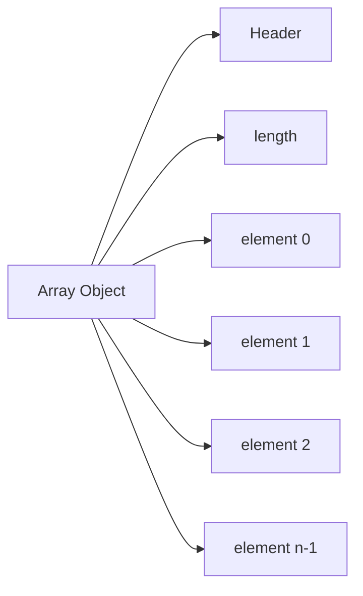

# Part 004 — Array Memory Layout, Locality, and Performance Reasoning

## 1. Tujuan Part Ini

Part ini membahas array dari sudut **memory dan performance reasoning**.

Targetnya bukan membuat kita menulis micro-optimization di semua tempat. Targetnya adalah mampu berpikir jernih ketika bertemu keputusan seperti:

- `int[]` atau `List<Integer>`?
- `Object[]` atau custom value object collection?
- nested array atau flat array?
- array internal dengan `size` field atau `ArrayList`?
- loop biasa atau stream?
- copy array atau view?
- optimize memory atau readability?

Array sering disebut “cepat”. Pernyataan itu terlalu kasar. Yang lebih benar:

> Array memberi representasi storage yang sederhana, indexed, dan sering cache-friendly. Tetapi performa akhirnya tetap bergantung pada component type, access pattern, allocation behavior, JIT optimization, object graph, GC pressure, dan clarity invariant.

Di part ini kita membangun model yang bisa dipakai untuk code review dan desain production.

---

## 2. Batasan Penting: Specification vs Implementation

Java Language Specification dan Java Virtual Machine Specification mendefinisikan semantics, bukan detail layout object heap yang harus sama di semua JVM.

Jadi ketika kita membahas:

- object header;
- compressed references;
- alignment;
- cache lines;
- HotSpot optimizations;
- compact object headers;
- escape analysis;
- bounds-check elimination;

itu adalah **implementation/performance model**, bukan kontrak bahasa yang harus identik di semua JVM.

Production mindset:

1. Gunakan specification untuk correctness.
2. Gunakan implementation knowledge untuk performance hypothesis.
3. Gunakan benchmark dan profiling untuk keputusan final.

Jangan membalik urutan ini.

---

## 3. Conceptual Layout Array

Secara konseptual, array object memiliki:

- object header;
- length;
- contiguous element storage;
- padding/alignment sesuai JVM.

Ilustrasi konseptual:



Untuk primitive array:

```java
int[] values = {10, 20, 30};
```

Slot menyimpan value:

```text
[int array object]
header | length=3 | 10 | 20 | 30
```

Untuk reference array:

```java
User[] users = {userA, userB, userC};
```

Slot menyimpan reference:

```text
[User[] object]
header | length=3 | refA | refB | refC
                         |      |      |
                         v      v      v
                       UserA  UserB  UserC
```

Perbedaan ini sangat penting. `User[]` tidak berarti semua `User` object bersebelahan di memory. Hanya references-nya yang bersebelahan.

---

## 4. Contiguous Storage dan Locality

Array memberi storage elemen yang contiguous secara logical. Untuk primitive array, data actual berada berurutan dalam array object.

Traversal linear:

```java
long sum(int[] values) {
    long total = 0;
    for (int i = 0; i < values.length; i++) {
        total += values[i];
    }
    return total;
}
```

Pattern ini sangat baik karena:

- akses predictable;
- CPU prefetcher lebih mudah bekerja;
- cache locality lebih baik;
- branch minimal;
- JIT lebih mudah mengoptimisasi loop;
- tidak ada per-element object dereference.

Bandingkan dengan `List<Integer>`:

```java
long sum(List<Integer> values) {
    long total = 0;
    for (Integer value : values) {
        total += value;
    }
    return total;
}
```

Jika implementasinya `ArrayList<Integer>`, internal storage-nya array reference ke `Integer` objects. Traversal membutuhkan:

1. baca reference dari backing `Object[]`;
2. dereference ke `Integer` object;
3. unbox ke `int`;
4. tambah ke total.

Itu bukan berarti selalu lambat dalam semua kasus, tetapi cost model-nya berbeda.

---

## 5. Primitive Density vs Boxed Object Overhead

Mari pakai contoh sederhana:

```java
int[] a = new int[1_000_000];
Integer[] b = new Integer[1_000_000];
List<Integer> c = new ArrayList<>();
```

`int[]`:

- satu array object;
- slot menyimpan 1 juta `int`;
- tidak ada null;
- tidak ada object per integer;
- sangat dense.

`Integer[]`:

- satu array object yang menyimpan references;
- setiap non-null element menunjuk ke `Integer` object;
- ada potensi banyak object kecil;
- null allowed;
- pointer chasing.

`ArrayList<Integer>`:

- satu `ArrayList` object;
- satu backing `Object[]`;
- references ke `Integer` object;
- size dan capacity terpisah;
- resizing policy;
- tetap boxed.

Ilustrasi:

```mermaid
flowchart TD
    A[int[]] --> A1[raw int values contiguous]

    B[Integer[]] --> B1[refs contiguous]
    B1 --> B2[Integer objects scattered]

    C[ArrayList<Integer>] --> C1[ArrayList object: size]
    C --> C2[Object[] backing array]
    C2 --> C3[Integer objects scattered]
```

Rule:

> Jika workload numeric besar dan operasi dominan adalah traversal/aggregation, primitive array atau primitive stream biasanya lebih masuk akal daripada boxed collection.

Namun jika data butuh absence, polymorphism, domain methods, atau collection operations, primitive array mungkin terlalu rendah level.

---

## 6. Pointer Chasing

Pointer chasing terjadi ketika CPU harus mengikuti reference dari satu object ke object lain.

Contoh:

```java
User[] users = loadUsers();
long count = 0;
for (User user : users) {
    if (user.status() == Status.ACTIVE) {
        count++;
    }
}
```

Walaupun `users` array contiguous, `User` objects bisa tersebar di heap. Setiap `user.status()` membutuhkan dereference ke object lain.

Bandingkan dengan struktur columnar internal:

```java
int[] statuses = new int[userCount];
```

Traversal status menjadi lebih dense.

Namun columnar layout mengorbankan object-oriented readability dan invariant locality. Ini cocok untuk engine, analytics, codec, parser, batch computation, bukan selalu cocok untuk domain application service.

Production decision:

- object array cocok untuk rich domain objects;
- primitive arrays cocok untuk compact computed state;
- hybrid layout cocok untuk performance-critical subsystem dengan batasan jelas.

---

## 7. Capacity vs Logical Size

Array hanya tahu `length`. Ia tidak tahu berapa elemen valid.

Banyak struktur data internal memakai dua konsep:

```java
final class IntBuffer {
    private int[] elements;
    private int size;

    IntBuffer(int capacity) {
        this.elements = new int[capacity];
    }

    void add(int value) {
        if (size == elements.length) {
            elements = Arrays.copyOf(elements, grow(elements.length));
        }
        elements[size++] = value;
    }

    int size() {
        return size;
    }
}
```

Di sini:

- `elements.length` = capacity;
- `size` = logical element count.

Bug umum:

```java
for (int i = 0; i < elements.length; i++) {
    process(elements[i]); // processes unused slots
}
```

Yang benar:

```java
for (int i = 0; i < size; i++) {
    process(elements[i]);
}
```

Production rule:

> Jika array digunakan sebagai backing storage, selalu bedakan capacity dan logical size secara eksplisit.

---

## 8. Allocation dan Zeroing

Ketika array dibuat:

```java
byte[] buffer = new byte[8192];
```

JVM harus menyediakan memory dan menginisialisasi elemen dengan default value.

Untuk array kecil, allocation biasanya murah. Untuk array besar atau sangat sering dialokasikan, cost bisa terlihat:

- allocation rate naik;
- GC pressure naik;
- memory bandwidth dipakai untuk initialization;
- object lifetime memengaruhi young generation pressure;
- large array bisa punya perlakuan khusus tergantung GC.

Contoh buruk di hot path:

```java
byte[] encode(Message message) {
    byte[] buffer = new byte[8192];
    // called millions of times
    return encodeInto(buffer, message);
}
```

Mungkin lebih baik:

- ukuran buffer tepat;
- reuse di scope aman;
- streaming API;
- pooled buffer, dengan disiplin ownership ketat;
- gunakan library buffer abstraction.

Namun pooling manual juga bisa memperburuk correctness dan memory retention. Jangan pool hanya karena “allocation mahal”. Modern JVM sangat baik dalam short-lived allocation.

---

## 9. Resizing Cost

Array fixed-size. Struktur growable berbasis array harus resize.

Conceptual add:

```java
if (size == elements.length) {
    elements = Arrays.copyOf(elements, newCapacity);
}
elements[size++] = value;
```

Resize membutuhkan:

- alokasi array baru;
- copy elemen lama;
- backing array lama menjadi kandidat GC jika tidak direferensikan;
- temporary memory spike.

Karena itu, jika jumlah elemen bisa diperkirakan, set capacity awal.

```java
List<OrderLine> lines = new ArrayList<>(expectedLineCount);
```

Untuk raw array internal:

```java
int[] values = new int[expectedSize];
```

Tetapi jangan over-allocate besar tanpa alasan. Over-allocation menambah memory footprint dan cache pressure.

---

## 10. Copy Cost dan Semantic Cost

Copy array terlihat murah:

```java
int[] copy = Arrays.copyOf(source, source.length);
```

Untuk primitive array linear besar, copy bisa sangat cepat karena JVM menggunakan optimized memory copy. Tetapi tetap ada cost:

- O(n) time;
- allocation;
- memory bandwidth;
- GC pressure.

Selain cost teknis, ada semantic cost:

- apakah copy adalah snapshot?
- apakah copy shallow cukup?
- apakah caller mengharapkan live view?
- apakah copy mengubah ordering?
- apakah null elements dipertahankan?

Production reasoning:

```text
Copy array bukan hanya performance decision.
Copy array adalah ownership decision.
```

Jika method return internal array tanpa copy, performance mungkin lebih baik, tetapi invariant bisa rusak.

Jika method selalu copy, invariant aman, tetapi hot path mungkin mahal.

Trade-off bisa diselesaikan dengan API yang lebih eksplisit:

```java
byte[] snapshot();              // returns copy
void copyInto(byte[] target);    // caller owns buffer
ByteBuffer asReadOnlyBuffer();   // if appropriate
int forEachByte(IntConsumer c);  // traversal without exposing storage
```

---

## 11. Bounds-Check Elimination

Array access harus aman. Tetapi JIT compiler dapat menghilangkan bounds check jika dapat membuktikan index aman.

Loop sederhana:

```java
int sum(int[] values) {
    int total = 0;
    for (int i = 0; i < values.length; i++) {
        total += values[i];
    }
    return total;
}
```

Ini pattern yang mudah dianalisis.

Loop yang lebih sulit:

```java
int sumAt(int[] values, int[] indexes) {
    int total = 0;
    for (int i = 0; i < indexes.length; i++) {
        total += values[indexes[i]];
    }
    return total;
}
```

JVM tetap harus memastikan `indexes[i]` valid untuk `values`.

Maka, jangan berasumsi semua loop array otomatis sama cepat. Access pattern matters.

Guideline:

- gunakan loop sederhana untuk traversal linear;
- validasi index batch di boundary jika perlu;
- jangan gunakan exception sebagai normal path;
- jangan obfuscate loop demi dugaan optimisasi.

---

## 12. Escape Analysis dan Scalar Replacement

JIT dapat melakukan optimisasi ketika object/array tidak escape dari scope tertentu.

Contoh conceptual:

```java
int compute(int a, int b) {
    int[] pair = new int[2];
    pair[0] = a;
    pair[1] = b;
    return pair[0] + pair[1];
}
```

JVM mungkin dapat menghindari allocation actual jika terbukti array tidak escape. Tetapi ini adalah optimization opportunity, bukan kontrak.

Array lebih sulit dioptimisasi ketika:

- dikembalikan dari method;
- disimpan ke field;
- dikirim ke method yang tidak inline;
- disimpan ke global/static state;
- dipakai via reflection;
- dipakai sebagai `Object` sehingga type information kabur.

Production lesson:

> Tulis kode yang jelas dan memiliki boundary ownership baik. Biarkan JIT mengoptimisasi kasus sederhana. Ukur hot path yang penting.

---

## 13. Loop vs Stream untuk Array

Java menyediakan stream dari array:

```java
int[] values = {1, 2, 3};
int sum = Arrays.stream(values).sum();
```

Untuk operasi sederhana, ini readable. Tetapi untuk hot path low-level, loop sering lebih eksplisit dan memberi kontrol lebih baik:

```java
int sum = 0;
for (int value : values) {
    sum += value;
}
```

Perbandingan:

| Concern | Loop | Stream |
|---|---|---|
| Control flow | sangat eksplisit | pipeline abstraction |
| Debug step-by-step | mudah | kadang lebih sulit |
| Primitive support | langsung | `IntStream` baik |
| Allocation overhead | minimal | tergantung pipeline/JIT |
| Complex transformation | bisa verbose | bisa lebih jelas |
| Short-circuit | explicit break | `anyMatch`, `findFirst`, etc. |
| Mutation | natural | bisa menjadi smell |

Rule:

> Untuk array hot path sederhana, loop adalah baseline. Untuk transformasi deklaratif yang jelas, primitive stream bisa baik. Jangan pakai stream untuk terlihat modern.

Kita akan bahas Stream secara mendalam di part 020+.

---

## 14. Nested Array vs Flat Array

Representasi matrix:

```java
int[][] matrix = new int[rows][cols];
```

Keuntungan:

- readable;
- natural indexing `matrix[row][col]`;
- row bisa dipisah;
- mudah dibuat jagged.

Kelemahan:

- array of arrays;
- setiap row adalah object berbeda;
- ekstra references;
- potensi row null;
- locality antar row tidak sebaik flat array.

Flat array:

```java
int[] matrix = new int[rows * cols];
int value = matrix[row * cols + col];
```

Keuntungan:

- satu primitive array;
- locality lebih baik;
- memory overhead lebih rendah;
- cocok untuk computation-heavy matrix/table.

Kelemahan:

- index arithmetic raw;
- risk overflow jika `rows * cols` besar;
- readability turun;
- invariant harus dijaga manual.

Buat wrapper untuk menjaga clarity:

```java
final class IntMatrix {
    private final int rows;
    private final int cols;
    private final int[] values;

    IntMatrix(int rows, int cols) {
        if (rows < 0 || cols < 0) {
            throw new IllegalArgumentException("rows and cols must be >= 0");
        }
        this.rows = rows;
        this.cols = cols;
        this.values = new int[Math.multiplyExact(rows, cols)];
    }

    int get(int row, int col) {
        return values[index(row, col)];
    }

    void set(int row, int col, int value) {
        values[index(row, col)] = value;
    }

    private int index(int row, int col) {
        if (row < 0 || row >= rows || col < 0 || col >= cols) {
            throw new IndexOutOfBoundsException();
        }
        return row * cols + col;
    }
}
```

Wrapper mengubah low-level layout menjadi higher-level contract.

---

## 15. Sorting dan Memory Behavior

`Arrays.sort` dan `Arrays.parallelSort` menyediakan operasi sorting array.

Hal penting:

- sorting primitive array berbeda dari sorting object array;
- object array sorting menggunakan comparator/natural ordering dan reference movement;
- primitive sorting bekerja langsung pada value;
- parallel sorting punya overhead dan tidak otomatis lebih baik untuk ukuran kecil;
- sorting mengubah array input secara in-place.

Contoh ownership bug:

```java
void normalize(int[] scores) {
    Arrays.sort(scores); // mutates caller-owned array
}
```

Jika method tidak boleh mutate input:

```java
int[] sortedCopy(int[] scores) {
    int[] copy = scores.clone();
    Arrays.sort(copy);
    return copy;
}
```

Sorting bukan hanya algorithmic concern. Sorting adalah mutation concern.

---

## 16. Object Header dan JVM Evolution

Setiap object di heap memiliki metadata runtime. Array juga object, sehingga array memiliki object overhead di luar data element.

Di HotSpot, detail object header dapat dipengaruhi oleh:

- architecture 32/64-bit;
- compressed ordinary object pointers;
- compressed class pointers;
- object alignment;
- GC implementation;
- JVM flags;
- JDK version.

Di JDK 25, Compact Object Headers menjadi product feature melalui JEP 519, tetapi JEP tersebut secara eksplisit tidak menjadikannya default layout. Ini penting: feature tersedia, tetapi production adoption harus diuji di environment masing-masing.

Mengapa ini relevan untuk arrays/collections?

- object-heavy structures membayar overhead per object;
- primitive arrays membayar overhead per array, bukan per element object;
- banyak array kecil bisa tetap mahal karena overhead array object;
- array of arrays memiliki overhead per row array;
- boxed collections membayar overhead untuk backing array plus element objects.

Rule:

> Untuk memory-sensitive workload, hitung object count, bukan hanya element count.

---

## 17. Measuring Memory: Jangan Menebak Terlalu Percaya Diri

Memory layout mudah disalahtebak. Untuk investigasi serius, gunakan tools seperti:

- Java Object Layout / JOL untuk melihat layout object pada JVM tertentu;
- JFR untuk allocation profiling;
- heap dump untuk object graph;
- GC logs untuk pressure;
- async-profiler atau profiler lain untuk CPU/allocation hot path;
- JMH untuk microbenchmark terkontrol.

Namun untuk desain awal, mental model cukup:

```text
primitive array:
  one object + dense primitive slots

reference array:
  one object + dense references + separate element objects

ArrayList<T>:
  list object + backing Object[] + separate element objects if T is reference object

List<Integer>:
  same as above + boxing/unboxing semantics
```

---

## 18. Cache-Friendly Code Shape

Cache-friendly Java code sering memiliki ciri:

- data traversal linear;
- primitive arrays untuk numeric state;
- fewer intermediate objects;
- predictable branches;
- minimal pointer chasing;
- batch operations;
- no unnecessary boxing;
- clear ownership to avoid copies in hot path.

Contoh kurang baik:

```java
List<Integer> values = loadValues();
int total = values.stream()
    .map(v -> v + 1)
    .filter(v -> v > 10)
    .reduce(0, Integer::sum);
```

Untuk ukuran kecil dan readability, ini mungkin baik. Untuk jutaan angka di hot path, pertimbangkan:

```java
int total = 0;
for (int value : valuesArray) {
    int adjusted = value + 1;
    if (adjusted > 10) {
        total += adjusted;
    }
}
```

Namun jangan generalisasi membabi-buta. Jika data berasal dari collection domain kecil, stream lebih expressive bisa menang secara maintainability.

---

## 19. Branching dan Sentinel Values

Primitive array sering memakai sentinel:

```java
int[] statuses = new int[size];
Arrays.fill(statuses, -1); // -1 = unprocessed
```

Sentinel menghindari boxing/null, tetapi menambah branch dan semantic coupling.

```java
for (int status : statuses) {
    if (status == -1) {
        continue;
    }
    process(status);
}
```

Pertanyaan desain:

- Apakah sentinel tidak mungkin menjadi value valid?
- Apakah sentinel didokumentasikan?
- Apakah ada constant bernama jelas?
- Apakah enum/value object lebih aman?
- Apakah array primitive benar-benar perlu?

Jika performance bukan bottleneck, model eksplisit lebih aman:

```java
record Slot(boolean present, int value) {}
```

Tetapi ini membuat object per slot jika tidak dioptimisasi. Trade-off harus sadar.

---

## 20. Memory Retention

Array bisa menyebabkan memory retention jika reference lama tidak dibersihkan.

Contoh stack berbasis array:

```java
final class SimpleStack<E> {
    private Object[] elements = new Object[16];
    private int size;

    E pop() {
        if (size == 0) {
            throw new NoSuchElementException();
        }
        return (E) elements[--size];
    }
}
```

Bug: slot lama masih menyimpan reference ke object yang sudah logically removed. Object tersebut tidak bisa di-GC selama array masih hidup.

Fix:

```java
E pop() {
    if (size == 0) {
        throw new NoSuchElementException();
    }
    int index = --size;
    @SuppressWarnings("unchecked")
    E value = (E) elements[index];
    elements[index] = null; // clear obsolete reference
    return value;
}
```

Ini penting untuk custom collection, buffer, cache, parser state, dan object pool.

Production rule:

> Jika reference array menyimpan object yang sudah keluar dari logical structure, clear obsolete reference.

---

## 21. Copy-on-Write vs Mutable Array

Kadang array dipakai untuk snapshot immutable-ish:

```java
final class RuleSet {
    private final Rule[] rules;

    RuleSet(List<Rule> rules) {
        this.rules = rules.toArray(Rule[]::new);
    }

    Rule[] snapshot() {
        return rules.clone();
    }
}
```

Jika updates jarang dan reads sering, copy-on-write style bisa cocok:

```java
volatile Rule[] rules = new Rule[0];

void replaceRules(List<Rule> newRules) {
    rules = newRules.toArray(Rule[]::new);
}

Rule[] currentRulesSnapshot() {
    return rules.clone();
}
```

Concurrency detail tidak kita dalami di seri ini, tetapi pattern-nya penting: array snapshot bisa efektif jika mutability boundary jelas.

---

## 22. Performance Decision Matrix

| Situation | Likely better | Why |
|---|---|---|
| millions of primitive numeric values | primitive array | dense, no boxing |
| dynamic append with unknown size | `ArrayList` | handles growth and logical size |
| fixed-size byte payload | `byte[]` | natural low-level representation |
| public immutable ordered result | `List.copyOf` | expresses contract better |
| small domain list | `List<T>` | readability and semantics |
| hot loop over object field | maybe primitive side array | avoids pointer chasing if justified |
| matrix heavy computation | flat primitive array | locality, lower overhead |
| jagged domain rows | array/list of rows | natural irregular shape |
| frequent middle insert/remove | not raw array | copying cost high |
| content-based key | wrapper, not raw array | array equals is identity |

---

## 23. Benchmarking Rules untuk Array

Jika kamu harus membuktikan performance:

1. Gunakan JMH, bukan `System.currentTimeMillis` loop manual.
2. Pisahkan setup dari measured operation.
3. Hindari dead-code elimination.
4. Warm up cukup.
5. Ukur allocation rate, bukan hanya throughput.
6. Uji dataset representatif.
7. Uji JVM dan flag production-like.
8. Bandingkan readability dan correctness impact.
9. Jangan benchmark toy problem lalu generalisasi ke service production.
10. Profiling dulu sebelum microbenchmark jika masalah berasal dari sistem besar.

Contoh anti-pattern:

```java
long start = System.nanoTime();
for (int i = 0; i < 1_000_000; i++) {
    int[] values = new int[100];
}
System.out.println(System.nanoTime() - start);
```

Ini mudah salah karena JIT bisa menghilangkan pekerjaan atau mengubah bentuk code secara drastis.

---

## 24. Design Pattern: Internal Array, External Collection Contract

Sering kali desain terbaik adalah menyembunyikan array sebagai implementation detail.

```java
public final class ErrorCodes {
    private final int[] codes;

    public ErrorCodes(Collection<Integer> codes) {
        Objects.requireNonNull(codes, "codes");
        this.codes = new int[codes.size()];
        int i = 0;
        for (Integer code : codes) {
            this.codes[i++] = Objects.requireNonNull(code, "code");
        }
    }

    public boolean contains(int code) {
        for (int value : codes) {
            if (value == code) {
                return true;
            }
        }
        return false;
    }

    public int[] snapshot() {
        return codes.clone();
    }
}
```

External API menerima `Collection<Integer>` karena caller mungkin punya list/set/result. Internal storage memakai `int[]` untuk compactness.

Namun jika `contains` sering dan data besar, sorted array atau set bisa lebih baik. Data shape dan access pattern tetap memimpin.

---

## 25. Design Pattern: Array + Explicit Size

Untuk hot path internal:

```java
final class IntAccumulator {
    private int[] values;
    private int size;

    IntAccumulator(int initialCapacity) {
        this.values = new int[Math.max(1, initialCapacity)];
    }

    void add(int value) {
        ensureCapacity(size + 1);
        values[size++] = value;
    }

    int size() {
        return size;
    }

    int get(int index) {
        Objects.checkIndex(index, size);
        return values[index];
    }

    int[] toArray() {
        return Arrays.copyOf(values, size);
    }

    private void ensureCapacity(int required) {
        if (required <= values.length) {
            return;
        }
        int newCapacity = Math.max(required, values.length * 2);
        values = Arrays.copyOf(values, newCapacity);
    }
}
```

Ini pada dasarnya specialized primitive list. Gunakan jika boxing cost benar-benar relevan dan library standard tidak cukup.

Jika tidak, `ArrayList<Integer>` mungkin lebih maintainable.

---

## 26. Anti-Patterns

### Anti-pattern 1 — Premature primitive obsession

```java
int[] statuses; // because performance
```

Padahal domain status punya lifecycle dan invariants kompleks. Gunakan enum/value object jika correctness lebih penting.

### Anti-pattern 2 — Large array allocation per request

```java
byte[] temp = new byte[10 * 1024 * 1024];
```

Jika terjadi per request, service bisa mengalami memory pressure.

### Anti-pattern 3 — Object array as untyped container

```java
Object[] row = new Object[10];
```

Ini sering berubah menjadi mini dynamic language tanpa type safety. Gunakan record/class jika shape stabil.

### Anti-pattern 4 — Flat array tanpa wrapper

```java
values[i * 17 + j] = x;
```

Magic number dan index math tersebar. Bungkus dalam type.

### Anti-pattern 5 — Copy blindly at every layer

```java
return service.getData().clone();
```

Jika setiap layer clone data besar, throughput turun. Tetapkan ownership boundary yang jelas.

---

## 27. Practical Heuristics

Gunakan array ketika minimal dua dari ini benar:

- fixed-size atau capacity-based storage;
- index access penting;
- primitive density penting;
- low-level boundary membutuhkan array;
- hot path sudah terbukti relevant;
- internal implementation tersembunyi;
- null/default/sentinel policy bisa dikontrol;
- API tidak butuh rich collection semantics.

Hindari array sebagai public API ketika:

- caller tidak boleh mutate result;
- equality content penting;
- data shape adalah set/map/queue;
- order contract harus eksplisit;
- null policy kompleks;
- element mutable dan ownership tidak jelas;
- caller lebih diuntungkan oleh `List`, `Collection`, `Iterable`, atau `Stream`.

---

## 28. Latihan Deliberate Practice

### Latihan 1 — Memory Shape Comparison

Untuk struktur berikut:

```java
List<Integer> values;
int[] values;
Integer[] values;
```

Tulis diagram object graph masing-masing. Tandai:

- jumlah object minimal;
- lokasi value actual;
- null possibility;
- boxing point;
- traversal cost.

### Latihan 2 — Capacity Bug Hunt

Cari class yang memiliki array + `size` field. Audit:

```text
Array field:
Logical size field:
All loops use size or length?
Removed references cleared?
toArray copies only logical elements?
ensureCapacity handles overflow?
```

### Latihan 3 — Boundary Copy Decision

Ambil satu method yang return array besar. Tulis tiga alternatif:

1. return clone;
2. copy into caller-provided target;
3. expose read-only traversal method.

Bandingkan correctness dan performance.

---

## 29. Mini Case Study: Validation Engine Status Storage

Scenario:

- batch validation menerima 500.000 records;
- tiap record menghasilkan status kecil: `OK`, `WARNING`, `ERROR`, `SKIPPED`;
- perlu hitung jumlah per status;
- perlu output error detail untuk sebagian kecil records;
- order input harus dipertahankan.

Naive object-heavy model:

```java
List<RecordStatus> statuses = new ArrayList<>();
```

Mungkin baik untuk readability, tetapi memory-heavy jika `RecordStatus` object per record.

Alternative hybrid:

```java
final class ValidationBatchResult {
    private static final byte OK = 0;
    private static final byte WARNING = 1;
    private static final byte ERROR = 2;
    private static final byte SKIPPED = 3;

    private final byte[] statuses;
    private final Map<Integer, List<String>> errorDetailsByIndex;

    ValidationBatchResult(int recordCount) {
        this.statuses = new byte[recordCount];
        this.errorDetailsByIndex = new HashMap<>();
    }
}
```

Reasoning:

- status per record compact di `byte[]`;
- error details sparse di map;
- order preserved by index;
- avoids object per successful record;
- complexity meningkat karena status code butuh constants/wrapper.

Production question:

- Apakah memory pressure nyata?
- Apakah status code byte cukup aman?
- Apakah enum lebih maintainable?
- Apakah conversion ke external DTO jelas?
- Apakah index tetap stabil terhadap input order?

Top engineer tidak otomatis memilih hybrid. Ia memilih setelah tahu scale, failure mode, dan readability cost.

---

## 30. Checklist Mastery untuk Part Ini

Kamu siap lanjut jika bisa menjawab:

- Kenapa `int[]` lebih memory-dense daripada `List<Integer>`?
- Apa itu pointer chasing?
- Kenapa `User[]` tidak berarti semua `User` object contiguous?
- Apa beda capacity dan logical size?
- Kenapa removed element di reference array perlu di-null-kan pada custom structure?
- Apa trade-off nested array vs flat array?
- Kenapa copy array adalah ownership decision?
- Kapan loop lebih baik daripada stream untuk array?
- Kenapa object header matters untuk banyak object kecil?
- Kenapa benchmark manual sering misleading?

---

## 31. Ringkasan

Array performance harus dipahami melalui model berikut:

1. Primitive array memberi dense value storage.
2. Reference array memberi dense references, bukan dense objects.
3. Pointer chasing bisa mendominasi cost object-heavy traversal.
4. Array length adalah capacity untuk buffer, bukan selalu logical size.
5. Allocation array mencakup allocation dan default initialization.
6. Resize membutuhkan allocation dan copy.
7. Bounds check adalah safety semantics; JIT bisa mengoptimisasi pattern tertentu.
8. Copy array adalah trade-off antara ownership safety dan cost.
9. Nested array adalah array of arrays, bukan satu block matrix.
10. Public API sebaiknya mengekspresikan contract; array sering lebih cocok sebagai internal storage.

Part berikutnya akan membahas `java.util.Arrays`: sorting, searching, copying, comparing, mismatch, `asList`, dan cara memakai utility API tanpa merusak kontrak domain.

---

## References

- Oracle Java SE 25 API, `java.util.Arrays`: https://docs.oracle.com/en/java/javase/25/docs/api/java.base/java/util/Arrays.html
- Java Language Specification, Java SE 25 Edition: https://docs.oracle.com/javase/specs/jls/se25/html/index.html
- Java Virtual Machine Specification, Java SE 25 Edition: https://docs.oracle.com/javase/specs/jvms/se25/html/index.html
- OpenJDK JEP 519, Compact Object Headers: https://openjdk.org/jeps/519
- OpenJDK JMH project: https://openjdk.org/projects/code-tools/jmh/
