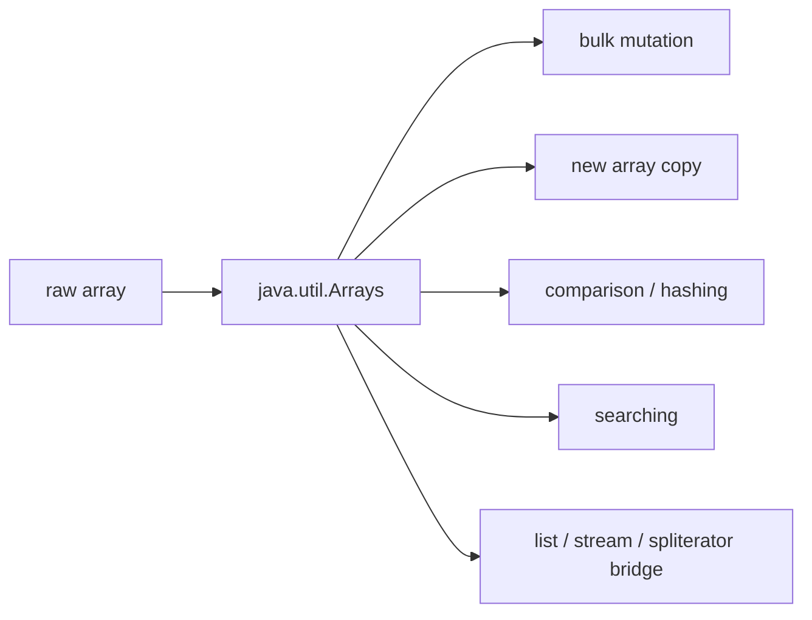

# Part 005 — Arrays Utility API: Sorting, Searching, Copying, Comparing

## 1. Tujuan Part Ini

Part sebelumnya membahas array dari sisi object model, type model, memory locality, dan performance reasoning. Part ini masuk ke utility API yang hampir selalu muncul ketika array dipakai secara serius: `java.util.Arrays`.

Targetnya bukan menghafal semua overload. Targetnya adalah memahami **semantic contract** setiap operasi:

- operasi mana yang **mutating** dan mana yang menghasilkan array baru;
- operasi mana yang bekerja pada **whole array** dan mana yang bekerja pada **range**;
- operasi mana yang bergantung pada **ordering precondition**;
- operasi mana yang shallow vs deep;
- operasi mana yang cocok di API boundary;
- operasi mana yang terlihat murah tetapi membawa hidden cost;
- operasi mana yang sebaiknya diganti dengan collection atau stream.

`Arrays` harus dipahami sebagai kumpulan **bulk operations** untuk array. Ia membuat operasi array lebih eksplisit, lebih aman, dan lebih mudah direview dibanding loop ad-hoc yang tersebar di codebase.

---

## 2. Mental Model: `Arrays` adalah Bulk API, Bukan Collection API

Array tidak mengimplementasikan `Collection`. Karena itu, operasi umum seperti sorting, copying, stringifying, equality, hash, searching, stream conversion, dan spliterator bridge diletakkan di utility class `java.util.Arrays`.

Mental modelnya:



`Arrays` bukan abstraction layer yang menyembunyikan array. Ia tetap mengasumsikan bahwa caller mengerti:

- array memiliki fixed length;
- array bisa mutable;
- array bisa expose alias;
- range memakai convention `[fromIndex, toIndex)`;
- primitive array dan reference array punya overload berbeda;
- nested array butuh `deep*` methods;
- binary search hanya valid pada sorted array/range.

Top 1% engineer tidak bertanya “method mana yang ada?”. Mereka bertanya:

> Apa invariant array sebelum operasi ini, apa invariant setelah operasi ini, dan apakah caller bisa merusaknya?

---

## 3. Taxonomy `Arrays` API

Secara praktis, method `Arrays` dapat dikelompokkan seperti ini:

| Kategori | Method utama | Mutasi input? | Output utama | Concern utama |
|---|---|---:|---|---|
| Sorting | `sort`, `parallelSort` | Ya | array tersortir | comparator contract, stability, cost |
| Searching | `binarySearch` | Tidak | index / insertion point | array harus sorted |
| Copying | `copyOf`, `copyOfRange` | Tidak | array baru | padding, truncation, runtime type |
| Filling | `fill` | Ya | array terisi value | aliasing object reference |
| Equality | `equals`, `deepEquals` | Tidak | boolean | shallow vs deep |
| Hashing | `hashCode`, `deepHashCode` | Tidak | int hash | mutable content hazard |
| Comparing | `compare`, `compareUnsigned`, `mismatch` | Tidak | lexicographic result / index | deterministic ordering |
| Printing | `toString`, `deepToString` | Tidak | string | nested arrays |
| Bridging | `asList`, `stream`, `spliterator` | Tidak langsung | list/view/stream/spliterator | backed view, laziness |

Prinsip desainnya sederhana:

- gunakan `Arrays` ketika operasi array adalah **bulk operation** yang umum dan well-known;
- gunakan loop manual ketika operasi membutuhkan invariant domain yang sulit diekspresikan dengan method umum;
- gunakan collection ketika ukuran, membership, indexing, uniqueness, atau ownership lebih cocok diekspresikan sebagai abstraction, bukan raw storage.

---

## 4. Range Convention: `[fromIndex, toIndex)`

Banyak method `Arrays` memiliki overload range:

```java
Arrays.sort(items, fromIndex, toIndex);
Arrays.copyOfRange(items, fromIndex, toIndex);
Arrays.fill(buffer, fromIndex, toIndex, value);
Arrays.binarySearch(items, fromIndex, toIndex, key);
```

Java memakai convention:

```text
fromIndex inclusive
toIndex   exclusive
```

Contoh:

```java
int[] numbers = {10, 20, 30, 40, 50};

int[] middle = Arrays.copyOfRange(numbers, 1, 4);
// [20, 30, 40]
```

Range `[1, 4)` mencakup index `1`, `2`, dan `3`, tetapi tidak mencakup `4`.

### 4.1 Kenapa Exclusive End Lebih Baik

Exclusive end membuat beberapa hal lebih rapi:

```java
int length = toIndex - fromIndex;
```

Empty range juga natural:

```java
Arrays.copyOfRange(numbers, 2, 2); // length 0
```

Range splitting juga tidak overlap:

```text
[0, mid) + [mid, length)
```

Ini penting saat kita nanti membahas spliterator dan stream partitioning.

### 4.2 Failure Model Range

Mayoritas range operation bisa gagal karena:

- `fromIndex < 0`;
- `toIndex > array.length`;
- `fromIndex > toIndex`;
- array `null`.

Di production code, jangan menyebarkan arithmetic range yang tidak diberi nama. Lebih baik buat helper kecil jika range punya makna domain.

Buruk:

```java
Arrays.copyOfRange(records, offset, offset + limit);
```

Lebih defensible:

```java
int fromInclusive = page.offset();
int toExclusive = Math.min(records.length, page.offset() + page.limit());

AuditRecord[] pageRecords = Arrays.copyOfRange(records, fromInclusive, toExclusive);
```

Lebih penting lagi: validasi semantic range sebelum masuk ke utility API jika error message harus domain-specific.

---

## 5. Sorting: `sort`

Sorting adalah operasi array yang paling sering disalahpahami. Ada beberapa dimensi:

- primitive vs object;
- natural ordering vs comparator;
- whole array vs range;
- stable vs tidak perlu stable;
- sequential vs parallel;
- in-place mutation;
- cost comparator;
- null policy.

### 5.1 Primitive Array Sorting

Contoh:

```java
int[] scores = {70, 90, 80, 70};
Arrays.sort(scores);
// [70, 70, 80, 90]
```

Primitive overload tersedia untuk `byte`, `short`, `char`, `int`, `long`, `float`, dan `double`.

Hal penting:

- sorting dilakukan **in-place**;
- tidak ada comparator untuk primitive array;
- ascending numerical order;
- floating-point sorting punya treatment khusus untuk `NaN` dan signed zero sesuai API contract;
- primitive sort tidak membawa konsep object identity atau stability karena elemennya value primitive.

### 5.2 Object Array Sorting dengan Natural Ordering

```java
String[] names = {"Rina", "Budi", "Andi"};
Arrays.sort(names);
// [Andi, Budi, Rina]
```

Precondition-nya:

- elemen harus mutually comparable;
- biasanya elemen mengimplementasikan `Comparable`;
- jika ada elemen yang tidak comparable, sorting bisa melempar `ClassCastException`;
- jika ada `null`, natural ordering biasanya gagal dengan `NullPointerException` kecuali logic comparator menangani null.

### 5.3 Object Array Sorting dengan Comparator

```java
record Employee(String id, String name, int seniority) {}

Employee[] employees = {
    new Employee("E-2", "Budi", 5),
    new Employee("E-1", "Andi", 5),
    new Employee("E-3", "Citra", 3)
};

Arrays.sort(employees,
    Comparator.comparingInt(Employee::seniority).reversed()
              .thenComparing(Employee::id));
```

Comparator adalah bagian dari domain policy. Jangan treat comparator sebagai detail teknis.

```java
Comparator<Employee> promotionOrder =
    Comparator.comparingInt(Employee::seniority).reversed()
              .thenComparing(Employee::id);
```

Nama seperti `promotionOrder`, `auditOrder`, `settlementOrder`, atau `displayOrder` jauh lebih maintainable dibanding inline comparator panjang.

### 5.4 Comparator Contract

Comparator harus konsisten terhadap ordering relation:

- antisymmetric;
- transitive;
- deterministic;
- tidak bergantung pada mutable external state;
- tidak melakukan side effect;
- sebisa mungkin consistent with equals jika dipakai untuk sorted set/map semantics.

Buruk:

```java
Comparator<Order> unstable = (a, b) -> {
    if (LocalTime.now().getSecond() % 2 == 0) {
        return a.id().compareTo(b.id());
    }
    return b.id().compareTo(a.id());
};
```

Comparator seperti ini bisa menyebabkan hasil sorting tidak deterministic dan dalam beberapa kasus sorting dapat mendeteksi contract violation.

### 5.5 Stable Sorting

Untuk object arrays, JDK API menyatakan object sorting stabil: elemen yang dianggap equal oleh ordering tidak akan direorder akibat sort.

Contoh manfaat stability:

```java
record Row(String customerId, int priority, long createdAt) {}

Row[] rows = loadRows();

Arrays.sort(rows, Comparator.comparing(Row::createdAt));
Arrays.sort(rows, Comparator.comparingInt(Row::priority).reversed());
```

Jika sort kedua stabil, rows dengan priority sama mempertahankan order `createdAt` dari sort pertama.

Namun di production, lebih jelas menulis comparator lengkap:

```java
Arrays.sort(rows,
    Comparator.comparingInt(Row::priority).reversed()
              .thenComparing(Row::createdAt));
```

Stability berguna, tetapi jangan membuat reader menebak dependency antar sort kecuali ada alasan kuat.

### 5.6 Range Sorting

```java
int[] buffer = {9, 4, 7, 3, 1, 8};
Arrays.sort(buffer, 1, 5);
// [9, 1, 3, 4, 7, 8]
```

Hanya range `[1, 5)` yang disortir. Ini berguna untuk:

- sort active region dari buffer;
- sort page/window;
- sort prefix setelah incremental loading;
- sort temporary working segment.

Naming sangat penting:

```java
int activeFromInclusive = 0;
int activeToExclusive = activeCount;
Arrays.sort(buffer, activeFromInclusive, activeToExclusive);
```

### 5.7 Sorting Mutates the Array

Ini obvious, tetapi bug production sering muncul karena aliasing.

```java
public void render(String[] names) {
    Arrays.sort(names); // mutates caller-owned array
    // ...
}
```

Jika method tidak memiliki ownership atas array input, buat copy:

```java
public List<String> renderSorted(String[] names) {
    String[] snapshot = Arrays.copyOf(names, names.length);
    Arrays.sort(snapshot);
    return Arrays.asList(snapshot);
}
```

Lebih eksplisit lagi:

```java
public static String[] sortedCopy(String[] source) {
    String[] copy = Arrays.copyOf(source, source.length);
    Arrays.sort(copy);
    return copy;
}
```

Rule:

> Sort in-place hanya aman jika method secara eksplisit memiliki working array tersebut.

---

## 6. Parallel Sorting: `parallelSort`

`Arrays.parallelSort` tersedia untuk primitive dan object arrays.

```java
long[] ids = loadLargeIdArray();
Arrays.parallelSort(ids);
```

Parallel sorting bukan “sort yang selalu lebih cepat”. Ia memiliki overhead:

- task splitting;
- synchronization/coordination;
- temporary working space;
- cache effects;
- common pool contention;
- comparator cost jika object array.

### 6.1 Kapan Masuk Akal

`parallelSort` lebih masuk akal ketika:

- array besar;
- CPU punya core cukup;
- proses CPU-bound;
- tidak sedang berada di latency-sensitive request path yang berbagi common pool;
- tidak ada tekanan GC tinggi;
- comparator murah dan deterministic;
- workload bisa diukur dengan benchmark representatif.

### 6.2 Kapan Hindari

Hindari `parallelSort` ketika:

- array kecil;
- comparator melakukan IO atau akses remote;
- dipanggil dari request thread dengan SLA ketat;
- aplikasi lain juga memakai common ForkJoinPool intensif;
- ordering hanya kosmetik dan bisa ditunda;
- hasil sorting tidak berada di bottleneck terukur.

### 6.3 Production Rule

Jangan mengganti `sort` menjadi `parallelSort` tanpa measurement.

```java
// Tidak defensible
Arrays.parallelSort(records);

// Defensible jika ada benchmark dan workload jelas
sortLargeOfflineBatch(records);
```

Beri nama method agar pembaca tahu konteksnya adalah offline batch, bukan request path.

---

## 7. Searching: `binarySearch`

`Arrays.binarySearch` melakukan binary search pada sorted array.

```java
int[] ids = {10, 20, 30, 40};
int index = Arrays.binarySearch(ids, 30); // 2
```

Precondition paling penting:

> Array atau range harus sudah sorted sesuai ordering yang sama dengan search.

Jika tidak sorted, result undefined secara semantic. Ia bisa terlihat benar untuk beberapa input dan salah untuk input lain.

### 7.1 Return Value Contract

Jika key ditemukan, return index `>= 0`.

Jika key tidak ditemukan, return:

```text
-(insertionPoint) - 1
```

Insertion point adalah index tempat key dapat dimasukkan agar array tetap sorted.

Contoh:

```java
int[] values = {10, 20, 40, 50};

int index = Arrays.binarySearch(values, 30);
// index = -3

int insertionPoint = -index - 1;
// insertionPoint = 2
```

Karena 30 harus dimasukkan di index 2.

Helper lebih readable:

```java
static int insertionPoint(int binarySearchResult) {
    return -binarySearchResult - 1;
}
```

Pemakaian:

```java
int result = Arrays.binarySearch(values, target);
if (result >= 0) {
    return result;
}
return insertionPoint(result);
```

### 7.2 Duplicate Elements

Jika array memiliki duplicate key, binary search tidak menjamin index mana yang dikembalikan.

```java
int[] values = {10, 20, 20, 20, 30};
int index = Arrays.binarySearch(values, 20);
// could be one of the matching indexes, do not rely on first/last
```

Jika butuh first occurrence atau last occurrence, implement lower-bound/upper-bound sendiri.

```java
static int lowerBound(int[] sorted, int key) {
    int lo = 0;
    int hi = sorted.length;

    while (lo < hi) {
        int mid = (lo + hi) >>> 1;
        if (sorted[mid] < key) {
            lo = mid + 1;
        } else {
            hi = mid;
        }
    }
    return lo;
}
```

### 7.3 Comparator Search

Untuk object arrays:

```java
record Customer(String id, String name) {}

Comparator<Customer> byId = Comparator.comparing(Customer::id);

Customer[] customers = loadCustomers();
Arrays.sort(customers, byId);

int index = Arrays.binarySearch(
    customers,
    new Customer("C-100", "ignored"),
    byId
);
```

Pastikan comparator untuk sorting dan searching sama. Jangan sort by `name`, search by `id`.

Lebih baik buat domain method:

```java
final class CustomerIndex {
    private static final Comparator<Customer> BY_ID = Comparator.comparing(Customer::id);

    private final Customer[] customersById;

    CustomerIndex(Collection<Customer> customers) {
        this.customersById = customers.toArray(Customer[]::new);
        Arrays.sort(this.customersById, BY_ID);
    }

    Optional<Customer> findById(String id) {
        int index = Arrays.binarySearch(
            customersById,
            new Customer(id, ""),
            BY_ID
        );
        return index >= 0 ? Optional.of(customersById[index]) : Optional.empty();
    }
}
```

Catatan: contoh ini pedagogis. Dalam production, `Map<String, Customer>` sering lebih tepat untuk repeated lookup. Binary search di sorted array masuk akal ketika memory compactness, read-only snapshot, atau deterministic ordering lebih penting.

---

## 8. Copying: `copyOf` dan `copyOfRange`

Copying adalah operasi boundary paling penting. Ia menentukan apakah array adalah internal working state atau data yang boleh dialias oleh caller.

### 8.1 `copyOf`

```java
int[] original = {1, 2, 3};
int[] copy = Arrays.copyOf(original, original.length);
```

`copyOf` menghasilkan array baru.

Jika length baru lebih pendek:

```java
int[] truncated = Arrays.copyOf(original, 2);
// [1, 2]
```

Jika length baru lebih panjang:

```java
int[] padded = Arrays.copyOf(original, 5);
// [1, 2, 3, 0, 0]
```

Untuk reference array, padding memakai `null`:

```java
String[] names = {"A", "B"};
String[] padded = Arrays.copyOf(names, 4);
// ["A", "B", null, null]
```

### 8.2 `copyOfRange`

```java
long[] timestamps = {100, 200, 300, 400};
long[] window = Arrays.copyOfRange(timestamps, 1, 3);
// [200, 300]
```

Jika `to` lebih besar dari length array, hasil dipadding default value.

```java
int[] values = {1, 2, 3};
int[] range = Arrays.copyOfRange(values, 1, 5);
// [2, 3, 0, 0]
```

Ini sering mengejutkan. Jika padding bukan semantic yang diinginkan, validasi range sebelum copy.

### 8.3 Shallow Copy

Untuk reference array, `copyOf` menyalin reference, bukan object di dalamnya.

```java
record MutableBox(StringBuilder value) {}

MutableBox[] original = {
    new MutableBox(new StringBuilder("A"))
};

MutableBox[] copy = Arrays.copyOf(original, original.length);
copy[0].value().append("!");

// original[0] melihat perubahan yang sama
```

Rule:

> `Arrays.copyOf` adalah structural copy array, bukan deep copy object graph.

Jika elemen mutable dan boundary butuh isolation, copy setiap elemen.

```java
CustomerSnapshot[] copy = Arrays.stream(source)
    .map(CustomerSnapshot::copy)
    .toArray(CustomerSnapshot[]::new);
```

Atau gunakan loop eksplisit jika copy policy penting.

### 8.4 Runtime Type Copy

Untuk object arrays, `copyOf` mempertahankan runtime type original array.

```java
String[] names = {"A", "B"};
String[] copy = Arrays.copyOf(names, names.length);
```

Ada overload untuk menentukan target array class:

```java
Object[] objects = Arrays.copyOf(names, names.length, Object[].class);
```

Ini berguna di library code, tetapi jangan digunakan untuk menyembunyikan type issue yang seharusnya diekspresikan dengan collection atau generic API.

### 8.5 Defensive Copy Pattern

Constructor defensive copy:

```java
public final class ScoreTable {
    private final int[] scores;

    public ScoreTable(int[] scores) {
        this.scores = Arrays.copyOf(scores, scores.length);
    }

    public int[] scores() {
        return Arrays.copyOf(scores, scores.length);
    }
}
```

Tanpa defensive copy:

```java
int[] scores = {10, 20};
ScoreTable table = new ScoreTable(scores);
scores[0] = 999; // can corrupt object invariant if constructor stores reference directly
```

Boundary rule:

- input array from caller: copy unless ownership is transferred explicitly;
- output array to caller: copy unless mutation is intentionally part of API contract;
- internal working array: can mutate freely;
- cached snapshot array: make it immutable by convention plus defensive copy.

---

## 9. Low-Level Copy: `System.arraycopy`

`Arrays.copyOf` internally uses array copy mechanisms, but sometimes direct `System.arraycopy` is clearer for buffer manipulation.

```java
byte[] source = {1, 2, 3, 4};
byte[] target = new byte[4];

System.arraycopy(source, 1, target, 0, 3);
// target = [2, 3, 4, 0]
```

Use `System.arraycopy` when you already have target array and need precise placement.

Use `Arrays.copyOf` when you want a new array with copied content.

### 9.1 Overlapping Copy

`System.arraycopy` handles overlapping regions correctly as if copied through a temporary buffer.

Useful for shifting:

```java
static void insertAt(int[] array, int size, int index, int value) {
    if (size >= array.length) {
        throw new IllegalArgumentException("array is full");
    }
    if (index < 0 || index > size) {
        throw new IndexOutOfBoundsException(index);
    }

    System.arraycopy(array, index, array, index + 1, size - index);
    array[index] = value;
}
```

This is essentially how many array-backed structures reason about insertion.

---

## 10. Filling: `fill`

`Arrays.fill` mutates array by assigning the same value/reference to each slot.

```java
int[] counters = new int[10];
Arrays.fill(counters, -1);
```

Range fill:

```java
Arrays.fill(counters, 2, 5, 0);
```

### 10.1 Reference Fill Hazard

For object arrays, `fill` assigns the same reference to every slot.

```java
StringBuilder[] builders = new StringBuilder[3];
Arrays.fill(builders, new StringBuilder());

builders[0].append("x");
System.out.println(builders[1]); // also sees x
```

This is almost always a bug for mutable objects.

Correct:

```java
StringBuilder[] builders = new StringBuilder[3];
for (int i = 0; i < builders.length; i++) {
    builders[i] = new StringBuilder();
}
```

`fill` is safe for:

- primitives;
- immutable objects;
- sentinel references intentionally shared;
- clearing references to `null`.

Example clearing for GC eligibility:

```java
Arrays.fill(buffer, 0, size, null);
size = 0;
```

---

## 11. Equality and Hashing: `equals`, `deepEquals`, `hashCode`, `deepHashCode`

Array `equals` inherited from `Object` checks identity, not contents.

```java
int[] a = {1, 2};
int[] b = {1, 2};

System.out.println(a.equals(b));        // false
System.out.println(Arrays.equals(a, b)); // true
```

### 11.1 Shallow Equality

```java
String[] a = {"A", "B"};
String[] b = {"A", "B"};

Arrays.equals(a, b); // true
```

For object arrays, `Arrays.equals` compares elements using `Objects.equals`-like semantics.

### 11.2 Deep Equality

Nested arrays need `deepEquals`.

```java
Object[] x = {new int[] {1, 2}};
Object[] y = {new int[] {1, 2}};

Arrays.equals(x, y);     // false, inner int[] compared by identity
Arrays.deepEquals(x, y); // true
```

Use `deepEquals` only when nested array structure is intentional. If nested arrays represent records, matrices, or payloads, consider domain-specific comparison method for clearer error reporting.

### 11.3 Hashing

```java
int[] key = {1, 2, 3};
int hash = Arrays.hashCode(key);
```

Hash matches content, but beware:

- array remains mutable;
- mutable data should not be used as map key unless frozen by convention and never mutated;
- `hashCode` result is not cryptographic;
- `deepHashCode` follows deep array structure.

Bad key:

```java
Map<int[], String> map = new HashMap<>();
map.put(new int[] {1, 2}, "value");

map.get(new int[] {1, 2}); // null, identity key semantics in HashMap
```

If content-based key is needed, wrap it:

```java
public final class IntArrayKey {
    private final int[] values;

    public IntArrayKey(int[] values) {
        this.values = Arrays.copyOf(values, values.length);
    }

    @Override
    public boolean equals(Object other) {
        return other instanceof IntArrayKey that
            && Arrays.equals(this.values, that.values);
    }

    @Override
    public int hashCode() {
        return Arrays.hashCode(values);
    }
}
```

---

## 12. Lexicographic Comparison: `compare`, `compareUnsigned`, `mismatch`

Modern Java provides array comparison utilities that are useful for deterministic ordering and diagnostics.

### 12.1 `compare`

```java
int result = Arrays.compare(new int[] {1, 2}, new int[] {1, 3});
// result < 0
```

Lexicographic comparison means:

- compare first element;
- if equal, compare second element;
- continue until mismatch;
- if one array is prefix of another, shorter array is smaller.

Examples:

```text
[1, 2]    < [1, 3]
[1, 2]    < [1, 2, 0]
[2]       > [1, 999]
[]        < [1]
```

Useful for:

- deterministic ordering of binary keys;
- version vectors represented as arrays;
- canonical ordering in tests;
- sorting encoded tuple keys.

### 12.2 `compareUnsigned`

For `byte`, `short`, `int`, and `long`, unsigned comparison matters when data represents binary bytes, network values, or encoded identifiers.

```java
byte[] a = {(byte) 0xFF};
byte[] b = {0x01};

Arrays.compare(a, b);         // signed comparison: -1 may be considered smaller
Arrays.compareUnsigned(a, b); // unsigned comparison: 255 > 1
```

Use unsigned comparison when bytes represent binary data, not signed numeric domain values.

### 12.3 `mismatch`

```java
byte[] expected = {1, 2, 3, 4};
byte[] actual = {1, 2, 9, 4};

int firstMismatch = Arrays.mismatch(expected, actual); // 2
```

If arrays match, result is `-1`.

This is excellent for diagnostics:

```java
static void assertPayloadEquals(byte[] expected, byte[] actual) {
    int mismatch = Arrays.mismatch(expected, actual);
    if (mismatch != -1) {
        throw new IllegalArgumentException(
            "payload mismatch at byte " + mismatch
        );
    }
}
```

This gives more actionable error than `Arrays.equals` alone.

---

## 13. String Representation: `toString` and `deepToString`

Array `toString()` inherited from `Object` is not content-friendly.

```java
int[] values = {1, 2, 3};
System.out.println(values); // [I@...
```

Use:

```java
System.out.println(Arrays.toString(values));
// [1, 2, 3]
```

For nested arrays:

```java
Object[] nested = {new int[] {1, 2}, new String[] {"A", "B"}};

System.out.println(Arrays.toString(nested));
// [[I@..., [Ljava.lang.String;@...]

System.out.println(Arrays.deepToString(nested));
// [[1, 2], [A, B]]
```

Production guidance:

- use `toString`/`deepToString` for logs and debugging;
- do not use them as stable serialization format;
- beware logging huge arrays;
- redact sensitive arrays such as tokens, secrets, raw credentials, and personal data.

---

## 14. `asList`: The Famous Trap

`Arrays.asList` returns a fixed-size list backed by the provided array.

```java
String[] names = {"A", "B"};
List<String> list = Arrays.asList(names);

list.set(0, "X");
System.out.println(Arrays.toString(names));
// [X, B]
```

Changes through `set` write through to the array.

But structural modifications are not supported:

```java
list.add("C");    // UnsupportedOperationException
list.remove("A"); // UnsupportedOperationException
```

### 14.1 Fixed-Size Is Not Immutable

`Arrays.asList` is:

- fixed-size;
- backed by array;
- mutable by replacement via `set`;
- not structurally modifiable;
- not an independent snapshot.

It is not the same as:

```java
List.of("A", "B")
```

And not the same as:

```java
new ArrayList<>(Arrays.asList(names))
```

### 14.2 Primitive Array Trap

```java
int[] numbers = {1, 2, 3};
List<int[]> list = Arrays.asList(numbers);
```

This creates a list with one element: the entire `int[]`.

Why? Because generics work with reference types, and `int[]` itself is a reference type.

Correct for primitive stream:

```java
List<Integer> boxed = Arrays.stream(numbers)
    .boxed()
    .toList();
```

But consider whether boxing is actually needed.

### 14.3 Safe Usage Matrix

| Intent | Recommended code |
|---|---|
| Fixed-size array-backed view | `Arrays.asList(array)` |
| Independent mutable list | `new ArrayList<>(Arrays.asList(array))` |
| Unmodifiable snapshot list | `List.copyOf(Arrays.asList(array))` |
| Immutable literal values | `List.of("A", "B")` |
| Primitive array to stream | `Arrays.stream(intArray)` |
| Primitive array to boxed list | `Arrays.stream(intArray).boxed().toList()` |

---

## 15. Stream and Spliterator Bridge

`Arrays` provides stream methods:

```java
int[] values = {1, 2, 3};
int sum = Arrays.stream(values).sum();
```

For primitive arrays:

- `int[]` → `IntStream`;
- `long[]` → `LongStream`;
- `double[]` → `DoubleStream`.

For object arrays:

```java
String[] names = {"A", "B"};
Stream<String> stream = Arrays.stream(names);
```

Range stream:

```java
IntStream activeValues = Arrays.stream(values, fromInclusive, toExclusive);
```

### 15.1 Stream Source Is the Array

A stream from array reads from that array as source. Avoid mutating the array while the stream pipeline is being consumed.

Bad:

```java
int[] values = {1, 2, 3};
IntStream stream = Arrays.stream(values);
values[0] = 999;
int sum = stream.sum(); // behavior depends on when consumption happens
```

Because stream execution is lazy, mutation before terminal operation can affect result.

Rule:

> Treat stream source as frozen for the lifetime of the pipeline.

### 15.2 Spliterator Bridge

`Arrays.spliterator(array)` exposes array traversal/partitioning to APIs that consume spliterators.

```java
Spliterator.OfInt spliterator = Arrays.spliterator(new int[] {1, 2, 3});
```

This becomes important later when we discuss stream internals. For now, remember:

- arrays have excellent splitting properties;
- fixed size is known;
- encounter order is defined by index order;
- this makes arrays good stream sources compared to many pointer-heavy structures.

---

## 16. Practical Recipes

### 16.1 Sorted Copy Without Mutating Caller

```java
public static String[] sortedCopy(String[] source) {
    String[] copy = Arrays.copyOf(source, source.length);
    Arrays.sort(copy);
    return copy;
}
```

### 16.2 Stable Object Sort with Explicit Tie-Breaker

```java
record Invoice(String id, String customerId, long createdAt, long amount) {}

static final Comparator<Invoice> AUDIT_ORDER =
    Comparator.comparing(Invoice::customerId)
              .thenComparingLong(Invoice::createdAt)
              .thenComparing(Invoice::id);

static Invoice[] auditOrdered(Invoice[] invoices) {
    Invoice[] copy = Arrays.copyOf(invoices, invoices.length);
    Arrays.sort(copy, AUDIT_ORDER);
    return copy;
}
```

### 16.3 Safe Binary Search Wrapper

```java
final class SortedLongIds {
    private final long[] ids;

    SortedLongIds(long[] ids) {
        this.ids = Arrays.copyOf(ids, ids.length);
        Arrays.sort(this.ids);
    }

    boolean contains(long id) {
        return Arrays.binarySearch(ids, id) >= 0;
    }

    long[] snapshot() {
        return Arrays.copyOf(ids, ids.length);
    }
}
```

This wrapper protects the sorted invariant.

### 16.4 First Mismatch Diagnostic

```java
static Optional<String> comparePayload(byte[] expected, byte[] actual) {
    int mismatch = Arrays.mismatch(expected, actual);
    if (mismatch == -1) {
        return Optional.empty();
    }
    return Optional.of("first mismatch at byte index " + mismatch);
}
```

### 16.5 Array Content Key Wrapper

```java
public final class ByteArrayKey {
    private final byte[] bytes;

    public ByteArrayKey(byte[] bytes) {
        this.bytes = Arrays.copyOf(bytes, bytes.length);
    }

    public byte[] bytes() {
        return Arrays.copyOf(bytes, bytes.length);
    }

    @Override
    public boolean equals(Object other) {
        return other instanceof ByteArrayKey that
            && Arrays.equals(this.bytes, that.bytes);
    }

    @Override
    public int hashCode() {
        return Arrays.hashCode(bytes);
    }
}
```

Useful when binary content must act as key.

---

## 17. Common Production Bugs

### 17.1 Sorting Caller-Owned Array

```java
void process(Order[] orders) {
    Arrays.sort(orders, ORDERING); // mutates caller-owned array
}
```

Fix:

```java
Order[] copy = Arrays.copyOf(orders, orders.length);
Arrays.sort(copy, ORDERING);
```

### 17.2 Binary Search on Unsorted Array

```java
boolean exists(int[] ids, int id) {
    return Arrays.binarySearch(ids, id) >= 0;
}
```

This is wrong unless sorted invariant is guaranteed. Encapsulate sorted invariant in a type.

### 17.3 Misusing `asList` as Mutable List

```java
List<String> names = Arrays.asList("A", "B");
names.add("C"); // fails
```

Fix:

```java
List<String> names = new ArrayList<>(Arrays.asList("A", "B"));
```

### 17.4 Primitive Array to `asList`

```java
List<int[]> list = Arrays.asList(new int[] {1, 2, 3});
```

Fix:

```java
List<Integer> list = Arrays.stream(new int[] {1, 2, 3})
    .boxed()
    .toList();
```

### 17.5 Shallow Copy Mistaken for Deep Copy

```java
Address[] copy = Arrays.copyOf(addresses, addresses.length);
copy[0].setCity("Jakarta"); // same Address object
```

Fix: use element-level copy.

### 17.6 Filling with Mutable Object

```java
Arrays.fill(rows, new ArrayList<>());
```

All slots share the same list. Use loop.

---

## 18. Decision Table

| Problem | Good default | Avoid |
|---|---|---|
| Need sorted primitive array | `Arrays.sort(int[])` | boxing to `List<Integer>` just to sort |
| Need sorted object array copy | `copyOf` + `sort` | mutating caller-owned array |
| Need repeated lookup in read-only sorted IDs | sorted array + `binarySearch` | linear scan every time |
| Need first/last duplicate index | custom lower/upper bound | assuming `binarySearch` returns first |
| Need content equality | `Arrays.equals` | `array.equals` |
| Need nested array equality | `Arrays.deepEquals` | shallow `Arrays.equals` |
| Need diagnostic difference | `Arrays.mismatch` | generic “not equal” message |
| Need independent mutable list | `new ArrayList<>(Arrays.asList(a))` | raw `Arrays.asList` then `add` |
| Need primitive stream | `Arrays.stream(int[])` | `Arrays.asList(int[])` |
| Need clear reference slots | `Arrays.fill(array, null)` | leaving old refs in long-lived buffer |
| Need binary key map key | wrapper + defensive copy | raw `byte[]` as `HashMap` key |

---

## 19. Code Review Checklist

Saat melihat pemakaian `Arrays`, tanyakan:

1. Apakah method ini mutating? Jika iya, siapa owner array-nya?
2. Apakah range `[from, to)` sudah divalidasi?
3. Apakah sorting comparator deterministic dan contract-compliant?
4. Apakah `binarySearch` dipakai hanya pada sorted invariant yang jelas?
5. Apakah duplicate handling membutuhkan first/last occurrence?
6. Apakah `copyOf` dianggap deep copy secara keliru?
7. Apakah `asList` dipakai sebagai mutable list?
8. Apakah primitive array salah dikonversi dengan `asList`?
9. Apakah array dipakai sebagai map key tanpa wrapper?
10. Apakah `parallelSort` benar-benar diukur?
11. Apakah log memakai `toString`/`deepToString` dengan ukuran dan sensitivity aman?
12. Apakah stream source dimutasi sebelum terminal operation?

---

## 20. Latihan Kaufman 60 Menit

### Latihan 1 — Defensive Boundary

Buat class:

```java
final class IntSnapshot {
    private final int[] values;
}
```

Requirement:

- constructor menerima `int[]`;
- internal state tidak bisa dimutasi caller;
- method `values()` mengembalikan snapshot;
- method `sorted()` mengembalikan sorted snapshot;
- method `contains(int)` boleh menggunakan binary search, tetapi hanya jika invariant aman.

Evaluasi:

- apakah sorted invariant dipisah dari original order?
- apakah caller bisa merusak internal state?
- apakah `contains` benar untuk unsorted state?

### Latihan 2 — Binary Search Wrapper

Buat `SortedLongSetSnapshot` berbasis `long[]`:

- constructor copy input;
- sort input copy;
- remove duplicate;
- expose `contains`;
- expose `size`;
- expose `toArray` defensive copy.

Tujuan: memahami kapan array bisa menjadi compact read-only set.

### Latihan 3 — Mismatch Diagnostic

Buat helper:

```java
static String describeFirstMismatch(byte[] expected, byte[] actual)
```

Harus menangani:

- same content;
- different byte;
- expected shorter;
- actual shorter;
- null input tidak diterima.

---

## 21. Ringkasan

`java.util.Arrays` adalah API kecil yang terlihat sederhana, tetapi sangat penting untuk engineering serius.

Key takeaways:

- `sort` dan `fill` memutasi array;
- `copyOf` dan `copyOfRange` membuat array baru tetapi shallow untuk reference elements;
- `binarySearch` hanya valid pada sorted array/range;
- object sort memiliki stability guarantee;
- `parallelSort` perlu measurement, bukan asumsi;
- `equals`, `hashCode`, `compare`, dan `mismatch` memberi content semantics yang array sendiri tidak punya;
- `asList` adalah fixed-size backed view, bukan independent mutable list;
- primitive array tidak berubah menjadi `List<Integer>` dengan `asList`;
- arrays dapat menjadi source stream/spliterator yang efisien, tetapi source harus diperlakukan frozen selama pipeline.

Part berikutnya akan membahas **array design patterns and anti-patterns**: kapan array menjadi solusi yang tepat, kapan ia menjadi technical debt, dan bagaimana mengenali bug desain seperti parallel arrays, exposed internal buffers, sentinel misuse, serta sparse-index modeling yang rapuh.

---

## 22. Referensi

- Oracle Java SE 25 API — `java.util.Arrays`: `https://docs.oracle.com/en/java/javase/25/docs/api/java.base/java/util/Arrays.html`
- Oracle Java SE 25 API — `java.lang.System.arraycopy`: `https://docs.oracle.com/en/java/javase/25/docs/api/java.base/java/lang/System.html#arraycopy(java.lang.Object,int,java.lang.Object,int,int)`
- Oracle Java SE 25 API — `java.util.Comparator`: `https://docs.oracle.com/en/java/javase/25/docs/api/java.base/java/util/Comparator.html`
- Oracle Java SE 25 API — `java.util.Spliterator`: `https://docs.oracle.com/en/java/javase/25/docs/api/java.base/java/util/Spliterator.html`
