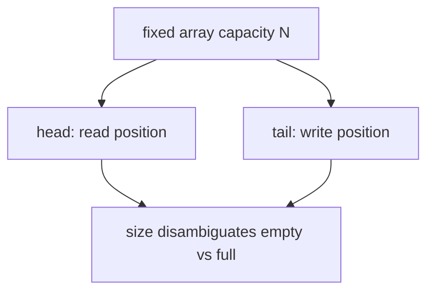

# Part 006 — Array Design Patterns and Anti-Patterns

## 1. Tujuan Part Ini

Part ini membahas array sebagai **alat desain**, bukan hanya struktur penyimpanan. Array bisa menjadi pilihan yang sangat kuat ketika kita butuh fixed-size storage, compact memory, predictable indexing, locality, dan low overhead. Tetapi array juga bisa menjadi sumber bug besar ketika dipakai untuk memodelkan domain yang sebenarnya membutuhkan contract lebih kaya seperti uniqueness, ownership, ordering policy, mutation control, atau lookup by key.

Target part ini:

- memahami kapan array adalah desain yang tepat;
- mengenali pola array yang legitimate di production;
- mengenali anti-pattern array yang menurunkan correctness dan maintainability;
- mengubah raw array code menjadi abstraction yang lebih defensible;
- menyiapkan mental model sebelum masuk ke Java Collections Framework.

Prinsip utama:

> Array adalah storage primitive. Collection adalah semantic abstraction. Jangan memaksa storage primitive menjadi domain abstraction tanpa boundary yang jelas.

---

## 2. Array sebagai Design Choice

Array cocok ketika constraint berikut dominan:

| Constraint | Kenapa array cocok |
|---|---|
| Ukuran tetap atau punya upper bound jelas | length fixed dan mudah dialokasikan sekali |
| Traversal dominan | index order predictable dan cache-friendly |
| Primitive data besar | menghindari boxing overhead |
| Internal buffer | representasi storage tidak perlu diekspos |
| Interop API | banyak API rendah-level memakai array |
| Snapshot read-only | compact dan mudah defensive copy |
| Hot path terukur | mengurangi overhead abstraction jika benar-benar bottleneck |

Array kurang cocok ketika kebutuhan utama adalah:

- dynamic growth yang sering;
- uniqueness semantic;
- lookup by key;
- frequent insert/remove di tengah;
- ownership/mutability contract yang kompleks;
- domain object grouping;
- expressive API boundary;
- sparse keyspace besar;
- concurrent mutation semantics.

Rule awal:

```text
Use array for storage.
Use collection for contract.
Wrap array when storage and contract both matter.
```

---

## 3. Pattern 1: Fixed-Size Table

Fixed-size table adalah array dengan ukuran yang diketahui dari domain atau konfigurasi.

Contoh domain:

- 24 jam dalam satu hari;
- 7 hari dalam seminggu;
- 12 bulan dalam satu tahun;
- 256 byte values;
- fixed number of buckets;
- known number of scoring slots.

```java
public final class HourlyCounters {
    private static final int HOURS_PER_DAY = 24;

    private final long[] counts = new long[HOURS_PER_DAY];

    public void increment(int hour) {
        requireHour(hour);
        counts[hour]++;
    }

    public long countAt(int hour) {
        requireHour(hour);
        return counts[hour];
    }

    public long[] snapshot() {
        return Arrays.copyOf(counts, counts.length);
    }

    private static void requireHour(int hour) {
        if (hour < 0 || hour >= HOURS_PER_DAY) {
            throw new IllegalArgumentException("hour must be in [0, 23]: " + hour);
        }
    }
}
```

### 3.1 Kenapa Ini Bagus

Array internal cocok karena:

- length fixed;
- index punya domain meaning jelas;
- primitive `long[]` compact;
- traversal dan aggregation murah;
- API tidak expose raw mutable array.

### 3.2 Failure Mode

Bug muncul jika index domain tidak divalidasi:

```java
counts[hour]++; // ArrayIndexOutOfBoundsException leaks implementation detail
```

Lebih baik throw domain error:

```java
throw new IllegalArgumentException("hour must be in [0, 23]: " + hour);
```

### 3.3 Design Rule

Fixed-size table harus memiliki:

- named constant untuk size;
- validation untuk index;
- method domain-specific;
- defensive snapshot jika diekspos;
- tidak mengandalkan caller memahami index convention internal.

---

## 4. Pattern 2: Dense Lookup Table

Dense lookup table memakai array ketika keyspace kecil, integer-like, dan dense.

Contoh: mapping byte value ke category.

```java
enum ByteClass {
    CONTROL,
    DIGIT,
    LETTER,
    OTHER
}

public final class ByteClassifier {
    private static final ByteClass[] TABLE = buildTable();

    private static ByteClass[] buildTable() {
        ByteClass[] table = new ByteClass[256];
        Arrays.fill(table, ByteClass.OTHER);

        for (int i = 0; i < 32; i++) {
            table[i] = ByteClass.CONTROL;
        }
        for (int ch = '0'; ch <= '9'; ch++) {
            table[ch] = ByteClass.DIGIT;
        }
        for (int ch = 'A'; ch <= 'Z'; ch++) {
            table[ch] = ByteClass.LETTER;
        }
        for (int ch = 'a'; ch <= 'z'; ch++) {
            table[ch] = ByteClass.LETTER;
        }
        return table;
    }

    public ByteClass classify(byte value) {
        return TABLE[value & 0xFF];
    }
}
```

### 4.1 Kenapa `value & 0xFF`

Java `byte` signed: `-128..127`. Jika byte mewakili binary octet, kita perlu unsigned index `0..255`.

```java
int unsigned = value & 0xFF;
```

### 4.2 Kapan Lebih Baik daripada Map

Dense lookup table lebih baik dari `Map<Integer, ByteClass>` ketika:

- keyspace kecil dan fixed;
- lookup sangat sering;
- all possible values valid;
- memory array kecil;
- initialization jelas.

### 4.3 Kapan Buruk

Jangan gunakan dense array jika keyspace besar dan sparse:

```java
User[] usersById = new User[100_000_000]; // terrible if only 10k users exist
```

Gunakan `Map<UserId, User>`.

---

## 5. Pattern 3: Internal Working Buffer

Array sangat umum sebagai internal buffer.

Contoh simplified dynamic int buffer:

```java
public final class IntBuffer {
    private int[] elements;
    private int size;

    public IntBuffer(int initialCapacity) {
        if (initialCapacity < 0) {
            throw new IllegalArgumentException("initialCapacity must be >= 0");
        }
        this.elements = new int[initialCapacity];
    }

    public void add(int value) {
        ensureCapacity(size + 1);
        elements[size++] = value;
    }

    public int get(int index) {
        checkIndex(index);
        return elements[index];
    }

    public int size() {
        return size;
    }

    public int[] toArray() {
        return Arrays.copyOf(elements, size);
    }

    private void ensureCapacity(int minCapacity) {
        if (minCapacity <= elements.length) {
            return;
        }
        int newCapacity = Math.max(minCapacity, elements.length + (elements.length >> 1) + 1);
        elements = Arrays.copyOf(elements, newCapacity);
    }

    private void checkIndex(int index) {
        if (index < 0 || index >= size) {
            throw new IndexOutOfBoundsException("index=" + index + ", size=" + size);
        }
    }
}
```

### 5.1 Key Invariant

```text
0 <= size <= elements.length
valid data is elements[0..size)
elements[size..capacity) is unused storage
```

Diagram:

```mermaid
flowchart LR
    A[0] --> B[valid region 0..size)
    B --> C[unused capacity size..length)
```

### 5.2 Kenapa Invariant Penting

Array-backed structures selalu memiliki dua konsep:

- capacity: physical storage length;
- size: logical number of elements.

Bug terjadi ketika capacity dianggap size.

Buruk:

```java
for (int value : elements) {
    process(value); // processes unused default zeros too
}
```

Benar:

```java
for (int i = 0; i < size; i++) {
    process(elements[i]);
}
```

### 5.3 Reference Buffer Clearing

Jika buffer menyimpan reference object, clear unused references saat remove/clear agar object lama eligible untuk GC.

```java
public void clear() {
    Arrays.fill(elements, 0, size, null);
    size = 0;
}
```

Untuk primitive array, clearing sering tidak perlu kecuali semantic membutuhkan reset.

---

## 6. Pattern 4: Snapshot Array

Snapshot array adalah array yang merepresentasikan state pada satu waktu.

```java
public final class RuleSnapshot {
    private final Rule[] rules;

    public RuleSnapshot(Collection<Rule> rules) {
        this.rules = rules.toArray(Rule[]::new);
        Arrays.sort(this.rules, Comparator.comparing(Rule::priority).reversed());
    }

    public Rule[] rules() {
        return Arrays.copyOf(rules, rules.length);
    }

    public Stream<Rule> stream() {
        return Arrays.stream(rules);
    }
}
```

### 6.1 Kenapa Snapshot Cocok

Snapshot array cocok ketika:

- state dibangun sekali;
- setelah itu mostly read-only;
- traversal sering;
- ordering sudah dikunci;
- object wrapper menjaga defensive boundary.

### 6.2 Risk

`final Rule[] rules` hanya membuat reference field final. Isi array tetap mutable.

```java
rules[0] = anotherRule; // possible inside class
```

Dan elemen `Rule` sendiri bisa mutable. Snapshot array bukan deep immutability.

### 6.3 Better Contract

Jika snapshot harus immutable secara kuat:

- gunakan immutable element type;
- copy array saat input;
- jangan expose raw array;
- return `List.copyOf(Arrays.asList(rules))` jika caller perlu collection view;
- document bahwa order adalah part of contract.

---

## 7. Pattern 5: Ring Buffer Mental Model

Ring buffer memakai fixed-size array dan dua pointer/index. Kita tidak akan masuk concurrency detail di sini. Fokusnya adalah state invariant.

```java
public final class IntRingBuffer {
    private final int[] elements;
    private int head;
    private int tail;
    private int size;

    public IntRingBuffer(int capacity) {
        if (capacity <= 0) {
            throw new IllegalArgumentException("capacity must be > 0");
        }
        this.elements = new int[capacity];
    }

    public boolean offer(int value) {
        if (size == elements.length) {
            return false;
        }
        elements[tail] = value;
        tail = (tail + 1) % elements.length;
        size++;
        return true;
    }

    public OptionalInt poll() {
        if (size == 0) {
            return OptionalInt.empty();
        }
        int value = elements[head];
        head = (head + 1) % elements.length;
        size--;
        return OptionalInt.of(value);
    }

    public int size() {
        return size;
    }
}
```

### 7.1 Ring Buffer Invariants

```text
0 <= head < capacity
0 <= tail < capacity
0 <= size <= capacity
head points to next element to read when size > 0
tail points to next slot to write when size < capacity
```

Visualization:



### 7.2 Why `size` Matters

Without `size`, `head == tail` can mean:

- empty;
- full.

You need either:

- separate `size`;
- one unused slot convention;
- separate full flag.

### 7.3 When Use

Ring buffer is appropriate for:

- bounded recent history;
- fixed-size event window;
- telemetry sample buffer;
- low allocation data structure;
- non-growing queues.

But prefer `ArrayDeque` unless you need strict capacity behavior or custom primitive storage.

---

## 8. Pattern 6: Active Region / Window

Sometimes an array is a storage block, but only a range is active.

```java
record Window<T>(T[] array, int fromInclusive, int toExclusive) {
    Window {
        Objects.requireNonNull(array);
        if (fromInclusive < 0 || toExclusive > array.length || fromInclusive > toExclusive) {
            throw new IndexOutOfBoundsException();
        }
    }

    int size() {
        return toExclusive - fromInclusive;
    }

    Stream<T> stream() {
        return Arrays.stream(array, fromInclusive, toExclusive);
    }

    T[] copy(IntFunction<T[]> generator) {
        T[] result = generator.apply(size());
        System.arraycopy(array, fromInclusive, result, 0, size());
        return result;
    }
}
```

### 8.1 Why This Helps

Without explicit window abstraction, code often passes loose triples:

```java
process(array, offset, limit);
```

This is error-prone because names are ambiguous:

- is `limit` count or end index?
- is end inclusive or exclusive?
- has range been validated?

A small record can encode the convention.

### 8.2 When Not To Use

Do not over-engineer for simple local loops. Use this when the range crosses method/class boundaries.

---

## 9. Pattern 7: Struct-of-Arrays for Hot Paths

Most business Java code uses array-of-objects:

```java
record Point(double x, double y) {}
Point[] points;
```

Struct-of-arrays separates fields:

```java
final class Points {
    private final double[] xs;
    private final double[] ys;

    Points(double[] xs, double[] ys) {
        if (xs.length != ys.length) {
            throw new IllegalArgumentException("xs and ys length mismatch");
        }
        this.xs = Arrays.copyOf(xs, xs.length);
        this.ys = Arrays.copyOf(ys, ys.length);
    }

    int size() {
        return xs.length;
    }

    double distanceFromOriginAt(int index) {
        double x = xs[index];
        double y = ys[index];
        return Math.sqrt(x * x + y * y);
    }
}
```

### 9.1 Why It Can Be Fast

It can improve locality for numeric processing because primitives are stored densely.

### 9.2 Why It Can Be Dangerous

This is also close to the **parallel arrays anti-pattern** if not encapsulated.

Bad:

```java
String[] ids;
long[] balances;
String[] statuses;
```

Spread across code, these arrays can lose alignment.

Good:

```java
final class AccountColumns {
    private final String[] ids;
    private final long[] balances;
    private final String[] statuses;

    // all mutation/lookup preserves alignment invariant
}
```

Rule:

> Struct-of-arrays is acceptable only when encapsulated and justified by measurement or clear storage constraints.

---

## 10. Anti-Pattern 1: Exposing Internal Array

Classic bug:

```java
public final class Config {
    private final String[] enabledFeatures;

    public Config(String[] enabledFeatures) {
        this.enabledFeatures = enabledFeatures;
    }

    public String[] enabledFeatures() {
        return enabledFeatures;
    }
}
```

Caller can mutate after construction:

```java
String[] features = {"A"};
Config config = new Config(features);
features[0] = "MUTATED";
```

Caller can mutate through getter:

```java
config.enabledFeatures()[0] = "MUTATED";
```

Fix:

```java
public final class Config {
    private final String[] enabledFeatures;

    public Config(String[] enabledFeatures) {
        this.enabledFeatures = Arrays.copyOf(enabledFeatures, enabledFeatures.length);
    }

    public String[] enabledFeatures() {
        return Arrays.copyOf(enabledFeatures, enabledFeatures.length);
    }
}
```

Or prefer list contract:

```java
public final class Config {
    private final List<String> enabledFeatures;

    public Config(Collection<String> enabledFeatures) {
        this.enabledFeatures = List.copyOf(enabledFeatures);
    }

    public List<String> enabledFeatures() {
        return enabledFeatures;
    }
}
```

### 10.1 Decision

Return array only when:

- caller truly needs array;
- performance/API interop justifies it;
- defensive copy is applied;
- mutability contract is documented.

Otherwise return `List`, `Set`, `Collection`, or `Iterable` depending on semantic contract.

---

## 11. Anti-Pattern 2: Parallel Arrays Without Encapsulation

Parallel arrays store related fields at same index.

```java
String[] customerIds = new String[1000];
long[] balances = new long[1000];
String[] statuses = new String[1000];
```

Invariant:

```text
customerIds[i], balances[i], statuses[i] describe the same customer
```

Problem: invariant is implicit and easy to break.

### 11.1 Failure Example

```java
Arrays.sort(customerIds);
// balances and statuses are no longer aligned
```

This is catastrophic because code still compiles and output looks plausible.

### 11.2 Preferred Domain Model

```java
record CustomerBalance(String customerId, long balance, String status) {}

CustomerBalance[] rows = loadRows();
Arrays.sort(rows, Comparator.comparing(CustomerBalance::customerId));
```

### 11.3 Acceptable Exception

Parallel arrays can be acceptable when:

- performance-critical numeric workload;
- arrays are private;
- all operations preserve alignment;
- strong tests protect invariant;
- code comments explain why object array is not used.

Encapsulate:

```java
final class CustomerBalanceColumns {
    private String[] customerIds;
    private long[] balances;
    private String[] statuses;
    private int size;

    void sortByCustomerId() {
        Integer[] indexes = new Integer[size];
        for (int i = 0; i < size; i++) {
            indexes[i] = i;
        }
        Arrays.sort(indexes, Comparator.comparing(i -> customerIds[i]));

        reorder(indexes);
    }

    private void reorder(Integer[] indexes) {
        String[] newCustomerIds = new String[size];
        long[] newBalances = new long[size];
        String[] newStatuses = new String[size];

        for (int newIndex = 0; newIndex < size; newIndex++) {
            int oldIndex = indexes[newIndex];
            newCustomerIds[newIndex] = customerIds[oldIndex];
            newBalances[newIndex] = balances[oldIndex];
            newStatuses[newIndex] = statuses[oldIndex];
        }

        customerIds = newCustomerIds;
        balances = newBalances;
        statuses = newStatuses;
    }
}
```

Even here, the complexity should make you question whether the optimization is worth it.

---

## 12. Anti-Pattern 3: Sentinel Values Without Strong Contract

Sentinel value means using a special value to mean missing/invalid/end.

```java
int[] scores = new int[100];
Arrays.fill(scores, -1); // -1 means absent
```

This can be fine if domain guarantees scores are never negative.

But it becomes dangerous when domain changes:

- score can become negative;
- `-1` has business meaning;
- caller forgets sentinel convention;
- aggregation includes sentinel accidentally.

### 12.1 Safer Alternatives

Use separate presence bitmap:

```java
final class OptionalIntArray {
    private final int[] values;
    private final boolean[] present;

    OptionalIntArray(int size) {
        this.values = new int[size];
        this.present = new boolean[size];
    }

    void set(int index, int value) {
        values[index] = value;
        present[index] = true;
    }

    OptionalInt get(int index) {
        return present[index] ? OptionalInt.of(values[index]) : OptionalInt.empty();
    }
}
```

Or use boxed `Integer[]` with `null` if size is small and clarity dominates.

Or use `Map<Integer, Integer>` if sparse.

### 12.2 Sentinel Decision Rule

Sentinel is acceptable when:

- domain excludes sentinel permanently;
- sentinel is named constant;
- all reads go through helper method;
- tests cover sentinel behavior;
- serialization/API boundary does not leak sentinel as normal data.

```java
private static final int ABSENT_SCORE = -1;
```

Never scatter magic sentinel literals.

---

## 13. Anti-Pattern 4: Sparse Array for Sparse Domain

Sparse domain means possible indexes are huge but actual values are few.

Bad:

```java
Order[] ordersById = new Order[Integer.MAX_VALUE];
```

Even if not that extreme, this is wasteful:

```java
Customer[] customersByNumericId = new Customer[10_000_000];
```

when only 50,000 customers exist.

Use map:

```java
Map<CustomerId, Customer> customersById = new HashMap<>();
```

### 13.1 When Sparse Array Is Still Valid

Sparse array can be valid when:

- keyspace upper bound is moderate;
- lookup dominates;
- memory budget allows;
- default/null meaning is clear;
- primitive density or direct index is critical.

Example: 65,536 char table may be acceptable in parser/classifier. 100 million user table usually not.

---

## 14. Anti-Pattern 5: Array as Poor Man's Tuple

Bad:

```java
Object[] row = new Object[3];
row[0] = customerId;
row[1] = balance;
row[2] = status;
```

Problems:

- no field names;
- no type safety;
- index convention implicit;
- refactoring unsafe;
- easy to swap fields;
- hard to validate.

Use record:

```java
record CustomerBalanceRow(String customerId, long balance, AccountStatus status) {}
```

Arrays of records are fine:

```java
CustomerBalanceRow[] rows = loadRows();
```

But array should store typed elements, not replace the type system.

---

## 15. Anti-Pattern 6: Encoding Domain State in Index Arithmetic

Bad:

```java
int index = region * 1000 + productType * 100 + status;
counts[index]++;
```

This may be fast, but the domain mapping is hidden.

Better:

```java
final class CounterIndex {
    private static final int PRODUCT_TYPE_BUCKETS = 100;
    private static final int STATUS_BUCKETS = 10;

    static int index(int region, int productType, int status) {
        requireRange(region, 0, 99, "region");
        requireRange(productType, 0, PRODUCT_TYPE_BUCKETS - 1, "productType");
        requireRange(status, 0, STATUS_BUCKETS - 1, "status");
        return region * PRODUCT_TYPE_BUCKETS * STATUS_BUCKETS
             + productType * STATUS_BUCKETS
             + status;
    }

    private static void requireRange(int value, int min, int max, String name) {
        if (value < min || value > max) {
            throw new IllegalArgumentException(name + " out of range: " + value);
        }
    }
}
```

Then:

```java
counts[CounterIndex.index(region, productType, status)]++;
```

At least the mapping is centralized.

### 15.1 Better Still: Domain Model First

If dimensions change often, use a composite key map:

```java
record CounterKey(int region, int productType, int status) {}
Map<CounterKey, Long> counts = new HashMap<>();
```

Prefer array encoding only when:

- dimension cardinality is stable;
- performance/storage pressure matters;
- mapping is fully encapsulated;
- tests protect the index math.

---

## 16. Anti-Pattern 7: Premature Primitive Array Optimization

Bad:

```java
long[] accountIds;
long[] balances;
byte[] statuses;
```

chosen before any measurement, just because it “feels faster”.

This can hurt:

- readability;
- domain evolution;
- validation;
- sorting alignment;
- debugging;
- test data construction.

Start with clear domain types:

```java
record AccountSnapshot(long accountId, long balance, AccountStatus status) {}
```

Optimize to primitive arrays only when:

- profiling shows object overhead matters;
- data volume is high;
- operations are simple and repetitive;
- representation is encapsulated;
- tests and benchmarks exist.

Optimization without invariant design is just compressed technical debt.

---

## 17. Anti-Pattern 8: Public Varargs Mutation Assumption

Varargs are arrays.

```java
static void audit(String... fields) {
    Arrays.sort(fields);
}
```

Caller may pass an existing array:

```java
String[] fields = {"b", "a"};
audit(fields);
// fields may now be sorted if method mutates varargs array
```

Inside varargs method, treat parameter as caller-owned unless documented otherwise.

Safer:

```java
static List<String> auditFields(String... fields) {
    String[] copy = Arrays.copyOf(fields, fields.length);
    Arrays.sort(copy);
    return List.of(copy);
}
```

But be careful: `List.of(copy)` with array variable as single argument? For `String[]`, varargs expansion occurs in many contexts, but explicitness is better:

```java
return Arrays.stream(copy).toList();
```

Or:

```java
return List.copyOf(Arrays.asList(copy));
```

---

## 18. Anti-Pattern 9: Array Return for Future-Proof API

Bad public API:

```java
public User[] findUsers(Query query) { ... }
```

This locks caller into array semantics:

- fixed-size materialized result;
- eager loading;
- mutable return;
- no uniqueness/order contract except documentation;
- awkward future pagination/laziness.

Better defaults:

```java
public List<User> findUsers(Query query) { ... }
```

or:

```java
public Stream<User> streamUsers(Query query) { ... }
```

or:

```java
public Iterable<User> users(Query query) { ... }
```

depending on contract.

### 18.1 When Public Array Return Is OK

Return array if:

- API is low-level or interop-heavy;
- result is naturally array-like;
- caller expects array for performance;
- defensive copy is manageable;
- method name documents snapshot semantics.

Example:

```java
public byte[] digest() {
    return Arrays.copyOf(digest, digest.length);
}
```

`byte[]` is common for binary payload. Still copy it.

---

## 19. Pattern: Array Wrapped as Value-Like Type

When array has domain meaning, wrap it.

```java
public final class Digest {
    private final byte[] bytes;

    public Digest(byte[] bytes) {
        if (bytes.length != 32) {
            throw new IllegalArgumentException("SHA-256 digest must be 32 bytes");
        }
        this.bytes = Arrays.copyOf(bytes, bytes.length);
    }

    public byte[] bytes() {
        return Arrays.copyOf(bytes, bytes.length);
    }

    @Override
    public boolean equals(Object other) {
        return other instanceof Digest that
            && Arrays.equals(this.bytes, that.bytes);
    }

    @Override
    public int hashCode() {
        return Arrays.hashCode(bytes);
    }

    @Override
    public String toString() {
        return HexFormat.of().formatHex(bytes);
    }
}
```

### 19.1 Why This Is Strong

It gives array content:

- validation;
- content equality;
- content hash;
- safe string form;
- defensive boundary;
- domain name;
- stable API.

This is often the best way to use arrays in enterprise code: private representation, public value semantics.

---

## 20. Pattern: Sorted Array as Compact Read-Only Set

For read-heavy snapshots, sorted primitive array can beat `HashSet<Long>` on memory while still giving `O(log n)` lookup.

```java
public final class LongIdSnapshot {
    private final long[] sortedUniqueIds;

    public LongIdSnapshot(long[] ids) {
        long[] copy = Arrays.copyOf(ids, ids.length);
        Arrays.sort(copy);
        this.sortedUniqueIds = unique(copy);
    }

    public boolean contains(long id) {
        return Arrays.binarySearch(sortedUniqueIds, id) >= 0;
    }

    public int size() {
        return sortedUniqueIds.length;
    }

    public long[] toArray() {
        return Arrays.copyOf(sortedUniqueIds, sortedUniqueIds.length);
    }

    private static long[] unique(long[] sorted) {
        if (sorted.length == 0) {
            return sorted;
        }

        int write = 1;
        for (int read = 1; read < sorted.length; read++) {
            if (sorted[read] != sorted[write - 1]) {
                sorted[write++] = sorted[read];
            }
        }
        return Arrays.copyOf(sorted, write);
    }
}
```

### 20.1 When This Is Better Than `Set<Long>`

Potentially better when:

- IDs are primitive longs;
- snapshot is read-only;
- memory matters;
- build cost is acceptable;
- lookup count is moderate to high;
- deterministic iteration order is useful.

### 20.2 When `Set<Long>` Is Better

Use set when:

- mutations are frequent;
- lookup is extremely frequent and latency-critical;
- semantic clarity matters more than memory;
- you need collection APIs;
- duplicates must be rejected at insertion time.

This is not about “array always faster”. It is about choosing representation based on workload.

---

## 21. Pattern: Array as Batch Boundary

Arrays are often good for batch boundaries:

```java
public interface BatchEncoder<T> {
    byte[] encode(T[] records);
}
```

But public generic array APIs can be awkward because arrays and generics do not compose perfectly. Prefer collection input unless array is needed.

Better enterprise default:

```java
public interface BatchEncoder<T> {
    byte[] encode(List<T> records);
}
```

Internal implementation may convert to array:

```java
T[] working = records.toArray(generator);
```

### 21.1 API Boundary Rule

Expose the most semantic contract outward. Use array inward if it improves implementation.

```text
Public API: List / Set / Iterable / Collection / Stream
Internal hot path: array
Interop/binary: byte[] or primitive arrays
```

---

## 22. Pattern: Array for Deterministic Audit Output

Audit/reporting code often needs deterministic ordering.

```java
public AuditLine[] orderedLines(Collection<AuditLine> lines) {
    AuditLine[] array = lines.toArray(AuditLine[]::new);
    Arrays.sort(array, AUDIT_ORDER);
    return array;
}
```

Better if output should not be mutable:

```java
public List<AuditLine> orderedLines(Collection<AuditLine> lines) {
    AuditLine[] array = lines.toArray(AuditLine[]::new);
    Arrays.sort(array, AUDIT_ORDER);
    return List.copyOf(Arrays.asList(array));
}
```

The array is an internal sorting workspace. The API returns list contract.

---

## 23. Migration Patterns

### 23.1 Exposed Array to List

Before:

```java
public String[] roles() {
    return roles;
}
```

After:

```java
public List<String> roles() {
    return List.copyOf(Arrays.asList(roles));
}
```

If this is hot path, cache the immutable list snapshot if roles never change.

### 23.2 Parallel Arrays to Record Array

Before:

```java
String[] ids;
long[] balances;
```

After:

```java
record AccountRow(String id, long balance) {}
AccountRow[] rows;
```

### 23.3 Sentinel Array to Presence-Aware Type

Before:

```java
int[] values;
// -1 means absent
```

After:

```java
final class OptionalIntArray {
    private final int[] values;
    private final boolean[] present;
}
```

### 23.4 Sparse Array to Map

Before:

```java
Customer[] byId = new Customer[maxId + 1];
```

After:

```java
Map<CustomerId, Customer> byId = new HashMap<>();
```

### 23.5 Caller-Owned Mutation to Snapshot

Before:

```java
this.values = values;
```

After:

```java
this.values = Arrays.copyOf(values, values.length);
```

---

## 24. Array Pattern Decision Matrix

| Situation | Array direct | Wrapped array | Collection preferred |
|---|---:|---:|---:|
| Local temporary sort workspace | Yes | No | Maybe |
| Public API return | Rare | Maybe | Usually |
| Binary payload | Yes, with copy | Yes | No |
| Fixed 24-hour counters | Maybe | Yes | Maybe |
| User lookup by ID | No | Rare | Yes, `Map` |
| Read-only long ID snapshot | Maybe | Yes | Maybe |
| Sparse huge keyspace | No | No | Yes |
| Mutable queue | No | Maybe | Yes, `ArrayDeque` |
| Parser character table | Yes | Maybe | No |
| Domain record row | No | No | Record/list/array of record |
| Numeric hot path | Maybe | Yes | Maybe |
| Frequent middle insert/remove | No | No | Usually collection |

---

## 25. Invariant Checklist for Array-Based Types

Every array-backed type should make these invariants explicit:

1. What does index mean?
2. Is all `array.length` valid data, or only `[0, size)`?
3. Can elements be `null`?
4. Are duplicate elements allowed?
5. Is order meaningful?
6. Is array sorted? By what comparator?
7. Is array unique? By what equality?
8. Is array mutable after construction?
9. Are elements themselves mutable?
10. Who owns the array?
11. Does getter return defensive copy?
12. Does constructor copy input?
13. Are sentinel values used?
14. Are ranges inclusive/exclusive?
15. Is representation chosen for performance? Where is the benchmark?

If these questions are not answered, the array is not yet production-grade.

---

## 26. Code Review Smells

Look for these smells:

```java
return internalArray;
```

```java
this.array = constructorArgument;
```

```java
Arrays.asList(primitiveArray)
```

```java
Object[] tuple = new Object[5];
```

```java
String[] ids;
long[] values;
// modified in different methods
```

```java
values[i * 17 + j * 3 + k]
```

```java
Arrays.fill(objects, new MutableThing())
```

```java
Arrays.binarySearch(values, key)
// no visible sort/sorted invariant
```

```java
Arrays.sort(input);
// input owned by caller
```

Each smell is not automatically wrong, but each requires explanation.

---

## 27. Small Refactoring Example

### 27.1 Before

```java
public final class PermissionConfig {
    private final String[] permissions;

    public PermissionConfig(String[] permissions) {
        this.permissions = permissions;
        Arrays.sort(this.permissions);
    }

    public boolean has(String permission) {
        return Arrays.binarySearch(permissions, permission) >= 0;
    }

    public String[] permissions() {
        return permissions;
    }
}
```

Problems:

- constructor mutates caller-owned array;
- duplicates remain;
- getter exposes internal sorted array;
- null handling unclear;
- binary search invariant can be broken through getter.

### 27.2 After

```java
public final class PermissionConfig {
    private final String[] sortedUniquePermissions;

    public PermissionConfig(Collection<String> permissions) {
        Objects.requireNonNull(permissions, "permissions");

        String[] copy = permissions.stream()
            .map(permission -> Objects.requireNonNull(permission, "permission"))
            .toArray(String[]::new);

        Arrays.sort(copy);
        this.sortedUniquePermissions = unique(copy);
    }

    public boolean has(String permission) {
        Objects.requireNonNull(permission, "permission");
        return Arrays.binarySearch(sortedUniquePermissions, permission) >= 0;
    }

    public List<String> permissions() {
        return List.copyOf(Arrays.asList(sortedUniquePermissions));
    }

    private static String[] unique(String[] sorted) {
        if (sorted.length == 0) {
            return sorted;
        }

        int write = 1;
        for (int read = 1; read < sorted.length; read++) {
            if (!sorted[read].equals(sorted[write - 1])) {
                sorted[write++] = sorted[read];
            }
        }
        return Arrays.copyOf(sorted, write);
    }
}
```

Better properties:

- input accepts semantic `Collection`;
- internal representation uses array for sorted compact lookup;
- null policy explicit;
- duplicate policy explicit;
- output cannot mutate internal array;
- binary search invariant is encapsulated.

This is the pattern to aim for: **semantic API, efficient private representation**.

---

## 28. Testing Array-Based Designs

Test the invariant, not just happy path.

### 28.1 Defensive Copy Test

```java
@Test
void constructorCopiesInput() {
    String[] input = {"read"};
    PermissionConfig config = new PermissionConfig(Arrays.asList(input));

    input[0] = "admin";

    assertFalse(config.has("admin"));
    assertTrue(config.has("read"));
}
```

### 28.2 Getter Isolation Test

```java
@Test
void returnedArrayCannotMutateInternalState() {
    Digest digest = new Digest(new byte[32]);
    byte[] bytes = digest.bytes();
    bytes[0] = 99;

    assertEquals(0, digest.bytes()[0]);
}
```

### 28.3 Sorted Invariant Test

```java
@Test
void lookupWorksRegardlessOfInputOrder() {
    PermissionConfig config = new PermissionConfig(List.of("write", "read"));

    assertTrue(config.has("read"));
    assertTrue(config.has("write"));
}
```

### 28.4 Duplicate Policy Test

```java
@Test
void duplicatePermissionsAreCollapsed() {
    PermissionConfig config = new PermissionConfig(List.of("read", "read"));

    assertEquals(List.of("read"), config.permissions());
}
```

---

## 29. Performance Reasoning Without Guessing

When evaluating array design, separate these claims:

| Claim | Need measurement? | Reason |
|---|---:|---|
| Primitive array avoids boxing | Usually no | direct language/runtime property |
| Array traversal is cache-friendly | Usually no for general reasoning | contiguous storage model |
| This array version is faster in our service | Yes | workload-specific |
| `parallelSort` improves latency | Yes | depends on size, CPU, pool contention |
| Struct-of-arrays improves throughput | Yes | depends on access pattern |
| Defensive copy overhead is unacceptable | Yes | often guessed incorrectly |
| `HashSet<Long>` memory is too high | Yes | depends on cardinality and JVM config |

Top-level rule:

> Use arrays for clear invariants first. Use arrays for performance only after workload evidence.

---

## 30. Latihan Kaufman 90 Menit

### Latihan 1 — Wrap a Binary Digest

Implement `Digest`:

- accepts exactly 32 bytes;
- defensive copy input/output;
- content equality/hash;
- hex string output;
- no raw internal exposure.

Add tests for:

- invalid length;
- mutation of input after construction;
- mutation of returned bytes;
- equality for same content;
- inequality for different content.

### Latihan 2 — Sorted Snapshot Set

Implement `SortedIntSnapshot`:

- constructor accepts `int[]`;
- copies input;
- sorts;
- removes duplicates;
- provides `contains(int)`;
- provides `size()`;
- provides `toArray()` defensive copy.

Then compare design with `Set<Integer>`:

- memory reasoning;
- lookup complexity;
- mutation support;
- semantic clarity.

### Latihan 3 — Refactor Parallel Arrays

Given:

```java
String[] ids;
long[] balances;
String[] statuses;
```

Refactor to:

```java
record AccountRow(String id, long balance, String status) {}
```

Then implement:

- sort by id;
- filter active;
- sum balances;
- produce deterministic audit output.

### Latihan 4 — Sentinel Removal

Given an `int[]` where `-1` means absent, refactor to one of:

- `OptionalIntArray` with `boolean[] present`;
- `Map<Integer, Integer>`;
- boxed `Integer[]`.

Explain trade-off.

---

## 31. Ringkasan

Array adalah tool yang sangat kuat, tetapi harus dipakai dengan kontrak yang jelas.

Key takeaways:

- array cocok untuk fixed-size, dense, compact, internal, traversal-heavy, atau binary/numeric workloads;
- array buruk sebagai public domain abstraction tanpa wrapper;
- exposed internal array adalah bug waiting to happen;
- parallel arrays harus dihindari kecuali sangat terenkapsulasi dan terukur;
- sentinel values harus diberi contract kuat atau diganti representation lain;
- sparse keyspace biasanya membutuhkan map;
- array sebagai tuple melemahkan type system;
- sorted primitive array bisa menjadi compact read-only set jika invariant dienkapsulasi;
- API publik sebaiknya mengekspresikan semantic contract, bukan storage detail;
- array-backed type harus punya invariant eksplisit.

Dengan ini, fondasi array selesai: runtime model, memory/performance model, utility API, dan design pattern/anti-pattern. Part berikutnya mulai masuk ke **Java Collections Framework Architecture**: interface hierarchy, contract-first thinking, optional operations, structural modification, dan kenapa JCF didesain sebagai unified architecture.

---

## 32. Referensi

- Oracle Java SE 25 API — `java.util.Arrays`: `https://docs.oracle.com/en/java/javase/25/docs/api/java.base/java/util/Arrays.html`
- Oracle Java SE 25 API — Java Collections Framework overview: `https://docs.oracle.com/en/java/javase/25/core/java-collections-framework.html`
- Oracle Java SE 25 API — `java.util.Collection`: `https://docs.oracle.com/en/java/javase/25/docs/api/java.base/java/util/Collection.html`
- Oracle Java SE 25 API — `java.util.List`: `https://docs.oracle.com/en/java/javase/25/docs/api/java.base/java/util/List.html`
- Java Language Specification, Chapter 10 — Arrays: `https://docs.oracle.com/javase/specs/jls/se21/html/jls-10.html`
